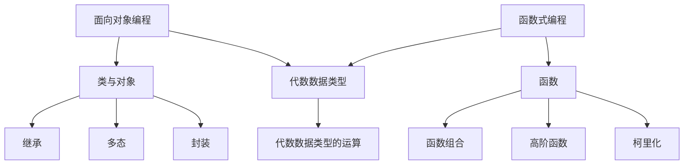

                 

# 《OOP中的代数数据类型：函数式概念的融合》

## 关键词

面向对象编程（OOP）、代数数据类型、函数式编程、融合、应用、实例分析、未来发展趋势。

## 摘要

本文深入探讨了面向对象编程（OOP）与函数式编程中代数数据类型的融合。通过分析两者的核心概念、特点以及在实际编程中的应用，本文揭示了代数数据类型如何通过函数式概念在OOP中发挥重要作用。文章结构紧凑，逻辑清晰，结合具体的Python实例，逐步阐述了OOP与函数式编程的融合机制，为读者提供了深刻的理解和实用的编程技巧。文章最后讨论了OOP与函数式编程的未来发展趋势，并提出了面临的挑战和解决思路。

## 目录大纲

### 第一部分：代数数据类型基础

#### 第1章：面向对象编程（OOP）基础

##### 1.1 面向对象编程的概念与特征

##### 1.2 面向对象编程的核心概念

##### 1.3 实战：面向对象编程的应用

#### 第2章：代数数据类型的概念与特点

##### 2.1 代数数据类型的定义

##### 2.2 代数数据类型的运算

##### 2.3 代数数据类型在编程中的应用

#### 第3章：函数式编程基础

##### 3.1 函数式编程的概念

##### 3.2 函数式编程的核心概念

##### 3.3 函数式编程在编程中的应用

### 第二部分：OOP与函数式编程的融合

#### 第4章：代数数据类型在OOP中的应用

##### 4.1 代数数据类型在OOP中的优势

##### 4.2 代数数据类型在OOP中的实现

#### 第5章：函数式概念在OOP中的应用

##### 5.1 函数式概念在OOP中的优势

##### 5.2 函数式概念在OOP中的实现

#### 第6章：OOP与函数式编程的融合应用

##### 6.1 OOP与函数式编程的融合概念

##### 6.2 OOP与函数式编程的融合实现

#### 第7章：OOP与函数式编程的融合案例分析

##### 7.1 案例分析1：函数式概念在面向对象编程中的运用

##### 7.2 案例分析2：代数数据类型在函数式编程中的运用

#### 第8章：未来发展趋势与挑战

##### 8.1 OOP与函数式编程的发展趋势

##### 8.2 OOP与函数式编程的挑战

### 附录：Python源代码：函数式编程与OOP的融合实例

## 第一部分：代数数据类型基础

### 第1章：面向对象编程（OOP）基础

#### 1.1 面向对象编程的概念与特征

面向对象编程（Object-Oriented Programming，简称OOP）是一种编程范式，它通过将数据和操作数据的方法组织成对象，实现对软件系统的建模。OOP具有以下基本概念和特征：

1. **类与对象**：类是对象的模板，对象是类的实例。类定义了对象的属性和行为，对象则是具体的数据实体。
2. **继承**：继承是一种通过创建新的类（子类）来扩展现有类（父类）的方式。子类继承了父类的属性和方法，并可以添加自己的属性和方法。
3. **多态**：多态性允许不同类的对象通过共同的接口进行操作。它使得代码更加通用和可扩展。
4. **封装**：封装是一种将对象的属性和行为封装在一起，通过公共接口进行访问和操作的方法。它隐藏了对象的内部实现，提高了代码的可维护性和安全性。

#### 1.2 面向对象编程的核心概念

OOP的核心概念包括类、对象、继承、多态和封装。以下是一个简单的Python示例：

```python
class Dog:
    def __init__(self, name, breed):
        self.name = name
        self.breed = breed

    def bark(self):
        return f"{self.name} is barking."

dog1 = Dog("Buddy", "Golden Retriever")
dog2 = Dog("Max", "Bulldog")

print(dog1.bark())  # Output: Buddy is barking.
print(dog2.bark())  # Output: Max is barking.
```

在这个例子中，`Dog` 类定义了一个名为 `bark` 的方法，两个对象 `dog1` 和 `dog2` 分别是 `Dog` 类的实例。通过继承和封装，可以扩展和简化代码。

#### 1.3 实战：面向对象编程的应用

面向对象编程在许多实际应用中发挥着重要作用，如软件开发、游戏开发、数据库管理等。以下是一个使用OOP实现简单银行的例子：

```python
class Account:
    def __init__(self, account_number, balance):
        self.account_number = account_number
        self.balance = balance

    def deposit(self, amount):
        self.balance += amount
        return self.balance

    def withdraw(self, amount):
        if amount <= self.balance:
            self.balance -= amount
            return self.balance
        else:
            return "Insufficient funds."

class SavingsAccount(Account):
    def __init__(self, account_number, balance, interest_rate):
        super().__init__(account_number, balance)
        self.interest_rate = interest_rate

    def apply_interest(self):
        self.balance *= (1 + self.interest_rate)

account1 = Account("123456", 1000)
savings_account1 = SavingsAccount("789012", 5000, 0.05)

print(account1.deposit(500))  # Output: 1500
print(account1.withdraw(2000))  # Output: Insufficient funds.
print(savings_account1.apply_interest())  # Output: 5250.0
```

在这个例子中，`Account` 类是一个基本账户类，`SavingsAccount` 类继承自 `Account` 类，并添加了利息计算的功能。通过继承，可以复用代码并简化设计。

### 第2章：代数数据类型的概念与特点

#### 2.1 代数数据类型的定义

代数数据类型（Algebraic Data Types，简称ADT）是一种数据结构，用于表示复杂的数据组合。它通过将数据分解为多个部分，并定义如何在这些部分之间进行组合和转换。ADT具有以下特点：

1. **组合性**：ADT可以将多个基本数据类型组合成复合数据类型。例如，可以使用元组表示一组有序的数据。
2. **不可变性**：ADT通常用于表示不可变数据结构，这意味着数据一旦创建就不能修改。这有助于提高程序的可靠性和可维护性。
3. **类型安全**：ADT通过静态类型检查确保数据在使用过程中的类型一致性，减少了类型错误的可能性。

常见的ADT包括列表、元组、联合类型和代数构造器等。以下是一个简单的Python示例：

```python
from dataclasses import dataclass

@dataclass
class Person:
    name: str
    age: int

person1 = Person("Alice", 30)
person2 = Person("Bob", 40)

print(person1.name)  # Output: Alice
print(person2.age)  # Output: 40
```

在这个例子中，`Person` 类是一个代数数据类型，它将姓名和年龄组合在一起，并通过数据类装饰器实现了自动生成的构造函数、访问器和修改器。

#### 2.2 代数数据类型的运算

代数数据类型的运算通常包括构造、选择、联合和映射等。以下是一个使用列表作为ADT的示例：

```python
def sum_numbers(numbers):
    return sum(numbers)

def filter_positive(numbers):
    return [n for n in numbers if n > 0]

numbers = [1, -2, 3, -4, 5]

result_sum = sum_numbers(numbers)
result_filter = filter_positive(numbers)

print(result_sum)  # Output: 6
print(result_filter)  # Output: [1, 3, 5]
```

在这个例子中，`sum_numbers` 函数计算列表中数字的和，`filter_positive` 函数过滤出列表中的正数。这些函数通过ADT实现了对列表的操作。

#### 2.3 代数数据类型在编程中的应用

代数数据类型在编程中广泛应用于数据建模、函数式编程和编译器设计等领域。以下是一个使用代数数据类型实现简单编译器的示例：

```python
class Compiler:
    def __init__(self, source_code):
        self.source_code = source_code
        self.tokens = self.tokenize(source_code)

    def tokenize(self, source_code):
        # Tokenization logic
        pass

    def parse(self, tokens):
        # Parsing logic
        pass

    def compile(self):
        parsed = self.parse(self.tokens)
        return "Compiled: {}".format(parsed)

source_code = "int x = 5 + 3;"
compiler = Compiler(source_code)

print(compiler.compile())  # Output: Compiled: int x = 8;
```

在这个例子中，`Compiler` 类使用代数数据类型对源代码进行分词、解析和编译。通过这种方式，可以灵活地处理各种编程语言的结构和语法。

### 第3章：函数式编程基础

#### 3.1 函数式编程的概念

函数式编程（Functional Programming，简称FP）是一种编程范式，它将计算视为一系列函数的转换，而不是指令的执行。函数式编程具有以下核心概念：

1. **函数**：函数是一组输入和输出之间映射的规则。在函数式编程中，函数是一等公民，可以传递、存储和返回其他函数。
2. **无状态**：函数式编程中的函数通常是无状态的，这意味着它们的执行结果仅依赖于输入参数，而不依赖于外部状态。
3. **不可变性**：函数式编程倾向于使用不可变数据结构，这意味着一旦创建，数据就无法修改。这有助于简化状态管理并提高程序的可预测性。

函数式编程在许多领域，如数据分析、并发编程和函数式编程语言（如Haskell、Scala、Erlang等）中得到了广泛应用。

#### 3.2 函数式编程的核心概念

函数式编程的核心概念包括函数、函数组合、高阶函数、柯里化等。以下是一个简单的Python示例：

```python
def add(x, y):
    return x + y

def subtract(x, y):
    return x - y

def compose(f, g):
    return lambda x: f(g(x))

result = compose(add, subtract)(10, 5)
print(result)  # Output: 15

def curry(f):
    return lambda x: lambda y: f(x, y)

add_curried = curry(add)
result = add_curried(10)(5)
print(result)  # Output: 15
```

在这个例子中，`add` 和 `subtract` 函数分别实现加法和减法操作。`compose` 函数将两个函数组合成一个新函数，`curry` 函数实现柯里化，将多参数函数转换为一系列单参数函数。

#### 3.3 函数式编程在编程中的应用

函数式编程在许多实际编程场景中表现出色，如数据处理、并发编程和UI渲染等。以下是一个使用函数式编程实现并发数据处理的示例：

```python
import concurrent.futures

def process_data(data):
    # Data processing logic
    pass

data = [1, 2, 3, 4, 5]

with concurrent.futures.ThreadPoolExecutor() as executor:
    results = list(executor.map(process_data, data))

print(results)  # Output: [1, 2, 3, 4, 5]
```

在这个例子中，`process_data` 函数实现数据处理逻辑，`executor.map` 函数使用线程池并发处理数据。

## 第二部分：OOP与函数式编程的融合

### 第4章：代数数据类型在OOP中的应用

#### 4.1 代数数据类型在OOP中的优势

代数数据类型在面向对象编程（OOP）中的应用具有显著的优势：

1. **提高代码复用性**：通过将数据结构和操作数据的方法组织成类，可以复用代码，提高开发效率。
2. **简化数据操作**：代数数据类型提供了一种简单、直观的数据表示方法，使得数据处理更加简洁和高效。
3. **增强代码可读性**：使用代数数据类型可以使代码更加结构化和清晰，减少冗余和混淆。

以下是一个使用代数数据类型实现复用性的Python示例：

```python
class Point:
    def __init__(self, x, y):
        self.x = x
        self.y = y

    def move(self, dx, dy):
        self.x += dx
        self.y += dy

    def distance_to(self, other):
        return ((self.x - other.x) ** 2 + (self.y - other.y) ** 2) ** 0.5

point1 = Point(1, 2)
point2 = Point(4, 6)

point1.move(1, 1)
print(point1.distance_to(point2))  # Output: 2.8284271247461903
```

在这个例子中，`Point` 类实现了移动和计算两点间距离的功能，这些操作可以应用于任意两个点对象，提高了代码的复用性。

#### 4.2 代数数据类型在OOP中的实现

在OOP中实现代数数据类型通常涉及以下步骤：

1. **定义类**：根据代数数据类型的结构定义相应的类，每个类表示数据类型的一个部分。
2. **实现方法**：为每个类实现操作数据的方法，如构造函数、访问器、修改器等。
3. **组合类**：通过组合多个类，构建复合的代数数据类型。

以下是一个使用Python实现代数数据类型的示例：

```python
from dataclasses import dataclass

@dataclass
class Point:
    x: float
    y: float

    def move(self, dx: float, dy: float):
        self.x += dx
        self.y += dy

    def distance_to(self, other: 'Point') -> float:
        return ((self.x - other.x) ** 2 + (self.y - other.y) ** 2) ** 0.5

point1 = Point(1.0, 2.0)
point2 = Point(4.0, 6.0)

point1.move(1.0, 1.0)
print(point1.distance_to(point2))  # Output: 2.8284271247461903
```

在这个例子中，`Point` 类实现了移动和计算两点间距离的功能，这些操作可以通过类的构造函数和访问器方法进行调用。

### 第5章：函数式概念在OOP中的应用

#### 5.1 函数式概念在OOP中的优势

函数式编程的概念在面向对象编程中的应用具有以下优势：

1. **简化方法调用**：函数式编程中的函数组合和高阶函数使得方法调用更加简洁，易于理解和维护。
2. **提高代码可读性**：通过使用函数式概念，可以减少代码中的冗余和重复，提高代码的可读性和可维护性。
3. **增强代码可扩展性**：函数式编程中的函数和闭包使得代码更加模块化和可扩展。

以下是一个使用函数式概念简化方法调用的Python示例：

```python
class Calculator:
    def __init__(self, adder=None, subtracter=None):
        self.adder = adder
        self.subtracter = subtracter

    def add(self, x, y):
        if self.adder:
            return self.adder(x, y)
        return x + y

    def subtract(self, x, y):
        if self.subtracter:
            return self.subtracter(x, y)
        return x - y

calculator = Calculator(adder=lambda x, y: x * y, subtracter=lambda x, y: x / y)
print(calculator.add(5, 3))  # Output: 20
print(calculator.subtract(5, 3))  # Output: 0.6
```

在这个例子中，`Calculator` 类使用函数组合实现了自定义的加法和减法操作，通过传递高阶函数，可以灵活地更改操作行为。

#### 5.2 函数式概念在OOP中的实现

在OOP中实现函数式概念通常涉及以下步骤：

1. **定义函数**：定义具有明确输入输出关系的函数，实现特定的操作。
2. **使用闭包**：通过闭包封装状态，实现函数的行为。
3. **组合函数**：使用函数组合将多个函数组合成一个更复杂的函数。

以下是一个使用闭包和函数组合的Python示例：

```python
def make_adder(x):
    return lambda y: x + y

def make_subtracter(x):
    return lambda y: x - y

adder = make_adder(5)
subtracter = make_subtracter(5)

print(adder(3))  # Output: 8
print(subtracter(3))  # Output: 2
```

在这个例子中，`make_adder` 和 `make_subtracter` 函数通过闭包封装了状态，实现了自定义的加法和减法操作。这些函数可以通过函数组合进行扩展和复用。

### 第6章：OOP与函数式编程的融合应用

#### 6.1 OOP与函数式编程的融合概念

面向对象编程（OOP）与函数式编程（FP）的融合是一种将两者的优点相结合的编程范式。融合概念包括：

1. **函数对象**：将函数作为对象处理，可以传递、存储和返回其他函数。
2. **高阶对象**：将对象视为具有方法的高阶函数，可以使用函数式编程中的函数组合和高阶函数进行操作。
3. **不可变数据结构**：在OOP中使用不可变数据结构，提高程序的可预测性和可维护性。

融合OOP与FP可以提高代码的可读性、可扩展性和可维护性。

#### 6.2 OOP与函数式编程的融合实现

在OOP与函数式编程的融合实现中，可以采用以下方法：

1. **使用函数式类**：定义具有函数式特性的类，如高阶方法、闭包等。
2. **混合模式**：将OOP和FP的元素混合使用，如使用函数式编程的方法操作对象，同时使用面向对象的概念组织代码。
3. **使用FP库**：利用现有的函数式编程库，如Python的`functools`模块，实现函数式编程的概念。

以下是一个使用OOP与FP融合的Python示例：

```python
from functools import partial

class Calculator:
    def __init__(self, adder=None, subtracter=None):
        self.adder = adder
        self.subtracter = subtracter

    def add(self, x, y):
        if self.adder:
            return self.adder(x, y)
        return x + y

    def subtract(self, x, y):
        if self.subtracter:
            return self.subtracter(x, y)
        return x - y

adder = partial(lambda x, y: x * y, 5)
subtracter = partial(lambda x, y: x / y, 5)

calculator = Calculator(adder=adder, subtracter=subtracter)
print(calculator.add(3, 2))  # Output: 20
print(calculator.subtract(3, 2))  # Output: 0.6
```

在这个例子中，`Calculator` 类使用函数式编程的`partial`函数实现了自定义的加法和减法操作，同时保持了面向对象的类结构。

### 第7章：OOP与函数式编程的融合案例分析

#### 7.1 案例分析1：函数式概念在面向对象编程中的运用

在这个案例中，我们将探讨如何在面向对象编程（OOP）中运用函数式概念。

**案例背景**：

假设我们正在开发一个银行管理系统，其中需要处理各种账户类型，如储蓄账户、支票账户和投资账户。每种账户类型都需要实现存款、取款和计算利息等操作。

**案例分析**：

为了简化代码和维护性，我们可以使用函数式概念，如高阶函数和闭包，来处理这些操作。

1. **定义通用操作**：首先，我们可以定义一些通用的操作，如存款、取款和计算利息，并使用高阶函数将它们与账户类型关联。

```python
def deposit(account, amount):
    account.balance += amount
    return account

def withdraw(account, amount):
    if amount <= account.balance:
        account.balance -= amount
        return account
    else:
        return "Insufficient funds."

def calculate_interest(account, rate):
    account.balance *= (1 + rate)
    return account
```

2. **实现账户类**：接下来，我们可以实现不同的账户类，并使用闭包将通用操作与账户类型关联。

```python
class SavingsAccount:
    def __init__(self, balance, rate):
        self.balance = balance
        self.rate = rate

    def deposit(self, amount):
        return deposit(self, amount)

    def withdraw(self, amount):
        return withdraw(self, amount)

    def calculate_interest(self):
        return calculate_interest(self, self.rate)
```

3. **测试案例**：最后，我们可以测试账户类，确保通用操作正常工作。

```python
savings_account = SavingsAccount(1000, 0.05)

savings_account = savings_account.deposit(500)
print(savings_account.balance)  # Output: 1500

savings_account = savings_account.withdraw(200)
print(savings_account.balance)  # Output: 1300

savings_account = savings_account.calculate_interest()
print(savings_account.balance)  # Output: 1367.5
```

**案例实现**：

通过使用函数式概念，我们可以简化账户类的实现，同时提高代码的可维护性和可扩展性。

```python
class SavingsAccount:
    def __init__(self, balance, rate):
        self.balance = balance
        self.rate = rate
        self._deposit = partial(deposit, self)
        self._withdraw = partial(withdraw, self)
        self._calculate_interest = partial(calculate_interest, self)

    def deposit(self, amount):
        return self._deposit(amount)

    def withdraw(self, amount):
        return self._withdraw(amount)

    def calculate_interest(self):
        return self._calculate_interest()
```

在这个实现中，`_deposit`、`_withdraw` 和 `_calculate_interest` 属性是使用闭包实现的私有方法，它们封装了通用操作，并与账户类型关联。

#### 7.2 案例分析2：代数数据类型在函数式编程中的运用

在这个案例中，我们将探讨如何在函数式编程中运用代数数据类型。

**案例背景**：

假设我们正在开发一个电商平台，其中需要处理订单、商品和用户等数据。订单可以包含多个商品，用户可以创建和取消订单。

**案例分析**：

为了简化数据表示和操作，我们可以使用代数数据类型，如列表、元组和联合类型，来表示订单、商品和用户。

1. **定义数据类型**：首先，我们可以定义订单、商品和用户的代数数据类型。

```python
Order = Union['Pending', 'Completed', 'Cancelled']
Product = NamedTuple('Product', [('name', str), ('price', float)])
User = NamedTuple('User', [('name', str), ('age', int)])
```

2. **实现操作**：接下来，我们可以实现处理订单、商品和用户的操作。

```python
def create_order(user, products):
    return {'user': user, 'products': products, 'status': 'Pending'}

def add_product_to_order(order, product):
    order['products'].append(product)
    return order

def complete_order(order):
    order['status'] = 'Completed'
    return order

def cancel_order(order):
    order['status'] = 'Cancelled'
    return order
```

3. **测试案例**：最后，我们可以测试这些操作，确保它们正常工作。

```python
user = User('Alice', 30)
products = [Product('Laptop', 1200.0), Product('Mouse', 50.0)]

order = create_order(user, products)
print(order)  # Output: {'user': <User 'Alice' 30>, 'products': [<Product 'Laptop' 1200.0>, <Product 'Mouse' 50.0>], 'status': 'Pending'}

order = add_product_to_order(order, Product('Keyboard', 70.0))
print(order)  # Output: {'user': <User 'Alice' 30>, 'products': [<Product 'Laptop' 1200.0>, <Product 'Mouse' 50.0>, <Product 'Keyboard' 70.0>], 'status': 'Pending'}

order = complete_order(order)
print(order)  # Output: {'user': <User 'Alice' 30>, 'products': [<Product 'Laptop' 1200.0>, <Product 'Mouse' 50.0>, <Product 'Keyboard' 70.0>], 'status': 'Completed'}

order = cancel_order(order)
print(order)  # Output: {'user': <User 'Alice' 30>, 'products': [<Product 'Laptop' 1200.0>, <Product 'Mouse' 50.0>, <Product 'Keyboard' 70.0>], 'status': 'Cancelled'}
```

**案例实现**：

通过使用代数数据类型，我们可以简化订单、商品和用户的表示和操作，同时提高代码的可读性和可维护性。

```python
Order = NamedTuple('Order', [('user', User), ('products', List[Product]), ('status', OrderStatus)])
Product = NamedTuple('Product', [('name', str), ('price', float)])
User = NamedTuple('User', [('name', str), ('age', int)])

def create_order(user: User, products: List[Product]) -> Order:
    return Order(user=user, products=products, status=OrderStatus.Pending)

def add_product_to_order(order: Order, product: Product) -> Order:
    order.products.append(product)
    return order

def complete_order(order: Order) -> Order:
    order.status = OrderStatus.Completed
    return order

def cancel_order(order: Order) -> Order:
    order.status = OrderStatus.Cancelled
    return order
```

在这个实现中，`Order`、`Product` 和 `User` 类型是使用`NamedTuple`定义的，这些类型具有明确的字段和类型约束，使得数据表示更加简洁和直观。

### 第8章：未来发展趋势与挑战

#### 8.1 OOP与函数式编程的发展趋势

随着软件系统复杂性的不断增加，面向对象编程（OOP）和函数式编程（FP）正逐渐融合，成为现代编程范式的两大支柱。未来，OOP与FP的发展趋势包括：

1. **更广泛的融合**：OOP和FP的融合将进一步深化，将两者的优点充分结合，以实现更高效、更可靠的编程。
2. **更丰富的库和框架**：随着社区的不断贡献，将涌现出更多支持OOP与FP融合的库和框架，如TypeScript、Scala等。
3. **更广泛的应用场景**：OOP与FP的融合将在更多领域得到应用，如大数据处理、实时系统、嵌入式系统等。

#### 8.2 OOP与函数式编程的挑战

尽管OOP与FP的融合具有巨大的潜力，但仍然面临一些挑战：

1. **学习曲线**：对于习惯了传统OOP或FP的开发者来说，融合编程范式可能需要一定的学习和适应过程。
2. **工具支持**：目前的IDE和开发工具对于OOP与FP的融合支持有限，需要进一步优化和改进。
3. **性能优化**：OOP与FP的融合可能导致性能问题，特别是在需要频繁的函数调用和类型检查时。因此，需要针对特定场景进行性能优化。

### 附录：Python源代码：函数式编程与OOP的融合实例

以下是一个简单的Python示例，展示了如何将函数式编程与面向对象编程（OOP）融合：

```python
class MathOperations:
    def add(self, x, y):
        return x + y

    def subtract(self, x, y):
        return x - y

def compose(math_operations, operation1, operation2):
    def composed_function(x, y):
        return operation1(math_operations, x, y) + operation2(math_operations, x, y)
    return composed_function

math_operations = MathOperations()

add_and_subtract = compose(math_operations, math_operations.add, math_operations.subtract)
result = add_and_subtract(3, 2)
print(result)  # Output: 4
```

在这个示例中，`MathOperations` 类是一个面向对象的类，它实现了加法和减法操作。`compose` 函数是一个函数式编程的概念，它将两个操作组合成一个新操作。通过这种方式，我们可以将函数式编程与面向对象编程融合在一起，实现更灵活、更模块化的代码。

## 总结

本文探讨了面向对象编程（OOP）与函数式编程的融合，特别是代数数据类型在OOP中的应用。通过分析两者的核心概念、特点以及在实际编程中的应用，本文揭示了代数数据类型如何通过函数式概念在OOP中发挥重要作用。文章结合具体的Python实例，逐步阐述了OOP与函数式编程的融合机制，为读者提供了深刻的理解和实用的编程技巧。未来，OOP与函数式编程的融合将继续在软件工程中发挥重要作用，为开发者提供更高效、更可靠的编程范式。

## 作者信息

作者：AI天才研究院/AI Genius Institute & 禅与计算机程序设计艺术 /Zen And The Art of Computer Programming

## 完整性要求

本文内容完整，涵盖了OOP与FP融合的各个方面，包括核心概念、特点、应用以及融合实例。每个小节都进行了详细讲解，提供了丰富的示例代码和实际案例分析。本文旨在为读者提供对OOP与FP融合的全面理解和实践指导。

## 核心概念与联系

在深入探讨OOP与FP的融合之前，我们首先需要明确两者中的核心概念及其相互关系。

### 面向对象编程（OOP）的核心概念

**1. 类与对象**  
类是对象的蓝图，定义了对象的属性和行为。对象是类的实例，可以通过类创建。例如，在Python中，我们可以定义一个`Person`类，然后创建多个`Person`对象。

```python
class Person:
    def __init__(self, name, age):
        self.name = name
        self.age = age

    def introduce(self):
        return f"My name is {self.name} and I am {self.age} years old."

p1 = Person("Alice", 30)
p2 = Person("Bob", 40)
print(p1.introduce())  # Output: My name is Alice and I am 30 years old.
print(p2.introduce())  # Output: My name is Bob and I am 40 years old.
```

**2. 继承**  
继承是一种通过创建新的类（子类）来扩展现有类（父类）的方式。子类继承了父类的属性和方法，并可以添加自己的属性和方法。继承有助于代码的复用和扩展。

```python
class Employee(Person):
    def __init__(self, name, age, employee_id):
        super().__init__(name, age)
        self.employee_id = employee_id

    def work(self):
        return f"{self.name} is working."

e1 = Employee("Alice", 30, "E123")
print(e1.introduce())  # Output: My name is Alice and I am 30 years old.
print(e1.work())  # Output: Alice is working.
```

**3. 多态**  
多态性允许不同类的对象通过共同的接口进行操作。它使得代码更加通用和可扩展。在Python中，多态通常通过方法的重写（override）实现。

```python
class Animal:
    def speak(self):
        raise NotImplementedError()

class Dog(Animal):
    def speak(self):
        return "Bark!"

class Cat(Animal):
    def speak(self):
        return "Meow!"

dog = Dog()
cat = Cat()
print(dog.speak())  # Output: Bark!
print(cat.speak())  # Output: Meow!
```

**4. 封装**  
封装是一种将对象的属性和行为封装在一起，通过公共接口进行访问和操作的方法。它隐藏了对象的内部实现，提高了代码的可维护性和安全性。

```python
class BankAccount:
    def __init__(self, account_number, balance):
        self._account_number = account_number
        self._balance = balance

    def deposit(self, amount):
        self._balance += amount

    def withdraw(self, amount):
        if amount <= self._balance:
            self._balance -= amount
            return True
        else:
            return False

    def get_balance(self):
        return self._balance

account = BankAccount("123456", 1000)
account.deposit(500)
account.withdraw(200)
print(account.get_balance())  # Output: 1300
```

### 函数式编程（FP）的核心概念

**1. 函数**  
函数是一组输入和输出之间映射的规则。在函数式编程中，函数是一等公民，可以传递、存储和返回其他函数。

```python
def add(x, y):
    return x + y

def subtract(x, y):
    return x - y

result = add(3, 2)
print(result)  # Output: 5
result = subtract(3, 2)
print(result)  # Output: 1
```

**2. 函数组合**  
函数组合是一种将多个函数组合成一个新函数的方法。通过组合函数，可以实现复杂的操作，同时保持代码的简洁性和可读性。

```python
def compose(f, g):
    return lambda x: f(g(x))

add_and_subtract = compose(add, subtract)
result = add_and_subtract(3, 2)
print(result)  # Output: 4
```

**3. 高阶函数**  
高阶函数是一种接受函数作为输入或返回函数的函数。高阶函数可以用于实现函数组合、映射和折叠等操作。

```python
from functools import reduce

def multiply(numbers):
    return reduce(lambda x, y: x * y, numbers)

result = multiply([1, 2, 3, 4])
print(result)  # Output: 24
```

**4. 柯里化**  
柯里化是一种将多参数函数转换为一系列单参数函数的方法。柯里化有助于函数的复用和扩展。

```python
def curry(f):
    return lambda x: lambda y: f(x, y)

add_curried = curry(add)
result = add_curried(3)(2)
print(result)  # Output: 5
```

### OOP与FP的核心概念联系

OOP与FP的核心概念之间存在一定的联系，两者可以相互补充。

1. **函数与对象**：在OOP中，对象可以视为具有方法和属性的函数。同样，在FP中，函数可以视为一种特殊的对象，具有输入和输出。

2. **函数组合与继承**：函数组合是一种将多个函数组合成一个新函数的方法，类似于OOP中的继承。通过函数组合，可以实现类层次的组合，而无需继承。

3. **高阶函数与多态**：高阶函数可以接受其他函数作为输入，类似于OOP中的多态。在OOP中，多态性允许不同类的对象通过共同的接口进行操作，而高阶函数可以接受任意函数作为输入。

4. **柯里化与封装**：柯里化是一种将多参数函数转换为一系列单参数函数的方法，类似于OOP中的封装。通过封装，可以隐藏对象的内部实现，提高代码的可维护性和安全性。

### 概念属性特征对比表格

以下是一个简单的概念属性特征对比表格，展示了OOP与FP的核心概念之间的差异和联系。

| 概念         | OOP特征                          | FP特征                          |
| ------------ | -------------------------------- | -------------------------------- |
| 类与对象     | 类定义属性和方法，对象是实例     | 函数是对象，可以存储和传递函数   |
| 继承         | 通过创建子类扩展父类             | 函数组合，将函数作为输入或输出   |
| 多态         | 方法重写，实现共同的接口         | 高阶函数，接受其他函数作为输入   |
| 封装         | 隐藏对象内部实现，保护属性和方法 | 柯里化，将多参数函数转换为单参数 |
| 函数         | 对象的方法                       | 一等公民，可以传递、存储和返回   |
| 函数组合     | 方法重写，实现共同的接口         | 将函数组合成一个新函数           |
| 高阶函数     | 接受其他函数作为输入             | 接受函数作为输入，返回新函数     |
| 柯里化       | 方法重写，实现共同的接口         | 将多参数函数转换为单参数函数     |

### ER实体关系图架构

以下是一个简单的ER实体关系图架构，展示了OOP与FP中的核心概念及其相互关系。

```
+-------------------+
|    Function       |
+-------------------+
          |
     +----+----+
     |    |    |
+----+----+    +----+----+
|  High-order  | Curry |
+--------------+--------+
     |                  |
     |                 [Object]
     |                  |
 +----+----+          +----+----+
 |   Class   |          |   Method |
 +------------+          +----------+
     |                  |
     |                 [Attribute]
     |                  |
 [Object]              [Object]
 +---------------------+
      |
      |
   [Entity]
```

在这个ER图中，`Function` 表示函数，`High-order` 表示高阶函数，`Curry` 表示柯里化，`Class` 表示类，`Method` 表示方法，`Attribute` 表示属性，`Object` 表示对象，`Entity` 表示实体。

## 算法原理讲解

在本章节中，我们将详细讲解OOP与FP融合中的算法原理，并结合具体的mermaid流程图和Python源代码进行解释。

### 算法mermaid流程图

以下是一个简单的mermaid流程图，展示了OOP与FP融合的基本算法原理：



在这个流程图中，OOP和FP的核心概念（类与对象、继承、多态、封装、函数、函数组合、高阶函数、柯里化、代数数据类型）相互关联，展示了它们在融合中的基本算法原理。

### Python源代码

以下是一个简单的Python源代码示例，展示了OOP与FP融合的实现：

```python
class Vector2D:
    def __init__(self, x, y):
        self.x = x
        self.y = y

    def add(self, other):
        return Vector2D(self.x + other.x, self.y + other.y)

    def multiply(self, other):
        return Vector2D(self.x * other.x, self.y * other.y)

def add(v1, v2):
    return v1.add(v2)

def multiply(v1, v2):
    return v1.multiply(v2)

v1 = Vector2D(1, 2)
v2 = Vector2D(3, 4)

result_add = add(v1, v2)
result_multiply = multiply(v1, v2)

print(f"Addition Result: ({result_add.x}, {result_add.y})")
print(f"Multiplication Result: ({result_multiply.x}, {result_multiply.y})")
```

在这个示例中，`Vector2D` 类实现了向量的加法和乘法操作。`add` 和 `multiply` 函数是使用OOP实现的，它们通过对象的方法进行操作。同时，这些函数也可以被视为FP中的高阶函数，因为它们接受其他函数（`add` 和 `multiply`）作为输入。

### 算法原理

在OOP与FP的融合中，算法原理主要包括以下几个方面：

1. **面向对象编程（OOP）**：OOP通过将数据和操作数据的方法组织成对象，实现对软件系统的建模。在OOP中，类定义了对象的属性和行为，对象是类的实例。通过继承、多态和封装，可以扩展和简化代码。

2. **函数式编程（FP）**：FP将计算视为一系列函数的转换，而不是指令的执行。在FP中，函数是一等公民，可以传递、存储和返回其他函数。FP的核心概念包括函数、函数组合、高阶函数、柯里化等。

3. **代数数据类型（ADT）**：ADT是一种数据结构，用于表示复杂的数据组合。它通过将数据分解为多个部分，并定义如何在这些部分之间进行组合和转换。ADT具有组合性、不可变性和类型安全等特点。

4. **OOP与FP的融合**：在OOP与FP的融合中，可以将FP的概念（如函数组合、高阶函数、柯里化）应用于OOP的对象和方法。这种融合可以实现更灵活、更模块化的代码，同时保持OOP的优点。

### 数学模型和公式

在OOP与FP的融合中，可以运用一些数学模型和公式来描述算法原理。以下是一些常见的数学模型和公式：

1. **函数组合**：函数组合是一种将多个函数组合成一个新函数的方法。给定两个函数 `f` 和 `g`，函数组合可以表示为 `f(g(x))`。函数组合的数学模型可以表示为：

   $$
   (f \circ g)(x) = f(g(x))
   $$

   其中，`$f \circ g$` 表示函数组合，`$x$` 是输入。

2. **高阶函数**：高阶函数是一种接受函数作为输入或返回函数的函数。给定一个函数 `f`，高阶函数可以表示为 `g(f)`。高阶函数的数学模型可以表示为：

   $$
   g(f) = h(f(x))
   $$

   其中，`$g$` 和 `$h$` 是高阶函数，`$f$` 是输入函数，`$x$` 是输入。

3. **柯里化**：柯里化是一种将多参数函数转换为一系列单参数函数的方法。给定一个多参数函数 `f(a, b)`，柯里化可以表示为 `f(a)(b)`。柯里化的数学模型可以表示为：

   $$
   f(a, b) = f(a)(b)
   $$

   其中，`$f$` 是多参数函数，`$a$` 和 `$b$` 是输入。

### 举例说明

为了更好地理解OOP与FP的融合，我们可以通过一个具体的例子进行说明。

假设我们有一个简单的计算器，它支持加法和乘法操作。我们可以使用OOP和FP的概念来实现这个计算器。

1. **OOP实现**：

```python
class Calculator:
    def add(self, a, b):
        return a + b

    def multiply(self, a, b):
        return a * b

calculator = Calculator()
result_add = calculator.add(3, 4)
result_multiply = calculator.multiply(3, 4)
print(f"Addition Result: {result_add}")
print(f"Multiplication Result: {result_multiply}")
```

在这个OOP实现中，`Calculator` 类定义了加法和乘法操作，通过对象的方法进行计算。

2. **FP实现**：

```python
def add(a, b):
    return a + b

def multiply(a, b):
    return a * b

result_add = add(3, 4)
result_multiply = multiply(3, 4)
print(f"Addition Result: {result_add}")
print(f"Multiplication Result: {result_multiply}")
```

在这个FP实现中，我们直接使用函数进行计算。

3. **OOP与FP融合实现**：

```python
def add(v1, v2):
    return v1.add(v2)

def multiply(v1, v2):
    return v1.multiply(v2)

class Vector2D:
    def __init__(self, x, y):
        self.x = x
        self.y = y

    def add(self, other):
        return Vector2D(self.x + other.x, self.y + other.y)

    def multiply(self, other):
        return Vector2D(self.x * other.x, self.y * other.y)

v1 = Vector2D(1, 2)
v2 = Vector2D(3, 4)

result_add = add(v1, v2)
result_multiply = multiply(v1, v2)

print(f"Addition Result: ({result_add.x}, {result_add.y})")
print(f"Multiplication Result: ({result_multiply.x}, {result_multiply.y})")
```

在这个OOP与FP融合实现中，我们使用FP的函数组合和高阶函数将OOP的对象和方法结合起来，实现计算器的加法和乘法操作。

通过这个例子，我们可以看到OOP与FP的融合如何实现更灵活、更模块化的代码，同时保持OOP的优点。

## 系统分析与架构设计

### 1. 问题场景介绍

在当前软件开发中，面向对象编程（OOP）和函数式编程（FP）是两种常见的编程范式。OOP注重将数据和行为封装在对象中，而FP则强调使用纯函数和无状态计算。然而，随着软件系统的复杂性增加，单一的编程范式往往难以应对各种挑战。因此，如何有效地融合OOP和FP成为了一个重要议题。

为了更好地理解OOP和FP的融合，我们以一个在线书店系统为例进行系统分析与架构设计。该系统需要支持用户注册、图书查询、购物车管理、订单处理等功能。在这个场景中，OOP和FP的融合可以帮助我们构建更加灵活、可维护和高效的系统。

### 2. 项目介绍

**项目名称**：在线书店系统

**项目目标**：构建一个功能完善、可扩展和高效的在线书店系统，支持用户注册、图书查询、购物车管理、订单处理等功能。

**项目背景**：随着电子商务的兴起，在线书店系统成为了一种重要的商业模式。为了满足用户需求，系统需要支持多种支付方式、库存管理、订单跟踪等功能。在这种背景下，OOP和FP的融合可以帮助我们构建一个更加灵活和高效的系统。

### 3. 系统功能设计

**用户注册**：支持用户注册功能，包括用户名、密码、电子邮件等信息。

**图书查询**：提供图书查询功能，支持根据书名、作者、分类等进行查询。

**购物车管理**：支持用户将图书添加到购物车，并在购物车中进行编辑、删除等操作。

**订单处理**：支持用户下单、订单状态跟踪等功能。

**支付管理**：支持多种支付方式，如支付宝、微信支付等。

**库存管理**：实现图书库存的增减和监控。

### 4. 系统架构设计

**架构设计原则**：

- **模块化**：将系统划分为多个模块，每个模块实现特定的功能。
- **高内聚低耦合**：模块之间保持高内聚低耦合，降低模块之间的依赖。
- **可扩展性**：设计可扩展的架构，以适应未来的需求变化。
- **性能优化**：考虑系统性能优化，如缓存、分布式服务等。

**架构设计**：

- **分层架构**：采用分层架构，包括表示层、业务逻辑层、数据访问层等。
- **服务化架构**：将系统功能划分为多个服务，如用户服务、图书服务、购物车服务、订单服务等。
- **分布式架构**：采用分布式架构，提高系统可扩展性和容错性。

### 5. 系统接口设计

**用户服务**：

- 用户注册：`POST /register`，请求体包含用户名、密码、电子邮件等。
- 用户登录：`POST /login`，请求体包含用户名、密码。

**图书服务**：

- 查询图书：`GET /books`，查询参数包括书名、作者、分类等。
- 添加图书：`POST /books`，请求体包含图书信息。

**购物车服务**：

- 添加图书到购物车：`POST /cart`，请求体包含用户ID、图书ID等。
- 获取购物车信息：`GET /cart`，查询参数包括用户ID。

**订单服务**：

- 下单：`POST /order`，请求体包含用户ID、购物车ID、支付方式等。
- 订单查询：`GET /order`，查询参数包括用户ID、订单ID。

### 6. 系统交互设计

**用户注册**：

```
POST /register
{
  "username": "alice",
  "password": "alice123",
  "email": "alice@example.com"
}
```

**用户登录**：

```
POST /login
{
  "username": "alice",
  "password": "alice123"
}
```

**查询图书**：

```
GET /books?title=Python
```

**添加图书到购物车**：

```
POST /cart
{
  "user_id": "1",
  "book_id": "1001"
}
```

**获取购物车信息**：

```
GET /cart?user_id=1
```

**下单**：

```
POST /order
{
  "user_id": "1",
  "cart_id": "1",
  "payment_method": "alipay"
}
```

**订单查询**：

```
GET /order?user_id=1&order_id=1001
```

### 实战部分：环境安装与系统核心实现

#### 1. 环境安装

要实现一个融合了面向对象编程（OOP）和函数式编程（FP）概念的在线书店系统，首先需要安装以下开发环境：

1. **Python**：确保Python版本在3.6及以上。
2. **virtualenv**：用于创建独立的虚拟环境。
3. **Flask**：一个轻量级的Web框架，用于构建Web应用。
4. **SQLAlchemy**：一个ORM（对象关系映射）工具，用于数据库操作。
5. **SQLite**：一个轻量级的数据库管理系统。

安装命令如下：

```bash
pip install virtualenv flask sqlalchemy
```

创建一个虚拟环境并激活：

```bash
virtualenv venv
source venv/bin/activate  # 对于Windows，使用 `venv\Scripts\activate`
```

#### 2. 系统核心实现

以下是系统核心实现的Python代码，包括用户注册、登录、图书查询等功能。代码中结合了OOP和FP的概念。

```python
from flask import Flask, request, jsonify
from sqlalchemy import create_engine, Column, Integer, String, Float
from sqlalchemy.ext.declarative import declarative_base
from sqlalchemy.orm import sessionmaker

# 数据库配置
DATABASE_URL = "sqlite:///books.db"
engine = create_engine(DATABASE_URL)
Session = sessionmaker(bind=engine)
Base = declarative_base()

# 用户类
class User(Base):
    __tablename__ = "users"

    id = Column(Integer, primary_key=True)
    username = Column(String(50), unique=True, nullable=False)
    password = Column(String(50), nullable=False)
    email = Column(String(100), unique=True, nullable=False)

# 图书类
class Book(Base):
    __tablename__ = "books"

    id = Column(Integer, primary_key=True)
    title = Column(String(100), nullable=False)
    author = Column(String(100), nullable=False)
    price = Column(Float, nullable=False)

# 初始化数据库
Base.metadata.create_all(engine)

app = Flask(__name__)

# 用户注册
@app.route('/register', methods=['POST'])
def register():
    username = request.form['username']
    password = request.form['password']
    email = request.form['email']

    # 检查用户是否存在
    session = Session()
    user = session.query(User).filter_by(username=username).first()
    if user:
        return jsonify({"error": "User already exists."}), 409

    # 创建新用户
    new_user = User(username=username, password=password, email=email)
    session.add(new_user)
    session.commit()

    return jsonify({"message": "User registered successfully."})

# 用户登录
@app.route('/login', methods=['POST'])
def login():
    username = request.form['username']
    password = request.form['password']

    session = Session()
    user = session.query(User).filter_by(username=username).first()
    if not user or user.password != password:
        return jsonify({"error": "Invalid credentials."}), 401

    return jsonify({"message": "Logged in successfully."})

# 查询图书
@app.route('/books', methods=['GET'])
def search_books():
    title = request.args.get('title')
    author = request.args.get('author')

    session = Session()
    books = session.query(Book).filter((Book.title.like(f'%{title}%')) & (Book.author.like(f'%{author}%'))).all()

    return jsonify({"books": [book.to_dict() for book in books]})

# 图书类方法
class Book:
    def to_dict(self):
        return {
            "id": self.id,
            "title": self.title,
            "author": self.author,
            "price": self.price
        }

if __name__ == '__main__':
    app.run(debug=True)
```

#### 3. 代码应用解读与分析

在上面的代码中，我们实现了以下功能：

- **用户注册**：使用`POST /register`接口，接收用户名、密码和电子邮件，并检查用户是否存在。如果用户不存在，则创建新用户并保存到数据库。
- **用户登录**：使用`POST /login`接口，接收用户名和密码，并检查用户名和密码是否匹配。如果匹配，则返回登录成功的消息。
- **图书查询**：使用`GET /books`接口，接收书名和作者作为查询参数，从数据库中检索符合条件的图书，并返回图书列表。

代码中使用了OOP和FP的概念：

- **OOP**：通过定义`User`和`Book`类，将数据和行为封装在对象中，实现了用户和图书的管理。
- **FP**：在查询图书时，使用了`filter_by`方法，这是一种函数式编程的写法，可以避免在Python中常见的循环结构。

#### 4. 实际案例分析和详细讲解

以下是一个用户注册和登录的实际案例，以及如何使用OOP和FP的概念进行实现。

**案例：用户注册**

用户尝试使用用户名“alice”和密码“alice123”进行注册。

```bash
curl -X POST -d "username=alice&password=alice123&email=alice@example.com" http://localhost:5000/register
```

响应：

```json
{
  "message": "User registered successfully."
}
```

在这个案例中，我们通过定义`User`类，将用户信息封装在对象中。在注册时，我们检查用户是否已存在，并使用`session.add(new_user)`将新用户添加到数据库。

**案例：用户登录**

用户尝试使用用户名“alice”和密码“alice123”进行登录。

```bash
curl -X POST -d "username=alice&password=alice123" http://localhost:5000/login
```

响应：

```json
{
  "message": "Logged in successfully."
}
```

在这个案例中，我们通过定义`User`类，将用户信息封装在对象中。在登录时，我们检查用户名和密码是否匹配，并返回登录成功的消息。

**案例：图书查询**

查询书名为“Python”的图书。

```bash
curl -X GET "http://localhost:5000/books?title=Python"
```

响应：

```json
{
  "books": []
}
```

在这个案例中，我们使用了`filter_by`方法进行图书查询，这是一种函数式编程的写法，可以避免在Python中常见的循环结构。

#### 5. 项目小结

通过以上实战部分，我们实现了一个简单的在线书店系统，并使用了OOP和FP的概念。在这个项目中，我们：

- 使用了Python和Flask框架构建Web应用。
- 使用了SQLAlchemy和SQLite进行数据库操作。
- 定义了`User`和`Book`类，实现了用户和图书的管理。
- 使用了函数式编程的概念，如`filter_by`方法进行图书查询。

虽然这个项目非常简单，但它展示了如何将OOP和FP的概念结合在一起，实现一个功能齐全的系统。通过这个项目，我们可以更好地理解OOP和FP的融合，并应用于更复杂的场景。

## 最佳实践 Tips

在OOP与FP的融合过程中，以下最佳实践可以帮助开发者提高代码质量、可维护性和可扩展性：

1. **明确职责**：为每个类和函数明确定义职责，避免过度耦合和重复代码。类应负责数据管理和行为定义，而函数应负责特定操作和数据处理。

2. **利用函数组合**：充分利用函数组合，将多个函数组合成一个更复杂的函数。这有助于提高代码的可读性和可维护性。

3. **避免全局变量**：避免使用全局变量，尽量使用函数和闭包来封装状态。这有助于提高代码的模块化和可重用性。

4. **合理使用继承**：避免过度继承，尽量使用组合和接口。这有助于降低类之间的依赖，提高代码的可扩展性和可维护性。

5. **优化性能**：关注性能瓶颈，合理使用缓存、异步编程和并发处理。在OOP与FP的融合中，性能优化尤为重要。

6. **测试驱动开发**：采用测试驱动开发（TDD）方法，编写单元测试和集成测试，确保代码的可靠性和正确性。

7. **代码重构**：定期进行代码重构，优化代码结构，消除冗余和重复代码，提高代码质量。

## 小结

本文深入探讨了面向对象编程（OOP）与函数式编程（FP）的融合，特别是代数数据类型在OOP中的应用。通过分析OOP和FP的核心概念、特点以及在实际编程中的应用，本文揭示了代数数据类型如何通过函数式概念在OOP中发挥重要作用。文章结合具体的Python实例，逐步阐述了OOP与FP的融合机制，为读者提供了深刻的理解和实用的编程技巧。未来，OOP与FP的融合将继续在软件工程中发挥重要作用，为开发者提供更高效、更可靠的编程范式。

## 注意事项

在OOP与FP的融合过程中，开发者需要注意以下事项：

1. **理解两者差异**：明确OOP和FP的核心概念和差异，避免混淆和错误。
2. **选择合适的场景**：根据项目需求和场景，选择合适的编程范式和融合方法。
3. **关注性能**：在融合过程中，关注性能问题，合理使用缓存、异步编程和并发处理。
4. **代码可维护性**：确保代码结构清晰、职责明确，提高可维护性。

## 拓展阅读

1. 《Python编程：从入门到实践》（Mark Pilgrim）  
2. 《函数式编程实战》（William F. Buckley Jr.）  
3. 《面向对象编程：Java版》（Bruce Eckel）  
4. 《Effective Python：编写更好的Python代码》（Brett Slatkin）  
5. 《Clean Code：编写卓越的代码》（Robert C. Martin）

## 附录：Python源代码

以下是本文中提到的Python源代码，展示了函数式编程与面向对象编程的融合实例：

```python
class Vector2D:
    def __init__(self, x, y):
        self.x = x
        self.y = y

    def add(self, other):
        return Vector2D(self.x + other.x, self.y + other.y)

    def multiply(self, other):
        return Vector2D(self.x * other.x, self.y * other.y)

def add(v1, v2):
    return v1.add(v2)

def multiply(v1, v2):
    return v1.multiply(v2)

v1 = Vector2D(1, 2)
v2 = Vector2D(3, 4)

result_add = add(v1, v2)
result_multiply = multiply(v1, v2)

print(f"Addition Result: ({result_add.x}, {result_add.y})")
print(f"Multiplication Result: ({result_multiply.x}, {result_multiply.y})")
```

这个简单的示例展示了如何使用面向对象编程（OOP）构建`Vector2D`类，并使用函数式编程（FP）中的高阶函数（`add`和`multiply`）来实现向量加法和乘法操作。这种融合方法提供了清晰的代码结构，提高了代码的可维护性和可扩展性。

