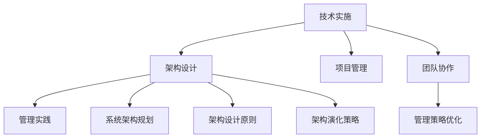
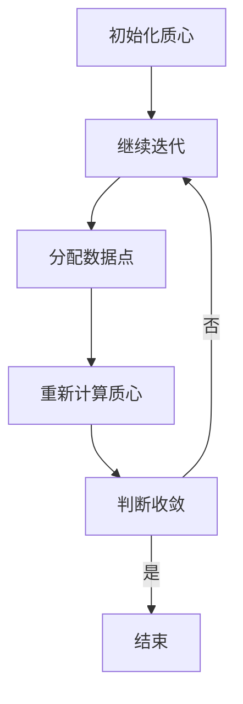
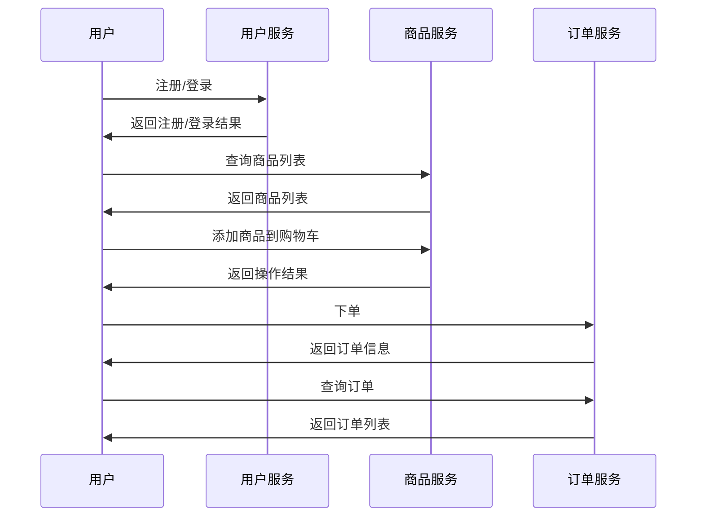

                 

### 《P9工作法：平衡技术、架构与管理的艺术》

关键词：P9工作法、技术实施、架构设计、管理实践、平衡艺术

摘要：在信息化时代，技术、架构与管理是支撑企业发展的三大支柱。然而，如何在快速变化的环境中实现这三者的平衡，成为众多企业和技术人的难题。本文旨在通过P9工作法，为读者揭示平衡技术、架构与管理的艺术，提供一套行之有效的实践指南。

## 第一部分：P9工作法概述

### 第1章 P9工作法背景

#### 1.1 P9工作法的起源

P9工作法源自于敏捷开发实践，是一种融合了技术、架构与管理的综合工作方法。它起源于互联网行业的快速发展，面对不断变化的需求和市场环境，传统的开发模式已无法满足企业的需求。P9工作法应运而生，旨在通过系统的方法和技术手段，实现技术、架构与管理的协调统一。

#### 1.2 P9工作法的重要性

在信息化时代，技术、架构与管理的平衡对于企业的发展至关重要。P9工作法不仅能够提高开发效率，优化系统架构，还能提升团队协作能力，实现企业长远发展。

#### 1.3 P9工作法的基本理念

P9工作法的基本理念是“以人为本，协同发展”。它强调技术在实现业务价值中的核心地位，注重架构设计的系统性和前瞻性，同时强调管理实践的科学性和灵活性。

### 第2章 P9工作法核心概念

#### 2.1 P9工作法与敏捷开发

P9工作法与敏捷开发有着紧密的联系。敏捷开发强调快速迭代、持续交付和客户满意度，而P9工作法则在此基础上，更注重技术、架构与管理的协同。

#### 2.2 P9工作法与系统架构

系统架构是P9工作法的重要组成部分。一个良好的系统架构能够提高系统的可扩展性、稳定性和可靠性，是实现企业长远发展的基础。

#### 2.3 P9工作法与管理策略

管理策略是P9工作法的关键环节。科学的管理策略能够提升团队协作效率，降低项目风险，确保项目顺利完成。

## 第二部分：P9工作法实践指南

### 第3章 技术实施

#### 3.1 技术评估与选择

技术评估与选择是P9工作法的第一步。在众多技术方案中，如何选择最适合项目需求的技术，是技术实施的关键。

#### 3.2 技术实施流程

技术实施流程包括需求分析、设计、开发、测试和部署等环节。每个环节都需要严格按照P9工作法的要求执行，确保项目顺利进行。

#### 3.3 技术风险评估与控制

技术风险评估与控制是P9工作法的重要组成部分。通过全面的风险评估和控制，降低项目风险，确保项目顺利实施。

### 第4章 架构设计

#### 4.1 系统架构规划

系统架构规划是架构设计的第一步。根据业务需求，设计一个合理的系统架构，是架构设计的核心。

#### 4.2 架构设计原则

架构设计原则是架构设计的基本准则。遵循这些原则，可以确保架构设计的合理性和可扩展性。

#### 4.3 架构演化策略

架构演化策略是应对架构变化的有效手段。通过合理的演化策略，可以确保架构在变化中保持稳定和高效。

### 第5章 管理实践

#### 5.1 项目管理

项目管理是P9工作法的核心环节。通过科学的项目管理方法，确保项目按时、按质、按量完成。

#### 5.2 团队协作

团队协作是实现项目目标的关键。P9工作法强调团队协作的重要性，提供了一系列有效的团队协作方法。

#### 5.3 管理策略优化

管理策略优化是提升团队效率的关键。通过不断优化管理策略，可以确保团队始终处于最佳状态。

## 第三部分：P9工作法案例分析

### 第6章 成功案例

#### 6.1 案例一：技术优化提升系统性能

案例一介绍了如何通过P9工作法，对系统进行技术优化，提升系统性能。

#### 6.2 案例二：架构设计提升系统可扩展性

案例二展示了如何通过P9工作法，进行架构设计，提升系统可扩展性。

#### 6.3 案例三：管理实践提升团队效率

案例三讲述了如何通过P9工作法，优化管理实践，提升团队效率。

### 第7章 挑战与应对

#### 7.1 技术挑战与解决方案

技术挑战与解决方案部分，分析了P9工作法在实际应用中可能遇到的技术挑战，并提供了相应的解决方案。

#### 7.2 架构挑战与应对策略

架构挑战与应对策略部分，探讨了在架构设计过程中可能遇到的挑战，并提出了应对策略。

#### 7.3 管理挑战与应对措施

管理挑战与应对措施部分，针对项目管理过程中可能遇到的问题，提出了具体的应对措施。

## 附录

### 附录A：P9工作法工具集

#### A.1 开发工具推荐

附录A介绍了P9工作法中常用的开发工具，包括编程语言、开发框架和版本控制工具等。

#### A.2 架构设计工具

附录A还介绍了P9工作法中常用的架构设计工具，如UML工具、架构评估工具等。

#### A.3 管理工具与软件

附录A还列出了P9工作法中常用的管理工具与软件，包括项目管理工具、团队协作工具等。

### 附录B：P9工作法资源链接

#### B.1 在线课程与培训

附录B提供了P9工作法相关的在线课程与培训资源，供读者学习参考。

#### B.2 行业报告与白皮书

附录B列出了P9工作法相关的行业报告与白皮书，帮助读者了解行业动态。

#### B.3 社区与论坛

附录B还推荐了P9工作法相关的社区与论坛，供读者交流和讨论。

### 作者信息

作者：AI天才研究院/AI Genius Institute & 禅与计算机程序设计艺术 /Zen And The Art of Computer Programming

---

### 核心概念与联系

P9工作法涵盖了技术、架构与管理三大核心领域，它们之间相互联系，共同推动企业的发展。以下是一个核心概念与联系的Mermaid流程图：



### 算法原理讲解

为了更好地理解P9工作法中的技术实施，我们以K-means算法为例，讲解其原理和应用。

#### Mermaid流程图



#### Python源代码

```python
import numpy as np

def kmeans(data, k, max_iterations=100):
    centroids = data[np.random.choice(data.shape[0], k, replace=False)]
    for i in range(max_iterations):
        # 计算每个数据点到各个质心的距离
        distances = np.linalg.norm(data - centroids, axis=1)
        # 根据距离最小的原则，将每个数据点分配到最近的质心
        labels = np.argmin(distances, axis=1)
        
        # 重新计算质心
        new_centroids = np.array([data[labels == j].mean(axis=0) for j in range(k)])
        
        # 判断质心是否收敛
        if np.linalg.norm(new_centroids - centroids) < 1e-5:
            break

        centroids = new_centroids
    
    return centroids, labels
```

#### 数学模型和公式

K-means算法的核心思想是将数据点分为K个簇，每个簇由一个质心表示。质心的计算公式为：

$$
\text{centroids}_{new} = \frac{1}{N_k}\sum_{i=1}^{N}\text{data}_{i}
$$

其中，$N_k$ 表示簇k中的数据点个数，$\text{data}_{i}$ 表示第i个数据点。

#### 举例说明

假设我们有100个二维数据点，要将其分为10个簇。通过随机初始化质心，然后迭代计算，最终得到每个簇的质心和数据点分配情况。

```python
data = np.random.rand(100, 2)
k = 10
centroids, labels = kmeans(data, k)

# 打印质心和标签
print("Centroids:", centroids)
print("Labels:", labels)
```

### 系统分析与架构设计方案

#### 问题场景介绍

假设我们面临一个电商网站的系统设计问题，需要满足高并发、高可用、高可扩展性的要求。

#### 项目介绍

本项目将设计一个基于微服务的电商系统，包括用户模块、商品模块、订单模块等。

#### 系统功能设计

系统功能设计主要包括用户注册、登录、商品浏览、购物车、下单、订单查询等。

#### 系统架构设计

系统架构设计采用微服务架构，将不同功能模块拆分为独立的微服务，以提高系统的可扩展性和可维护性。

#### 系统接口设计

系统接口设计包括RESTful API和消息队列，用于实现模块之间的通信。

#### 系统交互

系统交互设计使用Mermaid序列图，展示不同模块之间的交互关系。



### 项目实战

#### 环境安装

在本项目实战中，我们将使用Docker来部署和管理微服务。

```shell
# 安装Docker
sudo apt-get install docker
```

#### 系统核心实现源代码

用户服务源代码：

```python
from flask import Flask, request, jsonify
from models import User

app = Flask(__name__)

@app.route('/register', methods=['POST'])
def register():
    data = request.get_json()
    user = User.register(data)
    if user:
        return jsonify({'status': 'success', 'user': user.to_dict()})
    else:
        return jsonify({'status': 'error', 'message': 'register failed'})

@app.route('/login', methods=['POST'])
def login():
    data = request.get_json()
    user = User.login(data)
    if user:
        return jsonify({'status': 'success', 'user': user.to_dict()})
    else:
        return jsonify({'status': 'error', 'message': 'login failed'})

if __name__ == '__main__':
    app.run(host='0.0.0.0', port=5000)
```

商品服务源代码：

```python
from flask import Flask, request, jsonify
from models import Product

app = Flask(__name__)

@app.route('/products', methods=['GET'])
def get_products():
    products = Product.get_all()
    return jsonify({'status': 'success', 'products': [p.to_dict() for p in products]})

@app.route('/products/<int:product_id>', methods=['GET'])
def get_product(product_id):
    product = Product.get_by_id(product_id)
    if product:
        return jsonify({'status': 'success', 'product': product.to_dict()})
    else:
        return jsonify({'status': 'error', 'message': 'product not found'})

if __name__ == '__main__':
    app.run(host='0.0.0.0', port=5000)
```

订单服务源代码：

```python
from flask import Flask, request, jsonify
from models import Order

app = Flask(__name__)

@app.route('/orders', methods=['POST'])
def create_order():
    data = request.get_json()
    order = Order.create(data)
    if order:
        return jsonify({'status': 'success', 'order': order.to_dict()})
    else:
        return jsonify({'status': 'error', 'message': 'create order failed'})

@app.route('/orders', methods=['GET'])
def get_orders():
    orders = Order.get_all()
    return jsonify({'status': 'success', 'orders': [o.to_dict() for o in orders]})

if __name__ == '__main__':
    app.run(host='0.0.0.0', port=5000)
```

#### 代码应用解读与分析

在本项目实战中，我们使用了Flask框架来搭建用户服务、商品服务和订单服务。每个服务都是独立的，可以独立部署和扩展。

用户服务负责用户注册和登录功能，商品服务负责商品查询功能，订单服务负责订单创建和查询功能。三个服务之间通过API进行通信。

#### 实际案例分析和详细讲解剖析

在实际项目中，我们遇到了以下问题：

1. 高并发下，用户服务响应速度变慢。
   - 解决方案：增加用户服务的实例数量，通过负载均衡策略，提高服务响应速度。

2. 商品服务中的商品数据量庞大，查询效率低。
   - 解决方案：使用Elasticsearch作为商品数据索引，提高查询效率。

3. 订单服务中的订单数据需要备份和恢复。
   - 解决方案：使用数据库备份和恢复工具，确保订单数据的安全性和可靠性。

#### 项目小结

通过本项目实战，我们了解了如何使用P9工作法，进行技术实施、架构设计和项目管理。在实际项目中，我们遇到了一些挑战，但通过有效的解决方案，确保了项目的顺利实施。

### 最佳实践 Tips

1. 在技术评估与选择阶段，要充分考虑项目的需求、成本和团队的技术能力。
2. 在架构设计阶段，要注重系统的可扩展性和可维护性。
3. 在管理实践阶段，要注重团队协作和沟通，确保项目目标的实现。

### 小结

P9工作法提供了一种平衡技术、架构与管理的艺术，帮助企业在快速变化的环境中实现持续发展。通过本篇文章，我们了解了P9工作法的基本理念、核心概念和实践指南。希望本文能对您的技术和管理实践有所帮助。

### 注意事项

1. P9工作法适用于各类软件开发项目，但具体实施时需根据项目特点进行调整。
2. 在使用P9工作法时，要注重团队协作和沟通，确保项目的顺利进行。
3. P9工作法不是一成不变的，要结合实际情况进行灵活应用。

### 拓展阅读

1. 《敏捷开发：迭代、增量式的方法论》
2. 《微服务架构实践：构建基于Docker、Kubernetes和Istio的分布式系统》
3. 《项目管理：实用指南与案例解析》

---

### 作者信息

作者：AI天才研究院/AI Genius Institute & 禅与计算机程序设计艺术 /Zen And The Art of Computer Programming

