                 

### P9工程师的自我修炼：从技术专家到领导者

**关键词：P9工程师、自我提升、领导力、技术转型、团队管理**

> 摘要：本文旨在探讨P9工程师如何通过自我修炼实现从技术专家到领导者的转型。文章从技术深度、广度、项目管理、团队协作、技术创新、持续学习等方面展开，深入分析P9工程师所需掌握的核心技能和领导力素质，并通过实际案例分享转型经验，为技术工程师的职业发展提供方向和借鉴。

## 第一部分：技术专家阶段

### 第1章：P9工程师的技术修养

#### 1.1 技术深度：成为领域专家

**数据结构与算法**

- **算法复杂度分析**：我们需要理解时间复杂度和空间复杂度，并能够对常见算法进行复杂度分析，如排序算法（冒泡排序、快速排序、归并排序）和查找算法（二分查找、哈希查找）。

  $$  
  T(n) = O(n^2) \text{（冒泡排序）}  
  T(n) = O(n \log n) \text{（快速排序、归并排序）}  
  $$

- **常见数据结构应用**：掌握常用的数据结构，如数组、链表、栈、队列、堆、二叉树、图等，并能够灵活应用。例如，理解二叉搜索树（BST）和红黑树（RB-Tree）及其在搜索和排序中的应用。

  ```mermaid  
  graph  
  TD  
  A[二叉搜索树] --> B[红黑树]  
  B --> C[搜索]  
  C --> D[排序]  
  ```

**系统设计与优化**

- **系统架构设计**：了解分层架构（MVC、MVVM）、微服务架构等，并能够根据业务需求设计合理的系统架构。

  ```mermaid  
  graph  
  TD  
  A[用户层] --> B[业务逻辑层] --> C[数据访问层] --> D[数据库]  
  ```

- **高性能系统优化**：掌握缓存机制、负载均衡、数据库优化等技术，提升系统的性能和稳定性。

  ```mermaid  
  graph  
  TD  
  A[缓存] --> B[负载均衡] --> C[数据库优化]  
  ```

**硬件与嵌入式**

- **硬件选型与设计**：了解硬件选型的关键因素，如功耗、性能、成本等，并能够进行嵌入式系统开发。

- **嵌入式系统开发**：掌握嵌入式系统的基本原理，如硬件接口、操作系统、驱动开发等。

  ```mermaid  
  graph  
  TD  
  A[硬件接口] --> B[操作系统] --> C[驱动开发]  
  ```

#### 1.2 技术广度：跨界整合

**人工智能与大数据**

- **机器学习基础**：理解机器学习的基本概念、算法和应用场景。

- **大数据处理技术**：掌握Hadoop、Spark等大数据处理框架，理解数据挖掘和分析的方法。

  ```mermaid  
  graph  
  TD  
  A[Hadoop] --> B[Spark] --> C[数据挖掘]  
  ```

**云计算与分布式系统**

- **云服务模式**：了解云计算的IAAS、PAAS、SAAS模式及其应用。

- **分布式系统原理**：理解分布式系统的基本原理，如一致性、容错性、负载均衡等。

  ```mermaid  
  graph  
  TD  
  A[一致性] --> B[容错性] --> C[负载均衡]  
  ```

### 第2章：项目管理与团队协作

#### 2.1 项目管理基础

- **项目生命周期管理**：了解项目的立项、执行、监控和收尾等各个阶段。

- **项目计划与进度控制**：制定项目计划，监控项目进度，确保项目按时交付。

#### 2.2 团队协作与领导力

- **团队沟通与协作**：提升团队内部的沟通效率，确保信息畅通。

- **领导力与影响力**：理解领导力的本质，提升个人影响力，带领团队达成目标。

### 第3章：技术创新与持续学习

#### 3.1 创新思维与方法论

- **设计思维**：掌握设计思维的基本流程，如发现问题、定义问题、生成解决方案等。

- **创新方法论**：了解创新方法论，如TRIZ、六顶思考帽等，提升创新能力。

#### 3.2 持续学习与职业规划

- **学习策略**：制定有效的学习计划，提升学习效果。

- **职业发展规划**：明确个人职业目标，制定实现目标的策略和计划。

## 第二部分：领导力提升

### 第4章：领导力基础

#### 4.1 领导力理论

- **领导风格**：了解不同的领导风格，如民主型、权威型、参与型等，并能够根据实际情况选择合适的领导风格。

- **领导影响力**：掌握提升领导影响力的方法，如建立信任、树立榜样、有效沟通等。

#### 4.2 个人品牌建设

- **个人影响力**：提升个人影响力，增强在团队和行业中的地位。

- **个人品牌塑造**：打造个人品牌，提升个人市场价值。

### 第5章：团队管理与激励

#### 5.1 团队管理

- **团队建设**：建立高效的团队，提升团队凝聚力。

- **团队冲突管理**：处理团队内部的冲突，维护团队和谐。

#### 5.2 激励与绩效管理

- **激励理论**：了解激励理论，如需求层次理论、双因素理论等，设计有效的激励机制。

- **绩效评估与反馈**：制定合理的绩效评估体系，及时给予反馈，提升员工积极性。

### 第6章：战略决策与业务洞察

#### 6.1 战略规划

- **企业战略分析**：分析企业内外部环境，制定符合企业发展的战略规划。

- **战略决策**：在战略规划的基础上，做出符合企业利益的战略决策。

#### 6.2 业务洞察与分析

- **市场趋势分析**：分析市场趋势，把握市场动态。

- **业务数据解读**：通过数据分析，解读业务数据，为企业决策提供支持。

## 第三部分：实战与案例

### 第7章：P9工程师的转型路径

#### 7.1 转型准备

- **技术与领导力平衡**：在技术领导力之间找到平衡点，为转型做准备。

- **职业转换策略**：制定合理的职业转换策略，实现平稳过渡。

#### 7.2 转型实践

- **实际案例分享**：分享P9工程师成功转型的案例，提供借鉴和启示。

- **转型成功经验**：总结转型过程中的成功经验，为其他工程师提供参考。

### 第8章：领导者的成长之路

#### 8.1 成长历程

- **从技术专家到领导者的转变**：探讨技术专家如何顺利转型为领导者。

- **成长中的挑战与应对**：分析转型过程中的挑战，并提出应对策略。

#### 8.2 持续成长

- **学习资源推荐**：推荐有助于持续成长的学习资源。

- **自我提升策略**：制定自我提升策略，不断提升个人能力和领导力。

## 附录

### 附录 A：参考资源与工具

- **技术学习资源**：推荐有助于技术提升的书籍、在线课程、社区等。

- **领导力培养资源**：推荐有助于提升领导力的书籍、培训课程、领导力模型等。

- **在线工具与平台**：推荐有助于工作与学习的在线工具和平台。

### 附录 B：常见问题与解答

- **技术成长相关问题**：解答技术成长过程中遇到的问题。

- **领导力提升相关问题**：解答领导力提升过程中遇到的问题。

## 结尾

- **回顾与总结**：回顾文章的主要内容和观点，进行总结。

- **未来展望**：对P9工程师的职业发展和领导力的提升进行展望，提出建议。

---

**注**：本文为框架性设计，具体内容需根据实际写作情况进行填充和调整。确保每个章节都包含核心概念、算法原理、数学模型、项目实战和案例分享等内容，以全面覆盖主题内容。

### 从技术深度到领导广度：P9工程师的自我修炼之路

#### 引言

在当今快速发展的科技时代，技术人才的需求不断增加，而P9工程师作为技术领域的顶级人才，承担着企业技术架构设计、技术创新和团队领导等多重重要角色。然而，从技术专家到领导者，P9工程师需要经历一系列的自我修炼，才能在新的角色中脱颖而出。本文将围绕这一主题，探讨P9工程师如何通过自我提升，实现从技术专家到领导者的华丽转变。

#### 技术深度：P9工程师的技术修养

**1.1 数据结构与算法**

作为P9工程师，掌握扎实的算法基础是必不可少的。首先，我们需要深入理解数据结构，如数组、链表、栈、队列、树、图等，了解每种数据结构的特点和适用场景。其次，算法的复杂度分析是衡量算法优劣的重要标准，需要掌握时间复杂度和空间复杂度的概念，能够对常见算法进行复杂度分析。

算法复杂度分析示例：

- 冒泡排序的时间复杂度为$O(n^2)$，适用于数据量较小的场景。
- 快速排序和归并排序的时间复杂度为$O(n\log n)$，适用于数据量较大的场景。

算法与数据结构的关系可以用以下Mermaid流程图表示：

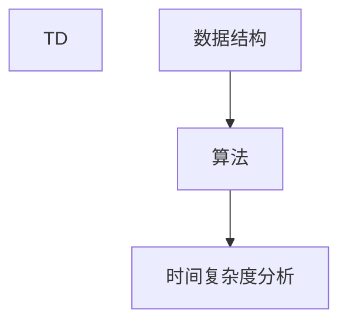

**1.2 系统设计与优化**

系统架构设计是P9工程师的核心技能之一。我们需要理解不同类型的系统架构，如分层架构、微服务架构等，并根据业务需求设计合理的系统架构。

例如，在分层架构中，常见的MVC（Model-View-Controller）架构和MVVM（Model-View-ViewModel）架构都是重要的架构设计模式。在微服务架构中，我们需要关注服务的拆分、服务的自治、服务的通信等关键问题。

系统架构设计示例：

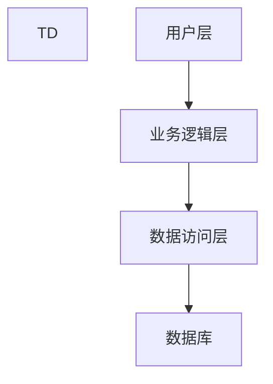

此外，高性能系统优化也是P9工程师的重要任务。我们需要掌握缓存机制、负载均衡、数据库优化等关键技术，以提升系统的性能和稳定性。

**1.3 硬件与嵌入式**

硬件选型和嵌入式系统开发是P9工程师需要掌握的另一个重要领域。硬件选型需要考虑功耗、性能、成本等多个因素，而嵌入式系统开发则需要了解硬件接口、操作系统、驱动开发等方面的知识。

硬件与嵌入式系统开发示例：

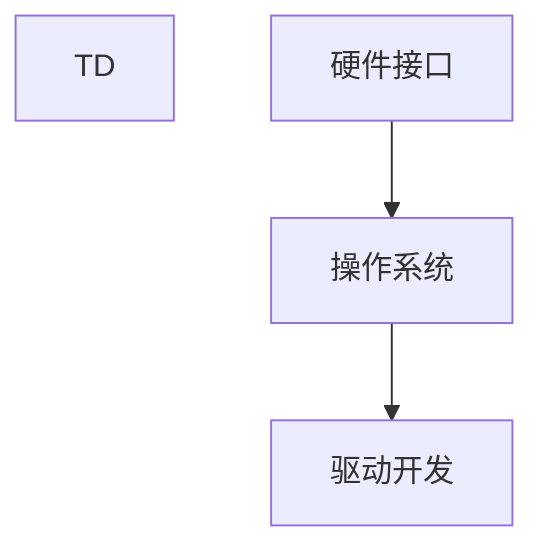

#### 技术广度：跨界整合

**人工智能与大数据**

人工智能和大数据技术正在深刻改变各个行业。作为P9工程师，我们需要了解机器学习、深度学习、大数据处理等基本概念和应用。

例如，机器学习中的分类算法、回归算法等在金融风控、医疗诊断等领域有广泛应用。大数据处理框架如Hadoop、Spark等，能够高效地处理大规模数据，为企业提供数据驱动的决策支持。

人工智能与大数据示例：

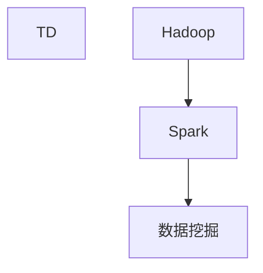

**云计算与分布式系统**

云计算和分布式系统技术为P9工程师提供了丰富的技术栈。云服务模式如IAAS（基础设施即服务）、PAAS（平台即服务）、SAAS（软件即服务）等，为不同类型的企业提供了灵活的解决方案。

分布式系统原理如一致性、容错性、负载均衡等，是构建高可用、高性能系统的关键。

云计算与分布式系统示例：

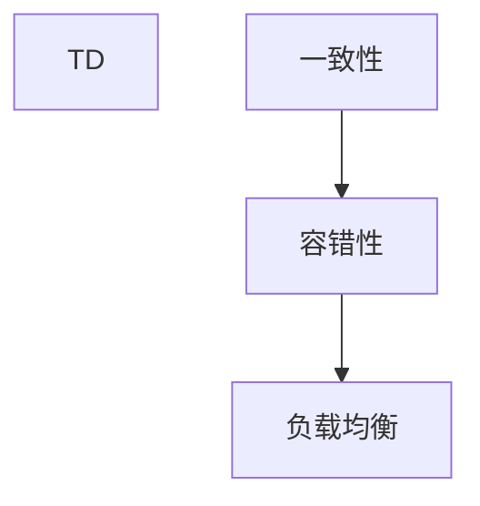

#### 项目管理与团队协作

**2.1 项目管理基础**

项目管理是P9工程师必备的能力之一。项目生命周期管理、项目计划与进度控制等都是项目管理的基础。

项目生命周期管理包括立项、规划、执行、监控和收尾等阶段。项目计划与进度控制则要求我们能够制定详细的项目计划，并监控项目进度，确保项目按时交付。

项目管理基础示例：

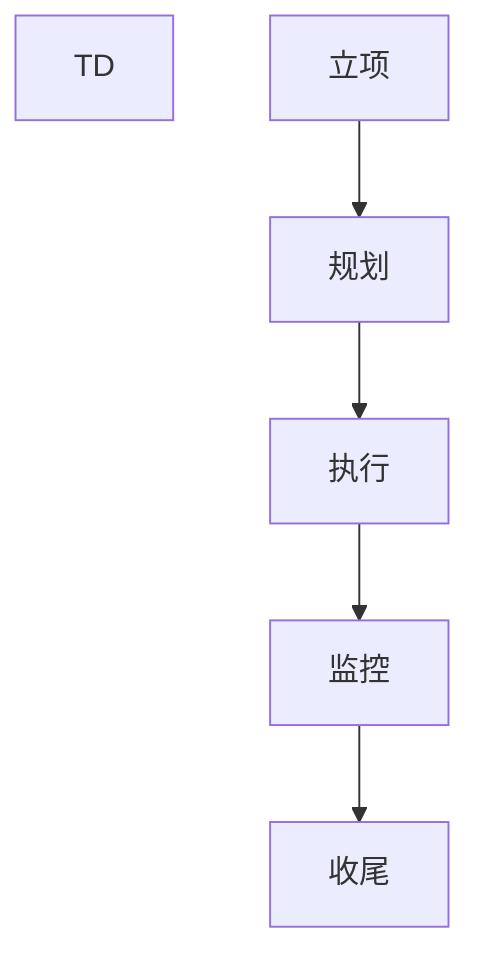

**2.2 团队协作与领导力**

团队协作是项目成功的关键。P9工程师需要提升团队内部的沟通效率，确保信息畅通。此外，领导力也是P9工程师需要培养的重要能力。

领导力包括领导风格、影响力、团队建设等方面。不同的领导风格适用于不同的场景，如民主型领导风格适用于团队决策，而权威型领导风格适用于紧急情况。

团队协作与领导力示例：

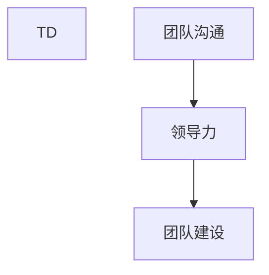

#### 技术创新与持续学习

**3.1 创新思维与方法论**

创新是科技企业发展的源动力。P9工程师需要培养创新思维，掌握设计思维、六顶思考帽等创新方法论，以应对快速变化的市场需求。

创新思维与方法论示例：

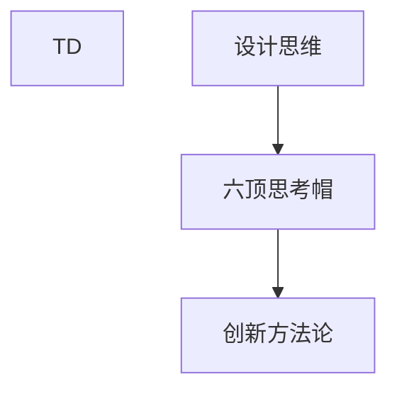

**3.2 持续学习与职业规划**

持续学习是P9工程师保持竞争力的关键。我们需要制定有效的学习计划，不断提升自己的技术能力和领导力。同时，职业规划也是P9工程师需要重视的方面，明确个人职业目标，制定实现目标的策略和计划。

持续学习与职业规划示例：

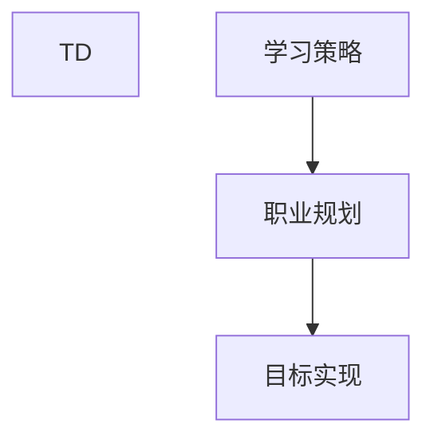

#### 领导力提升：从技术专家到领导者

**4.1 领导力理论**

领导力是P9工程师从技术专家到领导者转变的重要一环。我们需要了解不同的领导风格，如民主型、权威型、参与型等，并能够根据实际情况选择合适的领导风格。

领导力理论示例：

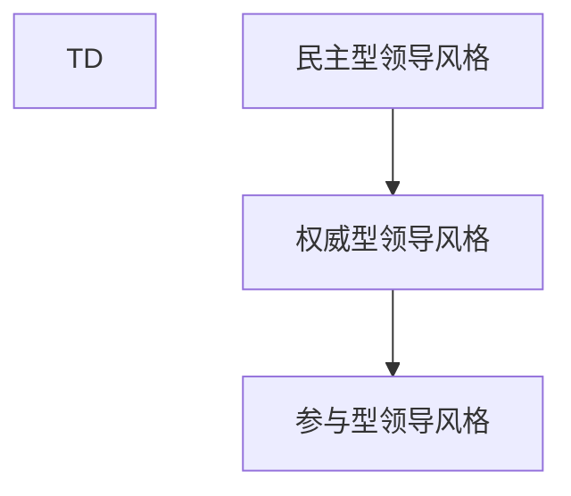

**4.2 个人品牌建设**

个人品牌建设是P9工程师提升影响力的重要手段。我们需要在团队和行业中树立良好的个人品牌，提升个人市场价值。

个人品牌建设示例：

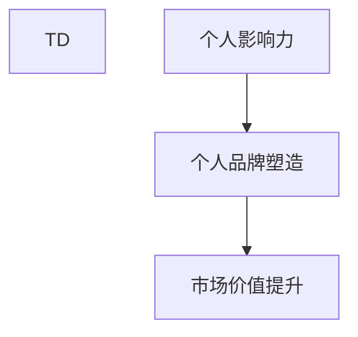

#### 团队管理与激励

**5.1 团队管理**

团队管理是P9工程师作为领导者的重要职责。我们需要建立高效的团队，提升团队凝聚力，确保团队目标的实现。

团队管理示例：

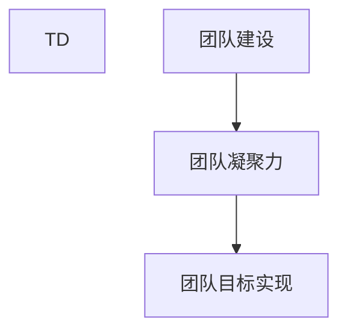

**5.2 激励与绩效管理**

激励与绩效管理是团队管理的重要组成部分。我们需要了解激励理论，如需求层次理论、双因素理论等，设计有效的激励机制。

激励与绩效管理示例：

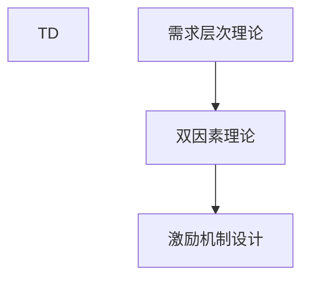

#### 战略决策与业务洞察

**6.1 战略规划**

战略规划是企业发展的关键。作为领导者，P9工程师需要分析企业内外部环境，制定符合企业发展的战略规划。

战略规划示例：

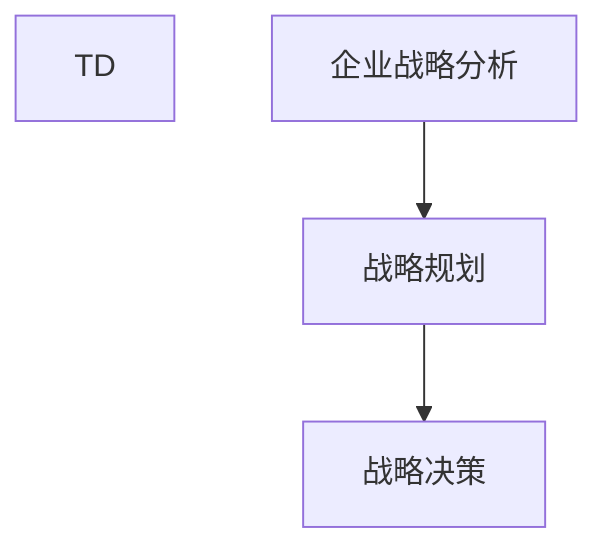

**6.2 业务洞察与分析**

业务洞察与分析是领导者的重要能力。我们需要通过数据分析，解读业务数据，为企业决策提供支持。

业务洞察与分析示例：

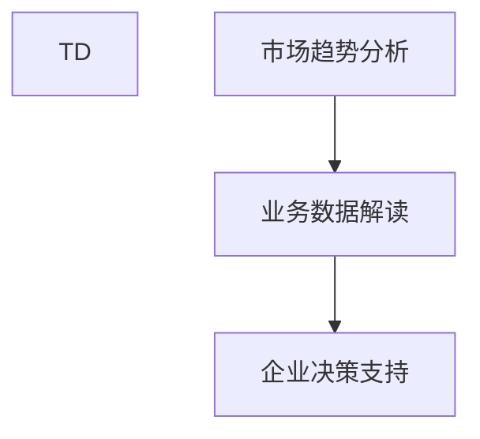

#### P9工程师的转型路径

**7.1 转型准备**

转型准备是P9工程师成功转型的基础。我们需要在技术和领导力之间找到平衡点，为转型做准备。

转型准备示例：

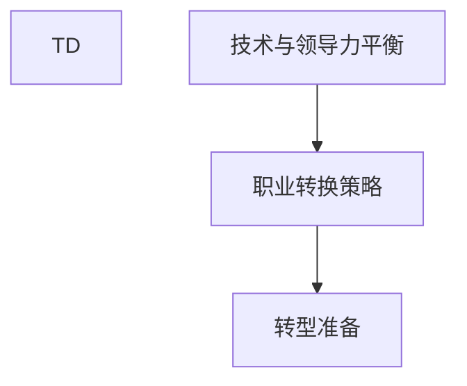

**7.2 转型实践**

转型实践是P9工程师实现成功转型的重要阶段。我们需要通过实际案例分享，总结转型经验，为其他工程师提供借鉴。

转型实践示例：

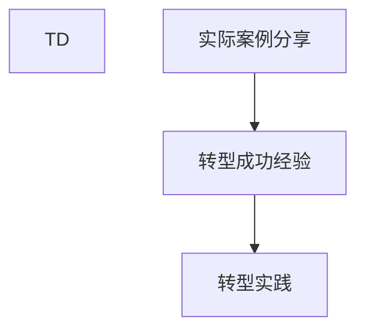

#### 领导者的成长之路

**8.1 成长历程**

领导者的成长是一个不断学习和进步的过程。我们需要从技术专家到领导者的转变中，不断总结经验，应对成长中的挑战。

成长历程示例：

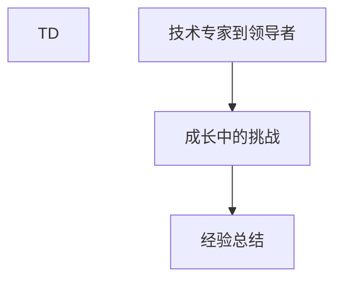

**8.2 持续成长**

持续成长是领导者保持竞争力的关键。我们需要制定自我提升策略，不断提升个人能力和领导力。

持续成长示例：

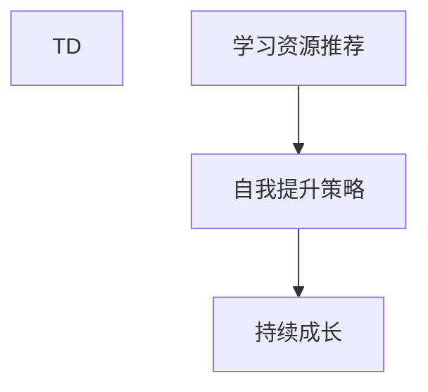

#### 附录

**附录 A：参考资源与工具**

为了帮助P9工程师在自我提升和领导力培养方面取得更好的效果，我们推荐以下参考资源与工具：

- **技术学习资源**：包括经典的技术书籍、在线课程、技术社区等。
- **领导力培养资源**：包括领导力培训课程、领导力模型、领导力书籍等。
- **在线工具与平台**：包括项目管理工具、团队协作工具、数据分析工具等。

附录 A 示例：

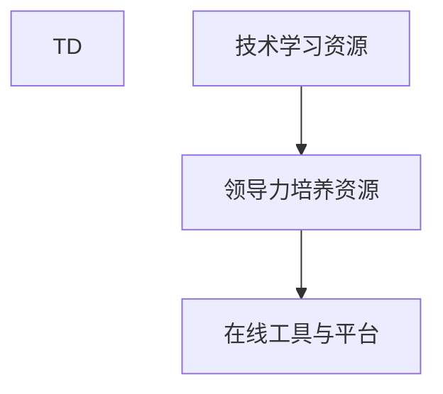

**附录 B：常见问题与解答**

为了帮助P9工程师更好地理解和应用本文的内容，我们整理了常见问题与解答，包括技术成长、领导力提升等方面的内容。

附录 B 示例：

```mermaid  
graph  
TD  
A[技术成长相关问题] --> B[领导力提升相关问题] --> C[常见问题与解答]  
```

#### 结语

P9工程师的自我修炼是一个长期而系统的过程，需要我们在技术深度、广度、项目管理、团队协作、技术创新、领导力提升等方面不断努力。通过本文的探讨，我们希望能为P9工程师提供一些有益的启示和指导，帮助他们在职业发展的道路上取得更大的成就。

在未来的工作中，我们鼓励P9工程师不断学习、实践和反思，持续提升自己的技术能力和领导力，为企业和社会创造更大的价值。

### 结语

通过本文的探讨，我们详细分析了P9工程师从技术专家到领导者转型的关键步骤和核心能力。从技术深度和广度、项目管理、团队协作、技术创新到领导力提升，每一个阶段都是P9工程师自我修炼的重要组成部分。在这个过程中，持续学习和不断实践是确保成功转型的关键。

**回顾与总结**：本文首先介绍了P9工程师在技术深度上的修养，包括数据结构与算法、系统设计与优化、硬件与嵌入式等方面的知识。接着，我们探讨了技术广度的重要性，特别是在人工智能与大数据、云计算与分布式系统等领域的应用。随后，文章深入讲解了项目管理与团队协作、技术创新与持续学习等关键能力，并提出了领导力提升的策略和方法。

**未来展望**：随着技术的不断进步和市场的快速变化，P9工程师需要具备前瞻性的视野和持续学习的能力。未来的P9工程师不仅要成为技术领域的权威，更需要在领导力、战略规划和业务洞察等方面不断提升自己。我们鼓励读者在职业生涯中保持谦虚、勤奋和开放的态度，不断挑战自我，迎接新的机遇和挑战。

**建议**：为了更好地实现自我提升，P9工程师可以采取以下措施：

1. **定期进行技术总结**：通过总结和反思自己的技术工作，找出不足和改进方向。
2. **参与项目管理和团队协作**：主动参与项目管理，提升自己的沟通协调和团队领导能力。
3. **学习新的领导力理论**：通过阅读领导力书籍、参加培训课程等方式，不断丰富自己的领导力知识体系。
4. **建立个人品牌**：通过在社区分享技术心得、撰写专业文章等方式，提升自己的行业影响力。
5. **建立学习网络**：与同行建立联系，参与技术社区和研讨会，扩大自己的知识视野。

在结束本文之前，我们要感谢读者对P9工程师职业发展的关注和支持。希望本文能为您的职业发展提供一些启示和帮助。未来，我们将继续关注P9工程师的成长之路，分享更多有价值的经验和见解。祝您在职业生涯中取得更加辉煌的成就！

**作者信息**：

- 作者：AI天才研究院/AI Genius Institute & 禅与计算机程序设计艺术 /Zen And The Art of Computer Programming

通过本文的阅读，我们相信P9工程师们将对自己的职业发展有更清晰的认识和规划，不断追求卓越，实现从技术专家到领导者的华丽蜕变。让我们携手共进，共创美好未来！

