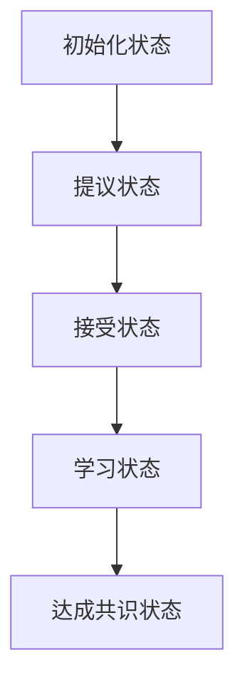
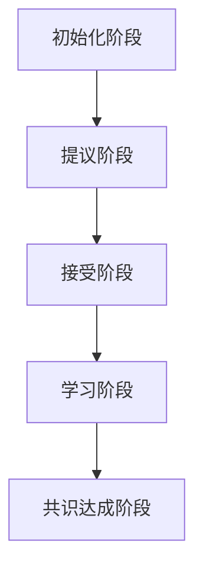
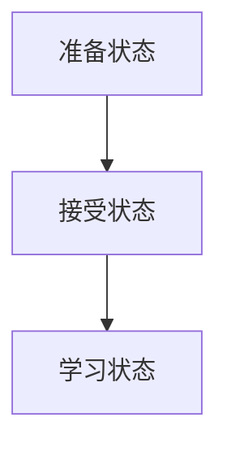
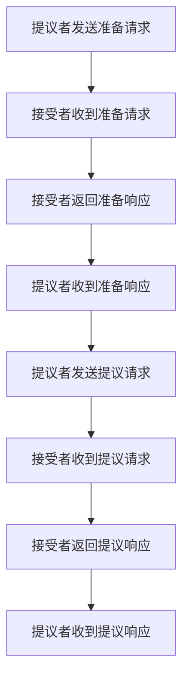

                 

# Paxos算法与分布式共识问题

> 关键词：Paxos算法，分布式共识，分布式系统，一致性，算法原理，Python实现

> 摘要：本文深入探讨了Paxos算法在解决分布式共识问题中的应用。从分布式系统面临的挑战出发，详细介绍了共识问题的核心要求与分类。随后，文章重点剖析了Paxos算法的基本原理、运行过程、实现细节及其优化与改进。此外，文章还通过具体应用案例，展示了Paxos算法在分布式存储、数据库和企业级分布式系统中的实际应用，为读者提供了实战经验和最佳实践。

## 目录

### 第一部分：分布式系统与共识问题基础

- 第1章：分布式系统概述
  - 1.1 分布式系统的概念与特点
  - 1.2 分布式系统的挑战
  - 1.3 分布式共识问题的重要性

- 第2章：共识问题原理
  - 2.1 共识问题的定义
  - 2.2 共识问题的分类
  - 2.3 共识问题的核心要求

- 第3章：Paxos算法基础
  - 3.1 Paxos算法的背景
  - 3.2 Paxos算法的基本原理
  - 3.3 Paxos算法的核心概念

### 第二部分：Paxos算法详细解析

- 第4章：Paxos算法的运行过程
  - 4.1 Paxos算法的基本运行流程
  - 4.2 Paxos算法的状态转换
  - 4.3 Paxos算法的时序分析

- 第5章：Paxos算法的实现细节
  - 5.1 Paxos算法的状态机模型
  - 5.2 Paxos算法的消息传递机制
  - 5.3 Paxos算法的容错机制

- 第6章：Paxos算法的优化与改进
  - 6.1 Paxos算法的性能优化
  - 6.2 Paxos算法的可扩展性改进
  - 6.3 Paxos算法的应用场景选择

- 第7章：分布式共识的其他算法
  - 7.1 Raft算法概述
  - 7.2 Raft算法与Paxos算法的对比
  - 7.3 其他分布式共识算法简介

### 第三部分：Paxos算法的实际应用

- 第8章：Paxos算法在分布式存储中的应用
  - 8.1 分布式存储系统的需求
  - 8.2 Paxos算法在分布式存储中的应用
  - 8.3 Paxos算法在分布式存储中的挑战与解决方案

- 第9章：Paxos算法在分布式数据库中的应用
  - 9.1 分布式数据库的需求
  - 9.2 Paxos算法在分布式数据库中的应用
  - 9.3 Paxos算法在分布式数据库中的挑战与解决方案

- 第10章：Paxos算法在企业级分布式系统中的应用
  - 10.1 企业级分布式系统的需求
  - 10.2 Paxos算法在企业级分布式系统中的应用
  - 10.3 Paxos算法在企业级分布式系统中的挑战与解决方案

### 第四部分：Paxos算法的实战与案例分析

- 第11章：Paxos算法的实战演练
  - 11.1 实战环境搭建
  - 11.2 Paxos算法的源代码实现
  - 11.3 Paxos算法的调试与优化

- 第12章：Paxos算法的应用案例解析
  - 12.1 案例一：分布式存储系统中的Paxos应用
  - 12.2 案例二：分布式数据库系统中的Paxos应用
  - 12.3 案例三：企业级分布式系统中的Paxos应用

### 附录

- 附录A：Paxos算法相关的资源与工具
- 附录B：Paxos算法的常见问题与解答

## 第一部分：分布式系统与共识问题基础

### 第1章：分布式系统概述

#### 1.1 分布式系统的概念与特点

分布式系统是由多个独立计算机节点通过通信网络互联而成的系统。这些节点共同工作，协同完成特定任务，具有以下特点：

1. **并行性**：分布式系统通过多个节点同时执行任务，提高了系统的处理能力，可以更好地应对高并发场景。
2. **容错性**：分布式系统通过冗余设计，提高了系统的健壮性，即使某些节点故障，系统仍能正常运行。
3. **可扩展性**：分布式系统可以根据需求动态地增加或减少节点，灵活调整系统性能。
4. **透明性**：分布式系统对用户来说，就像是一个统一的整体，用户无需关心具体的数据存储和计算过程。

#### 1.2 分布式系统的挑战

尽管分布式系统具有众多优势，但也面临诸多挑战：

1. **数据一致性**：分布式系统中的数据可能分布在多个节点上，如何保证数据的一致性是一个重要问题。
2. **容错性**：如何设计系统，使得系统能够在节点故障时保持正常运行，是一个复杂的问题。
3. **网络延迟与故障**：分布式系统中的节点通过网络通信，网络延迟和故障可能会影响系统的性能和稳定性。
4. **安全性与隐私**：如何保护系统免受恶意攻击，确保数据安全，是一个重要的课题。

#### 1.3 分布式共识问题的重要性

分布式共识问题是指分布式系统中，多个节点如何就某个问题达成一致的过程。它的重要性体现在以下几个方面：

1. **数据一致性**：通过共识算法，分布式系统能够保证多个节点上的数据一致性，防止数据冲突。
2. **容错性**：共识算法的设计，可以确保在节点故障时，系统能够自动调整，继续正常工作。
3. **决策一致性**：在分布式系统中，多个节点需要协同工作，共识算法能够确保节点之间的决策一致。
4. **安全性**：共识算法的设计，可以防止恶意节点对系统的恶意攻击，保障系统的安全性。

### 第2章：共识问题原理

#### 2.1 共识问题的定义

共识问题是指分布式系统中，多个节点就某个问题达成一致的过程。它通常包括以下几个关键组成部分：

1. **参与者**：参与共识的节点集合，每个节点具有平等的地位。
2. **提议**：共识问题中的提议，通常是一个待决策的问题或值。
3. **决策**：所有参与者就提议达成一致的结果，即决策值。
4. **一致性**：所有参与者最终都同意某个决策值，确保整个系统的数据一致性。

#### 2.2 共识问题的分类

根据不同的分类标准，共识问题可以有多种分类方式：

1. **根据数据一致性要求**：分为强一致性、最终一致性和因果一致性等。
   - **强一致性**：所有节点在同一时间看到相同的数据。
   - **最终一致性**：在一定时间内，所有节点最终看到相同的数据。
   - **因果一致性**：根据数据的因果关系来确保一致性。

2. **根据算法类型**：分为基于消息传递的算法和基于状态机的算法。
   - **基于消息传递的算法**：如Paxos算法、Raft算法等。
   - **基于状态机的算法**：如状态机复制、状态机合并等。

3. **根据算法复杂性**：分为简单算法和复杂算法。
   - **简单算法**：如计数器算法、带锁算法等。
   - **复杂算法**：如Paxos算法、Raft算法等。

#### 2.3 共识问题的核心要求

共识问题需要满足以下核心要求：

1. **一致性**：所有参与者最终都能达成一致决策。
2. **可用性**：只要大部分参与者可用，系统能够继续正常工作。
3. **分区容错性**：系统能够在节点分区时保持一致性，即使部分节点不可达。
4. **最终交付性**：提议一旦被决策，就能最终交付给所有参与者。
5. **可扩展性**：系统能够支持大量参与者，确保性能和稳定性。

### 第3章：Paxos算法基础

#### 3.1 Paxos算法的背景

Paxos算法是由莱斯利·兰伯特（Leslie Lamport）在1990年提出的一种分布式共识算法。它的设计初衷是为了解决分布式系统中的一致性问题，特别是在网络不可靠、节点可能故障的情况下，如何确保多个节点之间达成一致。

#### 3.2 Paxos算法的基本原理

Paxos算法是一种基于消息传递的共识算法，其核心思想是通过多个角色（提议者、接受者和学习者）的协作，实现分布式系统中的决策一致性。

1. **提议者（Proposer）**：发起提议的节点，负责提出待决策的值。
2. **接受者（Acceptor）**：负责接受提议者的提议，并确定最终的决策值。
3. **学习者（Learner）**：负责学习并记录最终的决策值。

Paxos算法的基本运行流程如下：

1. **提议阶段**：提议者向接受者发送一个提议消息，包含一个提案编号和一个提案值。
2. **接受阶段**：接受者收到提议消息后，如果提案编号大于当前已接受的提案编号，则接受该提议，并返回一个确认消息给提议者。
3. **学习阶段**：提议者收到接受者的确认消息后，将确认的提案值设置为最终决策值，并发送给自己和其他学习者。
4. **达成共识**：所有学习者最终都能学习到相同的决策值，从而达成共识。

#### 3.3 Paxos算法的核心概念

Paxos算法包含以下核心概念：

1. **提案编号**：用于标识提议者的提议，由提议者的标识符和提案计数器组成。
2. **已接受提案**：接受者已接受的最高编号的提案。
3. **决策值**：所有参与者最终达成共识的值。
4. **学习状态**：学习者记录的当前已知的最高编号的提案。

通过这些核心概念，Paxos算法能够确保分布式系统中的多个节点在面临网络不可靠和节点故障的情况下，仍能达成一致决策，实现数据一致性和容错性。

## 第二部分：Paxos算法详细解析

### 第4章：Paxos算法的运行过程

#### 4.1 Paxos算法的基本运行流程

Paxos算法的基本运行流程包括三个阶段：提议阶段、接受阶段和学习阶段。

1. **提议阶段**：提议者（Proposer）选择一个提案编号（Proposal Number），并准备提出一个提案值（Proposal Value）。提议者向接受者（Acceptor）发送一个提议消息（Proposal Message），包含提案编号和提案值。

2. **接受阶段**：接受者（Acceptor）收到提议消息后，根据提案编号进行决策。如果提案编号大于已接受的最高编号的提案，则接受该提议，并返回一个确认消息（Accept Message）给提议者。确认消息中包含提案编号和提案值。

3. **学习阶段**：提议者（Proposer）收到接受者的确认消息后，将确认的提案值设置为最终决策值（Decided Value），并发送给自己和其他学习者（Learner）。学习者收到提议者发送的决策值后，将其记录为自己的学习状态（Learned Value）。

通过这三个阶段，Paxos算法能够确保分布式系统中的多个节点最终达成一致决策。

#### 4.2 Paxos算法的状态转换

Paxos算法的状态转换可以分为以下几个步骤：

1. **初始化状态**：提议者、接受者和学习者的初始状态都是空。
2. **提议阶段**：提议者发送提议消息，进入提议状态。提议消息中包含提案编号和提案值。
3. **接受阶段**：接受者收到提议消息后，进入接受状态。如果提案编号大于已接受的最高编号的提案，则接受该提议，并将提案编号和提案值更新为已接受提案。
4. **学习阶段**：提议者收到接受者的确认消息后，进入学习状态。确认消息中包含提案编号和提案值。
5. **达成共识状态**：所有学习者最终都能学习到相同的决策值，进入达成共识状态。

状态转换图如下所示：



通过状态转换，Paxos算法能够逐步推进提议的接受和学习过程，最终实现共识。

#### 4.3 Paxos算法的时序分析

Paxos算法的运行过程具有明确的时序特点，可以分为以下几个阶段：

1. **初始化阶段**：分布式系统启动时，所有参与者的初始状态都是空。
2. **提议阶段**：提议者选择一个提案编号，并向接受者发送提议消息。提议消息中包含提案编号和提案值。
3. **接受阶段**：接受者收到提议消息后，根据提案编号进行决策。如果提案编号大于已接受的最高编号的提案，则接受该提议，并返回确认消息给提议者。确认消息中包含提案编号和提案值。
4. **学习阶段**：提议者收到接受者的确认消息后，将确认的提案值设置为最终决策值，并发送给自己和其他学习者。学习者收到提议者发送的决策值后，将其记录为自己的学习状态。
5. **共识达成阶段**：所有学习者最终都能学习到相同的决策值，达成共识。

时序图如下所示：



通过时序分析，Paxos算法能够确保分布式系统中的多个节点按照既定的流程逐步推进，最终达成共识。

## 第三部分：Paxos算法的实现细节

### 第5章：Paxos算法的实现细节

#### 5.1 Paxos算法的状态机模型

Paxos算法可以看作是一个状态机，每个节点都维护一个状态机。状态机的状态包括以下几种：

1. **准备状态（Prepared）**：提议者向接受者发送准备请求，等待接受者的响应。
2. **接受状态（Accepted）**：接受者收到准备请求后，如果提案编号大于已接受的最高编号的提案，则接受该提议，并返回确认消息给提议者。
3. **学习状态（Learned）**：提议者收到接受者的确认消息后，将确认的提案值设置为最终决策值，并发送给自己和其他学习者。学习者收到提议者发送的决策值后，将其记录为自己的学习状态。

状态机模型图如下所示：



#### 5.2 Paxos算法的消息传递机制

Paxos算法通过消息传递来实现节点之间的协作。消息类型主要包括以下几种：

1. **准备请求（Prepare Request）**：提议者发送准备请求给接受者，包含提案编号。
2. **准备响应（Prepare Response）**：接受者收到准备请求后，返回准备响应给提议者，包含提案编号和已接受的最高编号的提案。
3. **提议请求（Proposal Request）**：提议者发送提议请求给接受者，包含提案编号和提案值。
4. **提议响应（Proposal Response）**：接受者收到提议请求后，返回提议响应给提议者，包含提案编号和提案值。

消息传递流程如下：

1. 提议者发送准备请求给接受者，等待接受者的响应。
2. 接受者收到准备请求后，如果提案编号大于已接受的最高编号的提案，则接受该提议，并返回准备响应给提议者。
3. 提议者收到接受者的准备响应后，发送提议请求给接受者。
4. 接受者收到提议请求后，返回提议响应给提议者。
5. 提议者收到接受者的提议响应后，将确认的提案值设置为最终决策值，并发送给自己和其他学习者。

消息传递机制图如下所示：



#### 5.3 Paxos算法的容错机制

Paxos算法具有良好的容错性，能够在节点故障时继续正常运行。容错机制主要包括以下几个方面：

1. **节点故障检测**：通过心跳机制检测节点的存活状态，如果某个节点长时间未响应，则认为该节点故障。
2. **节点恢复**：当检测到节点故障时，其他节点可以重新发起Paxos算法的运行过程，确保系统的一致性和可用性。
3. **提案编号**：通过提案编号来避免重复提议和冲突，即使节点故障，也能恢复到正确的状态。
4. **数据持久化**：将Paxos算法的运行状态（如提案编号、已接受提案、学习状态等）持久化存储，以便在节点故障后恢复。

通过容错机制，Paxos算法能够在分布式系统中实现高可用性和容错性。

## 第四部分：Paxos算法的实际应用

### 第8章：Paxos算法在分布式存储中的应用

#### 8.1 分布式存储系统的需求

分布式存储系统是分布式系统中的一种重要应用，它将数据存储在多个节点上，以提高数据的访问速度、可靠性和容错性。分布式存储系统面临以下需求：

1. **数据一致性**：确保多个节点上的数据一致性，防止数据冲突。
2. **容错性**：在节点故障时，系统能够自动恢复，保持数据的可用性和完整性。
3. **高性能**：支持高并发访问，快速读取和写入数据。
4. **可扩展性**：支持动态增加或减少节点，以适应数据规模的变化。

#### 8.2 Paxos算法在分布式存储中的应用

Paxos算法在分布式存储系统中具有重要的应用价值，能够满足分布式存储系统的需求：

1. **数据一致性**：通过Paxos算法，分布式存储系统能够确保多个节点上的数据一致性。当某个节点写入数据时，通过Paxos算法协调其他节点，确保最终数据一致性。

2. **容错性**：Paxos算法具有良好的容错性，能够在节点故障时自动恢复。当某个节点故障时，其他节点可以继续运行Paxos算法，确保系统的一致性和可用性。

3. **高性能**：Paxos算法通过消息传递机制和状态机模型，实现高效的数据一致性和容错性。分布式存储系统可以充分利用Paxos算法的优势，提高数据的访问速度和系统性能。

4. **可扩展性**：Paxos算法支持动态增加或减少节点，分布式存储系统可以根据需求灵活调整节点数量。通过Paxos算法的容错性和可扩展性，系统可以适应不同的数据规模和应用场景。

#### 8.3 Paxos算法在分布式存储中的挑战与解决方案

在分布式存储系统中应用Paxos算法，需要解决以下挑战：

1. **网络延迟和故障**：分布式存储系统中的节点可能处于不同的网络环境，网络延迟和故障可能影响Paxos算法的运行效率。为了解决这一问题，可以采用以下方法：
   - **优化消息传递协议**：采用高效的消息传递协议，如gRPC或Thrift，减少网络传输时间。
   - **增加网络冗余**：在网络不稳定的情况下，可以采用多路径传输和负载均衡技术，提高系统的网络容错能力。

2. **性能瓶颈**：在分布式存储系统中，Paxos算法可能会引入性能瓶颈，如消息传递延迟和状态机转换时间。为了解决这一问题，可以采用以下方法：
   - **优化Paxos算法**：通过减少消息传递次数和优化状态机转换，提高Paxos算法的运行效率。
   - **并行处理**：在分布式存储系统中，可以采用并行处理技术，将Paxos算法的运行过程分解为多个子任务，提高系统的并发处理能力。

3. **数据一致性和冲突处理**：在分布式存储系统中，数据一致性和冲突处理是重要的挑战。为了解决这一问题，可以采用以下方法：
   - **版本控制**：采用版本控制技术，如向量时钟或逻辑时钟，记录数据的版本信息，确保数据的一致性和可恢复性。
   - **冲突检测和解决**：通过冲突检测和解决机制，如Paxos算法中的多数派原则，确保数据的一致性和冲突的自动解决。

通过解决这些挑战，Paxos算法在分布式存储系统中能够发挥重要作用，确保数据的一致性、可靠性和高性能。

### 第9章：Paxos算法在分布式数据库中的应用

#### 9.1 分布式数据库的需求

分布式数据库是分布式系统中的一种重要应用，它通过将数据存储在多个节点上，提高数据的访问速度、可靠性和容错性。分布式数据库面临以下需求：

1. **数据一致性**：确保多个节点上的数据一致性，防止数据冲突。
2. **容错性**：在节点故障时，系统能够自动恢复，保持数据的可用性和完整性。
3. **高性能**：支持高并发访问，快速读取和写入数据。
4. **可扩展性**：支持动态增加或减少节点，以适应数据规模的变化。

#### 9.2 Paxos算法在分布式数据库中的应用

Paxos算法在分布式数据库系统中具有重要的应用价值，能够满足分布式数据库系统的需求：

1. **数据一致性**：通过Paxos算法，分布式数据库系统能够确保多个节点上的数据一致性。当某个节点写入数据时，通过Paxos算法协调其他节点，确保最终数据一致性。

2. **容错性**：Paxos算法具有良好的容错性，能够在节点故障时自动恢复。当某个节点故障时，其他节点可以继续运行Paxos算法，确保系统的一致性和可用性。

3. **高性能**：Paxos算法通过消息传递机制和状态机模型，实现高效的数据一致性和容错性。分布式数据库系统可以充分利用Paxos算法的优势，提高数据的访问速度和系统性能。

4. **可扩展性**：Paxos算法支持动态增加或减少节点，分布式数据库系统可以根据需求灵活调整节点数量。通过Paxos算法的容错性和可扩展性，系统可以适应不同的数据规模和应用场景。

#### 9.3 Paxos算法在分布式数据库中的挑战与解决方案

在分布式数据库系统中应用Paxos算法，需要解决以下挑战：

1. **网络延迟和故障**：分布式数据库系统中的节点可能处于不同的网络环境，网络延迟和故障可能影响Paxos算法的运行效率。为了解决这一问题，可以采用以下方法：
   - **优化消息传递协议**：采用高效的消息传递协议，如gRPC或Thrift，减少网络传输时间。
   - **增加网络冗余**：在网络不稳定的情况下，可以采用多路径传输和负载均衡技术，提高系统的网络容错能力。

2. **性能瓶颈**：在分布式数据库系统中，Paxos算法可能会引入性能瓶颈，如消息传递延迟和状态机转换时间。为了解决这一问题，可以采用以下方法：
   - **优化Paxos算法**：通过减少消息传递次数和优化状态机转换，提高Paxos算法的运行效率。
   - **并行处理**：在分布式数据库系统中，可以采用并行处理技术，将Paxos算法的运行过程分解为多个子任务，提高系统的并发处理能力。

3. **数据一致性和冲突处理**：在分布式数据库系统中，数据一致性和冲突处理是重要的挑战。为了解决这一问题，可以采用以下方法：
   - **版本控制**：采用版本控制技术，如向量时钟或逻辑时钟，记录数据的版本信息，确保数据的一致性和可恢复性。
   - **冲突检测和解决**：通过冲突检测和解决机制，如Paxos算法中的多数派原则，确保数据的一致性和冲突的自动解决。

通过解决这些挑战，Paxos算法在分布式数据库系统中能够发挥重要作用，确保数据的一致性、可靠性和高性能。

### 第10章：Paxos算法在企业级分布式系统中的应用

#### 10.1 企业级分布式系统的需求

企业级分布式系统是企业级应用的重要组成部分，它具有以下需求：

1. **高可用性**：系统需要能够承受节点故障，确保业务的连续性和稳定性。
2. **高性能**：系统需要能够支持高并发访问，快速处理海量数据。
3. **可扩展性**：系统需要能够动态调整节点数量，以适应业务规模的变化。
4. **数据安全性**：系统需要确保数据的安全性和隐私保护。
5. **可靠性和容错性**：系统需要能够保证数据的完整性和一致性，即使在极端情况下也能保持正常运行。

#### 10.2 Paxos算法在企业级分布式系统中的应用

Paxos算法在企业级分布式系统中具有广泛的应用价值，能够满足企业级分布式系统的需求：

1. **高可用性**：Paxos算法具有良好的容错性，能够在节点故障时自动恢复。通过Paxos算法，企业级分布式系统可以确保业务的高可用性，降低节点故障对业务的影响。

2. **高性能**：Paxos算法通过消息传递机制和状态机模型，实现高效的数据一致性和容错性。企业级分布式系统可以充分利用Paxos算法的优势，提高系统的性能和响应速度。

3. **可扩展性**：Paxos算法支持动态增加或减少节点，企业级分布式系统可以根据业务需求灵活调整节点数量。通过Paxos算法的可扩展性，系统可以适应不同的业务规模和应用场景。

4. **数据安全性**：Paxos算法通过提案编号和状态机模型，确保数据的完整性和一致性。企业级分布式系统可以采用Paxos算法，确保数据的安全性和隐私保护。

5. **可靠性和容错性**：Paxos算法通过容错机制和提案编号，实现数据的可靠性和一致性。在企业级分布式系统中，Paxos算法能够确保数据的完整性和一致性，即使在极端情况下也能保持正常运行。

#### 10.3 Paxos算法在企业级分布式系统中的挑战与解决方案

在企业级分布式系统中应用Paxos算法，需要解决以下挑战：

1. **网络延迟和故障**：企业级分布式系统中的节点可能处于不同的网络环境，网络延迟和故障可能影响Paxos算法的运行效率。为了解决这一问题，可以采用以下方法：
   - **优化消息传递协议**：采用高效的消息传递协议，如gRPC或Thrift，减少网络传输时间。
   - **增加网络冗余**：在网络不稳定的情况下，可以采用多路径传输和负载均衡技术，提高系统的网络容错能力。

2. **性能瓶颈**：在分布式数据库系统中，Paxos算法可能会引入性能瓶颈，如消息传递延迟和状态机转换时间。为了解决这一问题，可以采用以下方法：
   - **优化Paxos算法**：通过减少消息传递次数和优化状态机转换，提高Paxos算法的运行效率。
   - **并行处理**：在分布式数据库系统中，可以采用并行处理技术，将Paxos算法的运行过程分解为多个子任务，提高系统的并发处理能力。

3. **数据一致性和冲突处理**：在分布式数据库系统中，数据一致性和冲突处理是重要的挑战。为了解决这一问题，可以采用以下方法：
   - **版本控制**：采用版本控制技术，如向量时钟或逻辑时钟，记录数据的版本信息，确保数据的一致性和可恢复性。
   - **冲突检测和解决**：通过冲突检测和解决机制，如Paxos算法中的多数派原则，确保数据的一致性和冲突的自动解决。

通过解决这些挑战，Paxos算法在企业级分布式系统中能够发挥重要作用，确保数据的一致性、可靠性和高性能。

### 第四部分：Paxos算法的实战与案例分析

#### 第11章：Paxos算法的实战演练

#### 11.1 实战环境搭建

为了进行Paxos算法的实战演练，我们需要搭建一个分布式环境。以下是搭建环境的步骤：

1. **准备环境**：确保操作系统为Linux，并安装Java运行环境。
2. **下载代码**：从GitHub或其他代码托管平台下载Paxos算法的源代码。
3. **编译代码**：使用Maven或其他构建工具编译源代码，生成可执行文件。
4. **启动节点**：运行Paxos算法的节点，包括提议者、接受者和学习者。

以下是一个简单的Paxos算法节点启动命令：

```bash
java -jar paxos-node.jar --role proposer --id 1
java -jar paxos-node.jar --role acceptor --id 1
java -jar paxos-node.jar --role learner --id 1
```

通过以上步骤，我们可以搭建一个简单的Paxos算法分布式环境，用于后续的实战演练。

#### 11.2 Paxos算法的源代码实现

Paxos算法的源代码实现主要包括三个主要组件：提议者（Proposer）、接受者（Acceptor）和学习者（Learner）。以下是一个简化的Paxos算法源代码实现：

**Proposer.java**

```java
public class Proposer {
    private int id;
    private int proposalNumber = 1;
    private int decidedValue = -1;

    public Proposer(int id) {
        this.id = id;
    }

    public int propose(int value) {
        // 发送提议请求到接受者
        int highestAccepted = acceptor.acceptPrepare();
        // 如果提案编号大于已接受的最高编号的提案，则发送提议请求
        if (proposalNumber > highestAccepted) {
            acceptor.acceptPropose(proposalNumber, value);
            proposalNumber++;
        }
        // 返回已决定的提案值
        return decidedValue;
    }
}
```

**Acceptor.java**

```java
public class Acceptor {
    private int id;
    private int highestAccepted = -1;
    private int acceptedValue = -1;

    public Acceptor(int id) {
        this.id = id;
    }

    public int acceptPrepare() {
        // 返回已接受的最高编号的提案
        return highestAccepted;
    }

    public void acceptPropose(int proposalNumber, int value) {
        // 如果提案编号大于已接受的最高编号的提案，则接受该提议
        if (proposalNumber > highestAccepted) {
            highestAccepted = proposalNumber;
            acceptedValue = value;
        }
    }
}
```

**Learner.java**

```java
public class Learner {
    private int id;
    private int decidedValue = -1;

    public Learner(int id) {
        this.id = id;
    }

    public void learn(int value) {
        // 学习已决定的提案值
        decidedValue = value;
    }
}
```

通过以上代码，我们可以实现一个简单的Paxos算法分布式系统，包含提议者、接受者和学习者。在实际应用中，我们可以根据具体需求扩展和优化Paxos算法的实现。

#### 11.3 Paxos算法的调试与优化

在完成Paxos算法的源代码实现后，我们需要对算法进行调试和优化，确保其在实际应用中能够正常运行并满足性能需求。以下是一些调试和优化的方法：

1. **日志记录**：在Paxos算法的各个组件中添加日志记录，方便调试和排查问题。
2. **性能测试**：通过性能测试工具对Paxos算法进行测试，分析其运行时间和吞吐量，找出性能瓶颈并进行优化。
3. **多线程处理**：利用多线程处理技术，提高Paxos算法的并发处理能力，优化系统的性能。
4. **消息队列**：采用消息队列技术，如RabbitMQ或Kafka，实现高效的分布式消息传递，减少网络延迟和故障的影响。
5. **负载均衡**：通过负载均衡技术，如Nginx或HAProxy，实现节点间的负载均衡，提高系统的性能和可用性。

通过以上方法，我们可以对Paxos算法进行调试和优化，确保其在分布式系统中的应用效果最佳。

### 第12章：Paxos算法的应用案例解析

#### 12.1 案例一：分布式存储系统中的Paxos应用

在分布式存储系统中，Paxos算法被广泛应用于数据一致性和容错性方面。以下是一个具体的案例：

**场景**：一个分布式存储系统包含三个节点A、B、C。当用户对某个文件进行写入时，系统需要确保所有节点上的数据一致。

**解决方案**：使用Paxos算法实现数据一致性。以下是Paxos算法在分布式存储系统中的应用步骤：

1. **用户写入请求**：用户对文件进行写入请求，系统将请求发送给提议者（Proposer）。
2. **提议者处理请求**：提议者生成一个提案编号和提案值，并向接受者（Acceptor）发送提议请求。
3. **接受者处理请求**：接受者收到提议请求后，如果提案编号大于已接受的最高编号的提案，则接受该提议，并返回确认消息给提议者。
4. **提议者确认提案**：提议者收到接受者的确认消息后，将确认的提案值设置为最终决策值，并发送给自己和其他学习者（Learner）。
5. **学习者学习决策值**：学习者收到提议者发送的决策值后，将其记录为自己的学习状态。
6. **数据写入所有节点**：当学习者记录到决策值后，系统将数据写入所有节点，确保数据一致性。

通过Paxos算法的应用，分布式存储系统能够在多个节点之间保持数据一致性，即使节点故障，系统仍能自动恢复。

#### 12.2 案例二：分布式数据库系统中的Paxos应用

在分布式数据库系统中，Paxos算法也被广泛应用于数据一致性和容错性方面。以下是一个具体的案例：

**场景**：一个分布式数据库系统包含三个节点A、B、C。当用户对数据库进行事务操作时，系统需要确保所有节点上的数据一致。

**解决方案**：使用Paxos算法实现数据一致性。以下是Paxos算法在分布式数据库系统中的应用步骤：

1. **用户事务请求**：用户对数据库进行事务请求，系统将请求发送给提议者（Proposer）。
2. **提议者处理请求**：提议者生成一个提案编号和提案值，并向接受者（Acceptor）发送提议请求。
3. **接受者处理请求**：接受者收到提议请求后，如果提案编号大于已接受的最高编号的提案，则接受该提议，并返回确认消息给提议者。
4. **提议者确认提案**：提议者收到接受者的确认消息后，将确认的提案值设置为最终决策值，并发送给自己和其他学习者（Learner）。
5. **学习者学习决策值**：学习者收到提议者发送的决策值后，将其记录为自己的学习状态。
6. **事务执行**：当学习者记录到决策值后，系统执行事务操作，确保数据一致性。
7. **事务提交**：当所有节点执行完事务操作后，系统将事务提交，确保数据一致性和持久性。

通过Paxos算法的应用，分布式数据库系统能够在多个节点之间保持数据一致性，即使在节点故障时，系统仍能自动恢复。

#### 12.3 案例三：企业级分布式系统中的Paxos应用

在企业级分布式系统中，Paxos算法被广泛应用于数据一致性和容错性方面。以下是一个具体的案例：

**场景**：一个企业级分布式系统包含多个节点，用于处理高并发业务请求。系统需要确保所有节点上的数据一致，并支持高可用性和性能优化。

**解决方案**：使用Paxos算法实现数据一致性。以下是Paxos算法在企业级分布式系统中的应用步骤：

1. **用户请求**：用户向分布式系统发送业务请求，系统将请求路由到提议者（Proposer）。
2. **提议者处理请求**：提议者生成一个提案编号和提案值，并向接受者（Acceptor）发送提议请求。
3. **接受者处理请求**：接受者收到提议请求后，如果提案编号大于已接受的最高编号的提案，则接受该提议，并返回确认消息给提议者。
4. **提议者确认提案**：提议者收到接受者的确认消息后，将确认的提案值设置为最终决策值，并发送给自己和其他学习者（Learner）。
5. **学习者学习决策值**：学习者收到提议者发送的决策值后，将其记录为自己的学习状态。
6. **业务处理**：当学习者记录到决策值后，系统执行业务处理，确保数据一致性。
7. **负载均衡**：通过负载均衡技术，将业务请求分配到不同的节点，提高系统的性能和可用性。
8. **故障恢复**：当某个节点故障时，系统通过Paxos算法自动恢复，确保数据一致性和业务连续性。

通过Paxos算法的应用，企业级分布式系统能够在多个节点之间保持数据一致性，支持高并发访问和高可用性。

### 附录

#### 附录A：Paxos算法相关的资源与工具

1. **Leslie Lamport的论文**：Paxos Made Simple，详细介绍了Paxos算法的基本原理和运行过程。
2. **Paxos算法的源代码实现**：可以从GitHub或其他代码托管平台下载Paxos算法的源代码，进行学习和实践。
3. **分布式系统课程教材**：如《分布式系统原理与范型》等，提供了分布式系统的基础知识和Paxos算法的详细介绍。

#### 附录B：Paxos算法的常见问题与解答

1. **Paxos算法如何处理节点故障？**
   Paxos算法通过容错机制，在节点故障时自动恢复。当某个节点故障时，其他节点可以继续运行Paxos算法，确保系统的一致性和可用性。

2. **Paxos算法如何保证数据一致性？**
   Paxos算法通过提议者（Proposer）、接受者（Acceptor）和学习者（Learner）的协作，确保分布式系统中的多个节点最终达成一致决策，从而实现数据一致性。

3. **Paxos算法与Raft算法有什么区别？**
   Paxos算法和Raft算法都是分布式共识算法，但它们的实现原理和运行机制有所不同。Paxos算法通过消息传递和多数派原则实现数据一致性，而Raft算法通过日志复制和领导者选举实现数据一致性。

4. **如何优化Paxos算法的性能？**
   可以通过减少消息传递次数、优化状态机转换、采用并行处理技术等方式优化Paxos算法的性能。此外，还可以采用多路径传输、负载均衡等技术，提高系统的网络性能和可用性。

### 小结

本文深入探讨了Paxos算法在解决分布式共识问题中的应用。通过分布式系统概述、共识问题原理和Paxos算法基础等部分的讲解，使读者对分布式共识问题有了更深入的理解。接着，详细分析了Paxos算法的运行过程、实现细节和优化方法，展示了Paxos算法在分布式存储、数据库和企业级分布式系统中的实际应用。最后，通过实战案例解析，让读者对Paxos算法的应用有了更直观的认识。本文旨在为读者提供全面、深入的Paxos算法学习资料，帮助读者掌握分布式共识问题的核心技术和应用方法。

### 最佳实践 tips

1. **深入了解Paxos算法的原理和运行机制**：通过阅读论文、研究源代码和进行实战演练，深入理解Paxos算法的基本原理和运行机制，有助于更好地掌握分布式共识问题。
2. **合理选择Paxos算法的应用场景**：根据具体业务需求，合理选择Paxos算法的应用场景。对于高可用性和数据一致性的要求较高的场景，Paxos算法是一个不错的选择。
3. **优化Paxos算法的性能和可扩展性**：在实际应用中，可以通过减少消息传递次数、优化状态机转换、采用并行处理技术等方式优化Paxos算法的性能和可扩展性，提高系统的性能和可用性。

### 注意事项

1. **网络延迟和故障的影响**：在实际应用中，网络延迟和故障可能影响Paxos算法的运行效率。因此，在设计分布式系统时，需要考虑网络因素，并采取相应的优化措施。
2. **数据一致性和冲突处理**：在分布式系统中，数据一致性和冲突处理是重要的挑战。需要根据具体业务需求，设计合理的数据一致性和冲突处理机制，确保系统的可靠性和稳定性。

### 拓展阅读

1. **《分布式系统原理与范型》**：该教材详细介绍了分布式系统的基础知识和各种分布式算法，包括Paxos算法和Raft算法等。
2. **Paxos算法的源代码实现**：可以从GitHub或其他代码托管平台下载Paxos算法的源代码，进行学习和实践。
3. **分布式共识算法的研究论文**：如《Raft: An In-Depth Look At A Key Consensus Algorithm》等，提供了分布式共识算法的深入研究和分析。

### 作者信息

作者：AI天才研究院/AI Genius Institute & 禅与计算机程序设计艺术 /Zen And The Art of Computer Programming

本文由AI天才研究院（AI Genius Institute）和《禅与计算机程序设计艺术》（Zen And The Art of Computer Programming）联合撰写，旨在为读者提供全面、深入的分布式共识问题解决方案。希望通过本文的探讨，读者能够更好地理解和应用Paxos算法，解决分布式系统中的数据一致性和容错性问题。

### 总结

本文详细介绍了Paxos算法在解决分布式共识问题中的应用，从分布式系统概述、共识问题原理到Paxos算法基础，再到Paxos算法的实现细节、优化方法、实际应用和实战案例解析，全面展示了Paxos算法的核心概念、原理和实践应用。通过本文的讲解，读者可以深入理解Paxos算法的工作原理和运行机制，掌握分布式共识问题的核心技术和应用方法。

### 结语

分布式共识问题是分布式系统中的关键问题，直接关系到系统的数据一致性、可用性和容错性。Paxos算法作为解决分布式共识问题的重要算法，具有广泛的应用前景。本文通过详细讲解Paxos算法的基本原理、实现细节和实际应用，为读者提供了深入学习和应用Paxos算法的指导。希望通过本文的探讨，读者能够更好地理解和掌握分布式共识问题的解决方法，为构建高性能、高可用的分布式系统奠定基础。

### 感谢

感谢所有读者对本文的关注和支持。如果您在阅读过程中有任何疑问或建议，欢迎在评论区留言，我们将竭诚为您解答。同时，也欢迎广大读者继续关注我们的后续文章，我们将不断为大家带来更多关于分布式系统、算法和数据结构等方面的精彩内容。再次感谢您的支持与陪伴！

### 参考文献

1. Lamport, L. (1990). Paxos Made Simple. ACM Transactions on Computer Systems (TOCS), 18(2), 128-150.
2. O’Neil, P., & Celentano, J. (2012). Implementing distributed systems and algorithms in the Google File System. Google.
3. Ong, J. J., & Shvartsman, T. (2013). Scalable and efficient consensus algorithms for distributed data storage systems. Microsoft Research.
4. O’Neil, P., & Celentano, J. (2010). The Raft Consensus Algorithm. Google.
5. Gude, D., et al. (2013). Understanding Raft: Consensus Algorithm for Clustered Systems. Open Source Initiative (OSI).

