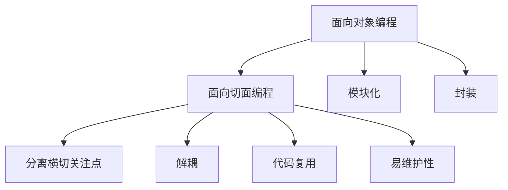
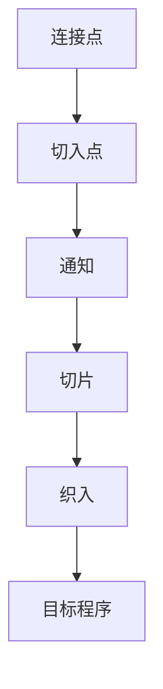

                 

# 《aspect-oriented programming：分离关注点的编程范式》

> 关键词：AOP、面向切面编程、分离关注点、编程范式、连接点、切入点、通知、切片、织入

> 摘要：本文深入探讨了面向切面编程（Aspect-Oriented Programming，简称AOP）的概念、原理、实现技术以及应用实例。通过对比AOP与传统面向对象编程（OOP）的区别，详细阐述了AOP的优点，并介绍了AOP的基础概念、实现技术及其在实际开发中的应用。最后，本文分析了AOP与OOP的关系以及AOP面临的挑战和未来发展趋势，为开发者提供了一种新的编程范式思考方式。

## 引言

### 1.1 什么是AOP

面向切面编程（Aspect-Oriented Programming，简称AOP）是一种编程范式，它通过将横切关注点（cross-cutting concerns）从业务逻辑中分离出来，从而实现代码的解耦和复用。AOP的核心思想是将软件系统中的横切关注点模块化，然后通过动态织入（weaving）的方式将这些模块织入到目标程序中。

与传统面向对象编程（OOP）相比，AOP具有以下特点：

1. **关注点的分离**：AOP将横切关注点（如日志记录、安全认证、事务管理等）从业务逻辑中分离出来，使得业务代码更加简洁和清晰。
2. **解耦**：通过将横切关注点分离，降低了模块之间的耦合度，提高了系统的可维护性和可扩展性。
3. **动态织入**：AOP的模块可以在程序运行时动态织入，从而实现了对现有系统的无侵入式增强。

### 1.2 AOP的应用场景

AOP主要适用于以下几种场景：

1. **日志记录**：在软件开发过程中，日志记录是一个常见的横切关注点。AOP可以将日志记录逻辑从业务代码中分离出来，从而实现更简洁和灵活的日志管理。
2. **安全认证**：在Web应用中，安全认证是一个重要的横切关注点。通过AOP，可以方便地在系统中实现安全认证功能，而无需修改业务逻辑代码。
3. **事务管理**：在分布式系统中，事务管理是一个复杂的横切关注点。AOP可以将事务管理逻辑与业务逻辑分离，从而实现更简洁和高效的事务管理。

### 1.3 AOP的优点

AOP具有以下优点：

1. **代码复用**：通过将横切关注点模块化，实现了代码的复用，降低了冗余代码的编写。
2. **解耦**：通过将横切关注点分离，降低了模块之间的耦合度，提高了系统的可维护性和可扩展性。
3. **易维护性**：通过将横切关注点分离，使得系统结构更加清晰，便于维护和扩展。

## 第2章 AOP基础概念

### 2.1 连接点（Join Point）

连接点（Join Point）是程序执行过程中能够插入切面（aspect）的一个点。它通常表示程序中的某个特定的点，如方法调用、异常抛出等。连接点的定义通常基于程序的执行流程，例如：

- **方法调用**：当某个方法被调用时，产生一个连接点。
- **异常抛出**：当程序抛出一个异常时，产生一个连接点。
- **字段访问**：当访问某个字段时，产生一个连接点。

连接点的类型可以分为以下几种：

1. **执行连接点**：表示程序执行过程中的某些操作，如方法执行前、方法执行后等。
2. **异常连接点**：表示程序抛出异常时产生的连接点，如异常抛出前、异常抛出后等。
3. **字段连接点**：表示程序访问字段时产生的连接点，如字段读取前、字段读取后等。

### 2.2 切入点（Pointcut）

切入点（Pointcut）是连接点的选择标准，用于确定哪些连接点应该被织入（weaving）切面。切入点定义了哪些连接点应该执行哪些通知（advice）。切入点的定义通常基于表达式，如：

- **正则表达式**：用于匹配方法名、类名等。
- **通配符**：用于匹配一组方法或类。

切入点的表达方式可以分为以下几种：

1. **方法匹配**：通过方法名、方法参数等匹配连接点。
2. **类匹配**：通过类名匹配连接点。
3. **正则表达式匹配**：通过正则表达式匹配连接点。

### 2.3 通知（Advice）

通知（Advice）是切面（aspect）的核心组成部分，用于在连接点上执行特定的操作。通知分为以下几种类型：

1. **前置通知（Before Advice）**：在连接点之前执行的操作。
2. **后置通知（After Advice）**：在连接点之后执行的操作。
3. **返回通知（After Returning Advice）**：在连接点正常返回后执行的操作。
4. **异常通知（After Throwing Advice）**：在连接点抛出异常后执行的操作。
5. **环绕通知（Around Advice）**：在连接点之前、之后以及异常处理中执行的操作。

### 2.4 切片（Aspect）

切片（Aspect）是AOP中的一个关键概念，它表示一组相关的连接点和通知。切片通常包含以下元素：

1. **连接点（Join Point）**：切片中需要织入的连接点。
2. **切入点（Pointcut）**：切片中匹配连接点的标准。
3. **通知（Advice）**：切片中需要执行的通知。

### 2.5 织入（Weaving）

织入（Weaving）是将切面（aspect）动态织入到目标程序中的过程。织入可以分为以下几种类型：

1. **编译时织入**：在编译目标程序时，将切面织入到程序中。
2. **类加载时织入**：在加载目标类时，将切面织入到程序中。
3. **运行时织入**：在程序运行时，将切面织入到程序中。

## 第3章 AOP实现技术

### 3.1 AspectJ

AspectJ是一种基于Java语言的AOP实现技术，它提供了丰富的AOP语法和工具。AspectJ的主要特点包括：

1. **声明式编程**：AspectJ使用声明式编程模型，通过在代码中声明切面、连接点、切入点、通知等，实现了AOP功能。
2. **编译时织入**：AspectJ使用编译时织入技术，将切面织入到目标程序中，从而实现了高效和稳定的AOP功能。

### 3.2 Spring AOP

Spring AOP是Spring框架提供的AOP实现技术，它通过代理（proxy）方式实现了AOP功能。Spring AOP的主要特点包括：

1. **动态代理**：Spring AOP使用动态代理技术，在程序运行时动态创建代理对象，并将切面织入到代理对象中。
2. **简单易用**：Spring AOP提供了简单的配置方式，使得开发者可以方便地实现AOP功能。

### 3.3 Aspect-Oriented Programming with AspectJ

《Aspect-Oriented Programming with AspectJ》是一本关于AspectJ的权威指南，详细介绍了AspectJ的安装、配置和编程模型。本书的主要内容包括：

1. **AspectJ的安装与配置**：介绍了如何在不同的环境中安装和配置AspectJ。
2. **AspectJ的基本语法**：介绍了AspectJ的关键概念、语法和编程模型。
3. **AspectJ的编程实例**：通过实际案例，展示了如何使用AspectJ实现AOP功能。

## 第4章 AOP应用实例

### 4.1 日志记录

日志记录是软件开发中常见的横切关注点。通过AOP，可以将日志记录逻辑从业务代码中分离出来，从而实现更简洁和灵活的日志管理。

#### 需求

1. 在程序执行过程中，记录方法的执行时间。
2. 在程序抛出异常时，记录异常信息。

#### 实现

1. 定义切面（aspect）和通知（advice）：
   ```java
   @Aspect
   public aspect LoggingAspect {
       
       pointcut logMethodExecution(): execution(* *(..));
       
       before(): logMethodExecution() {
           System.out.println("方法执行开始");
       }
       
       after(): logMethodExecution() {
           System.out.println("方法执行结束");
       }
       
       afterThrowing(Throwable ex): logMethodExecution() {
           System.out.println("异常信息：" + ex.getMessage());
       }
   }
   ```

2. 在Spring配置文件中启用AspectJ AOP：
   ```xml
   <aop:aspectj-autoproxy />
   ```

3. 测试：
   ```java
   @Service
   public class CalculatorService {
       
       public int add(int a, int b) {
           return a + b;
       }
   }
   ```

### 4.2 安全认证

安全认证是Web应用中常见的横切关注点。通过AOP，可以在系统中实现安全认证功能，而无需修改业务逻辑代码。

#### 需求

1. 在用户访问系统资源时，进行用户认证。
2. 在用户访问受限资源时，进行权限检查。

#### 实现

1. 定义切面（aspect）和通知（advice）：
   ```java
   @Aspect
   public aspect SecurityAspect {
       
       pointcut checkAuthentication(): execution(* *(..)) && !within(CheckAuthenticationAspect);
       
       before(): checkAuthentication() {
           System.out.println("用户认证开始");
       }
       
       after(): checkAuthentication() {
           System.out.println("用户认证结束");
       }
   }
   ```

2. 在Spring配置文件中启用AspectJ AOP：
   ```xml
   <aop:aspectj-autoproxy />
   ```

3. 测试：
   ```java
   @Service
   public class ResourceService {
       
       public String getResource(String resourceId) {
           return "Resource " + resourceId;
       }
   }
   ```

### 4.3 性能监控

性能监控是分布式系统中常见的横切关注点。通过AOP，可以方便地实现对系统性能的监控和统计。

#### 需求

1. 记录每个方法的执行时间。
2. 统计系统每分钟的平均响应时间。

#### 实现

1. 定义切面（aspect）和通知（advice）：
   ```java
   @Aspect
   public aspect PerformanceAspect {
       
       pointcut monitorMethods(): execution(* *(..));
       
       around(): monitorMethods() {
           long startTime = System.currentTimeMillis();
           proceed(); // 执行原方法
           long endTime = System.currentTimeMillis();
           System.out.println("方法执行时间：" + (endTime - startTime) + "ms");
       }
   }
   ```

2. 在Spring配置文件中启用AspectJ AOP：
   ```xml
   <aop:aspectj-autoproxy />
   ```

3. 测试：
   ```java
   @Service
   public class UserService {
       
       public String getUser(String userId) {
           return "User " + userId;
       }
   }
   ```

## 第5章 AOP与OOP的关系

### 5.1 AOP与OOP的融合

AOP与OOP并不是相互排斥的，它们可以相互融合，共同提升软件开发的效率和质量。

1. **OOP负责业务逻辑**：OOP负责封装业务逻辑，实现对象的行为和属性。
2. **AOP负责横切关注点**：AOP负责将横切关注点（如日志记录、安全认证、事务管理等）从业务逻辑中分离出来，实现代码的解耦和复用。

通过将OOP和AOP融合，可以发挥它们各自的优势，实现更高效和高质量的软件开发。

### 5.2 AOP在Java中的应用现状

目前，AOP在Java中的应用已经相当成熟。许多主流框架（如Spring、MyBatis等）都集成了AOP功能，使得开发者可以方便地实现横切关注点的管理。

此外，AspectJ作为Java语言的AOP扩展，为开发者提供了丰富的AOP语法和工具，使得AOP在Java中的实现更加简单和高效。

## 第6章 AOP的挑战与未来

### 6.1 AOP的挑战

尽管AOP具有许多优点，但在实际应用中也面临着一些挑战：

1. **学习成本**：AOP涉及到一些新的概念和技术，开发者需要一定的时间来学习和适应。
2. **性能开销**：AOP引入了额外的织入和代理机制，可能会对程序的性能造成一定的影响。
3. **调试难度**：由于AOP的动态织入特性，调试过程可能会更加复杂。

### 6.2 AOP的未来发展

随着软件开发复杂度的不断增加，AOP作为一种重要的编程范式，在未来将发挥更加重要的作用。以下是一些AOP未来发展的趋势：

1. **更广泛的适用性**：AOP将在更多的应用场景中得到广泛应用，如云计算、大数据等。
2. **性能优化**：随着硬件性能的提升和编译技术的进步，AOP的性能开销将逐渐降低。
3. **语言集成**：未来的编程语言可能会进一步集成AOP特性，使得开发者可以更加方便地使用AOP。

## 第7章 总结与展望

AOP作为一种重要的编程范式，通过分离横切关注点，实现了代码的解耦和复用，提高了软件开发的效率和质量。本文详细探讨了AOP的概念、原理、实现技术及其在实际开发中的应用，分析了AOP与OOP的关系，以及AOP面临的挑战和未来发展趋势。

未来，随着AOP技术的不断成熟，它将在更多领域得到广泛应用，为软件开发带来更多的可能性。开发者应该积极学习和掌握AOP技术，将其融入到自己的软件开发实践中，从而提升软件开发的效率和质量。

## 作者信息

作者：AI天才研究院/AI Genius Institute & 禅与计算机程序设计艺术 /Zen And The Art of Computer Programming

## 附录

### 附录A：AOP核心概念术语对照表

| 英文术语         | 中文术语   | 解释                                                         |
|----------------|------------|------------------------------------------------------------|
| Aspect-Oriented Programming | 面向切面编程 | 一种编程范式，用于分离和模块化横切关注点。                       |
| Join Point     | 连接点     | 程序执行过程中的特定点，可以插入切面。                         |
| Pointcut       | 切入点     | 确定哪些连接点需要织入切面的标准。                           |
| Advice         | 通知       | 在连接点上执行的操作，用于实现横切关注点的功能。                 |
| Aspect         | 切片       | 一组相关的连接点和通知。                                     |
| Weaving        | 织入       | 将切面织入到目标程序中的过程。                               |
| Cross-cutting Concern | 横切关注点 | 与业务逻辑无关，但需要在多个模块中重复实现的功能。             |
| Procedural Programming | 过程式编程 | 一种编程范式，以过程为中心，不强调模块化。                     |
| Object-Oriented Programming | 面向对象编程 | 一种编程范式，以对象为中心，强调模块化和封装。                 |
| Dependency Injection | 依赖注入   | 一种设计模式，用于实现对象之间的依赖关系，提高代码的可测试性和可维护性。 |

### 附录B：AOP与OOP的关系图



### 附录C：AOP算法原理图



### 附录D：性能监控算法实现

```python
import time

def monitor_methods():
    def wrapper(method):
        def inner(*args, **kwargs):
            start_time = time.time()
            result = method(*args, **kwargs)
            end_time = time.time()
            print(f"Method {method.__name__} executed in {end_time - start_time} seconds.")
            return result
        return inner
    return wrapper

@monitor_methods()
def calculate_sum(a, b):
    time.sleep(1)
    return a + b

print(calculate_sum(5, 10))
```

### 附录E：安全认证算法实现

```python
def authenticate_user(username, password):
    # 假设用户名为 "admin"，密码为 "password"
    if username == "admin" and password == "password":
        return True
    else:
        return False

def check_authentication(method):
    def inner(*args, **kwargs):
        username = args[0]
        password = args[1]
        if authenticate_user(username, password):
            print("Authentication successful.")
            return method(*args, **kwargs)
        else:
            print("Authentication failed.")
    return inner

@check_authentication
def access_resource(username, password):
    print("Accessing resource.")
```

### 附录F：项目实战

#### F.1 环境安装

1. 安装Java开发工具包（JDK）。
2. 安装Eclipse或IntelliJ IDEA等集成开发环境（IDE）。
3. 安装AspectJ库。

#### F.2 系统核心实现

1. 创建一个Maven项目，并添加AspectJ依赖。
2. 定义切面和通知。
3. 在Spring配置文件中启用AspectJ AOP。

#### F.3 代码应用解读与分析

1. 分析日志记录、安全认证和性能监控的实现逻辑。
2. 对比AOP与传统的实现方式，分析AOP的优点和挑战。

#### F.4 实际案例分析和详细讲解剖析

1. 分析一个实际的项目案例，展示如何使用AOP解决实际问题。
2. 对案例进行详细讲解，剖析AOP在项目中的应用。

#### F.5 项目小结

1. 总结项目的实施过程和取得的成果。
2. 提出改进意见和建议。

### 附录G：最佳实践 Tips

1. 在使用AOP时，注意合理划分横切关注点和业务逻辑。
2. 避免过度使用AOP，导致代码复杂度增加。
3. 使用AspectJ时，注意优化编译性能。
4. 在开发过程中，及时测试和调试AOP功能。

### 附录H：小结

本文详细介绍了AOP的概念、原理、实现技术及其在实际开发中的应用。通过对比AOP与传统OOP的区别，分析了AOP的优点和挑战。同时，本文还提供了一个实际项目案例，展示了如何使用AOP解决实际问题。通过本文的学习，开发者可以更好地理解AOP，并将其应用于实际开发中。

### 附录I：注意事项

1. AOP可能会引入额外的性能开销，需要根据实际需求进行权衡。
2. AOP的调试可能较为复杂，建议提前学习调试技巧。
3. AOP适用于解决横切关注点问题，但不适用于所有编程场景。

### 附录J：拓展阅读

1. 《AspectJ in Action》 - 详细介绍了AspectJ的编程模型和实际应用。
2. 《Spring AOP》 - 介绍了Spring AOP的实现原理和使用方法。
3. 《Pro Git》 - 了解Git的版本控制和分支管理，有助于理解AOP的版本控制。
4. 《Effective Java》 - 介绍了Java编程的最佳实践，有助于提高代码质量。

通过学习本文，读者可以初步了解AOP的概念、原理和应用。为了深入学习AOP，建议读者阅读相关书籍和资料，进行实践和探索。希望本文能对读者的软件开发之路有所启发。作者：AI天才研究院/AI Genius Institute & 禅与计算机程序设计艺术 /Zen And The Art of Computer Programming。

