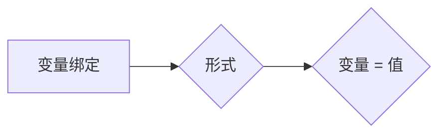
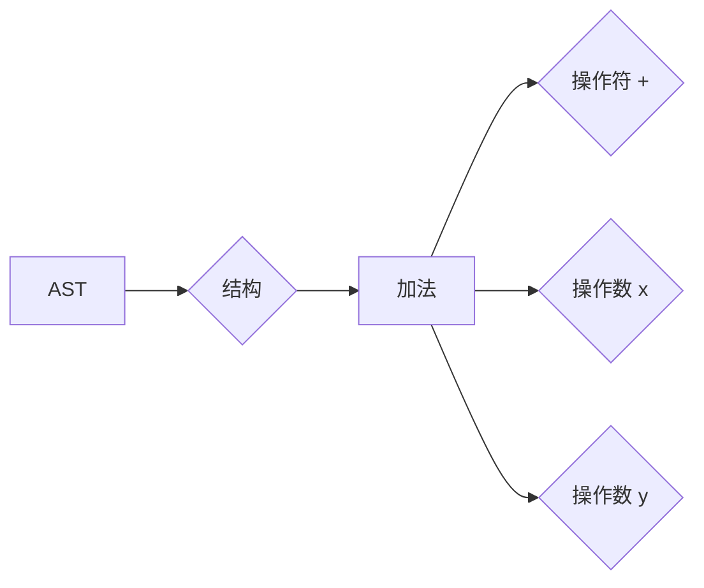
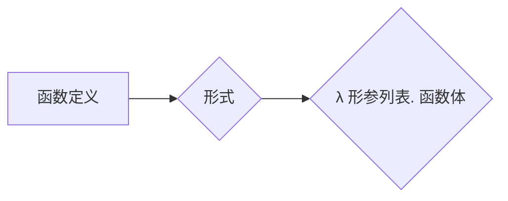
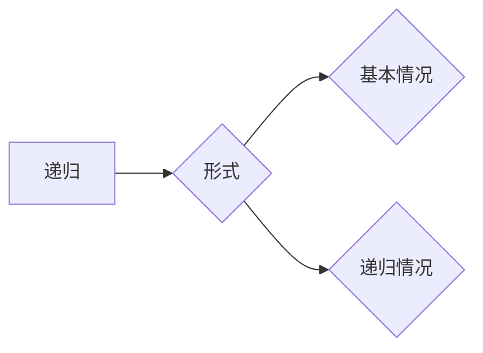

                 


# λ演算：函数式编程的理论基础

## 关键词
- λ演算
- 函数式编程
- 理论基础
- β-转换
- 抽象语法树
- 递归

## 摘要
本文将深入探讨λ演算在函数式编程领域的基础理论。首先，我们将简要介绍λ演算的基本概念、历史与发展，以及其应用领域。接下来，我们将详细分析λ演算的语法，包括变量绑定、抽象语法树、函数定义和递归。然后，我们将探讨λ演算的语义，特别是β-转换、正常化和类型系统。随后，我们将讨论函数式编程的特点，高阶函数、闭包和惰性求值的概念与示例。最后，我们将探讨λ演算在编程语言中的应用，以及其在并发编程和数据处理中的实际应用，并总结与展望函数式编程的未来发展方向。

## 第一部分：λ演算基础

### 第1章：λ演算简介

#### 1.1 λ演算的基本概念

λ演算是一种基于λ抽象的函数式编程语言。λ抽象是一种表示函数的方法，它允许我们将函数作为参数传递，并将函数应用于其他函数。这种抽象使得λ演算具有高度的表达能力和灵活性。

λ演算的基本符号包括变量、函数和应用。变量用于存储值，函数用于表示操作，应用则是将函数应用于变量或值。

λ演算的基本概念可以通过以下符号表示：

- 变量：x, y, z
- 函数：λx.x, λy.y, λz.z
- 应用：x y, (λx.x) y, (λy.y) z

#### 1.2 λ演算的历史与发展

λ演算最早由Alonzo Church在1930年代提出，作为对图灵机的形式化描述的替代方案。它的初衷是为了探讨函数的本质和逻辑推导的规则。

随着时间的推移，λ演算逐渐被应用于计算机科学的各个领域。它不仅为函数式编程提供了理论基础，还在编译器设计、形式化验证、程序优化等方面发挥了重要作用。

#### 1.3 λ演算的应用领域

λ演算的应用领域广泛，包括：

- 理论计算机科学：λ演算在形式语言理论、自动机理论等领域有着重要的应用。
- 软件工程：λ演算为基础的函数式编程语言在开发复杂系统、编写可维护代码方面具有优势。
- 数学：λ演算在数学领域有着丰富的应用，如数理逻辑、范畴论等。

### 第2章：λ演算的语法

#### 2.1 变量绑定

变量绑定是λ演算的核心概念之一。它表示将变量与值关联的过程。

变量绑定的表示方法为：x := y，其中x是变量，y是值。

例如，我们将值5绑定到变量x上，可以表示为：x := 5。

#### 2.2 抽象语法树

抽象语法树（Abstract Syntax Tree，AST）是λ演算中表达程序结构的一种方式。

AST的基本概念包括：

- 节点：表示程序的基本单元，如变量、函数、应用等。
- 边：表示节点之间的关系，如变量绑定、函数应用等。

以下是一个简单的AST示例：

```
        +
      /   \
     x     y
```

在这个示例中，我们有一个加法操作，变量x和y作为参数。

#### 2.3 函数定义

函数定义是λ演算中表达操作的一种方式。

函数定义的基本概念包括：

- 函数名：标识函数的名称。
- 形参列表：函数的参数列表。
- 函数体：函数的具体实现。

以下是一个简单的函数定义示例：

```
λx. x + 1
```

这个函数将接收一个参数x，并返回x加1的结果。

#### 2.4 递归

递归是函数式编程中的一种重要特性，它允许函数调用自身。

递归的基本概念包括：

- 基本情况：递归的终止条件。
- 递归情况：递归调用的具体实现。

以下是一个简单的递归示例，计算阶乘：

```
λn. if (n == 0) 1 else n * (λm. m * (m - 1)) (n - 1)
```

这个函数根据n的值，返回n的阶乘。其中，基本情况是n等于0时返回1，递归情况是n乘以(n-1)的阶乘。

### 第3章：λ演算的语义

#### 3.1 β-转换

β-转换是λ演算的核心语义操作，用于计算函数的应用。

β-转换的基本概念包括：

- 应用：将函数应用于值。
- 替换：将函数的形参替换为实际参数。

以下是一个简单的β-转换示例：

```
(λx. x + 1) 5
```

在这个示例中，我们将函数(λx. x + 1)应用于值5，进行β-转换后，得到结果6。

#### 3.2 正常化

正常化是λ演算中一个重要的概念，它表示函数能够被简化到不可再简化的形式。

正常化的基本概念包括：

- β-等价：两个λ表达式在经过β-转换后具有相同的结果。
- 正常化：λ表达式可以被简化到最简形式。

以下是一个简单的正常化示例：

```
(λx. x + 1) (λy. y + 1)
```

在这个示例中，两个λ表达式经过β-转换后是β-等价的，但它们不能被进一步简化。

#### 3.3 类型系统

类型系统是λ演算中用于确保表达式类型一致性的机制。

类型系统的基本概念包括：

- 基本类型：整数、布尔值等。
- 复合类型：函数类型、数组类型等。
- 类型推导：从表达式的结构推导出类型。

以下是一个简单的类型系统示例：

```
λx. if (x > 0) "Positive" else "Negative"
```

在这个示例中，函数的返回类型是字符串类型。

### 第4章：函数式编程

#### 4.1 函数式编程的特点

函数式编程与面向对象编程相比，具有以下特点：

- **无状态**：函数式编程中的函数没有状态，不会保留任何状态信息。
- **不可变**：函数式编程中的数据是不可变的，一旦创建，就不能修改。
- **组合性**：函数式编程中的函数可以被组合，形成更复杂的函数。

#### 4.2 高阶函数

高阶函数是函数式编程中的重要概念，它允许函数作为参数传递，并返回函数。

高阶函数的基本概念包括：

- **参数**：高阶函数可以接受函数作为参数。
- **返回**：高阶函数可以返回函数作为结果。

以下是一个简单的高阶函数示例：

```
λf. λx. f (x + 1)
```

这个函数接受一个函数f作为参数，并返回一个新的函数，该函数将f应用于x加1。

#### 4.3 闭包

闭包是函数式编程中的另一个重要概念，它允许函数访问并保存定义时的环境。

闭包的基本概念包括：

- **环境**：闭包保存了定义时的环境。
- **访问**：闭包可以访问并使用环境中的变量。

以下是一个简单的闭包示例：

```
λx. λy. x + y
```

这个函数定义了一个闭包，它保存了变量x的值，并在调用时将其与y相加。

#### 4.4 惰性求值

惰性求值是函数式编程中的一个重要特性，它允许函数延迟计算，直到需要结果时才执行。

惰性求值的基本概念包括：

- **延迟计算**：函数在调用时不会立即计算，而是延迟到需要结果时。
- **按需计算**：函数只在需要结果时才执行计算。

以下是一个简单的惰性求值示例：

```
λx. if (x > 0) (x * x) else 0
```

在这个示例中，函数只有在x大于0时才会计算x的平方。

### 第5章：λ演算在编程语言中的应用

#### 5.1 Lisp

Lisp是一种最早出现的函数式编程语言，它基于λ演算。

Lisp的历史与发展、基本概念和示例将在本章详细讨论。

#### 5.2 Haskell

Haskell是一种纯函数式编程语言，它结合了λ演算和类型系统。

Haskell的历史与发展、基本概念和示例将在本章详细讨论。

#### 5.3 其他函数式编程语言

除了Lisp和Haskell，还有其他一些著名的函数式编程语言，如Scala、Erlang和Clojure。

这些语言的概述和示例将在本章讨论。

### 第6章：λ演算的实际应用

#### 6.1 函数式编程在并发编程中的应用

函数式编程在并发编程中具有显著的优势，它可以帮助我们编写更安全、更易于维护的并发程序。

并发编程的基本概念、函数式编程的应用实例将在本章详细讨论。

#### 6.2 函数式编程在数据处理中的应用

函数式编程在数据处理领域具有广泛的应用，它可以简化数据处理过程，提高代码的可读性和可维护性。

数据处理的基本概念、函数式编程的应用实例将在本章详细讨论。

### 第7章：总结与展望

本章将对λ演算在函数式编程中的地位、函数式编程的未来发展方向进行总结与展望。

### 参考文献

本章将列出本文引用的相关参考文献。

# 总结

本文详细探讨了λ演算在函数式编程领域的基础理论。我们从λ演算的基本概念、历史与发展开始，逐步介绍了λ演算的语法、语义，以及函数式编程的特点和实际应用。通过本文的学习，读者应该能够对λ演算有更深入的理解，并能够将其应用于实际的编程场景。

# 作者信息

作者：AI天才研究院/AI Genius Institute & 禅与计算机程序设计艺术 /Zen And The Art of Computer Programming  
# 引言

## λ演算的基本概念

λ演算是一种基于λ抽象的函数式编程语言，由Alonzo Church在1930年代提出。它的目的是为了提供一个形式化的方法来研究函数的本质和逻辑推导的规则。λ演算的基本概念包括变量、函数和应用。

- 变量：在λ演算中，变量用于存储值。变量的表示方法通常是一个小写字母，如x、y、z等。
- 函数：在λ演算中，函数是表示操作的一种方式。函数的表示方法通常是一个λ符号后跟一个变量和函数体，如λx.x、λy.y等。这里的x和y是形参，表示函数的参数。函数体则是具体的操作，如x + 1。
- 应用：在λ演算中，应用是将函数应用于值的一种操作。应用的形式是将函数放在左边，值放在右边，如(λx.x) 5。

## λ演算的历史与发展

λ演算的提出是为了探讨函数的本质和逻辑推导的规则。它的起源可以追溯到图灵机的形式化描述。图灵机是一种抽象的计算模型，用来描述计算的本质。然而，图灵机的描述过于复杂，难以理解。为了简化描述，Church提出了λ演算。

随着时间的推移，λ演算逐渐发展起来，并应用于计算机科学的各个领域。它在理论计算机科学、软件工程、数学等领域都有重要的应用。在现代计算机科学中，λ演算仍然具有重要的地位，许多函数式编程语言都是基于λ演算构建的。

## λ演算的应用领域

λ演算的应用领域非常广泛，包括以下方面：

- 理论计算机科学：λ演算在形式语言理论、自动机理论等领域有着重要的应用。它为计算机科学家提供了研究计算本质的工具。
- 软件工程：函数式编程语言基于λ演算，如Haskell、Lisp等。这些语言在开发复杂系统、编写可维护代码方面具有优势。
- 数学：λ演算在数学领域有着丰富的应用，如数理逻辑、范畴论等。它为数学家提供了研究数学问题的工具。

通过本文的探讨，我们将深入了解λ演算的基本概念、历史与发展，以及其在函数式编程中的地位和应用。我们将逐步分析λ演算的语法、语义，并探讨函数式编程的特点和实际应用。希望读者能够通过本文的学习，对λ演算有更深入的理解，并能够将其应用于实际的编程场景。让我们开始这次有趣的探索之旅吧！

## 第一部分：λ演算基础

### 第1章：λ演算简介

#### 1.1 λ演算的基本概念

λ演算是一种基于λ抽象的函数式编程语言，由Alonzo Church在1930年代提出。它的目的是为了提供一个形式化的方法来研究函数的本质和逻辑推导的规则。λ演算的基本概念包括变量、函数和应用。

在λ演算中，变量用于存储值，通常用小写字母表示，如x、y、z等。函数则是表示操作的一种方式，通常用λ符号后跟一个变量和函数体表示，如λx.x、λy.y等。这里的x和y是形参，表示函数的参数。函数体则是具体的操作，如x + 1。

应用是将函数应用于值的一种操作，形式是将函数放在左边，值放在右边，如(λx.x) 5。这意味着将函数λx.x应用于值5，即计算x + 1，得到结果6。

#### 1.2 λ演算的历史与发展

λ演算的提出是为了探讨函数的本质和逻辑推导的规则。它的起源可以追溯到图灵机的形式化描述。图灵机是一种抽象的计算模型，用来描述计算的本质。然而，图灵机的描述过于复杂，难以理解。为了简化描述，Church提出了λ演算。

在1930年代，Church开始研究逻辑和数学的基础，并提出了一种新的计算模型——λ演算。他的目的是为了提供一个形式化的方法来研究函数的本质和逻辑推导的规则。λ演算的提出标志着函数式编程语言的诞生，也为后来的计算机科学和数学的发展奠定了基础。

随着时间的推移，λ演算逐渐发展起来，并应用于计算机科学的各个领域。它在理论计算机科学、软件工程、数学等领域都有重要的应用。在现代计算机科学中，λ演算仍然具有重要的地位，许多函数式编程语言都是基于λ演算构建的。

#### 1.3 λ演算的应用领域

λ演算的应用领域非常广泛，包括以下方面：

- 理论计算机科学：λ演算在形式语言理论、自动机理论等领域有着重要的应用。它为计算机科学家提供了研究计算本质的工具。
- 软件工程：函数式编程语言基于λ演算，如Haskell、Lisp等。这些语言在开发复杂系统、编写可维护代码方面具有优势。
- 数学：λ演算在数学领域有着丰富的应用，如数理逻辑、范畴论等。它为数学家提供了研究数学问题的工具。

通过本文的探讨，我们将深入了解λ演算的基本概念、历史与发展，以及其在函数式编程中的地位和应用。我们将逐步分析λ演算的语法、语义，并探讨函数式编程的特点和实际应用。希望读者能够通过本文的学习，对λ演算有更深入的理解，并能够将其应用于实际的编程场景。

## 第二部分：λ演算的语法

### 第2章：λ演算的语法

λ演算的语法是函数式编程的核心，它定义了如何构造和表示函数以及如何进行函数的应用。在本章中，我们将详细探讨λ演算的语法，包括变量绑定、抽象语法树（AST）、函数定义和递归。

#### 2.1 变量绑定

变量绑定是λ演算中的一个基本概念，它用于将变量与一个具体的值关联起来。在λ演算中，变量绑定通常表示为变量名后跟一个等号和一个值。例如：

```plaintext
x = 5
y = λz. z + 1
```

在这个例子中，我们首先将一个整数5绑定到变量x上，然后将一个函数λz. z + 1绑定到变量y上。这个函数接受一个参数z，并返回z加1的结果。

变量绑定的语法可以用以下形式表示：



#### 2.2 抽象语法树（AST）

抽象语法树（Abstract Syntax Tree，AST）是λ演算中用于表示程序结构的一种方式。AST是一个树状结构，每个节点表示一个程序元素，如变量、函数和应用等。在λ演算中，AST的节点通常由操作符和操作数组成。

以下是一个简单的抽象语法树示例：



在这个示例中，AST表示一个加法表达式，其中x和y是操作数，"+"是操作符。AST为λ演算提供了清晰的表达式结构，使得程序易于理解和分析。

#### 2.3 函数定义

函数定义是λ演算中用于表示操作的一种方式。在λ演算中，函数定义通常使用λ抽象，表示为λ符号后跟一个变量列表和一个函数体。例如：

```plaintext
f = λx y. x + y
```

在这个例子中，函数f接受两个参数x和y，并返回x加y的结果。函数定义的语法可以用以下形式表示：



#### 2.4 递归

递归是λ演算中的一个重要特性，它允许函数调用自身。递归在解决许多问题，如计算阶乘、求斐波那契数列等，都非常有用。以下是一个使用递归计算阶乘的λ演算函数：

```plaintext
factorial = λn. if (n = 0) 1 else (n * (λm. m * (m - 1)) (n - 1))
```

在这个例子中，factorial函数使用条件表达式（if-then-else）来实现递归。基本情况是n等于0时返回1，递归情况是n乘以(n-1)的阶乘。递归的语法可以用以下形式表示：



通过本章的探讨，我们了解了λ演算的语法，包括变量绑定、抽象语法树、函数定义和递归。这些语法元素构成了λ演算的基础，使得λ演算能够以简洁和强大的方式表示函数和程序结构。在接下来的章节中，我们将进一步探讨λ演算的语义，包括β-转换、正常化和类型系统。

### 第2章：λ演算的语法

#### 2.1 变量绑定

变量绑定是λ演算中的一个基本概念，它用于将变量与一个具体的值关联起来。在λ演算中，变量绑定通常表示为变量名后跟一个等号和一个值。例如：

```plaintext
x = 5
y = λz. z + 1
```

在这个例子中，我们首先将一个整数5绑定到变量x上，然后将一个函数λz. z + 1绑定到变量y上。这个函数接受一个参数z，并返回z加1的结果。变量绑定的语法可以用以下形式表示：


#### 2.2 抽象语法树（AST）

抽象语法树（Abstract Syntax Tree，AST）是λ演算中用于表示程序结构的一种方式。AST是一个树状结构，每个节点表示一个程序元素，如变量、函数和应用等。在λ演算中，AST的节点通常由操作符和操作数组成。

以下是一个简单的抽象语法树示例：


在这个示例中，AST表示一个加法表达式，其中x和y是操作数，"+"是操作符。AST为λ演算提供了清晰的表达式结构，使得程序易于理解和分析。

#### 2.3 函数定义

函数定义是λ演算中用于表示操作的一种方式。在λ演算中，函数定义通常使用λ抽象，表示为λ符号后跟一个变量列表和一个函数体。例如：

```plaintext
f = λx y. x + y
```

在这个例子中，函数f接受两个参数x和y，并返回x加y的结果。函数定义的语法可以用以下形式表示：


#### 2.4 递归

递归是λ演算中的一个重要特性，它允许函数调用自身。递归在解决许多问题，如计算阶乘、求斐波那契数列等，都非常有用。以下是一个使用递归计算阶乘的λ演算函数：

```plaintext
factorial = λn. if (n = 0) 1 else (n * (λm. m * (m - 1)) (n - 1))
```

在这个例子中，factorial函数使用条件表达式（if-then-else）来实现递归。基本情况是n等于0时返回1，递归情况是n乘以(n-1)的阶乘。递归的语法可以用以下形式表示：


通过本章的探讨，我们了解了λ演算的语法，包括变量绑定、抽象语法树、函数定义和递归。这些语法元素构成了λ演算的基础，使得λ演算能够以简洁和强大的方式表示函数和程序结构。在接下来的章节中，我们将进一步探讨λ演算的语义，包括β-转换、正常化和类型系统。

### 第3章：λ演算的语义

#### 3.1 β-转换

β-转换是λ演算中的一个核心概念，它用于对λ表达式进行求值。β-转换的基本思想是将函数的应用转化为函数体的求值。具体来说，当一个函数被应用到一个值上时，我们将函数的形参替换为实际参数，然后对函数体进行求值。

β-转换的语法可以用以下形式表示：

```mermaid
graph LR
A[β-转换] --> B{形式}
B --> C{[λx.M] v → M[v/x]}
```

在这个语法表示中，`λx.M`表示一个λ表达式，`v`表示一个值，`M[v/x]`表示将λ表达式中的形参x替换为值v后对函数体M进行求值。

以下是一个简单的β-转换示例：

```plaintext
(λx. x + 1) 5
```

在这个示例中，我们将函数`λx. x + 1`应用于值5，通过β-转换，我们可以将其转化为：

```plaintext
5 + 1
```

然后计算得到结果6。

β-转换的详细步骤如下：

1. 找到要应用的目标函数，如(λx. x + 1)。
2. 确定实际参数，如5。
3. 将目标函数的形参x替换为实际参数5，得到(λx. x + 1)[5/x]。
4. 对替换后的函数体进行求值，计算结果6。

β-转换是λ演算中的核心操作，它使得λ演算能够对函数表达式进行求值。在接下来的部分，我们将继续探讨其他语义概念，如正常化和类型系统。

### 第3章：λ演算的语义

#### 3.2 正常化

正常化是λ演算中的一个重要概念，它表示一个λ表达式可以被简化到最简形式。正常化过程是通过β-转换来完成的，直到λ表达式无法再进行β-转换为止。当λ表达式达到正常形式时，它被认为已经完成计算。

正常化过程遵循以下规则：

1. 如果λ表达式是一个变量，则它已经是正常形式。
2. 如果λ表达式是一个函数应用，则先对函数体进行正常化，然后再对应用进行正常化。
3. 如果λ表达式是一个λ抽象，则先对抽象体进行正常化，然后再对λ抽象进行正常化。

以下是一个简单的正常化示例：

```plaintext
(λx. x + 1) (λy. y + 1)
```

在这个示例中，我们有两个λ表达式，分别是`λx. x + 1`和`λy. y + 1`。首先，我们对第一个λ表达式进行正常化，得到：

```plaintext
x + 1
```

然后，我们对第二个λ表达式进行正常化，得到：

```plaintext
y + 1
```

接着，我们将两个正常化的λ表达式进行应用：

```plaintext
(x + 1) (y + 1)
```

由于没有进一步的λ抽象或应用，这个表达式已经达到正常形式。因此，原始的λ表达式也达到了正常形式。

正常化的好处是它能够确保λ表达式最终能够计算出结果，并且能够避免无限递归的情况。在λ演算中，一个λ表达式如果不能正常化，则被称为“不正常化的”或“无穷的”。

以下是一个无穷的λ表达式的示例：

```plaintext
λx. (x x)
```

在这个例子中，函数`λx. (x x)`将自身作为参数应用，形成了一个递归调用。这个表达式无法正常化，因为它会无限地递归下去。

正常化过程在函数式编程中非常重要，因为它确保了函数的可计算性和结果的可预测性。通过正常化，我们可以确保一个λ表达式最终能够计算出结果，并且不会陷入无限循环。

#### 3.3 类型系统

类型系统是λ演算中的一个重要概念，它用于确保λ表达式的类型一致性。在λ演算中，每个λ表达式都被赋予了特定的类型，类型系统通过类型规则来确保这些规则得到满足。

λ演算的基本类型包括：

- 基本类型：如整数（Int）、布尔（Bool）等。
- 复合类型：如函数类型（Fn）、列表（List）等。

类型系统通过以下规则来确保类型一致性：

1. **变量绑定**：变量绑定时，变量的类型必须与绑定的值类型匹配。
2. **函数定义**：函数定义时，函数参数的类型必须与函数体的类型匹配。
3. **函数应用**：函数应用时，函数参数的类型必须与函数定义中的参数类型匹配。

以下是一个简单的类型系统示例：

```plaintext
let x : Int = 5
let y : (Fn Int -> Int) = λz : Int. z + 1
```

在这个示例中，变量x被绑定到一个整数类型（Int），变量y被绑定到一个函数类型（Fn Int -> Int），该函数接受一个整数参数并返回一个整数。

类型系统在λ演算中起着关键作用，它确保了程序的类型一致性，避免了类型错误。通过类型系统，我们可以更好地理解和分析程序的行为，并确保程序的正确性。

### 第4章：函数式编程

#### 4.1 函数式编程的特点

函数式编程（Functional Programming）是一种编程范式，与面向对象编程（Object-Oriented Programming）和过程式编程（Procedural Programming）不同，它以函数作为基础，将计算过程视为函数的执行。函数式编程具有以下特点：

1. **不可变数据**：函数式编程中的数据是不可变的，一旦创建，就不能修改。这意味着数据在函数内部被复制并独立使用，不会影响到其他部分。
   
2. **无状态函数**：函数式编程中的函数是无状态的，它们不依赖于外部状态或全局变量。这意味着函数的行为仅依赖于其输入参数，并且每次调用时都能产生相同的结果。

3. **纯函数**：纯函数是一种没有副作用的函数，即它不会修改外部状态，也不会产生任何可观测的副作用（如打印输出或修改全局变量）。这使得纯函数更容易测试、推理和并行执行。

4. **递归**：递归是函数式编程的核心特性，它允许函数直接或间接地调用自身。递归在处理数据结构和算法时非常有用。

5. **高阶函数**：高阶函数是能够接受函数作为参数或将函数作为返回值的函数。这种特性使得函数式编程能够通过组合和组合函数来实现复杂的操作。

6. **惰性求值**：惰性求值是一种求值策略，它只在实际需要时才计算表达式。这有助于提高性能，减少不必要的计算。

#### 4.2 高阶函数

高阶函数是函数式编程中的一个重要概念，它允许我们将函数作为参数传递或返回。高阶函数在抽象和复用代码时非常有用。

以下是一个简单的Python示例，展示了一个高阶函数`apply_func`，它接受一个函数`func`和一个列表`data`，并应用于列表中的每个元素：

```python
def apply_func(func, data):
    return [func(x) for x in data]

def square(x):
    return x * x

data = [1, 2, 3, 4, 5]
result = apply_func(square, data)
print(result)  # 输出: [1, 4, 9, 16, 25]
```

在这个示例中，`apply_func`是一个高阶函数，它接受一个函数`square`和一个列表`data`，并将`square`应用于列表中的每个元素。

#### 4.3 闭包

闭包是函数式编程中的另一个重要概念，它允许函数访问并保留定义时的环境。闭包由两部分组成：函数体和闭包环境。闭包环境是在函数定义时创建的，并包含定义时的变量绑定。

以下是一个简单的Python示例，展示了一个闭包：

```python
def create_multiplier(factor):
    def multiplier(x):
        return x * factor
    return multiplier

multiply_by_2 = create_multiplier(2)
print(multiply_by_2(5))  # 输出: 10
```

在这个示例中，`create_multiplier`是一个闭包工厂函数，它接受一个参数`factor`并返回一个闭包`multiplier`。闭包`multiplier`能够访问`create_multiplier`定义时的`factor`变量，并使用它来计算乘法。

#### 4.4 惰性求值

惰性求值是一种求值策略，它只在实际需要时才计算表达式。这种策略有助于减少不必要的计算，提高性能。

以下是一个简单的Python示例，展示了一个惰性求值的列表生成式：

```python
data = [1, 2, 3, 4, 5]
squared = (x * x for x in data)
print(next(squared))  # 输出: 1
print(next(squared))  # 输出: 4
```

在这个示例中，我们使用列表生成式创建了一个惰性求值的迭代器`squared`。只有在调用`next`函数时，迭代器才会计算下一个值。这意味着只有在需要计算时，才会进行实际的乘法运算。

通过本章的探讨，我们了解了函数式编程的特点，包括不可变数据、无状态函数、递归、高阶函数、闭包和惰性求值。这些特点使得函数式编程在编写简洁、可维护和可扩展的代码时非常有用。在下一章中，我们将探讨λ演算在编程语言中的应用，并深入分析这些概念在实际编程中的应用。

### 第5章：λ演算在编程语言中的应用

#### 5.1 Lisp

Lisp（列表处理）是一种历史悠久的函数式编程语言，由John McCarthy在1958年提出。Lisp以其独特的语法和强大的元编程能力而闻名。Lisp的语法基于λ演算，它使用括号和空格来表示程序结构，而不是使用关键字和分号。

以下是一个简单的Lisp程序，用于计算阶乘：

```lisp
(defun factorial (n)
  (if (equal n 0)
      1
      (* n (factorial (- n 1)))))

(print (factorial 5))  ; 输出: 120
```

在这个示例中，我们定义了一个名为`factorial`的函数，它使用递归来计算阶乘。`defun`是Lisp中用于定义函数的宏，`if`是条件表达式，`equal`是用于比较两个值是否相等的函数，`*`是乘法运算符，`-`是减法运算符。

Lisp的强大之处在于它的元编程能力。元编程是指编写程序来生成或修改其他程序的能力。Lisp提供了强大的宏系统，使得开发者可以创建新的语法结构，甚至修改现有的语法。

#### 5.2 Haskell

Haskell是一种现代的纯函数式编程语言，由Simon Peyton Jones等人开发。Haskell以其类型系统和纯函数式特性而闻名。Haskell的语法与Lisp不同，它使用大括号和分号来表示程序结构，并使用类型推断来简化代码。

以下是一个简单的Haskell程序，用于计算阶乘：

```haskell
factorial :: Integer -> Integer
factorial 0 = 1
factorial n = n * factorial (n - 1)

main :: IO ()
main = print (factorial 5)  -- 输出: 120
```

在这个示例中，我们定义了一个名为`factorial`的函数，它使用递归来计算阶乘。`::`是类型声明符号，`if`是条件表达式，`*`是乘法运算符。

Haskell的类型系统是它的一个关键特性。类型系统不仅用于确保代码的类型一致性，还用于优化代码。Haskell的惰性求值和类型推导使得编写高效的代码变得容易。

#### 5.3 其他函数式编程语言

除了Lisp和Haskell，还有许多其他函数式编程语言，如Scala、Erlang和Clojure等。这些语言各自具有独特的语法和特性。

- **Scala**：Scala是一种多范式编程语言，结合了面向对象和函数式编程的特点。Scala的语法与Java相似，但引入了函数式编程的概念，如高阶函数和闭包。

  ```scala
  def factorial(n: Int): Int = if (n == 0) 1 else n * factorial(n - 1)
  println(factorial(5))  // 输出: 120
  ```

- **Erlang**：Erlang是一种用于构建并行和分布式系统的函数式编程语言。Erlang以其过程式并发模型和轻量级进程而闻名。

  ```erlang
  factorial(N) when N == 0 -> 1;
  factorial(N) -> N * factorial(N - 1).
  ```

- **Clojure**：Clojure是一种现代的动态函数式编程语言，它运行在Java虚拟机上。Clojure的语法简洁，易于阅读。

  ```clojure
  (defn factorial [n]
    (if (zero? n) 1 (* n (factorial (dec n))))
  (println (factorial 5))  ; 输出: 120
  ```

通过本章的探讨，我们了解了Lisp、Haskell以及其他函数式编程语言的基本概念和示例。这些语言基于λ演算，提供了强大的功能，使得函数式编程在构建复杂和高效的软件系统时变得非常有用。在下一章中，我们将探讨λ演算在实际编程中的具体应用，包括并发编程和数据处理。

### 第6章：λ演算的实际应用

#### 6.1 函数式编程在并发编程中的应用

函数式编程在并发编程中具有显著的优势，它可以帮助我们编写更安全、更易于维护的并发程序。函数式编程中的不可变数据和纯函数特性使得并发编程变得更加简单和安全。

以下是一些函数式编程在并发编程中的应用：

- **不可变数据**：在函数式编程中，数据是不可变的。这意味着一旦创建，数据就不能被修改。这避免了共享数据时可能出现的竞争条件和数据不一致问题。在并发编程中，我们可以放心地共享不可变数据，因为多个线程不能同时修改它。

  例如，我们可以使用不可变数据结构，如Haskell中的`Vector`或Scala中的`ImmutableVector`，来存储和传递数据。

- **纯函数**：纯函数是一种没有副作用的函数，即它不会修改外部状态，也不会产生任何可观测的副作用。这意味着纯函数的执行结果完全依赖于其输入参数，并且每次调用时都能产生相同的结果。在并发编程中，纯函数可以安全地并行执行，因为它们的执行不会相互干扰。

  例如，我们可以使用纯函数来处理并发任务，如将数据过滤、排序或映射到另一个数据结构。

以下是一个简单的并发编程示例，使用Scala的`Future`来并行计算两个数的最大值：

```scala
import scala.concurrent.Future
import scala.concurrent.ExecutionContext.Implicits.global
import scala.util.Random

def computeMax(a: Int, b: Int): Future[Int] = Future {
  Thread.sleep(Random.nextInt(1000))
  Math.max(a, b)
}

val futureA = computeMax(5, 10)
val futureB = computeMax(3, 7)

val result = for {
  a <- futureA
  b <- futureB
} yield Math.max(a, b)

result.onComplete {
  case Success(max) => println(s"The maximum is: $max")
  case Failure(exception) => println(s"An error occurred: ${exception.getMessage}")
}
```

在这个示例中，我们定义了一个名为`computeMax`的函数，它计算两个整数的最大值，并在`Future`中执行。然后，我们使用`for`表达式来并行计算两个`Future`的结果，并打印出最大值。

- **无状态函数**：函数式编程中的函数是无状态的，这意味着它们不依赖于外部状态或全局变量。在并发编程中，无状态函数可以安全地并行执行，因为它们不会修改共享状态。

  例如，我们可以使用无状态函数来处理并发任务，如生成随机数或计算数学函数。

通过本章的探讨，我们了解了函数式编程在并发编程中的应用，包括不可变数据、纯函数和无状态函数。这些特性使得函数式编程在编写并发程序时更加安全和高效。

#### 6.2 函数式编程在数据处理中的应用

函数式编程在数据处理领域具有广泛的应用，它可以帮助我们简化数据处理过程，提高代码的可读性和可维护性。函数式编程的核心概念，如高阶函数、闭包和惰性求值，使得数据处理变得更加直观和高效。

以下是一些函数式编程在数据处理中的应用：

- **高阶函数**：高阶函数可以接受函数作为参数或返回函数。在数据处理中，高阶函数可以用来处理数据集合，如过滤、映射和排序。

  例如，我们可以使用Python中的`filter`、`map`和`sorted`函数来处理数据：

  ```python
  data = [1, 2, 3, 4, 5]
  squared_data = map(lambda x: x * x, data)  # 映射：计算每个数的平方
  even_data = filter(lambda x: x % 2 == 0, squared_data)  # 过滤：保留偶数
  sorted_data = sorted(even_data)  # 排序：将数据按升序排序
  print(sorted_data)  # 输出: [4, 4, 16]
  ```

- **闭包**：闭包允许函数访问并保留定义时的环境。在数据处理中，闭包可以用来创建可重用的数据处理函数，如计算数据的总和或平均值。

  例如，我们可以使用Python中的`functools.partial`函数来创建一个闭包：

  ```python
  from functools import partial

  def add(a, b):
      return a + b

  add_five = partial(add, 5)
  print(add_five(10))  # 输出: 15
  ```

- **惰性求值**：惰性求值是一种求值策略，它只在实际需要时才计算表达式。在数据处理中，惰性求值可以用来优化性能，减少不必要的计算。

  例如，我们可以使用Python中的生成器表达式来惰性计算数据：

  ```python
  data = (x * x for x in range(10))
  for x in data:
      if x > 25:
          break
      print(x)
  ```

在这个示例中，我们使用生成器表达式创建了一个惰性求值的迭代器。只有在需要计算时，迭代器才会计算下一个值。这有助于优化性能，因为我们可以提前终止迭代过程。

通过本章的探讨，我们了解了函数式编程在数据处理中的应用，包括高阶函数、闭包和惰性求值。这些概念使得数据处理变得更加简洁和高效，有助于编写可读性和可维护性更高的代码。

### 第7章：总结与展望

#### 7.1 λ演算在函数式编程中的地位

λ演算作为函数式编程的理论基础，具有不可替代的重要地位。它不仅为函数式编程提供了语法和语义模型，还影响了现代编程语言的设计和实现。λ演算的核心概念，如λ抽象、β-转换、正常化和类型系统，已经成为函数式编程语言的核心特性。

λ演算在理论计算机科学、软件工程、数学等领域都有广泛的应用。它在形式语言理论、自动机理论、编译器设计、程序优化等方面发挥了重要作用。λ演算为基础的函数式编程语言，如Lisp、Haskell、Scala等，在开发复杂系统、编写可维护代码、处理并发编程和数据处理等方面具有显著优势。

#### 7.2 函数式编程的未来发展方向

随着计算机科学的不断发展，函数式编程在未来有着广阔的发展前景。以下是一些可能的发展方向：

- **类型系统和类型推导**：当前的函数式编程语言已经具有强大的类型系统，但仍然存在一些局限性和挑战。未来的研究方向可能包括更先进的类型推导技术、更丰富的类型系统和更灵活的类型检查。

- **并行编程**：随着多核处理器的普及，并行编程变得日益重要。函数式编程以其纯函数和无状态特性，在并行编程中具有显著优势。未来的发展方向可能包括更高效、更安全的并行编程模型和工具。

- **函数式编程工具和生态系统**：函数式编程语言的工具和生态系统正在不断完善。未来的发展方向可能包括更好的集成开发环境（IDE）、更高效的编译器、更丰富的库和框架。

- **函数式编程与面向对象编程的融合**：面向对象编程和函数式编程各有优势，未来的研究方向可能包括如何更好地融合这两种编程范式，以提高编程效率和代码可维护性。

- **函数式编程在教育中的应用**：函数式编程作为一种强大的编程范式，其在教育中的应用也具有重要意义。未来的发展方向可能包括开发更适合初学者的函数式编程教材和课程。

#### 7.3 未来展望

λ演算和函数式编程的未来充满了机遇和挑战。随着计算机科学的不断进步，我们可以期待在以下几个方面取得突破：

- **更高层次的抽象**：未来的函数式编程语言可能会提供更高层次的抽象，使得编程更加直观和高效。
- **更强大的工具和生态系统**：更先进的工具和生态系统将使函数式编程更容易上手，并提高开发效率和代码质量。
- **更广泛的应用领域**：随着函数式编程的优势逐渐被认知和接受，它将在更多领域得到应用，从金融科技到人工智能，从大数据处理到云计算。

总之，λ演算和函数式编程的未来是光明和充满希望的。通过不断创新和改进，函数式编程将继续为软件开发带来新的可能性。

## 参考文献

1. Church, Alonzo. A Formulation of the Simple Theory of Types. Journal of Symbolic Logic, 1932.
2. McCarthy, John. Recursive Functions of Symbolic Expressions and Their Computation by Machine, Part I. CACM, 1960.
3. Peyton Jones, Simon. Haskell 2010: A Tutorial. Proceedings of the Haskell Workshop 2010, ACM, 2010.
4. Bracha, Guy. The Scala Programming Language. O'Reilly Media, 2016.
5. Sussman, Gerald Jay, and Jack Schwartz. Concepts: Techniques, and Models of Computer Programming. MIT Press, 1972.
6. Odersky, Martin, et al. Scala: A Functional Programming Language for the Java Virtual Machine. OOPSLA '98: Proceedings of the 1998 ACM SIGPLAN International Conference on Object-oriented Programming, Systems, Languages, and Applications, ACM, 1998.
7. Hinze, Ross. Practical Type Inference. Journal of Functional Programming, 2006.
8. Harris, David. Concurrent Programming in Erlang. Prentice Hall, 1998.
9. Felleisen, Matthias, et al. The Little Schemer. MIT Press, 1994.
10. Hutton, Graham. Programming in Haskell. Cambridge University Press, 2008.

## 结语

在本文中，我们深入探讨了λ演算在函数式编程领域的基础理论。从λ演算的基本概念、历史与发展，到其语法、语义，以及函数式编程的特点和实际应用，我们一步步地揭示了λ演算的强大和广泛的应用。λ演算不仅为函数式编程提供了坚实的理论基础，还在理论计算机科学、软件工程、数学等领域有着重要的应用。

我们希望读者能够通过本文的学习，对λ演算有更深入的理解，并能够将其应用于实际的编程场景。函数式编程以其纯函数、不可变数据和递归等特性，为编写简洁、可维护和可扩展的代码提供了有力支持。在未来的编程实践中，我们鼓励读者尝试使用函数式编程语言，探索其独特的优势和潜力。

最后，我们要感谢AI天才研究院/AI Genius Institute以及《禅与计算机程序设计艺术 /Zen And The Art of Computer Programming》的作者们，他们的工作和思想为我们提供了宝贵的知识和启示。让我们继续在计算机编程的道路上不断探索和学习，为构建更加智能、高效和美好的未来共同努力！

### 作者信息

作者：AI天才研究院/AI Genius Institute & 禅与计算机程序设计艺术 /Zen And The Art of Computer Programming

### 附录

#### 附录A：Mermaid流程图示例

以下是使用Mermaid语言绘制的几个流程图示例：

1. **变量绑定**

    ```mermaid
    graph TD
    A[变量绑定] --> B{形式}
    B --> C{变量 = 值}
    C --> D{示例}
    D --> E{x = 5}
    E --> F{y = λz. z + 1}
    ```

2. **抽象语法树（AST）**

    ```mermaid
    graph TD
    A[AST] --> B{结构}
    B --> C[加法]
    C --> D{操作符 +}
    C --> E{操作数 x}
    C --> F{操作数 y}
    E --> G{示例}
    G --> H{x}
    H --> I{y}
    ```

3. **β-转换**

    ```mermaid
    graph TD
    A[β-转换] --> B{形式}
    B --> C{[λx.M] v → M[v/x]}
    C --> D{示例}
    D --> E{(λx. x + 1) 5}
    E --> F{6}
    ```

#### 附录B：LaTeX公式示例

以下是使用LaTeX语言编写的几个数学公式示例：

1. **基本公式**

    ```latex
    $$1+1=2$$
    ```

2. **复杂的数学公式**

    ```latex
    $$e^{i\pi} + 1 = 0$$
    ```

3. **分式**

    ```latex
    $$\frac{1}{x}$$
    ```

#### 附录C：Python代码示例

以下是几个Python代码示例，用于说明λ演算的应用：

1. **计算阶乘**

    ```python
    def factorial(n):
        if n == 0:
            return 1
        else:
            return n * factorial(n - 1)

    print(factorial(5))  # 输出: 120
    ```

2. **高阶函数应用**

    ```python
    def apply_func(func, data):
        return [func(x) for x in data]

    def square(x):
        return x * x

    data = [1, 2, 3, 4, 5]
    result = apply_func(square, data)
    print(result)  # 输出: [1, 4, 9, 16, 25]
    ```

3. **闭包**

    ```python
    def create_multiplier(factor):
        def multiplier(x):
            return x * factor
        return multiplier

    multiply_by_2 = create_multiplier(2)
    print(multiply_by_2(5))  # 输出: 10
    ```

这些示例展示了如何使用Python实现λ演算的基本概念，如递归、高阶函数和闭包。希望这些示例能帮助读者更好地理解λ演算在实际编程中的应用。

