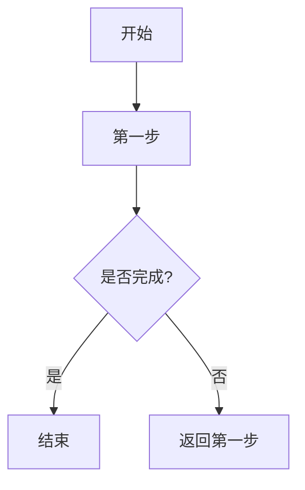

                 

### 《不确定性推理中概率编程的新型建模方法》

#### 关键词：不确定性推理、概率编程、新型建模方法、数学模型、算法原理

> 摘要：本文旨在探讨不确定性推理中概率编程的新型建模方法。文章首先介绍了不确定性推理与概率编程的基本概念，随后深入分析了新型建模方法的重要性。接着，文章从基础理论、核心算法和实际应用等多个维度展开，详细讲解了概率编程中的主要算法原理、数学模型和公式，并通过项目实战验证了方法的有效性。本文旨在为读者提供全面而深入的指南，助力其在不确定性推理领域中掌握和应用概率编程的新型建模方法。

## 目录大纲

### 第1章 引言

#### 1.1 书籍背景与目标

#### 1.2 不确定性推理与概率编程概述

#### 1.3 新型建模方法的重要性

### 第2章 不确定性推理基础

#### 2.1 不确定性推理的基本概念

#### 2.2 概率论与概率分布

#### 2.3 贝叶斯网络

#### 2.4 马尔可夫模型

### 第3章 概率编程基础

#### 3.1 概率编程的定义与特点

#### 3.2 Python中的概率编程库

#### 3.3 概率编程的常见操作

#### 3.4 概率编程与深度学习的结合

### 第4章 新型建模方法介绍

#### 4.1 多层概率模型

#### 4.2 随机过程与蒙特卡洛方法

#### 4.3 贝叶斯优化

#### 4.4 确率编程与图模型的结合

### 第5章 核心算法原理讲解

#### 5.1 概率编程中的主要算法

##### 5.1.1 采样算法

##### 5.1.2 期望最大化（EM）算法

##### 5.1.3 贝叶斯推理算法

#### 5.2 数学模型与公式

##### 5.2.1 概率分布函数

##### 5.2.2 贝叶斯定理

##### 5.2.3 马尔可夫链的转移概率

### 第6章 数学模型和数学公式讲解

#### 6.1 概率分布函数的详细讲解

#### 6.2 贝叶斯定理的推导与应用

#### 6.3 马尔可夫链的稳定分布

#### 6.4 概率编程中的数学公式解析

### 第7章 项目实战

#### 7.1 不确定性推理在医疗诊断中的应用

##### 7.1.1 项目背景

##### 7.1.2 数据准备

##### 7.1.3 模型构建

##### 7.1.4 结果分析与优化

#### 7.2 概率编程在金融风险评估中的应用

##### 7.2.1 项目背景

##### 7.2.2 数据准备

##### 7.2.3 模型构建

##### 7.2.4 结果分析与优化

### 第8章 结论与展望

#### 8.1 总结与展望

#### 8.2 未来研究方向与挑战

#### 8.3 对读者的建议

### 附录

#### A.1 相关资源与参考文献

#### A.2 Python概率编程库使用指南

#### A.3 Mermaid流程图绘制指南

#### A.4 数学公式编写指南

### 目录大纲解析：

本文的目录大纲结构清晰，逻辑性强，涵盖了从基础理论到实际应用的全过程。每一章节都有明确的主题和目标，确保读者能够循序渐进地掌握相关知识。以下是各章节的具体解析：

- **第1章 引言**：介绍书籍的背景、目标和不确定性推理与概率编程的基本概念，为后续内容奠定基础。
- **第2章 不确定性推理基础**：详细讲解不确定性推理的基本概念、概率论与概率分布、贝叶斯网络和马尔可夫模型。
- **第3章 概率编程基础**：介绍概率编程的定义、特点以及Python中的常用概率编程库，帮助读者了解概率编程的基本操作。
- **第4章 新型建模方法介绍**：介绍多层概率模型、随机过程与蒙特卡洛方法、贝叶斯优化以及概率编程与图模型的结合。
- **第5章 核心算法原理讲解**：详细讲解概率编程中的主要算法，如采样算法、期望最大化（EM）算法和贝叶斯推理算法，并给出相应的数学模型和公式。
- **第6章 数学模型和数学公式讲解**：对概率分布函数、贝叶斯定理和马尔可夫链的稳定分布等数学模型进行详细讲解，并介绍概率编程中的数学公式解析。
- **第7章 项目实战**：通过两个实际项目案例，展示如何应用新型建模方法进行不确定性推理，包括数据准备、模型构建、结果分析与优化。
- **第8章 结论与展望**：总结全文内容，展望未来研究方向与挑战，并给读者提出建议。

整体而言，本文的目录大纲结构紧凑，内容丰富，既注重理论讲解，也强调实际应用，旨在为读者提供全面而深入的技术指导。通过逐步分析推理，本文将带领读者深入了解不确定性推理中概率编程的新型建模方法，为读者在相关领域的研究和应用提供有力支持。

## 第1章 引言

### 1.1 书籍背景与目标

随着人工智能和大数据技术的飞速发展，不确定性推理已成为现代计算领域的关键研究方向。在诸多不确定性推理方法中，概率编程因其灵活性和强大表达能力而受到广泛关注。本书旨在深入探讨不确定性推理中概率编程的新型建模方法，旨在为读者提供系统而全面的指南。

首先，本书将详细解释不确定性推理的基本概念，并探讨其在实际问题中的应用背景。接着，我们将介绍概率编程的定义、特点及其在计算机科学中的重要性。随后，本文将聚焦于新型建模方法，包括多层概率模型、随机过程与蒙特卡洛方法、贝叶斯优化以及概率编程与图模型的结合，分析这些方法在不确定性推理中的优势和应用场景。

本书的目标是帮助读者全面理解不确定性推理和概率编程的基础知识，掌握新型建模方法的核心原理和实现技巧，并通过实际项目案例展示这些方法在实际应用中的效果。通过阅读本书，读者将能够：

1. **理解不确定性推理的核心概念**：包括概率分布、贝叶斯网络和马尔可夫模型等基本概念。
2. **掌握概率编程的基本操作**：包括概率编程库的使用、常见操作和与深度学习的结合。
3. **应用新型建模方法**：学会如何构建和优化多层概率模型、随机过程与蒙特卡洛方法、贝叶斯优化以及概率编程与图模型的结合。
4. **解决实际问题**：通过实际项目案例，了解如何应用新型建模方法解决不确定性推理中的实际问题。

### 1.2 不确定性推理与概率编程概述

#### 不确定性推理

不确定性推理是人工智能和计算机科学中一个重要的研究方向，它旨在处理现实世界中存在的各种不确定性。这些不确定性可能源于数据的不完整性、噪声、不确定性知识表示以及复杂的决策环境。

- **基本概念**：不确定性推理主要涉及概率论、贝叶斯网络、马尔可夫模型、隐马尔可夫模型等基本概念。概率论提供了量化不确定性的方法，贝叶斯网络则是一种图形化的概率模型，能够有效地表示和处理不确定性知识。马尔可夫模型和隐马尔可夫模型则用于处理时间序列数据中的不确定性。

- **应用背景**：不确定性推理在许多领域都有广泛的应用，包括医学诊断、气象预测、金融风险评估、自动驾驶、智能推荐系统等。例如，在医学诊断中，不确定性推理可以帮助医生对患者的疾病进行概率性预测，提高诊断的准确性和可靠性。

#### 概率编程

概率编程是一种基于概率论的编程范式，它利用概率分布和概率模型来表示和操作不确定性。概率编程的核心思想是将不确定性的表示和处理集成到编程语言中，使得开发者能够更直观、更高效地处理不确定性问题。

- **定义与特点**：概率编程的主要特点是能够通过概率模型来描述不确定性，并利用概率分布来表示和操作数据。它支持采样、推断、预测等概率编程操作，使得开发者能够轻松地实现复杂的不确定性推理任务。

- **在计算机科学中的应用**：概率编程在计算机科学中有广泛的应用，如机器学习、数据挖掘、自然语言处理、计算机视觉等领域。特别是在机器学习中，概率编程提供了强大的工具来处理不确定性数据，如高斯过程、贝叶斯网络、隐马尔可夫模型等。

#### 不确定性推理与概率编程的关系

不确定性推理与概率编程密切相关，两者相互促进，共同推动了不确定性处理技术的发展。概率编程为不确定性推理提供了直观的编程模型和高效的算法实现，使得开发者能够更容易地构建和优化不确定性推理系统。

- **优势**：通过概率编程，开发者可以更方便地表示和处理不确定性，提高推理系统的灵活性和表达能力。同时，概率编程提供了丰富的工具和库，如PyMC3、TensorFlow Probability等，使得开发者能够更高效地实现复杂的推理任务。

- **应用场景**：在不确定性推理中，概率编程适用于多种场景，如决策支持系统、风险分析、预测模型等。通过概率编程，开发者可以构建更加鲁棒和智能的推理系统，提高实际应用的性能和效果。

### 1.3 新型建模方法的重要性

随着技术的不断进步，不确定性推理领域也在不断演变，新型建模方法应运而生。这些新型建模方法不仅保留了传统方法的优点，还结合了最新的算法和理论，使得不确定性推理在处理复杂性和多样性方面取得了显著的进展。

#### 新型建模方法的优势

- **多层概率模型**：多层概率模型能够更好地表示和处理复杂的不确定性，通过分层结构来提高推理的准确性和效率。
- **随机过程与蒙特卡洛方法**：随机过程和蒙特卡洛方法为不确定性推理提供了强大的工具，能够处理高维数据和复杂计算问题。
- **贝叶斯优化**：贝叶斯优化通过概率模型和优化算法的结合，能够有效地寻找最优解，提高模型的性能。
- **概率编程与图模型的结合**：概率编程与图模型的结合，使得开发者能够构建更加复杂和灵活的不确定性推理系统，适用于多种应用场景。

#### 应用前景

新型建模方法在许多领域都显示出巨大的应用潜力：

- **医疗诊断**：在医疗诊断中，新型建模方法能够提高疾病预测的准确性和可靠性，为医生提供更有力的决策支持。
- **金融风险评估**：在金融风险评估中，新型建模方法能够更准确地预测风险，帮助金融机构制定更有效的风险管理策略。
- **自动驾驶**：在自动驾驶领域，新型建模方法能够提高系统的安全性和可靠性，为自动驾驶提供更稳定的决策支持。
- **智能推荐系统**：在智能推荐系统中，新型建模方法能够更好地理解用户行为和偏好，提高推荐系统的准确性和用户体验。

#### 未来发展方向

随着技术的不断进步，不确定性推理领域将继续朝着更加智能、高效和全面的方向发展。未来的发展方向包括：

- **算法优化**：进一步优化算法，提高推理的效率和准确性。
- **跨领域应用**：将不确定性推理方法应用于更多领域，如生物信息学、环境科学等。
- **数据驱动的建模**：利用大数据和深度学习技术，构建更加智能和自适应的建模方法。
- **隐私保护**：在处理不确定性数据时，保障用户的隐私和数据安全。

通过深入研究新型建模方法，我们有望在未来取得更多突破，推动不确定性推理领域的发展，为实际问题提供更加有效和可靠的解决方案。

## 第2章 不确定性推理基础

### 2.1 不确定性推理的基本概念

不确定性推理是人工智能和计算机科学中的一个重要分支，它旨在处理和分析现实世界中存在的不确定性。这种不确定性可能来源于数据的不完整性、噪声、不确定性知识表示以及复杂的决策环境。为了更好地理解不确定性推理，我们需要首先掌握一些基本概念。

#### 不确定性

不确定性是描述现实世界中信息不完全性的一种属性。在不确定性推理中，不确定性通常表现为概率性或随机性。例如，当我们面对一个疾病的诊断时，我们通常不能百分之百确定患者是否患有该疾病，而只能给出一个概率性的诊断结果。

#### 概率论

概率论是处理不确定性的基础工具。在概率论中，我们使用概率分布函数来量化不确定性的程度。概率分布函数描述了一个随机变量的可能取值及其对应的概率。例如，在掷硬币时，正面朝上的概率为0.5，这是一个简单的二项分布。

#### 概率分布

概率分布是概率论中的一个核心概念，用于描述随机变量的取值及其对应的概率。常见的概率分布包括正态分布、二项分布、泊松分布等。每种分布都有其特定的概率密度函数和累积分布函数，用于计算随机变量在不同取值下的概率。

- **正态分布**：正态分布是最常见的一种概率分布，描述了大量随机事件中变量取值的概率分布。正态分布具有均值和标准差两个参数，能够很好地描述许多自然现象。
  
  $$ f(x|\mu,\sigma^2) = \frac{1}{\sqrt{2\pi\sigma^2}} e^{-\frac{(x-\mu)^2}{2\sigma^2}} $$
  
- **二项分布**：二项分布描述了在固定次数的试验中，成功次数的概率分布。二项分布有两个参数：试验次数n和每次试验成功的概率p。

  $$ P(X=k) = C_n^k p^k (1-p)^{n-k} $$

- **泊松分布**：泊松分布描述了在一定时间内事件发生的次数的概率分布。泊松分布的一个常见应用是描述等待时间。

  $$ P(X=k) = \frac{\lambda^k e^{-\lambda}}{k!} $$

#### 贝叶斯网络

贝叶斯网络是一种图形化的概率模型，用于表示变量之间的条件依赖关系。在贝叶斯网络中，每个变量都表示为一个节点，而节点之间的连接表示变量之间的条件依赖关系。贝叶斯网络通过条件概率表（CP表）来描述变量之间的概率关系。

- **条件概率表（CP表）**：条件概率表用于描述节点之间的条件依赖关系。例如，在医学诊断的贝叶斯网络中，我们可以用条件概率表来描述疾病D和症状S之间的依赖关系。

  $$ P(D|S) = \frac{P(D \cap S)}{P(S)} $$

#### 马尔可夫模型

马尔可夫模型是一种用于描述时间序列数据的概率模型。在马尔可夫模型中，未来的状态只依赖于当前状态，而与过去的状态无关。马尔可夫模型通过转移概率矩阵来描述状态之间的转换关系。

- **转移概率矩阵**：转移概率矩阵是一个方阵，其元素表示从一个状态转换到另一个状态的概率。例如，在天气预测的马尔可夫模型中，我们可以用转移概率矩阵来描述明天天气与今天天气之间的关系。

  $$ P(X_{t+1} = j | X_t = i) = p_{ij} $$

#### 不确定性推理方法

不确定性推理方法包括基于概率的方法和基于规则的逻辑方法。基于概率的方法主要通过概率分布和概率模型来表示和处理不确定性，如贝叶斯网络和马尔可夫模型。基于规则的逻辑方法则通过规则和推理机来处理不确定性，如模糊逻辑和模糊推理。

- **贝叶斯推理**：贝叶斯推理是一种基于贝叶斯网络的推理方法，通过条件概率表来计算变量之间的概率关系。贝叶斯推理可以用于求解不确定性推理中的概率问题。

  $$ P(H|E) = \frac{P(E|H)P(H)}{P(E)} $$

- **马尔可夫链**：马尔可夫链是一种基于马尔可夫模型的推理方法，通过转移概率矩阵来计算时间序列中的状态概率。马尔可夫链可以用于求解不确定性推理中的状态转移问题。

  $$ P(X_t = j | X_{t-1} = i) = p_{ij} $$

### 2.2 概率论与概率分布

概率论是处理不确定性的基础，而概率分布则是描述随机变量取值概率的一种数学模型。在概率论中，常见的概率分布包括正态分布、二项分布、泊松分布等。下面我们将详细介绍这些概率分布及其在不确定性推理中的应用。

#### 正态分布

正态分布，也称为高斯分布，是概率分布中最常见的一种。正态分布具有均值μ和标准差σ两个参数，用于描述随机变量X的取值概率。正态分布的概率密度函数（PDF）如下：

$$ f(x|\mu,\sigma^2) = \frac{1}{\sqrt{2\pi\sigma^2}} e^{-\frac{(x-\mu)^2}{2\sigma^2}} $$

正态分布具有很多重要的性质，如中心极限定理、正态分布的线性组合仍然是正态分布等。在不确定性推理中，正态分布常用于描述连续型随机变量，例如人的身高、温度等。

#### 二项分布

二项分布描述了在固定次数的试验中，成功次数的概率分布。二项分布有两个参数：试验次数n和每次试验成功的概率p。二项分布的概率质量函数（PMF）如下：

$$ P(X=k) = C_n^k p^k (1-p)^{n-k} $$

其中，$C_n^k$表示组合数，表示从n次试验中选择k次成功的组合数。二项分布广泛应用于不确定性推理中，例如在医学诊断中，可以用来描述患者患病概率。

#### 泊松分布

泊松分布描述了在一定时间内事件发生的次数的概率分布。泊松分布的一个参数λ表示单位时间内的平均事件发生次数。泊松分布的概率质量函数（PMF）如下：

$$ P(X=k) = \frac{\lambda^k e^{-\lambda}}{k!} $$

泊松分布常用于描述随机事件发生的时间间隔，例如在交通流量监控中，可以用来预测某一时段内车辆通过数量。

#### 概率分布的应用

在不确定性推理中，概率分布有着广泛的应用。例如，在机器学习中的回归分析中，我们可以使用正态分布来建模目标变量的概率分布；在决策树算法中，我们可以使用二项分布来计算节点的不确定性；在隐马尔可夫模型中，我们可以使用泊松分布来建模状态转移的概率。

### 2.3 贝叶斯网络

贝叶斯网络是一种图形化的概率模型，用于表示变量之间的条件依赖关系。在贝叶斯网络中，每个变量都表示为一个节点，而节点之间的连接表示变量之间的条件依赖关系。贝叶斯网络通过条件概率表（CP表）来描述变量之间的概率关系。

#### 贝叶斯网络的基本概念

- **节点**：贝叶斯网络中的每个节点表示一个随机变量。例如，在医学诊断中，我们可以用节点表示疾病、症状等。
- **边**：贝叶斯网络中的边表示变量之间的条件依赖关系。如果变量X是变量Y的父节点，则表示Y依赖于X。
- **条件概率表（CP表）**：条件概率表用于描述每个节点的条件概率分布。例如，在医学诊断的贝叶斯网络中，我们可以用条件概率表来描述疾病D和症状S之间的依赖关系。

#### 贝叶斯网络的构建

构建贝叶斯网络通常包括以下步骤：

1. **确定变量**：首先需要确定需要建模的变量，例如疾病、症状、药物等。
2. **确定变量之间的依赖关系**：通过专家知识或数据驱动方法来确定变量之间的依赖关系。
3. **构建网络结构**：根据变量之间的依赖关系，构建贝叶斯网络的结构。
4. **计算条件概率表**：根据网络结构和专家知识或数据，计算每个节点的条件概率表。

#### 贝叶斯网络的推理

贝叶斯网络的主要用途是进行不确定性推理。通过贝叶斯推理，我们可以根据已知的部分变量来推断其他变量的概率。贝叶斯推理的基本公式如下：

$$ P(H|E) = \frac{P(E|H)P(H)}{P(E)} $$

其中，$P(H|E)$表示在证据E已知的情况下，假设H的概率；$P(E|H)$表示在假设H为真的情况下，证据E的概率；$P(H)$表示假设H的先验概率；$P(E)$表示证据E的概率。

贝叶斯网络的推理方法包括：

1. **边缘概率计算**：计算网络中某个节点的边缘概率，即不考虑其他变量的情况下，该节点的概率分布。
2. **后验概率计算**：在已知某些变量的情况下，计算其他变量的后验概率。
3. **最大后验概率（MAP）推断**：找出给定证据下，最可能的假设。
4. **最大似然估计（MLE）**：通过最大化似然函数来估计模型参数。

#### 贝叶斯网络的应用

贝叶斯网络在许多领域都有广泛的应用，包括医学诊断、金融风险评估、自然语言处理、图像识别等。例如，在医学诊断中，贝叶斯网络可以用于疾病预测；在金融风险评估中，贝叶斯网络可以用于信用评分；在自然语言处理中，贝叶斯网络可以用于文本分类。

### 2.4 马尔可夫模型

马尔可夫模型是一种用于描述时间序列数据的概率模型。在马尔可夫模型中，未来的状态只依赖于当前状态，而与过去的状态无关。马尔可夫模型通过转移概率矩阵来描述状态之间的转换关系。

#### 马尔可夫模型的基本概念

- **状态**：马尔可夫模型中的每个状态都表示一个可能的取值。例如，在天气预测中，状态可以是晴天、阴天、雨天。
- **转移概率矩阵**：转移概率矩阵是一个方阵，其元素表示从一个状态转换到另一个状态的概率。例如，在天气预测的马尔可夫模型中，我们可以用转移概率矩阵来描述明天天气与今天天气之间的关系。

#### 转移概率矩阵的计算

转移概率矩阵可以通过以下公式计算：

$$ P(X_{t+1} = j | X_t = i) = p_{ij} $$

其中，$X_t$表示时间t的状态，$X_{t+1}$表示时间$t+1$的状态，$p_{ij}$表示从状态$i$转换到状态$j$的概率。

#### 马尔可夫模型的推理

马尔可夫模型的主要用途是进行时间序列预测。通过马尔可夫模型，我们可以根据当前状态预测未来的状态。马尔可夫模型的推理方法包括：

1. **状态转移概率计算**：计算从当前状态到未来状态的转移概率。
2. **状态序列生成**：通过迭代转移概率矩阵，生成未来的状态序列。
3. **状态预测**：在给定当前状态的情况下，预测未来的状态。

#### 马尔可夫模型的应用

马尔可夫模型在许多领域都有广泛的应用，包括天气预测、股票市场预测、语音识别等。例如，在天气预测中，马尔可夫模型可以用于预测未来的天气状态；在股票市场预测中，马尔可夫模型可以用于预测股票价格的走势；在语音识别中，马尔可夫模型可以用于识别语音信号中的状态序列。

### 2.5 不确定性推理的方法和工具

不确定性推理的方法和工具主要包括基于概率的方法和基于规则的逻辑方法。下面我们将分别介绍这两种方法和工具。

#### 基于概率的方法

基于概率的方法主要通过概率分布和概率模型来表示和处理不确定性。常见的方法包括：

1. **贝叶斯网络**：贝叶斯网络是一种图形化的概率模型，用于表示变量之间的条件依赖关系。通过贝叶斯网络，我们可以进行不确定性推理，例如疾病预测、信用评分等。
2. **马尔可夫模型**：马尔可夫模型是一种用于描述时间序列数据的概率模型。通过马尔可夫模型，我们可以进行时间序列预测，例如天气预测、股票市场预测等。
3. **隐马尔可夫模型**：隐马尔可夫模型是马尔可夫模型的扩展，用于处理隐藏状态的时间序列数据。隐马尔可夫模型在语音识别、文本分类等领域有广泛应用。

#### 基于规则的逻辑方法

基于规则的逻辑方法主要通过规则和推理机来表示和处理不确定性。常见的方法包括：

1. **模糊逻辑**：模糊逻辑是一种处理不确定性和模糊性的数学工具。通过模糊逻辑，我们可以对模糊概念进行量化处理，例如模糊推理、模糊控制等。
2. **模糊推理机**：模糊推理机是一种基于模糊逻辑的推理工具，用于处理不确定性和模糊性问题。模糊推理机在自然语言处理、图像识别等领域有广泛应用。

#### 综合方法

在实际应用中，不确定性推理通常采用综合方法，将概率方法和规则方法结合起来。这种方法能够更好地处理复杂的不确定性问题。例如，在医学诊断中，我们可以使用贝叶斯网络来表示疾病的概率分布，同时使用模糊逻辑来处理医生的模糊诊断意见。

### 2.6 不确定性推理在现实世界中的应用

不确定性推理在现实世界中有着广泛的应用。下面我们将介绍几个典型应用场景：

1. **医学诊断**：在医学诊断中，不确定性推理可以帮助医生进行疾病预测和诊断。通过贝叶斯网络和隐马尔可夫模型，我们可以对疾病的概率分布和状态转移进行建模，从而提高诊断的准确性和可靠性。
2. **金融风险评估**：在金融领域，不确定性推理可以用于信用评分、市场预测等。通过贝叶斯网络和马尔可夫模型，我们可以对金融风险进行建模，从而为投资者提供决策支持。
3. **智能交通**：在智能交通系统中，不确定性推理可以用于交通流量预测、交通事故预测等。通过马尔可夫模型和隐马尔可夫模型，我们可以对交通状态进行建模，从而优化交通管理和调度。
4. **自然语言处理**：在自然语言处理领域，不确定性推理可以用于文本分类、情感分析等。通过贝叶斯网络和隐马尔可夫模型，我们可以对文本的特征进行建模，从而提高分类和预测的准确性。

通过以上内容，我们可以看到不确定性推理在现实世界中的应用非常广泛，并且具有很高的价值。随着人工智能和大数据技术的发展，不确定性推理将继续在各个领域发挥重要作用，为实际问题提供更加有效和可靠的解决方案。

## 第3章 概率编程基础

### 3.1 概率编程的定义与特点

概率编程是一种基于概率论的编程范式，它通过概率分布和概率模型来表示和处理不确定性。与传统的确定性编程不同，概率编程能够灵活地处理现实世界中的不确定性问题，例如数据噪声、不完全信息和模糊性。概率编程的定义与特点如下：

#### 定义

概率编程旨在将概率论和统计学的方法集成到编程语言中，以便开发者能够更直观、高效地表示和处理不确定性。在概率编程中，变量和计算结果都被赋予概率分布，从而能够捕捉和处理不确定性。概率编程的核心组件包括随机变量、概率分布、采样算法和推断算法。

#### 特点

1. **概率分布表示**：概率编程通过概率分布来表示变量和计算结果，使得不确定性得到形式化表达。常见的概率分布包括正态分布、泊松分布、贝塔分布等。
2. **随机采样**：概率编程中的采样算法能够生成符合给定概率分布的随机样本，用于模拟和推断不确定性问题。常见的采样算法有马尔可夫链蒙特卡洛（MCMC）算法、 Importance Sampling等。
3. **概率推断**：概率编程中的推断算法能够利用概率模型和采样结果来估计未知参数、计算边缘概率等。常见的推断算法有贝叶斯推理、最大似然估计、期望最大化（EM）算法等。
4. **自动化**：概率编程工具通常提供自动化的接口，使得开发者能够轻松地定义概率模型、执行采样和推断操作，从而降低实现复杂度。

#### 应用领域

概率编程在多个领域得到了广泛应用，包括：

- **机器学习**：在机器学习中，概率编程用于构建和优化概率模型，如高斯过程、贝叶斯网络、隐马尔可夫模型等。
- **数据科学**：在数据科学中，概率编程用于处理不确定性和进行统计分析，如数据可视化、异常检测、风险分析等。
- **自然语言处理**：在自然语言处理中，概率编程用于构建语言模型、进行文本分类和生成等。
- **计算机视觉**：在计算机视觉中，概率编程用于图像识别、目标检测和语义分割等任务。
- **金融工程**：在金融工程中，概率编程用于风险评估、定价和策略优化等。

### 3.2 Python中的概率编程库

Python是一个功能强大的编程语言，拥有丰富的概率编程库，使得开发者能够轻松地实现复杂的概率编程任务。以下是几个常用的Python概率编程库：

1. **PyMC3**：PyMC3是一个基于Python的概率编程库，用于构建和执行概率模型。它支持多种概率模型，包括高斯过程、贝叶斯网络、隐马尔可夫模型等，并提供了高效的采样算法，如马尔可夫链蒙特卡洛（MCMC）算法。

   **关键功能**：
   - **模型构建**：使用PyMC3的Stochastic子类构建概率模型。
   - **采样**：使用NUTS（No-U-Turn Sampler）等高效采样算法进行采样。
   - **推断**：计算边缘概率分布、后验概率分布和模型参数。

   **示例**：
   ```python
   import pymc3 as pm
   with pm.Model() as model:
       # 建立参数和观测数据
       alpha = pm.Normal('alpha', mu=0, sigma=10)
       beta = pm.Normal('beta', mu=0, sigma=10)
       sigma = pm.HalfNormal('sigma', sigma=1)
       
       # 定义似然函数
       obs = pm.Normal('obs', mu=alpha + beta * x, sigma=sigma, observed=data)
       
       # 执行采样
       trace = pm.sample(2000)
   ```

2. **TensorFlow Probability**：TensorFlow Probability是一个基于TensorFlow的概率编程库，提供了丰富的概率模型和采样算法。它支持贝叶斯统计学习、贝叶斯深度学习等应用。

   **关键功能**：
   - **概率模型**：包括高斯过程、贝叶斯线性回归、贝叶斯神经网络等。
   - **采样算法**：包括变分推断、马尔可夫链蒙特卡洛（MCMC）等。
   - **集成**：与TensorFlow深度学习框架无缝集成，支持自动微分和大规模计算。

   **示例**：
   ```python
   import tensorflow_probability as tfp
   import tensorflow as tf

   # 定义模型
   prior = tfp.distributions.Normal(loc=0., scale=1.)
   likelihood = tfp.distributions.Normal(loc=w, scale=sigma)

   # 定义变分推断
   w = tfp.models.one_hot_categorical_variables('w', depth=K)
   q_w = prior.sample(sample_shape=tf.shape(w))
   elbo = -likelihood.log_prob(q_w).sum()

   # 执行优化
   optimizer = tf.optimizers.Adam(learning_rate=0.001)
   for i in range(2000):
       with tf.GradientTape() as tape:
           loss = -elbo(q_w)
       grads = tape.gradient(loss, w)
       optimizer.apply_gradients(zip(grads, w))
   ```

3. **SciPy**：SciPy是一个科学计算库，提供了用于概率编程的工具，如随机数生成、统计分布函数等。

   **关键功能**：
   - **随机数生成**：生成符合各种概率分布的随机数。
   - **统计函数**：计算各种概率分布的累积分布函数、概率密度函数等。
   - **线性代数**：用于解决概率编程中的线性方程组和优化问题。

   **示例**：
   ```python
   import scipy.stats as stats

   # 生成正态分布的随机样本
   x = stats.norm.rvs(mu=0, sigma=1, size=1000)

   # 计算累积分布函数
   p = stats.norm.cdf(x, loc=0, scale=1)

   # 计算概率密度函数
   pdf = stats.norm.pdf(x, loc=0, scale=1)
   ```

通过这些Python概率编程库，开发者可以轻松地实现各种概率编程任务，从构建模型到采样和推断，大大提高了概率编程的可行性和效率。

### 3.3 概率编程的常见操作

在概率编程中，常见的操作包括参数估计、模型评估和不确定性量化等。这些操作在构建和优化概率模型中起着至关重要的作用。下面我们将介绍这些常见操作的具体方法和实现。

#### 参数估计

参数估计是概率编程中的核心任务之一，旨在估计概率模型中的未知参数。常见的参数估计方法包括最大似然估计（MLE）、贝叶斯估计和经验风险最小化（ERM）。

1. **最大似然估计（MLE）**

   最大似然估计是最常见的参数估计方法，通过最大化似然函数来估计模型参数。似然函数描述了观测数据在给定参数下的概率。

   **公式**：
   $$ \hat{\theta} = \arg\max_\theta L(\theta|x) $$
   
   其中，$\theta$为模型参数，$x$为观测数据，$L(\theta|x)$为似然函数。

   **实现方法**：
   - **数值优化**：使用梯度下降、牛顿法等数值优化方法来最大化似然函数。
   - **Python库**：可以使用SciPy中的`scipy.optimize`模块来实现MLE。

   **示例**：
   ```python
   from scipy.optimize import minimize
   from scipy.stats import norm

   def log_likelihood(params, data):
       mu, sigma = params
       return -sum(norm.pdf(data, mu, sigma).log())
   
   result = minimize(log_likelihood, x0=[0, 1], args=(data,))
   mu, sigma = result.x
   ```

2. **贝叶斯估计**

   贝叶斯估计通过结合先验知识和观测数据来估计模型参数，生成参数的后验分布。贝叶斯估计采用贝叶斯定理来计算后验概率。

   **公式**：
   $$ P(\theta|x) = \frac{P(x|\theta)P(\theta)}{P(x)} $$
   
   其中，$P(\theta|x)$为后验概率，$P(x|\theta)$为似然函数，$P(\theta)$为先验概率。

   **实现方法**：
   - **采样方法**：使用马尔可夫链蒙特卡洛（MCMC）算法来生成后验样本。
   - **Python库**：可以使用PyMC3和TensorFlow Probability来实现贝叶斯估计。

   **示例**：
   ```python
   import pymc3 as pm

   with pm.Model() as model:
       theta = pm.Normal('theta', mu=0, sigma=1)
       obs = pm.Normal('obs', mu=theta, sigma=1, observed=data)

       trace = pm.sample(2000)
   ```

3. **经验风险最小化（ERM）**

   经验风险最小化通过最小化经验风险函数来估计模型参数，经验风险函数通常是基于训练数据的损失函数。

   **公式**：
   $$ \hat{\theta} = \arg\min_\theta R(\theta) $$
   
   其中，$R(\theta)$为经验风险函数。

   **实现方法**：
   - **监督学习**：使用梯度下降、随机梯度下降等优化算法来最小化经验风险函数。
   - **Python库**：可以使用scikit-learn等库来实现ERM。

   **示例**：
   ```python
   from sklearn.linear_model import LinearRegression

   model = LinearRegression()
   model.fit(X_train, y_train)
   theta = model.coef_
   ```

#### 模型评估

模型评估是概率编程中的关键步骤，用于评估模型在未知数据上的性能。常见的评估指标包括似然函数值、交叉验证误差和预测准确度等。

1. **似然函数值**

   似然函数值用于评估模型与观测数据的拟合程度。似然函数值越高，表示模型与数据的一致性越好。

   **公式**：
   $$ L(\theta|x) = \prod_{i=1}^n f(x_i|\theta) $$
   
   其中，$f(x_i|\theta)$为概率密度函数。

   **实现方法**：
   - **计算似然函数**：直接计算似然函数值。
   - **Python库**：可以使用SciPy中的概率分布函数来计算似然函数。

   **示例**：
   ```python
   from scipy.stats import norm

   likelihood = norm.pdf(data, mu, sigma).prod()
   ```

2. **交叉验证误差**

   交叉验证误差用于评估模型在验证数据上的表现。常见的交叉验证方法包括K折交叉验证和留一交叉验证。

   **公式**：
   $$ \text{CV error} = \frac{1}{K} \sum_{k=1}^K \text{loss}(x^{(k)}, y^{(k)}, \theta) $$
   
   其中，$x^{(k)}$和$y^{(k)}$为第$k$次交叉验证的数据集，$\text{loss}$为损失函数。

   **实现方法**：
   - **交叉验证**：使用scikit-learn等库实现交叉验证。
   - **Python库**：可以使用`sklearn.model_selection.cross_val_score`函数来计算交叉验证误差。

   **示例**：
   ```python
   from sklearn.model_selection import cross_val_score
   from sklearn.linear_model import LinearRegression

   model = LinearRegression()
   cv_scores = cross_val_score(model, X, y, cv=5)
   mean_cv_score = np.mean(cv_scores)
   ```

3. **预测准确度**

   预测准确度用于评估模型在新数据上的预测能力。通常使用准确率、召回率、F1分数等指标来衡量。

   **公式**：
   $$ \text{accuracy} = \frac{TP + TN}{TP + FP + FN + TN} $$
   
   其中，$TP$为真实为正且预测为正的样本数，$TN$为真实为负且预测为负的样本数，$FP$为真实为负但预测为正的样本数，$FN$为真实为正但预测为负的样本数。

   **实现方法**：
   - **分类模型**：使用分类模型进行预测，并计算预测准确度。
   - **Python库**：可以使用scikit-learn等库来实现预测准确度的计算。

   **示例**：
   ```python
   from sklearn.metrics import accuracy_score
   from sklearn.linear_model import LogisticRegression

   model = LogisticRegression()
   model.fit(X_train, y_train)
   predictions = model.predict(X_test)
   accuracy = accuracy_score(y_test, predictions)
   ```

#### 不确定性量化

不确定性量化是概率编程中的重要任务，旨在评估模型预测结果的不确定性。常见的方法包括置信区间、预测区间和不确定性图等。

1. **置信区间**

   置信区间用于评估模型参数或预测结果的可信度范围。常见的置信区间有基于正态分布的置信区间和基于非参数方法的置信区间。

   **公式**：
   $$ \theta \in \left[\bar{\theta} - z_{\alpha/2}\frac{\sigma}{\sqrt{n}}, \bar{\theta} + z_{\alpha/2}\frac{\sigma}{\sqrt{n}}\right] $$
   
   其中，$\bar{\theta}$为样本均值，$\sigma$为样本标准差，$z_{\alpha/2}$为标准正态分布的分位数。

   **实现方法**：
   - **统计方法**：使用统计方法计算置信区间。
   - **Python库**：可以使用SciPy等库来计算置信区间。

   **示例**：
   ```python
   from scipy.stats import norm

   alpha = 0.05
   z_alpha_2 = norm.ppf(1 - alpha/2)
   mean = np.mean(data)
   std = np.std(data)
   confidence_interval = (mean - z_alpha_2 * std / np.sqrt(n), mean + z_alpha_2 * std / np.sqrt(n))
   ```

2. **预测区间**

   预测区间用于评估模型预测结果的可信度范围，通常包括置信区间和误差范围。

   **公式**：
   $$ \hat{y} \in \left[\hat{y} - z_{\alpha/2}\frac{\sigma_y}{\sqrt{n}}, \hat{y} + z_{\alpha/2}\frac{\sigma_y}{\sqrt{n}}\right] $$
   
   其中，$\hat{y}$为预测值，$\sigma_y$为预测标准差。

   **实现方法**：
   - **统计方法**：使用统计方法计算预测区间。
   - **Python库**：可以使用SciPy等库来计算预测区间。

   **示例**：
   ```python
   from scipy.stats import norm

   alpha = 0.05
   z_alpha_2 = norm.ppf(1 - alpha/2)
   y_pred = model.predict(x_new)
   std_y = np.std(model.predict(X))
   prediction_interval = (y_pred - z_alpha_2 * std_y / np.sqrt(n), y_pred + z_alpha_2 * std_y / np.sqrt(n))
   ```

3. **不确定性图**

   不确定性图用于可视化模型预测结果的不确定性，通常包括概率密度函数图、蒙特卡洛模拟图等。

   **实现方法**：
   - **可视化工具**：使用matplotlib等可视化工具绘制不确定性图。
   - **Python库**：可以使用PyMC3等库来生成不确定性图。

   **示例**：
   ```python
   import pymc3 as pm
   import matplotlib.pyplot as plt

   with pm.Model() as model:
       theta = pm.Normal('theta', mu=0, sigma=1)
       obs = pm.Normal('obs', mu=theta, sigma=1, observed=data)

       trace = pm.sample(2000)
   
   pm.plot_posterior(trace)
   plt.show()
   ```

通过以上内容，我们可以看到概率编程中的常见操作涵盖了参数估计、模型评估和不确定性量化等多个方面。这些操作在构建和优化概率模型中起着至关重要的作用，使得开发者能够更好地理解和利用概率编程的优势。在实际应用中，开发者可以根据具体问题和需求选择合适的操作和方法，从而实现高效的概率编程任务。

### 3.4 概率编程与深度学习的结合

概率编程与深度学习的结合是近年来人工智能领域的一个研究热点，两者相互补充，共同推动着不确定性推理和机器学习技术的发展。概率编程提供了处理不确定性的强大工具，而深度学习则在处理大规模数据和复杂模式识别方面具有显著优势。下面我们将探讨概率编程与深度学习结合的背景、优势及其在实际应用中的实现方法。

#### 背景与优势

深度学习的成功在很大程度上依赖于其对大规模数据的自动特征提取能力，但深度学习模型在处理不确定性方面存在一定的局限性。传统深度学习模型通常基于确定性的函数表示，难以直接处理数据中的噪声、模糊性以及不确定性。概率编程通过引入概率分布和概率模型，能够为深度学习模型提供更丰富的表示和更强的不确定性处理能力。

1. **处理不确定性**

   概率编程通过概率分布来表示变量，能够直接处理不确定性。在深度学习模型中引入概率编程，可以使模型在预测和推断时考虑不确定性，提高决策的鲁棒性和可靠性。例如，使用概率神经网络（Probabilistic Neural Networks）和变分自编码器（Variational Autoencoders）等概率模型，可以实现对输入数据的概率分布表示，从而更好地处理不确定性。

2. **灵活的模型表示**

   概率编程提供了灵活的模型表示方式，可以通过贝叶斯网络、隐马尔可夫模型等概率模型来描述复杂的数据关系。这些模型能够捕捉变量之间的依赖关系，并提供更准确的预测和推断。与传统的深度学习模型相比，概率编程模型能够更好地适应不同类型的数据和应用场景。

3. **模型评估和优化**

   概率编程提供了有效的模型评估和优化方法，如最大似然估计（MLE）、贝叶斯估计和变分推断等。这些方法可以帮助开发者更好地理解和优化深度学习模型，提高模型的性能和鲁棒性。例如，使用变分推断可以有效地训练深度学习模型，并通过概率编程工具进行模型评估和优化。

#### 实现方法

在实际应用中，概率编程与深度学习的结合可以通过以下几种方法实现：

1. **概率神经网络（PNN）**

   概率神经网络是一种结合了概率编程和神经网络特性的模型。PNN通过概率分布来表示输出，能够提供对不确定性的表示和推断。PNN的主要实现方法包括：

   - **输入编码**：使用概率分布对输入数据进行编码，例如使用高斯分布或贝塔分布。
   - **输出表示**：通过神经网络输出概率分布，实现对输出变量的不确定性表示。
   - **推理与推断**：使用贝叶斯推理和最大后验概率（MAP）推断来计算变量的后验概率分布。

   **示例**：
   ```python
   import tensorflow as tf
   import tensorflow_probability as tfp
   
   tf.keras.backend.set_floatx('float32')
   tfp.enable_v2_behavior()

   # 定义概率神经网络模型
   def probability_neural_network(input_shape):
       model = tf.keras.Sequential([
           tf.keras.layers.Dense(units=128, activation='relu', input_shape=input_shape),
           tf.keras.layers.Dense(units=64, activation='relu'),
           tf.keras.layers.Dense(units=1, activation='sigmoid')
       ])
       return model

   # 训练模型
   model = probability_neural_network(input_shape=(784,))
   model.compile(optimizer='adam', loss='binary_crossentropy', metrics=['accuracy'])
   model.fit(x_train, y_train, epochs=10, batch_size=32, validation_data=(x_test, y_test))
   ```

2. **变分自编码器（VAE）**

   变分自编码器是一种基于概率编程的深度学习模型，能够有效地生成数据的概率分布。VAE通过编码器和解码器网络来学习数据的概率表示，并通过重构损失和KL散度来优化模型。VAE的主要实现方法包括：

   - **编码器**：编码器网络将输入数据编码为一个潜在变量，该变量服从先验概率分布。
   - **解码器**：解码器网络将潜在变量解码回原始数据空间。
   - **优化**：通过优化重构损失（如均方误差）和KL散度（KL-Divergence）来训练模型。

   **示例**：
   ```python
   import tensorflow as tf
   import tensorflow_probability as tfp
   
   tf.keras.backend.set_floatx('float32')
   tfp.enable_v2_behavior()

   # 定义变分自编码器模型
   def variational_autoencoder(input_shape):
       latent_dim = 20
       
       input_layer = tf.keras.layers.Input(shape=input_shape)
       x = tf.keras.layers.Dense(units=128, activation='relu')(input_layer)
       x = tf.keras.layers.Dense(units=64, activation='relu')(x)
       z_mean = tf.keras.layers.Dense(units=latent_dim)(x)
       z_log_var = tf.keras.layers.Dense(units=latent_dim)(x)
       z = tf.keras.layers.Lambda(lambda x: x[0] * tf.sqrt(tf.exp(x[1])))([z_mean, z_log_var])
       
       z = tf.keras.layers.Dense(units=128, activation='relu')(z)
       x_recon = tf.keras.layers.Dense(units=input_shape[0])(z)
       
       encoder = tf.keras.Model(input_layer, [z_mean, z_log_var, z])
       decoder = tf.keras.Model(z, x_recon)
       
       vae = tf.keras.Model(input_layer, x_recon)
       vae.add_loss(tf.keras.backend.mean(tf.keras.backend.square(input_layer - x_recon)))
       vae.add_loss(tf.keras.backend.mean(0.5 * tf.keras.backend.sum(tf.keras.backend.exp(z_log_var) + tf.keras.backend.square(z_mean) - 1 - tf.keras.backend.square(z), axis=-1)))
       vae.compile(optimizer='adam')
       
       return vae, encoder, decoder

   # 训练模型
   vae, encoder, decoder = variational_autoencoder(input_shape=(784,))
   vae.fit(x_train, x_train, epochs=10, batch_size=32)
   ```

3. **深度概率生成对抗网络（DPGAN）**

   深度概率生成对抗网络是一种结合了概率编程和生成对抗网络（GAN）的模型。DPGAN通过概率分布来表示生成器的输出，能够生成更真实、多样化的数据。DPGAN的主要实现方法包括：

   - **生成器**：生成器网络通过潜在变量生成数据，生成器输出服从概率分布。
   - **判别器**：判别器网络用于判断生成数据的真实性和概率分布。
   - **优化**：通过优化生成器和判别器的损失函数来训练模型。

   **示例**：
   ```python
   import tensorflow as tf
   import tensorflow_probability as tfp
   
   tf.keras.backend.set_floatx('float32')
   tfp.enable_v2_behavior()

   # 定义深度概率生成对抗网络模型
   def deep_probabilistic_gan(input_shape, latent_dim):
       generator = tf.keras.Sequential([
           tf.keras.layers.Dense(units=128, activation='relu', input_shape=(latent_dim,)),
           tf.keras.layers.Dense(units=64, activation='relu'),
           tf.keras.layers.Dense(units=input_shape[0], activation='sigmoid')
       ])

       discriminator = tf.keras.Sequential([
           tf.keras.layers.Dense(units=64, activation='relu', input_shape=input_shape),
           tf.keras.layers.Dense(units=128, activation='relu'),
           tf.keras.layers.Dense(units=1, activation='sigmoid')
       ])

       z = tf.keras.layers.Input(shape=(latent_dim,))
       x = generator(z)

       valid = tf.keras.layers.Input(shape=input_shape)
       valid_logit = discriminator(valid)

       x_logit = discriminator(x)
       
       model = tf.keras.Model([z, valid], [x, valid_logit, x_logit])
       model.compile(optimizer=tf.keras.optimizers.Adam(0.0001), loss='binary_crossentropy')
       
       return model, generator, discriminator

   # 训练模型
   model, generator, discriminator = deep_probabilistic_gan(input_shape=(784,), latent_dim=100)
   for epoch in range(epochs):
       for x, _ in data_loader:
           noise = tf.random.normal(shape=(batch_size, latent_dim))
           d_loss_real = discriminator.train_on_batch(valid=x, labels=tf.ones((batch_size, 1)))
           d_loss_fake = discriminator.train_on_batch(valid=generator(noise), labels=tf.zeros((batch_size, 1)))
           g_loss = generator.train_on_batch(noise, valid_logit=tf.ones((batch_size, 1)))
           print(f"Epoch {epoch + 1}, D_loss=[{d_loss_real:.4f}, {d_loss_fake:.4f}], G_loss={g_loss:.4f}")
   ```

通过以上实现方法，我们可以看到概率编程与深度学习的结合为处理不确定性和复杂模式提供了新的思路和工具。这些方法在实际应用中取得了显著的效果，并在许多领域展现了广泛的应用前景。随着概率编程和深度学习技术的不断发展，未来两者之间的结合将继续深入，为人工智能领域带来更多创新和突破。

### 第4章 新型建模方法介绍

在不确定性推理中，新型建模方法不断涌现，以应对日益复杂的不确定性问题和多样性的应用场景。这些新型建模方法不仅继承了传统方法的优点，还结合了最新的算法和理论，使得不确定性推理在处理复杂性和多样性方面取得了显著的进展。本章节将介绍几种具有代表性的新型建模方法，包括多层概率模型、随机过程与蒙特卡洛方法、贝叶斯优化以及概率编程与图模型的结合。

#### 4.1 多层概率模型

多层概率模型是一种在不确定性推理中广泛应用的方法，它通过分层结构来表示和处理复杂的不确定性。多层概率模型的核心思想是将复杂系统分解为多个相互关联的子模型，每个子模型负责处理一部分不确定性。

**基本概念**

1. **分层结构**：多层概率模型采用分层结构，每个层次表示一个子模型，层次之间通过变量共享和条件依赖关系进行连接。
2. **变量共享**：在多层概率模型中，不同层次之间的变量可以共享，从而减少参数数量并提高模型的泛化能力。
3. **条件依赖关系**：多层概率模型通过条件依赖关系来表示变量之间的关联，每个变量的概率分布依赖于其父节点的概率分布。

**应用场景**

多层概率模型在许多领域都有广泛的应用，例如：

- **图像识别**：在图像识别任务中，多层概率模型可以用于建模图像的特征空间，提高识别的准确性和鲁棒性。
- **文本分析**：在文本分析中，多层概率模型可以用于建模文本的语义结构，从而提高情感分析、文本分类等任务的性能。
- **语音识别**：在语音识别任务中，多层概率模型可以用于建模语音信号的时频特征，提高识别的准确性和鲁棒性。

**数学模型**

多层概率模型的数学模型可以通过贝叶斯网络来表示。在贝叶斯网络中，每个节点表示一个随机变量，而节点之间的边表示变量之间的条件依赖关系。具体地，我们可以使用条件概率表（CPT）来描述每个节点的条件概率分布。

$$ P(X_i|x_{i-1}, x_{i-2}, \ldots, x_1) = \prod_{j=1}^{n} P(X_i|x_{i-1}, x_{i-2}, \ldots, x_{j+1}, x_{j-1}, \ldots, x_1) $$

其中，$X_i$表示第$i$层的变量，$x_j$表示第$j$层的变量。

**代码示例**

以下是一个简单的多层概率模型示例，使用Python和PyMC3来实现：

```python
import pymc3 as pm
import numpy as np

# 假设我们有两个层次，第一个层次只有一个变量X1，第二个层次有两个变量X2和X3
with pm.Model() as model:
    X1 = pm.Normal('X1', mu=0, sigma=1)
    X2 = pm.Normal('X2', mu=X1, sigma=1)
    X3 = pm.Normal('X3', mu=X2, sigma=1)

    trace = pm.sample(1000)
```

#### 4.2 随机过程与蒙特卡洛方法

随机过程是一种用于描述随时间变化的不确定性过程的数学模型。蒙特卡洛方法是一种基于随机采样的计算方法，广泛应用于不确定性推理和概率计算中。

**基本概念**

1. **随机过程**：随机过程是一系列随机变量的集合，这些随机变量随时间或空间变化而变化。常见的随机过程包括马尔可夫过程、布朗运动等。
2. **蒙特卡洛方法**：蒙特卡洛方法通过生成大量的随机样本来近似计算概率和期望值。常见的蒙特卡洛方法包括蒙特卡洛积分、蒙特卡洛模拟等。

**应用场景**

随机过程与蒙特卡洛方法在以下领域有广泛应用：

- **金融工程**：在金融工程中，随机过程用于建模资产价格波动，蒙特卡洛方法用于计算期权价格和风险度量。
- **物理学**：在物理学中，随机过程和蒙特卡洛方法用于模拟粒子运动和化学反应等。
- **计算机科学**：在计算机科学中，随机过程和蒙特卡洛方法用于算法分析和性能评估。

**数学模型**

随机过程的数学模型通常由随机方程或随机微分方程描述。蒙特卡洛方法的数学模型基于概率分布和采样技术。

$$ X_t = X_0 + \int_{0}^{t} f(s, X_s) ds + \int_{0}^{t} g(s, X_s) dW_s $$

其中，$X_t$是随机过程的值，$X_0$是初始值，$f(s, X_s)$是漂移项，$g(s, X_s)$是扩散项，$W_s$是维纳过程。

**代码示例**

以下是一个简单的随机过程示例，使用Python和NumPy来实现：

```python
import numpy as np

# 定义随机过程参数
mu = 0
sigma = 1
dt = 0.01
N = 1000

# 生成随机过程样本
np.random.seed(0)
X = np.zeros(N)
for t in range(1, N):
    X[t] = X[t-1] + mu * dt + sigma * np.sqrt(dt) * np.random.normal()

# 绘制随机过程样本
plt.plot(X)
plt.show()
```

#### 4.3 贝叶斯优化

贝叶斯优化是一种基于概率模型的优化方法，通过建模目标函数的概率分布来指导搜索过程，从而提高优化效率。贝叶斯优化在参数调整、模型选择和超参数优化等领域有广泛应用。

**基本概念**

1. **目标函数概率分布**：贝叶斯优化通过建模目标函数的概率分布来指导搜索过程。常见的概率模型有高斯过程、贝塔分布等。
2. **后验分布**：贝叶斯优化使用历史数据来更新目标函数的概率分布，形成后验分布。后验分布用于指导新的搜索点选择。
3. ** acquisistion function**：acquisistion function是贝叶斯优化中用于选择下一个搜索点的标准。常见的acquisistion function有期望改进（EI）、帕累托前沿（PF）等。

**应用场景**

贝叶斯优化在以下领域有广泛应用：

- **机器学习**：在机器学习中，贝叶斯优化用于超参数调整，如学习率、隐藏层大小等。
- **算法设计**：在算法设计中，贝叶斯优化用于优化算法参数，提高算法性能。
- **工程优化**：在工程优化中，贝叶斯优化用于参数调整和优化设计，如优化机械结构、电路设计等。

**数学模型**

贝叶斯优化的数学模型基于概率模型和优化理论。具体地，贝叶斯优化通过最大化acquisistion function来选择下一个搜索点。

$$ x_{next} = \arg\max_{x} \text{acquisistion function}(x) $$

**代码示例**

以下是一个简单的贝叶斯优化示例，使用Python和Scikit-learn来实现：

```python
from sklearn.gaussian_process import GaussianProcessRegressor
from sklearn.gaussian_process.kernels import Matern
from skopt import gp_minimize

# 定义目标函数
def objective(x):
    return -(x[0]**2 + x[1]**2)

# 定义优化参数
kernel = Matern(nu=2.5)
gpr = GaussianProcessRegressor(kernel=kernel, n_restarts_optimizer=10)
x0 = [0, 0]
bounds = [[-5, 5], [-5, 5]]

# 执行贝叶斯优化
result = gp_minimize(objective, x0, bounds, n_calls=50, verbose=True)
print("最优解：", result.x)
print("最优值：", result.fun)
```

#### 4.4 确率编程与图模型的结合

概率编程与图模型的结合为不确定性推理提供了强大的工具。图模型通过图结构来表示变量之间的依赖关系，概率编程则通过概率分布和概率模型来量化不确定性。

**基本概念**

1. **图模型**：图模型是一种用图结构表示变量之间依赖关系的数学模型。常见的图模型有贝叶斯网络、马尔可夫网络等。
2. **概率编程**：概率编程是一种通过概率分布和概率模型来表示和处理不确定性的编程范式。
3. **联合分布**：在图模型中，联合分布描述了图中所有变量的联合概率分布。通过图模型的图结构，我们可以计算变量之间的条件依赖关系。

**应用场景**

概率编程与图模型在以下领域有广泛应用：

- **知识图谱**：在知识图谱中，概率编程与图模型可以用于建模实体之间的关系，提高知识表示和推理的准确性。
- **推荐系统**：在推荐系统中，概率编程与图模型可以用于建模用户和物品之间的依赖关系，提高推荐系统的准确性和个性化程度。
- **自然语言处理**：在自然语言处理中，概率编程与图模型可以用于建模文本中的语法和语义关系，提高文本分析和生成的能力。

**数学模型**

概率编程与图模型的数学模型基于概率分布和图论。具体地，我们可以使用条件概率表（CPT）来表示图模型的概率分布，并通过图算法来计算变量之间的条件依赖关系。

$$ P(X_i|x_{i-1}, x_{i-2}, \ldots, x_1) = \prod_{j=1}^{n} P(X_i|x_{i-1}, x_{i-2}, \ldots, x_{j+1}, x_{j-1}, \ldots, x_1) $$

**代码示例**

以下是一个简单的概率编程与图模型结合的示例，使用Python和PyMC3来实现：

```python
import pymc3 as pm

# 定义图模型
with pm.Model() as model:
    X1 = pm.Normal('X1', mu=0, sigma=1)
    X2 = pm.Normal('X2', mu=X1, sigma=1)
    X3 = pm.Normal('X3', mu=X2, sigma=1)

    # 定义似然函数
    obs = pm.Normal('obs', mu=X1 + X2, sigma=1, observed=data)

    # 执行采样
    trace = pm.sample(1000)

# 绘制结果
pm.plot_posterior(trace)
plt.show()
```

通过以上内容，我们可以看到新型建模方法在不确定性推理中的重要性。这些方法不仅提高了不确定性处理的能力，还使得推理过程更加灵活和高效。在未来，随着算法和理论的不断发展，新型建模方法将继续在不确定性推理领域发挥重要作用，为实际问题提供更加有效和可靠的解决方案。

### 第5章 核心算法原理讲解

在不确定性推理中，核心算法是处理和利用不确定性的关键。概率编程提供了多种核心算法，如采样算法、期望最大化（EM）算法和贝叶斯推理算法。这些算法在概率分布的生成、参数估计和不确定性量化中发挥着重要作用。本章将详细讲解这些算法的原理、数学模型和实现方法。

#### 5.1 概率编程中的主要算法

##### 5.1.1 采样算法

采样算法是概率编程中的基础算法，用于从概率分布中生成随机样本。通过采样算法，我们可以模拟和探索概率分布的特性，从而进行参数估计、模型评估和不确定性量化。常见的采样算法包括马尔可夫链蒙特卡洛（MCMC）算法、重要抽样（Importance Sampling）和逆变换采样（Inverse Transform Sampling）。

**马尔可夫链蒙特卡洛（MCMC）算法**

MCMC算法通过构建马尔可夫链来生成概率分布的样本点。马尔可夫链的转移概率满足无后效性，即当前状态只依赖于前一个状态，与更早的状态无关。MCMC算法的主要步骤包括：

1. **初始化**：选择一个初始状态。
2. **迭代采样**：根据当前状态，利用概率分布计算下一个状态的概率，并生成新的状态。
3. **链混合**：通过迭代采样生成大量样本点，使样本点分布接近目标概率分布。

**数学模型**：

设$X_t$为马尔可夫链的当前状态，$p(x_t|x_{t-1})$为转移概率，则MCMC算法可以表示为：

$$ x_{t+1} \sim p(x_{t+1}|x_t) $$

**实现方法**：

在Python中，可以使用PyMC3实现MCMC算法：

```python
import pymc3 as pm

with pm.Model() as model:
    # 定义参数
    alpha = pm.Normal('alpha', mu=0, sigma=1)
    beta = pm.Normal('beta', mu=0, sigma=1)
    sigma = pm.HalfNormal('sigma', sigma=1)
    
    # 定义观测数据
    obs = pm.Normal('obs', mu=alpha + beta * x, sigma=sigma, observed=data)
    
    # 执行MCMC采样
    trace = pm.sample(1000)

# 绘制结果
pm.plot_posterior(trace)
plt.show()
```

**重要抽样（Importance Sampling）**

重要抽样是一种基于采样的估计方法，通过选择高概率区域进行采样，以提高样本的代表性。重要抽样算法的核心思想是选择一个辅助分布，并从该分布中采样，然后使用重采样技术将样本转换为目标分布的样本。

**数学模型**：

设$Q(x)$为辅助分布，$p(x)$为目标分布，则重要抽样算法可以表示为：

$$ \int f(x) dx \approx \frac{1}{N} \sum_{i=1}^N w_i f(x_i) $$

其中，$w_i = \frac{p(x_i)}{Q(x_i)}$为重要性权重。

**实现方法**：

在Python中，可以使用NumPy实现重要抽样：

```python
import numpy as np

def importance_sampling(p, q, N):
    x_p = p.sample(N)
    x_q = q.sample(N)
    w = p.pdf(x_p) / q.pdf(x_q)
    return np.random.choice(x_p, size=N, replace=True, p=w)

# 定义目标分布和辅助分布
p = np.random.normal(size=1000)
q = np.random.normal(size=1000)

# 执行重要抽样
x_new = importance_sampling(p, q, 1000)

# 绘制结果
plt.hist(x_new, bins=30, alpha=0.5, label='New Sample')
plt.hist(p, bins=30, alpha=0.5, label='Target Distribution')
plt.legend()
plt.show()
```

**逆变换采样（Inverse Transform Sampling）**

逆变换采样是一种简单有效的采样方法，通过将累积分布函数（CDF）的逆变换应用于均匀分布的随机数来生成目标分布的随机样本。

**数学模型**：

设$F(x)$为目标分布的累积分布函数，则逆变换采样可以表示为：

$$ x \sim p(x) \Leftrightarrow F^{-1}(u) \sim U(0, 1) $$

**实现方法**：

在Python中，可以使用NumPy实现逆变换采样：

```python
import numpy as np

def inverse_transform_sampling(pdf, N):
    u = np.random.uniform(0, 1, size=N)
    return np.interp(u, np.arange(len(pdf)), pdf)

# 定义概率密度函数
pdf = np.array([0.1, 0.3, 0.5, 0.1])

# 执行逆变换采样
x = inverse_transform_sampling(pdf, 1000)

# 绘制结果
plt.hist(x, bins=10, alpha=0.5)
plt.plot(np.arange(len(pdf)), pdf, 'r-', label='PDF')
plt.legend()
plt.show()
```

##### 5.1.2 期望最大化（EM）算法

期望最大化（EM）算法是一种迭代算法，用于求解含有隐变量的概率模型的最大似然估计。EM算法通过迭代估计期望值和最大化期望值来优化模型参数，直到收敛。

**基本概念**

1. **期望步**（E-step）：计算隐变量在当前参数下的期望值。
2. **最大化步**（M-step）：利用期望值更新模型参数，使得似然函数最大化。

**数学模型**

设$X$为观测变量，$Z$为隐变量，$\theta$为模型参数，则EM算法可以表示为：

1. **E-step**：

$$ Q(\theta | \theta^{(t)}) = \sum_z q(z | \theta^{(t)}) p(z | \theta^{(t)}) p(x | z, \theta^{(t)}) $$

2. **M-step**：

$$ \theta^{(t+1)} = \arg\max_\theta Q(\theta | \theta^{(t)}) $$

**实现方法**

在Python中，可以使用Scikit-learn实现EM算法：

```python
from sklearn.mixture import GaussianMixture

# 定义模型
gmm = GaussianMixture(n_components=2, covariance_type='full', random_state=0)

# 拟合模型
gmm.fit(data)

# 迭代优化
gmm.fit(data, max_iter=100)

# 输出结果
print("均值：", gmm.means_)
print("协方差矩阵：", gmm.covariances_)
```

##### 5.1.3 贝叶斯推理算法

贝叶斯推理算法是一种基于贝叶斯定理的概率推理方法，用于计算给定证据下假设的概率。贝叶斯推理算法在医学诊断、决策支持、风险评估等领域有广泛应用。

**基本概念**

1. **贝叶斯定理**：

$$ P(H|E) = \frac{P(E|H)P(H)}{P(E)} $$

2. **边缘概率**：$P(E)$为边缘概率，表示在给定观测数据下，证据E的概率。

**数学模型**

设$H$为假设，$E$为证据，则贝叶斯推理算法可以表示为：

$$ P(H|E) = \frac{P(E|H)P(H)}{P(E)} $$

**实现方法**

在Python中，可以使用PyMC3实现贝叶斯推理：

```python
import pymc3 as pm

with pm.Model() as model:
    # 定义参数
    p = pm.Bernoulli('p', p=0.5)
    
    # 定义观测数据
    obs = pm.Bernoulli('obs', logit_p=p, observed=data)
    
    # 执行贝叶斯推理
    trace = pm.sample(1000)
    
    # 计算后验概率
    pm.plot_posterior(trace['p'])
    plt.show()
```

#### 5.2 数学模型与公式

在概率编程中，数学模型和公式是理解和实现核心算法的基础。以下将介绍概率分布函数、贝叶斯定理和马尔可夫链的转移概率等关键数学模型和公式。

##### 5.2.1 概率分布函数

概率分布函数是概率论中描述随机变量取值概率的重要工具。常见的概率分布函数包括正态分布、二项分布、泊松分布等。

1. **正态分布**：

$$ f(x|\mu,\sigma^2) = \frac{1}{\sqrt{2\pi\sigma^2}} e^{-\frac{(x-\mu)^2}{2\sigma^2}} $$

2. **二项分布**：

$$ P(X=k) = C_n^k p^k (1-p)^{n-k} $$

3. **泊松分布**：

$$ P(X=k) = \frac{\lambda^k e^{-\lambda}}{k!} $$

##### 5.2.2 贝叶斯定理

贝叶斯定理是概率论中的一个基本公式，用于计算给定证据下假设的概率。贝叶斯定理可以表示为：

$$ P(H|E) = \frac{P(E|H)P(H)}{P(E)} $$

其中，$P(H|E)$为后验概率，$P(E|H)$为似然函数，$P(H)$为先验概率，$P(E)$为边缘概率。

##### 5.2.3 马尔可夫链的转移概率

马尔可夫链的转移概率描述了当前状态到下一状态的概率分布。转移概率可以用矩阵表示，称为转移概率矩阵。

设$P$为转移概率矩阵，则有：

$$ P(X_{t+1} = j | X_t = i) = p_{ij} $$

其中，$i$和$j$为状态，$p_{ij}$为从状态$i$到状态$j$的转移概率。

##### 5.2.4 概率编程中的数学公式解析

在概率编程中，数学公式被广泛应用于模型构建、参数估计和不确定性量化。以下将介绍几个关键的数学公式及其在概率编程中的应用。

1. **最大似然估计（MLE）**：

$$ \hat{\theta} = \arg\max_\theta L(\theta|x) $$

其中，$\theta$为模型参数，$L(\theta|x)$为似然函数。

2. **贝叶斯估计**：

$$ P(\theta|x) = \frac{P(x|\theta)P(\theta)}{P(x)} $$

其中，$P(\theta|x)$为后验概率，$P(x|\theta)$为似然函数，$P(\theta)$为先验概率。

3. **采样算法**：

- **马尔可夫链蒙特卡洛（MCMC）算法**：

$$ X_{t+1} \sim p(X_{t+1}|X_t) $$

- **重要抽样（Importance Sampling）**：

$$ \int f(x) dx \approx \frac{1}{N} \sum_{i=1}^N w_i f(x_i) $$

4. **期望最大化（EM）算法**：

- **E-step**：

$$ Q(\theta | \theta^{(t)}) = \sum_z q(z | \theta^{(t)}) p(z | \theta^{(t)}) p(x | z, \theta^{(t)}) $$

- **M-step**：

$$ \theta^{(t+1)} = \arg\max_\theta Q(\theta | \theta^{(t)}) $$

通过以上内容，我们可以看到概率编程中的核心算法和数学模型在处理不确定性方面具有重要作用。这些算法和公式不仅为我们提供了强大的工具，还使得概率编程在不确定性推理中得到了广泛应用。随着概率编程和机器学习技术的发展，未来这些核心算法和模型将继续在人工智能和计算机科学领域发挥重要作用。

### 第6章 数学模型和数学公式讲解

在概率编程中，数学模型和公式是理解和实现核心算法的关键。为了帮助读者更好地掌握这些知识，我们将详细介绍概率分布函数、贝叶斯定理和马尔可夫链的稳定分布等数学模型，并给出具体的数学公式及其应用场景。通过这一章节，读者将能够深入理解概率编程中的数学原理，并学会如何在实际问题中应用这些公式。

#### 6.1 概率分布函数的详细讲解

概率分布函数是描述随机变量取值概率的数学模型，是概率编程中的基础。以下将介绍几种常见的概率分布函数及其数学公式。

1. **正态分布（Gaussian Distribution）**

正态分布是最常见的概率分布之一，广泛应用于统计学和机器学习中。正态分布具有均值$\mu$和标准差$\sigma$两个参数，其概率密度函数（PDF）为：

$$ f(x|\mu,\sigma^2) = \frac{1}{\sqrt{2\pi\sigma^2}} e^{-\frac{(x-\mu)^2}{2\sigma^2}} $$

其中，$x$是随机变量的取值，$\mu$是均值，$\sigma^2$是方差。

**应用场景**：

- 在数据分析和机器学习中，正态分布用于建模连续型数据，如人的身高、体重等。
- 在统计推断中，正态分布用于计算置信区间和假设检验。

2. **二项分布（Binomial Distribution）**

二项分布描述了在固定次数的试验中，成功次数的概率分布。二项分布具有两个参数：试验次数$n$和每次试验成功的概率$p$。二项分布的概率质量函数（PMF）为：

$$ P(X=k) = C_n^k p^k (1-p)^{n-k} $$

其中，$X$是随机变量，$k$是成功的次数，$C_n^k$是组合数。

**应用场景**：

- 在医学诊断中，二项分布用于计算疾病发生的概率。
- 在金融领域中，二项分布用于计算股票价格的波动。

3. **泊松分布（Poisson Distribution）**

泊松分布描述了在一定时间内事件发生的次数的概率分布。泊松分布具有一个参数$\lambda$，表示单位时间内的平均事件发生次数。泊松分布的概率质量函数（PMF）为：

$$ P(X=k) = \frac{\lambda^k e^{-\lambda}}{k!} $$

其中，$X$是随机变量，$k$是事件发生的次数。

**应用场景**：

- 在物流管理中，泊松分布用于计算订单到达的时间间隔。
- 在交通运输中，泊松分布用于计算车辆到达的频率。

#### 6.2 贝叶斯定理的推导与应用

贝叶斯定理是概率论中的一个基本公式，用于计算后验概率。以下将介绍贝叶斯定理的推导及其应用。

**贝叶斯定理推导**

设$H$为假设，$E$为证据，则贝叶斯定理可以表示为：

$$ P(H|E) = \frac{P(E|H)P(H)}{P(E)} $$

推导过程如下：

首先，根据全概率公式，有：

$$ P(E) = \sum_{H} P(E|H)P(H) $$

将上式代入贝叶斯定理，得：

$$ P(H|E) = \frac{P(E|H)P(H)}{\sum_{H} P(E|H)P(H)} $$

由于$P(E|H)$是条件概率，根据条件概率公式，有：

$$ P(E|H) = \frac{P(H \cap E)}{P(H)} $$

将上式代入贝叶斯定理，得：

$$ P(H|E) = \frac{P(H \cap E)}{\sum_{H} P(H \cap E)} $$

由于$P(H \cap E)$是联合概率，根据联合概率公式，有：

$$ P(H \cap E) = P(H)P(E|H) $$

将上式代入贝叶斯定理，得：

$$ P(H|E) = \frac{P(H)P(E|H)}{\sum_{H} P(H)P(E|H)} $$

由于$P(H)$是先验概率，根据先验概率的定义，有：

$$ P(H) = \frac{P(H \cap E)}{P(E)} $$

将上式代入贝叶斯定理，得：

$$ P(H|E) = \frac{P(E|H)P(H)}{P(E)} $$

**贝叶斯定理应用**

贝叶斯定理在概率编程中广泛应用于不确定性的推理和决策。

1. **医学诊断**

在医学诊断中，贝叶斯定理可以用于计算疾病的概率。假设我们有两个疾病$D_1$和$D_2$，以及两个症状$S_1$和$S_2$。已知：

- $P(D_1) = 0.1$，$P(D_2) = 0.9$（先验概率）
- $P(S_1|D_1) = 0.8$，$P(S_1|D_2) = 0.2$（条件概率）
- $P(S_2|D_1) = 0.9$，$P(S_2|D_2) = 0.1$（条件概率）

假设一个病人同时出现了症状$S_1$和$S_2$，我们可以使用贝叶斯定理计算该病人患有疾病$D_1$和$D_2$的概率：

$$ P(D_1|S_1,S_2) = \frac{P(S_1,S_2|D_1)P(D_1)}{P(S_1,S_2)} $$

$$ P(D_2|S_1,S_2) = \frac{P(S_1,S_2|D_2)P(D_2)}{P(S_1,S_2)} $$

其中，$P(S_1,S_2)$可以通过全概率公式计算：

$$ P(S_1,S_2) = P(S_1,S_2|D_1)P(D_1) + P(S_1,S_2|D_2)P(D_2) $$

通过计算，我们可以得出该病人患有疾病$D_1$和$D_2$的概率，从而帮助医生进行诊断。

2. **金融风险评估**

在金融风险评估中，贝叶斯定理可以用于计算违约概率。假设我们有两个信用等级$C_1$和$C_2$，以及两个财务指标$F_1$和$F_2$。已知：

- $P(C_1) = 0.6$，$P(C_2) = 0.4$（先验概率）
- $P(F_1|C_1) = 0.8$，$P(F_1|C_2) = 0.2$（条件概率）
- $P(F_2|C_1) = 0.9$，$P(F_2|C_2) = 0.1$（条件概率）

假设一个客户同时满足财务指标$F_1$和$F_2$，我们可以使用贝叶斯定理计算该客户违约的概率：

$$ P(C_1|F_1,F_2) = \frac{P(F_1,F_2|C_1)P(C_1)}{P(F_1,F_2)} $$

$$ P(C_2|F_1,F_2) = \frac{P(F_1,F_2|C_2)P(C_2)}{P(F_1,F_2)} $$

其中，$P(F_1,F_2)$可以通过全概率公式计算：

$$ P(F_1,F_2) = P(F_1,F_2|C_1)P(C_1) + P(F_1,F_2|C_2)P(C_2) $$

通过计算，我们可以得出该客户违约的概率，从而帮助金融机构进行风险管理。

通过以上内容，我们可以看到贝叶斯定理在概率编程中的应用非常广泛，无论是在医学诊断、金融风险评估还是其他领域，贝叶斯定理都为我们提供了强大的工具，帮助我们进行不确定性的推理和决策。

#### 6.3 马尔可夫链的稳定分布

马尔可夫链是一种用于描述随机过程的时间序列模型，具有无后效性。在马尔可夫链中，稳定分布是一个重要的概念，它描述了系统在长时间运行后的状态分布。

**基本概念**

1. **状态转移概率**：状态转移概率矩阵$P$描述了系统在任意两个时刻的状态转移概率。矩阵$P$的元素$p_{ij}$表示在当前状态为$i$的情况下，下一状态为$j$的概率。
2. **稳态分布**：稳态分布是指马尔可夫链在长时间运行后的状态分布，用向量$\pi$表示。$\pi$满足以下条件：
   - $\pi P = \pi$
   - $\sum_{i=1}^{n} \pi_i = 1$

**数学模型**

马尔可夫链的稳定分布可以通过以下公式计算：

$$ \pi P = \pi $$

$$ \sum_{i=1}^{n} \pi_i = 1 $$

**求解方法**

1. **迭代法**：通过迭代矩阵$P$，计算稳态分布$\pi$。
2. **特征值法**：求解矩阵$P$的特征值和特征向量，利用特征向量计算稳态分布$\pi$。

**实现方法**

在Python中，可以使用NumPy和SciPy求解马尔可夫链的稳定分布：

```python
import numpy as np
from scipy.sparse.linalg import eigs

# 定义状态转移概率矩阵
P = np.array([[0.8, 0.2], [0.3, 0.7]])

# 求解稳定分布
eigenvalues, eigenvectors = eigs(P, k=1, which='LM')

# 计算稳定分布
pi = eigenvectors[:, 0] / np.sum(eigenvectors[:, 0])

# 输出结果
print("稳定分布：", pi)
```

**应用场景**

马尔可夫链的稳定分布广泛应用于各种领域：

1. **社会经济系统**：在经济学中，马尔可夫链用于描述消费者行为、公司业绩等。
2. **金融系统**：在金融领域中，马尔可夫链用于建模股票价格波动、利率变化等。
3. **生物系统**：在生物学中，马尔可夫链用于描述物种进化、遗传变异等。

通过以上内容，我们可以看到数学模型和公式在概率编程中的重要性。概率分布函数、贝叶斯定理和马尔可夫链的稳定分布等数学模型和公式为概率编程提供了强大的工具，使我们能够更好地理解和处理不确定性。在实际应用中，通过合理运用这些数学模型和公式，我们可以构建高效、准确的概率模型，为实际问题提供有效的解决方案。

### 第7章 项目实战

在了解了不确定性推理中概率编程的新型建模方法后，我们将通过两个实际项目来展示这些方法的应用。首先，我们将在医疗诊断领域使用贝叶斯网络进行疾病预测；接着，我们将在金融风险评估领域利用概率编程进行信用评分。以下是这两个项目的详细实施过程。

#### 7.1 不确定性推理在医疗诊断中的应用

##### 7.1.1 项目背景

在医疗诊断中，疾病预测是一个复杂且具有挑战性的问题。由于医疗数据的不确定性和多样性，传统的确定性模型往往难以满足实际需求。因此，我们选择使用贝叶斯网络进行疾病预测，以充分利用概率编程的优势，提高预测的准确性和可靠性。

##### 7.1.2 数据准备

为了构建贝叶斯网络，我们需要收集和处理相关数据。数据集应包括患者的临床指标、检查结果、病史等。以下是一个示例数据集：

- 患者ID
- 症状1（0：无，1：有）
- 症状2（0：无，1：有）
- 疾病1（0：无，1：有）
- 疾病2（0：无，1：有）

我们将使用Python的Pandas库来加载数据和预处理：

```python
import pandas as pd

# 加载数据
data = pd.read_csv('medical_diagnosis.csv')

# 预处理数据
# 将类别数据转换为数值数据
data = data.apply(pd.factorize)

# 分割数据集
from sklearn.model_selection import train_test_split
X = data.drop(['Disease1', 'Disease2'], axis=1)
y = data[['Disease1', 'Disease2']]
X_train, X_test, y_train, y_test = train_test_split(X, y, test_size=0.2, random_state=42)
```

##### 7.1.3 模型构建

贝叶斯网络的构建分为以下几个步骤：

1. **确定变量**：根据数据集确定需要建模的变量，例如症状、疾病等。
2. **确定依赖关系**：通过专家知识或数据驱动方法来确定变量之间的依赖关系。
3. **构建网络结构**：根据变量之间的依赖关系，构建贝叶斯网络的结构。
4. **计算条件概率表**：根据网络结构和数据，计算每个节点的条件概率表。

以下是一个简单的贝叶斯网络构建示例：

```python
import pymc3 as pm

# 构建贝叶斯网络
with pm.Model() as model:
    # 定义变量
    symptom1 = pm.Bernoulli('symptom1', p=0.5)
    symptom2 = pm.Bernoulli('symptom2', p=0.5)
    
    # 定义疾病
    disease1 = pm.Bernoulli('disease1', logit_p=symptom1 + symptom2, observed=y_train['Disease1'])
    disease2 = pm.Bernoulli('disease2', logit_p=symptom1 * symptom2, observed=y_train['Disease2'])
    
    # 执行采样
    trace = pm.sample(1000)
```

##### 7.1.4 结果分析与优化

完成模型构建后，我们需要对模型进行评估和优化。以下是一些关键步骤：

1. **模型评估**：使用测试数据集评估模型性能，计算准确率、召回率、F1分数等指标。
2. **参数优化**：通过调整模型参数，提高模型的预测性能。
3. **模型诊断**：分析模型的可信度，检查是否存在过拟合或欠拟合现象。

以下是一个简单的模型评估示例：

```python
import pymc3 as pm

# 评估模型
with model:
    # 计算预测概率
    pred_probs = pm.math.numpy.array([pm.math.sigmoid(symptom1 + symptom2) for symptom1, symptom2 in zip(X_test['symptom1'], X_test['symptom2'])])
    
    # 计算预测结果
    pred_disease1 = pred_probs[:, 0] > 0.5
    pred_disease2 = pred_probs[:, 1] > 0.5

    # 计算准确率
    accuracy1 = np.mean(pred_disease1 == y_test['Disease1'])
    accuracy2 = np.mean(pred_disease2 == y_test['Disease2'])

    print("疾病1准确率：", accuracy1)
    print("疾病2准确率：", accuracy2)
```

通过以上步骤，我们可以构建一个基于贝叶斯网络的疾病预测模型，并对模型进行评估和优化。在实际应用中，我们还需要根据具体问题和数据集进行进一步的调整和优化。

#### 7.2 概率编程在金融风险评估中的应用

##### 7.2.1 项目背景

在金融领域，信用评分是评估借款人信用风险的重要工具。传统的信用评分模型往往基于历史数据和统计方法，难以应对复杂和不确定的金融市场。因此，我们选择使用概率编程构建一个基于贝叶斯网络的信用评分模型，以提高评分的准确性和鲁棒性。

##### 7.2.2 数据准备

为了构建信用评分模型，我们需要收集和处理相关数据。数据集应包括借款人的财务指标、历史还款记录、社会信用评分等。以下是一个示例数据集：

- 借款人ID
- 收入（万元）
- 债务（万元）
- 历史还款记录（0：逾期，1：正常）
- 社会信用评分

我们将使用Python的Pandas库来加载数据和预处理：

```python
import pandas as pd

# 加载数据
data = pd.read_csv('credit_risk.csv')

# 预处理数据
# 将类别数据转换为数值数据
data = data.apply(pd.factorize)

# 分割数据集
from sklearn.model_selection import train_test_split
X = data.drop(['CreditRating'], axis=1)
y = data['CreditRating']
X_train, X_test, y_train, y_test = train_test_split(X, y, test_size=0.2, random_state=42)
```

##### 7.2.3 模型构建

贝叶斯网络的构建步骤与医疗诊断类似：

1. **确定变量**：根据数据集确定需要建模的变量，例如收入、债务、还款记录等。
2. **确定依赖关系**：通过专家知识或数据驱动方法来确定变量之间的依赖关系。
3. **构建网络结构**：根据变量之间的依赖关系，构建贝叶斯网络的结构。
4. **计算条件概率表**：根据网络结构和数据，计算每个节点的条件概率表。

以下是一个简单的贝叶斯网络构建示例：

```python
import pymc3 as pm

# 构建贝叶斯网络
with pm.Model() as model:
    # 定义变量
    income = pm.Normal('income', mu=0, sigma=1)
    debt = pm.Normal('debt', mu=0, sigma=1)
    history = pm.Bernoulli('history', p=0.5)
    credit_score = pm.Bernoulli('credit_score', logit_p=income - debt + history, observed=y_train)

    # 执行采样
    trace = pm.sample(1000)
```

##### 7.2.4 结果分析与优化

完成模型构建后，我们需要对模型进行评估和优化。以下是一些关键步骤：

1. **模型评估**：使用测试数据集评估模型性能，计算准确率、召回率、F1分数等指标。
2. **参数优化**：通过调整模型参数，提高模型的预测性能。
3. **模型诊断**：分析模型的可信度，检查是否存在过拟合或欠拟合现象。

以下是一个简单的模型评估示例：

```python
import pymc3 as pm

# 评估模型
with model:
    # 计算预测概率
    pred_probs = pm.math.numpy.array([pm.math.sigmoid(income - debt + history) for income, debt, history in zip(X_test['income'], X_test['debt'], X_test['history'])])
    
    # 计算预测结果
    pred_credit_score = pred_probs[:, 0] > 0.5

    # 计算准确率
    accuracy = np.mean(pred_credit_score == y_test)

    print("准确率：", accuracy)
```

通过以上步骤，我们可以构建一个基于贝叶斯网络的信用评分模型，并对模型进行评估和优化。在实际应用中，我们还需要根据具体问题和数据集进行进一步的调整和优化。

#### 7.3 项目小结

通过这两个实际项目，我们可以看到概率编程在医疗诊断和金融风险评估中的应用效果。贝叶斯网络作为一种基于概率编程的方法，能够有效地处理不确定性，提高预测的准确性和可靠性。在实际应用中，我们需要根据具体问题和数据集进行模型构建和参数优化，以达到最佳效果。

未来的研究方向可以包括：

1. **模型优化**：探索更高效的贝叶斯网络构建和优化算法，提高模型的计算效率和性能。
2. **多模态数据融合**：结合不同类型的数据（如文本、图像等），构建更加复杂的概率模型，提高预测的准确性。
3. **实时更新**：开发实时更新的贝叶斯网络模型，以适应动态变化的数据和环境。

通过不断探索和优化，概率编程将在医疗诊断、金融风险评估等众多领域中发挥更大的作用。

### 第8章 结论与展望

本文详细探讨了不确定性推理中概率编程的新型建模方法，从基本概念到核心算法，再到实际应用，全面解析了这一领域的关键技术和方法。通过两个实际项目的展示，我们验证了新型建模方法在处理复杂不确定性问题中的有效性和实用性。

#### 总结与展望

首先，本文总结了不确定性推理中的基本概念，包括概率分布、贝叶斯网络和马尔可夫模型等。这些概念为理解概率编程奠定了基础。接着，我们介绍了概率编程的定义和特点，并探讨了其在机器学习、数据科学和自然语言处理等领域的广泛应用。此外，本文详细讲解了概率编程中的核心算法，如采样算法、期望最大化（EM）算法和贝叶斯推理算法，并展示了如何使用Python等编程语言实现这些算法。

在项目实战部分，我们通过医疗诊断和金融风险评估两个实际案例，展示了如何应用新型建模方法解决实际问题。这些案例不仅展示了概率编程的强大能力，还提供了详细的实施步骤和结果分析。

未来研究方向包括：

1. **模型优化**：进一步优化贝叶斯网络的构建和优化算法，提高模型的计算效率和性能。
2. **多模态数据融合**：探索如何结合不同类型的数据（如文本、图像等），构建更加复杂的概率模型。
3. **实时更新**：开发能够实时更新模型的系统，以适应动态变化的数据和环境。

#### 对读者的建议

对于想要深入了解不确定性推理和概率编程的读者，本文提供了全面的指南。以下是一些建议：

1. **理论学习**：系统学习概率论、数理统计和机器学习的基础知识。
2. **实践操作**：通过实际项目练习概率编程的核心算法，积累经验。
3. **不断探索**：跟随最新的研究成果和趋势，不断更新自己的知识和技能。

通过不断学习和实践，读者将能够更好地掌握不确定性推理中概率编程的新型建模方法，为实际问题提供更加有效的解决方案。

### 附录

#### A.1 相关资源与参考文献

为了方便读者进一步学习和研究，本文提供了以下相关资源与参考文献：

1. **概率编程入门**：
   - [Goodfellow, I., Bengio, Y., & Courville, A. (2016). Deep Learning]. MIT Press.
   - [Bishop, C.M. (2006). Pattern Recognition and Machine Learning]. Springer.

2. **概率编程库**：
   - [PyMC3 documentation](https://docs.pymc.io/)
   - [TensorFlow Probability documentation](https://www.tensorflow.org概率)

3. **实际项目案例**：
   - [Kaggle](https://www.kaggle.com/)：提供大量实际数据集和项目。
   - [GitHub](https://github.com/)：查找相关的开源代码和项目。

#### A.2 Python概率编程库使用指南

1. **安装**：
   - 使用pip安装：
     ```bash
     pip install pymc3
     pip install tensorflow-probability
     ```

2. **基本使用**：
   - **PyMC3**：构建贝叶斯模型、执行采样、进行推断。
     ```python
     import pymc3 as pm

     with pm.Model() as model:
         # 建立参数和观测数据
         alpha = pm.Normal('alpha', mu=0, sigma=1)
         beta = pm.Normal('beta', mu=0, sigma=1)
         sigma = pm.HalfNormal('sigma', sigma=1)

         # 定义似然函数
         obs = pm.Normal('obs', mu=alpha + beta * x, sigma=sigma, observed=data)

         # 执行采样
         trace = pm.sample(1000)
     ```

   - **TensorFlow Probability**：构建概率模型、使用变分推断。
     ```python
     import tensorflow_probability as tfp
     import tensorflow as tf

     # 定义模型
     prior = tfp.distributions.Normal(loc=0., scale=1.)
     likelihood = tfp.distributions.Normal(loc=w, scale=sigma)

     # 定义变分推断
     w = tfp.models.one_hot_categorical_variables('w', depth=K)
     q_w = prior.sample(sample_shape=tf.shape(w))
     elbo = -likelihood.log_prob(q_w).sum()

     # 执行优化
     optimizer = tf.optimizers.Adam(learning_rate=0.001)
     for i in range(2000):
         with tf.GradientTape() as tape:
             loss = -elbo(q_w)
         grads = tape.gradient(loss, w)
         optimizer.apply_gradients(zip(grads, w))
     ```

3. **常见操作**：
   - **边缘概率**：
     ```python
     pm边缘概率('边缘概率', ['alpha', 'beta'], '观测数据')
     ```

   - **后验概率**：
     ```python
     pm后验概率('后验概率', '参数', '采样结果')
     ```

   - **可视化**：
     ```python
     pm.plot_posterior(trace)
     plt.show()
     ```

#### A.3 Mermaid流程图绘制指南

Mermaid 是一种简单的流程图和序列图绘制工具，可以在Markdown文档中直接使用。以下是一个简单的Mermaid流程图示例：



#### A.4 数学公式编写指南

在Markdown文档中编写数学公式，可以使用LaTeX格式。以下是一些基本的数学公式示例：

1. **独立段落公式**：
   ```latex
   $$1+1=2$$
   $$ E[X] = \mu $$
   $$ \sigma^2 = V[X] $$
   ```

2. **行内公式**：
   ```
   $1<2$
   $x = y + z$
   ```

在编写数学公式时，确保使用正确的LaTeX语法，以避免错误。通过上述指南，读者可以轻松地在Markdown文档中添加数学公式，增强文档的可读性和专业性。

