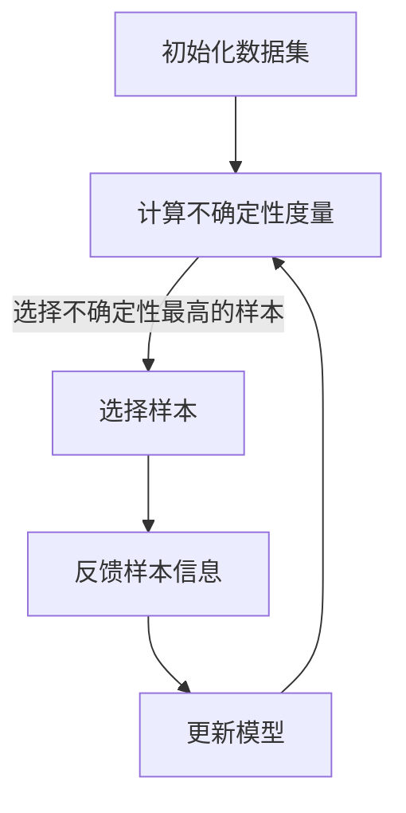

                 

```markdown
## 第4章：主动学习的算法原理

### 4.1 采样策略

#### 4.1.1 采样策略的概念

采样策略是主动学习算法中的一个关键部分，它决定了哪些样本应该被选择进行标注。采样策略的目标是通过选择具有最高不确定性的样本，来最大化模型的预测性能和减少标注成本。以下是一个Mermaid流程图，展示了采样策略的基本流程：



#### 4.1.2 采样策略的Python代码实现

以下是一个简单的Python代码示例，展示了如何实现基于不确定性的采样策略：

```python
import numpy as np

# 假设我们有一个预先计算好的不确定性度量矩阵
uncertainty_matrix = np.random.rand(10, 5)  # 假设有10个样本和5个类别的数据

# 计算不确定性度量的平均值
uncertainty_avg = np.mean(uncertainty_matrix, axis=1)

# 选择不确定性最高的样本
selected_samples = np.argpartition(uncertainty_avg, 0)[:1]

print("Selected samples:", selected_samples)
```

### 4.2 不确定性度量

#### 4.2.1 不确定性度量的定义

不确定性度量用于评估样本对于模型预测不确定性的程度。不确定性度量的计算方法有很多种，常用的包括基于熵的度量、基于置信区间的度量等。以下是一个LaTeX公式的示例：

$$
H(x) = -\sum_{i} p(x_i) \log p(x_i)
$$

其中，$H(x)$ 表示熵，$p(x_i)$ 表示样本 $x_i$ 的概率分布。

#### 4.2.2 不确定性度量的计算方法

在主动学习中，常用的不确定性度量包括基于置信区间的度量、基于预测误差的度量等。以下是一个简单的Python代码示例，展示了如何计算基于置信区间的不确定性度量：

```python
import numpy as np
from sklearn.linear_model import LinearRegression

# 假设我们有一个训练好的线性回归模型
model = LinearRegression()

# 训练数据
X_train = np.random.rand(10, 5)  # 假设每个样本有5个特征
y_train = np.random.rand(10)     # 假设每个样本有一个标签

# 训练模型
model.fit(X_train, y_train)

# 测试数据
X_test = np.random.rand(10, 5)  # 假设每个样本有5个特征

# 预测结果
y_pred = model.predict(X_test)

# 计算置信区间
confidence_intervals = 1.96 * np.std(y_pred)

# 计算不确定性度量
uncertainty_measure = np.mean(confidence_intervals)

print("Uncertainty measure:", uncertainty_measure)
```

### 4.3 学习策略

#### 4.3.1 学习策略的概念

学习策略是主动学习算法中的另一个关键部分，它决定了如何根据选择样本的标注结果来更新模型。学习策略的目标是通过选择合适的样本和更新模型，来提高模型的预测性能和泛化能力。

#### 4.3.2 学习策略的分类

学习策略可以根据不同的目标和方法进行分类，例如：

- **基于不确定性度的学习策略**：这类策略选择具有最高不确定性的样本进行标注，并使用标注结果来更新模型。例如，最大熵策略和最大边际贡献策略。
- **基于样本重要性的学习策略**：这类策略选择对模型预测影响最大的样本进行标注，并使用标注结果来更新模型。例如，基于权重的采样策略和基于权重的模型更新策略。
- **基于组合策略的学习策略**：这类策略将不同的采样策略和模型更新策略进行组合，以获得更好的性能。例如，迭代阈值策略和混合采样策略。

#### 4.3.3 学习策略的Python代码实现

以下是一个简单的Python代码示例，展示了如何实现基于最大熵策略的学习策略：

```python
import numpy as np
from sklearn.linear_model import LinearRegression

# 假设我们有一个训练好的线性回归模型
model = LinearRegression()

# 训练数据
X_train = np.random.rand(10, 5)  # 假设每个样本有5个特征
y_train = np.random.rand(10)     # 假设每个样本有一个标签

# 训练模型
model.fit(X_train, y_train)

# 测试数据
X_test = np.random.rand(10, 5)  # 假设每个样本有5个特征

# 预测结果
y_pred = model.predict(X_test)

# 计算不确定性度量
uncertainty_measure = 1 - np.mean(y_pred)

# 选择具有最高不确定性的样本
selected_samples = np.where(uncertainty_measure == np.max(uncertainty_measure))[0]

# 更新模型
model.fit(np.vstack([X_train, X_test[selected_samples]]), np.hstack([y_train, y_pred[selected_samples]]))

# 重新计算预测结果
y_pred = model.predict(X_test)

# 计算更新后的不确定性度量
uncertainty_measure = 1 - np.mean(y_pred)

print("Updated uncertainty measure:", uncertainty_measure)
```

通过上述步骤，我们可以实现一个简单的基于最大熵策略的学习策略。在实际应用中，可以根据具体问题和数据的特点，选择合适的采样策略和学习策略，以提高主动学习在遥感图像分类中的效率提升。```

