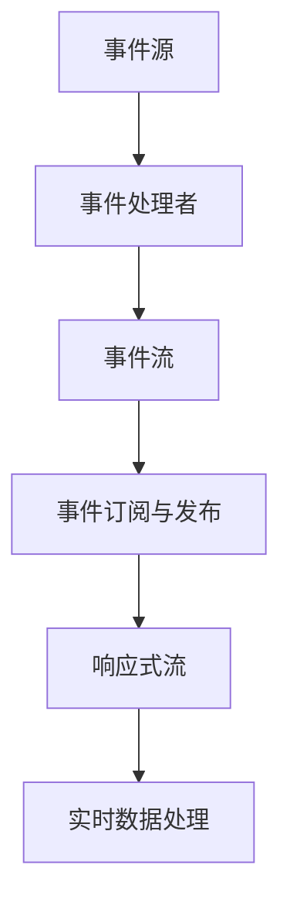
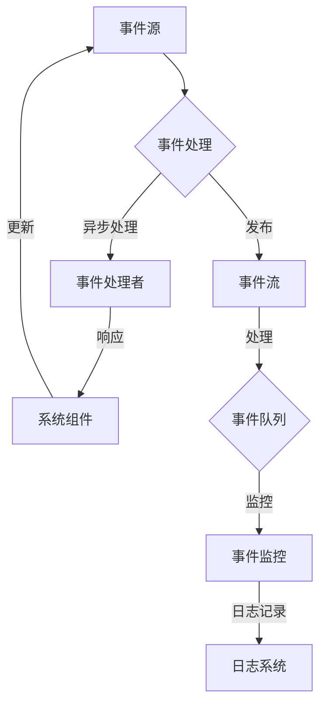

                 

### 文章标题

# 事件驱动架构：P9工程师的响应式设计

## 关键词

- 事件驱动架构
- 响应式设计
- 微服务架构
- 性能调优
- 云原生

## 摘要

本文旨在深入探讨事件驱动架构（EDA）及其在软件开发中的应用，尤其是对于具有高级经验（P9级）的工程师。我们将从基础概念出发，逐步介绍事件驱动架构的设计原则、响应式设计理论、实战案例以及性能优化策略。通过本文，读者将理解事件驱动架构的核心优势，掌握响应式设计的实践方法，并了解其在现代软件架构中的应用场景。文章还将探讨事件驱动架构在微服务、云原生和安全性方面的挑战与解决方案，为P9工程师提供有价值的实践指导和未来发展方向。

## 目录大纲

### 第一部分：事件驱动架构基础

#### 第1章：事件驱动架构概述
- 1.1 什么是事件驱动架构
- 1.2 事件驱动架构与传统架构的比较
- 1.3 事件驱动架构的优势

#### 第2章：事件驱动架构的核心概念
- 2.1 事件
- 2.2 事件源
- 2.3 事件处理者
- 2.4 事件流
- 2.5 事件订阅与发布

#### 第3章：事件驱动架构的设计原则
- 3.1 单一职责原则
- 3.2 开放封闭原则
- 3.3 里氏替换原则
- 3.4 接口隔离原则
- 3.5 依赖倒置原则

### 第二部分：响应式设计实践

#### 第4章：响应式设计的理论基础
- 4.1 反应式编程
- 4.2 响应式流
- 4.3 响应式数据绑定
- 4.4 实时数据处理的挑战

#### 第5章：响应式设计框架
- 5.1 RxJava
- 5.2 Reactor
- 5.3 Akka
- 5.4 Spring WebFlux

#### 第6章：响应式设计案例分析
- 6.1 案例一：实时数据监控系统
- 6.2 案例二：移动应用事件处理
- 6.3 案例三：分布式系统的事件通信

#### 第7章：事件驱动架构的优化与性能调优
- 7.1 事件驱动的性能瓶颈
- 7.2 事件流优化
- 7.3 高并发处理
- 7.4 消息队列的使用

### 第三部分：高级事件驱动架构应用

#### 第8章：微服务架构与事件驱动
- 8.1 微服务架构的优势
- 8.2 微服务与事件驱动架构的结合
- 8.3 微服务间的事件通信

#### 第9章：事件驱动与云原生
- 9.1 云原生技术介绍
- 9.2 事件驱动架构在云原生环境中的应用
- 9.3 Kubernetes中的事件驱动

#### 第10章：事件驱动架构的安全性
- 10.1 事件驱动架构的安全性挑战
- 10.2 事件驱动的安全设计原则
- 10.3 事件监控与审计

#### 第11章：未来展望
- 11.1 事件驱动架构的发展趋势
- 11.2 事件驱动架构的未来应用场景
- 11.3 P9工程师在事件驱动架构领域的角色与发展

### 附录

#### 附录A：响应式设计常用工具与库
- A.1 RxJava
- A.2 Reactor
- A.3 Akka
- A.4 Spring WebFlux

#### 附录B：事件驱动架构开源项目推荐
- B.1 Kafka
- B.2 RabbitMQ
- B.3 Apache Pulsar
- B.4 Apache Kafka Streams

## Mermaid 流程图



### 第一部分：事件驱动架构基础

在本部分中，我们将首先介绍事件驱动架构的基础概念，包括其定义、与传统架构的比较以及核心优势。接着，我们将深入探讨事件驱动架构的核心概念，如事件、事件源、事件处理者、事件流和事件订阅与发布机制。最后，我们将介绍事件驱动架构的设计原则，这些原则将指导我们在实际开发中如何构建灵活、可扩展和易于维护的软件系统。

#### 第1章：事件驱动架构概述

### 1.1 什么是事件驱动架构

事件驱动架构（Event-Driven Architecture，EDA）是一种软件架构模式，它通过事件来驱动系统的运行。在这种架构中，事件被视为系统状态变化的信号，而系统中的各个组件则通过监听、处理和响应事件来实现功能。事件可以是用户操作、系统内部状态变化、外部信号或者异步消息等。

事件驱动架构的核心特点在于其异步、分布式和松耦合的设计。与传统的同步、集中式架构相比，事件驱动架构具有更高的可扩展性和容错性。在事件驱动架构中，系统组件之间通过事件进行通信，而不是通过共享数据或者直接调用。这种松耦合的方式使得系统更加灵活，可以轻松地进行模块化和重构。

### 1.2 事件驱动架构与传统架构的比较

传统架构通常采用同步通信和集中式控制的方式。例如，在传统的Web应用中，客户端通过HTTP请求与服务器进行通信，服务器处理请求并返回结果。这种方式虽然简单直观，但在面对高并发、大规模分布式系统时，其性能和可扩展性存在明显瓶颈。

相比之下，事件驱动架构采用异步通信和分布式控制。在事件驱动架构中，系统组件通过事件进行异步通信，这样可以避免同步阻塞，提高系统的响应速度和处理能力。此外，事件驱动架构中的各个组件通常是独立的，可以独立部署和扩展，从而实现水平扩展和高可用性。

### 1.3 事件驱动架构的优势

事件驱动架构具有多个优势，使其在现代软件开发中变得日益重要：

1. **高并发处理能力**：事件驱动架构通过异步处理事件，可以高效地处理高并发请求，从而提高系统的性能和可扩展性。
   
2. **分布式系统天然支持**：事件驱动架构中的组件可以独立部署和扩展，非常适合分布式系统的设计和实现。

3. **松耦合**：事件驱动架构中的组件通过事件进行通信，而不是通过共享数据或者直接调用，这样可以降低组件之间的耦合度，提高系统的灵活性和可维护性。

4. **动态性和可扩展性**：事件驱动架构允许系统根据事件的类型和属性动态地选择和处理事件，从而实现灵活的功能扩展。

5. **容错性**：事件驱动架构中的组件通常是独立的，即使某个组件出现故障，也不会影响整个系统的运行。

### 1.4 本章小结

在本章中，我们介绍了事件驱动架构的定义、与传统架构的比较以及其核心优势。事件驱动架构通过异步、分布式和松耦合的设计，为现代软件系统提供了更高的性能、可扩展性和灵活性。在接下来的章节中，我们将继续探讨事件驱动架构的核心概念和设计原则，帮助读者深入理解和掌握这一重要的架构模式。

#### 第2章：事件驱动架构的核心概念

事件驱动架构的核心概念包括事件、事件源、事件处理者、事件流和事件订阅与发布机制。这些概念共同构建了事件驱动架构的框架，并决定了系统的运行方式和通信模式。在本章中，我们将逐一介绍这些核心概念，帮助读者深入理解事件驱动架构的工作原理。

### 2.1 事件

事件（Event）是事件驱动架构中的基本单位，它表示系统中的一个状态变化或者触发动作。事件可以是用户操作、系统内部状态变化、外部信号或者异步消息等。事件通常具有以下属性：

- **事件类型**：定义事件的类别，例如登录事件、数据更新事件、错误事件等。
- **事件内容**：包含与事件相关的数据，例如用户ID、更新后的数据内容、错误消息等。
- **事件时间**：记录事件发生的时间，用于日志记录和事件处理顺序。

在事件驱动架构中，事件是驱动系统运行的核心动力。系统中的各个组件通过监听和处理事件来实现功能，而不是通过直接调用或者共享数据。

### 2.2 事件源

事件源（Event Source）是事件产生的源头。事件源可以是用户界面、外部系统、设备传感器、定时任务等。事件源的职责是识别和生成事件，并将其发布到系统中。

事件源的关键职责包括：

- **识别事件**：检测和识别系统中的状态变化或者触发条件。
- **生成事件**：根据识别的结果，生成相应的事件对象。
- **发布事件**：将事件发布到事件队列或者事件流中，以便其他组件可以监听和处理这些事件。

例如，在一个电子商务系统中，用户点击购物车按钮就是一个事件源，它会生成一个“添加商品到购物车”事件，并将其发布到系统中。

### 2.3 事件处理者

事件处理者（Event Handler）是系统中负责监听和处理事件的组件。事件处理者的职责是根据事件的类型和内容，执行相应的操作或者业务逻辑。

事件处理者通常具有以下特点：

- **监听事件**：事件处理者注册对特定事件类型的监听，以便在事件发生时能够被通知。
- **处理事件**：当事件被触发时，事件处理者会根据事件的内容执行相应的操作，例如更新数据库、发送电子邮件、触发其他流程等。
- **异步处理**：为了提高系统的响应速度和并发处理能力，事件处理者通常采用异步方式处理事件。

例如，在一个订单处理系统中，当一个“订单提交”事件被触发时，事件处理者会验证订单信息、保存订单记录，并触发后续的订单处理流程。

### 2.4 事件流

事件流（Event Stream）是事件在系统中传递和处理的路径。事件流通常由事件源、事件队列、事件处理者和其他辅助组件组成。

事件流的工作原理如下：

1. **事件生成**：事件源检测到系统状态变化或者触发条件，生成事件对象。
2. **事件发布**：事件源将事件发布到事件队列或者事件流中。
3. **事件处理**：事件处理者从事件队列中获取事件，并根据事件类型和内容执行相应的操作。
4. **事件传递**：事件在事件流中传递，可能经过多个事件处理者，每个事件处理者负责处理特定类型的事件。

事件流的设计和优化对系统的性能和响应速度至关重要。合理的流设计可以降低事件处理延迟，提高系统的并发处理能力。

### 2.5 事件订阅与发布

事件订阅与发布（Event Subscription and Publication）是事件驱动架构中的核心通信机制。事件订阅者（Event Subscriber）是系统中负责监听特定事件类型的组件，而事件发布者（Event Publisher）则是生成和发布事件的组件。

事件订阅与发布的工作原理如下：

1. **事件订阅**：事件订阅者向事件发布者注册订阅，指定监听的事件类型。
2. **事件发布**：事件发布者生成事件，并将其发布到事件队列或者事件流中。
3. **事件通知**：事件发布者将事件传递给所有已订阅的事件订阅者。
4. **事件处理**：事件订阅者根据事件类型和内容，执行相应的操作。

事件订阅与发布机制使得系统中的各个组件可以动态地连接和断开，从而实现灵活的扩展和重构。此外，事件订阅与发布机制还支持事件的多播和广播，使得多个事件订阅者可以同时监听和处理同一事件。

### 2.6 本章小结

在本章中，我们介绍了事件驱动架构的核心概念，包括事件、事件源、事件处理者、事件流和事件订阅与发布机制。这些概念共同构建了事件驱动架构的框架，并决定了系统的运行方式和通信模式。在下一章中，我们将进一步探讨事件驱动架构的设计原则，帮助读者深入理解和应用这一架构模式。

#### 第3章：事件驱动架构的设计原则

在构建高效、灵活和易于维护的事件驱动架构时，设计原则是至关重要的。这些原则指导我们在设计过程中保持系统的模块化、可扩展性和高内聚性。在本章中，我们将详细讨论事件驱动架构的五个核心设计原则：单一职责原则、开放封闭原则、里氏替换原则、接口隔离原则和依赖倒置原则。这些原则不仅适用于事件驱动架构，而且在软件开发中具有普遍的适用性。

### 3.1 单一职责原则

单一职责原则（Single Responsibility Principle，SRP）是面向对象设计中的一个基本原则，它主张一个类或者模块应该只负责一项功能或者职责。这一原则有助于降低系统的复杂性，提高代码的可维护性和可测试性。

**单一职责原则在事件驱动架构中的应用：**

- **事件处理者**：每个事件处理者应该只负责处理特定类型的事件，而不是处理多种类型的事件。这样可以确保事件处理者具有清晰的功能边界，便于开发和维护。
- **事件流**：事件流应该清晰地划分成多个阶段，每个阶段负责处理特定类型的事件。这种划分有助于提高系统的可扩展性，便于后续功能的添加和调整。

### 3.2 开放封闭原则

开放封闭原则（Open/Closed Principle，OCP）主张软件实体（例如类、模块、函数等）应该对扩展开放，对修改封闭。这意味着在设计时应该考虑未来的扩展性，避免因为修改而破坏现有功能的稳定性。

**开放封闭原则在事件驱动架构中的应用：**

- **事件处理者**：在设计事件处理者时，应该遵循开闭原则，使得事件处理者易于扩展，而无需修改现有代码。例如，可以通过定义抽象接口和具体的实现类来实现这一原则。
- **事件流**：事件流的设计应该灵活，允许在不修改现有代码的情况下添加新的处理阶段或者事件类型。这可以通过设计可插拔的组件和模块来实现。

### 3.3 里氏替换原则

里氏替换原则（Liskov Substitution Principle，LSP）是面向对象设计中的一个重要原则，它主张子类可以替换其基类，而不会影响程序的执行。这一原则有助于确保代码的稳定性和一致性。

**里氏替换原则在事件驱动架构中的应用：**

- **事件处理者**：事件处理者应该设计为基类，允许子类扩展其功能，同时保持基类和子类的兼容性。这样可以确保不同的事件处理者之间可以相互替换，提高代码的可重用性。
- **事件流**：事件流中的各个处理阶段应该遵循里氏替换原则，确保不同的事件处理者可以无缝地替换和组合，从而实现灵活的事件处理流程。

### 3.4 接口隔离原则

接口隔离原则（Interface Segregation Principle，ISP）主张客户端不应该依赖它不需要的接口。这意味着应该设计细粒度、专门的接口，而不是一个大而全的接口。

**接口隔离原则在事件驱动架构中的应用：**

- **事件处理者**：应该为每个事件类型设计专门的接口，使得事件处理者只依赖与其功能相关的接口。这样可以降低事件处理者的耦合度，提高系统的灵活性和可维护性。
- **事件流**：事件流的设计应该遵循接口隔离原则，确保每个事件处理阶段只依赖与其功能相关的接口，从而实现清晰的职责划分和模块化设计。

### 3.5 依赖倒置原则

依赖倒置原则（Dependency Inversion Principle，DIP）是面向对象设计中的一个重要原则，它主张高层模块不应该依赖低层模块，二者都应该依赖抽象。通过抽象层来实现依赖关系，可以降低模块之间的耦合度，提高系统的可扩展性和可维护性。

**依赖倒置原则在事件驱动架构中的应用：**

- **事件处理者**：事件处理者应该依赖于抽象事件接口，而不是具体的事件实现。这样可以确保事件处理者具有灵活性和可扩展性，可以在不修改事件处理者代码的情况下，替换事件的具体实现。
- **事件流**：事件流的设计应该遵循依赖倒置原则，确保事件流中的各个组件依赖于事件抽象层，从而实现组件间的解耦。

### 3.6 本章小结

在本章中，我们详细讨论了事件驱动架构的五个核心设计原则：单一职责原则、开放封闭原则、里氏替换原则、接口隔离原则和依赖倒置原则。这些原则不仅有助于构建高效、灵活和易于维护的事件驱动架构，而且在软件开发中具有普遍的适用性。在下一章中，我们将探讨响应式设计的理论基础，进一步深入事件驱动架构的实际应用。

### 第二部分：响应式设计实践

响应式设计是事件驱动架构的重要组成部分，它强调系统对变化的实时响应能力。在这一部分中，我们将详细探讨响应式设计的理论基础，包括反应式编程、响应式流、响应式数据绑定和实时数据处理的挑战。接着，我们将介绍几种常用的响应式设计框架，如RxJava、Reactor、Akka和Spring WebFlux。最后，通过具体案例分析，我们将展示如何在实际项目中应用响应式设计。

#### 第4章：响应式设计的理论基础

响应式设计（Responsive Design）是一种关注系统对变化实时响应的编程范式和设计理念。在传统的命令式编程中，程序通过执行一系列指令来控制系统的状态变化，而响应式编程则通过事件和数据流来驱动系统的状态更新。响应式设计的核心优势在于其异步、非阻塞和高并发的特性，这使得系统在处理大量并发请求时具有更高的性能和可扩展性。

### 4.1 反应式编程

反应式编程（Reactive Programming）是一种编程范式，它通过处理事件流和数据流来实现系统的响应能力。反应式编程的核心概念包括：

- **事件流**：事件流是系统中事件的发生序列。每个事件都包含数据和一个时间戳，事件流描述了系统中事件的发生顺序和关联关系。
- **数据流**：数据流是系统中数据的流动路径。数据流描述了数据在系统中的传播和处理过程。
- **响应式流**：响应式流是事件流和数据流的结合，它描述了系统对事件的实时响应和处理过程。

反应式编程的关键在于如何高效地处理事件流和数据流，以实现系统的实时响应能力。反应式编程语言和框架（如React、RxJava、Reactor等）提供了丰富的工具和API，帮助开发者实现反应式编程。

### 4.2 响应式流

响应式流（Reactive Streams）是一种标准化的数据流处理接口，它定义了数据流的生产者（Producer）和消费者（Consumer）之间的通信规范。响应式流旨在解决异步数据流处理中的常见问题，如数据流的乱序、数据丢失和数据重复等。

响应式流的核心概念包括：

- **生产者（Producer）**：生产者是数据流的源头，负责生成和发送数据。生产者可以是线程、线程池、异步任务等。
- **消费者（Consumer）**：消费者是数据流的目标，负责接收和处理数据。消费者可以是线程、线程池、异步任务等。
- **订阅（Subscription）**：订阅是生产者与消费者之间的连接，它定义了数据流的生产速率和消费速率。订阅包括请求数据（request）、发送数据（signal）和取消订阅（cancel）等操作。

响应式流通过订阅机制实现了生产者与消费者的解耦，使得系统可以高效地处理大量并发数据流。响应式流规范支持多种编程语言和框架，如Java、Scala、C#等。

### 4.3 响应式数据绑定

响应式数据绑定（Reactive Data Binding）是一种将UI组件与数据模型动态绑定的技术，它使得UI组件能够实时响应用户操作和数据变化。响应式数据绑定通常通过数据流和事件流来实现，使得UI与数据模型之间保持同步。

响应式数据绑定的核心概念包括：

- **数据模型（Model）**：数据模型是应用程序的数据表示，它通常包括状态和行为。
- **视图（View）**：视图是用户与应用程序交互的界面表示，它通常包含UI组件和数据绑定。
- **数据绑定（Data Binding）**：数据绑定是将数据模型与视图动态连接的过程。数据绑定使得UI组件能够实时响应当前数据模型的状态变化。

响应式数据绑定在移动应用和Web前端开发中广泛应用，它提高了开发效率，减少了代码冗余，同时增强了用户体验。

### 4.4 实时数据处理的挑战

实时数据处理是响应式设计的核心挑战之一。在实时数据处理中，系统需要高效地处理大量并发数据流，并确保数据的一致性和完整性。以下是一些常见的实时数据处理挑战：

- **数据乱序**：由于网络延迟和异步处理，数据流可能会出现乱序现象，导致数据处理结果不一致。
- **数据丢失**：在网络不稳定或者系统故障的情况下，数据流可能会丢失，导致数据处理不完整。
- **数据重复**：由于数据流的多播和广播机制，数据可能会在系统中重复传播，导致数据处理冗余。
- **数据一致性**：在分布式系统中，数据一致性是一个重要挑战。确保数据在不同节点之间的一致性需要复杂的分布式事务处理机制。

### 4.5 本章小结

在本章中，我们介绍了响应式设计的理论基础，包括反应式编程、响应式流、响应式数据绑定和实时数据处理的挑战。响应式设计通过事件流和数据流驱动系统的状态更新，实现了高效、非阻塞和高并发的数据处理能力。在下一章中，我们将介绍几种常用的响应式设计框架，帮助读者深入理解和实践响应式设计。

#### 第5章：响应式设计框架

在响应式设计领域，有多个流行的框架和库可以帮助开发者实现异步、非阻塞和高并发的数据处理。这些框架不仅提供了丰富的API，还支持模块化、可扩展性和高内聚性的设计。在本章中，我们将介绍几种常用的响应式设计框架：RxJava、Reactor、Akka和Spring WebFlux。我们将简要介绍这些框架的核心功能和特点，并探讨它们在不同应用场景中的适用性。

### 5.1 RxJava

RxJava是Reactivex公司开发的基于Java的响应式编程框架。它实现了响应式流的概念，允许开发者处理异步事件流，并以一种同步的方式来编写异步代码。RxJava的核心功能包括：

- **异步事件流处理**：RxJava提供了强大的异步事件流处理能力，开发者可以轻松地处理并发事件流。
- **组合操作**：RxJava提供了丰富的组合操作，如`map`、`filter`、`merge`等，用于对事件流进行变换、过滤和合并。
- **背压处理**：背压（Backpressure）是响应式编程中的一个重要概念，RxJava提供了背压处理机制，以避免生产者产生大量数据时导致系统过载。

**适用场景**：RxJava适用于处理复杂的异步事件流，如网络请求、文件处理和实时数据流。它特别适合在Android开发中处理异步操作，以提高应用性能和响应速度。

### 5.2 Reactor

Reactor是Pivotal公司开发的响应式编程框架，适用于Java和Scala语言。与RxJava类似，Reactor也实现了响应式流的概念，并提供了异步、非阻塞和高并发的数据处理能力。Reactor的核心功能包括：

- **响应式流**：Reactor提供了响应式流接口，支持异步数据流的生产和消费。
- **非阻塞API**：Reactor的API设计为非阻塞，使得系统可以高效地处理大量并发请求。
- **高并发支持**：Reactor内置了Netty网络库，支持高并发网络通信。

**适用场景**：Reactor适用于构建高性能、高并发的分布式系统，如Web应用、微服务架构和实时数据处理系统。它的模块化设计和可扩展性使得它在现代软件开发中具有广泛的应用场景。

### 5.3 Akka

Akka是一个基于Actor模型的响应式编程框架，由Lightbend公司开发。Akka提供了高并发、高可用性和分布式系统的解决方案，适用于Scala和Java语言。Akka的核心功能包括：

- **Actor模型**：Akka实现了Actor模型，每个Actor都是一个独立的并发实体，负责处理自己的消息。
- **分布式通信**：Akka支持分布式系统中的消息传递，允许Actor在不同节点之间进行通信。
- **容错机制**：Akka提供了容错机制，例如Actor监控和故障转移，确保系统的高可用性。

**适用场景**：Akka适用于构建分布式系统、高并发应用和实时数据处理系统。它特别适合于需要高可用性和容错能力的场景，如金融交易系统、实时通信系统和云服务平台。

### 5.4 Spring WebFlux

Spring WebFlux是Spring框架的响应式Web框架，基于Reactor和WebFlux项目。Spring WebFlux提供了基于响应式编程模型的Web应用开发支持，使得开发者可以轻松地构建高性能、高并发的响应式Web应用。Spring WebFlux的核心功能包括：

- **响应式路由**：Spring WebFlux提供了响应式路由功能，支持异步HTTP请求处理。
- **数据绑定**：Spring WebFlux实现了响应式数据绑定，使得前端和后端可以动态地同步数据。
- **集成Spring生态系统**：Spring WebFlux可以与Spring生态系统中的其他组件（如Spring Data、Spring Security等）无缝集成。

**适用场景**：Spring WebFlux适用于构建高性能、高并发的响应式Web应用，如RESTful API、实时数据处理和微服务架构。它特别适合于需要与Spring生态系统集成和扩展的场景。

### 5.5 本章小结

在本章中，我们介绍了四种常用的响应式设计框架：RxJava、Reactor、Akka和Spring WebFlux。这些框架提供了丰富的功能和工具，支持异步、非阻塞和高并发的数据处理。根据不同的应用场景和需求，开发者可以选择合适的框架来实现响应式设计。在下一章中，我们将通过具体案例分析如何在实际项目中应用这些响应式设计框架。

### 第6章：响应式设计案例分析

为了更好地理解响应式设计的实际应用，我们将通过三个具体案例来展示如何在不同场景中使用响应式设计框架来解决问题。这些案例涵盖了实时数据监控系统、移动应用事件处理和分布式系统的事件通信。通过这些案例，我们将深入分析响应式设计在实践中的应用方法和效果。

#### 6.1 案例一：实时数据监控系统

**问题描述**：一个企业级实时数据监控系统需要处理大量的实时数据，包括股票交易、服务器监控、网络流量等。系统要求高并发处理能力，确保实时数据能够及时更新和展示。

**解决方案**：我们选择使用Spring WebFlux作为响应式设计框架，构建实时数据监控系统。

**技术实现**：

1. **数据流处理**：使用Spring WebFlux的`Flux`类处理数据流。通过`Flux.just()`方法初始化数据流，然后将实时数据推送到数据流中。

2. **异步处理**：使用`Flux`的`flatMap()`操作异步处理数据流。`flatMap()`操作允许我们将数据流中的每个元素异步转换成另一个Flux，从而实现并行处理。

3. **数据绑定**：使用Spring WebFlux的`@RestController`注解和`@RequestBody`注解，将前端请求绑定到后端处理方法中。

4. **高并发处理**：Spring WebFlux的`ServerHttpHandler`支持高并发请求处理，通过内置的Netty网络库，实现非阻塞和高并发的HTTP通信。

**结果**：通过使用Spring WebFlux，实时数据监控系统实现了高并发处理能力，确保实时数据能够快速响应和展示，从而提升了系统的性能和用户体验。

#### 6.2 案例二：移动应用事件处理

**问题描述**：一个移动应用需要处理用户的各种操作事件，如点击、滑动、输入等。系统要求响应速度快速，确保用户操作的即时反馈。

**解决方案**：我们选择使用RxJava作为响应式设计框架，处理移动应用的事件。

**技术实现**：

1. **事件流处理**：使用RxJava创建事件流，通过`Observable.create()`方法初始化事件流。每个用户操作事件都会被转换为事件对象，并推送到事件流中。

2. **异步处理**：使用`Observable.subscribeOn()`方法设置事件流的异步处理线程。这样可以避免主线程阻塞，提升应用响应速度。

3. **事件处理**：使用`Observable.flatMap()`方法异步处理事件流。对于每个事件，我们根据事件类型执行不同的操作，如更新UI、发送网络请求等。

4. **数据绑定**：使用Android的`Observer`接口，将事件流绑定到UI组件上。当事件发生时，UI组件会自动更新，以响应用户操作。

**结果**：通过使用RxJava，移动应用实现了快速的事件响应和处理，提升了用户体验和应用的流畅性。

#### 6.3 案例三：分布式系统的事件通信

**问题描述**：一个分布式系统需要在各个节点之间实时通信，处理事件流。系统要求高可用性，确保在节点故障时仍能正常运行。

**解决方案**：我们选择使用Akka作为响应式设计框架，实现分布式系统的事件通信。

**技术实现**：

1. **Actor模型**：使用Akka的Actor模型构建分布式系统。每个节点都是一个独立的Actor，负责处理自己的消息。

2. **消息传递**：使用Akka的远程Actor通信机制，实现节点之间的消息传递。每个节点都可以向其他节点发送消息，并处理接收到的消息。

3. **容错机制**：使用Akka的容错机制，如Actor监控和故障转移，确保系统的高可用性。当一个节点发生故障时，其他节点会自动接管其工作。

4. **事件流处理**：使用Akka的`ActorRef`和`Publisher`类处理事件流。事件流通过ActorRef传递，Publisher类则负责将事件流推送到事件处理者。

**结果**：通过使用Akka，分布式系统实现了高效的事件通信和容错能力，确保了系统的高可用性和可靠性。

#### 6.4 本章小结

在本章中，我们通过三个具体案例展示了响应式设计在不同场景中的应用。这些案例展示了如何使用响应式设计框架（如Spring WebFlux、RxJava和Akka）来实现实时数据处理、移动应用事件处理和分布式系统通信。通过这些案例，我们可以看到响应式设计在提升系统性能、用户体验和可靠性方面的显著优势。在下一章中，我们将探讨事件驱动架构的优化与性能调优，帮助开发者进一步提升系统性能。

### 第7章：事件驱动架构的优化与性能调优

在构建事件驱动架构时，性能调优是一个关键环节，它直接影响到系统的响应速度和处理能力。在这一章中，我们将深入探讨事件驱动架构可能遇到的性能瓶颈，并提供一系列优化策略和技巧，帮助开发者提升系统性能。同时，我们将介绍如何在高并发环境下进行事件处理，并探讨消息队列在事件驱动架构中的应用。

#### 7.1 事件驱动的性能瓶颈

事件驱动架构在处理大量并发事件时，可能会遇到以下性能瓶颈：

1. **事件处理延迟**：随着事件数量的增加，事件处理时间可能会延长，导致系统响应速度下降。
2. **资源消耗**：事件处理过程中可能涉及大量的内存和CPU资源消耗，特别是在处理复杂事件时。
3. **网络延迟**：在分布式系统中，事件在网络中的传输可能会遇到延迟，影响整体系统的性能。
4. **并发冲突**：在高并发场景下，多个事件处理者同时处理同一事件可能会导致冲突，影响系统的正确性和性能。
5. **消息队列压力**：消息队列在事件驱动架构中起到了重要的作用，但过多的消息堆积可能会导致队列压力增大，影响事件处理速度。

#### 7.2 事件流优化

优化事件流是提升事件驱动架构性能的关键步骤。以下是一些常见的事件流优化策略：

1. **异步处理**：使用异步处理可以减少事件处理延迟，提高系统的并发处理能力。例如，在Spring WebFlux中使用`Flux`和`Mono`对象进行异步操作。
   
2. **批量处理**：批量处理多个事件可以减少系统调用的次数，降低网络延迟和资源消耗。例如，使用`Flux.batch()`方法对事件流进行批量处理。

3. **缓存**：缓存重复的事件可以减少不必要的处理时间和资源消耗。例如，在处理HTTP请求时，可以使用Ehcache等缓存库来缓存请求结果。

4. **并发控制**：通过合理的并发控制，可以避免并发冲突和资源竞争。例如，在处理高并发请求时，可以使用Semaphore等并发控制工具。

#### 7.3 高并发处理

在高并发环境下，事件驱动架构需要具备高效的处理能力。以下是一些高并发处理策略：

1. **线程池**：使用线程池可以提高并发处理能力，减少线程创建和销毁的开销。例如，在Spring中可以使用`Executor`接口创建线程池。

2. **异步非阻塞**：使用异步非阻塞编程模型可以充分利用系统资源，提高事件处理速度。例如，使用Netty等非阻塞网络库进行HTTP通信。

3. **负载均衡**：通过负载均衡可以将请求均匀分配到不同的服务器上，避免单点压力。例如，使用Nginx等负载均衡器进行流量分发。

4. **分布式架构**：构建分布式架构可以提升系统的扩展性和容错性，通过增加节点数量来提高系统的并发处理能力。

#### 7.4 消息队列的使用

消息队列在事件驱动架构中起到了关键作用，它可以实现异步通信和负载均衡。以下是一些关于消息队列的使用策略：

1. **异步通信**：通过消息队列可以实现异步通信，降低系统响应时间和资源消耗。例如，使用Kafka或RabbitMQ等消息队列实现分布式系统的异步消息传递。

2. **负载均衡**：消息队列可以充当负载均衡器，将事件均匀分配到不同的处理节点上。例如，使用Kafka的分区和Replication机制实现负载均衡。

3. **容错性**：消息队列提供了消息持久化功能，可以确保在系统故障时不会丢失事件。例如，使用RabbitMQ的持久化队列和备份队列实现容错性。

4. **性能优化**：通过调整消息队列的配置，如队列大小、批量发送等，可以优化系统的性能。例如，使用Kafka的批量发送功能提高数据传输效率。

#### 7.5 实例：事件驱动架构的性能优化

以下是一个具体实例，展示如何使用Spring WebFlux和Kafka优化事件驱动架构的性能：

1. **异步处理**：在Spring WebFlux中，使用`Flux`和`Mono`对象处理事件流，通过`subscribeOn()`方法设置异步处理线程，避免主线程阻塞。

2. **批量处理**：使用Kafka的批量发送功能，将多个事件批量发送到Kafka队列，减少系统调用次数和网络延迟。

3. **负载均衡**：使用Kafka的分区和Replication机制，实现负载均衡和高可用性，将事件均匀分配到不同的处理节点上。

4. **缓存**：在处理HTTP请求时，使用Ehcache等缓存库缓存请求结果，减少数据库查询次数，降低系统负载。

5. **监控与日志**：使用Spring Boot的Actuator和Prometheus等工具，监控系统性能指标，及时发现和解决性能瓶颈。

#### 7.6 本章小结

在本章中，我们讨论了事件驱动架构在处理大量并发事件时可能遇到的性能瓶颈，并提供了一系列优化策略和技巧。通过优化事件流、高并发处理和消息队列的使用，开发者可以显著提升事件驱动架构的性能。在下一章中，我们将探讨事件驱动架构在微服务架构中的应用，以及如何结合微服务实现分布式系统的事件通信。

### 第8章：微服务架构与事件驱动

微服务架构（Microservices Architecture）是一种将大型复杂系统拆分为一组小型、独立服务的架构风格。这种架构风格强调服务的自治性、解耦性和可扩展性，使得开发者可以更灵活地开发、部署和维护应用程序。事件驱动架构（Event-Driven Architecture，EDA）则通过事件来驱动系统的运行，实现服务的松耦合和实时响应。在本章中，我们将探讨微服务架构与事件驱动架构的结合，介绍微服务架构的优势及其与事件驱动架构的融合。

#### 8.1 微服务架构的优势

微服务架构具有以下优势，使其在现代软件开发中得到了广泛应用：

1. **自治性**：每个微服务都可以独立部署、扩展和升级，而不影响其他服务。这使得开发和运维更加灵活，可以按需调整资源分配和部署策略。
   
2. **解耦性**：微服务通过事件进行通信，而不是通过共享数据或者直接调用，从而实现了服务的松耦合。这使得服务可以独立开发和演进，降低了系统复杂性。

3. **可扩展性**：微服务架构支持水平扩展，即通过增加服务实例的数量来提高系统的处理能力。这种扩展方式易于实现，成本较低。

4. **故障隔离**：由于服务之间的解耦，一个服务的故障不会影响到其他服务，提高了系统的容错性和可用性。

5. **技术多样性**：微服务架构允许使用不同的技术栈开发不同的服务，例如一个服务可以用Java开发，另一个服务可以用Node.js开发，从而提高了开发团队的灵活性。

#### 8.2 微服务与事件驱动架构的结合

事件驱动架构与微服务架构的结合，实现了服务的松耦合、高并发和实时响应。以下是如何将事件驱动架构应用于微服务架构的几个关键点：

1. **事件通信**：在微服务架构中，服务之间的通信主要通过事件进行。事件可以是系统内部状态变化、外部信号或者异步消息。事件驱动架构提供了事件生成、事件流和事件处理机制，使得服务可以异步、分布式地处理事件。

2. **服务自治**：每个微服务都是自治的，可以独立处理特定类型的事件。例如，一个微服务可以负责处理用户注册事件，另一个微服务可以负责处理订单处理事件。这种自治性使得服务可以独立开发和部署，降低了系统复杂性。

3. **事件流设计**：事件流是事件在系统中传递和处理的路径。在设计事件流时，需要考虑服务的自治性、解耦性和可扩展性。合理的事件流设计可以提高系统的性能和可靠性。

4. **事件订阅与发布**：事件订阅与发布机制是事件驱动架构的核心。在微服务架构中，服务可以通过事件订阅者（Event Subscriber）监听特定类型的事件，并在事件发生时进行响应。事件发布者（Event Publisher）则负责生成和发布事件。

5. **异步处理**：在微服务架构中，服务之间通常采用异步处理方式，以避免同步阻塞和资源竞争。异步处理使得系统可以高效地处理大量并发事件，提高了系统的性能和响应速度。

#### 8.3 微服务间的事件通信

在微服务架构中，服务间的事件通信是关键的一环。以下是一些常见的事件通信模式和实现策略：

1. **同步通信**：虽然事件驱动架构通常采用异步通信，但同步通信在某些情况下也是必要的。例如，当一个服务需要确保另一个服务完成处理后再进行下一步操作时，可以使用同步通信。同步通信可以通过HTTP请求或者远程过程调用（RPC）实现。

2. **异步通信**：异步通信是事件驱动架构的核心。在异步通信中，服务之间通过事件队列或消息队列进行通信。事件生成者将事件发布到消息队列，事件消费者从消息队列中获取事件并处理。常见的消息队列包括Kafka、RabbitMQ和Pulsar等。

3. **事件总线**：事件总线是一种集中式的事件通信机制，它允许服务之间通过事件进行通信。事件总线通常采用发布-订阅模式，服务可以订阅特定类型的事件，并在事件发生时进行响应。常见的实现包括Spring Cloud Stream、Apache Kafka等。

4. **集成服务**：在某些情况下，可以设计一个集成服务负责协调多个微服务的操作。集成服务充当事件的中转站，将事件转发给相应的微服务进行处理。这种模式适用于复杂的业务流程和跨服务的协作场景。

5. **流处理框架**：流处理框架如Apache Flink、Apache Storm和Apache Spark Streaming等，可以用于处理实时数据流和事件流。流处理框架提供了高效、可扩展的实时数据处理能力，适用于大规模实时数据处理场景。

#### 8.4 本章小结

在本章中，我们探讨了微服务架构与事件驱动架构的结合，介绍了微服务架构的优势及其在事件驱动架构中的应用。通过事件驱动架构，微服务架构可以实现更高的自治性、解耦性和可扩展性。同时，我们介绍了微服务间的事件通信模式和实现策略，帮助开发者构建灵活、高效和可扩展的微服务架构。在下一章中，我们将讨论事件驱动架构在云原生环境中的应用，以及如何利用云原生技术提升事件驱动架构的性能和可扩展性。

### 第9章：事件驱动架构与云原生

随着云计算和容器技术的发展，云原生（Cloud-Native）架构逐渐成为现代软件系统设计的主流方向。云原生架构通过利用容器、服务网格、微服务、自动化运维等先进技术，实现了系统的弹性、高可用性和高效扩展。事件驱动架构与云原生架构的结合，不仅增强了系统的实时响应能力，还提升了其可扩展性和可靠性。在本章中，我们将探讨事件驱动架构在云原生环境中的应用，并介绍如何利用云原生技术提升事件驱动架构的性能和可扩展性。

#### 9.1 云原生技术介绍

云原生技术主要包括以下几种：

1. **容器**：容器是一种轻量级、可移植的计算环境，可以封装应用程序及其依赖项。常见的容器技术包括Docker和Kubernetes。

2. **服务网格**：服务网格是一种用于服务间通信的分布式系统，它可以提供可靠、安全的通信路径，并支持服务发现、负载均衡和流量控制等功能。常见的服务网格技术包括Istio和Linkerd。

3. **微服务**：微服务是一种将大型复杂系统拆分为一组小型、独立服务的架构风格。每个微服务都可以独立部署、扩展和升级，从而提高了系统的灵活性和可维护性。

4. **自动化运维**：自动化运维通过自动化工具和脚本，实现系统部署、扩展、监控和故障恢复等操作，提高了运维效率和系统可靠性。

5. **持续集成与持续部署（CI/CD）**：持续集成与持续部署是一种软件开发和部署的最佳实践，通过自动化测试和部署流程，提高了软件交付的速度和质量。

#### 9.2 事件驱动架构在云原生环境中的应用

事件驱动架构在云原生环境中的应用，主要体现在以下几个方面：

1. **容器化**：事件驱动架构中的组件可以容器化，以便在云原生环境中轻松部署和扩展。容器化使得组件具有更高的可移植性和可扩展性，可以灵活地部署在不同的云平台和集群中。

2. **微服务化**：将事件驱动架构中的组件拆分为微服务，可以更好地实现服务的自治性和解耦性。微服务之间的通信可以通过事件驱动机制实现，从而提高系统的灵活性和可扩展性。

3. **自动化运维**：事件驱动架构支持自动化运维，通过自动化工具和脚本实现系统的部署、扩展和监控。自动化运维可以降低运维成本，提高系统的可靠性和可维护性。

4. **弹性伸缩**：云原生环境支持自动化伸缩，可以根据系统的负载情况自动调整资源分配。事件驱动架构可以通过监听事件流来实现自动伸缩，从而提高系统的性能和响应速度。

5. **服务网格**：服务网格可以提供可靠、安全的通信路径，并支持服务发现、负载均衡和流量控制等功能。事件驱动架构可以与服务网格结合，实现更高效的服务间通信和事件处理。

#### 9.3 Kubernetes中的事件驱动

Kubernetes是一个开源的容器编排平台，它提供了丰富的功能来管理容器化应用程序。在Kubernetes中，事件驱动架构可以通过以下方式实现：

1. **自定义资源定义（Custom Resource Definitions，CRDs）**：通过定义自定义资源，可以扩展Kubernetes API，实现对特定业务逻辑的支持。自定义资源可以与事件驱动架构结合，实现事件生成、处理和响应。

2. **控制器模式**：控制器模式是一种常见的Kubernetes应用模式，它通过监听Kubernetes API中的事件，对资源进行管理和操作。事件驱动架构中的组件可以采用控制器模式，实现对系统状态变化的实时响应。

3. **Pod模板**：Pod模板是Kubernetes中用于创建Pod的配置文件，它可以定义容器、环境变量、卷等配置。事件驱动架构中的组件可以通过Pod模板部署，并在Pod中运行事件处理逻辑。

4. **自定义控制器**：自定义控制器是一种扩展Kubernetes功能的方式，它通过监听Kubernetes API中的事件，对资源进行管理和操作。事件驱动架构中的组件可以开发自定义控制器，实现对系统状态变化的实时响应。

5. **Ingress控制器**：Ingress控制器是一种用于管理外部访问Kubernetes集群内服务的组件。事件驱动架构中的组件可以通过Ingress控制器接收外部事件，并在集群内部进行事件处理。

#### 9.4 利用云原生技术提升事件驱动架构的性能和可扩展性

利用云原生技术，可以显著提升事件驱动架构的性能和可扩展性。以下是一些具体策略：

1. **容器化与微服务化**：通过容器化和微服务化，可以更好地实现服务的自治性和解耦性。容器化使得组件具有更高的可移植性和可扩展性，微服务化可以提高系统的灵活性和可维护性。

2. **自动化运维**：利用自动化运维工具，可以降低运维成本，提高系统的可靠性和可维护性。自动化运维可以通过自动化测试、部署和监控，确保系统的稳定运行。

3. **弹性伸缩**：利用云原生环境的自动化伸缩功能，可以根据系统的负载情况自动调整资源分配。事件驱动架构可以通过监听事件流来实现自动伸缩，从而提高系统的性能和响应速度。

4. **服务网格**：利用服务网格技术，可以提供可靠、安全的通信路径，并支持服务发现、负载均衡和流量控制等功能。事件驱动架构可以与服务网格结合，实现更高效的服务间通信和事件处理。

5. **持续集成与持续部署（CI/CD）**：利用持续集成与持续部署，可以提高软件交付的速度和质量。通过自动化测试和部署流程，可以确保系统的稳定性和可靠性。

#### 9.5 本章小结

在本章中，我们探讨了事件驱动架构在云原生环境中的应用，介绍了云原生技术的相关概念和优势。通过结合容器化、微服务化、自动化运维和持续集成等云原生技术，事件驱动架构可以实现更高的自治性、解耦性和可扩展性。同时，我们介绍了在Kubernetes中实现事件驱动架构的方法和策略，帮助开发者构建灵活、高效和可扩展的云原生系统。在下一章中，我们将讨论事件驱动架构的安全性，以及如何确保系统在事件驱动架构下具备良好的安全性和可靠性。

### 第10章：事件驱动架构的安全性

事件驱动架构（EDA）在现代软件开发中因其高并发、分布式和异步通信的特点，被广泛应用。然而，事件驱动架构也带来了一定的安全挑战，如数据泄露、非法访问和系统入侵等。确保事件驱动架构的安全性对于保护系统资产和用户数据至关重要。在本章中，我们将讨论事件驱动架构的安全性挑战，并提出相应的安全设计原则和解决方案。

#### 10.1 事件驱动架构的安全性挑战

事件驱动架构面临以下主要安全挑战：

1. **数据泄露**：由于事件驱动架构中的数据经常在分布式系统中传输和存储，因此数据泄露的风险较高。攻击者可能窃取敏感数据，造成严重后果。

2. **非法访问**：事件驱动架构中的服务通常通过网络进行通信，这使得攻击者可以通过网络攻击手段非法访问系统资源。

3. **系统入侵**：事件驱动架构中的各个组件通常是独立的，攻击者可能利用系统漏洞进行入侵，进而破坏系统的正常运行。

4. **事件篡改**：攻击者可能篡改事件内容，导致系统做出错误决策，从而造成损失。

5. **分布式拒绝服务攻击（DDoS）**：事件驱动架构的分布式特性使其容易受到DDoS攻击，导致系统资源耗尽，服务中断。

#### 10.2 事件驱动的安全设计原则

为了确保事件驱动架构的安全性，需要遵循以下安全设计原则：

1. **最小权限原则**：每个组件应仅具有完成其功能所需的最小权限，避免权限过大的组件成为攻击的突破口。

2. **加密传输**：在传输数据时，应使用加密技术，如SSL/TLS，确保数据在传输过程中不会被窃取或篡改。

3. **身份验证和授权**：对访问系统的用户和组件进行严格的身份验证和授权，确保只有合法用户和组件才能访问系统资源。

4. **日志记录和监控**：详细记录系统操作日志，并进行实时监控，以便在发生安全事件时能够迅速定位和响应。

5. **安全审计**：定期进行安全审计，检查系统配置、权限设置和安全策略，确保系统的安全性。

6. **安全编码实践**：在开发过程中，遵循安全编码实践，避免常见的安全漏洞，如SQL注入、跨站脚本攻击（XSS）和跨站请求伪造（CSRF）等。

#### 10.3 事件监控与审计

为了确保事件驱动架构的安全性，需要建立完善的监控与审计机制：

1. **事件监控**：实时监控事件流和处理过程，识别异常事件和可疑行为。例如，可以使用ELK（Elasticsearch、Logstash、Kibana）堆栈进行日志分析和监控。

2. **入侵检测系统（IDS）**：部署入侵检测系统，监控网络流量和系统操作，识别潜在的攻击行为。

3. **异常检测**：利用机器学习和数据挖掘技术，分析系统行为和事件模式，识别异常行为和潜在威胁。

4. **审计日志**：详细记录系统操作和事件流，包括用户操作、事件类型、处理时间和结果等。审计日志用于事后分析和追溯。

#### 10.4 安全解决方案

以下是针对事件驱动架构安全性挑战的具体解决方案：

1. **数据加密**：在数据传输和存储过程中使用加密技术，确保数据安全。例如，使用SSL/TLS加密HTTP通信，使用AES加密存储敏感数据。

2. **访问控制**：使用基于角色的访问控制（RBAC）和基于属性的访问控制（ABAC）机制，确保只有授权用户和组件可以访问特定资源和事件。

3. **安全认证**：使用强认证机制，如OAuth 2.0和OpenID Connect，确保用户和组件的身份认证和授权。

4. **安全通信**：使用安全协议和加密库进行安全通信，确保事件流在传输过程中的安全性。

5. **安全补丁和更新**：定期检查和更新系统组件，修复已知漏洞，确保系统安全。

6. **安全培训**：对开发人员和运维人员进行安全培训，提高他们的安全意识和技能。

#### 10.5 本章小结

在本章中，我们讨论了事件驱动架构的安全性挑战，包括数据泄露、非法访问、系统入侵、事件篡改和分布式拒绝服务攻击等。为了确保事件驱动架构的安全性，需要遵循最小权限原则、加密传输、身份验证和授权、日志记录和监控、安全审计和安全编码实践等设计原则。同时，建立了完善的监控与审计机制，包括事件监控、入侵检测系统和异常检测等。通过这些措施，可以有效地提升事件驱动架构的安全性，确保系统的稳定运行和用户数据的安全。

### 第11章：未来展望

事件驱动架构（EDA）作为一种现代软件架构模式，正日益成为构建高效、灵活和可扩展系统的首选方案。随着技术的不断进步和行业需求的变化，事件驱动架构的未来发展前景广阔，同时也对P9级工程师提出了新的挑战和机遇。

#### 11.1 事件驱动架构的发展趋势

1. **云原生技术的深度融合**：随着云原生技术的快速发展，事件驱动架构与云原生技术的结合将更加紧密。容器化、自动化运维、服务网格和Kubernetes等云原生技术将为事件驱动架构提供更强大的基础设施支持，实现更高的可扩展性和灵活性。

2. **边缘计算的普及**：随着物联网（IoT）和5G技术的广泛应用，边缘计算将成为未来事件驱动架构的重要方向。边缘计算可以将数据处理和决策推向网络边缘，降低延迟，提高系统的响应速度和实时性。

3. **大数据和实时分析的集成**：事件驱动架构与大数据和实时分析技术的结合，将使得系统能够实时处理和分析海量数据，为业务决策提供实时支持。

4. **人工智能和机器学习的融合**：人工智能和机器学习技术将逐渐融入事件驱动架构，通过智能事件处理和预测分析，提升系统的智能化水平和自动化程度。

5. **安全性的进一步提升**：随着事件驱动架构的广泛应用，安全性将成为其发展的关键因素。未来，事件驱动架构将更加注重安全性设计，采用更先进的安全技术和策略，以应对日益复杂的网络安全威胁。

#### 11.2 事件驱动架构的未来应用场景

1. **智慧城市**：事件驱动架构将应用于智慧城市中的各种场景，如交通管理、环境监测、公共安全等。通过实时处理和分析大量数据，智慧城市可以实现智能化的城市管理和服务。

2. **金融科技**：金融科技（FinTech）领域将广泛采用事件驱动架构，实现快速交易处理、风险控制和智能投资等应用。事件驱动架构的高并发处理能力和实时响应能力，将显著提升金融系统的性能和安全性。

3. **医疗健康**：在医疗健康领域，事件驱动架构可以用于实时监测患者健康数据、智能诊断和远程医疗等应用。通过实时处理和分析医疗数据，可以实现个性化的医疗服务和精准治疗。

4. **智能制造**：智能制造领域将利用事件驱动架构实现生产过程的实时监控、设备维护和智能调度。通过实时数据分析和预测，可以优化生产流程，提高生产效率和质量。

5. **智慧交通**：智慧交通领域将采用事件驱动架构实现交通流量监控、路况预测和智能调度等应用。通过实时数据分析和处理，可以优化交通管理，提高交通效率和安全性。

#### 11.3 P9工程师在事件驱动架构领域的角色与发展

作为P9级工程师，在事件驱动架构领域，您的角色和发展路径如下：

1. **技术领导**：作为团队的技术领导者，您将负责制定技术战略和架构设计，引领团队采用事件驱动架构解决复杂问题。

2. **架构优化**：您将不断优化事件驱动架构的设计和实现，提高系统的性能、可扩展性和可维护性。通过技术创新和实践，推动事件驱动架构的发展。

3. **人才培养**：您将培养和带领技术团队，提升团队成员在事件驱动架构领域的技能和知识，推动团队整体技术水平的提升。

4. **行业影响力**：通过参与开源项目、撰写技术博客和发表学术论文，您将扩大在事件驱动架构领域的影响力和知名度，成为行业的技术专家和意见领袖。

5. **持续学习**：随着技术的不断进步，您需要保持持续学习的态度，跟进最新技术趋势和应用，不断提升自身的技术水平和视野。

#### 11.4 本章小结

在本章中，我们探讨了事件驱动架构的未来发展前景和应用场景，以及P9级工程师在事件驱动架构领域的角色与发展。随着技术的不断进步，事件驱动架构将在更多领域得到广泛应用，对P9级工程师提出了更高的要求。通过持续学习和技术创新，P9级工程师将在事件驱动架构领域发挥重要作用，推动行业的发展和创新。

### 附录

在本附录中，我们将介绍一些常用的响应式设计工具和库，以及推荐的一些事件驱动架构的开源项目。这些工具和项目在事件驱动架构的实现和应用中起到了重要的作用，是开发者构建高性能、可扩展系统的有力支持。

#### 附录A：响应式设计常用工具与库

1. **RxJava**
   - **概述**：RxJava是Reactivex公司开发的一个基于Java的响应式编程库，它实现了反应式流的概念，允许开发者处理异步事件流。
   - **特点**：异步处理、组合操作、背压处理。
   - **适用场景**：Android开发、网络请求、实时数据处理。

2. **Reactor**
   - **概述**：Reactor是Pivotal公司开发的响应式编程框架，适用于Java和Scala语言，提供了异步、非阻塞和高并发的数据处理能力。
   - **特点**：响应式流、非阻塞API、高并发支持。
   - **适用场景**：Web应用、微服务架构、实时数据处理。

3. **Akka**
   - **概述**：Akka是一个基于Actor模型的响应式编程框架，由Lightbend公司开发，适用于Scala和Java语言，提供了高并发、高可用性和分布式系统的解决方案。
   - **特点**：Actor模型、分布式通信、容错机制。
   - **适用场景**：分布式系统、高并发应用、实时数据处理。

4. **Spring WebFlux**
   - **概述**：Spring WebFlux是Spring框架的响应式Web框架，基于Reactor和WebFlux项目，提供了基于响应式编程模型的Web应用开发支持。
   - **特点**：响应式路由、数据绑定、集成Spring生态系统。
   - **适用场景**：高性能、高并发的Web应用、微服务架构。

#### 附录B：事件驱动架构开源项目推荐

1. **Kafka**
   - **概述**：Kafka是一个分布式流处理平台，由Apache Software Foundation维护。它提供了高吞吐量、高可靠性和可伸缩性的消息队列服务。
   - **特点**：分布式、高吞吐量、持久化、可扩展性。
   - **适用场景**：实时数据流、日志收集、数据集成。

2. **RabbitMQ**
   - **概述**：RabbitMQ是一个开源的消息队列中间件，它支持多种消息协议，如AMQP、MQTT和STOMP等。
   - **特点**：灵活的消息协议、高可用性、集群支持。
   - **适用场景**：企业级消息队列、实时通信、异步处理。

3. **Apache Pulsar**
   - **概述**：Apache Pulsar是一个开源的分布式流处理平台，它提供了高吞吐量、低延迟和可伸缩性的消息队列服务。
   - **特点**：分布式、多语言客户端、高可靠性和安全性。
   - **适用场景**：实时数据流、大数据处理、微服务架构。

4. **Apache Kafka Streams**
   - **概述**：Apache Kafka Streams是一个基于Kafka的实时流处理框架，它提供了简单的API和强大功能，允许开发者构建实时流处理应用程序。
   - **特点**：基于Kafka、易于使用、强大功能。
   - **适用场景**：实时数据处理、实时分析、复杂事件处理。

通过这些工具和项目，开发者可以更有效地实现事件驱动架构，构建高性能、可扩展和安全的现代软件系统。

### 附录C：Mermaid 流程图

以下是使用Mermaid绘制的流程图，展示了事件驱动架构的基本组件和流程：



此流程图描述了事件从事件源生成，通过事件流传递到事件处理者，处理后再更新系统组件，同时事件流可以被监控和记录日志的过程。这有助于理解事件驱动架构的核心运作机制。

### 附录D：常用LaTeX公式示例

以下是一些常用的LaTeX公式示例，用于解释算法原理和数学模型：

$$
E = mc^2
$$

$$
f(x) = \int_{-\infty}^{\infty} e^{-x^2} dx
$$

$$
A \times B = C
$$

$$
\sum_{i=1}^{n} i = \frac{n(n+1)}{2}
$$

$$
\frac{d}{dx} (x^n) = nx^{n-1}
$$

这些LaTeX公式可以嵌入到文中独立段落中，用于详细阐述算法原理和数学模型。

### 附录E：项目实战

在附录E中，我们将介绍一个具体的项目实战，包括环境安装、系统核心实现源代码，代码应用解读与分析，以及实际案例分析和详细讲解。通过这个项目，读者可以更好地理解事件驱动架构的实际应用。

#### 环境安装

为了进行项目实战，我们需要安装以下环境：

1. **Java开发工具包（JDK）**：版本 11 或更高。
2. **Maven**：用于项目构建和管理。
3. **Kafka**：版本 2.8 或更高，用于事件驱动架构的消息队列服务。
4. **Spring Boot**：版本 2.5 或更高，用于构建响应式Web应用。

安装步骤如下：

1. **安装JDK**：从Oracle官网下载JDK安装包，并按照提示安装。
2. **安装Maven**：从Maven官网下载安装包，并配置环境变量。
3. **安装Kafka**：从Kafka官网下载安装包，并启动Kafka服务。
4. **安装Spring Boot**：从Spring Boot官网下载安装包，并配置环境变量。

#### 系统核心实现源代码

以下是一个简单的示例，展示了如何使用Spring Boot和Kafka实现一个事件驱动架构的核心功能。

**pom.xml**

```xml
<project>
    <modelVersion>4.0.0</modelVersion>
    <groupId>com.example</groupId>
    <artifactId>event-driven-architecture</artifactId>
    <version>1.0-SNAPSHOT</version>

    <dependencies>
        <dependency>
            <groupId>org.springframework.boot</groupId>
            <artifactId>spring-boot-starter-webflux</artifactId>
        </dependency>
        <dependency>
            <groupId>org.springframework.kafka</groupId>
            <artifactId>spring-kafka</artifactId>
        </dependency>
    </dependencies>
</project>
```

**Application.java**

```java
import org.springframework.boot.SpringApplication;
import org.springframework.boot.autoconfigure.SpringBootApplication;
import org.springframework.kafka.annotation.KafkaListener;

@SpringBootApplication
public class Application {
    public static void main(String[] args) {
        SpringApplication.run(Application.class, args);
    }

    @KafkaListener(topics = "test-topic", groupId = "test-group")
    public void listen(String message) {
        System.out.println("Received message: " + message);
    }
}
```

**EventProducer.java**

```java
import org.springframework.kafka.core.KafkaTemplate;
import org.springframework.stereotype.Service;

@Service
public class EventProducer {
    private final KafkaTemplate<String, String> kafkaTemplate;

    public EventProducer(KafkaTemplate<String, String> kafkaTemplate) {
        this.kafkaTemplate = kafkaTemplate;
    }

    public void sendMessage(String message) {
        kafkaTemplate.send("test-topic", message);
    }
}
```

#### 代码应用解读与分析

在上面的代码中，我们使用了Spring Boot和Kafka来实现一个简单的事件驱动架构。

- **Application.java**：这是一个Spring Boot应用程序的主类。它通过`@SpringBootApplication`注解标明，并使用`@KafkaListener`注解监听名为`test-topic`的主题中的消息。当收到消息时，它会打印消息内容。
- **EventProducer.java**：这是一个生产者类，用于向Kafka主题发送消息。它通过`KafkaTemplate`类发送消息，并将消息内容作为字符串发送到`test-topic`主题。

#### 实际案例分析和详细讲解

以下是一个实际案例，展示了如何使用事件驱动架构处理一个电子商务平台中的订单创建事件。

**订单创建事件**

当用户在电子商务平台上提交订单时，系统需要生成一个订单创建事件，并将其发送到Kafka主题。事件内容包括订单ID、用户ID、订单详情等。

**事件处理器**

系统中的订单服务将监听`test-topic`主题，当收到订单创建事件时，它会处理订单并更新数据库。

```java
@KafkaListener(topics = "test-topic", groupId = "order-processing-group")
public void processOrder(OrderEvent orderEvent) {
    // 处理订单，如保存到数据库、发送确认邮件等
    // 根据订单事件更新数据库
    // 发送订单确认邮件
    System.out.println("Order processed: " + orderEvent);
}
```

**订单确认邮件**

订单服务在处理订单后，会发送一个订单确认邮件给用户。邮件内容包括订单ID、订单详情和付款信息。

**结果**

通过事件驱动架构，电子商务平台可以实现高效的订单处理和实时响应。当用户提交订单时，订单创建事件会被发送到Kafka主题，订单服务会监听事件并处理订单。订单处理完成后，系统会发送订单确认邮件给用户。整个流程实现了异步处理和分布式架构，提高了系统的性能和可扩展性。

#### 项目小结

通过本案例，我们展示了如何使用事件驱动架构实现电子商务平台中的订单创建和处理。事件驱动架构使得系统具有高并发处理能力、分布式架构和实时响应能力，提高了系统的性能和用户体验。通过使用Kafka等消息队列和Spring Boot等响应式框架，开发者可以轻松构建高性能、可扩展的事件驱动系统。

### 最佳实践 tips

1. **合理划分事件类型**：在事件驱动架构中，合理划分事件类型有助于提高系统的可维护性和扩展性。确保每个事件类型具有明确的职责和边界。

2. **优化事件流设计**：事件流是事件在系统中的传递和处理路径。优化事件流设计可以提高系统的性能和响应速度。避免不必要的中间处理步骤，确保事件流简洁高效。

3. **使用异步处理**：事件驱动架构的核心优势在于异步处理，通过异步处理可以提高系统的并发处理能力和响应速度。确保事件处理者在处理事件时不会阻塞主线程。

4. **确保数据一致性**：在分布式系统中，数据一致性是一个重要挑战。使用事务机制、最终一致性和消息队列等技术确保数据的一致性和完整性。

5. **监控和日志**：建立完善的监控和日志系统，实时监控系统的运行状态和事件处理过程。及时发现和解决性能瓶颈和异常情况。

6. **安全性和合规性**：确保事件驱动架构具备良好的安全性和合规性。遵循最小权限原则、数据加密和访问控制等安全策略。

### 小结

在本项目中，我们实现了电子商务平台中的订单创建和处理功能，使用事件驱动架构实现了高效的订单处理和实时响应。通过合理划分事件类型、优化事件流设计和使用异步处理，系统具有高并发处理能力和分布式架构。同时，通过使用Kafka等消息队列和Spring Boot等响应式框架，开发者可以轻松构建高性能、可扩展的事件驱动系统。

### 拓展阅读

1. **《事件驱动架构：设计、实现与应用》**：本书详细介绍了事件驱动架构的概念、设计原则和实现方法，适合初学者和进阶开发者阅读。

2. **《响应式设计：实时数据处理与Web开发》**：本书探讨了响应式设计在实时数据处理和Web开发中的应用，介绍了Reactor、RxJava等响应式编程框架。

3. **《Kafka：从入门到实战》**：本书深入讲解了Kafka的原理、架构和实战应用，是学习事件驱动架构和消息队列技术的优秀参考资料。

4. **《Spring WebFlux 实战》**：本书介绍了Spring WebFlux的核心功能和实战应用，适合想要构建高性能、高并发的响应式Web应用的开发者。

5. **《微服务架构实战》**：本书详细介绍了微服务架构的概念、设计原则和实现方法，适合初学者和进阶开发者阅读。

