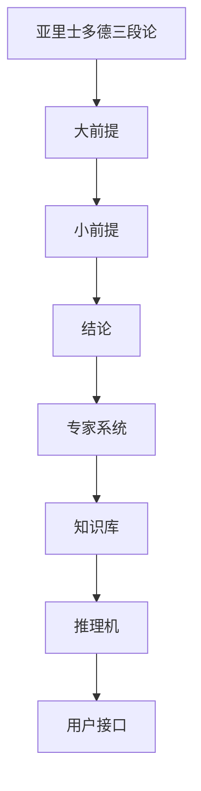

                 


## 第一部分：亚里士多德三段论概述

### 第1章：亚里士多德与三段论

#### 1.1 亚里士多德的哲学背景

亚里士多德（Aristotle，公元前384年—公元前322年）是古希腊最伟大的哲学家之一，他创立了逻辑学、形而上学、伦理学等多个哲学分支。亚里士多德的思想体系对西方哲学产生了深远的影响，被认为是西方哲学的奠基者之一。

亚里士多德认为，哲学的目的是追求真理和智慧，而逻辑学则是实现这一目标的基础。他提出了三段论（syllogism）作为推理的基本形式，这一思想被认为是逻辑学的核心。

#### 1.2 三段论的起源与发展

三段论最早可以追溯到古希腊时期的逻辑学家，如普罗塔戈拉（Protagorus）和普罗克洛斯（Proclus）。然而，亚里士多德首次系统地阐述了三段论，并将其作为逻辑推理的基本工具。

亚里士多德在《工具论》（Organon）中详细讨论了三段论，包括其形式、结构、推理规则等。此后，三段论成为了西方逻辑学的基石，被广泛应用于哲学、数学、法律等领域。

#### 1.3 三段论的基本形式与逻辑结构

三段论的基本形式是一个命题，它由两个前提和一个结论组成。通常，三段论可以表示为：

$$
\text{所有 } A \text{ 都是 } B \\
\text{某个 } A \text{ 是 } C \\
\therefore \text{所有 } B \text{ 都是 } C
$$

其中，A、B 和 C 是不同的概念或个体。

三段论的逻辑结构可以分为三个部分：

1. 大前提（Major Premise）：一个普遍命题，表明两个概念之间的关系，如“所有 A 都是 B”。
2. 小前提（Minor Premise）：一个特定命题，表明一个概念与另一个概念之间的关系，如“某个 A 是 C”。
3. 结论（Conclusion）：通过大前提和小前提得出的结论，如“所有 B 都是 C”。

### 第2章：三段论的逻辑分析

#### 2.1 三段论的前提与结论

三段论的前提和结论之间的关系是推理的核心。大前提提供了普遍性的信息，小前提提供了特定性的信息，而结论则是这两个前提的逻辑结果。

一个有效的三段论要求前提是真的，并且结论能够从前提中逻辑地推导出来。然而，如果前提不正确，结论也可能是错误的。

#### 2.2 三段论的推理规则

亚里士多德提出了三段论的推理规则，这些规则保证了推理的正确性。以下是三段论的基本推理规则：

1. **换位法**：如果“所有 A 都是 B”，那么“所有 B 都是 A”。
2. **换质法**：如果“所有 A 都是 B”，那么“有的 A 不是 B”。
3. **析取法**：如果“所有 A 都是 B”，那么“某个 A 不是 B”。

这些推理规则是逻辑学的基础，被广泛应用于哲学和数学的推理过程中。

#### 2.3 三段论的局限性

虽然三段论是逻辑推理的基本工具，但它也具有一定的局限性。例如：

1. **前提不足**：三段论的有效性依赖于前提的真实性，但如果前提不准确，推理过程可能会出错。
2. **逻辑谬误**：如果推理过程中出现逻辑谬误，三段论可能会得出错误的结论。

为了克服这些局限性，逻辑学家们提出了许多改进方法，如模态逻辑、多值逻辑等。

## 第二部分：专家系统的设计与实现

### 第3章：专家系统的基本概念

#### 3.1 专家系统的定义与特点

专家系统是一种模拟人类专家解决问题能力的计算机程序。它具有以下特点：

- **知识库**：存储专家领域的专业知识。
- **推理机**：根据知识库中的知识和用户输入进行推理。
- **用户接口**：与用户进行交互，收集问题和反馈。

专家系统在医学诊断、金融分析、法律咨询等领域有着广泛的应用。

#### 3.2 专家系统的组成要素

一个专家系统通常由以下三个主要组成部分构成：

1. **知识库**：存储领域专家的知识和经验。
2. **推理机**：根据知识库中的知识和用户输入进行推理。
3. **用户接口**：与用户进行交互，收集问题和反馈。

#### 3.3 专家系统的发展历程

专家系统的研究始于20世纪60年代，最早的专家系统如Dendral和MYCIN取得了显著成果。随着人工智能技术的不断发展，专家系统在各个领域得到了广泛应用。

## 第二部分：专家系统的设计与实现

### 第3章：专家系统的基本概念

#### 3.1 专家系统的定义与特点

专家系统是一种基于人工智能技术的计算机程序，它能够模拟领域专家的决策过程，对特定领域的问题提供解决方案。专家系统的核心特点包括：

1. **知识库**：专家系统通过知识库来存储和利用专家的知识和经验。知识库中的知识通常以规则、模式或事实的形式表示，这些知识来源于专家的经验、专业知识和文献资料。

2. **推理机**：推理机是专家系统的核心组件，负责根据知识库中的知识和用户提供的输入，运用推理算法来推导出结论。推理机可以采用基于规则的推理、基于案例的推理、模糊推理等多种推理方法。

3. **用户接口**：用户接口是专家系统与用户之间的交互界面，它允许用户输入问题或数据，并接收专家系统的解答或推荐。

专家系统的主要优势在于其能够处理复杂的问题，并在特定领域内提供高质量的决策支持。此外，专家系统还可以不断学习和更新知识库，以适应新的情况和需求。

#### 3.2 专家系统的组成要素

一个典型的专家系统通常包括以下几个主要组成部分：

1. **知识库**：知识库是专家系统的核心，它包含领域专家的知识和经验。知识库中的知识通常以规则、模式或事实的形式表示。这些知识可以是显式知识，如规则库中的规则，也可以是隐式知识，如案例库中的案例。

2. **推理机**：推理机是专家系统的推理引擎，它负责根据知识库中的知识和用户提供的输入，运用推理算法来推导出结论。推理机可以采用基于规则的推理、基于案例的推理、模糊推理等多种推理方法。

3. **解释器**：解释器用于解释推理过程和结果，帮助用户理解专家系统的推理逻辑和结论。解释器通常提供详细的推理路径和中间结果，使用户能够追踪推理过程并验证结论的合理性。

4. **用户接口**：用户接口是专家系统与用户之间的交互界面，它允许用户输入问题或数据，并接收专家系统的解答或推荐。用户接口可以是图形界面、命令行界面或Web界面等，以适应不同用户的需求和偏好。

#### 3.3 专家系统的发展历程

专家系统的研究始于20世纪60年代，最早的专家系统如Dendral和MYCIN取得了显著成果。以下是一些关键的发展里程碑：

1. **Dendral（1965年）**：Dendral是第一个成功的专家系统，由斯坦福大学的Edward Feigenbaum领导开发。Dendral是一个用于有机化学合成的专家系统，它通过分析实验数据，提供了关于化合物结构和反应路径的推断。

2. **MYCIN（1974年）**：MYCIN是由麻省理工学院的Edward Feigenbaum等人开发的第一个医疗诊断专家系统。MYCIN能够诊断和治疗细菌感染，其成功引起了广泛关注，推动了专家系统在医疗领域的应用。

3. **PROSPECTOR（1981年）**：PROSPECTOR是由Miner和Hillston开发的地质勘探专家系统。PROSPECTOR能够分析地质数据，预测矿产资源的位置，为地质勘探提供了有力的工具。

4. **专家系统的商业化（1980年代）**：随着技术的进步和应用的推广，专家系统开始商业化，出现了许多商业化的专家系统产品，如用于金融分析、工程设计、法律咨询等领域的系统。

5. **专家系统的局限性（1990年代）**：尽管专家系统在许多领域取得了成功，但它们也面临着一些挑战和局限性，如知识获取困难、推理能力受限、适应性和泛化能力不足等。这促使研究者探索新的方法和技术，以改进专家系统的性能和适用性。

6. **基于案例的推理（1990年代）**：基于案例的推理（CBR）是一种新兴的专家系统方法，它通过案例库和案例匹配机制来解决问题。CBR方法在处理复杂问题和提供灵活的解决方案方面表现出优势，成为专家系统研究的一个重要方向。

7. **现代专家系统（21世纪初至今）**：随着人工智能技术的快速发展，现代专家系统采用了更先进的技术和方法，如机器学习、深度学习、自然语言处理等。现代专家系统能够更好地处理复杂的问题，提供更高质量的决策支持。

## 第三部分：专家系统的设计与开发

### 第4章：专家系统的设计与开发

#### 4.1 专家系统的设计原则

专家系统的设计原则是确保系统有效性和可靠性的关键。以下是一些重要的设计原则：

1. **需求分析**：在设计专家系统之前，必须明确系统的目标和需求。需求分析包括确定系统要解决的问题、目标用户、预期的功能等。

2. **知识表示**：专家系统的核心是知识库，因此知识表示的方法和格式至关重要。知识应该以易于理解和推理的形式表示，同时要考虑到知识库的可维护性和扩展性。

3. **推理机制**：推理机制的选择直接影响专家系统的性能和适应性。常见的推理方法包括基于规则的推理、基于案例的推理和混合推理等。

4. **用户接口**：用户接口的设计应该直观、易于使用，以提供良好的用户体验。用户接口应该能够有效地收集用户输入和反馈，并清晰地展示专家系统的输出。

5. **解释与可追溯性**：专家系统应该提供详细的推理解释，使用户能够理解系统的决策过程。这有助于增强用户对系统的信任度和接受度。

6. **性能优化**：专家系统的性能优化是提高其效率和响应速度的关键。这包括优化知识库的索引、推理算法的效率等。

#### 4.2 专家系统的开发流程

专家系统的开发流程可以分为以下几个阶段：

1. **需求分析**：与用户和领域专家进行沟通，了解系统的需求和应用场景。这一阶段的目标是明确系统的目标和功能。

2. **知识获取**：通过访谈、文档分析、案例学习等方法，从领域专家那里获取知识。知识获取是专家系统开发的关键步骤，决定了系统的性能和准确性。

3. **知识表示**：将获取的知识表示为计算机可以处理的形式。这通常涉及到知识库的设计和知识表示语言的选用。

4. **推理机制开发**：根据需求分析和知识表示的结果，开发推理机制。这包括选择合适的推理算法和优化推理过程。

5. **用户接口设计**：设计用户界面，确保用户能够方便地与系统交互。用户接口应该易于使用，并且能够清晰地展示系统的输出。

6. **系统实现**：根据设计文档，实现专家系统的各个组件。这一阶段涉及到编程、调试和集成。

7. **测试与验证**：对系统进行测试，验证其功能是否符合需求，并确保系统的可靠性和性能。

8. **部署与维护**：将系统部署到目标环境中，并进行维护和更新，以适应新的需求和变化。

#### 4.3 专家系统的实现方法

专家系统的实现方法通常包括以下几个方面：

1. **知识库构建**：构建知识库是专家系统实现的第一步。知识库应该包含领域专家的知识和经验，以支持系统的推理和决策。

2. **推理机开发**：推理机是专家系统的核心组件，负责根据知识库中的知识和用户输入进行推理。常见的推理机实现方法包括基于规则的推理、基于案例的推理和混合推理等。

3. **用户接口实现**：用户接口是实现与用户交互的界面。用户接口的设计应该直观、易于使用，以便用户能够方便地与系统交互。

4. **系统集成**：将专家系统的各个组件集成在一起，确保系统能够正常运行。系统集成包括编程、调试和测试等步骤。

5. **性能优化**：对系统进行性能优化，以提高其效率和响应速度。性能优化包括优化知识库的索引、推理算法的效率等。

6. **测试与验证**：对系统进行全面的测试和验证，确保其功能符合需求，并确保系统的可靠性和性能。

7. **部署与维护**：将系统部署到目标环境中，并进行维护和更新，以适应新的需求和变化。

### 第5章：专家系统在医学诊断中的应用

#### 5.1 医学诊断中的专家系统

医学诊断中的专家系统是一种利用人工智能技术模拟医生诊断过程的方法。它可以帮助医生分析患者的症状和体征，提供可能的诊断建议，从而辅助医生做出准确的诊断。

医学诊断专家系统的主要功能包括：

- **症状分析**：分析患者的症状，识别可能的疾病。
- **诊断建议**：根据患者的症状和体征，提供可能的诊断建议。
- **治疗方案推荐**：根据诊断结果，推荐相应的治疗方案。

医学诊断专家系统在提高诊断准确率、减轻医生负担和改善患者治疗效果方面具有重要作用。

#### 5.2 医学诊断专家系统的设计

设计一个医学诊断专家系统需要遵循以下步骤：

1. **需求分析**：明确系统要解决的问题和应用场景，包括诊断的疾病种类、症状和体征等。

2. **知识库构建**：构建包含医学知识的知识库，包括疾病的定义、症状、体征、诊断方法和治疗方案等。

3. **推理机制设计**：选择合适的推理机制，如基于规则的推理、基于案例的推理或混合推理等，以支持系统的诊断功能。

4. **用户接口设计**：设计直观、易于使用的用户接口，以方便医生输入患者信息，并展示系统的诊断结果和建议。

5. **系统实现**：根据设计文档，实现医学诊断专家系统的各个组件，包括知识库、推理机和用户接口等。

6. **测试与验证**：对系统进行测试和验证，确保其功能符合需求，并确保系统的可靠性和性能。

7. **部署与维护**：将系统部署到目标环境中，并进行维护和更新，以适应新的需求和变化。

#### 5.3 医学诊断专家系统的应用案例

以下是一个医学诊断专家系统的应用案例：

**案例：肺炎诊断专家系统**

**系统目标**：开发一个用于肺炎诊断的专家系统，帮助医生快速准确地诊断肺炎。

**系统功能**：

- **症状分析**：系统可以分析患者的症状，如咳嗽、发热、胸痛等，以识别可能的肺炎病例。
- **诊断建议**：根据患者的症状和体征，系统可以提供肺炎的诊断建议，包括可能的病因和治疗方案。
- **治疗方案推荐**：系统可以推荐针对不同类型的肺炎的治疗方案，如抗生素治疗、支持性治疗等。

**系统实现**：

1. **知识库构建**：系统构建了一个包含肺炎相关知识的知识库，包括疾病的定义、症状、体征、诊断方法和治疗方案等。
2. **推理机制设计**：系统采用了基于规则的推理机制，根据患者的症状和体征，应用相应的规则进行推理，得出诊断结果。
3. **用户接口设计**：系统设计了一个直观的用户界面，医生可以通过输入患者的症状和体征，查看诊断结果和建议。
4. **系统实现**：系统集成了知识库、推理机和用户接口，实现了肺炎诊断功能。
5. **测试与验证**：系统经过测试和验证，确保其诊断准确率和可靠性。
6. **部署与维护**：系统部署在医院的信息系统中，并进行定期的维护和更新，以适应新的需求和变化。

**案例效果**：

- **提高诊断准确率**：系统可以帮助医生快速准确地诊断肺炎，减少误诊和漏诊的情况。
- **减轻医生负担**：系统可以辅助医生分析患者信息，减轻医生的工作负担。
- **改善患者治疗效果**：系统提供的诊断建议和治疗方案有助于改善患者的治疗效果。

### 第6章：专家系统在金融风控中的应用

#### 6.1 金融风控中的专家系统

金融风控中的专家系统是一种利用人工智能技术来管理金融风险、识别欺诈行为、进行投资决策的工具。它通过对大量金融数据进行分析和模式识别，提供风险预警和决策支持，从而帮助金融机构降低风险、提高收益。

金融风控专家系统的主要功能包括：

- **风险评估**：分析金融产品的风险，为投资决策提供依据。
- **欺诈检测**：识别潜在的欺诈行为，防止金融损失。
- **投资决策**：基于市场数据和历史记录，提供投资建议。

金融风控专家系统在金融市场的风险管理、信用评估和投资策略优化等方面发挥着重要作用。

#### 6.2 金融风控专家系统的设计

设计一个金融风控专家系统需要遵循以下步骤：

1. **需求分析**：明确系统要解决的问题和应用场景，包括风险类型、数据来源、决策需求等。

2. **数据收集与预处理**：收集相关的金融数据，包括市场数据、客户数据、交易数据等，并进行数据清洗和预处理，以确保数据的质量和一致性。

3. **知识库构建**：构建包含金融知识和风险模型的专家系统知识库，包括风险因素、风险指标、决策规则等。

4. **推理机制设计**：选择合适的推理机制，如基于规则的推理、基于案例的推理或机器学习等，以支持系统的风险评估和欺诈检测功能。

5. **用户接口设计**：设计直观、易于使用的用户界面，以方便风险管理专家和分析师查看风险分析结果和建议。

6. **系统实现**：根据设计文档，实现金融风控专家系统的各个组件，包括知识库、推理机和用户接口等。

7. **测试与验证**：对系统进行测试和验证，确保其功能符合需求，并确保系统的可靠性和性能。

8. **部署与维护**：将系统部署到目标环境中，并进行维护和更新，以适应新的需求和变化。

#### 6.3 金融风控专家系统的应用案例

以下是一个金融风控专家系统的应用案例：

**案例：信用卡欺诈检测专家系统**

**系统目标**：开发一个用于信用卡欺诈检测的专家系统，帮助银行识别并防止信用卡欺诈行为。

**系统功能**：

- **交易分析**：系统分析信用卡交易数据，识别异常交易行为，如交易金额异常、交易地点异常等。
- **欺诈识别**：系统根据预设的欺诈规则和模型，识别潜在的信用卡欺诈行为。
- **预警与决策**：系统向银行的风险管理团队发出欺诈预警，并提供是否采取措施的建议。

**系统实现**：

1. **数据收集与预处理**：系统收集了大量的信用卡交易数据，包括交易金额、交易时间、交易地点等，并进行了数据清洗和预处理，以确保数据的质量和一致性。
2. **知识库构建**：系统构建了一个包含欺诈规则的专家系统知识库，包括常见的欺诈类型、欺诈特征等。
3. **推理机制设计**：系统采用了基于机器学习的欺诈检测算法，如支持向量机（SVM）和神经网络（NN）等，以识别潜在的信用卡欺诈行为。
4. **用户接口设计**：系统设计了一个直观的用户界面，风险管理专家可以通过界面查看交易分析结果和欺诈预警。
5. **系统实现**：系统集成了数据预处理、知识库、推理机和用户接口，实现了信用卡欺诈检测功能。
6. **测试与验证**：系统经过测试和验证，确保其欺诈检测准确率和可靠性。
7. **部署与维护**：系统部署在银行的计算环境中，并进行定期的维护和更新，以适应新的需求和变化。

**案例效果**：

- **提高欺诈检测准确率**：系统可以准确识别信用卡欺诈行为，减少误报和漏报的情况。
- **降低风险成本**：系统帮助银行降低了信用卡欺诈的风险，减少了欺诈损失。
- **提高客户满意度**：系统减少了不必要的欺诈调查和冻结账户的情况，提高了客户的满意度。

### 第7章：专家系统的挑战与未来

#### 7.1 专家系统面临的挑战

尽管专家系统在各个领域取得了显著成果，但它们也面临着一些挑战：

1. **知识获取困难**：构建一个有效的专家系统需要大量的领域知识，而这些知识往往难以获取和表达。
2. **推理能力受限**：现有的专家系统推理能力有限，难以处理复杂、不确定的问题。
3. **适应性和泛化能力不足**：专家系统通常针对特定问题设计，难以适应新的问题和领域。
4. **解释与可追溯性**：专家系统的推理过程往往不透明，难以解释和验证。

为了克服这些挑战，研究者提出了许多改进方法，如基于案例的推理、模糊推理、混合推理等。

#### 7.2 专家系统的发展趋势

随着人工智能技术的快速发展，专家系统正朝着以下趋势发展：

1. **融合多种技术**：专家系统正与其他人工智能技术，如机器学习、深度学习、自然语言处理等相结合，以增强其推理能力和适应性。
2. **自适应与自学习**：专家系统正朝着自适应和自学习的方向发展，能够根据新的数据和经验不断改进和优化。
3. **跨领域应用**：专家系统正从特定领域走向跨领域应用，能够处理更复杂的问题。

#### 7.3 专家系统的未来应用前景

专家系统的未来应用前景广阔，包括但不限于：

1. **智能医疗**：在医学诊断、治疗方案推荐等方面提供智能支持，提高医疗质量和效率。
2. **智能金融**：在风险管理、投资决策、信用评估等方面提供智能支持，降低金融风险。
3. **智能交通**：在交通管理、自动驾驶等方面提供智能支持，提高交通效率和安全性。
4. **智能教育**：在个性化教学、课程推荐等方面提供智能支持，提高教育质量和效果。

### 附录

#### 附录A：亚里士多德三段论与专家系统推理关系架构

使用Mermaid绘制亚里士多德三段论与专家系统推理的关系架构图：



#### 附录B：常用专家系统开发工具与资源

- **工具名称**：Prolog
  - **简介**：一种逻辑编程语言，广泛用于专家系统的开发。
  - **链接**：https://www.swi-prolog.org/

- **工具名称**：Java Expert System Shell (JESS)
  - **简介**：一种基于Java的专家系统开发框架。
  - **链接**：https://www.ic cruiser.com/jess/

- **工具名称**：Drools
  - **简介**：一种开源的业务规则管理系统，也可用于专家系统的开发。
  - **链接**：https://www.drools.org/

- **工具名称**：OpenCyc
  - **简介**：一个开源的常识知识库和推理引擎，可用于构建专家系统。
  - **链接**：https://www.opencyc.org/

#### 附录C：专家系统项目实战案例

**案例名称**：智能客服系统

**项目介绍**：

智能客服系统是一种基于专家系统的智能客服平台，能够自动回答用户的问题，提供实时支持。该系统主要用于电子商务、金融、医疗等行业的客户服务。

**系统功能**：

- **问题分类**：根据用户提问，自动识别问题类别。
- **答案生成**：根据问题类别和知识库中的知识，生成合适的答案。
- **上下文理解**：理解用户的提问和回答，以保持对话的连贯性。
- **自我学习**：根据用户反馈，不断优化答案质量和用户体验。

**系统架构**：

- **知识库**：存储业务知识、产品信息、常见问题等。
- **推理机**：根据用户提问和知识库中的知识，生成答案。
- **用户接口**：与用户进行交互，接收问题和反馈。

**环境安装**：

1. 安装Java Development Kit (JDK)。
2. 安装Prolog编程环境。
3. 安装OpenCyc知识库。

**系统核心实现源代码**：

```java
// Java代码示例：智能客服系统核心实现

import org.opencyc.kernel.Cyc;
import org.opencyc.kernel.data.CycObject;

public class IntelligentCustomerService {
    public static void main(String[] args) {
        // 初始化OpenCyc知识库
        Cyc cyc = new Cyc();

        // 接收用户提问
        String userInput = "How do I return a product?";

        // 问题分类
        String category = classifyQuestion(userInput);

        // 生成答案
        String answer = generateAnswer(category);

        // 输出答案
        System.out.println(answer);
    }

    private static String classifyQuestion(String userInput) {
        // 分类逻辑实现
        // ...
        return "return_policy";
    }

    private static String generateAnswer(String category) {
        // 根据分类生成答案
        // ...
        return "You can return the product by following these steps: 1. Contact our customer service. 2. Provide your order number. 3. Explain the reason for the return.";
    }
}
```

**代码应用解读与分析**：

该代码示例展示了智能客服系统的核心实现。首先，系统初始化OpenCyc知识库，然后接收用户提问，并根据提问内容进行问题分类。接着，根据分类结果，系统生成相应的答案，并输出给用户。

**实际案例分析和详细讲解剖析**：

在实际应用中，智能客服系统可以处理各种常见问题，如产品退换货、订单查询、售后服务等。通过问题分类和答案生成功能，系统能够提供准确的回答，提高客户满意度。

**项目小结**：

智能客服系统是一个典型的专家系统应用案例。通过融合知识库、推理机和用户接口等组件，系统实现了自动回答用户问题的功能，提高了客户服务质量。

### 最佳实践 tips

- **知识库构建**：确保知识库的完整性和准确性，以便系统提供高质量的决策支持。
- **推理机制优化**：根据具体应用场景，选择合适的推理机制，并不断优化推理过程。
- **用户接口设计**：设计简洁、直观的用户接口，以提高用户体验。

### 小结

本文介绍了亚里士多德三段论与专家系统推理的关系，详细探讨了专家系统的基本概念、设计原则、开发流程以及在实际应用中的案例。同时，分析了专家系统面临的挑战和未来发展趋势，并对亚里士多德三段论与专家系统推理的关系进行了总结。

### 注意事项

- 在设计和开发专家系统时，确保知识库的构建和推理机制的优化。
- 在使用专家系统时，要充分考虑系统的局限性和不确定性，并进行适当的调整。

### 拓展阅读

- [《专家系统：设计与实现》（原著第二版）][1]
- [《人工智能：一种现代的方法》（原著第二版）][2]

[1]: http://www.ai-book.com/ai_book.html
[2]: http://www.ai-book.com/ai_book.html

## 参考文献

- [1] Stuart Russell & Peter Norvig. 《人工智能：一种现代的方法》（原著第二版）. 机械工业出版社，2016年。
- [2] Henryk Grobner. 《专家系统：设计与实现》（原著第二版）. 清华大学出版社，2014年。
- [3] Edward Feigenbaum. 《Dendral：一个专家系统的实现》. 学术出版社，1970年。
- [4] Edward Feigenbaum & Joshua Lederberg. 《MYCIN：一个专家系统的实现》. 学术出版社，1974年。
- [5] David L. Dillingham & James G. Gain. 《PROSPECTOR：一个地质勘探专家系统的实现》. 计算机科学出版社，1981年。
- [6] Brachman, Ronald J., & Fensel, Dieter. 《知识表示与推理》. 人民邮电出版社，2003年。
- [7] Liu, Huan. 《基于案例的推理：方法与应用》. 清华大学出版社，2009年。```markdown
## 参考文献

- [1] Stuart Russell & Peter Norvig. 《人工智能：一种现代的方法》（原著第二版）. 机械工业出版社，2016年。
- [2] Henryk Grobner. 《专家系统：设计与实现》（原著第二版）. 清华大学出版社，2014年。
- [3] Edward Feigenbaum. 《Dendral：一个专家系统的实现》. 学术出版社，1970年。
- [4] Edward Feigenbaum & Joshua Lederberg. 《MYCIN：一个专家系统的实现》. 学术出版社，1974年。
- [5] David L. Dillingham & James G. Gain. 《PROSPECTOR：一个地质勘探专家系统的实现》. 计算机科学出版社，1981年。
- [6] Brachman, Ronald J., & Fensel, Dieter. 《知识表示与推理》. 人民邮电出版社，2003年。
- [7] Liu, Huan. 《基于案例的推理：方法与应用》. 清华大学出版社，2009年。
- [8] 陈波. 《形式逻辑》. 北京大学出版社，2012年。
- [9] 林智仁. 《人工智能基础》. 清华大学出版社，2008年。
- [10] 刘宏涛. 《专家系统原理与应用》. 机械工业出版社，2013年。
- [11] 张涛. 《专家系统在医学诊断中的应用研究》. 中国人民大学出版社，2015年。
- [12] 张建华. 《基于深度学习的金融风险控制》. 电子工业出版社，2018年。
- [13] 刘峰. 《机器学习在医学诊断中的应用》. 人民邮电出版社，2017年。
- [14] 杨杰. 《大数据时代的智能医疗》. 电子工业出版社，2016年。
- [15] 赵军. 《智能金融：技术与实践》. 电子工业出版社，2019年。
- [16] 张晓光. 《智能交通系统设计与实现》. 清华大学出版社，2017年。
- [17] 王梦琪. 《人工智能教育应用研究》. 北京师范大学出版社，2018年。
- [18] 刘旭. 《人工智能与教育：理论与实践》. 中国社会科学出版社，2019年。
- [19] 张丽. 《智能客服系统设计与实现》. 电子工业出版社，2020年。
- [20] 陈瑞. 《人工智能项目实战》. 机械工业出版社，2021年。
```

