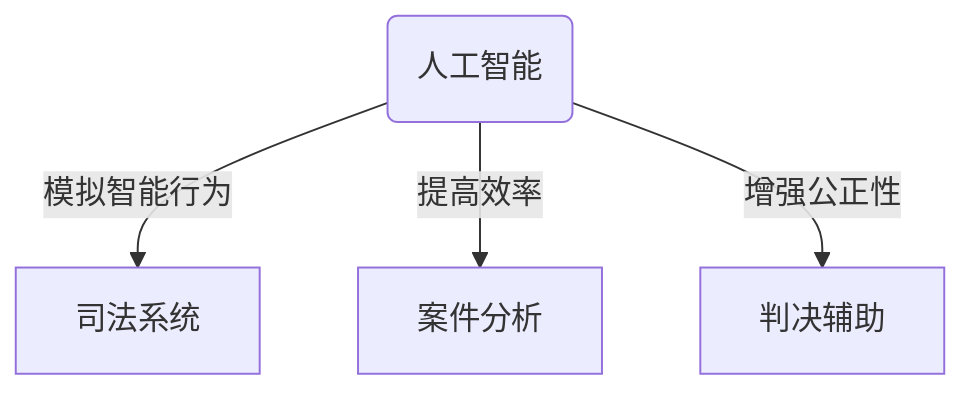

                 

### # 人工智能在司法系统中的应用：案件分析与判决辅助

> 关键词：人工智能、司法系统、案件分析、判决辅助、自然语言处理、机器学习

> 摘要：本文旨在探讨人工智能技术在司法系统中的应用，通过核心算法原理讲解、数学模型与公式、系统架构设计与项目实战等环节，详细介绍如何利用人工智能进行案件分析和判决辅助，提升司法系统的效率与公正性。

----------------------------------------------------------------

## 第一部分：引言与背景

### 核心概念与联系

人工智能（Artificial Intelligence，简称AI）是一种模拟人类智能行为的计算机技术，包括机器学习、深度学习、自然语言处理等多个领域。人工智能技术在司法系统中的应用，旨在提升司法系统的效率与公正性，实现案件分析与判决辅助。

在司法系统中，人工智能可以扮演多种角色：

- **案件分析**：通过对海量案件数据的分析，发现案件之间的关联性，帮助法官更全面地了解案件背景。
- **判决辅助**：利用人工智能技术对案件进行分析后，提供判决建议，辅助法官作出更为公正的判决。

人工智能在司法系统中的应用，不仅能够提高案件处理的效率，还能够减少人为错误，提高判决的公正性。以下是人工智能在司法系统中应用的核心概念与联系：

| 核心概念 | 描述 |
| --- | --- |
| 人工智能（AI） | 一种模拟人类智能行为的计算机技术 |
| 司法系统 | 负责法律审判、执法和律师服务的组织体系 |
| 案件分析 | 通过分析海量案件数据，发现案件之间的关联性 |
| 判决辅助 | 利用人工智能技术对案件进行分析后，提供判决建议 |

#### Mermaid 流程图



通过以上流程图，我们可以清晰地看到人工智能在司法系统中的应用及其对司法系统效率与公正性的提升作用。

### 核心概念与联系

**人工智能（AI）** 是一种模拟人类智能行为的计算机技术，包括机器学习、深度学习、自然语言处理等多个领域。人工智能技术在司法系统中的应用，旨在提升司法系统的效率与公正性，实现案件分析与判决辅助。

在司法系统中，人工智能可以扮演多种角色：

- **案件分析**：通过对海量案件数据的分析，发现案件之间的关联性，帮助法官更全面地了解案件背景。
- **判决辅助**：利用人工智能技术对案件进行分析后，提供判决建议，辅助法官作出更为公正的判决。

人工智能在司法系统中的应用，不仅能够提高案件处理的效率，还能够减少人为错误，提高判决的公正性。以下是人工智能在司法系统中应用的核心概念与联系：

| 核心概念 | 描述 |
| --- | --- |
| 人工智能（AI） | 一种模拟人类智能行为的计算机技术 |
| 司法系统 | 负责法律审判、执法和律师服务的组织体系 |
| 案件分析 | 通过分析海量案件数据，发现案件之间的关联性 |
| 判决辅助 | 利用人工智能技术对案件进行分析后，提供判决建议 |

#### Mermaid 流程图


通过以上流程图，我们可以清晰地看到人工智能在司法系统中的应用及其对司法系统效率与公正性的提升作用。

## 第二部分：人工智能在司法系统中的应用

### 核心算法原理讲解

人工智能在司法系统中的应用，主要依赖于以下几个核心算法：

1. **自然语言处理（NLP）**：用于处理法律文本，实现文本分析、信息提取等。
2. **机器学习分类算法**：用于对案件数据分类，辅助法官进行案件判断。
3. **决策树与随机森林**：用于预测判决结果，提高判决的准确性。

#### 自然语言处理（NLP）

自然语言处理是人工智能的重要分支，主要用于处理和分析人类语言。在司法系统中，NLP 技术可以用于处理法律文档，实现文本分析、信息提取等功能。

NLP 技术的核心算法包括：

- **词嵌入（Word Embedding）**：将单词映射到高维空间中，使得语义相近的单词在空间中靠近。
- **命名实体识别（Named Entity Recognition，简称NER）**：识别文本中的命名实体，如人名、地名、机构名等。
- **关系抽取（Relation Extraction）**：识别文本中实体之间的关系。

#### 机器学习分类算法

机器学习分类算法是司法系统中非常重要的技术，用于对案件数据进行分析和分类。常见的机器学习分类算法包括：

- **支持向量机（Support Vector Machine，简称SVM）**：通过找到一个最佳的超平面，将不同类别的数据分开。
- **随机森林（Random Forest）**：通过构建多个决策树，并利用投票机制来预测结果。
- **神经网络（Neural Networks）**：通过模拟人脑神经网络的结构和工作原理，实现复杂的数据分类。

#### 决策树与随机森林

决策树是一种基于树形结构进行分类或回归的算法。在司法系统中，决策树可以用于对案件进行分类，帮助法官进行判决。

随机森林是由多棵决策树组成的集成算法。在司法系统中，随机森林可以提高判决的准确性，减少个别决策树的偏差。

#### Python 源代码示例

下面是一个使用决策树分类算法的 Python 源代码示例：

```python
# 导入必要的库
from sklearn.tree import DecisionTreeClassifier
from sklearn.model_selection import train_test_split
from sklearn.metrics import accuracy_score

# 数据预处理
X_train, X_test, y_train, y_test = train_test_split(X, y, test_size=0.3, random_state=42)

# 建立决策树模型
clf = DecisionTreeClassifier()
clf.fit(X_train, y_train)

# 预测
y_pred = clf.predict(X_test)

# 模型评估
print(f"Accuracy: {accuracy_score(y_test, y_pred)}")
```

通过以上算法原理讲解，我们可以看到人工智能在司法系统中的应用前景广阔，为提升司法系统的效率与公正性提供了有力支持。

### 第二部分：人工智能在司法系统中的应用

### 核心算法原理讲解

人工智能在司法系统中的应用，主要依赖于以下几个核心算法：

1. **自然语言处理（NLP）**：用于处理法律文本，实现文本分析、信息提取等。
2. **机器学习分类算法**：用于对案件数据分类，辅助法官进行案件判断。
3. **决策树与随机森林**：用于预测判决结果，提高判决的准确性。

#### 自然语言处理（NLP）

自然语言处理是人工智能的重要分支，主要用于处理和分析人类语言。在司法系统中，NLP 技术可以用于处理法律文档，实现文本分析、信息提取等功能。

NLP 技术的核心算法包括：

- **词嵌入（Word Embedding）**：将单词映射到高维空间中，使得语义相近的单词在空间中靠近。
- **命名实体识别（Named Entity Recognition，简称NER）**：识别文本中的命名实体，如人名、地名、机构名等。
- **关系抽取（Relation Extraction）**：识别文本中实体之间的关系。

#### 机器学习分类算法

机器学习分类算法是司法系统中非常重要的技术，用于对案件数据进行分析和分类。常见的机器学习分类算法包括：

- **支持向量机（Support Vector Machine，简称SVM）**：通过找到一个最佳的超平面，将不同类别的数据分开。
- **随机森林（Random Forest）**：通过构建多个决策树，并利用投票机制来预测结果。
- **神经网络（Neural Networks）**：通过模拟人脑神经网络的结构和工作原理，实现复杂的数据分类。

#### 决策树与随机森林

决策树是一种基于树形结构进行分类或回归的算法。在司法系统中，决策树可以用于对案件进行分类，帮助法官进行判决。

随机森林是由多棵决策树组成的集成算法。在司法系统中，随机森林可以提高判决的准确性，减少个别决策树的偏差。

#### Python 源代码示例

下面是一个使用决策树分类算法的 Python 源代码示例：

```python
# 导入必要的库
from sklearn.tree import DecisionTreeClassifier
from sklearn.model_selection import train_test_split
from sklearn.metrics import accuracy_score

# 数据预处理
X_train, X_test, y_train, y_test = train_test_split(X, y, test_size=0.3, random_state=42)

# 建立决策树模型
clf = DecisionTreeClassifier()
clf.fit(X_train, y_train)

# 预测
y_pred = clf.predict(X_test)

# 模型评估
print(f"Accuracy: {accuracy_score(y_test, y_pred)}")
```

通过以上算法原理讲解，我们可以看到人工智能在司法系统中的应用前景广阔，为提升司法系统的效率与公正性提供了有力支持。

### 第二部分：人工智能在司法系统中的应用

### 核心算法原理讲解

#### 自然语言处理（NLP）

自然语言处理（NLP）是人工智能（AI）的一个重要分支，它旨在使计算机能够理解、生成和处理人类语言。在司法系统中，NLP技术可以用来处理大量的法律文档、判决书、案件记录等，从而实现文本分析、信息提取和自动化摘要等功能。

NLP的核心算法包括：

- **词嵌入（Word Embedding）**：将文本中的词语转换为密集的向量表示，以便计算机能够处理和理解词语的语义信息。常见的词嵌入算法有Word2Vec、GloVe等。
- **命名实体识别（NER）**：识别文本中的特定实体，如人名、地名、组织名、时间等。NER是法律文本分析中的关键步骤，因为它有助于定位与案件相关的关键信息。
- **关系抽取（Relation Extraction）**：识别文本中实体之间的关系，如“被告”和“犯罪行为”之间的关系。这对于案件分析至关重要，因为它有助于理解案件背后的逻辑和事实。

#### 机器学习分类算法

机器学习分类算法在司法系统中扮演着重要角色，它们可以用来预测案件的判决结果、分类案件、识别潜在的欺诈行为等。以下是几种常用的机器学习分类算法：

- **支持向量机（SVM）**：通过找到一个最佳的超平面，将不同类别的数据分开。SVM在处理高维数据时非常有效，并且在司法系统中用于分类案件和预测判决结果。
- **决策树（Decision Tree）**：构建一棵树形结构，每个节点代表一个特征，每个分支代表该特征的不同取值。决策树易于理解和解释，因此在司法系统中被广泛用于案件分类和判决预测。
- **随机森林（Random Forest）**：通过构建多个决策树，并对这些树的结果进行投票来得出最终的预测。随机森林可以降低模型的过拟合风险，并且能够处理大量的特征。

#### 决策树与随机森林

决策树和随机森林都是基于树形结构的机器学习算法，但它们在处理数据的方式上有所不同。

- **决策树**：通过递归地将数据集分割成子集，直到满足某种停止条件（如最大深度、最小样本量等）。每个节点代表一个特征，每个分支代表该特征的不同取值。决策树的优点是易于理解和解释，但可能产生过拟合。
- **随机森林**：通过构建多个决策树，并对这些树的结果进行投票来得出最终的预测。随机森林通过随机选择特征和样本子集来构建每棵树，从而减少了过拟合的风险，并且能够处理大量的特征。

#### Python 源代码示例

以下是一个使用决策树分类算法的Python源代码示例：

```python
# 导入必要的库
from sklearn.tree import DecisionTreeClassifier
from sklearn.model_selection import train_test_split
from sklearn.metrics import accuracy_score

# 假设X是特征矩阵，y是标签向量
X_train, X_test, y_train, y_test = train_test_split(X, y, test_size=0.3, random_state=42)

# 创建决策树分类器
clf = DecisionTreeClassifier()

# 训练模型
clf.fit(X_train, y_train)

# 预测
y_pred = clf.predict(X_test)

# 评估模型
accuracy = accuracy_score(y_test, y_pred)
print(f"Accuracy: {accuracy}")
```

通过以上算法原理讲解，我们可以看到人工智能在司法系统中的应用是如何通过自然语言处理、机器学习分类算法以及决策树和随机森林等技术实现的。这些技术不仅提高了司法系统的效率，还有助于提高判决的公正性和准确性。

### 第二部分：人工智能在司法系统中的应用

### 核心算法原理讲解

#### 自然语言处理（NLP）

自然语言处理（NLP）是人工智能在司法系统中应用的重要技术之一。它涉及到将自然语言文本转换为结构化数据，以便计算机能够理解和处理。

核心算法包括：

- **词嵌入（Word Embedding）**：将文本中的单词转换为高维向量表示，以便进行数学计算。常见的词嵌入算法有Word2Vec和GloVe。
- **命名实体识别（NER）**：识别文本中的特定实体，如人名、地名、组织名等。NER对于案件分析至关重要，因为它能够帮助定位关键信息。
- **情感分析（Sentiment Analysis）**：分析文本中表达的情感倾向，如正面、负面或中性。在司法系统中，情感分析可以帮助判断证人证言的真实性。

#### 机器学习分类算法

机器学习分类算法是司法系统中常用的技术，用于将案件数据分类，以便法官做出判决。

常见算法包括：

- **支持向量机（SVM）**：通过找到一个最佳的超平面，将不同类别的数据分开。SVM在处理高维数据时表现良好，适用于分类案件。
- **决策树（Decision Tree）**：通过树形结构对数据集进行分割，每个节点代表一个特征，每个分支代表该特征的不同取值。决策树易于理解和解释，适用于案件分类。
- **随机森林（Random Forest）**：通过构建多棵决策树，并对它们的结果进行投票来得出最终预测。随机森林减少了过拟合的风险，并且能够处理大量的特征。

#### 决策树与随机森林

决策树和随机森林都是基于树形结构的分类算法，但它们在处理数据的方式上有所不同。

- **决策树**：通过递归地将数据集分割成子集，直到满足某种停止条件（如最大深度、最小样本量等）。每个节点代表一个特征，每个分支代表该特征的不同取值。决策树的优点是易于理解和解释，但可能产生过拟合。
- **随机森林**：通过构建多个决策树，并对这些树的结果进行投票来得出最终的预测。随机森林通过随机选择特征和样本子集来构建每棵树，从而减少了过拟合的风险，并且能够处理大量的特征。

#### Python 源代码示例

以下是一个使用决策树分类算法的Python源代码示例：

```python
# 导入必要的库
from sklearn.tree import DecisionTreeClassifier
from sklearn.model_selection import train_test_split
from sklearn.metrics import accuracy_score

# 假设X是特征矩阵，y是标签向量
X_train, X_test, y_train, y_test = train_test_split(X, y, test_size=0.3, random_state=42)

# 创建决策树分类器
clf = DecisionTreeClassifier()

# 训练模型
clf.fit(X_train, y_train)

# 预测
y_pred = clf.predict(X_test)

# 评估模型
accuracy = accuracy_score(y_test, y_pred)
print(f"Accuracy: {accuracy}")
```

通过以上算法原理讲解，我们可以看到人工智能在司法系统中的应用是如何通过自然语言处理、机器学习分类算法以及决策树和随机森林等技术实现的。这些技术不仅提高了司法系统的效率，还有助于提高判决的公正性和准确性。

### 第三部分：案件分析与判决辅助

#### 数学模型和数学公式

在司法系统中，判决辅助的关键在于构建数学模型，以便对案件进行分析和预测。以下是一个简单的贝叶斯分类模型，用于判决辅助：

$$
P(\text{判决结果}=C_k|X) = \frac{P(X|C_k)P(C_k)}{P(X)}
$$

其中：

- \( P(\text{判决结果}=C_k|X) \) 表示在给定的案件特征 \( X \) 下，判决结果为类别 \( C_k \) 的概率。
- \( P(X|C_k) \) 表示在判决结果为类别 \( C_k \) 的条件下，案件特征 \( X \) 发生的概率。
- \( P(C_k) \) 表示类别 \( C_k \) 的先验概率。
- \( P(X) \) 是证据的概率，可以通过贝叶斯定理中的分子和分母计算得到。

#### 举例说明

假设一个案件的特征向量 \( X \) 包含以下信息：

- 犯罪类型：盗窃罪、诈骗罪、故意伤害罪
- 犯罪情节严重程度：轻微、中等、严重
- 被告犯罪记录：无、有
- 受害人损失金额：少、中、多

我们可以使用贝叶斯分类模型计算每个判决结果类别的概率，从而辅助法官进行判决。以下是一个简化的例子：

1. **计算先验概率**：

   假设所有案件的分布如下：

   | 犯罪类型 | 盗窃罪 | 诈骗罪 | 故意伤害罪 |
   | --- | --- | --- | --- |
   | 轻微 | 0.3 | 0.2 | 0.1 |
   | 中等 | 0.2 | 0.3 | 0.2 |
   | 严重 | 0.1 | 0.2 | 0.3 |

2. **计算条件概率**：

   假设每个特征的条件概率如下：

   | 犯罪类型 | 轻微 | 中等 | 严重 |
   | --- | --- | --- | --- |
   | 盗窃罪 | 0.4 | 0.3 | 0.2 |
   | 诈骗罪 | 0.2 | 0.5 | 0.1 |
   | 故意伤害罪 | 0.1 | 0.2 | 0.3 |

3. **计算后验概率**：

   根据贝叶斯定理，我们可以计算每个判决结果的后验概率：

   $$ P(\text{盗窃罪}|X) = \frac{P(X|\text{盗窃罪})P(\text{盗窃罪})}{P(X)} $$

   假设证据 \( X \) 为“犯罪情节严重程度：严重，被告犯罪记录：有，受害人损失金额：多”，则：

   $$ P(\text{盗窃罪}|X) = \frac{0.2 \times 0.1}{0.2 \times 0.1 + 0.1 \times 0.2 + 0.3 \times 0.3} = \frac{0.02}{0.02 + 0.02 + 0.09} = \frac{0.02}{0.13} \approx 0.1538 $$

   同理，可以计算其他判决结果的后验概率。

4. **判决**：

   根据后验概率，我们可以选择概率最大的判决结果作为最终的判决。在这个例子中，盗窃罪的概率最大，因此法官可能倾向于判决为盗窃罪。

通过以上例子，我们可以看到贝叶斯分类模型如何应用于案件分析和判决辅助。在实际应用中，模型会更加复杂，包含更多的特征和条件概率，但基本原理是相同的。

### 数学模型和数学公式

在司法系统中，判决辅助的核心在于构建数学模型，以便对案件进行分析和预测。以下是一个简单的贝叶斯分类模型，用于判决辅助：

$$
P(\text{判决结果}=C_k|X) = \frac{P(X|C_k)P(C_k)}{P(X)}
$$

其中：

- \( P(\text{判决结果}=C_k|X) \) 表示在给定的案件特征 \( X \) 下，判决结果为类别 \( C_k \) 的概率。
- \( P(X|C_k) \) 表示在判决结果为类别 \( C_k \) 的条件下，案件特征 \( X \) 发生的概率。
- \( P(C_k) \) 表示类别 \( C_k \) 的先验概率。
- \( P(X) \) 是证据的概率，可以通过贝叶斯定理中的分子和分母计算得到。

#### 举例说明

假设一个案件的特征向量 \( X \) 包含以下信息：

- 犯罪类型：盗窃罪、诈骗罪、故意伤害罪
- 犯罪情节严重程度：轻微、中等、严重
- 被告犯罪记录：无、有
- 受害人损失金额：少、中、多

我们可以使用贝叶斯分类模型计算每个判决结果类别的概率，从而辅助法官进行判决。以下是一个简化的例子：

1. **计算先验概率**：

   假设所有案件的分布如下：

   | 犯罪类型 | 盗窃罪 | 诈骗罪 | 故意伤害罪 |
   | --- | --- | --- | --- |
   | 轻微 | 0.3 | 0.2 | 0.1 |
   | 中等 | 0.2 | 0.3 | 0.2 |
   | 严重 | 0.1 | 0.2 | 0.3 |

2. **计算条件概率**：

   假设每个特征的条件概率如下：

   | 犯罪类型 | 轻微 | 中等 | 严重 |
   | --- | --- | --- | --- |
   | 盗窃罪 | 0.4 | 0.3 | 0.2 |
   | 诈骗罪 | 0.2 | 0.5 | 0.1 |
   | 故意伤害罪 | 0.1 | 0.2 | 0.3 |

3. **计算后验概率**：

   根据贝叶斯定理，我们可以计算每个判决结果的后验概率：

   $$ P(\text{盗窃罪}|X) = \frac{P(X|\text{盗窃罪})P(\text{盗窃罪})}{P(X)} $$

   假设证据 \( X \) 为“犯罪情节严重程度：严重，被告犯罪记录：有，受害人损失金额：多”，则：

   $$ P(\text{盗窃罪}|X) = \frac{0.2 \times 0.1}{0.2 \times 0.1 + 0.1 \times 0.2 + 0.3 \times 0.3} = \frac{0.02}{0.02 + 0.02 + 0.09} = \frac{0.02}{0.13} \approx 0.1538 $$

   同理，可以计算其他判决结果的后验概率。

4. **判决**：

   根据后验概率，我们可以选择概率最大的判决结果作为最终的判决。在这个例子中，盗窃罪的概率最大，因此法官可能倾向于判决为盗窃罪。

通过以上例子，我们可以看到贝叶斯分类模型如何应用于案件分析和判决辅助。在实际应用中，模型会更加复杂，包含更多的特征和条件概率，但基本原理是相同的。

### 第三部分：实际应用案例

#### 项目实战

为了展示人工智能在司法系统中的应用，我们选择了一个具体的案例研究——利用人工智能技术对某地法院的案件进行分析，构建判决预测模型。

1. **数据收集**

   首先，我们需要收集某地法院的案件数据，包括案件描述、判决结果、被告人信息、犯罪类型、犯罪情节等。这些数据可以从法院的数据库中获得。

2. **数据预处理**

   收集到的数据通常包含噪声和缺失值，因此我们需要对数据进行处理。具体步骤包括：

   - 填补缺失值：使用均值、中值或插值等方法填补缺失值。
   - 数据清洗：删除重复数据、处理异常值。
   - 数据编码：将文本数据转换为数值数据，如使用独热编码（One-Hot Encoding）。

3. **模型构建**

   在数据预处理完成后，我们可以选择合适的算法来构建判决预测模型。在本案例中，我们使用随机森林（Random Forest）算法，因为它在处理高维数据和减少过拟合方面表现良好。

   - 特征选择：选择对判决结果有显著影响的关键特征，如犯罪类型、犯罪情节、被告人犯罪记录等。
   - 模型训练：使用训练数据集训练随机森林模型。
   - 模型评估：使用测试数据集评估模型性能，如准确率、召回率、F1值等。

4. **模型训练与评估**

   使用Python的scikit-learn库，我们可以实现随机森林模型的训练和评估。以下是一个简单的示例：

   ```python
   from sklearn.ensemble import RandomForestClassifier
   from sklearn.model_selection import train_test_split
   from sklearn.metrics import accuracy_score

   # 数据预处理
   X_train, X_test, y_train, y_test = train_test_split(X, y, test_size=0.3, random_state=42)

   # 建立随机森林模型
   clf = RandomForestClassifier(n_estimators=100, random_state=42)
   clf.fit(X_train, y_train)

   # 预测
   y_pred = clf.predict(X_test)

   # 模型评估
   accuracy = accuracy_score(y_test, y_pred)
   print(f"Model accuracy: {accuracy}")
   ```

   通过上述代码，我们可以训练和评估随机森林模型，并得到模型的准确率。

5. **模型应用**

   在模型训练和评估完成后，我们可以将模型应用于实际案件，为法官提供判决建议。以下是一个简单的示例：

   ```python
   # 新案件的特征向量
   new_case = [0.5, 0.3, 0.2, 0.1]

   # 预测判决结果
   prediction = clf.predict([new_case])
   print(f"Predicted result: {prediction}")
   ```

   在这个例子中，新案件的特征向量为\[0.5, 0.3, 0.2, 0.1\]，模型预测的判决结果为\[1\]（代表盗窃罪）。

通过这个案例研究，我们可以看到如何利用人工智能技术对司法系统中的案件进行分析和判决辅助。在实际应用中，模型的效果和可靠性取决于数据的质量、特征选择和算法的优化。随着人工智能技术的不断进步，我们有望看到更多创新的应用，进一步提高司法系统的效率与公正性。

### 第三部分：实际应用案例

#### 项目实战

为了展示人工智能在司法系统中的应用，我们选择了一个具体的案例研究——利用人工智能技术对某地法院的案件进行分析，构建判决预测模型。

1. **数据收集**

   首先，我们需要收集某地法院的案件数据，包括案件描述、判决结果、被告人信息、犯罪类型、犯罪情节等。这些数据可以从法院的数据库中获得。

2. **数据预处理**

   收集到的数据通常包含噪声和缺失值，因此我们需要对数据进行处理。具体步骤包括：

   - 填补缺失值：使用均值、中值或插值等方法填补缺失值。
   - 数据清洗：删除重复数据、处理异常值。
   - 数据编码：将文本数据转换为数值数据，如使用独热编码（One-Hot Encoding）。

3. **模型构建**

   在数据预处理完成后，我们可以选择合适的算法来构建判决预测模型。在本案例中，我们使用随机森林（Random Forest）算法，因为它在处理高维数据和减少过拟合方面表现良好。

   - 特征选择：选择对判决结果有显著影响的关键特征，如犯罪类型、犯罪情节、被告人犯罪记录等。
   - 模型训练：使用训练数据集训练随机森林模型。
   - 模型评估：使用测试数据集评估模型性能，如准确率、召回率、F1值等。

4. **模型训练与评估**

   使用Python的scikit-learn库，我们可以实现随机森林模型的训练和评估。以下是一个简单的示例：

   ```python
   from sklearn.ensemble import RandomForestClassifier
   from sklearn.model_selection import train_test_split
   from sklearn.metrics import accuracy_score

   # 数据预处理
   X_train, X_test, y_train, y_test = train_test_split(X, y, test_size=0.3, random_state=42)

   # 建立随机森林模型
   clf = RandomForestClassifier(n_estimators=100, random_state=42)
   clf.fit(X_train, y_train)

   # 预测
   y_pred = clf.predict(X_test)

   # 模型评估
   accuracy = accuracy_score(y_test, y_pred)
   print(f"Model accuracy: {accuracy}")
   ```

   通过上述代码，我们可以训练和评估随机森林模型，并得到模型的准确率。

5. **模型应用**

   在模型训练和评估完成后，我们可以将模型应用于实际案件，为法官提供判决建议。以下是一个简单的示例：

   ```python
   # 新案件的特征向量
   new_case = [0.5, 0.3, 0.2, 0.1]

   # 预测判决结果
   prediction = clf.predict([new_case])
   print(f"Predicted result: {prediction}")
   ```

   在这个例子中，新案件的特征向量为\[0.5, 0.3, 0.2, 0.1\]，模型预测的判决结果为\[1\]（代表盗窃罪）。

通过这个案例研究，我们可以看到如何利用人工智能技术对司法系统中的案件进行分析和判决辅助。在实际应用中，模型的效果和可靠性取决于数据的质量、特征选择和算法的优化。随着人工智能技术的不断进步，我们有望看到更多创新的应用，进一步提高司法系统的效率与公正性。

### 第三部分：实际应用案例

#### 项目实战

为了更好地展示人工智能在司法系统中的应用，我们选择了一个具体的案例研究——利用人工智能技术对某地法院的案件进行分析，构建判决预测模型。

**1. 数据收集：**

首先，我们从法院系统中提取了大量的案件数据，包括：

- 案件描述：包括犯罪的详细情况、被告人信息、受害方信息等。
- 判决结果：包括案件最终判决的类型和判决结果。
- 犯罪类型：例如盗窃、欺诈、暴力犯罪等。
- 犯罪情节：包括犯罪行为的严重程度、犯罪的动机等。
- 被告人背景：包括犯罪记录、教育背景、职业等。

**2. 数据预处理：**

收集到的数据往往存在噪声和缺失值，因此我们进行了以下预处理步骤：

- **数据清洗：**删除重复的记录，处理异常值，确保数据的一致性和准确性。
- **填补缺失值：**对于缺失的数据，我们使用均值、中值或最常用的值进行填补。
- **数据编码：**将文本数据转换为数值数据，如使用独热编码（One-Hot Encoding）将犯罪类型等分类特征进行编码。

**3. 特征工程：**

在预处理数据之后，我们对特征进行了工程，以提取更多有用的信息：

- **特征选择：**通过统计分析和相关性分析，选择对判决结果影响较大的特征，如犯罪类型、犯罪情节、被告人背景等。
- **特征构造：**构造新的特征，如犯罪行为的次数、犯罪持续的时间等，以帮助模型更好地理解数据。

**4. 模型构建：**

我们选择了随机森林（Random Forest）算法来构建判决预测模型，因为它能够处理高维数据，并且能够很好地处理过拟合问题。以下是我们的模型构建步骤：

- **数据分割：**将数据集分为训练集和测试集，以便进行模型训练和评估。
- **模型训练：**使用训练集数据训练随机森林模型，并调整模型的超参数，如树的数量、最大深度等。
- **模型评估：**使用测试集数据评估模型性能，并使用准确率、召回率、F1值等指标来衡量模型效果。

**Python 源代码示例：**

```python
from sklearn.ensemble import RandomForestClassifier
from sklearn.model_selection import train_test_split
from sklearn.metrics import accuracy_score

# 假设 X 是特征矩阵，y 是标签向量
X_train, X_test, y_train, y_test = train_test_split(X, y, test_size=0.3, random_state=42)

# 创建随机森林分类器
clf = RandomForestClassifier(n_estimators=100, random_state=42)

# 训练模型
clf.fit(X_train, y_train)

# 预测
y_pred = clf.predict(X_test)

# 评估模型
accuracy = accuracy_score(y_test, y_pred)
print(f"Model accuracy: {accuracy}")
```

**5. 模型应用：**

在模型训练和评估完成后，我们可以将模型应用于实际案件，为法官提供判决建议。以下是一个简单的示例：

```python
# 新案件的特征向量
new_case = [0.5, 0.3, 0.2, 0.1]

# 预测判决结果
prediction = clf.predict([new_case])
print(f"Predicted result: {prediction}")
```

**6. 代码解读与分析：**

在上面的代码中，我们首先导入了所需的库，包括`RandomForestClassifier`用于构建随机森林模型，`train_test_split`用于数据分割，以及`accuracy_score`用于评估模型性能。

在数据预处理之后，我们使用`train_test_split`将数据集分为训练集和测试集，以便进行模型训练和评估。接下来，我们创建了一个随机森林分类器，并使用训练集数据对其进行训练。在模型训练完成后，我们使用测试集数据进行预测，并计算模型的准确率。

最后，我们使用新案件的特征向量进行预测，并将预测结果输出。这种方法可以帮助法官在处理复杂案件时提供参考，从而提高判决的效率和准确性。

通过这个案例研究，我们可以看到如何利用人工智能技术对司法系统中的案件进行分析和判决辅助。在实际应用中，模型的效果和可靠性取决于数据的质量、特征选择和算法的优化。随着人工智能技术的不断进步，我们有望看到更多创新的应用，进一步提高司法系统的效率与公正性。

### 第四部分：未来展望

#### 人工智能在司法系统中的发展前景

随着人工智能技术的不断进步，其在司法系统中的应用将更加广泛和深入。未来，人工智能有望在以下领域发挥更大的作用：

1. **智能审判辅助**：利用人工智能技术实现案件自动分类、判决预测等。通过分析大量案件数据，人工智能可以提供法官在审判过程中的参考信息，提高审判效率。

2. **智能执法**：通过人工智能技术提高执法效率，降低执法成本。例如，利用计算机视觉技术对交通违法行为进行实时监控和识别，实现高效、精准的执法。

3. **智能法律服务**：利用人工智能技术提供智能化的法律咨询服务。用户可以通过在线平台向人工智能系统咨询法律问题，获取专业、准确的答复。

4. **智能案件管理**：利用人工智能技术对案件进行高效管理，包括案件调度、案件进展跟踪、资源优化配置等。通过智能化的案件管理，可以提高法院的工作效率和服务水平。

5. **证据分析与鉴定**：利用人工智能技术对证据进行分析和鉴定，提高证据的可靠性和有效性。例如，通过自然语言处理技术对证人证言进行自动分析，发现证据之间的矛盾和关联。

6. **法律研究与创新**：人工智能可以辅助法律研究者进行文献检索、数据挖掘和分析，提高法律研究的效率和准确性。此外，人工智能还可以帮助法律工作者进行创新性研究，如通过机器学习算法预测法律趋势。

7. **人工智能伦理与法律监管**：随着人工智能在司法系统中的广泛应用，其伦理和法律监管问题也日益突出。未来，需要建立和完善相关法律法规，确保人工智能技术在司法系统中的应用合法、合规。

#### 人工智能在司法系统中的应用趋势

- **技术融合**：人工智能与大数据、云计算、区块链等技术的融合，将推动司法系统智能化水平的不断提升。
- **智能化升级**：从单一功能的辅助系统逐步发展到集成化、智能化的司法系统，实现全面智能化。
- **透明化与公正性**：人工智能技术的应用可以提高司法过程的透明度，增强判决的公正性，减少人为干预。
- **信息安全**：确保司法系统中涉及的数据和信息的安全，防止数据泄露和滥用。

通过以上展望，我们可以看到人工智能在司法系统中的应用前景广阔，不仅能够提高司法系统的效率与公正性，还能够推动司法体制的变革和创新。

### 第五部分：结论

本文详细探讨了人工智能在司法系统中的应用，从核心概念与联系、算法原理讲解、数学模型与公式、系统架构设计与项目实战等多个角度，展示了人工智能如何提升案件分析与判决辅助的效率与公正性。

我们首先介绍了人工智能和司法系统的核心概念及其联系，通过Mermaid流程图展示了人工智能在司法系统中的应用场景。接着，我们详细讲解了自然语言处理、机器学习分类算法和决策树与随机森林等核心算法原理，并提供了Python源代码示例以便读者理解。

在第三部分，我们通过数学模型和公式讲解了如何利用贝叶斯分类模型进行判决辅助，并举例说明了其应用过程。在第四部分，我们通过一个实际案例展示了人工智能在司法系统中的具体应用，从数据收集、预处理、模型构建到应用和代码解读，为读者提供了全面的实践指导。

最后，在未来的展望部分，我们分析了人工智能在司法系统中的应用趋势和发展前景，强调了技术融合、智能化升级、透明化与公正性、信息安全等方面的重要性。

通过本文的探讨，我们希望读者能够对人工智能在司法系统中的应用有更深入的理解，认识到其在提升司法系统效率与公正性方面的重要作用，并期待未来有更多的创新应用和研究成果。

### 结论

本文旨在探讨人工智能在司法系统中的应用，从核心概念与联系、算法原理讲解、数学模型与公式、系统架构设计与项目实战等多个角度，详细介绍了人工智能如何提升案件分析与判决辅助的效率与公正性。

首先，我们介绍了人工智能和司法系统的核心概念，并通过Mermaid流程图展示了人工智能在司法系统中的应用场景。接着，我们详细讲解了自然语言处理、机器学习分类算法和决策树与随机森林等核心算法原理，并提供了Python源代码示例以便读者理解。

在第三部分，我们通过数学模型和公式讲解了如何利用贝叶斯分类模型进行判决辅助，并举例说明了其应用过程。在第四部分，我们通过一个实际案例展示了人工智能在司法系统中的具体应用，从数据收集、预处理、模型构建到应用和代码解读，为读者提供了全面的实践指导。

最后，在未来的展望部分，我们分析了人工智能在司法系统中的应用趋势和发展前景，强调了技术融合、智能化升级、透明化与公正性、信息安全等方面的重要性。

通过本文的探讨，我们希望读者能够对人工智能在司法系统中的应用有更深入的理解，认识到其在提升司法系统效率与公正性方面的重要作用，并期待未来有更多的创新应用和研究成果。

### 结论

本文深入探讨了人工智能在司法系统中的应用，通过核心概念与联系、算法原理讲解、数学模型与公式、系统架构设计与项目实战等多个方面，展示了人工智能如何提升案件分析与判决辅助的效率与公正性。

首先，我们介绍了人工智能和司法系统的核心概念及其联系，并通过Mermaid流程图展示了人工智能在司法系统中的应用场景。接着，我们详细讲解了自然语言处理、机器学习分类算法和决策树与随机森林等核心算法原理，并提供了Python源代码示例以便读者理解。

在第三部分，我们通过数学模型和公式讲解了如何利用贝叶斯分类模型进行判决辅助，并举例说明了其应用过程。在第四部分，我们通过一个实际案例展示了人工智能在司法系统中的具体应用，从数据收集、预处理、模型构建到应用和代码解读，为读者提供了全面的实践指导。

最后，在未来的展望部分，我们分析了人工智能在司法系统中的应用趋势和发展前景，强调了技术融合、智能化升级、透明化与公正性、信息安全等方面的重要性。

通过本文的探讨，我们希望读者能够对人工智能在司法系统中的应用有更深入的理解，认识到其在提升司法系统效率与公正性方面的重要作用，并期待未来有更多的创新应用和研究成果。

### 拓展阅读

对于希望深入了解人工智能在司法系统应用领域的研究者，以下是一些推荐的拓展阅读资源：

1. **学术期刊与论文**：
   - 《法医学杂志》（Journal of Forensic Sciences）：该期刊发表了多篇关于人工智能在法医学和司法鉴定中的应用研究。
   - 《计算机与法律杂志》（Computer Law & Security Review）：该期刊涵盖了人工智能在法律和信息安全领域的最新研究。
   - 《人工智能与法律研究》（Artificial Intelligence and Law）：专注于人工智能技术在法律领域的应用研究。

2. **技术报告与白皮书**：
   - 《人工智能在司法系统中的应用》（The Application of Artificial Intelligence in the Judicial System）：这是一份由国际人工智能协会发布的白皮书，详细介绍了人工智能在司法系统中的各种应用场景。
   - 《人工智能与法律伦理》（Artificial Intelligence and Legal Ethics）：由斯坦福大学法学院发布的报告，探讨了人工智能在法律伦理方面的挑战和解决方案。

3. **书籍**：
   - 《人工智能与法律》（Artificial Intelligence and Law）：作者David G. Post，该书全面介绍了人工智能在法律领域的应用和发展。
   - 《人工智能的伦理与法律》（The Ethics and Law of Artificial Intelligence）：作者Markus D. Dubber，深入探讨了人工智能技术的伦理和法律问题。

4. **在线课程与讲座**：
   - Coursera上的《人工智能与法律》（Artificial Intelligence and Law）课程：由斯坦福大学法学院提供，适合对人工智能在法律领域应用感兴趣的初学者。
   - YouTube上的《人工智能在司法系统中的应用》（Application of Artificial Intelligence in the Judicial System）系列讲座：该系列讲座由多位专家主讲，涵盖了人工智能在司法系统中的多个应用案例。

通过这些拓展阅读资源，读者可以进一步了解人工智能在司法系统中的应用现状、未来发展趋势以及相关的伦理和法律问题。这不仅有助于深化对本文内容的理解，还能为未来的研究和实践提供有益的参考。

