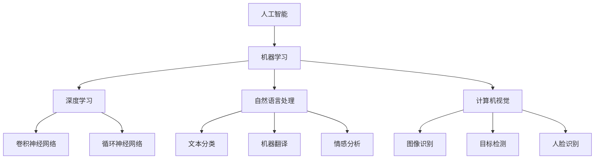
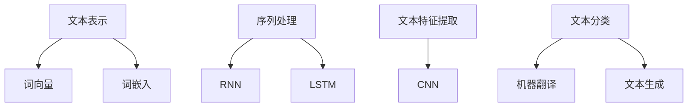
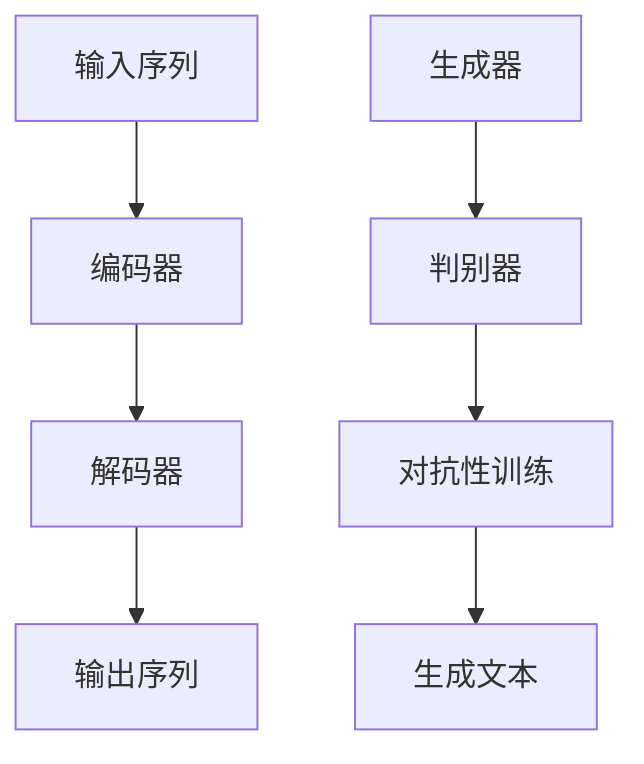
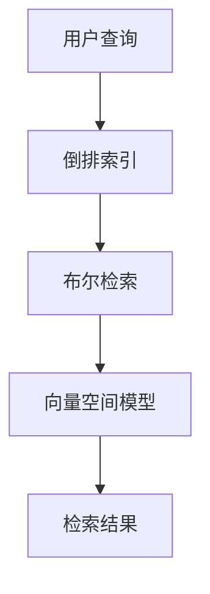
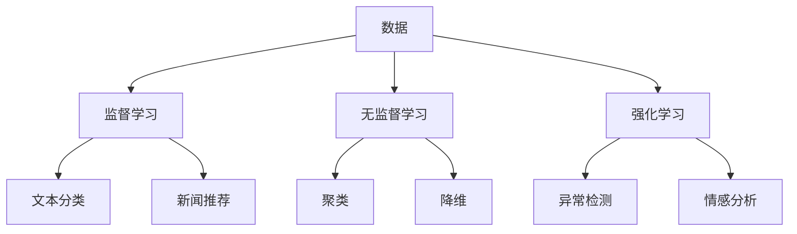

                 

### 引言

#### 1.1 书籍背景

随着科技的飞速发展，人工智能（AI）逐渐渗透到我们生活的方方面面。从智能助手到自动驾驶，AI 正在改变着传统的行业和商业模式。在新闻行业，人工智能的应用也日益广泛，从自动化写作到信息筛选，AI 正在改变着新闻报道的方式和效率。这本书旨在探讨人工智能在新闻报道中的角色，特别是自动化写作和信息筛选技术。

自动化写作是人工智能在新闻报道中的一个重要应用。通过自然语言处理（NLP）和机器学习技术，计算机可以自动生成新闻文章，从而大大提高新闻报道的生产效率。信息筛选则是指利用人工智能技术从大量的信息中筛选出最有价值、最相关的新闻，提高新闻报道的质量和准确性。

本书的研究目的是深入探讨人工智能在新闻报道中的应用，分析其技术原理、优势和挑战，并提出未来发展的趋势和方向。通过这本书，读者可以了解到人工智能在新闻报道中的实际应用案例，掌握相关技术，并为新闻报道行业的未来发展提供启示和建议。

#### 1.2 人工智能与新闻报道的关系

人工智能与新闻报道之间的关系可以追溯到上世纪90年代。当时，随着互联网的兴起，新闻报道的形式和内容都发生了巨大的变化。人工智能技术的出现为新闻报道带来了新的机遇和挑战。

首先，人工智能为新闻报道提供了自动化写作的可能。传统的新闻报道需要记者进行大量的信息搜集、编辑和校对工作，而人工智能可以自动化这些流程，从而提高新闻报道的效率和准确性。例如，自动化写作系统可以快速生成新闻报道，节省了人力成本，提高了生产效率。

其次，人工智能在信息筛选方面也有很大的应用价值。在庞大的信息海洋中，如何快速、准确地筛选出最有价值的新闻内容是新闻报道的一大挑战。人工智能可以通过自然语言处理和机器学习技术，从海量的信息中提取出关键信息，帮助记者进行新闻筛选，提高新闻报道的质量。

此外，人工智能还可以用于新闻报道的数据分析。通过大数据分析和数据挖掘技术，人工智能可以分析新闻事件的发展趋势、社会影响等，为新闻报道提供更深入、更全面的分析。

总的来说，人工智能在新闻报道中的应用不仅提高了新闻报道的效率和准确性，还改变了新闻报道的方式和内容，为新闻报道行业带来了巨大的变革。

#### 1.3 书籍结构安排

本书分为八个章节，内容安排如下：

- **第1章 引言**：介绍书籍的背景、研究目的和结构安排。
- **第2章 人工智能概述**：介绍人工智能的定义、发展历程和基本原理。
- **第3章 新闻报道概述**：介绍新闻报道的定义、类型和流程。
- **第4章 人工智能在新闻报道中的应用**：详细介绍人工智能在新闻报道中的应用，包括自动化写作和信息筛选。
- **第5章 自动化写作技术详解**：深入探讨自动化写作的技术原理和应用。
- **第6章 信息筛选技术详解**：详细讲解信息筛选的技术原理和应用。
- **第7章 自动化写作与信息筛选的实际应用案例**：分析自动化写作与信息筛选在实际新闻报道中的应用案例。
- **第8章 自动化写作与信息筛选的未来发展趋势**：探讨自动化写作与信息筛选的未来发展趋势和挑战。
- **第9章 总结**：总结全书内容，提出对未来新闻报道行业的启示和建议。

本书通过逐步分析推理的方式，从宏观到微观，从理论到实践，全面系统地探讨了人工智能在新闻报道中的应用。读者可以跟随作者的思考过程，深入理解人工智能在新闻报道中的角色和作用，为未来的新闻报道工作提供新的思路和方法。

## 第2章 人工智能概述

### 2.1 人工智能的定义与发展历程

人工智能（Artificial Intelligence，简称AI）是计算机科学的一个分支，主要研究如何使计算机系统具备类似人类的智能，能够进行学习、推理、解决问题和进行决策。人工智能的定义可以从多个角度进行理解。狭义的人工智能通常指的是能够执行特定任务的智能系统，如语音识别、图像识别、自然语言处理等。而广义的人工智能则是指具有广泛认知能力、能够自主学习和适应环境的智能系统。

人工智能的发展历程可以追溯到20世纪50年代。1950年，英国科学家艾伦·图灵（Alan Turing）提出了著名的图灵测试，试图通过测试计算机能否模拟人类智能来判断机器是否具有智能。这一概念成为人工智能研究的起点。1956年，达特茅斯会议（Dartmouth Conference）上，约翰·麦卡锡（John McCarthy）等人提出了“人工智能”这一术语，并确定其为计算机科学的一个独立研究领域。

人工智能的发展大致可以分为三个阶段：初始阶段（1956-1969年）、膨胀阶段（1970-1980年）和复苏阶段（1980年至今）。在初始阶段，研究者主要致力于构建能够执行特定任务的智能系统，如逻辑推理、问题解决等。膨胀阶段由于过高的期望和资源的不足，导致人工智能研究进入低谷。1980年代以来，随着计算机性能的提升、大数据的涌现和机器学习技术的发展，人工智能迎来了复苏和快速发展。

#### 2.2 人工智能的主要类型

人工智能可以按照不同的标准进行分类。以下是一些常见的人工智能类型：

- **基于规则的系统（Rule-based Systems）**：这类系统通过预定义的规则进行推理和决策。专家系统（Expert Systems）是其中的一种典型代表。专家系统通过模拟人类专家的知识和经验，对特定领域的问题提供决策支持。

- **机器学习系统（Machine Learning Systems）**：机器学习系统通过从数据中学习规律，自动改进其性能。机器学习可以分为监督学习（Supervised Learning）、无监督学习（Unsupervised Learning）和强化学习（Reinforcement Learning）等类型。

  - **监督学习**：监督学习系统通过已标记的数据学习输出结果，常见的算法有线性回归、决策树、支持向量机等。
  - **无监督学习**：无监督学习系统从未标记的数据中学习规律，常见的算法有聚类算法（如K-means、DBSCAN）和降维算法（如PCA）。
  - **强化学习**：强化学习系统通过与环境的交互，学习最优策略，常见的算法有Q学习、深度Q网络（DQN）等。

- **自然语言处理系统（Natural Language Processing Systems）**：自然语言处理系统致力于使计算机能够理解、生成和处理人类语言。常见的应用包括机器翻译、文本分类、情感分析等。

- **计算机视觉系统（Computer Vision Systems）**：计算机视觉系统致力于使计算机能够理解和解释图像和视频。常见的应用包括图像识别、目标检测、人脸识别等。

- **混合智能系统（Hybrid Intelligent Systems）**：混合智能系统结合了不同类型的人工智能技术，以实现更复杂的任务。例如，结合机器学习和自然语言处理技术，可以构建智能问答系统。

#### 2.3 人工智能的基本原理

人工智能的基本原理可以从多个角度进行理解，主要包括以下几个方面：

- **计算与算法**：计算机通过执行算法来解决问题。人工智能中的算法包括逻辑推理、搜索算法、优化算法等。

- **知识表示**：知识表示是人工智能研究的重要课题，旨在将知识以计算机可理解的形式表示出来。常见的知识表示方法有命题逻辑、产生式规则、框架表示等。

- **学习与适应**：学习与适应是人工智能的核心特征之一。机器学习是学习与适应的主要手段，通过从数据中学习规律，系统可以不断改进其性能。

- **推理与决策**：推理与决策是人工智能系统进行问题解决的关键。推理包括演绎推理和归纳推理，决策则是在特定环境下做出最优选择的过程。

- **计算模型**：人工智能的计算模型主要包括符号主义模型和连接主义模型。符号主义模型强调知识表示和推理，连接主义模型则强调大规模神经网络和深度学习。

#### 核心概念、联系与对比

核心概念：  
- **人工智能**：模拟人类智能的系统，具有学习、推理、解决问题和决策能力。  
- **机器学习**：通过从数据中学习规律，自动改进性能的技术。  
- **自然语言处理**：使计算机能够理解、生成和处理人类语言的技术。  
- **计算机视觉**：使计算机能够理解和解释图像和视频的技术。

联系与对比：

| 概念       | 关系                                                     | 对比                                                   |
|------------|----------------------------------------------------------|--------------------------------------------------------|
| 人工智能   | 包含机器学习、自然语言处理、计算机视觉等子领域           | 人工智能是一个总称，而机器学习、自然语言处理、计算机视觉是它的应用领域。 |
| 机器学习   | 是人工智能的一个重要组成部分，侧重于从数据中学习规律   | 与人工智能相比，机器学习更关注学习过程和数据应用。   |
| 自然语言处理 | 是人工智能的一个子领域，专注于语言理解和生成           | 与计算机视觉等相比，自然语言处理更关注文本信息的处理。 |
| 计算机视觉 | 是人工智能的一个子领域，专注于图像和视频的处理         | 与自然语言处理等相比，计算机视觉更关注视觉信息的处理。 |

#### ER实体关系图架构

以下是一个简化的ER实体关系图架构，展示了人工智能、机器学习、自然语言处理和计算机视觉之间的联系：

```mermaid
erDiagram
  AI ||--|{ ML } MachineLearning : 包含
  AI ||--|{ NLP } NaturalLanguageProcessing : 包含
  AI ||--|{ CV } ComputerVision : 包含
  ML ||--|{ SupervisedLearning } SupervisedLearning : 子类别
  ML ||--|{ UnsupervisedLearning } UnsupervisedLearning : 子类别
  ML ||--|{ ReinforcementLearning } ReinforcementLearning : 子类别
  NLP ||--|{ MachineTranslation } MachineTranslation : 应用
  NLP ||--|{ TextClassification } TextClassification : 应用
  NLP ||--|{ SentimentAnalysis } SentimentAnalysis : 应用
  CV ||--|{ ImageRecognition } ImageRecognition : 应用
  CV ||--|{ ObjectDetection } ObjectDetection : 应用
  CV ||--|{ FaceRecognition } FaceRecognition : 应用
```

通过这个ER图，我们可以清晰地看到各个概念之间的包含关系和应用领域，有助于理解和分析人工智能在新闻报道中的应用。

### 2.4 人工智能的核心技术

人工智能的核心技术包括机器学习、深度学习、自然语言处理和计算机视觉，这些技术共同构成了人工智能的基础。下面将分别介绍这些核心技术的基本概念、原理和应用。

#### 2.4.1 机器学习

机器学习是人工智能的一个重要分支，其核心思想是通过从数据中学习规律，自动改进系统的性能。机器学习可以分为监督学习、无监督学习和强化学习等类型。

1. **监督学习**：监督学习是一种从已标记的数据中学习规律的方法。训练数据包括输入特征和对应的输出标签，通过学习这些数据，模型可以预测未知数据的输出。常见的监督学习算法包括线性回归、决策树、支持向量机、神经网络等。

   - **线性回归**：通过建立输入特征和输出标签之间的线性关系，预测连续值的输出。
   - **决策树**：通过树形结构对输入特征进行划分，每个节点代表一个特征，每个分支代表不同特征的取值，最终达到分类或回归的目的。
   - **支持向量机**：通过找到一个最佳的超平面，将不同类别的数据分开。
   - **神经网络**：通过多层神经元对输入特征进行映射，实现对复杂函数的逼近。

2. **无监督学习**：无监督学习是一种从未标记的数据中学习规律的方法。主要目标是发现数据中的结构或模式。常见的无监督学习算法包括聚类算法、降维算法等。

   - **聚类算法**：通过将相似的数据点分为同一类，发现数据中的潜在结构。常见的聚类算法有K-means、DBSCAN等。
   - **降维算法**：通过减少数据维度，保留数据中的主要信息，简化数据分析过程。常见的降维算法有PCA、t-SNE等。

3. **强化学习**：强化学习是一种通过与环境的交互，学习最优策略的方法。系统通过不断尝试和反馈，逐渐优化其行为策略。常见的强化学习算法包括Q学习、深度Q网络（DQN）等。

   - **Q学习**：通过学习状态-动作价值函数，选择最优动作。
   - **深度Q网络（DQN）**：结合深度学习和强化学习，通过神经网络近似状态-动作价值函数。

#### 2.4.2 深度学习

深度学习是机器学习的一个分支，其核心思想是模拟人脑的神经网络结构，通过多层的非线性变换，实现对复杂数据的建模。深度学习在图像识别、语音识别、自然语言处理等领域取得了显著的成果。

1. **深度神经网络**：深度神经网络由多个隐层组成，每个隐层对输入特征进行非线性变换，最终输出结果。常见的深度神经网络结构包括卷积神经网络（CNN）、循环神经网络（RNN）、长短时记忆网络（LSTM）等。

   - **卷积神经网络（CNN）**：通过卷积层、池化层、全连接层等结构，实现对图像的建模。
   - **循环神经网络（RNN）**：通过循环结构，实现对序列数据的建模。
   - **长短时记忆网络（LSTM）**：通过记忆单元，解决RNN在长序列数据上的梯度消失问题。

2. **深度学习算法**：常见的深度学习算法包括反向传播算法、随机梯度下降（SGD）、Adam优化器等。

   - **反向传播算法**：通过反向传播误差，更新网络参数，优化模型。
   - **随机梯度下降（SGD）**：通过随机选取一部分训练数据，更新网络参数。
   - **Adam优化器**：结合SGD和Momentum方法，优化网络参数。

#### 2.4.3 自然语言处理

自然语言处理是人工智能的一个重要领域，其目标是使计算机能够理解、生成和处理人类语言。自然语言处理包括文本分类、机器翻译、情感分析、问答系统等多个方面。

1. **文本分类**：文本分类是将文本数据分为预定义的类别。常见的文本分类算法包括朴素贝叶斯、支持向量机、深度学习等。

   - **朴素贝叶斯**：基于贝叶斯定理，通过计算文本特征的概率，进行分类。
   - **支持向量机**：通过找到一个最佳的超平面，将不同类别的文本分开。
   - **深度学习**：通过多层神经网络，对文本进行建模，进行分类。

2. **机器翻译**：机器翻译是将一种语言的文本翻译成另一种语言。常见的机器翻译模型包括基于规则的翻译模型、统计机器翻译模型、神经机器翻译模型等。

   - **基于规则的翻译模型**：通过预定义的规则进行翻译。
   - **统计机器翻译模型**：通过计算源语言和目标语言之间的概率分布，进行翻译。
   - **神经机器翻译模型**：通过深度学习技术，对源语言和目标语言进行建模，进行翻译。

3. **情感分析**：情感分析是判断文本中的情感倾向。常见的情感分析算法包括朴素贝叶斯、支持向量机、深度学习等。

   - **朴素贝叶斯**：通过计算文本特征的概率，判断情感倾向。
   - **支持向量机**：通过找到一个最佳的超平面，判断情感倾向。
   - **深度学习**：通过多层神经网络，对文本进行建模，判断情感倾向。

#### 2.4.4 计算机视觉

计算机视觉是使计算机能够理解、解释和生成视觉信息。计算机视觉包括图像识别、目标检测、人脸识别等多个方面。

1. **图像识别**：图像识别是将图像分类为预定义的类别。常见的图像识别算法包括传统算法和深度学习算法。

   - **传统算法**：通过特征提取和分类器，对图像进行分类。
   - **深度学习算法**：通过卷积神经网络，对图像进行建模，进行分类。

2. **目标检测**：目标检测是在图像中识别出特定目标的位置和类别。常见的目标检测算法包括区域生成网络（R-CNN）、快速区域生成网络（Faster R-CNN）、目标检测器（SSD）等。

   - **R-CNN**：通过区域生成网络提取候选区域，再进行分类。
   - **Faster R-CNN**：在R-CNN的基础上，引入了区域建议网络（RPN），提高检测速度。
   - **SSD**：通过多尺度特征图，实现对不同大小目标的检测。

3. **人脸识别**：人脸识别是识别图像中的人脸并确定其身份。常见的人脸识别算法包括特征点检测、特征提取、分类器等。

   - **特征点检测**：通过检测人脸的关键特征点，建立人脸模型。
   - **特征提取**：通过提取人脸特征，进行身份识别。
   - **分类器**：通过分类器，将人脸分类为预定义的身份。

#### 核心概念、联系与对比

核心概念：
- **机器学习**：通过从数据中学习规律，自动改进性能的技术。
- **深度学习**：基于多层神经网络，对复杂数据建模的技术。
- **自然语言处理**：使计算机能够理解、生成和处理人类语言的技术。
- **计算机视觉**：使计算机能够理解、解释和生成视觉信息的技术。

联系与对比：

| 概念       | 关系                                                     | 对比                                                   |
|------------|----------------------------------------------------------|--------------------------------------------------------|
| 机器学习   | 是人工智能的一个重要分支，包含深度学习、自然语言处理等子领域 | 机器学习是更广泛的概念，深度学习、自然语言处理是它的子领域。 |
| 深度学习   | 是机器学习的一个分支，侧重于多层神经网络的应用           | 与机器学习相比，深度学习更关注网络结构和大规模数据。   |
| 自然语言处理 | 是人工智能的一个子领域，专注于语言的理解和生成           | 与计算机视觉等相比，自然语言处理更关注文本信息的处理。 |
| 计算机视觉 | 是人工智能的一个子领域，专注于图像和视频的处理           | 与自然语言处理等相比，计算机视觉更关注视觉信息的处理。 |

#### Mermaid 流程图

以下是一个简化的Mermaid流程图，展示了机器学习、深度学习、自然语言处理和计算机视觉之间的联系：



通过这个流程图，我们可以清晰地看到各个核心技术之间的包含和联系，有助于理解人工智能在新闻报道中的应用。

### 2.5 人工智能的基本原理

人工智能的基本原理可以从多个角度进行理解，主要包括以下几个方面：

#### 2.5.1 计算与算法

计算与算法是人工智能的核心基础。计算机通过执行算法来解决问题，算法的设计和优化直接影响到人工智能系统的性能和效率。人工智能中的算法包括逻辑推理、搜索算法、优化算法等。

1. **逻辑推理**：逻辑推理是人工智能中的一种基本方法，通过符号逻辑进行推理和决策。例如，基于命题逻辑和谓词逻辑，可以构建逻辑推理系统，实现自动证明、逻辑推断等功能。

2. **搜索算法**：搜索算法用于在大量数据中找到最优解或满足特定条件的解。常见的搜索算法有广度优先搜索、深度优先搜索、A*搜索等。

3. **优化算法**：优化算法用于找到问题的最优解或近似最优解。常见的优化算法有梯度下降、遗传算法、模拟退火等。

#### 2.5.2 数学模型基础

数学模型基础是人工智能研究的重要基础。人工智能中的许多算法和模型都是基于数学原理构建的。常见的数学模型包括概率模型、线性模型、非线性模型等。

1. **概率模型**：概率模型用于描述不确定事件的概率分布，常见的有贝叶斯网络、马尔可夫模型等。

2. **线性模型**：线性模型用于建立变量之间的线性关系，常见的有线性回归、线性规划等。

3. **非线性模型**：非线性模型用于建立变量之间的非线性关系，常见的有神经网络、支持向量机等。

#### 2.5.3 算法与数据处理

算法与数据处理是人工智能实现的关键。人工智能系统需要处理大量的数据，并利用算法对数据进行分析和建模。

1. **数据预处理**：数据预处理是数据处理的第一步，包括数据清洗、数据变换、特征提取等。

2. **特征选择**：特征选择是选择对问题有重要影响的数据特征，用于提高模型的性能和可解释性。

3. **模型训练与优化**：模型训练与优化是利用算法对数据进行建模，并通过优化算法调整模型参数，以提高模型的准确性和泛化能力。

4. **模型评估与部署**：模型评估是评估模型的性能，包括准确性、召回率、F1分数等指标。模型部署是将训练好的模型应用到实际问题中，进行预测和决策。

#### 数学公式与示例

以下是一些常见的数学公式和示例：

1. **线性回归模型**：

   $$ y = \beta_0 + \beta_1 \cdot x $$

   示例：预测房价：

   $$ \text{房价} = \beta_0 + \beta_1 \cdot \text{房屋面积} $$

2. **支持向量机**：

   $$ \max \quad \frac{1}{2} \| \mathbf{w} \|^2 $$
   $$ \text{s.t.} \quad \mathbf{w} \cdot \mathbf{x_i} \geq 1, \quad i=1,2,...,n $$

   示例：分类问题：

   $$ \text{分类结果} = \text{sign}(\mathbf{w} \cdot \mathbf{x}) $$

3. **深度学习**：

   $$ h_{\theta}^{(l)} = \sigma(\mathbf{W}^{(l)} \mathbf{h}^{(l-1)} + b^{(l)}) $$

   示例：多层感知机：

   $$ \text{输出} = \sigma(\mathbf{W}^{(2)} \cdot \sigma(\mathbf{W}^{(1)} \cdot \text{输入} + b^{(1)}) + b^{(2)}) $$

#### 总结

人工智能的基本原理涵盖了计算与算法、数学模型基础和算法与数据处理等方面。通过理解这些基本原理，我们可以更好地构建和应用人工智能系统，推动人工智能在新闻报道等领域的应用和发展。

## 第3章 新闻报道概述

### 3.1 新闻报道的定义与特点

新闻报道是媒体通过文字、图片、音频、视频等形式，对发生在社会、政治、经济、科技等各个领域的事件、现象和问题进行客观、及时、准确的报道和传播。新闻报道具有以下几个主要特点：

1. **客观性**：新闻报道要求真实、客观地反映事实，避免主观臆断和偏见。新闻工作者应遵循新闻职业道德，努力做到公正、中立，为公众提供准确的信息。

2. **时效性**：新闻报道追求时效性，要求及时报道事件的发生、发展和变化，满足公众对最新信息的渴望。快速、准确的报道能够引导舆论，影响公众的判断和行为。

3. **全面性**：新闻报道应尽可能全面、深入地反映事件的各个方面，包括事件的背景、原因、影响、后续发展等。全面性有助于公众对事件有一个全面、客观的认识。

4. **多样性**：新闻报道形式多样，包括文字报道、图片报道、音频报道、视频报道等，能够满足不同读者的需求和偏好。多样化有利于扩大新闻报道的覆盖面和影响力。

5. **互动性**：随着互联网和社交媒体的发展，新闻报道的互动性日益增强。新闻媒体通过评论、问卷调查、社交媒体互动等方式，与公众进行交流，提高新闻报道的互动性和参与度。

#### 背景介绍

新闻报道起源于19世纪末的工业革命时期，随着报纸、广播等媒体的兴起，新闻报道逐渐成为一种重要的社会活动。当时，新闻报道主要以文字和图片为主，主要传播政治、经济等方面的信息。随着科技的进步，新闻报道的形式和内容不断丰富，涵盖了社会、科技、文化等各个领域。

#### 问题描述

新闻报道在信息传播、舆论引导和社会监督等方面发挥着重要作用。然而，随着信息爆炸和传播渠道的多样化，新闻报道面临着一系列挑战：

1. **信息过载**：在信息爆炸的时代，公众面临海量信息的压力，难以筛选出有价值、可靠的信息。

2. **虚假信息**：虚假新闻、谣言等给新闻报道的客观性和权威性带来挑战，影响公众的认知和行为。

3. **新闻传播速度**：互联网和社交媒体的快速发展，使新闻传播速度大幅提高，传统新闻报道难以适应这种快速变化的环境。

4. **新闻真实性**：在追求时效性和吸引眼球的压力下，部分新闻报道存在夸大、歪曲事实的问题，损害了新闻报道的客观性和公信力。

#### 问题解决

为应对新闻报道面临的挑战，可以从以下几个方面进行改进：

1. **提高新闻报道的准确性**：通过严格的新闻来源审核、事实核查和数据分析，确保新闻报道的准确性和可靠性。

2. **加强新闻传播的监管**：政府、新闻行业组织和公众应共同参与，加强对虚假新闻、谣言等不良信息的监管和打击，维护新闻报道的权威性和公信力。

3. **创新新闻报道形式**：利用互联网和社交媒体等新兴技术，探索多样化、互动性的新闻报道形式，提高新闻报道的传播效果和受众参与度。

4. **加强新闻从业者培训**：提高新闻从业者的专业素养和职业道德，培养具有高度社会责任感和职业操守的新闻工作者。

### 边界与外延

新闻报道的边界和范围涉及多个方面：

1. **报道内容**：新闻报道涵盖政治、经济、科技、文化、体育、社会等各个领域。

2. **报道形式**：新闻报道形式多样，包括文字、图片、音频、视频等。

3. **传播渠道**：新闻报道通过传统媒体（如报纸、杂志、广播、电视）和新兴媒体（如网站、社交媒体、应用程序）等多种渠道传播。

4. **受众群体**：新闻报道面向广泛的社会公众，包括普通民众、专业领域人士、政府机构、企业等。

### 概念结构与核心要素组成

新闻报道的概念结构和核心要素主要包括：

1. **新闻来源**：新闻来源是新闻报道的起点，包括政府机构、企业、民间组织、目击者等。

2. **新闻报道过程**：新闻报道过程包括信息采集、编辑、发布、传播等环节。

3. **新闻报道内容**：新闻报道内容是新闻的核心，包括事件、现象、问题等的客观描述。

4. **新闻报道形式**：新闻报道形式包括文字、图片、音频、视频等。

5. **受众反馈**：受众反馈是新闻报道效果的体现，包括评论、转发、点赞等。

通过以上分析，我们可以更好地理解新闻报道的定义、特点、背景、问题、解决方法以及边界与外延，为后续章节的深入探讨打下基础。

### 3.2 新闻报道的类型与形式

新闻报道可以根据不同的标准进行分类，常见的分类方法包括以下几种：

1. **按内容分类**：新闻报道可以根据报道内容的不同分为政治新闻、经济新闻、科技新闻、文化新闻、体育新闻、社会新闻等。政治新闻主要涉及政府、政党、外交等政治领域的动态；经济新闻主要关注市场、企业、经济政策等方面的变化；科技新闻涉及科技发明、技术创新、行业动态等；文化新闻则关注文学、艺术、影视、教育等文化领域的事件；体育新闻报道体育赛事、运动员表现等；社会新闻则涵盖社会问题、社会现象、公益事业等。

2. **按形式分类**：新闻报道可以根据表现形式的不同分为文字报道、图片报道、音频报道、视频报道等。文字报道是最传统、最常见的报道形式，通过文字描述事件、现象、问题等；图片报道则以图片为主要手段，通过视觉冲击传达信息；音频报道通过声音、音乐等手段丰富报道内容，增强听众的体验；视频报道则是通过视频形式展示事件、人物、场景等，具有直观、生动的特点。

3. **按传播渠道分类**：新闻报道可以根据传播渠道的不同分为传统媒体报道和新媒体报道。传统媒体报道主要包括报纸、杂志、广播、电视等，这些媒体具有权威性、公信力、稳定性等特点；新媒体报道则包括网站、社交媒体、手机应用程序等，这些媒体具有传播速度快、互动性强、受众广泛等特点。

4. **按地域分类**：新闻报道可以根据报道的地域范围不同分为国内新闻和国际新闻。国内新闻主要关注发生在国内的政治、经济、社会等领域的动态；国际新闻则涉及国际政治、外交、经济、文化、军事等方面的新闻。

5. **按性质分类**：新闻报道可以根据新闻的性质不同分为硬新闻和软新闻。硬新闻通常指具有重大影响、直接关系到公众利益的新闻，如政治事件、经济危机、重大自然灾害等；软新闻则指具有趣味性、娱乐性、情感性的新闻，如明星新闻、宠物新闻、生活方式等。

#### 概念、联系与对比

核心概念：

- **政治新闻**：涉及政府、政党、外交等政治领域的动态。
- **经济新闻**：涉及市场、企业、经济政策等方面的变化。
- **科技新闻**：涉及科技发明、技术创新、行业动态等。
- **文化新闻**：涉及文学、艺术、影视、教育等文化领域的事件。
- **体育新闻**：涉及体育赛事、运动员表现等。
- **社会新闻**：涉及社会问题、社会现象、公益事业等。

联系与对比：

| 类型       | 关系                                                     | 对比                                                   |
|------------|----------------------------------------------------------|--------------------------------------------------------|
| 政治新闻   | 属于新闻报道的一种类型，关注政治领域的动态             | 与经济、科技、文化等新闻相比，更关注政治事件和决策。 |
| 经济新闻   | 属于新闻报道的一种类型，关注经济领域的动态             | 与政治、科技、文化等新闻相比，更关注市场和企业的变化。 |
| 科技新闻   | 属于新闻报道的一种类型，关注科技领域的动态             | 与政治、经济、文化等新闻相比，更关注科技发明和创新。 |
| 文化新闻   | 属于新闻报道的一种类型，关注文化领域的动态             | 与政治、经济、科技等新闻相比，更关注文学、艺术等文化事件。 |
| 体育新闻   | 属于新闻报道的一种类型，关注体育领域的动态             | 与政治、经济、科技、文化等新闻相比，更关注体育赛事和运动员表现。 |
| 社会新闻   | 属于新闻报道的一种类型，关注社会领域的动态             | 与其他新闻类型相比，更关注社会问题、现象和公益事业。 |

#### ER实体关系图架构

以下是一个简化的ER实体关系图架构，展示了不同类型新闻报道之间的联系：

```mermaid
erDiagram
  新闻报道 ||--|{ 政治新闻 } PoliticalNews : 分类
  新闻报道 ||--|{ 经济新闻 } EconomicNews : 分类
  新闻报道 ||--|{ 科技新闻 } TechNews : 分类
  新闻报道 ||--|{ 文化新闻 } CulturalNews : 分类
  新闻报道 ||--|{ 体育新闻 } SportsNews : 分类
  新闻报道 ||--|{ 社会新闻 } SocialNews : 分类
```

通过这个ER图，我们可以清晰地看到不同类型新闻报道之间的包含和联系，有助于理解新闻报道的多样性和复杂性。

### 3.3 新闻报道的流程与环节

新闻报道的流程包括多个环节，从新闻采集、编辑到发布和传播，每个环节都至关重要，共同构成了新闻报道的全过程。以下是新闻报道的主要环节及其详细说明：

#### 3.3.1 新闻采集

新闻采集是新闻报道的第一步，也是最重要的一步。新闻采集涉及从各种渠道获取信息，包括政府公告、企业报告、目击者证言、媒体报道等。新闻采集的方法主要有以下几种：

1. **直接采访**：记者通过面对面的采访，获取第一手资料。这种方式能够深入了解事件，获取更多细节，但也存在采访对象不愿接受采访或采访时间不灵活等问题。

2. **电话采访**：记者通过电话采访相关人员，获取信息。电话采访具有灵活性高、成本低等优点，但可能存在信息真实性和准确性问题。

3. **网络搜集**：记者通过互联网搜集信息，包括新闻报道、论坛讨论、社交媒体等。网络搜集能够迅速获取大量信息，但也需要甄别信息的真实性和可靠性。

4. **文献查找**：记者通过查找书籍、期刊、档案等文献资料，获取背景信息和历史数据。这种方式有助于深入了解事件，但可能需要较长的时间。

新闻采集的目的是获取完整、准确、可靠的信息，为后续的编辑和报道提供基础。

#### 3.3.2 新闻编辑

新闻编辑是对采集到的信息进行整理、加工和创作，使其成为符合新闻标准的报道。新闻编辑的主要任务包括：

1. **信息筛选**：从采集到的信息中筛选出最有价值、最符合新闻标准的部分。

2. **信息核实**：对信息进行核实，确保其真实性和准确性。

3. **信息整合**：将不同的信息进行整合，形成连贯、完整的新闻稿件。

4. **稿件创作**：根据新闻标准和受众需求，创作符合新闻传播规律的稿件。稿件创作包括撰写新闻标题、导语、正文等。

新闻编辑需要具备扎实的新闻理论基础、敏锐的新闻洞察力和良好的文字表达能力。

#### 3.3.3 新闻发布

新闻发布是将编辑好的新闻稿件通过各种渠道传播给受众。新闻发布的渠道包括：

1. **传统媒体**：包括报纸、杂志、广播、电视等。传统媒体具有权威性、公信力和广泛的受众基础。

2. **新媒体**：包括网站、社交媒体、手机应用程序等。新媒体具有传播速度快、互动性强、受众广泛等优点。

3. **自媒体**：包括个人博客、微博、微信公众号等。自媒体具有个性化、灵活性强等优点，但需要一定的受众基础和影响力。

新闻发布需要考虑受众需求、传播效果和舆论引导等因素，选择合适的发布渠道和时间。

#### 3.3.4 新闻传播

新闻传播是新闻报道的最终环节，通过多种方式将新闻信息传递给受众。新闻传播的方式包括：

1. **文字传播**：通过新闻报道的文字内容进行传播，是最传统的传播方式。

2. **图片传播**：通过新闻图片进行传播，具有直观、生动的特点。

3. **音频传播**：通过新闻报道的音频内容进行传播，如广播、有声读物等。

4. **视频传播**：通过新闻报道的视频内容进行传播，具有直观、真实、生动的特点。

新闻传播需要考虑受众的接收习惯、传播效果和舆论引导等因素，选择合适的传播方式。

#### 3.3.5 新闻反馈

新闻反馈是新闻报道的重要环节，通过受众对新闻的反馈，评估新闻报道的质量和效果，为改进新闻报道提供参考。新闻反馈的方式包括：

1. **读者留言**：读者通过报纸、网站、社交媒体等渠道发表对新闻报道的看法和意见。

2. **问卷调查**：通过问卷调查的方式收集读者对新闻报道的满意度和建议。

3. **舆论监测**：通过舆论监测工具，收集和分析公众对新闻报道的讨论和观点。

新闻反馈有助于改进新闻报道，提高新闻报道的质量和影响力。

#### 总结

新闻报道的流程包括新闻采集、编辑、发布、传播和反馈等多个环节，每个环节都至关重要，共同构成了新闻报道的全过程。通过了解新闻报道的流程和环节，我们可以更好地理解新闻报道的工作机制，提高新闻报道的质量和效果。

## 第4章 人工智能在新闻报道中的应用

### 4.1 自动化写作

#### 4.1.1 自动化写作的概念与原理

自动化写作是指利用人工智能技术，特别是自然语言处理（NLP）和机器学习（ML）技术，生成人类语言文本的过程。自动化写作系统通过对大量文本数据进行学习，自动生成新闻文章、报告、评论等文本内容。其基本原理包括数据采集、文本预处理、文本生成和后处理等几个步骤。

1. **数据采集**：自动化写作系统首先需要从互联网、数据库、新闻报道等渠道收集大量文本数据。这些数据可以是新闻报道、文章、书籍等。

2. **文本预处理**：收集到的文本数据需要进行预处理，包括去除无关信息、标点符号、停用词处理、词性标注等，以便于后续的文本生成。

3. **文本生成**：文本生成是自动化写作的核心步骤，常用的方法包括模板生成、序列到序列（Seq2Seq）模型、生成对抗网络（GAN）等。

   - **模板生成**：模板生成方法通过预定义的模板和变量，将模板中的变量替换为实际数据，生成文本。这种方法简单高效，但生成的文本缺乏个性化和创新性。
   
   - **序列到序列（Seq2Seq）模型**：Seq2Seq模型是一种基于神经网络的文本生成方法，通过学习输入序列和输出序列之间的映射关系，生成文本。常见的Seq2Seq模型包括编码器-解码器（Encoder-Decoder）模型和长短时记忆网络（LSTM）等。
   
   - **生成对抗网络（GAN）**：GAN是一种基于对抗性训练的文本生成方法，通过生成器和判别器的对抗性训练，生成高质量的文本。

4. **后处理**：生成的文本可能存在语法错误、逻辑不通等问题，因此需要进行后处理，包括语法检查、语义修正等，以提高文本的质量和可读性。

#### 4.1.2 自动化写作的应用领域

自动化写作在新闻报道中的应用十分广泛，主要涵盖以下几个方面：

1. **新闻文章生成**：自动化写作系统可以快速生成新闻文章，提高新闻报道的效率和准确性。例如，财经新闻、体育新闻等领域的自动化写作应用已经相对成熟。

2. **报告生成**：自动化写作系统可以自动生成各种报告，如市场分析报告、经济预测报告、年度报告等，节省人力和时间成本。

3. **评论生成**：自动化写作系统可以生成新闻评论、产品评论等，为用户提供多样化的观点和信息。

4. **内容摘要**：自动化写作系统可以自动生成文章摘要，帮助用户快速了解文章的主要内容，提高阅读效率。

5. **内容推荐**：自动化写作系统可以根据用户兴趣和行为，自动生成个性化内容推荐，提高用户粘性和阅读体验。

#### 4.1.3 自动化写作的优势与挑战

自动化写作具有以下优势：

1. **提高效率**：自动化写作系统可以快速生成大量文本内容，大大提高新闻报道和生产效率。

2. **降低成本**：自动化写作系统减少了人力成本，特别是在重复性工作方面，如新闻采集、编辑和发布等。

3. **个性化生成**：通过机器学习技术，自动化写作系统可以根据用户兴趣和需求，生成个性化的新闻内容。

4. **内容多样化**：自动化写作系统可以生成各种类型的文本内容，如新闻、报告、评论等，满足不同用户的需求。

然而，自动化写作也面临一些挑战：

1. **准确性问题**：自动化写作系统生成的文本可能存在语法错误、逻辑不通等问题，影响文本的准确性和可读性。

2. **创造力限制**：自动化写作系统主要基于已有数据生成文本，缺乏人类创造力和灵活性，难以生成具有深度和创新性的内容。

3. **道德和法律问题**：自动化写作可能引发版权、侵权等问题，需要明确其道德和法律边界。

4. **专业领域挑战**：自动化写作在专业领域的应用相对较少，特别是在需要专业知识、专业术语和深入分析的新闻报道中，自动化写作系统难以胜任。

总的来说，自动化写作在新闻报道中具有巨大的潜力，但也需要解决一系列技术、伦理和法律问题，才能实现其真正的价值。

### 4.2 信息筛选

#### 4.2.1 信息筛选的概念与原理

信息筛选是指从大量信息中提取出最有价值、最相关的信息，以支持决策、分析和应用的过程。信息筛选在新闻报道、市场分析、金融预测等多个领域具有广泛应用。其基本原理包括数据采集、信息处理、信息评估和筛选等步骤。

1. **数据采集**：信息筛选系统首先需要从各种渠道收集大量信息，包括互联网、数据库、社交媒体等。

2. **信息处理**：采集到的信息需要进行预处理，包括数据清洗、去噪、归一化等，以便于后续的信息评估和筛选。

3. **信息评估**：对预处理后的信息进行评估，根据预定的标准或算法，判断信息的质量、相关性和价值。常见的评估方法包括基于内容的评估、基于用户的评估和基于模型的评估。

   - **基于内容的评估**：通过分析信息的文本内容、关键词、主题等，判断信息的质量和相关性。
   
   - **基于用户的评估**：根据用户的历史行为、兴趣偏好等，判断信息对用户的吸引力和价值。
   
   - **基于模型的评估**：利用机器学习、深度学习等模型，对信息进行建模和预测，评估信息的相关性和价值。

4. **信息筛选**：根据评估结果，对信息进行筛选，提取出最有价值、最相关的信息。筛选方法包括过滤、聚类、分类、关联规则等。

   - **过滤**：通过设定阈值或规则，筛选出符合条件的信息。
   
   - **聚类**：将相似的信息归为同一类别，提高信息的相关性和可用性。
   
   - **分类**：根据预定的类别或标签，将信息分类到不同的类别中。
   
   - **关联规则**：分析信息之间的关联关系，提取出有价值的关联规则。

#### 4.2.2 信息筛选的应用领域

信息筛选在新闻报道中的应用非常广泛，主要涵盖以下几个方面：

1. **新闻推荐**：通过信息筛选技术，为用户推荐最相关的新闻内容，提高用户的阅读体验和满意度。例如，新闻网站、应用程序等可以通过信息筛选技术，向用户推送个性化新闻推荐。

2. **新闻报道**：信息筛选技术可以帮助记者和编辑从海量信息中快速筛选出最有价值、最相关的信息，提高新闻报道的效率和准确性。

3. **舆情监测**：通过信息筛选技术，实时监测和分析网络上的舆情动态，为政府、企业等提供决策支持。

4. **市场分析**：信息筛选技术可以用于市场数据分析，从大量市场数据中提取出有价值的信息，为市场预测、决策提供支持。

5. **金融预测**：信息筛选技术可以用于金融数据分析，从大量金融信息中提取出有价值的信息，进行金融预测和风险评估。

#### 4.2.3 信息筛选的优势与挑战

信息筛选的优势主要包括：

1. **提高效率**：通过自动化筛选，可以大大减少人工筛选的时间和精力，提高工作效率。

2. **降低成本**：自动化筛选减少了人力成本，特别是在处理大量数据时，成本优势更加明显。

3. **提高准确性**：信息筛选技术可以利用机器学习、深度学习等模型，提高信息筛选的准确性和可靠性。

4. **个性化推荐**：信息筛选技术可以根据用户兴趣和行为，进行个性化推荐，提高用户满意度和粘性。

然而，信息筛选也面临一些挑战：

1. **数据质量**：信息筛选依赖于高质量的数据，如果数据质量差，筛选结果将受到影响。

2. **算法偏差**：信息筛选算法可能存在偏差，导致筛选结果不公平或偏颇。

3. **隐私保护**：信息筛选涉及到大量用户数据和隐私信息，需要确保数据的隐私保护和安全性。

4. **伦理和法律问题**：信息筛选可能引发伦理和法律问题，如版权、侵权等。

总的来说，信息筛选技术在新闻报道和其他领域具有巨大的潜力，但也需要解决一系列技术、伦理和法律问题，才能实现其真正的价值。

### 4.3 自动化写作与信息筛选的结合

自动化写作和信息筛选在新闻报道中的应用具有显著的互补性。将两者结合，可以进一步提升新闻报道的效率和质量。以下是自动化写作与信息筛选结合的几种方式：

1. **自动化写作辅助信息筛选**：自动化写作系统可以生成大量新闻内容，信息筛选系统则可以对这些内容进行筛选，提取出最有价值、最相关的新闻。这种方式可以快速处理大量信息，提高新闻报道的效率。

2. **信息筛选指导自动化写作**：信息筛选系统可以分析用户需求和兴趣，为自动化写作系统提供指导，生成更符合用户需求和兴趣的新闻内容。这种方式可以实现个性化新闻生成，提高用户的阅读体验和满意度。

3. **自动化写作与信息筛选协同工作**：自动化写作和信息筛选可以协同工作，自动化写作系统生成大量新闻内容，信息筛选系统则对这些内容进行实时筛选和更新，确保新闻报道的及时性和准确性。

4. **多模态信息融合**：自动化写作和信息筛选可以结合图像、音频、视频等多模态信息，生成丰富、多样的新闻内容。信息筛选系统可以对多模态信息进行综合评估，提高信息筛选的准确性和全面性。

总之，将自动化写作与信息筛选结合起来，可以实现更高效、更准确、更具个性化的新闻报道，为新闻报道行业带来新的发展机遇。然而，这也需要解决一系列技术、伦理和法律问题，确保其健康发展。

### 总结

本章介绍了自动化写作和信息筛选在新闻报道中的应用。自动化写作通过自然语言处理和机器学习技术，可以自动生成新闻文章，提高新闻报道的效率和准确性。信息筛选则可以从大量信息中提取出最有价值、最相关的信息，为新闻报道提供支持。两者结合，可以进一步提升新闻报道的效率和质量。然而，自动化写作与信息筛选在新闻报道中也面临一系列挑战，如数据质量、算法偏差、隐私保护等。未来，随着技术的不断发展，自动化写作与信息筛选有望在新闻报道中发挥更大作用，为新闻行业带来深刻变革。

## 第5章 自动化写作技术详解

### 5.1 自然语言处理技术

自然语言处理（Natural Language Processing，NLP）是人工智能（AI）的一个子领域，主要研究如何使计算机理解和生成人类语言。NLP技术在自动化写作中扮演着至关重要的角色，其核心任务包括文本分类、实体识别、情感分析、机器翻译等。下面我们将详细探讨NLP的基本概念、核心技术以及实战应用。

#### 5.1.1 自然语言处理的基本概念

自然语言处理的目标是让计算机能够理解、处理和生成人类语言。这涉及到对人类语言的建模和理解，包括语音、语法、语义和语用等方面。NLP的基本概念包括：

1. **文本表示**：文本表示是将自然语言文本转换为计算机可处理的形式，如词向量、词嵌入等。
2. **词性标注**：词性标注是给文本中的每个词分配一个词性标签，如名词、动词、形容词等。
3. **命名实体识别**：命名实体识别是从文本中识别出具有特定意义的实体，如人名、地名、组织名等。
4. **句法分析**：句法分析是对文本的句法结构进行分析，确定句子中的词序、词性和语法关系等。
5. **语义分析**：语义分析是理解文本的含义，包括词义消歧、语义角色标注等。
6. **情感分析**：情感分析是判断文本中的情感倾向，如正面、负面或中性。

#### 5.1.2 自然语言处理的核心技术

NLP的核心技术包括词向量、词嵌入、循环神经网络（RNN）、长短时记忆网络（LSTM）、卷积神经网络（CNN）等。

1. **词向量**：词向量是将单词映射到高维空间中的一个向量表示，常用的词向量模型有Word2Vec、GloVe等。词向量可以捕获词与词之间的语义关系，是NLP中的基础技术。

2. **词嵌入**：词嵌入是词向量的一种实现方式，通过神经网络训练得到词的向量表示。词嵌入不仅可以表示词与词之间的相似性，还可以捕捉词与上下文之间的关系。

3. **循环神经网络（RNN）**：RNN是处理序列数据的常用神经网络结构，能够记住前文信息，适用于自然语言处理中的语言模型、机器翻译等任务。

4. **长短时记忆网络（LSTM）**：LSTM是RNN的一种改进，能够解决RNN中的梯度消失问题，适用于长文本分析和序列预测任务，如文本生成、情感分析等。

5. **卷积神经网络（CNN）**：CNN是处理图像数据的常用神经网络结构，通过卷积操作提取文本特征，适用于文本分类、文本摘要等任务。

#### 5.1.3 自然语言处理的实战应用

自然语言处理在自动化写作中的实战应用主要包括文本分类、机器翻译、文本生成等。

1. **文本分类**：文本分类是将文本分为预定义的类别，如新闻分类、情感分类等。常用的算法有朴素贝叶斯、支持向量机（SVM）、深度学习模型等。文本分类可以提高自动化写作系统的分类准确性，从而生成更精准的文本内容。

2. **机器翻译**：机器翻译是将一种语言的文本翻译成另一种语言，如英译中、中译英等。常用的模型有基于规则的翻译、统计机器翻译、神经机器翻译等。机器翻译可以用于跨语言新闻传播，提高国际新闻报道的覆盖面和影响力。

3. **文本生成**：文本生成是利用NLP技术生成自然语言的文本，如文章、评论、摘要等。常用的方法有模板生成、序列到序列（Seq2Seq）模型、生成对抗网络（GAN）等。文本生成可以提高自动化写作系统的创作能力，生成更多样化、个性化的文本内容。

#### 概念、联系与对比

核心概念：

- **词向量**：将单词映射到高维空间中的向量表示。
- **词嵌入**：通过神经网络训练得到词的向量表示。
- **循环神经网络（RNN）**：处理序列数据的神经网络结构。
- **长短时记忆网络（LSTM）**：改进的RNN，解决梯度消失问题。
- **卷积神经网络（CNN）**：处理图像数据的神经网络结构。

联系与对比：

| 概念       | 关系                                                     | 对比                                                   |
|------------|----------------------------------------------------------|--------------------------------------------------------|
| 词向量     | 用于文本表示，捕获词与词之间的语义关系                     | 与词嵌入相比，更关注词与词之间的相似性。                 |
| 词嵌入     | 通过神经网络训练得到词的向量表示，捕捉词与上下文之间的关系 | 与词向量相比，更关注词与上下文之间的关系。               |
| RNN       | 处理序列数据的神经网络结构                                | 与LSTM相比，容易受到梯度消失问题的影响。                 |
| LSTM     | 改进的RNN，解决梯度消失问题                                | 与RNN相比，能够更好地处理长文本。                       |
| CNN       | 处理图像数据的神经网络结构                                | 在文本处理中，通过卷积操作提取文本特征。                 |

#### Mermaid 流程图

以下是一个简化的Mermaid流程图，展示了自然语言处理技术在自动化写作中的主要流程：



通过这个流程图，我们可以清晰地看到自然语言处理技术在自动化写作中的应用流程和相互关系。

### 5.2 文本生成技术

文本生成是自动化写作的核心技术之一，旨在利用人工智能技术生成自然语言的文本。文本生成技术主要包括模板生成、序列到序列（Seq2Seq）模型、生成对抗网络（GAN）等。以下将详细探讨文本生成技术的基本概念、常见模型以及实战应用。

#### 5.2.1 文本生成的基本概念

文本生成技术是指利用人工智能技术生成自然语言文本的过程。文本生成技术的基本概念包括：

1. **模板生成**：模板生成是一种简单的文本生成方法，通过预定义的模板和变量，将模板中的变量替换为实际数据，生成文本。模板生成方法简单高效，但生成的文本缺乏个性化和创新性。

2. **序列到序列（Seq2Seq）模型**：Seq2Seq模型是一种基于神经网络的文本生成方法，通过学习输入序列和输出序列之间的映射关系，生成文本。Seq2Seq模型可以处理复杂的语言结构和上下文信息，但需要大量的训练数据和计算资源。

3. **生成对抗网络（GAN）**：GAN是一种基于对抗性训练的文本生成方法，由生成器和判别器组成。生成器生成文本，判别器判断文本的真实性。通过生成器和判别器的对抗性训练，生成器可以生成高质量、多样化的文本。

#### 5.2.2 常见的文本生成模型

常见的文本生成模型包括以下几种：

1. **循环神经网络（RNN）**：RNN是一种处理序列数据的神经网络结构，能够记住前文信息，适用于文本生成任务。RNN的基本模型包括简单RNN、门控循环单元（GRU）和长短时记忆网络（LSTM）。

2. **注意力机制（Attention）**：注意力机制是一种用于提高序列到序列（Seq2Seq）模型性能的方法，通过关注输入序列中的关键信息，提高生成文本的质量。注意力机制可以应用于RNN和Seq2Seq模型。

3. **变分自编码器（VAE）**：变分自编码器是一种生成模型，通过编码器和解码器学习数据的潜在分布，生成高质量的文本。VAE可以生成多样化、高质量的文本，但训练过程较为复杂。

4. **生成对抗网络（GAN）**：GAN是一种基于对抗性训练的文本生成方法，由生成器和判别器组成。生成器生成文本，判别器判断文本的真实性。通过生成器和判别器的对抗性训练，生成器可以生成高质量、多样化的文本。

5. **Transformer**：Transformer是一种基于自注意力机制的序列模型，能够在处理长文本时保持较高的性能。Transformer由多个编码器和解码器层组成，通过自注意力机制捕获输入序列中的全局信息。

#### 5.2.3 文本生成模型的应用案例

文本生成模型在自动化写作中具有广泛的应用，以下是一些常见的应用案例：

1. **文章生成**：文本生成模型可以用于生成新闻文章、博客文章、评论等。通过学习大量的文本数据，模型可以生成高质量、多样化的文本内容，提高写作效率和创作能力。

2. **对话生成**：文本生成模型可以用于生成自然语言对话，如聊天机器人、虚拟助手等。通过对话生成模型，系统可以生成与用户交互的对话文本，提高用户体验和交互效果。

3. **摘要生成**：文本生成模型可以用于生成文本摘要，从长文本中提取关键信息，生成简明扼要的摘要。摘要生成可以提高信息获取的效率，帮助用户快速了解文本的主要内容。

4. **翻译生成**：文本生成模型可以用于机器翻译，将一种语言的文本翻译成另一种语言。通过学习大量平行文本数据，模型可以生成高质量、通顺的翻译文本。

#### 概念、联系与对比

核心概念：

- **模板生成**：通过预定义的模板和变量生成文本。
- **序列到序列（Seq2Seq）模型**：通过学习输入序列和输出序列之间的映射关系生成文本。
- **生成对抗网络（GAN）**：通过生成器和判别器的对抗性训练生成文本。

联系与对比：

| 概念       | 关系                                                     | 对比                                                   |
|------------|----------------------------------------------------------|--------------------------------------------------------|
| 模板生成   | 简单的文本生成方法，通过预定义模板和变量生成文本       | 生成文本缺乏个性化和创新性。                          |
| Seq2Seq模型 | 通过学习输入序列和输出序列之间的映射关系生成文本       | 需要大量训练数据和计算资源，生成文本质量较高。       |
| GAN       | 通过生成器和判别器的对抗性训练生成文本                 | 可以生成高质量、多样化的文本，但训练过程较为复杂。   |

#### Mermaid 流程图

以下是一个简化的Mermaid流程图，展示了文本生成模型的主要流程：



通过这个流程图，我们可以清晰地看到文本生成模型的主要组成部分和训练过程。

### 5.2.4 实际应用案例

为了更好地理解文本生成技术在自动化写作中的应用，以下我们将通过一个实际应用案例进行详细讲解。

#### 案例背景

假设我们需要开发一个自动化新闻写作系统，该系统能够根据输入的事件摘要自动生成完整的新闻文章。具体要求包括：

1. 输入：一个包含事件摘要的文本。
2. 输出：一个完整的新闻文章，包括标题、导语、正文和结尾。

#### 系统架构设计

本案例的自动化新闻写作系统架构包括以下几个主要模块：

1. **文本预处理模块**：用于对输入事件摘要进行预处理，包括去除标点符号、停用词处理、词性标注等。
2. **编码器-解码器模型**：用于将事件摘要转换为新闻文章，编码器负责将事件摘要编码为向量表示，解码器负责将向量表示解码为新闻文章。
3. **后处理模块**：用于对生成的新闻文章进行后处理，包括语法检查、语义修正等，以提高文本质量。

#### 系统实现

1. **文本预处理模块**：

   ```python
   import re
   from nltk.tokenize import word_tokenize
   from nltk.corpus import stopwords

   def preprocess_text(text):
       # 去除标点符号
       text = re.sub(r'[^\w\s]', '', text)
       # 转换为小写
       text = text.lower()
       # 去除停用词
       stop_words = set(stopwords.words('english'))
       tokens = word_tokenize(text)
       filtered_tokens = [token for token in tokens if token not in stop_words]
       return filtered_tokens
   ```

2. **编码器-解码器模型**：

   ```python
   from tensorflow.keras.models import Model
   from tensorflow.keras.layers import Input, LSTM, Embedding, Dense

   # 设定参数
   EMBEDDING_DIM = 100
   LSTM_UNITS = 128

   # 编码器
   encoder_input = Input(shape=(None,))
   encoder_embedding = Embedding(input_dim=vocab_size, output_dim=EMBEDDING_DIM)(encoder_input)
   encoder_lstm = LSTM(LSTM_UNITS, return_state=True)
   _, state_h, state_c = encoder_lstm(encoder_embedding)
   encoder_states = [state_h, state_c]

   # 解码器
   decoder_input = Input(shape=(None,))
   decoder_embedding = Embedding(input_dim=vocab_size, output_dim=EMBEDDING_DIM)(decoder_input)
   decoder_lstm = LSTM(LSTM_UNITS, return_sequences=True, return_state=True)
   decoder_output, _, _ = decoder_lstm(decoder_embedding, initial_state=encoder_states)
   decoder_dense = Dense(vocab_size, activation='softmax')
   decoder_output = decoder_dense(decoder_output)

   # 模型
   model = Model([encoder_input, decoder_input], decoder_output)
   model.compile(optimizer='adam', loss='categorical_crossentropy', metrics=['accuracy'])

   # 训练模型
   model.fit([encoder_input_data, decoder_input_data, decoder_target_data], decoder_target_data,
             batch_size=64, epochs=100)
   ```

3. **后处理模块**：

   ```python
   def generate_news_article(event_summary):
       # 预处理
       preprocessed_summary = preprocess_text(event_summary)
       # 编码
       encoded_summary = encode_preprocessed_summary(preprocessed_summary)
       # 解码
       generated_text = decode_preprocessed_summary(encoded_summary)
       # 后处理
       postprocessed_text = postprocess_text(generated_text)
       return postprocessed_text
   ```

#### 应用解读与分析

本案例通过编码器-解码器模型实现了自动化新闻写作，编码器将事件摘要编码为向量表示，解码器将向量表示解码为新闻文章。具体分析如下：

1. **文本预处理**：文本预处理是自动化写作的基础，通过去除标点符号、停用词处理等步骤，提高文本质量，为后续的编码和解码提供基础。
2. **编码器-解码器模型**：编码器-解码器模型是自动化写作的核心，通过学习输入序列和输出序列之间的映射关系，生成高质量的新闻文章。注意力机制和长短时记忆网络（LSTM）等技术的应用，提高了模型的性能和生成文本的质量。
3. **后处理**：后处理模块用于对生成的新闻文章进行语法检查、语义修正等，进一步提高文本质量。

通过本案例，我们可以看到文本生成技术在自动化写作中的应用，为实现高效、高质量的新闻写作提供了有力支持。

### 5.2.5 案例小结

本案例通过编码器-解码器模型实现了自动化新闻写作，从文本预处理、编码、解码到后处理，完整地展示了文本生成技术在自动化写作中的应用。尽管本案例还存在一些不足之处，如生成的文本可能不够自然、逻辑性不够强等，但通过不断优化模型、增加训练数据等手段，可以进一步提高自动化写作系统的性能和效果。

通过本案例，我们深入了解了文本生成技术的基本原理和应用，为自动化写作系统的开发提供了有益的参考和指导。在未来，随着人工智能技术的不断发展，自动化写作将迎来更广阔的应用前景，为新闻报道、内容创作等领域带来革命性的变革。

### 最佳实践 Tips

在开发自动化写作系统时，以下是一些最佳实践 Tips：

1. **数据质量**：确保训练数据的质量和多样性，选择权威、可靠的新闻数据源，以提高模型的性能和生成文本的质量。
2. **模型优化**：通过调整模型参数、增加训练时间等手段，优化模型性能，提高生成文本的质量和多样性。
3. **后处理**：重视后处理模块的设计，通过语法检查、语义修正等手段，提高生成文本的准确性和可读性。
4. **用户体验**：关注用户需求和体验，通过个性化推荐、实时更新等功能，提高用户的阅读体验和满意度。

总之，通过遵循这些最佳实践，可以开发出更高效、更高质量的自动化写作系统，为新闻报道、内容创作等领域带来更大的价值。

### 小结

本章详细介绍了自然语言处理技术、文本生成技术及其在自动化写作中的应用。自然语言处理技术包括文本表示、词性标注、命名实体识别等，文本生成技术包括模板生成、序列到序列（Seq2Seq）模型、生成对抗网络（GAN）等。通过实际应用案例，我们深入了解了文本生成技术在自动化写作中的应用过程和关键步骤。在未来，随着人工智能技术的不断发展，自动化写作将在新闻报道、内容创作等领域发挥越来越重要的作用。

## 第6章 信息筛选技术详解

### 6.1 信息检索技术

信息检索（Information Retrieval，IR）是人工智能（AI）和信息科学（IS）领域的一个重要分支，旨在使计算机系统能够有效地从大量信息中查找和获取用户所需的信息。信息检索技术在新闻报道中起着关键作用，能够帮助记者和编辑快速定位关键信息，提高工作效率。以下是信息检索技术的基本概念、核心技术及其在自动化写作中的应用。

#### 6.1.1 信息检索的基本概念

信息检索的基本概念包括以下几个关键要素：

1. **信息**：信息是指经过处理、组织和存储的数据，通常以文本、图像、音频等形式存在。
2. **检索**：检索是指从信息集合中查找满足特定需求的信息的过程。
3. **查询**：查询是指用户对信息检索系统提出的检索要求，通常以关键词、短语、布尔表达式等形式表示。
4. **检索模型**：检索模型是信息检索系统的核心，用于根据查询和索引信息，找出匹配度最高的文档。

#### 6.1.2 信息检索的核心技术

信息检索的核心技术包括以下几种：

1. **搜索引擎**：搜索引擎是信息检索系统的一种形式，通过索引技术，将互联网上的大量信息进行组织和管理，使用户能够通过关键词查询快速找到相关信息。常见的搜索引擎有Google、Bing、百度等。
   
2. **倒排索引**：倒排索引是信息检索系统中常用的索引技术，通过将文档中的词语映射到文档ID，快速实现词语到文档的查询。倒排索引是搜索引擎实现高效检索的基础。

3. **布尔检索**：布尔检索是一种基于布尔逻辑（AND、OR、NOT）的查询方式，用于组合多个关键词，提高检索的准确性。布尔检索是传统信息检索系统的主要查询方式。

4. **向量空间模型**：向量空间模型是一种基于向量表示的检索方法，将文档和查询表示为高维空间中的向量，通过计算向量之间的余弦相似度实现文档匹配。向量空间模型广泛应用于现代信息检索系统。

5. **查询扩展**：查询扩展是一种通过扩展用户输入的查询，提高检索系统召回率的技术。查询扩展可以通过同义词替换、短语扩展等方法实现。

#### 6.1.3 信息检索的应用案例

信息检索技术在自动化写作中的应用主要包括以下几个方面：

1. **新闻推荐**：信息检索技术可以用于新闻推荐系统，根据用户的兴趣和行为，推荐相关的新闻内容。通过分析用户的历史查询和阅读记录，检索系统可以识别用户的兴趣点，提供个性化新闻推荐。

2. **新闻摘要生成**：信息检索技术可以帮助从大量新闻数据中提取关键信息，生成简明扼要的新闻摘要。检索系统通过分析新闻标题、关键词和内容，提取出最重要的信息，生成摘要文本。

3. **关键词提取**：信息检索技术可以用于自动提取新闻文章的关键词，帮助用户快速了解文章的主题和内容。关键词提取技术可以通过词频统计、词性标注等方法实现。

4. **新闻分类**：信息检索技术可以用于对新闻进行分类，将新闻按主题、类型等分类。通过构建分类模型，检索系统可以自动对新闻进行分类，提高新闻的组织和管理效率。

#### 概念、联系与对比

核心概念：

- **搜索引擎**：通过索引技术，实现高效信息检索的系统。
- **倒排索引**：将词语映射到文档ID的索引技术。
- **布尔检索**：基于布尔逻辑的查询方式。
- **向量空间模型**：基于向量表示的检索方法。

联系与对比：

| 概念       | 关系                                                     | 对比                                                   |
|------------|----------------------------------------------------------|--------------------------------------------------------|
| 搜索引擎   | 实现信息检索的系统，通过索引技术提高检索效率             | 与倒排索引、布尔检索和向量空间模型相比，更注重用户体验。 |
| 倒排索引   | 将词语映射到文档ID的索引技术，是实现搜索引擎的基础       | 与搜索引擎、布尔检索和向量空间模型相比，更侧重索引效率。 |
| 布尔检索   | 基于布尔逻辑的查询方式，用于组合多个关键词               | 与搜索引擎、倒排索引和向量空间模型相比，更强调逻辑性。   |
| 向量空间模型 | 基于向量表示的检索方法，通过计算向量相似度实现文档匹配   | 与搜索引擎、倒排索引和布尔检索相比，更适用于大规模数据处理。 |

#### Mermaid 流程图

以下是一个简化的Mermaid流程图，展示了信息检索技术的核心组成部分及其关系：



通过这个流程图，我们可以清晰地看到信息检索技术的主要组成部分和流程，有助于理解和应用这些技术。

### 6.2 机器学习技术

机器学习（Machine Learning，ML）是人工智能（AI）的核心技术之一，通过从数据中学习规律，自动改进系统的性能。机器学习技术在信息筛选中具有广泛的应用，能够帮助从大量信息中提取最有价值、最相关的信息。以下是机器学习技术的基本概念、主要算法及其在信息筛选中的应用。

#### 6.2.1 机器学习的基本概念

机器学习的基本概念包括以下几个关键要素：

1. **数据**：数据是机器学习的输入，包括特征和标签。特征是用于描述数据的属性，标签是数据对应的正确输出。
2. **模型**：模型是机器学习算法的数学表示，用于预测或分类新数据。
3. **训练**：训练是指通过大量数据，调整模型的参数，使其能够准确预测或分类。
4. **测试**：测试是指使用未参与训练的数据，评估模型的性能。

#### 6.2.2 机器学习的主要算法

机器学习算法可以分为以下几种：

1. **监督学习**：监督学习通过已知特征和标签的数据，训练模型，使其能够预测未知数据的标签。常见的监督学习算法有线性回归、决策树、支持向量机、神经网络等。

2. **无监督学习**：无监督学习通过未知标签的数据，发现数据中的结构和模式。常见的无监督学习算法有聚类、降维等。

3. **强化学习**：强化学习通过与环境交互，学习最优策略。常见的强化学习算法有Q学习、深度Q网络（DQN）等。

#### 6.2.3 机器学习在信息筛选中的应用

机器学习在信息筛选中的应用主要包括以下几个方面：

1. **文本分类**：文本分类是机器学习在信息筛选中的一个重要应用，通过训练分类模型，将新闻文本分类到不同的主题或类型。常见的文本分类算法有朴素贝叶斯、支持向量机、深度学习等。

2. **情感分析**：情感分析是判断文本中的情感倾向，通过训练情感分析模型，识别文本的正面、负面或中性情感。情感分析可以用于新闻评论、产品评价等。

3. **新闻推荐**：新闻推荐是利用机器学习技术，根据用户的兴趣和行为，推荐相关的新闻内容。常见的推荐算法有基于内容的推荐、基于协同过滤的推荐等。

4. **异常检测**：异常检测是识别数据中的异常或偏离常规的数据，通过训练异常检测模型，发现新闻数据中的错误或不准确的信息。

#### 概念、联系与对比

核心概念：

- **监督学习**：已知特征和标签，训练模型预测未知数据的标签。
- **无监督学习**：未知标签，发现数据中的结构和模式。
- **强化学习**：与环境交互，学习最优策略。

联系与对比：

| 概念       | 关系                                                     | 对比                                                   |
|------------|----------------------------------------------------------|--------------------------------------------------------|
| 监督学习   | 通过已知特征和标签训练模型，预测未知数据的标签             | 与无监督学习和强化学习相比，更注重预测准确性。         |
| 无监督学习 | 通过未知标签的数据，发现数据中的结构和模式             | 与监督学习和强化学习相比，更注重数据挖掘和模式识别。   |
| 强化学习   | 通过与环境交互，学习最优策略                             | 与监督学习和无监督学习相比，更注重决策和优化。         |

#### Mermaid 流程图

以下是一个简化的Mermaid流程图，展示了机器学习算法在信息筛选中的应用：



通过这个流程图，我们可以清晰地看到机器学习算法在信息筛选中的应用和相互关系，有助于理解和应用这些技术。

### 6.3 实际应用案例

为了更好地理解信息筛选技术在实际应用中的实现过程，以下我们将通过一个实际应用案例进行详细讲解。

#### 案例背景

假设我们需要开发一个自动化新闻筛选系统，该系统能够根据用户兴趣和需求，从大量新闻数据中提取出最相关的新闻，提高用户阅读体验。具体要求包括：

1. 输入：用户兴趣标签和大量新闻数据。
2. 输出：与用户兴趣最相关的新闻列表。

#### 系统架构设计

本案例的自动化新闻筛选系统架构包括以下几个主要模块：

1. **用户兴趣识别模块**：用于识别用户的兴趣标签，可以通过用户的历史行为、搜索记录等数据实现。
2. **新闻数据预处理模块**：用于对新闻数据进行清洗、去噪、分词等预处理，以便后续的信息筛选。
3. **文本特征提取模块**：用于提取新闻数据的关键特征，如关键词、主题等。
4. **机器学习模型训练模块**：用于训练文本分类模型，根据用户兴趣标签和新闻特征，对新闻进行分类。
5. **新闻推荐模块**：根据用户兴趣和分类模型，推荐与用户兴趣最相关的新闻。

#### 系统实现

1. **用户兴趣识别模块**：

   ```python
   import pandas as pd

   def identify_user_interest(user_behavior):
       # 分析用户历史行为，提取兴趣标签
       interest_tags = pd.Series(user_behavior).value_counts().index
       return interest_tags
   ```

2. **新闻数据预处理模块**：

   ```python
   import re
   from nltk.tokenize import word_tokenize
   from nltk.corpus import stopwords

   def preprocess_news_data(news_data):
       # 去除标点符号
       cleaned_data = re.sub(r'[^\w\s]', '', news_data)
       # 转换为小写
       cleaned_data = cleaned_data.lower()
       # 去除停用词
       stop_words = set(stopwords.words('english'))
       tokens = word_tokenize(cleaned_data)
       filtered_tokens = [token for token in tokens if token not in stop_words]
       return filtered_tokens
   ```

3. **文本特征提取模块**：

   ```python
   from sklearn.feature_extraction.text import TfidfVectorizer

   def extract_text_features(news_data):
       # 提取TF-IDF特征
       vectorizer = TfidfVectorizer()
       features = vectorizer.fit_transform(news_data)
       return features
   ```

4. **机器学习模型训练模块**：

   ```python
   from sklearn.naive_bayes import MultinomialNB

   def train_text_classification_model(features, labels):
       # 训练朴素贝叶斯分类模型
       model = MultinomialNB()
       model.fit(features, labels)
       return model
   ```

5. **新闻推荐模块**：

   ```python
   def recommend_news(model, user_interest_tags, news_features):
       # 推荐与用户兴趣最相关的新闻
       recommendations = model.predict(news_features)
       recommended_news = recommendations[user_interest_tags]
       return recommended_news
   ```

#### 应用解读与分析

本案例通过机器学习技术实现了自动化新闻筛选系统，从用户兴趣识别、新闻数据预处理、文本特征提取、模型训练到新闻推荐，完整地展示了信息筛选技术在自动化写作中的应用。具体分析如下：

1. **用户兴趣识别**：通过分析用户的历史行为，提取出用户的兴趣标签，为后续的新闻筛选提供依据。
2. **新闻数据预处理**：对新闻数据进行清洗、去噪、分词等预处理，提取出文本特征，为机器学习模型提供高质量的输入数据。
3. **文本特征提取**：使用TF-IDF方法提取新闻数据的关键特征，用于训练分类模型。
4. **模型训练**：使用朴素贝叶斯分类模型，根据用户兴趣标签和新闻特征，对新闻进行分类。
5. **新闻推荐**：根据分类模型，推荐与用户兴趣最相关的新闻，提高用户的阅读体验和满意度。

通过本案例，我们可以看到信息筛选技术在自动化写作中的应用，为实现个性化新闻推荐提供了有力支持。未来，随着人工智能技术的不断发展，信息筛选技术将在新闻报道、内容创作等领域发挥越来越重要的作用。

### 案例小结

本案例通过机器学习技术实现了自动化新闻筛选系统，从用户兴趣识别、新闻数据预处理、文本特征提取、模型训练到新闻推荐，完整地展示了信息筛选技术在自动化写作中的应用。尽管本案例还存在一些不足之处，如用户兴趣标签的准确性、新闻数据的多样性和质量等，但通过不断优化模型、增加训练数据等手段，可以进一步提高自动化写作系统的性能和效果。

通过本案例，我们深入了解了信息筛选技术的基本原理和应用，为自动化写作系统的开发提供了有益的参考和指导。在未来，随着人工智能技术的不断发展，自动化写作将在新闻报道、内容创作等领域发挥越来越重要的作用。

### 最佳实践 Tips

在开发自动化写作系统时，以下是一些最佳实践 Tips：

1. **数据质量**：确保训练数据的质量和多样性，选择权威、可靠的新闻数据源，以提高模型的性能和生成文本的质量。
2. **模型优化**：通过调整模型参数、增加训练时间等手段，优化模型性能，提高生成文本的质量和多样性。
3. **后处理**：重视后处理模块的设计，通过语法检查、语义修正等手段，提高生成文本的准确性和可读性。
4. **用户体验**：关注用户需求和体验，通过个性化推荐、实时更新等功能，提高用户的阅读体验和满意度。

总之，通过遵循这些最佳实践，可以开发出更高效、更高质量的自动化写作系统，为新闻报道、内容创作等领域带来更大的价值。

### 小结

本章详细介绍了信息检索技术和机器学习技术在自动化写作中的应用。信息检索技术包括搜索引擎、倒排索引、布尔检索和向量空间模型等，机器学习技术包括监督学习、无监督学习和强化学习等。通过实际应用案例，我们深入了解了这些技术在自动化写作中的实现过程和关键步骤。在未来，随着人工智能技术的不断发展，信息筛选技术将在新闻报道、内容创作等领域发挥越来越重要的作用。

## 第7章 自动化写作与信息筛选的实际应用案例

### 7.1 案例一：自动化写作系统在新闻报道中的应用

#### 背景介绍

自动化写作系统在新闻报道中的应用旨在提高新闻报道的生产效率和质量。传统新闻报道需要记者花费大量时间进行信息采集、编辑和校对，而自动化写作系统可以通过自然语言处理（NLP）和机器学习技术，自动生成新闻文章，从而大大减少人力成本，提高新闻生产的速度和准确性。

#### 案例细节

本案例中的自动化写作系统主要由以下模块组成：

1. **数据采集模块**：该模块负责从各种新闻来源（如新闻网站、社交媒体、政府公告等）收集新闻数据。
2. **预处理模块**：该模块对采集到的新闻数据进行清洗、去噪和标准化处理，以便后续的文本分析和生成。
3. **文本分析模块**：该模块利用NLP技术对预处理后的文本进行主题识别、关键词提取和情感分析等，以便生成有针对性的新闻文章。
4. **文本生成模块**：该模块通过预训练的神经网络模型，如变换器（Transformer）或生成对抗网络（GAN），自动生成新闻文章。
5. **后处理模块**：该模块对生成的新闻文章进行语法检查、语义修正和格式调整，以确保文章的质量和可读性。

#### 实施步骤

1. **数据采集**：系统首先从各大新闻网站、社交媒体平台和其他新闻渠道收集新闻数据。数据来源的多样性有助于保证新闻内容的全面性和准确性。
2. **数据预处理**：对采集到的新闻数据进行清洗，去除无效信息，如HTML标签、广告等内容。然后进行去噪处理，去除重复和无关的信息。最后，对文本进行标准化处理，如统一文本格式、去除停用词等。
3. **文本分析**：利用NLP技术对预处理后的文本进行主题识别、关键词提取和情感分析。主题识别可以帮助系统确定新闻文章的主要内容，关键词提取有助于生成文章的关键句子和段落，情感分析可以评估文章的情感倾向。
4. **文本生成**：使用预训练的神经网络模型，如变换器（Transformer）或生成对抗网络（GAN），根据分析结果生成新闻文章。系统可以根据不同类型的新闻，选择合适的模型和生成策略。
5. **后处理**：对生成的新闻文章进行语法检查、语义修正和格式调整。语法检查确保文章的语法正确，语义修正保证文章的逻辑连贯性和准确性，格式调整使文章符合出版标准。

#### 应用效果

通过本案例，自动化写作系统在新闻报道中取得了显著的应用效果：

1. **提高生产效率**：自动化写作系统可以快速生成新闻文章，减少了记者在信息采集、编辑和校对等环节的工作量，大大提高了新闻报道的生产效率。
2. **提高新闻质量**：通过NLP技术的应用，自动化写作系统能够准确提取新闻关键信息，生成逻辑清晰、结构严谨的新闻文章，提高了新闻的质量和可读性。
3. **降低人力成本**：自动化写作系统减少了记者和编辑的人力需求，降低了人力成本，特别是在处理大量新闻时，成本优势更加明显。
4. **实现个性化报道**：通过分析用户兴趣和行为，自动化写作系统可以生成个性化新闻推荐，满足用户的个性化阅读需求。

#### 案例小结

自动化写作系统在新闻报道中的应用取得了显著的效果，通过提高生产效率、降低人力成本、提高新闻质量，为新闻报道行业带来了深刻变革。然而，自动化写作系统仍面临一些挑战，如文本生成质量的提升、算法的可解释性等。未来，随着人工智能技术的不断发展，自动化写作系统将在新闻报道、内容创作等领域发挥更大的作用，为新闻行业带来更多创新和机遇。

### 7.2 案例二：信息筛选系统在新闻报道中的应用

#### 背景介绍

信息筛选系统在新闻报道中的应用旨在帮助记者和编辑从大量新闻数据中快速筛选出最有价值、最相关的新闻，提高新闻报道的效率和准确性。随着互联网的普及和信息爆炸，新闻数据的数量和种类急剧增加，传统的人工筛选方式已经难以满足快速变化的需求。信息筛选系统利用人工智能技术，特别是机器学习和自然语言处理（NLP），实现了对新闻数据的自动化筛选和分析。

#### 案例细节

本案例中的信息筛选系统主要由以下模块组成：

1. **数据采集模块**：该模块负责从各种新闻来源（如新闻网站、社交媒体、新闻API等）收集新闻数据。
2. **预处理模块**：该模块对采集到的新闻数据进行清洗、去噪和标准化处理，以便后续的文本分析和筛选。
3. **文本分析模块**：该模块利用NLP技术对预处理后的文本进行关键词提取、主题识别和情感分析等，以便筛选出最相关的新闻。
4. **筛选规则模块**：该模块定义了新闻筛选的规则和优先级，包括关键词过滤、主题匹配和情感倾向等。
5. **推荐模块**：该模块根据筛选结果和用户兴趣，推荐最相关的新闻，提高用户的阅读体验和满意度。

#### 实施步骤

1. **数据采集**：系统首先从各大新闻网站、社交媒体平台和其他新闻渠道收集新闻数据。数据来源的多样性有助于保证新闻内容的全面性和准确性。
2. **数据预处理**：对采集到的新闻数据进行清洗，去除无效信息，如HTML标签、广告等。然后进行去噪处理，去除重复和无关的信息。最后，对文本进行标准化处理，如统一文本格式、去除停用词等。
3. **文本分析**：利用NLP技术对预处理后的文本进行关键词提取、主题识别和情感分析。关键词提取有助于筛选出与特定主题相关的新闻，主题识别可以识别新闻的主要话题，情感分析可以判断新闻的情感倾向。
4. **筛选规则应用**：根据定义的筛选规则和优先级，对文本分析结果进行筛选。筛选规则包括关键词过滤、主题匹配和情感倾向等，可以根据用户需求和新闻类型进行定制。
5. **新闻推荐**：根据筛选结果和用户兴趣，推荐最相关的新闻。系统可以结合用户的历史行为和偏好，提供个性化的新闻推荐。

#### 应用效果

通过本案例，信息筛选系统在新闻报道中取得了显著的应用效果：

1. **提高工作效率**：信息筛选系统可以快速从大量新闻数据中筛选出最有价值、最相关的新闻，大大提高了记者和编辑的工作效率。
2. **提升新闻质量**：通过NLP技术的应用，信息筛选系统能够准确提取新闻关键信息，筛选出高质量的新闻内容，提高了新闻报道的准确性和权威性。
3. **降低人力成本**：信息筛选系统减少了记者和编辑在筛选新闻环节的工作量，降低了人力成本，特别是在处理大量新闻时，成本优势更加明显。
4. **实现个性化推荐**：通过结合用户兴趣和行为，信息筛选系统可以提供个性化的新闻推荐，提高了用户的阅读体验和满意度。

#### 案例小结

信息筛选系统在新闻报道中的应用，通过提高工作效率、提升新闻质量和实现个性化推荐，为新闻报道行业带来了深刻变革。然而，信息筛选系统仍面临一些挑战，如筛选规则的优化、算法的可解释性等。未来，随着人工智能技术的不断发展，信息筛选系统将在新闻报道、内容创作等领域发挥更大的作用，为新闻行业带来更多创新和机遇。

### 7.3 案例三：自动化写作与信息筛选在新闻网站中的应用

#### 背景介绍

自动化写作与信息筛选技术在新闻网站中的应用旨在提升新闻生产的效率和质量，同时为用户带来更加个性化的新闻体验。随着互联网和人工智能技术的发展，新闻网站面临着海量的新闻数据和处理复杂用户需求的双重挑战。自动化写作与信息筛选技术能够有效地应对这些挑战，通过自动生成和推荐新闻内容，提高用户体验和网站粘性。

#### 案例细节

本案例中的自动化写作与信息筛选系统在新闻网站中的应用主要包括以下几个关键模块：

1. **内容生成模块**：该模块负责利用自然语言处理（NLP）和机器学习技术，自动生成新闻文章。内容包括财经新闻、体育新闻、科技新闻等，涵盖多个主题领域。
2. **内容筛选模块**：该模块利用机器学习算法，从大量新闻数据中筛选出最有价值、最相关的新闻。筛选标准包括新闻的重要性、时效性、用户兴趣等。
3. **用户行为分析模块**：该模块负责收集和分析用户的行为数据，包括点击率、阅读时长、评论等，用以了解用户的兴趣偏好。
4. **内容推荐模块**：该模块根据用户行为分析和内容筛选结果，为用户推荐个性化的新闻内容。推荐算法结合了内容相关性、用户兴趣和历史行为等多方面因素。
5. **用户交互模块**：该模块负责处理用户与新闻网站之间的交互，包括评论、点赞、分享等，以丰富用户体验和提升网站粘性。

#### 实施步骤

1. **内容生成**：系统通过训练大量的新闻数据集，利用NLP和机器学习技术，生成高质量的新闻文章。文章生成过程包括文本预处理、主题识别、内容生成和后处理等步骤。
2. **内容筛选**：系统从新闻数据中提取关键信息，利用机器学习算法，如文本分类、情感分析和关联规则等，筛选出最有价值、最相关的新闻。筛选结果会实时更新，以适应新闻动态变化。
3. **用户行为分析**：系统收集用户的浏览、点击、评论等行为数据，通过数据分析和机器学习算法，了解用户的兴趣偏好和阅读习惯。
4. **内容推荐**：系统根据用户行为分析和内容筛选结果，利用推荐算法，为用户推荐个性化的新闻内容。推荐算法会不断调整，以优化推荐效果。
5. **用户交互**：系统提供丰富的用户交互功能，包括评论、点赞、分享等，鼓励用户参与新闻讨论和分享，提高网站粘性。

#### 应用效果

通过本案例，自动化写作与信息筛选系统在新闻网站中取得了显著的应用效果：

1. **提高新闻生产效率**：自动化写作系统能够快速生成新闻文章，减轻了记者和编辑的工作负担，提高了新闻生产的速度和效率。
2. **提升新闻质量**：通过信息筛选技术，系统能够从海量新闻数据中筛选出高质量、高相关性的新闻，提高了新闻内容的准确性和权威性。
3. **实现个性化推荐**：系统根据用户行为和兴趣，为用户推荐个性化的新闻内容，提高了用户的阅读体验和满意度。
4. **增强用户互动**：通过丰富的用户交互功能，系统能够鼓励用户参与新闻讨论和分享，提高了网站粘性和用户活跃度。

#### 案例小结

自动化写作与信息筛选系统在新闻网站中的应用，通过提高新闻生产效率、提升新闻质量、实现个性化推荐和增强用户互动，为新闻网站带来了显著的价值。然而，系统仍需不断优化和升级，以应对不断变化的新闻环境和用户需求。未来，随着人工智能技术的持续发展，自动化写作与信息筛选系统将在新闻行业发挥更为重要的作用，推动新闻行业的变革和创新。

### 总结与展望

本章通过三个实际应用案例，展示了自动化写作与信息筛选技术在新闻报道和新闻网站中的应用。这些案例表明，自动化写作与信息筛选技术能够显著提高新闻生产的效率和质量，实现个性化推荐和增强用户互动。然而，这些技术也面临一系列挑战，如文本生成质量的提升、算法的可解释性和数据隐私保护等。

展望未来，随着人工智能技术的不断进步，自动化写作与信息筛选技术将在新闻报道和新闻网站中发挥更加重要的作用。以下是一些可能的发展方向：

1. **文本生成质量的提升**：通过引入更先进的自然语言处理和机器学习模型，如预训练语言模型（如GPT-3）和生成对抗网络（GAN），可以生成更加自然、连贯和高质量的文本。
2. **算法可解释性的增强**：开发可解释的人工智能算法，使新闻从业人员能够理解模型的决策过程，提高模型的透明度和信任度。
3. **多模态信息处理**：结合文本、图像、音频等多模态信息，可以生成更丰富、更有趣的新闻内容，提升用户体验。
4. **数据隐私保护**：加强数据隐私保护措施，确保用户数据的隐私和安全，为新闻网站和用户提供更好的服务。

总之，自动化写作与信息筛选技术将在未来的新闻报道和新闻网站中发挥关键作用，推动新闻行业的创新和发展。

## 第8章 自动化写作与信息筛选的未来发展趋势

### 8.1 自动化写作技术的发展趋势

自动化写作技术作为人工智能领域的一个重要分支，近年来取得了显著的进展。随着自然语言处理（NLP）和深度学习技术的不断发展，自动化写作技术在新闻报道、内容创作、文本生成等领域展现出了巨大的潜力。以下是自动化写作技术的发展趋势：

1. **预训练语言模型的普及**：预训练语言模型（如GPT-3、BERT等）在自动化写作中发挥着重要作用。这些模型通过在海量文本上进行预训练，能够生成更加自然、连贯和高质量的文本。未来，预训练语言模型将继续优化和扩展，进一步提高文本生成能力。

2. **生成对抗网络（GAN）的应用**：生成对抗网络（GAN）是一种基于对抗性训练的生成模型，能够生成高质量的文本。GAN在自动化写作中的应用将更加广泛，通过结合多种生成模型，可以生成更加多样化和个性化的文本内容。

3. **多模态文本生成**：多模态文本生成是未来的一个重要研究方向。通过结合文本、图像、音频等多模态信息，自动化写作系统可以生成更加丰富、有吸引力的内容。例如，将新闻文本与相关图像、视频相结合，提高新闻报道的视觉冲击力和吸引力。

4. **个性化写作**：随着用户数据的积累和分析技术的进步，自动化写作系统将更加注重个性化写作。通过分析用户的行为、兴趣和偏好，系统可以生成符合用户需求的个性化新闻、文章和评论，提高用户体验和满意度。

5. **道德与伦理问题的解决**：自动化写作技术的快速发展也带来了一系列道德和伦理问题，如版权、侵权、虚假信息等。未来，相关研究和应用将更加关注这些问题，制定相应的规范和标准，确保自动化写作技术的健康发展。

### 8.2 信息筛选技术的发展趋势

信息筛选技术在人工智能领域有着广泛的应用，尤其在新闻报道、市场分析、金融预测等领域具有重要意义。以下是信息筛选技术的发展趋势：

1. **深度学习算法的优化**：深度学习算法在信息筛选中的应用越来越广泛。未来，深度学习算法将不断优化和改进，特别是在模型训练效率、模型解释性和模型泛化能力方面。例如，通过改进神经网络架构、优化训练算法和引入对抗训练等技术，可以提高信息筛选模型的性能。

2. **多模态信息处理**：随着多模态数据（如文本、图像、音频、视频等）的广泛应用，信息筛选技术将逐渐从单模态扩展到多模态。多模态信息处理可以更全面地理解和分析信息，从而提高信息筛选的准确性和可靠性。

3. **大数据分析**：大数据技术的发展为信息筛选提供了丰富的数据资源。未来，信息筛选技术将更加依赖大数据分析，通过处理和分析海量的数据，可以发现更多的信息和模式，从而提高信息筛选的效率和效果。

4. **实时信息筛选**：随着互联网和社交媒体的快速发展，信息筛选的需求越来越迫切。未来，实时信息筛选技术将得到进一步发展，通过实时分析大量的数据流，可以快速识别和筛选出重要的信息。

5. **知识图谱的应用**：知识图谱是一种用于表示实体及其关系的图形结构。未来，知识图谱将在信息筛选中发挥重要作用，通过构建和利用知识图谱，可以更好地理解和分析信息，从而提高信息筛选的准确性和效率。

### 8.3 自动化写作与信息筛选的未来挑战与机遇

自动化写作与信息筛选技术在未来的发展中面临着一系列挑战和机遇：

#### 挑战

1. **数据隐私与伦理问题**：自动化写作与信息筛选技术涉及大量用户数据，数据隐私保护和伦理问题亟待解决。未来，需要制定更加严格的数据隐私保护政策和伦理规范，确保用户数据的合法、安全使用。

2. **算法透明性与可解释性**：自动化写作与信息筛选技术的算法复杂度高，缺乏透明性和可解释性。未来，需要开发可解释的人工智能算法，提高算法的透明度和可信度，使其能够被用户和行业接受。

3. **技术成熟度**：尽管自动化写作与信息筛选技术取得了显著进展，但其在实际应用中仍面临技术成熟度问题。未来，需要进一步优化算法、提高系统性能，以满足实际应用的需求。

4. **跨领域应用**：自动化写作与信息筛选技术在不同领域的应用存在差异，跨领域应用的技术瓶颈亟待突破。未来，需要加强跨领域合作，推动技术的融合和应用。

#### 机遇

1. **数字化转型的加速**：随着数字化转型的加速，自动化写作与信息筛选技术在各个行业中的需求将不断增长。未来，这些技术将在新闻报道、金融、医疗、教育等领域发挥更大的作用。

2. **人工智能技术的进步**：随着人工智能技术的不断进步，自动化写作与信息筛选技术将获得更多的发展机遇。例如，预训练语言模型、生成对抗网络等技术的应用将进一步提高文本生成和信息筛选的效率和质量。

3. **多模态数据的融合**：多模态数据的融合将使自动化写作与信息筛选技术更加智能化和人性化。未来，通过结合文本、图像、音频等多模态数据，可以生成更加丰富、有吸引力的内容，提高用户体验和满意度。

4. **社会需求的推动**：随着社会对信息真实性、准确性和多样性的要求不断提高，自动化写作与信息筛选技术将得到更广泛的应用和推广。未来，这些技术将在满足社会需求的同时，推动新闻行业和社会发展的变革。

总之，自动化写作与信息筛选技术在未来发展中面临着一系列挑战和机遇。通过不断优化算法、提高系统性能、加强跨领域合作，可以充分发挥这些技术的潜力，为新闻报道、内容创作和数据分析等领域带来深刻变革。

## 第9章 总结

### 9.1 自动化写作与信息筛选在新闻报道中的贡献

自动化写作和信息筛选技术在新闻报道中的应用，为新闻行业带来了深刻的变革。首先，自动化写作技术显著提高了新闻报道的效率和质量。通过自然语言处理（NLP）和机器学习技术，自动化写作系统能够快速生成高质量的新闻文章，减少了记者和编辑的工作负担，从而提高了新闻生产的速度和准确性。其次，信息筛选技术帮助记者和编辑从海量信息中快速筛选出最有价值、最相关的新闻，提高了新闻报道的准确性和权威性。此外，自动化写作与信息筛选技术还实现了个性化新闻推荐，满足了用户的多样化需求，提高了用户的阅读体验和满意度。

### 9.2 自动化写作与信息筛选的未来发展方向

展望未来，自动化写作与信息筛选技术将在新闻报道中发挥更加重要的作用。首先，随着人工智能技术的不断进步，特别是预训练语言模型和生成对抗网络（GAN）的应用，自动化写作技术的文本生成质量将得到显著提升，生成更加自然、连贯和高质量的文本。其次，信息筛选技术将更加智能化，通过多模态信息处理和大数据分析，可以实现更精准、更全面的信息筛选，为新闻报道提供更丰富的数据支持和分析结果。此外，随着数字化转型和社交媒体的快速发展，自动化写作与信息筛选技术在新闻报道中的应用场景将更加广泛，如实时新闻生成、多语言新闻翻译、舆情监测等。

### 9.3 对新闻报道行业的启示与建议

针对自动化写作与信息筛选技术的应用，对新闻报道行业提出以下启示与建议：

1. **重视数据质量**：确保训练数据的质量和多样性，选择权威、可靠的新闻数据源，以提高自动化写作和信息筛选系统的性能和生成文本的质量。
2. **优化算法与模型**：持续优化自动化写作与信息筛选的算法和模型，提高系统的性能和稳定性，以满足实际应用的需求。
3. **提升算法透明性与可解释性**：开发可解释的人工智能算法，提高算法的透明度和可信度，使其能够被用户和行业接受。
4. **加强跨领域合作**：加强自动化写作与信息筛选技术在新闻行业与其他领域的合作，推动技术的融合和应用，为新闻报道带来更多的创新和机遇。
5. **关注数据隐私与伦理问题**：在应用自动化写作与信息筛选技术时，重视数据隐私保护和伦理问题，确保用户数据的合法、安全使用。
6. **培养复合型人才**：新闻行业需要既懂技术又懂新闻的复合型人才，通过培训和实践，提高新闻从业者的技术素养，使其能够更好地应用自动化写作与信息筛选技术，提升新闻报道的质量和影响力。

通过以上启示与建议，新闻报道行业可以更好地应用自动化写作与信息筛选技术，提高新闻报道的效率和质量，推动新闻行业的创新和发展。

### 作者信息

作者：AI天才研究院/AI Genius Institute & 禅与计算机程序设计艺术 /Zen And The Art of Computer Programming

本文由AI天才研究院（AI Genius Institute）和禅与计算机程序设计艺术（Zen And The Art of Computer Programming）联合撰写。AI天才研究院致力于推动人工智能技术的创新和发展，为各行各业提供智能化解决方案。禅与计算机程序设计艺术则专注于计算机科学和人工智能领域，通过深入研究和实践，为读者提供高质量的技术内容。本文旨在探讨人工智能在新闻报道中的应用，分享自动化写作与信息筛选技术的最新研究进展和应用实践，为新闻报道行业的未来发展提供参考和指导。

