                 

**《人工智能在智能制造中的角色：质量控制与生产效率》**

关键词：人工智能、智能制造、质量控制、生产效率、应用领域

摘要：本文探讨了人工智能在智能制造中的关键角色，重点关注了质量控制和生产效率的提升。通过分析人工智能在传感器技术、数据分析、质量控制算法、质量预测与优化、质量缺陷识别与修复等领域的应用，探讨了人工智能如何通过这些技术手段提升智能制造的质量和效率。

## 第一部分：引论

### 第1章：智能制造与人工智能概述

#### 1.1 智能制造的定义与特点

智能制造是一种基于数字化和信息化的生产方式，它通过将先进的信息技术和制造技术深度融合，实现制造过程的智能化、自动化和高效化。智能制造的特点包括：

- **数字化**：将制造过程转化为数字化的形式，实现数据的实时采集、传输和处理。
- **网络化**：通过互联网和物联网技术，实现制造设备和系统的互联互通。
- **智能化**：利用人工智能技术，实现制造过程的自主决策和优化。

#### 1.2 人工智能的定义与发展历程

人工智能（AI）是一种模拟人类智能的技术，通过计算机程序实现机器的学习、推理、感知、决策等功能。人工智能的发展历程可以分为以下几个阶段：

- **早期探索**（1956年-1974年）：人工智能概念的提出和初步研究。
- **第一次高潮**（1974年-1980年）：人工智能应用的初步尝试。
- **低谷期**（1980年-1993年）：由于技术的限制，人工智能发展陷入低谷。
- **复兴期**（1993年-2012年）：随着计算能力和算法的进步，人工智能开始复兴。
- **当前阶段**（2012年至今）：人工智能进入深度学习时代，应用领域不断扩展。

#### 1.3 智能制造与人工智能的结合

智能制造与人工智能的结合，使得制造过程更加智能化和自动化。人工智能在智能制造中的应用主要包括：

- **质量控制**：通过传感器和数据采集技术，实时监测生产过程中的质量数据，并进行质量预测和优化。
- **生产效率**：通过优化生产流程、设备预测维护和能源管理，提高生产效率和降低成本。

## 第二部分：质量控制

### 第3章：人工智能在质量控制中的应用

#### 3.1 传感器与数据采集

传感器技术在质量控制中的应用非常重要。传感器可以实时监测生产过程中的各种参数，如温度、压力、速度等，并将数据传输到数据采集系统。

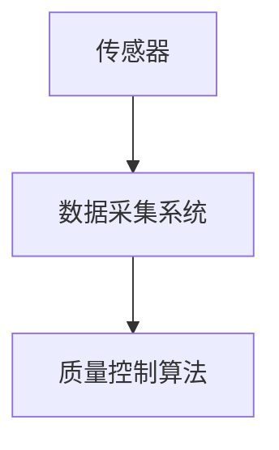

#### 3.2 数据分析与处理

数据采集系统收集到的大量数据需要进行预处理和特征工程，以便于后续的质量控制算法使用。数据预处理包括数据清洗、数据归一化和数据降维等。

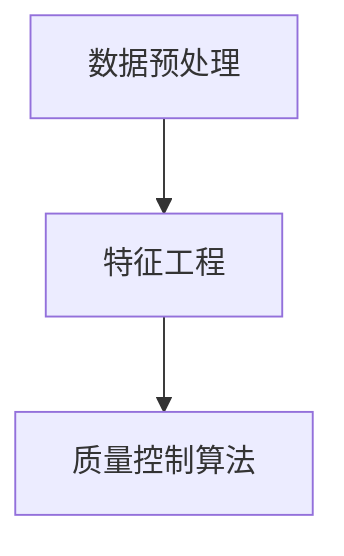

#### 3.3 质量控制算法

质量控制算法主要包括监督学习、非监督学习和强化学习等。这些算法可以根据历史数据或实时数据，对生产过程中的质量进行预测和优化。

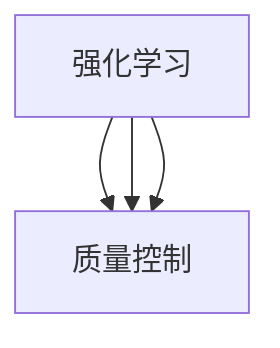

## 第4章：人工智能在质量预测与优化中的应用

#### 4.1 质量预测

质量预测是利用历史数据对生产过程中的质量进行预测。常见的方法包括时间序列分析和回归分析等。

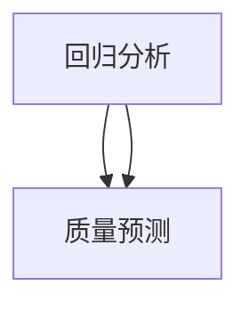

#### 4.2 质量优化

质量优化是通过对生产过程中的参数进行调整，以优化产品质量。常见的方法包括粒子群优化、遗传算法和模拟退火算法等。

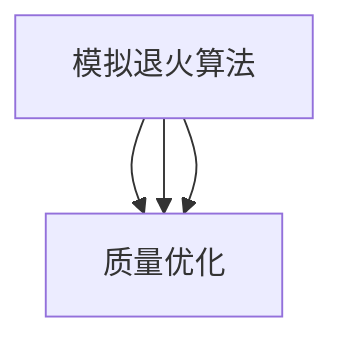

## 第5章：人工智能在质量缺陷识别与修复中的应用

#### 5.1 缺陷识别

质量缺陷识别是利用图像识别、声音识别等技术，对生产过程中的缺陷进行识别。

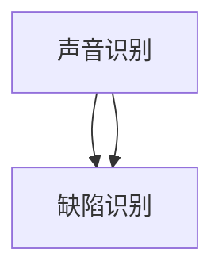

#### 5.2 缺陷修复

质量缺陷修复是利用自动化修复技术和机器人技术，对识别出的缺陷进行修复。

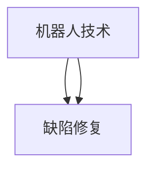

## 第三部分：生产效率

### 第6章：人工智能在生产效率中的应用

#### 6.1 生产流程优化

生产流程优化是利用人工智能技术，对生产流程进行优化，以提高生产效率。

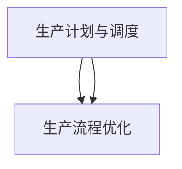

#### 6.2 设备预测维护

设备预测维护是利用人工智能技术，对设备进行预测维护，以减少设备故障和停机时间。

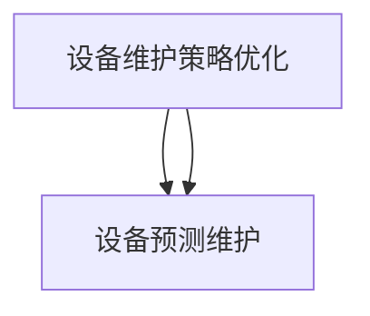

#### 6.3 能源管理

能源管理是利用人工智能技术，对能源进行监测和管理，以提高能源效率。

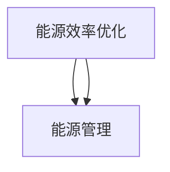

## 第7章：人工智能在智能制造中的应用挑战与未来展望

#### 7.1 应用挑战

人工智能在智能制造中的应用面临数据隐私与安全、人工智能系统的可靠性、人才短缺与培训等挑战。

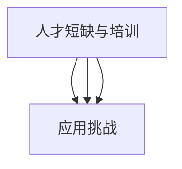

#### 7.2 未来展望

未来，人工智能在智能制造中的应用将更加广泛和深入，实现智能制造与人工智能的深度融合。

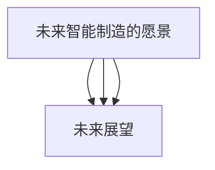

## 附录

### 附录A：常用人工智能算法与应用场景

#### A.1 监督学习算法

#### A.2 非监督学习算法

#### A.3 强化学习算法

#### A.4 机器学习在智能制造中的应用场景

### 附录B：参考文献

### 附录C：致谢

**作者：AI天才研究院/AI Genius Institute & 禅与计算机程序设计艺术 /Zen And The Art of Computer Programming**

