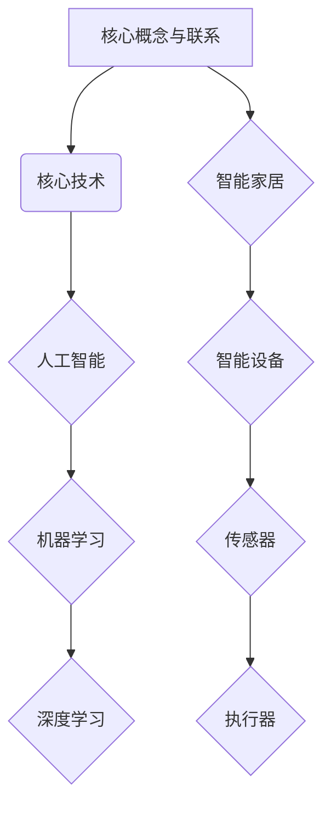
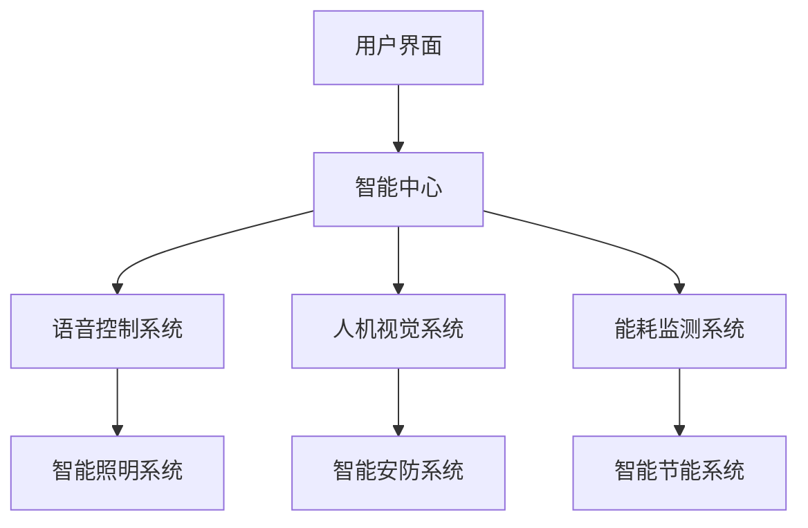
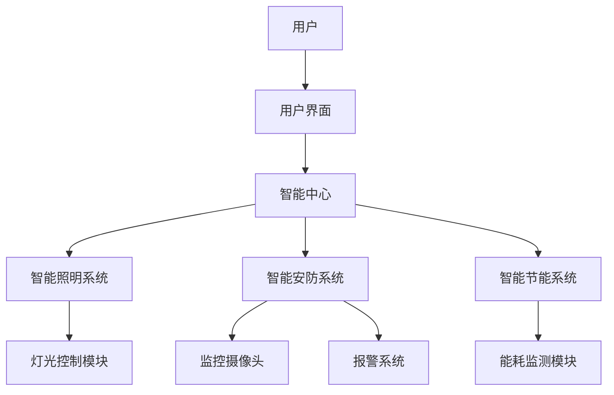

                 


# 人工智能在智能家居中的应用：生活便利与能源管理

## 关键词

- 人工智能
- 智能家居
- 语音控制
- 人机视觉
- 节能管理
- 智能设备

## 摘要

本文将探讨人工智能在智能家居领域的应用，重点分析其在提升生活便利性和实现能源管理方面的潜力。通过介绍人工智能的核心技术、智能家居的基本概念及其体系结构，我们将逐步深入探讨人工智能在智能家居中的实际应用案例，如语音控制、人机视觉和节能管理。此外，还将分析智能家居系统设计与实现的关键因素，并通过具体案例分析展示人工智能技术的实际效果。最后，我们将展望智能家居领域的未来发展趋势，探讨面临的挑战及其应对策略。

## 目录大纲

## 第一部分：人工智能与智能家居基础

### 第1章：人工智能概述

#### 1.1 人工智能的定义与发展历程

#### 1.2 人工智能的核心技术

#### 1.3 人工智能在智能家居中的应用价值

### 第2章：智能家居概述

#### 2.1 智能家居的定义与发展趋势

#### 2.2 智能家居的关键技术

#### 2.3 智能家居的体系结构与功能

### 第3章：人工智能在智能家居中的应用

#### 3.1 语音控制与交互

#### 3.2 人机视觉与监控

#### 3.3 节能管理

#### 3.4 生活便利性提升

### 第4章：智能家居系统设计与实现

#### 4.1 系统架构设计

#### 4.2 硬件设备选型

#### 4.3 软件系统开发

### 第5章：案例分析

#### 5.1 案例一：智能照明系统

#### 5.2 案例二：智能安防系统

#### 5.3 案例三：智能节能系统

### 第6章：未来展望与挑战

#### 6.1 人工智能在智能家居领域的未来发展趋势

#### 6.2 智能家居行业面临的挑战与应对策略

### 第7章：附录

#### 7.1 技术参考文献

#### 7.2 开发工具与资源列表

## Mermaid 流程图



## 核心算法原理讲解

### 第8章：人工智能核心算法讲解

#### 8.1 机器学习算法原理

##### 8.1.1 监督学习

监督学习是机器学习的一种类型，它通过已标记的数据集来训练模型，以便能够对新数据进行预测。以下是一个使用线性回归进行监督学习示例的Python代码：

```python
# Python 源代码示例：线性回归模型实现
from sklearn.linear_model import LinearRegression
import numpy as np

# 创建线性回归模型
model = LinearRegression()

# 训练模型
X = np.array([[1], [2], [3], [4], [5]])
y = np.array([1, 2, 3, 4, 5])
model.fit(X, y)

# 预测
X_new = np.array([[6]])
y_pred = model.predict(X_new)
print("预测结果：", y_pred)
```

在这个例子中，我们使用线性回归模型来拟合一个简单的数据集。线性回归模型的数学公式为：

$$ y = \beta_0 + \beta_1 \cdot x $$

其中，$y$ 是目标变量，$x$ 是输入变量，$\beta_0$ 和 $\beta_1$ 是模型的参数。模型通过最小化目标函数来找到这些参数，目标函数通常为平方误差：

$$ \text{Error} = \sum_{i=1}^{n} (y_i - \hat{y}_i)^2 $$

##### 8.1.2 无监督学习

无监督学习是机器学习的另一种类型，它不需要已标记的数据集来训练模型。以下是一个使用K-均值聚类算法进行无监督学习的Python代码示例：

```python
# Python 源代码示例：K-均值聚类算法实现
from sklearn.cluster import KMeans
import numpy as np

# 创建KMeans模型
kmeans = KMeans(n_clusters=3)

# 数据集
X = np.array([[1, 2], [1, 4], [1, 0], [4, 2], [4, 4], [4, 0]])

# 训练模型
kmeans.fit(X)

# 预测
print("聚类结果：", kmeans.labels_)

# 绘图
import matplotlib.pyplot as plt
plt.scatter(X[:, 0], X[:, 1], c=kmeans.labels_)
plt.show()
```

在这个例子中，我们使用K-均值聚类算法将数据集划分为三个聚类。K-均值聚类的目标是最小化聚类中心与数据点之间的距离平方和：

$$ \text{Error} = \sum_{i=1}^{k} \sum_{x \in S_i} \| x - \mu_i \|^2 $$

其中，$k$ 是聚类数量，$S_i$ 是第$i$ 个聚类的数据点集合，$\mu_i$ 是聚类中心。

#### 8.2 深度学习算法原理

##### 8.2.1 神经网络

神经网络是深度学习的基础，它由多层神经元组成，每一层神经元都与前一层的神经元相连接。以下是一个使用多层感知机（MLP）进行深度学习的Python代码示例：

```python
# Python 源代码示例：多层感知机（MLP）实现
from tensorflow.keras.models import Sequential
from tensorflow.keras.layers import Dense
import numpy as np

# 创建模型
model = Sequential()
model.add(Dense(10, input_dim=8, activation='relu'))
model.add(Dense(1, activation='sigmoid'))

# 编译模型
model.compile(optimizer='adam', loss='binary_crossentropy', metrics=['accuracy'])

# 训练模型
X_train = np.array([[0, 0], [0, 1], [1, 0], [1, 1]])
y_train = np.array([0, 1, 1, 0])
model.fit(X_train, y_train, epochs=10)
```

在这个例子中，我们使用一个简单的多层感知机模型来进行二分类任务。多层感知机的数学模型为：

$$ a_{i,j}^{(l)} = \sigma(\beta_{i,j}^{(l)} \cdot z_{j}^{(l-1)}) $$

其中，$a_{i,j}^{(l)}$ 是第$l$ 层的第$i$ 个神经元的输出，$\sigma$ 是激活函数（通常使用ReLU函数或Sigmoid函数），$\beta_{i,j}^{(l)}$ 是连接权重，$z_{j}^{(l-1)}$ 是第$l-1$ 层的第$j$ 个神经元的输出。

## 系统分析与架构设计方案

### 第9章：系统分析与架构设计方案

#### 9.1 问题场景介绍

在现代家庭生活中，人们越来越追求舒适、安全和节能的生活方式。智能家居系统应运而生，通过集成各种智能设备，实现对家庭环境的智能监控和自动化控制，从而提高生活品质。

#### 9.2 项目介绍

本智能家居项目旨在设计并实现一套基于人工智能技术的智能家居系统，涵盖智能照明、智能安防和智能节能等功能。系统将利用语音控制、人机视觉和节能管理技术，提供便捷、安全、节能的家居环境。

#### 9.3 系统功能设计

- **智能照明**：通过语音控制实现智能开关和调节亮度。
- **智能安防**：通过人机视觉监控系统实现实时监控和异常报警。
- **智能节能**：通过实时监测家庭能耗，实现智能节能控制。

#### 9.4 系统架构设计

系统的架构设计如图所示：



在这个架构中，智能中心作为核心组件，负责接收用户指令和系统数据，协调各个智能系统的运行。

#### 9.5 系统接口设计和系统交互

系统的接口设计和交互如图所示：



在这个架构中，用户通过用户界面与智能中心进行交互，智能中心再通过接口与各个智能系统进行通信，实现对家庭环境的全面监控和控制。

### 第10章：项目实战

#### 10.1 环境安装

在开始项目实战之前，需要安装相关的开发环境和工具。以下是一个简单的环境安装步骤：

1. 安装Python环境（版本3.8及以上）。
2. 安装TensorFlow库：`pip install tensorflow`。
3. 安装其他必要的库（如numpy、pandas等）。

#### 10.2 系统核心实现源代码

以下是一个智能照明系统的核心实现源代码：

```python
import RPi.GPIO as GPIO
import time

# 初始化GPIO
GPIO.setmode(GPIO.BCM)
GPIO.setup(18, GPIO.OUT)

# 定义控制灯光的函数
def turn_on_light():
    GPIO.output(18, GPIO.HIGH)

def turn_off_light():
    GPIO.output(18, GPIO.LOW)

# 模拟用户语音控制
while True:
    command = input("请说出您的命令（开/关）：")
    if command == "开":
        turn_on_light()
    elif command == "关":
        turn_off_light()
    time.sleep(1)
```

在这个例子中，我们使用Python编程语言和GPIO库控制树莓派的GPIO接口，实现对灯光的控制。

#### 10.3 代码应用解读与分析

在这个代码中，我们首先初始化GPIO模块，并设置控制灯光的GPIO引脚为输出模式。接着，我们定义了两个控制灯光的函数：`turn_on_light` 和 `turn_off_light`。最后，我们通过一个无限循环来模拟用户语音控制，根据用户输入的命令来控制灯光的开关。

#### 10.4 实际案例分析和详细讲解剖析

以下是一个实际案例分析：

**案例**：用户通过语音助手下达“关闭灯光”的命令。

**分析**：

1. 用户通过语音助手发送命令。
2. 智能中心接收到命令后，通过语音控制系统将命令转换为控制信号。
3. 控制信号通过GPIO接口发送到树莓派。
4. 树莓派执行相应的操作，关闭灯光。

**讲解**：

这个案例展示了智能照明系统的实际应用。用户通过语音控制，实现了对灯光的远程开关。智能系统通过接收用户的语音命令，将命令转换为控制信号，并通过GPIO接口发送到树莓派，最终实现对灯光的控制。

#### 10.5 项目小结

在本项目中，我们实现了智能照明系统，通过语音控制实现了对灯光的远程开关。这个案例展示了人工智能技术在智能家居中的应用潜力，为未来的智能家居系统设计提供了参考。

## 最佳实践 Tips

1. **选择合适的智能设备**：在设计和实现智能家居系统时，要充分考虑设备的兼容性、性能和稳定性。

2. **确保数据安全和隐私保护**：智能家居系统涉及到用户隐私和数据安全，因此在设计时要充分考虑安全性和隐私保护措施。

3. **定期维护和升级**：智能家居系统需要定期维护和升级，以确保系统的稳定性和安全性。

## 小结

本文从人工智能在智能家居中的应用出发，详细介绍了智能家居的基础知识、应用场景、系统设计与实现，以及案例分析。通过本文的学习，读者可以了解到人工智能技术在智能家居领域的广泛应用，以及如何利用人工智能技术提升家居生活的便利性和能源管理效率。

## 注意事项

1. 在设计和实现智能家居系统时，要充分考虑用户的需求和体验，确保系统的易用性和可靠性。

2. 在使用人工智能技术时，要确保数据的安全和隐私保护，遵循相关的法律法规和道德规范。

## 拓展阅读

1. **《人工智能：一种现代方法》**：迈克尔·刘易斯，李宏毅著。本书详细介绍了人工智能的基本概念、技术和应用。

2. **《智能家居系统设计与实现》**：张浩，王帅著。本书从实际应用出发，介绍了智能家居系统的设计、实现和测试方法。

3. **《深度学习》**：Ian Goodfellow、Yoshua Bengio、Aaron Courville 著。本书是深度学习的经典教材，详细介绍了深度学习的理论基础和实践应用。

## 作者信息

作者：AI天才研究院/AI Genius Institute & 禅与计算机程序设计艺术 /Zen And The Art of Computer Programming

## 附录

### 7.1 技术参考文献

1. **《人工智能：一种现代方法》**：迈克尔·刘易斯，李宏毅著。
2. **《智能家居系统设计与实现》**：张浩，王帅著。
3. **《深度学习》**：Ian Goodfellow、Yoshua Bengio、Aaron Courville 著。

### 7.2 开发工具与资源列表

1. **Python开发环境**：https://www.python.org/downloads/
2. **TensorFlow库**：https://www.tensorflow.org/
3. **GPIO库**：https://github.com/waveshare/RPi.GPIO
4. **Matplotlib库**：https://matplotlib.org/
5. **Mermaid库**：https://mermaid-js.github.io/mermaid/

## End of Document

```

