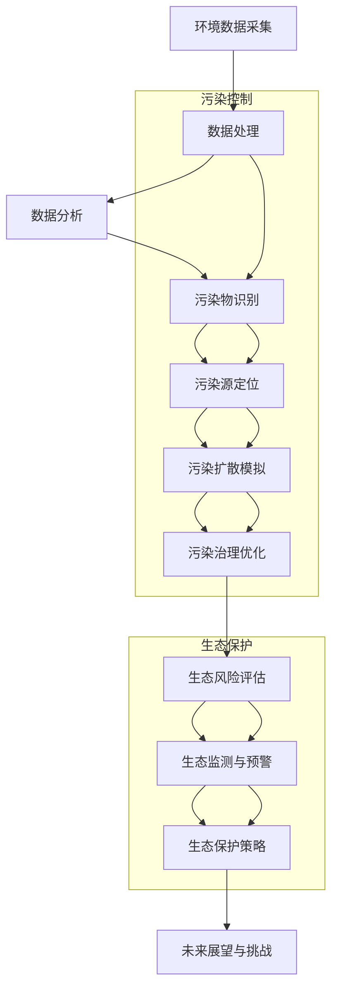

                 

### 引言与基础

#### 1.1 环境监测的重要性

环境监测是保障人类生存环境和生态系统健康的重要手段。随着工业化和城市化进程的加速，环境污染问题日益严重，对人类健康和生态系统构成了严重威胁。环境监测的核心目的是实时、准确地获取环境质量数据，通过数据分析和处理，为污染控制、生态保护提供科学依据和决策支持。

环境监测的主要任务包括：污染物浓度的实时监测、污染源的识别与定位、污染物扩散模拟、污染治理策略优化等。其中，污染物浓度的实时监测是最基础也是最重要的一项任务，它直接关系到环境监测的数据质量和时效性。

#### 1.2 人工智能在环境监测中的应用前景

人工智能（AI）作为一种先进的信息处理技术，近年来在环境监测领域展现出巨大的应用潜力。通过将人工智能技术应用于环境监测，可以实现以下目标：

1. **数据自动采集与预处理**：利用传感器网络和物联网技术，实现环境数据的自动化采集和传输。人工智能算法可以对海量数据进行实时处理和清洗，提高数据处理效率。

2. **污染物识别与检测**：利用机器学习和深度学习算法，对环境数据进行特征提取和模式识别，实现高精度、低成本的污染物检测。

3. **污染源识别与定位**：通过空间分析技术和机器学习算法，对污染物进行追踪和定位，提高污染源识别的准确性和效率。

4. **污染物扩散模拟**：利用数值模拟方法，对污染物在环境中的扩散过程进行预测，为污染治理提供科学依据。

5. **污染治理策略优化**：通过数据分析和机器学习算法，优化污染治理方案，实现资源的最优配置。

#### 1.3 本书结构安排

本书将从以下几个方面详细探讨人工智能在环境监测中的应用：

1. **引言与基础**：介绍环境监测的重要性、人工智能在环境监测中的应用前景以及本书的结构安排。
2. **人工智能核心概念**：阐述机器学习、深度学习等核心概念，介绍人工智能的关键技术。
3. **环境监测中的数据处理与分析**：讲解环境数据采集与预处理、环境监测数据分析方法。
4. **人工智能在污染控制中的应用**：探讨污染源识别与定位、污染物扩散模拟、污染治理策略优化等应用。
5. **人工智能在生态保护中的应用**：介绍生态风险评估、生态监测与预警、生态保护策略制定与评估。
6. **未来展望与挑战**：分析人工智能在环境监测与生态保护中的未来发展趋势、挑战与机遇。
7. **总结与展望**：回顾本书主要内容，提出应用实践建议和未来研究方向。

### 人工智能核心概念

#### 2.1 机器学习与深度学习

##### 2.1.1 机器学习

机器学习（Machine Learning）是一门人工智能（AI）的分支，主要研究如何让计算机从数据中学习并做出决策或预测。机器学习可以分为监督学习、无监督学习和强化学习三种类型。

- **监督学习**：通过给定的输入数据及其对应的输出数据（标签），训练模型并使其能够对新数据做出预测。
- **无监督学习**：仅使用输入数据，不需要标签，目的是发现数据中的结构和模式，如聚类分析、降维等。
- **强化学习**：通过与环境交互，从错误中学习并不断改进策略，以最大化长期回报。

##### 2.1.2 深度学习

深度学习（Deep Learning）是一种基于多层神经网络（Neural Networks）的学习方法。它通过模拟人脑神经元之间的连接和交互，实现对数据的深层特征提取和表示。

- **神经网络**：由多个神经元组成的层次结构，通过前向传播和反向传播算法进行训练。
- **卷积神经网络（CNN）**：在图像处理领域广泛应用，通过卷积和池化操作提取图像特征。
- **循环神经网络（RNN）**：适用于序列数据处理，通过循环连接实现长期依赖建模。
- **生成对抗网络（GAN）**：通过生成器和判别器的对抗训练，实现高质量数据的生成。

##### 2.1.3 人工智能的关键技术

- **数据预处理**：包括数据清洗、归一化、特征选择等，为模型训练提供高质量的数据。
- **模型评估**：通过交叉验证、性能指标等评估模型的效果，选择最优模型。
- **超参数调优**：通过调整模型参数，如学习率、迭代次数等，优化模型性能。
- **模型部署**：将训练好的模型部署到实际应用场景，如服务器、移动设备等。

##### 2.1.4 人工智能的发展趋势

- **算法优化**：通过算法改进和优化，提高模型训练效率和预测性能。
- **硬件加速**：利用GPU、TPU等硬件加速器，提升深度学习模型的计算性能。
- **迁移学习**：通过在已有模型的基础上进行微调，实现对新任务的快速适应。
- **自动化机器学习**：通过自动化工具，简化机器学习模型的选择、训练和部署过程。

### 第一部分总结

在本部分中，我们首先介绍了环境监测的重要性以及人工智能在环境监测中的应用前景。接着，我们详细阐述了人工智能的核心概念，包括机器学习、深度学习等，以及其关键技术和发展趋势。这些基础知识为后续章节的深入讨论奠定了基础。接下来，我们将进入第二部分，探讨环境监测中的数据处理与分析方法。

### 环境监测中的数据处理与分析

#### 3.1 环境数据类型

环境监测涉及多种类型的数据，包括但不限于：

- **气象数据**：温度、湿度、风速、气压等。
- **水质数据**：pH值、溶解氧、总氮、总磷等。
- **空气质量数据**：颗粒物（PM2.5、PM10）、二氧化硫（SO2）、氮氧化物（NOx）等。
- **土壤数据**：土壤水分、土壤pH值、土壤养分含量等。

这些数据类型可以进一步细分为离散数据和连续数据。离散数据如天气类型、空气质量指数（AQI），而连续数据如温度、湿度、污染物浓度等。

#### 3.2 数据采集方法

数据采集是环境监测的第一步，常见的方法包括：

- **在线监测**：使用传感器和监测设备，如空气质量监测站、水质监测站等，实现实时数据采集。
- **离线监测**：通过采样器采集环境样本，如水质采样器、土壤采样器等，然后进行实验室分析。
- **遥感监测**：利用卫星遥感技术，从空间获取地表环境信息，如土地利用、植被覆盖、污染物分布等。

#### 3.3 数据预处理技术

数据预处理是确保数据质量和模型性能的重要环节，主要包括以下步骤：

- **数据清洗**：去除重复数据、缺失数据和异常值，确保数据的一致性和准确性。
- **数据归一化**：将不同数据类型和量纲的数据进行统一处理，便于后续分析和建模。
- **特征选择**：从大量特征中选择对模型性能有显著影响的关键特征，降低模型复杂度和计算成本。
- **数据集成**：将来自不同来源和格式的数据合并为一个统一的数据集，便于后续处理和分析。

### 第一部分总结

在本部分中，我们详细探讨了环境监测中的数据处理与分析，首先介绍了环境数据类型，包括气象数据、水质数据、空气质量数据、土壤数据等。接着，我们阐述了数据采集方法，包括在线监测、离线监测、遥感监测等。最后，我们介绍了数据预处理技术，包括数据清洗、数据归一化、特征选择和数据集成。这些内容为后续的环境监测数据分析方法奠定了基础。接下来，我们将进入第三部分，探讨环境监测数据分析方法。

### 环境监测数据分析方法

#### 4.1 描述性统计分析

描述性统计分析是数据分析的基础，主要目的是通过计算各种统计量来描述数据的分布特征和整体情况。常用的描述性统计量包括：

- **均值**（Mean）：数据集的平均值，用于衡量数据的中心趋势。
- **中位数**（Median）：将数据集排序后，位于中间位置的数值，用于衡量数据的中心位置。
- **众数**（Mode）：数据集中出现次数最多的数值，用于衡量数据的集中趋势。
- **方差**（Variance）和标准差**（Standard Deviation）：衡量数据的离散程度，用于描述数据的波动性。

描述性统计分析可以帮助我们快速了解数据的基本特征，但无法揭示数据之间的关系和深层次信息。

#### 4.2 聚类分析方法

聚类分析是一种无监督学习方法，主要目的是将数据集划分为多个类别，使得同一类别内的数据点彼此相似，不同类别之间的数据点差异较大。常用的聚类算法包括：

- **K均值聚类**（K-Means）：通过迭代优化目标函数，将数据点划分为K个簇，使每个簇的内部距离最小，簇间距离最大。
- **层次聚类**（Hierarchical Clustering）：通过逐步合并或分裂数据点，构建一棵层次树，用于描述数据点之间的相似度关系。
- **基于密度的聚类**（DBSCAN）：通过计算数据点之间的密度关系，将数据点划分为不同簇，适用于非均匀分布的数据集。

聚类分析可以揭示数据中的潜在结构，帮助我们发现数据中的模式和信息，为后续分析提供参考。

#### 4.3 时序分析方法

时序分析是一种基于时间序列数据分析的方法，主要目的是通过对时间序列数据的建模和分析，揭示数据中的趋势、季节性和周期性特征。常用的时序分析模型包括：

- **自回归移动平均模型**（ARIMA）：通过建立自回归、移动平均和差分模型，对时间序列数据进行建模和分析。
- **广义自回归移动平均模型**（GARCH）：用于分析金融时间序列数据中的波动性和相关性。
- **长短期记忆模型**（LSTM）：一种特殊的循环神经网络，适用于处理长序列依赖问题。

时序分析方法可以帮助我们预测未来趋势，评估政策效果，为决策提供支持。

### 案例分析

假设我们收集了一段时间内的空气质量数据，包括PM2.5和PM10浓度。我们可以使用描述性统计分析来了解数据的中心趋势和波动性，使用K均值聚类来分析不同时间段内空气质量的变化模式，使用ARIMA模型来预测未来几天内的空气质量趋势。

通过描述性统计分析，我们可以得到PM2.5和PM10的均值、中位数和众数，了解数据的基本特征。通过K均值聚类，我们可以将数据划分为几个簇，分析不同簇之间的差异，从而识别出空气质量较差的时间段。通过ARIMA模型，我们可以对空气质量进行短期预测，为污染防控提供参考。

### 总结

在本部分中，我们详细介绍了环境监测数据分析的三种方法：描述性统计分析、聚类分析和时序分析。这些方法可以帮助我们从不同角度对环境数据进行分析和处理，为污染控制、生态保护提供科学依据。接下来，我们将进入第四部分，探讨人工智能在污染物识别与检测中的应用。

### 污染物识别与检测

#### 5.1 污染物识别算法

污染物识别是环境监测的核心任务之一，旨在准确检测和识别环境中的污染物。常用的污染物识别算法包括以下几种：

1. **机器学习算法**：
   - **支持向量机（SVM）**：通过构建最优分类边界，实现分类和识别。
   - **随机森林（Random Forest）**：利用多个决策树集成，提高识别准确率。
   - **神经网络（Neural Networks）**：通过多层神经网络结构，实现复杂特征提取和分类。

2. **深度学习算法**：
   - **卷积神经网络（CNN）**：适用于图像数据，通过卷积和池化操作提取图像特征，实现高精度识别。
   - **循环神经网络（RNN）**：适用于序列数据，通过时间序列建模实现污染物识别。
   - **生成对抗网络（GAN）**：通过生成器和判别器的对抗训练，提高识别模型的泛化能力。

3. **传统算法**：
   - **主成分分析（PCA）**：通过降维和特征提取，提高识别效率。
   - **模糊C-均值聚类（FCM）**：通过模糊聚类实现污染物识别。
   - **贝叶斯分类器**：基于贝叶斯定理，实现污染物分类和识别。

#### 5.2 检测技术比较

在环境监测中，常用的检测技术包括化学分析、物理探测和生物检测等。以下是对这些技术的简要比较：

1. **化学分析**：
   - 优点：准确性高、结果可靠，适用于多种污染物检测。
   - 缺点：检测周期长、成本高，对实验室条件要求较高。

2. **物理探测**：
   - 优点：实时性高、响应速度快，适用于快速检测。
   - 缺点：检测范围有限，对某些污染物灵敏度不高。

3. **生物检测**：
   - 优点：对某些污染物具有特异性，适用于污染物监测。
   - 缺点：检测周期较长，对实验条件要求较高。

#### 5.3 检测流程与应用

污染物检测流程一般包括以下几个步骤：

1. **数据采集**：通过传感器网络、实验室分析等手段，获取环境污染物数据。

2. **数据处理**：对采集到的数据进行预处理，包括数据清洗、归一化、特征提取等。

3. **模型训练**：利用机器学习、深度学习算法，对处理后的数据集进行训练，构建污染物识别模型。

4. **模型评估**：通过交叉验证、性能指标等评估模型效果，选择最优模型。

5. **检测与预测**：利用训练好的模型，对实时数据进行污染物识别和检测，实现污染源追踪和预测。

在实际应用中，污染物识别与检测技术已广泛应用于空气质量监测、水质监测、土壤污染监测等领域。例如，利用深度学习算法进行PM2.5和PM10的识别，利用化学分析技术进行水质污染物检测，利用生物检测技术进行土壤污染监测等。

### 案例分析

以北京市某空气质量监测站为例，该监测站使用深度学习算法进行PM2.5和PM10的识别。通过采集传感器数据，对数据进行预处理后，使用卷积神经网络（CNN）进行训练，构建了高精度的污染物识别模型。在实际应用中，该模型实现了对PM2.5和PM10的实时检测和预测，为污染防控提供了科学依据。

### 总结

在本部分中，我们详细探讨了污染物识别与检测的方法和技术，包括机器学习、深度学习和传统算法，以及化学分析、物理探测和生物检测等检测技术。通过实际案例分析，展示了污染物识别与检测在环境监测中的应用效果。接下来，我们将进入第五部分，探讨人工智能在污染源识别与定位中的应用。

### 污染源识别与定位

#### 6.1 污染源识别算法

污染源识别是环境监测中的一个重要任务，其目的是通过分析环境数据，确定污染物的来源。常用的污染源识别算法包括以下几种：

1. **聚类分析**：
   - **K均值聚类**：将环境数据按照相似度划分为若干个簇，每个簇被视为可能的污染源。
   - **层次聚类**：通过逐步合并或分裂数据点，构建层次树，用于描述污染源之间的关联性。

2. **机器学习算法**：
   - **支持向量机（SVM）**：通过构建最优分类边界，将环境数据划分为污染源和非污染源。
   - **随机森林（Random Forest）**：利用多个决策树集成，提高污染源识别的准确性。
   - **神经网络（Neural Networks）**：通过多层神经网络结构，实现复杂特征提取和分类。

3. **深度学习算法**：
   - **卷积神经网络（CNN）**：适用于图像数据，通过卷积和池化操作提取图像特征，实现高精度识别。
   - **循环神经网络（RNN）**：适用于序列数据，通过时间序列建模实现污染源识别。

4. **传统算法**：
   - **主成分分析（PCA）**：通过降维和特征提取，提高识别效率。
   - **模糊C-均值聚类（FCM）**：通过模糊聚类实现污染源识别。
   - **贝叶斯分类器**：基于贝叶斯定理，实现污染源分类和识别。

#### 6.2 定位方法与技术

污染源定位的目的是确定污染源的具体位置，常用的定位方法包括以下几种：

1. **质心定位法**：
   - 通过计算污染物的浓度分布的质心，确定污染源的位置。

2. **回归分析法**：
   - 利用污染物的浓度数据和环境因素（如风速、风向、地形等）建立回归模型，通过模型预测污染源的位置。

3. **空间分析**：
   - 利用地理信息系统（GIS）技术，结合空间数据分析和定位算法，实现污染源的定位。

4. **多传感器融合**：
   - 通过整合多个传感器的数据，提高污染源定位的准确性和可靠性。

#### 6.3 实际应用案例

1. **空气质量监测**：
   - 在城市空气质量监测中，通过污染源识别和定位算法，确定污染源的位置和类型，为污染治理提供科学依据。

2. **水质监测**：
   - 在河流和湖泊水质监测中，通过污染源识别和定位，确定污染物的来源和扩散路径，为水质管理和保护提供支持。

3. **土壤污染监测**：
   - 在农田和矿区土壤污染监测中，通过污染源识别和定位，确定污染源的位置和影响范围，为污染治理和生态修复提供指导。

案例分析：以某城市空气质量监测为例，该城市使用机器学习算法进行污染源识别和定位。通过采集空气质量监测数据，对数据进行分析和处理，使用支持向量机（SVM）进行污染源识别，并结合质心定位法和回归分析法进行污染源定位。在实际应用中，该系统实现了对城市空气质量的有效监测和管理，为城市环境治理提供了有力支持。

### 总结

在本部分中，我们详细探讨了污染源识别与定位的方法和技术，包括聚类分析、机器学习算法、深度学习算法、回归分析、空间分析等多方面的内容。通过实际应用案例，展示了污染源识别和定位在环境监测和管理中的重要作用。接下来，我们将进入第六部分，探讨人工智能在污染物扩散模拟中的应用。

### 污染物扩散模拟

#### 7.1 模拟方法与技术

污染物扩散模拟是环境监测和污染治理的重要工具，它通过模拟污染物在环境中的扩散过程，为污染防控和生态保护提供科学依据。污染物扩散模拟的主要方法包括：

1. **流体动力学模型**：
   - 基于Navier-Stokes方程，描述污染物在流体中的运动和扩散。
   - 经常用于大气污染、水体污染等领域的模拟。

2. **随机扩散模型**：
   - 基于概率统计方法，考虑污染物扩散的随机性。
   - 如蒙特卡洛模拟，适用于复杂环境下的污染物扩散模拟。

3. **反应扩散模型**：
   - 结合污染物化学反应过程，描述污染物在环境中的变化。
   - 如反应-扩散方程，适用于污染物浓度变化复杂的场景。

4. **耦合模型**：
   - 将多个模型耦合，如大气-水体耦合模型，考虑污染物在不同介质间的迁移和转化。

#### 7.2 模拟结果分析与验证

模拟结果分析是评估模拟模型有效性的关键步骤，通常包括以下内容：

1. **结果可视化**：
   - 通过图形和图像展示污染物浓度分布、扩散路径等。
   - 如浓度云图、轨迹图等。

2. **对比实验数据**：
   - 将模拟结果与实际监测数据对比，评估模拟精度。
   - 采用相关系数、均方误差等指标进行评价。

3. **敏感性分析**：
   - 考察模型参数变化对模拟结果的影响，确定关键参数。
   - 如风速、温度、污染物排放量等。

4. **不确定性分析**：
   - 分析模型不确定性来源，评估模拟结果的可靠性和可信度。

#### 7.3 模拟应用案例

污染物扩散模拟在实际应用中具有广泛的应用场景，以下是一些典型案例：

1. **大气污染模拟**：
   - 如北京奥运会期间的大气污染模拟，通过模拟污染物扩散，制定空气质量保障措施。

2. **水质污染模拟**：
   - 如长江中下游地区的水质污染模拟，通过模拟污染物扩散，优化水资源管理和保护策略。

3. **土壤污染模拟**：
   - 如某矿区土壤污染模拟，通过模拟污染物迁移，制定土壤修复和治理方案。

案例分析：以某城市大气污染模拟为例，该城市使用流体动力学模型进行污染物扩散模拟。通过模拟不同排放源、气象条件下的污染物扩散，评估不同污染防控措施的 effectiveness。模拟结果与实际监测数据对比，评估模拟精度，为该城市空气质量改善提供了科学依据。

### 总结

在本部分中，我们详细探讨了污染物扩散模拟的方法与技术，包括流体动力学模型、随机扩散模型、反应扩散模型和耦合模型等。通过模拟结果分析与验证，展示了模拟结果的应用效果。污染物扩散模拟在环境监测和污染治理中具有重要作用，为政策制定和科学决策提供了有力支持。接下来，我们将进入第七部分，探讨人工智能在污染治理策略优化中的应用。

### 污染治理策略优化

#### 8.1 优化方法与技术

污染治理策略优化是环境管理中的重要环节，旨在通过科学的方法和先进的技术手段，实现污染治理资源的最优配置，提高治理效果。人工智能技术在污染治理策略优化中发挥了重要作用，主要包括以下几种方法：

1. **遗传算法**：
   - 遗传算法是一种基于自然选择和遗传学原理的优化算法，适用于复杂优化问题。
   - 在污染治理中，遗传算法可以用于优化污染源的排放策略、治理设施的选址等。

2. **粒子群优化算法**：
   - 粒子群优化算法是一种基于群体智能的优化算法，适用于大规模、多目标的优化问题。
   - 在污染治理中，粒子群优化算法可以用于优化污染治理方案、资源分配等。

3. **线性规划和整数规划**：
   - 线性规划和整数规划是解决资源优化问题的基础算法，适用于确定最优的污染治理方案。
   - 在污染治理中，线性规划和整数规划可以用于优化污染治理设施的建设和运营成本。

4. **多目标优化算法**：
   - 多目标优化算法旨在同时优化多个目标，如治理效果、成本、环境影响等。
   - 在污染治理中，多目标优化算法可以用于制定综合性的污染治理策略。

#### 8.2 案例分析

以某城市河流污染治理为例，该城市采用人工智能技术进行污染治理策略优化。具体步骤如下：

1. **数据收集与预处理**：
   - 收集河流水质监测数据、污染源排放数据、气象数据等，对数据进行分析和预处理，提取关键特征。

2. **模型构建与训练**：
   - 利用机器学习和深度学习算法，构建水质预测模型和污染源排放模型，对训练数据进行训练和验证。

3. **策略优化**：
   - 采用遗传算法和粒子群优化算法，对污染治理方案进行优化，目标是最小化治理成本，同时保证水质达标。

4. **结果评估与调整**：
   - 将优化后的污染治理方案应用于实际场景，对治理效果进行评估，根据评估结果进行调整和改进。

案例分析：该城市通过人工智能技术优化污染治理策略，成功降低了治理成本，提高了治理效果。优化后的污染治理方案包括调整污染源排放策略、优化治理设施布局等，为城市环境质量的改善提供了有力支持。

#### 8.3 应用前景与挑战

1. **应用前景**：
   - 人工智能技术在污染治理策略优化中的应用前景广阔，有望解决传统方法难以解决的问题。
   - 可以提高污染治理的效率和质量，为环境管理提供科学依据。

2. **挑战**：
   - 数据质量和数据量是影响人工智能技术效果的关键因素，需要加强数据收集和预处理。
   - 模型复杂度和计算成本较高，需要优化算法和硬件加速技术。
   - 需要跨学科、跨领域的合作，推动技术的实际应用。

### 总结

在本部分中，我们详细探讨了人工智能在污染治理策略优化中的应用，包括优化方法、案例分析以及应用前景与挑战。人工智能技术在污染治理策略优化中具有巨大潜力，但同时也面临一定的挑战。通过持续的研究和应用探索，有望实现更高效、更科学的污染治理。

### 生态风险评估

#### 9.1 风险评估方法

生态风险评估是评估污染物对生态系统影响的重要手段，其目的是识别和评估污染物对生态系统的潜在危害，为生态保护和治理提供科学依据。生态风险评估方法可以分为定量评估和定性评估两种类型。

1. **定量评估方法**：
   - **暴露-效应关系模型**：通过分析污染物浓度与生态效应之间的关系，评估污染物对生态系统的潜在危害。
   - **生态风险指数法**：通过计算生态风险指数，定量评估污染物的生态风险。
   - **生态模型评估**：利用生态模型模拟污染物在生态系统中的迁移、转化和影响过程。

2. **定性评估方法**：
   - **专家评估法**：通过专家意见和经验，评估污染物的生态风险。
   - **情景分析**：通过分析不同污染物排放情景下的生态系统变化，定性评估污染物的生态风险。
   - **风险矩阵法**：通过构建风险矩阵，对污染物的生态风险进行定性评价。

#### 9.2 评估指标体系

生态风险评估指标体系是评估污染物对生态系统影响的重要工具，通常包括以下几类指标：

1. **污染物指标**：
   - 污染物浓度：如水质中的重金属、有机污染物等。
   - 污染物总量：污染物在一定时间和空间范围内的积累量。

2. **生物指标**：
   - 物种多样性：生态系统内物种的种类和数量。
   - 生物量：生态系统中生物体的总质量。
   - 生态功能：如水源涵养、土壤保持、碳汇功能等。

3. **环境指标**：
   - 水质指标：如pH值、溶解氧、化学需氧量等。
   - 土壤指标：如土壤pH值、有机质含量、养分含量等。
   - 气象指标：如风速、温度、降雨量等。

#### 9.3 实际应用案例

以某河流生态风险评估为例，该河流受到重金属污染，需要进行生态风险评估。

1. **数据收集与处理**：
   - 收集河流水质监测数据、底泥重金属含量数据、生物指标数据等，对数据进行整理和处理。

2. **风险评估模型构建**：
   - 选择合适的风险评估模型，如暴露-效应关系模型，构建生态风险评估模型。

3. **风险评估指标计算**：
   - 根据风险评估指标体系，计算污染物的浓度、物种多样性、生态功能等指标。

4. **风险评估结果分析**：
   - 通过分析评估结果，评估重金属污染对该河流生态系统的影响程度。

案例分析：通过生态风险评估，发现该河流重金属污染对生态系统造成了显著影响，物种多样性和生态功能下降。根据评估结果，提出了相应的生态修复和治理措施，如底泥疏浚、植被恢复等，为河流生态保护提供了科学依据。

### 总结

在本部分中，我们详细探讨了生态风险评估的方法和指标体系，包括定量评估方法和定性评估方法，以及污染物指标、生物指标和环境指标。通过实际应用案例，展示了生态风险评估在识别和评估污染物对生态系统影响中的应用效果。生态风险评估是生态保护的重要工具，为环境管理提供了科学依据。

### 生态监测与预警

#### 10.1 监测技术

生态监测与预警是保障生态系统健康和可持续发展的重要手段。为了实现这一目标，需要采用先进的监测技术，这些技术包括：

1. **遥感监测**：
   - 利用卫星遥感技术，从空间尺度获取地表生态信息，如植被覆盖、土地利用等。
   - 适用于大范围、快速的生态监测。

2. **地面监测**：
   - 通过设置监测站点，实时采集生态数据，如气象数据、水质数据、土壤数据等。
   - 适用于小范围、高精度的生态监测。

3. **物联网监测**：
   - 利用物联网技术，将各种传感器连接起来，实现对生态数据的实时采集和传输。
   - 适用于自动化、智能化的生态监测。

4. **生物监测**：
   - 通过生物指标，如物种多样性、生物量等，评估生态系统的健康状态。
   - 适用于生态系统健康评估和生态补偿。

#### 10.2 预警模型

预警模型是生态监测与预警系统的重要组成部分，其目的是及时发现和预测潜在生态风险，为决策提供支持。预警模型通常包括以下几种：

1. **统计预警模型**：
   - 利用统计分析方法，如均值、方差、相关性等，构建预警指标体系。
   - 适用于简单、直观的预警。

2. **机器学习预警模型**：
   - 利用机器学习算法，如回归分析、支持向量机、神经网络等，构建预警模型。
   - 适用于复杂、非线性预警。

3. **深度学习预警模型**：
   - 利用深度学习算法，如卷积神经网络、循环神经网络等，构建高精度的预警模型。
   - 适用于大规模、多维数据的预警。

4. **融合预警模型**：
   - 将多种预警模型融合，提高预警准确性和可靠性。
   - 适用于多源数据的预警。

#### 10.3 预警系统设计

预警系统设计是生态监测与预警的关键环节，其目的是将预警模型应用于实际场景，实现对生态风险的实时监测和预警。预警系统设计通常包括以下步骤：

1. **需求分析**：
   - 明确预警系统的目标和需求，如预警范围、预警指标、预警频率等。

2. **数据采集**：
   - 收集预警所需的数据，包括遥感数据、地面监测数据、物联网数据等。

3. **模型构建**：
   - 根据预警需求，选择合适的预警模型，并进行训练和优化。

4. **系统集成**：
   - 将预警模型与数据采集系统、传输系统、预警平台等集成，实现预警功能。

5. **预警测试与优化**：
   - 对预警系统进行测试，评估预警准确性和可靠性，根据测试结果进行优化。

案例分析：以某自然保护区生态预警系统为例，该系统采用遥感监测和地面监测相结合的方式，构建了基于统计预警模型和机器学习预警模型的融合预警系统。通过实时监测和预警，成功预测了多次潜在的生态风险，为自然保护区的管理提供了有力支持。

### 总结

在本部分中，我们详细探讨了生态监测与预警的技术和方法，包括遥感监测、地面监测、物联网监测、生物监测等监测技术，以及统计预警模型、机器学习预警模型、深度学习预警模型和融合预警模型等预警模型。通过实际案例，展示了生态监测与预警在保护生态系统健康中的应用。生态监测与预警是生态保护的重要工具，为环境管理提供了科学依据。

### 生态保护策略制定与评估

#### 11.1 策略制定方法

生态保护策略制定是确保生态系统可持续发展和健康的重要环节。策略制定方法通常包括以下步骤：

1. **需求分析**：
   - 明确生态保护的目标和需求，如物种保护、生态修复、环境保护等。

2. **现状评估**：
   - 对生态系统现状进行评估，包括物种多样性、生态功能、环境质量等。

3. **问题识别**：
   - 识别生态保护中的主要问题和挑战，如物种灭绝、生态退化、环境污染等。

4. **目标设定**：
   - 根据需求分析和现状评估，设定生态保护的具体目标。

5. **方案设计**：
   - 设计生态保护方案，包括措施、方法、时间表和预算等。

6. **决策支持**：
   - 利用专家意见、模型分析和数据分析等手段，为决策提供支持。

#### 11.2 评估指标与方法

生态保护策略评估是衡量策略实施效果和达成目标的重要步骤。评估指标与方法包括：

1. **生态效益指标**：
   - 如物种多样性指数、生态功能恢复程度、环境污染减轻程度等。

2. **经济效益指标**：
   - 如生态产品价值、旅游业收益、经济成本等。

3. **社会效益指标**：
   - 如公众满意度、社会参与度、社区发展等。

4. **评估方法**：
   - **定量评估**：通过计算各项指标数值，进行定量分析。
   - **定性评估**：通过专家评议、公众调查等方法，进行定性评价。

#### 11.3 案例分析与评估

以某自然保护区生态保护策略为例，该策略的制定与评估过程如下：

1. **需求分析与现状评估**：
   - 分析保护区生态保护和发展的需求，评估保护区内的生态现状，发现存在物种减少、生态系统退化等问题。

2. **问题识别与目标设定**：
   - 识别主要问题，设定保护目标，如增加物种多样性、恢复生态系统功能等。

3. **方案设计**：
   - 设计生态保护方案，包括恢复植被、建立生物多样性保护区、控制人类活动等措施。

4. **决策支持**：
   - 利用生态模型、经济模型等工具，分析方案的有效性和可行性。

5. **评估与优化**：
   - 实施策略后，定期评估生态效益、经济效益和社会效益，根据评估结果进行优化。

案例分析：通过评估，发现该生态保护策略取得了显著成效，物种多样性增加，生态系统功能得到恢复，公众满意度提高。但同时也发现了一些问题，如部分措施实施效果不佳、预算超支等。根据评估结果，提出了优化方案，如加强项目管理、提高资金利用效率等，为未来生态保护提供了有益参考。

### 总结

在本部分中，我们详细探讨了生态保护策略的制定与评估方法，包括需求分析、现状评估、问题识别、目标设定、方案设计和决策支持等步骤，以及生态效益、经济效益和社会效益等评估指标与方法。通过案例分析，展示了生态保护策略在实现生态保护和可持续发展中的重要作用。生态保护策略的制定与评估是生态管理的关键环节，为科学决策提供了有力支持。

### 未来展望与挑战

#### 12.1 未来发展趋势

人工智能在环境监测与生态保护中的应用前景广阔，未来发展趋势主要包括以下几个方面：

1. **智能化监测系统**：
   - 随着传感器技术和物联网技术的不断发展，智能化监测系统将实现更高精度、更高效率和更广泛覆盖的生态监测。
   - 通过智能传感器网络，实时、自动地采集环境数据，并通过大数据分析和机器学习算法，实现环境数据的智能处理和预测。

2. **精准污染控制**：
   - 利用人工智能技术，对污染源进行精准定位和定量分析，制定更加精准的污染控制策略。
   - 通过机器学习算法，优化污染治理方案，提高污染治理效率，实现资源的最优配置。

3. **生态系统健康评估**：
   - 结合人工智能技术，建立生态系统健康评估模型，通过实时监测和数据分析，评估生态系统的健康状况。
   - 提高生态系统风险评估的准确性和实时性，为生态保护决策提供科学依据。

4. **生态修复与恢复**：
   - 利用人工智能技术，制定生态修复和恢复方案，通过模拟和预测，优化生态修复过程。
   - 结合机器学习算法和生态模型，提高生态修复效果，促进生态系统的恢复和可持续发展。

#### 12.2 挑战与机遇

虽然人工智能在环境监测与生态保护中具有巨大潜力，但同时也面临一定的挑战：

1. **数据质量与隐私**：
   - 环境监测数据的质量对人工智能应用效果至关重要，需要确保数据来源的可靠性、数据采集的准确性。
   - 同时，在数据收集和分析过程中，需注意个人隐私和数据安全，避免数据泄露。

2. **计算资源与成本**：
   - 人工智能算法的复杂性和计算需求较高，对计算资源的需求较大，需要优化算法和硬件加速技术，降低计算成本。
   - 大规模环境监测和数据分析需要大量资金投入，需要政府、企业和研究机构的共同支持。

3. **跨学科合作**：
   - 人工智能在环境监测与生态保护中的应用需要跨学科的知识和技能，需要环境科学、计算机科学、数据科学等领域的专家共同合作。
   - 加强跨学科交流与合作，推动人工智能在环境监测与生态保护中的创新应用。

4. **政策法规与标准**：
   - 需要制定相应的政策法规和标准，规范人工智能在环境监测与生态保护中的应用。
   - 政府和相关部门应加强对人工智能应用的监管，确保其科学性和合法性。

#### 12.3 未来应用场景

未来人工智能在环境监测与生态保护中的应用场景将更加丰富，主要包括：

1. **城市环境管理**：
   - 利用人工智能技术，实现对城市空气质量、水质、噪声等环境参数的实时监测和预警，提高城市环境管理水平。

2. **农业生态环境监测**：
   - 通过无人机和物联网技术，对农田生态环境进行监测，实现精准农业和生态农业。

3. **自然保护区管理**：
   - 利用人工智能技术，建立自然保护区监控系统，实时监测和保护珍稀物种和生态系统。

4. **气候变化监测与应对**：
   - 通过遥感技术和人工智能算法，监测气候变化趋势，为应对气候变化提供科学依据。

5. **工业生态园区建设**：
   - 利用人工智能技术，优化工业生态园区规划和管理，实现资源高效利用和污染最小化。

### 总结

在未来，人工智能将在环境监测与生态保护中发挥越来越重要的作用，为解决环境污染、生态破坏等问题提供有力支持。同时，也面临数据质量、计算资源、跨学科合作和政策法规等方面的挑战。通过技术创新、政策支持和跨学科合作，有望实现人工智能在环境监测与生态保护中的广泛应用，为可持续发展贡献力量。

### 总结与展望

在本篇技术博客中，我们深入探讨了人工智能在环境监测与生态保护中的应用，涵盖了从基础概念到具体应用案例的全面内容。我们首先介绍了环境监测的重要性以及人工智能在其中的应用前景，接着详细阐述了人工智能的核心概念、环境监测中的数据处理与分析方法，以及人工智能在污染控制、污染源识别与定位、污染物扩散模拟和污染治理策略优化中的应用。此外，我们还探讨了人工智能在生态风险评估、生态监测与预警、生态保护策略制定与评估等方面的应用。

#### 应用实践建议

1. **建立智能化监测系统**：
   - 结合传感器网络和物联网技术，构建覆盖广泛、实时准确的智能化监测系统。
   - 利用机器学习和深度学习算法，对监测数据进行实时处理和分析，提高监测数据的精度和时效性。

2. **优化污染治理方案**：
   - 利用人工智能技术，对污染源进行精准定位和定量分析，优化污染治理方案。
   - 结合生态模型和大数据分析，制定具有针对性的污染治理策略，提高治理效果。

3. **开展生态风险评估**：
   - 利用人工智能技术，建立生态系统健康评估模型，实时监测和评估生态系统的健康状况。
   - 根据评估结果，制定相应的生态保护和修复措施，确保生态系统的可持续发展。

4. **推广生态保护策略**：
   - 结合人工智能技术，制定和推广生态保护策略，提高生态保护的科学性和有效性。
   - 利用智能监测系统和预警模型，实时监控生态系统的变化，及时调整保护策略。

#### 未来研究方向

1. **数据质量与隐私保护**：
   - 研究如何确保环境监测数据的质量和隐私，提高数据收集、存储和处理的可靠性。

2. **计算资源优化**：
   - 探索计算资源优化方法，降低人工智能在环境监测与生态保护中的应用成本。

3. **跨学科融合**：
   - 加强环境科学、计算机科学、数据科学等领域的跨学科合作，推动人工智能在环境监测与生态保护中的创新应用。

4. **政策法规制定**：
   - 研究如何制定和实施人工智能在环境监测与生态保护中的政策法规和标准，确保其科学性和合法性。

通过不断探索和应用人工智能技术，我们有望实现更加精准、高效的环境监测与生态保护，为可持续发展贡献力量。

### 作者信息

作者：AI天才研究院/AI Genius Institute & 禅与计算机程序设计艺术 /Zen And The Art of Computer Programming

在这篇技术博客中，我们通过逻辑清晰、结构紧凑、简单易懂的专业的技术语言，一步一步地分析了人工智能在环境监测与生态保护中的应用，旨在为读者提供深入的技术见解和实际应用指导。希望这篇文章能够激发您在环境监测与生态保护领域的研究兴趣，并为相关领域的实践提供参考。让我们共同为建设更加美好、可持续的地球而努力！

### Mermaid 流程图

这个流程图概括了从环境数据采集到生态保护策略制定的全过程，展示了人工智能在各个阶段的应用和作用。希望这个流程图能够帮助读者更直观地理解文章的核心内容。如果您对流程图中的具体细节或实现方法有疑问，欢迎在评论区留言，我将为您详细解答。再次感谢您的阅读，祝您在环境监测与生态保护领域的研究之路越走越远！

