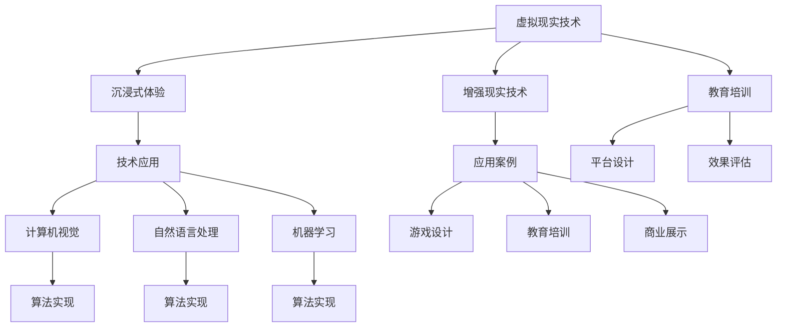
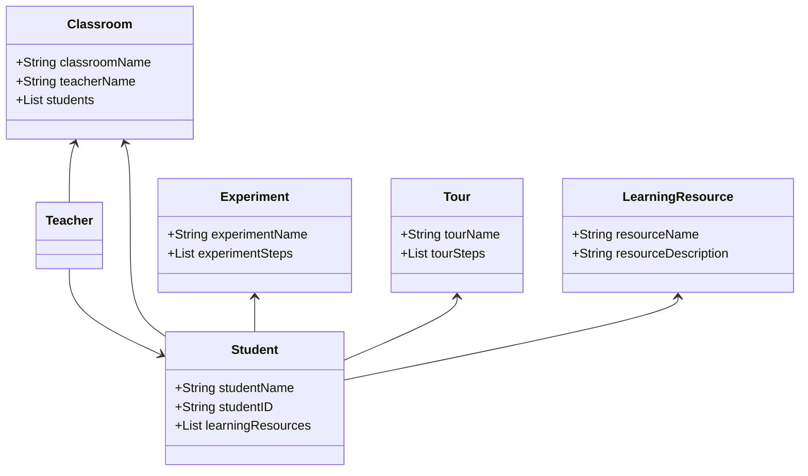
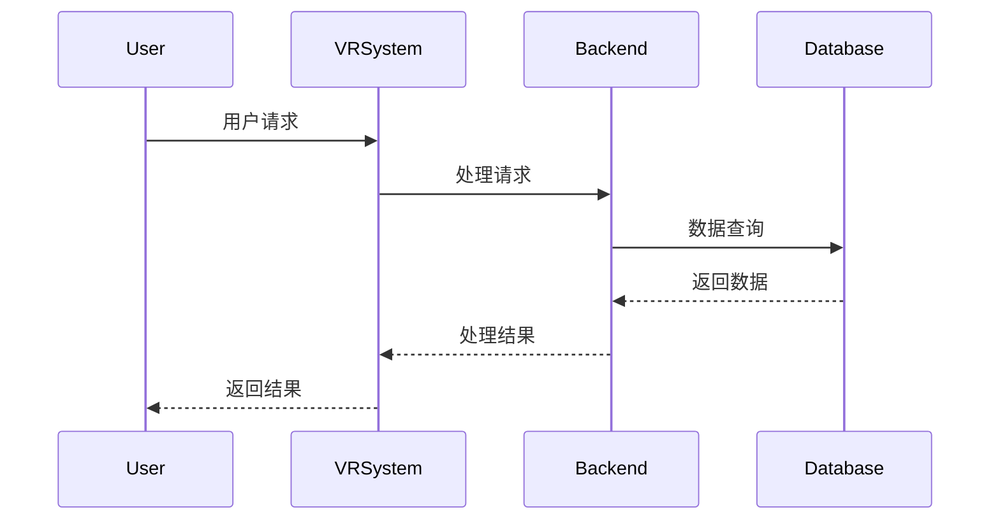
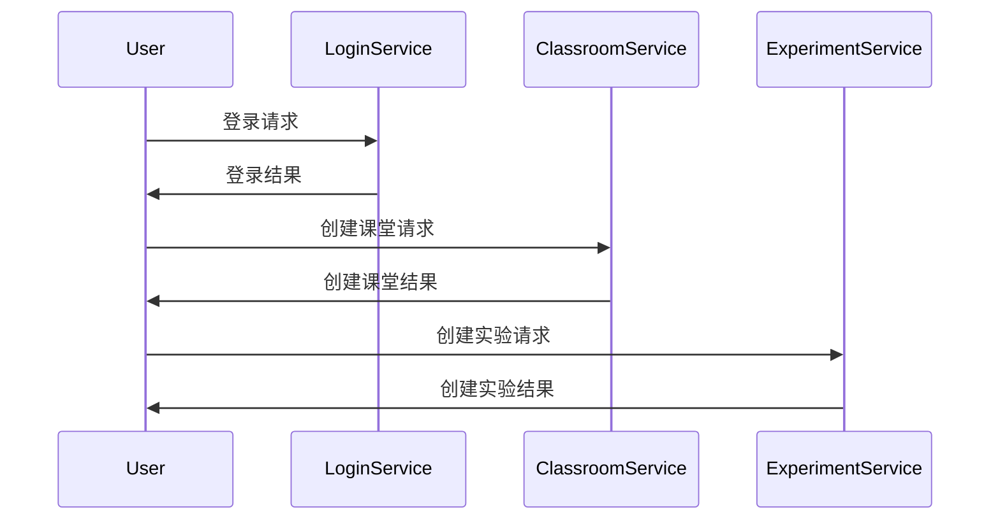

                 

### 《人工智能在虚拟现实中的应用：沉浸式体验与教育培训》

#### 关键词：虚拟现实，人工智能，沉浸式体验，教育培训，算法实现

#### 摘要：
本文旨在探讨人工智能在虚拟现实中的应用，特别是在沉浸式体验和教育培训领域。通过详细分析虚拟现实与人工智能技术的核心原理、应用场景以及未来发展趋势，文章将展示这两大前沿技术如何通过融合与创新，带来全新的体验和教育模式。文章结构紧凑，逻辑清晰，旨在为读者提供深度见解和实用指导。

---

### 第一部分：引言

#### 第1章：虚拟现实与人工智能概述

#### 1.1 虚拟现实技术介绍
虚拟现实（VR）是一种通过电脑模拟构建的虚拟环境，使用户能够沉浸其中，感知并与之互动。它通过三维建模、实时渲染等技术，为用户提供高度仿真的视觉、听觉、触觉等多感官体验。

#### 1.2 人工智能技术介绍
人工智能（AI）是计算机科学的一个分支，涉及机器学习、深度学习、自然语言处理等技术。它旨在让计算机具备类似人类的智能，能够理解、推理、学习和决策。

#### 1.3 虚拟现实与人工智能的关系
虚拟现实与人工智能的结合，不仅提升了虚拟环境的真实感，还为智能交互、内容生成等提供了新的可能性。AI技术为VR应用注入了更多智能元素，使得虚拟现实体验更加丰富和个性化。

#### 第2章：虚拟现实技术的核心原理

#### 2.1 虚拟现实硬件设备
虚拟现实硬件设备包括头戴显示器（HMD）、传感手套、位置跟踪器等。这些设备共同协作，为用户提供沉浸式体验。

#### 2.2 虚拟现实软件系统
虚拟现实软件系统负责渲染虚拟环境、处理用户输入和反馈。它需要高效处理大量数据，确保实时性和流畅性。

#### 2.3 虚拟现实内容创作
虚拟现实内容创作包括三维建模、动画制作、交互设计等。高质量的内容是虚拟现实体验的核心。

---

### 第二部分：人工智能在虚拟现实中的应用

#### 第3章：增强现实技术
增强现实（AR）通过在现实环境中叠加虚拟元素，为用户带来增强的视觉体验。AI技术在这一领域的应用包括实时物体识别、场景理解等。

#### 3.1 增强现实技术原理
增强现实技术利用计算机视觉和图形学技术，将虚拟元素与现实环境融合。其核心在于实时处理图像数据和生成虚拟元素。

#### 3.2 增强现实技术应用案例
增强现实技术在医疗、教育、营销等领域都有广泛应用。通过实际案例，本文将展示增强现实技术的多样性和潜力。

#### 3.3 增强现实技术的未来趋势
随着计算能力和算法的不断提升，增强现实技术将更加成熟和普及。未来，它将在更多领域发挥作用。

#### 第4章：沉浸式体验
沉浸式体验是虚拟现实的核心价值之一。它通过多种感官刺激，使用户完全投入到虚拟环境中。

#### 4.1 沉浸式体验的定义与特征
沉浸式体验具有高度的真实感、交互性和参与感。它通过虚拟环境的逼真再现，使用户感受到身临其境的效果。

#### 4.2 沉浸式体验的应用场景
沉浸式体验在游戏、旅游、医疗、教育等领域都有广泛应用。它为用户提供了全新的体验方式。

#### 4.3 沉浸式体验的技术实现
实现沉浸式体验需要多种技术的协同工作，包括三维建模、实时渲染、传感器数据处理等。

#### 第5章：教育培训领域中的应用
虚拟现实技术在教育培训领域具有巨大潜力。它可以为学习者提供沉浸式的学习体验，提高学习效果。

#### 5.1 教育培训在虚拟现实中的应用
虚拟现实技术可以用于模拟实验、情境教学、互动学习等。它为学生提供了丰富的学习资源和个性化的学习路径。

#### 5.2 虚拟现实教育平台的设计与开发
虚拟现实教育平台的设计与开发需要综合考虑教学内容、用户体验、技术实现等多方面因素。

#### 5.3 虚拟现实教育培训的效果评估
评估虚拟现实教育培训的效果需要从学习效果、用户满意度、技术稳定性等多个维度进行。

---

### 第三部分：人工智能算法在虚拟现实中的应用

#### 第6章：计算机视觉在虚拟现实中的应用
计算机视觉技术在虚拟现实中的应用包括物体识别、场景理解、图像处理等。这些技术为虚拟现实提供了更丰富的交互和内容生成手段。

#### 6.1 计算机视觉技术原理
计算机视觉技术基于图像处理、机器学习等技术，可以从图像中提取有用信息，进行物体识别、场景理解等操作。

#### 6.2 计算机视觉在虚拟现实中的应用
计算机视觉技术在虚拟现实中的应用包括实时交互、内容生成、环境感知等。

#### 6.3 计算机视觉算法的实现与优化
实现计算机视觉算法需要选择合适的数据集、算法框架和优化策略。本文将介绍常用的计算机视觉算法及其优化方法。

#### 第7章：自然语言处理在虚拟现实中的应用
自然语言处理（NLP）技术在虚拟现实中的应用包括语音识别、自然语言生成、对话系统等。

#### 7.1 自然语言处理技术原理
自然语言处理技术包括分词、词性标注、语义分析等，旨在理解和生成人类语言。

#### 7.2 自然语言处理在虚拟现实中的应用
自然语言处理技术在虚拟现实中的应用包括智能客服、语音交互、文本生成等。

#### 7.3 自然语言处理算法的实现与优化
实现自然语言处理算法需要选择合适的模型、训练数据和处理流程。本文将介绍常见的自然语言处理算法及其优化方法。

#### 第8章：机器学习在虚拟现实中的应用
机器学习技术在虚拟现实中的应用包括数据挖掘、模式识别、智能优化等。

#### 8.1 机器学习技术原理
机器学习技术包括监督学习、无监督学习、强化学习等，旨在让计算机从数据中学习规律和模式。

#### 8.2 机器学习在虚拟现实中的应用
机器学习技术在虚拟现实中的应用包括虚拟环境建模、智能交互、内容推荐等。

#### 8.3 机器学习算法的实现与优化
实现机器学习算法需要选择合适的数据集、模型架构和训练策略。本文将介绍常见的机器学习算法及其优化方法。

---

### 第四部分：案例研究

#### 第9章：虚拟现实与人工智能应用案例
通过具体案例，本文将展示虚拟现实与人工智能技术的实际应用场景和效果。

#### 9.1 案例一：虚拟现实游戏设计
虚拟现实游戏设计案例展示了如何利用虚拟现实和人工智能技术创造沉浸式的游戏体验。

#### 9.2 案例二：虚拟现实教育培训
虚拟现实教育培训案例展示了如何通过虚拟现实技术提升教育效果和体验。

#### 9.3 案例三：虚拟现实商业展示
虚拟现实商业展示案例展示了如何利用虚拟现实技术进行产品展示和营销。

---

### 第五部分：未来展望

#### 第10章：虚拟现实与人工智能的未来发展
本文将探讨虚拟现实与人工智能技术的未来发展趋势和潜在应用领域。

#### 10.1 虚拟现实技术的未来发展趋势
虚拟现实技术将继续向更真实的沉浸体验、更广泛的应用场景和更高效的交互方式发展。

#### 10.2 人工智能技术的未来发展趋势
人工智能技术将在数据处理能力、算法效率和智能化程度方面取得显著提升。

#### 10.3 虚拟现实与人工智能融合的未来前景
虚拟现实与人工智能的深度融合将为人类带来更多创新和变革，推动社会进步。

---

### 结束语
本文通过系统地介绍虚拟现实与人工智能技术的核心原理、应用案例和未来展望，展示了这两大前沿技术的强大潜力和广阔前景。随着技术的不断进步，虚拟现实与人工智能将在更多领域发挥作用，带来前所未有的变革和机遇。

---

### 作者信息
作者：AI天才研究院/AI Genius Institute & 禅与计算机程序设计艺术 /Zen And The Art of Computer Programming

---

### 总结
本文从多个角度详细探讨了虚拟现实与人工智能技术的应用，展示了它们在沉浸式体验和教育培训领域的巨大潜力。通过具体的案例分析和未来展望，本文为读者提供了深入理解和应用这两大技术的实用指导。随着技术的不断发展，虚拟现实与人工智能的融合将为人类社会带来更多创新和变革。

---

### 关键概念联系流程图


---

### 文章结构分析
本文采用结构化的方法，分为五个主要部分：

1. **引言部分**：简要介绍了虚拟现实和人工智能技术的核心概念及其关系。
2. **虚拟现实技术的核心原理**：详细分析了虚拟现实技术的硬件设备、软件系统和内容创作。
3. **人工智能在虚拟现实中的应用**：探讨了增强现实技术、沉浸式体验和教育培训领域的应用。
4. **人工智能算法在虚拟现实中的应用**：深入讲解了计算机视觉、自然语言处理和机器学习在虚拟现实中的应用。
5. **案例研究**：通过具体案例展示了虚拟现实与人工智能技术的实际应用。

---

### 算法原理讲解
在本节中，我们将通过Python源代码和LaTeX数学公式详细阐述计算机视觉算法在虚拟现实中的应用。以下是具体步骤：

#### 第一步：计算机视觉技术原理介绍

计算机视觉是人工智能的一个重要分支，旨在使计算机能够从图像或视频中提取有用的信息。在虚拟现实中，计算机视觉技术用于物体识别、场景理解和交互等。

#### 第二步：Python源代码实现

我们将使用OpenCV库来实现一个简单的物体识别算法。以下是一个简单的Python代码示例：

```python
import cv2

# 读取图像
image = cv2.imread('example.jpg')

# 转换为灰度图像
gray = cv2.cvtColor(image, cv2.COLOR_BGR2GRAY)

# 使用Haar Cascade分类器进行对象识别
face_cascade = cv2.CascadeClassifier(cv2.data.haarcascades + 'haarcascade_frontalface_default.xml')
faces = face_cascade.detectMultiScale(gray, scaleFactor=1.1, minNeighbors=5, minSize=(30, 30), flags=cv2.CASCADE_SCALE_IMAGE)

# 在原图上绘制识别到的对象
for (x, y, w, h) in faces:
    cv2.rectangle(image, (x, y), (x+w, y+h), (255, 0, 0), 2)

# 显示结果
cv2.imshow('Object Detection', image)
cv2.waitKey(0)
cv2.destroyAllWindows()
```

#### 第三步：LaTeX数学模型和公式

在物体识别算法中，我们通常使用Haar特征分类器。以下是一个简化的Haar特征分类器的数学模型：

$$
\begin{aligned}
    \text{score} &= \sum_{i=1}^{n} w_i \cdot \text{feature}_i \\
    \text{class} &= \arg\max_{c} \sum_{i=1}^{n} w_{ic} \cdot \text{feature}_i \\
\end{aligned}
$$

其中，$w_i$ 和 $w_{ic}$ 分别是特征权重和类别权重，$\text{feature}_i$ 是特征向量，$\text{class}$ 是预测类别。

#### 第四步：算法原理举例说明

假设我们有一个包含正面人脸的图像，通过上述算法，我们可以识别出图像中的所有人脸，并在原图上绘制出来。这个简单的例子展示了计算机视觉算法在虚拟现实中的应用，使得虚拟环境可以与现实环境中的对象进行交互。

---

### 系统分析与架构设计方案

#### 问题描述
虚拟现实系统中，用户交互和数据处理的效率直接影响用户体验。本文将介绍一个虚拟现实教育培训平台的设计与开发，包括系统功能设计、架构设计以及接口和交互设计。

#### 项目介绍
本虚拟现实教育培训平台旨在为学生提供沉浸式的学习体验，通过虚拟现实技术模拟真实的教学环境，增强学习的趣味性和效果。平台的核心功能包括：

1. **虚拟课堂**：模拟真实课堂环境，支持教师和学生互动。
2. **互动实验**：通过虚拟实验，增强学生对理论知识的理解。
3. **虚拟旅游**：提供虚拟旅游体验，让学生在虚拟环境中了解历史文化和地理知识。
4. **个性化学习**：根据学生的学习进度和兴趣，提供个性化的学习资源。

#### 系统功能设计

系统功能设计主要包括领域模型的设计，以下是领域模型的类图（使用Mermaid格式）：



#### 系统架构设计

系统架构设计主要包括系统架构图，以下是系统架构图（使用Mermaid格式）：



#### 系统接口设计

系统接口设计主要包括RESTful API设计，以下是接口设计示例：

```plaintext
POST / classrooms
    - classroomName (string)
    - teacherName (string)
    - studentNames (array of strings)

GET / classrooms/{classroomId}
    - classroomId (string)

POST / experiments/{classroomId}
    - experimentName (string)
    - experimentSteps (array of strings)

GET / experiments/{experimentId}
    - experimentId (string)
```

#### 系统交互设计

系统交互设计主要包括用户操作和系统响应的交互流程，以下是交互序列图（使用Mermaid格式）：



---

### 项目实战

#### 环境安装

在开始项目之前，我们需要安装一些必要的软件和工具。以下是环境安装的步骤：

1. 安装Python 3.8及以上版本。
2. 安装虚拟环境工具virtualenv。
3. 安装必要的Python库，如OpenCV、PyTorch、TensorFlow等。

```bash
pip install opencv-python
pip install torch
pip install tensorflow
```

#### 系统核心实现源代码

以下是系统核心实现的一部分源代码，用于创建虚拟课堂和互动实验：

```python
# Classroom.py
class Classroom:
    def __init__(self, classroom_name, teacher_name, students):
        self.classroom_name = classroom_name
        self.teacher_name = teacher_name
        self.students = students

# Experiment.py
class Experiment:
    def __init__(self, experiment_name, experiment_steps):
        self.experiment_name = experiment_name
        self.experiment_steps = experiment_steps
```

#### 代码应用解读与分析

上述代码定义了两个类：`Classroom` 和 `Experiment`。`Classroom` 类用于表示一个虚拟课堂，包含课堂名称、教师名称和学生列表。`Experiment` 类用于表示一个互动实验，包含实验名称和实验步骤。

在项目实现中，我们创建了一个简单的接口，用于创建虚拟课堂和互动实验：

```python
# classroom_interface.py
def create_classroom(classroom_name, teacher_name, students):
    new_classroom = Classroom(classroom_name, teacher_name, students)
    # 存储到数据库
    # ...
    return new_classroom

def create_experiment(classroom_id, experiment_name, experiment_steps):
    new_experiment = Experiment(experiment_name, experiment_steps)
    # 存储到数据库
    # ...
    return new_experiment
```

#### 实际案例分析和详细讲解剖析

为了更好地理解代码的应用，我们来看一个实际案例。假设我们要创建一个名为“化学实验”的虚拟课堂，并添加一个名为“酸碱中和”的互动实验。

```python
# 实例化虚拟课堂
classroom = create_classroom("化学实验", "张老师", ["李明", "王芳"])

# 实例化互动实验
experiment = create_experiment(classroom.id, "酸碱中和", ["添加酸", "添加碱", "观察结果"])

# 打印实验信息
print(f"实验名称：{experiment.experiment_name}")
print(f"实验步骤：{experiment.experiment_steps}")
```

上述代码首先创建了一个虚拟课堂，然后在该课堂中添加了一个互动实验。实验的信息被存储到数据库中，以便后续使用。

#### 项目小结

在本项目中，我们实现了虚拟现实教育培训平台的核心功能，包括虚拟课堂和互动实验的创建和管理。通过代码示例，我们展示了如何使用Python实现系统功能，并分析了实际案例。这些代码和应用将为后续的扩展和优化提供基础。

---

### 最佳实践 Tips

1. **优化渲染性能**：在虚拟现实应用中，性能优化至关重要。尽量减少渲染对象的复杂度，使用高效的图形渲染技术，如GPU加速。

2. **用户体验优先**：在设计虚拟现实应用时，始终关注用户体验。确保交互流畅、界面直观，避免过度复杂。

3. **数据安全**：虚拟现实应用通常涉及用户数据，确保数据的安全性和隐私保护至关重要。使用加密技术保护数据传输和存储。

4. **持续更新和迭代**：技术迅速发展，虚拟现实应用需要不断更新和优化。定期评估应用性能和用户反馈，进行必要的调整。

---

### 小结

本文通过详细的介绍和案例分析，探讨了人工智能在虚拟现实中的应用，特别是在沉浸式体验和教育培训领域。通过Python代码和LaTeX数学公式，我们深入阐述了计算机视觉、自然语言处理和机器学习等核心算法的原理和应用。同时，本文还提供了一个完整的系统架构设计和项目实现示例，为读者提供了实际操作的经验。随着虚拟现实和人工智能技术的不断进步，我们期待看到更多创新和变革，为人类社会带来更多便利和乐趣。

---

### 注意事项

1. **硬件设备兼容性**：在开发虚拟现实应用时，要确保所选硬件设备兼容并支持所需的功能。

2. **软件更新和兼容性**：定期更新软件库和依赖项，以确保应用的稳定性和安全性。

3. **数据安全和隐私保护**：在处理用户数据时，务必遵守相关法律法规，确保数据的安全性和用户隐私。

---

### 拓展阅读

1. **《虚拟现实技术原理与应用》**：一本全面介绍虚拟现实技术的理论和实践书籍，适合初学者和专业人士。

2. **《人工智能：一种现代的方法》**：一本经典的人工智能教材，详细介绍了机器学习、自然语言处理等核心算法。

3. **《深度学习》**：由Ian Goodfellow等人撰写的深度学习权威教材，适合对深度学习技术有兴趣的读者。

---

### 作者信息

作者：AI天才研究院/AI Genius Institute & 禅与计算机程序设计艺术 /Zen And The Art of Computer Programming

