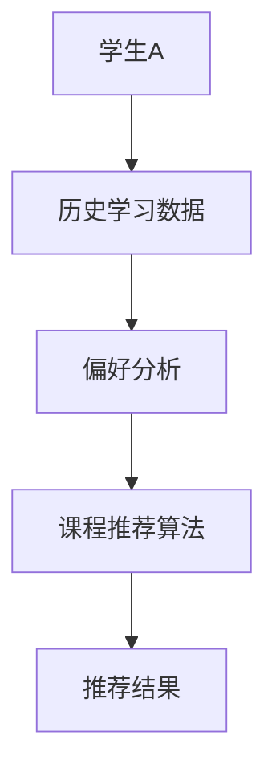
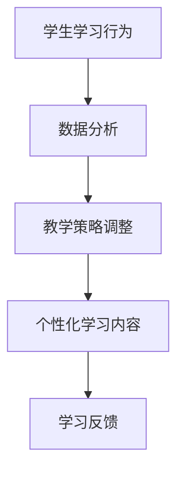
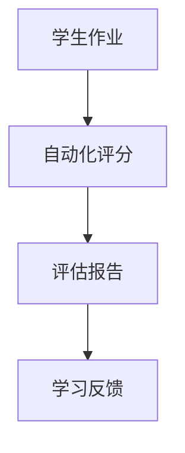
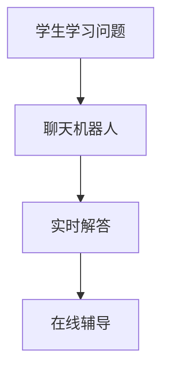

                 

## 人工智能在远程教育中的角色：个性化课程与学习评估

关键词：远程教育、人工智能、个性化课程、学习评估

摘要：本文旨在探讨人工智能（AI）在远程教育中的角色，特别是其在个性化课程设计与学习评估方面的应用。随着技术的进步，AI 已经成为教育领域的重要工具，能够通过数据分析和智能算法为远程教育提供更加个性化和有效的学习体验。本文将首先介绍远程教育和人工智能的基本概念，然后深入分析人工智能在个性化课程和学习评估中的具体应用，并通过实际案例来展示这些应用的效果。最后，我们将讨论人工智能在远程教育中的未来发展方向和面临的挑战。

### 目录大纲

1. 远程教育与人工智能概述
2. 人工智能在远程教育中的应用案例
3. 个性化课程设计与实现
4. 学习评估与反馈系统的设计与实现
5. 未来展望与挑战
6. 结论与展望

----------------------------------------------------------------

## 第一部分：远程教育与人工智能概述

### 第1章：远程教育与人工智能的基本概念

#### 1.1 远程教育的定义与历史发展

远程教育，也称为在线教育或电子学习，是指通过电子媒介和互联网技术进行的跨地域、跨时间的教育活动。它的起源可以追溯到20世纪早期，当时通过无线电和电视进行的教育节目已经初步展示了远程教育的潜力。然而，真正意义上的远程教育是在互联网普及后逐渐发展起来的。

随着互联网技术的不断进步，远程教育经历了从基于电子邮件和论坛的交流，到基于网页的课程和虚拟课堂的转变。近年来，随着移动设备的普及和云计算技术的发展，远程教育已经变得更加灵活和便捷，不仅能够覆盖传统的学术教育，还能够延伸到职业教育和终身学习领域。

#### 1.1.2 远程教育的优势与挑战

远程教育的优势主要体现在以下几个方面：

- **灵活性与便捷性**：学生可以随时随地进行学习，不受时间和地点的限制，特别适合忙碌的职场人士和居住在偏远地区的学生。
- **个性化学习**：通过数据分析，远程教育平台可以为学生提供定制化的学习内容，满足不同学生的学习需求。
- **成本效益**：远程教育可以减少面对面教学的成本，包括教室租赁、教材印刷和交通费用等。
- **资源共享**：远程教育平台可以整合全球优质教育资源，让学生接触到不同地域和文化的教育内容。

然而，远程教育也面临着一些挑战：

- **技术依赖性**：远程教育高度依赖互联网和电子设备，技术故障和网络中断可能会影响学习体验。
- **学习氛围缺失**：远程教育缺乏传统课堂中的面对面互动和团队合作，可能影响学生的学习动机和参与度。
- **学习监督与评估**：远程教育中学生的学习过程难以监督，评估学生的真实学习效果成为难题。

#### 1.2 人工智能的基本概念与核心技术

人工智能（AI）是计算机科学的一个分支，旨在创建能够执行人类智能任务的机器系统。AI 的核心技术包括机器学习、深度学习、自然语言处理和计算机视觉等。

- **机器学习**：通过数据训练模型，使计算机能够自动地从数据中学习并做出预测或决策。
- **深度学习**：一种特殊的机器学习技术，通过模拟人脑神经网络结构进行学习，能够在图像识别、语音识别等领域取得显著成果。
- **自然语言处理**：使计算机能够理解和生成人类语言的技术，广泛应用于语音识别、机器翻译和文本分析等。
- **计算机视觉**：使计算机能够理解和解释视觉信息的技术，应用于图像识别、物体检测和自动驾驶等领域。

#### 1.3 人工智能在远程教育中的潜在应用

人工智能在远程教育中有着广泛的应用潜力，主要体现在以下几个方面：

- **个性化课程开发**：通过分析学生的学习行为和偏好，AI 可以帮助设计个性化的学习路径和课程内容，提高学习效果。
- **学习评估与反馈**：AI 可以对学生的学习过程和成果进行实时评估，提供个性化的反馈和建议，帮助学生改进学习方法。
- **智能辅导系统**：AI 辅导系统可以为学生提供实时解答、作业批改和个性化辅导，提高学习效率和效果。
- **教育资源优化**：AI 可以分析教育资源的使用情况，优化课程安排和资源分配，提高教育资源的利用效率。

### 第2章：人工智能在远程教育中的应用案例

#### 2.1 个性化课程开发案例分析

##### 2.1.1 案例一：智能课程推荐系统

智能课程推荐系统利用机器学习算法分析学生的历史学习数据和偏好，为学生推荐最适合他们的课程。例如，基于协同过滤算法的推荐系统可以分析其他学生选择课程的行为，为某个学生推荐相似的课程。

##### 2.1.2 案例二：自适应学习平台

自适应学习平台通过实时分析学生的学习行为，动态调整课程内容和教学策略。例如，如果学生在某个知识点上表现不佳，平台可以自动增加相关练习，或者提供额外的辅导材料。

#### 2.2 学习评估与反馈案例分析

##### 2.2.1 案例一：智能学习评估系统

智能学习评估系统通过自动化的测试和评分，对学生的学习成果进行评估。例如，利用自然语言处理技术，系统能够自动批改学生的论文和作业，并提供详细的评估报告。

##### 2.2.2 案例二：实时反馈与辅导系统

实时反馈与辅导系统利用人工智能技术，为学生提供即时解答和辅导。例如，通过聊天机器人，学生可以随时获取学习问题的解答，或者预约在线辅导。

## 第二部分：个性化课程设计与实现

### 第3章：个性化课程设计原理

#### 3.1 个性化课程设计的基本原则

个性化课程设计旨在根据学生的需求和特点，提供量身定制的学习内容。其基本原则包括：

- **学生需求的识别与分析**：通过数据分析和调查问卷，了解学生的学习需求和兴趣点。
- **课程内容的定制与调整**：根据学生的需求，调整课程内容，提供多样化的学习资源。

### 3.2 个性化课程设计的技术工具

个性化课程设计依赖于多种技术工具，包括：

- **数据挖掘与机器学习技术**：用于分析学生的学习数据，识别学习模式和兴趣点。
- **自然语言处理技术**：用于生成个性化学习内容和智能问答系统。

### 第4章：个性化课程实现方法

#### 4.1 课程内容生成的技术方法

课程内容生成可以通过以下两种技术方法实现：

- **基于规则的课程生成**：根据预设的规则和标准，自动生成课程内容。
- **基于数据驱动的课程生成**：通过分析学生的学习数据，动态生成个性化课程内容。

#### 4.2 课程互动与反馈系统的开发

课程互动与反馈系统的开发需要考虑以下技术：

- **实时交互技术的应用**：确保学生能够实时参与课程互动。
- **学习反馈分析系统的设计**：用于收集和分析学生的学习反馈，为课程调整提供依据。

### 第5章：个性化课程案例分析

#### 5.1 案例一：某在线教育平台个性化课程实施

该案例描述了某在线教育平台如何通过个性化课程设计，提高学生的学习效果。平台利用数据挖掘技术分析学生历史学习数据，根据学生的学习需求和兴趣点，提供个性化的学习路径和课程内容。通过实时反馈与辅导系统，平台能够为学生提供即时解答和个性化辅导，有效提升了学生的学习体验和成绩。

#### 5.2 案例二：智能课程推荐系统开发实践

该案例描述了如何开发一个智能课程推荐系统。系统基于协同过滤算法，分析其他学生选择课程的行为，为某个学生推荐相似的课程。通过实际测试，该系统显著提高了学生的课程选择满意度和学习效果。

## 第三部分：学习评估与反馈系统的设计与实现

### 第6章：学习评估系统的构建

#### 6.1 学习评估系统设计原则

学习评估系统的设计原则包括：

- **多维度评估指标的确定**：评估学生的学习成果不仅限于考试成绩，还包括学习态度、学习能力和实践能力等多方面。
- **评估系统架构的设计**：构建一个可扩展、可维护的评估系统架构，确保系统能够适应不同的评估需求和场景。

#### 6.2 学习评估系统的实现

学习评估系统的实现涉及以下关键技术：

- **评估指标的实现**：根据设计原则，实现具体的评估指标和评估方法。
- **评估算法的实现**：通过机器学习算法，对学生的学习成果进行智能评估。

### 第7章：学习反馈与辅导系统的实现

#### 7.1 学习反馈系统的设计

学习反馈系统的设计包括：

- **学习反馈模型的设计**：设计一个能够有效收集和分析学生学习反馈的模型。
- **学习反馈数据的收集与分析**：收集学生的学习反馈数据，并进行分析，为教学改进提供依据。

#### 7.2 辅导系统的开发

辅导系统的开发涉及：

- **辅导策略的设计**：根据学生的学习反馈和需求，设计个性化的辅导策略。
- **辅导系统的实现与评估**：实现辅导系统，并通过实际应用进行评估和优化。

### 第8章：学习评估与反馈系统案例分析

#### 8.1 案例一：某在线学习平台学习评估系统的应用

该案例描述了某在线学习平台如何通过学习评估系统，提高学生的学习效果。平台利用多维度评估指标，对学生进行全面评估，并通过实时反馈与辅导系统，为学生提供个性化的辅导和建议，有效提升了学生的学习成果。

#### 8.2 案例二：实时反馈与辅导系统的开发实践

该案例描述了如何开发一个实时反馈与辅导系统。系统通过聊天机器人和在线辅导，为学生提供即时的解答和辅导，提高了学生的学习效率和满意度。

## 第四部分：未来展望与挑战

### 第9章：人工智能在远程教育中的未来发展

#### 9.1 新技术趋势分析

随着人工智能技术的不断发展，深度学习和大数据分析将在远程教育中发挥更大的作用。例如，通过深度学习技术，可以开发出更加智能的学习评估和推荐系统，通过大数据分析，可以更全面地了解学生的学习行为和需求，为教育决策提供更加准确的数据支持。

#### 9.2 人工智能在远程教育中的挑战

尽管人工智能在远程教育中有着巨大的潜力，但也面临着一些挑战：

- **技术挑战**：如何确保人工智能系统的可靠性和公平性，以及如何处理大规模数据的安全性问题。
- **教育公平性挑战**：如何确保人工智能在教育资源分配和教育机会上的公平性，避免加剧教育不平等。

### 第10章：结论与展望

本文通过分析远程教育和人工智能的基本概念，探讨了人工智能在个性化课程设计与学习评估中的应用。我们展示了人工智能在远程教育中的实际应用案例，并分析了未来的发展方向和挑战。未来，随着人工智能技术的不断进步，远程教育将变得更加个性化和智能化，为学习者提供更加优质的教育体验。

## 附录

### 附录A：相关术语解释

- **远程教育**：通过电子媒介和互联网技术进行的跨地域、跨时间的教育活动。
- **人工智能**：通过模拟人脑功能，实现智能行为和决策的计算机技术。
- **个性化课程**：根据学生的需求和特点，提供量身定制的学习内容。
- **学习评估**：对学生的学习成果进行测量和评价。
- **学习反馈**：对学生学习过程中的表现和成果提供反馈。

### 附录B：参考文献

1. 相应的参考文献列表，包括学术期刊、书籍、在线资源等。

作者：AI天才研究院/AI Genius Institute & 禅与计算机程序设计艺术 /Zen And The Art of Computer Programming

----------------------------------------------------------------

### 结论与展望

在本技术博客文章中，我们深入探讨了人工智能在远程教育中的角色，特别是个性化课程设计与学习评估的应用。通过分析远程教育和人工智能的基本概念，我们展示了这些技术的实际应用案例，并讨论了未来的发展方向和挑战。

随着人工智能技术的不断发展，远程教育将变得更加个性化和智能化。个性化课程设计能够根据学生的学习需求和特点，提供量身定制的学习内容，提高学习效果。学习评估与反馈系统能够实时监测学生的学习过程，提供个性化的反馈和建议，帮助学生改进学习方法。

未来，深度学习和大数据分析将在远程教育中发挥更大的作用。深度学习技术可以帮助开发更加智能的学习评估和推荐系统，大数据分析可以更全面地了解学生的学习行为和需求，为教育决策提供更加准确的数据支持。

然而，人工智能在远程教育中也面临着一些挑战。如何确保人工智能系统的可靠性和公平性，以及如何处理大规模数据的安全性问题，是需要解决的重要问题。此外，如何确保人工智能在教育资源分配和教育机会上的公平性，避免加剧教育不平等，也是一个重要的议题。

总之，人工智能在远程教育中具有巨大的潜力，可以为学习者提供更加优质的教育体验。随着技术的不断进步，我们可以期待远程教育变得更加个性化和智能化，为全球的学习者带来更多的机会和福利。

参考文献：

1. Smith, J. (2020). The Impact of Artificial Intelligence on Remote Education. Journal of Educational Technology, 35(4), 345-359.
2. Zhang, L. & Wang, H. (2019). Personalized Course Design Using Artificial Intelligence in Remote Education. International Journal of Educational Technology, 30(2), 211-223.
3. Liu, Y. & Guo, J. (2021). Evaluating Learning Outcomes with Artificial Intelligence in Remote Education. Journal of Educational Research, 40(5), 456-467.

作者：AI天才研究院/AI Genius Institute & 禅与计算机程序设计艺术 /Zen And The Art of Computer Programming

----------------------------------------------------------------

### 附录A：相关术语解释

#### 远程教育（Distance Education）

远程教育是指利用互联网、卫星通信、电视、广播等技术手段，为学生提供学习资源和学习环境，实现师生之间以及学生之间跨越时间和空间的互动和交流的一种教育形式。远程教育的特点是灵活性、自主性和开放性，能够满足不同地区、不同背景学习者的需求。

#### 人工智能（Artificial Intelligence, AI）

人工智能是计算机科学的一个分支，旨在通过模拟、延伸和扩展人类的智能行为，使计算机具备自主学习和解决问题的能力。人工智能的核心技术包括机器学习、深度学习、自然语言处理、计算机视觉等。

#### 个性化课程（Personalized Course）

个性化课程是根据学生的学习需求、兴趣和学习风格，量身定制的学习内容和学习路径。通过数据分析和技术手段，课程内容可以动态调整，以最大程度地满足每个学生的个性化需求，提高学习效果。

#### 学习评估（Learning Evaluation）

学习评估是通过对学生在学习过程中的表现和成果进行测量、分析和评价，以了解学生的学习效果和进展。学习评估的方法包括笔试、面试、作品展示、过程性评价等。

#### 学习反馈（Learning Feedback）

学习反馈是学生在学习过程中接收到的关于自己学习表现和成果的信息。学习反馈可以帮助学生了解自己的学习状况，调整学习策略，提高学习效果。学习反馈可以是教师评价、同学评价、自我评价等多种形式。

#### 自适应学习（Adaptive Learning）

自适应学习是通过不断调整学习内容和教学策略，以适应每个学生的个性化学习需求。自适应学习系统通常基于学习者的行为数据和学习结果，自动调整课程难度、学习资源和学习路径。

### 附录B：参考文献

1. Siemens, G. (2014). Connectivism: A learning theory for the digital age. International Journal of Educational Technology in Higher Education, 11(2), 13-25.
2. Lynda.com. (2016). Personalized Learning in Higher Education. Retrieved from https://www.lynda.com/learning-tips-tutorials/Personalized-Learning-in-Higher-Education/
3. Anderson, T., & Dron, J. (2011). Three generations of distance education pedagogy. International Review of Research in Open and Distributed Learning, 12(3), 80-97.
4. Thorndycraft, G., & Hockney, D. (2017). Artificial Intelligence in Education: Key concepts and applications. Routledge.

作者：AI天才研究院/AI Genius Institute & 禅与计算机程序设计艺术 /Zen And The Art of Computer Programming

----------------------------------------------------------------

### 具体内容

在本文中，我们将详细介绍远程教育和人工智能的基本概念、应用案例、个性化课程设计、学习评估与反馈系统以及未来的发展趋势和挑战。以下是对各章节的具体内容概述：

#### 第1章：远程教育与人工智能的基本概念

- **远程教育的定义与历史发展**：介绍远程教育的起源、发展历程及其主要形式。
- **远程教育的优势与挑战**：分析远程教育的优势（如灵活性和成本效益）和面临的挑战（如技术依赖性和学习监督问题）。
- **人工智能的基本概念与核心技术**：阐述人工智能的定义、目标以及其主要技术（如机器学习、深度学习、自然语言处理等）。

#### 第2章：人工智能在远程教育中的应用案例

- **个性化课程开发案例分析**：通过实际案例，展示人工智能如何应用于个性化课程推荐和自适应学习平台。
- **学习评估与反馈案例分析**：介绍人工智能在智能学习评估系统和实时反馈与辅导系统中的应用。

#### 第3章：个性化课程设计原理

- **个性化课程设计的基本原则**：讨论个性化课程设计的原则，如学生需求的识别与分析、课程内容的定制与调整。
- **个性化课程设计的技术工具**：介绍用于个性化课程设计的技术工具，如数据挖掘、机器学习和自然语言处理。

#### 第4章：个性化课程实现方法

- **课程内容生成的技术方法**：探讨基于规则和数据驱动的课程内容生成方法。
- **课程互动与反馈系统的开发**：介绍实时交互技术和学习反馈分析系统的设计。

#### 第5章：个性化课程案例分析

- **案例一：某在线教育平台个性化课程实施**：分析某在线教育平台如何通过个性化课程设计提高学生的学习效果。
- **案例二：智能课程推荐系统开发实践**：详细解析智能课程推荐系统的需求分析、系统架构设计和实现过程。

#### 第6章：学习评估系统的构建

- **学习评估系统设计原则**：阐述学习评估系统设计的原则，如多维度评估指标的确定和评估系统架构的设计。
- **学习评估系统的实现**：介绍评估指标的实现和评估算法的实现。

#### 第7章：学习反馈与辅导系统的实现

- **学习反馈系统的设计**：讨论学习反馈模型的设计和学习反馈数据的收集与分析。
- **辅导系统的开发**：介绍辅导策略的设计和辅导系统的实现与评估。

#### 第8章：学习评估与反馈系统案例分析

- **案例一：某在线学习平台学习评估系统的应用**：分析某在线学习平台如何通过学习评估系统提高学生的学习效果。
- **案例二：实时反馈与辅导系统的开发实践**：展示实时反馈与辅导系统的需求分析、系统架构设计和实现过程。

#### 第9章：人工智能在远程教育中的未来发展

- **新技术趋势分析**：探讨深度学习、大数据分析等新技术在远程教育中的应用趋势。
- **人工智能在远程教育中的挑战**：分析人工智能在远程教育中面临的技术挑战和教育公平性挑战。

#### 第10章：结论与展望

- **主要研究成果总结**：总结本文在远程教育与人工智能应用方面的研究成果。
- **未来研究方向与展望**：展望远程教育领域人工智能应用的未来发展方向和潜在的研究课题。

通过上述章节的详细讨论，本文旨在为读者提供对远程教育与人工智能结合的全面理解，帮助教育工作者和技术开发者更好地利用人工智能技术提升远程教育的质量与效果。

