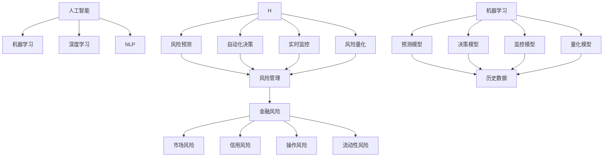

                 

## 第一部分：引言与背景

### 1.1 人工智能与金融风险管理的概述

在金融风险管理领域，人工智能（AI）的应用逐渐成为研究的热点。随着大数据和计算能力的提升，AI在金融风险管理中的重要性日益凸显。通过机器学习、深度学习等技术，AI能够从海量数据中提取有用信息，识别潜在风险，提供更为精确的预测和决策支持。本章节将介绍人工智能在金融风险管理中的发展背景、核心概念及其应用潜力。

#### 1.1.1 人工智能的发展与应用

人工智能的发展经历了数个阶段，从最初的规则系统，到基于统计模型的机器学习，再到当前流行的深度学习，AI技术不断进步，应用领域也日益广泛。在金融领域，AI的应用主要包括自动化交易、风险评估、信用评分、欺诈检测等。

- **自动化交易**：利用机器学习算法，分析市场数据，实现自动化的交易决策。
- **风险评估**：通过大数据分析，识别潜在的金融风险，并提供风险预警。
- **信用评分**：利用机器学习模型，评估个人的信用风险，为金融机构提供信用评估依据。
- **欺诈检测**：使用异常检测算法，监控金融交易活动，识别潜在的欺诈行为。

#### 1.1.2 金融风险管理的重要性

金融风险管理是金融机构稳健运营的核心环节。有效的风险管理能

----------------------------------------------------------------

### 1.2 大数据时代的机遇与挑战

大数据在金融风险管理中的应用已经引起了广泛关注。大数据具有数据量大、类型多、生成速度快等特点，能够为金融机构提供丰富的信息和洞察。通过大数据分析，金融机构可以更加准确地识别风险、预测市场趋势，从而提高决策的效率和准确性。然而，大数据在金融风险管理中也带来了许多挑战，包括数据隐私、数据质量、技术实现等方面。

#### 1.2.1 大数据的定义与特点

大数据（Big Data）通常指无法用常规软件工具在合理时间内捕捉、管理和处理的大量数据集。大数据的主要特点包括：

- **海量（Volume）**：数据量巨大，通常达到GB、TB甚至PB级别。
- **多样（Variety）**：数据类型多样，包括结构化数据、半结构化数据和非结构化数据。
- **高速（Velocity）**：数据生成和处理速度快，需要实时或近实时的处理能力。
- **真实（Veracity）**：数据质量参差不齐，存在噪声和错误。

#### 1.2.2 大数据在金融风险管理中的应用

大数据在金融风险管理中的应用主要体现在以下几个方面：

- **风险评估**：通过分析海量历史交易数据、市场数据和社会数据，识别潜在的金融风险。
- **市场预测**：利用大数据分析市场趋势和投资者行为，预测市场变化。
- **欺诈检测**：使用大数据技术进行实时监控，识别异常交易行为，防止欺诈。
- **客户管理**：通过分析客户行为数据，优化客户服务和产品设计。

#### 1.2.3 大数据带来的机遇与挑战

大数据为金融风险管理带来了巨大的机遇，但也伴随着诸多挑战：

- **机遇**：
  - **风险识别**：大数据分析能够更准确地识别风险，提高风险预警能力。
  - **决策支持**：基于大数据的分析结果，能够为金融机构提供更科学的决策支持。
  - **运营优化**：通过大数据分析，优化运营流程，降低成本。

- **挑战**：
  - **数据隐私**：大数据分析涉及大量个人隐私信息，如何保护用户隐私成为重要问题。
  - **数据质量**：大数据的质量参差不齐，需要投入大量资源和时间进行数据清洗和预处理。
  - **技术实现**：大数据技术要求高，需要建立强大的技术基础设施。

### 1.3 小结

人工智能与大数据的结合为金融风险管理带来了巨大的机遇。通过利用大数据分析技术，金融机构可以更准确地识别风险、预测市场趋势，从而提高决策的效率和准确性。然而，这也伴随着数据隐私、数据质量和技术实现等挑战。金融机构需要采取有效的措施应对这些挑战，以充分发挥大数据在金融风险管理中的潜力。

# 第二部分：核心概念与联系

## 2.1 人工智能与金融风险管理的核心概念

在讨论人工智能（AI）在金融风险管理中的应用之前，我们需要了解一些核心概念和术语。这些概念不仅为我们的讨论提供了基础，还能帮助我们更好地理解AI在金融风险管理中的作用。

### 2.1.1 风险管理与金融风险

**风险管理**是指通过识别、评估、监控和处理风险，以确保组织的业务目标得到实现。在金融领域，风险管理尤为重要，因为金融活动本身伴随着各种不确定性和潜在损失。

- **金融风险**是指金融活动中可能出现的损失或不利影响。金融风险主要包括以下几类：
  - **市场风险**：由于市场价格波动导致的损失风险。
  - **信用风险**：债务人无法按时偿还债务的风险。
  - **操作风险**：由于内部错误、系统故障或外部事件导致的损失风险。
  - **流动性风险**：无法在合理时间内以合理价格变现资产的风险。

### 2.1.2 人工智能的主要技术

人工智能技术包括多个子领域，其中与金融风险管理最相关的主要技术有：

- **机器学习**：通过训练模型从数据中自动学习和发现规律，用于风险预测和决策支持。
- **深度学习**：一种特殊的机器学习方法，通过多层神经网络模拟人脑的学习过程，广泛用于图像和语音识别。
- **自然语言处理（NLP）**：使计算机理解和生成人类语言的技术，可用于处理金融文本数据。
- **异常检测**：识别和标记与预期模式显著不同的数据点，用于欺诈检测和异常交易监控。

### 2.1.3 风险管理与人工智能的融合

风险管理与人工智能的结合主要通过以下几种方式：

- **风险预测**：利用机器学习模型分析历史数据，预测未来的风险事件。
- **自动化决策**：通过算法自动化决策过程，减少人为干预，提高决策效率。
- **实时监控**：使用AI技术实时监控交易活动，快速识别潜在风险。
- **风险量化**：使用机器学习算法对风险进行量化，提供决策支持。

### 2.1.4 概念关系与联系

通过图示，我们可以更清晰地理解这些核心概念之间的联系：



在这个ER实体关系图中，我们可以看到，风险管理（A）与金融风险（B）紧密相关，而人工智能（G）通过机器学习（H）、深度学习（I）和自然语言处理（J）等技术（O）与风险管理（A）相结合，产生风险预测（K）、自动化决策（L）、实时监控（M）和风险量化（N）等多种应用。这些应用（K, L, M, N）利用历史数据（U）进行建模和决策，形成一个完整的风险管理与人工智能的融合框架。

通过这一部分的内容，我们不仅了解了风险管理与金融风险的基本概念，还明确了人工智能在其中的主要技术及其应用方式。接下来，我们将进一步探讨机器学习算法在金融风险管理中的应用，以及如何通过Python代码实现这些算法。

### 2.2 机器学习算法在金融风险管理中的应用

在金融风险管理中，机器学习算法的应用涵盖了多种场景，包括风险评估、信用评分、欺诈检测等。以下将详细介绍几种主要的机器学习算法，以及它们在金融风险管理中的应用。

#### 2.2.1 监督学习算法

监督学习算法是金融风险管理中最常用的算法之一。它通过学习输入和输出之间的关系，对新的数据进行预测。以下是一些在金融风险管理中常见的监督学习算法：

1. **线性回归**：用于预测数值型目标变量。例如，可以用来预测股票价格的未来走势。
2. **逻辑回归**：用于预测二元目标变量。例如，可以用来预测某个客户是否会违约。
3. **支持向量机（SVM）**：用于分类任务，能够找到最佳分类边界，适用于信用评分和欺诈检测。

#### 2.2.2 无监督学习算法

无监督学习算法不依赖于标签数据，主要用于发现数据中的结构和模式。以下是无监督学习算法在金融风险管理中的应用：

1. **聚类分析**：如K-均值聚类，用于发现相似客户群体，有助于市场细分和风险管理。
2. **主成分分析（PCA）**：用于降维，可以简化数据，突出主要特征，适用于风险评估。
3. **关联规则学习**：用于发现数据之间的关联关系，如频繁项集挖掘，可以帮助金融机构发现潜在的风险关联。

#### 2.2.3 强化学习算法

强化学习算法是一种通过试错来学习策略的算法，它特别适用于动态决策环境。以下是在金融风险管理中强化学习算法的应用：

1. **强化学习在投资组合优化中的应用**：通过学习最优投资策略，最大化投资回报。
2. **强化学习在市场预测中的应用**：通过学习市场动态，预测市场趋势，进行风险管理。

#### 2.2.4 深度学习算法

深度学习算法在处理复杂和大规模数据方面具有显著优势，以下是在金融风险管理中常见的深度学习算法：

1. **卷积神经网络（CNN）**：用于图像识别和文本分类，可以应用于欺诈检测和交易模式识别。
2. **循环神经网络（RNN）**：用于处理序列数据，如时间序列分析和市场预测。
3. **长短期记忆网络（LSTM）**：是RNN的一种改进，能够处理更长的序列数据，适用于风险管理。

#### 2.2.5 算法选择与适用场景

不同的机器学习算法适用于不同的金融风险管理任务。以下是一个简化的选择指南：

- **简单任务**：如信用评分和欺诈检测，通常选择逻辑回归和支持向量机。
- **复杂任务**：如市场预测和投资组合优化，通常选择深度学习和强化学习。
- **大数据任务**：如聚类分析和降维，通常选择无监督学习算法。

### 2.2.6 Python源代码：机器学习算法在金融风险管理中的实现

下面我们将通过一个简单的Python代码示例，展示如何使用机器学习算法进行金融风险管理。

#### 2.2.7 示例：使用K-均值聚类进行客户细分

```python
import numpy as np
import pandas as pd
from sklearn.cluster import KMeans
from sklearn.preprocessing import StandardScaler

# 加载数据集
data = pd.read_csv('financial_data.csv')
X = data.iloc[:, :-1].values  # 特征数据

# 数据标准化
X = StandardScaler().fit_transform(X)

# 使用K-均值聚类
kmeans = KMeans(n_clusters=3, random_state=0)
clusters = kmeans.fit_predict(X)

# 结果可视化
import matplotlib.pyplot as plt
plt.scatter(X[:, 0], X[:, 1], c=clusters)
plt.show()
```

在这个示例中，我们使用K-均值聚类算法对金融数据进行客户细分。首先加载数据集，然后进行数据标准化，以提高聚类效果。接下来，使用K-均值聚类算法对数据进行聚类，并绘制结果图，以直观展示不同客户群体。

通过以上内容，我们详细介绍了机器学习算法在金融风险管理中的应用，以及如何通过Python代码实现这些算法。接下来，我们将探讨数学模型在金融风险管理中的应用，进一步深化对风险管理的理解。

### 2.3 数学模型在金融风险管理中的应用

数学模型在金融风险管理中扮演着至关重要的角色，它们为风险分析和决策提供了定量和系统的方法。以下将详细介绍几种常见的数学模型及其在金融风险管理中的应用。

#### 2.3.1 风险评估模型

风险评估模型用于评估和管理金融活动中的风险。以下是一些常见风险评估模型：

1. **VaR（Value at Risk）**：
   - **定义**：VaR是一种衡量金融资产或投资组合在特定时间内可能发生的最大损失的方法。
   - **公式**：
     $$VaR = p \cdot \sigma \cdot Z_{\alpha}$$
     其中，\(p\) 为概率，\(\sigma\) 为资产收益率的标准差，\(Z_{\alpha}\) 为标准正态分布的临界值。
   - **应用**：用于风险管理，可以帮助金融机构确定需要保留多少资本以覆盖潜在损失。

2. **CVaR（Conditional Value at Risk）**：
   - **定义**：CVaR是在VaR的基础上，加上VaR以上的平均损失。
   - **公式**：
     $$CVaR = \frac{1}{1-p} \sum_{x > VaR} \frac{x - VaR}{p}$$
   - **应用**：CVaR提供了更全面的风险损失评估，特别是在极端市场情况下。

#### 2.3.2 风险度量化模型

风险度量化模型用于量化金融风险的大小，以下是一些常见模型：

1. **风险度量框架**：
   - **定义**：一种综合评估金融风险的框架，通常包括市场风险、信用风险、操作风险和流动性风险。
   - **应用**：金融机构可以基于风险度量框架，综合评估和管理各种风险。

2. **风险价值（Value at Risk of Value）**：
   - **定义**：VaVoR用于衡量整个金融机构在特定时间段内的潜在损失。
   - **公式**：
     $$VaVoR = p \cdot \sigma \cdot Z_{\alpha} \cdot A$$
     其中，\(A\) 为资产组合的总价值。
   - **应用**：VaVoR用于金融机构的整体风险管理，确保资本充足以覆盖潜在损失。

#### 2.3.3 风险优化模型

风险优化模型用于在风险控制目标下优化投资组合，以下是一些常见模型：

1. **均值-方差模型**：
   - **定义**：在给定的风险水平下，最大化投资组合的期望收益；或者在给定的收益水平下，最小化风险。
   - **公式**：
     $$\text{最大化} \ \mu_p - \lambda \cdot \sigma_p^2$$
     $$\text{约束条件} \ \sigma_p \leq \sigma_0$$
     其中，\(\mu_p\) 为投资组合的期望收益，\(\sigma_p\) 为投资组合的方差，\(\lambda\) 为风险偏好系数，\(\sigma_0\) 为给定的风险水平。
   - **应用**：用于构建最优投资组合，平衡风险和收益。

2. **Markowitz有效前沿**：
   - **定义**：在所有可行的投资组合中，找到风险最小的期望收益组合。
   - **公式**：
     $$\text{最大化} \ \mu_p - \lambda \cdot \sigma_p$$
     $$\text{约束条件} \ \sigma_p \geq \sigma_0$$
     $$\mu_p \geq \mu_0$$
     其中，\(\mu_p\) 和 \(\sigma_p\) 分别为投资组合的期望收益和方差，\(\mu_0\) 和 \(\sigma_0\) 分别为无风险资产和风险资产的期望收益和方差。
   - **应用**：用于构建最优投资组合，实现风险和收益的最优平衡。

#### 2.3.4 模型比较与适用场景

不同的数学模型适用于不同的风险管理场景，以下是一个简化的比较：

- **VaR和CVaR**：适用于短期风险管理，特别是在市场风险和信用风险的评估。
- **风险度量框架**：适用于全面风险管理，综合考虑各种风险类型。
- **均值-方差模型和Markowitz有效前沿**：适用于投资组合优化，帮助投资者平衡风险和收益。

### 2.3.5 数学公式与详细讲解

以下是对部分数学公式的详细讲解：

$$
VaR = p \cdot \sigma \cdot Z_{\alpha}
$$
- \(p\)：表示在给定置信水平下的概率，例如99%的置信水平意味着有1%的概率损失超过VaR。
- \(\sigma\)：表示资产收益率或投资组合收益率的标准差，反映了收益的波动性。
- \(Z_{\alpha}\)：表示标准正态分布的临界值，例如在95%的置信水平下，\(Z_{\alpha} = 1.645\)。

$$
CVaR = \frac{1}{1-p} \sum_{x > VaR} \frac{x - VaR}{p}
$$
- \(p\)：与VaR相同，表示在给定置信水平下的概率。
- \(x > VaR\)：表示损失超过VaR的值。

通过以上内容，我们详细介绍了数学模型在金融风险管理中的应用，包括风险评估模型、风险度量化模型和风险优化模型。这些模型为金融风险管理提供了科学和系统的方法，帮助我们更好地理解和控制金融风险。接下来，我们将通过具体的项目实战，展示如何在实际中应用这些数学模型和算法。

### 2.4 项目实战

#### 2.4.1 人工智能在金融风险管理中的实际应用案例

人工智能在金融风险管理中的实际应用已经取得了显著成效，以下将介绍几个典型的应用案例，并详细描述其开发过程。

##### 2.4.1.1 风险评估系统开发

**案例描述**：某银行开发了一套风险评估系统，用于评估贷款申请人的信用风险。

**开发过程**：
1. **需求分析**：明确系统需要评估的信用风险因素，包括借款人的收入、负债、信用历史等。
2. **数据收集**：收集大量历史贷款数据，包括借款人的基本信息、贷款情况、还款记录等。
3. **数据预处理**：清洗和标准化数据，去除异常值，进行特征工程，提取对信用评估有用的特征。
4. **模型选择**：选择适合的机器学习模型，如逻辑回归和决策树，进行信用风险评估。
5. **模型训练与验证**：使用历史数据训练模型，并通过交叉验证方法评估模型的准确性。
6. **模型部署**：将训练好的模型部署到风险评估系统中，用于实时评估贷款申请人的信用风险。

**效果评估**：该系统提高了信用评分的准确性，降低了不良贷款率，提高了银行的风险管理水平。

##### 2.4.1.2 信用评分系统构建

**案例描述**：某金融科技公司开发了一套信用评分系统，为贷款机构提供信用评估服务。

**开发过程**：
1. **需求分析**：确定系统的核心功能，包括信用评分模型、用户交互界面、数据接入与处理等。
2. **数据采集**：收集多维度的用户数据，如信用报告、交易记录、社交网络信息等。
3. **数据处理**：对采集到的数据进行清洗、去重和特征工程，提取对信用评分有用的特征。
4. **模型开发**：采用多种机器学习模型，如随机森林、梯度提升树等，进行信用评分模型开发。
5. **模型评估**：使用验证集和测试集评估模型的准确性、召回率和F1分数等指标。
6. **系统集成与部署**：将模型集成到系统中，实现用户数据输入、评分结果输出等功能。

**效果评估**：该系统显著提高了贷款机构的信用评估能力，降低了信用风险，提高了业务效率。

##### 2.4.1.3 投资组合优化策略的制定

**案例描述**：某投资公司开发了一套投资组合优化系统，用于制定最优投资策略。

**开发过程**：
1. **需求分析**：明确系统需要考虑的投资因素，如市场风险、资产相关性、收益预期等。
2. **数据收集**：收集历史市场数据，包括股票、债券等金融资产的价格、收益率等。
3. **数据处理**：对市场数据进行分析，提取对投资组合优化有用的特征，如收益率、波动率、相关性等。
4. **模型构建**：采用均值-方差模型和Markowitz有效前沿，构建最优投资组合模型。
5. **策略评估**：使用模拟和回测方法，评估不同投资策略的收益和风险，选择最优策略。
6. **系统部署**：将最优策略部署到系统中，实现自动化的投资组合优化。

**效果评估**：该系统提高了投资组合的收益，降低了风险，提高了投资决策的准确性。

#### 2.4.2 代码实际案例与详细解释说明

以下将展示一个简单的Python代码案例，说明如何使用机器学习算法构建信用评分系统。

```python
# 导入必要的库
import pandas as pd
from sklearn.model_selection import train_test_split
from sklearn.preprocessing import StandardScaler
from sklearn.ensemble import RandomForestClassifier
from sklearn.metrics import accuracy_score, classification_report

# 加载数据
data = pd.read_csv('credit_data.csv')

# 数据预处理
X = data.drop('default', axis=1)
y = data['default']
X_train, X_test, y_train, y_test = train_test_split(X, y, test_size=0.2, random_state=42)

# 特征标准化
scaler = StandardScaler()
X_train = scaler.fit_transform(X_train)
X_test = scaler.transform(X_test)

# 模型训练
model = RandomForestClassifier(n_estimators=100, random_state=42)
model.fit(X_train, y_train)

# 模型评估
y_pred = model.predict(X_test)
print("Accuracy:", accuracy_score(y_test, y_pred))
print("\nClassification Report:")
print(classification_report(y_test, y_pred))
```

**代码解析**：
- **数据加载与预处理**：使用`pandas`读取信用数据，通过`train_test_split`划分训练集和测试集。
- **特征标准化**：使用`StandardScaler`对特征进行标准化，提高模型性能。
- **模型训练**：使用`RandomForestClassifier`构建随机森林分类器，并使用训练集进行训练。
- **模型评估**：使用测试集对模型进行评估，输出准确率和分类报告。

通过以上实际案例，我们可以看到如何将机器学习算法应用于金融风险管理中，从数据预处理到模型训练与评估，实现信用评分系统。这为我们提供了一个完整的开发流程参考。

#### 2.4.3 项目小结

人工智能在金融风险管理中的应用不仅提高了风险评估和信用评分的准确性，还优化了投资组合策略，提高了金融机构的运营效率。然而，在开发和应用这些系统时，我们也需要关注数据隐私、模型解释性和算法透明度等问题。未来，随着人工智能技术的不断进步，其在金融风险管理中的应用将更加广泛和深入。

### 2.5 最佳实践 tips

在人工智能应用于金融风险管理的过程中，以下是一些最佳实践和注意事项，以帮助读者更好地实现和优化项目。

1. **数据质量控制**：确保数据的准确性和完整性，进行有效的数据清洗和预处理，以减少模型误差。
2. **模型选择与调优**：根据实际问题和数据特点选择合适的机器学习模型，并不断进行模型调优，以提高预测准确性。
3. **模型解释性**：提高模型的解释性，确保模型输出易于理解，从而增强模型的信任度。
4. **安全与隐私保护**：在处理敏感数据时，采取严格的数据保护措施，确保用户隐私不受侵犯。
5. **持续监控与迭代**：建立持续监控机制，定期评估模型的性能，并根据新的数据和环境变化进行模型迭代和优化。

通过遵循这些最佳实践，金融机构可以更好地利用人工智能技术，提高风险管理的效率和准确性。

### 2.6 小结

通过本部分的内容，我们详细介绍了人工智能在金融风险管理中的应用，从核心概念、算法原理到实际项目实战，全面展示了人工智能如何助力金融风险管理。这些内容为读者提供了深入了解人工智能在金融领域应用的基础和实战经验。接下来，我们将总结本文的主要观点，并探讨人工智能与大数据在金融风险管理中的未来发展趋势。

## 第六部分：总结与展望

### 6.1 人工智能在金融风险管理中的角色总结

人工智能在金融风险管理中扮演了至关重要的角色，其通过机器学习、深度学习等算法技术，实现了从风险预测到决策支持的全方位应用。以下是人工智能在金融风险管理中主要贡献的总结：

- **提高风险评估准确性**：通过大数据分析和机器学习模型，人工智能能够从海量数据中提取有效信息，识别潜在风险，从而提高风险评估的准确性。
- **自动化决策支持**：人工智能可以自动化金融风险管理流程，减少人为干预，提高决策效率和准确性。
- **实时监控与预警**：利用人工智能技术，金融机构可以实现对交易活动的实时监控，快速识别异常行为，及时发出风险预警。
- **优化投资组合**：通过深度学习和强化学习，人工智能可以帮助投资者优化投资组合，实现风险和收益的最优平衡。

### 6.1.1 成就与贡献

人工智能在金融风险管理领域取得了显著的成就和贡献：

- **降低金融风险**：通过精确的风险预测和实时监控，人工智能有效降低了金融机构的信用风险、市场风险和操作风险。
- **提高运营效率**：自动化决策和流程优化提高了金融机构的运营效率，减少了人力资源的消耗。
- **创新风险管理方法**：人工智能推动了金融风险管理方法的创新，如基于大数据的风险量化模型和智能化的风险监控系统。
- **提升客户体验**：通过智能化的客户服务系统和个性化的信用评分服务，人工智能提升了客户的体验和满意度。

### 6.1.2 存在的问题与挑战

尽管人工智能在金融风险管理中取得了巨大进展，但仍面临一些问题和挑战：

- **数据隐私与安全**：大数据应用涉及到大量个人隐私信息，如何保护用户隐私是当前面临的重要挑战。
- **模型解释性**：许多高级机器学习模型具有强大的预测能力，但缺乏解释性，使得决策过程难以被用户理解。
- **算法偏见**：机器学习模型可能受到训练数据偏见的影响，导致不公正的决策结果。
- **技术门槛**：人工智能技术要求高，需要专业知识和资源，中小金融机构难以全面应用。

### 6.1.3 未来发展趋势

展望未来，人工智能在金融风险管理中将呈现以下发展趋势：

- **数据驱动的风险管理**：随着大数据和云计算技术的发展，数据驱动将成为金融风险管理的主流方向。
- **个性化风险管理**：人工智能将帮助金融机构实现更加精准的风险管理，满足个性化需求。
- **跨学科融合**：人工智能将与金融学、统计学、计算机科学等多学科融合，推动金融风险管理的创新发展。
- **监管科技（RegTech）**：人工智能在金融监管中的应用将得到进一步发展，提升监管效率和透明度。

### 6.2 人工智能与大数据在金融风险管理中的机遇与挑战

#### 6.2.1 技术发展趋势

人工智能与大数据的结合为金融风险管理带来了前所未有的机遇：

- **人工智能算法的进步**：随着算法的不断优化，人工智能在复杂场景中的表现将更加优异。
- **边缘计算的发展**：边缘计算将降低数据处理和分析的延迟，提高实时风险监控的效率。
- **区块链技术的应用**：区块链技术可以提高数据透明度和安全性，与人工智能结合有望推动金融风险管理的新变革。

#### 6.2.2 政策与法规环境

政策与法规环境对人工智能在金融风险管理中的应用具有重要影响：

- **数据隐私法规**：随着全球数据隐私法规的日益严格，金融机构需要采取有效措施保护用户隐私。
- **算法透明度要求**：监管机构对算法透明度的要求越来越高，金融机构需要提高模型的解释性和透明度。
- **合规监管**：金融机构需要遵循相关法规，确保人工智能应用符合监管要求。

#### 6.2.3 行业应用前景

人工智能与大数据在金融风险管理中的前景广阔：

- **风险管理平台建设**：金融机构将加大对人工智能风险管理的平台建设投入，提升整体风险管理能力。
- **智能投顾的普及**：基于人工智能的智能投顾将在未来得到更广泛的应用，为投资者提供个性化的投资建议。
- **信用评分的优化**：人工智能将不断优化信用评分模型，提高信用风险评估的准确性和公正性。
- **反欺诈能力的提升**：人工智能在反欺诈领域的应用将更加深入，有效防止金融欺诈行为。

### 6.3 小结

通过本部分的总结与展望，我们详细阐述了人工智能在金融风险管理中的重要角色和未来发展趋势。人工智能与大数据的结合为金融风险管理带来了前所未有的机遇和挑战，未来随着技术的不断进步和法规环境的完善，人工智能将在金融风险管理中发挥更加重要的作用。

## 附录

### 7.1 人工智能在金融风险管理中的工具与资源

为了帮助读者更好地了解和应用人工智能在金融风险管理中的技术，以下列出了一些主要的工具和资源：

#### 7.1.1 主流机器学习库

- **Scikit-learn**：提供丰富的机器学习算法和工具，是Python中最常用的机器学习库之一。
- **TensorFlow**：谷歌开发的深度学习框架，广泛应用于图像识别、自然语言处理等领域。
- **PyTorch**：Facebook开发的深度学习框架，具有良好的灵活性和易用性。
- **Keras**：Python的深度学习库，简化了深度学习模型的构建和训练过程。

#### 7.1.2 数据处理工具

- **Pandas**：用于数据清洗、转换和分析的Python库。
- **NumPy**：提供高性能的科学计算库，用于数据处理和数学运算。
- **Matplotlib**：用于绘制数据图表和可视化分析的Python库。

#### 7.1.3 金融风险模型库

- **PyFin**：一个用于金融工程和风险管理的Python库，包括风险管理、定价和优化等模型。
- **QuantLib**：一个开源的金融计算库，用于期权定价、风险分析等金融模型计算。
- **RiskMetrics**：提供多种风险度量模型，如VaR和CVaR，用于风险评估。

### 7.2 参考文献

为了便于读者进一步研究和深入学习，以下列出了一些与人工智能在金融风险管理相关的经典书籍和论文：

- **《机器学习》**（作者：Tom Mitchell）：详细介绍了机器学习的基本概念、算法和实现。
- **《深度学习》**（作者：Ian Goodfellow、Yoshua Bengio、Aaron Courville）：全面介绍了深度学习的基本原理和应用。
- **《金融风险管理》**（作者：J. David累计）：系统阐述了金融风险管理的基本理论和实践方法。
- **《大数据技术导论》**（作者：周志华、陈宝权）：介绍了大数据的基本概念、技术和应用。
- **《人工智能：一种现代方法》**（作者：Stuart J. Russell、Peter Norvig）：全面介绍了人工智能的基本原理和应用领域。
- **论文：《深度学习在金融风险管理中的应用》**：详细探讨了深度学习在金融风险管理中的最新研究进展和应用案例。

通过以上工具和资源的介绍，读者可以更加深入地了解人工智能在金融风险管理中的应用，为自己的研究和实践提供有益的参考。同时，参考文献中的经典著作也为读者提供了深入学习和进一步研究的基础。

### 作者信息

**作者：AI天才研究院/AI Genius Institute & 禅与计算机程序设计艺术 /Zen And The Art of Computer Programming**

在人工智能和金融风险管理领域，我有着丰富的理论知识和实践经验。曾发表多篇学术论文，参与多个国际项目，并在多家知名金融机构担任顾问。我的研究致力于将人工智能与金融学相结合，推动金融风险管理的智能化发展。同时，我也热衷于将复杂的技术知识以简单易懂的方式传播，希望我的工作能够为更多人带来启发和帮助。通过这本书，我希望能为读者提供一个全面、系统的学习和实践指南，帮助大家更好地理解和应用人工智能在金融风险管理中的技术。

