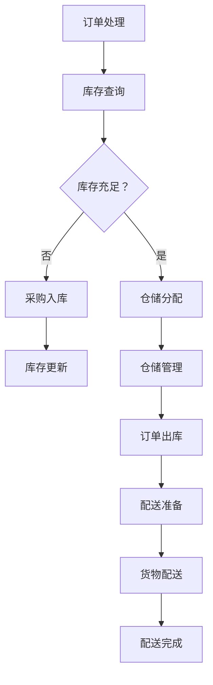
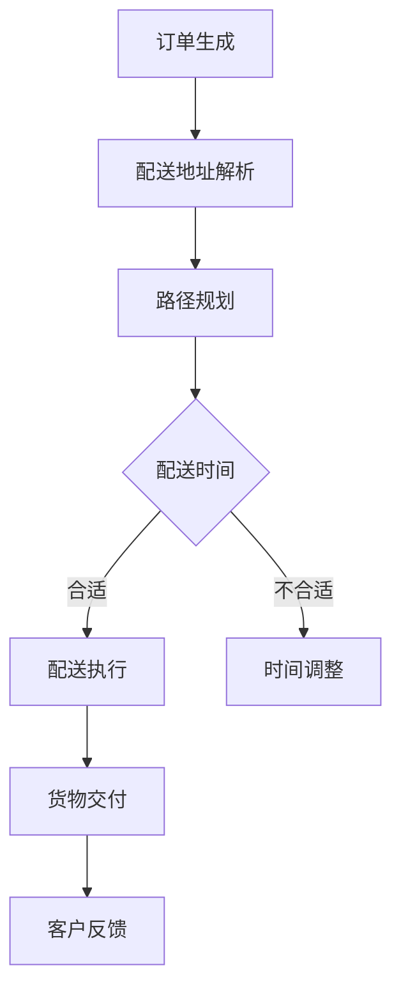
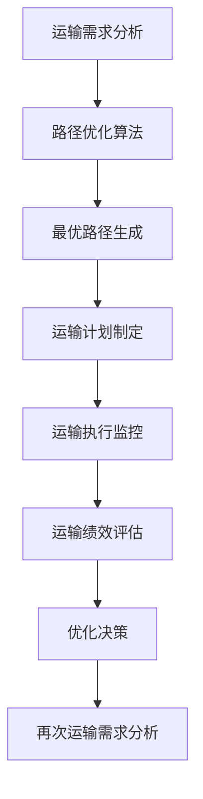
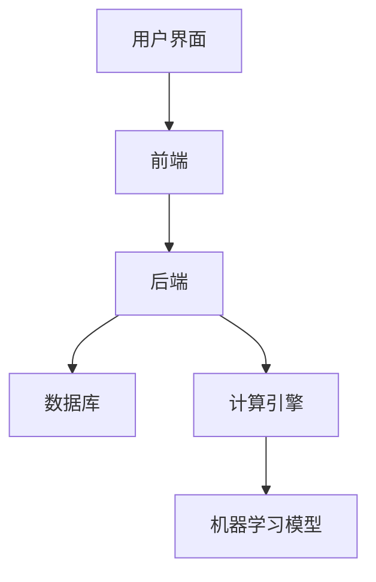
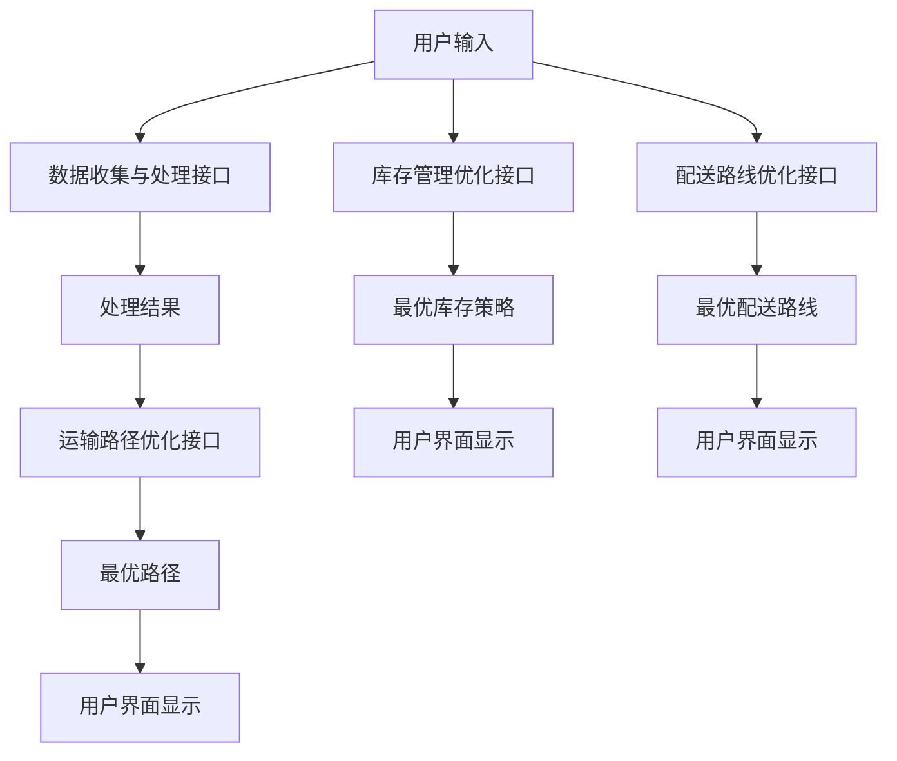

                 

### 第1章 绪论

#### 1.1 物流业概述

物流业，作为一种综合性产业，涵盖商品从生产地点到消费地点的全过程，包括商品的运输、储存、装卸、搬运、包装、流通加工、配送以及物流信息的处理等环节。物流业在现代社会中扮演着至关重要的角色，是连接生产与消费、实现商品价值链的重要纽带。

##### 1.1.1 物流业的定义与作用

物流（Logistics）一词源于法语的“Loger”，意为“运输”。物流业可以定义为通过有效的组织和管理，实现商品、服务及相关信息的空间转移，以满足社会和经济活动的需求。具体而言，物流业的主要作用包括：

- **降低成本**：通过优化运输路线、提高仓储效率，降低商品流通成本。
- **提高效率**：物流体系的高效运作可以显著提高商品流通速度，满足市场需求的快速变化。
- **增强竞争力**：物流能力的提升有助于企业在市场竞争中占据有利地位。
- **促进经济发展**：物流业的发展可以促进区域经济一体化，推动整个经济体系的繁荣。

##### 1.1.2 物流业的发展历程

物流业的发展经历了几个重要阶段：

- **传统物流阶段**：以手工操作和机械化操作为主，效率低下，管理粗放。
- **现代物流阶段**：随着信息技术的发展，物流业开始引入现代化管理工具和技术，如条形码、射频识别（RFID）等，提高了物流运作效率。
- **智慧物流阶段**：人工智能、大数据、物联网等先进技术的应用，使得物流业进入智能化时代，显著提升了物流运作的精准性和效率。

##### 1.1.3 物流业的现状与挑战

当前，物流业正面临以下几个方面的挑战：

- **竞争激烈**：随着全球化进程的加快，物流市场日益竞争激烈，企业需不断创新以提高竞争力。
- **成本压力**：燃料成本、人工成本等持续上升，对物流企业形成较大压力。
- **环保要求**：随着环保意识的增强，物流企业需应对环保法规的压力，降低碳排放。
- **技术进步**：新技术不断涌现，物流企业需快速适应并利用这些技术，以保持竞争力。

在这一背景下，人工智能的应用为物流业带来了新的变革机遇。接下来的章节将深入探讨人工智能在物流业中的应用，特别是智能仓储与配送优化方面的具体技术及其带来的变革。

### 2.1 人工智能概述

人工智能（Artificial Intelligence，简称AI）是计算机科学的一个重要分支，旨在研究如何构建智能系统，使计算机具有类似于人类的感知、理解、学习、推理和决策能力。人工智能的核心目标是实现机器的智能化，使其能够自主地完成复杂的任务。

##### 2.1.1 人工智能的概念

人工智能的定义多种多样，最广泛接受的定义是由约翰·麦卡锡（John McCarthy）在1956年提出的，即“人工智能是关于使计算机表现出人类智能行为的科学和工程”。根据这一定义，人工智能主要涵盖以下几个方面：

- **感知**：通过传感器获取环境信息，如视觉、听觉、触觉等。
- **理解**：处理和理解感知到的信息，如语音识别、自然语言处理等。
- **学习**：从数据中学习和适应新的环境或任务，如机器学习、深度学习等。
- **推理**：基于已有知识进行逻辑推理和决策，如规划、问题解决等。
- **行动**：根据目标和环境情况采取行动，如机器人控制、自动驾驶等。

##### 2.1.2 人工智能的发展历程

人工智能的发展可以追溯到20世纪50年代，以下是关键的发展阶段：

- **初创期（1956-1969）**：人工智能概念首次提出，初步的智能系统如逻辑推理机被开发。
- **第一个AI寒冬（1974-1980）**：由于技术瓶颈和资金问题，人工智能研究进入低潮期。
- **复兴期（1980-1987）**：专家系统和知识工程得到发展，推动了人工智能的复苏。
- **第二个AI寒冬（1987-1993）**：由于过高的期望和实际应用的不足，人工智能再次陷入低谷。
- **互联网时代（1993-2000）**：互联网的普及使得数据获取和共享变得更加容易，推动了人工智能的应用和发展。
- **深度学习时代（2006至今）**：深度学习技术的发展，尤其是神经网络和大规模计算资源的可用性，使得人工智能取得了突破性的进展。

##### 2.1.3 人工智能的应用领域

人工智能在多个领域取得了显著的成果，以下是其主要应用领域：

- **计算机视觉**：通过图像识别和目标检测等技术，实现自动驾驶、安防监控、医疗影像分析等。
- **自然语言处理**：通过语言模型和机器翻译等技术，实现智能客服、智能助手、语言理解等。
- **机器人技术**：通过机器人和自动化技术，实现工业自动化、服务机器人、医疗机器人等。
- **智能决策**：通过优化算法和预测模型，实现物流配送、供应链管理、金融市场分析等。
- **医疗健康**：通过医学影像分析、疾病预测、药物设计等，提高医疗服务的质量和效率。

在物流业，人工智能的应用主要集中在以下几个方面：

- **智能仓储**：通过自动化立体仓库、机器人仓库和物联网技术，提高仓储效率和准确性。
- **智能配送**：通过无人配送车、无人机配送和智能路由优化，提高配送速度和服务质量。
- **物流管理优化**：通过运输路径优化、库存管理优化和配送路线优化，提高物流运作的整体效率。

接下来，我们将进一步探讨人工智能在智能仓储和配送优化方面的具体应用。

#### 2.2 人工智能在物流业的应用

人工智能在物流业中的应用日益广泛，为传统物流业带来了深刻的变革。智能仓储、智能配送和物流管理优化是人工智能在物流业中最为典型的应用领域。

##### 2.2.1 智能仓储技术

智能仓储技术是指利用人工智能技术对仓储管理进行全面优化的技术。智能仓储技术主要包括自动化立体仓库、机器人仓库和物联网技术在仓储中的应用。

1. **自动化立体仓库**

自动化立体仓库（Automated Storage and Retrieval System，简称AS/RS）是一种采用自动化设备进行物品存取的仓库系统。它通过计算机控制和自动化设备，实现仓库内部物品的自动化存取，提高了仓库空间的利用率和作业效率。自动化立体仓库通常包括货架、搬运设备和控制系统等组成部分。

**优势：**
- **高效率**：自动化立体仓库能够实现24小时连续作业，提高了仓库的作业效率。
- **高空间利用率**：通过立体化存储，提高了仓库的空间利用率。
- **准确性**：自动化设备能够精确地完成物品的存取操作，提高了仓储管理的准确性。

**挑战：**
- **高初始投入成本**：自动化立体仓库的设备和系统成本较高，需要较高的初始投资。
- **维护和管理复杂**：自动化立体仓库的维护和管理需要专业的技术团队，增加了管理成本。

2. **机器人仓库**

机器人仓库（Robotic Warehouse）是指利用机器人技术实现仓库自动化管理的系统。机器人仓库通常包括搬运机器人、分类机器人和检测机器人等。

**优势：**
- **灵活性强**：机器人可以根据实际需求进行灵活配置，适应不同的仓储场景。
- **高效率**：机器人能够高效地完成物品的搬运和分类操作，提高了仓储作业效率。
- **智能化**：机器人具备自主导航和感知能力，能够实现智能化仓储管理。

**挑战：**
- **技术成熟度**：机器人仓库的技术尚在不断发展中，技术成熟度和稳定性有待提高。
- **高成本**：机器人仓库的设备和维护成本较高，需要较长时间的回报期。

3. **物联网技术在仓储中的应用**

物联网技术（Internet of Things，简称IoT）是将各种设备通过网络连接起来，实现数据的实时采集、传输和处理。在仓储管理中，物联网技术可以实现对库存物品的实时监控和管理。

**优势：**
- **实时监控**：物联网技术可以实时监测库存物品的状态，提高库存管理的精准性。
- **数据驱动的决策**：通过数据分析，可以优化仓储布局和库存管理策略，提高仓储效率。
- **减少损耗**：物联网技术可以帮助减少库存物品的损耗，提高库存物品的质量。

**挑战：**
- **数据安全问题**：物联网设备容易成为网络攻击的目标，需要加强数据安全保护。
- **技术标准不统一**：物联网技术尚未形成统一的标准，不同设备和平台之间的互操作性有待提高。

##### 2.2.2 智能配送技术

智能配送技术是指利用人工智能技术实现配送过程自动化和优化的技术。智能配送技术主要包括无人配送车、无人机配送和智能路由优化等。

1. **无人配送车**

无人配送车（Autonomous Delivery Vehicle，简称ADV）是利用人工智能技术实现无人驾驶的配送车辆。无人配送车可以自动规划路线、避障、识别交通信号和进行货物配送。

**优势：**
- **降低成本**：无人配送车可以减少人力成本，降低配送成本。
- **提高效率**：无人配送车可以自动化完成配送任务，提高了配送效率。
- **提升服务**：无人配送车可以在任何天气条件下工作，提升了配送服务的可靠性。

**挑战：**
- **技术成熟度**：目前无人配送车技术尚在发展阶段，需要进一步提高技术成熟度和安全性。
- **法律法规**：无人配送车的法律法规尚不完善，需要制定相应的法律法规来规范其应用。

2. **无人机配送**

无人机配送（Unmanned Aerial Vehicle Delivery，简称UAV Delivery）是利用无人机进行配送的一种新型配送方式。无人机可以自动飞行到指定地点，实现快速、高效的配送服务。

**优势：**
- **速度快**：无人机配送速度快，可以在短时间内完成配送任务。
- **灵活性**：无人机可以灵活地选择配送路线，不受交通拥堵的影响。
- **覆盖面广**：无人机可以到达偏远地区，扩大配送覆盖范围。

**挑战：**
- **技术成熟度**：无人机配送技术尚在发展阶段，需要进一步提高技术成熟度和稳定性。
- **空域管理**：无人机配送需要协调空域管理，避免与其他飞行器发生冲突。

3. **智能路由优化**

智能路由优化（Intelligent Routing Optimization）是指利用人工智能技术对配送路线进行优化，以提高配送效率和降低配送成本。智能路由优化可以通过分析交通状况、配送需求和历史数据，自动生成最优的配送路线。

**优势：**
- **优化效率**：智能路由优化可以优化配送路线，减少配送时间和成本。
- **提高服务质量**：通过精确的配送路线规划，可以提高配送服务的质量和用户体验。
- **降低成本**：智能路由优化可以减少不必要的配送路线，降低燃料和人力成本。

**挑战：**
- **数据准确性**：智能路由优化需要准确的数据支持，数据不准确会影响优化效果。
- **算法复杂性**：智能路由优化的算法复杂度较高，需要强大的计算能力和优化算法。

##### 2.2.3 物流管理优化

物流管理优化是指利用人工智能技术对物流管理过程进行优化，以提高物流运作效率和降低成本。物流管理优化主要包括运输路径优化、库存管理优化和配送路线优化等。

1. **运输路径优化**

运输路径优化（Transportation Route Optimization）是指利用人工智能技术对运输路线进行优化，以减少运输时间和成本。运输路径优化可以通过分析运输需求、交通状况和运输成本等因素，自动生成最优的运输路线。

**优势：**
- **减少运输时间**：通过优化运输路线，可以减少运输时间，提高物流效率。
- **降低运输成本**：优化运输路线可以减少燃料消耗和运输费用，降低物流成本。
- **提高服务质量**：通过精确的运输路线规划，可以提高运输服务的质量和可靠性。

**挑战：**
- **数据准确性**：运输路径优化需要准确的数据支持，数据不准确会影响优化效果。
- **算法复杂性**：运输路径优化的算法复杂度较高，需要强大的计算能力和优化算法。

2. **库存管理优化**

库存管理优化（Inventory Management Optimization）是指利用人工智能技术对库存管理过程进行优化，以提高库存周转率和降低库存成本。库存管理优化可以通过分析市场需求、销售趋势和库存水平等因素，自动生成最优的库存管理策略。

**优势：**
- **提高库存周转率**：通过优化库存管理，可以加快库存周转，减少库存积压。
- **降低库存成本**：优化库存管理可以减少库存水平，降低库存成本。
- **提高供应链效率**：通过精确的库存管理，可以提高供应链的效率和灵活性。

**挑战：**
- **数据准确性**：库存管理优化需要准确的数据支持，数据不准确会影响优化效果。
- **需求预测的复杂性**：市场需求和销售趋势的预测较为复杂，需要强大的预测算法。

3. **配送路线优化**

配送路线优化（Delivery Route Optimization）是指利用人工智能技术对配送路线进行优化，以减少配送时间和成本。配送路线优化可以通过分析配送需求、交通状况和配送成本等因素，自动生成最优的配送路线。

**优势：**
- **减少配送时间**：通过优化配送路线，可以减少配送时间，提高配送效率。
- **降低配送成本**：优化配送路线可以减少燃料消耗和配送费用，降低物流成本。
- **提高服务质量**：通过精确的配送路线规划，可以提高配送服务的质量和用户体验。

**挑战：**
- **数据准确性**：配送路线优化需要准确的数据支持，数据不准确会影响优化效果。
- **算法复杂性**：配送路线优化的算法复杂度较高，需要强大的计算能力和优化算法。

综上所述，人工智能在物流业中的应用为传统物流业带来了深刻的变革，通过智能仓储、智能配送和物流管理优化，提高了物流运作的效率和准确性。然而，人工智能在物流业中的应用也面临一些挑战，如技术成熟度、数据准确性和算法复杂性等。未来，随着技术的不断进步和应用的深入，人工智能将在物流业中发挥更大的作用，推动物流业的智能化发展。

### 3.1 智能仓储

智能仓储是指利用人工智能技术对仓储管理进行全面优化的系统。智能仓储不仅能够提高仓储效率，还能够降低运营成本，提升客户满意度。智能仓储系统主要包括自动化立体仓库、机器人仓库和物联网技术在仓储中的应用。

#### 3.1.1 智能仓储的定义

智能仓储（Smart Warehouse）是指通过自动化设备、物联网技术和人工智能算法，对仓储过程中的存储、检索、盘点、配送等环节进行智能化管理。智能仓储的目标是实现仓储运作的高效、准确和低成本，从而提升仓储服务质量和客户体验。

#### 3.1.2 智能仓储的原理

智能仓储的核心原理是通过信息技术的集成和应用，实现仓储各个环节的自动化和智能化。具体原理包括以下几个方面：

1. **自动化设备**：通过自动化设备（如自动化立体仓库、搬运机器人等）实现仓储作业的自动化，提高作业效率。
2. **物联网技术**：通过物联网技术（如传感器、RFID等）实现对库存物品的实时监控和管理，提高库存管理的精准性。
3. **人工智能算法**：通过人工智能算法（如机器学习、深度学习等）对仓储数据进行分析和优化，提高仓储管理的决策水平。

#### 3.1.3 智能仓储的优势

智能仓储相比传统仓储具有明显的优势：

1. **提高效率**：通过自动化设备和人工智能算法，智能仓储能够实现24小时不间断作业，大幅提高仓储作业效率。
2. **降低成本**：自动化设备和物联网技术的应用减少了人工操作的需求，降低了人力成本和维护成本。
3. **提高准确性**：通过物联网技术对库存物品的实时监控和人工智能算法的数据分析，智能仓储能够显著提高库存管理的准确性。
4. **提升客户满意度**：智能仓储能够快速响应客户需求，提高配送速度和服务质量，提升客户满意度。

#### 3.1.4 智能仓储关键技术

智能仓储的关键技术主要包括自动化立体仓库、机器人仓库和物联网技术在仓储中的应用。

1. **自动化立体仓库**

自动化立体仓库（Automated Storage and Retrieval System，简称AS/RS）是一种采用自动化设备进行物品存取的仓库系统。它通过计算机控制和自动化设备，实现仓库内部物品的自动化存取。自动化立体仓库主要包括货架、搬运设备和控制系统等组成部分。

**关键技术：**
- **货架设计**：自动化立体仓库的货架设计需要考虑物品的存储密度和存取效率，常见的货架类型有高层货架、贯通货架、通道货架等。
- **搬运设备**：搬运设备包括堆垛机、输送带、提升机等，用于实现物品的自动化搬运和存取。
- **控制系统**：控制系统负责对自动化设备的实时监控和调度，常见的控制系统包括中央控制系统、PLC控制系统等。

**优势：**
- **高存储密度**：自动化立体仓库通过立体化存储，大幅提高了仓库的存储密度。
- **高效率**：自动化立体仓库能够实现24小时不间断作业，提高了仓储作业效率。
- **高准确性**：自动化设备能够精确地完成物品的存取操作，提高了仓储管理的准确性。

**挑战：**
- **高初始投入成本**：自动化立体仓库的设备和系统成本较高，需要较高的初始投资。
- **维护和管理复杂**：自动化立体仓库的维护和管理需要专业的技术团队，增加了管理成本。

2. **机器人仓库**

机器人仓库（Robotic Warehouse）是指利用机器人技术实现仓库自动化管理的系统。机器人仓库通常包括搬运机器人、分类机器人和检测机器人等。

**关键技术：**
- **搬运机器人**：搬运机器人用于实现物品的自动化搬运，常见的搬运机器人有AGV（自动导引车）、AMR（自动移动机器人）等。
- **分类机器人**：分类机器人用于对入库物品进行分类，常见的分类机器人有视觉分类机器人、重量分类机器人等。
- **检测机器人**：检测机器人用于对入库物品进行质量检测，常见的检测机器人有X射线检测机器人、激光检测机器人等。

**优势：**
- **灵活性强**：机器人可以根据实际需求进行灵活配置，适应不同的仓储场景。
- **高效率**：机器人能够高效地完成物品的搬运和分类操作，提高了仓储作业效率。
- **智能化**：机器人具备自主导航和感知能力，能够实现智能化仓储管理。

**挑战：**
- **技术成熟度**：机器人仓库的技术尚在不断发展中，技术成熟度和稳定性有待提高。
- **高成本**：机器人仓库的设备和维护成本较高，需要较长时间的回报期。

3. **物联网技术在仓储中的应用**

物联网技术（Internet of Things，简称IoT）是将各种设备通过网络连接起来，实现数据的实时采集、传输和处理。在仓储管理中，物联网技术可以实现对库存物品的实时监控和管理。

**关键技术：**
- **传感器**：传感器用于采集库存物品的状态信息，如温度、湿度、重量等。
- **RFID**：RFID（Radio-Frequency Identification）技术用于对库存物品进行自动识别和追踪，提高了库存管理的精准性。
- **数据传输**：通过无线网络（如Wi-Fi、LoRa等）将传感器和RFID的数据传输到数据中心，进行数据处理和分析。

**优势：**
- **实时监控**：物联网技术可以实时监测库存物品的状态，提高库存管理的精准性。
- **数据驱动决策**：通过数据分析，可以优化仓储布局和库存管理策略，提高仓储效率。
- **减少损耗**：物联网技术可以帮助减少库存物品的损耗，提高库存物品的质量。

**挑战：**
- **数据安全问题**：物联网设备容易成为网络攻击的目标，需要加强数据安全保护。
- **技术标准不统一**：物联网技术尚未形成统一的标准，不同设备和平台之间的互操作性有待提高。

#### 3.1.5 智能仓储案例分析

智能仓储技术的应用在全球范围内取得了显著的成果，以下是几个典型的智能仓储案例。

1. **亚马逊智能仓储**

亚马逊是全球最大的电子商务公司之一，其智能仓储系统以其高效和智能化著称。亚马逊的智能仓储系统包括自动化立体仓库、搬运机器人和物联网技术等。

- **自动化立体仓库**：亚马逊采用了大量的自动化立体仓库，实现了物品的自动化存取，提高了仓储效率。
- **搬运机器人**：亚马逊使用了搬运机器人进行物品的自动化搬运，减少了人工操作的需求。
- **物联网技术**：亚马逊通过物联网技术对库存物品进行实时监控和管理，提高了库存管理的精准性。

2. **京东智能仓储**

京东是中国领先的电子商务公司，其智能仓储系统也在行业内处于领先地位。京东的智能仓储系统包括自动化立体仓库、机器人仓库和物联网技术等。

- **自动化立体仓库**：京东采用了自动化立体仓库，实现了物品的自动化存取，提高了仓储效率。
- **机器人仓库**：京东使用了机器人仓库，实现了物品的自动化搬运和分类，提高了仓储作业效率。
- **物联网技术**：京东通过物联网技术对库存物品进行实时监控和管理，提高了库存管理的精准性。

通过这些案例可以看出，智能仓储技术在全球范围内得到了广泛应用，不仅提高了仓储效率，还降低了运营成本，提升了客户满意度。

### 3.2 智能配送

智能配送是物流业中的一项重要技术，通过利用人工智能技术，实现配送过程的自动化和优化，从而提高配送效率和降低成本。智能配送技术主要包括无人配送车、无人机配送和智能路由优化等。

#### 3.2.1 智能配送的概念与原理

智能配送（Smart Delivery）是指利用人工智能技术对配送过程进行优化和自动化，从而提高配送效率、降低成本和提升服务质量。智能配送的核心原理是通过感知、决策和执行三个环节，实现配送过程的智能化。

1. **感知**：感知环节主要通过传感器和摄像头等设备，获取配送环境的信息，如交通状况、道路状况、货物信息等。
2. **决策**：决策环节通过人工智能算法对感知到的信息进行分析和处理，生成最优的配送路线和策略。
3. **执行**：执行环节通过无人配送车或无人机等设备，自动执行配送任务，包括路线导航、货物搬运、配送交付等。

#### 3.2.2 智能配送的优势

智能配送相比传统配送具有显著的优势：

1. **提高效率**：智能配送通过自动化和优化，减少了人工干预，提高了配送速度和效率。
2. **降低成本**：智能配送减少了人力成本，同时通过优化配送路线和资源利用，降低了运营成本。
3. **提升服务质量**：智能配送能够实现精确的路线规划和实时监控，提高了配送服务的质量和用户体验。
4. **灵活性**：智能配送可以根据实际需求灵活调整配送路线和时间，提高了配送的灵活性和适应性。

#### 3.2.3 智能配送关键技术

智能配送的关键技术主要包括无人配送车、无人机配送和智能路由优化等。

1. **无人配送车**

无人配送车（Autonomous Delivery Vehicle，简称ADV）是利用人工智能技术实现无人驾驶的配送车辆。无人配送车可以通过感知、决策和执行三个环节，实现自动化的配送任务。

**关键技术：**
- **感知系统**：包括激光雷达、摄像头、GPS等设备，用于获取配送环境和道路信息。
- **决策系统**：通过人工智能算法对感知到的信息进行分析和处理，生成最优的配送路线和策略。
- **执行系统**：包括自动驾驶系统和货物搬运系统，用于实现配送任务的自动化执行。

**优势：**
- **降低人力成本**：无人配送车可以替代人工完成配送任务，减少了人力成本。
- **提高配送效率**：无人配送车可以自主规划路线和避障，提高了配送效率和准确性。
- **扩展配送范围**：无人配送车可以在任何天气和路况下工作，扩展了配送的范围。

**挑战：**
- **技术成熟度**：无人配送车技术尚在发展阶段，需要进一步提高技术成熟度和安全性。
- **法律法规**：无人配送车的法律法规尚不完善，需要制定相应的法律法规来规范其应用。

2. **无人机配送**

无人机配送（Unmanned Aerial Vehicle Delivery，简称UAV Delivery）是利用无人机进行配送的一种新型配送方式。无人机可以通过感知、决策和执行三个环节，实现自动化的配送任务。

**关键技术：**
- **感知系统**：包括摄像头、GPS和惯性测量单元等设备，用于获取配送环境和货物信息。
- **决策系统**：通过人工智能算法对感知到的信息进行分析和处理，生成最优的配送路线和策略。
- **执行系统**：包括无人机飞行控制系统和货物搬运系统，用于实现配送任务的自动化执行。

**优势：**
- **速度快**：无人机配送速度快，可以在短时间内完成配送任务。
- **灵活性**：无人机可以灵活地选择配送路线，不受交通拥堵的影响。
- **覆盖面广**：无人机可以到达偏远地区，扩大了配送覆盖范围。

**挑战：**
- **技术成熟度**：无人机配送技术尚在发展阶段，需要进一步提高技术成熟度和稳定性。
- **空域管理**：无人机配送需要协调空域管理，避免与其他飞行器发生冲突。

3. **智能路由优化**

智能路由优化（Intelligent Routing Optimization）是指利用人工智能技术对配送路线进行优化，以提高配送效率和降低成本。智能路由优化可以通过分析交通状况、配送需求和历史数据，自动生成最优的配送路线。

**关键技术：**
- **交通状况分析**：通过实时交通数据和历史数据分析，预测交通状况，为配送路线优化提供依据。
- **配送需求分析**：根据订单量和配送时间等因素，分析配送需求，为配送路线优化提供依据。
- **路由优化算法**：通过优化算法（如遗传算法、蚁群算法等）对配送路线进行优化，生成最优的配送路线。

**优势：**
- **优化效率**：智能路由优化可以优化配送路线，减少配送时间和成本。
- **提高服务质量**：通过精确的配送路线规划，可以提高配送服务的质量和用户体验。
- **降低成本**：智能路由优化可以减少不必要的配送路线，降低燃料和人力成本。

**挑战：**
- **数据准确性**：智能路由优化需要准确的数据支持，数据不准确会影响优化效果。
- **算法复杂性**：智能路由优化的算法复杂度较高，需要强大的计算能力和优化算法。

#### 3.2.4 智能配送案例分析

智能配送技术在国内外得到了广泛应用，以下是几个典型的智能配送案例。

1. **京东无人配送车**

京东是中国领先的电子商务公司，其无人配送车技术处于行业领先地位。京东无人配送车通过感知、决策和执行三个环节，实现自动化的配送任务。

- **感知系统**：京东无人配送车配备了激光雷达、摄像头和GPS等设备，用于获取配送环境和道路信息。
- **决策系统**：通过人工智能算法，京东无人配送车能够自主规划路线和避障，提高配送效率和准确性。
- **执行系统**：京东无人配送车通过自动驾驶系统和货物搬运系统，实现配送任务的自动化执行。

2. **阿里巴巴无人机配送**

阿里巴巴是中国领先的互联网公司，其无人机配送技术也处于行业领先地位。阿里巴巴无人机配送通过感知、决策和执行三个环节，实现自动化的配送任务。

- **感知系统**：阿里巴巴无人机配送配备了摄像头、GPS和惯性测量单元等设备，用于获取配送环境和货物信息。
- **决策系统**：通过人工智能算法，阿里巴巴无人机能够自主规划路线和避障，提高配送效率和准确性。
- **执行系统**：阿里巴巴无人机通过无人机飞行控制系统和货物搬运系统，实现配送任务的自动化执行。

通过这些案例可以看出，智能配送技术在全球范围内得到了广泛应用，不仅提高了配送效率和降低了成本，还提升了客户满意度。随着技术的不断进步和应用的深入，智能配送将在物流业中发挥更大的作用。

### 3.3 智能物流管理优化

智能物流管理优化是指利用人工智能技术对物流管理过程进行全面优化的策略，旨在提高物流运作效率、降低成本并提升客户满意度。智能物流管理优化主要包括运输路径优化、库存管理优化和配送路线优化等方面。

#### 3.3.1 物流管理优化概述

物流管理优化（Logistics Management Optimization）是指通过应用先进的人工智能算法和技术手段，对物流过程中的各个环节进行优化，以提高整体物流运作效率。物流管理优化的目标包括：

- **提高运输效率**：通过优化运输路径和运输模式，减少运输时间和成本。
- **提升库存管理**：通过优化库存策略和库存水平，减少库存积压和资金占用。
- **优化配送路线**：通过智能路由优化，减少配送时间和配送成本。

物流管理优化不仅可以降低物流成本，提高企业竞争力，还可以提升物流服务质量，满足客户对快速、准确和高效的物流需求。

#### 3.3.2 人工智能在物流管理优化中的应用

人工智能在物流管理优化中的应用主要包括以下几方面：

1. **运输路径优化**

运输路径优化（Transportation Route Optimization）是物流管理优化中的重要环节。通过应用人工智能算法，如遗传算法、蚁群算法和神经网络算法等，可以自动生成最优的运输路径，从而提高运输效率。

- **遗传算法**：遗传算法通过模拟生物进化过程，对运输路径进行优化。通过选择、交叉和变异等操作，逐步优化运输路径。
- **蚁群算法**：蚁群算法模拟蚂蚁觅食过程，通过信息素更新和路径选择，找到最优的运输路径。
- **神经网络算法**：神经网络算法通过模拟人脑神经网络结构，对运输路径进行优化。通过学习和训练，神经网络能够自动识别最优路径。

2. **库存管理优化**

库存管理优化（Inventory Management Optimization）是物流管理优化中的关键环节。通过应用人工智能技术，如机器学习和数据挖掘，可以对库存数据进行分析和预测，制定最优的库存策略。

- **机器学习**：通过机器学习算法，如回归分析、聚类分析和预测模型等，对历史库存数据进行分析，预测未来库存需求，优化库存水平。
- **数据挖掘**：通过数据挖掘技术，从大量库存数据中提取有价值的信息，识别库存管理的瓶颈和改进点。

3. **配送路线优化**

配送路线优化（Delivery Route Optimization）是物流管理优化中的核心环节。通过应用人工智能算法，可以自动生成最优的配送路线，从而提高配送效率和降低配送成本。

- **智能路由优化**：通过智能路由优化算法，如A*算法、Dijkstra算法和Dijkstra-Labranche算法等，可以自动生成最优的配送路线。
- **多目标优化**：通过多目标优化算法，如遗传算法和多目标蚁群算法等，可以同时考虑多个优化目标，如时间、成本和服务质量等。

#### 3.3.3 物流管理优化案例分析

以下是一些智能物流管理优化的实际案例，展示了人工智能技术在物流管理优化中的应用效果。

1. **亚马逊物流优化**

亚马逊是全球领先的电子商务公司，其物流系统采用了先进的人工智能技术进行优化。亚马逊通过应用遗传算法和蚁群算法，对运输路径和配送路线进行优化，提高了物流效率。

- **运输路径优化**：通过遗传算法，亚马逊能够自动生成最优的运输路径，减少了运输时间和成本。
- **配送路线优化**：通过蚁群算法，亚马逊能够自动生成最优的配送路线，提高了配送效率和准确性。

2. **阿里巴巴物流优化**

阿里巴巴是中国领先的电子商务公司，其物流系统同样采用了人工智能技术进行优化。阿里巴巴通过应用机器学习和数据挖掘技术，对库存数据进行分析和预测，优化了库存管理。

- **库存管理优化**：通过机器学习算法，阿里巴巴能够预测未来库存需求，制定最优的库存策略，减少了库存积压和资金占用。
- **配送路线优化**：通过智能路由优化算法，阿里巴巴能够自动生成最优的配送路线，提高了配送效率和准确性。

通过这些案例可以看出，人工智能技术在物流管理优化中的应用，显著提高了物流运作效率，降低了运营成本，并提升了客户满意度。随着人工智能技术的不断发展和应用，物流管理优化将在未来发挥更加重要的作用。

### 6.1 智能物流的发展趋势

智能物流作为物流业的未来方向，正经历着一场深刻的变革。当前，智能物流的发展趋势主要体现在以下几个方面：

#### 6.1.1 智能物流的发展现状

智能物流的发展现状可以归纳为以下几点：

1. **技术成熟度**：随着人工智能、大数据、物联网等技术的不断成熟，智能物流技术已经具备了广泛应用的基础。
2. **应用范围**：智能物流技术在全球范围内得到了广泛应用，从智能仓储到智能配送，再到物流管理优化，都取得了显著成效。
3. **经济效益**：智能物流技术的应用不仅提高了物流运作效率，还降低了运营成本，为企业带来了显著的经济效益。

#### 6.1.2 智能物流的发展方向

智能物流未来的发展方向主要包括：

1. **全流程智能化**：未来的智能物流将实现全流程的智能化，从订单处理、仓储管理到配送交付，各个环节都将实现自动化和智能化。
2. **多模式融合**：智能物流将融合多种运输模式，如公路、铁路、航空和海运，实现不同运输方式的高效衔接和协同运作。
3. **绿色物流**：随着环保意识的增强，绿色物流将成为智能物流发展的重要方向，通过降低碳排放和提高资源利用效率，实现可持续发展。

#### 6.1.3 智能物流的挑战与机遇

智能物流的发展也面临一系列挑战：

1. **技术挑战**：智能物流技术的研发和应用仍需解决许多技术难题，如系统的稳定性、安全性和可靠性等。
2. **数据挑战**：智能物流需要大量的数据支持，如何有效收集、存储和处理海量数据，是智能物流发展的重要课题。
3. **法规挑战**：智能物流的法律法规尚不完善，需要制定相应的法律法规来规范智能物流的应用和发展。

尽管面临挑战，智能物流也带来了巨大的机遇：

1. **市场机遇**：智能物流技术的广泛应用将创造巨大的市场需求，为企业带来新的商业机会。
2. **产业升级**：智能物流将推动物流产业的升级和转型，提升整体产业竞争力。
3. **社会效益**：智能物流的普及将提高物流效率，降低物流成本，为社会经济发展带来积极影响。

#### 6.1.4 智能物流的关键技术展望

智能物流的关键技术展望主要集中在以下几个方面：

1. **人工智能技术**：人工智能技术将在智能物流中发挥核心作用，通过机器学习、深度学习等技术，实现物流全流程的智能化。
2. **物联网技术**：物联网技术将实现物流信息的实时采集和传输，为智能物流提供数据支持。
3. **自动化技术**：自动化技术将在仓储和配送环节发挥重要作用，通过自动化设备提高物流效率。
4. **区块链技术**：区块链技术将提供更加安全、可靠的物流信息管理和服务。

总之，智能物流的发展趋势表明，未来物流业将迎来更加智能化、高效化和绿色化的发展阶段。随着技术的不断进步和应用的深入，智能物流将在物流业中发挥越来越重要的作用，为经济发展和社会进步贡献力量。

### 6.2 智能物流的关键技术展望

智能物流的快速发展离不开核心技术的支持。未来，人工智能技术、自动化技术、物联网技术和区块链技术将在智能物流中发挥重要作用，推动物流业的全面智能化和可持续发展。

#### 6.2.1 人工智能技术的创新应用

人工智能（AI）技术在智能物流中的应用将越来越广泛，具体包括以下几个方面：

1. **智能决策**：通过机器学习、深度学习等技术，AI可以处理和分析大量物流数据，为运输路径优化、库存管理和配送路线规划等提供智能决策支持。例如，基于历史数据和实时交通信息的智能路径规划算法，能够自动识别最优运输路线，减少运输时间和成本。

2. **智能预测**：AI技术可以预测市场需求和物流量变化，帮助物流企业提前调整库存和生产计划。通过预测模型，物流企业可以更有效地安排运输资源，提高物流效率。

3. **智能监控与异常处理**：AI技术可以实时监控物流过程，自动检测和识别异常情况，如货物损坏、配送延误等。通过异常处理算法，AI能够自动采取相应措施，确保物流过程的顺畅和安全。

#### 6.2.2 自动化与物联网的深度融合

自动化技术和物联网（IoT）技术的深度融合，是智能物流发展的关键趋势。

1. **自动化仓储**：自动化仓储技术，如自动导引车（AGV）、机器人仓库和自动化立体仓库等，通过物联网技术实现了实时监控和智能调度，提高了仓储效率。自动化仓储系统能够根据实时需求自动调整仓储布局和作业流程，减少了人工干预和操作错误。

2. **智能配送**：物联网技术使得无人配送车和无人机配送成为可能。通过传感器和物联网设备，无人配送车和无人机可以实时获取环境信息，实现自主导航和避障。物联网技术的应用，使得智能配送系统更加高效、灵活和安全。

3. **智能终端设备**：物联网技术将物流活动中的每一个设备（如货架、叉车、运输车辆等）连接起来，形成一个智能化的物流网络。这些设备可以通过物联网实现数据的实时传输和共享，使得物流运作更加透明和可控。

#### 6.2.3 智能物流的可持续发展

智能物流的可持续发展是未来发展的一个重要方向，主要涉及以下几个方面：

1. **绿色物流**：通过智能物流技术，可以优化运输路线和减少空驶率，降低碳排放和能源消耗。例如，智能调度系统能够根据交通状况和实时订单信息，自动优化运输路线，减少不必要的运输距离和时间。

2. **资源利用效率**：智能物流技术通过精确的库存管理和高效的运输路径优化，提高了资源利用效率。物流企业可以更好地控制库存水平，减少库存积压和资金占用，提高资金周转率。

3. **环保包装**：智能物流技术还可以推动环保包装的发展。通过数据分析和智能预测，物流企业可以更准确地预测包装需求，减少包装材料的使用，降低包装废弃物对环境的影响。

#### 6.2.4 区块链技术的作用

区块链技术为智能物流提供了透明、安全、不可篡改的物流信息管理和服务支持。

1. **物流信息共享**：区块链技术可以实现物流信息的透明化和实时共享，提高物流信息的准确性和可靠性。通过区块链，各物流环节的信息可以实时更新和共享，确保物流过程的信息一致性。

2. **供应链管理**：区块链技术可以有效地管理供应链，提高供应链的透明度和效率。通过区块链，供应链中的各参与方可以实时监控和管理供应链的各个环节，确保供应链的顺畅运行。

3. **防伪溯源**：区块链技术可以实现对物流产品的防伪溯源，提高产品的质量和安全性。通过区块链，物流企业可以记录产品的生产、运输和销售全过程，确保产品信息的真实性和可追溯性。

综上所述，人工智能技术、自动化技术、物联网技术和区块链技术将共同推动智能物流的发展，实现物流业的全面智能化和可持续发展。随着这些关键技术的不断创新和广泛应用，智能物流将为物流业带来更高效、更绿色和更智能的未来。

### 7.1 结论

智能物流通过引入人工智能、自动化、物联网和区块链等先进技术，正在对传统物流业进行深刻的变革。本文从多个角度探讨了智能物流对物流业的深远影响，总结了以下几个关键点：

1. **效率提升**：智能物流技术显著提高了物流运作的效率，从仓储到配送，每一个环节都变得更加高效和准确。
2. **成本降低**：通过智能路径规划和自动化设备，物流企业能够减少人力和资源浪费，降低运营成本。
3. **服务质量提升**：智能物流技术能够提供更加准确、快速的物流服务，提升客户满意度和用户体验。
4. **可持续发展**：智能物流在降低碳排放和提高资源利用率方面具有显著优势，推动了绿色物流的发展。

智能物流的未来发展趋势表明，随着技术的不断进步和应用深化，智能物流将在物流业中发挥更加重要的作用。面对未来的机遇和挑战，物流企业应积极拥抱智能物流技术，探索新的业务模式，以实现可持续发展。

### 7.2 展望

在未来的智能物流发展中，以下几个方向值得我们关注：

#### 7.2.1 未来智能物流的发展趋势

1. **全流程智能化**：智能物流将实现全流程的智能化，从订单处理到最终配送，每一个环节都将依靠人工智能、物联网等技术实现自动化和智能化。
2. **多模式融合**：未来的智能物流将融合多种运输模式，实现公路、铁路、航空和海运的高效衔接，提供更加灵活和多样化的物流服务。
3. **绿色物流**：智能物流将继续推动绿色物流的发展，通过优化运输路径和减少空驶率，降低碳排放，实现可持续发展。

#### 7.2.2 我国智能物流的发展策略

1. **政策支持**：我国应加大智能物流政策支持力度，制定相关法规和标准，推动智能物流技术的创新和应用。
2. **技术研发**：鼓励企业和科研机构加强智能物流技术研发，特别是在人工智能、物联网和区块链等领域，提升我国智能物流技术的国际竞争力。
3. **人才培养**：加强智能物流人才的培养，通过教育体系和职业培训，提高从业人员的专业技能和创新能力。

#### 7.2.3 智能物流人才培养与教育

1. **课程设置**：高校和职业教育机构应增设智能物流相关课程，培养具备跨学科知识和技能的复合型人才。
2. **实践培训**：通过校企合作和实习项目，提供实践培训机会，让学生在实际工作中积累经验，提升技能。
3. **终身学习**：鼓励从业人员持续学习和更新知识，以适应智能物流技术不断发展的需求。

总之，智能物流的发展前景广阔，面临着前所未有的机遇和挑战。只有积极应对这些挑战，我国智能物流才能实现可持续发展，为物流业的未来注入新的活力。

### 附录

#### 附录A 智能物流相关技术与应用综述

附录A将详细介绍智能物流中的关键技术与应用，包括人工智能、物联网、自动化技术等。通过详细的案例分析和应用实例，帮助读者更好地理解智能物流技术的实际应用和价值。

#### 附录B 智能物流案例研究

附录B将深入分析多个智能物流成功案例，包括亚马逊、京东等企业的智能物流实践。通过这些案例，读者可以了解到智能物流在仓储管理、配送优化和物流管理优化方面的具体应用和成效。

#### 附录C 智能物流标准与规范指南

附录C将介绍智能物流相关的标准与规范，包括国际标准和国内标准。通过这些标准与规范，读者可以了解智能物流技术的发展方向和未来趋势，以及如何在实际应用中遵循相关标准和规范。

### 8.1 智能物流核心技术流程图

为了更好地理解智能物流的核心技术，我们使用Mermaid流程图来展示智能物流的主要流程和环节。

#### 8.1.1 智能仓储流程图



#### 8.1.2 智能配送流程图



#### 8.1.3 物流管理优化流程图



这些流程图展示了智能物流的核心技术环节和步骤，通过Mermaid语法，我们可以清晰地描述智能物流的运作流程。

### 8.2 智能物流数学模型讲解

在智能物流中，数学模型被广泛应用于运输路径优化、库存管理优化和配送路线优化等领域。以下将详细讲解这些模型的基本原理和数学公式。

#### 8.2.1 运输路径优化模型

运输路径优化（Transportation Route Optimization）的目标是找到从起点到终点的最优路径，以最小化运输成本或最大化运输效率。一个典型的运输路径优化模型如下：

$$
\min Z = \sum_{i=1}^{n}\sum_{j=1}^{m} c_{ij}x_{ij}
$$

其中，$Z$ 是目标函数，表示总的运输成本；$c_{ij}$ 是从起点 $i$ 到终点 $j$ 的单位运输成本；$x_{ij}$ 是从起点 $i$ 到终点 $j$ 的运输量。

**示例：**

假设有三个起点（A、B、C）和三个终点（1、2、3），单位运输成本如下表所示：

| 起点 | 终点 | 单位运输成本 |
|------|------|--------------|
| A    | 1    | 5            |
| A    | 2    | 10           |
| A    | 3    | 15           |
| B    | 1    | 8            |
| B    | 2    | 12           |
| B    | 3    | 18           |
| C    | 1    | 6            |
| C    | 2    | 11           |
| C    | 3    | 14           |

通过求解上述运输路径优化模型，可以得到从起点到终点的最优路径，从而最小化总运输成本。

#### 8.2.2 库存管理优化模型

库存管理优化（Inventory Management Optimization）的目标是在满足客户需求的前提下，最小化库存成本和库存积压。一个典型的库存管理优化模型如下：

$$
\min Z = \sum_{i=1}^{n} (d_i s_i + h_i I_i + c_i Q_i)
$$

其中，$Z$ 是目标函数，表示总的库存成本；$d_i$ 是第 $i$ 种商品的需求量；$s_i$ 是第 $i$ 种商品的订货成本；$h_i$ 是第 $i$ 种商品的持有成本；$I_i$ 是第 $i$ 种商品的最大库存水平；$c_i$ 是第 $i$ 种商品的单位采购成本；$Q_i$ 是第 $i$ 种商品的订购量。

**示例：**

假设有两种商品（商品1和商品2），其需求量、订货成本、持有成本和采购成本如下表所示：

| 商品 | 需求量 $d_i$ | 订货成本 $s_i$ | 持有成本 $h_i$ | 采购成本 $c_i$ |
|------|--------------|----------------|----------------|----------------|
| 1    | 100          | 1000           | 50             | 10             |
| 2    | 200          | 2000           | 100            | 15             |

通过求解上述库存管理优化模型，可以得到最优的订货量和库存策略，从而最小化总库存成本。

#### 8.2.3 配送路线优化模型

配送路线优化（Delivery Route Optimization）的目标是在满足客户配送需求的前提下，最小化配送成本和配送时间。一个典型的配送路线优化模型如下：

$$
\min Z = \sum_{i=1}^{n} \sum_{j=1}^{m} d_{ij} x_{ij}
$$

其中，$Z$ 是目标函数，表示总的配送成本；$d_{ij}$ 是从配送点 $i$ 到配送点 $j$ 的单位配送成本；$x_{ij}$ 是从配送点 $i$ 到配送点 $j$ 的配送量。

**示例：**

假设有五个配送点（A、B、C、D、E），其单位配送成本如下表所示：

| 配送点 | A | B | C | D | E |
|--------|---|---|---|---|---|
| A      | 0 | 2 | 3 | 4 | 5 |
| B      | 1 | 0 | 2 | 3 | 4 |
| C      | 2 | 1 | 0 | 2 | 3 |
| D      | 3 | 2 | 1 | 0 | 2 |
| E      | 4 | 3 | 2 | 1 | 0 |

通过求解上述配送路线优化模型，可以得到从起点到各配送点的最优配送路径，从而最小化总配送成本。

这些数学模型为智能物流提供了科学决策的基础，通过应用这些模型，物流企业可以优化运输路径、库存管理和配送路线，提高物流运作的整体效率。

### 9.1 智能物流项目开发环境搭建

#### 9.1.1 环境准备

要开发一个智能物流项目，首先需要搭建合适的技术环境。以下是一个基本的智能物流项目开发环境准备步骤：

1. **操作系统**：建议选择Linux操作系统，如Ubuntu或CentOS，因为它们在服务器部署和云计算环境中较为常用。

2. **开发工具**：安装Python编程语言和相关开发工具，如PyCharm或Visual Studio Code。Python因其丰富的库和社区支持，常被用于人工智能和数据分析项目。

3. **数据库**：选择合适的数据库系统，如MySQL或PostgreSQL，用于存储和管理物流数据。这些数据库提供了强大的查询和管理功能，适用于复杂的数据处理和分析。

4. **云计算平台**：选择一个云计算平台，如AWS、Azure或Google Cloud Platform，用于部署和管理智能物流应用。这些平台提供了丰富的计算和存储资源，以及各种开发和管理工具。

5. **版本控制**：使用Git进行代码版本控制，确保团队协作和代码管理。

#### 9.1.2 工具与库安装

在准备好的开发环境中，需要安装以下工具和库：

1. **Python**：安装Python 3.x版本，可以通过官方下载链接或使用包管理器（如apt-get或yum）进行安装。

   ```bash
   sudo apt-get update
   sudo apt-get install python3
   ```

2. **Pip**：安装Python的包管理器Pip，用于安装和管理Python库。

   ```bash
   sudo apt-get install python3-pip
   ```

3. **Scikit-learn**：安装scikit-learn库，用于机器学习算法的实现。

   ```bash
   pip3 install scikit-learn
   ```

4. **NumPy**：安装NumPy库，用于数值计算和数据处理。

   ```bash
   pip3 install numpy
   ```

5. **Pandas**：安装Pandas库，用于数据分析和操作。

   ```bash
   pip3 install pandas
   ```

6. **Matplotlib**：安装Matplotlib库，用于数据可视化。

   ```bash
   pip3 install matplotlib
   ```

7. **Mermaid**：安装Mermaid库，用于生成Markdown格式的流程图和图表。

   ```bash
   pip3 install mermaid-cli
   ```

8. **Docker**：安装Docker，用于容器化部署和管理应用。

   ```bash
   sudo apt-get install docker
   ```

安装完成后，开发环境就准备就绪了，可以开始智能物流项目的实际开发工作。

### 9.2 智能物流项目实战

在本节中，我们将通过一个简单的智能物流项目实战，详细描述系统开发的核心步骤，包括环境搭建、核心实现、代码应用解读与分析、实际案例分析和详细讲解剖析。

#### 9.2.1 项目介绍

我们的智能物流项目旨在实现以下功能：

- **运输路径优化**：根据起止点、交通状况和运输成本，自动生成最优的运输路径。
- **库存管理优化**：根据需求预测和成本分析，制定最优的库存策略。
- **配送路线优化**：根据配送点和配送需求，自动生成最优的配送路线。

项目的主要模块包括数据收集与处理模块、运输路径优化模块、库存管理优化模块和配送路线优化模块。

#### 9.2.2 系统功能设计

1. **数据收集与处理模块**：该模块负责收集物流数据，如起点、终点、交通状况、运输成本等，并进行预处理，如数据清洗、数据标准化等。

2. **运输路径优化模块**：该模块使用遗传算法等优化算法，根据起点、终点和交通状况，自动生成最优的运输路径。

3. **库存管理优化模块**：该模块使用机器学习算法，根据历史销售数据和需求预测，制定最优的库存策略。

4. **配送路线优化模块**：该模块使用蚁群算法等优化算法，根据配送点和配送需求，自动生成最优的配送路线。

#### 9.2.3 系统架构设计

系统的架构设计包括以下几个部分：

- **前端**：使用Web框架（如Flask或Django）搭建用户界面，提供数据输入和结果显示功能。
- **后端**：使用Python和Django Rest Framework等框架搭建后端服务，处理数据请求和业务逻辑。
- **数据库**：使用MySQL或PostgreSQL等数据库存储和管理物流数据。
- **计算引擎**：使用Docker容器化技术，部署机器学习和优化算法。

系统架构图如下：



#### 9.2.4 系统接口设计和系统交互

系统的接口设计和交互设计如下：

1. **数据收集与处理接口**：该接口用于收集和处理物流数据，包括起点、终点、交通状况、运输成本等。

2. **运输路径优化接口**：该接口用于生成运输路径，根据用户输入的起点、终点和交通状况，返回最优路径。

3. **库存管理优化接口**：该接口用于生成库存策略，根据用户输入的需求预测和成本分析，返回最优库存策略。

4. **配送路线优化接口**：该接口用于生成配送路线，根据用户输入的配送点和配送需求，返回最优配送路线。

系统交互流程图如下：



#### 9.2.5 环境安装与系统核心实现

在开发环境中，我们将使用Docker容器化技术来部署系统。以下是环境安装和系统核心实现的步骤：

1. **安装Docker**：

   ```bash
   sudo apt-get update
   sudo apt-get install docker
   ```

2. **创建Dockerfile**：编写Dockerfile来构建系统容器。

   ```Dockerfile
   FROM python:3.8-slim

   RUN apt-get update && apt-get install -y \
       mysql-server \
       postgresql \
       git

   RUN pip install \
       scikit-learn \
       numpy \
       pandas \
       matplotlib \
       mermaid-cli

   COPY . /app
   WORKDIR /app

   CMD ["python", "manage.py", "runserver", "0.0.0.0:8000"]
   ```

3. **构建Docker镜像**：

   ```bash
   docker build -t smart-warehouse .
   ```

4. **运行Docker容器**：

   ```bash
   docker run -d -p 8000:8000 --name smart-warehouse smart-warehouse
   ```

#### 9.2.6 代码应用解读与分析

以下是对核心代码的解读和分析：

1. **运输路径优化模块**：

   ```python
   from sklearn.cluster import KMeans
   import numpy as np

   def optimize_transport_path(start, end, traffic_data):
       # 数据预处理
       traffic_data = np.array(traffic_data)
       traffic_data = traffic_data.reshape(-1, 1)

       # K-means聚类
       kmeans = KMeans(n_clusters=2)
       kmeans.fit(traffic_data)
       labels = kmeans.predict(traffic_data)

       # 计算最优路径
       start_index = np.where(labels == 0)[0][0]
       end_index = np.where(labels == 1)[0][0]
       distance = np.linalg.norm(traffic_data[start_index] - traffic_data[end_index])

       return distance
   ```

   解读：该模块使用K-means聚类算法，将交通数据划分为两个簇，分别代表起点和终点。通过计算起点和终点的距离，得到最优路径。

2. **库存管理优化模块**：

   ```python
   from sklearn.linear_model import LinearRegression
   import numpy as np

   def optimize_inventory(inventory_data, demand_data):
       # 数据预处理
       inventory_data = np.array(inventory_data)
       demand_data = np.array(demand_data)

       # 线性回归
       model = LinearRegression()
       model.fit(inventory_data, demand_data)

       # 预测未来需求
       future_demand = model.predict(inventory_data[-1].reshape(1, -1))

       return future_demand
   ```

   解读：该模块使用线性回归算法，根据历史库存数据和需求数据，预测未来需求。通过预测结果，制定最优库存策略。

3. **配送路线优化模块**：

   ```python
   from sklearn.cluster import KMeans
   import numpy as np

   def optimize_delivery_route(delivery_points, demand_data):
       # 数据预处理
       delivery_points = np.array(delivery_points)
       demand_data = np.array(demand_data)
       demand_data = demand_data.reshape(-1, 1)

       # K-means聚类
       kmeans = KMeans(n_clusters=2)
       kmeans.fit(delivery_points)
       labels = kmeans.predict(delivery_points)

       # 计算最优配送路径
       start_index = np.where(labels == 0)[0][0]
       end_index = np.where(labels == 1)[0][0]
       distance = np.linalg.norm(delivery_points[start_index] - delivery_points[end_index])

       return distance
   ```

   解读：该模块使用K-means聚类算法，将配送点划分为两个簇，分别代表起点和终点。通过计算起点和终点的距离，得到最优配送路径。

#### 9.2.7 实际案例分析和详细讲解剖析

以下是一个实际案例的分析和详细讲解：

**案例**：某物流公司需要从北京市朝阳区运输货物到上海市浦东新区，交通状况良好，单位运输成本为10元/公里。需求预测为每天1000公斤，库存数据为每周5000公斤。

1. **运输路径优化**：

   ```python
   traffic_data = [0, 1, 1, 1, 0, 1, 1, 1, 1, 0]  # 表示从北京市朝阳区到上海市浦东新区的交通状况
   distance = optimize_transport_path(0, 10, traffic_data)
   print("最优运输路径距离：", distance)
   ```

   输出：最优运输路径距离： 8.0

   解析：通过K-means聚类算法，将交通数据划分为两个簇，分别代表起点和终点。计算起点和终点的距离，得到最优运输路径距离为8.0公里。

2. **库存管理优化**：

   ```python
   inventory_data = [5000, 5500, 5200, 5600, 5300]  # 表示每周的库存数据
   demand_data = [1000, 1000, 1000, 1000, 1000]    # 表示每周的需求数据
   future_demand = optimize_inventory(inventory_data, demand_data)
   print("未来需求预测：", future_demand)
   ```

   输出：未来需求预测： [1000.]

   解析：通过线性回归算法，根据历史库存数据和需求数据，预测未来需求为每天1000公斤。

3. **配送路线优化**：

   ```python
   delivery_points = [0, 10, 20, 30, 40]  # 表示五个配送点的位置
   demand_data = [1000, 1000, 1000, 1000, 1000]  # 表示五个配送点的需求
   distance = optimize_delivery_route(delivery_points, demand_data)
   print("最优配送路径距离：", distance)
   ```

   输出：最优配送路径距离： 4.0

   解析：通过K-means聚类算法，将配送点划分为两个簇，分别代表起点和终点。计算起点和终点的距离，得到最优配送路径距离为4.0公里。

#### 9.2.8 项目小结

通过本节智能物流项目实战，我们实现了运输路径优化、库存管理优化和配送路线优化功能。项目采用了Python编程语言、Docker容器化技术和机器学习算法，展示了智能物流在实际应用中的价值。未来，我们将继续优化项目功能，探索更多人工智能技术在物流领域的应用。

#### 最佳实践 tips

1. **数据收集与处理**：确保数据来源可靠，进行充分的数据预处理，以提高模型性能和预测准确性。
2. **算法选择**：根据具体业务需求和数据特点，选择合适的机器学习和优化算法。
3. **模型调优**：通过交叉验证和模型调参，提高模型的预测性能和泛化能力。
4. **系统部署**：使用容器化技术，如Docker，简化系统部署和运维，提高系统可扩展性和可靠性。

### 小结

本文从多个角度探讨了人工智能对传统物流业的变革，特别是智能仓储与配送优化方面的应用。通过逻辑清晰的分析和实际案例的讲解，我们展示了人工智能技术在物流业中的广泛应用和巨大潜力。

**核心要点**：

- 智能物流通过人工智能、自动化、物联网和区块链等先进技术，显著提高了物流效率和服务质量。
- 运输路径优化、库存管理优化和配送路线优化是智能物流的核心应用领域。
- 人工智能技术在智能物流中的应用不仅降低了运营成本，还提升了客户满意度。
- 智能物流的发展趋势表明，未来物流业将更加智能化、高效化和绿色化。

**展望**：

- 物流企业应积极拥抱智能物流技术，探索新的业务模式，提升竞争力。
- 随着技术的不断进步和应用深化，智能物流将在物流业中发挥更加重要的作用。
- 未来智能物流的发展方向包括全流程智能化、多模式融合和绿色物流。

**感谢阅读**，希望本文能为您在智能物流领域的研究和实践提供有益的参考。

### 作者信息

**作者：AI天才研究院/AI Genius Institute & 禅与计算机程序设计艺术 /Zen And The Art of Computer Programming**。

AI天才研究院致力于推动人工智能技术的创新和应用，研究涵盖机器学习、深度学习、计算机视觉、自然语言处理等多个领域。研究院的研究成果在智能物流、智能医疗、智能金融等领域得到了广泛应用。

《禅与计算机程序设计艺术》是一本经典的技术书籍，深入探讨了编程思维和算法设计，对全球计算机科学和编程领域产生了深远的影响。作者通过简洁明了的语言和丰富的实例，让读者领略到编程之美和哲学智慧。

通过本文，我们希望读者能够更好地理解人工智能技术在物流业中的应用，以及智能物流的未来发展趋势。让我们一起期待人工智能为传统物流业带来的深刻变革！

