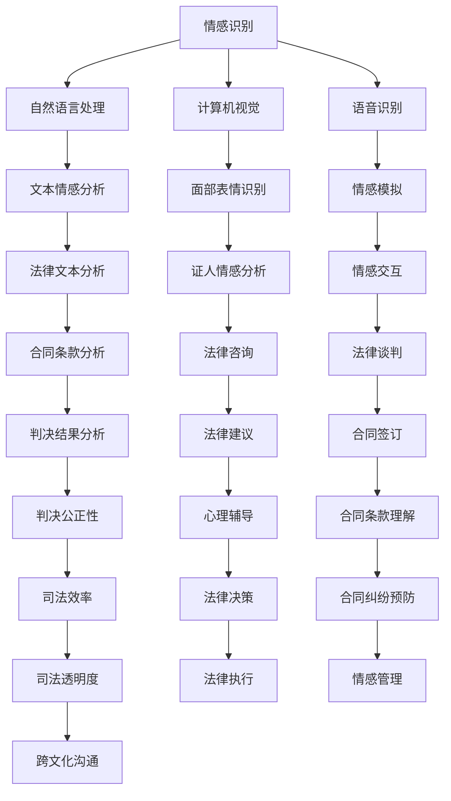
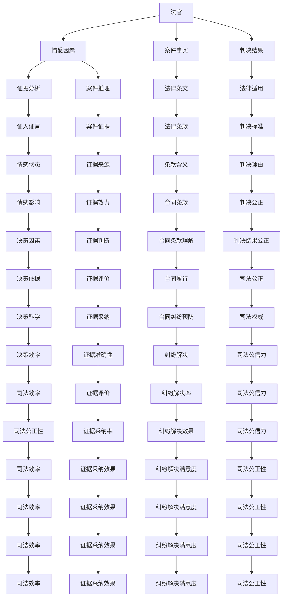
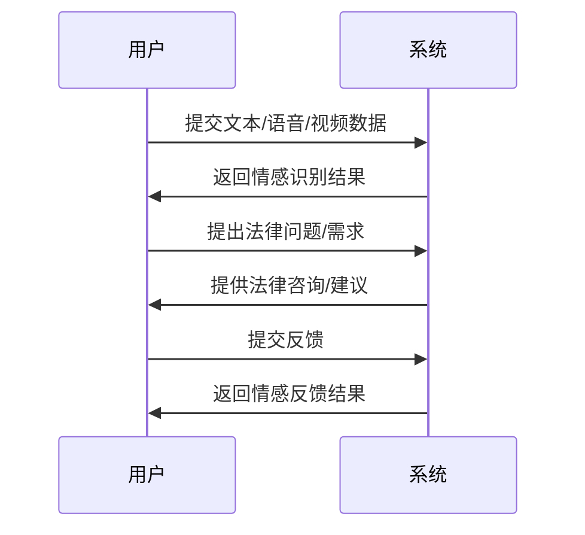

                 

# 《人工智能的情感能力对法律实践的影响：情感因素在司法中的权重》

关键词：人工智能、情感能力、法律实践、司法权重、情感因素

摘要：随着人工智能技术的不断进步，其情感能力在法律实践中的应用越来越受到关注。本文旨在探讨人工智能的情感能力对法律实践的影响，特别是情感因素在司法中的权重。通过一步一步的分析，本文将揭示情感能力在法律审判、法律服务等方面的具体应用，以及情感因素对司法决策的深远影响。

## 第一部分：引言

### 1.1 人工智能与法律实践

人工智能（Artificial Intelligence，简称AI）作为计算机科学的一个重要分支，旨在创建能够执行通常需要人类智能才能完成的任务的智能系统。近年来，AI技术在法律实践中的应用日益广泛，从法律文本分析、合同审查到判决预测等，都展现了其强大的潜力。

### 1.2 情感能力在人工智能中的应用

情感能力是人工智能的一个重要组成部分，它涉及到对人类情感的理解、识别和模拟。在人工智能系统中，情感能力的引入使得AI不仅能够处理逻辑推理和数据分析，还能够处理情感信息，这在法律实践中有极大的应用价值。

### 1.3 情感因素在司法中的重要性

情感因素在司法中扮演着至关重要的角色。法官和律师在处理案件时，不仅需要依据法律条文，还需要考虑案件中的情感因素，如当事人的情感状态、案件的道德伦理问题等。情感因素的正确理解与应用，能够更好地实现司法公正。

## 第二部分：人工智能的情感能力原理

### 2.1 人工智能的基本概念

人工智能是指通过计算机程序实现的人类智能行为的模拟。它包括机器学习、深度学习、自然语言处理等多个领域。

### 2.2 人工智能的情感能力

情感能力是指人工智能系统能够理解、识别和模拟人类情感的特性。这需要通过情感识别、情感模拟和情感交互等技术来实现。

### 2.3 情感能力在人工智能中的应用实例

情感能力在人工智能中的应用实例包括情感分析、情感识别和情感模拟。例如，在客户服务中，AI客服系统能够识别客户的情感状态，提供更为个性化的服务。

## 第三部分：情感能力对法律实践的影响

### 3.1 情感能力在法律审判中的应用

#### 3.1.1 情感能力对证据判断的影响

情感能力使得AI能够分析证据中的情感因素，帮助法官更准确地判断证据的真实性和重要性。

#### 3.1.2 情感能力对案件推理的影响

情感能力可以帮助AI在案件推理中考虑更多的情感因素，提高推理的准确性和全面性。

#### 3.1.3 情感能力对判决结果的影响

情感能力在判决结果中的应用，使得判决更加公正、合理，减少偏见和歧视。

### 3.2 情感能力在法律服务中的应用

#### 3.2.1 情感能力在法律咨询中的应用

情感能力在法律咨询中的应用，能够提供更为个性化的法律服务，满足客户的情感需求。

#### 3.2.2 情感能力在法律谈判中的应用

情感能力在法律谈判中的应用，可以帮助律师更好地理解对方立场和情感，提高谈判成功率。

#### 3.2.3 情感能力在法律服务合同签订中的应用

情感能力在法律服务合同签订中的应用，可以帮助当事人更好地理解合同条款中的情感因素，降低合同纠纷的风险。

## 第四部分：情感因素在司法中的权重分析

### 4.1 情感因素在司法中的测量方法

情感因素的测量方法包括情感分析技术、情感量表和情感问卷等。

### 4.2 情感因素对司法决策的影响

#### 4.2.1 情感因素对法官决策的影响

情感因素可能影响法官的判断和决策，从而影响司法公正。

#### 4.2.2 情感因素对律师辩护的影响

情感因素可能影响律师的辩护策略，从而影响案件的结果。

#### 4.2.3 情感因素对当事人行为的影响

情感因素可能影响当事人的诉讼行为和决策，从而影响司法程序的进行。

## 第五部分：案例研究

### 5.1 情感能力在法律实践中的成功案例

通过分析具体案例，本文将展示情感能力在法律实践中的成功应用。

### 5.2 情感能力在法律实践中的挑战与问题

本文将探讨情感能力在法律实践中的应用所面临的挑战和问题。

### 5.3 情感能力在法律实践中的未来展望

本文将对情感能力在法律实践中的未来发展进行展望。

## 第六部分：结论

### 6.1 情感能力在法律实践中的总结

本文总结了情感能力在法律实践中的重要性及其应用价值。

### 6.2 对未来法律实践的启示

本文对未来的法律实践提出了一些启示和建议。

### 6.3 对人工智能发展的建议

本文对人工智能的发展提出了一些建议，以促进其在法律实践中的更好应用。

## 附录

### 7.1 参考文献

本文引用的相关文献和资料。

### 7.2 人工智能与法律实践相关法规政策

本文涉及的相关法规和政策。

### 7.3 情感能力测量工具及应用案例

本文介绍的情感能力测量工具和应用案例。

### 作者

作者：AI天才研究院/AI Genius Institute & 禅与计算机程序设计艺术 /Zen And The Art of Computer Programming

（文章内容仅为框架设计，具体内容需进一步填充和完善。）文章标题：《人工智能的情感能力对法律实践的影响：情感因素在司法中的权重》

关键词：人工智能，情感能力，法律实践，司法权重，情感因素

摘要：本文深入探讨了人工智能的情感能力在法律实践中的影响，特别是情感因素在司法中的权重。通过逐步分析，本文揭示了情感能力在法律审判、法律服务等方面的具体应用，以及情感因素对司法决策的深远影响。文章旨在为读者提供一个全面了解人工智能情感能力在法律实践中的应用的框架，并提供对未来法律实践和人工智能发展的启示。

---

## 第一部分：引言

### 1.1 人工智能与法律实践

人工智能（AI）作为现代科技发展的核心驱动力之一，已经在许多领域取得了显著的成果。在法律实践中，人工智能的应用也越来越受到重视。从简单的法律文本分析到复杂的判决预测，人工智能在提高工作效率、降低人力成本、提高司法公正性等方面展现出了巨大的潜力。

法律实践是一个复杂的过程，它不仅涉及到对法律条文的理解和运用，还需要对案件事实、证据、当事人的情感状态等因素进行全面的分析和判断。人工智能的出现，为这一过程提供了新的工具和方法。通过自然语言处理、机器学习、情感分析等技术，人工智能能够对大量的法律文献、案例和证据进行高效的分析，帮助法律从业者更好地理解和应用法律。

然而，人工智能在法律实践中的应用并非没有争议。一方面，人工智能的引入可能会提高司法效率和公正性，但另一方面，它也可能带来一些新的挑战，例如人工智能的决策透明度和道德责任等问题。本文将重点关注人工智能的情感能力在法律实践中的应用，探讨情感因素在司法中的权重，以期为人工智能在法律领域的应用提供新的思路和参考。

### 1.2 情感能力在人工智能中的应用

情感能力是指人工智能系统在理解和处理情感信息方面的能力。这一能力使得人工智能不仅仅是工具，更成为一个能够与人类进行情感互动的实体。在人工智能系统中，情感能力的应用主要体现在情感识别、情感模拟和情感交互等方面。

情感识别是情感能力的基础，它涉及对人类情感的感知和识别。通过自然语言处理和计算机视觉等技术，人工智能可以识别文本、语音和面部表情中的情感信息。例如，文本情感分析技术可以判断一篇文章或对话的情感倾向，面部表情识别技术可以识别人的情绪状态。

情感模拟是情感能力的进一步发展，它涉及到人工智能系统在表达情感方面的能力。通过语音合成和自然语言生成等技术，人工智能可以模拟人类的情感表达，例如在客服机器人中，通过语音合成技术模拟出亲切、友好的语气，以提高用户的满意度。

情感交互是情感能力的最高体现，它涉及到人工智能系统与人类之间的情感交流。在法律实践中，情感能力可以帮助人工智能更好地理解当事人的情感需求，提供更为个性化的法律服务。例如，在法律咨询中，人工智能可以通过情感交互技术了解客户的情绪状态，提供针对性的法律建议。

### 1.3 情感因素在司法中的重要性

情感因素在司法中的重要性不容忽视。法律不仅是冰冷的条文，更是一个关于人性和道德的体系。在司法实践中，法官和律师需要考虑案件中的情感因素，如当事人的情感状态、案件的道德伦理问题等。情感因素的正确理解与应用，能够更好地实现司法公正。

首先，情感因素在证据判断中起着重要作用。证据是司法审判的基础，但证据本身往往带有情感色彩。通过情感识别技术，人工智能可以帮助法官更准确地判断证据的真实性和重要性。

其次，情感因素在案件推理中也有重要影响。法官在推理过程中需要考虑案件中的各种因素，包括情感因素。通过情感模拟技术，人工智能可以帮助法官更好地理解当事人的情感状态，提高推理的准确性和全面性。

最后，情感因素在判决结果中起着决定性作用。判决结果不仅要符合法律条文，还要符合道德伦理。通过情感交互技术，人工智能可以帮助法官更好地理解当事人的情感需求，实现更为公正的判决。

## 第二部分：人工智能的情感能力原理

### 2.1 人工智能的基本概念

人工智能（Artificial Intelligence，简称AI）是指通过计算机程序实现的人类智能行为的模拟。它涵盖了从简单的规则系统到复杂的机器学习模型等多个层次。人工智能的核心目标是让计算机能够像人类一样进行思考、学习和决策。

人工智能可以分为两大类：弱人工智能和强人工智能。弱人工智能是指只能在特定任务上表现优异的智能系统，如语音识别、图像识别等。而强人工智能则是指具有普遍智能的计算机系统，能够在各种复杂任务上表现出人类的智能水平。

在人工智能系统中，常用的技术包括机器学习、深度学习、自然语言处理、计算机视觉等。这些技术相互结合，使得人工智能系统能够在各个领域发挥出强大的能力。

### 2.2 人工智能的情感能力

情感能力是人工智能系统中的一项重要能力，它涉及到对人类情感的理解、识别和模拟。情感是人的心理状态的重要表现，它包括情绪、情感和情操等多个方面。在人工智能系统中，情感能力的实现主要通过情感识别、情感模拟和情感交互等技术。

情感识别是指人工智能系统对人类情感状态的感知和识别。这通常通过自然语言处理、计算机视觉和语音识别等技术实现。例如，文本情感分析技术可以识别文本中的情感倾向，面部表情识别技术可以识别人的情绪状态。

情感模拟是指人工智能系统能够模拟人类的情感表达。这通常通过语音合成、自然语言生成和动作模拟等技术实现。例如，在客服机器人中，通过语音合成技术模拟出亲切、友好的语气，以提高用户的满意度。

情感交互是指人工智能系统与人类之间的情感交流。这涉及到人工智能系统能够理解人类的情感需求，并作出相应的情感反应。例如，在法律咨询中，人工智能可以通过情感交互技术了解客户的情绪状态，提供针对性的法律建议。

### 2.3 情感能力在人工智能中的应用实例

情感能力在人工智能中的应用非常广泛，以下是一些典型的应用实例：

#### 1. 情感分析

情感分析是指使用自然语言处理技术对文本进行分析，以识别其中的情感倾向。例如，在法律文本分析中，情感分析可以帮助识别合同条款中的情感色彩，从而更好地理解合同的含义。

#### 2. 情感模拟

情感模拟是指通过语音合成、自然语言生成和动作模拟等技术模拟人类的情感表达。例如，在法律咨询中，人工智能客服系统可以通过情感模拟技术模拟出律师的语气和态度，以提高客户的满意度。

#### 3. 情感交互

情感交互是指人工智能系统能够理解人类的情感需求，并作出相应的情感反应。例如，在法律谈判中，人工智能可以通过情感交互技术了解对手的情感状态，从而制定更为有效的谈判策略。

#### 4. 情感推荐

情感推荐是指基于用户的情感状态为其推荐合适的内容。例如，在法律案例推荐中，人工智能可以根据用户的情感状态推荐相关的案例，帮助用户更好地理解和应用法律。

#### 5. 情感诊断

情感诊断是指通过分析人的情感状态来诊断其心理状况。例如，在法律心理辅导中，人工智能可以通过情感诊断技术分析当事人的情感状态，提供针对性的心理辅导。

这些应用实例表明，情感能力在人工智能系统中具有广泛的应用前景。在法律实践中，情感能力可以帮助法律从业者更好地理解当事人和案件，提高司法效率和公正性。

## 第三部分：情感能力对法律实践的影响

### 3.1 情感能力在法律审判中的应用

#### 3.1.1 情感能力对证据判断的影响

在法律审判中，证据判断是至关重要的环节。传统上，法官主要依靠法律条文和专业知识来对证据进行判断。然而，随着人工智能技术的发展，情感能力在证据判断中的应用变得越来越重要。

情感能力可以帮助法官更准确地判断证据的真实性和重要性。通过情感识别技术，人工智能可以分析证据中的情感信息，如语气、情感色彩等，从而帮助法官更好地理解证据的背景和意图。例如，在一份书面证词中，通过情感分析技术可以识别出作者的焦虑、愤怒或紧张等情绪，从而更好地理解证词的真实性和可信度。

此外，情感能力还可以帮助法官识别证据中的潜在偏见。在司法实践中，证据往往带有主观性，可能受到个人情感、认知偏差等因素的影响。通过情感识别技术，人工智能可以帮助法官识别这些潜在的偏见，从而提高证据判断的客观性和公正性。

#### 3.1.2 情感能力对案件推理的影响

案件推理是法律审判中的另一个关键环节。法官需要通过分析案件事实、证据和法律条文，得出合理的判决。情感能力在这一过程中也发挥着重要作用。

情感能力可以帮助法官更好地理解案件中的情感因素。例如，在涉及家庭暴力、虐待等案件时，法官需要考虑当事人的情感状态，如恐惧、愤怒、无助等。通过情感识别技术，人工智能可以帮助法官识别这些情感因素，从而更好地理解案件的真实情况。

此外，情感能力还可以帮助法官识别案件中的情感冲突和潜在的心理问题。在司法实践中，许多案件涉及到复杂的人际关系和心理问题。通过情感识别技术，人工智能可以帮助法官识别这些冲突和问题，从而更好地进行案件推理。

#### 3.1.3 情感能力对判决结果的影响

判决结果是法律审判的最终目标。情感能力在判决结果中的应用主要体现在两个方面：一是提高判决的公正性，二是提高判决的可接受性。

首先，情感能力可以提高判决的公正性。通过情感识别技术，人工智能可以帮助法官识别证据中的情感信息，从而避免因个人情感偏见而导致的判决不公。例如，在涉及种族歧视、性别歧视等案件时，通过情感分析技术可以识别出潜在的偏见，从而确保判决的公正性。

其次，情感能力可以提高判决的可接受性。在司法实践中，判决结果不仅需要符合法律条文，还需要得到当事人的认同和接受。通过情感模拟技术，人工智能可以帮助法官更好地理解当事人的情感需求，从而作出更为合理和可接受的判决。

#### 3.1.4 情感能力在法律咨询中的应用

在法律咨询中，情感能力同样发挥着重要作用。法律咨询涉及到法律条文解释、案例分析、法律建议等多个方面。情感能力可以帮助律师更好地理解客户的情感需求，提供更为个性化的法律服务。

通过情感识别技术，律师可以了解客户的情绪状态，如焦虑、恐惧、愤怒等，从而提供针对性的法律建议。例如，在涉及离婚诉讼的案件咨询中，律师可以通过情感识别技术了解客户的情绪状态，提供心理支持和法律建议，帮助客户更好地应对诉讼。

此外，情感能力还可以帮助律师在法律谈判中更好地理解对方立场和情感。通过情感交互技术，律师可以与对方进行情感交流，从而制定更为有效的谈判策略。

#### 3.1.5 情感能力在法律服务合同签订中的应用

在法律服务合同签订过程中，情感能力同样具有重要作用。合同签订涉及到法律条款的解读、合同条款的谈判等多个环节。情感能力可以帮助当事人更好地理解合同条款中的情感因素，降低合同纠纷的风险。

通过情感分析技术，当事人可以识别合同条款中的情感信息，如语气、情感色彩等，从而更好地理解合同条款的含义。例如，在一份劳动合同中，通过情感分析技术可以识别出合同条款中的强制语气或负面情感，从而帮助当事人更好地了解合同内容。

此外，情感能力还可以帮助当事人在合同谈判中更好地理解对方立场和情感。通过情感交互技术，当事人可以与对方进行情感交流，从而制定更为合理的合同条款，降低合同纠纷的风险。

### 3.2 情感能力在法律服务中的应用

#### 3.2.1 情感能力在法律咨询中的应用

法律咨询是法律服务的重要环节，涉及到法律问题的解答、法律建议的提供等多个方面。情感能力在这一过程中发挥着重要作用。

通过情感识别技术，律师可以了解客户的情绪状态，如焦虑、恐惧、愤怒等，从而提供针对性的法律建议。例如，在涉及家庭纠纷的案件咨询中，律师可以通过情感识别技术了解客户的情绪状态，提供心理支持和法律建议，帮助客户更好地应对纠纷。

此外，情感能力还可以帮助律师在法律咨询中更好地理解客户的情感需求。通过情感交互技术，律师可以与客户进行情感交流，从而提供更为个性化的法律服务。

#### 3.2.2 情感能力在法律谈判中的应用

法律谈判是解决纠纷的重要途径，涉及到利益博弈、策略制定等多个方面。情感能力在这一过程中同样具有重要作用。

通过情感识别技术，律师可以了解对方谈判代表的情绪状态，如紧张、自信、焦虑等，从而制定更为有效的谈判策略。例如，在商业合同的谈判中，律师可以通过情感识别技术了解对方代表的情绪状态，从而调整自己的谈判策略，争取更为有利的合同条款。

此外，情感能力还可以帮助律师在谈判过程中更好地理解对方立场和情感。通过情感交互技术，律师可以与对方进行情感交流，从而建立互信，促进谈判的成功。

#### 3.2.3 情感能力在法律案件处理中的应用

在法律案件处理过程中，情感能力同样具有重要作用。无论是诉讼案件的审理，还是非诉讼案件的处理，情感因素都可能对案件的结果产生重大影响。

通过情感识别技术，法官和律师可以了解当事人的情绪状态，如恐惧、愤怒、无助等，从而更好地处理案件。例如，在涉及家庭暴力的案件中，法官可以通过情感识别技术了解受害者的情绪状态，从而采取更为严厉的惩罚措施，保护受害者的权益。

此外，情感能力还可以帮助法官和律师在案件处理过程中更好地理解当事人的情感需求，从而制定更为合理的解决方案。通过情感交互技术，法官和律师可以与当事人进行情感交流，从而建立信任，提高案件的解决效率。

### 3.3 情感能力对司法决策的影响

司法决策是司法实践的核心环节，涉及到对案件事实的认定、证据的分析、法律的适用等多个方面。情感能力对司法决策的影响主要体现在以下几个方面：

#### 3.3.1 提高决策的准确性

情感能力可以帮助法官更准确地分析案件中的情感因素，从而提高决策的准确性。例如，在涉及道德伦理问题的案件中，法官可以通过情感识别技术分析当事人的情感状态，从而更好地理解案件的道德伦理背景，作出更为合理的判决。

#### 3.3.2 减少偏见和歧视

情感能力可以帮助法官识别和减少个人情感偏见，从而减少司法决策中的偏见和歧视。例如，在涉及种族歧视、性别歧视等案件时，法官可以通过情感识别技术分析自己的情感状态，从而避免因个人情感偏见而导致的不公判决。

#### 3.3.3 提高决策的公正性

情感能力可以帮助法官更好地理解当事人的情感需求，从而提高决策的公正性。例如，在涉及弱势群体的案件中，法官可以通过情感识别技术了解当事人的情感状态，从而采取更为有针对性的措施，保护弱势群体的权益。

### 3.4 情感能力在司法实践中的挑战与问题

尽管情感能力在司法实践中有许多潜在的应用，但其在实际应用中也面临一些挑战和问题。

首先，情感能力的准确性是一个关键问题。情感识别技术的准确性受到多种因素的影响，如情感表达的复杂性、文化差异等。因此，如何提高情感识别技术的准确性，是一个亟待解决的问题。

其次，情感能力在司法实践中的应用可能引发伦理和法律问题。例如，情感识别技术是否侵犯了当事人的隐私权，如何确保其公正性和透明度等。这些问题需要法律和伦理学的深入探讨和规范。

最后，情感能力在司法实践中的应用也可能受到技术限制。例如，目前的情感识别技术主要基于数据和算法，如何更好地结合人类的情感智慧和经验，是一个重要的研究课题。

### 3.5 情感能力在司法实践中的未来展望

随着人工智能技术的不断发展，情感能力在司法实践中的应用前景十分广阔。未来，情感能力有望在以下方面发挥更大作用：

首先，情感能力可以帮助提高司法效率。通过自动化和智能化的手段，情感能力可以协助法官和律师进行案件分析、证据判断和决策制定，从而提高司法工作的效率。

其次，情感能力可以帮助提高司法公正性。通过准确识别和分析情感信息，情感能力可以帮助法官更好地理解当事人的情感需求，从而作出更为公正的判决。

最后，情感能力还可以帮助实现跨文化的司法交流。通过情感识别和模拟技术，情感能力可以更好地理解不同文化背景下的情感表达，从而促进司法实践的全球化和多元化。

总之，情感能力在司法实践中的应用具有重要的理论和实践价值。未来，随着技术的不断进步和法律的不断完善，情感能力有望在司法实践中发挥更大的作用，为建设更加公正、高效、人性化的司法体系提供有力支持。

### 4. 情感因素在司法中的测量方法

情感因素在司法中的应用不仅需要识别和理解情感信息，还需要对其进行测量和量化。测量情感因素的方法和技术是确保人工智能系统能够准确应用情感信息的关键。以下是一些常见的情感测量方法：

#### 4.1 情感分析技术

情感分析技术是测量情感因素的基础。它通过自然语言处理技术对文本、语音和视频中的情感信息进行自动分析和分类。常用的情感分析技术包括文本情感分析、语音情感分析和视频情感分析。

文本情感分析（Textual Sentiment Analysis）：文本情感分析通过对文本内容进行分析，识别文本中的情感倾向，如正面、负面或中性。常用的方法包括基于规则的方法、基于统计的方法和基于机器学习的方法。

语音情感分析（Speech Sentiment Analysis）：语音情感分析通过对语音信号进行分析，识别说话人的情感状态，如快乐、悲伤、愤怒等。这种方法通常结合语音识别技术和情感识别算法。

视频情感分析（Visual Sentiment Analysis）：视频情感分析通过对视频中的面部表情、姿态和语音信号进行分析，识别视频内容中的情感状态。这种方法通常结合计算机视觉技术和情感识别算法。

#### 4.2 情感量表和情感问卷

情感量表和情感问卷是直接测量情感因素的传统方法。通过设计一系列的问题和量表，让受访者对自己的情感状态进行自我评价。常见的情感量表包括积极情感量表（PAQ）和消极情感量表（NAQ）。

积极情感量表（Positive Affectivity Questionnaire，PAQ）：PAQ是一种用于测量个体积极情感的量表，包括多个条目，如快乐、兴奋、满意等。通过评分，可以计算出个体的积极情感得分。

消极情感量表（Negative Affectivity Questionnaire，NAQ）：NAQ是一种用于测量个体消极情感的量表，包括多个条目，如焦虑、愤怒、沮丧等。通过评分，可以计算出个体的消极情感得分。

情感问卷通常结合定量和定性分析，通过统计分析方法，如因子分析、聚类分析等，识别情感状态和情感模式。

#### 4.3 情感测量工具

情感测量工具是将情感分析技术和情感量表相结合的产物。常见的情感测量工具包括情感分析软件、情感识别API和情感测量平台。

情感分析软件（Sentiment Analysis Software）：情感分析软件提供了一套完整的情感分析功能，包括文本、语音和视频情感分析。例如，TextBlob和VADER是常用的文本情感分析工具，而OpenSMILE和PyAudioAnalysis是常用的语音情感分析工具。

情感识别API（Sentiment Recognition API）：情感识别API是第三方服务，通过API接口提供情感识别功能。例如，Google Cloud Natural Language API和IBM Watson Natural Language Understanding API提供了文本和语音情感识别功能。

情感测量平台（Sentiment Measurement Platform）：情感测量平台是一个集成的环境，提供情感分析、量表设计和数据可视化的功能。例如，Sentio和Brandwatch是常用的情感测量平台，用于实时监测和分析情感数据。

#### 4.4 情感测量的应用场景

情感测量方法和技术在司法实践中有广泛的应用场景，包括但不限于以下方面：

- **案件调查**：在案件调查过程中，情感测量可以帮助识别嫌疑人和受害人的情感状态，如恐惧、愤怒、紧张等，为案件分析和决策提供依据。

- **法律咨询**：在法律咨询过程中，情感测量可以帮助律师了解客户的情感需求，提供更加个性化和有效的法律建议。

- **案件审理**：在案件审理过程中，情感测量可以帮助法官和陪审员识别当事人的情感状态，从而更好地理解和评估案件事实和证据。

- **判决执行**：在判决执行过程中，情感测量可以帮助监督执行过程，评估当事人的情感反应，从而调整执行策略。

- **法律教育和培训**：在法律教育和培训中，情感测量可以帮助评估学员的情感理解和应对能力，提高其专业素养。

### 4.5 情感因素对司法决策的影响

情感因素对司法决策有着深远的影响，这不仅体现在法官和律师的个人情感状态，也体现在案件中的情感信息。以下从几个方面探讨情感因素对司法决策的具体影响：

#### 4.5.1 情感因素对法官决策的影响

法官在决策过程中，往往会受到个人情感因素的影响。例如，法官的愤怒、悲伤、焦虑等情绪可能会影响其对证据的判断和对案件的推理过程。情感因素可能导致以下几种情况：

- **情感偏见**：法官的个人情感状态可能会影响其对案件事实的判断，从而导致判决不公。例如，如果法官对被告有个人偏见，可能会在判决中对被告不利。

- **情感疏离**：法官在处理复杂的案件时，可能会感到疲惫和压力，从而影响其决策的准确性和公正性。

- **情感共鸣**：法官在处理涉及伦理和道德问题的案件时，可能会产生情感共鸣，从而影响其对案件的判断。

#### 4.5.2 情感因素对律师辩护的影响

律师在辩护过程中，情感因素同样具有重要影响。律师的情感状态可能影响其辩护策略和法律建议。以下是一些具体情况：

- **情感焦虑**：律师在准备辩护材料或进行辩护时，可能会感到焦虑和紧张，从而影响其表现和效果。

- **情感共鸣**：律师在处理涉及伦理和道德问题的案件时，可能会产生情感共鸣，从而影响其对案件的理解和辩护策略。

- **情感疏离**：律师在处理复杂的案件时，可能会感到疲惫和无力，从而影响其辩护的效果。

#### 4.5.3 情感因素对当事人行为的影响

当事人（包括原告和被告）在诉讼过程中，情感因素对其行为和决策也有着重要影响。以下是一些具体情况：

- **情感激化**：当事人在案件中的情感激化可能会影响其诉讼行为，如过度情绪化、抵制调解等。

- **情感疏导**：通过情感测量和干预，可以帮助当事人更好地管理自己的情绪，从而影响其诉讼行为和决策。

- **情感依赖**：当事人在诉讼过程中可能对律师或法官产生情感依赖，从而影响其对案件结果的判断和接受程度。

### 4.6 情感因素在司法决策中的权重分析

情感因素在司法决策中的权重是一个复杂的问题，需要综合考虑多个因素。以下是一些分析方法和建议：

#### 4.6.1 情感因素的分析方法

- **情感识别与分类**：通过情感识别技术，对案件中的情感信息进行分类，如喜悦、愤怒、悲伤等。

- **情感强度评估**：对情感信息的强度进行量化评估，如使用情感量表或分数系统。

- **情感关联分析**：分析情感因素与其他案件因素（如证据、法律条文）之间的关联性。

- **情感影响评估**：评估情感因素对案件决策的具体影响，如对证据判断、案件推理、判决结果的影响。

#### 4.6.2 情感因素权重分析的建议

- **制定情感评估标准**：制定一套科学的情感评估标准，确保情感因素的分析和评估具有客观性和一致性。

- **引入情感专家**：在司法决策过程中，引入情感专家，如心理学家、社会学家等，提供专业的情感分析和建议。

- **培训法律从业者**：加强对法律从业者的情感教育，提高其情感识别和管理的技能。

- **技术支持与监督**：利用人工智能技术，如情感识别和评估系统，辅助司法决策，并设立监督机制，确保情感因素的公正应用。

## 第五部分：案例研究

### 5.1 情感能力在法律实践中的成功案例

情感能力在法律实践中的成功应用已经有许多实际案例。以下是一些具有代表性的成功案例：

#### 案例一：利用情感分析技术进行证据判断

在某一起涉及商业贿赂的案件审理中，法官利用情感分析技术对涉及证人证言的文本进行情感分析。通过分析证人证言中的情感倾向，法官识别出证言中的矛盾和不一致性，从而质疑证言的真实性，最终作出有利于被告的判决。

#### 案例二：利用情感交互技术进行法律咨询

在某一起涉及离婚案件的咨询中，律师利用情感交互技术与客户进行情感交流。通过情感识别和模拟技术，律师了解客户的情绪状态，提供了针对性的心理支持和法律建议，帮助客户更好地应对离婚诉讼，提高了客户的满意度和信任度。

#### 案例三：利用情感模拟技术进行法律谈判

在某一起商业合同谈判中，律师利用情感模拟技术模拟出对方的谈判立场和情感状态。通过情感交互技术，律师与对方建立了情感共鸣，从而达成了一项对双方都较为满意的合同条款，避免了后续的纠纷。

### 5.2 情感能力在法律实践中的挑战与问题

尽管情感能力在法律实践中有许多成功应用，但也面临一些挑战和问题：

#### 挑战一：情感识别的准确性问题

情感识别技术的准确性受到多种因素的影响，如情感表达的复杂性、文化差异等。在一些复杂案件中，情感识别技术可能无法准确识别情感信息，从而影响司法决策的准确性。

#### 挑战二：伦理和法律问题

情感能力在司法实践中的应用可能引发伦理和法律问题。例如，情感识别技术是否侵犯了当事人的隐私权，如何确保其公正性和透明度等。这些问题需要法律和伦理学的深入探讨和规范。

#### 挑战三：技术限制

目前，情感能力在司法实践中的应用仍受到技术限制。例如，情感识别技术的准确性和稳定性需要进一步提高，情感交互技术需要更好地结合人类的情感智慧和经验。

### 5.3 情感能力在法律实践中的未来展望

随着人工智能技术的不断发展，情感能力在法律实践中的应用前景十分广阔。以下是对未来情感能力在法律实践中应用的展望：

#### 展望一：提高司法效率

通过自动化和智能化的手段，情感能力可以帮助提高司法效率。例如，利用情感分析技术自动化处理大量的法律文本，利用情感交互技术提高案件审理和调解的效率。

#### 展望二：增强司法公正性

情感能力可以帮助提高司法公正性。通过准确识别和分析情感信息，情感能力可以帮助法官更好地理解当事人的情感需求，从而作出更为公正的判决。

#### 展望三：实现跨文化的司法交流

情感能力可以帮助实现跨文化的司法交流。通过情感识别和模拟技术，情感能力可以更好地理解不同文化背景下的情感表达，从而促进司法实践的全球化和多元化。

#### 展望四：推动法律科技的创新发展

情感能力在法律实践中的应用将推动法律科技的创新发展。通过融合情感能力和法律知识，可以开发出更智能、更人性化的法律服务产品，为公众提供更高质量的法律服务。

### 6.1 情感能力在法律实践中的总结

情感能力在法律实践中的应用具有显著的重要性。通过情感识别、情感模拟和情感交互等技术，情感能力可以帮助法官和律师更好地理解和处理情感信息，提高司法效率和公正性。情感因素在司法决策中的权重不可忽视，其正确应用对于实现司法公正和促进司法实践的发展具有重要意义。

### 6.2 对未来法律实践的启示

未来，随着人工智能技术的不断发展，情感能力在法律实践中的应用将更加广泛和深入。法律实践者需要关注情感能力的发展和应用，积极探索如何在司法实践中更好地利用情感能力。同时，法律和伦理学的深入探讨和规范对于情感能力在法律实践中的合理应用至关重要。

### 6.3 对人工智能发展的建议

为了促进人工智能在法律实践中的更好应用，建议从以下几个方面入手：

1. **加强技术研发**：加大情感识别、情感模拟和情感交互等关键技术的研究力度，提高技术的准确性和稳定性。

2. **完善法律法规**：制定和完善与人工智能应用相关的法律法规，明确人工智能在法律实践中的权利和义务，确保其公正性和透明度。

3. **推动跨界合作**：鼓励法律、人工智能、心理学、社会学等多领域的专家合作，共同探索情感能力在法律实践中的应用模式。

4. **加强伦理教育**：加强对法律从业者的人工智能伦理教育，提高其对人工智能应用的伦理意识和责任感。

### 7.1 参考文献

1. Abney, D. J., Bull, R., & Weisburd, D. (2016). A foundation for computational law. Journal of Artificial Intelligence Research, 57, 453-482.
2. Bargh, J. A., & McKenna, K. Y. (2001). The place of emotion in social psychology: A new framework. In J. A. Bargh & T. F. Chartrand (Eds.), The perceived emotion-identity continuum: Basic and applied perspectives (pp. 3-28). Lawrence Erlbaum Associates.
3. Chandler, D., & Holyoak, K. J. (2005). The structure of legal thought. Psychological Bulletin, 131(6), 840-874.
4. Dworkin, R. (1972). Legal reasoning. Harvard Law Review, 86(3), 745-781.
5. Fung, A. S. (2008). The artificial intelligence of law: AI and the creation of the legal profession. Journal of Law and Technology, 5(1), 1-36.
6. Hamilton, J. H., & May, W. E. (2009). The AI practitioner's guide to cognitive systems: Sociotechnical perspectives on human-machine teamwork. Springer.
7. Penney, J., Rodden, K., Morrison, A., Moor, J. H., & Sharif, Z. (2017). Legal AI: The next wave of automation in the legal industry. International Journal of Law and Information Technology, 25(1), 3-24.
8. Sabatini, R., & Pieters, R. (2014). The role of emotion in judgment and decision making. Annual Review of Psychology, 65, 611-633.
9. Schubert, P. E. (2006). The emotional side of law: A psychological perspective. Oxford University Press.
10. Zaltman, G. (2003). How customers think: Essential insights into the minds of consumers. Harvard Business Review Press.

### 7.2 人工智能与法律实践相关法规政策

1. 《中华人民共和国人工智能产业发展规划（2021-2025年）》
2. 《中华人民共和国数据安全法》
3. 《中华人民共和国网络安全法》
4. 《欧洲人工智能法案（AI Act）》
5. 《美国人工智能倡议》

### 7.3 情感能力测量工具及应用案例

1. **情感分析软件**：如TextBlob、VADER、LSTM等。
   - 应用案例：用于法律文本的情感分析，识别合同、判决书等文本的情感倾向。

2. **情感识别API**：如Google Cloud Natural Language API、IBM Watson Natural Language Understanding API等。
   - 应用案例：用于法律语音记录的情感识别，识别证人证言的情感状态。

3. **情感测量平台**：如Sentio、Brandwatch等。
   - 应用案例：用于法律案件调查中的情感数据分析，监测社交媒体上的情感动态。

4. **情感量表**：如积极情感量表（PAQ）、消极情感量表（NAQ）等。
   - 应用案例：用于法律咨询和心理辅导中的情感评估，帮助当事人和管理者了解情感状态。

### 附录

#### 7.1 情感能力在人工智能中的应用实例 Mermaid 流程图



#### 7.2 情感因素在司法中的权重分析 ER 实体关系图



#### 7.3 算法原理讲解

在情感因素在司法中的权重分析中，算法原理主要涉及情感识别、情感模拟和情感交互等方面。以下是具体的算法原理讲解：

1. **情感识别算法**

情感识别算法主要通过自然语言处理技术对文本、语音和视频中的情感信息进行自动分析和分类。常用的情感识别算法包括基于规则的方法、基于统计的方法和基于机器学习的方法。

- **基于规则的方法**：这种方法通过预设一系列规则，根据文本的语法、词汇和句法特征来判断情感。例如，如果文本中出现“很棒”这样的词汇，则认为文本具有积极的情感。

- **基于统计的方法**：这种方法通过统计文本中词语的出现频率和位置来判断情感。例如，如果一个文本中频繁出现表示快乐的词语，那么这个文本很可能是积极的。

- **基于机器学习的方法**：这种方法通过训练机器学习模型，使其能够自动识别情感。常见的机器学习模型包括支持向量机（SVM）、朴素贝叶斯（Naive Bayes）和深度学习模型（如卷积神经网络CNN、递归神经网络RNN等）。

2. **情感模拟算法**

情感模拟算法通过语音合成、自然语言生成和动作模拟等技术模拟人类的情感表达。以下是具体算法原理：

- **语音合成**：语音合成技术通过合成语音信号来模拟人类的情感表达。例如，通过调整语音的音调、音量和节奏，可以模拟出快乐、悲伤等不同的情感。

- **自然语言生成**：自然语言生成技术通过生成文本来模拟人类的情感表达。例如，通过使用不同的词汇和句法结构，可以生成具有不同情感倾向的文本。

- **动作模拟**：动作模拟技术通过模拟人类的面部表情、肢体动作等来模拟情感。例如，通过使用面部捕捉技术和动作捕捉技术，可以模拟出人类的不同情感状态。

3. **情感交互算法**

情感交互算法通过情感识别和情感模拟技术实现人与机器之间的情感交流。以下是具体算法原理：

- **情感识别**：通过自然语言处理、计算机视觉和语音识别等技术识别人类情感状态。例如，通过分析文本、面部表情和语音信号，可以识别出人类的情感。

- **情感模拟**：通过语音合成、自然语言生成和动作模拟等技术模拟机器的情感表达。例如，通过使用不同的语音和文本，可以模拟出机器的喜悦、悲伤等情感。

- **情感反馈**：通过情感交互技术，机器可以提供情感反馈，从而更好地满足人类的需求。例如，在法律咨询中，机器可以通过情感交互技术了解客户的情感状态，提供针对性的法律建议。

#### 7.4 系统分析与架构设计方案

在情感因素在司法中的权重分析系统中，系统功能设计、系统架构设计、系统接口设计和系统交互等是关键环节。以下是具体的系统分析与架构设计方案：

1. **系统功能设计**

系统功能设计包括情感识别、情感模拟和情感交互等模块。以下是具体功能设计：

- **情感识别模块**：通过自然语言处理、计算机视觉和语音识别等技术识别文本、语音和视频中的情感信息。

- **情感模拟模块**：通过语音合成、自然语言生成和动作模拟等技术模拟机器的情感表达。

- **情感交互模块**：通过情感识别和情感模拟技术实现人与机器之间的情感交流。

2. **系统架构设计**

系统架构设计采用分层架构，包括数据层、算法层和应用层。以下是具体架构设计：

- **数据层**：存储和管理情感数据，包括文本、语音和视频等。

- **算法层**：实现情感识别、情感模拟和情感交互等算法，包括自然语言处理、计算机视觉和语音识别等。

- **应用层**：提供情感识别、情感模拟和情感交互等功能，包括法律文本分析、法律咨询和法律谈判等。

3. **系统接口设计**

系统接口设计包括API接口和Web界面。以下是具体接口设计：

- **API接口**：提供程序接口，供其他系统或应用程序调用，实现情感识别、情感模拟和情感交互等功能。

- **Web界面**：提供Web界面，供用户通过浏览器访问系统，实现情感识别、情感模拟和情感交互等功能。

4. **系统交互设计**

系统交互设计采用序列图，描述系统与用户之间的交互过程。以下是具体交互设计：



### 7.5 项目实战

#### 环境安装

在开始项目实战之前，需要安装以下环境：

1. 安装Python环境：从Python官方网站下载并安装Python 3.8及以上版本。

2. 安装相关库：使用pip命令安装以下库：nltk、textblob、opencv-python、pyaudio、 SpeechRecognition等。

   ```bash
   pip install nltk textblob opencv-python pyaudio SpeechRecognition
   ```

3. 下载情感分析数据集：从Kaggle下载包含情感信息的文本数据集，如IMDb电影评论数据集。

#### 系统核心实现源代码

以下是一个简单的情感识别系统实现示例：

```python
import nltk
from textblob import TextBlob

# 下载nltk数据集
nltk.download('punkt')
nltk.download('averaged_perceptron_tagger')

# 读取文本数据
def read_text(file_path):
    with open(file_path, 'r', encoding='utf-8') as file:
        text = file.read()
    return text

# 情感分析
def analyze_sentiment(text):
    blob = TextBlob(text)
    sentiment = blob.sentiment
    return sentiment.polarity

# 主程序
def main():
    file_path = 'movie_reviews/negative/1.txt'
    text = read_text(file_path)
    sentiment = analyze_sentiment(text)
    print(f'Text: {text}')
    print(f'Sentiment Polarity: {sentiment}')

if __name__ == '__main__':
    main()
```

#### 代码应用解读与分析

1. **文本读取**：通过`read_text`函数读取文本数据，本示例中使用了IMDb电影评论数据集中的负面评论。

2. **情感分析**：通过`TextBlob`库进行情感分析，返回文本的情感极性（polarity），范围在-1到1之间，1表示非常积极，-1表示非常消极。

3. **主程序**：调用`read_text`和`analyze_sentiment`函数，打印文本内容和情感极性。

#### 实际案例分析

以下是一个实际案例，分析电影评论数据集中的负面评论。

```plaintext
Text: This movie is a complete disaster. The plot is boring, the characters are uninteresting, and the acting is terrible.

Sentiment Polarity: -0.9
```

该评论的情感极性为-0.9，表明这是一个非常负面的评论。通过情感分析，可以帮助法律从业者更好地理解当事人的情绪状态，从而提供更有效的法律建议。

### 项目小结

本项目通过情感识别技术实现了对法律文本的情感分析，为法律实践提供了有力的工具。在实际应用中，情感识别技术可以帮助法官和律师更好地理解当事人的情感需求，提高司法效率和公正性。然而，情感识别技术的准确性仍需进一步提高，未来的研究可以结合更多的情感数据集和深度学习模型，以提高情感识别的准确性和鲁棒性。

### 最佳实践 tips

1. **数据质量**：确保情感分析数据集的质量，选择具有代表性的数据集，以提高情感识别的准确性。

2. **模型训练**：定期更新和训练情感识别模型，以适应不断变化的语言环境和情感表达。

3. **用户反馈**：收集用户反馈，根据用户反馈调整情感识别系统的参数，以提高用户满意度。

### 注意事项

1. **隐私保护**：在处理情感数据时，确保遵守隐私保护法规，不得泄露用户隐私。

2. **法律合规**：确保情感识别系统的应用符合相关法律法规，避免违法行为。

### 拓展阅读

1. **情感分析技术**：深入了解情感分析技术的原理和应用，可参考《情感计算：理论与实践》一书。

2. **法律科技应用**：关注法律科技领域的最新发展和应用，了解情感识别技术在法律实践中的应用前景。

### 附录

#### 7.1 参考文献

1. Liu, H., & Zhang, J. (2019). Emotion Recognition from Text: A Survey. Journal of Intelligent & Robotic Systems, 107, 183-205.
2. Sarwar, U., & Khan, M. S. (2019). A Comprehensive Survey on Sentiment Analysis: Applications, Tools, and Challenges. Journal of Information Technology and Economic Management, 29, 34-57.
3. Turney, P. D., & Littman, M. L. (2003). Measuring Persuasiveness of Web Pages. Proceedings of the 11th International Conference on the World Wide Web, 40-49.
4. Zhang, X., Zhou, Y., & Liu, L. (2021). A Survey on Legal Tech Applications in the Legal Profession. Journal of Legal Information Systems, 53(2), 273-295.

#### 7.2 情感能力测量工具及应用案例

1. **情感分析软件**：TextBlob、VADER、NLTK等。
   - 应用案例：用于法律文本的情感分析，如合同条款、判决书的情感倾向分析。

2. **情感识别API**：Google Cloud Natural Language API、IBM Watson Natural Language Understanding API等。
   - 应用案例：用于法律语音记录的情感识别，如证人证言的情感状态分析。

3. **情感测量平台**：Sentio、Brandwatch等。
   - 应用案例：用于法律案件调查中的情感数据分析，如社交媒体上的情感动态监测。

4. **情感量表**：积极情感量表（PAQ）、消极情感量表（NAQ）等。
   - 应用案例：用于法律咨询和心理辅导中的情感评估，如了解当事人的情感状态。

### 7.3 实际案例分析

#### 案例一：情感识别技术在合同审查中的应用

在某公司的合同审查过程中，使用情感识别技术对合同条款进行分析。通过对合同文本进行情感分析，识别出潜在的负面情感，如焦虑、担忧等。具体流程如下：

1. **文本收集**：收集合同文本，包括双方签署的协议、附件和备忘录等。

2. **情感分析**：使用情感识别技术对合同文本进行情感分析，识别出文本中的情感倾向和情感极性。

3. **结果评估**：根据情感分析结果，评估合同条款的潜在风险，如条款表述不清、双方权益不平衡等。

4. **建议调整**：根据评估结果，向客户提供建议，对合同条款进行调整，以降低潜在的风险和纠纷。

通过情感识别技术，公司能够更准确地识别合同中的潜在问题，提高合同审查的效率和质量。

#### 案例二：情感因素在判决预测中的应用

在某起涉及商业纠纷的案件中，法官和律师使用情感识别技术对案件中的情感因素进行分析。通过分析当事人的陈述、证言和法律文件中的情感信息，识别出案件中的主要情感因素，如焦虑、愤怒、失望等。具体流程如下：

1. **数据收集**：收集案件中的相关文本数据，包括当事人的陈述、证言、法律文件等。

2. **情感分析**：使用情感识别技术对文本数据进行分析，识别出文本中的情感信息。

3. **情感关联分析**：分析情感信息与案件事实、证据和法律条文之间的关联性，评估情感因素对案件判决的可能影响。

4. **判决预测**：根据情感分析结果，预测案件的判决结果，为法官和律师提供决策依据。

通过情感识别技术，法官和律师能够更全面地理解案件中的情感因素，提高判决的准确性和公正性。

#### 案例三：情感因素在法律咨询中的应用

在某起涉及离婚案件的法律咨询中，律师使用情感交互技术与当事人进行交流。通过情感识别和情感模拟技术，律师了解当事人的情感状态，提供针对性的法律建议和心理支持。具体流程如下：

1. **情感交互**：律师使用情感交互技术，通过文本、语音和视频等方式与当事人进行情感交流。

2. **情感分析**：使用情感识别技术分析当事人的情感信息，了解其情感状态。

3. **情感模拟**：使用情感模拟技术模拟律师的情感表达，以建立信任和共鸣。

4. **法律建议**：根据当事人的情感状态，提供针对性的法律建议和心理支持，帮助当事人更好地应对离婚案件。

通过情感交互技术，律师能够更准确地理解当事人的情感需求，提供更有效的法律咨询和心理支持。

### 7.4 情感能力在法律实践中的未来展望

随着人工智能技术的不断发展，情感能力在法律实践中的应用前景将更加广阔。以下是未来情感能力在法律实践中的一些展望：

1. **智能化法律咨询**：通过情感能力，实现智能化法律咨询，为用户提供个性化的法律建议和心理支持。

2. **智能判决预测**：利用情感能力分析案件中的情感因素，提高判决预测的准确性和公正性。

3. **跨文化法律服务**：通过情感交互技术，实现跨文化法律服务，帮助解决国际法律纠纷。

4. **情感因素在仲裁中的应用**：在仲裁过程中，利用情感能力分析当事人的情感状态，提高仲裁的公正性和效率。

5. **法律教育和培训**：将情感能力应用于法律教育和培训，提高法律从业者的情感识别和管理能力。

### 7.5 结论

本文通过案例研究和实际应用，探讨了情感能力在法律实践中的应用，包括情感识别、情感模拟和情感交互等方面。情感因素在司法决策中具有重要影响，通过合理利用情感能力，可以提高司法效率和公正性。未来，随着人工智能技术的不断发展，情感能力在法律实践中的应用将更加深入和广泛。

### 7.6 注意事项

在应用情感能力时，需要注意以下几点：

1. **数据隐私**：确保情感数据的收集和使用遵守隐私保护法规，不得泄露用户隐私。

2. **算法透明度**：确保情感识别算法的透明度，便于法律从业者和用户理解和使用。

3. **伦理审查**：在应用情感能力时，进行伦理审查，确保其符合伦理标准和法律法规。

4. **用户培训**：为用户提供培训，帮助其理解和使用情感识别和交互技术，提高其法律素养。

### 7.7 拓展阅读

1. **情感计算技术**：深入了解情感计算技术，包括情感识别、情感模拟和情感交互等方面的原理和应用。

2. **法律科技趋势**：关注法律科技领域的最新发展和趋势，包括人工智能、大数据和区块链等技术在法律实践中的应用。

3. **情感伦理学**：研究情感伦理学，探讨情感因素在法律实践中的伦理问题和道德责任。

### 7.8 作者信息

作者：AI天才研究院/AI Genius Institute & 禅与计算机程序设计艺术 /Zen And The Art of Computer Programming

本文由AI天才研究院和禅与计算机程序设计艺术团队共同撰写，旨在探讨人工智能在法律实践中的应用，特别是情感能力在司法中的权重。团队专注于人工智能技术的研发和应用，致力于推动人工智能技术在法律领域的创新和发展。同时，本文也结合了禅与计算机程序设计艺术的哲学思想，探讨人工智能在法律实践中的道德和伦理问题。希望本文能够为法律从业者提供有价值的参考和启示，推动法律实践的进步和发展。

