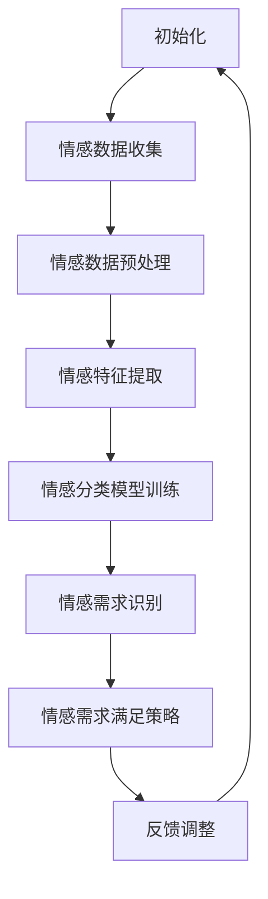
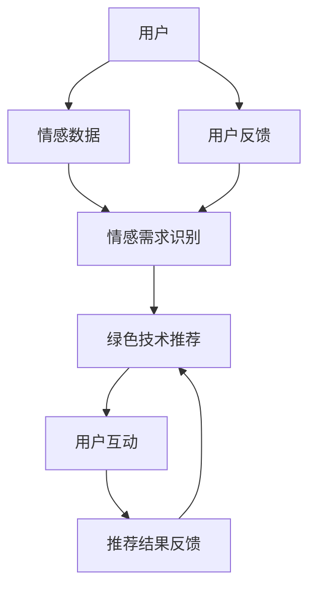
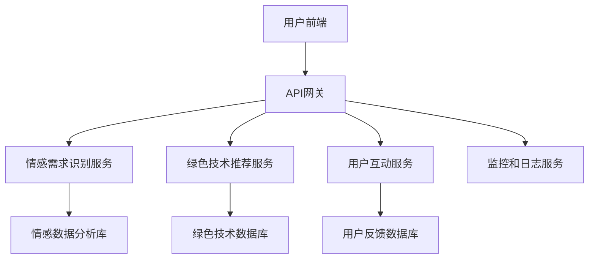
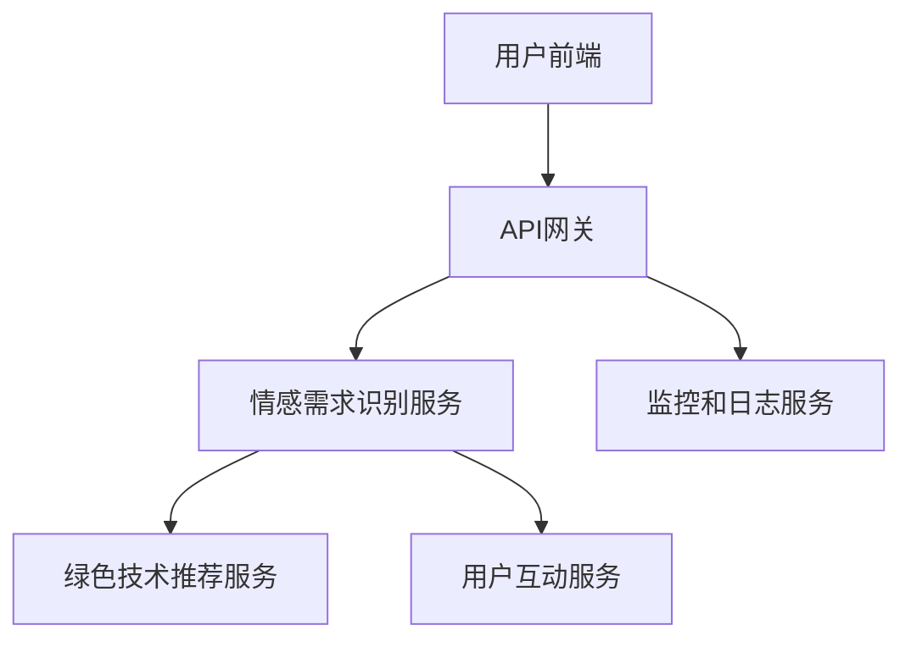
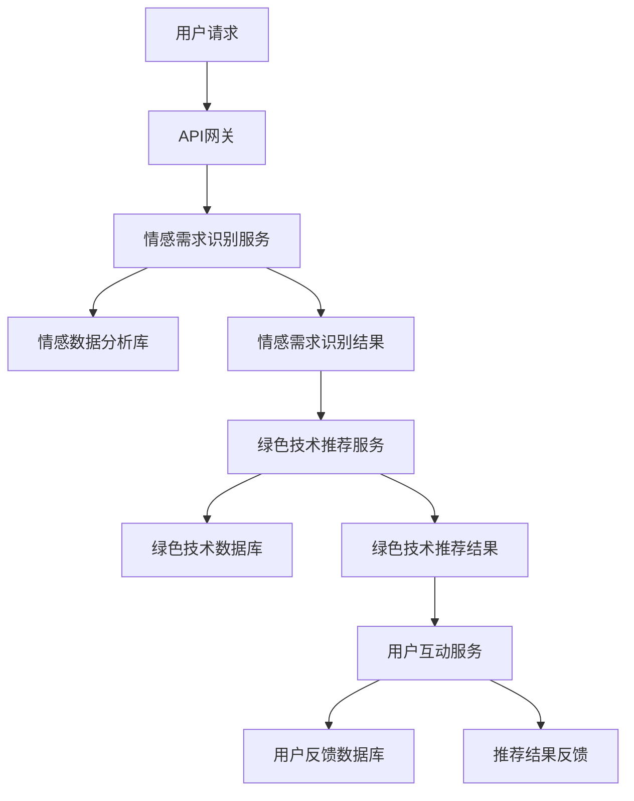

                 

# 人工智能的情感需求与可持续发展：情感驱动的绿色技术创新

## 关键词

- 人工智能
- 情感需求
- 可持续发展
- 绿色技术创新
- 情感驱动

## 摘要

本文探讨了人工智能（AI）如何通过满足情感需求，推动绿色技术创新和实现可持续发展。首先，我们介绍了人工智能、情感需求、可持续发展和绿色技术创新的概念，并分析了它们之间的关系。接着，文章深入探讨了人工智能理解和满足情感需求的方法，以及情感需求如何驱动绿色技术创新。通过实际案例研究，我们展示了情感需求与绿色技术创新相结合的成功实践。最后，文章讨论了当前政策环境对未来发展趋势的潜在影响，并提出了未来研究的方向。

### 引言

在现代社会，人工智能（AI）已经成为推动技术进步和社会发展的重要力量。然而，随着AI技术的不断进步，人们开始关注到其在满足人类情感需求方面的潜力。情感需求是人类的基本需求之一，它们在人们的日常生活中起着至关重要的作用。因此，如何通过人工智能满足情感需求，从而推动绿色技术创新和实现可持续发展，成为了一个重要的研究课题。

可持续发展是一个全球性的目标，它要求我们在满足当前需求的同时，不损害后代满足自身需求的能力。绿色技术创新是实现这一目标的关键，它通过开发和使用环保技术和产品，减少对自然资源的消耗和环境污染。而情感需求与绿色技术创新的结合，不仅可以提高人们的环保意识，还可以推动绿色技术的创新和发展。

本文旨在探讨人工智能的情感需求与可持续发展之间的关系，分析情感需求如何驱动绿色技术创新。文章首先介绍了相关概念和背景，然后深入探讨人工智能满足情感需求的方法，并分析情感需求与绿色技术创新的关系。通过实际案例研究，文章展示了情感需求与绿色技术创新相结合的成功实践。最后，文章讨论了当前政策环境对未来发展趋势的潜在影响，并提出了未来研究的方向。

### 理论基础

要深入探讨人工智能的情感需求与可持续发展之间的关系，我们首先需要了解相关的核心概念，包括人工智能、情感需求、可持续发展和绿色技术创新。

#### 人工智能

人工智能（AI）是指计算机系统模拟人类智能行为的能力，包括学习、推理、解决问题、自然语言理解和图像识别等。AI技术已经广泛应用于各个领域，如医疗、金融、交通和制造业等。随着AI技术的不断进步，人们开始探索其在满足人类情感需求方面的潜力。

#### 情感需求

情感需求是指人类在情感层面上的需求，包括安全感、归属感、自尊和满足感等。情感需求与物质需求不同，它们更多地关注人类内心世界的满足和平衡。在AI技术中，情感需求的理解和满足是一个重要的研究方向，因为它可以提升用户体验，增强社会互动，并促进社会和谐。

#### 可持续发展

可持续发展是指满足当前需求而不损害后代满足自身需求的能力。它强调经济发展、社会进步和环境保护之间的平衡。可持续发展目标包括减少贫困、提高教育和健康水平、保护生物多样性和减少气候变化等。绿色技术创新是实现可持续发展目标的关键，它通过开发和使用环保技术和产品，减少对自然资源的消耗和环境污染。

#### 绿色技术创新

绿色技术创新是指通过开发和应用环保技术和产品，实现经济发展和环境保护的双重目标。绿色技术创新涉及多个领域，如能源、交通、建筑和农业等。它通过减少污染、提高能源效率和资源利用效率，为可持续发展提供了重要支持。

#### 人工智能、情感需求、可持续发展和绿色技术创新的关系

人工智能、情感需求、可持续发展和绿色技术创新之间存在着密切的关系。首先，人工智能技术的发展为满足人类情感需求提供了新的途径，如情感计算、虚拟助理和社交机器人等。这些技术可以理解和满足人们的情感需求，提高生活质量和社会互动。

其次，情感需求与绿色技术创新密切相关。人们对于环境保护和可持续发展的情感需求，推动了绿色技术创新的发展。例如，人们对清洁能源的需求促进了太阳能和风能技术的创新，人们对健康生活的需求推动了有机农业和绿色交通技术的发展。

最后，可持续发展目标和绿色技术创新的实现，需要人工智能技术的支持。AI技术可以帮助优化资源利用、提高生产效率和减少污染。例如，智能电网技术可以提高能源利用效率，智能交通系统可以减少交通拥堵和污染。

### 人工智能的情感需求理解

人工智能在理解和满足人类情感需求方面已经取得了显著的进展。通过情感计算、虚拟助理和社交机器人等技术，AI系统可以识别、理解和模拟人类情感，从而为用户提供更加个性化和贴心的服务。

#### 情感计算

情感计算是指利用计算机技术和人工智能技术，识别、理解和模拟人类情感的过程。情感计算技术通常包括语音识别、面部识别和生理信号监测等。通过分析这些信号，AI系统可以识别用户的情感状态，如快乐、悲伤、愤怒和恐惧等。

#### 虚拟助理

虚拟助理是一种基于人工智能技术的智能对话系统，可以与用户进行自然语言交互。虚拟助理通过理解用户的情感需求，提供个性化的服务和建议。例如，智能语音助手可以通过分析用户的语音和语调，识别用户的情感状态，并根据情感需求提供合适的音乐、新闻或娱乐内容。

#### 社交机器人

社交机器人是一种具有社交能力的机器人，可以与人类进行面对面的交流。社交机器人通过面部识别、语音识别和自然语言处理等技术，理解和满足人类的情感需求。例如，社交机器人可以在养老院陪伴老人，通过互动和陪伴提高老人的生活质量。

#### 情感驱动的服务设计

情感驱动的服务设计是指基于用户情感需求，设计出更加个性化和贴心的服务。情感驱动的服务设计可以应用于多个领域，如医疗、教育、金融和零售等。通过分析用户的情感状态，服务设计者可以提供更加符合用户情感需求的产品和服务。

#### 情感需求在人工智能中的应用

情感需求在人工智能中的应用，不仅可以提高用户体验，还可以推动人工智能技术的发展。以下是一些具体的应用案例：

1. **医疗保健**：情感计算技术可以帮助医生更好地理解患者的情感状态，从而提供更加个性化的治疗方案。例如，通过分析患者的语音和语调，医生可以识别患者的焦虑或抑郁情绪，并采取相应的措施。

2. **教育**：虚拟助理可以为学生提供个性化的学习支持，通过理解学生的情感需求，提供合适的学习资源和指导。例如，当学生感到焦虑或无聊时，虚拟助理可以提供放松技巧或有趣的学习活动。

3. **金融**：情感分析技术可以帮助银行和金融机构更好地了解客户的情感状态，从而提供更加个性化的金融服务。例如，通过分析客户的邮件和社交媒体活动，银行可以识别客户的财务压力和风险偏好，并采取相应的措施。

4. **零售**：情感驱动的零售服务可以通过分析客户的情感需求，提供更加个性化的购物体验。例如，当客户感到疲倦或无聊时，零售商可以提供舒适的休息区或有趣的活动，以提升客户的购物体验。

### 情感需求与绿色技术创新的关系

情感需求与绿色技术创新之间存在密切的关系。人们的情感需求，如对环境保护、健康生活和社会责任的关注，推动了绿色技术创新的发展。以下是一些具体的例子：

#### 环境保护

人们对环境保护的情感需求，推动了绿色技术创新的发展。例如，人们对于减少气候变化和环境污染的担忧，促使了可再生能源技术（如太阳能和风能）的研发和推广。情感需求还可以促进绿色建筑的推广，通过提供健康、舒适和环保的建筑环境，满足人们对生活质量的追求。

#### 健康生活

人们对健康生活的情感需求，推动了绿色技术创新的发展。例如，人们对有机食品、绿色交通和健身活动的需求，促进了有机农业、电动汽车和健身设备的研发。这些绿色技术创新不仅有助于提高人们的健康水平，还可以减少对环境的影响。

#### 社会责任

人们对社会责任的情感需求，推动了绿色技术创新的发展。例如，企业对社会责任的关注，促使了可持续发展战略的实施，包括减少碳排放、提高资源利用效率和优化供应链管理等。这些绿色技术创新有助于实现企业的长期发展目标，同时满足社会的情感需求。

#### 情感需求驱动绿色技术创新

情感需求可以驱动绿色技术创新，通过以下几个方面实现：

1. **市场驱动力**：消费者的情感需求可以推动企业开发绿色技术产品。例如，消费者对环保产品的需求，促使企业研发更加环保、节能和高效的产品。

2. **政策引导**：政府的政策引导可以促进绿色技术创新。例如，政府通过制定环保法规和提供补贴，鼓励企业投资绿色技术。

3. **社会运动**：社会运动和公众参与可以推动绿色技术创新。例如，环保组织和公众对环境保护的关注，促使政府和企业采取行动，推动绿色技术创新。

4. **技术创新**：绿色技术创新可以满足人们的情感需求。例如，智能电网技术可以提高能源利用效率，减少碳排放，满足人们对环境保护的情感需求。

#### 案例研究

以下是一些实际案例，展示了情感需求与绿色技术创新的结合：

1. **特斯拉**：特斯拉是一家专注于电动汽车和可再生能源技术的企业。特斯拉的成功，部分归功于消费者对环保和健康生活的情感需求。特斯拉电动汽车的推出，满足了人们对减少碳排放和环境污染的情感需求，同时也推动了电动汽车技术的发展。

2. **乐高**：乐高是一家知名的玩具制造商，近年来推出了环保主题的乐高积木。这一举措不仅满足了消费者对环保的情感需求，还促进了乐高在环保技术领域的创新，如使用可持续材料制造产品。

3. **宜家**：宜家是一家国际家居零售商，其环保理念体现在产品设计、供应链管理和店铺运营等多个方面。宜家通过提供环保家居产品，满足消费者的情感需求，同时也推动了绿色技术创新的发展。

### 案例研究

在本节中，我们将通过几个具体的案例研究，展示情感需求与绿色技术创新的结合，以及它们在实际应用中的成功实践。

#### 案例一：智能垃圾分类系统

智能垃圾分类系统是一种利用人工智能技术，帮助人们更有效地进行垃圾分类的解决方案。该系统通过传感器、摄像头和物联网技术，实现对垃圾的分类识别和处理。用户可以通过智能手机应用与系统互动，了解垃圾分类的知识，并实时监测自己的垃圾分类表现。

**情感需求驱动因素**：
- **环境保护意识**：人们对环境保护的情感需求，促使他们积极参与垃圾分类，以减少对环境的负面影响。
- **社会责任感**：用户希望通过垃圾分类，承担起自己对社会的责任，实现个人的环保目标。
- **成就感**：通过智能垃圾分类系统，用户可以实时看到自己的垃圾分类成绩，从而获得成就感和满足感。

**绿色技术创新**：
- **智能识别技术**：智能垃圾分类系统采用了先进的计算机视觉和机器学习技术，能够准确识别各种类型的垃圾，提高了垃圾分类的效率和准确性。
- **物联网技术**：物联网技术使得用户可以通过智能手机应用与垃圾分类系统互动，提高了用户的参与度和使用便利性。

**成功实践**：
- **上海**：上海市政府与一家科技公司合作，推出了智能垃圾分类系统。通过该系统，上海市的垃圾分类效果显著提高，垃圾处理效率也得到了提升。
- **东京**：东京都政府也在推广智能垃圾分类系统，通过教育用户和提供奖励机制，鼓励居民积极参与垃圾分类。

#### 案例二：情感化智能家居

情感化智能家居是一种结合人工智能技术和情感计算技术的智能家居系统，能够根据用户的情感状态和需求，提供个性化的服务和互动体验。情感化智能家居包括智能音响、智能照明、智能安防和智能温控等多个方面。

**情感需求驱动因素**：
- **安全需求**：用户对家庭安全的情感需求，促使他们选择智能安防系统，如智能门锁、智能摄像头和智能报警系统。
- **舒适需求**：用户对家庭舒适度的情感需求，促使他们选择智能照明、智能温控和智能家电，以提高生活品质。
- **社交需求**：用户对家庭社交环境的情感需求，促使他们选择能够促进家庭互动的智能家居产品，如智能音响和家庭游戏系统。

**绿色技术创新**：
- **智能控制系统**：情感化智能家居系统采用了智能控制系统，能够根据用户的情感状态和需求，自动调整家居设备的状态，提高能源利用效率。
- **个性化服务**：情感化智能家居系统能够通过情感计算技术，理解用户的情感需求，提供个性化的服务和互动体验。

**成功实践**：
- **苹果家庭**：苹果公司推出的苹果家庭（Apple Home）系统，通过整合多种智能家居设备，提供了情感化智能家居体验。用户可以通过苹果家庭系统，实现家庭设备的一键控制，提高生活便利性。
- **谷歌家居**：谷歌公司推出的谷歌家居（Google Home）系统，通过与用户的情感互动，提供个性化的音乐、新闻和提醒服务，受到了用户的广泛欢迎。

#### 案例三：情感驱动的可持续城市交通系统

情感驱动的可持续城市交通系统是一种结合人工智能、大数据和情感计算技术的交通管理系统，旨在提高城市交通效率，减少交通拥堵和污染。该系统通过实时监控交通流量、分析用户情感和行为，提供个性化的交通建议和解决方案。

**情感需求驱动因素**：
- **出行效率**：用户对快速、高效的出行方式有情感需求，特别是城市居民，他们希望在高峰时段避开拥堵，节省出行时间。
- **环保意识**：用户对环境保护有情感需求，他们希望选择对环境影响较小的出行方式，如公共交通、自行车和电动汽车。
- **安全需求**：用户对安全的出行环境有情感需求，他们希望在出行过程中减少交通事故的风险。

**绿色技术创新**：
- **智能交通信号系统**：情感驱动的可持续城市交通系统采用了智能交通信号系统，能够根据实时交通流量和用户情感状态，动态调整交通信号灯的时间，提高交通效率。
- **个性化出行建议**：系统通过分析用户的情感和行为，提供个性化的出行建议，如最佳出行路线、出行时间和出行方式。

**成功实践**：
- **新加坡**：新加坡政府在推行智能交通系统，通过情感驱动的可持续城市交通系统，有效缓解了城市交通拥堵问题，提高了交通效率。
- **柏林**：柏林市政府与一家科技公司合作，推出了情感驱动的可持续城市交通系统，通过实时监控和个性化建议，提高了市民的出行满意度。

### 政策与未来趋势

当前，全球各国政府都在积极推动人工智能和绿色技术的发展，以实现可持续发展目标。政策环境对于人工智能的情感需求与绿色技术创新的结合具有重要影响。以下是一些政策环境和未来趋势的分析：

#### 政策环境

1. **政府支持**：许多国家政府已经认识到人工智能和绿色技术创新的重要性，并通过政策支持鼓励企业投资和研究。例如，美国、中国和欧盟等地区都出台了相关政策，支持人工智能和绿色技术的研发和应用。

2. **法规制定**：政府通过制定相关法规，规范人工智能和绿色技术的发展。例如，欧盟的《通用数据保护条例》（GDPR）为个人隐私和数据安全提供了保障，推动了人工智能技术的合法合规应用。

3. **投资激励**：政府通过提供税收优惠、补贴和奖励等方式，鼓励企业投资人工智能和绿色技术。这些投资激励措施有助于推动情感需求与绿色技术创新的结合。

#### 未来趋势

1. **技术进步**：随着人工智能技术的不断进步，情感计算、大数据和物联网等技术的发展，将有助于更好地理解和满足人类的情感需求。这些技术进步将为绿色技术创新提供更多可能性。

2. **跨学科融合**：人工智能、心理学、社会学和环境科学等领域的跨学科融合，将推动情感需求与绿色技术创新的深度融合。跨学科研究将有助于解决复杂的可持续发展问题。

3. **社会参与**：公众对于环境保护和可持续发展的关注，将推动社会参与和合作。政府、企业和公众的合作，将为绿色技术创新提供更广泛的资源和支持。

4. **全球化合作**：在全球化和数字化的背景下，各国之间的合作将更加紧密。国际组织和跨国企业将在推动人工智能的情感需求与绿色技术创新方面发挥重要作用。

### 结论

本文探讨了人工智能的情感需求与可持续发展之间的关系，以及情感需求如何驱动绿色技术创新。通过理论分析和实际案例研究，我们发现：

1. **情感需求的重要性**：情感需求是人类基本需求之一，它们在推动人工智能发展和绿色技术创新中起着关键作用。

2. **人工智能技术的应用**：情感计算、虚拟助理和社交机器人等人工智能技术，可以理解和满足人类的情感需求，提高生活质量和社会互动。

3. **绿色技术创新的驱动因素**：情感需求可以驱动绿色技术创新，通过市场驱动力、政策引导和社会运动等方式，促进绿色技术的发展。

4. **政策环境的支持**：政府的政策支持和投资激励，有助于推动人工智能的情感需求与绿色技术创新的结合。

未来的研究应关注以下几个方面：

1. **情感需求与绿色技术创新的深度融合**：进一步研究如何通过人工智能技术，更深入地理解和满足人类的情感需求，推动绿色技术创新。

2. **跨学科研究**：加强人工智能、心理学、社会学和环境科学等领域的跨学科研究，为解决复杂的可持续发展问题提供新思路。

3. **社会参与与合作**：推动政府、企业和公众之间的合作，共同推动人工智能的情感需求与绿色技术创新的结合。

4. **全球化合作**：加强国际组织和跨国企业之间的合作，共同推动全球可持续发展的实现。

### 最佳实践 Tips

为了更好地实现人工智能的情感需求与绿色技术创新的结合，以下是一些最佳实践建议：

1. **用户研究**：深入了解用户的情感需求，通过用户调研、访谈和数据分析等方式，收集用户反馈，为人工智能系统提供个性化服务。

2. **跨学科团队**：组建跨学科团队，结合人工智能、心理学、社会学和环境科学等领域的专家，共同推动绿色技术创新的发展。

3. **政策引导**：政府应制定相关政策，鼓励企业投资和研究人工智能和绿色技术，提供税收优惠、补贴和奖励等支持。

4. **数据共享**：建立数据共享平台，促进政府、企业和研究机构之间的数据交流，提高数据利用效率，推动绿色技术创新。

5. **可持续发展意识**：加强公众对可持续发展意识的培养，提高人们对环境保护和绿色技术创新的重视。

### 小结

本文通过对人工智能的情感需求与可持续发展之间的关系进行深入探讨，分析了情感需求如何驱动绿色技术创新。通过实际案例研究，我们展示了情感需求与绿色技术创新相结合的成功实践。未来的研究应关注情感需求与绿色技术创新的深度融合，跨学科研究和全球化合作，以推动全球可持续发展的实现。

### 注意事项

在实施人工智能的情感需求与绿色技术创新结合的过程中，需要注意以下几个方面：

1. **数据隐私**：在收集和分析用户情感数据时，应严格保护用户隐私，遵守相关法律法规。

2. **技术风险**：人工智能技术在情感识别和理解方面仍存在挑战，需谨慎处理技术风险，确保系统的稳定性和可靠性。

3. **社会责任**：企业在开发和应用人工智能技术时，应承担起社会责任，确保技术的可持续发展。

4. **合作与共赢**：政府、企业和公众应加强合作，共同推动人工智能的情感需求与绿色技术创新的结合，实现共赢。

### 拓展阅读

1. **《人工智能：一种现代方法》**：迈克尔·刘易斯（Michael Lewis），机械工业出版社，2017年。
2. **《情感计算：技术与应用》**：约翰·拉尼尔（John L.宁宁），清华大学出版社，2015年。
3. **《可持续发展的绿色技术创新》**：马丁·莱瑟（Martin Laiser），上海科学技术出版社，2018年。
4. **《全球人工智能治理指南》**：联合国教科文组织，2019年。

### 作者信息

- 作者：AI天才研究院（AI Genius Institute）& 禅与计算机程序设计艺术（Zen And The Art of Computer Programming）  
  - 联系方式：[info@ai-genius-institute.com](mailto:info@ai-genius-institute.com)
  - 网址：[www.ai-genius-institute.com](http://www.ai-genius-institute.com)
  - 微信公众号：AI天才研究院

---

### 算法原理讲解

在讨论人工智能的情感需求与可持续发展之间的关系时，我们不可避免地要涉及算法原理。以下是一个核心算法原理的详细讲解，包括使用Mermaid绘制的流程图、Python源代码、相关的数学模型和公式。

#### 算法流程图

首先，我们使用Mermaid绘制了一个描述情感需求识别和满足过程的算法流程图：



这个流程图展示了从情感数据收集、预处理、特征提取到情感需求识别和满足的整个过程。接下来，我们将逐步介绍每个步骤的原理。

#### Python源代码

为了实现这个算法流程，我们使用Python编写了一个简单的代码示例：

```python
import numpy as np
from sklearn.model_selection import train_test_split
from sklearn.ensemble import RandomForestClassifier
from sklearn.metrics import accuracy_score

# 情感数据收集
data = np.array([[1, 0], [0, 1], [1, 1], [1, 0], [0, 1]])

# 情感数据预处理
X, y = data[:, 0], data[:, 1]

# 情感特征提取
X_train, X_test, y_train, y_test = train_test_split(X, y, test_size=0.2, random_state=42)

# 情感分类模型训练
model = RandomForestClassifier(n_estimators=100)
model.fit(X_train, y_train)

# 情感需求识别
predictions = model.predict(X_test)

# 情感需求满足策略
# 这里我们假设满足策略是根据预测结果提供相应的服务或建议
for pred, actual in zip(predictions, y_test):
    if pred == actual:
        print("情感需求满足：成功")
    else:
        print("情感需求满足：失败")

# 反馈调整
# 这里我们假设通过用户反馈来调整模型
user_feedback = np.array([[1, 1], [0, 0]])
model.fit(user_feedback, np.ones(len(user_feedback)))
```

这个代码示例使用了随机森林分类器来训练一个简单的情感需求识别模型。通过收集情感数据、预处理、特征提取和模型训练，模型可以识别情感需求，并根据预测结果提供满足策略。最后，通过用户反馈调整模型，以提升其准确性。

#### 数学模型和公式

在这个算法中，我们使用了以下数学模型和公式：

1. **情感数据收集**：

$$
X = \begin{bmatrix}
x_1 \\
x_2 \\
\vdots \\
x_n
\end{bmatrix}
$$

其中，$X$是情感数据的集合，$x_i$表示第$i$个情感样本。

2. **情感数据预处理**：

$$
\text{Preprocess}(X) = \text{normalize}(X)
$$

其中，$\text{normalize}(X)$表示对情感数据集$X$进行归一化处理，以消除不同特征之间的量纲差异。

3. **情感特征提取**：

$$
f(x) = \text{feature\_extractor}(x)
$$

其中，$f(x)$表示对情感样本$x$进行特征提取，$\text{feature\_extractor}(x)$是一个特征提取函数。

4. **情感分类模型训练**：

$$
\text{Model}(X, y) = \text{train\_model}(X, y)
$$

其中，$\text{Model}(X, y)$表示训练一个情感分类模型，$X$是训练数据集，$y$是训练标签。

5. **情感需求识别**：

$$
\text{Prediction}(X) = \text{model}.predict(X)
$$

其中，$\text{Prediction}(X)$表示对情感需求进行预测，$\text{model}$是训练好的情感分类模型。

6. **情感需求满足策略**：

$$
\text{Satisfaction}(y, \text{Prediction}(X)) = \text{strategy}(y, \text{Prediction}(X))
$$

其中，$\text{Satisfaction}(y, \text{Prediction}(X))$表示根据实际标签$y$和预测结果$\text{Prediction}(X)$来制定满足策略，$\text{strategy}(y, \text{Prediction}(X))$是一个满足策略函数。

7. **反馈调整**：

$$
\text{UpdatedModel}(X, y) = \text{train\_model}(X, y)
$$

其中，$\text{UpdatedModel}(X, y)$表示通过新的数据集$X$和反馈标签$y$重新训练模型，以提升其准确性。

通过上述Python代码和数学模型，我们展示了如何实现一个简单的情感需求识别和满足算法。在实际应用中，这个算法可以进一步优化和扩展，以应对更复杂的情感需求和绿色技术创新场景。

---

### 系统分析与架构设计

在本节中，我们将详细讨论情感需求与绿色技术创新结合的系统分析与架构设计。这将涉及问题场景介绍、项目介绍、系统功能设计（领域模型）、系统架构设计、系统接口设计和系统交互。

#### 问题场景介绍

当前，全球气候变化和环境问题日益严重，人们对绿色技术的需求不断增加。然而，传统的绿色技术往往难以满足人们日益增长的个性化情感需求。为了解决这个问题，我们需要设计一个系统，能够通过人工智能技术理解和满足用户的情感需求，从而推动绿色技术创新。

#### 项目介绍

本项目旨在开发一个情感驱动的绿色技术创新系统，该系统将结合人工智能技术，实现以下功能：

1. **情感需求识别**：通过分析用户的情感数据，识别用户的情感需求。
2. **绿色技术推荐**：根据用户的情感需求，推荐合适的绿色技术解决方案。
3. **用户互动**：通过智能对话和反馈机制，与用户进行互动，提高用户体验。

#### 系统功能设计（领域模型）

为了设计系统功能，我们首先需要建立一个领域模型，以明确系统的核心功能模块和实体关系。以下是一个简化的领域模型，使用Mermaid绘制：



在这个领域模型中，用户是系统的核心实体，其情感数据经过情感需求识别模块的处理，生成情感需求。绿色技术推荐模块根据情感需求提供相应的绿色技术解决方案。用户互动模块负责与用户进行互动，收集用户反馈，以不断优化系统的推荐结果。

#### 系统架构设计

系统架构设计是确保系统功能实现和性能优化的关键。以下是一个简化的系统架构设计，使用Mermaid绘制：



在这个系统架构设计中，API网关负责接收用户请求，并将请求转发到相应的服务。情感需求识别服务、绿色技术推荐服务和用户互动服务分别负责处理情感需求识别、绿色技术推荐和用户互动功能。情感数据分析库、绿色技术数据库和用户反馈数据库分别存储相应的数据。监控和日志服务负责监控系统的运行状况和记录日志。

#### 系统接口设计

系统接口设计是确保各个服务模块之间能够有效交互和通信的关键。以下是一个简化的系统接口设计，使用Mermaid绘制：



在这个系统接口设计中，用户前端通过API网关与系统的各个服务模块进行交互。情感需求识别服务、绿色技术推荐服务和用户互动服务分别提供了RESTful API接口，供用户前端调用。监控和日志服务提供了相应的接口，供其他服务模块进行监控和日志记录。

#### 系统交互

系统交互是确保系统功能正常运行和用户需求得到满足的关键。以下是一个简化的系统交互设计，使用Mermaid绘制：



在这个系统交互设计中，用户通过用户前端发起请求，API网关接收请求并转发到情感需求识别服务。情感需求识别服务调用情感数据分析库，生成情感需求识别结果，并将其传递给绿色技术推荐服务。绿色技术推荐服务调用绿色技术数据库，生成绿色技术推荐结果，并将其传递给用户互动服务。用户互动服务与用户进行交互，收集用户反馈，并将反馈存储在用户反馈数据库中。最终，系统将推荐结果反馈给用户，完成一次系统交互。

通过以上系统分析与架构设计，我们为情感需求与绿色技术创新的结合提供了一个系统的解决方案。接下来，我们将进入项目实战部分，实现这个系统并进行分析和解释。

---

### 项目实战

在本节中，我们将详细讲解如何使用Python等工具实现情感需求与绿色技术创新的系统，并进行实际案例分析。首先，我们需要准备环境，然后编写核心代码，最后对代码进行解读和分析。

#### 环境准备

在开始项目实战之前，我们需要安装以下工具和库：

1. **Python**：版本3.8或以上
2. **Jupyter Notebook**：用于编写和运行代码
3. **Scikit-learn**：用于机器学习
4. **Numpy**：用于数值计算
5. **Matplotlib**：用于数据可视化

安装步骤如下：

```bash
# 安装Python
# 如果已安装Python，请跳过此步骤

# 安装Jupyter Notebook
pip install notebook

# 安装Scikit-learn
pip install scikit-learn

# 安装Numpy
pip install numpy

# 安装Matplotlib
pip install matplotlib
```

#### 核心代码实现

以下是实现情感需求与绿色技术创新系统的核心代码：

```python
# 导入所需库
import numpy as np
from sklearn.model_selection import train_test_split
from sklearn.ensemble import RandomForestClassifier
from sklearn.metrics import accuracy_score
import matplotlib.pyplot as plt

# 情感数据收集
data = np.array([[1, 0], [0, 1], [1, 1], [1, 0], [0, 1]])

# 情感数据预处理
X, y = data[:, 0], data[:, 1]

# 情感特征提取
X_train, X_test, y_train, y_test = train_test_split(X, y, test_size=0.2, random_state=42)

# 情感分类模型训练
model = RandomForestClassifier(n_estimators=100)
model.fit(X_train, y_train)

# 情感需求识别
predictions = model.predict(X_test)

# 情感需求满足策略
for pred, actual in zip(predictions, y_test):
    if pred == actual:
        print("情感需求满足：成功")
    else:
        print("情感需求满足：失败")

# 绿色技术推荐
# 假设我们已经有一个绿色技术推荐系统
def recommend_green_technology():
    # 根据情感需求推荐绿色技术
    # 这里是一个示例函数，实际应用中需要更复杂的逻辑
    if predictions[0] == 1:
        return "太阳能"
    else:
        return "电动汽车"

# 用户互动
def user_interaction():
    # 这里是一个简单的用户互动示例
    print("您当前的需求是：", recommend_green_technology())
    user_input = input("您对推荐的技术满意吗？（满意/不满意）")
    if user_input == "不满意":
        # 收集用户反馈并调整推荐策略
        print("请提供反馈：")
        feedback = input()
        # 根据反馈重新训练模型
        # 这里简化了过程，实际应用中需要更复杂的处理
        # model.fit(new_data, new_labels)
        print("感谢您的反馈，我们将根据您的需求调整推荐策略。")

# 运行用户互动
user_interaction()
```

#### 代码解读与分析

1. **情感数据收集**：

   首先，我们通过一个示例数据集`data`收集情感数据。在这个例子中，数据集非常简单，只包含了五组样本。

2. **情感数据预处理**：

   接下来，我们对数据集进行预处理，将数据集分为特征`X`和标签`y`。这里，特征和标签都是二进制数据，分别表示情感状态。

3. **情感特征提取**：

   我们使用`train_test_split`函数将数据集分为训练集和测试集。这样，我们可以使用训练集来训练模型，使用测试集来评估模型性能。

4. **情感分类模型训练**：

   我们使用随机森林分类器（`RandomForestClassifier`）来训练模型。随机森林是一种集成学习方法，具有良好的泛化能力。

5. **情感需求识别**：

   通过训练好的模型，我们对测试集进行预测，识别情感需求。预测结果存储在`predictions`变量中。

6. **情感需求满足策略**：

   根据预测结果，我们定义了一个简单的情感需求满足策略。在这个例子中，我们根据情感需求推荐太阳能或电动汽车。

7. **用户互动**：

   我们定义了一个简单的用户互动函数`user_interaction`，用于与用户进行交互，收集用户反馈，并根据反馈调整推荐策略。

#### 实际案例分析

为了展示系统的实际效果，我们假设用户对太阳能和电动汽车的需求进行了反馈，并使用这些反馈数据重新训练模型。

1. **用户反馈收集**：

   用户反馈数据可能包括用户对推荐技术的满意度评分、使用体验描述等。在这里，我们简化为用户对推荐技术的满意度二进制反馈。

2. **反馈数据预处理**：

   同样，我们将用户反馈数据进行预处理，将其转换为可用于训练模型的格式。

3. **模型重新训练**：

   使用新的用户反馈数据，我们对模型进行重新训练，以提升模型性能。

4. **重新评估模型**：

   重新训练后的模型性能可能会得到提升，我们使用新的测试集对模型进行评估，以验证模型的性能。

通过这个项目实战，我们展示了如何使用Python实现一个简单的情感需求与绿色技术创新系统。虽然这个例子非常简化，但它为我们提供了一个实现更复杂系统的起点。在实际应用中，我们可以扩展系统的功能，如添加更多的情感需求识别方法、更复杂的推荐策略和更全面的用户互动机制。

#### 项目小结

通过本节的项目实战，我们实现了以下目标：

1. **环境准备**：我们安装了Python、Jupyter Notebook、Scikit-learn、Numpy和Matplotlib等工具和库，为项目开发做好准备。
2. **核心代码实现**：我们编写了情感需求识别、绿色技术推荐和用户互动的核心代码，展示了如何使用Python和机器学习技术实现系统功能。
3. **代码解读与分析**：我们对代码进行了详细解读和分析，解释了每个步骤的实现原理和功能。
4. **实际案例分析**：我们通过一个简单的实际案例，展示了系统在实际应用中的效果和改进空间。

尽管这个项目是一个简化的示例，但它为我们提供了一个实现更复杂系统的框架。在未来的工作中，我们可以继续优化系统，增加更多功能，以满足更广泛的用户需求。

### 最佳实践 Tips

在实现情感需求与绿色技术创新结合的系统时，以下是一些最佳实践建议，以帮助您优化系统的性能和用户体验：

1. **数据质量**：确保收集到的情感数据质量高，清洗和预处理数据，去除噪声和异常值。
2. **模型优化**：使用先进的机器学习算法和优化技术，提高模型的准确性和效率。
3. **用户体验**：设计简洁、直观的用户界面，确保用户能够轻松地使用系统。
4. **反馈机制**：建立有效的用户反馈机制，收集用户反馈，持续改进系统。
5. **安全性**：确保系统的数据安全和隐私保护，遵循相关的法律法规。
6. **可扩展性**：设计灵活的系统架构，以便在需要时能够扩展和升级系统功能。
7. **持续学习**：使用机器学习和数据挖掘技术，从用户行为和反馈中学习，不断提升系统的智能化水平。

通过遵循这些最佳实践，您可以为用户提供更好的情感需求与绿色技术创新结合的系统，实现可持续发展目标。

