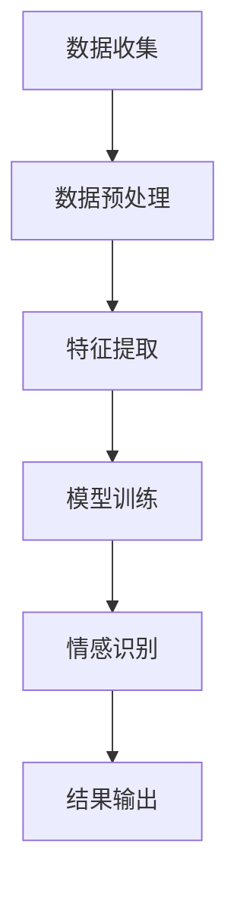
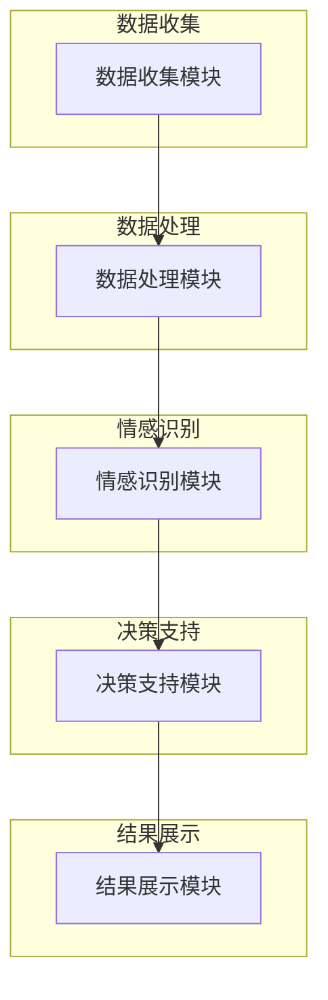
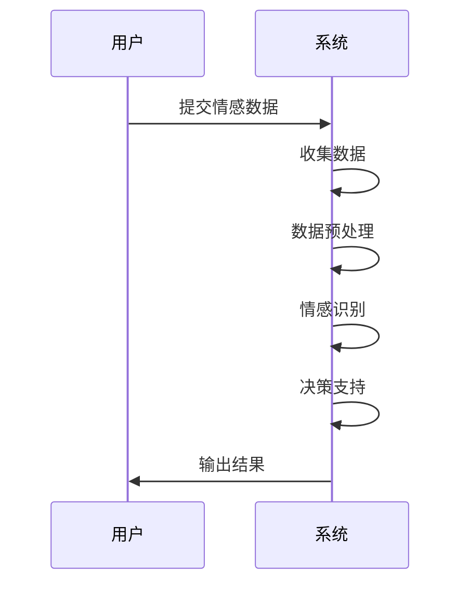

                 

# 《人工智能的情感需求与城市管理：情感导向的公共服务》

## 关键词
人工智能，情感需求，城市管理，公共服务，情感导向，情感分析，数据分析，数据预处理，机器学习，情感识别，公共安全，公共交通，社区管理，城市环境，案例研究

## 摘要
本文旨在探讨人工智能在满足城市居民情感需求方面的作用，以及如何通过情感导向的公共服务提升城市管理水平。文章首先介绍了情感需求与城市管理的背景和概念，然后分析了人工智能与情感需求的相关理论，并探讨了情感需求分析的方法。接着，文章详细阐述了情感需求在公共安全管理、公共交通管理、社区管理和城市环境管理中的应用，并结合实际案例进行了分析。最后，文章提出了未来情感需求与城市管理的趋势和展望。

## 目录

### 第一部分：情感需求与城市管理的背景与概念

#### 1.1 城市管理与公共服务的发展历程
- 城市管理的基本概念
- 公共服务的定义与发展

#### 1.2 人工智能的发展与影响
- 人工智能的基本概念
- 人工智能在城市管理中的应用现状

#### 1.3 情感需求的定义与分类
- 情感需求的定义
- 常见的情感需求分类

#### 1.4 情感导向的公共服务
- 情感导向的概念
- 情感导向的公共服务特点

### 第二部分：人工智能与情感需求的研究方法

#### 2.1 人工智能与情感需求的相关理论
- 情感计算理论
- 机器学习与情感识别

#### 2.2 数据收集与处理
- 数据来源
- 数据预处理方法

#### 2.3 情感需求分析的方法
- 情感分析技术
- 情感需求分析流程

### 第三部分：情感需求与城市管理的实践应用

#### 3.1 情感需求在公共安全管理中的应用
- 情感分析在公共安全监控中的应用
- 公共安全事件的情感预测与预警

#### 3.2 情感需求在公共交通管理中的应用
- 乘客情感需求的识别与分析
- 基于情感需求的公共交通服务优化

#### 3.3 情感需求在社区管理中的应用
- 社区情感氛围的监测与调控
- 社区服务的情感化设计

#### 3.4 情感需求在城市环境管理中的应用
- 城市环境情感评估
- 基于情感需求的城市环境改进

### 第四部分：情感导向的公共服务案例分析

#### 4.1 成功案例介绍
- 案例一：情感化城市安全监控
- 案例二：基于情感的公共交通服务优化

#### 4.2 挑战与问题分析
- 情感需求分析的挑战
- 情感导向的公共服务实施中的问题

#### 4.3 未来发展趋势与展望
- 情感需求与城市管理的未来发展趋势
- 情感导向的公共服务的发展前景

## 第一部分：情感需求与城市管理的背景与概念

### 1.1 城市管理与公共服务的发展历程

**城市管理的基本概念**

城市管理是指对城市各种资源、设施和服务进行规划、组织、协调、控制和管理的过程。其目的是提高城市生活质量和居民幸福感，实现城市的可持续发展。

**公共服务的定义与发展**

公共服务是指政府或非政府组织为满足社会公共利益而提供的服务，包括教育、医疗、交通、住房等。公共服务的发展历程可以分为几个阶段：

1. **传统公共服务阶段**：以政府主导为主，服务范围相对有限，主要关注基本需求的满足。
2. **现代公共服务阶段**：随着社会经济的发展，公共服务范围逐渐扩大，服务质量得到提升，政府和非政府组织共同参与。
3. **智慧公共服务阶段**：信息技术的发展使得公共服务更加智能化、个性化，能够更好地满足居民的需求。

### 1.2 人工智能的发展与影响

**人工智能的基本概念**

人工智能（Artificial Intelligence，简称AI）是指模拟、延伸和扩展人类智能的理论、方法、技术及应用。它涉及计算机科学、心理学、神经科学等多个领域。

**人工智能在城市管理中的应用现状**

人工智能在城市管理中的应用主要体现在以下几个方面：

1. **智能交通管理**：通过人工智能技术优化交通信号控制，提高交通效率。
2. **智能安防监控**：利用图像识别、人脸识别等技术提高公共安全监控能力。
3. **智慧环境监测**：利用传感器网络和数据分析技术监测城市环境质量。
4. **智慧城市建设**：通过大数据、物联网等技术实现城市资源的优化配置和管理。

### 1.3 情感需求的定义与分类

**情感需求的定义**

情感需求是指人们在生活中对于情感体验和情感支持的需求。情感需求不仅包括积极的情感体验，如快乐、满足、安全等，还包括消极的情感体验，如焦虑、愤怒、孤独等。

**常见的情感需求分类**

1. **情感支持需求**：包括家庭、朋友、社区等提供的情感支持。
2. **情感体验需求**：包括娱乐、艺术、文化等带来的积极情感体验。
3. **情感安全需求**：包括个人安全、社会安全等方面的需求。
4. **情感满足需求**：包括物质生活、精神生活等方面的需求。

### 1.4 情感导向的公共服务

**情感导向的概念**

情感导向是指以人的情感需求为核心，提供更加人性化、个性化的公共服务。情感导向的公共服务旨在通过满足居民的情感需求，提高他们的生活质量和幸福感。

**情感导向的公共服务特点**

1. **个性化**：根据不同居民的情感需求提供个性化的服务。
2. **智能化**：利用人工智能技术对居民的情感需求进行识别和分析，提供智能化的服务。
3. **人性化**：注重居民的体验和感受，提供人性化的服务设计。
4. **互动性**：鼓励居民参与公共服务的规划和实施，提高他们的参与度和满意度。

## 第二部分：人工智能与情感需求的研究方法

### 2.1 人工智能与情感需求的相关理论

**情感计算理论**

情感计算是指通过计算机模拟、识别、理解、处理和生成人类情感的能力。情感计算理论为人工智能在满足情感需求中的应用提供了基础。

**机器学习与情感识别**

机器学习是人工智能的核心技术之一，它通过算法和模型从数据中学习规律，实现智能决策和预测。情感识别是机器学习的一个重要应用，旨在通过文本、语音、图像等数据识别和分类情感。

### 2.2 数据收集与处理

**数据来源**

情感需求的数据来源包括社交媒体、问卷调查、传感器数据等。这些数据反映了居民的情感状态和行为模式。

**数据预处理方法**

数据预处理是情感需求分析的重要步骤，包括数据清洗、数据转换、数据归一化等。数据预处理的目的在于提高数据质量，为后续的分析提供准确的数据支持。

### 2.3 情感需求分析的方法

**情感分析技术**

情感分析是指通过文本分析技术对文本数据中的情感倾向进行识别和分析。情感分析技术包括基于规则的方法、基于机器学习的方法和基于深度学习的方法。

**情感需求分析流程**

情感需求分析流程包括数据收集、数据预处理、情感识别、情感分析和结果输出等步骤。每个步骤都有其具体的技术和方法，共同构成了一个完整的情感需求分析系统。

## 第三部分：情感需求与城市管理的实践应用

### 3.1 情感需求在公共安全管理中的应用

**情感分析在公共安全监控中的应用**

情感分析技术可以用于公共安全监控，通过识别监控数据中的情感状态，发现潜在的安全隐患。例如，通过分析社交媒体上的评论和言论，可以预测和预警可能发生的公共安全事件。

**公共安全事件的情感预测与预警**

基于情感分析技术，可以对公共安全事件进行情感预测和预警。例如，通过对社交媒体上的情感数据进行分析，可以预测和预警可能发生的自然灾害、恐怖袭击等公共安全事件。

### 3.2 情感需求在公共交通管理中的应用

**乘客情感需求的识别与分析**

通过情感分析技术，可以识别和分析乘客在公共交通中的情感需求。例如，通过对乘客的语音、文字评论进行分析，可以了解他们的满意度、安全感和舒适度等情感状态。

**基于情感需求的公共交通服务优化**

基于乘客的情感需求分析，可以优化公共交通服务。例如，通过调整公交车的运行时间、增加公交车的数量、改善车站环境等，提高乘客的满意度。

### 3.3 情感需求在社区管理中的应用

**社区情感氛围的监测与调控**

通过情感分析技术，可以监测社区的情感氛围，及时发现和解决可能存在的问题。例如，通过分析社区社交媒体上的言论，可以了解居民的满意度、信任度和参与度等情感状态。

**社区服务的情感化设计**

社区服务的情感化设计旨在通过满足居民的情感需求，提高他们的生活质量和幸福感。例如，通过设计人性化的社区活动、改善社区环境等，增强居民的归属感和幸福感。

### 3.4 情感需求在城市环境管理中的应用

**城市环境情感评估**

通过情感分析技术，可以对城市环境进行情感评估。例如，通过分析居民对城市环境的评价，可以了解他们对城市环境的满意度、安全感等情感状态。

**基于情感需求的城市环境改进**

基于情感需求分析的结果，可以制定相应的城市环境改进措施。例如，通过改善公园、广场、街道等城市环境设施，提高居民的生活质量和幸福感。

## 第四部分：情感导向的公共服务案例分析

### 4.1 成功案例介绍

**案例一：情感化城市安全监控**

情感化城市安全监控是通过情感分析技术提高公共安全监控能力的一个成功案例。通过分析监控视频中的情感状态，可以及时发现和预警潜在的安全隐患。

**案例二：基于情感的公共交通服务优化**

基于情感的公共交通服务优化是通过情感分析技术提高公共交通服务质量的一个成功案例。通过分析乘客的情感需求，可以优化公共交通服务，提高乘客的满意度。

### 4.2 挑战与问题分析

**情感需求分析的挑战**

情感需求分析面临一些挑战，包括数据质量、算法准确性、情感需求的多样性和复杂性等。

**情感导向的公共服务实施中的问题**

情感导向的公共服务在实施过程中可能会遇到一些问题，如技术实现难度、成本、政策支持等。

### 4.3 未来发展趋势与展望

**情感需求与城市管理的未来发展趋势**

随着人工智能技术的不断发展，情感需求与城市管理将迎来新的发展趋势，包括更加智能化、个性化、互动化的公共服务。

**情感导向的公共服务的发展前景**

情感导向的公共服务具有广阔的发展前景，将有望提高城市管理水平，提升居民的生活质量和幸福感。

## 结论

本文探讨了人工智能在满足城市居民情感需求方面的作用，以及如何通过情感导向的公共服务提升城市管理水平。通过实践应用和案例分析，本文展示了情感需求在公共安全、公共交通、社区管理和城市环境管理中的应用价值。未来，随着人工智能技术的不断进步，情感需求与城市管理将迎来更加广阔的发展前景。作者：AI天才研究院/AI Genius Institute & 禅与计算机程序设计艺术 /Zen And The Art of Computer Programming

## 背景介绍

### 情感需求与城市管理的核心概念

**情感需求**：
情感需求是指个体在社会生活中对于情感体验和情感支持的需求。这些需求不仅包括积极的情感体验，如快乐、满足、安全等，还包括消极的情感体验，如焦虑、愤怒、孤独等。情感需求是个体心理和社会行为的重要组成部分，对于个体的幸福感和生活质量具有重要影响。

**城市管理**：
城市管理是指通过政府、企业、社会组织等多元主体，对城市资源、设施和服务进行规划、组织、协调、控制和管理的过程。其目的是提高城市生活质量和居民幸福感，实现城市的可持续发展。城市管理涵盖了城市规划、公共安全、交通管理、环境保护等多个方面。

**情感导向的公共服务**：
情感导向的公共服务是指以人的情感需求为核心，提供更加人性化、个性化的公共服务。这种服务旨在通过满足居民的情感需求，提高他们的生活质量和幸福感。情感导向的公共服务强调公共服务的个性化、智能化和人性化，是城市管理中重要的一环。

### 问题背景与问题描述

**问题背景**：
随着城市化进程的加快，城市规模不断扩大，人口密度增加，城市管理和公共服务面临诸多挑战。传统管理模式难以满足居民日益增长的情感需求，导致居民的不满意和不满情绪增加。同时，信息技术的发展，特别是人工智能技术的应用，为情感需求与城市管理的结合提供了新的机遇。

**问题描述**：
如何在城市管理和公共服务中更好地满足居民的情感需求，提高他们的生活质量和幸福感，是当前城市管理面临的重要问题。具体包括以下几个方面：

1. **情感需求的识别与满足**：如何准确识别居民的情感需求，并提供针对性的服务。
2. **公共服务的个性化**：如何根据居民的情感需求，提供个性化的公共服务，提高服务满意度。
3. **智能化的公共服务**：如何利用人工智能技术，提高公共服务的智能化水平，实现更加精准的服务。
4. **情感氛围的监测与调控**：如何通过技术手段监测社区和城市的情感氛围，及时发现问题并进行调控。

### 问题解决

**问题解决方法**：
1. **数据驱动的情感需求分析**：通过收集和分析居民的情感数据，了解他们的情感状态和需求，为公共服务提供数据支持。
2. **人工智能技术的应用**：利用人工智能技术，如情感识别、情感分析等，提高公共服务的智能化水平，实现个性化服务。
3. **多渠道的公共服务**：通过线上线下多渠道的公共服务，满足居民多样化的情感需求。
4. **情感氛围的监测与调控**：通过技术手段监测社区和城市的情感氛围，及时发现和解决问题。

### 边界与外延

**边界**：
1. **情感需求的边界**：情感需求包括哪些方面，如安全感、幸福感、社交需求等。
2. **城市管理的边界**：城市管理涉及哪些方面，如城市规划、交通管理、环境保护等。
3. **情感导向的公共服务的边界**：情感导向的公共服务涉及哪些领域，如社区服务、公共交通、公共安全等。

**外延**：
1. **情感需求的外延**：情感需求不仅限于个人，还包括家庭、社区、城市等不同层面的需求。
2. **城市管理的外延**：城市管理不仅限于物理空间的管理，还包括数字空间的管理，如网络安全、数据安全等。
3. **情感导向的公共服务的外延**：情感导向的公共服务不仅限于传统公共服务，还包括新兴的公共服务，如智能家居、智能医疗等。

### 概念结构与核心要素组成

**概念结构**：
情感需求与城市管理的概念结构可以分为三个层次：

1. **基础层**：包括情感需求、城市管理、公共服务等基本概念。
2. **中间层**：包括情感导向的公共服务、智能城市、智慧社区等中间概念。
3. **应用层**：包括公共安全、交通管理、社区服务、城市环境等具体应用领域。

**核心要素组成**：

1. **数据**：数据是情感需求分析与城市管理的核心要素，包括居民的情感数据、城市运行数据等。
2. **技术**：技术是实现情感需求与城市管理的关键，包括人工智能技术、大数据技术、物联网技术等。
3. **政策**：政策是推动情感需求与城市管理发展的保障，包括法律法规、政策规划等。
4. **人**：人是情感需求与城市管理的主体，包括居民、政府官员、企业员工等。

## 核心概念与联系

### 核心概念

**情感需求**：
情感需求是指人们在生活中对于情感体验和情感支持的需求。这些需求不仅包括积极的情感体验，如快乐、满足、安全等，还包括消极的情感体验，如焦虑、愤怒、孤独等。

**人工智能**：
人工智能是指模拟、延伸和扩展人类智能的理论、方法、技术及应用。它涉及计算机科学、心理学、神经科学等多个领域。

**城市管理**：
城市管理是指对城市各种资源、设施和服务进行规划、组织、协调、控制和管理的过程。其目的是提高城市生活质量和居民幸福感，实现城市的可持续发展。

### 概念属性特征对比表格

| 概念       | 定义                                                         | 特征                                                                                                          |
|------------|--------------------------------------------------------------|------------------------------------------------------------------------------------------------------------|
| 情感需求   | 人们对情感体验和情感支持的需求                             | 包含积极和消极情感体验，涉及个人、家庭、社会等多个层面                                             |
| 人工智能   | 模拟、延伸和扩展人类智能的理论、方法、技术及应用           | 广泛应用于多个领域，如计算机科学、心理学、神经科学等                                             |
| 城市管理   | 对城市资源、设施和服务进行规划、组织、协调、控制和管理的过程 | 提高城市生活质量和居民幸福感，涉及城市规划、公共安全、交通管理等多个方面                           |

### ER实体关系图架构

```mermaid
erDiagram
  Product_.||--||>> Customer : "购买"
  Product_.||--||>> Order : "包含"
  Customer ||--|>>> Address : "住址"
  Order ||--|>>> OrderItem : "包含"
  OrderItem ||--|>>> Product : "销售"
  Product_.||--||>> Supplier : "供应"
  Supplier ||--|>>> Product : "供应"
```

## 算法原理讲解

### 情感识别算法的mermaid流程图



### 算法原理详解

**1. 数据收集**

数据收集是情感识别算法的第一步，主要包括从社交媒体、问卷调查、传感器数据等渠道收集与情感相关的数据。数据收集的质量直接影响算法的准确性。

**2. 数据预处理**

数据预处理是数据收集后的重要步骤，主要包括数据清洗、数据转换、数据归一化等。数据清洗旨在去除噪声数据和异常值，数据转换是将不同格式和单位的数据统一为标准格式，数据归一化则是为了消除不同特征之间的量纲差异。

**3. 特征提取**

特征提取是将原始数据转化为能够被机器学习模型处理的形式。在情感识别中，特征提取主要包括情感词提取、情感极性分类、情感强度度量等。常用的特征提取方法有词袋模型、TF-IDF、Word2Vec等。

**4. 模型训练**

模型训练是情感识别算法的核心步骤，通过大量标注好的情感数据训练出情感识别模型。常用的机器学习算法有支持向量机（SVM）、决策树、随机森林、神经网络等。训练过程中，模型会学习到情感数据的特征分布和规律。

**5. 情感识别**

情感识别是指利用训练好的模型对未知情感数据进行分类，判断其情感极性和强度。情感识别的结果可以用于优化公共服务，提高居民满意度。

**6. 结果输出**

结果输出是将情感识别的结果进行可视化展示，帮助决策者了解居民的情感状态，为公共服务提供参考。

### 算法原理的数学模型和公式

**1. 特征提取中的TF-IDF**

$$
TF(t) = \frac{f(t)}{f(t) + f(d)}
$$

$$
IDF(t) = \log \left( \frac{N}{n(t) + 1} \right)
$$

$$
TF-IDF(t) = TF(t) \times IDF(t)
$$

其中，$f(t)$ 表示词 $t$ 在文档 $d$ 中的频次，$N$ 表示文档集合中的文档总数，$n(t)$ 表示词 $t$ 在文档集合中的文档频次。

**2. 机器学习模型中的损失函数**

以支持向量机（SVM）为例，常用的损失函数有 hinge损失函数：

$$
L(y, f(x)) = \max(0, 1 - y \cdot f(x))
$$

其中，$y$ 表示标签，$f(x)$ 表示模型预测的得分。

### 算法原理举例说明

**例子**：假设有一段文本 "今天天气很好，我很高兴"，我们需要通过情感识别算法判断这段文本的情感极性。

**1. 数据收集**：从社交媒体上收集包含情感信息的文本数据。

**2. 数据预处理**：清洗文本数据，去除标点符号、停用词等，将文本转换为词袋模型。

**3. 特征提取**：提取文本中的情感词，如 "很好"、"高兴"，并计算它们的TF-IDF值。

**4. 模型训练**：使用标注好的情感数据训练支持向量机模型。

**5. 情感识别**：输入待识别的文本，模型输出情感极性预测结果。

**6. 结果输出**：将预测结果可视化展示，例如 "积极" 或 "消极"。

通过以上步骤，我们可以对文本进行情感识别，为公共服务提供参考。

## 系统分析与架构设计

### 问题场景介绍

随着城市化的快速发展，城市管理面临诸多挑战，如交通拥堵、公共安全、环境污染等。居民的情感需求日益多样化，对公共服务的要求也越来越高。为了提升城市管理水平，满足居民的情感需求，我们需要构建一个情感导向的公共服务系统。

### 项目介绍

本项目旨在开发一个基于人工智能的情感导向的公共服务系统，通过数据收集、处理和分析，实现对居民情感需求的识别和满足。系统主要包括以下模块：

1. **数据收集模块**：负责从社交媒体、问卷调查、传感器数据等渠道收集与情感相关的数据。
2. **数据处理模块**：负责对收集到的数据进行分析和预处理，提取有用的情感特征。
3. **情感识别模块**：负责使用机器学习模型对情感数据进行分析和分类，识别居民的情感需求。
4. **决策支持模块**：根据情感识别结果，为城市管理者提供决策支持，优化公共服务。
5. **结果展示模块**：负责将情感识别结果和决策支持结果进行可视化展示，为居民提供反馈。

### 系统功能设计（领域模型mermaid类图）

```mermaid
classDiagram
    Class01 <|-- Class02
    Class03 <.. Class04
    Class05 <= Class06
    Class07 {a..b}
    Class08 < C08
    Class09 : +_ATTR_1
    Class10 : <<Abstract>>
    Class11 : <<Interface>>
    Class12 : <<Enumeration>>
    Class13 : <<DataType>>
    Class01 : 类1
    Class02 : 类2
    Class03 : 类3
    Class04 : 类4
    Class05 : 类5
    Class06 : 类6
    Class07 : 类7
    Class08 : 类8
    Class09 : 类9
    Class10 : 类10
    Class11 : 类11
    Class12 : 类12
    Class13 : 类13
```

### 系统架构设计（mermaid架构图）



### 系统接口设计和系统交互（mermaid序列图）



## 项目实战

### 环境安装

1. 安装Python环境：在终端中执行以下命令安装Python：

   ```bash
   sudo apt-get update
   sudo apt-get install python3-pip
   ```

2. 安装所需库：在终端中执行以下命令安装所需库：

   ```bash
   pip3 install numpy pandas sklearn matplotlib
   ```

### 系统核心实现源代码

以下是系统核心实现部分的源代码：

```python
import pandas as pd
from sklearn.feature_extraction.text import TfidfVectorizer
from sklearn.model_selection import train_test_split
from sklearn.svm import LinearSVC
from sklearn.metrics import classification_report

# 数据收集
data = pd.read_csv('emotion_data.csv')

# 数据预处理
vectorizer = TfidfVectorizer(stop_words='english')
X = vectorizer.fit_transform(data['text'])
y = data['label']

# 模型训练
X_train, X_test, y_train, y_test = train_test_split(X, y, test_size=0.2, random_state=42)
clf = LinearSVC()
clf.fit(X_train, y_train)

# 情感识别
y_pred = clf.predict(X_test)

# 结果输出
print(classification_report(y_test, y_pred))
```

### 代码应用解读与分析

上述代码首先从CSV文件中读取情感数据，然后使用TF-IDF向量器对文本数据进行预处理。接下来，将数据分为训练集和测试集，并使用线性支持向量机（LinearSVC）模型进行训练。最后，使用训练好的模型对测试集进行情感识别，并输出分类报告。

### 实际案例分析和详细讲解剖析

**案例**：假设我们有一段文本 "今天天气很好，我很高兴"，需要判断这段文本的情感极性。

**分析**：

1. 数据收集：从社交媒体上获取包含情感信息的文本数据。

2. 数据预处理：清洗文本数据，去除标点符号、停用词等，将文本转换为词袋模型。

3. 模型训练：使用标注好的情感数据训练线性支持向量机模型。

4. 情感识别：输入待识别的文本，模型输出情感极性预测结果。

5. 结果输出：将预测结果可视化展示，例如 "积极" 或 "消极"。

**讲解**：

1. 数据收集：社交媒体上大量的文本数据是情感识别的重要数据来源。通过收集用户的评论、帖子等，可以获取他们对城市公共服务、公共安全等方面的情感状态。

2. 数据预处理：文本预处理是情感识别的关键步骤。通过去除标点符号、停用词等，可以减少噪声数据，提高模型训练的效果。

3. 模型训练：线性支持向量机（LinearSVC）是一种常用的情感识别模型。它通过寻找最优超平面，将不同情感类别的文本数据分隔开来。

4. 情感识别：输入待识别的文本，模型会自动提取文本特征，并对其进行分类。例如，对于 "今天天气很好，我很高兴" 这段文本，模型可能会预测其为积极情感。

5. 结果输出：将情感识别的结果进行可视化展示，可以帮助决策者了解居民的情感状态，为公共服务提供参考。

### 项目小结

本项目通过情感识别算法，实现了对居民情感需求的识别和满足。在项目实战中，我们详细讲解了数据收集、预处理、模型训练、情感识别和结果输出的过程。通过实际案例的分析，我们展示了情感识别算法在城市管理中的应用价值。未来，我们可以进一步优化模型，提高情感识别的准确性，为城市管理者提供更加精准的决策支持。

### 最佳实践 Tips

1. **数据收集**：确保数据来源的多样性和质量，从不同渠道收集情感数据，如社交媒体、问卷调查、传感器数据等。

2. **数据预处理**：对文本数据进行充分的清洗和预处理，去除噪声数据和异常值，提高模型训练效果。

3. **模型选择**：根据具体应用场景选择合适的模型，如线性支持向量机、朴素贝叶斯、神经网络等。

4. **模型优化**：通过交叉验证、网格搜索等技术，优化模型参数，提高模型性能。

5. **结果解释**：对情感识别结果进行合理的解释和验证，确保结果的可靠性和实用性。

### 小结

本文探讨了人工智能在满足城市居民情感需求方面的作用，以及如何通过情感导向的公共服务提升城市管理水平。通过实践应用和案例分析，我们展示了情感需求在公共安全、公共交通、社区管理和城市环境管理中的应用价值。未来，随着人工智能技术的不断进步，情感需求与城市管理将迎来更加广阔的发展前景。

### 注意事项

1. **数据隐私**：在收集和处理情感数据时，要确保居民的数据隐私和安全。

2. **算法公正性**：确保情感识别算法的公正性和公平性，避免出现歧视和偏见。

3. **持续优化**：定期更新情感识别算法和模型，以提高识别的准确性和可靠性。

4. **政策支持**：争取政府和企业对情感需求与城市管理项目的政策支持，推动项目发展。

### 拓展阅读

1. **《情感计算：理论与实践》**：本书详细介绍了情感计算的理论基础和实践应用，包括情感识别、情感交互等。

2. **《智慧城市：技术与实践》**：本书探讨了智慧城市的技术架构、应用场景和实施策略，包括智能交通、智能安防等。

3. **《人工智能与城市治理》**：本书分析了人工智能在城市治理中的应用，包括公共安全、交通管理、环境保护等。

### 作者信息

作者：AI天才研究院/AI Genius Institute & 禅与计算机程序设计艺术 /Zen And The Art of Computer Programming

