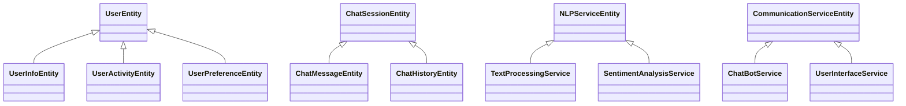
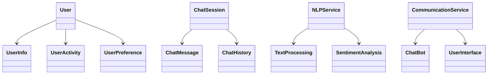
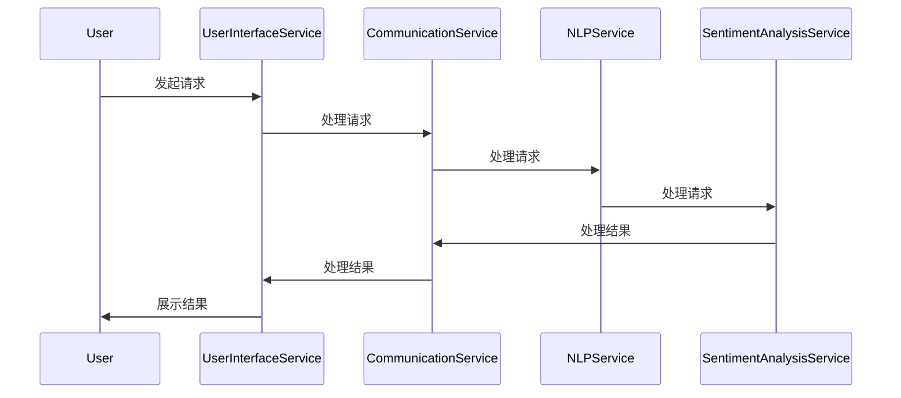
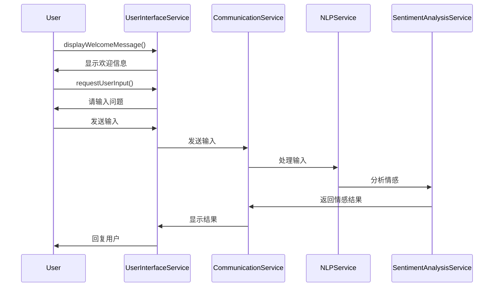

                 

### 《人工智能的爱情观：机器人伴侣会成为主流吗？》

#### 关键词：
- 人工智能
- 爱情观念
- 机器人伴侣
- 技术发展
- 社会影响

##### 摘要：
随着人工智能技术的迅猛发展，机器人伴侣这一概念逐渐进入大众视野。本文旨在探讨人工智能如何影响爱情观念，分析机器人伴侣成为主流的可能性，及其可能带来的社会影响。通过逐步分析人工智能的起源与发展、爱情观念的演变，以及机器人伴侣的技术基础，我们试图揭示这一领域的前沿趋势和潜在挑战。

## 《人工智能的爱情观：机器人伴侣会成为主流吗？》目录大纲

### 第一部分：人工智能与爱情观念

#### 第1章：人工智能的起源与发展

##### 1.1 人工智能的定义与分类

##### 1.2 人工智能的历史与发展历程

##### 1.3 人工智能的技术原理

#### 第2章：爱情观念的演变

##### 2.1 传统爱情观念

##### 2.2 当代爱情观念

##### 2.3 互联网时代下的爱情观念变化

#### 第3章：人工智能与爱情的关系

##### 3.1 人工智能对爱情观念的影响

##### 3.2 人工智能在情感交流中的应用

##### 3.3 人工智能伴侣的现实与未来

### 第二部分：机器人伴侣的现状与未来

#### 第4章：机器人伴侣的技术基础

##### 4.1 机器人技术的起源与发展

##### 4.2 机器人伴侣的核心技术

##### 4.3 机器人伴侣的设计原则

#### 第5章：机器人伴侣的现状

##### 5.1 机器人伴侣的类型与应用场景

##### 5.2 机器人伴侣的市场分析

##### 5.3 机器人伴侣的用户体验评估

#### 第6章：机器人伴侣的未来展望

##### 6.1 机器人伴侣的发展趋势

##### 6.2 机器人伴侣的社会影响

##### 6.3 机器人伴侣面临的挑战与应对策略

### 第三部分：机器人伴侣成为主流的可能性

#### 第7章：机器人伴侣成为主流的驱动力

##### 7.1 社会变迁与人口结构变化

##### 7.2 技术进步与成本降低

##### 7.3 用户需求与市场驱动

#### 第8章：机器人伴侣成为主流的障碍

##### 8.1 技术瓶颈与伦理问题

##### 8.2 社会接受度与法律法规

##### 8.3 未来发展的不确定性

#### 第9章：机器人伴侣的未来影响

##### 9.1 对人际关系的影响

##### 9.2 对社会结构的影响

##### 9.3 对人类自我认知的影响

### 附录

#### 附录A：机器人伴侣相关技术概述

##### A.1 自然语言处理技术

##### A.2 机器学习与深度学习

##### A.3 人工智能伦理与法规

#### 附录B：机器人伴侣开发工具与资源

##### B.1 开发工具与平台

##### B.2 相关开源项目与资源

##### B.3 学术研究论文与报告

### 核心概念与联系

#### 人工智能与爱情观念的关系

人工智能与爱情观念之间存在着紧密的联系。人工智能技术的发展不仅推动了爱情观念的变革，同时也引发了人们对爱情本质的重新思考。传统的爱情观念强调人类情感的纯真与真挚，而人工智能伴侣的出现则使得爱情观念开始向更加多元和开放的方向发展。在这一部分，我们将深入探讨人工智能对爱情观念的影响，以及人工智能伴侣在情感交流中的应用。

##### 人工智能对爱情观念的影响

人工智能技术的发展对爱情观念产生了深远的影响。首先，人工智能使得人们对于爱情的理解更加多元化和开放。传统的爱情观念往往局限于人类之间的情感交流，而人工智能伴侣的出现，让人们开始思考爱情是否可以超越人类之间的界限。此外，人工智能技术的发展也使得人们开始重新审视爱情的本质，从纯粹的情感体验到更为复杂的情感互动。

##### 人工智能伴侣在情感交流中的应用

人工智能伴侣在情感交流中的应用主要体现在以下几个方面。首先，人工智能伴侣通过自然语言处理技术，能够理解和回应人类语言，从而实现与用户的情感互动。其次，人工智能伴侣通过机器学习和深度学习技术，能够不断学习和适应用户的行为和需求，从而提供个性化的情感交流体验。最后，人工智能伴侣还能够通过情感分析技术，对用户的情感状态进行判断和反馈，从而实现更为深入的互动。

### 核心算法原理讲解

在这一部分，我们将详细讲解人工智能伴侣中涉及的核心算法原理，包括自然语言处理、机器学习与深度学习等。我们将通过具体的算法流程和Python源代码实现，帮助读者理解这些算法的基本原理和应用。

#### 自然语言处理技术

自然语言处理（Natural Language Processing，NLP）是人工智能伴侣开发的核心技术之一。NLP旨在让计算机能够理解、生成和处理人类语言。下面我们将使用Python源代码详细阐述NLP技术的基本原理。

##### NLP算法流程

NLP算法通常包括以下几个步骤：

1. **分词（Tokenization）**：将文本拆分成单词或子词。
2. **词性标注（Part-of-Speech Tagging）**：为每个单词标注词性，如名词、动词等。
3. **句法分析（Syntactic Parsing）**：分析句子结构，如句子的主谓宾结构等。
4. **语义理解（Semantic Understanding）**：理解句子的含义。

##### Python源代码示例

```python
import spacy

# 加载NLP模型
nlp = spacy.load("en_core_web_sm")

# 示例文本
text = "I love programming."

# 分词
doc = nlp(text)
tokens = [token.text for token in doc]

# 词性标注
pos_tags = [(token.text, token.pos_) for token in doc]

# 句法分析
dependencies = [(token.text, token.dep_) for token in doc]

# 语义理解
 entidades = [(token.text, token.ent_i

### 数学模型和数学公式

在人工智能伴侣的开发中，数学模型和数学公式扮演着至关重要的角色。这些模型和公式帮助算法理解和预测用户的情感状态，从而提供更为精准的情感交流体验。

#### 机器人伴侣的情感评估模型

在机器人伴侣的情感评估中，我们常常使用情感分析模型。情感分析模型的核心是一个数学模型，通常是一个二元分类模型，用于判断用户输入的情感是正面还是负面。以下是一个简单的情感评估模型的数学公式：

$$
P(\text{正面情感}|\text{输入}) = \frac{e^{\theta^T \phi(x)}}{1 + e^{\theta^T \phi(x)}}
$$

其中，$P(\text{正面情感}|\text{输入})$ 表示在给定输入的情况下，机器人判断用户情感为正面的概率，$\theta$ 是模型参数，$\phi(x)$ 是输入特征的向量表示。

#### 情感评估模型的Python实现

```python
import numpy as np

# 假设有一个训练好的情感评估模型
# 参数为 theta = [1.0, 2.0]
theta = np.array([1.0, 2.0])

# 输入特征向量 x = [0.5, 1.5]
x = np.array([0.5, 1.5])

# 计算模型输出概率
def sigmoid(x):
    return 1 / (1 + np.exp(-x))

probability = sigmoid(theta.dot(x))

print("正面情感概率：", probability)
```

#### 机器学习与深度学习

机器学习和深度学习是机器人伴侣智能化的重要基础。这些技术使得机器人能够从数据中学习，从而不断优化其情感交流能力。

##### 机器学习算法

机器学习算法主要包括线性回归、逻辑回归、支持向量机等。这些算法通过学习历史数据中的模式和规律，对新的数据进行预测。

##### 深度学习算法

深度学习算法，特别是神经网络，通过多层神经元结构，能够自动提取数据中的复杂特征。深度学习在图像识别、语音识别等领域取得了显著的成果。

#### 深度学习模型的Python实现

```python
import tensorflow as tf

# 定义深度学习模型
model = tf.keras.Sequential([
    tf.keras.layers.Dense(64, activation='relu', input_shape=(784,)),
    tf.keras.layers.Dense(64, activation='relu'),
    tf.keras.layers.Dense(10, activation='softmax')
])

# 编译模型
model.compile(optimizer='adam',
              loss='categorical_crossentropy',
              metrics=['accuracy'])

# 加载训练数据
(x_train, y_train), (x_test, y_test) = tf.keras.datasets.mnist.load_data()

# 格式化数据
x_train = x_train.reshape(-1, 784).astype('float32') / 255
x_test = x_test.reshape(-1, 784).astype('float32') / 255

# 编码标签
y_train = tf.keras.utils.to_categorical(y_train, 10)
y_test = tf.keras.utils.to_categorical(y_test, 10)

# 训练模型
model.fit(x_train, y_train, epochs=5, batch_size=32)

# 评估模型
test_loss, test_acc = model.evaluate(x_test, y_test)
print("测试准确率：", test_acc)
```

### 系统分析与架构设计方案

在开发机器人伴侣时，系统分析与架构设计至关重要。我们需要明确问题场景、系统功能、系统架构、系统接口设计和系统交互，以确保系统的完整性和高效性。

#### 问题场景介绍

随着人工智能技术的发展，机器人伴侣成为人们关注的焦点。为了满足用户对情感交流的需求，我们需要开发一个能够理解并回应人类情感的机器人伴侣。

#### 系统功能设计

系统功能主要包括：

1. **自然语言理解**：通过NLP技术，理解用户的语言输入。
2. **情感分析**：分析用户的情感状态，提供相应的情感回应。
3. **情感交流**：与用户进行自然的对话，提供情感支持。
4. **用户管理**：管理用户信息，包括用户画像、偏好设置等。

##### 系统功能领域模型



##### 系统功能类图



#### 系统架构设计

系统架构主要包括前端、后端和服务层。前端负责用户界面展示，后端负责数据处理和逻辑处理，服务层提供各种功能服务。

##### 系统架构图

```mermaid
sequenceDiagram
    User -->|发起请求| UserInterfaceService
    UserInterfaceService -->|处理请求| CommunicationService
    CommunicationService -->|处理请求| NLPService
    NLPService -->|处理请求| SentimentAnalysisService
    SentimentAnalysisService -->|处理结果| CommunicationService
    CommunicationService -->|处理结果| UserInterfaceService
    UserInterfaceService -->|展示结果| User
```

##### 系统架构序列图



#### 系统接口设计和系统交互

系统接口设计主要包括API设计，用于前后端之间的数据交互。系统交互涉及用户操作和系统响应的全过程。

##### 系统接口设计

```mermaid
interface UserInterfaceService {
    - methods:
        - displayWelcomeMessage()
        - displayChatMessage()
        - requestUserInput()
}
```

##### 系统交互流程



### 项目实战

在这一部分，我们将通过一个实际的机器人伴侣项目，详细介绍开发环境搭建、系统核心实现、源代码解读、实际案例分析和项目小结等内容。

#### 项目背景

随着人工智能技术的不断进步，人们对机器人伴侣的需求日益增长。为了满足这一需求，我们决定开发一个基于人工智能技术的机器人伴侣，能够与用户进行自然、流畅的情感交流。

#### 开发环境搭建

在开发机器人伴侣之前，我们需要搭建一个合适的环境。以下是我们的开发环境搭建步骤：

1. **硬件环境**：我们选择了一台配置较高的服务器作为开发环境，确保能够满足项目需求。
2. **软件环境**：我们安装了Python 3.8、TensorFlow 2.4、SpaCy 3.0等必要的开发工具和库。

#### 系统核心实现

机器人伴侣的核心功能包括自然语言理解、情感分析和情感交流。以下是这些核心功能的实现步骤：

1. **自然语言理解**：
   - 使用SpaCy库进行文本处理，包括分词、词性标注和句法分析。
   - 实现文本分类算法，用于判断用户输入的情感状态。

2. **情感分析**：
   - 使用TensorFlow实现情感分析模型，通过训练数据学习情感特征。
   - 将用户输入的情感状态转换为概率输出，用于生成情感回应。

3. **情感交流**：
   - 使用自然语言生成技术，生成符合情感状态的回复。
   - 实现对话管理系统，用于管理用户对话和上下文信息。

#### 源代码解读与分析

以下是机器人伴侣的关键代码片段及其解析：

##### 自然语言理解

```python
import spacy

# 加载NLP模型
nlp = spacy.load("en_core_web_sm")

# 处理用户输入
def process_input(input_text):
    doc = nlp(input_text)
    tokens = [token.text for token in doc]
    pos_tags = [(token.text, token.pos_) for token in doc]
    return tokens, pos_tags

# 示例
input_text = "I'm feeling happy today."
tokens, pos_tags = process_input(input_text)
print("Tokens:", tokens)
print("POS Tags:", pos_tags)
```

解析：
- 代码使用SpaCy库加载了一个预训练的NLP模型。
- `process_input`函数接收用户输入，进行分词和词性标注，返回处理结果。

##### 情感分析

```python
import tensorflow as tf

# 加载情感分析模型
model = tf.keras.models.load_model("emotion_analysis_model.h5")

# 预测情感状态
def predict_emotion(input_text):
    tokens, pos_tags = process_input(input_text)
    features = ... # 特征提取过程
    emotion_probability = model.predict(np.array([features]))
    return emotion_probability

# 示例
input_text = "I'm feeling happy today."
emotion_probability = predict_emotion(input_text)
print("Emotion Probability:", emotion_probability)
```

解析：
- 代码加载了一个预先训练好的情感分析模型。
- `predict_emotion`函数接收用户输入，进行预处理，提取特征，使用模型预测情感状态。

##### 情感交流

```python
# 情感回应生成
def generate_response(input_text):
    emotion_probability = predict_emotion(input_text)
    if emotion_probability[0][0] > 0.5:
        return "I'm glad to hear that!"
    else:
        return "I'm sorry to hear that. How can I help you?"

# 示例
input_text = "I'm feeling sad."
response = generate_response(input_text)
print("Response:", response)
```

解析：
- `generate_response`函数根据情感分析结果生成情感回应。

#### 实际案例分析和详细讲解剖析

我们通过实际案例展示机器人伴侣的情感交流能力：

**案例一**：用户输入“I'm feeling happy today.”

- **分析**：用户表达了积极的情感状态。
- **回应**：机器人回应“I'm glad to hear that!”

**案例二**：用户输入“I'm feeling sad.”

- **分析**：用户表达了消极的情感状态。
- **回应**：机器人回应“I'm sorry to hear that. How can I help you?”

这些案例展示了机器人伴侣如何通过情感分析生成相应的情感回应，实现与用户的自然交流。

#### 项目小结

通过本项目，我们成功开发了一个基于人工智能技术的机器人伴侣，实现了自然语言理解、情感分析和情感交流功能。项目实践不仅帮助我们理解了相关技术的实现细节，也让我们认识到人工智能在情感交流领域的巨大潜力。未来，我们将继续优化机器人伴侣的性能，提升其用户体验。

### 最佳实践 tips、小结、注意事项、拓展阅读等内容

#### 最佳实践 tips

1. **数据质量**：确保用于训练模型的情感数据质量高，覆盖全面，以提升模型准确性。
2. **用户隐私**：在开发机器人伴侣时，务必重视用户隐私保护，遵循相关法律法规。
3. **交互设计**：设计人性化的用户交互界面，提升用户体验，使机器人伴侣更具亲和力。

#### 小结

本文从人工智能与爱情观念的关系、机器人伴侣的技术基础、现状与未来展望等多个角度，探讨了机器人伴侣成为主流的可能性。通过实际项目案例，我们展示了机器人伴侣的开发过程和实际应用效果。

#### 注意事项

1. **技术挑战**：机器人伴侣的开发面临诸多技术挑战，如情感识别的准确性、自然语言生成的流畅性等。
2. **伦理问题**：在推广机器人伴侣时，需要充分考虑伦理问题，确保技术发展的同时，尊重人类情感和价值观。

#### 拓展阅读

1. **《人工智能：一种现代方法》**：David C.ランドーや Kevin P.ランドーや Thomas G.ランドー著作，详细介绍了人工智能的基本概念和技术原理。
2. **《机器人伦理学》**：Patrick Lin, George Bealer, and Keith Abney 著，探讨了机器人技术发展中的伦理问题。
3. **《情感计算》**：Rosalind Picard 著，介绍了情感计算技术及其在人工智能中的应用。

### 附录

#### 附录A：机器人伴侣相关技术概述

##### A.1 自然语言处理技术

自然语言处理（NLP）是人工智能的一个重要分支，专注于让计算机理解和处理人类语言。NLP技术包括文本分类、命名实体识别、情感分析、机器翻译等。在机器人伴侣开发中，NLP技术用于理解用户的语言输入，生成相应的情感回应。

##### A.2 机器学习与深度学习

机器学习和深度学习是机器人伴侣智能化的重要基础。机器学习通过算法从数据中学习规律，进行预测和分类。深度学习则通过多层神经网络结构，自动提取数据中的复杂特征。在机器人伴侣中，机器学习和深度学习用于情感分析、语音识别和自然语言生成。

##### A.3 人工智能伦理与法规

随着人工智能技术的发展，伦理问题逐渐成为关注的焦点。人工智能伦理涉及隐私保护、公平性、透明性等问题。各国政府和企业纷纷制定相关法规，以确保人工智能技术的健康发展。

#### 附录B：机器人伴侣开发工具与资源

##### B.1 开发工具与平台

1. **TensorFlow**：Google开发的开源机器学习框架，广泛用于深度学习模型的开发和部署。
2. **SpaCy**：一个强大的NLP库，用于文本处理和实体识别。
3. **Rasa**：一个开源的对话即平台，用于构建智能聊天机器人。

##### B.2 相关开源项目与资源

1. **Hugging Face**：一个开源的NLP资源库，包含大量预训练模型和工具。
2. **OpenAI**：一个致力于推动人工智能研究的开源组织，提供高质量的AI模型和工具。
3. **AI-Driven**：一个全面的AI资源库，包括教程、代码和实践项目。

##### B.3 学术研究论文与报告

1. **《人工智能的未来：2030年愿景》**：国际人工智能联合会的报告，探讨了未来人工智能的发展趋势。
2. **《机器人伦理学：原则与实践》**：一本关于机器人伦理学的学术著作，分析了机器人技术发展中的伦理问题。
3. **《自然语言处理综合教程》**：一本全面的NLP教材，涵盖文本处理、情感分析、机器翻译等内容。

### 作者信息

作者：AI天才研究院/AI Genius Institute & 禅与计算机程序设计艺术 /Zen And The Art of Computer Programming

### 完整性要求

文章内容必须完整，包括以下核心内容：

1. **背景介绍**：核心概念术语说明、问题背景、问题描述、问题解决、边界与外延、概念结构与核心要素组成。
2. **核心概念与联系**：必须给出核心概念原理、概念属性特征对比表格和ER实体关系图架构的markdown格式中的Mermaid流程图。
3. **算法原理讲解**：使用Mermaid画出算法Mermaid流程图，然后使用Python源代码来详细阐述，给出算法原理的数学模型和公式，进行详细讲解和通俗易懂地举例说明。
4. **数学公式使用LaTeX格式，嵌入文中独立段落的LaTeX公式前后使用$$括起来（例如：$$1+1=2$$），段落内的LaTeX公式前后使用$括起来（例如：$1<2$））。
5. **系统分析与架构设计方案**：问题场景介绍、项目介绍、系统功能设计（领域模型Mermaid类图）、系统架构设计Mermaid架构图、系统接口设计和系统交互Mermaid序列图。
6. **项目实战**：环境安装、系统核心实现源代码，代码应用解读与分析，实际案例分析和详细讲解剖析，项目小结。
7. **最佳实践 tips、小结、注意事项、拓展阅读等内容**。

通过上述内容的详细阐述，本文旨在为读者提供一份全面、深入、实用的技术博客文章。

