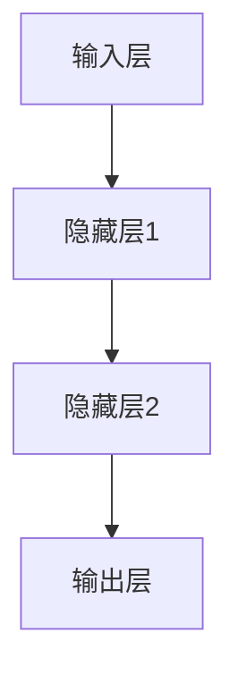
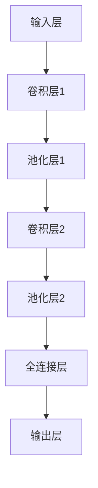
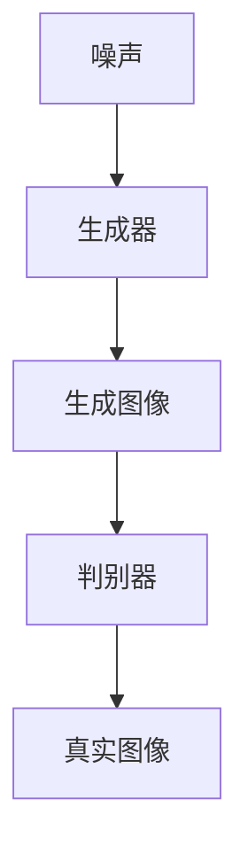
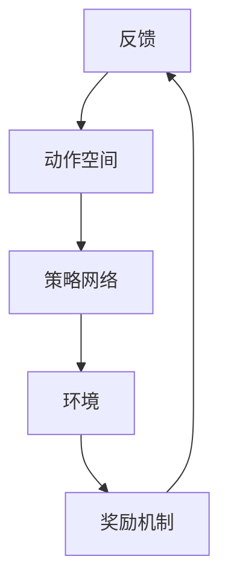

                 

# 人工神经网络与深度学习算法

## 关键词

- 人工神经网络
- 深度学习
- 反向传播
- 激活函数
- 损失函数
- 卷积神经网络
- 循环神经网络
- 生成对抗网络
- 强化学习

## 摘要

本文将深入探讨人工神经网络与深度学习算法的基本原理、核心算法及其在实际应用中的效果。首先，我们将介绍人工神经网络的基础知识，包括定义、历史背景、基本结构、激活函数等。接着，我们将详细讲解前馈神经网络、反向传播算法、训练与优化等内容。随后，本文将引入深度学习算法，介绍卷积神经网络、循环神经网络、生成对抗网络和强化学习的基本原理和应用。最后，我们将通过几个实际案例，展示深度学习算法在图像分类、自然语言处理和生成模型等方面的应用效果。希望本文能帮助读者全面理解深度学习算法，为其在人工智能领域的应用提供理论支持和实践指导。

## 人工神经网络基础

### 第1章：人工神经网络简介

#### 1.1 定义与历史

人工神经网络（Artificial Neural Networks，ANN）是一种模仿生物神经系统的计算模型，它由大量相互连接的神经元组成，通过模拟生物神经元之间的交互和传递信息来实现数据处理和模式识别。人工神经网络的研究始于1943年，由心理学家McCulloch和数学家Pitts提出了神经网络的基本模型。此后，1958年，Frank Rosenblatt发明了感知机（Perceptron），这是第一个能够进行二分类的人工神经网络模型。

随着时间的推移，人工神经网络在理论上和应用上都有了巨大的发展。1986年，Rumelhart等人提出了反向传播算法（Backpropagation Algorithm），这使得多层神经网络的学习变得可行。随着计算机性能的提升和数据获取能力的增强，深度学习（Deep Learning）逐渐兴起，成为人工智能领域的一个重要分支。

#### 1.2 神经网络的基本结构

人工神经网络通常由输入层、隐藏层和输出层组成。输入层接收外部输入信息，隐藏层对输入信息进行处理和变换，输出层产生最终的输出结果。

- **输入层（Input Layer）**：每个神经元表示一个输入特征，如图像中的像素值、文本中的词向量等。

- **隐藏层（Hidden Layer）**：一个或多个隐藏层，每个神经元将接收前一层神经元的输出，通过加权求和后加上偏置项，再通过激活函数进行非线性变换。

- **输出层（Output Layer）**：产生最终输出，如分类结果、预测值等。

#### 1.3 神经网络的激活函数

激活函数（Activation Function）是神经网络中的一个关键组件，它将线性组合的输入映射到一个非负值，从而引入非线性特性。常见的激活函数有：

- **Sigmoid函数**：$$ \sigma(x) = \frac{1}{1 + e^{-x}} $$
  - 将输入映射到$(0,1)$区间，方便进行二分类。
  - 局限性：梯度下降时容易产生梯度消失问题。

- **ReLU函数**（Rectified Linear Unit）：$$ \text{ReLU}(x) = \max(0, x) $$
  - 增加神经网络的训练速度和性能。
  - 局限性：可能导致神经元死亡（即输出始终为0）。

- **Tanh函数**：$$ \tanh(x) = \frac{e^x - e^{-x}}{e^x + e^{-x}} $$
  - 将输入映射到$(-1,1)$区间，输出对称于原点。

- **Softmax函数**：$$ \text{Softmax}(x) = \frac{e^x}{\sum_{i} e^x_i} $$
  - 用于多分类问题的输出层，将神经元的输出转换成概率分布。

#### 1.4 神经网络的类型

- **前馈神经网络（Feedforward Neural Networks）**：输入层到输出层的信息传递方向是单一的，不形成循环。
  
- **卷积神经网络（Convolutional Neural Networks，CNN）**：利用卷积层对图像进行特征提取，适用于图像分类、物体检测等任务。

- **循环神经网络（Recurrent Neural Networks，RNN）**：包含循环结构，能够处理序列数据，如时间序列分析、自然语言处理等。

- **长短期记忆网络（Long Short-Term Memory，LSTM）**：是RNN的一种特殊结构，能够更好地处理长序列数据。

- **生成对抗网络（Generative Adversarial Networks，GAN）**：由生成器和判别器两个神经网络组成的对抗网络，用于生成复杂的数据分布。

### 第2章：前馈神经网络

#### 2.1 前馈神经网络的原理

前馈神经网络是一种没有循环的结构，信息从前一层传递到后一层，如图所示：



每个神经元接收前一层所有神经元的输出，通过加权求和和激活函数得到当前神经元的输出。

#### 2.2 线性回归与感知机

- **线性回归（Linear Regression）**：一种简单的线性模型，输出是输入的线性组合。

  $$ y = \beta_0 + \beta_1 \cdot x $$

  - 用于回归问题，预测连续值。

- **感知机（Perceptron）**：一种二元分类模型，使用阈值函数作为激活函数。

  $$ \text{sign}(\sum_{i} w_i \cdot x_i + b) $$
  
  - 用于二分类问题。

#### 2.3 多层感知机

多层感知机（Multilayer Perceptron，MLP）是在感知机的基础上增加隐藏层构成的神经网络。

- **多层感知机模型**：

  ```mermaid
  graph TB
  A[输入层] --> B[隐藏层1]
  B --> C[隐藏层2]
  C --> D[输出层]
  ```

  - 输入层到隐藏层，再从隐藏层到输出层的信息传递。
  - 每个神经元通过加权求和和激活函数进行非线性变换。

#### 2.4 反向传播算法

反向传播算法是一种用于多层感知机训练的优化方法，通过不断调整网络权重和偏置，使得网络的输出误差最小。

- **反向传播算法步骤**：

  1. 前向传播：计算输入层到输出层的输出。
  2. 计算损失函数：通常使用均方误差（MSE）作为损失函数。
  3. 反向传播：计算每个神经元的误差梯度。
  4. 更新权重和偏置：根据误差梯度调整网络参数。
  5. 重复步骤1-4，直到达到预设的迭代次数或损失函数值满足要求。

  ```python
  def forward_propagation(X, parameters):
      # 实现前向传播
      pass

  def backward_propagation(X, Y, parameters):
      # 实现反向传播
      pass

  def update_parameters(parameters, grads, learning_rate):
      # 实现参数更新
      pass

  def neural_network(X, Y, parameters, learning_rate, num_iterations):
      for i in range(num_iterations):
          a, cache = forward_propagation(X, parameters)
          cost = compute_loss(a, Y)
          grads = backward_propagation(X, Y, cache)
          parameters = update_parameters(parameters, grads, learning_rate)
      return parameters
  ```

### 第3章：反向传播算法

#### 3.1 反向传播算法的基本原理

反向传播算法是一种用于多层感知机训练的优化方法，通过不断调整网络权重和偏置，使得网络的输出误差最小。

- **反向传播算法步骤**：

  1. 前向传播：计算输入层到输出层的输出。
  2. 计算损失函数：通常使用均方误差（MSE）作为损失函数。
  3. 反向传播：计算每个神经元的误差梯度。
  4. 更新权重和偏置：根据误差梯度调整网络参数。
  5. 重复步骤1-4，直到达到预设的迭代次数或损失函数值满足要求。

  ```python
  def forward_propagation(X, parameters):
      # 实现前向传播
      pass

  def backward_propagation(X, Y, parameters):
      # 实现反向传播
      pass

  def update_parameters(parameters, grads, learning_rate):
      # 实现参数更新
      pass

  def neural_network(X, Y, parameters, learning_rate, num_iterations):
      for i in range(num_iterations):
          a, cache = forward_propagation(X, parameters)
          cost = compute_loss(a, Y)
          grads = backward_propagation(X, Y, cache)
          parameters = update_parameters(parameters, grads, learning_rate)
      return parameters
  ```

#### 3.2 反向传播算法的推导

反向传播算法的推导基于链式法则，用于计算多层感知机中每个参数的梯度。以下是一个简化的推导过程：

- **前向传播**：

  $$ z^{[l]} = \sigma(W^{[l]} \cdot a^{[l-1]} + b^{[l]}) $$
  $$ a^{[l]} = z^{[l]} $$

- **损失函数**：

  $$ J = \frac{1}{m} \sum_{i=1}^{m} \frac{1}{2} (y^{[i]} - a^{[l]}_{i})^2 $$

- **计算输出层的梯度**：

  $$ \frac{\partial J}{\partial z^{[l]}} = \frac{\partial J}{\partial a^{[l]}} \cdot \frac{\partial a^{[l]}}{\partial z^{[l]}} = (y^{[i]} - a^{[l]_{i}}) \cdot \sigma'(z^{[l]}) $$

- **计算隐藏层的梯度**：

  $$ \frac{\partial J}{\partial a^{[l-1]}} = \frac{\partial J}{\partial z^{[l]}} \cdot \frac{\partial z^{[l]}}{\partial a^{[l-1]}} = \frac{\partial J}{\partial z^{[l]}} \cdot W^{[l]} $$

  $$ \frac{\partial J}{\partial z^{[l-1]}} = \frac{\partial J}{\partial a^{[l-1]}} \cdot \frac{\partial a^{[l-1]}}{\partial z^{[l-1]}} = \frac{\partial J}{\partial a^{[l-1]}} \cdot \sigma'(z^{[l-1]}) $$

  $$ \frac{\partial J}{\partial a^{[l-1]_{i}}} = \sum_{j=1}^{l} \frac{\partial J}{\partial z^{[l]_{j}}} \cdot \frac{\partial z^{[l]_{j}}}{\partial a^{[l-1]_{i}}} = \sum_{j=1}^{l} \frac{\partial J}{\partial z^{[l]_{j}}} \cdot W^{[l]}_{ji} \cdot \sigma'(z^{[l-1]_{j}}) $$

- **计算参数的梯度**：

  $$ \frac{\partial J}{\partial W^{[l]}} = \frac{\partial J}{\partial a^{[l-1]}} \cdot a^{[l-1]_{i}}^{T} $$
  $$ \frac{\partial J}{\partial b^{[l]}} = \frac{\partial J}{\partial a^{[l-1]}} $$

#### 3.3 反向传播算法的实现

在Python中，我们可以使用NumPy库来实现反向传播算法。以下是一个简单的示例：

```python
import numpy as np

def sigmoid(x):
    return 1 / (1 + np.exp(-x))

def sigmoid_derivative(x):
    return x * (1 - x)

def forward_propagation(X, W, b):
    Z = np.dot(X, W) + b
    A = sigmoid(Z)
    return A, Z

def backward_propagation(A, Z, Y, W):
    dZ = A - Y
    dW = np.dot(dZ, A.T)
    db = np.sum(dZ)
    return dW, db

def update_parameters(W, b, dW, db, learning_rate):
    W -= learning_rate * dW
    b -= learning_rate * db
    return W, b

def neural_network(X, Y, W, b, learning_rate, num_iterations):
    for i in range(num_iterations):
        A, Z = forward_propagation(X, W, b)
        dW, db = backward_propagation(A, Z, Y, W)
        W, b = update_parameters(W, b, dW, db, learning_rate)
    return W, b

X = np.array([[1], [2], [3], [4]])
Y = np.array([[0], [0], [1], [1]])
W = np.random.random((1, 4))
b = np.random.random((1, 1))

W, b = neural_network(X, Y, W, b, learning_rate=0.1, num_iterations=1000)
```

### 第4章：训练与优化

#### 4.1 训练数据准备

训练数据是神经网络训练的重要基础，它包含输入特征和对应的标签。在准备训练数据时，需要注意以下几点：

- **数据清洗**：去除错误、异常或重复的数据，确保数据质量。
- **数据归一化**：将输入特征缩放到相同的尺度，以避免某些特征对模型的影响过大。
- **数据增强**：通过随机旋转、缩放、裁剪等方法增加数据的多样性，提高模型的泛化能力。

#### 4.2 优化算法

优化算法用于调整神经网络的参数，使得输出误差最小。常见的优化算法有：

- **随机梯度下降（Stochastic Gradient Descent，SGD）**：每次迭代随机选取一部分数据子集进行参数更新。
  
- **批量梯度下降（Batch Gradient Descent）**：每次迭代使用全部数据进行参数更新。

- **Adam优化器**：结合SGD和动量法的优点，自适应调整学习率。

#### 4.3 正则化方法

正则化方法用于防止神经网络过拟合，常见的正则化方法有：

- **L1正则化**：在损失函数中加入L1范数项。
  
- **L2正则化**：在损失函数中加入L2范数项。

- **Dropout**：在训练过程中随机丢弃一部分神经元，减少模型对特定神经元的依赖。

### 第5章：激活函数与损失函数

#### 5.1 激活函数的选择

激活函数的选择对神经网络的性能有重要影响。以下是一些常见的激活函数及其优缺点：

- **Sigmoid函数**：简单，易于实现，但在训练过程中容易出现梯度消失问题。
- **ReLU函数**：训练速度快，能够避免神经元死亡问题，但可能存在梯度消失问题。
- **Tanh函数**：输出范围对称于原点，但计算复杂度较高。
- **Softmax函数**：常用于多分类问题，但可能存在梯度消失问题。

#### 5.2 损失函数的选择

损失函数用于衡量模型输出与真实标签之间的差距。以下是一些常见的损失函数：

- **均方误差（MSE）**：用于回归问题，计算输出与真实值之间的平均平方误差。
  
- **交叉熵（Cross-Entropy）**：用于分类问题，计算输出概率分布与真实标签分布之间的交叉熵。

- **二元交叉熵（Binary Cross-Entropy）**：用于二分类问题，计算输出概率与真实标签之间的交叉熵。

  $$ J = -\frac{1}{m} \sum_{i=1}^{m} [y^{[i]} \cdot \log(a^{[l]}_{i}) + (1 - y^{[i]})) \cdot \log(1 - a^{[l]}_{i})] $$

### 第6章：深度学习算法

#### 6.1 卷积神经网络

卷积神经网络（Convolutional Neural Networks，CNN）是一种专门用于处理图像数据的深度学习模型，其核心在于卷积操作和池化操作。

- **卷积操作**：通过卷积核在图像上滑动，提取局部特征。

- **池化操作**：将卷积后的特征进行压缩，降低模型参数和计算复杂度。

#### 6.2 卷积神经网络的应用

CNN在图像分类、物体检测、图像分割等领域有广泛应用。以下是一些典型的应用实例：

- **图像分类**：使用CNN对图像进行分类，常见的模型有VGG、ResNet等。
- **物体检测**：使用CNN检测图像中的物体，常见的模型有YOLO、SSD等。
- **图像分割**：使用CNN对图像进行语义分割，常见的模型有U-Net、DeepLab等。

#### 6.3 卷积神经网络的设计

CNN的设计主要包括卷积层、池化层、全连接层等。以下是一个简单的CNN架构：



- **卷积层**：通过卷积操作提取图像特征。
- **池化层**：对卷积后的特征进行压缩。
- **全连接层**：将特征映射到输出结果。

### 第7章：循环神经网络

循环神经网络（Recurrent Neural Networks，RNN）是一种能够处理序列数据的深度学习模型，其核心在于循环结构。

- **循环结构**：RNN中的神经元将上一个时间步的输出作为当前时间步的输入，形成循环。

#### 7.1 循环神经网络的基本原理

RNN的基本原理可以概括为：

$$ h_t = \sigma(W_h \cdot [h_{t-1}, x_t] + b_h) $$
$$ y_t = \sigma(W_y \cdot h_t + b_y) $$

其中，$h_t$表示当前时间步的隐藏状态，$x_t$表示当前时间步的输入，$y_t$表示当前时间步的输出。$\sigma$表示激活函数。

#### 7.2 循环神经网络的应用

RNN在自然语言处理、语音识别、时间序列预测等领域有广泛应用。以下是一些典型的应用实例：

- **自然语言处理**：使用RNN对文本序列进行建模，常见的模型有LSTM、GRU等。
- **语音识别**：使用RNN对语音信号进行特征提取和序列建模。
- **时间序列预测**：使用RNN对时间序列数据进行建模和预测。

#### 7.3 循环神经网络的设计

RNN的设计主要包括输入层、隐藏层、输出层等。以下是一个简单的RNN架构：


- **输入层**：接收输入序列。
- **隐藏层**：处理序列数据，保存历史信息。
- **输出层**：产生输出序列。

### 第8章：生成对抗网络

生成对抗网络（Generative Adversarial Networks，GAN）是一种由生成器和判别器组成的深度学习模型，其核心思想是生成器生成数据，判别器判断生成数据的真实性。

- **生成器**：生成与真实数据相似的数据。
- **判别器**：判断数据是真实数据还是生成数据。

#### 8.1 生成对抗网络的基本原理

GAN的原理可以概括为：

$$ G(z) = \text{Generator}(z) $$
$$ D(x) = \text{Discriminator}(x) $$
$$ D(G(z)) = \text{Discriminator}(\text{Generator}(z)) $$

其中，$z$是生成器的输入噪声，$x$是真实数据。生成器和判别器相互对抗，生成器的目标是生成尽可能真实的数据，判别器的目标是正确判断数据来源。

#### 8.2 生成对抗网络的应用

GAN在图像生成、图像编辑、图像超分辨率等领域有广泛应用。以下是一些典型的应用实例：

- **图像生成**：生成逼真的图像，常见的模型有DCGAN、StyleGAN等。
- **图像编辑**：对图像进行编辑，如改变颜色、姿势等，常见的模型有CycleGAN、StyleGAN2等。
- **图像超分辨率**：将低分辨率图像重建为高分辨率图像，常见的模型有SRCNN、ESPCN等。

#### 8.3 生成对抗网络的设计

GAN的设计主要包括生成器和判别器等。以下是一个简单的GAN架构：



- **生成器**：接收噪声并生成图像。
- **判别器**：接收真实图像和生成图像，判断其真实性。

### 第9章：强化学习

强化学习（Reinforcement Learning，RL）是一种通过奖励信号引导模型学习最优策略的机器学习方法。

- **状态（State）**：表示系统当前所处的环境。
- **动作（Action）**：系统可以采取的行为。
- **奖励（Reward）**：系统采取动作后获得的奖励或惩罚。

#### 9.1 强化学习的基本原理

强化学习的原理可以概括为：

$$ Q(s, a) = r + \gamma \max_{a'} Q(s', a') $$

其中，$Q(s, a)$表示在状态$s$下采取动作$a$的预期回报，$r$为即时奖励，$\gamma$为折扣因子，$s'$为采取动作$a$后达到的状态。

#### 9.2 强化学习在深度学习中的应用

强化学习在深度学习中的应用主要包括：

- **深度强化学习（Deep Reinforcement Learning）**：将深度神经网络与强化学习结合，用于解决复杂任务，如游戏、自动驾驶等。
- **策略网络（Policy Network）**：使用深度神经网络预测最优动作。
- **值函数网络（Value Function Network）**：使用深度神经网络估计状态价值或动作价值。

#### 9.3 强化学习的设计与实现

强化学习的设计主要包括状态空间、动作空间、奖励机制等。以下是一个简单的强化学习架构：



- **状态空间**：系统可以处于的所有状态。
- **动作空间**：系统可以采取的所有动作。
- **策略网络**：预测最优动作。
- **环境**：系统运行的环境。
- **奖励机制**：指导模型学习最优策略。

### 第10章：深度学习算法的应用与实践

#### 10.1 图像分类应用

图像分类是深度学习的重要应用之一。以下是一个简单的图像分类项目：

- **数据集**：使用CIFAR-10数据集进行训练和测试。
- **模型**：使用卷积神经网络进行图像分类。
- **实现**：

  ```python
  import tensorflow as tf
  import tensorflow.keras as keras

  # 加载CIFAR-10数据集
  (X_train, y_train), (X_test, y_test) = keras.datasets.cifar10.load_data()

  # 数据预处理
  X_train = X_train / 255.0
  X_test = X_test / 255.0

  # 构建模型
  model = keras.Sequential([
      keras.layers.Conv2D(32, (3, 3), activation='relu', input_shape=(32, 32, 3)),
      keras.layers.MaxPooling2D((2, 2)),
      keras.layers.Flatten(),
      keras.layers.Dense(128, activation='relu'),
      keras.layers.Dense(10, activation='softmax')
  ])

  # 编译模型
  model.compile(optimizer='adam', loss='sparse_categorical_crossentropy', metrics=['accuracy'])

  # 训练模型
  model.fit(X_train, y_train, epochs=10, validation_data=(X_test, y_test))

  # 评估模型
  test_loss, test_acc = model.evaluate(X_test, y_test, verbose=2)
  print('Test accuracy:', test_acc)
  ```

#### 10.2 自然语言处理应用

自然语言处理是深度学习的另一个重要应用领域。以下是一个简单的文本分类项目：

- **数据集**：使用IMDB数据集进行训练和测试。
- **模型**：使用循环神经网络进行文本分类。
- **实现**：

  ```python
  import tensorflow as tf
  import tensorflow.keras as keras
  import tensorflow.keras.preprocessing.sequence as sequence
  import tensorflow.keras.preprocessing.text as text

  # 加载IMDB数据集
  (X_train, y_train), (X_test, y_test) = keras.datasets.imdb.load_data()

  # 数据预处理
  max_sequence_length = 250
  tokenizer = keras.preprocessingTokenizer(char_level=True)
  X_train = tokenizer.texts_to_sequences(X_train)
  X_test = tokenizer.texts_to_sequences(X_test)
  X_train = sequence.pad_sequences(X_train, maxlen=max_sequence_length)
  X_test = sequence.pad_sequences(X_test, maxlen=max_sequence_length)

  # 构建模型
  model = keras.Sequential([
      keras.layers.Embedding(input_dim=len(tokenizer.word_index) + 1, output_dim=32),
      keras.layers.LSTM(64),
      keras.layers.Dense(1, activation='sigmoid')
  ])

  # 编译模型
  model.compile(optimizer='adam', loss='binary_crossentropy', metrics=['accuracy'])

  # 训练模型
  model.fit(X_train, y_train, epochs=10, validation_data=(X_test, y_test))

  # 评估模型
  test_loss, test_acc = model.evaluate(X_test, y_test, verbose=2)
  print('Test accuracy:', test_acc)
  ```

#### 10.3 生成模型应用

生成模型是深度学习的另一个重要应用领域。以下是一个简单的图像生成项目：

- **数据集**：使用MNIST数据集进行训练和测试。
- **模型**：使用生成对抗网络（GAN）生成图像。
- **实现**：

  ```python
  import tensorflow as tf
  import tensorflow.keras as keras

  # 加载MNIST数据集
  (X_train, y_train), (X_test, y_test) = keras.datasets.mnist.load_data()

  # 数据预处理
  X_train = X_train / 255.0
  X_test = X_test / 255.0

  # 构建生成器模型
  generator = keras.Sequential([
      keras.layers.Dense(128, activation='relu', input_shape=(100,)),
      keras.layers.Dense(128, activation='relu'),
      keras.layers.Dense(784, activation='tanh')
  ])

  # 构建判别器模型
  discriminator = keras.Sequential([
      keras.layers.Flatten(input_shape=(28, 28)),
      keras.layers.Dense(128, activation='relu'),
      keras.layers.Dense(1, activation='sigmoid')
  ])

  # 构建GAN模型
  model = keras.Sequential([
      generator,
      discriminator
  ])

  # 编译模型
  model.compile(optimizer='adam', loss='binary_crossentropy')

  # 训练模型
  for epoch in range(100):
      for x, _ in X_train:
          noise = np.random.normal(0, 1, (28, 28))
          x_generator = generator.predict(noise)
          x = np.concatenate([x, x_generator], axis=0)
          y = np.array([1] * 1000 + [0] * 1000)
      discriminator.trainable = True
      model.fit(x, y, batch_size=1000, epochs=1, verbose=0)
      discriminator.trainable = False
      model.fit(x, y, batch_size=1000, epochs=1, verbose=0)

  # 生成图像
  noise = np.random.normal(0, 1, (100, 28, 28))
  generated_images = generator.predict(noise)

  # 可视化生成的图像
  import matplotlib.pyplot as plt

  plt.figure(figsize=(10, 10))
  for i in range(100):
      plt.subplot(10, 10, i + 1)
      plt.imshow(generated_images[i], cmap='gray')
      plt.axis('off')
  plt.show()
  ```

### 附录

#### 附录 A：深度学习工具与框架

- **TensorFlow**：由Google开发的开源深度学习框架，支持多种编程语言和平台。
- **PyTorch**：由Facebook开发的开源深度学习框架，以动态计算图和灵活性强著称。
- **Keras**：基于TensorFlow和Theano的开源深度学习高级API，提供简化和快速构建深度学习模型的能力。

#### 附录 B：数学公式与符号

- **神经网络中的数学公式**：
  - 激活函数：$$ \sigma(x) = \frac{1}{1 + e^{-x}} $$
  - 损失函数：$$ J = \frac{1}{m} \sum_{i=1}^{m} \frac{1}{2} (y^{[i]} - a^{[l]}_{i})^2 $$

- **深度学习中的数学公式**：
  - 反向传播算法：
    $$ \frac{\partial J}{\partial z^{[l]}} = \frac{\partial J}{\partial a^{[l]}} \cdot \frac{\partial a^{[l]}}{\partial z^{[l]}} $$
    $$ \frac{\partial J}{\partial a^{[l-1]}} = \frac{\partial J}{\partial z^{[l]}} \cdot \frac{\partial z^{[l]}}{\partial a^{[l-1]}} $$
  - 梯度下降：
    $$ W^{[l]}_{ij} := W^{[l]}_{ij} - \alpha \frac{\partial J}{\partial W^{[l]}_{ij}} $$
    $$ b^{[l]}_{i} := b^{[l]}_{i} - \alpha \frac{\partial J}{\partial b^{[l]}_{i}} $$

- **常用符号说明**：
  - $a^{[l]}$：第$l$层的激活值。
  - $z^{[l]}$：第$l$层的线性输出。
  - $W^{[l]}$：第$l$层的权重。
  - $b^{[l]}$：第$l$层的偏置。
  - $J$：损失函数。
  - $m$：样本数量。
  - $\alpha$：学习率。

## 总结

深度学习算法在计算机视觉、自然语言处理、生成模型等领域的应用取得了显著成果。随着计算能力的提升和数据量的增加，深度学习算法将继续发展和完善。本文通过介绍人工神经网络与深度学习算法的基础知识、核心算法及其在实际应用中的效果，希望能为读者提供全面、系统的深度学习知识，为其在人工智能领域的应用提供理论支持和实践指导。

### 对人工智能领域的贡献

深度学习算法为人工智能领域带来了革命性的变化，其贡献主要体现在以下几个方面：

1. **图像识别与物体检测**：通过卷积神经网络，计算机能够准确地识别图像中的物体，从而应用于安防监控、自动驾驶等领域。

2. **自然语言处理**：循环神经网络和Transformer模型等深度学习算法，使得计算机能够理解和生成自然语言，推动了机器翻译、语音识别、聊天机器人等应用的发展。

3. **生成模型**：生成对抗网络等生成模型，使得计算机能够生成逼真的图像、音乐、文本等数据，为虚拟现实、游戏开发等领域提供了新的可能性。

4. **强化学习**：深度强化学习算法，使得计算机能够在复杂的环境中学习最优策略，从而应用于游戏、机器人控制等领域。

### 学习深度学习的建议与展望

对于初学者来说，以下是一些建议：

1. **基础知识**：先掌握线性代数、概率论和统计学等基础知识，为学习深度学习算法打下坚实基础。

2. **动手实践**：通过实际项目，将理论知识应用到实际场景中，加深对深度学习算法的理解。

3. **理论学习**：阅读经典教材和论文，了解深度学习算法的发展历程和最新研究进展。

4. **持续学习**：深度学习领域发展迅速，需要不断学习新知识、新技术。

未来，深度学习算法将继续发展，以下是一些可能的趋势：

1. **模型压缩**：为了降低模型的计算复杂度和存储需求，模型压缩技术将得到广泛应用。

2. **迁移学习**：通过迁移学习，将预训练模型应用到新任务中，提高模型的泛化能力和效率。

3. **多模态学习**：结合不同模态的数据（如文本、图像、声音等），实现更复杂的应用场景。

4. **可解释性**：提高深度学习模型的可解释性，使得模型决策过程更加透明，增强人们对人工智能的信任。

### 参考文献

1. Goodfellow, I., Bengio, Y., & Courville, A. (2016). *Deep Learning*. MIT Press.
2. LeCun, Y., Bengio, Y., & Hinton, G. (2015). *Deep learning*. Nature, 521(7553), 436-444.
3. Rumelhart, D. E., Hinton, G. E., & Williams, R. J. (1986). *Learning representations by back-propagating errors*. Nature, 323(6088), 533-536.
4. Goodfellow, I. J., Pouget-Abadie, J., Mirza, M., Xu, B., Warde-Farley, D., Ozair, S., ... & Bengio, Y. (2014). *Generative adversarial nets*. Advances in neural information processing systems, 27.

