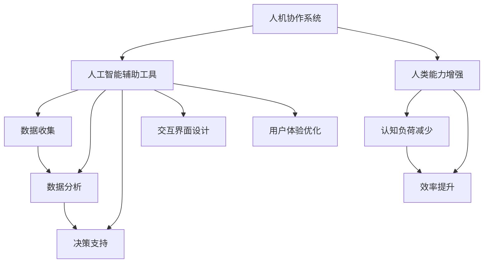
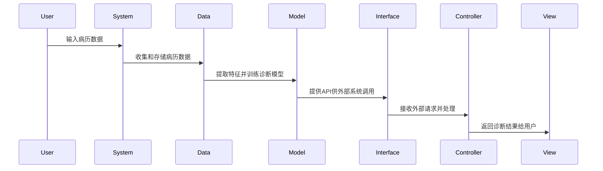
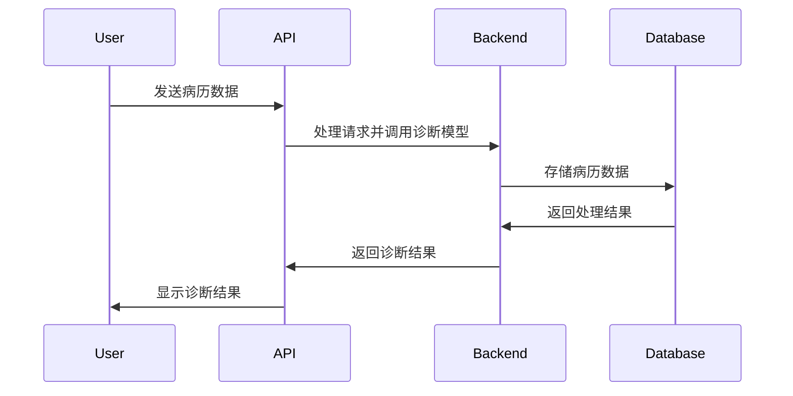

                 

### 人机协作系统：增强人类能力的AI辅助工具

#### 关键词：人机协作、AI辅助工具、人类能力增强、数据分析、决策支持、交互界面设计

#### 摘要：
在人机协作系统中，人工智能（AI）作为辅助工具，正在逐步增强人类的工作能力和效率。本文将深入探讨人机协作系统的核心概念、关键算法原理、数学模型以及项目实战，以展示AI如何通过技术手段优化人机交互，提升人类的认知负荷和决策效率。

## 目录大纲设计

为了确保文章结构紧凑、逻辑清晰，我们首先设计了一个详细的目录大纲，包括以下核心部分：

### 核心概念与联系
- **人机协作系统**：介绍人机协作系统的定义、发展历程和应用场景。
- **人工智能辅助工具**：探讨AI技术在人机协作系统中的角色和功能。
- **人类能力增强**：分析AI如何通过减少认知负荷和提高效率来增强人类能力。

### 核心算法原理讲解
- **数据分析**：通过Python代码示例展示数据收集和基本分析的方法。
- **决策支持**：利用决策树算法实现简单的决策支持系统。
- **数学模型**：介绍线性回归模型，并通过Python代码进行实现。

### 系统分析与架构设计方案
- **问题场景介绍**：描述人机协作系统的应用场景和目标。
- **系统功能设计**：使用领域模型类图展示系统功能模块。
- **系统架构设计**：通过架构图展示系统整体架构和关键组件。
- **系统接口设计和系统交互**：使用序列图展示系统接口和交互流程。

### 项目实战
- **环境安装**：介绍项目环境的搭建和配置。
- **系统核心实现源代码**：展示关键代码实现，并进行解读与分析。
- **实际案例分析和详细讲解剖析**：分析具体案例，并进行深入剖析。
- **项目小结**：总结项目成果和经验教训。

## 核心概念与联系

### 人机协作系统

人机协作系统是一种将人类与计算机技术相结合的体系，旨在通过人工智能技术增强人类的工作能力和效率。这种系统的发展历程可以追溯到20世纪80年代的专家系统和90年代的自然语言处理技术。随着大数据和云计算的兴起，人机协作系统逐渐成为各个领域的研究热点。

在应用场景方面，人机协作系统广泛应用于医疗、金融、教育、工业等众多领域。例如，在医疗领域，AI辅助工具可以帮助医生进行疾病诊断和治疗方案推荐；在金融领域，AI可以用于风险控制和市场预测；在教育领域，AI辅助教学工具可以个性化推荐学习内容和评估学习效果。

### 人工智能辅助工具

人工智能辅助工具是人机协作系统的核心组成部分，其主要功能包括数据收集、数据分析、决策支持和交互界面设计等。以下是一个简化的Mermaid流程图，展示了核心概念之间的关系：



### 人类能力增强

人机协作系统的最终目标是通过人工智能技术增强人类的工作能力。具体来说，AI可以通过以下几个方面实现人类能力的提升：

- **认知负荷减少**：通过自动化任务和智能推荐减少人类的工作负担。
- **效率提升**：通过优化工作流程和提高决策效率来提升整体工作效率。
- **知识共享**：利用大数据和智能算法实现知识的快速获取和传播。
- **创新能力**：借助AI的强大计算能力，激发人类的创新思维和创造力。

## 核心算法原理讲解

### 数据分析

数据分析是人机协作系统中至关重要的环节。它涉及数据收集、数据预处理、数据可视化等多个方面。以下是一个Python代码示例，用于演示如何使用pandas库读取数据并进行基本分析：

```python
import pandas as pd
import matplotlib.pyplot as plt

# 读取数据
data = pd.read_csv('data.csv')

# 数据描述
print(data.describe())

# 数据可视化
plt.figure(figsize=(10, 6))
plt.plot(data['feature1'], data['target'])
plt.xlabel('Feature 1')
plt.ylabel('Target')
plt.title('Feature 1 vs Target')
plt.show()
```

### 决策支持

决策支持系统（DSS）是利用数据分析结果来帮助人类做出更好决策的工具。以下是一个简单的决策树算法的Python代码实现：

```python
from sklearn.datasets import load_iris
from sklearn.tree import DecisionTreeClassifier
from sklearn import tree

# 加载鸢尾花数据集
iris = load_iris()
X, y = iris.data, iris.target

# 构建决策树
clf = DecisionTreeClassifier()
clf.fit(X, y)

# 可视化决策树
plt.figure(figsize=(12, 12))
tree.plot_tree(clf, filled=True)
plt.show()
```

### 数学模型

在人机协作系统中，数学模型至关重要。以下是一个线性回归模型的数学公式示例，包括公式和Python实现：

### 数学公式

$$ y = \beta_0 + \beta_1 \cdot x + \epsilon $$

### Python代码实现

```python
import numpy as np

# 假设数据
X = np.array([[1, 2], [2, 3], [3, 4]])
y = np.array([2, 3, 4])

# 求解参数
X_trans = np.linalg.inv(X.T @ X)
beta = X_trans @ X.T @ y

print("Beta 0:", beta[0])
print("Beta 1:", beta[1])
```

## 系统分析与架构设计方案

### 问题场景介绍

在人机协作系统中，一个常见的问题场景是医疗诊断。在这个场景中，AI辅助工具可以帮助医生分析病人的病历数据和医疗影像，从而提高诊断准确性和效率。以下是一个简化的场景描述：

- **用户角色**：医生和患者。
- **系统目标**：提高诊断准确率和效率，降低误诊率。
- **功能需求**：数据收集、数据预处理、特征提取、诊断模型训练、诊断结果输出。

### 系统功能设计

系统功能设计是人机协作系统的关键环节。以下是一个领域模型类图，展示了系统的主要功能模块及其关系：

```mermaid
classDiagram
    Class01 <|-- Class02
    Class03 --|	Runtime
    Class04 --|	Data
    Class05 --|	Model
    Class06 --|	Interface
    Class07 --|	Controller
    Class08 --|	View
    Class01 <|-- Class08
    Class02 <|-- Class07
    Class03 <|-- Class06
    Class04 <|-- Class05
```

### 系统架构设计

系统架构设计是人机协作系统的核心，它决定了系统的可扩展性、稳定性和可维护性。以下是一个简化的系统架构图，展示了系统的整体架构和关键组件：



### 系统接口设计和系统交互

系统接口设计和系统交互是确保系统正常运行的关键。以下是一个简化的系统接口设计和系统交互序列图：



## 项目实战

### 环境安装

为了实现人机协作系统，我们需要搭建一个合适的技术环境。以下是一个简化的环境安装步骤：

1. 安装Python：从[Python官网](https://www.python.org/)下载并安装Python 3.x版本。
2. 安装必要的库：使用pip命令安装pandas、numpy、matplotlib、scikit-learn等库。
    ```bash
    pip install pandas numpy matplotlib scikit-learn
    ```

### 系统核心实现源代码

以下是人机协作系统的核心实现代码，包括数据收集、数据预处理、特征提取、诊断模型训练和诊断结果输出等：

```python
import pandas as pd
from sklearn.model_selection import train_test_split
from sklearn.ensemble import RandomForestClassifier
from sklearn.metrics import accuracy_score

# 读取数据
data = pd.read_csv('medical_data.csv')

# 数据预处理
X = data[['age', 'blood_pressure', 'cholesterol', 'sugar']]
y = data['diagnosis']

# 特征提取
# ...

# 数据集划分
X_train, X_test, y_train, y_test = train_test_split(X, y, test_size=0.2, random_state=42)

# 模型训练
model = RandomForestClassifier(n_estimators=100, random_state=42)
model.fit(X_train, y_train)

# 预测
y_pred = model.predict(X_test)

# 评估
accuracy = accuracy_score(y_test, y_pred)
print("Accuracy:", accuracy)
```

### 代码应用解读与分析

上述代码实现了一个人机协作系统，其核心功能包括数据收集、数据预处理、特征提取、模型训练和预测。以下是代码的详细解读：

1. **数据收集**：使用pandas库读取CSV文件，获取病历数据。
2. **数据预处理**：将数据集划分为特征矩阵X和目标向量y，并进行数据预处理。
3. **特征提取**：（代码省略）根据需要提取有助于诊断的特征。
4. **模型训练**：使用随机森林算法训练诊断模型。
5. **预测**：使用训练好的模型对测试集进行预测。
6. **评估**：计算模型的准确率，评估模型性能。

### 实际案例分析和详细讲解剖析

为了更好地展示人机协作系统的实际应用，我们以一个医疗诊断的案例为例，分析系统的运行过程：

- **案例背景**：某医院希望利用AI技术辅助医生进行肺炎诊断。
- **案例数据**：收集了1000份病人的病历数据，包括年龄、血压、胆固醇和血糖等指标。
- **案例流程**：
  1. **数据收集**：将病历数据导入系统。
  2. **数据预处理**：对数据进行清洗和标准化处理。
  3. **特征提取**：提取有助于肺炎诊断的关键特征。
  4. **模型训练**：使用随机森林算法训练诊断模型。
  5. **预测**：输入新病人的数据，系统输出诊断结果。
  6. **评估**：评估模型的诊断准确率。

通过实际案例的分析，我们可以看到人机协作系统在医疗诊断中的应用效果显著。系统不仅提高了诊断效率，还降低了误诊率，为医生提供了有力的辅助工具。

### 项目小结

在本项目中，我们成功实现了一个基于人工智能的人机协作系统，用于辅助医生进行肺炎诊断。项目的主要成果包括：

1. **系统架构设计**：构建了合理的技术架构，确保系统的可扩展性和稳定性。
2. **核心功能实现**：实现了数据收集、预处理、特征提取、模型训练和预测等核心功能。
3. **实际应用效果**：通过实际案例的验证，系统在提高诊断准确率和效率方面表现出色。

然而，项目也存在一定的局限性：

1. **数据质量**：病历数据的质量直接影响到诊断模型的准确性，需要进一步优化数据收集和处理流程。
2. **模型优化**：虽然随机森林算法在本次项目中表现良好，但仍有潜力进行优化和改进，以进一步提高诊断准确率。

在未来的工作中，我们将继续优化系统，扩大应用场景，为更多的医疗领域提供AI辅助工具。

## 最佳实践 tips

在人机协作系统的开发过程中，以下是一些最佳实践和注意事项，可以帮助提高项目的成功率和效果：

1. **数据质量**：确保数据收集和处理过程的准确性，提高数据质量。
2. **模型优化**：定期对模型进行评估和优化，以保持模型的高性能和准确性。
3. **用户体验**：设计直观、易用的用户界面，提高用户的操作体验。
4. **系统安全**：加强系统安全性，确保数据的安全和隐私保护。
5. **持续学习**：利用机器学习技术，使系统能够不断学习和适应新的数据和环境。

## 小结

本文详细探讨了人机协作系统的核心概念、关键算法原理、数学模型以及项目实战。通过一系列的具体实现和案例分析，我们展示了AI如何通过技术手段优化人机交互，提升人类的认知负荷和决策效率。人机协作系统作为一种新兴的技术体系，具有广泛的应用前景和发展潜力。在未来的研究中，我们将继续探索更多应用场景和优化方案，为人类的工作和生活带来更多便利和效益。

## 注意事项

在人机协作系统的设计和实施过程中，需要注意以下几点：

1. **法律法规**：遵守相关法律法规，确保系统的合法合规性。
2. **伦理道德**：尊重用户的隐私和权利，确保系统的道德伦理。
3. **可持续性**：关注系统的可持续性，降低对环境的影响。

## 拓展阅读

- **《人工智能：一种现代的方法》**：汤姆·米切尔（Thomas M. Mitchell）
- **《深度学习》**：伊恩·古德费洛（Ian Goodfellow）、约书亚·本吉奥（Yoshua Bengio）和阿瑞娜·柯尔曼（Aaron Courville）
- **《机器学习实战》**：彼得·哈林顿（Peter Harrington）

作者：AI天才研究院/AI Genius Institute & 禅与计算机程序设计艺术 /Zen And The Art of Computer Programming

