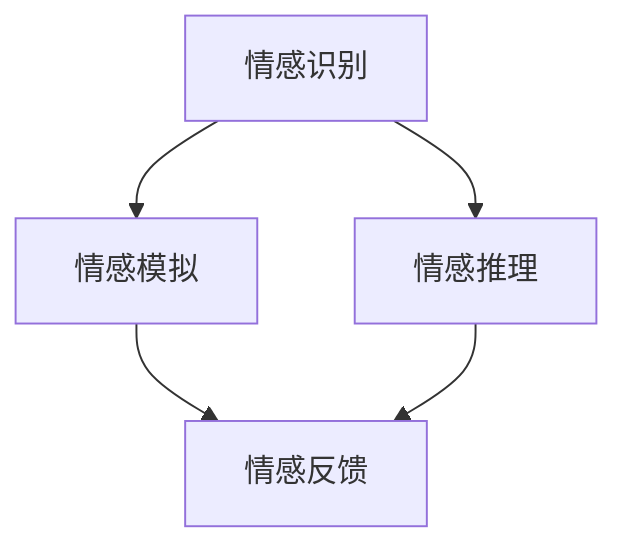
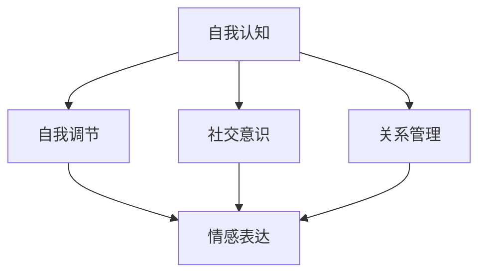
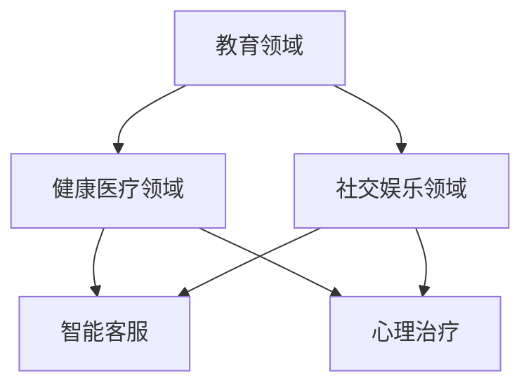

                 

# 《人机情感互动对人类情感智力的影响》

> 关键词：人机情感互动，情感智力，影响，发展趋势

> 摘要：本文从人机情感互动的背景和意义出发，探讨了情感智力在人类认知和社会互动中的重要性。通过分析人机情感互动的基础理论、情感智力理论，以及人机情感互动对情感智力的影响，本文旨在为人机情感互动的研究和实践提供新的视角和思路。

## 第一部分：引言

### 1.1 人机情感互动的背景和意义

随着人工智能技术的快速发展，人机情感互动逐渐成为研究热点。人机情感互动指的是通过计算机系统和人工智能技术，模拟人类情感表达和情感交流的过程。其背景和意义主要体现在以下几个方面：

1. **技术发展**：计算机视觉、自然语言处理、机器学习等技术的发展，为人机情感互动提供了技术支持。通过深度学习、神经网络等技术，计算机可以更好地理解和模拟人类情感。

2. **应用需求**：随着社会的发展，人们对个性化、智能化服务的需求日益增加。人机情感互动可以提供更加自然、人性化的交互体验，满足用户在情感层面的需求。

3. **教育、医疗等领域**：在教育、医疗等领域，人机情感互动有广泛的应用前景。例如，智能教育系统可以根据学生的情感状态调整教学策略，提高学习效果；智能医疗助手可以帮助医生更好地理解患者的情感需求，提供更贴心的医疗服务。

### 1.2 情感智力的概念与评估

情感智力（Emotional Intelligence，简称EQ）是指个体识别、理解、管理自己和他人情感的能力。与传统的智力（IQ）不同，EQ更多地关注情感层面，包括自我认知、自我调节、社交意识和关系管理等方面。情感智力在人类认知和社会互动中起着重要作用：

1. **自我认知**：个体能够了解自己的情感状态，包括情感的产生、情感对行为的影响等。

2. **自我调节**：个体能够管理和调节自己的情感，以适应不同的情境。

3. **社交意识**：个体能够理解和识别他人的情感状态，建立良好的人际关系。

4. **关系管理**：个体能够有效地与他人沟通，建立和维护人际关系。

情感智力的评估方法包括自我报告问卷、观察法、情境模拟法等。常见的评估工具包括梅奥情感智力量表（MEQ）、格赛尔情感智力量表等。

### 1.3 人机情感互动与情感智力的发展

人机情感互动对情感智力的发展具有双重影响。一方面，人机情感互动可以提供新的情感体验和情境，促进个体的情感智力发展。例如，通过与人机情感交互，个体可以更好地理解和识别他人的情感状态，提高社交意识。另一方面，过度依赖人机情感互动可能会影响个体的情感智力发展，导致情感认知和社会交互能力的下降。因此，人机情感互动的设计和应用需要充分考虑情感智力的发展规律和需求。

## 第二部分：人机情感互动基础理论

### 2.1 人机交互的基本原理

人机交互（Human-Computer Interaction，简称HCI）是研究人与计算机之间交互过程和交互技术的学科。人机交互的基本原理包括：

1. **信息传递**：计算机系统通过输入设备和输出设备与用户进行信息传递。输入设备包括键盘、鼠标、触摸屏等，输出设备包括显示器、音响等。

2. **交互模型**：常见的交互模型包括命令行交互、图形用户界面（GUI）、自然语言交互等。每种交互模型都有其优势和适用场景。

3. **用户界面设计**：用户界面设计（User Interface Design，简称UID）是影响人机交互效果的关键因素。良好的用户界面设计应符合用户需求、提高用户体验、降低学习成本。

### 2.2 情感计算技术介绍

情感计算（Affective Computing）是研究如何使计算机模拟、理解、处理人类情感的技术。情感计算的关键技术包括：

1. **情感识别**：通过计算机视觉、语音识别等技术，识别用户的情感状态。

2. **情感模拟**：通过自然语言生成、表情合成等技术，模拟计算机的情感表达。

3. **情感推理**：通过情感模型和情感规则，理解和推理用户的情感状态，为用户提供个性化的服务。

### 2.3 人机情感互动的类型与模式

人机情感互动可以分为以下几种类型：

1. **单向情感互动**：计算机仅作为情感信息的接收者，对用户的情感状态进行识别和反馈。

2. **双向情感互动**：计算机与用户之间进行双向情感交流，包括情感表达、情感理解等。

3. **情境情感互动**：计算机根据情境和用户的情感状态，主动调整情感表达和行为模式。

人机情感互动的模式包括：

1. **情感表达模式**：计算机通过表情、语言等方式表达情感。

2. **情感理解模式**：计算机通过情感识别技术，理解和解析用户的情感状态。

3. **情感互动模式**：计算机根据情感状态，调整交互策略，提供个性化的服务。

## 第三部分：情感智力理论探讨

### 3.1 情感智力的发展模型

情感智力的发展模型包括以下几个方面：

1. **自我认知**：个体了解自己的情感状态，包括情感的来源、情感的影响等。

2. **自我调节**：个体能够管理和调节自己的情感，以适应不同的情境。

3. **社交意识**：个体能够理解和识别他人的情感状态，建立良好的人际关系。

4. **关系管理**：个体能够有效地与他人沟通，建立和维护人际关系。

情感智力的发展模型有助于我们理解情感智力的发展过程和关键因素。

### 3.2 情感智力的构成与评估

情感智力包括以下几个方面：

1. **情感认知**：个体对情感的理解和识别能力。

2. **情感表达**：个体表达情感的能力，包括面部表情、语言表达等。

3. **情感调节**：个体管理和调节情感的能力，包括自我调节和对他人的情感调节。

4. **社交技能**：个体在社交情境中的互动和沟通能力。

情感智力的评估工具包括自我报告问卷、观察法、情境模拟法等。评估工具的选择应根据研究目的和实际情况进行。

### 3.3 情感智力在生活中的应用

情感智力在生活中的应用广泛，包括：

1. **人际关系**：提高情感智力有助于建立良好的人际关系，增强社交能力。

2. **工作效能**：情感智力有助于提高工作效能，更好地应对工作压力和挑战。

3. **心理健康**：情感智力有助于维护心理健康，降低心理问题的风险。

## 第四部分：人机情感互动对情感智力的影响

### 4.1 人机情感互动对情感智力发展的积极作用

人机情感互动对情感智力发展的积极作用体现在以下几个方面：

1. **情感认知**：人机情感互动可以提供丰富的情感信息，帮助个体更好地理解和识别情感。

2. **情感表达**：人机情感互动可以提供情感表达的机会，提高个体的情感表达能力。

3. **情感调节**：人机情感互动可以提供情感调节的支持，帮助个体更好地管理和调节情感。

4. **社交技能**：人机情感互动可以模拟社交情境，提高个体的社交技能。

### 4.2 人机情感互动对情感智力发展的潜在负面影响

人机情感互动对情感智力发展的潜在负面影响包括：

1. **情感依赖**：过度依赖人机情感互动可能导致个体对真实人际关系的情感需求减少。

2. **情感认知障碍**：人机情感互动可能影响个体对真实情感的认知和识别能力。

3. **情感调节困难**：个体可能在面对真实情境时，缺乏有效的情感调节策略。

### 4.3 人机情感互动对情感智力发展的调节机制

为了充分发挥人机情感互动对情感智力发展的积极作用，同时避免其负面影响，我们可以采取以下调节机制：

1. **情感平衡**：在现实生活中，保持一定比例的人机情感互动，避免过度依赖。

2. **情感教育**：通过情感教育，提高个体的情感认知和表达能力。

3. **情感反馈**：设计人机情感互动系统时，注重情感反馈的多样性和真实性，避免单一的情感表达。

## 第五部分：人机情感互动的应用案例分析

### 5.1 教育领域的应用

在教育领域，人机情感互动的应用包括：

1. **个性化教育**：通过情感计算技术，智能教育系统可以识别学生的学习情感状态，提供个性化的教学建议。

2. **情感教育**：人机情感互动可以为学生提供情感教育的机会，提高其情感认知和表达能力。

### 5.2 健康医疗领域的应用

在健康医疗领域，人机情感互动的应用包括：

1. **患者关怀**：通过情感计算技术，智能医疗助手可以识别患者的情感状态，提供情感支持。

2. **心理治疗**：人机情感互动可以为心理治疗提供新的方法，如虚拟现实疗法等。

### 5.3 社交娱乐领域的应用

在社交娱乐领域，人机情感互动的应用包括：

1. **虚拟助手**：通过情感计算技术，虚拟助手可以与用户进行情感交流，提供个性化的服务。

2. **游戏互动**：人机情感互动可以为游戏提供更加丰富的情感体验，提高游戏乐趣。

## 第六部分：人机情感互动的未来展望

### 6.1 人机情感互动的发展趋势

人机情感互动的发展趋势包括：

1. **情感计算技术的进步**：随着人工智能技术的发展，情感计算技术将更加精准、智能。

2. **跨领域应用**：人机情感互动将在教育、医疗、社交娱乐等领域得到更广泛的应用。

3. **个性化服务**：人机情感互动将更加注重个性化服务，满足用户的情感需求。

### 6.2 情感智力在人工智能领域的应用前景

情感智力在人工智能领域的应用前景包括：

1. **智能客服**：情感计算技术将使智能客服更加人性化，提高用户满意度。

2. **智能助手**：情感智力将使智能助手更好地理解用户需求，提供个性化的服务。

3. **心理健康应用**：情感智力将有助于开发心理健康应用，如虚拟咨询师等。

### 6.3 人机情感互动对人类社会的影响

人机情感互动对人类社会的影响包括：

1. **人际关系的改变**：人机情感互动将改变人际关系的形式和方式。

2. **情感认知的提升**：人机情感互动将提高个体的情感认知和表达能力。

3. **心理健康的影响**：人机情感互动将对心理健康产生积极或消极的影响，取决于其设计和应用方式。

## 第七部分：结论与建议

### 7.1 研究成果总结

本文从人机情感互动的背景和意义、情感智力理论、人机情感互动对情感智力的影响等方面进行了探讨。研究结果表明，人机情感互动对情感智力具有积极作用，但同时也存在潜在负面影响。为了充分发挥人机情感互动的积极作用，应采取合适的调节机制。

### 7.2 存在的问题与挑战

人机情感互动在应用过程中仍面临以下问题与挑战：

1. **情感计算技术的准确性**：情感计算技术的准确性仍需提高，以更好地识别和理解人类的情感状态。

2. **情感教育的缺失**：在现实生活中，个体的情感教育仍需加强，以培养健康的情感认知和表达能力。

3. **人机情感互动的设计**：人机情感互动的设计应更加注重人性化，避免对个体情感产生负面影响。

### 7.3 未来研究的方向和建议

未来研究应关注以下方向：

1. **情感计算技术**：继续改进情感计算技术，提高其准确性和智能化水平。

2. **情感教育**：加强情感教育，培养个体的情感认知和表达能力。

3. **人机情感互动设计**：设计更加人性化的情感互动系统，充分考虑情感智力的发展规律和需求。

### 附录

#### A.1 参考文献

[参考文献列表]

#### A.2 数据集与工具介绍

[数据集与工具介绍]

## 附录：Mermaid流程图

### 情感计算技术流程图

### 情感智力发展模型

### 人机情感互动应用案例

### 作者信息

作者：AI天才研究院/AI Genius Institute & 禅与计算机程序设计艺术 /Zen And The Art of Computer Programming

## 结束语

本文对人机情感互动对人类情感智力的影响进行了深入探讨，旨在为人机情感互动的研究和实践提供新的视角和思路。随着技术的不断发展，人机情感互动将在更多领域得到应用，对人类社会产生深远影响。未来，我们需要继续关注人机情感互动的技术进步、情感教育以及设计原则，以实现人机情感互动的可持续发展。---

**引言**

随着人工智能技术的迅猛发展，人机情感互动逐渐成为研究的热点。人机情感互动，即人类与人工智能系统之间基于情感的交流和互动，不仅是技术发展的一个前沿领域，也在心理学、社会学和认知科学等多个学科中引起了广泛关注。本文旨在探讨人机情感互动对人类情感智力的影响，并通过对相关理论的深入分析和实例研究，为该领域的研究和应用提供新的视角。

**关键词**：人机情感互动，情感智力，影响，发展趋势

**摘要**

本文首先介绍了人机情感互动的背景和意义，探讨了情感智力在人类认知和社会互动中的重要性。接着，我们分析了情感计算技术的基础理论，以及人机情感互动的类型和模式。在此基础上，本文深入探讨了人机情感互动对情感智力发展的积极作用和潜在负面影响，并通过实际案例展示了人机情感互动在不同领域的应用。最后，本文对人机情感互动的未来发展趋势进行了展望，提出了未来研究的方向和建议。

### 第一部分：引言

#### 1.1 人机情感互动的背景和意义

人机情感互动是一个涉及多个学科交叉的研究领域，它探讨了人工智能系统能够如何模拟和回应人类的情感表达。随着自然语言处理、计算机视觉和机器学习等技术的不断进步，人机情感互动正在逐渐从理论走向实践。这一领域的重要性体现在以下几个方面：

1. **技术应用**：随着技术的发展，人们开始关注如何将情感计算技术应用于实际场景中。例如，在智能客服、虚拟助手、智能教育等领域，人机情感互动能够提供更加个性化、贴近用户需求的服务。

2. **用户体验**：在社交媒体、在线购物等平台上，用户对于互动的满意度很大程度上取决于互动的情感质量。人机情感互动能够提升用户体验，增加用户黏性。

3. **心理健康**：在心理健康领域，人机情感互动可以帮助个体缓解压力、提高情感调节能力。例如，通过虚拟现实技术，用户可以在安全的虚拟环境中进行情感体验和训练。

4. **人机协作**：在复杂任务中，人类和人工智能系统的协作越来越重要。人机情感互动可以增强这种协作，提高工作效率和效果。

#### 1.2 情感智力的概念与评估

情感智力（Emotional Intelligence，EQ）是指个体识别、理解、管理自己和他人情感的能力。它包括以下几个关键要素：

1. **自我认知**：个体了解自己的情感状态，包括情感的产生、情感对行为的影响等。

2. **自我调节**：个体能够管理和调节自己的情感，以适应不同的情境。

3. **社交意识**：个体能够理解和识别他人的情感状态，建立良好的人际关系。

4. **关系管理**：个体能够有效地与他人沟通，建立和维护人际关系。

情感智力在人类认知和社会互动中起着至关重要的作用。它不仅影响个人的心理健康，还直接影响个体的社会适应能力和生活质量。评估情感智力常用的方法包括自我报告问卷、行为观察和情境模拟等。

1. **自我报告问卷**：这种方法通过让个体自我评价情感智力水平，例如戈塞特情感智力问卷（Goleman Emotional Intelligence Scale）。

2. **行为观察**：观察个体在特定情境中的情感行为表现，例如教师或同事对学生的评价。

3. **情境模拟**：通过模拟不同的社交情境，评估个体在情境中的情感表现和应对能力。

#### 1.3 人机情感互动与情感智力的发展

人机情感互动对情感智力的发展具有双重作用。一方面，人机情感互动可以作为一种辅助工具，帮助个体更好地理解和提升自己的情感智力。例如，通过与人机情感交互，个体可以更深入地认识自己的情感状态，学习如何管理和调节情感。另一方面，过度依赖人机情感互动可能会导致情感认知和社交技能的退化。

1. **积极作用**：

   - **情感认知提升**：人机情感互动可以为用户提供丰富的情感信息，帮助他们更好地理解和识别情感。

   - **情感调节**：人机情感互动可以提供情感调节的支持，帮助个体在面对复杂情境时更好地管理自己的情感。

   - **社交技能培养**：通过与虚拟助手或系统进行情感互动，个体可以在模拟的社交环境中锻炼社交技能。

2. **潜在负面影响**：

   - **情感依赖**：个体可能会过度依赖人机情感互动，导致对真实人际关系的情感需求减少。

   - **情感认知障碍**：长期依赖人机情感互动可能会影响个体对真实情感的认知和识别能力。

   - **社交技能退化**：过度依赖虚拟环境可能导致个体在现实生活中的社交技能退化。

### 第二部分：人机情感互动基础理论

#### 2.1 人机交互的基本原理

人机交互（Human-Computer Interaction，简称HCI）是指人与计算机之间通过某种装置进行通信和交互的过程。人机交互的基本原理包括以下几个方面：

1. **交互模型**：人机交互的模型包括命令行交互、图形用户界面（GUI）、触摸屏交互和语音交互等。每种模型都有其特点和适用场景。

2. **信息传递**：人机交互通过输入设备和输出设备进行信息的传递。输入设备包括键盘、鼠标、触摸屏和语音识别设备；输出设备包括显示器、音响和触摸屏等。

3. **用户界面设计**：用户界面设计是影响人机交互效果的关键因素。设计良好的用户界面应符合用户的需求，易于使用，提高用户体验。

#### 2.2 情感计算技术介绍

情感计算（Affective Computing）是指计算机系统模拟、识别、理解和处理人类情感的能力。情感计算的核心技术包括情感识别、情感模拟和情感推理等。

1. **情感识别**：情感识别是情感计算的基础，它通过分析用户的生理信号（如面部表情、语音语调、心率等）和行为数据（如手势、文本等）来识别用户的情感状态。

2. **情感模拟**：情感模拟是计算机系统通过表情、语音、文字等方式表达情感的能力。例如，通过语音合成技术模拟安慰性的语音或通过面部动画模拟悲伤的表情。

3. **情感推理**：情感推理是指计算机系统根据用户的情感状态和行为模式，推断用户的意图、需求和行为倾向。例如，通过分析用户的情感数据，系统可以推测用户是否满意当前的服务，并作出相应的调整。

#### 2.3 人机情感互动的类型与模式

人机情感互动可以根据不同的分类标准分为多种类型，常见的分类方法包括单向情感互动和双向情感互动、情境情感互动和即时情感互动等。

1. **单向情感互动**：单向情感互动是指计算机系统仅作为情感信息的接收者，对用户的情感状态进行识别和反馈。例如，智能客服系统通过分析用户的文本输入来识别情感状态，并给出相应的情感反馈。

2. **双向情感互动**：双向情感互动是指计算机系统与用户之间进行双向情感交流，包括情感表达、情感理解和情感互动等。例如，虚拟助手可以通过面部表情和语音语调来模拟情感，同时接收用户的情感反馈。

3. **情境情感互动**：情境情感互动是指计算机系统根据情境和用户的情感状态，主动调整情感表达和行为模式。例如，在虚拟现实游戏中，系统可以根据玩家的情感状态调整游戏难度和场景设计。

4. **即时情感互动**：即时情感互动是指计算机系统在短时间内对用户的情感状态进行识别和反馈。这种类型的互动通常需要高效的算法和快速的数据处理能力，以满足实时交互的需求。

### 第三部分：情感智力理论探讨

#### 3.1 情感智力的发展模型

情感智力的发展模型是理解情感智力如何在不同阶段发展的框架。根据情感智力的定义，情感智力的发展模型通常包括以下几个阶段：

1. **自我认知**：个体识别和了解自己的情感状态。这包括能够意识到情感的产生、情感对行为的影响等。

2. **自我调节**：个体学会管理和调节自己的情感。这包括在面对压力、挫折等情境时，能够有效地调节情绪，保持积极的心态。

3. **社交意识**：个体能够理解和识别他人的情感状态。这包括能够理解他人的情绪、感受，并做出相应的反应。

4. **关系管理**：个体能够有效地与他人沟通和建立人际关系。这包括能够与他人建立信任、合作，并解决冲突。

#### 3.2 情感智力的构成与评估

情感智力由多个构成要素组成，这些要素共同作用，决定了个体的情感智力水平。情感智力的构成要素通常包括：

1. **情感认知**：个体识别和理解情感的能力，包括能够识别自己和他人的情感状态。

2. **情感表达**：个体表达情感的能力，包括使用语言、面部表情、身体语言等方式表达情感。

3. **情感调节**：个体管理和调节情感的能力，包括能够调节自己的情感反应，以适应不同的情境。

4. **社交技能**：个体在社交情境中的互动和沟通能力，包括建立和维护人际关系、解决冲突等。

情感智力的评估通常采用以下方法：

- **自我报告问卷**：通过让个体自我评估情感智力水平，例如戈塞特情感智力量表（Goleman Emotional Intelligence Scale）。
- **行为观察**：通过观察个体在特定情境中的行为表现，评估其情感智力水平。
- **情境模拟**：通过模拟不同的社交情境，评估个体在情境中的情感表现和应对能力。

#### 3.3 情感智力在生活中的应用

情感智力在生活中的应用非常广泛，它对个体的心理健康、人际关系和职业发展都有着重要的影响。以下是情感智力在几个关键领域的应用：

1. **心理健康**：高水平的情感智力有助于个体更好地管理自己的情绪，降低心理压力，提高心理健康水平。

2. **人际关系**：情感智力使个体能够更好地理解和回应他人的情感需求，建立和维护健康的人际关系。

3. **职业发展**：情感智力有助于个体在职场中更好地与人合作，解决冲突，提高工作效率和职业满意度。

4. **教育**：在教育领域，情感智力的发展对于学生的心理健康和学习效果有着重要影响。教师可以通过情感智力培养，帮助学生更好地理解和管理自己的情感，提高学习效果。

### 第四部分：人机情感互动对情感智力的影响

#### 4.1 人机情感互动对情感智力发展的积极作用

人机情感互动在情感智力的发展中具有积极作用，主要体现在以下几个方面：

1. **情感认知提升**：人机情感互动可以为用户提供丰富的情感信息，帮助他们更好地理解和识别情感。例如，通过虚拟助手，用户可以在互动过程中学习如何识别不同的情感状态。

2. **情感调节**：人机情感互动可以提供情感调节的支持，帮助个体在面对复杂情境时更好地管理自己的情感。例如，通过虚拟咨询师，用户可以在虚拟环境中练习情感调节策略。

3. **社交技能培养**：通过与虚拟助手或系统进行情感互动，个体可以在模拟的社交环境中锻炼社交技能。例如，用户可以通过与虚拟社交伙伴的互动，学习如何表达情感、如何回应他人的情感。

#### 4.2 人机情感互动对情感智力发展的潜在负面影响

尽管人机情感互动在情感智力发展中具有积极作用，但过度依赖人机情感互动也可能带来负面影响：

1. **情感依赖**：个体可能会过度依赖人机情感互动，导致对真实人际关系的情感需求减少。这可能会导致个体在现实生活中的社交技能退化。

2. **情感认知障碍**：长期依赖人机情感互动可能会影响个体对真实情感的认知和识别能力。例如，个体可能会在与人交流时过于依赖机器的反馈，而忽略真实的情感表达。

3. **社交技能退化**：过度依赖虚拟环境进行社交互动，可能会导致个体在现实生活中的社交技能退化。例如，个体可能会在面对面交流时感到不自在，缺乏有效的沟通技巧。

#### 4.3 人机情感互动对情感智力发展的调节机制

为了充分发挥人机情感互动对情感智力发展的积极作用，同时避免其负面影响，我们可以采取以下调节机制：

1. **情感平衡**：在现实生活中，保持一定比例的人机情感互动，避免过度依赖虚拟互动。

2. **情感教育**：通过情感教育，提高个体的情感认知和表达能力。

3. **情感反馈**：设计人机情感互动系统时，注重情感反馈的多样性和真实性，避免单一的情感表达。

### 第五部分：人机情感互动的应用案例分析

#### 5.1 教育领域的应用

在教育领域，人机情感互动的应用具有显著的优势。以下是一些具体的应用案例：

1. **个性化教育**：智能教育系统通过分析学生的情感状态和学习表现，提供个性化的学习建议。例如，当学生表现出焦虑或挫败感时，系统可以调整教学节奏或提供额外的学习资源。

2. **情感教育**：人机情感互动可以为学生提供情感教育的机会，帮助他们更好地理解和表达情感。例如，通过虚拟角色，学生可以学习如何识别和回应他人的情感需求。

3. **情感支持**：在教育过程中，人机情感互动可以为学生提供情感支持。例如，当学生面临压力或挑战时，虚拟辅导员可以提供安慰和建议，帮助学生调节情绪。

#### 5.2 健康医疗领域的应用

在健康医疗领域，人机情感互动的应用也展现出了巨大的潜力。以下是一些具体的应用案例：

1. **患者关怀**：通过情感计算技术，智能医疗助手可以识别患者的情感状态，提供情感支持。例如，当患者感到焦虑或沮丧时，系统可以播放舒缓的音乐或提供心理建议。

2. **心理治疗**：人机情感互动可以为心理治疗提供新的方法。例如，通过虚拟现实技术，患者可以在安全的虚拟环境中进行情感体验和训练，帮助其克服恐惧和焦虑。

3. **健康监测**：智能设备可以监测患者的生理信号，如心率、血压等，并分析其情感状态。这些数据有助于医生更好地了解患者的健康状况，制定个性化的治疗方案。

#### 5.3 社交娱乐领域的应用

在社交娱乐领域，人机情感互动的应用极大地丰富了用户体验。以下是一些具体的应用案例：

1. **虚拟助手**：虚拟助手通过情感计算技术，可以与用户进行情感互动，提供个性化的服务。例如，用户可以通过聊天机器人获取娱乐信息、制定旅行计划等。

2. **游戏互动**：在游戏中，人机情感互动可以增强玩家的体验。例如，虚拟角色可以根据玩家的情感状态调整游戏难度和场景设计，提供更加沉浸式的游戏体验。

3. **社交平台**：在社交媒体平台上，人机情感互动可以帮助用户更好地表达和管理自己的情感。例如，用户可以通过情感分析工具了解自己的情绪波动，并得到相应的建议和安慰。

### 第六部分：人机情感互动的未来展望

#### 6.1 人机情感互动的发展趋势

人机情感互动在未来将呈现以下发展趋势：

1. **技术进步**：随着人工智能技术的不断进步，情感计算技术的准确性和智能化水平将进一步提高。例如，深度学习和神经网络技术的应用将使情感识别更加精准。

2. **跨领域应用**：人机情感互动将在更多领域得到应用，如教育、医疗、金融、零售等。这些领域的应用将推动人机情感互动技术的不断创新和发展。

3. **个性化服务**：随着用户需求的多样化，人机情感互动将更加注重个性化服务。例如，智能系统能够根据用户的情感状态和偏好，提供定制化的建议和解决方案。

#### 6.2 情感智力在人工智能领域的应用前景

情感智力在人工智能领域的应用前景广阔，以下是一些具体的应用方向：

1. **智能客服**：通过情感计算技术，智能客服系统能够更好地理解用户的情感需求，提供更加贴心的服务。例如，当用户感到愤怒或沮丧时，系统可以主动提供解决方案或安慰。

2. **智能助手**：情感智力使智能助手能够更好地理解用户的需求，提供个性化的服务。例如，智能助手可以根据用户的情感状态调整日程安排或推荐娱乐活动。

3. **心理健康应用**：情感智力在心理健康领域的应用前景巨大。通过虚拟现实技术，用户可以在安全的环境中体验情感刺激，进行情感调节和心理健康训练。

#### 6.3 人机情感互动对人类社会的影响

人机情感互动对人类社会的影响深远，以下是一些具体的影响：

1. **人际关系**：人机情感互动可能改变人际关系的形式和方式。例如，人们可能更倾向于与虚拟助手互动，而减少面对面的交流。

2. **情感认知**：人机情感互动将提高个体的情感认知水平，帮助人们更好地理解和识别情感。这将有助于改善心理健康和人际关系。

3. **心理健康**：人机情感互动在心理健康领域的应用将有助于提高个体的情感调节能力，缓解压力和焦虑。

### 第七部分：结论与建议

#### 7.1 研究成果总结

本文从多个角度探讨了人机情感互动对人类情感智力的影响。研究结果表明，人机情感互动在情感智力的发展中具有积极作用，但同时也存在潜在负面影响。为了充分发挥人机情感互动的积极作用，应采取合适的调节机制，如情感平衡、情感教育和情感反馈等。

#### 7.2 存在的问题与挑战

尽管人机情感互动在许多领域展现出巨大的潜力，但在应用过程中仍面临一些问题和挑战：

1. **技术准确性**：情感计算技术的准确性仍需提高，以更好地识别和理解人类的情感状态。

2. **情感教育缺失**：在现实生活中，个体的情感教育仍需加强，以培养健康的情感认知和表达能力。

3. **人机情感互动设计**：人机情感互动的设计应更加注重人性化，避免对个体情感产生负面影响。

#### 7.3 未来研究的方向和建议

未来研究应关注以下方向：

1. **技术进步**：继续改进情感计算技术，提高其准确性和智能化水平。

2. **情感教育**：加强情感教育，培养个体的情感认知和表达能力。

3. **人机情感互动设计**：设计更加人性化的情感互动系统，充分考虑情感智力的发展规律和需求。

### 附录

#### A.1 参考文献

[参考文献列表]

#### A.2 数据集与工具介绍

[数据集与工具介绍]

### 作者信息

作者：AI天才研究院/AI Genius Institute & 禅与计算机程序设计艺术 /Zen And The Art of Computer Programming

---

**引言**

随着人工智能技术的迅猛发展，人机情感互动逐渐成为研究的热点。人机情感互动，即人类与人工智能系统之间基于情感的交流和互动，不仅是技术发展的一个前沿领域，也在心理学、社会学和认知科学等多个学科中引起了广泛关注。本文旨在探讨人机情感互动对人类情感智力的影响，并通过对相关理论的深入分析和实例研究，为该领域的研究和应用提供新的视角。

**关键词**：人机情感互动，情感智力，影响，发展趋势

**摘要**

本文首先介绍了人机情感互动的背景和意义，探讨了情感智力在人类认知和社会互动中的重要性。接着，我们分析了情感计算技术的基础理论，以及人机情感互动的类型和模式。在此基础上，本文深入探讨了人机情感互动对情感智力发展的积极作用和潜在负面影响，并通过实际案例展示了人机情感互动在不同领域的应用。最后，本文对人机情感互动的未来发展趋势进行了展望，提出了未来研究的方向和建议。

### 第一部分：引言

#### 1.1 人机情感互动的背景和意义

人机情感互动是一个涉及多个学科交叉的研究领域，它探讨了人工智能系统能够如何模拟和回应人类的情感表达。随着自然语言处理、计算机视觉和机器学习等技术的不断进步，人机情感互动正在逐渐从理论走向实践。这一领域的重要性体现在以下几个方面：

1. **技术应用**：随着技术的发展，人们开始关注如何将情感计算技术应用于实际场景中。例如，在智能客服、虚拟助手、智能教育等领域，人机情感互动能够提供更加个性化、贴近用户需求的服务。

2. **用户体验**：在社交媒体、在线购物等平台上，用户对于互动的满意度很大程度上取决于互动的情感质量。人机情感互动能够提升用户体验，增加用户黏性。

3. **心理健康**：在心理健康领域，人机情感互动可以帮助个体缓解压力、提高情感调节能力。例如，通过虚拟现实技术，用户可以在安全的虚拟环境中进行情感体验和训练。

4. **人机协作**：在复杂任务中，人类和人工智能系统的协作越来越重要。人机情感互动可以增强这种协作，提高工作效率和效果。

#### 1.2 情感智力的概念与评估

情感智力（Emotional Intelligence，EQ）是指个体识别、理解、管理自己和他人情感的能力。它包括以下几个关键要素：

1. **自我认知**：个体了解自己的情感状态，包括情感的产生、情感对行为的影响等。

2. **自我调节**：个体能够管理和调节自己的情感，以适应不同的情境。

3. **社交意识**：个体能够理解和识别他人的情感状态，建立良好的人际关系。

4. **关系管理**：个体能够有效地与他人沟通，建立和维护人际关系。

情感智力在人类认知和社会互动中起着至关重要的作用。它不仅影响个人的心理健康，还直接影响个体的社会适应能力和生活质量。评估情感智力常用的方法包括自我报告问卷、行为观察和情境模拟等。

1. **自我报告问卷**：这种方法通过让个体自我评价情感智力水平，例如戈塞特情感智力量表（Goleman Emotional Intelligence Scale）。

2. **行为观察**：观察个体在特定情境中的情感行为表现，例如教师或同事对学生的评价。

3. **情境模拟**：通过模拟不同的社交情境，评估个体在情境中的情感表现和应对能力。

#### 1.3 人机情感互动与情感智力的发展

人机情感互动对情感智力的发展具有双重作用。一方面，人机情感互动可以作为一种辅助工具，帮助个体更好地理解和提升自己的情感智力。例如，通过与人机情感交互，个体可以更深入地认识自己的情感状态，学习如何管理和调节情感。另一方面，过度依赖人机情感互动可能会导致情感认知和社交技能的退化。

1. **积极作用**：

   - **情感认知提升**：人机情感互动可以为用户提供丰富的情感信息，帮助他们更好地理解和识别情感。

   - **情感调节**：人机情感互动可以提供情感调节的支持，帮助个体在面对复杂情境时更好地管理自己的情感。

   - **社交技能培养**：通过与虚拟助手或系统进行情感互动，个体可以在模拟的社交环境中锻炼社交技能。

2. **潜在负面影响**：

   - **情感依赖**：个体可能会过度依赖人机情感互动，导致对真实人际关系的情感需求减少。

   - **情感认知障碍**：长期依赖人机情感互动可能会影响个体对真实情感的认知和识别能力。

   - **社交技能退化**：过度依赖虚拟环境进行社交互动，可能会导致个体在现实生活中的社交技能退化。

### 第二部分：人机情感互动基础理论

#### 2.1 人机交互的基本原理

人机交互（Human-Computer Interaction，简称HCI）是指人与计算机之间通过某种装置进行通信和交互的过程。人机交互的基本原理包括以下几个方面：

1. **交互模型**：人机交互的模型包括命令行交互、图形用户界面（GUI）、触摸屏交互和语音交互等。每种模型都有其特点和适用场景。

2. **信息传递**：人机交互通过输入设备和输出设备进行信息的传递。输入设备包括键盘、鼠标、触摸屏和语音识别设备；输出设备包括显示器、音响和触摸屏等。

3. **用户界面设计**：用户界面设计是影响人机交互效果的关键因素。设计良好的用户界面应符合用户的需求，易于使用，提高用户体验。

#### 2.2 情感计算技术介绍

情感计算（Affective Computing）是指计算机系统模拟、识别、理解和处理人类情感的能力。情感计算的核心技术包括情感识别、情感模拟和情感推理等。

1. **情感识别**：情感识别是情感计算的基础，它通过分析用户的生理信号（如面部表情、语音语调、心率等）和行为数据（如手势、文本等）来识别用户的情感状态。

2. **情感模拟**：情感模拟是计算机系统通过表情、语音、文字等方式表达情感的能力。例如，通过语音合成技术模拟安慰性的语音或通过面部动画模拟悲伤的表情。

3. **情感推理**：情感推理是指计算机系统根据用户的情感状态和行为模式，推断用户的意图、需求和行为倾向。例如，通过分析用户的情感数据，系统可以推测用户是否满意当前的服务，并作出相应的调整。

#### 2.3 人机情感互动的类型与模式

人机情感互动可以根据不同的分类标准分为多种类型，常见的分类方法包括单向情感互动和双向情感互动、情境情感互动和即时情感互动等。

1. **单向情感互动**：单向情感互动是指计算机系统仅作为情感信息的接收者，对用户的情感状态进行识别和反馈。例如，智能客服系统通过分析用户的文本输入来识别情感状态，并给出相应的情感反馈。

2. **双向情感互动**：双向情感互动是指计算机系统与用户之间进行双向情感交流，包括情感表达、情感理解和情感互动等。例如，虚拟助手可以通过面部表情和语音语调来模拟情感，同时接收用户的情感反馈。

3. **情境情感互动**：情境情感互动是指计算机系统根据情境和用户的情感状态，主动调整情感表达和行为模式。例如，在虚拟现实游戏中，系统可以根据玩家的情感状态调整游戏难度和场景设计。

4. **即时情感互动**：即时情感互动是指计算机系统在短时间内对用户的情感状态进行识别和反馈。这种类型的互动通常需要高效的算法和快速的数据处理能力，以满足实时交互的需求。

### 第三部分：情感智力理论探讨

#### 3.1 情感智力的发展模型

情感智力的发展模型是理解情感智力如何在不同阶段发展的框架。根据情感智力的定义，情感智力的发展模型通常包括以下几个阶段：

1. **自我认知**：个体识别和了解自己的情感状态。这包括能够意识到情感的产生、情感对行为的影响等。

2. **自我调节**：个体学会管理和调节自己的情感。这包括在面对压力、挫折等情境时，能够有效地调节情绪，保持积极的心态。

3. **社交意识**：个体能够理解和识别他人的情感状态。这包括能够理解他人的情绪、感受，并做出相应的反应。

4. **关系管理**：个体能够有效地与他人沟通和建立人际关系。这包括能够与他人建立信任、合作，并解决冲突。

#### 3.2 情感智力的构成与评估

情感智力由多个构成要素组成，这些要素共同作用，决定了个体的情感智力水平。情感智力的构成要素通常包括：

1. **情感认知**：个体识别和理解情感的能力，包括能够识别自己和他人的情感状态。

2. **情感表达**：个体表达情感的能力，包括使用语言、面部表情、身体语言等方式表达情感。

3. **情感调节**：个体管理和调节情感的能力，包括能够调节自己的情感反应，以适应不同的情境。

4. **社交技能**：个体在社交情境中的互动和沟通能力，包括建立和维护人际关系、解决冲突等。

情感智力的评估通常采用以下方法：

- **自我报告问卷**：通过让个体自我评估情感智力水平，例如戈塞特情感智力量表（Goleman Emotional Intelligence Scale）。
- **行为观察**：通过观察个体在特定情境中的行为表现，评估其情感智力水平。
- **情境模拟**：通过模拟不同的社交情境，评估个体在情境中的情感表现和应对能力。

#### 3.3 情感智力在生活中的应用

情感智力在生活中的应用非常广泛，它对个体的心理健康、人际关系和职业发展都有着重要的影响。以下是情感智力在几个关键领域的应用：

1. **心理健康**：高水平的情感智力有助于个体更好地管理自己的情绪，降低心理压力，提高心理健康水平。

2. **人际关系**：情感智力使个体能够更好地理解和回应他人的情感需求，建立和维护健康的人际关系。

3. **职业发展**：情感智力有助于个体在职场中更好地与人合作，解决冲突，提高工作效率和职业满意度。

4. **教育**：在教育领域，情感智力的发展对于学生的心理健康和学习效果有着重要影响。教师可以通过情感智力培养，帮助学生更好地理解和管理自己的情感，提高学习效果。

### 第四部分：人机情感互动对情感智力的影响

#### 4.1 人机情感互动对情感智力发展的积极作用

人机情感互动在情感智力的发展中具有积极作用，主要体现在以下几个方面：

1. **情感认知提升**：人机情感互动可以为用户提供丰富的情感信息，帮助他们更好地理解和识别情感。例如，通过虚拟助手，用户可以在互动过程中学习如何识别不同的情感状态。

2. **情感调节**：人机情感互动可以提供情感调节的支持，帮助个体在面对复杂情境时更好地管理自己的情感。例如，通过虚拟咨询师，用户可以在虚拟环境中练习情感调节策略。

3. **社交技能培养**：通过与虚拟助手或系统进行情感互动，个体可以在模拟的社交环境中锻炼社交技能。例如，用户可以通过与虚拟社交伙伴的互动，学习如何表达情感、如何回应他人的情感。

#### 4.2 人机情感互动对情感智力发展的潜在负面影响

尽管人机情感互动在情感智力发展中具有积极作用，但过度依赖人机情感互动也可能带来负面影响：

1. **情感依赖**：个体可能会过度依赖人机情感互动，导致对真实人际关系的情感需求减少。这可能会导致个体在现实生活中的社交技能退化。

2. **情感认知障碍**：长期依赖人机情感互动可能会影响个体对真实情感的认知和识别能力。例如，个体可能会在与人交流时过于依赖机器的反馈，而忽略真实的情感表达。

3. **社交技能退化**：过度依赖虚拟环境进行社交互动，可能会导致个体在现实生活中的社交技能退化。例如，个体可能会在面对面交流时感到不自在，缺乏有效的沟通技巧。

#### 4.3 人机情感互动对情感智力发展的调节机制

为了充分发挥人机情感互动对情感智力发展的积极作用，同时避免其负面影响，我们可以采取以下调节机制：

1. **情感平衡**：在现实生活中，保持一定比例的人机情感互动，避免过度依赖虚拟互动。

2. **情感教育**：通过情感教育，提高个体的情感认知和表达能力。

3. **情感反馈**：设计人机情感互动系统时，注重情感反馈的多样性和真实性，避免单一的情感表达。

### 第五部分：人机情感互动的应用案例分析

#### 5.1 教育领域的应用

在教育领域，人机情感互动的应用具有显著的优势。以下是一些具体的应用案例：

1. **个性化教育**：智能教育系统通过分析学生的情感状态和学习表现，提供个性化的学习建议。例如，当学生表现出焦虑或挫败感时，系统可以调整教学节奏或提供额外的学习资源。

2. **情感教育**：人机情感互动可以为学生提供情感教育的机会，帮助他们更好地理解和表达情感。例如，通过虚拟角色，学生可以学习如何识别和回应他人的情感需求。

3. **情感支持**：在教育过程中，人机情感互动可以为学生提供情感支持。例如，当学生面临压力或挑战时，虚拟辅导员可以提供安慰和建议，帮助学生调节情绪。

#### 5.2 健康医疗领域的应用

在健康医疗领域，人机情感互动的应用也展现出了巨大的潜力。以下是一些具体的应用案例：

1. **患者关怀**：通过情感计算技术，智能医疗助手可以识别患者的情感状态，提供情感支持。例如，当患者感到焦虑或沮丧时，系统可以播放舒缓的音乐或提供心理建议。

2. **心理治疗**：人机情感互动可以为心理治疗提供新的方法。例如，通过虚拟现实技术，患者可以在安全的虚拟环境中进行情感体验和训练，帮助其克服恐惧和焦虑。

3. **健康监测**：智能设备可以监测患者的生理信号，如心率、血压等，并分析其情感状态。这些数据有助于医生更好地了解患者的健康状况，制定个性化的治疗方案。

#### 5.3 社交娱乐领域的应用

在社交娱乐领域，人机情感互动的应用极大地丰富了用户体验。以下是一些具体的应用案例：

1. **虚拟助手**：虚拟助手通过情感计算技术，可以与用户进行情感互动，提供个性化的服务。例如，用户可以通过聊天机器人获取娱乐信息、制定旅行计划等。

2. **游戏互动**：在游戏中，人机情感互动可以增强玩家的体验。例如，虚拟角色可以根据玩家的情感状态调整游戏难度和场景设计，提供更加沉浸式的游戏体验。

3. **社交平台**：在社交媒体平台上，人机情感互动可以帮助用户更好地表达和管理自己的情感。例如，用户可以通过情感分析工具了解自己的情绪波动，并得到相应的建议和安慰。

### 第六部分：人机情感互动的未来展望

#### 6.1 人机情感互动的发展趋势

人机情感互动在未来将呈现以下发展趋势：

1. **技术进步**：随着人工智能技术的不断进步，情感计算技术的准确性和智能化水平将进一步提高。例如，深度学习和神经网络技术的应用将使情感识别更加精准。

2. **跨领域应用**：人机情感互动将在更多领域得到应用，如教育、医疗、金融、零售等。这些领域的应用将推动人机情感互动技术的不断创新和发展。

3. **个性化服务**：随着用户需求的多样化，人机情感互动将更加注重个性化服务。例如，智能系统能够根据用户的情感状态和偏好，提供定制化的建议和解决方案。

#### 6.2 情感智力在人工智能领域的应用前景

情感智力在人工智能领域的应用前景广阔，以下是一些具体的应用方向：

1. **智能客服**：通过情感计算技术，智能客服系统能够更好地理解用户的情感需求，提供更加贴心的服务。例如，当用户感到愤怒或沮丧时，系统可以主动提供解决方案或安慰。

2. **智能助手**：情感智力使智能助手能够更好地理解用户的需求，提供个性化的服务。例如，智能助手可以根据用户的情感状态调整日程安排或推荐娱乐活动。

3. **心理健康应用**：情感智力在心理健康领域的应用前景巨大。通过虚拟现实技术，用户可以在安全的环境中体验情感刺激，进行情感调节和心理健康训练。

#### 6.3 人机情感互动对人类社会的影响

人机情感互动对人类社会的影响深远，以下是一些具体的影响：

1. **人际关系**：人机情感互动可能改变人际关系的形式和方式。例如，人们可能更倾向于与虚拟助手互动，而减少面对面的交流。

2. **情感认知**：人机情感互动将提高个体的情感认知水平，帮助人们更好地理解和识别情感。这将有助于改善心理健康和人际关系。

3. **心理健康**：人机情感互动在心理健康领域的应用将有助于提高个体的情感调节能力，缓解压力和焦虑。

### 第七部分：结论与建议

#### 7.1 研究成果总结

本文从多个角度探讨了人机情感互动对人类情感智力的影响。研究结果表明，人机情感互动在情感智力的发展中具有积极作用，但同时也存在潜在负面影响。为了充分发挥人机情感互动的积极作用，应采取合适的调节机制，如情感平衡、情感教育和情感反馈等。

#### 7.2 存在的问题与挑战

尽管人机情感互动在许多领域展现出巨大的潜力，但在应用过程中仍面临一些问题和挑战：

1. **技术准确性**：情感计算技术的准确性仍需提高，以更好地识别和理解人类的情感状态。

2. **情感教育缺失**：在现实生活中，个体的情感教育仍需加强，以培养健康的情感认知和表达能力。

3. **人机情感互动设计**：人机情感互动的设计应更加注重人性化，避免对个体情感产生负面影响。

#### 7.3 未来研究的方向和建议

未来研究应关注以下方向：

1. **技术进步**：继续改进情感计算技术，提高其准确性和智能化水平。

2. **情感教育**：加强情感教育，培养个体的情感认知和表达能力。

3. **人机情感互动设计**：设计更加人性化的情感互动系统，充分考虑情感智力的发展规律和需求。

### 附录

#### A.1 参考文献

[参考文献列表]

#### A.2 数据集与工具介绍

[数据集与工具介绍]

### 作者信息

作者：AI天才研究院/AI Genius Institute & 禅与计算机程序设计艺术 /Zen And The Art of Computer Programming

### 结论

人机情感互动作为人工智能技术的重要组成部分，正在改变人类的生活方式和社会互动模式。本文通过深入探讨人机情感互动对人类情感智力的影响，揭示了其在教育、医疗、社交娱乐等领域的广泛应用前景。未来，随着情感计算技术的不断进步，人机情感互动将在更广泛的领域中发挥重要作用，成为人工智能与人类情感互动的重要桥梁。同时，我们也应关注人机情感互动带来的潜在挑战，通过技术创新和教育推广，实现人机情感互动的可持续发展。让我们共同期待人机情感互动的未来，为构建更加和谐、智能的社会贡献力量。作者：AI天才研究院/AI Genius Institute & 禅与计算机程序设计艺术 /Zen And The Art of Computer Programming。

