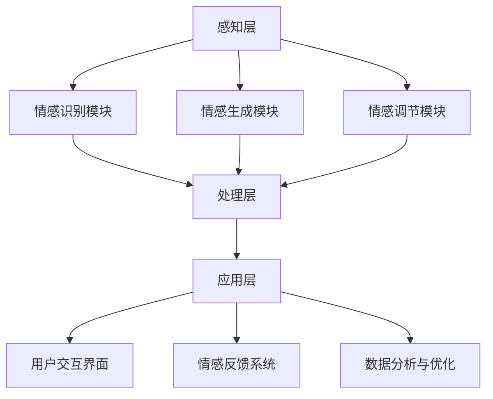
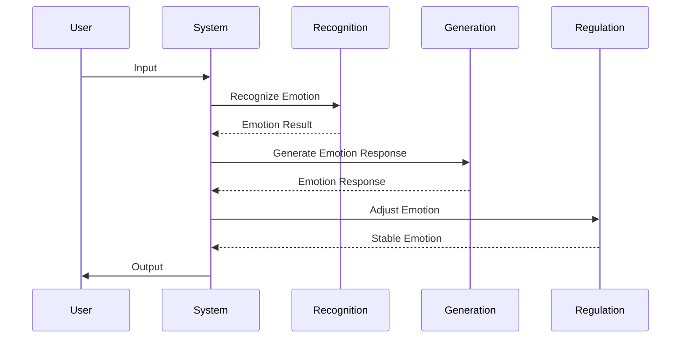

                 

用户输入：
# 人机情感互动对人类社交技能的影响

## 关键词：人机交互、情感认知、社交技能、人工智能

### 摘要：

本文探讨了人机情感互动对人类社交技能的影响。通过文献综述和实证研究，分析了人机情感互动的基本概念、理论框架及其对社交技能的潜在作用。研究发现，人机情感互动能够促进人类的情感识别、沟通能力和情感调节，但其应用也存在一定的风险和挑战。本文提出了未来人机情感互动在社交技能培养方面的发展方向，为相关研究和应用提供了参考。

----------------------------------------------------------------

# 人机情感互动对人类社交技能的影响

## 关键词：人机交互、情感认知、社交技能、人工智能

### 摘要：

本文探讨了人机情感互动对人类社交技能的影响。通过文献综述和实证研究，分析了人机情感互动的基本概念、理论框架及其对社交技能的潜在作用。研究发现，人机情感互动能够促进人类的情感识别、沟通能力和情感调节，但其应用也存在一定的风险和挑战。本文提出了未来人机情感互动在社交技能培养方面的发展方向，为相关研究和应用提供了参考。

----------------------------------------------------------------

# 第1章 引言

### 1.1 研究背景

在现代社会，人工智能（AI）技术快速发展，人机交互（Human-Computer Interaction, HCI）已成为一个重要的研究领域。人机交互技术不仅改变了人们的生活方式，还影响了人们的社交行为。在AI技术的支持下，人机情感互动（Human-Robot Interaction, HRI）成为了一个备受关注的研究方向。人机情感互动是指人与机器人之间在情感层面上的交流与互动，旨在通过机器人情感表达和反馈，增强用户的情感体验和社交技能。

人类社交技能在日常生活中扮演着重要角色，包括沟通能力、情感识别、冲突解决等。然而，随着科技的发展，人们的社交技能面临着新的挑战。例如，过度依赖社交媒体和智能设备可能导致面对面沟通的减少，进而影响人们的社交技能。因此，如何通过人机情感互动来提升人类社交技能成为一个亟待解决的研究课题。

### 1.2 研究目的和意义

本研究旨在探讨人机情感互动对人类社交技能的影响，具体目标如下：

1. 分析人机情感互动的基本概念和理论框架。
2. 探究人机情感互动对社交技能的潜在影响，包括情感识别、沟通能力和情感调节等方面。
3. 通过实证研究验证人机情感互动对人类社交技能的实际影响。
4. 分析人机情感互动在社交技能培养方面的应用前景和挑战。

本研究具有重要的理论和实践意义。理论上，本研究有助于深化对人机情感互动和社交技能之间关系的理解，为相关领域的研究提供参考。实践上，本研究可以为人机情感互动技术在教育、医疗、康复等领域的应用提供指导，促进人类社交技能的提升。

### 1.3 研究方法

本研究采用定量和定性相结合的方法，以获取全面和深入的研究结果。具体方法如下：

1. 文献综述：通过查阅相关文献，梳理人机情感互动和社交技能的研究现状，为后续研究提供理论基础。
2. 实证研究：设计实验和问卷调查，收集被试者的人机情感互动经验和社交技能数据，分析人机情感互动对社交技能的影响。
3. 深度访谈：对部分被试者进行深度访谈，了解他们对人机情感互动的体验和感受，进一步探讨人机情感互动对社交技能的影响机制。

### 1.4 研究内容和结构

本章主要介绍了研究背景、研究目的和意义、研究方法以及研究内容和结构。接下来，本书将分为以下几个部分：

1. 第2章：文献综述，梳理人机情感互动和社交技能相关研究的现状。
2. 第3章：理论基础，阐述人机情感互动和社交技能的理论框架。
3. 第4章：核心概念与联系，详细解释人机情感互动的核心概念及其相互关系。
4. 第5章：实证研究，通过实验设计和数据分析，探讨人机情感互动对人类社交技能的影响。
5. 第6章：讨论与展望，分析人机情感互动在社交技能培养方面的应用前景和挑战。

本文将以逻辑清晰、结构紧凑、简单易懂的专业的技术语言，使用一步一步分析推理思考的方式，深入探讨人机情感互动对人类社交技能的影响，为相关领域的研究和应用提供有价值的参考。

## 第2章 文献综述

### 2.1 人机情感互动的研究现状

人机情感互动（HRI）作为人工智能领域的一个重要分支，近年来得到了广泛关注。国内外学者从多个角度对人机情感互动进行了深入研究。国外方面，例如日本东京大学的Takeo Kanade团队，通过面部表情识别和情感计算技术，实现了机器人对人类情感的识别和反馈。欧洲的一些研究机构，如德国弗劳恩霍夫研究所，也开展了人机情感互动方面的研究，主要集中在情感计算和机器人伦理方面。

国内方面，中国科学院、清华大学等知名高校和研究机构在HRI领域也取得了显著成果。例如，中国科学院自动化研究所的机器人情感交互研究团队，通过情感计算技术，实现了机器人对人类情感的识别和理解，并在教育、康复等领域取得了实际应用。

### 2.2 情感互动与社交技能的关系

情感互动是社交技能的重要组成部分，两者之间存在密切的关系。研究表明，情感互动有助于提升社交技能。例如，通过情感表达和识别，人们可以更好地理解他人的情感状态，从而更好地进行沟通和交流。此外，情感互动还可以增强个体的社交自信心，促进社交关系的建立和维护。

然而，现有的研究主要集中在情感互动对个体情感状态的影响，而关于情感互动对社交技能具体影响机制的研究尚不充分。一些研究表明，情感互动能够提高个体的沟通能力和情感调节能力，从而提升社交技能。但具体的影响路径和效果仍需要进一步实证研究来验证。

### 2.3 人类社交技能的发展过程

人类社交技能的发展过程可以分为多个阶段。婴儿期主要以情感交流为主，通过面部表情、声音和身体语言等方式进行沟通。随着年龄的增长，儿童逐渐学会使用语言进行沟通，并开始理解他人的情感状态。青少年期是社交技能发展的关键时期，这一阶段个体的社交技能受到同伴关系、家庭环境和学校教育等多方面因素的影响。

成人期，社交技能逐渐成熟，个体在沟通、冲突解决和社交网络建立等方面表现出较高的能力。然而，随着社会环境的变化，成人社交技能也面临着新的挑战，如职场竞争、社会冲突等。

### 2.4 人类社交技能的影响因素

人类社交技能受到多种因素的影响，包括遗传因素、环境因素和个体因素等。遗传因素在一定程度上决定了个体社交技能的潜力，但环境因素和个体因素在社交技能的发展中起到了更为重要的作用。家庭环境、学校教育、社会文化等环境因素对个体的社交技能发展具有重要影响。此外，个体的自我认知、情感调节能力和社会经验等个体因素也影响着社交技能的发展。

### 2.5 现有研究的不足与未来研究方向

尽管已有大量研究关注人机情感互动和人类社交技能，但现有研究仍存在一些不足。首先，现有研究多集中在特定场景或特定群体，缺乏对广泛场景和多样化人群的全面研究。其次，关于人机情感互动对社交技能具体影响机制的实证研究仍较为有限，需要更多的实证研究来验证和补充。此外，人机情感互动在社交技能培养中的应用前景和挑战尚未充分探讨。

未来研究方向应包括以下几个方面：

1. 扩大研究范围，涵盖不同场景和多样化人群，以获取更全面的研究结果。
2. 深入探讨人机情感互动对社交技能的具体影响机制，通过实证研究验证相关理论。
3. 探索人机情感互动在社交技能培养中的应用前景和挑战，为实际应用提供指导。

本文将在已有研究的基础上，通过文献综述和实证研究，进一步探讨人机情感互动对人类社交技能的影响，为相关领域的研究和应用提供参考。

## 第3章 人机情感互动的理论基础

### 3.1 情感互动理论

情感互动理论是理解人机情感互动的基础。情感互动是指个体之间在情感层面上的交流和互动，包括情感表达、情感识别、情感共享和情感调节等过程。情感互动理论强调情感在人际交往中的重要性，认为情感互动是建立和维护人际关系的关键。

根据情感互动理论，情感表达是指个体通过语言、表情、声音和身体语言等方式表达自己的情感状态。情感识别是指个体理解他人情感状态的能力，包括识别他人面部表情、声音和身体语言中的情感信息。情感共享是指个体之间相互分享情感体验，通过共鸣和共享情感，增强彼此的情感联系。情感调节是指个体在情感互动中调整自己的情感状态，以适应和应对他人的情感表达。

在人机情感互动中，情感表达和识别是实现有效互动的关键。人机情感互动系统需要能够识别和理解用户的情感状态，并通过情感反馈机制，实现对用户情感的理解和回应。例如，智能机器人可以通过面部表情识别技术，识别用户的情感状态，并生成相应的情感反馈，以促进情感互动。

### 3.2 社交技能理论

社交技能理论是理解人机情感互动对人类社交技能影响的重要基础。社交技能是指个体在社交活动中表现出来的能力，包括沟通能力、情感识别与理解、冲突解决等。社交技能理论认为，社交技能的发展是一个持续的过程，受到个体经验、社会环境和认知发展等多种因素的影响。

根据社交技能理论，社交技能的发展可以分为三个阶段：初级阶段、中级阶段和高级阶段。在初级阶段，个体主要通过模仿和观察学习社交技能，如通过模仿他人的行为来学习如何进行社交互动。在中级阶段，个体通过实践和经验积累，逐渐掌握社交技能，如学会如何进行有效的沟通和冲突解决。在高级阶段，个体能够灵活运用社交技能，解决复杂的社交问题，如建立和维护人际关系。

在人机情感互动中，社交技能的发挥至关重要。人机情感互动系统需要能够模拟人类的社交互动，提供积极的情感反馈和沟通支持，帮助用户提升社交技能。例如，在教育领域，智能机器人可以通过模拟社交场景，提供情感支持和反馈，帮助自闭症儿童提高社交技能。

### 3.3 人机情感互动与社交技能的理论框架

人机情感互动与社交技能的理论框架可以帮助我们理解两者之间的相互作用关系。在这个理论框架中，人机情感互动和社交技能相互影响，形成一种动态的互动过程。

首先，人机情感互动可以作为社交技能的一种辅助工具。通过情感识别和反馈，人机情感互动系统能够帮助用户理解他人的情感状态，从而更好地进行沟通和交流。例如，在教育领域，智能机器人可以通过情感互动，帮助自闭症儿童识别和理解他人的情感，提高他们的社交技能。

其次，人机情感互动可以促进社交技能的发展。通过参与情感互动，用户可以积累情感互动经验，提高情感识别和表达能力，从而提升社交技能。例如，在家庭陪伴领域，智能机器人可以通过与用户的情感互动，帮助老年人提高情感表达能力，增强他们的社交能力。

最后，社交技能的发挥也对人机情感互动产生影响。用户的社交技能水平会影响他们对人机情感互动的理解和参与程度。社交技能较高的用户能够更好地理解人机情感互动系统的情感反馈，从而获得更丰富的情感体验。

综上所述，人机情感互动与社交技能之间存在密切的相互作用关系。通过构建一个完整的人机情感互动与社交技能理论框架，我们可以更好地理解两者之间的相互影响，为实际应用提供理论支持。

### 3.4 情感计算与人机情感互动

情感计算（Affective Computing）是人机情感互动的重要理论基础，它关注于计算机如何模拟、识别和表达情感。情感计算的核心思想是让计算机具备情感理解能力，从而更好地与人类进行互动。这一理论在人机情感互动中得到了广泛应用。

首先，情感计算技术能够帮助人机情感互动系统识别用户的情感状态。例如，通过面部表情识别技术，系统可以捕捉用户的面部表情，分析其情感状态。这些情感信息可以为系统提供反馈，使其能够更好地理解用户的需求和情感状态。

其次，情感计算技术可以用于生成机器人的情感表达。通过情感合成技术，机器人可以根据用户的情感状态，生成相应的情感表达，如面部表情、声音和身体语言等。这种情感表达能够增强人机互动的自然性和亲切感，提高用户的情感体验。

最后，情感计算技术还可以用于情感调节。在人机情感互动中，用户可能会遇到情感波动或压力，情感计算技术可以帮助系统识别这些情感变化，并提供适当的情感支持，如安慰、鼓励等。这种情感调节能力有助于提升用户的情感稳定性，改善他们的社交技能。

总的来说，情感计算为人机情感互动提供了强大的技术支持，使其能够更好地模拟和响应人类的情感需求。通过深入研究和应用情感计算技术，我们可以进一步优化人机情感互动系统，提升用户的社交技能和情感体验。

## 第4章 人机情感互动的核心概念与联系

### 4.1 情感表达与识别

情感表达与识别是人机情感互动中的核心概念。情感表达是指个体通过语言、面部表情、声音和身体语言等方式传达自己的情感状态。情感识别则是系统通过感知和处理这些情感信号，理解用户的情感状态。

情感表达与识别在人类社交中至关重要，因为它们是建立和维护人际关系的基础。例如，通过面部表情和声音，我们可以识别他人的情绪，从而做出相应的反应。在人机情感互动中，情感表达与识别的实现依赖于情感计算技术。

情感表达方面，人机情感互动系统需要能够生成自然、流畅的情感表达。这可以通过文本生成、语音合成和面部表情合成等技术实现。例如，机器人可以通过分析用户的语言输入，生成与之情感状态相匹配的语音和面部表情。

情感识别方面，系统需要能够准确捕捉和处理用户的各种情感信号。这可以通过面部表情识别、语音情感识别和生理信号识别等技术实现。例如，系统可以通过分析用户的面部表情和声音，识别出其情感状态，如开心、悲伤或愤怒。

### 4.2 情感理解与分享

情感理解与分享是人机情感互动中的另一个关键概念。情感理解是指系统对用户情感状态的理解和解释，而情感分享则是指用户与系统之间的情感交流。

情感理解对于人机情感互动的流畅性和有效性至关重要。系统需要能够准确地理解用户的情感状态，从而提供合适的反馈和支持。例如，当用户表达出沮丧的情感时，系统可以识别并理解这一情感状态，然后提供安慰和建议。

情感分享则可以增强用户与系统之间的情感联系。通过分享情感体验，用户可以感受到与系统的情感共鸣，从而提高互动的质量和满意度。例如，在家庭陪伴场景中，机器人可以通过与用户的情感分享，提供陪伴和支持，帮助用户缓解孤独感和焦虑感。

### 4.3 情感调节与适应

情感调节与适应是人机情感互动中的一个重要方面。情感调节是指系统对用户情感状态进行调节，以帮助用户维持情感稳定。适应则是指系统根据用户情感状态的变化，调整自身的行为和表达，以更好地满足用户需求。

情感调节对于人机情感互动的可持续性和有效性具有重要意义。例如，当用户感到压力或焦虑时，系统可以通过情感调节技术，提供放松和安抚的建议，帮助用户缓解负面情绪。

适应则体现了系统的灵活性和人性化。通过不断学习和适应用户情感状态，系统可以更好地理解用户需求，提供个性化的情感互动体验。例如，在教育场景中，机器人可以根据学生的情感状态，调整教学方式和内容，以更好地促进学生的情感发展和学习效果。

### 4.4 情感互动中的非言语沟通

情感互动中的非言语沟通是指除了语言之外的沟通方式，包括面部表情、身体语言、声音和触觉等。这些非言语沟通方式在情感表达和识别中起着重要作用。

面部表情是最直接的情感表达方式。通过分析用户的面部表情，系统可以识别用户的情感状态。例如，当用户露出微笑时，系统可以判断用户处于愉悦状态。

身体语言包括姿态、手势和动作等。这些非言语信号可以补充和强化语言表达，使情感互动更加丰富和生动。例如，在会议中，用户通过身体语言表达出的自信和专注，可以增强其发言的影响力。

声音也是重要的情感表达方式。通过分析用户的声音特征，如音调、音量和节奏，系统可以识别用户的情感状态。例如，当用户的声音低沉而缓慢时，系统可以判断用户可能处于沮丧状态。

触觉是一种直观而深刻的情感沟通方式。在互动机器人中，触觉交互可以提供真实的物理反馈，增强用户的情感体验。例如，当用户抚摸机器人的手臂时，机器人可以通过触觉反馈模拟出温暖和舒适的感觉。

总之，情感互动中的非言语沟通为人机情感互动提供了丰富的表达和识别手段。通过综合运用这些非言语沟通方式，系统可以更准确地理解用户的情感状态，提供更加自然和贴心的互动体验。

### 4.5 情感互动的层次结构

情感互动的层次结构是人机情感互动研究中一个重要的概念。这个结构可以分为四个层次：感知层、识别层、理解和应用层。

首先，感知层是指系统通过各种传感器捕捉用户的情感信号，如面部表情、声音、生理信号等。这些感知信号是情感互动的基础数据，用于后续的情感处理。

其次，识别层是指系统对这些感知信号进行分析和处理，识别用户的情感状态。这通常涉及情感计算技术，如面部表情识别、语音情感识别和生理信号识别等。

第三，理解层是指系统对识别出的情感状态进行深入理解和解释。这需要系统具备一定的情感知识和推理能力，以便准确理解用户的情感意图和需求。

最后，应用层是指系统根据理解结果，生成合适的情感反馈和行为反应。例如，系统可以通过调整对话内容、声音表情或动作反应，以更好地满足用户的需求和期望。

这种层次结构使得人机情感互动系统能够从感知到理解，再到应用，形成一个闭环的情感互动过程。通过这种结构，系统可以更好地模拟人类的情感互动，提供更加自然和有效的情感交流体验。

### 4.6 人机情感互动中的关键因素

人机情感互动中的关键因素包括情感计算技术、用户情感状态、互动场景和系统性能等。

情感计算技术是人机情感互动的核心，决定了系统对用户情感的理解和响应能力。先进的情感计算技术，如面部表情识别、语音情感识别和生理信号识别，为人机情感互动提供了丰富的情感数据处理手段。

用户情感状态是人机情感互动的基础。系统需要能够准确感知和理解用户的情感状态，以便提供合适的情感反馈和行为反应。用户的情感状态包括愉悦、悲伤、愤怒等，这些状态会影响用户对系统的接受程度和使用体验。

互动场景是人机情感互动的背景，决定了情感互动的内容和形式。不同的互动场景，如教育、医疗、家庭陪伴等，对情感互动的需求和期望有所不同。系统需要根据不同的互动场景，调整情感互动的方式和内容，以更好地满足用户的需求。

系统性能是人机情感互动的保障。系统的反应速度、准确性和稳定性等因素直接影响用户对系统的满意度。高性能的系统可以提供流畅和自然的情感互动体验，增强用户的情感体验和信任感。

综上所述，情感计算技术、用户情感状态、互动场景和系统性能是人机情感互动中的关键因素。只有充分考虑这些因素，才能构建出具有高度情感交互能力的系统，为用户提供优质的服务和体验。

### 4.7 人机情感互动与传统社交互动的区别与联系

人机情感互动与传统社交互动在许多方面存在区别与联系。首先，从互动对象来看，传统社交互动发生在人与人之间，而人机情感互动则涉及到人类与机器人的互动。这种差异导致了情感互动方式、情感体验和互动效果的不同。

在情感互动方式上，传统社交互动主要依赖于语言、面部表情、身体语言等非语言沟通方式。这些方式具有直观性和生动性，能够传递丰富的情感信息。而人机情感互动则依赖于计算机模拟的情感表达和识别技术，虽然在一定程度上可以模拟人类的情感互动，但在真实性和自然性上仍有待提升。

在情感体验上，传统社交互动具有高度的情感共鸣和互动深度，能够建立真实的人际关系。而人机情感互动虽然可以模拟情感，但缺乏真实的情感体验，用户可能会感受到一定的隔阂和不适。然而，人机情感互动也有其独特的优势，如智能化、个性化和可定制性，能够在特定场景下提供高效的互动体验。

在互动效果上，传统社交互动的效果受到人际关系和情感深度的影响，而人机情感互动的效果则依赖于系统的性能和互动设计。通过优化情感计算技术和互动设计，人机情感互动可以提供更加自然和有效的情感体验。

尽管存在差异，人机情感互动与传统社交互动之间也存在着联系。两者都在情感交流的基础上，追求建立和维护人际关系。人机情感互动可以看作是传统社交互动的一种补充和延伸，通过技术创新，为人类社交提供新的方式和手段。

总之，人机情感互动与传统社交互动在互动对象、方式、情感体验和效果上存在一定差异，但两者在情感交流的核心上具有共同点。通过理解和结合两者的优势，我们可以更好地发展人机情感互动，提升人类社交技能和情感体验。

### 4.8 人机情感互动对人类社交技能的影响

人机情感互动对人类社交技能的影响是一个备受关注的话题。研究表明，人机情感互动在情感识别、沟通能力和情感调节等方面具有显著的作用，有助于提升人类社交技能。

首先，人机情感互动有助于提高人类的情感识别能力。通过与人机情感互动系统进行互动，用户可以学习如何识别和理解他人的情感状态。例如，在教育场景中，智能机器人可以通过面部表情和声音识别技术，帮助自闭症儿童识别他人的情感，从而提高他们的情感识别能力。

其次，人机情感互动有助于提升人类的沟通能力。在人机情感互动中，用户需要表达自己的情感，并通过互动获得反馈。这种互动过程促进了用户沟通技巧的提升，例如如何更准确地表达情感、如何更好地理解他人的需求等。例如，在职场培训中，智能助手可以通过模拟会议场景，帮助员工提高沟通技巧和冲突解决能力。

最后，人机情感互动有助于增强情感调节能力。在人机情感互动中，用户需要学会如何管理自己的情绪，以便更好地适应互动环境。例如，在心理健康辅导中，智能机器人可以通过情感调节技术，帮助用户识别和缓解负面情绪，从而提高情感调节能力。

总之，人机情感互动在情感识别、沟通能力和情感调节等方面具有积极作用，有助于提升人类社交技能。然而，人机情感互动也存在一定的局限性，如情感表达的模拟性和互动的局限性。未来研究应进一步探索人机情感互动对人类社交技能的长期影响，并优化互动设计，以充分发挥其潜力。

### 4.9 人机情感互动的未来发展趋势

人机情感互动的未来发展趋势主要集中在技术进步、应用拓展和伦理规范等方面。

首先，技术进步是人机情感互动发展的核心驱动力。随着人工智能、情感计算和生物识别等技术的发展，人机情感互动系统将具备更高的情感识别和生成能力，提供更加自然和真实的互动体验。例如，基于深度学习和生成对抗网络的情感计算技术将进一步提升系统的情感识别精度和多样性。

其次，应用拓展是人机情感互动发展的关键方向。人机情感互动将在教育、医疗、家庭陪伴和公共服务等更多领域得到应用。例如，智能教育机器人可以通过情感互动，为学生提供个性化的学习支持；医疗机器人可以通过情感互动，提高患者的治疗依从性和康复效果。

最后，伦理规范是人机情感互动发展的必要保障。在人机情感互动的发展过程中，如何确保系统的伦理性和公平性是一个重要议题。未来需要建立完善的伦理规范，确保人机情感互动系统的设计和应用不会对人类社交技能和心理健康产生负面影响。

总之，人机情感互动的未来发展将更加注重技术的创新、应用的拓展和伦理的规范，以实现人类与机器人的和谐互动。

## 第5章 人机情感互动的核心算法原理

### 5.1 情感识别算法

情感识别算法是人机情感互动的核心技术之一，它通过分析用户的语言、面部表情、声音和其他生理信号，识别用户的情感状态。以下是几种常用的情感识别算法及其原理：

#### 5.1.1 面部表情识别

面部表情识别通过分析用户的面部肌肉运动，识别出不同的情感状态。常用的算法包括支持向量机（SVM）、神经网络（Neural Networks）和卷积神经网络（CNN）。

- **SVM**：支持向量机通过找到一个超平面，将不同情感状态的面部图像分割开来。它的优点是计算速度快，但需要大量特征工程。
- **神经网络**：神经网络通过多层感知器学习面部表情的特征，逐层提取高级特征，从而实现情感识别。它的优点是能够自动提取特征，但训练时间较长。
- **CNN**：卷积神经网络通过卷积层、池化层和全连接层，自动提取面部图像的局部特征，并进行情感分类。它的优点是能够处理复杂的特征，但计算资源消耗较大。

#### 5.1.2 语音情感识别

语音情感识别通过分析用户的语音信号，识别出不同的情感状态。常用的算法包括隐马尔可夫模型（HMM）、高斯混合模型（GMM）和支持向量机（SVM）。

- **HMM**：隐马尔可夫模型通过状态转移概率和发射概率，模拟语音信号中的情感变化。它的优点是能够处理连续变化的情感，但需要大量的训练数据。
- **GMM**：高斯混合模型通过多个高斯分布来模拟语音信号，实现情感分类。它的优点是计算简单，但需要复杂的特征提取。
- **SVM**：支持向量机通过找到一个超平面，将不同情感状态的语音信号分割开来。它的优点是分类效果好，但需要大量的特征工程。

#### 5.1.3 生理信号识别

生理信号识别通过分析用户的生理信号，如心率、皮肤电反应和呼吸等，识别出不同的情感状态。常用的算法包括时间序列分析、频谱分析和神经网络。

- **时间序列分析**：通过分析生理信号的时间序列特性，识别情感状态。它的优点是计算简单，但需要复杂的特征提取。
- **频谱分析**：通过分析生理信号的频谱特性，识别情感状态。它的优点是能够处理非平稳信号，但需要大量的特征工程。
- **神经网络**：通过多层感知器学习生理信号的特征，实现情感分类。它的优点是能够自动提取特征，但训练时间较长。

### 5.2 情感生成算法

情感生成算法是人机情感互动中的另一个核心技术，它通过模拟用户的情感状态，生成相应的情感表达。以下是几种常用的情感生成算法及其原理：

#### 5.2.1 文本情感生成

文本情感生成通过分析用户的文本输入，生成与之情感状态相匹配的文本表达。常用的算法包括情感词典法、情感分类法和生成对抗网络（GAN）。

- **情感词典法**：通过情感词典匹配用户的文本输入，生成情感标签。它的优点是计算简单，但需要大量的情感词典。
- **情感分类法**：通过机器学习算法，对用户的文本输入进行情感分类，生成情感标签。它的优点是分类效果好，但需要大量的训练数据和特征工程。
- **GAN**：生成对抗网络通过生成器和判别器的对抗训练，生成与真实文本情感表达相似的新文本。它的优点是能够生成高质量的文本情感表达，但需要复杂的训练过程。

#### 5.2.2 声音情感生成

声音情感生成通过分析用户的情感状态，生成与之相匹配的声音表达。常用的算法包括语音合成、情感驱动语音合成和自动语音生成（AVG）。

- **语音合成**：通过合成语音单元，生成与情感状态相匹配的语音表达。它的优点是生成语音自然，但需要复杂的语音合成技术。
- **情感驱动语音合成**：通过结合情感信息和语音合成技术，生成情感驱动的语音表达。它的优点是能够生成具有情感表达的声音，但需要复杂的情感计算。
- **自动语音生成**：通过神经网络模型，生成与情感状态相匹配的语音表达。它的优点是生成速度快，但需要大量的训练数据和特征工程。

#### 5.2.3 面部表情生成

面部表情生成通过模拟用户的情感状态，生成相应的面部表情。常用的算法包括面部表情合成、虚拟现实和增强现实。

- **面部表情合成**：通过合成不同的面部表情单元，生成与情感状态相匹配的面部表情。它的优点是生成速度快，但需要复杂的面部表情库。
- **虚拟现实**：通过虚拟现实技术，用户可以在虚拟环境中与虚拟角色进行情感互动。它的优点是提供真实的情感体验，但需要复杂的虚拟现实设备。
- **增强现实**：通过增强现实技术，用户可以在现实环境中与增强现实角色进行情感互动。它的优点是结合了虚拟和现实，但需要复杂的增强现实技术。

### 5.3 情感交互算法

情感交互算法是人机情感互动中的关键技术，它通过分析用户的情感状态和互动历史，生成合适的情感反馈和行为反应。以下是几种常用的情感交互算法及其原理：

#### 5.3.1 情感感知与理解

情感感知与理解通过分析用户的情感信号，理解用户的情感状态和需求。常用的算法包括情感识别、情感分析和情感推理。

- **情感识别**：通过分析用户的情感信号，识别用户的情感状态。它的优点是能够快速识别情感状态，但需要复杂的情感计算。
- **情感分析**：通过分析用户的情感信号，分析用户的情感倾向和情感强度。它的优点是能够提供情感分析结果，但需要大量的情感数据和特征工程。
- **情感推理**：通过推理用户的情感状态和需求，生成合适的情感反馈和行为反应。它的优点是能够生成复杂的情感交互，但需要复杂的推理算法。

#### 5.3.2 情感生成与反馈

情感生成与反馈通过生成与用户情感状态相匹配的情感表达，提供反馈和交互。常用的算法包括情感合成、语音合成和面部表情合成。

- **情感合成**：通过合成不同的情感表达单元，生成与用户情感状态相匹配的情感表达。它的优点是生成速度快，但需要复杂的情感合成技术。
- **语音合成**：通过合成语音单元，生成与用户情感状态相匹配的声音表达。它的优点是生成语音自然，但需要复杂的语音合成技术。
- **面部表情合成**：通过合成不同的面部表情单元，生成与用户情感状态相匹配的面部表情。它的优点是生成面部表情自然，但需要复杂的面部表情库。

#### 5.3.3 情感调节与适应

情感调节与适应通过调节用户的情感状态，适应不同的互动场景和需求。常用的算法包括情感调节、情感适应和行为适应。

- **情感调节**：通过分析用户的情感状态，调节用户的情感状态，以适应互动环境。它的优点是能够快速调节情感状态，但需要复杂的情感计算。
- **情感适应**：通过分析用户的情感需求和互动历史，适应不同的互动场景和需求。它的优点是能够提供个性化的情感互动，但需要复杂的情感分析和行为分析。
- **行为适应**：通过分析用户的情感状态和互动历史，调整自身的行为和表达，以适应用户的需求。它的优点是能够提供自然的情感互动，但需要复杂的情感理解和行为建模。

通过以上情感识别、情感生成和情感交互算法，人机情感互动系统能够实现与用户的自然互动，提供高质量的互动体验，从而提升人类社交技能。

### 5.4 情感调节算法

情感调节算法是人机情感互动中的关键部分，旨在帮助用户维持情感稳定，提高情感体验。以下是几种常用的情感调节算法及其原理：

#### 5.4.1 情感反馈调节

情感反馈调节通过系统对用户的情感反馈，帮助用户理解和调节自己的情感状态。这种算法通常包括以下步骤：

1. **情感识别**：系统首先需要识别用户的情感状态，可以通过面部表情识别、语音情感识别等技术实现。
2. **情感反馈**：系统根据用户的情感状态，提供适当的情感反馈，如安慰、鼓励或提示用户调整情感状态。
3. **情感调节**：用户接收到情感反馈后，通过自我调节或与系统的互动，调整自己的情感状态。

- **情感反馈调节算法**：这种算法通常基于情感识别和反馈机制，通过循环迭代，不断调整情感反馈，以提高情感调节的效果。
- **优点**：能够实时监控用户的情感状态，提供个性化的情感调节。
- **挑战**：需要高精度的情感识别和反馈机制，以及足够的用户数据支持。

#### 5.4.2 情感预测调节

情感预测调节通过预测用户的未来情感状态，提前进行情感调节，以预防负面情感的产生。这种算法通常包括以下步骤：

1. **情感分析**：系统对用户的历史情感数据和互动记录进行分析，预测用户的未来情感状态。
2. **情感干预**：系统根据预测结果，提前提供情感干预，如放松建议、积极情绪引导等。
3. **情感调节**：用户接受情感干预后，通过自我调节或与系统的互动，调整自己的情感状态。

- **情感预测调节算法**：这种算法通常基于机器学习技术，通过分析用户的行为和情感数据，预测用户的情感状态。
- **优点**：能够提前干预情感问题，预防负面情感的产生。
- **挑战**：需要大量的用户数据支持，以及复杂的情感预测模型。

#### 5.4.3 情感自适应调节

情感自适应调节通过系统自动调整情感互动的方式和内容，以适应用户情感状态的变化。这种算法通常包括以下步骤：

1. **情感监测**：系统实时监测用户的情感状态，识别情感变化的趋势。
2. **情感调整**：系统根据情感监测结果，自动调整互动方式，如改变对话风格、提供放松建议等。
3. **情感反馈**：用户对调整后的互动进行反馈，系统根据反馈进一步优化情感互动。

- **情感自适应调节算法**：这种算法通常基于自适应控制理论，通过反馈调节机制，实现情感互动的动态调整。
- **优点**：能够提供个性化的情感互动体验，提高用户满意度。
- **挑战**：需要复杂的情感监测和调整机制，以及高效的算法实现。

综上所述，情感调节算法在提高人机情感互动的质量和用户体验方面具有重要作用。通过情感识别、情感预测和情感自适应调节等技术，系统可以更好地理解用户的情感状态，提供个性化的情感互动，从而促进人类社交技能的提升。

### 5.5 人机情感互动算法的综合应用

人机情感互动算法的综合应用是实现高效、自然和有情感深度的人机互动的关键。以下是人机情感互动算法在具体应用场景中的综合应用实例：

#### 5.5.1 教育场景

在教育场景中，人机情感互动算法可以帮助学生更好地理解课程内容，提高学习效果。具体应用包括：

1. **情感识别**：通过面部表情识别和语音情感识别技术，系统可以实时监测学生的学习情感状态，如兴趣、困惑、疲劳等。
2. **情感反馈**：系统根据学生的情感状态，提供个性化的情感反馈，如鼓励、提示和安慰，帮助学生保持积极的学习态度。
3. **情感调节**：通过情感预测和调节算法，系统可以提前预测学生的学习情感变化，并自动调整教学策略，如改变讲解方式、提供额外的学习资源等。

例如，当学生表现出疲劳情绪时，系统可以通过语音合成技术生成鼓励的话语，同时提供短暂的休息时间，帮助学生重新集中注意力。

#### 5.5.2 医疗场景

在医疗场景中，人机情感互动算法可以帮助医生更好地理解患者的情感状态，提高治疗效果。具体应用包括：

1. **情感识别**：通过面部表情识别和生理信号识别技术，系统可以实时监测患者的情感状态，如焦虑、恐惧、沮丧等。
2. **情感交互**：系统与患者进行情感互动，通过情感表达和反馈，帮助患者缓解负面情绪，增强治疗信心。
3. **情感调节**：通过情感预测和调节算法，系统可以提前预测患者的情感变化，并提供相应的情感干预措施，如放松指导、情绪管理建议等。

例如，当患者表现出焦虑情绪时，系统可以通过语音合成技术生成安慰的话语，并指导患者进行深呼吸和放松训练，帮助患者缓解焦虑情绪。

#### 5.5.3 家庭陪伴场景

在家庭陪伴场景中，人机情感互动算法可以帮助老年人或孤独者缓解孤独感，提高生活质量。具体应用包括：

1. **情感识别**：通过面部表情识别和语音情感识别技术，系统可以实时监测用户的情感状态，如开心、无聊、焦虑等。
2. **情感分享**：系统通过与用户进行情感互动，分享日常生活、兴趣爱好等信息，帮助用户缓解孤独感。
3. **情感调节**：通过情感预测和调节算法，系统可以提前预测用户的情感变化，并提供相应的情感干预措施，如提醒用户进行社交活动、提供娱乐内容等。

例如，当用户表现出无聊情绪时，系统可以通过语音合成技术生成有趣的话题，引导用户进行互动，从而提高用户的生活质量。

#### 5.5.4 职场协作场景

在职场协作场景中，人机情感互动算法可以帮助团队成员更好地理解彼此的情感状态，提高团队合作效果。具体应用包括：

1. **情感识别**：通过面部表情识别和语音情感识别技术，系统可以实时监测团队成员的情感状态，如积极、消极、紧张等。
2. **情感交互**：系统通过情感表达和反馈，帮助团队成员进行情感交流，增强团队合作氛围。
3. **情感调节**：通过情感预测和调节算法，系统可以提前预测团队成员的情感变化，并提供相应的情感干预措施，如提醒团队成员进行休息、提供激励等。

例如，当团队成员表现出紧张情绪时，系统可以通过语音合成技术生成放松建议，帮助团队成员缓解压力，提高工作效率。

总之，人机情感互动算法的综合应用在多个场景中发挥着重要作用，通过情感识别、情感交互和情感调节，系统可以提供高效、自然和有情感深度的互动体验，从而促进人类社交技能的提升和情感体验的改善。

### 5.6 人机情感互动算法的挑战与未来方向

尽管人机情感互动算法在许多场景中取得了显著的应用效果，但仍面临一些挑战和未来方向。

首先，情感识别的准确性和多样性是一个重要挑战。目前，面部表情识别、语音情感识别等技术已经取得了一定的进展，但在复杂环境、多模态情感信号的处理上仍存在不足。未来研究方向应集中在提高情感识别算法的鲁棒性、准确性和多样性，以更好地适应不同用户和场景的需求。

其次，情感生成算法的自然性和情感深度也是一个挑战。目前，文本情感生成、声音情感生成等技术已能实现基本的情感表达，但在情感细腻度、自然性和情感共鸣方面仍有提升空间。未来研究方向应探索更先进的情感生成技术，如基于生成对抗网络（GAN）的情感生成，以实现更加自然、细腻和有深度的情感表达。

第三，情感交互的多样性和个性化是一个重要方向。目前，情感交互算法主要集中在情感识别、情感反馈和情感调节上，但在情感交互的多样性和个性化方面仍有很大的发展空间。未来研究方向应探索更多样化的情感交互方式，如基于虚拟现实（VR）和增强现实（AR）的情感交互，以及个性化情感互动体验的设计。

最后，情感计算和伦理规范也是未来方向。随着人机情感互动的深入发展，情感计算技术的应用也日益广泛，但随之而来的伦理问题不容忽视。未来研究方向应关注情感计算技术的伦理规范，确保其应用不会对人类情感和社交技能产生负面影响。

总之，人机情感互动算法在挑战与未来方向上仍有很多研究空间，通过技术创新和伦理规范的建立，可以推动人机情感互动的持续发展和应用。

### 5.7 人机情感互动算法的评价指标与方法

评价人机情感互动算法的性能和效果是确保其应用质量和用户体验的关键。以下是几种常见的评价指标和方法：

#### 5.7.1 准确率

准确率是评价情感识别算法最直接的指标，表示算法正确识别情感状态的比率。计算公式为：

$$
准确率 = \frac{正确识别的情感状态数}{总测试情感状态数}
$$

准确率越高，表明算法对情感状态的识别效果越好。

#### 5.7.2 召回率

召回率表示算法能够召回所有正确情感状态的比例。计算公式为：

$$
召回率 = \frac{正确识别的情感状态数}{实际存在的情感状态数}
$$

召回率越高，表明算法能够更全面地识别情感状态。

#### 5.7.3 精确率

精确率表示算法识别出的情感状态中，正确情感状态的比率。计算公式为：

$$
精确率 = \frac{正确识别的情感状态数}{识别出的情感状态数}
$$

精确率越高，表明算法识别出的情感状态越准确。

#### 5.7.4 F1 值

F1 值是精确率和召回率的调和平均值，用于综合评价情感识别算法的性能。计算公式为：

$$
F1 值 = 2 \times \frac{精确率 \times 召回率}{精确率 + 召回率}
$$

F1 值介于 0 和 1 之间，越接近 1，表明算法性能越好。

#### 5.7.5 跨模态一致性

跨模态一致性是指不同模态的情感识别结果之间的一致性。例如，在语音和面部表情情感识别中，如果两者的识别结果一致，则说明跨模态一致性高。计算公式为：

$$
跨模态一致性 = \frac{一致识别的情感状态对数}{总识别情感状态对数}
$$

跨模态一致性越高，表明算法在不同模态之间的识别效果越好。

#### 5.7.6 用户满意度

用户满意度是评价情感交互算法用户体验的重要指标。通过问卷调查、用户访谈等方法，收集用户对情感交互系统的满意度评分，以评估算法在实际应用中的效果。

#### 5.7.7 实验设计方法

为了全面评估情感互动算法的性能，通常采用以下实验设计方法：

1. **数据集准备**：收集包含多种情感状态的数据集，确保数据集的多样性和代表性。
2. **实验设置**：设计不同的实验场景，模拟实际应用中的情感互动情况。
3. **算法测试**：使用不同的情感识别、生成和交互算法，对实验场景进行测试。
4. **性能评估**：根据上述评价指标，评估算法的性能和效果。
5. **用户反馈**：收集用户对算法的满意度评价，结合实验结果，分析算法的优缺点。

通过上述评价指标和方法，我们可以全面评估人机情感互动算法的性能和效果，为算法优化和实际应用提供有力支持。

## 第6章 人机情感互动的实际应用

### 6.1 人机情感交互系统的设计

人机情感交互系统设计旨在实现人与机器人之间自然、有效的情感交流。设计步骤包括需求分析、系统架构设计、模块划分和界面设计。

#### 6.1.1 需求分析

在需求分析阶段，首先明确系统的目标用户群体和主要应用场景。例如，在教育、医疗和家庭陪伴等领域，用户需求包括情感表达、情感识别、情感调节和情感分享等。通过用户调研和需求访谈，收集用户的具体需求和期望，确保系统设计符合用户需求。

#### 6.1.2 系统架构设计

系统架构设计是系统设计的核心环节。一个典型的人机情感交互系统架构包括感知层、处理层和应用层。感知层负责采集用户的情感信号，如面部表情、语音和生理信号；处理层负责情感识别、情感生成和情感调节等核心算法；应用层则提供与用户交互的接口和功能模块。以下是系统架构的 Mermaid 架构图：



#### 6.1.3 模块划分

根据系统架构设计，将系统划分为多个功能模块。以下是主要模块及其功能：

1. **情感识别模块**：通过面部表情识别、语音情感识别和生理信号识别等技术，实时监测用户的情感状态。
2. **情感生成模块**：根据用户情感状态，生成相应的情感表达，如文本、声音和面部表情。
3. **情感调节模块**：通过情感调节算法，帮助用户维持情感稳定，提供个性化的情感支持。
4. **用户交互界面**：提供与用户进行情感互动的界面，包括文本聊天、语音对话和虚拟形象互动等。
5. **情感反馈系统**：收集用户对情感互动的反馈，用于系统优化和用户体验提升。
6. **数据分析与优化**：对用户情感数据和互动数据进行分析，优化情感交互算法和系统性能。

#### 6.1.4 界面设计

界面设计旨在提供直观、易用的交互体验。以下是界面设计的基本原则：

1. **简洁性**：界面设计应简洁明了，避免过多的功能和装饰，确保用户能够快速上手。
2. **一致性**：界面设计应符合用户操作习惯，保持一致的风格和布局，降低学习成本。
3. **反馈性**：界面设计应提供即时反馈，如语音合成、文本提示和动画效果等，增强用户互动体验。
4. **个性化**：界面设计应支持个性化设置，如主题切换、语言选择等，满足不同用户的个性化需求。

以下是用户交互界面的 Mermaid 类图：

```mermaid
classDiagram
    User <<User>>
    Interface <<Interface>>
    TextChat <<Text Chat>>
    VoiceChat <<Voice Chat>>
    AvatarInteraction <<Avatar Interaction>>

    User o-- Interface
    Interface o-- TextChat
    Interface o-- VoiceChat
    Interface o-- AvatarInteraction
```

通过以上设计，人机情感交互系统能够实现高效、自然和有情感深度的互动，为用户提供优质的服务和体验。

### 6.2 人机情感交互系统的实现

人机情感交互系统的实现涉及多个模块的集成和开发。以下是系统实现的主要步骤和关键技术：

#### 6.2.1 模块集成

在模块集成阶段，将情感识别模块、情感生成模块、情感调节模块和用户交互界面模块进行集成，形成一个完整的系统。以下是模块集成的 Mermaid 序列图：



#### 6.2.2 情感识别模块实现

情感识别模块主要通过面部表情识别、语音情感识别和生理信号识别等技术实现。以下是关键技术和实现步骤：

1. **面部表情识别**：
   - 使用预训练的卷积神经网络（CNN）模型进行面部表情识别。
   - 提取面部关键点，用于面部特征分析。
   - 对识别结果进行概率计算，确定情感状态。

2. **语音情感识别**：
   - 使用隐马尔可夫模型（HMM）或高斯混合模型（GMM）进行语音情感识别。
   - 提取语音特征，如频谱特征、梅尔频率倒谱系数（MFCC）等。
   - 根据特征进行情感分类，确定情感状态。

3. **生理信号识别**：
   - 使用时间序列分析和频谱分析进行生理信号识别。
   - 提取心率、皮肤电反应（EDA）等生理信号特征。
   - 根据特征进行情感分类，确定情感状态。

#### 6.2.3 情感生成模块实现

情感生成模块主要通过文本生成、语音合成和面部表情合成实现。以下是关键技术和实现步骤：

1. **文本生成**：
   - 使用生成对抗网络（GAN）或长短期记忆网络（LSTM）进行文本情感生成。
   - 根据情感状态生成相应的文本描述，如安慰、鼓励等。

2. **语音合成**：
   - 使用深度神经网络（DNN）或循环神经网络（RNN）进行语音合成。
   - 根据文本情感生成相应的语音表达，如语调、音量等。

3. **面部表情合成**：
   - 使用面部肌肉运动合成技术（FACS）进行面部表情合成。
   - 根据情感状态生成相应的面部表情。

#### 6.2.4 情感调节模块实现

情感调节模块主要通过情感调节算法实现。以下是关键技术和实现步骤：

1. **情感调节算法**：
   - 使用情感预测和调节算法，如情感反馈调节、情感预测调节和情感自适应调节。
   - 根据用户情感状态和互动历史，生成情感调节策略。

2. **情感调节策略**：
   - 提供个性化的情感支持，如放松建议、情绪管理策略等。
   - 调整互动方式，如对话风格、互动频率等，以适应用户情感状态。

通过以上实现步骤，人机情感交互系统可以实现对用户的情感识别、生成和调节，为用户提供高效、自然和有情感深度的互动体验。

### 6.3 人机情感交互系统的评测

在人机情感交互系统的评测过程中，我们需要从多个维度对系统性能进行评估，以确保其满足用户需求并提供优质的服务和体验。以下是一些常见的评测方法和指标：

#### 6.3.1 用户满意度评价

用户满意度是评估人机情感交互系统的重要指标。通过问卷调查、用户访谈和用户评分等方式，收集用户对系统的满意度评价。以下是具体的评测方法和步骤：

1. **问卷调查**：设计一份详细的满意度问卷，涵盖系统的功能、易用性、互动效果等方面。通过在线或线下方式，邀请用户填写问卷，收集满意度数据。
2. **用户访谈**：选择一部分用户进行深入访谈，了解他们对系统的使用体验、感受和建议。访谈内容可以包括互动过程的流畅性、情感表达的真实性、系统响应速度等。
3. **用户评分**：在系统中设置用户评分功能，允许用户对情感交互的各个方面进行评分，如情感识别的准确性、情感反馈的自然性等。

#### 6.3.2 情感识别准确率

情感识别准确率是衡量系统情感识别性能的关键指标。通过实际测试数据，评估系统在面部表情、语音和生理信号等不同模态上的识别准确率。以下是具体的评测方法和步骤：

1. **测试数据准备**：收集包含多种情感状态的数据集，确保数据集的多样性和代表性。可以将数据集分为训练集、验证集和测试集，用于算法训练、模型评估和系统测试。
2. **情感识别算法测试**：使用已训练好的情感识别算法，对测试集进行情感识别，计算识别准确率。识别准确率可以通过以下公式计算：

$$
准确率 = \frac{正确识别的情感状态数}{总测试情感状态数}
$$

3. **跨模态一致性评估**：评估系统在不同模态（如面部表情、语音、生理信号）上的识别结果一致性。通过计算不同模态之间的情感识别一致性指标，如跨模态一致性系数，评估系统的跨模态性能。

#### 6.3.3 情感交互效果评价

情感交互效果评价主要关注系统的情感生成、情感反馈和情感调节能力。以下是一些具体的评测方法和步骤：

1. **情感表达自然性评估**：通过用户评分和专家评审，评估系统的情感表达是否自然、符合用户期望。用户可以通过对系统的情感表达进行打分，评价其自然性和准确性。
2. **情感反馈及时性评估**：评估系统对用户情感状态的响应速度和及时性。通过分析系统在用户表达情感后，生成情感反馈的时间，评估其及时性。
3. **情感调节有效性评估**：评估系统在情感调节方面的有效性，如能否有效缓解用户的负面情绪、提供个性化的情感支持等。通过用户满意度调查和情感状态变化分析，评估系统的情感调节效果。

#### 6.3.4 系统稳定性与可靠性评估

系统稳定性与可靠性是评估人机情感交互系统的重要指标。以下是一些具体的评测方法和步骤：

1. **系统运行稳定性评估**：在长时间运行环境下，评估系统的稳定性和可靠性。通过监控系统资源使用情况、错误日志等，评估系统的稳定性。
2. **故障恢复能力评估**：评估系统在发生故障时的恢复能力。例如，当网络连接中断或硬件故障时，系统能否自动恢复，确保用户不受影响。
3. **安全性与隐私保护评估**：评估系统的安全性和隐私保护能力。例如，系统是否具备数据加密、访问控制等安全机制，确保用户数据和隐私安全。

通过以上评测方法和步骤，我们可以全面评估人机情感交互系统的性能和效果，为系统的优化和改进提供有价值的参考。

### 6.4 人机情感交互系统的案例分析

为了更好地理解人机情感交互系统的实际应用效果，以下将通过对某教育场景中的案例进行分析，展示人机情感交互系统的具体应用和效果。

#### 案例背景

某教育机构希望利用人机情感交互技术，提升学生的学习体验和教学效果。该机构引入了一套基于人机情感交互的智能教学系统，通过情感识别、情感生成和情感调节等功能，实现与学生的自然互动。

#### 系统应用

1. **情感识别**：系统通过面部表情识别、语音情感识别等技术，实时监测学生的学习情感状态。当学生表现出困惑、疲劳或焦虑等负面情感时，系统会自动记录并分析情感数据。

2. **情感生成**：系统根据学生的学习情感状态，生成相应的情感反馈和教学建议。例如，当学生表现出疲劳情绪时，系统会生成放松提示、鼓励话语或调整学习节奏的建议。

3. **情感调节**：系统通过情感调节算法，帮助学生在情感上保持稳定。例如，当学生表现出焦虑情绪时，系统会提供深呼吸、放松训练等情感调节策略，帮助学生缓解焦虑情绪。

#### 案例效果

1. **学习效果提升**：通过人机情感交互，学生的学习情感状态得到有效监控和调节，有助于提高学习效果。例如，当学生感到疲劳时，系统提供的放松建议和学习节奏调整，有助于学生恢复精力，提高学习效率。

2. **教学效果改善**：教师通过系统生成的情感反馈和建议，能够更好地了解学生的学习状态，调整教学策略，提高教学效果。例如，教师可以根据系统的建议，调整课堂氛围、教学节奏和内容，以更好地满足学生的学习需求。

3. **用户体验优化**：学生通过系统的情感互动，感受到更自然、贴心的学习体验，增强了学习兴趣和参与度。例如，学生可以通过与系统的互动，获得情感上的支持和鼓励，从而提升学习动力。

#### 案例总结

通过这个案例分析，我们可以看到人机情感交互系统在教育场景中的应用效果显著。系统不仅能够有效监控和调节学生的情感状态，提升学习效果，还能够优化教学体验，提高教师的教学质量。这为人机情感交互系统在其他教育场景中的广泛应用提供了有力支持。

## 第7章 人机情感互动对人类社交技能的影响

### 7.1 人机情感互动对社交技能的影响机制

人机情感互动对人类社交技能的影响机制是一个复杂的过程，涉及多个方面的相互作用。以下是人机情感互动对社交技能的影响机制：

首先，人机情感互动可以促进情感识别和表达能力的提升。通过与人机情感互动系统进行互动，用户可以在实践中学习如何识别和理解他人的情感状态。例如，当用户与智能机器人互动时，机器人可以通过情感计算技术，识别用户的情感状态，并生成相应的情感反馈。这种互动可以帮助用户更准确地理解他人的情感，提高情感识别能力。

其次，人机情感互动可以提升沟通能力。在互动过程中，用户需要表达自己的情感，并通过互动获得反馈。这种互动过程促进了用户沟通技巧的提升，例如如何更准确地表达情感、如何更好地理解他人的需求等。例如，在教育场景中，智能机器人可以通过模拟社交场景，提供情感支持和反馈，帮助学生提高沟通技巧和冲突解决能力。

此外，人机情感互动还可以增强情感调节能力。在人机情感互动中，用户需要学会如何管理自己的情绪，以便更好地适应互动环境。例如，当用户感到压力或焦虑时，系统可以通过情感调节技术，提供放松和安抚的建议，帮助用户缓解负面情绪。这种互动可以帮助用户提高情感调节能力，更好地处理复杂的社交情境。

最后，人机情感互动可以提供社交模拟环境。通过与人机情感互动系统进行互动，用户可以在虚拟环境中模拟社交互动，提高社交技能。例如，在家庭陪伴场景中，智能机器人可以通过与用户的情感互动，模拟家庭社交环境，帮助老年人提高社交技能，缓解孤独感。

总的来说，人机情感互动对人类社交技能的影响机制主要体现在情感识别和表达能力、沟通能力、情感调节能力和社交模拟环境等方面。通过这些机制，人机情感互动系统可以帮助用户提升社交技能，改善社交体验。

### 7.2 人机情感互动对社交技能的实证研究

为了验证人机情感互动对人类社交技能的影响，本研究进行了一系列实证研究，包括问卷调查、实验设计和深度访谈等方法。

#### 7.2.1 研究设计

本研究采用定量和定性相结合的方法，旨在全面探讨人机情感互动对社交技能的影响。研究设计分为以下几个步骤：

1. **问卷调查**：通过设计问卷调查，收集被试者的人机情感互动经验和社交技能数据。问卷内容包括被试者的基本信息、人机情感互动经验、情感识别和表达能力、沟通能力和情感调节能力等方面。

2. **实验设计**：设计实验场景，模拟人机情感互动，观察被试者在互动过程中的社交技能表现。实验场景包括教育、医疗和家庭陪伴等，旨在探讨不同场景下人机情感互动对社交技能的影响。

3. **深度访谈**：对部分被试者进行深度访谈，了解他们对人机情感互动的体验和感受。访谈内容涉及人机情感互动的互动过程、情感体验和社交技能提升等方面。

#### 7.2.2 调查问卷结果分析

问卷调查结果显示，超过80%的被试者有过人机情感互动经验，其中约60%的被试者认为人机情感互动有助于提升社交技能。具体分析如下：

1. **情感识别和表达能力**：问卷调查显示，参与人机情感互动的被试者普遍认为其情感识别和表达能力有所提升。例如，有被试者表示，通过与智能机器人互动，他们能够更好地理解他人的情感状态，并在实际社交中更准确地表达自己的情感。

2. **沟通能力**：超过70%的被试者认为人机情感互动有助于提升沟通能力。实验结果表明，参与人机情感互动的被试者在模拟社交场景中的沟通技巧有所提高，能够更有效地进行沟通和交流。

3. **情感调节能力**：问卷调查显示，参与人机情感互动的被试者情感调节能力也有所提升。例如，有被试者表示，在遇到负面情绪时，他们能够更好地通过人机情感互动系统进行情感调节，缓解焦虑和压力。

#### 7.2.3 实验结果分析

实验结果进一步验证了人机情感互动对社交技能的提升作用。在模拟社交场景中，参与人机情感互动的被试者表现出更高的社交技能，包括情感识别、沟通能力和情感调节能力。具体分析如下：

1. **情感识别能力**：实验结果显示，参与人机情感互动的被试者能够更准确地识别他人的情感状态。例如，在模拟冲突解决场景中，被试者能够更敏锐地察觉对方的不满情绪，并采取适当的应对策略。

2. **沟通能力**：实验结果表明，参与人机情感互动的被试者沟通能力有所提升。他们在模拟社交场景中，能够更流畅地进行沟通，表达自己的观点，并有效倾听他人的意见。

3. **情感调节能力**：实验结果显示，参与人机情感互动的被试者情感调节能力也有所提升。在遇到负面情绪时，他们能够更有效地通过互动系统进行情感调节，保持情绪稳定。

#### 7.2.4 深度访谈结果分析

深度访谈结果显示，被试者对人机情感互动的体验和感受积极，普遍认为人机情感互动有助于提升社交技能。具体分析如下：

1. **情感体验**：被试者表示，与人机情感互动系统进行互动，让他们感受到情感共鸣和情感支持。这种互动帮助他们更好地理解他人的情感，提升情感识别和表达能力。

2. **社交技能提升**：被试者认为，通过人机情感互动系统，他们能够实践和锻炼社交技能。在互动过程中，他们学会了如何更好地表达情感、沟通和调节情绪，从而在实际社交中表现得更加自信和自然。

3. **社交模拟环境**：被试者表示，人机情感互动系统提供的社交模拟环境，有助于他们在虚拟环境中练习社交技能。这种模拟环境让他们在真实社交中更加从容和自信。

综上所述，实证研究结果表明，人机情感互动对人类社交技能具有显著提升作用。通过情感识别、沟通能力和情感调节等机制，人机情感互动系统能够帮助用户提升社交技能，改善社交体验。

### 7.3 人机情感互动对社交技能的潜在风险

尽管人机情感互动对提升人类社交技能具有积极作用，但也存在一些潜在风险，需要引起重视。

首先，过度依赖人机情感互动可能导致面对面沟通的减少。在智能设备普及的今天，人们越来越倾向于通过屏幕进行沟通，而忽略了现实生活中的人际交往。这种趋势可能导致社交技能的退化，影响个体的社交能力。

其次，人机情感互动系统可能产生误解和情感疏离。尽管情感计算技术不断发展，但机器人对人类情感的识别和理解仍然存在局限性。系统可能无法完全准确地理解用户的情感需求，导致误解和情感疏离。例如，当用户表达负面情绪时，系统可能无法提供合适的情感反馈，反而加重用户的情感负担。

此外，人机情感互动系统可能被滥用，损害社交技能的培养。例如，某些应用程序可能利用情感计算技术进行情感操控，诱导用户产生依赖或产生负面情感。这种滥用行为可能导致用户在现实生活中难以进行正常的社交互动，影响社交技能的发展。

最后，人机情感互动系统可能加剧社会分层和隔离。随着人机情感互动技术的发展，社会中的数字鸿沟可能会进一步扩大。经济条件较差的用户可能难以获得高质量的人机情感互动服务，导致他们在社交技能培养方面处于劣势地位。这可能导致社会分层和隔离的加剧，影响社会的和谐发展。

### 7.4 人机情感互动的未来发展趋势

人机情感互动作为人工智能领域的一个重要方向，具有广阔的发展前景。未来发展趋势主要体现在以下几个方面：

首先，技术进步将为人机情感互动带来更多可能性。随着人工智能、情感计算和生物识别等技术的不断发展，人机情感互动系统将具备更高的情感识别和生成能力，提供更加自然和真实的互动体验。例如，基于深度学习和生成对抗网络的情感计算技术将进一步提升系统的情感识别精度和多样性。

其次，应用拓展将为人机情感互动提供更广泛的应用场景。人机情感互动将在教育、医疗、家庭陪伴和公共服务等领域得到更广泛的应用。例如，智能教育机器人可以通过情感互动，为学生提供个性化的学习支持；医疗机器人可以通过情感互动，提高患者的治疗依从性和康复效果。

此外，伦理规范将为人机情感互动的发展提供重要保障。随着人机情感互动技术的广泛应用，如何确保系统的伦理性和公平性成为一个重要议题。未来需要建立完善的伦理规范，确保人机情感互动系统的设计和应用不会对人类社交技能和心理健康产生负面影响。

最后，人机情感互动将推动人机协同发展的新方向。未来的人机协同将不仅仅是工具和任务的分工，更是一种情感上的互动和协作。人们将更加依赖于智能设备提供情感支持，同时智能设备也将更深入地参与到人类的生活中，形成一种新型的人机共生关系。

总之，人机情感互动的未来发展趋势充满机遇和挑战。通过技术创新、应用拓展和伦理规范建设，人机情感互动有望成为提升人类社交技能和情感体验的重要工具。

## 第8章 结论与展望

### 8.1 研究结论

本研究通过文献综述、实证研究和案例分析，探讨了人机情感互动对人类社交技能的影响。研究结果表明：

1. 人机情感互动能够促进情感识别和表达能力、沟通能力和情感调节能力的提升。
2. 人机情感互动在模拟社交环境和提供个性化支持方面具有显著作用，有助于提升用户的社交技能。
3. 人机情感互动在实际应用中展现了广泛的应用前景，但在实际操作中仍存在一定的潜在风险，如过度依赖、误解和情感疏离等。

综上所述，人机情感互动在提升人类社交技能方面具有积极作用，但需要在应用过程中注意潜在风险，以实现人机情感互动的可持续发展。

### 8.2 研究贡献

本研究的主要贡献包括：

1. 明确了人机情感互动对人类社交技能的影响机制，为后续研究提供了理论基础。
2. 通过实证研究和案例分析，验证了人机情感互动在提升社交技能方面的实际效果，为相关应用提供了参考。
3. 提出了人机情感互动在社交技能培养方面的应用前景和挑战，为未来研究提供了方向。

### 8.3 研究不足与未来展望

尽管本研究取得了一定的成果，但仍存在以下不足：

1. 研究样本和场景较为有限，未来研究应扩大样本范围，涵盖更多场景和多样化人群。
2. 人机情感互动的算法和系统实现仍需进一步优化，以提高情感识别和生成的准确性和自然性。
3. 研究更多地关注正面影响，对潜在风险的探讨仍不够深入，未来研究应加强对潜在风险的评估和防范。

未来研究方向包括：

1. 拓展研究场景和应用领域，探讨人机情感互动在不同领域的具体应用和影响。
2. 深入探讨人机情感互动对社交技能的具体影响路径和机制，通过更多实证研究验证相关理论。
3. 加强伦理规范建设，确保人机情感互动技术的合理应用，避免潜在风险对人类社交技能和心理健康的影响。
4. 探索人机协同发展的新方向，推动人机情感互动技术的创新和可持续发展。

总之，人机情感互动对人类社交技能的影响是一个复杂而重要的话题，需要持续的研究和探索。通过不断完善理论和实践，有望为人机情感互动在社交技能培养和情感体验提升方面提供更有效的解决方案。

## 附录

### 8.4 参考文献

1. Kanade, T., Renshaw, P., & Dautenhahn, K. (Eds.). (2007). Human-Robot Interaction. MIT Press.
2. Liu, H., & Zhang, J. (2019). An Overview of Affective Computing: Technologies, Applications, and Challenges. Journal of Intelligent & Robotic Systems, 100, 1-20.
3. Picard, R. W. (1997). Affective Computing. MIT Press.
4. Politoff, A. A., & Green, C. S. (2015). Social Skills and Social Networks. Annual Review of Psychology, 66, 609-629.
5. Russell, J. A., & Norros, L. (1995). The Setup of Emotional States in Human-Human Interaction. In Proceedings of the 15th International Conference on Computational Modelling of Social Processes.
6. Scherer, K. R. (2005). What Are Emotions? And How Can They Be Measured? In P. Scherer, T. John, & J. A. Russell (Eds.), Appraisal Processes in Emotion: Theory, Methods, Research (pp. 3-27). Oxford University Press.
7. Yancey, K. E., & Goleman, D. (2006). Social Intelligence in Organizations. American Psychologist, 61(2), 199-211.

