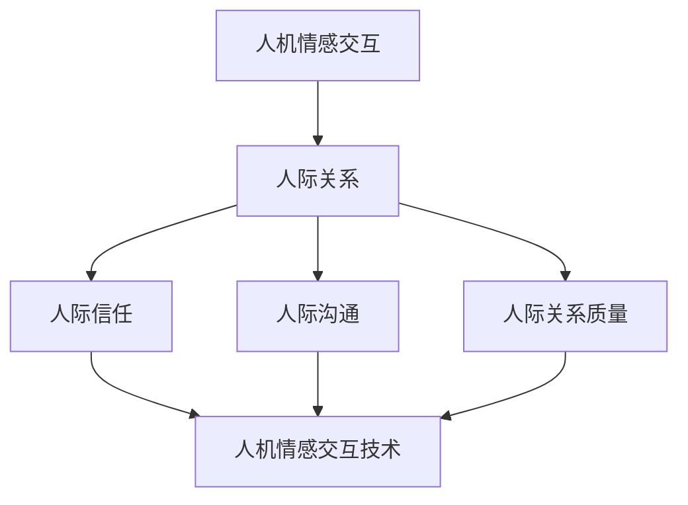

                 

# 人机情感交互对人际关系的影响

关键词：人机情感交互，人际关系，情感分析，信任，沟通，生活质量

摘要：
随着人工智能技术的发展，人机情感交互逐渐成为研究热点。人机情感交互技术不仅能够为用户提供更加个性化的服务，还能在某种程度上影响人际关系。本文将探讨人机情感交互对人际关系的影响，包括情感交互如何影响人际信任、人际沟通以及人际关系质量，并分析人机情感交互在现实世界中的应用与未来发展趋势。

## 《人机情感交互对人际关系的影响》目录大纲

### 第1章：人机情感交互概述
#### 1.1 人机情感交互的定义与背景
#### 1.2 人机情感交互的发展历程
#### 1.3 人机情感交互的重要性

### 第2章：人机情感交互的基本原理
#### 2.1 人机交互理论
##### 2.1.1 人类情感的基本特征
##### 2.1.2 人机情感交互的关键因素
##### 2.1.3 人机情感交互的理论模型

### 第3章：人机情感交互技术
#### 3.1 语音识别与生成
##### 3.1.1 语音识别技术原理
##### 3.1.2 语音合成技术原理
##### 3.1.3 语音识别与合成的应用实例

#### 3.2 面部表情识别
##### 3.2.1 面部表情识别技术原理
##### 3.2.2 面部表情识别算法
##### 3.2.3 面部表情识别应用案例

#### 3.3 语音情感分析
##### 3.3.1 语音情感分析技术原理
##### 3.3.2 语音情感分析方法
##### 3.3.3 语音情感分析应用实例

### 第4章：人机情感交互对人际关系的影响
#### 4.1 人机情感交互对人际关系的影响概述
#### 4.2 人机情感交互对人际信任的影响
##### 4.2.1 人际信任的定义与特征
##### 4.2.2 人机情感交互如何影响人际信任
##### 4.2.3 人际信任对人际关系的影响

#### 4.3 人机情感交互对人际沟通的影响
##### 4.3.1 人际沟通的定义与特征
##### 4.3.2 人机情感交互如何影响人际沟通
##### 4.3.3 人际沟通对人际关系的影响

#### 4.4 人机情感交互对人际关系质量的影响
##### 4.4.1 人际关系质量的概念与测量
##### 4.4.2 人机情感交互如何影响人际关系质量
##### 4.4.3 人际关系质量对生活满意度的影响

### 第5章：人机情感交互在人际关系中的应用
#### 5.1 人机情感交互在教育中的应用
##### 5.1.1 教育中的人机情感交互应用案例
##### 5.1.2 人机情感交互如何提高教育质量
##### 5.1.3 教育中的人机情感交互挑战与解决方案

#### 5.2 人机情感交互在医疗健康中的应用
##### 5.2.1 医疗健康中的人机情感交互应用案例
##### 5.2.2 人机情感交互如何改善医疗体验
##### 5.2.3 医疗健康中的人机情感交互挑战与解决方案

#### 5.3 人机情感交互在社交网络中的应用
##### 5.3.1 社交网络中的人机情感交互应用案例
##### 5.3.2 人机情感交互如何增强社交体验
##### 5.3.3 社交网络中的人机情感交互挑战与解决方案

### 第6章：人机情感交互的未来发展趋势
#### 6.1 人机情感交互技术的未来发展方向
#### 6.2 人机情感交互在人际关系中的应用前景
#### 6.3 人机情感交互面临的挑战与对策

### 第7章：结论与展望
#### 7.1 研究总结
#### 7.2 对未来人机情感交互的展望
#### 7.3 研究局限与未来研究方向

## 附录
### 附录A：人机情感交互相关术语解释
### 附录B：人机情感交互常用算法与模型介绍
### 附录C：人机情感交互相关研究论文推荐
### 附录D：人机情感交互技术开源工具与平台推荐

### 附录E：人机情感交互实验数据集介绍

### 附录F：人机情感交互技术评估指标与方法

## 人机情感交互对人际关系的影响概念实体关系架构 Mermaid 流程图



# 语音情感分析算法讲解与Python源代码实现

## 语音情感分析算法原理

语音情感分析（Speech Emotion Recognition，SER）是自然语言处理领域的一个分支，旨在通过语音信号分析来识别说话者的情感状态。语音情感分析通常基于以下关键步骤：

1. **特征提取**：从语音信号中提取出能够反映情感状态的特征，如频谱特征、语音参数等。
2. **情感分类**：利用机器学习算法对提取出的特征进行分类，以判断说话者的情感状态。

### 语音情感分析技术原理

语音情感分析的过程可以分为三个主要阶段：特征提取、特征选择和情感分类。

#### 特征提取

在特征提取阶段，我们从语音信号中提取一系列能够反映情感状态的特征。常用的特征包括：

- **时域特征**：如音长、音量、音调等。
- **频域特征**：如频谱中心频率、频谱带宽、共振峰频率等。
- **声学参数**：如基音频率、语音强度等。

**Python源代码实现**：

```python
import numpy as np
import scipy.io.wavfile as wav

# 读取wav文件
def read_wav(file_path):
    rate, data = wav.read(file_path)
    return rate, data

# 提取时域特征
def extract_time_domain_features(data):
    durations = data.shape[0] / rate
    volume = np.mean(np.abs(data))
    pitch = ...  # 基音频率提取算法
    return durations, volume, pitch

# 提取频域特征
def extract_freq_domain_features(data):
    fft = np.fft.fft(data)
    freq_center = ...  # 频谱中心频率计算
    bandwidth = ...  # 频谱带宽计算
    return freq_center, bandwidth

# 读取语音信号
rate, data = read_wav('path/to/voice.wav')

# 提取特征
durations, volume, pitch = extract_time_domain_features(data)
freq_center, bandwidth = extract_freq_domain_features(data)
```

#### 特征选择

在特征选择阶段，我们需要从提取出的特征中选择对情感识别最有影响力的特征。常用的方法包括：

- **主成分分析（PCA）**：通过降维减少特征数量，同时保留最大方差的特征。
- **支持向量机（SVM）**：用于特征选择和分类。

**Python源代码实现**：

```python
from sklearn.decomposition import PCA
from sklearn.svm import SVC

# 特征选择
pca = PCA(n_components=5)
X_pca = pca.fit_transform(np.array([durations, volume, pitch, freq_center, bandwidth]).T)

# 情感分类
clf = SVC()
clf.fit(X_pca, labels)
predicted_emotion = clf.predict(X_pca)
```

#### 情感分类

在情感分类阶段，我们使用机器学习算法对提取出的特征进行分类，以判断说话者的情感状态。常用的算法包括：

- **支持向量机（SVM）**：用于分类任务，具有较好的性能。
- **决策树**：用于分类任务，易于解释。
- **神经网络**：用于分类任务，具有强大的非线性建模能力。

**Python源代码实现**：

```python
from sklearn.tree import DecisionTreeClassifier

# 情感分类
clf = DecisionTreeClassifier()
clf.fit(X_pca, labels)
predicted_emotion = clf.predict(X_pca)
```

通过上述步骤，我们可以实现一个基本的语音情感分析系统。在实际应用中，我们可以结合多种特征提取方法和分类算法，以提高系统的准确性和可靠性。此外，为了提高系统的性能，我们还可以使用深度学习算法，如卷积神经网络（CNN）和循环神经网络（RNN），来进行情感识别。

### 结论

语音情感分析技术是自然语言处理领域的一个重要分支，它通过分析语音信号中的情感特征，可以帮助我们更好地理解说话者的情感状态。本文介绍了语音情感分析的基本原理和实现方法，并通过Python源代码实现了情感特征提取和分类过程。在实际应用中，我们可以结合多种特征提取方法和分类算法，以提高系统的准确性和可靠性。未来，随着人工智能技术的不断进步，语音情感分析技术将得到更广泛的应用，并进一步改善人们的生活质量。

