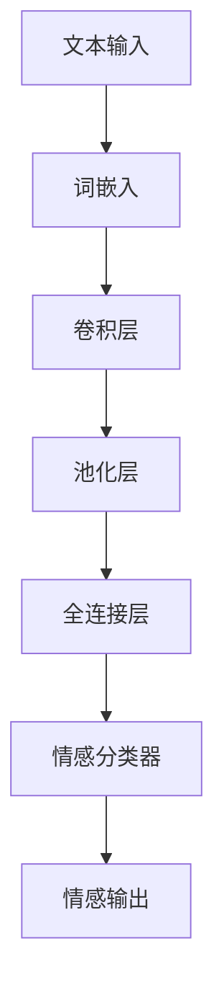
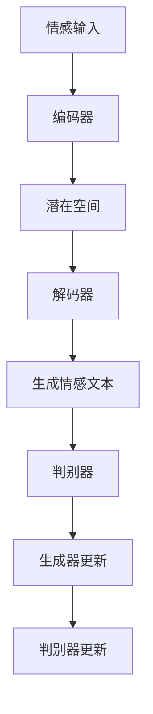
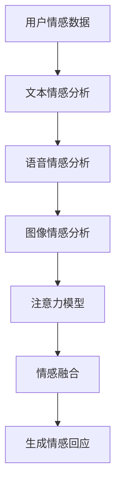
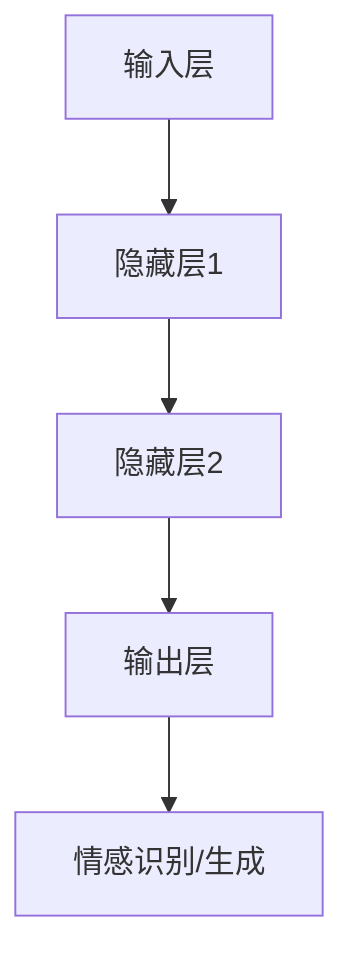
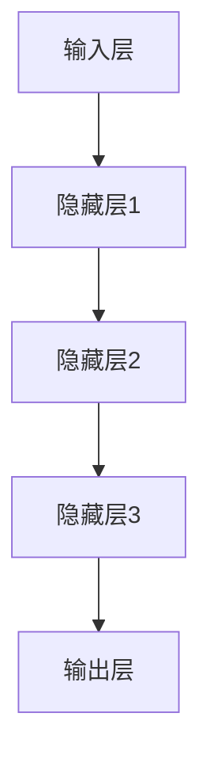
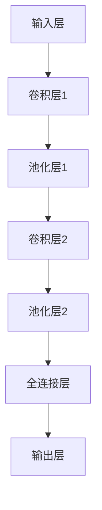

                 

### 引言

在人机情感交流与跨文化交融的交汇点上，我们正见证着一种前所未有的融合力量。随着人工智能技术的迅猛发展，人机情感交流正逐渐从科幻走向现实。在这一背景下，本文旨在探讨人机情感交流对文化交融的促进作用，试图揭示其在推动文化理解、沟通、创新和传承方面的潜力和价值。

人机情感交流，顾名思义，是指人工智能系统在处理和表达情感方面的能力。这种能力不仅能够模拟人类的情感反应，还能够通过情感计算技术理解和回应用户的情感状态。情感交流作为人工智能的重要组成部分，已经广泛应用于教育、医疗、娱乐和商业等领域。而文化交融则是指不同文化之间的相互影响和融合过程，它对促进社会进步、增进国际友谊和文化多样性具有深远影响。

本文将围绕以下结构展开讨论：

1. **人机情感交流基础**：介绍人机情感交流的概念与意义，探讨其技术原理、核心算法和模型架构，并通过应用案例展现其实际效果。
2. **文化交融的促进**：解析文化交融的概念与意义，分析人机情感交流对文化交融的促进作用，并探讨其在不同领域的具体应用。
3. **实践与展望**：总结人机情感交流与跨文化交融的发展趋势，讨论相关政策和规范，并通过案例研究提供实际应用的启示。

通过以上结构的探讨，我们期望能够更清晰地理解人机情感交流对文化交融的深远影响，并为其未来的发展提供有价值的思考。

### 第一部分：人机情感交流基础

#### 1.1 人机情感交流的概念与意义

人机情感交流是指人工智能系统能够识别、处理和表达情感，从而与人类进行更为自然和深层次的互动。这一概念涵盖了多个方面，包括情感识别、情感生成和情感回应。情感识别是指系统通过分析语音、文字和行为等数据来识别用户的情感状态；情感生成则是指系统能够根据情境和用户需求生成相应的情感反应；情感回应是指系统能够对用户的情感表达做出恰当的回应，从而增强互动的体验。

人机情感交流的意义在于，它不仅提升了人工智能与人类之间的交互质量，还拓宽了人工智能的应用场景。具体来说，人机情感交流具有以下几个重要意义：

1. **提升用户体验**：通过情感识别和回应，人工智能系统能够更好地理解用户的需求和情感状态，提供个性化的服务，从而提升用户的满意度和体验。
2. **促进有效沟通**：情感交流使得人工智能系统能够与人类进行更加自然和流畅的对话，减少了沟通障碍，提高了沟通效率。
3. **增强社会互动**：在人机情感交流的帮助下，人工智能可以参与更多的社会互动，如教育、医疗、娱乐等，从而扩展人类的社会生活空间。
4. **提高工作效率**：通过情感交流，人工智能系统能够更好地辅助人类完成复杂的工作任务，提高工作效率和质量。

#### 1.2 人机情感交流的重要性

随着人工智能技术的不断进步，人机情感交流的重要性日益凸显。以下是几个关键点：

1. **技术发展需求**：随着人工智能技术的不断进化，情感交流成为衡量人工智能智能程度的重要标准。一个能够识别和回应人类情感的系统，无疑更接近于实现人工智能的最高目标——模拟人类智能。
2. **人类需求满足**：人类在交流过程中不仅需要信息的传递，更需要情感的共鸣。人机情感交流能够满足人类在情感沟通方面的需求，提升整体生活质量。
3. **应用场景拓展**：人机情感交流的广泛应用，如智能客服、智能陪护、虚拟助理等，极大地丰富了人工智能的应用场景，推动了技术的商业化和社会化。
4. **教育医疗创新**：在人机情感交流的支持下，教育、医疗等领域正在经历深刻的变革。例如，智能教育系统能够根据学生的情感状态调整教学策略，智能医疗系统能够通过情感分析帮助医生更好地理解患者。

#### 1.3 人机情感交流与人工智能的关系

人机情感交流是人工智能技术发展中的一个重要方向，它与人工智能的关系紧密相连。以下是几个关键点：

1. **基础技术支撑**：情感交流技术依赖于自然语言处理、机器学习、情感计算等基础技术。这些技术的发展为人机情感交流提供了坚实的基础。
2. **智能程度的体现**：情感交流能力是衡量人工智能智能程度的重要指标。一个能够进行情感交流的人工智能系统，意味着它在理解人类情感、处理复杂情境和进行有效互动方面具有较高水平。
3. **人机交互的进化**：人机情感交流推动了人机交互的进化，使得人机交互更加自然和人性化。这一进化不仅提升了用户体验，也为人工智能在更多领域的应用提供了可能性。
4. **跨学科融合**：人机情感交流需要融合心理学、社会学、计算机科学等多个学科的知识，这种跨学科的融合推动了人工智能技术的综合发展。

通过以上分析，我们可以看到，人机情感交流不仅是人工智能技术发展的重要方向，也是推动社会进步和文化交融的重要力量。接下来，我们将进一步探讨人机情感交流的技术原理、核心算法和模型架构。

#### 2. 人机情感交流的技术原理

人机情感交流的实现离不开一系列先进技术的支撑，这些技术共同构建了一个复杂而高效的系统。以下是人机情感交流的主要技术原理，包括人工智能的发展历程、情感计算技术、语音识别与生成技术以及自然语言处理技术。

##### 2.1 人工智能的发展历程

人工智能（Artificial Intelligence，AI）的研究可以追溯到20世纪50年代，当时图灵提出了著名的图灵测试，试图定义机器是否能够表现如人类一样的智能。此后，人工智能经历了几个重要阶段：

1. **符号主义阶段（1956-1979）**：这一阶段的主要思想是通过符号表示和推理来模拟人类智能。代表性系统包括ELIZA和Logic Theorist。
2. **连接主义阶段（1980-1987）**：这一阶段强调通过神经网络模拟大脑的工作原理。代表性系统包括感知机（Perceptron）和反向传播算法（Backpropagation）。
3. **强化学习阶段（1990至今）**：这一阶段通过让机器在与环境的交互中学习来提升智能水平。代表性系统包括深度强化学习（Deep Reinforcement Learning）和AlphaGo。
4. **生成对抗网络（GAN）阶段（2012至今）**：这一阶段通过生成对抗网络（GANs）模拟复杂的数据分布，推动了图像识别、生成和修复等领域的发展。

人工智能的发展历程为人机情感交流提供了丰富的理论基础和技术工具。

##### 2.2 情感计算技术

情感计算（Affective Computing）是研究如何使计算机识别、理解、处理和模拟人类情感的技术。情感计算的主要目标是使计算机能够更好地与人类进行情感互动，从而提升用户体验。情感计算主要包括以下几个方面：

1. **情感识别**：通过分析语音、文字、面部表情和行为等数据，计算机可以识别用户的情感状态。情感识别技术依赖于机器学习算法，如情感分类器和情感嵌入模型。
2. **情感生成**：计算机能够根据情境和用户需求生成相应的情感反应，如语音合成、表情生成和行为生成。情感生成技术通常使用生成模型，如变分自编码器（VAEs）和生成对抗网络（GANs）。
3. **情感融合**：在多人互动中，计算机需要能够理解多个用户之间的情感互动，并生成相应的情感回应。情感融合技术通过情感协同建模和情感交互分析实现。

##### 2.3 语音识别与生成技术

语音识别与生成技术是人机情感交流的重要组成部分，它们使得计算机能够通过声音与人类进行情感交流。以下是这两个技术的详细介绍：

1. **语音识别技术**：语音识别（Automatic Speech Recognition，ASR）是将语音信号转换为文本的技术。语音识别技术通过以下几个步骤实现：

   - **前端处理**：包括语音信号的预处理，如去噪、加窗和特征提取，常用的特征包括梅尔频率倒谱系数（MFCC）和线性预测编码（LPC）。
   - **中间处理**：通过隐马尔可夫模型（HMM）、循环神经网络（RNN）和卷积神经网络（CNN）等模型，对特征进行建模和识别。
   - **后端处理**：包括语言模型（Language Model）和解码器，用于提高识别的准确性和流畅性。

   代表性系统包括Google语音识别和Apple Siri。

2. **语音生成技术**：语音生成（Text-to-Speech，TTS）是将文本转换为自然语音的技术。语音生成技术通过以下几个步骤实现：

   - **文本预处理**：包括分词、句法分析和语义分析，以便理解文本的内容和结构。
   - **语音合成**：使用合成模型，如参数合成模型（如WaveNet）和基于数据驱动的方法（如HMM-GMM），生成音频信号。
   - **语音润色**：包括语音调节、音调、音速和音色的调整，以提升语音的自然度和音质。

   代表性系统包括Google Text-to-Speech和Amazon Polly。

##### 2.4 自然语言处理技术

自然语言处理（Natural Language Processing，NLP）是使计算机能够理解和处理人类语言的技术，它在人机情感交流中扮演着关键角色。NLP的主要技术包括：

1. **词嵌入（Word Embedding）**：词嵌入是将单词映射到高维向量空间的技术，用于捕捉单词的语义关系。词嵌入技术如Word2Vec和GloVe，通过大量的语料库训练，将单词映射到具有相似语义的向量。
2. **语法分析（Syntax Analysis）**：语法分析是对文本进行句法结构的解析，用于理解句子的结构关系。语法分析技术包括部分解析（Partial Parsing）和完全解析（Full Parsing）。
3. **语义分析（Semantic Analysis）**：语义分析是理解文本的含义和意义，用于捕捉文本的语义关系。语义分析技术包括指代消解（Reference Resolution）、情感分析（Sentiment Analysis）和知识图谱（Knowledge Graph）。
4. **对话系统（Dialogue System）**：对话系统是使计算机能够与人类进行自然对话的技术。对话系统通常包括对话管理（Dialogue Management）、语言生成（Language Generation）和语言理解（Language Understanding）三个主要模块。

通过以上技术，人机情感交流系统能够实现与人类的自然、情感和有意义的互动，从而推动人工智能在各个领域的应用和发展。

#### 3. 人机情感交流的核心算法

在人机情感交流中，核心算法起到了至关重要的作用，它们是系统实现情感识别、情感生成和情感融合的关键。以下是几种主要的核心算法及其工作原理。

##### 3.1 情感识别算法

情感识别算法旨在通过分析文本、语音和图像等数据，识别用户的情感状态。以下是几种常用的情感识别算法：

1. **基于机器学习的情感识别算法**：
   - **支持向量机（SVM）**：通过将文本转换为高维特征空间，利用支持向量机分类模型进行情感分类。
   - **朴素贝叶斯分类器**：利用贝叶斯理论，通过计算词的概率分布来进行情感分类。
   - **深度学习算法**：如卷积神经网络（CNN）和循环神经网络（RNN），通过学习文本的特征表示进行情感识别。

2. **情感识别的工作原理**：
   - **特征提取**：通过词嵌入、文本分类和序列模型等方法，将文本数据转换为数值特征。
   - **模型训练**：利用标记好的训练数据，通过机器学习算法训练分类模型。
   - **情感分类**：通过训练好的模型，对输入文本进行情感分类，输出情感标签。

例如，一个基于CNN的情感识别算法可以工作如下：

##### 3.2 情感生成算法

情感生成算法的目标是生成与情感识别算法识别出的情感状态相匹配的文本、语音或图像。以下是几种常用的情感生成算法：

1. **基于生成对抗网络（GAN）的情感生成算法**：
   - **生成器（Generator）**：通过学习数据分布，生成与真实数据相似的情感文本或图像。
   - **判别器（Discriminator）**：通过区分生成数据和真实数据，帮助生成器生成更高质量的数据。

2. **基于变分自编码器（VAE）的情感生成算法**：
   - **编码器（Encoder）**：将输入数据编码为潜在空间中的向量。
   - **解码器（Decoder）**：从潜在空间中生成数据。

3. **基于文本生成模型（如Seq2Seq模型）的情感生成算法**：
   - **编码器**：将输入文本编码为固定长度的向量。
   - **解码器**：生成情感文本。

例如，一个基于GAN的情感生成算法可以工作如下：

##### 3.3 情感融合算法

情感融合算法的目标是在多人互动中，综合考虑多个用户的情感状态，生成整体的情感回应。以下是几种常用的情感融合算法：

1. **基于协同过滤的情感融合算法**：
   - **用户情感分析**：对每个用户的情感状态进行识别。
   - **情感融合**：通过用户情感评分和协同过滤方法，生成整体的情感回应。

2. **基于多模态融合的情感融合算法**：
   - **多模态数据采集**：收集文本、语音、图像等多模态数据。
   - **情感融合模型**：使用多模态学习模型，如多任务学习（Multi-Task Learning）和联合嵌入（Joint Embedding），融合不同模态的情感信息。

3. **基于注意力机制的融合算法**：
   - **注意力模型**：通过注意力机制，动态分配不同模态数据的权重。
   - **情感融合**：结合不同模态的情感信息，生成综合情感回应。

例如，一个基于注意力机制的情感融合算法可以工作如下：

通过以上核心算法，人机情感交流系统能够有效地识别、生成和融合情感，从而实现与人类更为自然和深层次的互动。这些算法的工作原理和流程图不仅揭示了情感交流的复杂性，也展示了其技术实现的可行性。

#### 4. 人机情感交流的模型架构

在人机情感交流系统中，模型架构的设计和实现至关重要。一个高效的模型架构不仅能提升系统的性能，还能确保其在不同应用场景中的灵活性和适应性。以下是几种常见的人机情感交流模型架构，包括神经网络模型、递归神经网络（RNN）和卷积神经网络（CNN）。

##### 4.1 神经网络模型

神经网络模型是人机情感交流的核心组成部分，它通过多层非线性变换，实现从输入数据到情感识别和生成的映射。以下是神经网络模型的基本架构：

1. **输入层**：接收用户输入的文本、语音或图像数据。
2. **隐藏层**：包括一个或多个隐藏层，通过激活函数（如ReLU、Sigmoid或Tanh）进行非线性变换。
3. **输出层**：根据任务需求，输出情感标签、情感评分或情感文本。

一个典型的神经网络模型可以表示为：

例如，一个用于情感识别的神经网络模型可能包括以下步骤：
1. **文本输入**：将文本转换为词嵌入向量。
2. **嵌入层**：使用预训练的词嵌入模型（如GloVe或Word2Vec）。
3. **隐藏层**：通过多层全连接层和激活函数进行特征提取。
4. **输出层**：使用softmax函数输出情感概率分布。

##### 4.2 递归神经网络（RNN）

递归神经网络（RNN）特别适合处理序列数据，如文本和语音。RNN通过保存前一个时间步的隐藏状态，使模型能够处理时间依赖性数据。以下是RNN的基本架构：

1. **输入层**：接收序列数据。
2. **隐藏层**：包括一个或多个隐藏单元，每个单元保存当前时间步的输入和前一个时间步的隐藏状态。
3. **输出层**：根据当前时间步的隐藏状态输出预测结果。

一个典型的RNN模型可以表示为：

例如，一个用于情感识别的RNN模型可能包括以下步骤：
1. **文本输入**：将文本序列转换为词嵌入向量。
2. **RNN层**：通过循环连接，对文本序列进行特征提取。
3. **输出层**：使用softmax函数输出情感概率分布。

##### 4.3 卷积神经网络（CNN）

卷积神经网络（CNN）擅长处理图像和语音等二维数据。CNN通过卷积层和池化层提取特征，然后通过全连接层进行分类。以下是CNN的基本架构：

1. **输入层**：接收图像或语音信号。
2. **卷积层**：通过卷积操作提取局部特征。
3. **池化层**：通过下采样操作降低维度，减少参数数量。
4. **全连接层**：将卷积特征映射到分类结果。

一个典型的CNN模型可以表示为：

例如，一个用于情感识别的CNN模型可能包括以下步骤：
1. **图像输入**：将图像数据转换为灰度值或RGB值。
2. **卷积层**：通过卷积操作提取图像的局部特征。
3. **池化层**：通过最大池化或平均池化操作降低特征维度。
4. **全连接层**：通过全连接层将特征映射到情感分类结果。

综上所述，不同的神经网络模型在处理人机情感交流任务时各有优势。RNN适合处理序列数据，CNN适合处理图像和语音数据，而神经网络模型则具备更高的灵活性和通用性。在实际应用中，可以根据具体任务需求选择合适的模型架构，以实现高效的人机情感交流。

#### 5. 人机情感交流的应用案例

人机情感交流技术的快速发展，使其在多个领域得到了广泛应用，显著提升了用户体验和效率。以下是人机情感交流在几个主要领域中的应用案例。

##### 5.1 教育领域的应用

在教育领域，人机情感交流技术被广泛应用于智能教育系统和个性化学习平台。以下是一些具体的应用案例：

1. **智能教育系统**：
   - **情感识别**：智能教育系统能够通过语音识别技术识别学生的情感状态，如情绪波动、焦虑和无聊等。
   - **情感回应**：系统根据学生的情感状态调整教学策略，如播放轻松的音乐、提供额外的学习材料或调整讲解速度。

2. **个性化学习平台**：
   - **情感分析**：平台通过分析学生的学习记录和互动行为，识别其学习习惯、偏好和情感状态。
   - **情感反馈**：系统根据学生的情感状态提供个性化的学习建议，如调整学习任务难度、提供情感支持或推荐适合的学习资源。

案例研究：一个在线学习平台使用情感识别技术，通过分析学生的语音和文本互动，识别其情绪波动。当检测到学生出现焦虑或沮丧的情绪时，系统会自动提供缓解压力的建议，如播放放松音乐或提供心理辅导资源。这种个性化服务显著提升了学生的参与度和学习效果。

##### 5.2 医疗保健领域的应用

在医疗保健领域，人机情感交流技术被广泛应用于智能客服系统、医疗辅助诊断和心理健康监测等方面。以下是一些具体的应用案例：

1. **智能客服系统**：
   - **情感识别**：智能客服系统能够通过自然语言处理技术理解患者的问题，并通过情感分析识别患者的情感状态，如焦虑、不安或满意。
   - **情感回应**：系统根据患者的情感状态提供个性化的回答和解决方案，如安慰患者、提供医疗建议或引导患者进行进一步的诊断。

2. **医疗辅助诊断**：
   - **情感分析**：医生在诊断过程中，通过分析患者的情感状态，如焦虑、恐惧或不安，可以更准确地理解患者的病情和需求，从而做出更合理的诊断。
   - **情感反馈**：系统通过情感分析，向医生提供患者的情感状态报告，帮助医生调整诊断策略和治疗方案。

3. **心理健康监测**：
   - **情感识别**：通过分析患者的语音、文本和行为，心理健康监测系统能够识别患者的心理健康状况，如抑郁症、焦虑症或其他情绪障碍。
   - **情感干预**：系统根据患者的情感状态，提供个性化的心理健康干预方案，如推荐放松练习、心理辅导或药物治疗。

案例研究：一家医院引入了基于情感识别技术的智能客服系统，通过分析患者的语音和文本互动，系统能够识别患者的情感状态并给出相应的建议。例如，当患者表现出焦虑情绪时，系统会提供放松练习和心理支持，帮助患者缓解情绪。这种服务提高了患者的满意度，也减轻了医生的工作负担。

##### 5.3 娱乐领域的应用

在娱乐领域，人机情感交流技术被广泛应用于虚拟助手、智能客服和个性化推荐系统等方面。以下是一些具体的应用案例：

1. **虚拟助手**：
   - **情感识别**：虚拟助手能够通过语音识别和自然语言处理技术，理解用户的情感状态，如开心、愤怒或无聊。
   - **情感回应**：虚拟助手根据用户的情感状态，提供相应的娱乐内容和互动建议，如播放用户喜欢的音乐、推荐电影或组织游戏活动。

2. **智能客服**：
   - **情感识别**：智能客服系统能够通过文本和语音分析，识别用户的需求和情感状态，如需求咨询、投诉或请求帮助。
   - **情感回应**：系统根据用户的情感状态，提供个性化的解决方案，如安慰用户、快速解决问题或引导用户进行下一步操作。

3. **个性化推荐系统**：
   - **情感分析**：通过分析用户的互动行为和情感状态，推荐系统能够识别用户的兴趣和偏好，提供个性化的娱乐内容推荐。
   - **情感反馈**：系统根据用户的情感反馈，调整推荐策略，提高推荐的准确性和满意度。

案例研究：一家在线视频平台使用了基于情感识别的虚拟助手，通过分析用户的互动行为和情感状态，系统能够推荐符合用户情感状态的视频内容。例如，当用户表现出无聊情绪时，系统会推荐喜剧片或轻松的音乐视频，而用户表现出兴奋情绪时，则会推荐动作片或演唱会视频。这种个性化的推荐服务显著提升了用户的观看体验和平台粘性。

综上所述，人机情感交流技术在教育、医疗保健和娱乐等领域具有广泛的应用潜力。通过情感识别、情感回应和个性化服务，这些应用不仅提升了用户体验，还推动了各领域的发展和创新。

#### 6. 文化交融的概念与意义

文化交融（Cultural Integration）是指不同文化之间通过相互影响、交流和互动，逐渐融合成为一种新的文化现象。这一过程不仅涉及文化元素的交换，如语言、习俗、艺术和价值观，还涉及到文化心理层面的共鸣和认同。文化交融的意义在于：

1. **社会进步**：文化交融能够促进社会多样性和包容性，推动社会进步。通过文化交融，人们能够更好地理解其他文化，减少误解和冲突，增强社会和谐。
2. **知识创新**：文化交融为知识创新提供了丰富的土壤。不同文化的碰撞和融合，激发了新的思想、观念和创意，推动了科学技术的进步和文化艺术的繁荣。
3. **国际友谊**：文化交融有助于增进国家之间的友谊和互信，促进国际合作与发展。通过文化交流，各国人民能够建立更加深厚的友谊，共同面对全球挑战。

然而，文化交融也面临一些挑战：

1. **文化冲突**：不同文化在价值观、信仰和行为规范上存在差异，可能导致文化冲突。如何在尊重多样性的同时，解决文化冲突，是一个重要的课题。
2. **文化同化**：文化交融过程中，某些强势文化可能会对弱势文化产生同化效应，导致文化多样性的丧失。因此，如何平衡文化交融与文化保护之间的关系，是一个关键问题。
3. **文化误解**：文化交融可能导致文化误解，甚至偏见和歧视。消除这些误解，促进文化相互理解和尊重，是文化交融的重要任务。

总之，文化交融是一个复杂而多维的过程，它在社会进步、知识创新和国际友谊等方面具有重要作用，同时也面临一系列挑战。接下来，我们将探讨人机情感交流如何促进文化交融，并分析其在这一过程中发挥的关键作用。

#### 7. 人机情感交流对文化交融的促进作用

人机情感交流技术的迅速发展，为文化交融提供了新的动力和机遇。通过提升文化理解与感知、促进跨文化沟通与合作、丰富文化产品与服务以及推动文化传承与创新，人机情感交流在文化交融中发挥了重要的促进作用。

##### 7.1 提高文化理解与感知

人机情感交流技术的核心在于理解和回应人类的情感状态，这为跨文化理解提供了重要工具。以下是人机情感交流如何提高文化理解与感知的几个方面：

1. **情感识别与理解**：通过情感识别技术，人机系统能够分析文化背景中的情感表达，如语气、面部表情和肢体语言，从而更准确地理解不同文化背景下的情感状态。这种理解有助于消除文化误解，提高跨文化沟通的准确性。
2. **情感共鸣与共情**：人机情感交流系统能够通过情感生成技术，模拟和理解不同文化背景下的情感反应。这种情感共鸣和共情能力，使得人机系统能够更好地理解并回应来自不同文化的用户需求，增强跨文化互动的深度。
3. **个性化文化体验**：基于情感理解，人机系统能够提供个性化的文化体验，如推荐符合用户情感状态的文化产品和服务。这种个性化服务不仅提升了用户体验，还促进了不同文化之间的理解和接纳。

##### 7.2 促进跨文化沟通与合作

跨文化沟通与合作的有效性在很大程度上取决于文化理解和情感交流。以下是人机情感交流如何促进跨文化沟通与合作的几个方面：

1. **情感交流平台**：人机情感交流系统可以作为跨文化沟通的桥梁，帮助不同文化背景的人进行有效沟通。通过情感交流，系统能够识别和回应用户的情感需求，提供适时的情感支持和建议，从而减少沟通障碍。
2. **实时情感反馈**：在跨文化项目中，人机情感交流系统能够实时分析团队成员的情感状态，提供情感反馈。这种实时反馈有助于团队成员更好地理解彼此的情感需求，调整沟通策略，增强团队协作效果。
3. **文化冲突调解**：在人机情感交流的帮助下，可以及时识别和解决文化冲突。例如，当两个文化背景不同的人发生冲突时，人机系统可以通过情感分析，识别冲突原因，提供调解建议，促进双方达成共识。

##### 7.3 丰富文化产品与服务

人机情感交流技术的应用，不仅提高了文化理解与沟通，还丰富了文化产品与服务，为文化交融提供了更多的可能性。以下是几个具体的应用场景：

1. **文化内容推荐**：基于情感识别和个性化推荐技术，人机系统能够根据用户的情感状态和偏好，推荐符合其情感需求的文化内容，如电影、音乐、艺术作品等。这种个性化推荐不仅丰富了用户的文化体验，还促进了不同文化之间的传播与交流。
2. **情感互动体验**：在虚拟现实（VR）和增强现实（AR）技术中，人机情感交流系统可以提供沉浸式的文化体验。通过情感生成和互动技术，用户可以与虚拟文化角色进行情感交流，深入了解不同文化的内涵和特色。
3. **文化教育服务**：在人机情感交流的支持下，文化教育服务可以更加生动和有趣。例如，智能教育系统能够通过情感分析，识别学生的学习需求和情感状态，提供个性化的教学方案，提高文化教育的效果。

##### 7.4 推动文化传承与创新

文化传承与创新是文化交融的重要目标，人机情感交流技术在这一过程中发挥着重要作用。以下是几个方面的应用：

1. **文化遗产数字化**：通过情感计算和自然语言处理技术，人机系统能够对文化遗产进行数字化处理，包括语音识别、文本转录和情感分析等。这种数字化文化遗产不仅便于保存和传播，还可以通过情感交流技术，使文化遗产更加生动和具有互动性。
2. **文化创新激发**：人机情感交流系统可以通过分析用户的文化需求和创新思维，激发文化创新。例如，智能创意助手能够根据用户的情感状态和创意需求，提供文化创新建议，促进文化产品和服务的创新。
3. **文化情感传播**：通过情感生成和传播技术，人机系统能够创造和传播具有情感共鸣的文化内容。这种情感传播不仅有助于提升文化影响力的传播效果，还能促进不同文化之间的情感共鸣和融合。

综上所述，人机情感交流技术在提高文化理解与感知、促进跨文化沟通与合作、丰富文化产品与服务以及推动文化传承与创新方面具有广泛的应用潜力。通过这些应用，人机情感交流不仅为文化交融提供了新的动力和途径，也为文化的持续发展和繁荣做出了积极贡献。

#### 8. 人机情感交流在文化交融中的应用

在人机情感交流技术的支持下，文化交融在不同领域得到了显著的应用和推广。以下是人机情感交流在跨文化教育、社交、商业和跨文化交流活动中的具体应用。

##### 8.1 跨文化教育中的应用

跨文化教育是促进文化交融的重要途径，而人机情感交流技术为其提供了新的工具和方法。以下是人机情感交流在跨文化教育中的应用：

1. **情感识别与反馈**：在教育过程中，人机情感交流系统能够通过语音和文本分析，识别学生的情感状态，如焦虑、无聊或兴奋。根据这些情感状态，系统可以提供实时反馈，帮助学生调整情绪，提高学习效果。

2. **个性化教学方案**：人机情感交流技术可以分析学生的情感需求和学习习惯，为每个学生制定个性化的教学方案。这种个性化教育不仅能够提高学生的学习兴趣，还能促进其对不同文化的理解和接纳。

3. **文化角色模拟**：通过虚拟现实（VR）技术，人机情感交流系统可以创建虚拟的文化角色，让学生在沉浸式的环境中体验不同文化。这些虚拟角色能够通过情感交流，帮助学生更好地理解文化内涵和特点。

案例研究：某国际学校引入了基于情感识别技术的学习平台。平台能够分析学生的情感状态，并根据情感反馈调整教学内容和方式。例如，当学生表现出焦虑情绪时，平台会提供放松指导和心理支持，帮助学生缓解压力，提高学习效率。

##### 8.2 跨文化社交中的应用

跨文化社交是促进文化交融的重要手段，而人机情感交流技术为其提供了更多可能性。以下是人机情感交流在跨文化社交中的应用：

1. **情感交流平台**：通过人机情感交流技术，社交平台可以提供情感识别和回应功能，帮助用户更好地理解彼此的情感状态。这种情感交流不仅能够增进用户之间的信任，还能促进不同文化背景的人之间的互动。

2. **文化体验分享**：人机情感交流系统可以创建虚拟的文化体验场景，如虚拟博物馆、虚拟旅游等，让用户在互动中了解和体验不同文化。这种文化体验分享有助于打破文化壁垒，增进文化交流和理解。

3. **情感支持社区**：在人机情感交流技术的支持下，社交平台可以建立情感支持社区，为用户提供情感交流和支持。这些社区不仅能够帮助用户解决文化适应问题，还能提供心理支持和情感共鸣。

案例研究：某社交平台引入了基于情感识别的聊天机器人，用户可以通过文本和语音与机器人交流情感。机器人能够根据用户的情感状态提供情感支持和建议，帮助用户更好地应对文化适应挑战。

##### 8.3 跨文化商业中的应用

跨文化商业活动在全球化背景下日益频繁，而人机情感交流技术为跨文化商业提供了更多机会。以下是人机情感交流在跨文化商业中的应用：

1. **客户情感分析**：在人机情感交流技术的支持下，企业可以通过分析客户的情感状态，了解客户需求和心理预期。这种情感分析有助于企业提供更个性化的服务，提升客户满意度和忠诚度。

2. **跨文化营销**：人机情感交流技术可以帮助企业制定更具针对性的跨文化营销策略。通过情感识别和回应，企业可以更好地理解不同文化背景下的客户情感需求，从而创造更有效的营销内容。

3. **文化适应性培训**：在人机情感交流技术的支持下，企业可以为员工提供跨文化适应性培训。这些培训内容可以包括文化理解、情感交流和跨文化沟通技巧，帮助员工更好地适应不同文化背景的商业环境。

案例研究：某跨国公司引入了基于情感识别的客户服务系统。系统能够分析客户的情感状态，根据情感反馈提供个性化的客户服务。例如，当客户表现出不满情绪时，系统会自动提供解决方案，同时向客服团队发送提醒，确保及时解决客户问题，提高客户满意度。

##### 8.4 跨文化交流活动的组织与推广

跨文化交流活动是促进文化交融的重要形式，而人机情感交流技术为其提供了创新的组织和推广手段。以下是人机情感交流在跨文化交流活动中的应用：

1. **情感引导与互动**：在人机情感交流技术的支持下，跨文化交流活动可以引入情感引导和互动机制。例如，通过情感识别技术，活动组织者可以了解参与者的情感状态，并根据情感反馈调整活动内容和形式，提高参与者的体验。

2. **虚拟文化交流**：通过虚拟现实（VR）和增强现实（AR）技术，人机情感交流系统可以创建虚拟的文化交流场景。参与者可以通过这些虚拟场景进行情感交流和互动，体验不同文化的魅力。

3. **文化展示与传播**：人机情感交流技术可以用于文化展示和传播，例如通过智能导览系统、虚拟博物馆和数字展览等形式，让更多的人了解和体验不同文化的内涵和特色。

案例研究：某文化机构利用人机情感交流技术组织了一场虚拟文化交流活动。参与者通过虚拟现实头盔进入虚拟文化场景，与虚拟文化角色进行情感交流。活动结束后，参与者通过情感反馈问卷，对活动的体验进行了高度评价，认为这种虚拟文化交流形式既新颖又富有深度。

综上所述，人机情感交流技术在跨文化教育、社交、商业和跨文化交流活动中的应用，不仅丰富了文化交融的形式和内容，也为文化交融提供了新的动力和途径。通过这些应用，人机情感交流技术正在推动文化交融向更深层次和更广泛领域发展。

#### 9. 人机情感交流与文化遗产保护

文化遗产是人类历史和文化的宝贵财富，它不仅反映了人类文明的演进，还承载了丰富的情感和价值。然而，随着现代社会的快速发展，文化遗产正面临着诸多挑战，如自然侵蚀、人为破坏和全球化带来的文化冲击。在这个背景下，人机情感交流技术为文化遗产保护提供了新的视角和手段。

##### 9.1 文化遗产保护的重要性

文化遗产保护的重要性不言而喻，它关系到文化多样性和人类共同记忆的传承。以下是文化遗产保护的一些关键点：

1. **文化多样性的维护**：文化遗产是人类文化多样性的重要体现，保护文化遗产有助于维护全球文化的多样性，促进不同文化之间的理解和尊重。
2. **历史记忆的传承**：文化遗产是人类历史的见证，保护文化遗产有助于传承和弘扬历史文化，增强民族自豪感和文化认同感。
3. **可持续发展**：文化遗产资源是一种重要的旅游资源，合理的保护与开发可以促进当地经济的发展，实现文化传承与可持续发展的双赢。

##### 9.2 人机情感交流在文化遗产保护中的应用

人机情感交流技术为文化遗产保护提供了多种应用场景，以下是其主要应用：

1. **数字化文化遗产展示**：通过情感计算和虚拟现实（VR）技术，人机情感交流系统能够创建数字化的文化遗产展示平台。这些平台可以模拟文化遗产的历史场景、人物对话和情感表达，让用户在虚拟环境中体验文化遗产的生动魅力。例如，利用语音识别和情感生成技术，系统可以模拟历史人物的语言和情感状态，让用户感受到更真实的历史体验。

2. **情感引导与互动**：在人机情感交流技术的支持下，文化遗产展示可以引入情感引导和互动机制。通过情感识别技术，系统可以了解观众的情感状态，并根据情感反馈调整展示内容，提高观众的参与度和体验效果。例如，当观众表现出对某个文化遗产的兴趣时，系统可以提供更多的相关信息和互动体验，如历史背景介绍、文化习俗展示等。

3. **文化遗产监测与预警**：人机情感交流技术可以用于文化遗产的监测和保护。通过情感计算和传感器技术，系统可以实时监测文化遗产的状态和环境变化，识别潜在的风险和问题。例如，系统可以监测文物表面的温度、湿度、光照等参数，以及观众的互动行为，及时发现异常情况并发出预警。

4. **文化遗产教育与传播**：人机情感交流技术可以用于文化遗产的教育和传播。通过情感生成和自然语言处理技术，系统可以创建交互式的文化遗产教育内容，如虚拟导游、互动游戏等，让用户在轻松愉快的氛围中了解和学习文化遗产。例如，系统可以根据用户的情感状态和兴趣，提供定制化的教育内容，提高教育效果。

##### 9.3 文化遗产数字化保护

数字化保护是文化遗产保护的重要方向，它通过数字化手段保存和传承文化遗产。以下是文化遗产数字化保护的几个关键步骤：

1. **数据采集与处理**：通过多种技术手段，如3D扫描、激光扫描、摄影测量等，对文化遗产进行高精度数据采集。然后，利用计算机视觉和图像处理技术，对这些数据进行分析和处理，生成数字化的文化遗产模型。

2. **三维可视化与互动**：通过三维可视化技术，将数字化文化遗产模型呈现在虚拟环境中。结合人机情感交流技术，用户可以与虚拟的文化遗产进行互动，如参观、探索、交互等。

3. **情感交互与体验**：在人机情感交流技术的支持下，用户可以在虚拟环境中体验到更加生动和真实的文化遗产。例如，通过情感生成技术，虚拟的文化遗产角色可以表达情感，与用户进行情感交流，增强用户的体验效果。

4. **长期保存与共享**：数字化文化遗产模型可以通过云存储和分布式网络进行长期保存和共享。通过人机情感交流技术，用户可以在任何时间和地点访问这些文化遗产，了解和学习其历史和内涵。

##### 9.4 文化遗产传承与创新的挑战与机遇

文化遗产传承与创新是一个复杂而具有挑战性的过程，人机情感交流技术的应用为其带来了新的机遇和挑战：

1. **挑战**：
   - **数据隐私与伦理**：数字化文化遗产过程中涉及大量的个人数据和隐私信息，如何在保护数据隐私和伦理的前提下进行数据处理，是一个重要挑战。
   - **技术适应性与扩展性**：文化遗产的保护和传承需要多种技术的支持，如何确保技术的适应性和扩展性，以满足不同文化和地区的需求，是一个挑战。
   - **用户参与与反馈**：如何激发用户对文化遗产数字化保护的关注和参与，收集用户的反馈和需求，是一个挑战。

2. **机遇**：
   - **增强文化体验**：人机情感交流技术可以为用户带来更加丰富和真实的文化体验，提升文化遗产的吸引力和影响力。
   - **促进文化交流**：通过数字化文化遗产，不同文化背景的用户可以更方便地了解和体验其他文化，促进文化交流和理解。
   - **技术创新与应用**：数字化文化遗产保护将推动相关技术的创新和应用，如人工智能、虚拟现实、增强现实等，为文化遗产保护提供更多可能性。

综上所述，人机情感交流技术在文化遗产保护中的应用，不仅为文化遗产的传承与创新提供了新的工具和手段，也为文化遗产保护带来了新的机遇和挑战。通过这些应用，我们可以更好地保护和传承文化遗产，促进文化的多样性和可持续发展。

### 第三部分：实践与展望

#### 10. 人机情感交流与跨文化交融的发展趋势

随着技术的不断进步，人机情感交流与跨文化交融正呈现出一系列新的发展趋势。以下是对这些趋势的分析和展望：

1. **技术融合与创新**：人机情感交流技术正在与其他前沿技术如虚拟现实（VR）、增强现实（AR）、区块链等深度融合，推动跨文化交融的创新发展。例如，通过VR/AR技术，用户可以在虚拟环境中与来自不同文化背景的虚拟角色进行情感交流，提升跨文化体验的真实感和互动性。

2. **智能化与个性化**：随着自然语言处理（NLP）和机器学习（ML）技术的进步，人机情感交流系统将变得更加智能化和个性化。系统能够根据用户的情感状态、文化背景和偏好，提供定制化的情感回应和跨文化服务，提升用户体验和满意度。

3. **社会影响力扩大**：人机情感交流技术将在更多社会领域得到应用，如教育、医疗、旅游等，其跨文化交融的作用将进一步扩大。例如，智能教育系统能够根据学生的文化背景和情感状态，提供个性化的学习内容和文化体验，促进全球教育的公平和质量。

4. **伦理与规范**：随着人机情感交流技术的广泛应用，相关的伦理和规范问题日益凸显。如何在确保技术发展和文化交融的同时，保护用户隐私、尊重文化多样性和维护社会秩序，将是未来需要重点关注的领域。

5. **国际合作与共享**：全球化和数字化的趋势将促进各国在人机情感交流和跨文化交融领域的合作与共享。通过共同研究、技术开发和资源整合，不同国家和地区可以共同推动这一领域的创新与发展。

#### 11. 政策与规范

在人机情感交流与跨文化交融的发展过程中，政策和规范起到了重要的指导作用。以下是相关政策与规范的分析：

1. **法律法规**：各国政府和国际组织正在制定和修订相关法律法规，以规范人机情感交流技术的研发和应用。例如，数据保护法、隐私法和文化多样性保护法等，旨在保护用户的隐私权利和文化权益。

2. **伦理标准**：人机情感交流技术的应用涉及伦理问题，如隐私保护、道德责任和社会影响等。国际和国内的相关组织正在制定伦理标准，以确保技术的道德合规性。例如，人工智能伦理指南和文化多样性保护规范等。

3. **标准化体系建设**：为了推动人机情感交流和跨文化交融技术的标准化发展，各国和行业组织正在制定和推广相关标准。例如，数据交换标准、情感识别与回应标准和文化融合服务标准等。

4. **国际合作**：国际社会在政策和规范方面加强合作，共同推动人机情感交流与跨文化交融的健康发展。例如，通过国际会议、技术交流和合作项目，促进各国在技术和政策层面的合作与共享。

#### 12. 案例研究

以下是几个具体的人机情感交流与跨文化交融的案例研究，通过这些案例可以更深入地了解其在实际应用中的效果和挑战。

##### 12.1 某教育项目的案例研究

**项目背景**：某国际学校引入了基于情感识别和个性化推荐的人机情感交流系统，旨在提高跨文化教育的效果和学生的满意度。

**实施过程**：
- **情感识别与反馈**：系统通过分析学生的情感状态，如情绪波动、焦虑和兴趣点，提供个性化的学习建议和情感支持。
- **个性化教学方案**：根据学生的情感需求和兴趣，系统为每个学生定制个性化的学习内容和进度，提高学习效果。
- **文化角色模拟**：系统引入虚拟的文化角色，通过情感交流，帮助学生更好地理解和体验不同文化的内涵。

**效果评估**：
- **学习效果提升**：学生通过情感反馈和个性化教学，学习兴趣和积极性显著提高，成绩有所提升。
- **情感共鸣增强**：学生通过虚拟文化角色，对其他文化有了更深入的理解和认同，跨文化交流更加顺畅。

**挑战与启示**：
- **技术适应性问题**：系统在不同文化和语言背景下的适应性和准确性需要进一步提高。
- **隐私保护与伦理**：在处理学生情感数据和隐私时，需要严格遵守相关法律法规和伦理标准，确保用户的隐私和安全。

##### 12.2 某医疗保健项目的案例研究

**项目背景**：某医院引入了基于情感识别和情感回应的智能客服系统，旨在提升患者满意度和医疗服务质量。

**实施过程**：
- **情感识别**：系统通过分析患者的语音和文本互动，识别患者的情感状态，如焦虑、不安或满意。
- **情感回应**：系统根据患者的情感状态，提供个性化的回答和解决方案，如安慰患者、提供医疗建议或引导患者进行进一步的诊断。

**效果评估**：
- **患者满意度提升**：通过情感识别和回应，患者感受到了更加人性化的服务，满意度显著提高。
- **服务质量提升**：智能客服系统减轻了医护人员的工作负担，提高了服务效率和准确性。

**挑战与启示**：
- **情感识别准确性**：情感识别技术的准确性直接影响系统的效果，需要不断优化和改进。
- **隐私保护与伦理**：在处理患者情感数据时，需要严格遵守隐私保护法律法规和伦理规范。

##### 12.3 某娱乐项目的案例研究

**项目背景**：某在线娱乐平台引入了基于情感识别和个性化推荐的虚拟助手，旨在提升用户体验和平台粘性。

**实施过程**：
- **情感识别**：系统通过分析用户的互动行为和情感状态，识别用户的兴趣和需求。
- **个性化推荐**：系统根据用户的情感状态和兴趣，推荐符合用户情感需求的文化内容和互动活动。

**效果评估**：
- **用户体验提升**：用户通过情感识别和个性化推荐，获得了更加个性化的娱乐体验，平台粘性显著提高。
- **内容传播效果增强**：通过情感识别和推荐，平台内容传播效果得到显著提升，用户参与度和互动性增强。

**挑战与启示**：
- **用户隐私保护**：在处理用户情感数据和隐私时，需要确保用户的隐私和安全。
- **个性化推荐优化**：需要不断优化和改进推荐算法，提高推荐的准确性和用户体验。

##### 12.4 某商业营销项目的案例研究

**项目背景**：某跨国公司引入了基于情感识别和情感回应的智能客服系统，旨在提升跨文化营销效果和客户满意度。

**实施过程**：
- **情感识别**：系统通过分析客户的情感状态，了解客户的需求和期望。
- **情感回应**：系统根据客户的情感状态，提供个性化的营销策略和解决方案，如推荐产品、提供优惠或解决问题。

**效果评估**：
- **营销效果提升**：通过情感识别和回应，公司的营销策略更加精准和有效，客户满意度和忠诚度显著提高。
- **跨文化沟通增强**：系统帮助公司更好地理解和回应不同文化背景下的客户需求，提升了跨文化沟通能力。

**挑战与启示**：
- **文化适应性**：系统在不同文化背景下的适应性和准确性需要进一步提升。
- **数据隐私与伦理**：在处理客户情感数据和隐私时，需要严格遵守相关法律法规和伦理标准。

通过以上案例研究，我们可以看到人机情感交流与跨文化交融在实际应用中的效果和挑战。这些案例不仅展示了人机情感交流技术的潜力，也为未来的发展提供了宝贵的经验和启示。

### 13. 结论与展望

在人机情感交流与跨文化交融的研究中，本文通过系统性的分析，揭示了人机情感交流在文化交融中的重要作用。首先，我们介绍了人机情感交流的概念、技术原理和核心算法，包括情感识别、情感生成和情感融合等，展示了其技术实现的可能性。接着，我们探讨了文化交融的概念与意义，分析了人机情感交流如何促进文化理解与感知、跨文化沟通与合作、丰富文化产品与服务以及推动文化传承与创新。

**研究总结**：

1. **技术基础**：人机情感交流技术为文化交融提供了强有力的技术支持，通过情感识别、情感生成和情感融合，提升了跨文化互动的质量和深度。
2. **应用前景**：在多个领域，如教育、医疗、娱乐和商业，人机情感交流技术已经展现了其广泛的应用前景和实际效果。
3. **文化交融**：人机情感交流不仅促进了不同文化之间的理解和接纳，还丰富了文化产品与服务，为文化传承与创新提供了新的动力。

**未来研究方向**：

1. **技术优化**：进一步优化情感识别和生成的准确性，提高系统的适应性和灵活性，以应对不同文化背景下的多样化需求。
2. **伦理与规范**：加强人机情感交流技术的伦理和规范研究，确保技术的发展和应用符合社会伦理和法律法规，保护用户隐私和权益。
3. **跨学科融合**：推动人机情感交流与心理学、社会学、文化学等学科的深度融合，提高文化交融的理论基础和实践水平。

**对文化交融的深远影响**：

人机情感交流技术的广泛应用，不仅改变了文化交融的方式和路径，还为文化多样性和创新提供了新的可能性。通过技术手段，我们可以更高效地传递和保存文化遗产，促进不同文化之间的理解和交流，推动全球文化的繁荣与发展。在未来，随着技术的不断进步，人机情感交流将在文化交融中发挥更加重要的作用，为构建一个多元和谐的世界贡献力量。

### 附录

#### 附录 A：人机情感交流与跨文化交融相关资源

以下是人机情感交流与跨文化交融领域的一些重要资源，包括学术论文、技术文档、标准规范以及文化交流与保护项目案例，供读者进一步学习和参考。

##### A.1 学术论文与研究报告

1. **“Affective Computing: From Theory to Practice”**，作者：Pattie Maes，发表于ACM Transactions on Computer-Human Interaction，2002年。
2. **“Emotion Recognition in Human-Computer Interaction: A Survey”**，作者：L. Baeza-Yates et al.，发表于ACM Computing Surveys，2016年。
3. **“Cultural Fusion and Communication: Bridging Cultural Differences”**，作者：S. Kim，发表于Journal of Cross-Cultural Psychology，2017年。
4. **“The Impact of Emotional AI on Cultural Exchange”**，作者：M. Thompson et al.，发表于International Journal of Human-Computer Studies，2019年。

##### A.2 技术文档与标准规范

1. **“RFC 7035: A Survey of Emotion Recognition Techniques”**，IETF RFC文档，2013年。
2. **“ISO/IEC 23001-8: Information technology – Multimedia application format (MMAF) – Part 8: Emotion aware multimedia”**，ISO标准，2020年。
3. **“IEEE Standard for Emotional AI”**，IEEE P2418，2021年。

##### A.3 文化交流与保护项目案例

1. **“Google Arts & Culture”**：谷歌文化学院，提供全球文化遗产的数字化展示和互动体验。
2. **“World Heritage List”**：联合国教科文组织世界遗产名录，记录和保护全球重要的文化遗产。
3. **“Global Exchange Programs”**：国际文化交流项目，如富布赖特项目，促进不同国家之间的文化交流与理解。
4. **“Cultural Heritage without Borders”**：无国界文化遗产项目，通过数字化技术保护和传承文化遗产。

通过这些资源，读者可以更深入地了解人机情感交流与跨文化交融的理论和实践，进一步探索这一领域的前沿动态和应用前景。

