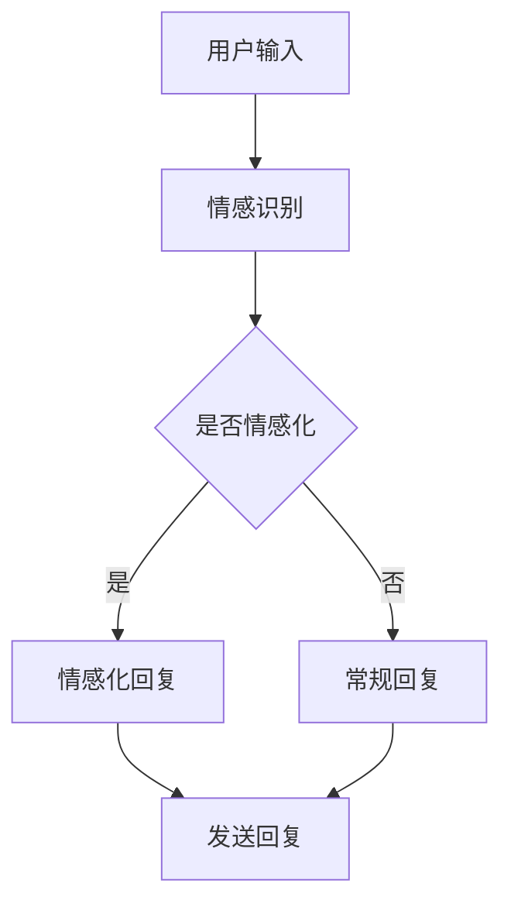

                 

### 让我们一步一步思考：人机情感交流对语言障碍的突破

在当今的信息时代，人工智能（AI）正以前所未有的速度渗透到社会的各个领域。特别是人机情感交流，作为AI技术的一个重要分支，它正逐渐改变着人类与机器互动的方式。然而，尽管AI技术在语音识别、自然语言处理（NLP）等方面取得了显著的进步，人机情感交流仍然面临一个巨大的挑战：语言障碍。本文将深入探讨这一问题，并一步步分析如何通过人机情感交流来突破这一障碍。

#### 第一部分：引言与背景

##### 第1章：人机情感交流与语言障碍

**1.1.1 人类情感与语言交流**

情感交流是人类社会互动的基础，它不仅仅是信息的传递，更是人与人之间情感连接的纽带。语言作为人类主要的交流工具，承载了情感表达的功能。在日常生活中，我们通过语言来分享快乐、表达悲伤、传达愤怒等情感，使得人际关系更加和谐。然而，语言交流也存在局限性，尤其是在面对复杂的情感表达时，单靠语言可能无法完全传达内心的感受。

**1.1.2 语言障碍的定义与类型**

语言障碍指的是在语言交流过程中出现的问题，它可能是由生理因素（如听力障碍、口吃）或心理因素（如自闭症、心理障碍）引起的。语言障碍可以分为几种类型：

- **听障**：由于听力受损，导致声音信号接收困难。
- **表达障碍**：由于大脑处理语言信息的能力受限，导致语言表达困难。
- **理解障碍**：由于对语言信号的理解困难，导致信息接收不畅。

这些障碍不仅影响了日常交流，还在医疗、教育、客服等众多领域带来了挑战。

**1.1.3 人机情感交流的现状**

随着AI技术的发展，人机情感交流逐渐成为现实。目前，AI已经能够通过语音识别、文本识别等方式理解人类的语言，并能够通过自然语言处理生成适当的回复。例如，智能客服机器人可以通过分析用户的语言和情感，提供个性化的服务。然而，这些系统在处理复杂情感和语言障碍方面的能力仍存在局限。

**1.1.4 人机情感交流对语言障碍的潜力**

人机情感交流具有巨大的潜力来突破语言障碍。通过AI技术，我们可以设计出能够识别和理解人类复杂情感的系统，这些系统不仅能够处理常规的语言障碍，还能为那些有严重语言障碍的人提供有效的交流工具。例如，对于听障人士，语音识别技术可以帮助他们通过文字或手势进行交流；对于表达障碍的人，AI可以提供辅助工具，帮助他们更准确地表达自己的情感。

#### 第二部分：技术基础

##### 第2章：情感计算的基本原理

**2.1.1 情感计算的概念与目标**

情感计算是人工智能领域的一个子领域，旨在使计算机能够识别、理解、处理和模拟人类情感。情感计算的核心目标是创建一个情感化的交互界面，使机器能够与人类建立更自然、更深刻的交流。

**2.1.2 情感识别技术**

情感识别是情感计算的基础，它包括语音情感识别和文本情感识别。

- **语音情感识别**：通过分析语音信号中的频率、节奏、音调等特征，识别出说话者的情感状态。这项技术可以利用信号处理和机器学习算法来实现。
  
- **文本情感识别**：通过分析文本中的词汇、语法、句子结构等，识别出文本的情感倾向。自然语言处理（NLP）和文本分析技术在这里发挥了关键作用。

**2.1.3 情感表达的机制**

情感表达是情感计算的重要方面，它涉及到如何让机器以自然的方式表达情感。人类情感表达主要通过语言、面部表情、肢体动作等方式进行。在情感计算中，我们需要模拟这些表达方式。

- **语言表达**：通过自然语言生成（NLG）技术，机器可以生成情感化的文本回复。
  
- **非语言表达**：通过计算机图形、声音合成等技术，机器可以生成情感化的视觉和听觉反馈。

**2.1.4 情感交互的反馈机制**

情感交互的反馈机制是确保人机交流顺畅的重要环节。它包括情感识别、情感表达和用户反馈的循环。

- **情感识别**：系统需要能够准确识别用户的情感状态。
  
- **情感表达**：系统需要能够根据用户的情感状态生成合适的回复。
  
- **用户反馈**：系统需要能够接收用户的反馈，并据此调整后续的行为。

#### 第3章：人机情感交互的语言处理

**3.1.1 语言处理的核心技术**

语言处理是情感交互的关键技术之一，它涉及到自然语言处理（NLP）和语言模型。

- **自然语言处理（NLP）**：NLP是使计算机能够理解、生成和处理自然语言的技术。它包括分词、词性标注、句法分析等步骤。

- **语言模型**：语言模型是预测下一个单词或句子的概率分布，它是NLP的基础。常见的语言模型有基于统计的方法和基于神经网络的深度学习方法。

**3.1.2 情感化语言生成**

情感化语言生成是使机器能够生成情感化文本的技术。它包括以下步骤：

- **情感化文本模板**：设计一系列情感化的文本模板，用于生成情感化的回复。
  
- **情感化文本生成**：利用自然语言生成（NLG）技术，根据用户的情感状态和上下文，生成相应的情感化文本。

**3.1.3 情感化的语言理解**

情感化的语言理解是使机器能够理解情感化文本的技术。它涉及到以下挑战：

- **情感词识别**：识别文本中的情感词和短语，如“开心”、“伤心”等。
  
- **情感强度识别**：确定情感词的情感强度，如“很喜欢”和“非常喜欢”之间的差异。

**3.1.4 情感化的语音识别与合成**

情感化的语音识别与合成是使机器能够生成情感化语音的技术。它包括以下方面：

- **情感化语音识别**：通过分析语音信号中的情感特征，识别出说话者的情感状态。
  
- **情感化语音合成**：通过合成技术，生成带有特定情感色彩的语音。

#### 第三部分：应用场景

##### 第4章：人机情感交流在医疗领域的应用

**4.1.1 医疗场景中的语言障碍**

在医疗领域，语言障碍是一个普遍存在的问题。患者和医生之间的沟通可能因为语言障碍而变得困难，导致误解、误诊甚至医疗事故。此外，患有语言障碍的患者在表达症状和需求时也可能遇到困难。

**4.1.2 情感化医疗助手的设计与实现**

情感化医疗助手是一种结合了情感计算和医疗知识的智能系统，它可以协助医生进行诊断和治疗。设计情感化医疗助手时，需要考虑以下几个方面：

- **情感识别**：医疗助手需要能够识别患者的情感状态，以便提供个性化的支持和建议。
  
- **自然语言理解**：医疗助手需要能够理解患者的语言，包括非标准的语言表达和专业术语。

- **情感化回复生成**：医疗助手需要能够生成情感化的回复，以增强与患者的沟通效果。

**4.1.3 情感化医疗助手的实际应用**

情感化医疗助手在医疗领域有着广泛的应用前景：

- **患者护理**：情感化医疗助手可以协助护士进行日常护理，提供情感支持，减轻患者的孤独感和焦虑感。

- **医生辅助诊断**：情感化医疗助手可以帮助医生分析患者的病历和症状，提供诊断建议，提高诊断准确性。

##### 第5章：人机情感交流在教育领域的应用

**5.1.1 教育场景中的语言障碍**

在教育领域，语言障碍可能会影响学生的学习效果和心理健康。对于一些有语言障碍的学生，传统的教学方法可能不够有效。因此，教育领域迫切需要一种能够适应不同语言能力学生的教学方法。

**5.1.2 情感化教育系统的设计与实现**

情感化教育系统是一种结合了情感计算和教育技术的智能系统，它可以提供个性化的教学体验。设计情感化教育系统时，需要考虑以下几个方面：

- **情感识别**：教育系统需要能够识别学生的情感状态，以便调整教学内容和方式。

- **情感化教学**：教育系统需要能够生成情感化的教学素材，如故事、视频等，以增强学生的学习兴趣和动机。

- **情感化互动**：教育系统需要提供丰富的互动方式，如语音、文本、手势等，以适应不同学生的语言偏好。

**5.1.3 情感化教育系统的实际应用**

情感化教育系统在教育领域有着广泛的应用前景：

- **个性化教学**：情感化教育系统可以根据学生的情感状态和学习进度，提供个性化的教学建议和资源。

- **心理健康辅导**：情感化教育系统可以为学生提供心理健康辅导，如情绪管理、压力缓解等。

##### 第6章：人机情感交流在客服领域的应用

**6.1.1 客服场景中的语言障碍**

在客服领域，语言障碍可能导致沟通不畅，影响客户体验和满意度。因此，客服系统需要能够识别和处理复杂的语言障碍，提供高效、个性化的服务。

**6.1.2 情感化客服机器人的设计与实现**

情感化客服机器人是一种结合了情感计算和客服技术的智能系统，它可以模拟人类的交流方式，提供情感化的服务。设计情感化客服机器人时，需要考虑以下几个方面：

- **情感识别**：客服机器人需要能够识别客户的情感状态，以便提供针对性的帮助。

- **情感化回复生成**：客服机器人需要能够生成情感化的回复，以增强与客户的互动效果。

- **非语言表达**：客服机器人需要能够使用语音、表情等非语言方式，与客户进行互动。

**6.1.3 情感化客服机器人的实际应用**

情感化客服机器人在客服领域有着广泛的应用：

- **客户服务**：情感化客服机器人可以处理大量的客户咨询，提供快速、准确的回答。

- **客户情绪管理**：情感化客服机器人可以帮助客户管理情绪，提供情感支持，提高客户满意度。

#### 第四部分：挑战与未来

##### 第7章：人机情感交流的挑战与未来发展趋势

**7.1.1 挑战与问题**

尽管人机情感交流在许多领域展现了巨大的潜力，但它也面临着一些挑战和问题：

- **情感识别的准确性问题**：目前的情感识别技术仍然存在一定的误识别率，特别是在处理复杂情感时。

- **情感表达的合理性问题**：机器生成的情感化回复有时可能过于机械，缺乏人类的情感细腻度。

- **情感交互的用户体验问题**：用户可能会对过于机械的交互方式感到不适，影响用户体验。

**7.1.2 技术发展趋势**

为了克服上述挑战，未来人机情感交流技术的发展将呈现以下趋势：

- **深度学习在情感计算中的应用**：深度学习技术可以帮助提升情感识别和情感生成的准确性。

- **语音与文本情感识别的融合**：通过整合语音和文本情感识别技术，可以提供更全面、准确的情感分析。

- **跨模态情感交互的研究方向**：跨模态情感交互将使机器能够同时处理多种模态的情感信息，提供更自然的交互体验。

**7.1.3 未来展望**

随着技术的不断进步，人机情感交流有望在未来实现以下发展：

- **更自然的情感交互**：通过提高情感识别和情感表达的准确性，实现更自然、更流畅的情感交互。

- **更广泛的应用场景**：人机情感交流技术将扩展到更多领域，如医疗、教育、心理咨询等。

- **更深刻的情感连接**：机器与人类之间的情感连接将变得更加紧密，促进更深入的交流和理解。

#### 附录

##### 附录A：情感计算的核心概念与联系

**A.1 情感计算的核心概念**

情感计算的核心概念包括情感、情感表达、情感识别和情感合成。

- **情感**：情感是一种主观体验，通常与情绪和情感状态相关。
- **情感表达**：情感表达是通过语言、面部表情、肢体动作等方式表达情感的过程。
- **情感识别**：情感识别是通过分析语言、语音、面部表情等特征，识别出情感状态。
- **情感合成**：情感合成是通过计算机生成情感化的语言、声音或图像。

**A.2 情感计算的核心概念联系**

情感计算的核心概念之间有着紧密的联系：

- 情感是情感计算的基础，情感表达是情感计算的目标。
- 情感识别是实现情感表达的前提，情感合成是实现情感交互的关键。
- 情感计算需要将情感识别和情感合成结合起来，提供真实、自然的情感交互体验。

##### 附录B：情感化语言处理的算法原理

**B.1 语言模型**

语言模型是情感化语言处理的基础，它用于预测下一个单词或句子的概率分布。常见的语言模型有：

- **朴素贝叶斯模型**：基于贝叶斯定理，通过分析特征词的出现概率来预测下一个单词。
- **随机森林模型**：通过构建多个决策树，利用集成学习方法来预测下一个单词。
- **支持向量机模型**：通过找到一个最优的超平面，将不同情感分类的单词分开。

**B.2 情感化语言生成算法**

情感化语言生成算法旨在生成情感化的文本回复。它包括以下步骤：

- **情感分析**：通过情感识别技术，分析输入文本的情感倾向。
- **情感化文本模板**：根据情感倾向，选择合适的情感化文本模板。
- **文本生成**：利用自然语言生成（NLG）技术，根据情感化文本模板生成文本回复。

##### 附录C：情感化对话系统的mermaid流程图与ER实体关系图

**C.1 对话系统流程图**



**C.2 ER实体关系图**

```mermaid
erDiagram
    User ||--|{ Message } : sends
    Message ||--| User : receives
    Message ||--| Response : generates
```

**C.3 对话系统流程图与ER实体关系图的关系**

对话系统流程图描述了用户输入、情感识别、回复生成的流程，而ER实体关系图则描述了用户、消息、回复等实体的关系。通过将流程图与ER图结合，可以更清晰地理解对话系统的架构和运作方式。

##### 作者信息

作者：AI天才研究院/AI Genius Institute & 禅与计算机程序设计艺术 /Zen And The Art of Computer Programming

---

通过本文的深入探讨，我们可以看到人机情感交流在解决语言障碍方面具有巨大的潜力。尽管目前仍存在一些挑战，但随着技术的不断进步，我们有理由相信，未来人机情感交流将为那些有语言障碍的人提供更有效、更自然的交流方式，从而改变他们的生活。让我们继续探索这一领域，为人类创造更美好的未来。

