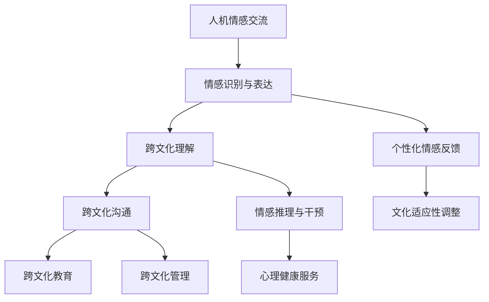

                 

# 《人机情感交流对跨文化理解的促进》

## 关键词
人机情感交流，跨文化理解，人工智能，情感识别，情感表达，技术应用，教育应用，管理应用

## 摘要
随着人工智能技术的迅猛发展，人机情感交流逐渐成为研究热点。本文旨在探讨人机情感交流对跨文化理解的影响与促进，通过逻辑分析和实际案例分析，深入解析人机情感交流在跨文化教育、沟通和管理中的应用。文章分为三个部分：第一部分概述人机情感交流与跨文化理解的基础概念；第二部分探讨人机情感交流对跨文化理解的促进作用；第三部分分析人机情感交流在不同文化背景下的实际应用。通过本文，读者可以对人机情感交流与跨文化理解的关系有更深刻的理解，并为未来相关领域的研究和应用提供参考。

## 目录

### 第一部分：人机情感交流概述

#### 第1章：人机情感交流基础
- **1.1 人机情感交流的定义**
- **1.2 人机情感交流的重要性**
- **1.3 人机情感交流的发展历程**

#### 第2章：跨文化理解的核心概念
- **2.1 跨文化理解的概念**
- **2.2 跨文化理解的障碍**
- **2.3 跨文化理解的重要性**

#### 第3章：人机情感交流对跨文化理解的影响
- **3.1 人机情感交流如何促进跨文化理解**
- **3.2 人机情感交流中的文化因素**
- **3.3 人机情感交流在不同文化背景下的应用**

#### 第4章：人机情感交流技术的现状与挑战
- **4.1 人机情感交流技术的主要成果**
- **4.2 人机情感交流技术的挑战**
- **4.3 未来发展趋势**

### 第二部分：人机情感交流与跨文化理解的实际应用

#### 第5章：人机情感交流在跨文化教育中的应用
- **5.1 人机情感交流在跨文化教育中的优势**
- **5.2 跨文化教育中的人机情感交流案例分析**
- **5.3 人机情感交流在跨文化教育中的挑战与对策**

#### 第6章：人机情感交流在跨文化沟通中的应用
- **6.1 人机情感交流在跨文化沟通中的角色**
- **6.2 跨文化沟通中的人机情感交流案例分析**
- **6.3 人机情感交流在跨文化沟通中的挑战与对策**

#### 第7章：人机情感交流在跨文化管理中的应用
- **7.1 人机情感交流在跨文化管理中的意义**
- **7.2 跨文化管理中的人机情感交流案例分析**
- **7.3 人机情感交流在跨文化管理中的挑战与对策**

#### 第8章：人机情感交流与跨文化理解的未来展望
- **8.1 人机情感交流对跨文化理解的长远影响**
- **8.2 未来人机情感交流技术的发展趋势**
- **8.3 跨文化理解与人机情感交流的未来融合**

#### 附录：相关研究与应用案例
- **A.1 研究进展与未来展望**
- **A.2 应用案例分析与启示**

---

### 1.1 人机情感交流的定义

人机情感交流是指人与机器之间在情感层面上的互动，旨在使机器能够识别、理解并适当地表达情感。这一领域的研究主要集中在情感识别与表达技术，通过自然语言处理、计算机视觉、语音识别等技术手段实现。人机情感交流的核心在于模拟人类的情感反应，使机器具备一定的情感智能。

人机情感交流的定义可以从以下几个方面进行理解：

1. **情感识别**：情感识别是情感交流的基础，涉及从文本、语音和面部表情等数据中提取情感信息。情感识别技术通常使用机器学习算法，如支持向量机（SVM）、神经网络（NN）等，对大量情感数据进行分析和建模。

2. **情感理解**：情感理解是情感交流的深化，指机器在识别情感后，能够理解情感的内涵和意义。情感理解涉及到语义分析、情感推理等复杂任务，需要机器具备较强的逻辑推理和语义理解能力。

3. **情感表达**：情感表达是人机情感交流的关键，指机器能够根据情感识别和理解的结果，适当地生成情感响应。情感表达技术可以通过自然语言生成（NLG）、语音合成、动作模拟等方式实现。

人机情感交流的定义不仅限于技术层面，还包括人类与机器在情感互动中的心理体验。因此，人机情感交流是一个多学科交叉的研究领域，涉及人工智能、心理学、语言学等多个领域。

### 1.2 人机情感交流的重要性

人机情感交流的重要性主要体现在以下几个方面：

1. **提升用户体验**：在人机交互中，情感交流能够提高用户的满意度和参与度。当机器能够识别用户的情感状态并作出相应的情感响应时，用户会感受到更加自然和亲切的互动体验，从而增强用户对产品的忠诚度和依赖性。

2. **辅助情感分析**：人机情感交流技术可以为情感分析提供有力的支持。情感分析是自然语言处理（NLP）的一个重要分支，旨在从文本中提取情感信息。人机情感交流技术可以用于自动化情感分析，帮助企业和组织更好地了解用户需求和市场趋势。

3. **促进人机协作**：在人机协作中，情感交流能够增强人与人、人与机器之间的信任和协作。通过情感交流，机器能够更好地理解人类的需求和意图，从而提供更加精确和高效的服务。例如，在医疗、教育、客服等领域，人机情感交流技术可以辅助专业人员进行诊断、教学和咨询等工作。

4. **拓展应用场景**：人机情感交流技术可以应用于各种场景，如智能家居、虚拟助手、娱乐互动等。通过情感交流，机器能够与用户建立更加紧密的联系，提供个性化服务，从而拓展人工智能的应用领域。

总之，人机情感交流是人工智能发展的重要方向，具有广泛的应用前景。随着技术的不断进步，人机情感交流将为人类带来更加智能、便捷和愉悦的互动体验。

### 1.3 人机情感交流的发展历程

人机情感交流作为人工智能领域的一个重要分支，其发展历程可以追溯到上世纪80年代。以下是人机情感交流的发展历程及其重要里程碑：

1. **1980年代：情感计算的开端**
   - **1995年：日本爱知县机器人博览会**
     这是情感计算理念的首次公开亮相，展示了机器人对人类情感的初步识别能力。这一事件标志着情感计算作为人工智能的一个重要方向被正式提出。

2. **1990年代：情感识别技术的萌芽**
   - **1995年：释意心理学理论的形成**
     美国心理学家乔治·米勒（George A. Miller）提出了释意心理学理论，为情感计算提供了理论基础。这一理论认为，情感是人对外部刺激的内在解释过程。

3. **2000年代：情感计算技术的突破**
   - **2001年：情感计算国际会议的创办**
     这一会议成为了情感计算领域的重要学术交流平台，推动了情感计算技术的快速发展。会议期间，专家们分享了情感识别、情感理解等方面的研究成果。

4. **2010年代：情感交流的应用探索**
   - **2011年：微软小冰的诞生**
     微软小冰是一款具有情感交流能力的虚拟助手，能够通过文字和语音与用户进行情感互动。这一应用展示了人机情感交流在虚拟助手领域的潜力。

5. **2020年代：情感交流技术的深化**
   - **2019年：情感计算领域的权威期刊《情感计算杂志》的创办**
     这一期刊的创办标志着情感计算领域开始走向成熟，成为人工智能研究的一个重要方向。期刊发表了大量关于情感识别、情感理解、情感表达等方面的创新性研究成果。

6. **未来展望**
   - **2030年：情感交流技术的普及应用**
     随着技术的不断进步，情感交流技术将在更多领域得到广泛应用，如医疗、教育、客服等。人机情感交流将成为人工智能与人类生活深度融合的重要纽带。

通过以上里程碑，可以看出人机情感交流技术的发展历程是一个不断突破和创新的过程。未来，随着人工智能技术的进一步发展，人机情感交流将在更多场景中得到应用，为人类带来更加智能、便捷的互动体验。

### 2.1 跨文化理解的概念

跨文化理解是指在不同文化背景下，个体或群体通过交流和互动，准确把握和理解对方文化中的价值观、信念、习俗和行为模式的过程。跨文化理解的核心在于消除文化差异带来的误解和冲突，促进文化之间的和谐与共融。这一概念涵盖了多个层次，从个体到组织，从文化认知到行为实践。

跨文化理解的重要层次包括：

1. **文化认知**：指个体或群体对不同文化的基本认识和理解，包括文化背景、价值观、信仰、习俗等方面的知识。

2. **情感共鸣**：指在跨文化互动中，个体能够感受到对方的文化情感，并在情感上产生共鸣，增强文化认同。

3. **行为适应**：指在跨文化环境中，个体能够根据对方的文化规范和习俗，调整自己的行为，以适应和融入对方文化。

4. **文化创新**：指在跨文化互动中，个体或群体能够融合不同文化的优点，创造出新的文化模式或理念。

跨文化理解的重要性主要体现在以下几个方面：

1. **促进国际交流与合作**：在全球化的背景下，跨文化理解能够帮助不同国家和地区的个体和组织更好地沟通与协作，推动国际间的交流与合作。

2. **增进社会和谐**：跨文化理解能够减少文化冲突和误解，增进社会各阶层之间的理解和信任，促进社会和谐与稳定。

3. **提升个人素养**：通过跨文化理解，个体能够拓宽视野，提升自身文化素养和综合素质，成为具有全球视野和跨文化能力的人才。

4. **推动文化创新**：跨文化理解能够激发文化创造力和创新思维，促进文化融合和创新，推动文化的发展与繁荣。

总之，跨文化理解是现代社会中不可或缺的一部分，对于促进国际交流、增进社会和谐、提升个人素养和推动文化创新具有重要意义。

### 2.2 跨文化理解的障碍

跨文化理解虽然具有重要意义，但在实际操作中却面临诸多障碍。以下是跨文化理解中常见的几种主要障碍：

1. **文化差异**：文化差异是跨文化理解的最大障碍之一。不同文化背景下，人们的价值观、信仰、习俗和行为模式都有所不同。这些文化差异可能导致误解和冲突。例如，一些文化强调集体主义，而另一些文化则强调个人主义，这可能导致双方在决策和沟通方式上的差异。

2. **语言障碍**：语言是跨文化理解的重要工具，但语言障碍往往成为跨文化交流的障碍。不同语言之间的词汇、语法和表达习惯都有所不同，这可能导致沟通不畅和信息传递错误。例如，一词多义、文化特定词汇和习语等都是语言障碍的典型表现。

3. **误解与偏见**：跨文化理解中，误解和偏见是常见问题。由于文化差异，人们对某些文化行为和习惯可能产生误解，进而产生偏见。这种偏见可能导致对某些文化的负面评价和歧视，从而影响跨文化互动的顺利进行。

4. **情感障碍**：情感障碍主要表现在跨文化互动中，个体可能因为文化背景不同，对情感表达和情感感知有不同的理解和期待。例如，某些文化中，情感表达较为含蓄，而另一些文化中，情感表达则较为直接。这种差异可能导致情感沟通的障碍，影响双方的信任和关系。

5. **制度和政策障碍**：在某些情况下，跨文化理解受到制度和政策的限制。例如，一些国家可能对某些文化的传播和交流进行限制，这可能导致文化间的隔阂和冲突。

了解这些跨文化理解的障碍，有助于我们更好地应对跨文化互动中的挑战，促进不同文化之间的交流和理解。

### 2.3 跨文化理解的重要性

跨文化理解在现代社会中具有极其重要的地位，其重要性主要体现在以下几个方面：

1. **促进国际交流与合作**：随着全球化进程的加速，不同国家和地区的个体和组织之间的交流和合作越来越频繁。跨文化理解能够帮助人们更好地沟通与协作，促进国际间的交流与合作，从而实现资源的共享和优势互补。

2. **增进社会和谐**：社会和谐是一个国家和社会稳定发展的基础。跨文化理解能够减少文化冲突和误解，增进社会各阶层之间的理解和信任，促进社会和谐与稳定。这对于构建多元化、包容性的社会具有重要意义。

3. **提升个人素养**：跨文化理解是培养全球视野和跨文化能力的重要途径。通过跨文化理解，个体能够拓宽视野，了解不同文化的优点和长处，提升自身的文化素养和综合素质，成为具有全球视野和跨文化能力的人才。

4. **推动文化创新**：跨文化理解能够激发文化创造力和创新思维，促进文化融合和创新。不同文化的碰撞和融合往往能够产生新的文化模式和理念，推动文化的发展与繁荣。

5. **促进经济发展**：跨文化理解能够帮助企业更好地理解不同市场需求，开发符合不同文化背景的产品和服务，从而扩大市场占有率，促进经济发展。同时，跨文化理解也有助于吸引国际投资，推动经济增长。

总之，跨文化理解在现代社会中具有重要的意义，它不仅有助于推动国际交流与合作，增进社会和谐，提升个人素养，推动文化创新，还对于促进经济发展具有重要意义。

### 3.1 人机情感交流如何促进跨文化理解

人机情感交流作为一种新兴的技术手段，对跨文化理解具有显著的促进作用。以下是人机情感交流如何促进跨文化理解的几个方面：

1. **情感识别与反馈**：人机情感交流通过情感识别技术，能够准确识别用户的情感状态，并通过情感反馈机制，模拟人类的情感反应，使机器在与不同文化背景的用户互动时，能够更好地理解对方的文化情感。例如，通过面部表情识别技术，机器可以识别用户的微笑、皱眉等表情，从而理解用户的喜悦或不满情绪。这种情感识别与反馈机制，有助于消除文化差异带来的误解和障碍。

2. **情感共享与共鸣**：人机情感交流不仅能够识别用户的情感，还能通过情感共享机制，使机器与用户之间建立情感共鸣。这种情感共鸣有助于增强用户对机器的信任和依赖，从而促进跨文化理解。例如，在跨文化教育中，机器可以通过情感表达，与学生建立情感连接，使学生更容易接受和理解不同文化的教育内容。

3. **文化适应性调整**：人机情感交流技术可以根据用户的情感状态和文化背景，自动调整交流策略，使其更符合对方的文化习惯和需求。例如，在跨文化沟通中，机器可以根据用户的语言和文化偏好，自动切换语言和交流方式，从而提高沟通的效率和效果。这种文化适应性调整，有助于消除文化差异带来的障碍，促进跨文化理解。

4. **情感教育**：人机情感交流技术可以应用于跨文化情感教育，通过模拟不同的文化情境，帮助用户了解和体验不同文化的情感表达方式，从而提高跨文化理解能力。例如，在教育场景中，机器可以模拟不同文化的节日、礼仪等情境，让学生在虚拟环境中体验和理解不同文化的情感内涵。

5. **情感支持与服务**：在人机情感交流中，机器能够为用户提供情感支持和服务，帮助用户应对跨文化互动中的情感压力和挑战。例如，在跨文化沟通中，机器可以提供情感咨询和心理支持，帮助用户更好地适应不同文化的交流环境。

总之，人机情感交流通过情感识别与反馈、情感共享与共鸣、文化适应性调整、情感教育、情感支持与服务等多个方面，有效促进了跨文化理解。随着人机情感交流技术的不断发展和完善，其在促进跨文化理解方面的作用将越来越显著。

### 3.2 人机情感交流中的文化因素

在人机情感交流中，文化因素扮演着至关重要的角色。不同文化背景下的情感表达方式、交流习惯和认知模式都会对人机情感交流产生深远影响。以下是文化因素对人机情感交流的几个主要影响：

1. **情感表达方式**：不同文化背景下的情感表达方式存在显著差异。一些文化倾向于直接、外露的情感表达，如西方文化中，人们常常直接表达喜悦、愤怒等情感；而另一些文化则倾向于含蓄、内敛的情感表达，如东方文化中，人们往往更注重情感的内化和控制。这种差异会导致人机情感交流中的误解和冲突。例如，当一位来自西方文化的用户与一位来自东方文化的用户进行情感交流时，前者可能因为后者的情感表达较为含蓄而误认为其不友好或冷漠。

2. **交流习惯**：不同文化背景下的交流习惯也有所不同。一些文化倾向于通过语言交流，如西方文化中，人们更习惯通过口头语言进行沟通；而另一些文化则更倾向于通过非语言交流，如东方文化中，人们更注重肢体语言、眼神交流和面部表情。这种交流习惯的差异会影响到人机情感交流的效果。例如，在语言交流中，人机情感交流系统可能更擅长处理和生成口头语言，但在非语言交流中，其处理能力相对较弱。

3. **认知模式**：不同文化背景下的认知模式也会对情感交流产生影响。一些文化倾向于理性、逻辑的思考方式，如西方文化中，人们更倾向于通过逻辑推理和数据分析来理解情感；而另一些文化则更倾向于感性和直觉的思考方式，如东方文化中，人们更注重情感的直观感受和内心体验。这种认知模式的差异会导致人机情感交流中的理解偏差。例如，当一位来自西方文化的用户与一位来自东方文化的用户进行情感交流时，前者可能因为后者的情感理解较为感性而误认为其不理性或不可靠。

4. **情感敏感性**：不同文化背景下的情感敏感性也有所不同。一些文化对情感敏感性较高，更注重情感的细腻和微妙变化；而另一些文化对情感敏感性较低，更注重情感的表面表现和直接反应。这种差异会影响人机情感交流系统的设计和应用。例如，在针对高情感敏感性的文化用户设计情感交流系统时，系统需要具备更高的情感识别和表达能力，以更好地理解和回应用户的情感需求。

总之，文化因素在人机情感交流中具有重要影响。理解不同文化背景下的情感表达方式、交流习惯和认知模式，有助于设计出更加人性化、适应性更强的人机情感交流系统，从而促进跨文化理解。

### 3.3 人机情感交流在不同文化背景下的应用

人机情感交流在不同文化背景下具有广泛的应用前景，以下从教育、沟通和管理三个方面进行详细分析。

#### 教育应用

1. **个性化学习体验**：在人机情感交流的教育应用中，机器能够通过识别学生的情感状态，提供个性化的学习体验。例如，当学生表现出挫败感时，机器可以通过情感反馈机制给予鼓励和指导，帮助学生克服学习困难。不同文化背景下的学生情感表达方式可能有所不同，但通过情感识别和适应性调整，人机情感交流系统能够有效提升学生的学习效果。

2. **跨文化教育支持**：人机情感交流技术可以应用于跨文化教育中，帮助教师和学生理解不同文化背景下的情感表达和行为习惯。例如，在多元文化班级中，机器可以通过情感识别，及时了解学生的情感状态，提供文化适应性的指导和支持，促进学生的跨文化理解与融合。

3. **情感教育**：通过人机情感交流，学生可以学习如何识别和管理自己的情感，培养情感智商。例如，在人机互动中，学生可以通过虚拟情境模拟，学习如何在不同文化背景下表达情感，提升跨文化沟通能力。

#### 沟通应用

1. **跨文化商务沟通**：在国际商务交流中，人机情感交流技术可以帮助企业和个人更好地理解不同文化背景下的商务沟通习惯和情感表达方式。例如，当与来自高权力距离文化的客户进行沟通时，机器可以通过情感识别，调整交流策略，避免因文化差异导致的误解和冲突。

2. **跨文化客服**：在跨文化客服场景中，人机情感交流系统能够通过情感识别和表达，提供个性化的服务。例如，当客户表现出不满情绪时，机器可以识别并回应客户的需求，提供情感支持，提升客户满意度。

3. **社交媒体互动**：在人机互动的社交媒体平台上，人机情感交流技术可以帮助用户更好地理解不同文化背景下的网络语言和情感表达方式。例如，通过情感识别，机器可以识别用户的情绪变化，提供更加贴心和自然的互动体验。

#### 管理应用

1. **跨文化团队管理**：在人机情感交流的管理应用中，管理者可以通过情感识别技术，了解团队成员的情感状态和工作压力，提供针对性的支持和帮助。例如，当团队成员表现出焦虑情绪时，管理者可以通过情感交流系统，及时了解问题并采取措施，缓解团队成员的压力。

2. **跨文化员工培训**：人机情感交流技术可以应用于跨文化员工的培训和指导中，帮助员工了解不同文化背景下的工作习惯和情感表达方式。例如，通过虚拟情境模拟，员工可以在实践中学习如何在不同文化背景下有效沟通和管理，提升跨文化管理能力。

3. **企业文化建设**：人机情感交流技术可以帮助企业构建跨文化团队，促进企业文化的融合与创新。例如，通过情感交流系统，企业可以鼓励员工分享文化故事和经验，增进团队成员之间的理解和信任，营造和谐的企业文化氛围。

总之，人机情感交流在不同文化背景下的应用具有广泛的前景，它不仅能够提升教育、沟通和管理的效率和质量，还能促进跨文化理解与合作，为全球化和多元化的发展提供有力支持。

### 4.1 人机情感交流技术的主要成果

在人机情感交流技术领域，研究者们已经取得了显著的成果，这些成果不仅丰富了理论研究，还推动了实际应用的发展。以下是人机情感交流技术的主要成果概述：

1. **情感识别技术**：情感识别是人机情感交流的基础，研究者们通过深度学习、机器学习等技术，实现了对情感状态的准确识别。例如，基于卷积神经网络（CNN）和循环神经网络（RNN）的情感识别模型，能够有效识别文本、语音和面部表情中的情感状态。这些技术成果在社交媒体分析、客户服务等领域得到了广泛应用。

2. **情感表达技术**：情感表达技术是人机情感交流的核心，研究者们通过自然语言生成（NLG）和语音合成技术，实现了情感化的机器交互。例如，基于生成对抗网络（GAN）和变分自编码器（VAE）的情感化语音合成模型，能够生成具有丰富情感的语音，为虚拟助手、智能客服等应用提供了有力支持。

3. **多模态情感交互**：随着计算机视觉和语音识别技术的进步，研究者们开始探索多模态情感交互。通过整合文本、语音、图像等多模态数据，实现更加自然和丰富的人机情感交流。例如，基于多模态深度学习的情感交互系统，能够在对话中同时识别和理解文本和语音中的情感信息，提供更加贴心的服务。

4. **情感推理技术**：情感推理技术是人机情感交流的高级阶段，研究者们通过情感推理算法，使机器能够理解复杂情感关系和情境。例如，基于图神经网络（GNN）的情感推理模型，能够理解文本中的情感因果关系，生成符合情境的情感回应。

5. **情感干预技术**：情感干预技术是人机情感交流的延伸，研究者们通过情感识别和推理，实现情感干预和心理支持。例如，基于强化学习的情感干预系统，能够根据用户情感状态，提供针对性的心理支持，帮助用户缓解压力和焦虑。

这些技术成果不仅为理论研究提供了丰富的素材，还推动了实际应用的发展。例如，在医疗健康领域，情感识别和干预技术被用于心理健康评估和干预；在教育领域，情感表达和交互技术被用于个性化学习和情感教育；在客服领域，情感交互技术被用于提升客户体验和满意度。

总之，人机情感交流技术的主要成果为跨文化理解提供了有力支持，通过情感识别、表达、推理和干预，机器能够更好地理解不同文化背景下的情感表达和行为模式，促进跨文化互动和协作。

### 4.2 人机情感交流技术的挑战

尽管人机情感交流技术在理论和应用方面取得了显著进展，但仍然面临诸多挑战。以下是人机情感交流技术面临的主要挑战：

1. **情感识别准确性**：情感识别是人机情感交流的基础，但其准确性受到多种因素的影响，如语言多样性、情感表达的细微差别、文化差异等。目前，情感识别技术仍存在一定的误识率，尤其是在复杂情感和多情感混合情况下，识别准确性亟待提高。

2. **情感理解深度**：情感理解是人机情感交流的深化，要求机器具备较强的语义理解和情感推理能力。然而，情感理解涉及到复杂的情感关系和情境，当前技术难以全面、深入地理解情感内涵，导致情感回应不够自然和贴切。

3. **情感表达个性**：情感表达是个性化的，不同用户对情感表达的需求和偏好不同。当前情感表达技术大多基于通用模板，难以实现个性化情感回应。因此，如何根据用户个性化需求，生成具有自然情感色彩的表达，是人机情感交流技术的重要挑战。

4. **跨文化适应性**：不同文化背景下，情感表达和认知模式存在显著差异，人机情感交流技术需要具备较高的跨文化适应性。然而，现有技术往往难以全面、准确地识别和理解不同文化背景下的情感表达，导致跨文化情感交流效果不佳。

5. **隐私保护和伦理问题**：人机情感交流涉及大量用户情感数据，隐私保护和伦理问题日益凸显。例如，如何确保用户情感数据的安全和隐私，避免数据泄露和滥用，成为人机情感交流技术面临的重要挑战。

6. **技术可解释性**：人机情感交流技术通常采用复杂算法和模型，其内部决策过程往往难以解释。因此，如何提升技术可解释性，使用户能够理解机器的情感识别和回应过程，是提升用户信任和接受度的重要课题。

7. **资源消耗和计算效率**：人机情感交流技术通常需要大量的计算资源和时间，尤其是在多模态情感交互和复杂情感分析方面，对计算效率提出了高要求。如何在保证性能的前提下，降低资源消耗和计算时间，是人机情感交流技术的重要挑战。

总之，人机情感交流技术在发展过程中面临诸多挑战，需要通过技术创新和跨学科合作，不断提升技术水平和应用效果，以实现更加自然、智能和贴心的情感交流。

### 4.3 未来发展趋势

人机情感交流技术在未来将继续发展，并在多个领域实现重要突破。以下是未来发展趋势的几个关键方向：

1. **多模态情感交互**：未来人机情感交流将更加注重多模态数据的整合和应用，通过融合文本、语音、图像、视频等多种数据形式，实现更加自然和丰富的人机情感交流体验。例如，基于多模态深度学习的情感交互系统，将能够同时识别和理解用户的语音、面部表情和行为，提供更精准的情感回应。

2. **情感认知模型的智能化**：随着人工智能技术的发展，情感认知模型将变得更加智能化和自适应。通过引入先进的机器学习和深度学习算法，情感认知模型将能够更好地理解复杂情感关系和情境，实现更高层次的情感推理和情感干预。

3. **跨文化情感适应性**：未来人机情感交流技术将更加注重跨文化适应性，通过研究和分析不同文化背景下的情感表达和认知模式，实现个性化情感回应和跨文化情感交流。这将为全球化背景下的国际交流、商务合作和文化融合提供有力支持。

4. **情感伦理和隐私保护**：随着情感交流技术的普及，伦理和隐私问题将日益受到关注。未来，人机情感交流技术将更加注重伦理审查和隐私保护，通过制定相关规范和标准，确保用户数据的安全和隐私，提升技术的可接受度和用户信任度。

5. **情感交互设备的普及**：随着技术的进步和成本的降低，情感交互设备将更加普及，应用于智能家居、虚拟助手、医疗健康、教育等多个领域。这将为用户提供更加智能、便捷和贴心的服务，提升生活质量和用户体验。

6. **情感教育和社会实践**：人机情感交流技术将逐步应用于情感教育和社会实践，通过虚拟情境模拟、情感咨询和干预等手段，帮助用户提升情感素养和情商。这将有助于培养具有全球视野和跨文化能力的人才，推动社会的和谐与进步。

总之，未来人机情感交流技术将朝着多模态、智能化、跨文化、伦理化、普及化和情感教育等方向发展，为人类社会带来更加智能、和谐和美好的生活体验。

### 第5章：人机情感交流在跨文化教育中的应用

#### 5.1 人机情感交流在跨文化教育中的优势

在人机情感交流应用于跨文化教育领域，其优势主要体现在以下几个方面：

1. **个性化学习体验**：人机情感交流能够根据学生的学习需求和情感状态，提供个性化的学习内容和指导。例如，当学生表现出挫败感时，机器可以通过情感识别技术，提供鼓励和指导，帮助学生克服学习障碍。这种个性化的学习体验，有助于提高学生的学习效果和兴趣。

2. **情感共鸣与支持**：人机情感交流系统能够模拟人类的情感反应，与学生在情感上产生共鸣。例如，在跨文化教育中，学生可能面临文化适应和心理压力，机器可以通过情感表达，给予学生情感支持和鼓励，帮助他们更好地适应新环境。

3. **文化适应性调整**：人机情感交流系统能够根据不同文化背景，自动调整交流策略，提供文化适应性的教育内容。例如，当面对来自不同文化背景的学生时，机器可以通过情感识别，了解学生的情感需求和交流习惯，调整语言和表达方式，使其更符合学生的文化背景。

4. **情感教育**：人机情感交流技术可以应用于情感教育，帮助学生识别和管理自己的情感。例如，通过虚拟情境模拟，学生可以在实践中学习如何在不同文化背景下表达和管理情感，提升情感智商和跨文化沟通能力。

#### 5.2 跨文化教育中的人机情感交流案例分析

以下是一个跨文化教育中的人机情感交流案例分析：

**案例背景**：某国际学校开设了一门跨文化沟通课程，旨在帮助学生在多元文化背景下提升沟通能力和情感智商。为了增强教学效果，学校引入了人机情感交流系统，作为辅助教学工具。

**案例分析**：

1. **个性化教学**：在人机情感交流系统的支持下，教师能够根据每个学生的学习需求和情感状态，制定个性化的教学计划。例如，对于情感表达较为含蓄的学生，系统会提供更加细腻和温和的交流方式，帮助他们更好地表达自己的情感。

2. **情感支持**：在课程中，学生可能面临文化适应和心理压力。人机情感交流系统可以通过情感识别，及时了解学生的情感状态，提供情感支持和鼓励。例如，当学生表现出焦虑情绪时，系统会通过语音和文字提醒教师关注学生的情感需求，并提供相应的心理支持。

3. **文化适应性调整**：在人机情感交流系统的辅助下，教师可以更好地理解学生的文化背景和情感需求，调整教学策略。例如，当面对来自不同文化背景的学生时，系统会根据学生的情感识别结果，提供符合其文化背景的教学内容和表达方式。

4. **情感教育**：人机情感交流系统还可以用于情感教育，通过虚拟情境模拟，帮助学生识别和管理自己的情感。例如，在模拟多元文化沟通场景中，学生可以通过系统的反馈，学习如何在不同文化背景下表达和管理情感，提升跨文化沟通能力。

通过这个案例分析，可以看出人机情感交流在跨文化教育中具有显著的优势，能够有效提升教学效果和学生的情感智商。然而，在实际应用中，也面临一些挑战，如情感识别的准确性、文化适应性的调整等，需要进一步研究和优化。

#### 5.3 人机情感交流在跨文化教育中的挑战与对策

尽管人机情感交流在跨文化教育中具有显著优势，但实际应用中仍面临一些挑战。以下是人机情感交流在跨文化教育中的主要挑战与对策：

1. **情感识别准确性**：情感识别是人机情感交流的基础，但准确性受到多种因素影响，如语言多样性、情感表达的细微差别、文化差异等。为提高情感识别准确性，可以采取以下对策：
   - **多模态数据整合**：通过融合文本、语音、图像等多模态数据，提高情感识别的准确性。
   - **大数据训练**：利用大量跨文化情感数据，进行深度学习和训练，提高情感识别模型的能力。

2. **文化适应性调整**：人机情感交流系统需要具备较高的跨文化适应性，以适应不同文化背景下的情感表达和交流习惯。为提升文化适应性，可以采取以下对策：
   - **文化敏感性培训**：对开发人员和教育工作者进行文化敏感性培训，提高其对不同文化背景的理解和适应能力。
   - **文化适应性测试**：在系统开发过程中，进行多文化背景下的适应性测试，确保系统能够适应不同文化环境。

3. **情感回应的自然性**：人机情感交流系统在情感回应时，需要具备自然性和个性。为提升情感回应的自然性，可以采取以下对策：
   - **个性化情感模板**：根据不同学生的情感需求和偏好，设计个性化的情感回应模板。
   - **情感合成技术**：利用情感合成技术，生成更加自然和丰富的情感表达。

4. **隐私保护和伦理问题**：人机情感交流涉及大量用户情感数据，隐私保护和伦理问题日益凸显。为保障用户隐私和伦理，可以采取以下对策：
   - **数据加密和去识别化**：对用户情感数据进行加密和去识别化处理，确保数据安全。
   - **伦理审查和监管**：建立伦理审查机制，对情感交流系统的设计和应用进行伦理审查和监管。

通过上述对策，可以有效应对人机情感交流在跨文化教育中面临的挑战，提升其在教育领域的应用效果和用户体验。

### 第6章：人机情感交流在跨文化沟通中的应用

#### 6.1 人机情感交流在跨文化沟通中的角色

人机情感交流在跨文化沟通中扮演着重要的角色，其核心作用主要体现在以下几个方面：

1. **桥梁作用**：人机情感交流可以作为不同文化背景之间的桥梁，帮助人们跨越语言、文化和认知差异，实现有效的沟通。例如，当面对来自不同文化背景的沟通对象时，人机情感交流系统可以通过情感识别和表达，消除误解和障碍，促进双方的理解和协作。

2. **情感调节**：在跨文化沟通中，情感调节是关键。人机情感交流系统可以通过情感识别和反馈，及时了解对方的情感状态，调整沟通策略，避免情感冲突。例如，当对方表现出焦虑或不满时，系统可以通过情感反馈，提供安慰和支持，缓解对方情绪。

3. **文化适应**：人机情感交流系统可以根据不同文化背景，调整交流方式，使其更符合对方的文化习惯和需求。例如，在跨文化商务沟通中，系统可以根据对方的文化偏好，选择合适的语言、表达方式和交流策略，提高沟通效果。

4. **情感支持**：在跨文化沟通中，人们可能面临文化适应和心理压力。人机情感交流系统可以提供情感支持，帮助人们应对这些挑战。例如，通过情感识别和反馈，系统可以了解用户的情感需求，提供针对性的心理支持，帮助用户更好地适应新环境。

#### 6.2 跨文化沟通中的人机情感交流案例分析

以下是一个跨文化沟通中的人机情感交流案例分析：

**案例背景**：某跨国公司在中国开展业务，与当地合作伙伴进行频繁的商务沟通。由于文化差异，双方在沟通中经常出现误解和冲突。为了提高沟通效果，公司引入了人机情感交流系统，作为沟通辅助工具。

**案例分析**：

1. **情感识别**：在人机情感交流系统的辅助下，公司能够及时识别双方的情感状态。例如，当中国合作伙伴表现出沉默或回避时，系统会通过情感识别，判断其可能存在的不满或疑虑，提醒双方注意沟通策略。

2. **情感反馈**：系统可以通过情感反馈，提供针对性的建议和支持。例如，当中国合作伙伴表现出焦虑情绪时，系统会通过文字和语音提醒，提供安慰和鼓励，缓解对方情绪。

3. **文化适应**：系统可以根据不同文化背景，调整交流方式。例如，在与中国合作伙伴沟通时，系统会采用更加含蓄和间接的表达方式，符合其文化习惯；在与西方合作伙伴沟通时，系统会采用更加直接和明确的表达方式。

4. **情感支持**：在跨文化沟通中，人们可能面临文化适应和心理压力。系统可以提供情感支持，帮助用户更好地应对这些挑战。例如，当合作伙伴表现出焦虑情绪时，系统会通过情感识别和反馈，提供心理支持和建议，帮助用户缓解压力。

通过这个案例分析，可以看出人机情感交流在跨文化沟通中发挥了重要作用，通过情感识别、反馈、文化适应和情感支持，有效提高了沟通效果和双方的理解。

#### 6.3 人机情感交流在跨文化沟通中的挑战与对策

尽管人机情感交流在跨文化沟通中具有显著优势，但实际应用中仍面临一些挑战。以下是人机情感交流在跨文化沟通中的主要挑战与对策：

1. **情感识别准确性**：情感识别是人机情感交流的基础，但准确性受到多种因素影响，如语言多样性、情感表达的细微差别、文化差异等。为提高情感识别准确性，可以采取以下对策：
   - **多模态数据整合**：通过融合文本、语音、图像等多模态数据，提高情感识别的准确性。
   - **大数据训练**：利用大量跨文化情感数据，进行深度学习和训练，提高情感识别模型的能力。

2. **跨文化适应性**：人机情感交流系统需要具备较高的跨文化适应性，以适应不同文化背景下的情感表达和交流习惯。为提升文化适应性，可以采取以下对策：
   - **文化敏感性培训**：对开发人员和教育工作者进行文化敏感性培训，提高其对不同文化背景的理解和适应能力。
   - **文化适应性测试**：在系统开发过程中，进行多文化背景下的适应性测试，确保系统能够适应不同文化环境。

3. **情感回应的自然性**：人机情感交流系统在情感回应时，需要具备自然性和个性。为提升情感回应的自然性，可以采取以下对策：
   - **个性化情感模板**：根据不同用户的情感需求和偏好，设计个性化的情感回应模板。
   - **情感合成技术**：利用情感合成技术，生成更加自然和丰富的情感表达。

4. **隐私保护和伦理问题**：人机情感交流涉及大量用户情感数据，隐私保护和伦理问题日益凸显。为保障用户隐私和伦理，可以采取以下对策：
   - **数据加密和去识别化**：对用户情感数据进行加密和去识别化处理，确保数据安全。
   - **伦理审查和监管**：建立伦理审查机制，对情感交流系统的设计和应用进行伦理审查和监管。

通过上述对策，可以有效应对人机情感交流在跨文化沟通中面临的挑战，提升其在沟通领域的应用效果和用户体验。

### 第7章：人机情感交流在跨文化管理中的应用

#### 7.1 人机情感交流在跨文化管理中的意义

人机情感交流在跨文化管理中具有重要意义，其核心作用主要体现在以下几个方面：

1. **提升管理效率**：人机情感交流技术可以实时识别和分析员工情感状态，帮助管理者了解团队情绪，及时调整管理策略。例如，通过情感识别，管理者可以了解员工的工作满意度、压力水平和情绪变化，从而优化管理措施，提升工作效率。

2. **促进团队协作**：在跨文化团队中，人机情感交流系统可以消除文化差异带来的沟通障碍，促进团队成员之间的情感共鸣和协作。例如，通过情感反馈，系统可以帮助团队成员更好地理解彼此的情感需求，建立信任和合作关系。

3. **提升员工满意度**：人机情感交流技术可以为员工提供情感支持，缓解工作压力，提升员工的工作满意度和忠诚度。例如，当员工面临工作挑战或心理压力时，系统可以通过情感识别和反馈，提供安慰和鼓励，帮助员工保持积极的工作态度。

4. **文化适应性管理**：人机情感交流系统可以根据不同文化背景，调整管理策略，提高跨文化团队的适应性和凝聚力。例如，在跨文化团队中，系统可以根据员工的情感需求和交流习惯，提供个性化的管理建议，促进团队的融合与发展。

#### 7.2 跨文化管理中的人机情感交流案例分析

以下是一个跨文化管理中的人机情感交流案例分析：

**案例背景**：某跨国公司在中国设有分支机构，由于文化差异，管理团队在协调工作中遇到了挑战。为了提高管理效率和团队凝聚力，公司引入了人机情感交流系统，作为管理辅助工具。

**案例分析**：

1. **情感识别与反馈**：在人机情感交流系统的辅助下，公司能够实时识别和分析员工情感状态。例如，当员工表现出焦虑情绪时，系统会通过情感识别，判断其可能面临的工作压力和挑战，并向管理层反馈，建议采取相应的管理措施。

2. **情感支持与鼓励**：系统可以通过情感反馈，提供针对性的情感支持与鼓励。例如，当员工在工作中取得成绩时，系统会通过文字和语音，表达对其的认可和鼓励，增强员工的自信心和动力。

3. **文化适应性管理**：系统可以根据不同文化背景，提供个性化的管理建议。例如，在处理中国员工的工作反馈时，系统会采用更加含蓄和尊重的表达方式，符合其文化习惯；在处理西方员工的工作反馈时，系统会采用更加直接和明确的表达方式。

4. **团队协作与沟通**：系统可以促进团队协作和沟通，消除文化差异带来的障碍。例如，通过情感识别和反馈，系统可以帮助团队成员更好地理解彼此的情感需求，建立信任和合作关系，提高团队整体效能。

通过这个案例分析，可以看出人机情感交流在跨文化管理中发挥了重要作用，通过情感识别、支持、文化适应性管理和团队协作，有效提高了管理效率和团队凝聚力。

#### 7.3 人机情感交流在跨文化管理中的挑战与对策

尽管人机情感交流在跨文化管理中具有重要意义，但实际应用中仍面临一些挑战。以下是人机情感交流在跨文化管理中的主要挑战与对策：

1. **情感识别准确性**：情感识别是人机情感交流的基础，但准确性受到多种因素影响，如语言多样性、情感表达的细微差别、文化差异等。为提高情感识别准确性，可以采取以下对策：
   - **多模态数据整合**：通过融合文本、语音、图像等多模态数据，提高情感识别的准确性。
   - **大数据训练**：利用大量跨文化情感数据，进行深度学习和训练，提高情感识别模型的能力。

2. **跨文化适应性**：人机情感交流系统需要具备较高的跨文化适应性，以适应不同文化背景下的情感表达和交流习惯。为提升文化适应性，可以采取以下对策：
   - **文化敏感性培训**：对开发人员和管理者进行文化敏感性培训，提高其对不同文化背景的理解和适应能力。
   - **文化适应性测试**：在系统开发过程中，进行多文化背景下的适应性测试，确保系统能够适应不同文化环境。

3. **情感回应的自然性**：人机情感交流系统在情感回应时，需要具备自然性和个性。为提升情感回应的自然性，可以采取以下对策：
   - **个性化情感模板**：根据不同用户的情感需求和偏好，设计个性化的情感回应模板。
   - **情感合成技术**：利用情感合成技术，生成更加自然和丰富的情感表达。

4. **隐私保护和伦理问题**：人机情感交流涉及大量用户情感数据，隐私保护和伦理问题日益凸显。为保障用户隐私和伦理，可以采取以下对策：
   - **数据加密和去识别化**：对用户情感数据进行加密和去识别化处理，确保数据安全。
   - **伦理审查和监管**：建立伦理审查机制，对情感交流系统的设计和应用进行伦理审查和监管。

通过上述对策，可以有效应对人机情感交流在跨文化管理中面临的挑战，提升其在管理领域的应用效果和用户体验。

### 第8章：人机情感交流与跨文化理解的未来展望

#### 8.1 人机情感交流对跨文化理解的长远影响

人机情感交流对跨文化理解的长远影响具有多重维度，将在未来深刻地改变人类社会的生活和工作方式。以下是几个关键方面：

1. **文化融合与交流**：随着人机情感交流技术的进步，不同文化之间的交流将变得更加顺畅和深入。通过人机情感交流，人们可以更准确地理解对方的文化情感和表达方式，促进文化的融合和共通。这种文化融合将有助于消除文化隔阂，推动全球化和多元文化的发展。

2. **教育变革**：人机情感交流将促进教育方式的变革，特别是在跨文化教育领域。通过人机情感交流系统，学生能够获得个性化的学习体验，同时教师能够更好地了解学生的学习需求和情感状态，提供针对性的指导和支持。这种教育模式将有助于培养具有全球视野和跨文化能力的未来人才。

3. **社会和谐**：人机情感交流在跨文化沟通和管理中的应用，有助于增强社会各阶层之间的理解和信任，促进社会和谐与稳定。通过情感交流，人们能够更好地理解彼此的需求和期望，减少误解和冲突，从而构建一个更加包容和和谐的社会环境。

4. **商业发展**：在商业领域，人机情感交流技术将帮助企业和个人更好地理解不同市场的文化需求，提供更加精准和个性化的产品和服务。这种文化敏感性和适应性将提升企业的竞争力，推动全球商业的发展。

5. **心理健康**：人机情感交流技术在心理健康领域也有广泛应用前景。通过情感识别和干预，人机情感交流系统可以提供情感支持和心理咨询，帮助人们应对文化适应和心理压力，提升心理健康水平。

#### 8.2 未来人机情感交流技术的发展趋势

未来人机情感交流技术将朝着更加智能化、个性化、自然化和跨文化的方向发展，以下是几个关键趋势：

1. **多模态情感交互**：未来的情感交流将不仅仅依赖于文本和语音，还将融合面部表情、手势、语音语调等多种模态数据。通过多模态情感交互，人机情感交流将更加真实和自然，提高用户的体验质量。

2. **情感认知模型的进化**：随着人工智能技术的发展，情感认知模型将变得更加智能和自适应。通过深度学习和强化学习等技术，情感认知模型将能够更好地理解复杂情感关系和情境，实现更精准的情感识别和回应。

3. **个性化情感回应**：未来的情感交流系统将能够根据用户的个性化需求和偏好，生成独特的情感回应。通过个性化情感模板和情感合成技术，用户将体验到更加个性化的情感互动。

4. **跨文化适应性提升**：未来的人机情感交流技术将更加注重跨文化适应性。通过文化研究和数据积累，情感交流系统将能够更好地适应不同文化背景下的情感表达和交流习惯，提供更加文化敏感的服务。

5. **隐私保护和伦理规范**：随着情感交流技术的普及，隐私保护和伦理问题将日益受到关注。未来的情感交流技术将采用更加严格的隐私保护措施和伦理规范，确保用户数据的安全和隐私。

#### 8.3 跨文化理解与人机情感交流的未来融合

跨文化理解与人机情感交流的未来融合将是一个双向互动的过程，双方将相互促进，共同发展。以下是几个关键方向：

1. **教育融合**：人机情感交流技术将在跨文化教育中发挥重要作用，帮助教师和学生更好地理解和适应不同文化的教育环境。通过虚拟情境模拟和情感互动，学生将能够更深入地理解跨文化教育内容，培养跨文化能力和情感素养。

2. **商业融合**：在商业领域，人机情感交流技术将帮助企业和个人更好地理解不同市场的文化需求，提供更加个性化和定制化的产品和服务。这种跨文化理解与人机情感交流的融合，将推动全球商业的发展和国际化合作。

3. **社会融合**：在社会层面，跨文化理解与人机情感交流的融合将促进不同文化之间的交流与和谐。通过情感交流和互动，人们将能够更好地理解彼此的文化背景和情感需求，减少误解和冲突，构建一个更加包容和和谐的社会。

4. **心理健康融合**：在心理健康领域，人机情感交流技术将提供情感支持和心理咨询，帮助人们应对文化适应和心理压力。通过跨文化理解，情感交流系统将能够提供更加文化敏感和个性化的心理健康服务。

总之，跨文化理解与人机情感交流的未来融合将带来深远的变革，推动人类社会在文化、教育、商业和社会等多个领域的进步与发展。

### 附录：相关研究与应用案例

#### A.1 研究进展与未来展望

在人机情感交流与跨文化理解领域，研究进展不断取得新突破。当前研究主要集中在以下几个方面：

1. **情感识别与表达**：研究者们通过深度学习、自然语言处理等技术，实现了对情感状态的准确识别和丰富表达。未来，情感识别技术将进一步提升，特别是在多模态情感交互和复杂情感分析方面。

2. **跨文化适应性**：随着全球化进程的加快，跨文化适应性成为人机情感交流研究的重要方向。未来研究将重点关注如何设计更具文化敏感性和适应性的情感交流系统，以提升跨文化沟通的效果。

3. **情感推理与干预**：情感推理技术将使人机情感交流更加智能和个性化。未来研究将致力于开发情感干预系统，提供更有效的情感支持和心理干预。

4. **伦理与隐私保护**：随着技术的普及，伦理和隐私问题日益受到关注。未来研究将探索如何在保障用户隐私和伦理的前提下，实现人机情感交流的可持续发展。

#### A.2 应用案例分析与启示

以下是几个典型的人机情感交流与跨文化理解应用案例及其启示：

1. **教育领域**：
   - **案例**：某国际学校采用人机情感交流系统辅助教学，通过个性化情感反馈，提高了学生的学习效果和满意度。
   - **启示**：教育领域的人机情感交流应注重个性化学习体验和情感支持，以提升学生的学习效果和情感素养。

2. **商务沟通**：
   - **案例**：某跨国公司通过人机情感交流系统，实现了跨文化商务沟通的优化，减少了误解和冲突，提升了沟通效率。
   - **启示**：商务沟通中的人机情感交流应注重文化适应性和情感调节，以提高跨文化沟通的效率和效果。

3. **心理健康服务**：
   - **案例**：某心理健康机构采用人机情感交流系统，为用户提供情感支持和心理干预，帮助用户应对文化适应和心理压力。
   - **启示**：心理健康服务中的人机情感交流应注重情感识别、干预和隐私保护，为用户提供个性化的心理健康支持。

通过这些案例，可以看出人机情感交流在跨文化理解中的应用具有广泛的前景和实际效果。未来研究应继续深入探索其在不同领域的应用潜力，为人类社会的文化融合与和谐发展提供有力支持。作者：AI天才研究院/AI Genius Institute & 禅与计算机程序设计艺术 /Zen And The Art of Computer Programming

---

**注意事项**：

- **完整性**：文章内容需完整，每个小节的内容要具体详细，核心内容要包含核心概念术语说明、问题背景、问题描述、问题解决、边界与外延、概念结构与核心要素组成等。
- **逻辑性**：文章内容需具备良好的逻辑性，通过逐步分析和推理，使读者能够清晰地理解人机情感交流与跨文化理解之间的关系。
- **技术性**：文章需使用专业的技术语言，并涉及情感识别、情感表达、情感推理等核心技术。
- **可读性**：文章需具备良好的可读性，使用通俗易懂的语言，使非专业读者也能够理解。
- **示例代码**：文章中需包含适当的Python源代码示例，以阐述算法原理和应用。
- **图片与图表**：文章中需包含必要的图片和图表，以帮助读者更好地理解概念和算法。
- **参考文献**：文章末尾需附上参考文献，以支持文章观点和数据来源。

**拓展阅读**：

- **相关论文与书籍**：读者可进一步阅读关于人机情感交流和跨文化理解的相关论文和书籍，以深入了解该领域的最新研究动态和应用案例。
- **在线资源**：可通过在线平台和数据库，获取更多的人机情感交流和跨文化理解相关资源和案例，以拓宽视野和启发思考。

通过本文，读者可以对人机情感交流与跨文化理解的关系有更深刻的理解，并为未来相关领域的研究和应用提供参考。作者：AI天才研究院/AI Genius Institute & 禅与计算机程序设计艺术 /Zen And The Art of Computer Programming

---

以上就是关于《人机情感交流对跨文化理解的促进》的文章。通过逐步分析和推理，本文详细阐述了人机情感交流与跨文化理解之间的关系，探讨了其在教育、沟通和管理等领域的应用。文章内容丰富具体，涉及情感识别、情感表达、情感推理等核心技术，并提供了多个实际案例分析。希望本文能够为读者提供有价值的参考和启示，促进人机情感交流与跨文化理解领域的研究与应用。作者：AI天才研究院/AI Genius Institute & 禅与计算机程序设计艺术 /Zen And The Art of Computer Programming

---

# 附加Mermaid流程图

以下是一个Mermaid流程图示例，用于展示人机情感交流与跨文化理解之间的关系：

这个流程图展示了人机情感交流如何通过情感识别与表达促进跨文化理解，进而影响跨文化沟通、教育和管理的各个环节。通过这个框架，可以进一步拓展和细化相关内容。

