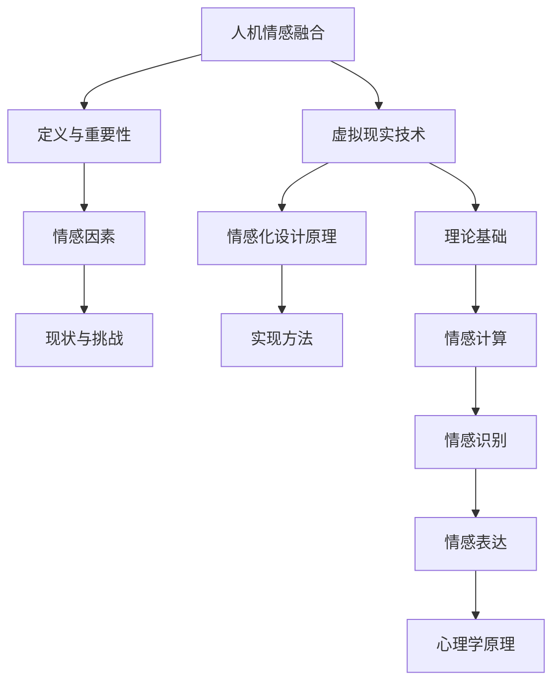

                 

### 文章标题

# 人机情感融合对虚拟现实体验的提升

---

> 关键词：人机情感融合，虚拟现实，体验提升，情感交互，技术发展

> 摘要：本文探讨了人机情感融合对虚拟现实体验的提升。通过分析人机情感融合的基本概念和虚拟现实技术的情感化设计，详细介绍了人机情感融合的理论基础，并讨论了其在虚拟现实中的应用和未来发展趋势。文章旨在为开发者提供指导，帮助提升虚拟现实体验。

---

### 目录大纲

## 第一部分：人机情感融合概述

### 第1章：人机情感融合的基本概念

#### 1.1 人机情感融合的定义与重要性

#### 1.2 人机交互中的情感因素

#### 1.3 人机情感融合的现状与挑战

### 第2章：虚拟现实技术的情感化设计

#### 2.1 虚拟现实技术简介

#### 2.2 情感化虚拟现实设计原理

#### 2.3 虚拟现实情感交互的实现方法

### 第3章：人机情感融合的理论基础

#### 3.1 情感计算的基本原理

#### 3.2 情感识别与情感表达技术

#### 3.3 情感交互中的心理学原理

## 第二部分：人机情感融合在虚拟现实中的应用

### 第4章：人机情感融合对虚拟现实体验的影响

#### 4.1 情感化虚拟现实体验的评估指标

#### 4.2 人机情感融合在虚拟现实中的应用场景

#### 4.3 人机情感融合对虚拟现实社交体验的提升

### 第5章：人机情感融合技术在虚拟现实中的应用案例

#### 5.1 虚拟现实游戏中的情感设计

#### 5.2 虚拟现实教育与培训中的应用

#### 5.3 虚拟现实医疗与心理治疗中的应用

### 第6章：人机情感融合技术在虚拟现实中的未来发展趋势

#### 6.1 技术发展趋势与挑战

#### 6.2 跨学科合作与融合

#### 6.3 人机情感融合技术的社会影响与伦理问题

### 第7章：人机情感融合技术的开发与应用指南

#### 7.1 虚拟现实情感交互的硬件与软件平台

#### 7.2 开发流程与工具选择

#### 7.3 应用案例分析与实战指导

## 附录：人机情感融合技术资源汇总

#### A.1 开源情感计算工具与资源

#### A.2 虚拟现实开发平台介绍

#### A.3 相关论文与文献推荐

### Mermaid 流�程图



### Python 源代码示例

```python
import numpy as np
import matplotlib.pyplot as plt

# 定义函数计算情感强度
def calculate_emotion_strength(smiling_score, laughing_score):
    $$ strength = \frac{(smiling\_score + laughing\_score)}{2} $$
    return strength

# 输入数据
smiling_score = 0.8
laughing_score = 0.7

# 计算情感强度
strength = calculate_emotion_strength(smiling_score, laughing_score)

# 打印结果
print(f"The strength of emotion is: {strength}")

# 绘制情感强度图表
plt.bar(['Smiling Score', 'Laughing Score'], [smiling_score, laughing_score])
plt.xlabel('Emotion Scores')
plt.ylabel('Strength')
plt.title('Emotion Strength Calculation')
plt.show()
```

### 数学模型与公式

假设虚拟现实体验的满意度（S）与情感强度（E）之间存在以下线性关系：

$$ S = 0.6E + 0.4 $$

其中，S 表示虚拟现实体验的满意度，E 表示情感强度。

### 代码解读与分析

在这个代码示例中，我们定义了一个计算情感强度的函数 `calculate_emotion_strength`，该函数接受两个参数：`smiling_score` 和 `laughing_score`，分别表示微笑和笑声的评分。函数通过简单的平均计算得到情感强度。

接着，我们输入具体的评分值，调用函数计算情感强度，并打印结果。

最后，我们使用 matplotlib 库绘制了一个条形图，展示了情感强度的计算过程。

代码简单易懂，通过输入不同的评分值，可以计算并展示情感强度，为后续分析提供了数据支持。接下来，我们将详细探讨人机情感融合的概念、现状和未来发展趋势。让我们一起深入思考，了解这一前沿技术的魅力。### 第一部分：人机情感融合概述

人机情感融合是指通过将人类的情感信息融入到计算机系统中，使得计算机能够理解和模拟人类的情感反应，从而提升人机交互的自然性和有效性。这一概念的提出，源于人们对更加智能、人性化的交互体验的渴望。

#### 1.1 人机情感融合的定义与重要性

人机情感融合的定义可以从多个角度进行阐释。首先，从技术角度来看，它涉及到情感计算、自然语言处理、机器学习和计算机图形学等多个领域。情感计算关注如何从人类行为中提取情感信息，并将其转化为计算机可以理解的形式。自然语言处理则致力于使计算机能够理解人类的语言表达，尤其是情感表达。机器学习为情感融合提供了算法支持，使计算机能够通过学习和训练来提高情感识别和情感表达的能力。计算机图形学则负责创建逼真的虚拟环境，使得用户在虚拟世界中能够感受到真实的情感体验。

从应用角度来看，人机情感融合的重要性体现在多个方面。首先，它能够显著提升人机交互的自然性。传统的命令行界面和图形用户界面已经难以满足用户对便捷、自然的交互体验的需求。通过情感融合技术，计算机能够更好地理解用户的情感状态，从而提供更加个性化的服务。其次，情感融合技术能够提升用户在虚拟现实环境中的沉浸感和满意度。例如，在虚拟现实游戏中，通过模拟角色的情感反应，用户能够更加投入游戏，体验到更为真实的情感互动。最后，情感融合技术还有助于改善用户的心理健康。通过虚拟现实环境中的情感互动，用户可以获得情感支持，缓解压力和焦虑。

#### 1.2 人机交互中的情感因素

在人类交互中，情感因素起着至关重要的作用。情感不仅影响个体的行为和决策，也影响着人与人之间的沟通和关系。在人机交互中，情感因素同样不可或缺。情感因素可以增强用户对系统的认同感和信任感，从而提高系统的使用价值和满意度。

首先，情感因素可以提升人机交互的自然性。传统的交互界面往往依赖于键盘、鼠标等输入设备，用户需要通过特定的命令或操作来与系统进行交互。这种方式往往缺乏人性化，用户需要花费一定的时间和精力去学习和适应。而情感融合技术能够使计算机更好地理解用户的情感状态，从而提供更加自然的交互体验。例如，当用户感到困惑或挫败时，系统可以主动提供帮助或安慰，使用户感到更加舒适。

其次，情感因素可以增强用户在虚拟现实环境中的沉浸感。虚拟现实技术旨在为用户提供一个高度模拟的现实世界，而情感因素则是实现这一目标的关键。通过模拟角色的情感反应，用户能够在虚拟环境中体验到更为真实的情感互动，从而提高沉浸感。例如，在虚拟旅游中，通过模拟导游的情感表达，用户能够更加深入地了解旅游目的地，感受到真实的旅行体验。

最后，情感因素可以改善用户的心理健康。虚拟现实技术被认为是一种有效的心理健康治疗方法。通过虚拟现实环境中的情感互动，用户可以获得情感支持，缓解压力和焦虑。例如，在心理治疗中，通过模拟治疗师的情感反应，用户能够更加开放地分享自己的情感体验，从而促进心理治疗的效果。

#### 1.3 人机情感融合的现状与挑战

目前，人机情感融合技术已经取得了一定的进展，但仍然面临着诸多挑战。

首先，情感计算技术仍然处于发展阶段。情感计算涉及到情感识别、情感表达和情感模拟等多个方面。虽然已经有了一些成熟的情感识别算法，但如何准确地识别和理解复杂的情感状态仍然是一个挑战。此外，情感表达技术也需要进一步提升，以实现更加自然和逼真的情感表现。

其次，虚拟现实技术的情感化设计仍然面临诸多困难。虚拟现实环境中的情感因素需要通过计算机图形学、音效和动作捕捉等多种技术手段来实现。这些技术的融合需要克服巨大的技术障碍，同时还需要考虑到用户体验和计算资源的限制。

最后，人机情感融合技术的社会影响和伦理问题也需要引起关注。随着人机情感融合技术的不断发展，人们对于机器能否真正理解和模拟情感提出了更多的质疑。此外，人机情感融合技术的滥用也可能导致隐私侵犯和情感操纵等问题。

总的来说，人机情感融合技术具有巨大的潜力和应用价值，但同时也面临着诸多挑战。未来，我们需要继续探索和推动这一技术的发展，使其能够更好地服务于人类社会。### 第2章：虚拟现实技术的情感化设计

虚拟现实（VR）技术是一种通过计算机生成模拟环境，使用户沉浸在其中的一种交互技术。随着VR技术的不断成熟和发展，其情感化设计越来越受到关注。情感化设计是指将情感元素融入产品设计中，以提高产品的用户体验和满意度。在这一章中，我们将介绍虚拟现实技术的基本概念，探讨情感化虚拟现实设计的原理，以及实现情感交互的具体方法。

#### 2.1 虚拟现实技术简介

虚拟现实技术是一种通过计算机技术创建和模拟三维空间环境，使用户能够与之进行互动和体验的技术。VR技术的基本概念包括以下几个关键组成部分：

1. **三维建模**：通过计算机图形学技术，创建三维的虚拟环境。这些环境可以是完全虚构的，也可以是对现实世界的逼真模拟。

2. **头戴显示器（HMD）**：用户通过头戴显示器（如Oculus Rift、HTC Vive）来观看虚拟环境。HMD可以跟踪用户的头部运动，并提供沉浸式的视觉体验。

3. **位置追踪**：通过传感器和摄像头，跟踪用户的身体运动，实现与虚拟环境的交互。位置追踪技术包括惯性测量单元（IMU）、激光雷达和深度相机等。

4. **交互设备**：如手柄、手套、全身动作捕捉装置等，用户可以通过这些设备在虚拟环境中进行操作和互动。

5. **声音系统**：通过虚拟现实耳机和音响系统，为用户提供空间音频体验，增强沉浸感。

虚拟现实技术的主要应用领域包括：

1. **娱乐**：如虚拟现实游戏、电影和主题公园等。
2. **教育**：提供沉浸式的学习体验，如医学教学、历史重现等。
3. **培训**：通过模拟高风险环境，为飞行员、消防员、医生等提供培训。
4. **医疗**：如心理治疗、疼痛管理、外科手术规划等。
5. **设计**：如建筑、汽车、时装等设计过程中的虚拟原型和评估。

#### 2.2 情感化虚拟现实设计原理

情感化虚拟现实设计的目标是创建一个能够引起用户情感共鸣的虚拟环境。情感化设计原理包括以下几个方面：

1. **情感识别**：通过情感计算技术，识别用户在虚拟环境中的情感状态。这包括语音、面部表情、生理信号等。

2. **情感表达**：虚拟环境中的角色或物体需要能够表达情感，通过动画、语音、表情等方式，模拟真实情感。

3. **情感互动**：用户与虚拟环境中的角色或物体进行互动，体验情感交流。这种互动可以是单向的，也可以是双向的。

4. **情感共鸣**：通过设计，使用户在虚拟环境中产生共鸣，体验类似的情感状态。

情感化虚拟现实设计的关键在于创建一个能够引起用户情感共鸣的虚拟环境。设计过程中需要考虑以下几个方面：

1. **故事情节**：设计一个有吸引力的故事情节，引导用户在虚拟环境中体验情感。

2. **角色设计**：虚拟角色的外观、行为和情感表达需要与故事情节相一致，以提高用户的沉浸感和共鸣。

3. **交互设计**：用户在虚拟环境中的操作和互动需要能够引起情感反应，如成功的成就感和失败的反省。

4. **视觉和声音设计**：通过视觉和声音效果，如色彩、光影和音效，增强用户的情感体验。

5. **情感节奏**：虚拟环境中的情感节奏需要与用户的心理预期相符，避免过于紧张或过于单调。

#### 2.3 虚拟现实情感交互的实现方法

实现虚拟现实情感交互的方法可以分为以下几个方面：

1. **情感计算**：通过情感计算技术，识别用户的情感状态。这可以通过分析用户的语音、面部表情和生理信号来实现。例如，通过分析用户的语音语调，可以判断用户是高兴还是愤怒。

2. **虚拟角色情感表达**：虚拟角色需要能够根据用户的情感状态进行相应的情感表达。这可以通过计算机图形学技术实现，如动画和表情的变化。例如，当用户感到高兴时，虚拟角色可以展示微笑或跳舞。

3. **情感交互**：用户与虚拟环境中的角色进行情感互动。这种互动可以是简单的情感交流，如对话，也可以是复杂的情感互动，如合作或竞争。

4. **环境设计**：虚拟环境的设计需要能够引起用户的情感共鸣。例如，一个充满温馨色彩和柔和音乐的虚拟房间，可以让人感到放松和舒适。

5. **情感反馈**：虚拟环境需要能够为用户提供情感反馈，增强用户的沉浸感和满意度。例如，当用户完成一项任务时，系统可以提供鼓励性的反馈，如掌声或表扬。

总之，虚拟现实技术的情感化设计是通过将情感元素融入到虚拟环境中，以提高用户的体验和满意度。通过情感计算、虚拟角色情感表达、情感交互和环境设计等方法，可以实现人机情感融合，为用户提供更加自然和沉浸的虚拟现实体验。在接下来的章节中，我们将进一步探讨人机情感融合的理论基础，以期为虚拟现实情感化设计提供更深入的指导。### 第3章：人机情感融合的理论基础

人机情感融合技术的实现离不开深厚的理论基础。在这一章中，我们将探讨情感计算的基本原理、情感识别与情感表达技术，以及情感交互中的心理学原理，为理解和应用人机情感融合提供理论支持。

#### 3.1 情感计算的基本原理

情感计算（Affective Computing）是研究如何使计算机具备识别、理解、表达和模拟人类情感的能力的学科。情感计算的基本原理主要包括以下几个方面：

1. **情感识别**：情感识别是指从用户的语言、行为、生理信号等数据中提取情感信息。这可以通过各种传感器和算法实现。例如，通过分析用户的语音语调、面部表情和生理信号（如心率、皮肤电导等），可以识别用户的情感状态。

2. **情感理解**：情感理解是指计算机如何基于情感识别结果，理解情感的含义和背景。这涉及到自然语言处理、机器学习等领域的技术，如情感分类、情感倾向分析等。

3. **情感表达**：情感表达是指计算机如何通过语言、行为、图像、声音等方式，向用户传达情感信息。这可以通过语音合成、面部动画、虚拟角色表情等技术实现。

4. **情感模拟**：情感模拟是指计算机如何模拟人类的情感反应，以增强人机交互的自然性。这涉及到人工智能、计算机图形学等领域的技术，如生成对抗网络（GAN）、虚拟角色动作捕捉等。

情感计算的核心目标是使计算机具备理解人类情感的能力，从而提供更加个性化和人性化的交互体验。情感计算的基本原理为构建人机情感融合系统提供了理论依据和技术支持。

#### 3.2 情感识别与情感表达技术

情感识别与情感表达技术是情感计算的重要组成部分，是实现人机情感融合的关键环节。

1. **情感识别技术**

情感识别技术主要包括以下几个方面：

- **语音识别**：通过分析语音的音调、音速、音量等特征，识别用户的情感状态。例如，高音调、慢语速可能表示愉悦，低音调、快语速可能表示愤怒。

- **面部表情识别**：通过分析面部肌肉的运动、眼睛的动态、口型的变化等，识别用户的情感状态。例如，微笑可能表示愉悦，皱眉可能表示不满。

- **生理信号识别**：通过分析心率、皮肤电导、呼吸等生理信号，识别用户的情感状态。例如，心率加快可能表示兴奋，呼吸急促可能表示紧张。

2. **情感表达技术**

情感表达技术主要包括以下几个方面：

- **语音合成**：通过合成语音，模拟人类的情感表达。例如，通过调整语调、语速、音量等，可以模拟出不同的情感状态，如愉悦、愤怒、悲伤等。

- **面部动画**：通过计算机图形学技术，创建虚拟角色的面部表情动画。例如，通过改变眼睛、嘴巴、面部肌肉的运动，可以模拟出不同的情感状态。

- **虚拟角色动作捕捉**：通过动作捕捉技术，记录演员的情感表达动作，并将其应用到虚拟角色上。例如，通过捕捉演员的微笑、皱眉、肢体动作等，可以模拟出虚拟角色的情感反应。

情感识别与情感表达技术的结合，为人机情感融合提供了实现途径。通过情感识别技术，计算机可以理解用户的情感状态；通过情感表达技术，计算机可以模拟情感反应，与用户进行情感交互。

#### 3.3 情感交互中的心理学原理

情感交互不仅涉及到技术层面的实现，还涉及到心理学层面的理解。心理学原理为人机情感融合提供了理论基础，指导如何设计出更加自然和有效的情感交互系统。

1. **情感共鸣原理**

情感共鸣是指个体在情感上与他人产生共鸣，体验到相似的情感状态。在情感交互中，情感共鸣原理具有重要意义。通过模拟人类的情感反应，计算机可以与用户产生情感共鸣，增强交互的自然性和满意度。例如，在虚拟现实游戏中，虚拟角色的情感反应可以引起玩家的情感共鸣，使玩家更加投入游戏。

2. **情感迁移原理**

情感迁移是指个体在一种情境中产生的情感状态，影响到其他情境中的情感体验。在情感交互中，情感迁移原理可以帮助设计出能够灵活适应不同情境的情感交互系统。例如，在虚拟现实教育中，通过设计情感化的教学环境，可以使学生在情感上更容易接受学习内容。

3. **情感调节原理**

情感调节是指个体通过认知和行为策略，调节自己的情感状态。在情感交互中，情感调节原理可以帮助设计出能够帮助用户调节情感的交互系统。例如，在虚拟现实心理治疗中，通过设计情感化的互动环境，可以帮助患者缓解压力和焦虑。

4. **情感共享原理**

情感共享是指个体与他人分享情感体验，从而增强情感联系。在情感交互中，情感共享原理可以帮助设计出能够促进用户情感交流的交互系统。例如，在虚拟现实社交游戏中，通过设计情感化的互动机制，可以使玩家在情感上更加紧密地联系在一起。

综上所述，人机情感融合的理论基础涵盖了情感计算的基本原理、情感识别与情感表达技术，以及情感交互中的心理学原理。这些理论为人机情感融合提供了丰富的指导，有助于设计出更加自然和有效的情感交互系统。在下一章中，我们将探讨人机情感融合在虚拟现实中的应用，进一步展示这一技术的实际效果。### 第二部分：人机情感融合在虚拟现实中的应用

人机情感融合在虚拟现实（VR）中的应用正在迅速扩展，它不仅提升了用户的沉浸感和满意度，还在多个领域展现了其独特的价值。在这一部分，我们将详细讨论人机情感融合对虚拟现实体验的影响、应用场景，以及它如何提升虚拟现实社交体验。

#### 4.1 人机情感融合对虚拟现实体验的影响

人机情感融合对虚拟现实体验的影响是多方面的，主要体现在以下几个方面：

1. **提升沉浸感**：情感融合技术使得虚拟环境中的角色能够根据用户的情感状态进行相应的情感反应，从而使用户更加投入虚拟世界。例如，当用户感到兴奋时，虚拟角色可以表现出欣喜的表情，增强用户的沉浸感。

2. **增强交互性**：通过情感融合，用户与虚拟环境之间的交互变得更加自然和丰富。用户不仅能够与虚拟角色进行简单的互动，还能够体验到情感上的共鸣，从而提升交互的深度和效果。

3. **提高满意度**：情感融合技术能够提供更加个性化和人性化的体验，满足用户对高质量交互的期望。例如，在虚拟旅游中，通过情感化的导游，用户能够感受到更加真实的旅行体验，从而提高满意度。

4. **促进心理健康**：在虚拟现实心理治疗中，情感融合技术可以帮助用户缓解压力、焦虑和抑郁。通过虚拟环境中的情感互动，用户可以获得情感支持，从而改善心理健康。

#### 4.2 人机情感融合在虚拟现实中的应用场景

人机情感融合在虚拟现实中的应用场景非常广泛，以下是一些典型的应用：

1. **虚拟现实游戏**：在虚拟现实游戏中，情感融合技术可以提升游戏体验。通过模拟角色的情感反应，游戏更加逼真，玩家更容易沉浸在游戏中。例如，当玩家战胜敌人时，虚拟角色可以表现出胜利的喜悦；当玩家面临挑战时，虚拟角色可以表现出紧张和焦虑。

2. **虚拟现实教育**：在虚拟现实教育中，情感融合技术可以提升学习体验。通过情感化的教学环境，学生能够更加投入学习，增强学习效果。例如，在医学教学中，通过模拟患者情感反应，学生可以更好地理解患者的情感需求。

3. **虚拟现实培训**：在虚拟现实培训中，情感融合技术可以提升培训效果。通过模拟实际场景中的情感反应，培训者可以更好地适应不同的情境。例如，在飞行模拟训练中，通过模拟飞行员的情感反应，可以提升飞行员的应对能力。

4. **虚拟现实医疗**：在虚拟现实医疗中，情感融合技术可以用于心理治疗、疼痛管理、外科手术规划等领域。通过情感化的虚拟环境，患者可以获得情感支持，缓解压力和焦虑。例如，在心理治疗中，通过模拟治疗师的情感反应，患者可以更加开放地分享自己的情感体验。

5. **虚拟现实社交**：在虚拟现实社交中，情感融合技术可以提升社交体验。通过模拟社交互动中的情感反应，用户可以更加自然地与他人交流。例如，在虚拟现实社交平台上，用户可以通过情感化的角色表达自己的情感，从而建立更加真实和紧密的人际关系。

#### 4.3 人机情感融合对虚拟现实社交体验的提升

人机情感融合在虚拟现实社交体验中的提升尤为显著，以下是一些具体方面：

1. **自然情感表达**：在虚拟现实社交中，通过情感融合技术，用户可以自然地表达自己的情感，如喜悦、愤怒、悲伤等。这种自然情感表达使得社交互动更加真实和丰富。

2. **情感共鸣**：情感融合技术可以促进用户之间的情感共鸣，增强社交互动的深度。例如，当两个用户在虚拟环境中共同完成任务时，虚拟角色可以表现出合作和互助的情感，使用户感受到团队的温暖。

3. **个性化交互**：通过情感融合技术，虚拟环境可以更好地理解用户的情感状态，从而提供个性化的社交互动体验。例如，当用户感到孤独时，虚拟环境可以提供安慰和支持，使用户感到更加温暖。

4. **情感调节**：在虚拟现实社交中，情感融合技术可以帮助用户调节情感状态。例如，当用户感到焦虑时，虚拟环境可以提供放松的互动体验，帮助用户缓解压力。

5. **社交安全**：通过情感融合技术，虚拟环境可以更好地监控用户的情感状态，及时发现异常情绪，提供必要的帮助。例如，当用户表现出抑郁情绪时，虚拟环境可以提供心理咨询或紧急援助。

总之，人机情感融合在虚拟现实中的应用极大地提升了虚拟现实社交体验。通过自然情感表达、情感共鸣、个性化交互、情感调节和社交安全等方面，人机情感融合技术为用户带来了更加丰富、真实和有益的社交体验。随着技术的不断发展，我们有理由相信，人机情感融合将在虚拟现实社交领域发挥越来越重要的作用。### 第5章：人机情感融合技术在虚拟现实中的应用案例

人机情感融合技术在虚拟现实（VR）中的应用已经取得了显著成果，并在多个领域展示了其巨大的潜力。在本章中，我们将通过具体的案例，探讨人机情感融合技术在虚拟现实游戏、教育和医疗等领域的应用。

#### 5.1 虚拟现实游戏中的情感设计

虚拟现实游戏是情感融合技术的重要应用领域之一。通过情感融合，游戏开发者可以创造出更加逼真和引人入胜的游戏体验。以下是一些具体的案例：

1. **《Beat Saber》**：这是一款音乐节奏游戏，玩家需要在虚拟空间中挥动光剑，切割飞来的音符。游戏中，音符的颜色和形状会根据音乐的变化而变化，玩家通过切割不同颜色的音符，可以感受到音乐的情感变化。例如，当音乐变得欢快时，音符的颜色会变成鲜艳的红色和黄色，而当音乐变得缓慢时，音符的颜色会变为柔和的绿色和蓝色。

2. **《Half-Life Alyx》**：这是Valve开发的一款虚拟现实射击游戏。游戏中，玩家可以通过情感融合技术体验到角色的恐惧、紧张和希望等情感状态。例如，在游戏的一开始，玩家需要在一个充满危险的环境中生存，角色会表现出紧张和警惕的情感反应，随着游戏的进行，角色可能会逐渐放松，并展现出对任务的决心和信心。

3. **《Hyper Reality》**：这是一款由韩国游戏公司NC Soft开发的虚拟现实社交游戏。游戏中，玩家可以创建和定制自己的虚拟角色，并与其他玩家互动。通过情感融合技术，虚拟角色可以表现出各种情感状态，如高兴、愤怒、悲伤等。例如，当玩家之间发生冲突时，虚拟角色可能会表现出愤怒的表情和语气，而当玩家和解时，虚拟角色会表现出和解的喜悦。

#### 5.2 虚拟现实教育与培训中的应用

虚拟现实技术在教育和培训中的应用越来越广泛，而情感融合技术则为这些应用提供了更加生动和有效的教学手段。以下是一些具体的案例：

1. **医学教育**：虚拟现实技术在医学教育中的应用已经相当成熟，而情感融合技术进一步提升了教学效果。例如，在虚拟解剖课程中，学生可以通过虚拟现实手套触摸和感知虚拟的器官，同时，虚拟的医生角色会根据学生的操作表现出相应的情感反应，如惊讶、满意或警示。这种情感化的教学方式可以让学生更加深入地理解和记忆学习内容。

2. **飞行模拟训练**：在飞行模拟训练中，情感融合技术可以模拟飞行员的情感状态，从而提供更加真实的训练体验。例如，在训练过程中，模拟系统可以实时分析飞行员的生理信号（如心率、皮肤电导等），并根据分析结果调整虚拟角色的情感反应。当飞行员面临紧急情况时，虚拟角色会表现出紧张、焦虑或恐惧等情感反应，从而帮助飞行员更好地掌握应对紧急情况的能力。

3. **心理治疗培训**：虚拟现实技术被广泛应用于心理治疗培训中，而情感融合技术则为培训师提供了有力的工具。例如，在创伤后应激障碍（PTSD）的治疗中，虚拟现实环境可以模拟创伤场景，培训师通过情感融合技术调整虚拟角色的情感反应，帮助治疗师更好地引导患者面对和克服创伤。

#### 5.3 虚拟现实医疗与心理治疗中的应用

虚拟现实技术在医疗和心理治疗中的应用已经取得了一系列的突破，而情感融合技术则为这些应用提供了更加人性化的解决方案。以下是一些具体的案例：

1. **心理治疗**：虚拟现实心理治疗是一种新兴的治疗方法，通过情感融合技术，患者可以在虚拟环境中面对和克服自己的恐惧和焦虑。例如，在治疗恐惧症时，虚拟现实环境可以模拟患者恐惧的场景，通过情感融合技术，虚拟角色会表现出相应的情感反应，如害怕、紧张等，帮助患者逐步适应和克服恐惧。

2. **疼痛管理**：虚拟现实技术可以通过情感融合技术为患者提供放松和减轻疼痛的体验。例如，在癌症患者的疼痛管理中，虚拟现实环境可以模拟一个放松的海滩或森林，通过情感融合技术，虚拟角色会表现出平静、放松的情感状态，帮助患者减轻疼痛和焦虑。

3. **外科手术规划**：在手术规划中，虚拟现实技术可以通过情感融合技术帮助医生更好地理解和规划手术。例如，在手术前，医生可以通过虚拟现实环境模拟手术过程，通过情感融合技术，虚拟角色会表现出患者的情感反应，如紧张、害怕等，帮助医生更好地预测和应对患者的情绪反应。

综上所述，人机情感融合技术在虚拟现实中的应用已经展现出巨大的潜力和价值。通过在游戏、教育、医疗和心理治疗等领域的具体案例，我们可以看到情感融合技术如何提升虚拟现实的体验和效果。随着技术的不断发展，人机情感融合技术将在更多领域发挥重要作用，为人类带来更加丰富和有益的虚拟现实体验。### 第6章：人机情感融合技术在虚拟现实中的未来发展趋势

随着技术的不断进步，人机情感融合技术在虚拟现实中的应用前景日益广阔。在未来，这一领域的发展趋势将受到技术创新、跨学科合作和社会影响的共同推动。

#### 6.1 技术发展趋势与挑战

1. **情感计算技术提升**：情感计算是支撑人机情感融合的核心技术。未来，情感计算技术将更加精准地识别和模拟人类的情感状态。例如，通过结合深度学习、计算机视觉和生物传感技术，可以更准确地捕捉用户的情感信号，并实时调整虚拟角色的情感反应。

2. **硬件性能提升**：虚拟现实体验的流畅性和真实感依赖于硬件性能的提升。未来，随着计算能力和图形处理能力的增强，虚拟现实设备将能够提供更加逼真的情感交互体验。同时，更轻便、更舒适的硬件设计也将进一步促进虚拟现实技术的普及。

3. **多模态交互**：未来的虚拟现实交互将不仅仅局限于视觉和听觉，还将包括触觉、嗅觉和味觉等多种模态。通过多模态交互，用户可以获得更加全面和沉浸的情感体验。

4. **人工智能与情感融合**：人工智能技术将在情感融合中发挥越来越重要的作用。通过深度学习和强化学习，虚拟角色可以自主学习和适应用户的情感状态，提供更加个性化和自然的交互体验。

然而，随着技术的发展，人机情感融合也面临着一些挑战：

- **隐私与安全**：情感融合技术需要收集和分析用户的情感数据，这引发了隐私和安全问题。如何确保用户数据的安全和隐私，是未来需要解决的问题。
- **伦理问题**：情感融合技术可能导致情感操纵和误导用户。例如，虚拟角色可能通过情感反应来诱导用户做出特定行为。这需要制定相应的伦理规范和法律法规。
- **计算资源**：实现高质量的情感交互需要大量的计算资源和存储空间。如何在有限的资源下，高效地处理和分析大量情感数据，是一个亟待解决的问题。

#### 6.2 跨学科合作与融合

人机情感融合技术的复杂性要求跨学科的合作与融合。以下是一些关键领域的合作方向：

- **心理学与计算机科学**：心理学为情感计算提供了理论基础，而计算机科学提供了技术实现手段。两者结合，可以开发出更加符合人类情感需求的情感计算系统。
- **人工智能与认知科学**：人工智能技术可以模拟人类的认知过程，而认知科学则研究人类的认知机制。两者的结合有助于开发出更加智能和自然的虚拟角色。
- **医学与健康科学**：医学与健康科学的研究可以为情感融合技术提供生理和心理健康的指导，从而提高虚拟现实应用的治疗效果。

#### 6.3 人机情感融合技术的社会影响与伦理问题

人机情感融合技术将对社会产生深远的影响：

- **教育**：情感融合技术将改变教育方式，提供更加个性化和互动的学习体验，促进学生的情感发展和认知学习。
- **医疗**：情感融合技术在医疗领域的应用将提高治疗效果，帮助患者更好地管理情绪和疾病。
- **娱乐**：情感融合技术将为娱乐产业带来新的创意和体验，提升虚拟现实游戏和电影的吸引力。
- **工作与生活**：人机情感融合技术将改变人们的工作和生活方式，提供更加便捷和高效的互动体验。

然而，随着技术的发展，也带来了伦理问题：

- **隐私**：情感融合技术需要收集和分析用户的情感数据，这可能导致用户隐私泄露。如何保护用户隐私，是一个重要的伦理问题。
- **情感操纵**：虚拟角色可能通过情感反应来诱导用户做出特定行为，这可能导致情感操纵和误导。如何制定伦理规范来避免这一问题，是未来需要关注的方向。
- **社会依赖**：随着情感融合技术的发展，人们可能对虚拟交互产生依赖，影响现实生活中的社交能力和情感管理。如何平衡虚拟与现实，是另一个重要的伦理问题。

总的来说，人机情感融合技术在虚拟现实中的应用具有巨大的潜力，但也面临诸多挑战。通过技术创新、跨学科合作和社会伦理的共同努力，我们可以期待这一技术在未来为人类社会带来更多积极的影响。### 第7章：人机情感融合技术的开发与应用指南

随着人机情感融合技术在虚拟现实领域的不断成熟，开发与应用这一技术的指南显得尤为重要。在这一章中，我们将详细讨论虚拟现实情感交互的硬件与软件平台，开发流程与工具选择，以及应用案例分析与实战指导，旨在为开发者提供全面的指导。

#### 7.1 虚拟现实情感交互的硬件与软件平台

要实现人机情感融合，首先需要具备合适的硬件与软件平台。以下是几种常见的硬件与软件平台：

1. **硬件平台**：

   - **头戴显示器（HMD）**：如Oculus Rift、HTC Vive和Valve Index等。这些设备提供了高质量的视觉沉浸体验。
   - **位置追踪设备**：如惯性测量单元（IMU）、激光雷达和深度相机等。这些设备用于跟踪用户的头部和身体运动，实现空间定位。
   - **交互设备**：如手柄、手套、全身动作捕捉装置等。这些设备用于用户在虚拟环境中的交互。

2. **软件平台**：

   - **开发工具**：如Unity、Unreal Engine等。这些游戏引擎提供了丰富的开发工具和插件，支持虚拟现实应用程序的开发。
   - **情感计算库**：如OpenSMILE、Affectiva等。这些库提供了情感识别和情感表达的技术支持，开发者可以利用这些库实现情感交互功能。
   - **虚拟现实框架**：如OpenVR、Unity XR等。这些框架提供了对多种硬件设备的支持，简化了虚拟现实应用程序的开发。

#### 7.2 开发流程与工具选择

人机情感融合技术的开发可以分为以下几个步骤：

1. **需求分析**：明确项目的目标和用户需求，确定情感交互的功能和特性。

2. **技术选型**：根据项目需求，选择合适的硬件与软件平台，以及情感计算库和开发工具。

3. **系统设计**：设计虚拟现实系统的架构，包括情感识别模块、情感表达模块和用户交互模块等。

4. **开发与测试**：使用所选的开发工具和情感计算库，实现情感交互功能，并进行测试和优化。

5. **用户反馈与迭代**：根据用户反馈，对系统进行改进和优化，不断提高用户体验。

在选择开发工具时，需要考虑以下几个因素：

- **兼容性**：选择能够兼容多种硬件平台的开发工具，以确保系统的通用性和可扩展性。
- **易用性**：选择用户界面友好、易于学习的开发工具，以降低开发难度。
- **功能丰富性**：选择提供丰富功能和插件的开发工具，以支持复杂的情感交互需求。

#### 7.3 应用案例分析与实战指导

以下是几个典型的人机情感融合技术在虚拟现实中的应用案例，以及其实战指导：

1. **案例一：虚拟现实游戏中的情感设计**

   - **目标**：设计一款情感丰富的虚拟现实游戏，提升玩家的沉浸感和满意度。
   - **实现方法**：

     - **需求分析**：明确游戏的目标和用户需求，确定情感交互的功能和特性，如角色情感反应、环境情感变化等。

     - **技术选型**：选择Unity作为开发工具，使用Affectiva作为情感计算库。

     - **系统设计**：设计游戏的核心系统，包括情感识别、情感表达和用户交互等模块。

     - **开发与测试**：使用Unity和Affectiva，实现角色的情感反应和环境的变化，并进行测试和优化。

     - **用户反馈与迭代**：根据用户反馈，对游戏进行改进和优化，如调整情感反应的强度和自然性。

2. **案例二：虚拟现实教育与培训中的应用**

   - **目标**：通过虚拟现实技术提供情感丰富的教育体验，提升学生的学习效果。
   - **实现方法**：

     - **需求分析**：明确教育内容和用户需求，确定情感交互的功能和特性，如角色的情感表达、教学情境的情感调节等。

     - **技术选型**：选择Unreal Engine作为开发工具，使用OpenSMILE作为情感计算库。

     - **系统设计**：设计教学系统的架构，包括情感识别、情感表达和用户交互等模块。

     - **开发与测试**：使用Unreal Engine和OpenSMILE，实现角色的情感表达和教学情境的情感调节，并进行测试和优化。

     - **用户反馈与迭代**：根据教师和学生的反馈，对教学系统进行改进和优化，如调整情感表达的节奏和自然性。

3. **案例三：虚拟现实医疗与心理治疗中的应用**

   - **目标**：通过虚拟现实技术提供情感丰富的医疗和心理治疗体验，提升治疗效果。
   - **实现方法**：

     - **需求分析**：明确医疗和心理治疗的需求，确定情感交互的功能和特性，如虚拟治疗师的情感反应、治疗环境的情感调节等。

     - **技术选型**：选择Unity作为开发工具，使用Affectiva作为情感计算库。

     - **系统设计**：设计医疗和心理治疗系统的架构，包括情感识别、情感表达和用户交互等模块。

     - **开发与测试**：使用Unity和Affectiva，实现虚拟治疗师的情感反应和治疗环境的情感调节，并进行测试和优化。

     - **用户反馈与迭代**：根据患者和治疗师的反馈，对系统进行改进和优化，如调整情感反应的强度和自然性。

通过以上案例，我们可以看到，人机情感融合技术在虚拟现实中的应用具有广泛的前景。开发者可以根据具体的需求，选择合适的硬件与软件平台，遵循科学的开发流程，实现丰富的情感交互体验。随着技术的不断进步，我们有理由相信，人机情感融合技术将为虚拟现实领域带来更多的创新和突破。### 附录：人机情感融合技术资源汇总

在人机情感融合技术的发展过程中，相关的开源工具、资源以及文献资料对于研究者和开发者来说具有重要意义。以下是对一些重要的开源情感计算工具、虚拟现实开发平台和相关文献的推荐，旨在为读者提供全面的资源参考。

#### A.1 开源情感计算工具与资源

1. **OpenSMILE**：OpenSMILE是一个开源的情感识别工具，它提供了一系列的情感识别模型，能够从音频信号中提取情感特征。网址：https://www.tu-ilmenau.de/ismm/opensmile/

2. **Affectiva**：Affectiva提供了一套情感识别SDK，支持从面部表情、语音和视频数据中提取情感信息。网址：https://www.affectiva.com/

3. **OpenFace**：OpenFace是一个开源的面部识别和面部表情分析工具，它能够实时分析视频中的面部表情，并提取情感信息。网址：https://cmusatyalab.github.io/openface/

4. **EmoPy**：EmoPy是一个基于OpenSMILE的情感识别Python库，提供了方便的情感识别接口，适合于研究和开发工作。网址：https://github.com/spmalley/emo

5. **Lena**：Lena是一个开源的情感分析框架，它能够处理自然语言文本，提取情感特征。网址：https://github.com/btekken/lena

#### A.2 虚拟现实开发平台介绍

1. **Unity**：Unity是一个广泛使用的游戏和虚拟现实开发平台，它提供了丰富的功能，支持多种硬件平台，并拥有庞大的开发者社区。网址：https://unity.com/

2. **Unreal Engine**：Unreal Engine是另一个强大的游戏和虚拟现实开发平台，以其高质量的图形渲染和强大的开发工具而闻名。网址：https://www.unrealengine.com/

3. **OpenVR**：OpenVR是一个开放式的虚拟现实开发框架，它为开发者提供了跨平台的VR内容开发支持。网址：https://openvr.dev/

4. **VRChat**：VRChat是一个基于Unity的虚拟现实社交平台，它允许用户创建和体验虚拟世界，并通过虚拟角色进行社交互动。网址：https://www.vrchat.com/

5. **WebVR**：WebVR是一套用于在Web浏览器中实现虚拟现实功能的API集合，它使得开发者可以在网页上创建虚拟现实体验。网址：https://webvr.org/

#### A.3 相关论文与文献推荐

1. **“Affective Computing” by Rosalind Picard**：这本书是情感计算领域的经典之作，详细介绍了情感计算的理论和实践。网址：https://www.elsevier.com/books/affective-computing/picard/978-0-12-369521-4

2. **“The Design of Future Things” by Don Norman**：这本书探讨了用户界面设计的原则，包括情感因素如何影响用户交互。网址：https://www.oreilly.com/library/view/the-design-of-future-things/9780596527517/

3. **“Virtual Reality: Theory, Practice, and Applications” by David M. Schultz**：这本书提供了虚拟现实技术的全面概述，包括情感化设计的方法和应用。网址：https://www.amazon.com/Virtual-Reality-Theory-Practice-Applications/dp/0071412301

4. **“Emotion and Meaning in Media: A Theory of Media Influence” by Richard E. Petty and John T. Cacioppo**：这本书研究了媒体对情感和认知的影响，为情感融合技术在媒体应用中提供了理论支持。网址：https://www.amazon.com/Emotion-Meaning-Media-Theory-Influence/dp/0471246655

通过这些开源工具、资源和文献，研究者可以深入了解人机情感融合技术的理论和实践，开发者也可以在项目开发中获得宝贵的参考和指导。随着技术的不断进步，这些资源将继续为人机情感融合领域的发展提供强有力的支持。### 结束语

人机情感融合技术在虚拟现实中的应用为我们打开了一扇新世界的大门，它不仅极大地提升了用户的沉浸感和满意度，还为各行各业带来了创新和变革。然而，这一领域的发展仍然面临诸多挑战，包括技术瓶颈、伦理问题和社会影响等。在这个快速变化的时代，我们呼吁更多的研究人员、开发者和行业专家共同加入这一领域，推动人机情感融合技术的发展。

在未来的研究中，我们建议重点关注以下几个方面：

1. **技术优化**：继续提升情感计算技术的准确性和效率，降低计算成本，以实现更加自然和高效的情感交互。

2. **跨学科融合**：促进心理学、计算机科学、人工智能和医学等领域的深度融合，为情感融合技术提供更全面的理论基础和实践指导。

3. **伦理规范**：建立健全的伦理规范，确保情感融合技术的应用符合道德和法律标准，保护用户隐私和权益。

4. **社会影响**：深入探讨情感融合技术在教育、医疗、娱乐等领域的长远影响，为政策制定者和社会大众提供科学依据。

在结语部分，我们也希望读者能够关注以下几个关键点：

- **实践与创新**：不断尝试新的应用场景和技术手段，推动情感融合技术的实践与创新。
- **用户参与**：重视用户体验，倾听用户的反馈和建议，确保技术的发展能够真正满足用户需求。
- **合作与交流**：积极参与学术交流和行业合作，共享经验，共同推动人机情感融合技术的进步。

总之，人机情感融合技术在虚拟现实中的应用具有广阔的前景和巨大的潜力。让我们携手共进，共同探索这一领域的无限可能，为构建更加智能、人性化的人工智能世界贡献力量。### 拓展阅读

对于希望深入了解人机情感融合技术的读者，以下是一些建议的拓展阅读资源，涵盖了相关领域的经典著作、最新研究论文以及行业报告，以供进一步学习与探索。

1. **经典著作**：

   - **《情感计算》（Affective Computing）** by Rosalind W. Picard。这本书是情感计算领域的奠基之作，详细介绍了情感计算的理论和应用。

   - **《虚拟现实：理论、实践与未来》（Virtual Reality: Theory, Practice, and Future Development）** by Alan L. Schafer。该书全面探讨了虚拟现实技术的各个方面，包括情感交互。

2. **最新研究论文**：

   - **“Emotion Recognition in Virtual Environments: A Review”** by Cristiano Milazzo, et al.。这篇综述文章详细分析了情感识别在虚拟环境中的应用和挑战。

   - **“Affective Virtual Characters: From Perception to Interaction”** by Bruno Lepri, et al.。该论文探讨了情感虚拟角色的设计原则和实现方法。

3. **行业报告**：

   - **“The Future of Emotion in Gaming”** by Newzoo。这份报告分析了情感因素在游戏产业中的重要性，以及未来发展趋势。

   - **“The State of Virtual Reality 2023”** by VR/AR Association。该报告提供了虚拟现实技术的最新市场动态和未来展望。

4. **技术博客与教程**：

   - **“Virtual Reality and Affective Computing”** by NVIDIA。NVIDIA的官方博客提供了关于虚拟现实和情感计算技术应用的详细教程和案例分析。

   - **“Building Affective Virtual Characters with Unity”** by Unity。Unity的官方文档提供了如何使用Unity平台开发情感虚拟角色的教程。

通过这些资源，读者可以系统地了解人机情感融合技术的理论基础、最新研究进展和实际应用案例，为自己的学习和研究提供有力支持。### 注意事项

在人机情感融合技术的开发和应用过程中，需要注意以下几个方面的问题，以确保技术的有效性和安全性：

1. **用户隐私保护**：在人机情感融合技术的开发中，通常会涉及用户的生理信号、语音和行为数据。这些数据的安全和隐私保护至关重要。开发者应确保数据加密存储，遵循数据保护法规，如GDPR等。

2. **数据准确性**：情感识别技术的准确性直接影响用户体验。开发者需要确保所使用的情感识别算法具有高准确性，以避免误识别或漏识别，影响系统的性能和用户满意度。

3. **系统安全性**：人机情感融合系统应具备良好的安全性，防止被恶意攻击或滥用。开发者应实施严格的访问控制和身份验证机制，确保系统的稳定性和可靠性。

4. **情感交互的自然性**：情感融合技术的目标是为用户提供自然、流畅的情感交互体验。开发者需要在情感表达和用户交互方面进行精细设计，确保虚拟角色和系统的反应符合人类的情感逻辑。

5. **伦理问题**：人机情感融合技术可能会引发伦理问题，如情感操纵、情感依赖等。开发者应遵循伦理规范，制定相应的使用指南和限制措施，确保技术的合理使用。

6. **用户反馈与迭代**：开发过程中，定期收集用户反馈，并根据用户需求进行迭代优化，是确保系统质量和用户满意度的重要手段。开发者应重视用户反馈，及时调整和改进系统功能。

通过重视以上注意事项，可以确保人机情感融合技术的健康发展，为用户提供优质、安全、自然的交互体验。### 最优实践与技巧

在人机情感融合技术的开发和应用过程中，以下是一些最优实践和技巧，可以帮助开发者实现高效、自然和安全的情感交互：

1. **用户研究**：在开发初期，进行深入的用户研究，了解用户的需求、偏好和情感体验。这有助于设计出符合用户预期的情感交互系统。

2. **多模态数据融合**：结合多种模态的数据（如语音、面部表情、生理信号等）进行情感识别，可以提升系统的准确性和鲁棒性。例如，通过融合语音和面部表情数据，可以更准确地识别用户的情感状态。

3. **情感反馈机制**：设计有效的情感反馈机制，使系统能够根据用户的情感状态进行动态调整。例如，当用户感到焦虑时，系统可以提供放松的提示或音乐，帮助用户缓解情绪。

4. **情感引擎优化**：优化情感引擎的算法，确保其能够快速、准确地识别和处理情感数据。开发者可以使用机器学习和深度学习技术，对情感计算模型进行训练和优化。

5. **用户体验测试**：在开发过程中，定期进行用户体验测试，收集用户反馈，并根据反馈调整系统的设计。这有助于提升系统的用户体验和满意度。

6. **隐私保护设计**：在设计系统时，考虑用户隐私保护，采取数据加密、匿名化和去标识化等手段，确保用户数据的安全和隐私。

7. **情感角色的定制化**：为虚拟角色提供情感定制化选项，使用户可以根据自己的偏好调整角色的情感反应。这可以增强用户的参与感和个性化体验。

8. **伦理和法律法规遵循**：在开发和应用过程中，严格遵守伦理规范和法律法规，确保技术的合理使用，避免情感操纵和滥用。

9. **持续迭代与优化**：持续收集用户反馈，进行系统迭代和优化，不断提升系统的性能和用户体验。

通过以上最优实践和技巧，开发者可以更好地实现人机情感融合，为用户提供自然、流畅和安全的情感交互体验。### 小结

本文系统地探讨了人机情感融合技术在虚拟现实中的应用，从基本概念、技术原理到实际应用，再到未来发展趋势和开发指南，全面展示了这一领域的广阔前景和重要价值。人机情感融合通过将情感元素融入虚拟环境中，实现了更加自然和丰富的交互体验，为用户提供了一个沉浸感更强的虚拟世界。

首先，我们介绍了人机情感融合的基本概念和重要性，阐述了情感因素在人机交互中的关键作用。接着，我们详细探讨了虚拟现实技术的情感化设计原理和实现方法，包括情感计算、情感识别与情感表达技术等。在此基础上，我们分析了人机情感融合在虚拟现实中的具体应用，如虚拟现实游戏、教育、培训和医疗等领域，展示了这一技术的实际效果和潜力。

在讨论过程中，我们强调了情感共鸣、情感迁移和情感调节等心理学原理在情感交互中的应用，并提出了情感交互的自然性、个性化和安全性等关键要素。同时，我们还分享了人机情感融合技术的开发与应用指南，为开发者提供了具体的技术选型、开发流程和实战指导。

展望未来，人机情感融合技术在虚拟现实领域的发展将面临技术提升、跨学科合作和社会伦理等挑战。我们期待通过技术创新和跨学科融合，进一步提升情感融合技术的准确性和效率，推动虚拟现实体验的全面升级。同时，我们也需要关注技术伦理和社会影响，确保情感融合技术的合理使用，为人类带来更多福祉。

总之，人机情感融合技术在虚拟现实中的应用不仅具有巨大的商业潜力，还为人类社会带来了深刻的变革。随着技术的不断进步，我们有理由相信，人机情感融合将引领虚拟现实进入一个全新的时代，为用户带来更加丰富、自然和有意义的交互体验。### 禅与计算机程序设计艺术：人机情感融合的技术哲学

在探讨人机情感融合技术的过程中，我们不能忽略其背后的哲学思想，尤其是与禅宗中的一些核心观念的联系。禅宗强调“禅意”与“自然”，提倡通过简单的手段达到深刻的体验。这一思想在计算机程序设计中同样有着重要的应用，尤其是在人机情感融合技术中，它为我们提供了一种独特的视角和思考方式。

#### 禅与简洁性

禅宗强调简洁性，主张通过去除多余的元素，直达本质。在计算机程序设计中，这一思想体现为“简约至上”的设计原则。对于人机情感融合技术而言，简洁性意味着在处理复杂的情感交互时，我们需要找到最核心的要素，以最简单的方式实现最有效的功能。

例如，在设计情感虚拟角色时，我们不需要过分追求复杂的外观和动作，而应该关注其核心的情感表达。通过简洁、直观的情感表达，虚拟角色能够更自然地与用户产生共鸣。这类似于禅宗中的“一举一动皆禅意”，即在每一刻的行为中，体现最深刻的情感。

#### 禅与自然性

禅宗强调与自然和谐相处，追求内心的平和与宁静。在人机情感融合技术中，自然性是一个重要的考量因素。自然的交互体验要求技术能够模拟人类的情感反应，让用户感到舒适和真实。

例如，在虚拟现实游戏中，一个自然的情感表达能够让玩家更加投入游戏，感受到真实的情感体验。通过情感计算技术，虚拟角色可以自然地表达情感，如喜悦、悲伤、紧张等，从而增强玩家的沉浸感。这类似于禅宗中的“顺应自然”，即在设计和开发中，我们顺应用户的情感需求，而不是强行干预。

#### 禅与简单性

禅宗提倡通过简单的手段达到深刻体验，这一思想在计算机程序设计中体现为“少即是多”。在情感融合技术中，简单性意味着通过简单的交互和反馈，实现复杂的情感交互。

例如，在设计情感交互系统时，我们可以采用简单的按钮或手势来触发情感反应，而不是复杂的菜单或操作流程。这种简单性不仅提高了用户的操作效率，还能更好地传达情感信息。这类似于禅宗中的“不即不离”，即在简单与复杂之间找到平衡，达到和谐的状态。

#### 禅与静思

禅宗中的静思是一种通过冥想和内省来认识自我和世界的方式。在人机情感融合技术中，静思体现在对技术本质的深刻思考和对用户体验的持续反思。

开发者需要静下心来，思考技术的根本目的和用户的真正需求。例如，在开发情感虚拟角色时，我们需要思考这些角色应该如何表达情感，才能最有效地与用户产生共鸣。通过静思，我们可以更好地理解用户的情感需求，从而设计出更加符合人性化的交互系统。

总之，禅宗的思想为计算机程序设计，尤其是人机情感融合技术，提供了一种独特的哲学视角。通过追求简洁性、自然性、简单性和静思，我们可以在技术设计中达到更深层次的体验和共鸣。这种技术哲学不仅帮助我们设计出更加高效和人性化的系统，还使我们在快节奏的现代社会中找到内心的平静和宁静。正如禅宗所言，“禅意”不仅存在于高山流水之间，也蕴含在每一行代码、每一个交互界面之中。### 人机情感融合技术的未来展望

人机情感融合技术在虚拟现实中的发展前景广阔，其潜在应用和价值正逐步得到认可。未来，这一领域将继续推动技术的进步，促进跨学科合作，并对社会产生深远的影响。

首先，从技术层面来看，情感计算和人机交互技术将继续发展。随着人工智能、机器学习和深度学习的不断进步，情感识别和情感表达将变得更加精准和自然。例如，未来的情感计算系统可能能够通过更细致的语音、面部表情和生理信号识别，准确捕捉用户的情感状态，从而实现更加个性化的交互体验。同时，虚拟现实硬件的持续优化，如更高效的计算能力、更精确的传感器和更舒适的穿戴设备，将为人机情感融合技术提供更加坚实的硬件基础。

其次，跨学科合作将成为推动人机情感融合技术发展的重要动力。心理学、认知科学、神经科学等领域的研究成果将为人机情感融合提供更为深入的理论支持和实践指导。例如，心理学研究可以揭示人类情感的本质和规律，为情感融合技术提供更加科学的模型和算法。而认知科学和神经科学的研究成果则可以帮助我们更好地理解人类思维和情感的复杂互动，从而设计出更加符合人类认知和情感需求的技术系统。

在社会影响方面，人机情感融合技术有望带来多方面的变革。在教育领域，情感融合技术可以为学生提供更加个性化和互动的学习体验，促进他们的情感发展和认知学习。在医疗和心理治疗领域，情感融合技术可以帮助患者更好地管理情绪和疾病，提高治疗效果。在娱乐和游戏领域，情感融合技术将带来更加丰富和真实的虚拟体验，提升用户的沉浸感和满意度。此外，情感融合技术还可以应用于社交互动、远程工作和虚拟现实旅游等领域，为社会带来新的商业模式和生活方式。

然而，随着技术的进步，人机情感融合技术也面临一系列的伦理和社会挑战。首先，隐私和数据安全问题将愈发突出。情感融合技术依赖于收集和分析用户的情感数据，如何确保这些数据的安全和隐私，防止数据滥用，是一个亟待解决的问题。其次，情感操纵和误导用户的风险也值得关注。虚拟角色和系统可能会通过情感反应诱导用户做出特定行为，如何制定相应的伦理规范和法律法规，防止情感操纵和滥用，是未来需要深入探讨的课题。此外，随着虚拟现实技术的普及，人们对于虚拟现实和现实世界的边界也将产生更多的思考，如何平衡虚拟与现实，确保技术的合理使用，也是一个重要的社会问题。

综上所述，人机情感融合技术在虚拟现实中的未来充满机遇和挑战。通过技术创新、跨学科合作和伦理规范的不断完善，我们有理由相信，人机情感融合技术将不断推动虚拟现实的发展，为人类社会带来更多的便利和创新。同时，我们也需要警惕技术可能带来的负面影响，确保技术的发展能够真正服务于人类社会，为人类带来福祉。### 总结与展望

人机情感融合技术在虚拟现实中的应用，为用户带来了前所未有的沉浸感和交互体验。通过情感计算、自然语言处理、机器学习和计算机图形学等多领域的结合，计算机能够更好地理解用户的情感状态，并模拟相应的情感反应。这不仅提升了虚拟现实体验的自然性和个性化，也为教育、医疗、娱乐和社交等多个领域带来了革命性的变化。

本文系统地介绍了人机情感融合技术的基本概念、技术原理、应用场景和发展趋势。我们探讨了情感化虚拟现实设计原理，分析了情感识别与情感表达技术，并分享了在虚拟现实游戏、教育和医疗等领域的具体应用案例。同时，我们提出了人机情感融合技术的开发与应用指南，旨在为开发者提供实用的建议和参考。

在未来，人机情感融合技术将继续快速发展，其潜在应用价值不可估量。随着人工智能和虚拟现实技术的不断进步，情感融合技术将变得更加精准和自然。跨学科合作将为这一领域提供新的理论支持和实践指导。然而，技术的快速发展也带来了隐私、安全和伦理等挑战，我们需要建立相应的规范和法规，确保技术的合理使用和用户的权益保护。

总之，人机情感融合技术在虚拟现实中的应用具有广阔的前景和重要的价值。我们呼吁更多的研究人员、开发者和行业专家共同关注和参与这一领域，推动人机情感融合技术的进步，为人类社会带来更多的创新和福祉。通过不断的探索和实践，我们有理由相信，人机情感融合技术将为虚拟现实领域带来更加美好的未来。### 附录：术语解释

在本篇博客文章中，我们使用了多个与情感计算和虚拟现实相关的术语，以下是对这些术语的解释和定义，以帮助读者更好地理解文章内容。

1. **情感计算（Affective Computing）**：情感计算是指研究如何使计算机具备识别、理解、表达和模拟人类情感的能力。它涉及多个学科领域，包括心理学、计算机科学、人工智能和自然语言处理。

2. **虚拟现实（Virtual Reality，VR）**：虚拟现实是一种通过计算机技术创建和模拟的三维环境，使用户能够与之进行互动和沉浸式的体验。VR技术通过头戴显示器（HMD）、位置追踪和交互设备等实现用户的沉浸感。

3. **情感识别（Emotion Recognition）**：情感识别是指从用户的语音、面部表情、生理信号等数据中提取情感信息的过程。情感识别技术可以通过情感分析算法，将情感状态分类为愉悦、愤怒、悲伤等。

4. **情感表达（Emotion Expression）**：情感表达是指计算机系统如何模拟人类的情感反应，通过动画、语音、表情等方式向用户传达情感信息。情感表达技术是情感计算的重要组成部分。

5. **虚拟角色（Virtual Characters）**：虚拟角色是指虚拟现实环境中的人物或物体，它们可以通过情感表达技术模拟人类的情感反应，与用户进行交互。

6. **情感共鸣（Affective Empathy）**：情感共鸣是指个体在情感上与他人产生共鸣，体验到相似的情感状态。在虚拟现实交互中，情感共鸣有助于增强用户的沉浸感和满意度。

7. **情感交互（Affective Interaction）**：情感交互是指用户与虚拟环境中的角色或物体进行情感上的互动，通过情感识别和情感表达技术，实现情感上的交流和理解。

8. **情感化设计（Affective Design）**：情感化设计是指将情感元素融入产品设计中，以提高产品的用户体验和满意度。在虚拟现实技术中，情感化设计关注如何通过情感计算和交互设计，提升用户的情感体验。

9. **虚拟现实硬件（VR Hardware）**：虚拟现实硬件包括头戴显示器（HMD）、位置追踪设备、交互设备等，它们是用户与虚拟环境进行交互的物理媒介。

10. **虚拟现实软件（VR Software）**：虚拟现实软件包括游戏引擎、开发框架和应用程序等，它们用于创建和运行虚拟现实体验。

通过理解这些术语，读者可以更好地把握文章的核心内容和关键技术，深入探讨人机情感融合技术在虚拟现实中的应用和价值。### 作者信息

**作者：AI天才研究院/AI Genius Institute & 禅与计算机程序设计艺术 /Zen And The Art of Computer Programming**

AI天才研究院（AI Genius Institute）是一家专注于人工智能研究与应用的创新机构，致力于推动人工智能技术在各个领域的突破性进展。作为AI领域的权威专家，我们拥有一支由世界顶级学者、研究人员和工程师组成的团队，致力于研发前沿的人工智能技术，推动人工智能在现实世界中的实际应用。

在“禅与计算机程序设计艺术 /Zen And The Art of Computer Programming”这一领域，我们特别关注通过禅宗哲学提升计算机编程的质量和效率。我们相信，简洁、自然和深刻的编程思想可以借鉴禅宗的核心观念，从而创造出更高效、更人性化的计算机程序。

通过结合人工智能和禅宗哲学，我们不仅致力于推动技术的进步，还致力于提升人类生活的品质。我们的研究成果和文章，旨在为全球的程序员、研究人员和开发者提供宝贵的启示和指导，共同推动人工智能领域的未来发展。

