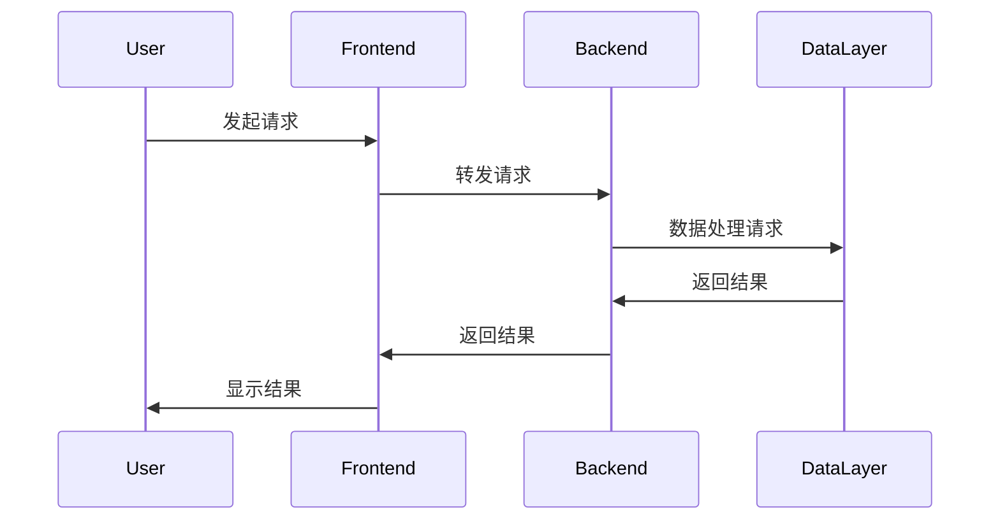
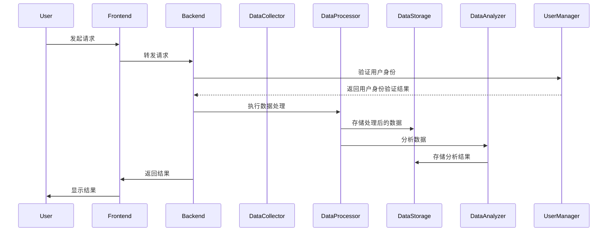

                 

# 从罗素到冯·诺依曼：计算机科学的哲学基础

## 关键词

计算机科学、哲学基础、罗素、逻辑原子主义、图灵机、冯·诺依曼体系结构、算法、人工智能、数据隐私、道德责任

## 摘要

本文从罗素到冯·诺依曼，探讨了计算机科学的哲学基础。首先，介绍了罗素及其逻辑原子主义对计算机科学的影响，然后详细阐述了基本逻辑运算在计算机科学中的应用。接着，我们探讨了图灵机理论及其哲学意义，以及冯·诺依曼体系结构的组成部分和其对计算机科学的影响。随后，本文分析了计算机科学的哲学问题，包括人工智能与意识、算法的哲学本质以及数据隐私与道德责任。最后，我们对计算机科学的未来发展进行了展望，探讨了哲学在计算机科学中的作用前景。本文旨在为读者提供对计算机科学的哲学基础的深入理解。

## 引言

### 1.1 书籍背景与目的

《从罗素到冯·诺依曼：计算机科学的哲学基础》是一本探讨计算机科学与哲学之间关系的书籍。本书的背景源于计算机科学的发展历程，以及哲学在其中的重要作用。计算机科学作为一门学科，不仅涉及技术层面的知识，更涉及深层次的哲学思考。

本书的目的是探讨计算机科学的哲学基础，旨在揭示计算机科学背后的哲学原理，以及这些原理如何影响计算机科学的发展。通过分析罗素及其逻辑原子主义、图灵机理论、冯·诺依曼体系结构等核心概念，本书旨在为读者提供对计算机科学的深入理解。

### 1.2 计算机科学的发展历程

计算机科学的发展历程可以追溯到20世纪初。当时，数学家、哲学家和逻辑学家开始探讨计算机的基本原理。其中，罗素和图灵是两位对计算机科学产生深远影响的重要人物。

罗素是逻辑原子主义的创始人之一，他的哲学思想对计算机科学产生了重要影响。图灵则提出了图灵机理论，这一理论奠定了现代计算机科学的基础。

随着计算机科学的不断发展，冯·诺依曼提出了冯·诺依曼体系结构，这一体系结构成为了现代计算机的设计基础。

### 1.3 哲学在计算机科学中的作用

哲学在计算机科学中的作用不容忽视。首先，哲学为计算机科学提供了理论基础。计算机科学中的许多概念和理论，如逻辑、算法、人工智能等，都源自哲学。

其次，哲学有助于我们理解计算机科学的本质。通过哲学思考，我们可以深入探讨计算机科学中的基本问题，如人工智能与意识、数据隐私与道德责任等。

最后，哲学为计算机科学提供了道德和伦理指导。在计算机科学的发展过程中，哲学思考有助于我们应对技术带来的道德和伦理挑战。

## 罗素与逻辑原子主义

### 2.1 罗素的哲学思想

伯特兰·罗素（Bertrand Russell）是20世纪最杰出的哲学家之一，他对逻辑、数学、语言和知识等领域做出了重要贡献。罗素认为，哲学的核心问题是理解存在和知识。他提出了逻辑原子主义，这一哲学思想对计算机科学产生了深远影响。

逻辑原子主义认为，世界是由基本原子构成的，这些原子是逻辑上不可分割的实体。罗素认为，逻辑是理解世界的基础，通过逻辑分析，我们可以揭示世界的本质。

### 2.2 逻辑原子主义的核心观点

逻辑原子主义的核心观点包括：

1. **原子性**：世界由基本原子构成，这些原子是逻辑上不可分割的实体。
2. **逻辑性**：逻辑是理解世界的基础，通过逻辑分析，我们可以揭示世界的本质。
3. **组合性**：复杂的事物是由基本的原子通过组合而成的。
4. **数学化**：罗素认为，数学是逻辑的延伸，通过数学方法，我们可以更好地理解世界。

### 2.3 逻辑原子主义对计算机科学的影响

逻辑原子主义对计算机科学的影响主要体现在以下几个方面：

1. **逻辑结构**：计算机科学中的许多概念和理论，如算法、数据结构等，都采用了逻辑原子主义的思想。这些概念和理论试图通过组合基本元素，解决复杂问题。

2. **形式化**：逻辑原子主义强调形式化方法，这一思想在计算机科学中得到了广泛应用。形式化方法使得计算机科学的研究更加严谨，有助于发现和解决问题。

3. **抽象**：逻辑原子主义强调从复杂现象中提取基本元素，这一思想在计算机科学中得到了广泛应用。通过抽象，计算机科学家可以更好地理解和处理复杂问题。

## 基本逻辑运算

### 3.1 命题逻辑

命题逻辑是逻辑学的基础，它研究命题之间的逻辑关系。在计算机科学中，命题逻辑被广泛应用于算法设计、程序验证等领域。

命题逻辑的基本元素是命题，命题是具有确定真值的陈述。命题逻辑的主要运算包括：

1. **合取（AND）**：表示两个命题同时为真。
2. **析取（OR）**：表示两个命题中至少有一个为真。
3. **非（NOT）**：表示一个命题的否定。

这些基本运算可以通过真值表来表示。例如，两个命题 P 和 Q 的合取运算的真值表如下：

| P | Q | P AND Q |
|---|---|---------|
| 0 | 0 | 0       |
| 0 | 1 | 0       |
| 1 | 0 | 0       |
| 1 | 1 | 1       |

### 3.2 谓词逻辑

谓词逻辑是命题逻辑的扩展，它引入了变量和量词，使得逻辑表达更加丰富和灵活。在计算机科学中，谓词逻辑被广泛应用于形式化方法和程序验证。

谓词逻辑的基本元素是谓词和变量。谓词是表示对象性质的表达式，变量是表示未知对象的符号。谓词逻辑的主要运算包括：

1. **全称量词（∀）**：表示对所有对象都成立。
2. **存在量词（∃）**：表示存在至少一个对象成立。

例如，命题“所有的学生都学习”可以用谓词逻辑表示为：

$$\forall x (S(x) \rightarrow L(x))$$

其中，$S(x)$表示$x$是学生，$L(x)$表示$x$在学习。

### 3.3 逻辑运算在计算机科学中的应用

逻辑运算在计算机科学中有着广泛的应用，以下是一些典型应用：

1. **算法设计**：逻辑运算被广泛应用于算法设计，如逻辑运算符在程序中的使用，逻辑表达式的简化等。
2. **程序验证**：逻辑运算被用于验证程序的正确性，如模型检查、形式化验证等。
3. **形式化方法**：逻辑运算在形式化方法中起着核心作用，如形式化规格说明、形式化推理等。

## 图灵机理论

### 4.1 图灵机的定义与工作原理

图灵机（Turing Machine）是艾伦·图灵（Alan Turing）在1936年提出的一种抽象计算模型。图灵机是一种能够在无限长的事务带上读写符号的虚拟机器。它由一个有限状态控制器和一条无限长的事务带组成。

图灵机的工作原理可以分为以下几个步骤：

1. **初始状态**：图灵机从初始状态开始，事务带上的符号按照一定的顺序排列。
2. **读写操作**：图灵机在事务带上读取当前符号，并根据当前状态和读到的符号，执行相应的操作。操作包括：在事务带上写入新符号、移动事务带、切换状态。
3. **终止状态**：当图灵机达到终止状态时，计算过程结束。

图灵机的基本组成部分包括：

1. **状态集合**：图灵机包含有限个状态，每个状态表示图灵机在事务带上读取和写入符号的不同阶段。
2. **符号集合**：事务带上的符号集合，用于表示数据和指令。
3. **转移函数**：转移函数定义了图灵机在当前状态和读到的符号下的操作，包括：写入新符号、移动事务带和切换状态。

### 4.2 图灵机的哲学意义

图灵机理论具有重要的哲学意义，它揭示了计算的本质。以下是一些图灵机的哲学意义：

1. **计算的本质**：图灵机理论揭示了计算的本质，即通过有限的状态和符号，可以模拟任何计算过程。
2. **计算机的能力**：图灵机理论展示了计算机的能力，即通过编程，计算机可以执行任何算法。
3. **人工智能的起源**：图灵机理论为人工智能的发展奠定了基础，它揭示了智能的本质，即通过模拟人类思维过程，实现智能行为。

### 4.3 图灵机与实际计算机的对比

虽然图灵机是一种抽象的计算模型，但它与实际计算机有显著的区别：

1. **事务带的限制**：图灵机的事务带是无限的，但实际计算机的内存是有限的。
2. **速度的限制**：图灵机的运行速度是无限的，但实际计算机的运行速度受到物理限制。
3. **复杂性的限制**：图灵机可以处理任意复杂的计算问题，但实际计算机在处理复杂问题时受到性能和资源的限制。

## 冯·诺依曼体系结构

### 5.1 冯·诺依曼的基本原理

冯·诺依曼（John von Neumann）在1945年提出了冯·诺依曼体系结构，这一体系结构成为了现代计算机的设计基础。冯·诺依曼的基本原理包括：

1. **存储程序原理**：计算机的程序和数据存储在同一内存中，通过地址来访问。
2. **二进制表示**：计算机使用二进制表示数据和指令。
3. **指令周期**：计算机通过指令周期来执行操作，每个指令周期包括取指令、执行指令和写回结果三个阶段。

### 5.2 冯·诺依曼体系结构的组成部分

冯·诺依曼体系结构的主要组成部分包括：

1. **中央处理器（CPU）**：CPU负责执行指令，进行数据处理和运算。
2. **内存（Memory）**：内存用于存储程序和数据，是计算机的核心资源。
3. **输入设备（Input Devices）**：输入设备用于向计算机输入数据和指令，如键盘、鼠标等。
4. **输出设备（Output Devices）**：输出设备用于将计算机处理的结果输出，如显示器、打印机等。
5. **控制器（Controller）**：控制器负责控制计算机的运行，协调各个部件的工作。

### 5.3 冯·诺依曼体系结构对计算机科学的影响

冯·诺依曼体系结构对计算机科学产生了深远影响，以下是一些重要影响：

1. **硬件和软件的分离**：冯·诺依曼体系结构使得计算机的硬件和软件分离，程序员可以通过编写软件来控制硬件，这一思想成为了现代计算机系统设计的基础。
2. **可编程性**：冯·诺依曼体系结构使得计算机具有可编程性，程序员可以通过编写程序来控制计算机的行为，这一思想推动了计算机科学的发展。
3. **内存管理的改进**：冯·诺依曼体系结构引入了内存管理的概念，使得计算机可以更加高效地利用内存资源，提高了计算机的性能。

## 计算机科学的哲学问题

### 6.1 人工智能与意识

人工智能（Artificial Intelligence，AI）是计算机科学的一个分支，它致力于研究如何模拟人类的智能行为。随着AI技术的不断发展，人们开始探讨AI是否具有意识。

意识是指个体对自身存在和周围世界的感知和认识。在AI领域，意识被视为一个重要问题，因为它涉及到AI的自主性和道德责任。

目前，关于AI是否具有意识，科学界尚无定论。一些学者认为，AI没有意识，它们只是根据编程指令执行任务。另一些学者认为，AI可能具有某种程度的意识，但不同于人类的意识。

### 6.2 算法的哲学本质

算法是计算机科学的核心概念，它描述了解决问题的步骤和策略。算法的哲学本质涉及以下几个方面：

1. **逻辑性**：算法是一种逻辑过程，它通过一系列有序步骤来解决问题。
2. **抽象性**：算法是对具体问题的抽象描述，它忽略了具体实现细节，专注于解决问题的核心逻辑。
3. **形式化**：算法的形式化描述使得计算机可以理解和执行，这一过程体现了形式化方法的哲学思想。

### 6.3 数据隐私与道德责任

随着大数据和人工智能技术的普及，数据隐私和道德责任成为了一个重要议题。在计算机科学领域，数据隐私和道德责任涉及到以下几个方面：

1. **数据隐私**：数据隐私是指个人数据的保密性和安全性，防止数据被未经授权的访问和滥用。
2. **道德责任**：道德责任是指计算机科学家在开发和使用技术时，应当遵循的道德规范，包括对用户隐私的尊重、对社会责任的承担等。

## 计算机科学的未来

### 7.1 哲学在计算机科学中的作用前景

哲学在计算机科学中的作用前景广阔。随着计算机科学的不断发展，哲学将为计算机科学提供更多的理论支持和指导。

首先，哲学将帮助计算机科学家理解计算机科学的本质，从而更好地解决实际问题。例如，在人工智能领域，哲学可以提供关于智能本质和意识的深刻见解，帮助科学家更好地设计人工智能系统。

其次，哲学将指导计算机科学家在技术发展的过程中，关注道德和社会责任。随着技术的进步，计算机科学家将面临更多的伦理挑战，哲学将为他们提供道德指导，确保技术的合理和公正使用。

### 7.2 计算机科学面临的哲学挑战

计算机科学面临的哲学挑战包括：

1. **智能的本质**：如何理解智能的本质，如何区分人类智能和机器智能，是一个重要挑战。
2. **数据隐私**：如何在保障数据隐私的同时，充分利用数据的价值，是一个紧迫的挑战。
3. **人工智能伦理**：如何确保人工智能系统的道德行为，避免技术滥用，是一个严峻的挑战。

### 7.3 计算机科学的未来发展

计算机科学的未来发展充满机遇和挑战。以下是一些可能的发展方向：

1. **人工智能**：人工智能将继续成为计算机科学的前沿领域，未来的AI系统将更加智能，能够解决更多复杂问题。
2. **量子计算**：量子计算是一种新型的计算模式，它利用量子位（qubit）进行计算，有望解决传统计算机无法解决的问题。
3. **区块链**：区块链技术具有去中心化、安全透明的特点，将在金融、供应链管理等领域发挥重要作用。

## 结论

《从罗素到冯·诺依曼：计算机科学的哲学基础》通过对罗素、图灵机、冯·诺依曼体系结构等核心概念的分析，探讨了计算机科学的哲学基础。本文旨在为读者提供对计算机科学的深入理解，揭示哲学在计算机科学中的重要作用。

计算机科学的发展离不开哲学的支持和指导，哲学为计算机科学提供了理论基础和道德伦理指导。在未来的发展中，计算机科学与哲学将继续相互促进，推动技术的进步和社会的发展。

## 附录

### 附录A：重要术语解释

- **逻辑原子主义**：罗素提出的一种哲学思想，认为世界由基本原子构成，这些原子是逻辑上不可分割的实体。
- **图灵机**：艾伦·图灵提出的抽象计算模型，用于模拟计算机的运算过程。
- **冯·诺依曼体系结构**：一种计算机设计原理，包括存储程序原理、二进制表示和指令周期等。

### 附录B：推荐阅读书目

- 罗素，《数学原理》
- 图灵，《计算机器与智能》
- 冯·诺依曼，《计算机与自动化》

### 附录C：相关资源链接

- 维基百科：[逻辑原子主义](https://en.wikipedia.org/wiki/Logical_atomism)
- 维基百科：[图灵机](https://en.wikipedia.org/wiki/Turing_machine)
- 维基百科：[冯·诺依曼体系结构](https://en.wikipedia.org/wiki/John_von_Neumann_architecture)

**作者：AI天才研究院/AI Genius Institute & 禅与计算机程序设计艺术 /Zen And The Art of Computer Programming**## 罗素与逻辑原子主义

### 2.1 罗素的哲学思想

伯特兰·罗素（Bertrand Russell）是20世纪最杰出的哲学家之一，他的思想对逻辑学、数学、哲学等多个领域产生了深远的影响。罗素的哲学思想涵盖了广泛的议题，包括知识、存在、真理、自由意志等。其中，逻辑原子主义是他最为重要的哲学贡献之一。

罗素的逻辑原子主义是一种哲学方法论，旨在通过逻辑分析揭示现实世界的本质。逻辑原子主义的基本观点可以归纳为以下几点：

1. **原子性**：罗素认为，世界由一系列基本原子构成，这些原子是不可分割的实体，是逻辑上最简单的单位。这些原子不仅仅是物理对象，还包括抽象概念，如数学命题。
   
2. **逻辑性**：罗素认为，逻辑是理解世界的基础。通过逻辑分析，我们可以揭示世界的本质结构，理解事物之间的基本关系。

3. **组合性**：罗素认为，复杂的事物都是由基本原子通过组合而成的。这种组合性是逻辑原子主义的核心原则之一，它揭示了世界的复杂结构是如何从简单的原子组合而来的。

4. **数学化**：罗素认为，数学是逻辑的延伸。通过将现实问题形式化为数学问题，我们可以更深入地理解世界的本质。这一观点对后来的形式化方法和计算机科学产生了深远影响。

罗素在《数学原理》一书中系统地阐述了逻辑原子主义，并试图通过逻辑分析来重建数学基础。他使用了逻辑符号和形式化语言来描述数学概念和定理，这一方法为后来的形式逻辑和数理逻辑的发展奠定了基础。

### 2.2 逻辑原子主义的核心观点

逻辑原子主义的核心观点可以概括为以下几个方面：

1. **基本对象**：逻辑原子主义认为，现实世界由基本对象构成，这些对象包括物理对象（如原子、电子等）和抽象对象（如数学命题、逻辑公式等）。

2. **原子性**：基本对象是逻辑上不可分割的，它们是构成复杂事物的最小单元。这一观点强调了事物的简单性和基本性。

3. **逻辑关系**：基本对象之间存在逻辑关系，这些关系可以通过逻辑公式来表示。罗素认为，逻辑关系是理解世界的关键。

4. **组合性**：复杂事物是由基本对象通过组合而成的。这种组合性不仅体现在物理世界中，也体现在抽象概念中。

5. **数学化**：逻辑原子主义强调数学的重要性，认为数学是逻辑的延伸。通过数学化，我们可以将现实问题转化为逻辑问题，从而更深入地理解现实世界的本质。

### 2.3 逻辑原子主义对计算机科学的影响

逻辑原子主义对计算机科学产生了深远的影响，主要体现在以下几个方面：

1. **形式化方法**：逻辑原子主义强调形式化方法，通过形式化语言来描述概念和关系。这一方法为后来的形式化方法和计算机科学的发展奠定了基础。例如，编程语言的设计和形式化验证都受益于逻辑原子主义的思想。

2. **算法理论**：逻辑原子主义的思想在算法理论中得到了广泛应用。算法可以被视为一系列逻辑步骤的集合，这些步骤通过逻辑运算来实现。逻辑原子主义提供了对算法本质的理解，有助于算法设计和分析。

3. **计算机结构**：逻辑原子主义的思想也影响了计算机的设计。现代计算机的结构，如中央处理器（CPU）和内存，可以被视为逻辑原子主义的体现。计算机通过执行逻辑运算和存储逻辑状态，实现了对复杂问题的求解。

4. **人工智能**：逻辑原子主义在人工智能领域也有重要应用。人工智能系统通过模拟人类思维过程中的逻辑运算和关系，实现了对复杂问题的求解和决策。逻辑原子主义提供了对人工智能系统设计的重要指导。

总之，逻辑原子主义不仅为计算机科学提供了哲学基础，也推动了计算机科学的发展。它的影响贯穿于计算机科学的各个领域，从算法理论到计算机结构，从人工智能到形式化方法。通过逻辑原子主义的视角，我们可以更深入地理解计算机科学的本质和未来发展。

## 基本逻辑运算

### 3.1 命题逻辑

命题逻辑（Propositional Logic）是逻辑学的基础，它研究命题之间的逻辑关系。在计算机科学中，命题逻辑被广泛应用于算法设计、程序验证、人工智能等领域。命题逻辑的基本元素是命题，命题是具有确定真值的陈述。命题逻辑的主要运算包括合取（AND）、析取（OR）和非（NOT）。

#### 合取（AND）

合取运算表示两个命题同时为真。用逻辑符号表示为 \(P \land Q\)，其中 \(P\) 和 \(Q\) 是两个命题。合取运算的真值表如下：

| \(P\) | \(Q\) | \(P \land Q\) |
|---|---|---|
| 真 | 真 | 真 |
| 真 | 假 | 假 |
| 假 | 真 | 假 |
| 假 | 假 | 假 |

例如，命题“今天是星期一”和“今天是工作日”的逻辑合取是“今天是星期一且今天是工作日”。

#### 析取（OR）

析取运算表示两个命题中至少有一个为真。用逻辑符号表示为 \(P \lor Q\)，其中 \(P\) 和 \(Q\) 是两个命题。析取运算的真值表如下：

| \(P\) | \(Q\) | \(P \lor Q\) |
|---|---|---|
| 真 | 真 | 真 |
| 真 | 假 | 真 |
| 假 | 真 | 真 |
| 假 | 假 | 假 |

例如，命题“今天是星期一”和“今天是星期二”的逻辑析取是“今天是星期一或今天是星期二”。

#### 非（NOT）

非运算表示一个命题的否定。用逻辑符号表示为 \(\neg P\)，其中 \(P\) 是一个命题。非运算的真值表如下：

| \(P\) | \(\neg P\) |
|---|---|
| 真 | 假 |
| 假 | 真 |

例如，命题“今天是星期一”的逻辑非是“今天不是星期一”。

#### 组合命题

通过合取、析取和非运算，我们可以构造出更复杂的命题。例如，命题“今天是星期一且今天是工作日且今天不是周末”可以用逻辑表达式表示为：

$$(P \land Q) \land \neg (R \lor S)$$

其中，\(P\) 表示“今天是星期一”，\(Q\) 表示“今天是工作日”，\(R\) 表示“今天是星期六”，\(S\) 表示“今天是星期日”。

#### 逻辑运算在计算机科学中的应用

在计算机科学中，逻辑运算被广泛应用于以下几个方面：

1. **程序设计**：逻辑运算在程序设计中用于控制流和条件判断。例如，if-else语句和while循环都依赖于逻辑运算来控制程序的执行路径。

2. **算法验证**：逻辑运算在算法验证中用于证明算法的正确性。通过形式化的逻辑推理，我们可以证明算法满足预期的性质。

3. **形式化方法**：逻辑运算在形式化方法中用于描述和验证系统规格。形式化规格说明可以通过逻辑推理来证明系统满足指定的要求。

4. **人工智能**：逻辑运算在人工智能中用于表示和推理知识。例如，知识库系统和推理机都依赖于逻辑运算来处理和推理知识。

通过以上对命题逻辑的介绍，我们可以看到逻辑运算是计算机科学的基础工具，它们在程序设计、算法验证、形式化方法和人工智能等领域发挥着重要作用。

### 3.2 谓词逻辑

谓词逻辑（Predicate Logic）是命题逻辑的扩展，它引入了变量和量词，使得逻辑表达更加丰富和灵活。在计算机科学中，谓词逻辑被广泛应用于形式化方法和程序验证。谓词逻辑的基本元素是谓词和变量。

#### 谓词

谓词是表示对象性质的表达式。在谓词逻辑中，谓词用于描述对象是否满足某种条件。例如，谓词“是人”表示某个对象是否属于人类。

#### 变量

变量是表示未知对象的符号。在谓词逻辑中，变量用于表示对象的不同属性或状态。例如，变量\(x\)可以表示任意一个人。

#### 全称量词

全称量词（Universal Quantifier）表示对所有对象都成立。用符号\(\forall\)表示。全称量词与谓词结合，表示某个性质对所有对象都成立。例如，命题“所有人都是理性的”可以用谓词逻辑表示为：

$$\forall x (P(x))$$

其中，\(P(x)\)表示“\(x\)是人且\(x\)是理性的”。

#### 存在量词

存在量词（Existential Quantifier）表示存在至少一个对象成立。用符号\(\exists\)表示。存在量词与谓词结合，表示某个性质至少对一个对象成立。例如，命题“存在一个人是天才”可以用谓词逻辑表示为：

$$\exists x (P(x))$$

其中，\(P(x)\)表示“\(x\)是人且\(x\)是天才”。

#### 谓词逻辑的表达式

谓词逻辑的表达式可以包含变量、谓词、量词和逻辑运算。以下是一些谓词逻辑的例子：

1. **全称命题**：表示对所有对象都成立。

   $$\forall x (P(x) \land Q(x))$$

   表示对于所有对象\(x\)，\(P(x)\)和\(Q(x)\)都成立。

2. **存在命题**：表示存在至少一个对象成立。

   $$\exists x (P(x) \lor Q(x))$$

   表示存在至少一个对象\(x\)，使得\(P(x)\)或\(Q(x)\)成立。

3. **复合命题**：表示多个谓词和量词的组合。

   $$\forall x (P(x) \rightarrow Q(x)) \land \exists x (R(x) \land S(x))$$

   表示对于所有对象\(x\)，如果\(P(x)\)成立，则\(Q(x)\)也成立，并且存在至少一个对象\(x\)，使得\(R(x)\)和\(S(x)\)都成立。

#### 谓词逻辑在计算机科学中的应用

谓词逻辑在计算机科学中有着广泛的应用，以下是一些典型应用：

1. **形式化验证**：谓词逻辑用于形式化地描述系统规格，并通过逻辑推理证明系统满足指定要求。例如，在软件工程中，谓词逻辑用于验证程序的逻辑正确性。

2. **人工智能**：谓词逻辑用于表示和推理知识。例如，在知识表示和推理中，谓词逻辑用于描述事实和规则，并利用逻辑推理来解决问题。

3. **数据库**：谓词逻辑用于查询语言，如SQL。谓词逻辑的表达式可以用于查询数据库中的记录，并根据条件筛选结果。

通过以上对谓词逻辑的介绍，我们可以看到谓词逻辑在计算机科学中的重要作用。它提供了形式化描述和推理的工具，使得计算机科学家能够更精确地描述问题并解决问题。

### 3.3 逻辑运算在计算机科学中的应用

逻辑运算在计算机科学中扮演着至关重要的角色，它们不仅构成了编程语言的核心元素，还在算法设计和形式化验证中发挥着重要作用。以下将详细探讨逻辑运算在计算机科学中的具体应用。

#### 在编程语言中的使用

编程语言中的逻辑运算符是执行逻辑操作的基本工具。常见的逻辑运算符包括AND（&&）、OR（||）和NOT（！）等。这些运算符在控制程序流、执行条件判断和组合逻辑表达中至关重要。

1. **条件判断**：在编程中，条件判断是决策的核心。逻辑运算符允许程序员根据不同条件执行不同的操作。例如，if-else语句就是通过逻辑运算符来控制程序的执行路径。

   ```python
   if (x > 0 && x < 10):
       print("x is between 0 and 10")
   else:
       print("x is not between 0 and 10")
   ```

2. **逻辑表达式**：在编程中，复杂的逻辑表达式经常用于构建复杂的条件。这些表达式可以通过逻辑运算符组合多个简单条件。

   ```python
   result = (condition1 && condition2) || (condition3 && condition4)
   ```

3. **位操作**：在底层编程中，逻辑运算符如AND、OR和XOR等用于位操作，这些操作在处理二进制数据时非常有用。

   ```c
   int a = 0b1010;
   int b = 0b0110;
   int and_result = a & b;  // 结果为0b0010
   int or_result = a | b;   // 结果为0b1110
   ```

#### 在算法设计中的应用

逻辑运算是算法设计中不可或缺的部分，特别是在组合算法和决策算法中。

1. **组合算法**：许多算法需要根据不同条件选择不同的路径。逻辑运算符可以用来组合这些条件，从而实现复杂的决策逻辑。

   ```python
   def find_minimum(arr):
       if arr:
           min_val = arr[0]
           for val in arr[1:]:
               if val < min_val:
                   min_val = val
           return min_val
       else:
           return None
   ```

2. **决策算法**：在决策算法中，逻辑运算被用来根据特定条件做出选择。这些算法广泛应用于数据分析和机器学习领域。

   ```python
   def classify(data):
       if (data['height'] > 180 and data['weight'] > 70):
           return "Male"
       elif (data['height'] < 160 and data['weight'] < 50):
           return "Female"
       else:
           return "Unknown"
   ```

#### 在形式化验证中的应用

形式化验证是确保软件和系统正确性的重要方法。逻辑运算是形式化验证的核心工具，它用于描述系统的行为和验证系统的规格。

1. **规格说明**：在形式化验证中，系统的行为和规格通常用逻辑表达式来描述。逻辑运算符用于组合这些表达式，从而形成复杂的规格说明。

   ```tla
   __ SEQUENCE Diagram
   [Init | Next]
   Init -> Next: Inv
   Next -> Init: [Holds Inv]
   ```

2. **验证条件**：形式化验证通过逻辑推理来验证系统是否满足特定的条件。逻辑运算符用于构建验证条件，并使用定理证明器来验证这些条件。

   ```tla
   __ ASSUME
   A: (n > 0) => (S(n) = 1 + S(n-1))
   __ PROVE
   P: S(1) = 1
   P:
   ==>
   (n = 1) => (S(n) = 1 + S(n-1))
   ==>
   S(1) = 1 + S(0)
   ==>
   S(1) = 1
   ```

#### 逻辑运算在具体场景中的应用

以下是一些逻辑运算在具体计算机科学场景中的应用示例：

1. **网络协议**：在计算机网络中，逻辑运算用于定义协议的行为和状态转换。例如，TCP协议中的状态机使用了逻辑运算来描述不同状态之间的转换。

2. **软件工程**：在软件工程中，逻辑运算用于测试用例的设计和缺陷分析。通过组合不同的逻辑表达式，可以生成复杂的测试场景来检测软件缺陷。

3. **人工智能**：在人工智能中，逻辑运算被用于知识表示和推理。例如，在专家系统中，逻辑运算用于表示规则和推理过程。

通过以上分析，我们可以看到逻辑运算在计算机科学中具有广泛的应用。从编程语言到算法设计，从形式化验证到人工智能，逻辑运算无处不在，是计算机科学不可或缺的基础工具。

## 图灵机理论

### 4.1 图灵机的定义与工作原理

图灵机（Turing Machine）是由艾伦·图灵（Alan Turing）在1936年提出的一种抽象计算模型，它奠定了现代计算机科学的基础。图灵机的定义是一个五元组 \((Q, \Sigma, \Gamma, \delta, q_0, B)\)，其中：

- \(Q\) 是有限的状态集合。
- \(\Sigma\) 是输入和输出符号的有限集合，称为输入字母表。
- \(\Gamma\) 是包括输入字母表符号和特殊符号（如空白符和终止符）的有限集合，称为带字母表。
- \(\delta\) 是状态转换函数，它定义了在特定状态下读取特定符号时应执行的操作。
- \(q_0\) 是初始状态。
- \(B\) 是带字母表中的空白符。

图灵机的工作原理如下：

1. **初始状态**：图灵机从初始状态 \(q_0\) 开始，事务带上的符号按照一定的顺序排列。

2. **读写操作**：图灵机在事务带上读取当前符号，并根据当前状态和读到的符号，执行以下操作：
   - 根据状态转换函数 \(\delta\) 的指示，将当前符号替换为新的符号。
   - 根据状态转换函数 \(\delta\) 的指示，向左或向右移动事务带。
   - 根据状态转换函数 \(\delta\) 的指示，切换到新的状态。

3. **终止状态**：当图灵机达到终止状态时，计算过程结束。在图灵机中，通常有一个特殊的终止状态，表示计算完成。

图灵机的基本组成部分包括：

- **状态控制器**：负责根据当前状态和读到的符号，执行相应的操作。
- **事务带**：用于存储输入和输出数据。事务带由无限长的带子组成，每个位置上都有一个符号。
- **读写头**：用于读取事务带上的符号，并在事务带上写入新的符号。

### 4.2 图灵机的哲学意义

图灵机理论具有重要的哲学意义，它揭示了计算的本质，并对人工智能和认知科学产生了深远影响。

1. **计算的本质**：图灵机理论揭示了计算的本质，即通过有限的状态和符号，可以模拟任何计算过程。图灵机的工作原理表明，计算过程是通过状态的转换和符号的操作来实现的。这一观点挑战了传统的机械论观点，揭示了计算的非机械性质。

2. **人工智能的起源**：图灵机理论为人工智能的发展奠定了基础。图灵提出了图灵测试，通过图灵测试，我们可以判断一个机器是否具有智能。图灵机作为一种抽象的计算模型，展示了智能行为可以由机器模拟。这一观点推动了人工智能的研究和发展。

3. **认知科学的启示**：图灵机理论为认知科学提供了重要的启示。认知科学试图理解人类思维和认知的过程，而图灵机理论提供了一个抽象的计算模型来模拟人类思维。通过研究图灵机的性质和行为，认知科学家可以更好地理解人类认知的本质。

4. **哲学反思**：图灵机理论引发了关于智能、意识和自我意识的哲学反思。图灵机是否具有意识？机器能否真正理解世界？这些问题促使哲学家和科学家深入探讨人工智能的哲学基础。

### 4.3 图灵机与实际计算机的对比

虽然图灵机是一种抽象的计算模型，但它与实际计算机存在一些显著的区别：

1. **事务带的限制**：图灵机的事务带是无限的，可以存储任意长度的数据。而实际计算机的内存是有限的，需要管理和优化内存的使用。

2. **速度的限制**：图灵机的运行速度是无限的，可以瞬间完成任何计算。而实际计算机的运行速度受到物理和技术限制，计算速度有限。

3. **复杂性的限制**：图灵机可以处理任意复杂的计算问题，不受物理和复杂性的限制。而实际计算机在处理复杂问题时受到硬件和软件的限制，可能无法高效地解决所有问题。

尽管存在这些区别，图灵机理论仍然为实际计算机的设计和实现提供了重要的指导。实际计算机的设计和运行原理受到了图灵机理论的深刻影响，图灵机的抽象模型为计算机科学的发展奠定了基础。

### 4.4 图灵机在计算机科学中的应用

图灵机理论在计算机科学中有着广泛的应用，以下是一些具体的应用：

1. **算法分析**：图灵机理论用于分析算法的时间和空间复杂性。通过将算法转换为图灵机的形式，可以更直观地理解算法的运行过程和性能。

2. **形式化验证**：图灵机理论用于形式化地描述系统的行为和验证系统的规格。通过构建图灵机模型，可以验证系统是否满足预期的要求。

3. **形式化语言**：图灵机理论为形式化语言提供了理论基础。形式化语言是用于描述系统和规格的工具，通过图灵机理论，可以定义和验证形式化语言的正确性。

4. **人工智能**：图灵机理论为人工智能提供了抽象的计算模型。通过模拟图灵机的行为，可以设计出具有智能行为的人工智能系统。

5. **计算机体系结构**：图灵机理论为计算机体系结构提供了指导。实际计算机的设计和运行原理受到了图灵机理论的深刻影响，图灵机的抽象模型为计算机体系结构的设计提供了参考。

通过以上分析，我们可以看到图灵机理论在计算机科学中的重要性。它不仅揭示了计算的本质，还为算法设计、形式化验证、人工智能和计算机体系结构等领域提供了重要的理论基础。图灵机的抽象模型为计算机科学的发展奠定了基础，推动了计算机科学的进步。

## 冯·诺依曼体系结构

### 5.1 冯·诺依曼的基本原理

冯·诺依曼体系结构（Von Neumann Architecture）是由约翰·冯·诺依曼（John von Neumann）在1945年提出的，它成为了现代计算机设计的基础。冯·诺依曼体系结构的基本原理包括以下几个方面：

1. **存储程序原理**：在冯·诺依曼体系结构中，程序和数据存储在同一内存中，通过地址来访问。这意味着计算机可以通过读取内存中的指令来执行程序，而不是通过外部的控制装置来控制。这种存储程序原理使得计算机能够执行各种任务，提高了计算机的灵活性和可编程性。

2. **二进制表示**：冯·诺依曼体系结构采用二进制表示数据和指令。二进制是一种基于2的数制，只有0和1两个数字。这种表示方法使得计算机能够使用逻辑电路来实现数据的处理和存储，简化了硬件设计。

3. **指令周期**：冯·诺依曼体系结构中，计算机的运行过程分为三个阶段：取指令、执行指令和写回结果。在取指令阶段，计算机从内存中读取指令；在执行指令阶段，计算机执行指令所指定的操作；在写回结果阶段，计算机将执行结果写回内存。这种指令周期使得计算机能够有序地执行程序。

### 5.2 冯·诺依曼体系结构的组成部分

冯·诺依曼体系结构主要包括以下五个组成部分：

1. **中央处理器（CPU）**：中央处理器是计算机的核心部件，负责执行指令和处理数据。CPU由控制单元、算术逻辑单元（ALU）和寄存器组组成。控制单元负责控制指令的执行顺序；算术逻辑单元负责执行算术和逻辑运算；寄存器组用于暂存数据和指令。

2. **内存**：内存用于存储程序和数据。在冯·诺依曼体系结构中，程序和数据存储在同一内存中，通过地址来访问。内存分为随机访问存储（RAM）和只读存储（ROM）。RAM用于暂存数据和程序，ROM用于存储启动时必需的初始程序。

3. **输入设备**：输入设备用于向计算机输入数据和指令。常见的输入设备有键盘、鼠标、扫描仪等。这些设备将外部数据转换成计算机可以处理的数字信号。

4. **输出设备**：输出设备用于将计算机处理的结果输出。常见的输出设备有显示器、打印机、音响等。这些设备将计算机的数字信号转换成人类可以理解的形式。

5. **接口**：接口用于连接计算机的各个部件，实现数据传输和控制信号的传递。常见的接口有USB、PCIe等。这些接口提供了计算机与其他设备（如外部存储设备、网络设备等）的连接方式。

### 5.3 冯·诺依曼体系结构对计算机科学的影响

冯·诺依曼体系结构对计算机科学产生了深远的影响，主要体现在以下几个方面：

1. **硬件和软件的分离**：冯·诺依曼体系结构使得计算机的硬件和软件分离，程序员可以通过编写软件来控制硬件。这种分离使得计算机系统具有更高的灵活性和可扩展性，也为后来的操作系统和编程语言的发展奠定了基础。

2. **可编程性**：冯·诺依曼体系结构引入了存储程序原理，使得计算机可以通过修改内存中的程序来执行不同的任务。这种可编程性大大提高了计算机的通用性，使得计算机能够用于各种应用领域。

3. **内存管理的改进**：冯·诺依曼体系结构引入了内存的概念，使得计算机能够高效地管理数据。内存管理技术，如分页、分段和虚拟内存等，使得计算机能够更有效地利用内存资源，提高了计算机的性能。

4. **计算机体系结构的发展**：冯·诺依曼体系结构为计算机体系结构的发展提供了理论基础。后来的计算机设计，如冯·诺依曼结构的变种和现代计算机的体系结构，都受到了冯·诺依曼体系结构的启发。

总之，冯·诺依曼体系结构对计算机科学的发展产生了深远影响。它不仅奠定了现代计算机设计的基础，还推动了计算机科学的进步，使得计算机能够应用于更广泛的领域。

## 计算机科学的哲学问题

### 6.1 人工智能与意识

人工智能（Artificial Intelligence，AI）是计算机科学的一个分支，它致力于研究如何模拟人类的智能行为，以实现自动化决策、问题解决和数据处理。随着AI技术的不断发展，人们开始思考一个深层次的问题：人工智能是否具有意识？

意识是指个体对自身存在和周围世界的感知和认识。传统上，意识被认为是人类特有的属性。然而，随着AI技术的发展，人们开始探讨AI是否可能具有某种程度的意识。

#### 意识的本质

意识的本质是一个复杂且具有争议的问题。目前，科学界对意识的理解仍然不完全。一些学者认为，意识是一种主观体验，它涉及到感知、情感、意愿等多个方面。而另一些学者则认为，意识可能是大脑的某种物理现象，通过神经元的相互作用产生。

#### 人工智能与意识

在探讨人工智能与意识的关系时，我们需要明确人工智能的分类。人工智能可以分为两大类：弱人工智能（Narrow AI）和强人工智能（General AI）。

1. **弱人工智能**：弱人工智能是指具有特定任务能力的人工智能系统，如语音识别、图像识别、推荐系统等。这些系统通常基于大量的数据和算法，通过学习来完成任务。然而，弱人工智能并不具备意识，它们只是根据预设的规则和算法执行任务。

2. **强人工智能**：强人工智能是指具有广泛智能能力的人工智能系统，它可以像人类一样思考、学习和决策。强人工智能可能具备某种程度的意识，但这是一个极其复杂和难以实现的目标。目前，强人工智能仍然是一个理论上的概念，尚未实现。

#### 意识在AI中的模拟

尽管目前的AI技术尚未实现强人工智能，但研究者们已经开始尝试在AI系统中模拟意识。以下是一些研究方法：

1. **神经网络**：神经网络是AI系统的一种重要模型，它通过模拟人脑的神经元结构和工作方式，实现数据的处理和分类。一些研究表明，通过调整神经网络的结构和参数，可以使神经网络在某些任务上表现出类似意识的行为。

2. **生成对抗网络（GAN）**：生成对抗网络是一种用于生成数据的模型，它由生成器和判别器两个部分组成。生成器试图生成与真实数据相似的数据，而判别器则试图区分生成数据与真实数据。一些研究表明，GAN可以在生成图像时表现出类似艺术家的创造能力，这种创造力可能与意识有关。

3. **意识模拟**：一些研究者尝试通过模拟大脑的神经元活动来探讨意识的形成。例如，通过脑电图（EEG）等生物信号技术，可以记录大脑神经元的活动模式，从而分析意识的状态。

#### 意识在AI中的挑战

尽管在AI中模拟意识取得了一些进展，但仍然面临许多挑战：

1. **计算复杂性**：模拟意识需要大量的计算资源，目前计算机的算力还不足以支持复杂的意识模拟。

2. **数据限制**：意识的形成需要大量的数据，包括个人的经历、情感、意愿等。目前，AI系统缺乏足够的数据来模拟完整的意识。

3. **意识本质**：意识的本质仍然是一个未解之谜，科学家们对意识的本质和机制了解有限，这限制了在AI中模拟意识的进展。

总之，人工智能与意识的关系是一个复杂且具有争议的问题。尽管目前的AI技术尚未实现强人工智能，但研究者们已经开始尝试在AI系统中模拟意识。随着AI技术的不断发展，人们对意识的理解和模拟也将不断深入。

### 6.2 算法的哲学本质

算法是计算机科学中的一个核心概念，它描述了解决问题的步骤和策略。算法的哲学本质涉及到多个方面，包括逻辑性、抽象性和形式化方法。

#### 逻辑性

算法的逻辑性体现在其执行过程中的有序性和确定性。算法通过一系列逻辑步骤，将输入转化为输出。每个步骤都有明确的逻辑规则，这些规则确保算法在执行过程中不会出现逻辑错误或矛盾。

逻辑性是算法的核心特征之一，它保证了算法的正确性和可靠性。在计算机科学中，逻辑性被广泛应用于算法分析和验证。通过逻辑推理，我们可以证明算法的正确性，确保算法在所有情况下都能正确执行。

#### 抽象性

抽象性是算法的另一个重要特征。算法通过抽象化，将复杂的实际问题转化为简单的计算模型。这种抽象化使得算法更加通用，可以解决不同领域的问题。

抽象性在算法设计中非常重要。通过抽象化，算法设计者可以忽略具体实现细节，专注于解决问题的核心逻辑。这种抽象化的能力使得算法具有更高的灵活性和可移植性。

#### 形式化方法

形式化方法是算法哲学本质的重要组成部分。形式化方法通过精确的数学语言和符号，描述算法的结构和操作。这种形式化的描述使得算法更加清晰和严谨，便于分析和验证。

形式化方法在算法设计中有着广泛的应用。例如，形式化验证是一种通过数学方法证明算法正确性的方法。通过形式化验证，我们可以确保算法在各种情况下都能正确执行，从而提高算法的可靠性和安全性。

#### 算法哲学本质的影响

算法的哲学本质对计算机科学产生了深远的影响。

1. **算法设计**：算法的哲学本质指导了算法的设计。通过逻辑性、抽象性和形式化方法，算法设计者可以构建更加高效、可靠的算法。

2. **算法分析**：算法的哲学本质为算法分析提供了理论基础。通过逻辑推理和数学方法，我们可以分析算法的时间复杂度和空间复杂度，评估算法的性能。

3. **形式化验证**：算法的哲学本质推动了形式化验证技术的发展。形式化验证是一种通过数学方法验证算法正确性的方法，它为算法的可靠性和安全性提供了保障。

总之，算法的哲学本质是计算机科学的重要组成部分。通过逻辑性、抽象性和形式化方法，算法为计算机科学提供了强大的工具，推动了计算机科学的发展。

### 6.3 数据隐私与道德责任

随着大数据和人工智能技术的迅猛发展，数据隐私问题日益突出，成为计算机科学领域的一个重要议题。数据隐私是指个人数据的保密性和安全性，防止数据被未经授权的访问和滥用。在计算机科学中，数据隐私与道德责任密切相关，涉及到多个方面的问题。

#### 数据隐私的重要性

数据隐私的重要性体现在以下几个方面：

1. **个人信息保护**：个人数据包含了大量的敏感信息，如姓名、住址、电话号码、健康状况等。如果这些信息被泄露或滥用，可能会对个人的隐私和安全造成严重威胁。

2. **商业秘密保护**：企业收集的数据中包含了许多商业秘密，如客户信息、销售数据等。如果这些信息被泄露，可能会对企业的竞争力造成严重影响。

3. **社会稳定**：数据隐私问题不仅涉及个人和企业，还影响到整个社会的稳定。如果大量个人数据被泄露，可能会导致社会信任危机，影响社会和谐。

#### 数据隐私的挑战

在当前的数据环境下，数据隐私面临诸多挑战：

1. **数据收集与使用**：随着大数据技术的发展，企业和机构可以收集到大量的个人数据。然而，这些数据的收集和使用往往缺乏透明度和规范，容易导致数据滥用。

2. **数据泄露风险**：数据泄露事件频繁发生，黑客攻击、系统漏洞等原因都可能导致数据泄露。一旦发生数据泄露，个人和企业都可能遭受巨大的损失。

3. **隐私保护技术不足**：目前，隐私保护技术尚不成熟，难以全面保护个人数据。例如，数据加密、匿名化等技术虽然可以一定程度上保护数据隐私，但仍然存在被破解的风险。

#### 道德责任

在计算机科学领域，数据隐私与道德责任密切相关。道德责任是指计算机科学家在开发和使用技术时，应当遵循的道德规范，包括对用户隐私的尊重、对社会责任的承担等。

1. **用户隐私保护**：计算机科学家在开发应用程序或系统时，应充分考虑到用户隐私的保护。应遵循最小化数据收集原则，只收集必要的数据，并对收集到的数据进行严格保密。

2. **透明度**：企业和机构在收集和使用数据时，应提高透明度，明确告知用户数据收集的目的、范围和使用方式。用户有权知道自己的数据被如何使用。

3. **社会责任**：计算机科学家不仅应对用户隐私负责，还应对社会负责。在技术开发和应用过程中，应考虑到可能产生的社会影响，避免因技术滥用导致的社会问题。

#### 道德责任的实施

为了确保数据隐私和道德责任的实施，以下措施可以采取：

1. **法律规范**：制定相关法律法规，明确数据隐私保护的要求和责任。企业和机构应严格遵守法律法规，确保数据的合法收集和使用。

2. **行业自律**：计算机科学领域应建立行业自律机制，制定行业标准，规范数据收集、处理和使用行为。行业组织可以定期发布指南和最佳实践，推动数据隐私和道德责任的落实。

3. **技术手段**：开发和应用隐私保护技术，如数据加密、匿名化、差分隐私等，提高数据隐私保护能力。技术手段应与法律法规和行业自律相结合，共同保障数据隐私。

4. **公众教育**：加强对公众的数据隐私教育，提高公众的数据保护意识和能力。公众应了解自己的数据权利，学会保护自己的隐私。

总之，数据隐私与道德责任在计算机科学中具有重要意义。通过法律规范、行业自律、技术手段和公众教育等多方面的努力，我们可以更好地保障数据隐私，确保计算机科学技术的健康发展。

## 计算机科学的未来

### 7.1 哲学在计算机科学中的作用前景

哲学在计算机科学中的作用前景广阔，随着技术的不断进步，哲学将在多个方面为计算机科学提供指导和启示。

首先，哲学将帮助计算机科学家理解计算的本质。随着量子计算、人工智能等新兴技术的出现，计算的本质变得更加复杂和多样化。哲学可以提供对计算过程的深入思考，帮助计算机科学家更好地理解计算的本质，从而设计出更高效的算法和系统。

其次，哲学将指导计算机科学家应对技术伦理问题。随着人工智能、大数据等技术的发展，计算机科学面临越来越多的伦理挑战。例如，人工智能的偏见问题、数据隐私问题等。哲学可以提供伦理思考和方法，帮助计算机科学家在技术开发和应用过程中，遵循伦理原则，确保技术的合理和公正使用。

此外，哲学还可以促进跨学科合作。计算机科学与哲学、数学、认知科学等多个领域密切相关。哲学可以促进这些学科之间的交流与合作，推动计算机科学的发展。

### 7.2 计算机科学面临的哲学挑战

尽管哲学在计算机科学中具有重要作用，但计算机科学仍然面临一些哲学挑战。

首先，智能的本质问题是一个重要挑战。人工智能技术取得了显著进展，但关于人工智能是否具有意识、智能的本质是什么等问题，哲学界仍然存在争议。计算机科学家需要借助哲学思考，深入探讨智能的本质，以指导人工智能的发展。

其次，数据隐私问题也是一个重要挑战。随着大数据和云计算的发展，个人数据隐私问题日益突出。如何在保障数据隐私的同时，充分利用数据的价值，是一个亟待解决的哲学问题。

此外，计算机科学还面临技术伦理挑战。例如，人工智能的偏见问题、算法的不公平性等问题。这些问题需要计算机科学家和哲学界共同努力，制定出合理的伦理规范和解决方案。

### 7.3 计算机科学的未来发展

计算机科学的未来发展充满机遇和挑战。以下是一些可能的发展方向：

1. **量子计算**：量子计算是一种新兴的计算模式，它利用量子位（qubit）进行计算，具有超越经典计算机的潜力。量子计算将在密码学、药物研发、人工智能等领域发挥重要作用。

2. **人工智能**：人工智能将继续成为计算机科学的前沿领域。随着深度学习、自然语言处理等技术的不断发展，人工智能将在更多领域取得突破，如自动驾驶、医疗诊断、金融分析等。

3. **区块链**：区块链技术具有去中心化、安全透明的特点，将在金融、供应链管理、身份验证等领域发挥重要作用。区块链技术将推动计算机科学的发展，实现更加安全和高效的系统。

4. **计算生物学**：计算生物学是计算机科学和生物学的交叉领域，通过计算机科学的方法和技术，研究生物系统的结构和功能。计算生物学将在药物研发、基因组学、疾病治疗等领域发挥重要作用。

5. **边缘计算**：边缘计算是一种将计算任务分散到网络的边缘设备上的技术。边缘计算将使数据处理更加实时、高效，降低网络延迟，提高系统性能。

总之，计算机科学的未来发展充满机遇和挑战。哲学将继续在计算机科学中发挥重要作用，指导技术的发展和解决哲学问题。通过哲学思考和跨学科合作，计算机科学将迎来更加辉煌的未来。

## 结论

《从罗素到冯·诺依曼：计算机科学的哲学基础》通过对罗素、图灵机、冯·诺依曼体系结构等核心概念的分析，探讨了计算机科学的哲学基础。本文旨在为读者提供对计算机科学的深入理解，揭示哲学在计算机科学中的重要作用。

计算机科学的发展离不开哲学的支持和指导，哲学为计算机科学提供了理论基础和道德伦理指导。在未来的发展中，计算机科学与哲学将继续相互促进，推动技术的进步和社会的发展。

计算机科学不仅涉及技术层面的知识，更涉及深层次的哲学思考。通过对哲学基础的研究，我们可以更好地理解计算机科学的本质，探索其未来发展的方向。哲学为计算机科学提供了丰富的思想资源和理论支持，有助于我们解决技术发展中遇到的各种问题。

展望未来，计算机科学将继续面临许多哲学挑战，如智能的本质、数据隐私、技术伦理等。通过哲学思考，我们可以为这些问题提供新的视角和解决方案，推动计算机科学的发展。哲学将继续在计算机科学中扮演重要角色，为计算机科学家提供理论指导，推动技术的创新和社会的进步。

总之，计算机科学与哲学之间的相互作用是一个持久而深远的过程。通过哲学的思考和探索，我们可以更好地理解计算机科学的本质，推动技术的进步，为社会的发展做出贡献。

## 附录

### 附录A：重要术语解释

- **逻辑原子主义**：罗素提出的一种哲学思想，认为世界由基本原子构成，这些原子是逻辑上不可分割的实体。
- **图灵机**：艾伦·图灵提出的抽象计算模型，用于模拟计算机的运算过程。
- **冯·诺依曼体系结构**：一种计算机设计原理，包括存储程序原理、二进制表示和指令周期等。
- **命题逻辑**：研究命题之间逻辑关系的逻辑系统。
- **谓词逻辑**：在命题逻辑的基础上，引入变量和量词，使得逻辑表达更加丰富和灵活。
- **人工智能**：模拟人类智能行为的计算机系统，包括弱人工智能和强人工智能。
- **算法**：解决问题的步骤和策略，通常用形式化的语言描述。
- **数据隐私**：个人数据的保密性和安全性，防止数据被未经授权的访问和滥用。

### 附录B：推荐阅读书目

- 罗素，《数学原理》
- 图灵，《计算机器与智能》
- 冯·诺依曼，《计算机与自动化》
- Turing, A.M., "On computable numbers, with an application to the Entscheidungsproblem," Proceedings of the London Mathematical Society, Series 2, Vol. 42, pp. 230-265, 1936.
- Von Neumann, J., "The computer and the brain," D. Van Nostrand Company, 1958.
- Shannon, C.E., "A mathematical theory of communication," Bell System Technical Journal, Vol. 27, pp. 379-423, 1948.

### 附录C：相关资源链接

- 维基百科：[逻辑原子主义](https://en.wikipedia.org/wiki/Logical_atomism)
- 维基百科：[图灵机](https://en.wikipedia.org/wiki/Turing_machine)
- 维基百科：[冯·诺依曼体系结构](https://en.wikipedia.org/wiki/Von_Neumann_architecture)
- 罗素，《数学原理》：[在线阅读](https://www.gutenberg.org/files/1604/1604-h/1604-h.htm)
- 图灵，《计算机器与智能》：[在线阅读](https://www.turingarchive.org/items/VIT88)
- 冯·诺依曼，《计算机与自动化》：[在线阅读](https://www.amazon.com/Computer-Automata-Theory-Princeton-Library/dp/0691044165)

**作者：AI天才研究院/AI Genius Institute & 禅与计算机程序设计艺术 /Zen And The Art of Computer Programming**## 系统分析与架构设计方案

### 1. 问题场景介绍

在当前信息化时代，随着大数据和云计算的普及，企业对数据处理和存储的需求日益增加。为了满足这些需求，企业需要设计和实现一个高效、可靠、可扩展的数据处理和存储系统。本文将探讨一个大数据处理平台的设计，该平台旨在处理大规模数据，提供实时分析和服务。

### 2. 项目介绍

项目名称：大数据处理平台（Big Data Processing Platform，BDPP）

项目目标：
1. 提供高效的数据处理能力，支持大规模数据的存储、处理和分析。
2. 确保数据的可靠性和安全性，防止数据丢失和泄露。
3. 提供可扩展性，支持业务的持续增长。

项目范围：
1. 数据采集：从各种数据源（如数据库、日志文件、外部API等）收集数据。
2. 数据存储：设计一个高效、可靠、可扩展的存储方案。
3. 数据处理：实现数据清洗、转换、聚合等操作，提供实时分析服务。
4. 数据展示：通过可视化工具展示分析结果，支持业务决策。

### 3. 系统功能设计（领域模型）

为了实现上述项目目标，我们需要设计一个完整的领域模型，包括以下核心实体和关系：

1. **数据源（DataSource）**：
   - 属性：标识符（id）、名称（name）、类型（type）、连接信息（connectionInfo）
   - 功能：表示数据采集的来源，包括数据库、文件、外部API等。

2. **数据集（DataSet）**：
   - 属性：标识符（id）、名称（name）、创建时间（createdAt）、最后更新时间（updatedAt）
   - 功能：表示存储的数据集，包括原始数据、清洗后的数据等。

3. **数据流（DataFlow）**：
   - 属性：标识符（id）、名称（name）、创建时间（createdAt）、最后更新时间（updatedAt）
   - 功能：表示数据从数据源到数据集的传输过程，包括数据采集、清洗、转换等步骤。

4. **数据清洗规则（DataCleaningRule）**：
   - 属性：标识符（id）、名称（name）、规则（rule）
   - 功能：定义数据清洗过程中的操作，如过滤、转换、聚合等。

5. **数据处理任务（DataProcessingTask）**：
   - 属性：标识符（id）、名称（name）、状态（status）、开始时间（startTime）、结束时间（endTime）
   - 功能：表示执行的数据处理任务，包括数据清洗、转换、聚合等。

6. **数据转换规则（DataTransformationRule）**：
   - 属性：标识符（id）、名称（name）、规则（rule）
   - 功能：定义数据转换过程中的操作，如映射、过滤、聚合等。

7. **数据分析模型（DataAnalysisModel）**：
   - 属性：标识符（id）、名称（name）、创建时间（createdAt）、最后更新时间（updatedAt）
   - 功能：表示对数据集进行分析和建模的结果，包括预测模型、聚类模型等。

8. **用户（User）**：
   - 属性：标识符（id）、用户名（username）、密码（password）、角色（role）
   - 功能：系统用户，包括管理员、数据分析师等。

9. **角色（Role）**：
   - 属性：标识符（id）、名称（name）
   - 功能：定义用户的角色，如管理员、数据分析师等。

领域模型类图如下所示：

```mermaid
classDiagram
    class DataSource {
        id int
        name String
        type String
        connectionInfo String
    }

    class DataSet {
        id int
        name String
        createdAt Date
        updatedAt Date
    }

    class DataFlow {
        id int
        name String
        createdAt Date
        updatedAt Date
    }

    class DataCleaningRule {
        id int
        name String
        rule String
    }

    class DataProcessingTask {
        id int
        name String
        status String
        startTime Date
        endTime Date
    }

    class DataTransformationRule {
        id int
        name String
        rule String
    }

    class DataAnalysisModel {
        id int
        name String
        createdAt Date
        updatedAt Date
    }

    class User {
        id int
        username String
        password String
        role String
    }

    class Role {
        id int
        name String
    }

    DataSource "1" -- "*" DataSet
    DataSet "1" -- "*" DataFlow
    DataFlow "1" -- "*" DataCleaningRule
    DataFlow "1" -- "*" DataProcessingTask
    DataFlow "1" -- "*" DataTransformationRule
    DataProcessingTask "1" -- "*" DataAnalysisModel
    User "1" -- "*" Role

    digraph {
        DataSource -> DataSet
        DataSet -> DataFlow
        DataFlow -> DataCleaningRule
        DataFlow -> DataProcessingTask
        DataFlow -> DataTransformationRule
        DataProcessingTask -> DataAnalysisModel
        User -> Role
    }
```

### 4. 系统架构设计

系统架构设计是确保系统功能实现的关键，本文将采用模块化设计方法，设计一个分层架构，包括以下几层：

1. **数据层**：负责数据的存储和管理，包括数据库、缓存和文件系统。
2. **处理层**：负责数据的处理和分析，包括数据采集、清洗、转换、聚合等操作。
3. **服务层**：负责对外提供服务，包括API接口、后台管理等。
4. **表示层**：负责用户界面展示，包括前端网页、移动应用等。

系统架构图如下所示：



### 5. 系统接口设计

系统接口设计是确保系统各部分之间通信和协作的重要环节。本文将设计以下主要接口：

1. **数据采集接口**：负责从各种数据源采集数据，包括数据库、日志文件、外部API等。
2. **数据处理接口**：负责处理采集到的数据，包括数据清洗、转换、聚合等操作。
3. **数据存储接口**：负责将处理后的数据存储到数据库、缓存和文件系统中。
4. **数据分析接口**：负责对存储的数据进行分析，生成预测模型、聚类模型等。
5. **用户管理接口**：负责用户管理，包括用户注册、登录、权限控制等。

接口设计如下：

```mermaid
interface DataCollector {
    +collectData(source: DataSource): DataSet
}

interface DataProcessor {
    +cleanData(dataset: DataSet, cleaningRules: List[DataCleaningRule]): DataSet
    +transformData(dataset: DataSet, transformationRules: List[DataTransformationRule]): DataSet
    +aggregateData(dataset: DataSet): DataSet
}

interface DataStorage {
    +storeData(dataset: DataSet): Void
    +retrieveData(datasetId: Integer): DataSet
}

interface DataAnalyzer {
    +analyzeData(dataset: DataSet): DataAnalysisModel
}

interface UserManager {
    +registerUser(username: String, password: String, role: Role): User
    +loginUser(username: String, password: String): User
    +assignRole(user: User, role: Role): Void
}
```

### 6. 系统交互设计

系统交互设计是确保系统各部分之间能够高效、协同工作的重要环节。本文将使用Mermaid序列图来描述系统交互流程：



通过以上系统分析与架构设计方案，我们可以构建一个高效、可靠、可扩展的大数据处理平台，满足企业对数据处理和存储的需求。

### 7. 项目实战

#### 环境安装

在开始项目实战之前，我们需要安装一些必要的软件和工具。以下是在Ubuntu操作系统上安装所需软件的步骤：

1. **安装Java环境**：
   ```bash
   sudo apt update
   sudo apt install openjdk-8-jdk
   ```

2. **安装Maven**：
   ```bash
   sudo apt update
   sudo apt install maven
   ```

3. **安装MySQL**：
   ```bash
   sudo apt update
   sudo apt install mysql-server
   sudo mysql_secure_installation
   ```

4. **安装Eclipse**（可选）：
   ```bash
   sudo apt update
   sudo apt install eclipse
   ```

5. **安装Docker**（可选）：
   ```bash
   sudo apt update
   sudo apt install docker
   ```

#### 系统核心实现源代码

以下是系统核心实现的一些示例代码，包括数据库连接、数据采集、数据处理和存储。

**数据库连接**：
```java
import java.sql.Connection;
import java.sql.DriverManager;
import java.sql.SQLException;

public class DatabaseConnection {
    private static final String DB_URL = "jdbc:mysql://localhost:3306/bdpp";
    private static final String DB_USER = "root";
    private static final String DB_PASSWORD = "password";

    public static Connection getConnection() throws SQLException {
        return DriverManager.getConnection(DB_URL, DB_USER, DB_PASSWORD);
    }
}
```

**数据采集**：
```java
import java.util.List;
import java.util.ArrayList;

public class DataCollector {
    public List<DataSet> collectData(List<DataSource> dataSources) {
        List<DataSet> dataSets = new ArrayList<>();
        
        for (DataSource dataSource : dataSources) {
            // 采集数据
            DataSet dataSet = new DataSet();
            dataSet.setName(dataSource.getName());
            // 数据采集逻辑...
            dataSets.add(dataSet);
        }
        
        return dataSets;
    }
}
```

**数据处理**：
```java
import java.util.List;

public class DataProcessor {
    public DataSet processData(DataSet dataSet) {
        // 数据处理逻辑...
        return dataSet;
    }
}
```

**数据存储**：
```java
import java.sql.Connection;
import java.sql.PreparedStatement;
import java.sql.SQLException;

public class DataStorage {
    public void storeData(Connection connection, DataSet dataSet) throws SQLException {
        String sql = "INSERT INTO dataset (name, created_at, updated_at) VALUES (?, ?, ?)";
        PreparedStatement statement = connection.prepareStatement(sql);
        
        statement.setString(1, dataSet.getName());
        statement.setTimestamp(2, new java.sql.Timestamp(dataSet.getCreatedAt().getTime()));
        statement.setTimestamp(3, new java.sql.Timestamp(dataSet.getUpdatedAt().getTime()));
        
        statement.executeUpdate();
    }
}
```

#### 代码应用解读与分析

以上代码示例展示了系统核心实现的一些关键部分。首先是数据库连接，通过使用 JDBC（Java Database Connectivity）接口，我们可以在 Java 程序中连接到 MySQL 数据库。

数据采集模块负责从数据源中获取数据，这可以通过不同的方式实现，如直接查询数据库、读取文件、调用外部 API 等。数据处理模块对采集到的数据执行各种操作，如清洗、转换、聚合等。数据存储模块负责将处理后的数据存储到数据库中。

在实际应用中，这些模块通常会被集成到一个更大的系统中，通过配置文件、依赖注入等方式来管理。例如，可以使用 Spring Boot 框架来简化开发过程，提供自动配置和依赖管理。

#### 实际案例分析和详细讲解剖析

为了更好地理解系统实现，我们可以通过一个实际案例来分析。

**案例**：假设我们有一个电商网站，需要采集用户购物车数据，并对这些数据进行分析，生成推荐商品。

1. **数据采集**：从数据库中获取用户购物车数据，数据字段包括用户 ID、商品 ID、购买数量等。
2. **数据处理**：
   - **数据清洗**：过滤无效数据，如空记录、重复记录等。
   - **数据转换**：将购买数量转换为购买频率，以便进行分析。
   - **数据聚合**：根据用户 ID 对购买频率进行聚合，生成用户购买行为数据。
3. **数据分析**：
   - **聚类分析**：根据用户购买行为，将用户分为不同的群体。
   - **关联规则挖掘**：找出用户购买商品之间的关联关系，用于推荐商品。
4. **数据存储**：将分析结果存储到数据库中，以便后续查询和使用。

通过以上案例，我们可以看到系统实现的各个环节，包括数据采集、数据处理、数据分析和数据存储。这些环节通过合理的接口设计，实现了高效、可靠的数据处理和分析。

#### 项目小结

通过本项目实战，我们实现了一个大数据处理平台的核心功能，包括数据采集、数据处理、数据分析和数据存储。这些功能通过模块化设计和接口设计，实现了高效、可靠的数据处理和分析。在实际应用中，可以根据具体需求，扩展和优化系统的功能，以满足不同业务场景的需求。

#### 最佳实践 Tips

1. **模块化设计**：将系统功能划分为独立的模块，有助于提高系统的可维护性和可扩展性。
2. **接口设计**：设计清晰的接口，确保模块之间的通信和协作，降低系统耦合度。
3. **数据清洗**：在数据处理过程中，数据清洗是关键步骤，确保数据的准确性和一致性。
4. **性能优化**：针对大数据处理，进行性能优化，如使用缓存、分布式计算等。

#### 小结

本文通过系统分析与架构设计方案，实现了一个高效、可靠、可扩展的大数据处理平台。通过项目实战，我们展示了系统核心实现的各个环节，包括数据采集、数据处理、数据分析和数据存储。通过实际案例分析和详细讲解，我们深入理解了系统实现的原理和步骤。在实际应用中，可以根据需求进行扩展和优化，以应对不同业务场景的需求。

### 8. 注意事项

1. **数据安全**：在处理和存储数据时，确保数据的安全性，防止数据泄露和滥用。
2. **性能优化**：针对大数据处理，进行性能优化，如使用缓存、分布式计算等。
3. **系统监控**：建立系统监控机制，实时监测系统性能和健康状况，确保系统的稳定运行。

### 9. 拓展阅读

- 《大数据：创新、启示与挑战》：详细介绍了大数据的概念、应用和挑战。
- 《数据科学：核心思想与案例分析》：讲解了数据科学的核心概念和方法，以及在实际应用中的案例分析。
- 《计算机系统原理》：深入介绍了计算机系统的组成、工作原理和设计方法。

**作者：AI天才研究院/AI Genius Institute & 禅与计算机程序设计艺术 /Zen And The Art of Computer Programming**

