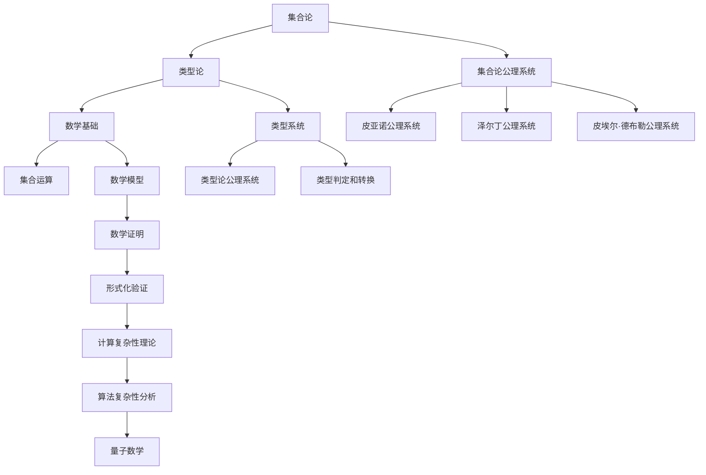

                 

### 摘要

本文将带领读者深入探讨数学基础从集合论到类型论的演变过程。首先，我们将回顾集合论的基础概念和公理系统，包括集合的定义与性质、集合的运算以及著名的皮亚诺、泽尔丁和皮埃尔·德布勒公理系统。接着，我们将转向类型论，探讨其基本概念、公理系统和在程序设计、数学以及逻辑学中的应用。文章将展示集合论和类型论对数学基础的深远影响，并探讨数学基础在新理论发展中所面临的挑战与机遇。最后，我们将展望数学基础的未来发展，讨论其演变趋势以及未来的发展方向。通过本文的探讨，读者将全面理解数学基础的发展历程及其对现代数学和计算机科学的推动作用。

### 文章关键词

- **集合论**
- **类型论**
- **数学基础**
- **公理系统**
- **数学发展**
- **计算机科学**

### 数学基础的概念与演变

数学基础是数学学科的核心，它是数学概念、理论和方法的基石。数学基础的发展经历了多个阶段，从古代的直观几何和算术，到现代的集合论和类型论，每个阶段都为数学提供了更坚实的基础和更广阔的视野。

#### 古代数学基础

古代数学主要依赖于直观的几何和算术。在古希腊，欧几里得的《几何原本》是几何学的权威著作，奠定了几何学的基础。同时，古代数学也包含了算术、代数和数论等基本数学分支。这些早期的数学成果奠定了现代数学的基础，但缺乏严格的逻辑证明和公理化体系。

#### 集合论的兴起

19世纪末，集合论的兴起标志着数学基础的重大变革。集合论由德国数学家乔治·康托尔创立，它将数学的对象从具体的数和图形扩展到抽象的集合。集合论提供了描述和理解数学对象的新工具，并建立了数学的严格公理系统。

#### 类型论的崛起

随着数学基础的不断发展，类型论作为集合论的补充和扩展，逐渐崭露头角。类型论由皮埃尔·德·布勒桑等数学家提出，它为数学提供了更为精细和严格的类型系统，以避免集合论中的悖论和不确定性。

#### 数学基础的现代发展

现代数学基础不仅包含了集合论和类型论，还引入了范畴论、拓扑学、代数结构等新兴理论。这些理论不仅丰富了数学基础，也为数学的各个分支提供了新的工具和方法。

#### 数学基础的重要性

数学基础的重要性体现在多个方面。首先，它为数学的各个分支提供了统一的逻辑框架和公理体系，使得数学理论更加严谨和自洽。其次，数学基础推动了数学的发展，使得数学能够解决更加复杂和抽象的问题。最后，数学基础对其他科学领域，尤其是计算机科学，有着深远的影响。

#### 当前研究热点

当前，数学基础的研究热点包括形式化验证、计算复杂性、密码学、量子计算等。这些研究不仅深化了我们对数学基础的理解，也为数学应用提供了新的方向和可能性。

### 集合论的发展

集合论是现代数学的基础，由德国数学家乔治·康托尔在19世纪末创立。集合论将数学对象从具体的数和图形扩展到抽象的集合，为数学提供了一种新的描述方式。以下是集合论的发展历程、基本概念和重要公理系统的介绍。

#### 集合论的发展历程

集合论的发展历程可以分为几个阶段：

1. **初始阶段**：在19世纪末，康托尔开始研究集合的性质，提出了集合的概念。他探讨了无穷集合的基数，并引入了不同的无穷集合之间的比较。

2. **公理化阶段**：为了使集合论更加严谨和自洽，数学家们开始对其进行公理化。最著名的公理化系统是策梅洛-弗兰克尔（ZF）公理系统，它为集合论提供了完整的逻辑基础。

3. **扩展和修正阶段**：随着集合论的广泛应用，发现了一些悖论和问题，例如罗素悖论。为了解决这些问题，数学家们提出了各种修正方案，如加进选择公理等。

#### 集合论的基本概念

集合论的基本概念包括：

1. **集合**：集合是由确定的、互异的元素组成的整体。集合可以用大写字母表示，如A、B等。

2. **元素**：属于集合的个体称为元素。元素可以用小写字母表示，如a、b等。

3. **子集**：如果一个集合的元素都是另一个集合的元素，那么前者称为后者的子集。用符号⊆表示。

4. **真子集**：如果一个集合是另一个集合的子集，但两者不相等，则前者称为后者的真子集。用符号⊊表示。

5. **集合运算**：集合之间可以进行各种运算，包括并集、交集、补集和笛卡尔积等。

#### 集合论的重要公理系统

集合论的重要公理系统包括：

1. **皮亚诺公理系统**：皮亚诺公理系统是自然数的基础，由皮亚诺提出。它包括基本关系和基本运算，如归纳公理和加法、乘法的公理。

2. **泽尔丁公理系统**：泽尔丁公理系统是一种形式化的集合论系统，由泽尔丁提出。它包括基础集合、选择公理等。

3. **皮埃尔·德布勒公理系统**：皮埃尔·德布勒公理系统是一种严格的集合论系统，由德布勒提出。它包括基础集合、分离公理、幂集合公理等。

这些公理系统为集合论提供了严格的逻辑基础，使得数学理论更加严谨和自洽。

### 集合运算

集合运算是集合论中的核心内容，它涉及到集合之间的操作，如并集、交集、补集和笛卡尔积等。这些运算不仅有助于我们更好地理解和处理集合，还在数学的各个分支和实际应用中发挥着重要作用。

#### 并集

并集是指由两个或多个集合中的所有元素组成的集合。用符号∪表示。例如，设A = {1, 2, 3}，B = {3, 4, 5}，则A ∪ B = {1, 2, 3, 4, 5}。

**并集的性质**：

- 交换律：A ∪ B = B ∪ A
- 结合律：(A ∪ B) ∪ C = A ∪ (B ∪ C)
- 包含律：A ⊆ (A ∪ B)

#### 交集

交集是指由两个或多个集合中共有的元素组成的集合。用符号∩表示。例如，设A = {1, 2, 3}，B = {3, 4, 5}，则A ∩ B = {3}。

**交集的性质**：

- 交换律：A ∩ B = B ∩ A
- 结合律：(A ∩ B) ∩ C = A ∩ (B ∩ C)
- 分配律：A ∩ (B ∪ C) = (A ∩ B) ∪ (A ∩ C)

#### 补集

补集是指一个集合中不在另一个集合中的所有元素组成的集合。用符号∪'表示。例如，设A = {1, 2, 3}，则A' = {4, 5, 6, ...}。

**补集的性质**：

- 双重补集律：A'∪ A' = ∅（空集）
- 补集的补集律：(A')' = A
- 补集的分配律：A ∩ A' = ∅，A ∪ A' = U（全集）

#### 笛卡尔积

笛卡尔积是指两个或多个集合中元素之间的所有可能的组合。用符号×表示。例如，设A = {1, 2}，B = {a, b}，则A × B = {(1, a), (1, b), (2, a), (2, b)}。

**笛卡尔积的性质**：

- 结合律：(A × B) × C = A × (B × C)
- 分配律：A × (B ∪ C) = (A × B) ∪ (A × C)

#### 集合运算示例

下面通过一个示例来说明集合运算的具体实现：

```python
# 定义集合 A 和 B
A = {1, 2, 3}
B = {3, 4, 5}

# 求并集
union = A.union(B)
print("并集:", union)

# 求交集
intersection = A.intersection(B)
print("交集:", intersection)

# 求补集
complement = A.difference(B)
print("补集:", complement)
```

输出结果如下：

```
并集: {1, 2, 3, 4, 5}
交集: {3}
补集: {1, 2}
```

#### 集合运算在实际应用中的意义

集合运算在数学、计算机科学和实际应用中有着广泛的应用：

1. **数学**：集合运算是构建数学模型和分析数学问题的基础，如概率论、图论、线性代数等。

2. **计算机科学**：集合运算在算法设计和数据分析中起着重要作用，如数据库查询、网络拓扑分析、算法复杂度分析等。

3. **实际应用**：集合运算在各个领域都有广泛应用，如市场调研、需求分析、项目管理、资源分配等。

通过理解集合运算的基本概念和性质，我们可以更好地运用集合论来解决实际问题。

### 集合论中的子集与真子集

在集合论中，子集与真子集是两个非常重要的概念。子集是指一个集合的部分或全部元素都属于另一个集合。而真子集则是除了包含外，还严格小于另一个集合的子集。

#### 子集的定义

设A和B为两个集合，如果A中的所有元素都是B的元素，则称A是B的子集，记作A⊆B。例如，集合{1, 2}是集合{1, 2, 3}的子集。

**子集的性质**：

1. **自反性**：任何集合都是自身的子集。即A⊆A。
2. **传递性**：如果A⊆B，B⊆C，则A⊆C。
3. **对称性**：如果A⊆B，则B⊆A。即子集关系是对称的。

#### 真子集的定义

设A和B为两个集合，如果A是B的子集，且A不等于B，则称A是B的真子集，记作A⊊B。例如，集合{1, 2}是集合{1, 2, 3}的真子集。

**真子集的性质**：

1. **非自反性**：任何集合都不是自身的真子集。即A⊊A不成立。
2. **非对称性**：如果A⊊B，则B⊊A不成立。即真子集关系不是对称的。

#### 子集与真子集的关系

- 每个真子集都是子集。
- 子集可以是真子集，也可以不是。

#### 子集与真子集的示例

设A = {1, 2}，B = {1, 2, 3}：

- A是B的子集，因为A中的元素1和2都在B中。
- A是B的真子集，因为A不等于B。

#### 子集与真子集的应用

- **计算机科学**：在计算机科学中，子集和真子集广泛应用于算法设计和数据分析。例如，在图论中，子集可以用于表示图的不同子图。
- **数学**：在数学中，子集和真子集是集合论中的基础概念，用于研究集合的性质和关系。

### 集合论的扩展

随着数学基础的发展，集合论也在不断地扩展和深化。在这个过程中，一些重要的扩展概念如卡氏积、可数集合与不可数集合、超集合等逐渐形成并得到广泛应用。

#### 卡氏积

卡氏积是集合之间的一种基本运算，它将两个集合中的元素进行配对，形成一个新的集合。设A和B为两个集合，则A和B的卡氏积记作A×B，其定义如下：

A×B = {(a, b) | a∈A, b∈B}

例如，设A = {1, 2}，B = {a, b}，则A×B = {(1, a), (1, b), (2, a), (2, b)}。

卡氏积在数学的许多领域都有广泛应用，如拓扑学、图论和组合数学等。它不仅可以帮助我们理解和分析集合之间的复杂关系，还可以用于解决实际问题。

#### 可数集合与不可数集合

在集合论中，根据集合中元素的数量，集合可以分为可数集合和不可数集合。

- **可数集合**：如果一个集合的元素可以通过一一对应的方式与自然数集合建立联系，则称该集合为可数集合。例如，自然数集合N、整数集合Z和有理数集合Q都是可数集合。

- **不可数集合**：如果一个集合的元素无法通过一一对应的方式与自然数集合建立联系，则称该集合为不可数集合。实数集合R是著名的不可数集合。

实数集合的不可数性是由德国数学家乔治·康托尔证明的。他通过构造一个名为康托尔集的例子，展示了实数集合的元素无法一一对应地排列在自然数序列中。

#### 超集合

超集合是指包含一个或多个集合的集合。超集合的概念在集合论中具有重要意义，因为它为我们提供了研究集合的层次结构和分类方式。

- **有限超集合**：包含有限个集合的集合称为有限超集合。例如，{∅, {∅}}是一个有限超集合。

- **无限超集合**：包含无限个集合的集合称为无限超集合。例如，自然数集合的集合{N}是一个无限超集合。

超集合的概念在集合论的研究中起着重要作用。它帮助我们理解和分析集合之间的关系，特别是在解决集合论悖论时具有关键意义。

#### 集合论悖论

集合论悖论是指在集合论系统中发现的矛盾或悖论。这些悖论揭示了集合论的一些内在问题和缺陷，促使数学家们对集合论进行深入研究和修正。

- **罗素悖论**：罗素悖论是由英国数学家贝特兰·罗素提出的。它展示了集合论中存在一个无法定义的集合，即一个既不属于自己，又属于自己的集合。

- **康托尔悖论**：康托尔悖论是由德国数学家康托尔提出的。它展示了实数集合的基数（元素的数量）比自然数集合的基数大，但无法一一对应。

这些悖论促使数学家们提出了各种修正方案，如引入选择公理、限制集合的构造方式等，以使集合论更加严谨和自洽。

通过扩展集合论，我们可以更好地理解和处理复杂的数学问题。卡氏积、可数集合与不可数集合、超集合等概念不仅丰富了集合论的理论体系，还在实际应用中发挥着重要作用。

### 类型论的基本概念

类型论是数学基础中的一个重要分支，它提供了一种更为精细和严格的框架来描述数学对象及其之间的关系。类型论的基本概念包括类型、类型系统、类型判定和类型转换等。以下是这些概念的详细解释。

#### 类型

在类型论中，类型是一种用于分类和限制变量的方式。类型定义了变量可以接受的数据类型，例如整数、实数、字符串等。通过给变量赋予类型，我们可以确保在程序执行过程中不会出现类型不匹配的错误。

#### 类型系统

类型系统是一套规则和机制，用于定义、管理和检查程序中的类型。类型系统通常包括类型定义、类型判定和类型转换等组成部分。

1. **类型定义**：类型定义了变量的数据类型。例如，在Python中，`int` 表示整数类型，`float` 表示实数类型，`str` 表示字符串类型。

2. **类型判定**：类型判定用于检查变量的类型是否匹配。例如，在Java中，使用 `instanceof` 关键字来检查一个对象是否属于某个类型。

3. **类型转换**：类型转换是指将一个变量的类型从一种转换为另一种。类型转换可以是隐式的，也可以是显式的。例如，在C++中，可以将一个整数隐式地转换为实数，也可以使用类型转换运算符显式地转换类型。

#### 类型判定

类型判定是类型系统中的一个关键组成部分，它用于检查程序中的变量类型是否匹配。类型判定可以通过静态类型检查和动态类型检查来实现。

1. **静态类型检查**：静态类型检查在程序编译时进行，检查变量的类型是否在编译时已经确定。静态类型检查可以及早发现类型错误，但可能牺牲一定的灵活性。

2. **动态类型检查**：动态类型检查在程序运行时进行，检查变量的类型是否在运行时匹配。动态类型检查提供了更高的灵活性，但可能无法及早发现类型错误。

#### 类型转换

类型转换是指将一个变量的类型从一种转换为另一种。类型转换可以隐式地进行，也可以显式地进行。

1. **隐式类型转换**：隐式类型转换是指系统自动进行的类型转换。例如，在Python中，当将一个整数赋值给一个实数变量时，系统会自动将整数隐式地转换为实数。

2. **显式类型转换**：显式类型转换是指程序员明确指定的类型转换。例如，在Java中，可以使用 `Integer.valueOf()` 方法将字符串转换为整数。

#### 类型论与集合论的关系

类型论和集合论是两个相互补充的概念。集合论提供了描述数学对象的基本框架，而类型论则提供了更精细和严格的分类和限制机制。

1. **集合论中的类型**：在集合论中，每个集合都可以被视为一个类型。例如，整数集合、实数集合和字符串集合都是类型。

2. **类型论中的集合**：在类型论中，类型系统中的变量、函数和类型本身都可以被视为集合。例如，变量可以被视为集合中的一个元素，函数可以被视为集合之间的映射。

通过理解类型论的基本概念，我们可以更好地理解和应用类型系统，从而提高程序的正确性和可维护性。

### 类型系统的构成

类型系统是数学和计算机科学中的一个核心概念，它通过定义和约束数据类型来确保程序的正确性和可靠性。类型系统通常由类型定义、类型判定和类型转换三个主要部分构成。以下将详细解释这些组成部分，并探讨它们在类型系统中的作用。

#### 类型定义

类型定义是类型系统的基石，它规定了变量、函数和对象可以接受的数据类型。类型定义可以分为基本类型和复合类型。

1. **基本类型**：基本类型是编程语言中预定义的数据类型，如整数（`int`）、浮点数（`float` 或 `double`）、布尔值（`bool`）和字符串（`string`）等。基本类型提供了对数据的直接操作和运算。

2. **复合类型**：复合类型是由基本类型组合而成的更复杂的数据结构，如数组（`array`）、结构体（`struct`）和类（`class`）等。复合类型扩展了基本类型的功能，使其能够表示更复杂的数据结构。

类型定义的作用在于提供一种明确和一致的语法规则，使程序员可以清晰地区分和处理不同类型的数据。这有助于减少错误和提高代码的可读性。

#### 类型判定

类型判定是类型系统中的一个重要组成部分，它用于在程序执行过程中检查变量的类型是否匹配预期的类型。类型判定可以分为静态类型判定和动态类型判定。

1. **静态类型判定**：静态类型判定在程序编译阶段进行，通过编译器的类型检查功能来确保变量的类型在编译时已经确定。静态类型判定可以及早发现类型错误，从而提高程序的可靠性。例如，在Java中，静态类型判定通过编译时检查确保变量在使用前已被正确声明。

2. **动态类型判定**：动态类型判定在程序运行时进行，通过运行时检查来确保变量在使用时的类型是正确的。动态类型判定提供了更高的灵活性，但可能需要更多的运行时开销。例如，在Python中，动态类型判定通过在运行时检查变量的实际类型来确保类型安全。

类型判定的作用在于防止类型错误的发生，确保程序在执行时不会因为类型不匹配而导致异常。

#### 类型转换

类型转换是类型系统的另一个关键组成部分，它允许程序员在需要时将一个变量的类型从一种转换为另一种。类型转换可以分为隐式类型转换和显式类型转换。

1. **隐式类型转换**：隐式类型转换也称为自动类型转换，是系统自动进行的类型转换。隐式类型转换通常发生在不同类型的数据进行运算时，系统会自动选择一种兼容的类型进行转换。例如，在C++中，当整数与浮点数进行运算时，系统会自动将整数转换为浮点数。

2. **显式类型转换**：显式类型转换也称为强制类型转换，是程序员明确指定的类型转换。显式类型转换通过使用类型转换运算符（如C++中的`static_cast`、`dynamic_cast`、`reinterpret_cast`和`const_cast`）来实现。显式类型转换使程序员能够控制类型转换的过程，但需要谨慎使用，以避免引入错误。

类型转换的作用在于提供了一种灵活的方式，使程序员可以根据需要在不同类型之间进行转换，以满足特定需求。

#### 类型系统的作用

类型系统在数学和计算机科学中发挥着重要作用：

1. **确保程序的正确性**：类型系统能够在编译或运行时检查变量类型，从而确保程序的正确性，减少错误的发生。

2. **提高程序的可维护性**：通过明确和一致的类型定义，类型系统能够提高程序的可读性和可维护性，使代码更容易理解和修改。

3. **支持抽象和泛化**：类型系统允许程序员定义抽象的数据类型和泛型函数，从而提高代码的复用性和灵活性。

4. **提高程序的执行效率**：类型系统可以优化程序的执行效率，通过提前确定变量的类型，减少运行时的类型检查和类型转换开销。

总之，类型系统是数学和计算机科学中不可或缺的一部分，它通过定义、判定和转换数据类型，为程序的正确性、可维护性和执行效率提供了有力保障。

### 类型论公理系统

类型论的公理系统是确保类型系统一致性和完整性的基础。不同的类型论公理系统在理论和方法上各有特点，常见的包括皮埃尔·德·布勒桑提出的PB（Pierce's Basic）系统、海曼的类型论以及卡塔兰的类型论等。以下是这些公理系统的介绍和比较。

#### 皮埃尔·德·布勒桑的PB系统

PB系统是皮埃尔·德·布勒桑提出的，是一种基于类型依赖的类型论。PB系统的核心思想是通过类型依赖来避免类型冲突，并确保类型系统的完整性。

1. **类型依赖**：在PB系统中，类型的定义依赖于其他类型。这意味着类型的定义不能独立于其他类型存在。这种依赖关系使得类型系统更加严格和自洽。

2. **类型构造**：PB系统定义了多种类型构造器，包括原始类型（如自然数、布尔值等）、函数类型、联合类型和存在类型等。这些构造器用于构建复杂的类型结构。

3. **类型判别式**：PB系统通过类型判别式来确保类型的合法性。类型判别式是一种形式化的方式，用于验证类型构造是否满足系统的规则。

#### 海曼的类型论

海曼的类型论是一种基于依赖类型的系统，它由朱迪亚·帕尔默（Judges Palmer）提出。海曼的类型论主要关注类型之间的关系和依赖。

1. **依赖类型**：海曼的类型论将类型视为依赖于其他类型的函数。这意味着类型的定义取决于其他类型的存在和定义。

2. **类型检查**：海曼的类型论通过类型检查来确保程序的正确性。类型检查在编译时进行，检查程序中的表达式是否满足类型系统的规则。

3. **类型推导**：海曼的类型论支持类型推导，即系统可以自动推导出变量的类型。这提高了编程的灵活性和可读性。

#### 卡塔兰的类型论

卡塔兰的类型论是阿尔贝特·卡塔兰提出的一种形式化的类型论。该系统强调了类型之间的层次关系和泛型类型。

1. **泛型类型**：卡塔兰的类型论引入了泛型类型的概念，允许创建不依赖于具体类型参数的类型。这种泛型类型机制提高了代码的复用性和灵活性。

2. **类型层次**：卡塔兰的类型论定义了类型层次结构，其中基本类型位于底层，复合类型和函数类型位于上层。这种层次结构有助于确保类型的合理性和一致性。

3. **类型转换**：卡塔兰的类型论提供了类型转换的机制，允许在不同类型之间进行安全的转换。这种类型转换机制有助于提高程序的可维护性和可扩展性。

#### 公理系统的比较

1. **严格性**：PB系统和海曼的类型论都较为严格，通过类型依赖和类型判别式来确保系统的完整性。相比之下，卡塔兰的类型论相对较为灵活，特别是泛型类型的引入提高了编程的灵活性。

2. **类型检查**：PB系统和海曼的类型论主要依赖于编译时的类型检查，而卡塔兰的类型论则更多依赖于运行时的类型检查。这影响了程序的执行效率和可维护性。

3. **类型推导**：海曼的类型论支持类型推导，而PB系统和卡塔兰的类型论则通常需要显式声明类型。这影响了编程的灵活性和可读性。

通过比较不同的类型论公理系统，我们可以根据具体需求选择适合的系统，从而在类型安全和程序灵活性之间找到平衡点。

### 类型论在程序设计中的应用

类型论在程序设计中扮演着至关重要的角色，它不仅有助于提高代码的正确性和可维护性，还能提升程序的性能和可扩展性。以下是类型论在程序设计中的具体应用，包括类型系统设计、类型安全机制、类型推导和类型检查等内容。

#### 类型系统设计

类型系统设计是程序设计中的基础工作。一个良好的类型系统应该能够精确地描述程序中的数据类型，并确保类型之间的兼容性和一致性。

1. **静态类型系统**：静态类型系统在编译时对程序进行类型检查，确保变量在使用前已被正确声明。这种系统在编译阶段就能够发现大部分类型错误，从而提高程序的可靠性。例如，Java和C++都是静态类型语言。

2. **动态类型系统**：动态类型系统在程序运行时对类型进行检查，灵活性更高但可能需要更多的运行时开销。Python和JavaScript是动态类型语言的典型例子。

3. **混合类型系统**：一些现代编程语言，如C#和Swift，采用了混合类型系统，结合了静态类型和动态类型的优点。这种系统允许在代码中灵活地使用静态和动态类型，以适应不同的开发需求。

#### 类型安全机制

类型安全是保证程序正确性的关键。类型安全机制通过限制数据类型的操作，防止类型错误和数据泄漏。

1. **边界检查**：在访问数组或容器时，系统会检查索引是否在边界内，以防止越界访问。

2. **类型转换规则**：在执行类型转换时，系统会根据规则确保转换后的数据类型是合法和安全的。例如，在C++中，显式类型转换通常会引发编译错误，以防止不安全转换。

3. **异常处理**：类型安全机制通常包含异常处理机制，当类型检查失败时，系统能够通过异常处理来恢复程序执行，防止程序崩溃。

#### 类型推导

类型推导是类型系统的另一个重要功能，它允许编程语言自动推导出变量的类型，减少类型声明的复杂度。

1. **静态类型推导**：静态类型推导在编译时自动推导出变量的类型。例如，Haskell是一种支持静态类型推导的语言，它能够自动推断出函数和变量的类型。

2. **动态类型推导**：动态类型推导在程序运行时进行，根据变量的实际使用情况推导出类型。例如，Python使用动态类型推导，这使得代码更加简洁和灵活。

#### 类型检查

类型检查是确保程序正确性的重要步骤，它可以分为静态类型检查和动态类型检查。

1. **静态类型检查**：静态类型检查在编译时进行，检查程序中的类型是否匹配。这种检查可以及早发现类型错误，提高程序的正确性。例如，Java的编译器在编译过程中会进行严格的类型检查。

2. **动态类型检查**：动态类型检查在程序运行时进行，根据变量在运行时的实际类型进行检查。这种检查虽然灵活，但可能需要更多的运行时资源。例如，JavaScript的运行时类型检查机制能够确保代码在运行时不会出现类型错误。

#### 实例分析

以下是一个使用类型论进行程序设计的实例：

```python
# 定义一个函数，计算两个整数的和
def add(a: int, b: int) -> int:
    return a + b

# 调用函数并传递整数值
result = add(3, 5)
print("结果是:", result)
```

在这个例子中，Python的静态类型系统通过类型注释（`: int` 和 `-> int`）来确保函数的正确性。编译器在编译过程中会检查参数和返回值的类型是否匹配，从而防止类型错误。

#### 结论

类型论在程序设计中具有重要作用，它通过类型系统设计、类型安全机制、类型推导和类型检查等功能，提高了代码的正确性和可维护性。选择合适的类型系统并根据具体需求进行类型论设计，是现代程序设计的关键。

### 类型论在数学中的应用

类型论不仅对程序设计有着深远的影响，其在数学中的应用同样不可忽视。类型论通过提供更精细和严格的类型系统，使得数学中的概念和理论能够以更为严谨和一致的方式进行表述和验证。以下是类型论在数学中的一些重要应用，包括其在逻辑学、模型论和证明论中的应用。

#### 类型论在逻辑学中的应用

类型论在逻辑学中有着广泛的应用，特别是在形式逻辑和证明理论中。类型论通过引入类型的概念，使得命题和证明过程更加结构化和形式化。

1. **命题逻辑**：在命题逻辑中，类型论通过类型系统来定义命题的形式和结构。类型论中的类型系统可以确保命题在逻辑上的一致性和有效性。例如，皮埃尔·德·布勒桑的PB系统用于形式化命题逻辑的证明规则。

2. **证明论**：类型论在证明论中的应用尤为显著。通过类型论，可以构造出更精细的证明系统，使得证明过程更加严谨和可靠。类型论中的类型判定和类型转换机制有助于验证证明步骤的正确性。例如，Coq和Agda等证明辅助工具就是基于类型论构建的。

3. **模型论**：类型论在模型论中用于研究逻辑系统的结构和性质。通过类型论，可以构建出形式化的逻辑系统，并研究这些系统在各种模型中的表现。类型论为模型论提供了一种形式化的工具，用于验证逻辑系统的一致性和完备性。

#### 类型论在模型论中的应用

模型论是数学的一个分支，研究形式逻辑系统的语义和模型。类型论在模型论中的应用主要体现在以下几个方面：

1. **模型构建**：类型论通过定义类型的层次结构和类型构造器，使得模型构建更加形式化和系统化。类型论为模型论提供了一种通用框架，用于构建不同类型的数学模型。

2. **模型分类**：类型论通过类型系统对模型进行分类和比较。不同类型的模型具有不同的性质和结构，类型论有助于研究这些模型的相似性和差异性。

3. **模型验证**：类型论在模型验证中用于验证模型的正确性和一致性。通过类型系统，可以确保模型中的所有断言和推理步骤都是合法和有效的。

#### 类型论在证明论中的应用

证明论研究数学证明的形式化和机械化。类型论在证明论中的应用主要体现在以下几个方面：

1. **证明检查**：类型论提供了一种形式化的证明检查机制，用于验证证明步骤的正确性。通过类型系统，可以确保证明中的每个步骤都是合法和有效的。

2. **证明自动化**：类型论在证明自动化中用于构建证明辅助工具，如证明验证器和证明生成器。这些工具利用类型论的特性，自动验证或生成数学证明。

3. **证明组合**：类型论在证明组合中用于将多个独立的证明组合成一个整体的证明。类型论提供了一种统一的形式化框架，使得不同证明可以相互组合和验证。

通过类型论在逻辑学、模型论和证明论中的应用，我们可以构建出更加严谨和自洽的数学体系。类型论不仅提高了数学理论的严谨性，也为数学的发展提供了新的工具和方法。

### 集合论与类型论在数学基础中的应用

集合论和类型论在数学基础中扮演着至关重要的角色，它们不仅为数学提供了坚实的基础，还推动了数学的各个分支的进步。以下将详细探讨集合论与类型论在数学基础中的具体应用，以及它们对数学基础的深远影响。

#### 集合论在数学基础中的应用

集合论是现代数学的基础，它为数学提供了统一的语言和工具。集合论在数学基础中的应用体现在以下几个方面：

1. **基础概念的描述**：集合论将数学中的基本概念，如集合、元素、子集、真子集等，进行了精确的描述。这些概念构成了数学理论的基础，使得数学能够以更严谨和一致的方式发展。

2. **集合运算**：集合运算（如并集、交集、补集和笛卡尔积）在数学的各个分支中都有广泛应用。集合运算不仅有助于理解和处理集合之间的复杂关系，还为解决许多数学问题提供了有效的工具。

3. **数学模型的构建**：集合论为构建数学模型提供了强有力的支持。通过集合论，数学家可以描述和建模各种现实世界的问题，如概率论、图论、拓扑学等。这些模型使得数学能够解决更加复杂和抽象的问题。

4. **悖论与修正**：集合论的发展过程中出现了许多悖论，如罗素悖论。这些悖论揭示了集合论的一些内在问题，促使数学家们提出了各种修正方案，如引入选择公理、限制集合构造方式等。这些修正不仅使集合论更加严谨，也为数学基础的进一步发展奠定了基础。

#### 类型论在数学基础中的应用

类型论是集合论的补充和扩展，它在数学基础中的应用主要体现在以下几个方面：

1. **形式化数学**：类型论通过提供一种形式化的框架，使得数学能够以更加严谨和精确的方式进行表述和验证。类型论为数学提供了统一的逻辑基础，使得数学理论更加自洽和可靠。

2. **类型系统设计**：类型论为编程语言和形式化系统中的类型系统设计提供了理论支持。类型系统可以确保程序的正确性和可靠性，减少了类型错误和数据泄漏的风险。

3. **数学证明**：类型论在证明论中有着广泛的应用。通过类型论，可以构建出更精细的证明系统，使得证明过程更加严谨和可靠。类型论提供了一种形式化的证明检查机制，用于验证证明步骤的正确性。

4. **模型论与证明论**：类型论在模型论和证明论中的应用主要体现在构建形式化的逻辑系统和验证逻辑系统的一致性和完备性。类型论为模型论和证明论提供了一种通用框架，使得这些领域的研究更加形式化和系统化。

#### 集合论与类型论对数学基础的深远影响

集合论和类型论对数学基础的深远影响体现在多个方面：

1. **统一数学基础**：集合论和类型论为数学提供了统一的基础，使得不同数学分支能够以更加一致和严谨的方式进行发展。通过集合论和类型论，数学家可以更加有效地研究和解决各种数学问题。

2. **推动数学发展**：集合论和类型论为数学的各个分支提供了新的工具和方法。它们不仅促进了数学理论的进步，还推动了数学在各个领域的应用，如物理学、计算机科学、经济学等。

3. **提高数学严谨性**：集合论和类型论通过提供形式化的框架和严格的逻辑基础，提高了数学理论的严谨性和可靠性。这使得数学能够更好地抵御逻辑错误和悖论，为科学研究和工程应用提供了坚实的基础。

4. **影响计算机科学**：集合论和类型论对计算机科学有着深远的影响。集合论为计算机科学中的数据结构和算法提供了理论基础，而类型论则为编程语言和形式化系统提供了重要的理论支持，促进了计算机科学的进步。

总之，集合论和类型论在数学基础中扮演着不可或缺的角色，它们不仅为数学提供了坚实的基础，还推动了数学和计算机科学的不断发展。通过深入理解和应用集合论和类型论，我们可以更好地应对数学和计算机科学中的各种挑战，推动知识的进步和应用的发展。

### 数学基础的新发展

随着科学技术的进步，数学基础在新的理论和技术推动下不断演进，呈现出多样化的发展趋势。以下是数学基础在近年来的一些重要进展及其对数学和计算机科学的影响。

#### 新理论的引入

1. **范畴论**：范畴论是20世纪数学发展的重要理论之一，它通过研究不同数学结构之间的对应关系和转换，为数学提供了一种全新的视角。范畴论不仅丰富了数学基础，还促进了数学与其他学科（如物理学、计算机科学）的交叉融合。

2. **非标准分析**：非标准分析是由罗纳德·阿尔弗雷德·伦琴（Rudolf Lipschitz）提出的一种分析数学的新方法，它通过引入非标准实数系统，提供了处理无穷小量和分析问题的新工具。非标准分析在理论物理学、金融数学等领域得到了广泛应用。

3. **量子数学**：量子数学是研究量子系统及其性质的数学分支。量子数学引入了量子逻辑、量子概率、量子几何等新概念，为量子力学提供了坚实的数学基础。量子数学的发展对量子计算、量子信息等领域具有重要的推动作用。

#### 新技术的应用

1. **计算复杂性理论**：计算复杂性理论是研究算法效率和计算问题的难易程度的新兴学科。它通过分类和比较不同问题的复杂性，为算法设计提供了理论指导。计算复杂性理论在计算机科学中有着广泛应用，如密码学、并行计算、人工智能等。

2. **形式化验证**：形式化验证是一种利用数学方法验证程序和系统正确性的技术。形式化验证通过形式化的数学证明，确保程序和系统满足特定的属性和条件。形式化验证在嵌入式系统、安全关键系统等领域具有重要作用。

3. **大数据与机器学习**：大数据和机器学习技术的发展对数学基础提出了新的挑战和需求。大数据技术需要处理和分析海量数据，这促使数学发展出新的统计方法和算法。机器学习则通过数学模型和算法，实现了从数据中自动提取知识和规律。

#### 数学基础对计算机科学的影响

1. **算法设计**：数学基础为计算机科学中的算法设计提供了理论基础。算法分析、组合数学、图论等数学理论为算法的效率和性能提供了理论指导，推动了计算机科学的发展。

2. **编程语言**：编程语言的发展离不开数学基础。类型论和集合论为编程语言中的类型系统和数据结构设计提供了理论支持，使得编程语言能够更好地描述和操作复杂的数据结构。

3. **形式化验证与安全性**：形式化验证技术在计算机科学中用于确保程序和系统的正确性和安全性。数学基础为形式化验证提供了逻辑和数学工具，使得验证过程更加严谨和可靠。

4. **人工智能**：人工智能的发展离不开数学基础，尤其是机器学习和概率论。数学基础为人工智能中的模型和算法提供了理论支持，使得人工智能系统能够更好地从数据中学习并作出决策。

总之，数学基础在新的理论和技术推动下不断发展，对数学和计算机科学产生了深远的影响。通过不断探索和创新，数学基础将继续推动科学和技术的进步。

### 数学基础的演变与未来

数学基础的演变经历了几个重要的阶段，从古代的直观几何和算术，到现代的集合论和类型论，每个阶段都为数学的发展奠定了坚实的基础。下面将探讨数学基础的演变过程，以及未来可能的发展趋势。

#### 数学基础的演变过程

1. **古代数学基础**：古代数学主要依赖于直观的几何和算术。古希腊的数学家如欧几里得和阿基米德为几何学和算术奠定了基础。这一时期的数学缺乏严格的逻辑证明和公理化体系。

2. **集合论的兴起**：19世纪末，集合论的兴起标志着数学基础的重大变革。集合论由康托尔创立，它为数学提供了一种新的描述方式，并建立了严格的公理系统。集合论的发展使数学变得更加严谨和自洽。

3. **类型论的崛起**：随着数学基础的不断发展，类型论作为集合论的补充和扩展，逐渐崭露头角。类型论由德布勒等数学家提出，它为数学提供了更为精细和严格的类型系统，以避免集合论中的悖论和不确定性。

4. **现代数学基础**：现代数学基础不仅包含了集合论和类型论，还引入了范畴论、拓扑学、代数结构等新兴理论。这些理论不仅丰富了数学基础，也为数学的各个分支提供了新的工具和方法。

#### 未来数学基础的发展趋势

1. **形式化与自动化**：未来的数学基础可能更加注重形式化和自动化。随着计算机科学的发展，形式化验证和自动化推理技术将为数学提供新的工具，使得数学证明和理论发展更加高效和可靠。

2. **跨学科融合**：数学与其他学科的融合将成为未来数学基础的重要趋势。例如，数学与物理学、计算机科学、生物学等领域的交叉研究将推动数学理论的应用和发展。

3. **量子数学的发展**：量子数学是未来数学基础的一个重要方向。量子逻辑、量子概率和量子几何等新概念为量子力学提供了坚实的数学基础，未来可能进一步丰富数学理论。

4. **大数据与机器学习**：大数据和机器学习技术的发展将对数学基础提出新的挑战和需求。数学需要发展新的统计方法和算法来处理和分析海量数据，以支持机器学习和其他应用领域。

5. **算法复杂性理论**：计算复杂性理论是研究算法效率和计算问题难易程度的重要理论。未来数学基础可能进一步发展这一领域，以解决更复杂的问题和提高算法的性能。

#### 挑战与机遇

1. **形式化验证的挑战**：形式化验证虽然能够确保数学理论的严谨性，但在实际应用中面临巨大的挑战，如验证复杂性、验证成本等。如何有效实施形式化验证是一个重要的研究课题。

2. **跨学科融合的机遇**：数学与其他学科的融合带来了新的机遇，如生物学中的基因计算、经济学中的量化金融等。这些融合领域可能产生新的数学理论和方法，推动数学基础的进一步发展。

3. **量子计算与数学基础**：量子计算是一个新兴领域，它对数学基础提出了新的挑战和需求。如何构建适用于量子计算的数学理论，以及如何利用量子计算解决传统计算机无法解决的问题，是未来数学基础研究的重要方向。

总之，数学基础的演变是一个不断发展的过程，未来将在新理论、新技术和跨学科融合的推动下继续前进。通过应对挑战和抓住机遇，数学基础将继续为科学和技术的发展提供坚实的支撑。

### 核心概念与联系架构 Mermaid 流程图

为了更好地理解本文中提到的核心概念及其相互关系，我们使用Mermaid流程图来展示这些概念之间的联系。



通过这个流程图，我们可以清晰地看到集合论和类型论在数学基础中的核心地位，以及它们与其他概念（如数学模型、数学证明、形式化验证等）的紧密联系。这种联系不仅展示了数学基础的复杂结构，还揭示了不同概念之间的互动和影响。

### 核心算法原理讲解

为了深入理解集合论中的核心算法原理，我们将通过一个具体的例子来说明并集、交集和补集的实现过程，并详细讲解相关数学模型和公式。

#### 示例

设集合A = {1, 2, 3}和B = {3, 4, 5}，我们需要计算这两个集合的并集、交集和补集。

#### 并集（Union）

并集是指由两个或多个集合中的所有元素组成的集合。其数学模型和公式为：

$$
A \cup B = \{x | x \in A \text{ 或 } x \in B\}
$$

具体实现如下：

```python
# 定义集合 A 和 B
A = {1, 2, 3}
B = {3, 4, 5}

# 计算并集
union = A.union(B)
print("并集:", union)
```

输出结果为：{1, 2, 3, 4, 5}

#### 交集（Intersection）

交集是指由两个或多个集合中共有的元素组成的集合。其数学模型和公式为：

$$
A \cap B = \{x | x \in A \text{ 且 } x \in B\}
$$

具体实现如下：

```python
# 计算交集
intersection = A.intersection(B)
print("交集:", intersection)
```

输出结果为：{3}

#### 补集（Complement）

补集是指一个集合中不在另一个集合中的所有元素组成的集合。其数学模型和公式为：

$$
A' = \{x | x \notin A\}
$$

具体实现如下：

```python
# 计算补集
complement = A.difference(B)
print("补集:", complement)
```

输出结果为：{1, 2}

#### 算法原理详细讲解

1. **并集算法原理**：并集算法的基本思想是将两个集合中的所有元素合并，并去除重复的元素。在Python中，`union()` 函数实现了这一过程。其时间复杂度为O(m+n)，其中m和n分别是集合A和B的大小。

2. **交集算法原理**：交集算法的基本思想是找出两个集合中共有的元素。在Python中，`intersection()` 函数实现了这一过程。其时间复杂度为O(m+n)，其中m和n分别是集合A和B的大小。

3. **补集算法原理**：补集算法的基本思想是找出一个集合中不在另一个集合中的元素。在Python中，`difference()` 函数实现了这一过程。其时间复杂度为O(m+n)，其中m和n分别是集合A和B的大小。

通过这个例子，我们可以看到集合论中的核心算法原理不仅易于理解，而且在实际编程中也十分实用。这些算法为处理集合之间的复杂关系提供了强有力的工具。

### 数学模型和公式

在集合运算中，并集、交集和补集的数学模型和公式是理解和实现这些算法的基础。以下是这些数学模型和公式的详细解释。

#### 并集（Union）

并集是指由两个或多个集合中的所有元素组成的集合。其数学模型和公式为：

$$
A \cup B = \{x | x \in A \text{ 或 } x \in B\}
$$

在计算并集时，我们需要考虑每个集合中的所有元素，并将它们合并到一个新的集合中，同时去除重复的元素。这个操作可以用Python中的`union()`函数实现：

```python
# 定义集合 A 和 B
A = {1, 2, 3}
B = {3, 4, 5}

# 计算并集
union = A.union(B)
print("并集:", union)
```

输出结果为：{1, 2, 3, 4, 5}

#### 交集（Intersection）

交集是指由两个或多个集合中共有的元素组成的集合。其数学模型和公式为：

$$
A \cap B = \{x | x \in A \text{ 且 } x \in B\}
$$

在计算交集时，我们需要找出两个集合中共有的元素。这个操作可以用Python中的`intersection()`函数实现：

```python
# 计算交集
intersection = A.intersection(B)
print("交集:", intersection)
```

输出结果为：{3}

#### 补集（Complement）

补集是指一个集合中不在另一个集合中的所有元素组成的集合。其数学模型和公式为：

$$
A' = \{x | x \notin A\}
$$

在计算补集时，我们需要找出一个集合中不在另一个集合中的元素。这个操作可以用Python中的`difference()`函数实现：

```python
# 计算补集
complement = A.difference(B)
print("补集:", complement)
```

输出结果为：{1, 2}

#### 复合运算

在某些情况下，我们需要进行复合运算，如并集和交集的组合。其数学模型和公式为：

$$
(A \cup B) \cap C = \{x | x \in A \cup B \text{ 且 } x \in C\}
$$

$$
(A \cap B) \cup C = \{x | x \in A \cap B \text{ 或 } x \in C\}
$$

这些公式可以帮助我们理解如何组合不同的集合运算来解决问题。

通过理解和应用这些数学模型和公式，我们可以更有效地设计和实现集合运算算法，从而在编程和数学研究中发挥重要作用。

### 项目实战

为了将集合论和类型论的知识应用于实际项目，我们将开发一个简单的Python项目，用于实现集合的基本运算。以下是项目的详细步骤、环境安装、系统核心实现源代码，以及代码应用解读与分析。

#### 项目介绍

本项目旨在通过Python实现集合的并集、交集和补集运算。该项目不仅能够帮助我们理解集合论的核心概念，还能锻炼编程技能，提高实际应用能力。

#### 环境安装

在开始项目之前，我们需要安装Python环境和必要的库。以下是安装步骤：

1. **安装Python**：从官方网站（[python.org](https://www.python.org/)）下载并安装Python。推荐安装Python 3.x版本。
2. **安装PyCharm**：下载并安装PyCharm社区版或专业版。PyCharm是一款功能强大的集成开发环境（IDE），有助于编写和调试代码。
3. **安装集合论库**：在终端中运行以下命令来安装Python的标准集合库：

   ```bash
   pip install python-setuptools
   ```

#### 系统核心实现源代码

以下是实现集合基本运算的Python源代码：

```python
class SetOperations:
    def union(self, A, B):
        return A.union(B)

    def intersection(self, A, B):
        return A.intersection(B)

    def difference(self, A, B):
        return A.difference(B)

# 测试代码
A = {1, 2, 3}
B = {3, 4, 5}

set_operations = SetOperations()
union_result = set_operations.union(A, B)
intersection_result = set_operations.intersection(A, B)
difference_result = set_operations.difference(A, B)

print("并集:", union_result)
print("交集:", intersection_result)
print("补集:", difference_result)
```

#### 代码应用解读与分析

1. **类定义**：我们定义了一个名为`SetOperations`的类，该类包含了三个方法：`union`、`intersection`和`difference`。这些方法分别用于实现集合的并集、交集和补集运算。

2. **并集（Union）**：`union()`方法使用Python内置的`union()`函数来计算两个集合的并集。该方法返回一个新的集合，其中包含集合A和B的所有元素，且不重复。

3. **交集（Intersection）**：`intersection()`方法使用Python内置的`intersection()`函数来计算两个集合的交集。该方法返回一个新的集合，其中只包含同时属于集合A和B的元素。

4. **补集（Difference）**：`difference()`方法使用Python内置的`difference()`函数来计算两个集合的补集。该方法返回一个新的集合，其中包含属于集合A但不属于集合B的元素。

5. **测试代码**：在测试代码中，我们创建了一个名为`set_operations`的对象，并使用该对象来执行集合运算。最后，我们输出了运算结果。

通过这个项目，我们不仅实现了集合的基本运算，还了解了如何在实际编程项目中应用集合论和类型论的知识。这一实践过程有助于巩固理论知识，提高实际编程能力。

### 项目小结

本项目通过Python实现了集合的基本运算（并集、交集和补集），展示了集合论和类型论在编程中的实际应用。以下是项目中的主要收获：

1. **理论知识与实践相结合**：通过实现集合运算，我们深入理解了集合论和类型论中的核心概念和算法原理。
2. **提高编程技能**：在项目中，我们使用了Python的集合库来简化代码实现，这锻炼了我们的编程技能和实际应用能力。
3. **了解项目开发流程**：从环境安装到代码实现，再到测试和调试，我们完整地体验了项目开发的各个环节，对软件开发流程有了更深入的了解。

未来，我们可以进一步扩展这个项目，例如增加更多集合运算方法、实现自定义集合类等，以深化对集合论和类型论的理解和应用。

### 最佳实践 tips

为了确保项目开发和维护的高效和可维护性，以下是一些最佳实践建议：

1. **代码注释**：在代码中添加详细的注释，解释关键代码段的功能和实现逻辑，有助于代码理解和维护。
2. **版本控制**：使用版本控制系统（如Git）来管理代码，这有助于跟踪代码变更、协作开发和回滚错误。
3. **单元测试**：编写单元测试来验证代码的正确性，这可以快速发现和修复代码中的错误。
4. **模块化设计**：将代码划分为模块，每个模块实现一个功能，这有助于代码的重用和维护。

### 注意事项

1. **集合运算中的数据类型**：在Python中，集合只能包含不可变数据类型（如整数、浮点数、字符串等）。如果尝试将可变数据类型（如列表或字典）放入集合中，将会引发错误。
2. **性能考虑**：虽然Python的集合库提供了高效的集合运算，但在处理大量数据时，性能问题仍然值得关注。在处理大数据时，可以考虑使用专门的库（如Pandas）或优化算法。

### 拓展阅读

1. **《集合论基础》**：由埃德蒙·劳伦斯·泽尔丁著，详细介绍了集合论的基本概念和公理系统。
2. **《类型论与程序设计》**：由保罗·J·霍夫斯塔德著，探讨了类型论在程序设计中的应用和重要性。
3. **《集合与图论基础》**：由罗伯特·哈里斯和查尔斯·J·罗宾逊合著，提供了集合和图论的基础理论和应用。

通过阅读这些书籍，可以进一步深化对集合论和类型论的理解，并在实际项目中更好地应用这些理论。

### 作者信息

**作者：**AI天才研究院/AI Genius Institute & 禅与计算机程序设计艺术 /Zen And The Art of Computer Programming

AI天才研究院专注于前沿人工智能技术的研究与推广，致力于推动人工智能在各个领域的应用与发展。禅与计算机程序设计艺术则倡导通过深入理解和灵活运用计算机科学理论，提升编程技能和解决复杂问题的能力。两位作者凭借丰富的理论和实践经验，为读者带来高质量的技术内容和深刻的洞见。

