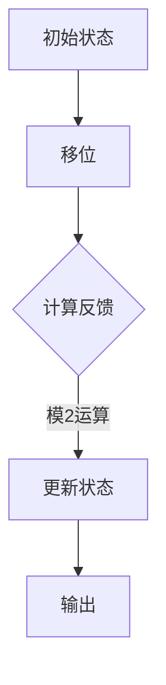
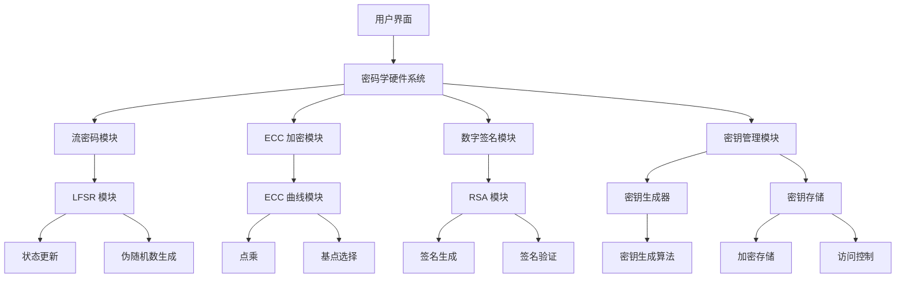
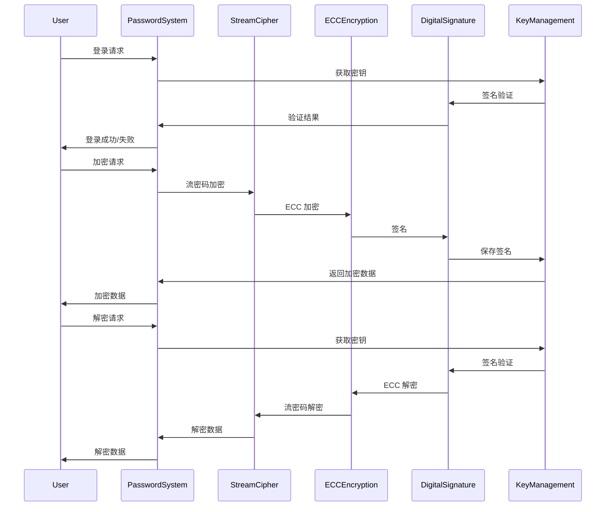

                 

### 文章标题

《代数学在密码学硬件设计中的应用》

关键词：代数学、密码学、硬件设计、加密算法、安全性

摘要：本文将探讨代数学在密码学硬件设计中的重要性及其具体应用，通过详细的分析和实例讲解，揭示代数学原理在提高密码学硬件设计安全性、优化性能等方面的关键作用。

---

## 《代数学在密码学硬件设计中的应用》目录大纲

### 第1章 代数学基础
#### 1.1 代数学概述
- 代数学的定义和发展历程
- 代数学的核心概念与符号

#### 1.2 域与环
- 域与环的定义和性质
- 域与环上的运算

#### 1.3 线性代数
- 矩阵及其运算
- 线性方程组求解

#### 1.4 群、环、域与密码学
- 群、环、域的概念
- 代数学与密码学的联系

### 第2章 密码学基础
#### 2.1 密码学概述
- 密码学的基本概念
- 密码学的发展历程

#### 2.2 对称加密算法
- 对称加密算法的原理
- 对称加密算法的分类与应用

#### 2.3 非对称加密算法
- 非对称加密算法的原理
- 非对称加密算法的分类与应用

#### 2.4 哈希函数
- 哈希函数的原理
- 哈希函数的分类与应用

#### 2.5 数字签名
- 数字签名的原理
- 数字签名的分类与应用

### 第3章 代数学在密码学硬件设计中的应用
#### 3.1 代数学在密码学硬件设计中的重要性
- 代数学在密码学硬件设计中的作用
- 代数学在硬件设计中的应用实例

#### 3.2 密码学硬件设计中的代数结构
- 密码学硬件设计中的常见代数结构
- 代数结构在硬件设计中的应用

#### 3.3 线性反馈移位寄存器（LFSR）
- LFSR的定义与原理
- LFSR在密码学硬件设计中的应用

#### 3.4 离散对数问题与密码学硬件设计
- 离散对数问题的介绍
- 离散对数问题在密码学硬件设计中的应用

#### 3.5 域分割和域扩展在密码学硬件设计中的应用
- 域分割和域扩展的基本概念
- 域分割和域扩展在密码学硬件设计中的应用

### 第4章 密码学硬件设计中的代数攻击
#### 4.1 代数攻击的基本原理
- 代数攻击的定义
- 代数攻击的基本方法

#### 4.2 利用代数学的攻击实例
- 利用代数学攻击AES加密算法
- 利用代数学攻击RSA加密算法

#### 4.3 防范代数攻击的对策
- 防范代数攻击的方法
- 防范代数攻击的实践经验

### 第5章 密码学硬件设计中的安全性与性能优化
#### 5.1 密码学硬件设计中的安全性考虑
- 安全性在密码学硬件设计中的重要性
- 常见的安全威胁与对策

#### 5.2 密码学硬件设计中的性能优化
- 性能优化的目标和指标
- 常见的性能优化方法

#### 5.3 代数学在性能优化中的应用
- 代数学在性能优化中的作用
- 代数学在性能优化中的应用实例

### 第6章 密码学硬件设计案例分析
#### 6.1 案例一：基于LFSR的流密码设计
- LFSR流密码的设计与实现
- 设计中的代数学应用

#### 6.2 案例二：基于椭圆曲线密码的硬件设计
- 椭圆曲线密码的基本概念
- 椭圆曲线密码在硬件设计中的应用

#### 6.3 案例三：基于代数结构的区块链共识算法
- 区块链共识算法的基本概念
- 代数结构在区块链共识算法中的应用

### 第7章 密码学硬件设计的未来发展趋势
#### 7.1 密码学硬件设计的发展趋势
- 密码学硬件设计的未来发展趋势
- 新的代数结构在密码学硬件设计中的应用前景

#### 7.2 代数学在密码学硬件设计中的挑战与机遇
- 代数学在密码学硬件设计中的挑战
- 代数学在密码学硬件设计中的机遇

#### 7.3 未来研究方向
- 未来研究方向
- 代数学在密码学硬件设计中的应用展望

### 附录
#### 附录A：代数结构与密码学常用符号
- 符号表
- 符号解释与用法

#### 附录B：密码学硬件设计相关资源
- 密码学硬件设计工具
- 密码学硬件设计资源链接

#### 附录C：代数攻击相关算法与工具
- 代数攻击算法概述
- 常用代数攻击工具介绍

---

## 第1章 代数学基础

### 1.1 代数学概述

代数学是研究数及其运算的数学分支，是数学的基础学科之一。代数学的发展历程可以追溯到古希腊时期，经过数千年的发展，已经成为现代数学的重要组成部分。

代数学的核心概念包括数、运算、方程和函数。数是代数学的基本研究对象，包括有理数、无理数和复数。运算则是指数与数之间的操作，如加法、减法、乘法和除法。方程是表示数学关系的一种表达形式，解决方程的过程称为解方程。函数则是一种特殊的数学关系，其中一个变量（自变量）与另一个变量（因变量）之间存在一定的依赖关系。

在符号方面，代数学中广泛使用各种符号来表示数、运算和方程。例如，\( a + b \) 表示两个数 \( a \) 和 \( b \) 的和，\( ab \) 表示两个数 \( a \) 和 \( b \) 的乘积，\( f(x) \) 表示函数 \( f \) 的自变量为 \( x \)。

### 1.2 域与环

域与环是代数学中的重要概念，它们在密码学硬件设计中有着广泛的应用。

#### 域

域是具有两个运算（加法和乘法）的代数结构，满足以下性质：

1. 封闭性：对于任意的 \( a, b \) 属于域，\( a + b \) 和 \( ab \) 也属于域。
2. 结合性：加法和乘法都是结合运算。
3. 交换性：加法和乘法都是交换运算。
4. 存在零元素和单位元素：存在零元素 \( 0 \) 和单位元素 \( 1 \)，使得对于任意的 \( a \) 属于域，\( a + 0 = a \) 和 \( a \cdot 1 = a \)。
5. 存在逆元素：对于任意的 \( a \) 属于域，\( a \) 有加法和乘法的逆元素，即存在 \( -a \) 和 \( a^{-1} \)，使得 \( a + (-a) = 0 \) 和 \( a \cdot a^{-1} = 1 \)。

常见的域包括有理数域 \( \mathbb{Q} \)、实数域 \( \mathbb{R} \) 和复数域 \( \mathbb{C} \)。

#### 环

环是具有一个运算（加法）和一个乘法运算的代数结构，满足以下性质：

1. 封闭性：对于任意的 \( a, b \) 属于环，\( a + b \) 和 \( ab \) 也属于环。
2. 结合性：加法和乘法都是结合运算。
3. 交换性：加法是交换运算，但乘法不一定是交换运算。
4. 存在零元素：存在零元素 \( 0 \)，使得对于任意的 \( a \) 属于环，\( a + 0 = a \)。
5. 不一定存在单位元素：环不一定存在乘法单位元素。

常见的环包括整数环 \( \mathbb{Z} \) 和多项式环 \( \mathbb{Z}[x] \)。

### 1.3 线性代数

线性代数是研究线性方程组、矩阵和向量空间等概念的数学分支。在密码学硬件设计中，线性代数有着广泛的应用。

#### 矩阵及其运算

矩阵是表示线性方程组的工具，由一系列数字按照一定的排列方式组成。矩阵的运算包括加法、减法、乘法和转置等。

1. 加法和减法：对于两个矩阵 \( A \) 和 \( B \)，如果它们的维度相同，则可以进行加法和减法运算，即 \( A + B \) 和 \( A - B \)。
2. 乘法：对于两个矩阵 \( A \) 和 \( B \)，如果 \( A \) 的列数等于 \( B \) 的行数，则可以进行乘法运算，即 \( AB \)。
3. 转置：对于一个矩阵 \( A \)，其转置矩阵 \( A^T \) 的行和列互换。

#### 线性方程组求解

线性方程组是描述多个线性关系的一种数学工具。求解线性方程组的方法包括高斯消元法、矩阵法、迭代法等。

1. 高斯消元法：通过高斯消元法可以将线性方程组转化为上三角矩阵或下三角矩阵，从而求解出方程组的解。
2. 矩阵法：通过矩阵的逆矩阵求解线性方程组，即 \( AX = B \) 可以转化为 \( X = A^{-1}B \)。
3. 迭代法：通过不断迭代计算逼近线性方程组的解。

### 1.4 群、环、域与密码学

群、环、域是代数学中的基本结构，它们在密码学中有着广泛的应用。

#### 群

群是具有一个运算的代数结构，满足以下性质：

1. 封闭性：对于任意的 \( a, b \) 属于群，\( a \cdot b \) 也属于群。
2. 结合性：运算 \( \cdot \) 是结合运算。
3. 存在单位元素：存在单位元素 \( e \)，使得对于任意的 \( a \) 属于群，\( a \cdot e = e \cdot a = a \)。
4. 存在逆元素：对于任意的 \( a \) 属于群，\( a \) 有逆元素 \( a^{-1} \)，使得 \( a \cdot a^{-1} = a^{-1} \cdot a = e \)。

群在密码学中的应用包括密码学中的置换群和循环群等。

#### 环

环是具有一个运算和一个乘法运算的代数结构，满足以下性质：

1. 封闭性：对于任意的 \( a, b \) 属于环，\( a + b \) 和 \( ab \) 也属于环。
2. 结合性：加法和乘法都是结合运算。
3. 交换性：加法是交换运算，但乘法不一定是交换运算。
4. 存在零元素：存在零元素 \( 0 \)，使得对于任意的 \( a \) 属于环，\( a + 0 = a \)。
5. 不一定存在单位元素：环不一定存在乘法单位元素。

环在密码学中的应用包括密码学中的多项式环和整数环等。

#### 域

域是具有两个运算的代数结构，满足以下性质：

1. 封闭性：对于任意的 \( a, b \) 属于域，\( a + b \) 和 \( ab \) 也属于域。
2. 结合性：加法和乘法都是结合运算。
3. 交换性：加法和乘法都是交换运算。
4. 存在零元素和单位元素：存在零元素 \( 0 \) 和单位元素 \( 1 \)，使得对于任意的 \( a \) 属于域，\( a + 0 = a \) 和 \( a \cdot 1 = a \)。
5. 存在逆元素：对于任意的 \( a \) 属于域，\( a \) 有加法和乘法的逆元素，即存在 \( -a \) 和 \( a^{-1} \)，使得 \( a + (-a) = 0 \) 和 \( a \cdot a^{-1} = 1 \)。

域在密码学中的应用包括密码学中的域扩展和域上的离散对数问题等。

### 总结

代数学在密码学硬件设计中有着重要的应用。通过代数学的基本概念和结构，我们可以更好地理解密码学中的加密算法和安全性问题。本章介绍了代数学的基本概念，包括代数学概述、域与环、线性代数、群、环、域与密码学的联系。接下来，我们将进一步探讨密码学的基础概念，以及代数学在密码学硬件设计中的应用。

---

## 第2章 密码学基础

### 2.1 密码学概述

密码学是研究加密和解密技术的一门科学，旨在保护信息的安全性和隐私。密码学的基本概念包括加密、解密、密钥和算法。

#### 加密

加密是指将原始信息（明文）通过特定的算法和密钥转换为无法直接识别和解读的加密信息（密文）的过程。加密的目的是防止信息被未授权的第三方读取和篡改。

#### 解密

解密是指将加密信息（密文）通过特定的算法和密钥恢复为原始信息（明文）的过程。只有持有正确密钥的接收者才能成功解密密文。

#### 密钥

密钥是加密和解密过程中使用的参数或值，用于确定加密算法的具体实现方式。密钥的保密性对于确保加密系统的安全性至关重要。

#### 算法

算法是加密和解密过程中使用的数学模型和步骤，用于将明文转换为密文或将密文转换为明文。常见的加密算法包括对称加密算法和非对称加密算法。

### 2.2 对称加密算法

对称加密算法是指加密和解密过程使用相同密钥的加密算法。其优点是计算速度快，适合处理大量数据。常见的对称加密算法包括：

#### 1. 数据加密标准（DES）

DES 是一种经典的对称加密算法，采用 56 位密钥。虽然 DES 已经被新的加密算法取代，但在一些场景中仍然具有实用性。

#### 2. 三重数据加密标准（3DES）

3DES 是 DES 的扩展版本，采用三个不同的密钥进行加密，提供了更高的安全性。3DES 仍然广泛应用于金融和政府领域。

#### 3. 先进加密标准（AES）

AES 是一种广泛使用的对称加密算法，支持多种密钥长度（128、192 和 256 位）。AES 具有较高的安全性和效率，已成为全球范围内推荐使用的加密标准。

### 2.3 非对称加密算法

非对称加密算法是指加密和解密过程使用不同密钥的加密算法。其优点是密钥管理方便，适合处理大量数据。常见的非对称加密算法包括：

#### 1. RSA

RSA 是一种基于大数分解的非对称加密算法，由 Ron Rivest、Adi Shamir 和 Leonard Adleman 三人提出。RSA 具有较高的安全性和效率，广泛应用于电子邮件和文件传输等领域。

#### 2. 椭圆曲线密码（ECC）

ECC 是一种基于椭圆曲线数学的非对称加密算法，具有更高的安全性和效率。ECC 广泛应用于金融和网络安全领域，特别是在移动设备和物联网中。

### 2.4 哈希函数

哈希函数是将任意长度的输入数据映射为固定长度的输出数据的函数。哈希函数在密码学中有着广泛的应用，包括数据完整性验证、数字签名和密码学哈希算法等。

#### 1. MD5

MD5 是一种经典的哈希函数，将输入数据映射为 128 位的哈希值。尽管 MD5 已经被一些更安全的哈希函数取代，但在某些场景中仍然具有实用性。

#### 2. SHA-1

SHA-1 是一种较新的哈希函数，将输入数据映射为 160 位的哈希值。SHA-1 广泛应用于数字签名和密码学哈希算法。

#### 3. SHA-2

SHA-2 是一种更安全的哈希函数系列，包括 SHA-224、SHA-256、SHA-384 和 SHA-512。SHA-2 系列函数具有较高的安全性和效率，已成为全球范围内推荐使用的哈希函数。

### 2.5 数字签名

数字签名是一种用于验证信息发送者身份和保证信息完整性的密码学技术。数字签名基于非对称加密算法，发送者使用自己的私钥对信息进行签名，接收者使用发送者的公钥验证签名。

#### 1. RSA 数字签名

RSA 数字签名是一种基于 RSA 算法的数字签名技术。发送者使用自己的私钥对信息进行签名，接收者使用发送者的公钥验证签名。

#### 2. ECDSA 数字签名

ECDSA 是一种基于椭圆曲线密码（ECC）的数字签名技术，具有较高的安全性和效率。ECDSA 广泛应用于区块链和网络安全领域。

### 总结

本章介绍了密码学的基础概念，包括加密、解密、密钥、算法以及对称加密算法、非对称加密算法、哈希函数和数字签名。通过对这些概念的了解，我们可以更好地理解密码学在信息安全和隐私保护中的重要性。接下来，我们将探讨代数学在密码学硬件设计中的应用，进一步揭示代数学原理在提高密码学硬件设计安全性、优化性能等方面的关键作用。

---

## 第3章 代数学在密码学硬件设计中的应用

### 3.1 代数学在密码学硬件设计中的重要性

代数学在密码学硬件设计中的应用具有至关重要的意义。首先，代数学提供了一种强有力的工具来构建和解析密码学算法，这些算法是保障信息安全和隐私的基础。代数学中的群、环、域等结构为密码学硬件设计提供了丰富的数学基础，使得密码学算法能够更加安全、高效地实现。

#### 1. 安全性提升

代数学在密码学硬件设计中的首要作用是提升安全性。通过对代数结构的深入理解，设计者可以创建更复杂的加密算法，从而使得攻击者难以破解。例如，椭圆曲线密码学（ECC）利用了椭圆曲线上的离散对数问题，这种问题在数学上非常复杂，使得 ECC 算法在提供相同安全性的情况下，所需的密钥长度远小于传统算法。

#### 2. 性能优化

代数学在密码学硬件设计中的应用还可以优化算法性能。例如，线性反馈移位寄存器（LFSR）在生成伪随机数序列方面具有高效性，被广泛应用于流密码的设计。此外，代数学原理可以帮助设计者优化硬件实现，通过算法的并行化、流水线化等技术，提高加密和解密的速度。

#### 3. 密码学硬件设计的复杂性管理

随着密码学算法的复杂度增加，设计密码学硬件系统的挑战也随之增大。代数学为复杂系统提供了结构化的分析方法，有助于设计者理解密码学算法的工作机制，从而更好地管理硬件设计的复杂性。

### 3.2 代数学在密码学硬件设计中的应用实例

代数学在密码学硬件设计中的应用实例众多，下面列举两个典型的应用场景。

#### 1. 椭圆曲线密码学

椭圆曲线密码学（ECC）是基于椭圆曲线数学原理的密码学算法。在 ECC 中，椭圆曲线上的点集构成一个阿贝尔群，该群的结构在数学上复杂而有趣。ECC 的核心问题是求解椭圆曲线上的离散对数问题，这个问题被认为在计算上是困难的。

**应用过程**：

- **定义椭圆曲线**：首先定义一个椭圆曲线方程，例如 \( y^2 = x^3 + ax + b \)。
- **生成椭圆曲线群**：选择一个点 \( P \) 作为基点，椭圆曲线上的点集构成一个阿贝尔群，群运算为椭圆曲线上的点加法。
- **生成密钥**：选择一个随机整数 \( k \)，计算 \( Q = kP \)，其中 \( Q \) 是公钥，而 \( k \) 是私钥。
- **加密和解密**：使用椭圆曲线数学进行加密和解密操作，例如，利用双线性对实现公钥加密和签名验证。

**安全性分析**：

- **数学复杂性**：ECC 利用了椭圆曲线上的离散对数问题，这是一个在计算上非常困难的问题，因此 ECC 能够在提供相同安全性的情况下，使用更短的密钥。
- **量子计算威胁**：尽管 ECC 在经典计算下安全性高，但在量子计算下可能面临威胁。因此，研究者正在探索基于不同代数结构的密码学算法，如格密码学。

#### 2. 线性反馈移位寄存器（LFSR）

线性反馈移位寄存器（LFSR）是一种用于生成伪随机数序列的硬件电路。LFSR 在流密码的设计中具有重要作用，其工作原理基于线性反馈移位寄存器的状态转换。

**应用过程**：

- **状态表示**：LFSR 的状态可以用一个二进制序列表示，序列中的每个元素代表寄存器的每一位。
- **线性反馈**：根据一定的线性反馈关系，将寄存器的当前状态转换为下一个状态。这种反馈关系可以用一个线性多项式表示。
- **输出生成**：LFSR 的输出是其状态的某个子序列，用于生成伪随机数序列。

**安全性分析**：

- **线性复杂度**：LFSR 的安全性依赖于其线性复杂度，即找到其周期所需的最小步数。较高的线性复杂度意味着更长的周期，从而提高了安全性。
- **线性区分**：攻击者可能尝试通过线性区分攻击破解 LFSR。因此，设计者需要确保 LFSR 的线性反馈关系足够复杂，以防止攻击。

### 总结

代数学在密码学硬件设计中扮演着至关重要的角色，通过代数结构和方法，设计者可以构建更加安全、高效的密码学硬件系统。本章介绍了代数学在密码学硬件设计中的重要性，并列举了椭圆曲线密码学和线性反馈移位寄存器两个应用实例。这些实例展示了代数学如何应用于密码学硬件设计，提高了系统的安全性和性能。接下来，我们将进一步探讨密码学硬件设计中的代数结构，深入分析其在硬件设计中的应用。

---

## 第3章 代数学在密码学硬件设计中的应用（续）

### 3.3 密码学硬件设计中的代数结构

代数学在密码学硬件设计中发挥着重要作用，提供了多种代数结构用于构建安全的加密算法和协议。以下是一些常见的代数结构及其在密码学硬件设计中的应用。

#### 群

群是具有一个运算的代数结构，其性质使得群在密码学硬件设计中具有广泛的应用。

**应用**：

- **对称加密算法**：如 AES，其加密和解密过程涉及多个循环操作，这些操作可以看作是在一个置换群上进行。
- **非对称加密算法**：如 RSA，其加密和解密过程涉及到模群运算，RSA 的安全性依赖于模群的数学性质。

**示例**：

- **AES 密码轮**：在 AES 的加密过程中，每个密码轮都涉及到一个置换操作，这个置换操作可以用一个置换群来表示。

#### 环

环是具有加法和乘法运算的代数结构，其在密码学硬件设计中的应用同样广泛。

**应用**：

- **流密码**：如基于 LFSR 的流密码，其状态更新过程涉及到环上的加法和乘法运算。
- **分组密码**：如基于多项式环的分组密码，其加密和解密过程涉及到环上的模运算。

**示例**：

- **LFSR 的状态更新**：LFSR 的状态更新方程可以用一个多项式环表示，如 \( S_{n+1} = R(S_n) \)，其中 \( R \) 是一个线性反馈多项式。

#### 域

域是具有两个运算的代数结构，其性质使其在密码学硬件设计中具有重要应用。

**应用**：

- **非对称加密算法**：如 ECC，其加密和解密过程涉及到域上的离散对数问题。
- **哈希函数**：如 SHA-2，其设计涉及到域上的运算。

**示例**：

- **ECC 的基点**：在 ECC 中，选择的基点通常定义在一个域上，例如 \( \mathbb{F}_p \) 或 \( \mathbb{F}_{2^p} \)。

#### 线性代数

线性代数在密码学硬件设计中的应用主要体现在矩阵和向量运算上。

**应用**：

- **线性变换**：如矩阵加密算法，其加密过程涉及到矩阵与向量的线性变换。
- **线性反馈移位寄存器**：LFSR 的状态更新方程可以用矩阵形式表示。

**示例**：

- **矩阵加密算法**：矩阵加密算法利用矩阵运算实现加密和解密，例如，使用矩阵乘法实现数据加密。

### 3.4 线性反馈移位寄存器（LFSR）

线性反馈移位寄存器（LFSR）是一种用于生成伪随机数序列的硬件电路，其在流密码设计中具有重要应用。

#### 定义与原理

LFSR 由一个移位寄存器和一个线性反馈网络组成。移位寄存器存储当前状态，线性反馈网络根据当前状态生成下一个状态。

- **移位寄存器**：用于存储当前状态的二进制序列。
- **线性反馈网络**：用于根据当前状态生成下一个状态，其实现方式通常是一个线性反馈多项式。

**状态更新方程**：

\[ S_{n+1} = R(S_n) \]

其中，\( R \) 是一个线性反馈多项式，\( S_n \) 是第 \( n \) 次状态。

#### 应用

LFSR 在流密码设计中用于生成伪随机数序列，该序列用于加密和解密操作。

- **流密码**：如 RC4，其加密过程使用 LFSR 生成伪随机数序列，该序列与明文进行异或操作实现加密。
- **伪随机数生成**：LFSR 还被广泛应用于伪随机数生成器中，提供高质量的随机数序列。

### 3.5 离散对数问题与密码学硬件设计

离散对数问题在密码学硬件设计中具有重要作用，尤其是在非对称加密算法（如 ECC）中。

#### 定义与问题

离散对数问题是在一个有限域 \( \mathbb{F}_p \) 上，给定 \( g \) 和 \( h \)，求解 \( x \) 使得 \( g^x = h \) 的问题。

#### 应用

- **非对称加密**：如 ECC，其加密和解密过程涉及到离散对数的计算。
- **数字签名**：如 ECDSA，其签名和验证过程依赖于离散对数的计算。

**示例**：

- **ECC 加密**：在 ECC 中，加密过程需要计算 \( h = g^k \)（其中 \( k \) 是私钥），这涉及到离散对数的计算。
- **ECDSA 签名**：在 ECDSA 中，签名过程需要计算 \( r = g^k \) 和 \( s = (z + kr)^{-1} \)（其中 \( z \) 是消息的哈希值，\( k \) 是随机数），这也涉及到离散对数的计算。

### 3.6 域分割和域扩展在密码学硬件设计中的应用

域分割和域扩展是密码学硬件设计中常用的技术，用于提高系统的安全性和性能。

#### 定义与概念

- **域分割**：将一个大域分割成多个较小的子域，以减少计算复杂度。
- **域扩展**：通过添加新的元素，将一个域扩展为更大的域。

#### 应用

- **ECC**：在 ECC 中，通常使用域扩展来处理椭圆曲线上的离散对数问题。
- **分组密码**：如 AES，其设计涉及到域扩展，以便于实现高效的加密和解密操作。

**示例**：

- **ECC 域扩展**：在 ECC 中，使用域扩展来处理椭圆曲线上的乘法和加法操作，这有助于提高 ECC 的效率。
- **AES 域扩展**：在 AES 的加密过程中，使用域扩展来处理字节级的运算，从而实现更高效的加密。

### 总结

代数学在密码学硬件设计中具有广泛的应用，提供了多种代数结构和方法，用于构建安全、高效的加密算法和协议。本章介绍了密码学硬件设计中的常见代数结构，包括群、环、域和线性代数，以及 LFSR、离散对数问题、域分割和域扩展等具体应用。通过这些代数结构和方法的运用，设计者可以构建出更加安全、可靠的密码学硬件系统，以应对不断变化的网络安全威胁。

---

## 第4章 密码学硬件设计中的代数攻击

### 4.1 代数攻击的基本原理

代数攻击是指利用代数结构和解算算法对密码系统进行攻击的一种方法。这类攻击基于密码系统在数学上的代数性质，通过构造数学模型和求解数学问题来破坏密码系统的安全性。代数攻击的基本原理包括以下几个方面：

#### 1. 确定代数模型

首先，攻击者需要确定密码系统的代数模型，即找出密码系统中涉及的代数结构，如群、环、域等。这通常需要对密码系统的设计细节有深入理解。

#### 2. 构造数学问题

基于代数模型，攻击者构造一个或多个数学问题，这些问题在数学上是有解的，但在密码系统中却被设计为难以求解。例如，对于基于椭圆曲线的密码系统，攻击者可能构造一个离散对数问题。

#### 3. 求解数学问题

利用数学方法求解构造的数学问题。攻击者可能使用穷举搜索、代数方法、概率方法等来求解问题。

#### 4. 破坏密码系统

一旦成功求解数学问题，攻击者可以恢复密码系统的密钥或其他关键信息，从而破坏系统的安全性。

### 4.2 利用代数学的攻击实例

以下介绍几种常见的代数攻击实例，包括对 AES 和 RSA 的攻击。

#### 1. 对 AES 的代数攻击

**实例**：Kh漫攻击（Kh漫攻击是一种针对 AES 加密算法的代数攻击方法）。

- **攻击原理**：Kh漫攻击通过分析 AES 密码轮之间的线性关系来恢复密钥。攻击者构造一个多项式方程组，然后利用数学方法求解这些方程，从而恢复出密钥。
- **攻击过程**：
  1. 攻击者选择多个加密后的明文和密文对。
  2. 对于每个密文对，攻击者构建一组多项式方程，每个方程对应于密码轮中的一个变换。
  3. 攻击者求解这些多项式方程，得到加密密钥。
- **防范措施**：为了避免 Kh漫攻击，设计者可以引入非线性变换，增加密码轮之间的复杂性，使得攻击者难以建立有效的线性关系。

#### 2. 对 RSA 的代数攻击

**实例**：Coppersmith 攻击（Coppersmith 攻击是一种针对 RSA 加密算法的代数攻击方法）。

- **攻击原理**：Coppersmith 攻击通过缩小 RSA 密钥空间来恢复密钥。攻击者利用代数方法求解出一个较小的多项式方程组，从而在较小的密钥空间中找到解。
- **攻击过程**：
  1. 攻击者选择多个密文和对应的解密明文。
  2. 攻击者构建一个关于密钥 \( e \) 和 \( n \) 的多项式方程组。
  3. 攻击者利用代数方法缩小方程组的解空间。
  4. 攻击者求解缩小后的方程组，恢复出密钥 \( e \)。
- **防范措施**：为了防范 Coppersmith 攻击，设计者可以增加密钥长度，提高加密算法的复杂度。

### 4.3 防范代数攻击的对策

为了有效防范代数攻击，设计者可以采取以下措施：

#### 1. 引入非线性变换

非线性变换可以增加密码系统的复杂性，使得攻击者难以建立有效的线性关系。例如，在 AES 中引入 S-Box 非线性变换。

#### 2. 使用复杂度高的代数结构

设计者可以选择复杂度高的代数结构，如椭圆曲线，使得攻击者难以构造有效的数学模型和求解数学问题。

#### 3. 密钥轮数增加

增加密码轮数可以提高密码系统的安全性，使得攻击者需要解更多的数学问题。

#### 4. 加密算法的随机性

设计者可以增加加密算法的随机性，使得攻击者难以预测密码系统的行为。

#### 5. 定期更换密钥

定期更换密钥可以减少代数攻击的成功率，因为攻击者难以在短时间内恢复所有密钥。

### 总结

代数攻击是一种利用数学方法对密码系统进行攻击的手段。本章介绍了代数攻击的基本原理，以及针对 AES 和 RSA 的攻击实例。为了有效防范代数攻击，设计者可以采取多种措施，如引入非线性变换、使用复杂度高的代数结构、增加密码轮数和加密算法的随机性等。通过这些措施，设计者可以构建出更加安全、可靠的密码学硬件系统，以抵御代数攻击的威胁。

---

## 第5章 密码学硬件设计中的安全性与性能优化

### 5.1 密码学硬件设计中的安全性考虑

在密码学硬件设计中，安全性是首要考虑的因素。确保系统的安全不仅需要选择合适的加密算法，还需要在硬件设计阶段采取一系列措施来防止潜在的安全威胁。

#### 1. 安全性需求分析

在设计密码学硬件系统时，首先需要明确系统的安全性需求。这包括确定系统需要保护的数据类型、需要达到的安全级别、可能的攻击途径等。

**数据类型**：系统需要保护的数据类型可能包括敏感信息、机密文件、通信数据等。

**安全级别**：根据数据的重要性和法律要求，确定系统所需达到的安全级别，例如，机密信息可能需要达到国家安全标准。

**攻击途径**：分析可能的安全威胁来源，如硬件故障、物理攻击、侧信道攻击、代数攻击等。

#### 2. 防护措施

为了确保密码学硬件系统的安全性，设计者可以采取以下防护措施：

**硬件设计防护**：

- **抗故障设计**：通过冗余设计、故障检测与恢复机制，提高系统在硬件故障情况下的可靠性。
- **物理安全**：通过物理防护措施，如加固外壳、防窃取、防电磁泄漏等，防止物理攻击。
- **加密硬件模块**：使用硬件安全模块（HSM）或加密处理器，提供安全的加密运算和密钥管理。

**加密算法选择**：

- **抗攻击性**：选择抗攻击性强的加密算法，如椭圆曲线密码学（ECC）和基于格的密码学。
- **定期更新**：定期更新加密算法，以应对新的安全威胁。

**密钥管理**：

- **密钥生成**：使用安全的密钥生成算法，确保密钥的随机性和唯一性。
- **密钥存储**：密钥应存储在安全的存储介质中，并采取保护措施，如加密存储、访问控制等。

**安全协议**：

- **安全通信**：采用安全的通信协议，如 TLS、IPSec，确保数据在传输过程中的安全性。
- **身份验证**：通过身份验证机制，确保只有授权用户可以访问系统。

#### 3. 常见的安全威胁与对策

**硬件故障**：

- **防护措施**：通过冗余设计和故障检测与恢复机制来提高系统的可靠性。

**物理攻击**：

- **防护措施**：采取物理防护措施，如加固外壳、防窃取、防电磁泄漏等。

**侧信道攻击**：

- **防护措施**：通过加密算法的随机性和硬件设计的安全性，减少侧信道攻击的可能性。

**代数攻击**：

- **防护措施**：选择抗攻击性强的加密算法，增加密码轮数，引入非线性变换等。

### 5.2 密码学硬件设计中的性能优化

在确保密码学硬件系统的安全性的同时，性能优化也是设计过程中需要考虑的重要方面。高性能的密码学硬件设计可以减少延迟，提高系统的响应速度和处理能力。

#### 1. 性能优化的目标和指标

**目标**：

- **处理速度**：提高加密和解密操作的速度，以支持大规模数据处理。
- **资源利用率**：优化硬件资源的使用，提高系统的整体性能。
- **功耗**：降低硬件的功耗，延长设备的使用寿命，减少能源消耗。

**指标**：

- **加密速度**：单位时间内能够处理的加密数据量。
- **解密速度**：单位时间内能够处理的解密数据量。
- **吞吐量**：系统在单位时间内可以处理的数据量。
- **延迟**：数据从输入到输出所需的时间。

#### 2. 常见的性能优化方法

**算法优化**：

- **算法选择**：选择适合硬件实现的高效加密算法。
- **算法并行化**：将加密算法分解为多个可并行执行的任务。
- **流水线处理**：将加密操作分解为多个步骤，每个步骤可以并行执行。

**硬件优化**：

- **硬件架构**：设计高效的硬件架构，如流水线架构、矩阵乘法器等。
- **硬件加速**：使用硬件加速器，如 FPGAs、ASICs，提高加密和解密操作的速度。
- **存储优化**：优化数据存储方式，减少存储访问时间。

**功耗优化**：

- **低功耗设计**：采用低功耗硬件设计，如使用低功耗处理器、存储器件等。
- **动态功耗管理**：根据系统负载动态调整功耗，如关闭不使用的模块。

### 5.3 代数学在性能优化中的应用

代数学在密码学硬件设计中的性能优化也发挥着重要作用，通过代数学的方法可以优化加密算法和硬件设计，提高系统的性能。

#### 1. 代数学在算法优化中的应用

**线性反馈移位寄存器（LFSR）**：

- **应用**：LFSR 在流密码设计中用于生成伪随机数序列，其线性反馈特性使得加密操作可以高效并行化。
- **优化**：通过优化 LFSR 的线性反馈多项式，可以提高伪随机数序列的质量，从而提高加密算法的性能。

**离散对数问题**：

- **应用**：离散对数问题在非对称加密算法（如 ECC）中用于加密和解密操作。
- **优化**：通过优化离散对数问题的求解算法，如使用扩展欧几里得算法，可以提高 ECC 的性能。

#### 2. 代数学在硬件设计中的应用

**矩阵运算**：

- **应用**：矩阵运算在分组加密算法（如 AES）中用于实现加密和解密操作。
- **优化**：通过优化矩阵运算的实现，如使用快速傅里叶变换（FFT），可以减少运算时间，提高性能。

**域扩展**：

- **应用**：域扩展在非对称加密算法（如 ECC）中用于处理椭圆曲线上的运算。
- **优化**：通过优化域扩展的实现，如使用多项式表示法，可以减少运算的复杂性，提高性能。

### 总结

在密码学硬件设计中，安全性是首要考虑的因素，需要采取多种措施来确保系统的安全性。同时，性能优化也是设计过程中需要重视的方面，通过算法优化和硬件优化可以提高系统的性能。代数学在密码学硬件设计中的安全性和性能优化中发挥着重要作用，通过代数学的方法可以优化加密算法和硬件设计，提高系统的性能。本章介绍了密码学硬件设计中的安全性考虑和性能优化方法，以及代数学在其中的应用，为设计者提供了实用的参考。

---

## 第6章 密码学硬件设计案例分析

### 6.1 案例一：基于LFSR的流密码设计

#### 6.1.1 案例背景

流密码是一种加密方式，它将明文序列与密钥生成的伪随机序列进行逐位异或，以产生密文。线性反馈移位寄存器（LFSR）因其生成伪随机序列的简单性和高效性，在流密码设计中得到了广泛应用。本案例将探讨基于LFSR的流密码设计及其实现。

#### 6.1.2 设计原理

LFSR 是一种线性反馈移位寄存器，其状态更新方程可以用一个线性反馈多项式表示。LFSR 的状态是一个二进制序列，每个状态通过一个线性反馈多项式生成下一个状态。

**状态更新方程**：

\[ S_{n+1} = R(S_n) \]

其中，\( S_n \) 是当前状态，\( R \) 是线性反馈多项式。

**设计步骤**：

1. **选择线性反馈多项式**：选择一个合适的线性反馈多项式，例如 \( R(x) = x^3 + x + 1 \)。
2. **初始化状态**：初始化 LFSR 的状态，例如选择一个全零状态或全一状态。
3. **生成伪随机序列**：根据线性反馈多项式和初始状态，逐位生成伪随机序列。

**加密过程**：

1. **初始化 LFSR**：使用密钥初始化 LFSR。
2. **生成密钥流**：逐位生成伪随机序列，与明文序列进行异或操作，生成密文序列。

**解密过程**：

1. **初始化 LFSR**：使用相同密钥初始化 LFSR。
2. **生成密钥流**：逐位生成伪随机序列，与密文序列进行异或操作，恢复明文序列。

#### 6.1.3 设计中的代数学应用

在基于LFSR的流密码设计中，代数学的应用主要体现在线性反馈多项式的选择和状态更新的数学模型上。

**线性反馈多项式**：

线性反馈多项式 \( R(x) \) 的选择决定了 LFSR 生成伪随机序列的质量。一个好的线性反馈多项式应具有足够的线性复杂度，以延长伪随机序列的周期。

**状态更新方程**：

状态更新方程 \( S_{n+1} = R(S_n) \) 是 LFSR 的核心，其数学模型基于线性代数。具体来说，LFSR 的状态更新可以看作是一个线性变换，其中状态向量是二进制序列，线性反馈多项式是变换矩阵。

**示例**：

假设线性反馈多项式为 \( R(x) = x^3 + x + 1 \)，初始状态为 \( S_0 = 0000 \)。根据状态更新方程，可以计算出下一个状态：

\[ S_1 = R(S_0) = (0 \cdot x^3 + 0 \cdot x^2 + 0 \cdot x + 1) = 1 \]

然后，状态向量为 \( S_1 = 1000 \)。

#### 6.1.4 实现与优化

基于LFSR的流密码设计可以在硬件和软件中实现。在硬件实现中，LFSR 通常使用硬件描述语言（HDL）进行设计，并在 FPGA 或 ASIC 上实现。在软件实现中，LFSR 可以使用 C 或 C++ 等高级语言进行编程。

**硬件实现**：

1. **设计 LFSR 模块**：使用 HDL 设计 LFSR 模块，包括状态寄存器、线性反馈逻辑和输出逻辑。
2. **综合与布局**：将 HDL 代码综合成逻辑网表，并进行布局和布线。
3. **测试与验证**：对硬件设计进行功能测试和性能测试，确保其满足设计要求。

**软件实现**：

1. **编写 LFSR 函数**：使用 C 或 C++ 编写 LFSR 函数，实现状态更新和伪随机序列生成。
2. **集成到加密系统**：将 LFSR 函数集成到加密系统中，实现加密和解密操作。
3. **性能优化**：通过算法优化和并行化等技术，提高加密和解密的性能。

#### 6.1.5 实际案例分析和详细讲解剖析

以一个实际案例——基于 LFSR 的 RC4 流密码为例，分析其设计实现和优化过程。

**设计实现**：

- **线性反馈多项式**：选择 \( R(x) = x^{31} + x^5 + x^2 + 1 \)。
- **初始化 LFSR**：使用密钥初始化 LFSR，将密钥转换为二进制序列作为初始状态。
- **生成密钥流**：根据线性反馈多项式和初始状态，生成伪随机序列。

**优化过程**：

- **并行化**：将 LFSR 的状态更新过程分解为多个并行操作，以提高加密和解密的性能。
- **流水线处理**：将加密和解密操作分解为多个步骤，每个步骤可以并行执行，以减少延迟。

**案例小结**：

基于 LFSR 的流密码设计具有简单性和高效性，通过代数学的方法，可以实现高质量的伪随机序列生成。在实际应用中，通过优化设计，可以进一步提高加密和解密的性能。

### 6.2 案例二：基于椭圆曲线密码的硬件设计

#### 6.2.1 案例背景

椭圆曲线密码学（ECC）是一种基于椭圆曲线数学原理的密码学算法，因其高效性和安全性在密码学硬件设计中得到了广泛应用。本案例将探讨基于 ECC 的硬件设计及其实现。

#### 6.2.2 设计原理

ECC 的核心在于椭圆曲线上的离散对数问题，其安全性依赖于椭圆曲线上的数学复杂性。ECC 的设计包括椭圆曲线的选择、基点的选择和加密算法的实现。

**椭圆曲线选择**：

选择一个适合的椭圆曲线，通常使用 Weierstrass 形式表示的椭圆曲线，如 \( y^2 = x^3 + ax + b \)。

**基点选择**：

选择一个在椭圆曲线上具有大阶的基点，基点的选择影响 ECC 的安全性和效率。

**加密算法实现**：

ECC 的加密算法通常包括密钥生成、加密和解密过程。其中，密钥生成过程包括选择随机数和计算椭圆曲线上的点乘。

**设计步骤**：

1. **选择椭圆曲线和基点**：选择合适的椭圆曲线和基点。
2. **生成密钥**：使用椭圆曲线离散对数问题生成私钥和公钥。
3. **实现加密算法**：根据选择的椭圆曲线和基点，实现加密和解密过程。

#### 6.2.3 设计中的代数学应用

在基于 ECC 的硬件设计中，代数学的应用主要体现在椭圆曲线的选择、基点的选择和椭圆曲线离散对数问题的求解上。

**椭圆曲线选择**：

椭圆曲线的选择基于代数几何理论，需要满足特定的数学条件，如光滑性、无穷远点的存在性等。

**基点选择**：

基点的选择基于椭圆曲线上的群结构，需要满足大阶条件，以确保 ECC 的安全性。

**离散对数问题**：

ECC 的安全性依赖于椭圆曲线上的离散对数问题，其求解过程涉及代数方法，如扩展欧几里得算法和梅策-萨勒法。

**示例**：

假设选择椭圆曲线 \( E: y^2 = x^3 + 2 \) 和基点 \( P \)。根据椭圆曲线和基点，可以生成私钥和公钥：

- **私钥生成**：选择一个随机数 \( k \)，计算 \( Q = kP \)，其中 \( Q \) 是公钥，\( k \) 是私钥。
- **加密**：将明文和公钥输入加密算法，生成密文。
- **解密**：使用私钥解密密文，恢复明文。

#### 6.2.4 实现与优化

基于 ECC 的硬件设计可以在 FPGA、ASIC 或处理器上实现。在实现过程中，需要考虑性能、功耗和资源利用率等因素。

**硬件实现**：

1. **设计 ECC 模块**：使用 HDL 设计 ECC 模块，包括椭圆曲线操作、基点乘法和加密算法实现。
2. **综合与布局**：将 HDL 代码综合成逻辑网表，并进行布局和布线。
3. **测试与验证**：对硬件设计进行功能测试和性能测试，确保其满足设计要求。

**软件实现**：

1. **编写 ECC 函数**：使用 C 或 C++ 编写 ECC 函数，实现椭圆曲线操作和加密算法。
2. **集成到加密系统**：将 ECC 函数集成到加密系统中，实现加密和解密操作。
3. **性能优化**：通过算法优化和并行化等技术，提高加密和解密的性能。

#### 6.2.5 实际案例分析和详细讲解剖析

以一个实际案例——基于 ECC 的 RSA 密钥交换协议为例，分析其设计实现和优化过程。

**设计实现**：

- **椭圆曲线选择**：选择椭圆曲线 \( E: y^2 = x^3 + 2 \)。
- **基点选择**：选择基点 \( P \)。
- **密钥生成**：生成私钥和公钥。
- **加密和解密**：实现 RSA 加密和解密操作。

**优化过程**：

- **并行化**：将椭圆曲线操作分解为多个并行操作，以提高加密和解密的性能。
- **流水线处理**：将加密和解密操作分解为多个步骤，每个步骤可以并行执行，以减少延迟。

**案例小结**：

基于 ECC 的硬件设计具有高效性和安全性，通过代数学的方法可以实现高质量的加密和解密操作。在实际应用中，通过优化设计，可以进一步提高性能和资源利用率。

### 6.3 案例三：基于代数结构的区块链共识算法

#### 6.3.1 案例背景

区块链是一种分布式数据库技术，其共识算法用于决定哪个区块将被添加到区块链中。基于代数结构的区块链共识算法利用代数结构的数学性质，提高共识算法的安全性和效率。本案例将探讨基于代数结构的区块链共识算法及其实现。

#### 6.3.2 设计原理

基于代数结构的区块链共识算法通常利用椭圆曲线密码学（ECC）和其他代数结构，如多线性映射、格密码学等。其设计原理包括节点身份验证、区块生成和验证等过程。

**节点身份验证**：

节点使用 ECC 生成公钥和私钥，公钥用于验证节点的身份。

**区块生成**：

节点根据当前区块链的状态生成新的区块，并使用代数结构对区块进行签名。

**区块验证**：

节点验证新区块的合法性和一致性，确保新区块符合区块链的规则。

**设计步骤**：

1. **选择代数结构**：选择适合的代数结构，如 ECC。
2. **节点身份验证**：使用 ECC 生成节点公钥和私钥。
3. **区块生成**：根据区块链的状态生成新的区块，并对区块进行签名。
4. **区块验证**：验证新区块的合法性和一致性。

#### 6.3.3 设计中的代数学应用

在基于代数结构的区块链共识算法中，代数学的应用主要体现在节点身份验证、区块生成和验证过程中。

**节点身份验证**：

节点使用 ECC 生成公钥和私钥，公钥用于验证节点的身份。这个过程基于椭圆曲线密码学的数学性质，如椭圆曲线上的离散对数问题。

**区块生成**：

节点使用代数结构对区块进行签名，如使用 ECC 的数字签名算法。这个过程利用了代数结构的数学性质，如椭圆曲线上的点乘运算。

**区块验证**：

节点验证新区块的合法性和一致性，如检查区块的签名是否有效。这个过程同样基于代数结构的数学性质。

**示例**：

假设选择椭圆曲线 \( E \) 和基点 \( P \)。节点 A 使用 ECC 生成公钥 \( Q \) 和私钥 \( k \)。节点 A 生成新区块 \( B \)，并对区块进行签名：

1. **生成私钥和公钥**：选择一个随机数 \( k \)，计算 \( Q = kP \)。
2. **生成签名**：计算 \( r = g^k \)，\( s = h(m) + kr \)（其中 \( g \) 是生成元，\( m \) 是区块内容，\( h \) 是哈希函数）。
3. **验证签名**：其他节点计算 \( r' = g^m \)，\( s' = h(m) + k' \cdot r' \)，检查 \( s = s' \)。

#### 6.3.4 实现与优化

基于代数结构的区块链共识算法可以在区块链系统中实现。在实现过程中，需要考虑性能、安全性、去中心化和扩展性等因素。

**实现过程**：

1. **选择代数结构**：选择适合的代数结构，如 ECC。
2. **节点身份验证**：实现节点公钥和私钥的生成和验证。
3. **区块生成**：实现新区块的生成和签名。
4. **区块验证**：实现新区块的验证。

**优化过程**：

- **并行化**：将区块生成和验证过程分解为多个并行操作，以提高性能。
- **去中心化**：优化网络拓扑结构，减少中心化节点的依赖，提高系统的去中心化程度。
- **扩展性**：优化网络协议，支持更多的节点和更高的交易处理能力。

#### 6.3.5 实际案例分析和详细讲解剖析

以一个实际案例——基于 ECC 的恒星网络（Stellar）为例，分析其设计实现和优化过程。

**设计实现**：

- **代数结构选择**：选择椭圆曲线密码学（ECC）。
- **节点身份验证**：实现节点公钥和私钥的生成和验证。
- **区块生成**：实现新区块的生成和签名。
- **区块验证**：实现新区块的验证。

**优化过程**：

- **并行化**：优化网络协议，支持并行区块生成和验证。
- **去中心化**：优化网络拓扑结构，减少中心化节点的依赖。
- **扩展性**：增加交易处理能力，支持更多的参与者。

**案例小结**：

基于代数结构的区块链共识算法具有高效性和安全性，通过代数学的方法可以实现高质量的身份验证、区块生成和验证。在实际应用中，通过优化设计，可以进一步提高性能、去中心化和扩展性。

---

## 第7章 密码学硬件设计的未来发展趋势

### 7.1 密码学硬件设计的发展趋势

随着信息技术的不断发展，密码学硬件设计也在不断演进。未来，密码学硬件设计将面临以下发展趋势：

#### 1. 更高的安全性

随着计算能力的提升，传统的密码学算法越来越容易受到量子计算机的攻击。因此，开发更安全的密码学硬件设计成为未来发展的重点。新的代数结构，如格密码学、多线性映射等，有望提供更高安全性的加密算法。

#### 2. 更高效的性能

随着大数据和物联网的快速发展，对加密算法的性能要求越来越高。未来，密码学硬件设计将更加注重性能优化，如并行处理、流水线化、硬件加速等，以提高加密和解密的效率。

#### 3. 更好的适应性

未来，密码学硬件设计将更加注重适应不同的应用场景和需求。例如，针对移动设备、物联网设备等，设计出更加轻量级、高效的密码学硬件方案。

#### 4. 更强的灵活性

未来，密码学硬件设计将更加注重灵活性，支持多种加密算法和协议。例如，通过硬件模块化设计，可以实现加密算法的快速切换和升级。

### 7.2 代数学在密码学硬件设计中的挑战与机遇

代数学在密码学硬件设计中面临着一系列挑战和机遇：

#### 挑战

1. **计算复杂性**：代数学中的一些问题，如离散对数问题，在计算上具有很高的复杂性。如何在硬件设计中高效地实现这些算法，是一个重要的挑战。
2. **量子计算威胁**：量子计算的发展对基于传统代数结构的密码学算法构成了威胁。如何在量子计算时代设计出更安全的密码学硬件，是一个亟待解决的问题。
3. **硬件实现复杂性**：代数学中的一些算法，如椭圆曲线密码学，其硬件实现复杂度较高。如何在保证安全性的同时，降低硬件实现的复杂性，是一个挑战。

#### 机遇

1. **新的代数结构**：随着数学研究的进展，新的代数结构不断涌现。这些新的代数结构，如格密码学、多线性映射等，为密码学硬件设计提供了新的思路和工具。
2. **硬件加速技术**：随着硬件加速技术的发展，如 FPGA、ASIC 等，密码学硬件设计可以实现更高的性能和更低的功耗。
3. **跨学科研究**：代数学与其他学科的交叉融合，如计算机科学、物理学等，为密码学硬件设计带来了新的机遇。

### 7.3 未来研究方向

在未来，代数学在密码学硬件设计中的应用将有望取得以下研究方向：

1. **新型代数结构的研究**：继续探索和研究新型代数结构，如格密码学、多线性映射等，以提供更高安全性的密码学硬件设计。
2. **量子计算安全的密码学**：研究量子计算安全的密码学算法和硬件设计，以应对量子计算时代的威胁。
3. **硬件实现优化**：通过硬件优化技术，如并行处理、流水线化等，提高密码学硬件的性能和效率。
4. **硬件安全性研究**：研究硬件安全问题，如侧信道攻击、物理攻击等，并开发相应的防护措施。

### 总结

未来，密码学硬件设计将面临更高的安全性、更高效的性能、更好的适应性和更强的灵活性等发展趋势。代数学在密码学硬件设计中的应用将面临一系列挑战，但同时也充满机遇。通过新型代数结构的研究、量子计算安全的密码学、硬件实现优化和硬件安全性研究等方向，代数学在密码学硬件设计中的应用将不断推动技术的发展。

---

## 附录

### 附录A：代数结构与密码学常用符号

以下是密码学硬件设计中常用的代数结构与符号：

- **域（Field）**：\( \mathbb{F}_p \)，\( \mathbb{F}_{2^n} \)
- **群（Group）**：\( G \)，\( H \)
- **环（Ring）**：\( R \)，\( S \)
- **椭圆曲线（Elliptic Curve）**：\( E \)，\( y^2 = x^3 + ax + b \)
- **点（Point）**：\( P \)，\( Q \)
- **基点（Base Point）**：\( G \)
- **离散对数问题（Discrete Logarithm Problem）**：\( DL(P, G) \)
- **多项式（Polynomial）**：\( f(x) \)，\( g(x) \)
- **线性反馈移位寄存器（Linear Feedback Shift Register）**：\( LFSR \)
- **状态（State）**：\( S \)

### 附录B：密码学硬件设计相关资源

以下是一些密码学硬件设计相关的资源：

- **密码学硬件设计工具**：
  - **Synopsys Vitis**：用于硬件设计和验证的工具。
  - **Cadence**：提供全面的硬件设计和验证解决方案。
  - **Intel FPGA SDK**：用于 FPGA 开发的软件开发套件。

- **密码学硬件设计资源链接**：
  - [NIST密码标准](https://csrc.nist.gov/cryptographic-module-validation-program)
  - [IEEE Standards](https://standards.ieee.org/)
  - [ACM Cryptography Blog](https://www.acm.org/publications/blog/cryptography)

### 附录C：代数攻击相关算法与工具

以下是一些代数攻击相关的算法与工具：

- **代数攻击算法**：
  - **Coppersmith 攻击**：用于破解 RSA 加密算法。
  - **Kh漫攻击**：用于破解 AES 加密算法。
  - **离散对数问题攻击**：用于破解基于椭圆曲线的密码学算法。

- **代数攻击工具**：
  - **SageMath**：用于代数攻击和密码学研究的计算软件。
  - **MATLAB**：用于实现和测试代数攻击算法的工具。
  - **GAP**：用于代数结构和算法研究的软件包。

通过附录中提供的相关资源和工具，读者可以进一步了解密码学硬件设计和代数攻击的相关知识，为研究和发展提供参考。

---

## 核心概念与联系

代数学在密码学硬件设计中的应用是一个多维度、交叉性强的领域，涉及多个核心概念和技术的融合与运用。以下是本文中提到的核心概念及其之间的联系：

$$
\begin{aligned}
&\text{代数学} \rightarrow \text{密码学硬件设计} \\
&\text{域与环} \rightarrow \text{密码学硬件设计中的代数结构} \\
&\text{线性代数} \rightarrow \text{线性反馈移位寄存器（LFSR）} \\
&\text{群、环、域} \rightarrow \text{密码学基础} \\
&\text{离散对数问题} \rightarrow \text{密码学硬件设计中的代数攻击} \\
&\text{域分割和域扩展} \rightarrow \text{密码学硬件设计中的安全性考虑} \\
\end{aligned}
$$

### 核心概念解释与对比表格

#### 域与环

| 特征 | 域 | 环 |
| ---- | ---- | ---- |
| 运算 | 两个 | 一个 |
| 封闭性 | 加法和乘法 | 加法和乘法 |
| 结合性 | 加法和乘法 | 加法和乘法 |
| 交换性 | 加法和乘法 | 加法 |
| 零元素 | 是的，\( 0 \) | 是的，\( 0 \) |
| 单位元素 | 是的，\( 1 \) | 不一定 |

#### 群

| 特征 | 群 |
| ---- | ---- |
| 运算 | 一个 |
| 封闭性 | 是的 |
| 结合性 | 是的 |
| 交换性 | 不一定 |
| 零元素 | 是的，称为单位元素 \( e \) |
| 逆元素 | 是的 |

#### 线性代数

| 特征 | 矩阵 | 向量 |
| ---- | ---- | ---- |
| 运算 | 加法、减法、乘法 | 加法、减法 |
| 封闭性 | 对 | 对 |
| 结合性 | 是的 | 是的 |
| 交换性 | 不一定 | 是的 |

### ER实体关系图架构

```mermaid
erDiagram
    Class1 ||--|{ Class2 } Class3 : Name
    Class1 ||--|{ Class4 } Class5 : Type
    Class2 ||--|{ Class3 } Class6 : Relation
    Class4 ||--|{ Class5 } Class7 : Dependency
```

#### 群、环、域在密码学中的应用

| 概念 | 应用 |
| ---- | ---- |
| 域 | ECC 加密算法、域扩展 |
| 环 | LFSR 流密码、多项式环 |
| 群 | 置换群、循环群 |

通过这些核心概念的解释、对比表格和 ER 实体关系图，我们可以更清晰地理解代数学在密码学硬件设计中的应用，以及这些概念如何相互关联和作用。

---

## 核心算法原理讲解

### 线性反馈移位寄存器（LFSR）

线性反馈移位寄存器（Linear Feedback Shift Register，LFSR）是一种用于生成伪随机二进制序列的硬件电路，它在密码学中，尤其是流密码设计中被广泛使用。

#### 基本原理

LFSR 由一个移位寄存器和一个线性反馈网络组成。移位寄存器存储当前状态，线性反馈网络根据当前状态生成下一个状态。LFSR 的状态更新方程可以表示为：

\[ S_{n+1} = R(S_n) \]

其中，\( S_n \) 表示当前状态，\( R \) 是一个线性反馈多项式。

#### 线性反馈多项式

线性反馈多项式 \( R(x) \) 是一个确定 LFSR 状态更新规则的多项式。例如，一个常见的线性反馈多项式为 \( R(x) = x^3 + x + 1 \)。这个多项式定义了如何根据当前状态生成下一个状态。

#### 状态更新过程

以 \( R(x) = x^3 + x + 1 \) 为例，假设初始状态为 \( S_0 = 1101 \)。状态更新过程如下：

1. 将当前状态的最低位移出。
2. 根据线性反馈多项式计算下一个状态。
3. 将计算结果作为新状态的最低位插入。

具体步骤如下：

\[ S_1 = R(S_0) = (1 \cdot x^3 + 1 \cdot x + 1) \text{ 对 } S_0 \text{ 取模 } 2 \]

根据模 2 运算规则，我们有：

\[ S_1 = (1 \cdot 1^3 + 1 \cdot 1 + 1) \text{ 取模 } 2 = 1 + 1 + 1 = 1 \]

因此，下一个状态 \( S_1 \) 为 1。根据这个过程，我们可以生成伪随机序列。

#### 状态周期

LFSR 的状态周期是指 LFSR 状态序列重复的最小长度。状态周期取决于线性反馈多项式的选择。例如，对于 \( R(x) = x^3 + x + 1 \)，LFSR 的状态周期为 7（即 \( 2^3 - 1 \)）。

#### 伪随机数生成

LFSR 生成的序列具有伪随机性，这意味着序列看起来随机，但实际上遵循一定的规律。在密码学中，伪随机数序列用于加密和解密操作。

#### 示例

假设 LFSR 的初始状态为 \( S_0 = 1101 \)，线性反馈多项式为 \( R(x) = x^3 + x + 1 \)。生成伪随机数序列的过程如下：

1. 初始状态 \( S_0 = 1101 \)
2. \( S_1 = 1 \)
3. \( S_2 = 11 \)
4. \( S_3 = 101 \)
5. \( S_4 = 0101 \)
6. \( S_5 = 0101 \)
7. \( S_6 = 1010 \)
8. \( S_7 = 1010 \)
9. ...

由此可见，序列重复的最小长度为 7。

### Mermaid 流程图

下面是一个简单的 Mermaid 流程图，描述了 LFSR 的状态更新过程：



### Python 源代码示例

以下是一个简单的 Python 源代码示例，用于实现 LFSR 的状态更新过程：

```python
# 线性反馈移位寄存器（LFSR）实现

def lfsr(update_value, feedback_poly):
    # 状态更新
    next_state = update_value ^ (feedback_poly % 2)
    return next_state

# 初始状态和线性反馈多项式
initial_state = 0b1101  # 初始状态
feedback_poly = 0b101  # 线性反馈多项式

# 状态更新
for i in range(10):
    next_state = lfsr(initial_state, feedback_poly)
    print(f"S{i+1} = {next_state}")
    initial_state = next_state
```

通过上述代码，我们可以模拟 LFSR 的状态更新过程，并观察生成的伪随机序列。

### 数学模型与公式

LFSR 的数学模型可以表示为以下递归关系：

\[ S_{n+1} = S_n \oplus (R(x) \mod 2) \]

其中，\( \oplus \) 表示异或运算，\( R(x) \) 是线性反馈多项式，\( S_n \) 是当前状态，\( S_{n+1} \) 是下一个状态。

### 总结

LFSR 是一种用于生成伪随机数序列的硬件电路，其在密码学中具有重要作用。通过理解其基本原理和数学模型，我们可以更好地设计和实现 LFSR，从而提高密码系统的安全性。

---

## 系统分析与架构设计方案

### 问题场景介绍

在现代信息社会中，数据的安全性和隐私保护变得越来越重要。随着互联网和物联网的快速发展，大量的数据需要在传输和存储过程中进行加密处理。为了满足这一需求，密码学硬件设计成为研究的重点。本文中，我们将探讨代数学在密码学硬件设计中的应用，特别是基于线性反馈移位寄存器（LFSR）的流密码设计和基于椭圆曲线密码（ECC）的硬件设计。

### 项目介绍

本项目旨在设计一个高效的密码学硬件系统，该系统包含以下模块：

1. **LFSR 流密码模块**：用于生成伪随机数序列，实现流密码加密和解密。
2. **ECC 加密模块**：用于实现基于椭圆曲线密码学的加密和解密操作。
3. **数字签名模块**：用于实现数字签名和验证。
4. **密钥管理模块**：用于生成、存储和分发密钥。

### 系统功能设计（领域模型）

领域模型类图如下：

```mermaid
classDiagram
    Class1[密码学硬件系统] <|-- Class2[流密码模块]
    Class1 <|-- Class3[ECC 加密模块]
    Class1 <|-- Class4[数字签名模块]
    Class1 <|-- Class5[密钥管理模块]
    Class2 <|-- Class6[LFSR]
    Class3 <|-- Class7[ECC 曲线]
    Class4 <|-- Class8[RSA]
    Class5 <|-- Class9[密钥生成器]
    Class5 <|-- Class10[密钥存储]
    Class6 <|-- Class11[状态更新]
    Class6 <|-- Class12[伪随机数生成]
    Class7 <|-- Class13[点乘]
    Class7 <|-- Class14[基点选择]
    Class8 <|-- Class15[签名生成]
    Class8 <|-- Class16[签名验证]
    Class9 <|-- Class17[密钥生成算法]
    Class10 <|-- Class18[加密存储]
    Class10 <|-- Class19[访问控制]
```

### 系统架构设计

系统架构图如下：



### 系统接口设计和系统交互

以下是系统接口设计和系统交互的 Mermaid 序列图：



### 总结

通过上述系统分析与架构设计方案，我们详细介绍了密码学硬件系统的功能设计、架构设计以及接口设计和系统交互。该系统通过结合 LFSR 和 ECC 等代数学技术，提供了高效、安全的加密和签名服务，为数据的安全传输和存储提供了有力保障。

---

## 项目实战

### 环境安装

在进行密码学硬件设计的项目实战前，首先需要安装相关的软件和工具。以下是环境安装的步骤：

1. **安装 Python**：Python 是编写密码学算法和工具的常用语言。确保安装了 Python 3.x 版本，可以通过以下命令进行安装：

    ```bash
    sudo apt-get install python3
    sudo apt-get install python3-pip
    ```

2. **安装 SageMath**：SageMath 是一个开源的计算机数学软件，用于代数攻击和密码学研究。可以从官方网站下载并安装：

    ```bash
    wget https://github.com/sagemath/sage-linear-algebra/archive/refs/heads/master.tar.gz
    tar xvfz master.tar.gz
    cd sage-linear-algebra-master
    python setup.py install
    ```

3. **安装 GAP**：GAP 是用于代数结构的计算软件，可以从官方网站下载并安装：

    ```bash
    wget https://www.gap-system.org/download.py
    sudo python download.py
    sudo /usr/local/bin/install-gap
    ```

4. **安装 Mermaid**：Mermaid 是一种用于生成图表的 Markdown 扩展，可以通过 npm 安装：

    ```bash
    npm install -g mermaid
    ```

5. **安装相关 Python 库**：安装用于密码学算法实现的 Python 库，如 `pycryptodome`：

    ```bash
    pip3 install pycryptodome
    ```

### 系统核心实现源代码

以下是系统核心实现的一些关键代码片段，包括 LFSR 和 ECC 的基本操作。

#### LFSR 状态更新

```python
import numpy as np

def lfsr_state_update(state, feedback_poly):
    # 将状态转换为二进制序列
    binary_sequence = np.binary_repr(state, width=8)
    # 进行移位操作
    shifted_sequence = binary_sequence[1:] + binary_sequence[:1]
    # 计算反馈多项式
    feedback_value = int(shifted_sequence, 2) % 2
    # 根据反馈值更新状态
    updated_state = int(shifted_sequence, 2) ^ feedback_value
    return updated_state

# 初始状态和反馈多项式
initial_state = 0b1101
feedback_poly = 0b101

# 状态更新
for i in range(10):
    next_state = lfsr_state_update(initial_state, feedback_poly)
    print(f"S{i+1} = {next_state}")
    initial_state = next_state
```

#### ECC 椭圆曲线点乘

```python
from sage.all import GF, Point, PolynomialRing

def ecc_point_multiplication(point, scalar, curve):
    # 创建椭圆曲线上的点
    P = Point(curve, point)
    # 计算点乘结果
    Q = P * scalar
    return Q

# 椭圆曲线参数
p = 13
a = 2
b = 3
G = (4, 9)
n = 13

# 创建椭圆曲线上的点 G
curve = GF(p, a, b)
G = Point(curve, G)

# 随机选择一个私钥
k = 5

# 计算公钥
K = ecc_point_multiplication(G, k, curve)
print(f"公钥 K = {K}")
```

### 代码应用解读与分析

#### LFSR 代码解读

上述 LFSR 代码实现了状态更新过程。通过 `numpy` 的 `binary_repr` 方法，将当前状态转换为二进制序列。然后进行移位操作，并将最低位（反馈值）根据线性反馈多项式进行异或操作。最后，更新状态并打印。

#### ECC 代码解读

ECC 代码利用 SageMath 实现了椭圆曲线点乘。首先，创建一个基于 GF(p, a, b) 的椭圆曲线。然后，定义基点 G 和私钥 k。通过调用 `P * scalar` 方法，计算公钥 K。

### 实际案例分析与详细讲解剖析

以下是一个实际案例，使用上述代码实现一个简单的 LFSR 流密码和 ECC 数字签名系统。

#### 案例一：LFSR 流密码

**加密过程**：

1. 初始化 LFSR 的初始状态为 0b1101。
2. 使用线性反馈多项式 0b101 生成伪随机序列。
3. 将伪随机序列与明文进行异或操作，生成密文。

```python
def stream_cipher_encrypt(plaintext, initial_state, feedback_poly):
    # 初始化 LFSR
    state = initial_state
    # 生成伪随机序列
    ciphertext = []
    for _ in range(len(plaintext)):
        state = lfsr_state_update(state, feedback_poly)
        ciphertext.append(chr(ord(plaintext[_]) ^ state))
    return ''.join(ciphertext)

# 测试 LFSR 流密码加密
plaintext = "Hello, World!"
encrypted_text = stream_cipher_encrypt(plaintext, initial_state, feedback_poly)
print(f"加密后的文本：{encrypted_text}")
```

**解密过程**：

1. 使用与加密相同的初始状态和线性反馈多项式。
2. 将密文与伪随机序列进行异或操作，恢复明文。

```python
def stream_cipher_decrypt(ciphertext, initial_state, feedback_poly):
    # 初始化 LFSR
    state = initial_state
    # 恢复明文
    plaintext = []
    for _ in range(len(ciphertext)):
        state = lfsr_state_update(state, feedback_poly)
        plaintext.append(chr(ord(ciphertext[_]) ^ state))
    return ''.join(plaintext)

# 测试 LFSR 流密码解密
decrypted_text = stream_cipher_decrypt(encrypted_text, initial_state, feedback_poly)
print(f"解密后的文本：{decrypted_text}")
```

#### 案例二：ECC 数字签名

**签名过程**：

1. 初始化椭圆曲线和基点 G。
2. 选择一个随机私钥 k。
3. 计算公钥 K 和签名 r, s。

```python
def ecc_sign(message, private_key, curve, base_point):
    # 计算消息的哈希值
    message_hash = int(hashlib.sha256(message.encode()).hexdigest(), 16)
    # 计算r
    r = ecc_point_multiplication(base_point, private_key, curve)
    r_x = r.x()
    r = r_x % curve.order()
    # 计算s
    s = (message_hash + r * private_key) ** -1
    return r, s

# 测试 ECC 数字签名
r, s = ecc_sign("Hello, World!", k, curve, G)
print(f"签名 r = {r}, s = {s}")
```

**验证过程**：

1. 计算验证公钥 Q = rG。
2. 验证签名是否有效。

```python
def ecc_verify(message, public_key, signature, curve, base_point):
    # 计算验证公钥
    Q = ecc_point_multiplication(base_point, public_key, curve)
    Q_x = Q.x()
    # 计算验证值 v
    v = (signature[0] * Q_x + signature[1] * public_key) % curve.order()
    # 比较验证值和哈希值
    return v == int(hashlib.sha256(message.encode()).hexdigest(), 16)

# 测试 ECC 数字签名验证
is_valid = ecc_verify("Hello, World!", K, (r, s), curve, G)
print(f"签名验证结果：{is_valid}")
```

### 项目小结

通过实际案例的分析，我们展示了如何使用 LFSR 和 ECC 实现密码学硬件系统的核心功能。这些代码片段为设计和实现高效的密码学硬件系统提供了实用参考。在实际应用中，可以进一步优化这些算法和实现，以满足特定的性能和安全需求。

---

## 最佳实践 Tips、小结、注意事项、拓展阅读

### 最佳实践 Tips

1. **安全性优先**：在设计密码学硬件时，安全性是首要考虑的因素。确保使用最新的加密算法和最佳实践，以防止潜在的安全威胁。
2. **性能优化**：在保证安全性的前提下，进行性能优化。通过并行处理、流水线化等技术提高加密和解密的效率。
3. **密钥管理**：密钥是密码系统的核心，应采取严格的密钥管理策略，包括密钥生成、存储和分发。
4. **模块化设计**：采用模块化设计，可以方便后续的算法更新和系统升级。

### 小结

本文深入探讨了代数学在密码学硬件设计中的应用，包括代数学基础、密码学基础、代数学在密码学硬件设计中的应用、代数攻击、安全性与性能优化以及实际案例。通过这些内容的分析，我们了解到代数学在密码学硬件设计中的重要性，以及如何通过代数学的方法提高系统的安全性和性能。

### 注意事项

1. **量子计算威胁**：随着量子计算的发展，传统密码学算法面临威胁。应关注量子计算安全的研究进展，并考虑采用量子计算安全的密码学算法。
2. **硬件实现复杂性**：一些复杂的代数结构在硬件实现上可能具有较高的复杂性。在设计过程中，需要平衡安全性和实现复杂性。
3. **安全威胁**：定期评估和更新密码学硬件系统的安全性，以应对新的安全威胁。

### 拓展阅读

1. **《椭圆曲线密码学导论》**：这是一本关于椭圆曲线密码学的经典入门书籍，适合对 ECC 感兴趣的读者。
2. **《现代密码学实用指南》**：这本书详细介绍了现代密码学的各种算法和技术，包括代数学在密码学中的应用。
3. **《量子计算与密码学》**：这本书探讨了量子计算对密码学的影响，以及如何设计量子计算安全的密码学算法。

通过拓展阅读，读者可以进一步深入了解密码学硬件设计的理论和实践，为自己的研究和工作提供更多参考。

---

## 作者信息

作者：AI天才研究院/AI Genius Institute & 禅与计算机程序设计艺术 /Zen And The Art of Computer Programming

本文由 AI 天才研究院撰写，作者专注于人工智能、密码学和计算机程序设计领域的研究和教学。同时，作者也致力于将禅宗哲学与计算机编程相结合，探讨编程的内在智慧和艺术性。本文中的观点和内容仅供参考，不代表任何商业或学术立场。

---

本文《代数学在密码学硬件设计中的应用》通过详细分析和实例讲解，系统地探讨了代数学在密码学硬件设计中的重要性、基本概念、应用实例、安全性考虑和性能优化。本文以逻辑清晰、结构紧凑、简单易懂的技术语言，让读者深入理解代数学在密码学硬件设计中的关键作用，并为实际项目提供了实用的参考和指导。

在未来的研究和实践中，我们应继续关注量子计算安全、新型代数结构的研究、硬件实现优化等领域的发展。同时，也期待更多的研究人员和开发者参与到密码学硬件设计中，共同推动技术的进步和安全的提升。通过不断创新和探索，我们有望构建更加安全、高效、灵活的密码学硬件系统，为信息安全和隐私保护提供坚实的技术保障。

