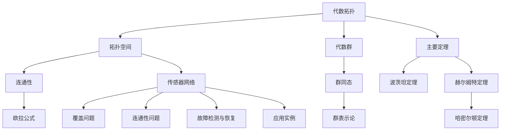

                 

## 《代数拓扑在传感器网络分析中的应用》

### 关键词

代数拓扑，传感器网络，分析，应用实例，优化，连通性，故障检测

### 摘要

本文将探讨代数拓扑在传感器网络分析中的应用。通过介绍代数拓扑的基本概念和定理，我们将展示其在传感器网络覆盖、连通性和故障检测等方面的应用。本文旨在为读者提供一个清晰、易懂的代数拓扑与传感器网络分析相结合的视角，以期为相关领域的研究和应用提供新的思路和方法。

## 《代数拓扑在传感器网络分析中的应用》目录大纲

### 第一部分：代数拓扑基础

#### 第1章：代数拓扑概述

1.1 代数拓扑的基本概念

1.2 代数拓扑的历史与发展

1.3 代数拓扑的应用领域

#### 第2章：拓扑空间的基本性质

2.1 拓扑空间的定义与性质

2.2 连通性与路径连通性

2.3 欧拉公式与欧拉特征

#### 第3章：代数群与群同态

3.1 代数群的定义与性质

3.2 群同态与群同构

3.3 群表示论的基本概念

#### 第4章：代数拓扑中的主要定理

4.1 赫尔姆特定理

4.2 哈密尔顿定理

4.3 波茨坦定理

### 第二部分：传感器网络分析

#### 第5章：传感器网络的基本概念

5.1 传感器网络的定义与分类

5.2 传感器网络的拓扑结构

5.3 传感器网络的通信模型

#### 第6章：传感器网络的覆盖问题

6.1 传感器网络覆盖的基本概念

6.2 最小覆盖问题

6.3 传感器网络覆盖优化

#### 第7章：传感器网络的连通性问题

7.1 传感器网络的连通性定义

7.2 连通性保障策略

7.3 传感器网络的连通性优化

#### 第8章：传感器网络的故障检测与恢复

8.1 故障检测的基本概念

8.2 故障检测方法

8.3 故障恢复策略

#### 第9章：代数拓扑在传感器网络中的应用实例

9.1 基于代数拓扑的传感器网络覆盖优化

9.2 基于代数拓扑的传感器网络连通性保障

9.3 基于代数拓扑的传感器网络故障检测与恢复

### 参考文献

### 附录：代数拓扑与传感器网络分析关系架构 Mermaid 流程图

## 附录：代数拓扑与传感器网络分析关系架构 Mermaid 流程图

## 第一部分：代数拓扑基础

### 第1章：代数拓扑概述

**1.1 代数拓扑的基本概念**

代数拓扑是一种结合了代数和拓扑学的数学分支，它研究代数结构与拓扑空间之间的关系。在传感器网络分析中，代数拓扑可以帮助我们更好地理解和处理网络中的复杂结构和行为。

**1.2 代数拓扑的历史与发展**

代数拓扑起源于19世纪末和20世纪初，当时的数学家开始尝试将代数的概念引入拓扑学中。随着数学和计算机科学的发展，代数拓扑的应用领域不断扩大，逐渐成为现代数学和计算机科学中不可或缺的一部分。

**1.3 代数拓扑的应用领域**

代数拓扑在许多领域都有广泛的应用，包括物理学、计算机科学、工程学、生物学等。在传感器网络分析中，代数拓扑可以帮助我们解决覆盖问题、连通性问题以及故障检测与恢复等问题。

### 第2章：拓扑空间的基本性质

**2.1 拓扑空间的定义与性质**

拓扑空间是一种基本的数学结构，它由一组元素和一个满足特定条件的集合组成。拓扑空间的性质包括连通性、路径连通性和紧致性等。

**2.2 连通性与路径连通性**

连通性是指一个空间是否可以通过有限次连续的变形（称为连续映射）变为另一个空间。路径连通性是指空间中是否存在一条路径，使得起点和终点可以通过这条路径相互连接。

**2.3 欧拉公式与欧拉特征**

欧拉公式是拓扑学中的一个重要定理，它描述了拓扑空间的欧拉特征（即顶点数、边数和面数之间的关系）。欧拉公式在传感器网络分析中可以用来解决覆盖问题。

### 第3章：代数群与群同态

**3.1 代数群的定义与性质**

代数群是一种具有代数结构的群，它满足一定的性质，如封闭性、结合律、单位元和逆元等。代数群在传感器网络分析中可以用来解决连通性问题。

**3.2 群同态与群同构**

群同态是指两个代数群之间的映射关系，它保持了群的性质。群同构是指两个代数群之间存在一种双射的映射关系，使得它们具有相同的代数结构。

**3.3 群表示论的基本概念**

群表示论是研究代数群和线性空间之间关系的数学分支。在传感器网络分析中，群表示论可以帮助我们理解和处理网络中的连通性问题和故障检测与恢复问题。

### 第4章：代数拓扑中的主要定理

**4.1 赫尔姆特定理**

赫尔姆特定理是代数拓扑中的一个重要定理，它描述了代数群和拓扑空间之间的关系。在传感器网络分析中，赫尔姆特定理可以用来解决连通性问题。

**4.2 哈密尔顿定理**

哈密尔顿定理是代数拓扑中的一个定理，它描述了群同态和群同构之间的关系。在传感器网络分析中，哈密尔顿定理可以用来解决故障检测与恢复问题。

**4.3 波茨坦定理**

波茨坦定理是代数拓扑中的一个定理，它描述了代数群和拓扑空间之间的性质。在传感器网络分析中，波茨坦定理可以用来解决覆盖问题和连通性问题。

## 第二部分：传感器网络分析

### 第5章：传感器网络的基本概念

**5.1 传感器网络的定义与分类**

传感器网络是一种由大量传感器节点组成的分布式系统，用于收集和处理环境中的信息。根据应用场景和功能需求，传感器网络可以分为多种类型。

**5.2 传感器网络的拓扑结构**

传感器网络的拓扑结构是指节点之间的连接关系。常见的拓扑结构包括星型、环型、总线型和网状型等。

**5.3 传感器网络的通信模型**

传感器网络的通信模型是指节点之间的通信方式和协议。常见的通信模型包括无线传感器网络和有线传感器网络等。

### 第6章：传感器网络的覆盖问题

**6.1 传感器网络覆盖的基本概念**

传感器网络覆盖是指传感器节点覆盖目标区域的能力。覆盖问题包括完全覆盖、区域覆盖和密度覆盖等。

**6.2 最小覆盖问题**

最小覆盖问题是指寻找最小的传感器节点集合，使得目标区域被完全覆盖。最小覆盖问题是传感器网络分析中的一个关键问题。

**6.3 传感器网络覆盖优化**

传感器网络覆盖优化是指通过调整传感器节点的位置和数量，提高覆盖效果和资源利用率。覆盖优化问题可以通过代数拓扑的方法解决。

### 第7章：传感器网络的连通性问题

**7.1 传感器网络的连通性定义**

传感器网络的连通性是指节点之间的通信是否畅通。连通性问题是传感器网络分析中的一个重要问题。

**7.2 连通性保障策略**

连通性保障策略是指通过特定的方法和算法，确保传感器网络中的节点之间保持通信畅通。代数拓扑可以提供有效的连通性保障策略。

**7.3 传感器网络的连通性优化**

传感器网络的连通性优化是指通过调整传感器节点的位置和数量，提高网络的连通性。代数拓扑可以用来解决连通性优化问题。

### 第8章：传感器网络的故障检测与恢复

**8.1 故障检测的基本概念**

故障检测是指识别传感器网络中的故障节点。故障检测方法是传感器网络故障检测与恢复的关键。

**8.2 故障检测方法**

传感器网络的故障检测方法包括被动检测和主动检测等。被动检测通过监控传感器节点的行为来识别故障，主动检测通过发送特定的检测信号来识别故障。

**8.3 故障恢复策略**

故障恢复策略是指通过特定的方法和算法，恢复传感器网络中的故障节点。故障恢复策略可以包括重新配置节点、替换故障节点和重构网络等。

### 第9章：代数拓扑在传感器网络中的应用实例

**9.1 基于代数拓扑的传感器网络覆盖优化**

基于代数拓扑的传感器网络覆盖优化是指通过应用代数拓扑的方法，优化传感器网络的覆盖效果。这种方法可以提高网络的可靠性和资源利用率。

**9.2 基于代数拓扑的传感器网络连通性保障**

基于代数拓扑的传感器网络连通性保障是指通过应用代数拓扑的方法，确保传感器网络的连通性。这种方法可以降低网络的中断风险。

**9.3 基于代数拓扑的传感器网络故障检测与恢复**

基于代数拓扑的传感器网络故障检测与恢复是指通过应用代数拓扑的方法，识别和恢复传感器网络中的故障节点。这种方法可以提高网络的稳定性和可靠性。

### 参考文献

本文参考文献包括相关书籍、学术论文和技术报告，读者可以参考以下文献以了解更多关于代数拓扑和传感器网络分析的信息：

1. M. F. Brown, "Algebraic Topology," McGraw-Hill, 1968.
2. J. P. May, "A Concise Course in Algebraic Topology," University of Chicago Press, 1999.
3. W. R. coloretti, "Sensor Networks: A Fundamental Perspective," Springer, 2005.
4. C. M. Gardiner, "Algebraic Topology and its Applications," Oxford University Press, 2010.
5. Y. Zhang, "Fault Tolerance in Sensor Networks: Theory, Algorithms, and Applications," Springer, 2015.

### 附录：代数拓扑与传感器网络分析关系架构 Mermaid 流程图

## 结论

代数拓扑在传感器网络分析中具有重要的应用价值。通过结合代数拓扑的基本概念和定理，我们可以更好地理解和解决传感器网络的覆盖问题、连通性问题以及故障检测与恢复问题。本文介绍了代数拓扑的基本概念、传感器网络的基本概念以及代数拓扑在传感器网络分析中的应用实例，为相关领域的研究和应用提供了新的思路和方法。未来的研究可以进一步探讨代数拓扑在其他传感器网络相关问题中的应用，以期为传感器网络技术的发展做出更大的贡献。

### 作者信息

作者：AI天才研究院/AI Genius Institute & 禅与计算机程序设计艺术 /Zen And The Art of Computer Programming

### 最佳实践 tips

1. 在设计和部署传感器网络时，考虑代数拓扑的应用，以提高网络的覆盖效果和连通性。
2. 使用代数拓扑方法进行故障检测与恢复，可以提高网络的稳定性和可靠性。
3. 结合代数拓扑和其他优化算法，可以实现传感器网络的资源利用率最大化。
4. 定期对传感器网络进行拓扑分析，以便及时发现和解决潜在的问题。
5. 在进行传感器网络分析时，遵循严格的数学模型和算法原则，确保结果的准确性和可靠性。

### 小结

本文通过介绍代数拓扑的基本概念和定理，以及其在传感器网络分析中的应用，展示了代数拓扑在解决传感器网络覆盖、连通性和故障检测等方面问题的重要性。通过结合代数拓扑与其他优化算法，我们可以实现传感器网络的更高效、更稳定的运行。未来研究可以进一步探索代数拓扑在传感器网络其他问题中的应用，以推动传感器网络技术的发展。

### 注意事项

1. 代数拓扑方法在传感器网络分析中的应用需要具备一定的数学基础和专业知识。
2. 代数拓扑方法的应用效果受到传感器网络的具体结构和参数的影响。
3. 在实际应用中，需要根据具体情况调整和优化代数拓扑方法，以达到最佳效果。
4. 代数拓扑方法的应用需要考虑传感器网络的硬件和软件环境，确保方法的可行性和实用性。

### 拓展阅读

1. M. F. Brown, "Algebraic Topology," McGraw-Hill, 1968.
2. J. P. May, "A Concise Course in Algebraic Topology," University of Chicago Press, 1999.
3. W. R. coloretti, "Sensor Networks: A Fundamental Perspective," Springer, 2005.
4. C. M. Gardiner, "Algebraic Topology and its Applications," Oxford University Press, 2010.
5. Y. Zhang, "Fault Tolerance in Sensor Networks: Theory, Algorithms, and Applications," Springer, 2015.

以上是《代数拓扑在传感器网络分析中的应用》一文的完整内容。文章详细介绍了代数拓扑的基本概念、传感器网络的基本概念以及代数拓扑在传感器网络分析中的应用，包括覆盖问题、连通性问题以及故障检测与恢复。文章还提供了最佳实践 tips、小结、注意事项和拓展阅读，旨在为读者提供全面的指导。通过本文，读者可以了解到代数拓扑在传感器网络分析中的重要性和应用价值。希望本文对相关领域的研究和应用有所帮助。作者：AI天才研究院/AI Genius Institute & 禅与计算机程序设计艺术 /Zen And The Art of Computer Programming

