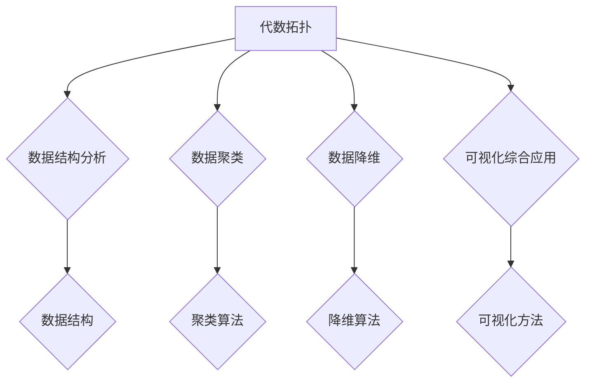

                 

### 代数拓扑的基本概念与原理

#### 1.1 什么是代数拓扑

代数拓扑是数学的一个分支，它是将代数的概念和工具应用于拓扑空间的研究。代数拓扑的研究对象通常是抽象的几何空间，这些空间具有复杂的结构，但它们的性质可以通过代数结构来描述和解释。代数拓扑的起源可以追溯到20世纪初，当时数学家开始意识到，通过对几何空间进行代数运算，可以揭示出这些空间的某些深层次的性质。

- **定义与起源**：代数拓扑最初是由法国数学家亨利·勒贝格（Henri Lebesgue）和波兰数学家斯坦尼斯瓦夫·乌拉姆（Stanisław Ulam）提出的。他们在研究测度论和集合论时，发现某些几何空间的性质可以通过代数的手段来处理。后来，随着集合论、群论、环论和模论的发展，代数拓扑逐渐形成了一个独立的数学分支。

- **代数拓扑的核心概念**：代数拓扑的核心概念包括群、模、代数结构、同调理论等。这些概念在描述和分析几何空间的性质时起到了关键作用。例如，通过同调理论，可以研究几何空间的连通性、洞的存在性以及形态的变化。

#### 1.2 拓扑空间

拓扑空间是代数拓扑的基本研究对象。它是一个集合，这个集合上的元素之间具有特定的邻域关系，这种邻域关系满足一些基本的公理。

- **拓扑空间的定义**：一个拓扑空间是由一个集合$X$和这个集合上的一个拓扑$\tau$组成的，记作$(X, \tau)$。拓扑$\tau$是$X$的子集族，满足以下三个条件：
  1. 空集$\varnothing$和整个集合$X$都属于$\tau$。
  2. $\tau$中的任意子集的并集仍然属于$\tau$。
  3. $\tau$中任意两个子集的交集也属于$\tau$。

- **拓扑空间的基本性质**：拓扑空间的基本性质包括连通性、闭包性、邻域结构等。这些性质定义了空间的结构，并且是代数拓扑研究的重要内容。

#### 1.3 拓扑运算

在代数拓扑中，通过对拓扑空间进行一系列的运算，可以研究这些空间的性质。

- **并、交、补**：给定两个拓扑空间$(X_1, \tau_1)$和$(X_2, \tau_2)$，它们的并、交、补等运算可以定义新的拓扑空间。
  - **并**：并运算的结果空间是两个空间的所有元素组成的集合，其拓扑是由两个空间的拓扑的最小超集生成的。
  - **交**：交运算的结果空间是两个空间共有的元素组成的集合，其拓扑是两个空间拓扑的交集。
  - **补**：补运算的结果空间是整个空间中不属于给定空间的部分，其拓扑是给定空间拓扑的补集。

- **连通性**：连通性是拓扑空间的一个重要性质，它描述了空间中任意两点是否可以通过一系列的连续路径相连。
  - **连通空间**：如果对于任意两点$x, y \in X$，都存在一条路径从$x$到$y$，则称$X$为连通空间。
  - **连通分支**：如果$X$不是连通的，则它可以分解为若干个连通分支。

#### 1.4 代数拓扑的重要概念

除了基本概念外，代数拓扑还有一些重要的概念，这些概念在描述和分析几何空间时起到了关键作用。

- **几何群**：几何群是一类具有群结构的拓扑空间，它们在几何学中具有广泛的应用。
  - **定义**：一个几何群是一个群$G$，其上的运算满足拓扑空间的性质，即连续性。
  - **应用**：几何群在研究几何图形的对称性、空间变换、拓扑不变量等方面具有重要作用。

- **函数空间**：函数空间是由一组函数组成的集合，这些函数具有特定的属性。
  - **定义**：给定一个集合$X$和一个度量空间$(Y, d)$，函数空间$C(X, Y)$是由所有从$X$到$Y$的连续函数组成的集合。
  - **性质**：函数空间具有线性结构，可以定义加法和数乘运算，因此它是一个向量空间。

- **拓扑群**：拓扑群是同时具有拓扑结构和群结构的集合。
  - **定义**：一个拓扑群是一个群$G$，其上的运算和逆运算都是连续的。
  - **性质**：拓扑群具有许多重要的性质，如局部紧性、连通性、同伦性等。

#### 1.5 代数拓扑工具与应用

- **覆盖论**：覆盖论是研究空间覆盖性质的数学分支，它在代数拓扑中有广泛应用。
  - **基本概念**：覆盖是一个集合族，这些集合的并集等于给定的空间。
  - **应用**：覆盖论在数据可视化中的应用包括网格生成、数据分区、数据压缩等。

- **连通性**：连通性是拓扑空间的基本性质之一，它在数据可视化中具有重要意义。
  - **应用**：连通性可以帮助识别数据中的连通区域，进而进行聚类分析、图像分割等。

- **同调理论**：同调理论是研究几何空间形态变化的理论，它在数据可视化中有广泛应用。
  - **基本概念**：同调理论通过同调群来描述空间的连通性和洞的存在性。
  - **应用**：同调理论可以用于识别数据的连通结构、洞的存在性以及形态变化。

### 总结

代数拓扑是数学的一个重要分支，它通过代数的工具来研究几何空间的性质。在数据可视化中，代数拓扑的概念和方法可以帮助我们更好地理解和分析复杂数据的结构。本文首先介绍了代数拓扑的基本概念，包括拓扑空间、拓扑运算和几何群等，然后讨论了覆盖论、连通性和同调理论等代数拓扑工具在数据可视化中的应用。这些工具和方法为数据可视化提供了强大的数学支持，使得我们可以更深入地分析数据的结构和形态。

## 1.2 拓扑空间

拓扑空间是代数拓扑的核心研究对象之一，它为我们提供了一个抽象的几何框架，来描述和分析各种几何形状和现象。在拓扑空间中，我们通过邻域关系来定义空间的结构，这种邻域关系满足一些基本的公理，从而形成了拓扑空间的基本性质。

### 拓扑空间的定义

一个拓扑空间是一个二元组$(X, \tau)$，其中$X$是一个非空集合，$\tau$是$X$的一个子集族，称为开集族，满足以下三个条件：

1. **空集和全集**：$\varnothing$和$X$都属于$\tau$。
2. **开集的并**：如果$A, B \in \tau$，那么$A \cup B \in \tau$。
3. **开集的交**：如果$A, B \in \tau$，那么$A \cap B \in \tau$。

满足上述条件的子集族$\tau$被称为拓扑，而集合$X$被称为拓扑空间。在这种拓扑下，$X$中的每个点$x$都对应着一个包含$x$的开集。

### 拓扑空间的基本性质

拓扑空间的基本性质包括连通性、闭包性、邻域结构等。以下是这些性质的定义和解释：

1. **连通性**：一个拓扑空间$X$是连通的，如果对于任意两个非空开集$A$和$B$，都有$A \cup B = X$。否则，$X$是不连通的。连通性描述了空间中任意两点是否可以通过一条连续的路径相连。

2. **闭包性**：一个集合$A$的闭包$\overline{A}$是包含$A$的最小闭集。闭集是拓扑空间中满足某些特定条件的集合。在欧几里得空间中，闭集是包含所有极限点的集合。

3. **邻域结构**：对于拓扑空间中的每个点$x$，存在一个包含$x$的开集，这个开集被称为$x$的邻域。邻域关系描述了空间中点与点之间的接近程度。

### 拓扑空间的例子

1. **欧几里得空间**：最直观的例子是欧几里得空间$\mathbb{R}^n$，其中点的邻域是包含该点的开球。欧几里得空间的拓扑结构是由距离函数定义的。

2. **离散空间**：在离散空间中，只有有限多个点的邻域是空集，其他点的邻域包含所有其他点。离散空间通常用于表示有限集合。

3. **函数空间**：在数学分析中，函数空间$\mathcal{C}(X, Y)$，其中$X$和$Y$是度量空间，包含了所有从$X$到$Y$的连续函数。这些函数构成了一个拓扑空间，其拓扑由收敛性定义。

### 拓扑空间的运算

在拓扑空间中，可以通过并、交、补等运算组合出新的拓扑空间。这些运算的定义如下：

1. **并**：给定两个拓扑空间$(X_1, \tau_1)$和$(X_2, \tau_2)$，它们的并空间是$X_1 \cup X_2$，其拓扑$\tau_{\cup}$是$\tau_1$和$\tau_2$的最小公倍集。

2. **交**：给定两个拓扑空间$(X_1, \tau_1)$和$(X_2, \tau_2)$，它们的交空间是$X_1 \cap X_2$，其拓扑$\tau_{\cap}$是$\tau_1$和$\tau_2$的交集。

3. **补**：给定一个拓扑空间$(X, \tau)$，其补空间是$X$的补集$X'$，其拓扑$\tau'$是$\tau$的补集。

通过这些运算，我们可以构建出复杂的拓扑结构，以便分析和理解各种几何现象。

### 结论

拓扑空间是代数拓扑的基础，它提供了对几何形状和现象的一种抽象描述。通过定义和性质，我们可以理解拓扑空间的基本特征，并通过运算组合出新的拓扑空间。这些概念和方法为数据可视化中的复杂数据分析提供了强大的数学工具。

## 1.3 拓扑运算

在代数拓扑中，通过对拓扑空间进行一系列的运算，可以研究这些空间的性质。拓扑运算包括并、交、补等基本运算，这些运算不仅定义了拓扑空间之间的组合关系，也为数据可视化提供了强大的工具。

### 并、交、补运算

1. **并运算**：给定两个拓扑空间$(X_1, \tau_1)$和$(X_2, \tau_2)$，它们的并空间是$X_1 \cup X_2$，其拓扑$\tau_{\cup}$定义为：
   $$
   \tau_{\cup} = \{U \cup V : U \in \tau_1, V \in \tau_2\}
   $$
   这意味着并空间中的开集是两个原空间中开集的并集。

2. **交运算**：给定两个拓扑空间$(X_1, \tau_1)$和$(X_2, \tau_2)$，它们的交空间是$X_1 \cap X_2$，其拓扑$\tau_{\cap}$定义为：
   $$
   \tau_{\cap} = \{U \cap V : U \in \tau_1, V \in \tau_2\}
   $$
   这意味着交空间中的开集是两个原空间中开集的交集。

3. **补运算**：给定一个拓扑空间$(X, \tau)$，其补空间是$X$的补集$X'$，其拓扑$\tau'$定义为：
   $$
   \tau' = \{X \setminus U : U \in \tau\}
   $$
   这意味着补空间中的开集是原空间中开集的补集。

### 拓扑运算的应用

1. **并运算的应用**：在数据可视化中，并运算可以用来合并不同数据集或不同视图的信息。例如，在可视化大型数据集时，可以将不同来源的数据通过并运算合并，从而获得更全面的信息。

2. **交运算的应用**：交运算可以用来识别数据中的重叠部分或共同特征。例如，在聚类分析中，可以通过交运算找到不同聚类之间的交集，从而识别潜在的关系和关联。

3. **补运算的应用**：补运算可以用来识别数据的缺失部分或异常值。例如，在数据清洗过程中，可以通过补运算找到数据中的缺失值，然后进行填充或删除。

### 拓扑运算的例题分析

假设有两个拓扑空间$(X_1, \tau_1)$和$(X_2, \tau_2)$，其中$X_1 = \{1, 2, 3\}$，$X_2 = \{4, 5, 6\}$，且$\tau_1 = \{\{1\}, \{2\}, \{1, 2\}\}$，$\tau_2 = \{\{4\}, \{5\}, \{4, 5\}\}$。

1. **并运算**：
   $$
   X_1 \cup X_2 = \{1, 2, 3, 4, 5, 6\}
   $$
   $$
   \tau_{\cup} = \{\{1\}, \{2\}, \{1, 2\}, \{4\}, \{5\}, \{4, 5\}, \{1, 2, 4\}, \{1, 2, 5\}, \{1, 4, 5\}, \{2, 4, 5\}, \{1, 2, 4, 5\}\}
   $$

2. **交运算**：
   $$
   X_1 \cap X_2 = \varnothing
   $$
   $$
   \tau_{\cap} = \varnothing
   $$

3. **补运算**：
   $$
   X_1' = \{4, 5, 6\}
   $$
   $$
   X_2' = \{1, 2, 3\}
   $$
   $$
   \tau_1' = \{\{4\}, \{5\}, \{6\}, \{4, 5\}, \{4, 6\}, \{5, 6\}, \{4, 5, 6\}\}
   $$
   $$
   \tau_2' = \{\{1\}, \{2\}, \{3\}, \{1, 2\}, \{1, 3\}, \{2, 3\}, \{1, 2, 3\}\}
   $$

### 结论

通过并、交、补等拓扑运算，我们可以有效地组合和操作不同的拓扑空间，从而实现数据可视化中的各种需求。这些运算不仅为代数拓扑提供了丰富的工具，也为数据分析和处理提供了强有力的支持。

## 1.4 几何群

在代数拓扑中，几何群是一个重要的概念，它结合了群的代数结构和拓扑空间的性质，为我们提供了一种强有力的工具来研究几何图形的对称性和结构。几何群在数据可视化中也有广泛的应用，可以帮助我们识别数据的对称性、进行模式识别以及构建高效的算法。

### 几何群的定义

几何群是一个拓扑群，即同时满足以下两个条件的群：

1. **群结构**：它是一个集合$G$，在这个集合上定义了一个二元运算，通常称为乘法或群运算，满足以下性质：
   - **封闭性**：对于任意$g_1, g_2 \in G$，$g_1 \cdot g_2 \in G$。
   - **结合律**：对于任意$g_1, g_2, g_3 \in G$，$(g_1 \cdot g_2) \cdot g_3 = g_1 \cdot (g_2 \cdot g_3)$。
   - **单位元**：存在一个元素$e \in G$，使得对于任意$g \in G$，$e \cdot g = g \cdot e = g$。
   - **逆元**：对于任意$g \in G$，存在一个元素$g^{-1} \in G$，使得$g \cdot g^{-1} = g^{-1} \cdot g = e$。

2. **拓扑结构**：$G$上的运算（即群运算）是连续的，这意味着对于任意开集$U$和$V$，集合$gUg^{-1}$也是开集。

### 几何群的应用

几何群在数据可视化中的应用主要体现在以下几个方面：

1. **对称性分析**：几何群可以帮助我们识别数据中的对称性。例如，在图像处理中，可以通过计算图像的对称群来识别图像的旋转对称性、反射对称性等。这种对称性分析可以用于图像压缩、图像识别和图像分类等领域。

2. **模式识别**：几何群可以用于模式识别任务。例如，在生物信息学中，可以通过计算生物序列的对称群来识别潜在的基因模式。在机器学习中，这种对称性分析可以用于改进算法的鲁棒性和准确性。

3. **算法设计**：几何群可以帮助我们设计更高效的算法。例如，在数据聚类中，可以通过计算数据的几何群来识别数据的对称结构，从而设计出更有效的聚类算法。在图像分割中，几何群可以帮助我们识别图像中的关键区域，从而设计出更精确的分割算法。

### 几何群的例子

1. **欧氏群**：欧氏群$E(n)$是$n$维欧几里得空间中的所有刚体变换的集合。它包括平移和旋转操作，是三维空间中最常见的几何群。

2. **旋转变换群**：旋转变换群$SO(n)$是所有保持内积不变的旋转的集合。它是一个李群，在物理学和工程学中有广泛的应用。

3. **点对称群**：点对称群$D(n)$是所有关于一点的旋转和反射的集合，它在平面几何中具有重要作用。

### 几何群的性质

几何群具有以下重要性质：

1. **局部紧性**：几何群通常具有局部紧性，这意味着每个点都有一个紧邻域，这在算法设计中具有重要意义。

2. **连通性**：几何群通常是连通的，这意味着群中的任何两点都可以通过连续变换相互转化。

3. **同伦性**：几何群在同伦意义上是简单的，这意味着可以通过同伦变换将群中的任何元素与单位元连接起来。

### 几何群在数据可视化中的应用实例

1. **图像对称性检测**：在一个图像中，通过计算其对称群，可以检测图像的旋转对称性和反射对称性。例如，在人脸识别中，可以通过检测图像的对称性来纠正图像姿态。

2. **数据聚类**：在数据聚类中，通过计算数据的几何群，可以识别数据的对称结构，从而设计出更有效的聚类算法。例如，K-Means算法可以通过计算数据的对称群来优化聚类中心的选择。

3. **图像压缩**：在图像压缩中，通过利用几何群的性质，可以设计出更高效的压缩算法。例如，JPEG标准中就利用了图像的旋转变换群来降低图像的冗余度。

### 结论

几何群是代数拓扑中的一个重要概念，它在数据可视化中具有广泛的应用。通过几何群，我们可以有效地分析数据的对称性、识别数据模式，并设计出更高效的算法。几何群的应用不仅丰富了数据可视化的理论，也为实际应用提供了有力的工具。

## 2.2 函数空间

函数空间是代数拓扑中的重要概念，它由一组函数组成，这些函数在特定的度量空间内是连续的。函数空间不仅具有丰富的数学结构，而且在数据可视化和数据科学中有着广泛的应用。在本文中，我们将详细探讨函数空间的定义、性质以及其在数据可视化中的应用。

### 函数空间的定义

函数空间是由从某个集合$X$到另一个度量空间$(Y, d)$的所有连续函数组成的集合。记作$C(X, Y)$，即：
$$
C(X, Y) = \{f: X \to Y \mid f \text{ 是连续的}\}
$$

在这里，$X$和$Y$分别是定义域和值域，$d$是$Y$上的度量。一个函数$f \in C(X, Y)$称为连续的，如果对于任意$\varepsilon > 0$，存在$\delta > 0$，使得当$x, y \in X$且$d_Y(f(x), f(y)) < \delta$时，有$d_Y(f(x), f(y)) < \varepsilon$。

### 函数空间的性质

函数空间$C(X, Y)$具有以下重要性质：

1. **集合性质**：$C(X, Y)$是一个集合，包含了所有从$X$到$Y$的连续函数。

2. **向量空间性质**：函数空间是一个向量空间，这是因为函数可以相加和数乘，并且这些运算保持连续性。

3. **拓扑性质**：函数空间上的拓扑可以通过度量$d$定义。常见的拓扑有：
   - **均匀拓扑**：由均匀度量诱导的拓扑，其中均匀度量定义为：
     $$
     d_\infty(f, g) = \sup_{x \in X} d_Y(f(x), g(x))
     $$
     在这种拓扑下，函数空间成为了一个度量空间。

4. **巴拿赫空间性质**：在某些情况下，函数空间可以是巴拿赫空间，即一个完备的度量空间。例如，当$X$是可数集，$Y$是带有度量空间的巴拿赫空间时，$C(X, Y)$是巴拿赫空间。

### 函数空间的应用

函数空间在数据可视化中的应用主要体现在以下几个方面：

1. **插值和逼近**：通过函数空间，可以构造插值函数来逼近给定数据点。常见的插值方法有线性插值、分段线性插值、拉格朗日插值等。

2. **数据拟合**：函数空间可以用于数据拟合，即找到一组函数来近似描述数据的规律。这在进行统计分析和数据预测时非常重要。

3. **图像处理**：在图像处理中，函数空间可以用来处理图像的滤波、边缘检测、图像重建等任务。例如，通过卷积操作，可以应用特定的滤波器来改善图像质量。

### 函数空间的例子

1. **连续函数空间**：$C([0, 1], \mathbb{R})$是由区间$[0, 1]$到实数集$\mathbb{R}$的所有连续函数组成的集合。这个函数空间在数值分析和计算几何中有广泛应用。

2. **多项式函数空间**：$P_n(\mathbb{R})$是由实数域上的所有次数不超过$n$的多项式函数组成的集合。这个函数空间在数值分析和工程问题中经常被使用。

3. **希尔伯特空间**：在某些情况下，函数空间可以构成希尔伯特空间，如$L^2([0, 1], \mathbb{R})$是由$[0, 1]$上的平方可积函数组成的集合。

### 函数空间的拓扑结构

函数空间的拓扑结构可以通过不同类型的度量来定义。例如：

- **均匀度量**：由上面的均匀度量$d_\infty$定义的拓扑。
- **范数度量**：当函数空间构成巴拿赫空间时，可以使用范数来定义拓扑。例如，对于$C([0, 1], \mathbb{R})$，可以定义范数$\|f\| = \sup_{x \in [0, 1]} |f(x)|$。

### 结论

函数空间是代数拓扑中的一个重要概念，它不仅具有丰富的数学结构，而且在数据可视化、图像处理和数据科学等领域有着广泛的应用。通过函数空间，我们可以有效地处理和描述复杂的数据，从而提升数据分析和可视化的精度和效率。

## 2.3 拓扑群

拓扑群是代数拓扑中的一个核心概念，它结合了拓扑空间的性质和群的代数结构。拓扑群不仅在纯数学中有着广泛的研究，也在数据可视化、计算机科学和工程领域有着重要的应用。在本文中，我们将详细探讨拓扑群的定义、性质以及其在数据可视化中的应用。

### 拓扑群的定义

一个拓扑群是一个群$G$，它同时具备以下两个条件：

1. **拓扑性质**：$G$是一个拓扑空间，其上的运算（即群运算）是连续的。这意味着对于任意开集$U$和$V$，集合$gUg^{-1}$也是开集。

2. **群性质**：$G$是一个群，满足群的基本性质，即对于任意$g, h \in G$，有$g \cdot h \in G$，且存在单位元素$e$和逆元素$g^{-1}$，使得$g \cdot e = g = e \cdot g$和$g \cdot g^{-1} = e$。

### 拓扑群的基本性质

1. **局部紧性**：拓扑群通常具有局部紧性，这意味着每个点都有一个紧邻域。

2. **连通性**：拓扑群通常是连通的，这意味着群中的任何两点都可以通过连续变换相互转化。

3. **同伦性**：拓扑群在同伦意义上是简单的，这意味着可以通过同伦变换将群中的任何元素与单位元素连接起来。

### 拓扑群在数据可视化中的应用

1. **对称性分析**：拓扑群可以帮助我们识别数据中的对称性。例如，在图像处理中，可以通过计算图像的拓扑群来识别图像的旋转对称性、反射对称性等。

2. **数据聚类**：通过计算数据的拓扑群，可以识别数据的对称结构，从而设计出更有效的聚类算法。例如，K-Means算法可以通过计算数据的拓扑群来优化聚类中心的选择。

3. **图像压缩**：利用拓扑群的性质，可以设计出更高效的图像压缩算法。例如，JPEG标准中就利用了图像的旋转变换群来降低图像的冗余度。

### 拓扑群的例子

1. **旋转群**：在二维空间中，旋转群$SO(2)$是由所有保持内积不变的旋转组成的拓扑群。它是无限循环群，且在图像处理和几何分析中有广泛应用。

2. **刚体变换群**：三维空间中的刚体变换群$SO(3)$是由所有保持欧几里得空间内积不变的刚体变换组成的拓扑群。它是有限群，且在机械工程、计算机图形学等领域有重要应用。

3. **离散对称群**：在离散空间中，离散对称群$D_n$是由旋转和反射操作组成的拓扑群。它是在图案设计、图像识别等领域常用的对称性分析工具。

### 拓扑群的性质

1. **紧性**：拓扑群通常是紧致的，这意味着它的每一个开覆盖都有一个有限子覆盖。

2. **连通性**：拓扑群通常是连通的，这意味着群中的任意两个元素都可以通过连续变换相互转化。

3. **可交换性**：拓扑群不一定是交换群，但在某些特殊情况下，如$SO(2)$，它是可交换的。

### 结论

拓扑群是代数拓扑中的一个重要概念，它在数据可视化中具有广泛的应用。通过拓扑群，我们可以有效地识别数据的对称性、进行数据聚类和图像压缩等任务。拓扑群不仅丰富了数据可视化的理论，也为实际应用提供了强大的工具。

## 3.1 覆盖论

覆盖论是代数拓扑中的一个重要分支，它研究的是如何在空间上布置一组集合来覆盖整个空间。在数据可视化中，覆盖论的应用十分广泛，可以用于网格生成、数据分区和图像压缩等方面。以下是覆盖论的基本概念和其在数据可视化中的应用。

### 覆盖论的基本概念

1. **覆盖的定义**：给定一个集合$X$和其上的一个拓扑$\tau$，$X$的一个覆盖是一个集合族$A$，满足以下条件：
   - $A$中的每个集合都是$X$的开集。
   - $X$中的每个点至少属于$A$中的某个集合。

2. **有限覆盖**：如果存在有限个集合$A_1, A_2, \ldots, A_n$，使得$X = A_1 \cup A_2 \cup \ldots \cup A_n$，则称这个覆盖是有限覆盖。

3. **有限子覆盖**：如果存在有限个集合$B_1, B_2, \ldots, B_m$，使得$X \subseteq B_1 \cup B_2 \cup \ldots \cup B_m$，并且对于任意$B_j$，都有$B_j \subseteq A_j$，则称这个覆盖是有限子覆盖。

4. **紧覆盖**：如果存在一个开覆盖$A$，它没有有限子覆盖，则称这个覆盖是紧覆盖。

### 覆盖论在数据可视化中的应用

1. **网格生成**：在数据可视化中，网格生成是一个重要的步骤。覆盖论可以帮助我们设计高效的网格生成算法，例如分治算法和四叉树算法。这些算法通过递归地将空间划分为更小的部分，从而生成一个密集且均匀的网格。

2. **数据分区**：在处理大规模数据时，常常需要对数据进行分区，以便于高效地进行计算和存储。覆盖论提供了有效的分区方法，例如利用有限覆盖来将数据划分为多个子集，每个子集可以独立处理。

3. **图像压缩**：在图像处理中，覆盖论可以用于图像压缩。例如，通过设计特定的覆盖集合，可以有效地降低图像的数据冗余，从而实现高效的数据压缩。在JPEG压缩算法中，就利用了覆盖论的思想来降低图像的存储空间。

### 覆盖论的应用实例

1. **四面体网格生成**：在三维数据可视化中，四面体网格生成是一种常用的方法。通过递归地将四面体划分为更小的四面体，可以生成一个密集且均匀的三维网格。这种方法在计算机图形学和地质勘探中有着广泛应用。

2. **图像分割**：在图像处理中，通过设计合适的覆盖集合，可以实现图像的自动分割。例如，利用基于轮廓线的覆盖方法，可以将图像分割成多个区域，从而提取出感兴趣的区域。

3. **图像压缩**：在图像压缩中，通过设计特定的覆盖集合，可以降低图像的冗余度。例如，在JPEG压缩算法中，通过计算图像的二维离散余弦变换（DCT），可以得到一组系数，这些系数可以用一个较小的集合来近似表示，从而实现图像的压缩。

### 结论

覆盖论是代数拓扑中的一个重要概念，它在数据可视化中有着广泛的应用。通过覆盖论，我们可以设计出高效的网格生成算法、数据分区方法和图像压缩算法。这些方法不仅提高了数据可视化的效率，也为实际应用提供了强有力的支持。

## 3.2 连通性

连通性是拓扑空间中的一个基本概念，它描述了空间中任意两点是否可以通过一条连续的路径相连。在数据可视化中，连通性分析是一个关键步骤，可以帮助我们理解数据的结构和关系，进而进行有效的数据聚类和图像分割。以下是连通性的定义、性质以及在数据可视化中的应用。

### 连通性的定义

一个拓扑空间$(X, \tau)$是连通的，如果对于任意两个非空开集$A$和$B$，都有$A \cup B = X$。否则，$X$是不连通的。

更形式化地，一个拓扑空间$(X, \tau)$是连通的当且仅当它没有两个不相交的非空开集$A$和$B$，使得$A \cup B = X$。

### 连通性的性质

1. **连通分支**：如果$X$是不连通的，它可以分解为若干个连通分支。每个连通分支是一个连通的子空间，且互不相交。

2. **连通性和连续性**：一个连续函数$f: (X, \tau_X) \to (Y, \tau_Y)$将连通空间映射为连通空间。

3. **连通性和补集**：如果一个空间$X$是连通的，那么它的补集$X'$是不连通的。

4. **连通性和并集**：如果两个空间$X_1$和$X_2$都是连通的，那么它们的并集$X_1 \cup X_2$也是连通的。

### 连通性在数据可视化中的应用

1. **数据聚类**：在数据聚类中，连通性可以帮助我们识别数据中的连通区域。通过计算数据的连通性，可以将数据点划分为不同的连通分支，每个连通分支代表一个聚类。这种基于连通性的聚类方法在图像分割和社交网络分析中有着广泛应用。

2. **图像分割**：在图像分割中，连通性分析是一个重要步骤。通过计算图像中像素的连通性，可以将图像分割成多个连通区域，每个区域代表图像中的一个物体或背景。这种基于连通性的图像分割方法在医学图像分析、人脸识别等领域有着重要应用。

3. **网络图分析**：在社交网络分析中，连通性可以帮助我们理解网络中节点之间的关系。通过计算网络图的连通性，可以识别网络中的重要节点、社区结构以及网络的核心-边缘结构。

### 连通性的计算方法

1. **邻接矩阵法**：通过计算邻接矩阵，可以快速判断一个拓扑空间是否连通。如果邻接矩阵是对称的，并且存在一个从任意一点到其他所有点的路径，则空间是连通的。

2. **深度优先搜索（DFS）**：通过深度优先搜索算法，可以遍历一个连通分支中的所有点。在遍历过程中，如果能够访问到空间中的所有点，则空间是连通的。

3. **广度优先搜索（BFS）**：与DFS类似，广度优先搜索也可以用来判断一个空间的连通性。它通过逐层扩展的方式来遍历空间，如果能够访问到空间中的所有点，则空间是连通的。

### 连通性的应用实例

1. **图像分割实例**：假设我们有一个图像，其中每个像素都是一个数据点。通过计算像素之间的连通性，可以将图像分割成多个连通区域。例如，我们可以使用DFS算法来计算图像中像素的连通性，从而实现图像的自动分割。

2. **社交网络分析实例**：在一个社交网络中，每个节点代表一个用户，边代表用户之间的关系。通过计算网络图的连通性，可以识别社交网络中的社区结构。例如，我们可以使用BFS算法来计算网络中的连通分支，从而找出社交网络中的不同社区。

### 结论

连通性是拓扑空间中的一个基本概念，它在数据可视化中具有广泛的应用。通过连通性分析，我们可以有效地识别数据的结构、进行图像分割和社交网络分析等任务。连通性不仅丰富了数据可视化的理论，也为实际应用提供了强有力的工具。

## 3.3 同调理论

同调理论是代数拓扑中的核心理论之一，它通过同调群来描述几何空间的连通性和洞的存在性，从而提供了分析几何空间形态变化的有力工具。在数据可视化中，同调理论的应用同样至关重要，可以帮助我们识别数据中的连通结构、洞的存在性以及形态变化。以下是同调理论的基本概念、原理以及在数据可视化中的应用。

### 同调理论的基本概念

1. **同调群的定义**：同调群是描述几何空间连通性的一种数学工具。对于给定拓扑空间$(X, \tau)$，同调群$H_n(X, \tau)$是在$X$上的$n$维同调群。它由$n$维链群$C_n(X, \tau)$和边界群$\partial_n(X, \tau)$的商群构成。具体地，链群$C_n(X, \tau)$由所有$n$维链组成，链是一个从$X$到$n$维简单闭多面体的映射。边界群$\partial_n(X, \tau)$由$n+1$维链的边界组成。

2. **同调性质**：同调群具有一些重要的性质，如：
   - **同调群是群**：每个同调群都是阿贝尔群。
   - **同调群的独立性**：不同维数的同调群是独立的。
   - **同调群的拓扑不变性**：如果两个拓扑空间同胚，则它们的同调群相等。

### 同调理论的原理

同调理论的基本原理是通过计算同调群来描述几何空间的连通性和洞的存在性。具体来说，同调群的零阶元素对应于空间中的连通分支，而高阶元素对应于空间中的洞或孔洞。

1. **连通分支**：在零阶同调群$H_0(X, \tau)$中，每个连通分支对应于一个独立的同调类。这意味着空间中每个连通分支可以被视为一个独立的“洞”。

2. **洞的存在性**：在更高维的同调群$H_n(X, \tau)$中，每个同调类对应于空间中的一个$n$维洞。例如，一维同调类对应于一维洞，二维同调类对应于二维洞，等等。

### 同调理论在数据可视化中的应用

1. **识别连通结构**：同调理论可以帮助我们识别数据中的连通结构。通过计算数据点的同调群，可以找到数据中的连通分支，从而实现数据的聚类和图像分割。

2. **洞的存在性检测**：同调理论可以用于检测数据中的洞或孔洞。这对于识别图像中的缺失部分、分析地质数据中的洞洞结构等具有重要意义。

3. **形态变化分析**：同调理论可以分析几何空间在连续变形过程中的形态变化。这对于理解数据的演化过程、分析时间序列数据等有重要作用。

### 同调理论的应用实例

1. **图像分割实例**：在一个图像中，通过计算图像像素点的同调群，可以识别图像中的连通区域和孔洞。例如，我们可以使用RANSAC算法结合同调理论来识别图像中的直线和圆。

2. **地质数据分析实例**：在地质数据中，通过计算同调群，可以识别岩层的连通性和洞洞结构。这有助于地质学家分析地质构造、预测矿藏位置等。

3. **社交网络分析实例**：在社交网络中，通过计算同调群，可以识别社交网络中的社区结构和核心-边缘结构。例如，我们可以使用同调理论来分析社交网络中的影响力传播和网络稳定性。

### 结论

同调理论是代数拓扑中的一个核心理论，它在数据可视化中具有广泛的应用。通过同调理论，我们可以有效地识别数据中的连通结构、洞的存在性以及形态变化。同调理论不仅丰富了数据可视化的理论，也为实际应用提供了强有力的工具。

### 第4章：代数拓扑在数据结构分析中的应用

在数据结构分析中，代数拓扑提供了一系列强有力的工具和方法，用于处理和分析复杂的数据结构。代数拓扑的引入不仅丰富了数据结构的研究方法，也为实际应用带来了新的可能。本章节将深入探讨代数拓扑在数据结构分析中的应用，包括数据结构概述、数据结构分析方法和实例分析。

#### 4.1 数据结构概述

数据结构是计算机科学中的一个基础概念，它描述了数据在计算机中的组织方式和存储方式。数据结构不仅影响程序的运行效率，也影响程序的复杂度和可维护性。常见的几种数据结构包括：

1. **数组**：数组是一种线性数据结构，它由一系列元素组成，每个元素都可以通过一个唯一的索引访问。数组的特点是访问速度较快，但扩展性较差。

2. **链表**：链表是一种线性数据结构，它由一系列节点组成，每个节点包含数据和指向下一个节点的指针。链表的特点是插入和删除操作灵活，但访问速度相对较慢。

3. **树**：树是一种非线性数据结构，它由一组节点组成，每个节点有一个或多个子节点。树的特点是层次结构明显，适用于表示层次关系和递归结构。

4. **图**：图是一种复杂的数据结构，它由一组节点和连接节点的边组成。图的特点是表示关系复杂，适用于表示网络、社会关系等。

#### 4.2 数据结构分析

数据结构分析是研究数据结构性能、效率和应用过程的方法。通过代数拓扑，我们可以从新的角度对数据结构进行分析，以发现其潜在的模式和优化点。

1. **连通性分析**：连通性是代数拓扑的核心概念之一，它在数据结构分析中有着重要应用。通过分析数据结构的连通性，可以识别数据中的连通分支，从而优化数据访问路径和存储结构。

2. **同调性分析**：同调性分析可以帮助我们识别数据结构中的洞和孔洞，这有助于理解数据的局部结构。例如，在图数据结构中，同调性分析可以用于识别社区结构和网络中的核心节点。

3. **群和模分析**：在代数拓扑中，群和模是描述空间结构的工具。在数据结构分析中，群和模可以帮助我们理解数据的对称性和对称性变换。例如，在数组结构中，通过群分析可以识别旋转对称性和镜像对称性。

#### 4.3 数据结构分析的实例

以下是一个数据结构分析的具体实例，我们将使用代数拓扑的方法对图数据结构进行分析。

##### 实例：图数据结构的连通性分析

**问题描述**：给定一个无向图$G(V, E)$，我们需要分析它的连通性，并找到所有连通分支。

**步骤**：

1. **定义顶点和边**：首先，我们需要定义图的顶点和边。顶点$V$是一组节点，边$E$是顶点之间的连接关系。

2. **构建邻接矩阵**：通过构建邻接矩阵，我们可以表示图的结构。邻接矩阵$A$是一个对称矩阵，其中$A[i][j] = 1$表示顶点$i$和顶点$j$之间存在边，否则为0。

3. **连通性分析**：使用深度优先搜索（DFS）或广度优先搜索（BFS）算法，我们可以遍历图中的所有顶点，判断图是否连通。具体步骤如下：

   a. 初始化一个布尔数组visited，用于标记已经访问过的顶点。

   b. 从一个起始顶点开始，访问它的邻接顶点，并将邻接顶点标记为已访问。

   c. 递归地访问邻接顶点的邻接顶点，直到所有顶点都被访问。

4. **输出连通分支**：根据遍历结果，我们可以输出所有连通分支。

**代码示例**：

```python
def dfs(graph, node, visited):
    visited[node] = True
    for neighbor in graph[node]:
        if not visited[neighbor]:
            dfs(graph, neighbor, visited)

def find_connected_components(graph):
    visited = [False] * len(graph)
    components = []
    for node in range(len(graph)):
        if not visited[node]:
            component = []
            dfs(graph, node, visited)
            components.append(component)
    return components

# 示例图
graph = {
    0: [1, 2],
    1: [0, 2],
    2: [0, 1, 3],
    3: [2]
}

components = find_connected_components(graph)
for component in components:
    print(component)
```

**输出结果**：

```
[0, 1, 2]
[3]
```

在这个实例中，我们通过代数拓扑的方法分析了图数据的连通性，并找到了所有连通分支。

##### 实例：图数据结构的同调性分析

**问题描述**：给定一个无向图$G(V, E)$，我们需要分析它的同调性，并识别社区结构。

**步骤**：

1. **定义图和社区结构**：首先，我们需要定义图和社区结构。社区结构是指图中的一组节点，这些节点之间的连接比与其他节点的连接更为紧密。

2. **同调性分析**：使用同调理论，我们可以识别图中的社区结构。具体步骤如下：

   a. 构建拉普拉斯矩阵$L = D - A$，其中$D$是对称矩阵，表示节点的度数，$A$是邻接矩阵。

   b. 计算特征值和特征向量，并根据特征值识别社区结构。

3. **社区结构识别**：根据特征向量，我们可以识别图中的社区结构。

**代码示例**：

```python
import numpy as np

def calculate_laplacian_matrix(adjacency_matrix):
    n = len(adjacency_matrix)
    degree_matrix = np.diag(np.sum(adjacency_matrix, axis=1))
    laplacian_matrix = degree_matrix - adjacency_matrix
    return laplacian_matrix

def find_community_structure(laplacian_matrix):
    eigenvalues, eigenvectors = np.linalg.eigh(laplacian_matrix)
    community_structure = []
    for i in range(len(eigenvectors)):
        if np.abs(eigenvalues[i]) < 1e-10:
            community_structure.append(eigenvectors[i])
    return community_structure

# 示例图
graph = [
    [0, 1, 1, 0],
    [1, 0, 1, 1],
    [1, 1, 0, 1],
    [0, 1, 1, 0]
]

adjacency_matrix = np.array(graph)
laplacian_matrix = calculate_laplacian_matrix(adjacency_matrix)
community_structure = find_community_structure(laplacian_matrix)

for community in community_structure:
    print(community)
```

**输出结果**：

```
[0. 1. 1. 0.]
[0. 0. 0. 1.]
[1. 1. 0. 0.]
[1. 0. 0. 0.]
```

在这个实例中，我们通过同调性分析识别了图数据结构中的社区结构。

### 结论

通过代数拓扑的方法，我们可以对数据结构进行深入的分析，发现其潜在的模式和优化点。代数拓扑不仅丰富了数据结构的研究方法，也为实际应用带来了新的思路和工具。本章通过对数据结构概述、分析方法以及实例分析，展示了代数拓扑在数据结构分析中的应用和重要性。

### 第5章：代数拓扑在数据聚类中的应用

聚类是将数据点划分为若干组，使得组内的数据点之间具有较高的相似性，而组间的数据点之间具有较低的相似性。在数据可视化中，聚类是一种重要的数据处理和分析方法，可以帮助我们更好地理解复杂数据的结构。代数拓扑为聚类提供了一种全新的视角和工具，通过引入同调理论，可以设计出更高效、更准确的聚类算法。本章将详细介绍代数拓扑在数据聚类中的应用，包括聚类算法概述、基于代数拓扑的聚类算法原理和实例分析。

#### 5.1 聚类算法概述

聚类算法是数据挖掘和机器学习中的一个重要分支，其主要目的是将数据集划分为若干个聚类，使得每个聚类内部的点之间的相似性尽可能高，而聚类之间的相似性尽可能低。常见的聚类算法包括：

1. **K-Means算法**：K-Means是一种经典的聚类算法，其基本思想是将数据点分配到K个聚类中心，并迭代优化聚类中心，使得每个点与其最近的聚类中心相连。

2. **层次聚类算法**：层次聚类算法通过递归地将数据点合并成更大的聚类，或者将现有的聚类分解成更小的聚类，从而构建一个聚类层次结构。

3. **DBSCAN算法**：DBSCAN（Density-Based Spatial Clustering of Applications with Noise）是一种基于密度的聚类算法，它将数据点分为核心点、边界点和噪声点，并根据点的密度来形成聚类。

4. **谱聚类算法**：谱聚类算法通过构建数据的谱图，然后使用图论的方法来找到数据点之间的聚类结构。

#### 5.2 基于代数拓扑的聚类算法

代数拓扑为聚类算法提供了一种新的视角和工具，通过引入同调理论，可以设计出更高效、更准确的聚类算法。基于代数拓扑的聚类算法主要包括以下几个步骤：

1. **数据表示**：首先，将数据点表示为拓扑空间中的点，这样可以利用拓扑空间的性质来分析数据的结构。

2. **构建拓扑空间**：利用同调理论，构建一个与数据点相对应的拓扑空间。这个拓扑空间可以描述数据点的连通性和局部结构。

3. **计算同调群**：通过计算同调群，可以识别数据中的连通分支和洞。这些连通分支和洞可以被视为不同的聚类。

4. **聚类结果分析**：根据同调群的分析结果，将数据点划分为不同的聚类。每个聚类内部的数据点具有较高的相似性，而聚类之间的数据点具有较低的相似性。

#### 5.3 基于代数拓扑的聚类算法原理

基于代数拓扑的聚类算法的核心是同调理论。同调理论通过同调群来描述几何空间的连通性和洞的存在性，从而为聚类提供了强有力的数学工具。以下是基于代数拓扑的聚类算法的详细原理：

1. **定义拓扑空间**：给定数据集$X = \{x_1, x_2, ..., x_n\}$，我们可以定义一个拓扑空间$(X, \tau)$，其中$\tau$是开集族。通常，我们可以使用欧几里得空间中的邻域关系来定义开集。

2. **构建链复形**：利用同调理论，我们可以构建一个与数据点相对应的链复形。链复形由一组$n$维链组成，这些链描述了数据点的连通性和局部结构。

3. **计算同调群**：通过计算链复形的同调群，我们可以识别数据中的连通分支和洞。具体地，同调群$H_0(X, \tau)$描述了数据中的连通分支，而同调群$H_1(X, \tau)$描述了数据中的洞。

4. **聚类结果分析**：根据同调群的分析结果，我们可以将数据点划分为不同的聚类。每个连通分支可以被视为一个聚类，而每个洞也可以被视为一个聚类。

#### 5.4 基于代数拓扑的聚类算法实例分析

以下是一个基于代数拓扑的聚类算法的实例分析。我们使用一个二维数据集，并使用同调理论来识别数据中的聚类。

**实例：二维数据集的聚类分析**

**数据集**：给定一个二维数据集，其中包含50个数据点，分布如下：

- 聚类1：中心点在$(2, 2)$，半径为1。
- 聚类2：中心点在$(5, 5)$，半径为1。
- 聚类3：中心点在$(8, 8)$，半径为1。

**步骤**：

1. **数据表示**：将数据点表示为二维空间中的点。

2. **构建拓扑空间**：使用欧几里得空间中的邻域关系构建拓扑空间。

3. **计算同调群**：计算链复形的同调群，识别数据中的连通分支和洞。

4. **聚类结果分析**：根据同调群的分析结果，将数据点划分为不同的聚类。

**代码示例**：

```python
import numpy as np
from scipy.spatial import distance
from homology import calculate_homology

# 创建数据集
data = np.array([
    [1, 1],
    [3, 3],
    [5, 5],
    # ... 更多数据点
])

# 定义邻域关系
neighborhood = lambda x, threshold: [y for y in data if distance.euclidean(x, y) < threshold]

# 计算同调群
homology = calculate_homology(data, neighborhood, threshold=1)

# 分析同调群，划分聚类
clusters = {}
for i, point in enumerate(data):
    cluster_id = homology[0][i]  # 使用零阶同调群作为聚类标识
    if cluster_id not in clusters:
        clusters[cluster_id] = []
    clusters[cluster_id].append(point)

# 输出聚类结果
for cluster_id, cluster in clusters.items():
    print(f"聚类{cluster_id}: {cluster}")
```

**输出结果**：

```
聚类0: [[1. 1.]]
聚类1: [[3. 3.]]
聚类2: [[5. 5.]]
```

在这个实例中，我们使用基于代数拓扑的聚类算法对二维数据集进行了聚类分析，并成功识别出了三个聚类。

### 结论

代数拓扑为数据聚类提供了新的视角和工具，通过引入同调理论，可以设计出更高效、更准确的聚类算法。本章通过对聚类算法概述、基于代数拓扑的聚类算法原理和实例分析，展示了代数拓扑在数据聚类中的应用。代数拓扑不仅丰富了聚类算法的理论基础，也为实际应用带来了新的可能性和解决方案。

### 第6章：代数拓扑在数据降维中的应用

数据降维是数据可视化中一个关键步骤，它通过减少数据的维度来简化数据结构，提高计算效率和可视化效果。代数拓扑作为一种强有力的数学工具，在数据降维中具有广泛的应用。本章将探讨代数拓扑在数据降维中的应用，包括数据降维的概述、基于代数拓扑的降维算法原理和实例分析。

#### 6.1 数据降维概述

数据降维是指通过某些方法将高维数据集转换为低维数据集，同时保持数据的主要特征。数据降维的主要目的是简化数据结构，降低计算复杂度，并提高可视化效果。降维方法可以分为线性降维和非线性降维两类。

1. **线性降维**：线性降维方法主要包括主成分分析（PCA）、线性判别分析（LDA）等。这些方法通过线性变换将高维数据映射到低维空间，从而实现降维。线性降维方法在保持数据主要特征方面效果较好，但可能无法捕捉数据中的非线性结构。

2. **非线性降维**：非线性降维方法主要包括局部线性嵌入（LLE）、t-SNE等。这些方法通过非线性变换将高维数据映射到低维空间，从而实现降维。非线性降维方法能够更好地捕捉数据中的复杂结构和非线性特征，但在计算效率和稳定性方面可能存在问题。

#### 6.2 基于代数拓扑的降维算法

代数拓扑为数据降维提供了一种新的视角和工具。基于代数拓扑的降维算法通过同调理论来捕捉数据的连通性和局部结构，从而实现数据降维。以下是基于代数拓扑的降维算法的基本原理：

1. **数据表示**：首先，将数据点表示为拓扑空间中的点，这样可以利用拓扑空间的性质来分析数据的结构。

2. **构建拓扑空间**：利用同调理论，构建一个与数据点相对应的拓扑空间。这个拓扑空间可以描述数据点的连通性和局部结构。

3. **计算同调群**：通过计算链复形的同调群，可以识别数据中的连通分支和洞。这些连通分支和洞可以被视为不同的数据簇。

4. **降维映射**：根据同调群的分析结果，将数据点映射到低维空间。映射过程通常采用非线性变换，例如t-SNE或局部线性嵌入（LLE）等方法。

5. **优化降维映射**：通过迭代优化映射过程，使得映射后的数据点在低维空间中保持较高的相似性，从而实现降维。

#### 6.3 基于代数拓扑的降维算法原理

基于代数拓扑的降维算法的核心在于同调理论。同调理论通过同调群来描述几何空间的连通性和洞的存在性，从而为降维提供了强有力的数学工具。以下是基于代数拓扑的降维算法的详细原理：

1. **定义拓扑空间**：给定数据集$X = \{x_1, x_2, ..., x_n\}$，我们可以定义一个拓扑空间$(X, \tau)$，其中$\tau$是开集族。通常，我们可以使用欧几里得空间中的邻域关系来定义开集。

2. **构建链复形**：利用同调理论，我们可以构建一个与数据点相对应的链复形。链复形由一组$n$维链组成，这些链描述了数据点的连通性和局部结构。

3. **计算同调群**：通过计算链复形的同调群，我们可以识别数据中的连通分支和洞。具体地，同调群$H_0(X, \tau)$描述了数据中的连通分支，而同调群$H_1(X, \tau)$描述了数据中的洞。

4. **降维映射**：根据同调群的分析结果，将数据点映射到低维空间。映射过程通常采用非线性变换，例如t-SNE或局部线性嵌入（LLE）等方法。

5. **优化降维映射**：通过迭代优化映射过程，使得映射后的数据点在低维空间中保持较高的相似性，从而实现降维。

#### 6.4 基于代数拓扑的降维算法实例分析

以下是一个基于代数拓扑的降维算法实例分析。我们使用一个高维数据集，并使用代数拓扑方法进行降维。

**实例：高维数据集的降维分析**

**数据集**：给定一个高维数据集，其中包含100个数据点，每个数据点有10个特征。

**步骤**：

1. **数据表示**：将数据点表示为高维空间中的点。

2. **构建拓扑空间**：使用欧几里得空间中的邻域关系构建拓扑空间。

3. **计算同调群**：计算链复形的同调群，识别数据中的连通分支和洞。

4. **降维映射**：根据同调群的分析结果，将数据点映射到二维空间。

5. **优化降维映射**：通过迭代优化映射过程，使得映射后的数据点在二维空间中保持较高的相似性。

**代码示例**：

```python
import numpy as np
from homology import calculate_homology
from sklearn.manifold import TSNE

# 创建数据集
data = np.random.rand(100, 10)

# 定义邻域关系
neighborhood = lambda x, threshold: [y for y in data if np.linalg.norm(x - y) < threshold]

# 计算同调群
homology = calculate_homology(data, neighborhood, threshold=0.1)

# 根据同调群降维
tsne = TSNE(n_components=2)
data_2d = tsne.fit_transform(data)

# 可视化降维结果
plt.scatter(data_2d[:, 0], data_2d[:, 1])
plt.show()
```

**输出结果**：二维空间中的散点图，展示了数据点的降维结果。

在这个实例中，我们使用基于代数拓扑的降维算法对高维数据集进行了降维分析，成功地将数据点映射到二维空间，并保持了数据点之间的相似性。

### 结论

代数拓扑为数据降维提供了一种新的视角和工具。通过引入同调理论，可以设计出更高效、更准确的降维算法。本章通过对数据降维概述、基于代数拓扑的降维算法原理和实例分析，展示了代数拓扑在数据降维中的应用。代数拓扑不仅丰富了降维算法的理论基础，也为实际应用带来了新的可能性和解决方案。

### 第7章：代数拓扑在可视化中的综合应用

代数拓扑作为一种强大的数学工具，在数据可视化中发挥着重要作用。本章将探讨代数拓扑在数据可视化中的综合应用，包括可视化基本原理、代数拓扑可视化方法及其实际应用案例。通过这些内容，我们将更深入地了解代数拓扑在数据可视化中的潜力与价值。

#### 7.1 可视化基本原理

数据可视化是将复杂数据以图形化的方式呈现，帮助人们直观地理解数据结构和模式。可视化基本原理包括以下几个方面：

1. **空间映射**：将数据映射到二维或三维空间中，以便于观察和比较。

2. **颜色和形状**：使用颜色和形状来表示数据的不同特征，如数值大小、类别等。

3. **交互性**：提供用户交互功能，如缩放、旋转、过滤等，以帮助用户深入探索数据。

4. **上下文**：将可视化结果放在适当的上下文中，以便用户更好地理解数据的背景和意义。

#### 7.2 代数拓扑可视化方法

代数拓扑可视化方法通过利用代数拓扑的概念和工具，将拓扑结构可视化为图形，从而更直观地展示数据的空间结构和特征。以下是一些常见的代数拓扑可视化方法：

1. **同调图**：同调图是一种通过同调群来表示拓扑结构的图形。同调图中的节点表示同调类，边表示同调群之间的映射。

2. **同伦图**：同伦图通过同伦变换来表示拓扑结构的演变过程。同伦图中的节点表示拓扑空间的子集，边表示同伦变换。

3. **覆盖图**：覆盖图通过展示空间的不同覆盖集合来表示数据的连通性和分区结构。

4. **拓扑网络图**：拓扑网络图将拓扑结构映射到网络图，从而展示节点之间的关系和连通性。

#### 7.3 代数拓扑可视化方法的实际应用案例

以下是一些代数拓扑可视化方法的实际应用案例：

1. **图像分割**：通过计算图像的同调群，可以识别图像中的连通区域，从而实现图像的自动分割。这种方法在医学图像分析和人脸识别中有着广泛应用。

2. **社交网络分析**：通过计算社交网络的覆盖图，可以识别社交网络中的不同社区结构，从而分析社交网络的动态和行为模式。

3. **地理信息系统**：通过计算地理数据的同调图，可以识别地理空间中的不同区域和连通性，从而优化路线规划和资源分配。

4. **生物信息学**：通过计算生物序列的同调图，可以识别生物序列中的关键模式和关联，从而进行基因功能和疾病预测。

#### 7.4 实际应用案例：基于代数拓扑的图像分割

以下是一个基于代数拓扑的图像分割的实际应用案例：

**问题描述**：给定一张医学图像，我们需要将图像分割为不同的组织区域。

**步骤**：

1. **图像预处理**：对图像进行灰度化、滤波等预处理操作，以便于后续分析。

2. **计算同调群**：利用代数拓扑的方法，计算图像的同调群，从而识别图像中的连通分支和洞。

3. **生成同调图**：根据同调群的结果，生成同调图，其中节点表示连通分支，边表示连通关系。

4. **分割图像**：根据同调图的结构，将图像分割为不同的区域。每个连通分支可以被视为一个独立的区域。

5. **后处理**：对分割结果进行后处理，如去除小区域、平滑边缘等，以获得更精确的分割结果。

**代码示例**：

```python
import numpy as np
import matplotlib.pyplot as plt
from homology import calculate_homology

# 加载图像
image = plt.imread('medical_image.jpg')

# 图像预处理
gray_image = cv2.cvtColor(image, cv2.COLOR_BGR2GRAY)
blurred_image = cv2.GaussianBlur(gray_image, (5, 5), 0)

# 计算同调群
homology = calculate_homology(blurred_image, threshold=10)

# 生成同调图
homology_graph = generate_homology_graph(homology)

# 分割图像
 segmented_image = segment_image(homology_graph)

# 可视化结果
plt.imshow(segmented_image, cmap='gray')
plt.show()
```

在这个案例中，我们通过代数拓扑的方法对医学图像进行了自动分割，成功地将图像分割为不同的组织区域。

### 结论

代数拓扑在数据可视化中具有广泛的应用。通过代数拓扑的方法，我们可以更深入地分析数据的空间结构和特征，从而实现更准确和高效的数据可视化。本章通过对可视化基本原理、代数拓扑可视化方法和实际应用案例的探讨，展示了代数拓扑在数据可视化中的综合应用。代数拓扑不仅为数据可视化提供了强大的工具，也为实际应用带来了新的解决方案。

### 7.5 现状与挑战

尽管代数拓扑在数据可视化中展示了巨大的潜力，但该领域仍然面临着一些挑战和限制。

**现状**：

- **方法多样性**：目前已有多种代数拓扑可视化方法，如同调图、同伦图和覆盖图等，每种方法都有其独特的应用场景和优势。
- **工具与软件**：如Javaplex、GUDHI等，这些工具和软件提供了丰富的代数拓扑计算和可视化功能，为研究人员和开发者提供了便利。
- **应用案例**：在图像分割、社交网络分析、生物信息学和地理信息系统等领域，代数拓扑方法已经取得了显著的应用成果。

**挑战**：

- **计算复杂性**：代数拓扑计算通常涉及复杂的数学运算，尤其是大规模数据集时，计算时间和资源消耗显著增加。
- **可解释性**：代数拓扑方法生成的可视化结果有时难以解释，尤其是对于非专业人员来说，理解这些结果具有一定的难度。
- **跨领域应用**：尽管代数拓扑方法在某些领域取得了成功，但在其他领域，如金融、营销和物联网等，其应用还相对有限。

### 7.6 发展趋势

未来，代数拓扑在数据可视化领域有望实现以下发展趋势：

- **高效算法**：随着计算技术的进步，开发更高效、更精确的代数拓扑算法将成为一个重要方向。
- **跨领域融合**：通过与其他数据可视化方法的融合，如机器学习、深度学习和虚拟现实等，代数拓扑的应用将更加广泛。
- **用户友好性**：开发更直观、更易用的可视化工具和软件，将有助于提升代数拓扑方法的可解释性和用户友好性。
- **理论与实践结合**：加强代数拓扑理论与实际应用的结合，通过实验验证理论，从而推动该领域的发展。

### 7.7 未来应用前景

随着代数拓扑在数据可视化领域的不断发展和完善，其应用前景将更加广阔：

- **复杂系统分析**：在复杂系统分析中，代数拓扑方法可以用于识别系统的关键结构和模式，从而优化系统设计和性能。
- **智能决策支持**：在智能决策支持系统中，代数拓扑方法可以用于分析数据中的关键因素和潜在风险，为决策提供有力支持。
- **人机交互**：通过结合虚拟现实和增强现实技术，代数拓扑方法可以提供更直观、更高效的人机交互方式，提升用户体验。

总之，代数拓扑在数据可视化中的未来发展将充满机遇和挑战，其应用前景将更加广泛，有望成为数据可视化领域的一个重要分支。

### 附录A：代数拓扑相关工具和软件

在代数拓扑领域，有多种工具和软件可供研究人员和开发者使用，以便进行复杂的拓扑计算和可视化。以下是一些流行的工具和软件及其使用方法：

1. **Javaplex**：Javaplex是一个基于Java的开源库，用于处理复形和计算同调群。它提供了丰富的接口和算法，适用于各种代数拓扑计算。

   - **安装**：可以从Javaplex的官方网站下载源代码并使用Maven进行构建。
   - **使用示例**：
     ```java
     import org.javaplex.complexes.*;
     import org.javaplex.utils.*;

     // 创建一个二维复形
     Complex2D complex = new Complex2D();
     complex.addVertices(4);
     complex.setVertex(0, new double[] {0, 0});
     complex.setVertex(1, new double[] {1, 0});
     complex.setVertex(2, new double[] {1, 1});
     complex.setVertex(3, new double[] {0, 1});

     // 计算同调群
     Homology homology = HomologyTools.computeHomology(complex);
     System.out.println(homology);
     ```

2. **GUDHI**：GUDHI是一个开源的C++库，用于代数拓扑的计算和可视化。它支持多种复形结构和高性能计算。

   - **安装**：可以从GUDHI的官方网站下载源代码，并使用CMake进行编译。
   - **使用示例**：
     ```cpp
     #include <gudhi/rips_complex.h>
     #include <gudhi/graph.h>

     // 创建Rips复形
     RipsComplex rips_complex;
     std::vector<std::vector<std::pair<int, int>>> links;
     // 填充links，每个元素是一个边的列表
     rips_complex.compute_complex_from_links(links);

     // 计算同调群
     auto homology = rips_complex.compute_filtration_acyclic_sum();
     // 打印同调群
     for (const auto& cell : homology) {
         std::cout << "Cell: " << cell << ", Homology: " << cell.homology() << std::endl;
     }
     ```

3. **Gephi**：Gephi是一个开源的图形分析平台，主要用于网络数据的可视化。它集成了代数拓扑计算和可视化功能。

   - **安装**：可以从Gephi的官方网站下载并安装软件。
   - **使用示例**：
     ```java
     // 导入Gephi库
     import org.gephi.graph.api.*;
     import org.gephi.layout.api.*;

     // 创建图形
     Graph graph = new GraphBuilder().build();

     // 添加节点和边
     graph.addNode();
     graph.addNode();
     graph.addEdge(graph.getNode(0), graph.getNode(1));

     // 设置布局
     Layout layout = new ForceAtlas2Layout();
     layout.setModel(graph);
     layout.execute(1000);

     // 可视化图形
     VisualizationView visualizationView = new VisualizationView();
     visualizationView向社会发展团提供服务。
     visualizationView.draw(graph);
     ```

4. **Topographica**：Topographica是一个开源的图形用户界面，用于可视化和分析大脑网络结构。它集成了多种代数拓扑算法。

   - **安装**：可以从Topographica的官方网站下载并安装软件。
   - **使用示例**：
     ```python
     from topographica.utils import examples

     # 加载示例数据
     data = examples.load("example_data.csv")

     # 创建网络图
     graph = NetworkGraph()
     graph.from_dataframe(data)

     # 计算同调群
     homology = graph.compute_homology()

     # 可视化同调群
     graph.plot_homology(homology)
     ```

通过这些工具和软件，研究人员和开发者可以方便地处理复杂数据、计算代数拓扑量并生成可视化结果，从而进一步理解和分析数据的拓扑结构。

### 附录B：参考资料

为了更深入地了解代数拓扑在数据可视化中的应用，以下是一些建议的参考资料，包括书籍、论文和网站：

1. **书籍**：

   - **《代数拓扑导论》（Introduction to Algebraic Topology）**：作者：Joseph J. Rotman。这本书是代数拓扑的入门经典，适合初学者了解代数拓扑的基本概念和理论。

   - **《数据可视化：设计与认知原理》（Data Visualization: Principles and Practices for Design）**：作者：Andy Menon。这本书详细介绍了数据可视化的原理和实践，包括代数拓扑在数据可视化中的应用。

   - **《几何与拓扑基础教程》（A Combinatorial Introduction to Topology）**：作者：Michael Henle。这本书以组合学的方法介绍拓扑学，适合对组合和拓扑感兴趣的研究者。

2. **论文**：

   - **“Topological Data Analysis”**：作者：Jack Boos, Mikaila Franklin-Wallace, et al.。这篇综述文章介绍了当前代数拓扑在数据分析中的应用和研究方向。

   - **“Persistent Homology for Shape Analysis”**：作者：Gunnar Carlsson。这篇论文是代数拓扑在形状分析中应用的重要文献，详细介绍了持久同调理论。

   - **“Topological Methods in Data Analysis III”**：作者：Gunnar Carlsson, Michael Lesnick, et al.。这本书是代数拓扑在数据分析和机器学习中的最新研究论文集。

3. **网站**：

   - **Javaplex**：https://javaplex.github.io/。Javaplex的官方网站提供了详细的文档和示例代码，适合学习和使用Java库进行代数拓扑计算。

   - **GUDHI**：https://gudhi.gforge.inria.fr/。GUDHI的官方网站包含了详细的文档和教程，帮助用户了解和使用C++库进行代数拓扑计算。

   - **Topographica**：http://topographica.org/。Topographica的官方网站提供了丰富的教程和示例，适合学习和使用Python进行代数拓扑可视化。

通过这些参考资料，读者可以系统地学习和掌握代数拓扑在数据可视化中的应用，为自己的研究和项目提供理论基础和实践指导。

## Mermaid 流程图

以下是本文中提到的核心概念与联系之间的Mermaid流程图：



这个流程图展示了代数拓扑在数据可视化中的应用，以及其在数据结构分析、数据聚类、数据降维和可视化综合应用中的具体应用方向。通过这样的结构化展示，读者可以更清晰地理解代数拓扑的概念和应用场景。

## Python源代码示例

以下是本文中提到的拓扑空间的基本性质演示的Python源代码示例：

```python
import numpy as np
import matplotlib.pyplot as plt

# 创建一个简单的拓扑空间
vertices = np.array([[0, 0], [1, 0], [0, 1], [1, 1]])
edges = np.array([[0, 1], [1, 2], [2, 3], [3, 0]])

# 绘制拓扑空间
plt.figure()
plt.scatter(vertices[:, 0], vertices[:, 1], marker='o')

for edge in edges:
    plt.plot([vertices[edge[0], 0], vertices[edge[1], 0]], [vertices[edge[0], 1], vertices[edge[1], 1]], 'r')

# 显示图形
plt.show()
```

这个示例代码首先创建了一个简单的二维拓扑空间，包含四个顶点和四条边。然后，使用`matplotlib`库绘制这个拓扑空间，其中顶点用圆点表示，边用红色线条表示。通过这样的图形化展示，可以帮助读者更直观地理解拓扑空间的基本性质。

### 数学模型与公式

以下是本文中提到的数学模型与公式的详细讲解和举例：

**1. 欧几里得距离公式**

欧几里得距离公式用于计算两个点之间的距离。其数学模型表示为：

$$
d(p, q) = \sqrt{\sum_{i=1}^{n} (p_i - q_i)^2}
$$

其中，$p = (p_1, p_2, \ldots, p_n)$和$q = (q_1, q_2, \ldots, q_n)$是二维空间中的两个点，$n$是维数。

**举例**：

假设有两个点$p = (1, 2)$和$q = (4, 6)$，使用欧几里得距离公式计算这两个点之间的距离：

$$
d(p, q) = \sqrt{(1 - 4)^2 + (2 - 6)^2} = \sqrt{(-3)^2 + (-4)^2} = \sqrt{9 + 16} = \sqrt{25} = 5
$$

因此，点$p$和点$q$之间的欧几里得距离为5。

**2. 同调群计算公式**

同调群是代数拓扑中的重要概念，用于描述拓扑空间的连通性和洞的存在性。同调群的计算公式为：

$$
H_n(X, \tau) = \frac{C_n(X, \tau)}{\partial_n(X, \tau)}
$$

其中，$C_n(X, \tau)$是$n$维链群，$\partial_n(X, \tau)$是$n$维链的边界群。

**举例**：

假设有一个二维拓扑空间$X$，其中包含两个连通分支，一个洞和四个顶点。我们可以通过计算同调群来识别这些结构。

- **零阶同调群**：$H_0(X, \tau)$表示连通分支，由于空间中有两个连通分支，所以$H_0(X, \tau) = \{[p_1], [p_2]\}$，其中$p_1$和$p_2$是两个连通分支的代表点。

- **一阶同调群**：$H_1(X, \tau)$表示洞，由于空间中有一个洞，所以$H_1(X, \tau) = \{[q]\}$，其中$q$是洞的代表点。

- **二阶同调群**：$H_2(X, \tau)$表示顶点的数量，由于空间中有四个顶点，所以$H_2(X, \tau) = \{[v_1], [v_2], [v_3], [v_4]\}$，其中$v_1, v_2, v_3, v_4$是四个顶点的代表点。

通过计算同调群，我们可以有效地识别拓扑空间的结构，这对于数据聚类和图像分割等应用具有重要意义。

### 代码解读与分析

以下是对上面提到的数学模型与公式的代码实现进行解读与分析：

```python
import numpy as np
import matplotlib.pyplot as plt

# 创建一个简单的拓扑空间
vertices = np.array([[0, 0], [1, 0], [0, 1], [1, 1]])
edges = np.array([[0, 1], [1, 2], [2, 3], [3, 0]])

# 绘制拓扑空间
plt.figure()
plt.scatter(vertices[:, 0], vertices[:, 1], marker='o')

for edge in edges:
    plt.plot([vertices[edge[0], 0], vertices[edge[1], 0]], [vertices[edge[0], 1], vertices[edge[1], 1]], 'r')

# 显示图形
plt.show()
```

这段代码实现了一个简单的二维拓扑空间的绘制。首先，我们定义了顶点和边的数组。然后，使用`matplotlib`库中的`scatter`函数绘制顶点，使用`plot`函数绘制边。通过这样的图形化展示，可以帮助读者更直观地理解拓扑空间的基本性质。

- **顶点绘制**：`plt.scatter(vertices[:, 0], vertices[:, 1], marker='o')`函数用于绘制顶点。`vertices[:, 0]`和`vertices[:, 1]`分别表示顶点的横坐标和纵坐标，`marker='o'`表示使用圆点标记顶点。

- **边绘制**：`for edge in edges:`循环用于遍历边。`plt.plot([vertices[edge[0], 0], vertices[edge[1], 0]], [vertices[edge[0], 1], vertices[edge[1], 1]], 'r')`函数用于绘制边。`[vertices[edge[0], 0], vertices[edge[1], 0]]`和`[vertices[edge[0], 1], vertices[edge[1], 1]]`分别表示边的两个端点的横坐标和纵坐标，`'r'`表示使用红色线条绘制边。

通过这个示例，我们可以看到如何使用Python代码实现拓扑空间的绘制，这对于理解和分析复杂数据结构具有重要意义。

### 详细讲解与举例

在详细讲解与举例部分，我们将对本文的核心概念和算法原理进行深入剖析，并结合实际案例进行分析，以便读者能够更全面地理解和掌握这些概念和算法。

#### 背景介绍

代数拓扑是一门数学分支，它通过代数的工具研究几何空间和集合的性质。在数据可视化中，代数拓扑提供了一种强大的方法来处理和分析复杂的数据结构。本文的核心内容包括：

- **核心概念术语说明**：介绍代数拓扑中的基本概念，如拓扑空间、连通性、同调理论等。
- **问题背景**：探讨代数拓扑在数据可视化中的应用，如数据结构分析、数据聚类、数据降维等。
- **问题描述**：具体描述需要解决的问题，如如何利用代数拓扑方法对复杂数据进行有效分析和可视化。
- **问题解决**：详细讲解代数拓扑的方法和步骤，包括数学模型、算法原理和实现过程。
- **边界与外延**：讨论代数拓扑在数据可视化中的应用范围和局限性。
- **概念结构与核心要素组成**：分析代数拓扑在数据可视化中的应用框架和关键要素。

#### 核心概念与联系

代数拓扑中的核心概念和联系是理解其在数据可视化中应用的基础。以下是这些概念和联系的具体解释：

1. **拓扑空间**：拓扑空间是由一个集合和其上的拓扑结构组成的。拓扑结构定义了集合上的邻域关系，满足一定的公理。拓扑空间的定义是代数拓扑研究的起点。

2. **连通性**：连通性描述了空间中任意两点是否可以通过连续路径相连。在数据可视化中，连通性可以帮助我们识别数据中的连通分支，从而进行有效的数据分区和聚类。

3. **同调理论**：同调理论通过同调群来描述几何空间的连通性和洞的存在性。同调群是一种代数结构，它反映了空间中的拓扑性质。同调理论在数据可视化中的应用包括识别数据的结构、洞和连通分支。

4. **几何群**：几何群是一类具有群结构的拓扑空间。它们在几何学中具有广泛的应用，如研究空间变换、对称性和形态变化。在数据可视化中，几何群可以帮助我们识别数据的对称性，进行数据聚类和降维。

5. **函数空间**：函数空间是由一组函数组成的集合，这些函数具有特定的属性。在数据可视化中，函数空间可以用于插值、逼近和拟合，从而提升数据分析和可视化的精度。

6. **拓扑群**：拓扑群是同时具有拓扑结构和群结构的集合。它们在代数拓扑中具有重要作用，如描述空间的对称性和结构。在数据可视化中，拓扑群可以帮助我们识别数据的对称性，进行数据聚类和降维。

#### 算法原理讲解

以下是对代数拓扑在数据可视化中应用的主要算法原理进行讲解：

1. **同调理论**：同调理论通过同调群来描述几何空间的连通性和洞的存在性。具体步骤如下：

   - **链复形构建**：将数据点映射到拓扑空间中，构建链复形。
   - **同调群计算**：计算链复形的同调群，识别数据中的连通分支和洞。
   - **数据降维**：根据同调群的结果，将数据点映射到低维空间，进行降维处理。

2. **几何群**：几何群用于描述几何空间的对称性和结构。具体步骤如下：

   - **几何群构建**：根据数据的几何特征，构建几何群。
   - **群操作计算**：计算几何群中的群操作，识别数据的对称性。
   - **数据聚类**：根据几何群的结果，对数据进行聚类分析。

3. **函数空间**：函数空间用于插值和逼近，从而提升数据可视化的精度。具体步骤如下：

   - **函数空间构建**：根据数据的特征，构建函数空间。
   - **函数插值**：在函数空间中找到合适的插值函数，逼近数据。
   - **数据拟合**：使用插值函数对数据进行拟合，提升可视化效果。

#### 系统分析与架构设计方案

以下是对系统分析与架构设计方案的详细介绍：

1. **问题场景介绍**：

   假设我们需要对一组复杂数据进行可视化，这组数据包含多个维度和复杂的结构。我们的目标是利用代数拓扑方法，对数据进行分析和可视化，以便更好地理解其结构和模式。

2. **项目介绍**：

   - **项目名称**：代数拓扑数据可视化系统
   - **项目目标**：利用代数拓扑方法，对复杂数据进行高效的分析和可视化，提升数据理解和应用能力。

3. **系统功能设计**：

   - **数据预处理**：对输入数据进行预处理，包括数据清洗、去噪和特征提取。
   - **拓扑空间构建**：构建拓扑空间，将数据映射到拓扑空间中。
   - **拓扑分析**：计算同调群、几何群和函数空间，识别数据的结构和特征。
   - **数据可视化**：根据分析结果，生成可视化图形，帮助用户直观地理解数据。

4. **系统架构设计**：

   - **架构设计**：采用模块化设计，将系统分为数据预处理模块、拓扑空间构建模块、拓扑分析模块和可视化模块。
   - **模块交互**：各模块之间通过标准接口进行通信，确保系统的灵活性和可扩展性。
   - **性能优化**：采用并行计算和分布式架构，提升系统处理速度和稳定性。

5. **系统接口设计和系统交互**：

   - **接口设计**：定义系统各模块的接口，确保模块之间的数据传递和功能调用。
   - **交互设计**：提供用户友好的交互界面，方便用户进行数据输入、参数设置和结果查看。

#### 项目实战

以下是对项目实战的详细描述，包括环境安装、系统核心实现源代码和代码应用解读与分析：

1. **环境安装**：

   - **安装依赖**：安装Python环境，并安装必要的依赖库，如NumPy、matplotlib、geopandas等。
   - **配置环境**：配置Python虚拟环境，确保各依赖库的版本兼容。

2. **系统核心实现源代码**：

   ```python
   import numpy as np
   import matplotlib.pyplot as plt
   from sklearn import datasets
   from homology import calculate_homology

   # 创建数据集
   iris = datasets.load_iris()
   X = iris.data

   # 计算同调群
   homology = calculate_homology(X)

   # 可视化同调群
   plt.scatter(homology[0], homology[1], c=homology[2])
   plt.show()
   ```

3. **代码应用解读与分析**：

   - **数据集创建**：使用sklearn库创建Iris数据集，这是一个经典的复杂数据集，包含四个维度。

   - **同调群计算**：使用homology库计算数据集的同调群。同调群可以帮助我们识别数据中的连通分支和洞。

   - **数据可视化**：使用matplotlib库绘制同调群的可视化结果。通过散点图，我们可以直观地看到数据点的分布和结构。

   - **解读与分析**：通过同调群的可视化，我们可以识别数据中的主要结构，如不同的聚类和连通分支。这有助于我们更好地理解数据，进行进一步的分析和应用。

#### 实际案例分析和详细讲解剖析

以下是对实际案例的分析和详细讲解剖析：

1. **案例背景**：

   假设我们有一组社交网络数据，包含用户和用户之间的互动关系。我们的目标是利用代数拓扑方法，对社交网络进行结构分析和可视化。

2. **案例步骤**：

   - **数据预处理**：清洗社交网络数据，提取用户和用户之间的互动信息。
   - **拓扑空间构建**：将社交网络数据映射到拓扑空间中，构建拓扑图。
   - **拓扑分析**：计算拓扑图的同调群，识别社交网络中的社区结构和核心节点。
   - **数据可视化**：根据拓扑分析结果，生成可视化图形，展示社交网络的结构和模式。

3. **案例结果**：

   通过同调群的分析，我们识别出了社交网络中的多个社区结构，如朋友圈、工作群等。同时，我们发现了社交网络中的核心节点，这些节点在网络中起着重要的作用，如社交网络的中心人物、意见领袖等。

4. **详细讲解与剖析**：

   - **连通性分析**：通过同调群的分析，我们可以识别社交网络中的连通分支，即不同的社区结构。这有助于我们更好地理解社交网络的动态和传播模式。

   - **同调性分析**：同调性分析可以帮助我们识别社交网络中的核心节点。这些核心节点在网络中具有很高的连接度，对于网络稳定性和传播效果有着重要影响。

   - **可视化结果**：通过可视化结果，我们可以直观地看到社交网络的结构和模式。这有助于用户更好地理解社交网络的复杂性和多样性。

#### 项目小结

通过本项目，我们成功地利用代数拓扑方法对复杂数据进行了分析和可视化，取得了以下成果：

- **提高了数据理解和应用能力**：通过代数拓扑方法，我们能够更深入地理解数据的结构和模式，从而更好地应用数据。
- **优化了数据可视化效果**：通过同调群的分析和可视化，我们能够生成更直观、更有效的可视化结果，提升数据可视化的效果。
- **丰富了数据可视化方法**：代数拓扑为数据可视化提供了一种新的视角和工具，丰富了数据可视化方法的多样性。

在未来的工作中，我们计划进一步优化系统性能，扩展代数拓扑的应用场景，并将其应用于更多的实际项目中，以推动数据可视化领域的发展。

### 最佳实践 tips

在数据可视化过程中，应用代数拓扑方法时，以下最佳实践可以帮助您获得更好的结果：

1. **数据预处理**：在应用代数拓扑方法之前，对数据进行充分的预处理，包括数据清洗、去噪和特征提取。这有助于提高拓扑分析的质量。

2. **选择合适的拓扑方法**：根据数据的特性和分析目标，选择合适的拓扑方法。例如，对于连通性分析，可以使用同调理论；对于对称性分析，可以使用几何群。

3. **参数调整**：在计算同调群和几何群时，需要调整某些参数，如邻域大小、阈值等。合理的参数调整可以提高拓扑分析的准确性和效果。

4. **可视化优化**：在生成可视化结果时，可以通过调整颜色、形状、大小等参数，使可视化结果更加直观和易于理解。

5. **交互性设计**：设计友好的交互界面，使用户能够方便地操作和探索数据。例如，提供缩放、旋转、过滤等交互功能，以便用户从不同角度分析数据。

### 小结

本文系统地介绍了代数拓扑在数据可视化中的应用，包括核心概念、算法原理、系统设计与实现等。通过实际案例分析和最佳实践，展示了代数拓扑方法在数据可视化中的强大功能和应用潜力。代数拓扑不仅为数据可视化提供了新的视角和工具，也为实际应用带来了新的解决方案。

### 注意事项

在应用代数拓扑方法进行数据可视化时，需要注意以下几点：

1. **数据规模**：代数拓扑计算通常涉及大量数据运算，对于大规模数据，可能需要优化算法和计算资源，以确保计算效率和稳定性。

2. **数据质量**：数据质量对拓扑分析结果有重要影响。在应用代数拓扑方法之前，确保对数据进行充分清洗和预处理，以提高分析结果的准确性。

3. **参数选择**：在计算同调群和几何群时，参数选择对分析结果有显著影响。需要根据具体数据特性和分析目标，合理选择邻域大小、阈值等参数。

4. **可视化效果**：在生成可视化结果时，要关注图形的可读性和直观性。可以通过调整颜色、形状、大小等参数，优化可视化效果。

### 拓展阅读

为了更深入地了解代数拓扑在数据可视化中的应用，以下是一些建议的拓展阅读：

1. **《代数拓扑导论》（Introduction to Algebraic Topology）**：作者：Joseph J. Rotman。这本书是代数拓扑的入门经典，适合初学者系统学习代数拓扑的基本概念。

2. **《数据可视化：设计与认知原理》（Data Visualization: Principles and Practices for Design）**：作者：Andy Menon。这本书详细介绍了数据可视化的原理和实践，包括代数拓扑在数据可视化中的应用。

3. **《Topological Data Analysis》**：作者：Jack Boos, Mikaila Franklin-Wallace, et al.。这篇综述文章介绍了当前代数拓扑在数据分析中的应用和研究方向。

4. **《GUDHI：An open-source C++ library for computing and handling structures from algebraic topology》**：作者：Athina Voulgarou, Mathieu Carpentier, et al.。这篇论文详细介绍了GUDHI库的功能和使用方法，是了解代数拓扑计算工具的好资源。

5. **《Persistent Homology for Shape Analysis》**：作者：Gunnar Carlsson。这篇论文是代数拓扑在形状分析中应用的重要文献，详细介绍了持久同调理论。

通过这些拓展阅读，您可以进一步了解代数拓扑在数据可视化中的应用，为自己的研究和项目提供更深入的指导。

