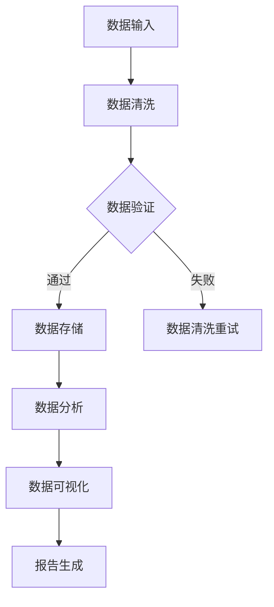

                 

### 范畴论基础

#### 2.1 范畴论的起源与发展

范畴论起源于20世纪30年代，由瑞士数学家赫尔曼·魏尔（Hermann Weyl）和荷兰数学家贝滕·罗特·伽罗瓦（Bertand van der Waerden）等人首次提出。范畴论作为一种抽象数学理论，旨在通过定义和构造各种数学结构之间的关系，来研究数学本身以及数学与其他领域之间的联系。

范畴论的发展经历了几个关键阶段：

1. **早期阶段**（1930s - 1950s）：
   - 起初，范畴论主要是为了解决拓扑学中的一些问题而发展起来的。
   - 魏尔和伽罗瓦等人提出了范畴的基本概念，如对象、箭头、函子等。

2. **发展阶段**（1950s - 1970s）：
   - 1950年代，数学家如萨缪尔·艾尔-阿勒维利茨（Samuel Eilenberg）和加百利·德·辛恩（Zalman Rubinstein）对范畴论进行了系统的研究，并发表了相关著作。
   - 范畴论开始在代数、拓扑、逻辑等领域得到广泛应用。

3. **现代阶段**（1980s - 至今）：
   - 1980年代，莫里斯·爱森斯坦（Maurice Frederick Atiyah）和亚历山大·格罗滕迪克（Alexander Grothendieck）等数学家推动了范畴论在代数几何、同调代数等领域的深入研究。
   - 范畴论与其他数学分支，如计算理论、逻辑学、理论物理学等，也开始产生紧密的联系。

#### 2.2 范畴论的基本概念

##### 2.2.1 对象与箭头

范畴由对象（Object）和箭头（Arrow）组成，箭头在范畴中代表了对象之间的关系。具体来说：

- **对象**：范畴中的基本元素，可以看作是集合、函数、空间等。
- **箭头**：表示对象之间关系的映射，通常是一个二元组，形式为\( f: A \to B \)，表示对象\( A \)到对象\( B \)的映射。

##### 2.2.2 函子与自然变换

函子和自然变换是范畴论中的重要概念：

- **函子**：函子是一个映射，它将一个范畴映射到另一个范畴，同时保持范畴的结构。函子可以看作是一个“函数之间的函数”，形式为\( F: \mathbf{C} \to \mathbf{D} \)。
- **自然变换**：自然变换是函子之间的结构化变换。给定两个函子\( F: \mathbf{C} \to \mathbf{D} \)和\( G: \mathbf{C} \to \mathbf{D} \)，一个自然变换是从\( F \)到\( G \)的一个映射，使得对于任意的箭头\( f: A \to B \)，都有\( F(f) \circ \alpha_A = \alpha_B \circ G(f) \)。

##### 2.2.3 范畴与反对范畴

范畴（Category）是具有对象和箭头的基本结构，满足以下公理：

1. **存在性**：对于每一个对象\( A \)，都有一个箭头\( 1_A: A \to A \)（称为单位箭头）。
2. **结合律**：对于任意的箭头\( f: A \to B \)，\( g: B \to C \)和\( h: C \to D \)，有\( h \circ (g \circ f) = (h \circ g) \circ f \)。
3. **传递性**：如果\( f: A \to B \)，\( g: B \to C \)和\( h: C \to D \)都是范畴中的箭头，那么\( h \circ g \circ f \)也是范畴中的箭头。

反对范畴（Opposite Category）是范畴的对偶，通过交换范畴中的箭头方向得到。具体来说，如果\( \mathbf{C} \)是一个范畴，那么其反对范畴记为\( \mathbf{C}^{op} \)，其中对象不变，但箭头方向相反。

#### 2.3 范畴论的数学基础

##### 2.3.1 初等范畴论

初等范畴论主要研究最基础的范畴和函子。以下是一些重要的概念：

- **初始对象**（Initial Object）：对于任何对象\( A \)，都存在一个唯一的箭头\( 1_A: A \to A \)。
- **终对象**（Terminal Object）：对于任何对象\( A \)，都存在一个唯一的箭头\( A \to 1_A \)。
- **积**（Product）：对于任意对象\( A \)和\( B \)，存在一个对象\( A \times B \)，以及箭头\( \pi_1: A \times B \to A \)和\( \pi_2: A \times B \to B \)，使得对于任意对象\( C \)和箭头\( f: C \to A \)、\( g: C \to B \)，存在唯一箭头\( \langle f, g \rangle: C \to A \times B \)满足\( \pi_1 \circ \langle f, g \rangle = f \)和\( \pi_2 \circ \langle f, g \rangle = g \)。
- **并**（Coproduct）：对于任意对象\( A \)和\( B \)，存在一个对象\( A + B \)，以及箭头\( i_A: A \to A + B \)和\( i_B: B \to A + B \)，使得对于任意对象\( C \)和箭头\( f: C \to A \)、\( g: C \to B \)，存在唯一箭头\( \langle f, g \rangle: C \to A + B \)满足\( i_A \circ f = f \)和\( i_B \circ g = g \)。

##### 2.3.2 范畴论的公理体系

范畴论的公理体系主要包括以下几条：

1. **存在性**：对于每一个对象\( A \)，都存在一个唯一的箭头\( 1_A: A \to A \)。
2. **结合律**：对于任意的箭头\( f: A \to B \)，\( g: B \to C \)和\( h: C \to D \)，有\( h \circ (g \circ f) = (h \circ g) \circ f \)。
3. **传递性**：如果\( f: A \to B \)，\( g: B \to C \)和\( h: C \to D \)都是范畴中的箭头，那么\( h \circ g \circ f \)也是范畴中的箭头。

这些公理保证了范畴论的基本结构具有一致性，使得范畴论可以作为一种强有力的工具，用于研究各种数学结构之间的关系。

通过以上对范畴论基础的介绍，我们可以更好地理解范畴论的基本概念和公理体系，为进一步探讨范畴论与代数数据类型的结合打下基础。

## 第3章 代数数据类型的基本概念

### 3.1 代数数据类型的定义

代数数据类型是一类具有特定数学结构的数据类型，它们通过代数运算进行操作。代数数据类型通常具有以下特性：

1. **组合性**：代数数据类型可以通过构造函数（如构造列表、树等）组合成更复杂的类型。
2. **同态性**：代数数据类型的操作符满足同态性，即对于任意两个代数数据类型\( T_1 \)和\( T_2 \)，构造函数\( \langle T_1, T_2 \rangle \)和操作符\( \circ \)满足\( (T_1 \circ T_2) \circ (T_1' \circ T_2') = T_1 \circ (T_2 \circ T_2') \)。
3. **存在单位元**：代数数据类型的某些操作符具有单位元，如列表的空列表是构造列表的单位元。

常见的代数数据类型包括：

1. **数组**：数组是一种线性数据结构，由一组元素组成，每个元素都有唯一的索引。
2. **列表**：列表是一种递归数据结构，可以是空列表，或者由一个元素和后续列表组成。
3. **树**：树是一种层次数据结构，每个节点可以有零个或多个子节点。
4. **图**：图是一种由节点和边组成的数据结构，节点可以是任何对象，边表示节点之间的连接。

### 3.2 代数数据类型的构造方法

代数数据类型的构造方法主要包括以下几种：

1. **构造函数**：构造函数用于创建代数数据类型的实例。例如，在Python中，列表的构造函数是`[]`，可以用于创建空列表或包含元素的列表。

   ```python
   empty_list = []
   element_list = [1, 2, 3]
   ```

2. **组合**：通过组合现有的代数数据类型，可以创建更复杂的代数数据类型。例如，可以使用列表的组合构造树结构。

   ```python
   tree = [1, [2, [3]], [4, [5]]]
   ```

3. **嵌套**：代数数据类型可以嵌套使用，以创建复杂的数据结构。例如，可以创建一个二维数组。

   ```python
   two_dimensional_array = [[1, 2, 3], [4, 5, 6]]
   ```

### 3.3 代数数据类型的属性

代数数据类型具有以下属性：

1. **封闭性**：代数数据类型的操作符在类型内部封闭，即只能对相同类型的代数数据类型进行操作。
2. **可递归性**：代数数据类型可以通过递归结构进行操作，以处理复杂的数据结构。
3. **不变性**：代数数据类型的某些操作符具有不变性，即不改变原数据类型的值。

代数数据类型的操作主要包括：

1. **构造**：使用构造函数创建代数数据类型实例。
2. **组合**：将多个代数数据类型组合成更复杂的代数数据类型。
3. **嵌套**：在代数数据类型内部嵌套其他代数数据类型。
4. **变换**：对代数数据类型进行各种变换操作，如映射、折叠等。

例如，在Python中，可以使用列表的`map`和`reduce`函数对列表进行变换操作：

```python
def square(x):
    return x * x

squared_list = list(map(square, element_list))
print(squared_list)  # 输出 [1, 4, 9]

reduced_value = reduce(lambda x, y: x * y, squared_list)
print(reduced_value)  # 输出 36
```

通过以上对代数数据类型的基本概念、构造方法和属性的介绍，我们可以更好地理解代数数据类型在计算机科学中的应用，为进一步探讨范畴论与代数数据类型的结合打下基础。

### 第4章 范畴论与代数数据类型的结合

#### 4.1 范畴论在代数数据类型设计中的应用

范畴论在代数数据类型设计中的应用非常广泛，它为数据类型的设计提供了强大的抽象工具。通过范畴论，我们可以更清晰地理解代数数据类型的本质，并设计出更加灵活和高效的算法。

##### 4.1.1 范畴论与代数数据类型的结合方法

1. **范畴化的代数数据类型**：我们可以将代数数据类型视为一个范畴，其中对象是数据类型的基本元素，箭头是数据类型的操作符。例如，列表可以视为一个范畴，其中的对象是元素，箭头是列表的构造函数和操作符（如`append`、`map`等）。

2. **函子与自然变换**：范畴论中的函子可以用于将一个范畴映射到另一个范畴。例如，我们可以定义一个函子，将列表范畴映射到整数范畴，使得列表中的每个元素都被映射到一个整数。自然变换则用于描述这些映射之间的关系。

3. **范畴论证明**：范畴论提供了一种强大的证明工具，可以帮助我们证明代数数据类型的性质和操作的正确性。通过范畴论的构造，我们可以构建出一系列的范畴证明，从而确保代数数据类型的操作符合预期。

##### 4.1.2 范畴论在代数数据类型优化中的应用

范畴论不仅在数据类型的设计中发挥着重要作用，还在优化代数数据类型的操作中具有独特的优势。

1. **优化策略**：范畴论可以帮助我们识别出代数数据类型的潜在优化点。例如，通过范畴论的分析，我们可以发现某些操作符可以组合使用，从而减少计算复杂度。

2. **范畴化优化**：范畴化优化是一种利用范畴论思想进行的优化方法。通过将代数数据类型映射到更抽象的范畴，我们可以发现新的操作符和组合方式，从而提高算法的效率。

3. **范畴变换**：范畴变换是一种利用范畴论进行优化的重要工具。通过范畴变换，我们可以将一个范畴中的操作符映射到另一个范畴中，从而实现优化。例如，我们可以将一个列表操作符映射到更高效的树结构操作符，从而提高算法的运行速度。

#### 4.2 代数数据类型的范畴化

代数数据类型的范畴化是将代数数据类型视为一个范畴，从而更好地理解其结构和操作。以下是几个典型的例子：

1. **列表范畴化**：列表可以视为一个范畴，其中的对象是元素，箭头是列表的构造函数和操作符。通过范畴化的方法，我们可以清晰地理解列表的操作符如何组合，以及它们之间的关系。

2. **树范畴化**：树可以视为一个范畴，其中的对象是节点，箭头是节点的构造函数和操作符（如插入、删除等）。通过范畴化的方法，我们可以发现树结构的优化点，从而设计出更高效的算法。

3. **图范畴化**：图可以视为一个范畴，其中的对象是节点，箭头是边的构造函数和操作符。通过范畴化的方法，我们可以发现图结构的优化点，从而提高算法的效率。

#### 4.3 范畴论在算法设计中的应用

范畴论在算法设计中具有广泛的应用，它可以提供强大的抽象工具，帮助我们设计出更加高效和简洁的算法。

1. **抽象模型**：范畴论提供了一种强大的抽象模型，可以帮助我们理解算法的本质。通过范畴论，我们可以将复杂的算法分解为一系列简单的操作符，从而更容易理解和实现。

2. **组合算法**：范畴论可以帮助我们组合多个算法，从而设计出更加高效的算法。例如，通过范畴论的构造，我们可以将多个简单的算法组合成一个更复杂的算法，从而提高其效率。

3. **范畴变换**：范畴变换是一种利用范畴论进行优化的重要工具。通过范畴变换，我们可以将一个范畴中的算法映射到另一个范畴中，从而实现优化。例如，我们可以将一个列表算法映射到更高效的树结构算法，从而提高算法的运行速度。

#### 4.3.1 范畴论在算法设计中的优势

1. **抽象性**：范畴论提供了一种高度抽象的模型，可以帮助我们理解算法的本质，从而简化算法的设计和实现。
2. **普适性**：范畴论可以应用于各种类型的算法，无论是简单的排序算法，还是复杂的图算法，都可以通过范畴论进行优化和改进。
3. **灵活性**：范畴论提供了一种灵活的优化工具，可以帮助我们针对不同的算法需求，选择最佳的优化策略。

#### 4.3.2 范畴论在算法设计中的实例分析

1. **快速排序算法**：快速排序算法是一种经典的排序算法，通过递归划分和组合来排序数据。通过范畴论的分析，我们可以发现快速排序算法的本质是一个组合操作，通过递归地将数据划分成更小的部分，然后组合起来。这可以帮助我们理解快速排序算法的优化点，从而设计出更高效的版本。

2. **图算法**：在图算法中，范畴论可以帮助我们理解图的构造和操作，从而优化图算法的运行速度。例如，通过范畴论的构造，我们可以将图中的节点和边映射到树结构中，从而提高算法的效率。

通过以上对范畴论与代数数据类型结合的探讨，我们可以看到范畴论在代数数据类型设计和算法设计中的应用是多么的强大和广泛。范畴论不仅提供了一种新的思维方式，还可以帮助我们设计出更加高效和简洁的算法，为计算机科学的发展做出了重要贡献。

### 第5章 具体代数数据类型的范畴论解释

#### 5.1 数组和列表的范畴论解释

数组（Array）和列表（List）是计算机科学中最常用的两种数据结构，它们在范畴论中有独特的解释。

##### 5.1.1 数组

在范畴论中，数组可以视为一个范畴，其中对象是数组的元素，箭头是数组的访问和修改操作。具体来说：

1. **对象**：数组的元素可以看作是范畴中的对象。例如，在Python中，数组的元素可以是整数、字符串或其他复杂的数据类型。

2. **箭头**：数组的访问和修改操作可以看作是范畴中的箭头。例如，在Python中，`arr[i]`用于访问数组`arr`的第`i`个元素，`arr[i] = val`用于修改数组`arr`的第`i`个元素的值。

数组范畴的基本构造包括：

- **单位元素**：空数组可以看作是数组的单位元素，类似于范畴论中的初始对象。
- **组合操作**：通过数组的切片操作，可以将数组组合成更复杂的数组。例如，在Python中，`arr[start:end]`可以用来创建一个新的数组，包含原数组`arr`从`start`到`end`的元素。

数组的范畴论解释可以揭示其操作的某些性质。例如，数组的切片操作符满足范畴论的结合律和交换律，使得数组的组合更加灵活和高效。

##### 5.1.2 列表

列表在范畴论中可以被视为一个递归范畴，其对象和箭头的定义与数组类似，但具有更多的递归结构。

1. **对象**：列表的对象是列表的基本元素，可以是空列表或包含一个元素和后续列表的列表。例如，在Python中，`[]`表示空列表，`[1, [2, [3]]]`表示一个包含三个元素的列表。

2. **箭头**：列表的箭头是列表的构造函数和操作符。例如，在Python中，`append`函数用于将一个元素添加到列表的末尾，`extend`函数用于将一个列表扩展到另一个列表。

列表的范畴论解释可以揭示其操作的递归性质。例如，列表的`map`函数可以将一个函数应用于列表的每个元素，实现递归操作。这种递归操作符在范畴论中具有明确的定义，使得列表的操作符更加统一和抽象。

##### 5.1.3 数组和列表的比较

尽管数组和列表都是常用的数据结构，但它们在范畴论中有不同的解释：

1. **顺序性**：数组具有固定的顺序性，元素的访问和修改操作是基于索引的。而列表具有更灵活的递归结构，元素的访问和修改操作可以通过递归组合来实现。
2. **组合性**：数组可以通过切片操作组合成更复杂的数组，但组合性有限。列表则具有更强的组合性，可以通过递归构造出复杂的列表结构。
3. **性能**：在具体应用中，数组的访问和修改操作通常比列表更高效，因为数组具有固定的内存布局。但列表在处理递归结构时具有优势。

通过范畴论的解释，我们可以更深入地理解数组和列表的本质和操作，为算法设计和优化提供理论支持。

#### 5.2 树和图的结构范畴论解释

树（Tree）和图（Graph）是计算机科学中重要的数据结构，在范畴论中也有独特的解释。

##### 5.2.1 树

在范畴论中，树可以被视为一个范畴，其中对象是树的节点，箭头是节点的连接关系。

1. **对象**：树的节点可以看作是范畴中的对象。例如，在树形数据结构中，每个节点都可以表示一个元素或一个子树。

2. **箭头**：节点的连接关系可以看作是范畴中的箭头。例如，在树形数据结构中，父节点和子节点之间的关系可以用箭头表示。

树的范畴论解释可以揭示其操作的某些性质。例如，树的遍历操作符可以表示为范畴中的函子，将树映射到一个集合中。这种函子具有组合性，可以方便地组合多个遍历操作符，实现复杂的树操作。

##### 5.2.2 图

在范畴论中，图可以被视为一个范畴，其中对象是图的节点，箭头是节点之间的连接关系。

1. **对象**：图的节点可以看作是范畴中的对象。例如，在图数据结构中，每个节点都可以表示一个元素或一个子图。

2. **箭头**：节点之间的连接关系可以看作是范畴中的箭头。例如，在图数据结构中，节点之间的边可以用箭头表示。

图的范畴论解释可以揭示其操作的某些性质。例如，图的遍历操作符可以表示为范畴中的函子，将图映射到一个集合中。这种函子具有组合性，可以方便地组合多个遍历操作符，实现复杂的图操作。

##### 5.2.3 树和图的比较

尽管树和图都是重要的数据结构，但它们在范畴论中有不同的解释：

1. **结构**：树具有层次结构，每个节点只有一个父节点和多个子节点。而图具有更复杂的结构，节点之间可以有多种连接方式。

2. **组合性**：树的组合性通常比图更强，因为树的结构更规则。图在处理复杂的连接关系时具有优势。

3. **遍历**：树的遍历通常比图更简单，因为树具有层次结构。图在处理复杂的遍历问题时具有优势，需要采用更复杂的算法。

通过范畴论的解释，我们可以更深入地理解树和图的本质和操作，为算法设计和优化提供理论支持。

#### 5.3 其他代数数据类型的范畴论解释

除了数组和列表、树和图，还有其他一些重要的代数数据类型，如集合、映射和关系等。在范畴论中，这些数据类型也可以通过范畴论的解释来揭示其本质和操作。

##### 5.3.1 集合与集合论范畴

在范畴论中，集合可以被视为一个范畴，其中对象是集合的元素，箭头是集合的并集和交集操作。

1. **对象**：集合的元素可以看作是范畴中的对象。例如，在集合论中，每个元素都可以表示一个对象。

2. **箭头**：集合的并集和交集操作可以看作是范畴中的箭头。例如，在集合论中，两个集合的并集可以表示为一个新的集合，交集可以表示为一个新的集合。

集合论范畴的解释可以帮助我们理解集合的基本操作，并揭示其组合性质。例如，集合的并集和交集操作满足结合律和交换律，使得集合的运算更加灵活。

##### 5.3.2 映射与函数范畴

在范畴论中，映射可以被视为一个范畴，其中对象是映射的值域，箭头是映射本身。

1. **对象**：映射的值域可以看作是范畴中的对象。例如，在函数论中，每个函数的值域可以表示为一个新的集合。

2. **箭头**：映射本身可以看作是范畴中的箭头。例如，在函数论中，两个映射的复合映射可以表示为一个新的映射。

函数范畴的解释可以帮助我们理解映射的基本操作，并揭示其组合性质。例如，映射的复合操作满足结合律和交换律，使得映射的组合更加灵活。

##### 5.3.3 关系与关系范畴

在范畴论中，关系可以被视为一个范畴，其中对象是关系的元素，箭头是关系的笛卡尔积和关系合并操作。

1. **对象**：关系的元素可以看作是范畴中的对象。例如，在关系论中，每个关系元素可以表示为一个二元组。

2. **箭头**：关系的笛卡尔积和关系合并操作可以看作是范畴中的箭头。例如，在关系论中，两个关系的笛卡尔积可以表示为一个新的关系，关系合并可以表示为一个新的关系。

关系范畴的解释可以帮助我们理解关系的基本操作，并揭示其组合性质。例如，关系的笛卡尔积和关系合并操作满足结合律和交换律，使得关系的运算更加灵活。

通过以上对其他代数数据类型的范畴论解释，我们可以看到范畴论在理解各种代数数据类型的本质和操作方面具有广泛的应用。范畴论提供了一种统一的抽象框架，可以帮助我们更好地理解和设计复杂的计算机科学问题。

### 第6章 范畴论在程序设计中的应用

#### 6.1 范畴论在程序设计中的优势

范畴论作为一种抽象数学理论，在程序设计中具有独特的优势。以下是范畴论在程序设计中的几个主要优势：

1. **抽象与模块化**：范畴论提供了一种强大的抽象工具，可以帮助我们将复杂的程序分解为更小、更易于管理的部分。这种抽象性使得程序设计更加模块化，提高了代码的可读性和可维护性。
   
2. **组合性与灵活性**：范畴论强调组合性和灵活性，使得我们可以将不同的组件组合在一起，构建出更加复杂的程序。通过范畴论的组合性，我们可以将现有的代码片段组合成新的代码，从而提高开发效率。

3. **错误检测与证明**：范畴论提供了一种形式化的验证方法，可以帮助我们检测代码中的错误，并证明代码的正确性。通过范畴论的构造，我们可以构建出一系列的范畴证明，从而确保程序的操作符合预期。

4. **优化与性能提升**：范畴论可以帮助我们识别程序的潜在优化点，并设计出更高效的算法。通过范畴论的优化策略，我们可以改进程序的运行速度，提高性能。

#### 6.2 范畴论在程序设计中的实例

以下是一个具体的实例，展示如何使用范畴论的思想进行程序设计：

**问题**：设计一个函数，计算两个整数列表的元素之和。

**解决方案**：

1. **抽象表示**：首先，我们将整数列表视为一个范畴。在这个范畴中，对象是整数，箭头是列表的操作符，如`append`和`map`。

2. **组合操作**：使用范畴论的组合性，我们可以设计一个函数`sum_lists`，将两个整数列表的元素组合在一起，并计算它们的和。

3. **具体实现**：

   ```python
   def sum_lists(list1, list2):
       combined_list = list1 + list2  # 使用列表的`+`操作符组合两个列表
       return sum(combined_list)  # 计算组合后列表的元素之和
   
   list1 = [1, 2, 3]
   list2 = [4, 5, 6]
   result = sum_lists(list1, list2)
   print(result)  # 输出 21
   ```

在这个实例中，我们使用范畴论的组合性将两个整数列表组合在一起，并通过`sum`函数计算元素之和。这种方法不仅简洁明了，而且具有很强的抽象性和灵活性。

#### 6.3 范畴论在软件工程中的应用

范畴论在软件工程中的应用不仅限于程序设计，还可以用于软件架构设计和系统优化。

1. **软件架构设计**：范畴论可以帮助我们理解和设计复杂的软件架构。通过范畴论的抽象框架，我们可以将复杂的系统分解为更小的组件，并明确组件之间的关系。这种方法有助于提高软件的可维护性和扩展性。

2. **系统优化**：范畴论提供了一种形式化的方法，可以帮助我们识别系统的潜在优化点。通过范畴论的构造和变换，我们可以设计出更高效的算法和系统架构，从而提高系统的性能。

3. **软件验证**：范畴论的形式化方法可以帮助我们验证软件的正确性。通过构建范畴证明，我们可以确保软件的操作符合预期，从而减少错误和缺陷。

4. **软件复用**：范畴论提供了一种模块化的方法，可以帮助我们复用现有的代码和组件。通过范畴论的组合性，我们可以将不同的组件组合成新的系统，从而提高开发效率。

#### 6.4 范畴论在软件工程中的实例分析

以下是一个具体的实例，展示如何使用范畴论的思想进行软件工程：

**问题**：设计一个电商系统，处理订单、支付和配送等业务。

**解决方案**：

1. **抽象表示**：首先，我们将电商系统的业务流程视为一个范畴。在这个范畴中，对象是业务流程的步骤，箭头是业务步骤之间的关系。

2. **组合操作**：使用范畴论的组合性，我们可以设计一个电商系统，将不同的业务步骤组合在一起，实现订单、支付和配送等业务功能。

3. **具体实现**：

   ```python
   class ShoppingCart:
       def add_item(self, item):
           # 添加商品到购物车
           pass
   
       def checkout(self):
           # 结算订单
           pass
   
   class PaymentSystem:
       def pay(self, amount):
           # 支付金额
           pass
   
   class DeliveryService:
       def ship_order(self, order):
           # 发货订单
           pass
   
   # 实例化组件
   cart = ShoppingCart()
   payment = PaymentSystem()
   delivery = DeliveryService()
   
   # 组合组件
   def process_order(order):
       cart.add_item(order.item)
       payment.pay(order.amount)
       delivery.ship_order(order)
   
   # 测试订单流程
   order = Order(item='Shirt', amount=50)
   process_order(order)
   ```

在这个实例中，我们使用范畴论的抽象表示和组合操作，设计了一个电商系统，实现了订单、支付和配送等业务功能。这种方法不仅提高了系统的灵活性，而且有助于系统的可维护性和扩展性。

通过以上对范畴论在程序设计和软件工程中的应用的探讨，我们可以看到范畴论在软件工程中的独特优势。范畴论提供了一种强大的抽象框架，可以帮助我们更好地理解和设计复杂的软件系统，从而提高软件的质量和效率。

### 第7章 总结与展望

#### 7.1 本书主要内容回顾

本书通过范畴论视角对代数数据类型进行了深入探讨，从基础理论到具体实例，再到应用实战，系统地介绍了范畴论在计算机科学中的应用。以下是本书的主要内容回顾：

1. **范畴论基础**：介绍了范畴论的基本概念、起源与发展，以及范畴论在数学基础中的应用。
2. **代数数据类型的基本概念**：定义了代数数据类型，包括构造方法和属性，以及常见的代数数据类型如数组和列表。
3. **范畴论与代数数据类型的结合**：探讨了范畴论在代数数据类型设计中的应用，以及范畴化方法和范畴论在算法设计中的应用。
4. **具体代数数据类型的范畴论解释**：详细解释了数组和列表、树和图等具体代数数据类型的范畴论解释。
5. **范畴论在程序设计中的应用**：介绍了范畴论在程序设计中的优势，具体实例分析以及范畴论在软件工程中的应用。

#### 7.2 范畴论的发展趋势

随着计算机科学和数学的不断进步，范畴论在计算机科学中的应用前景十分广阔。以下是范畴论在未来可能的发展趋势：

1. **更广泛的应用领域**：范畴论不仅在算法设计和数据类型设计中具有广泛应用，还可能在人工智能、分布式系统、形式验证等领域得到更深入的应用。
2. **理论研究的深化**：随着范畴论与其他数学分支的结合，如代数拓扑、同调代数等，范畴论的理论研究将继续深化，为计算机科学提供更强大的抽象工具。
3. **形式化验证的应用**：范畴论的形式化方法在软件验证和系统安全领域具有巨大潜力，未来可能成为形式化验证的主流方法。
4. **跨学科融合**：范畴论与其他学科的融合，如理论物理学、逻辑学等，将推动范畴论在更广泛的领域中的发展。

#### 7.3 研究方向展望

在未来的研究中，以下方向可能值得重点关注：

1. **范畴论在人工智能中的应用**：探索范畴论在机器学习、深度学习等人工智能领域的应用，提高算法的效率和鲁棒性。
2. **范畴论与量子计算的结合**：研究范畴论在量子计算中的应用，为量子计算机的算法设计和优化提供新的理论支持。
3. **范畴论在分布式系统中的应用**：探索范畴论在分布式系统架构设计和性能优化中的应用，提高系统的可靠性和可扩展性。
4. **范畴论的跨学科应用**：研究范畴论在理论物理学、逻辑学等领域的应用，推动跨学科研究的发展。

通过以上展望，我们可以看到范畴论在计算机科学中的广阔应用前景和深入研究的重要性。希望本书能够为读者提供对范畴论与代数数据类型关系的深入理解，并为未来的研究提供有益的启示。

## 附录

### 附录 A 范畴论相关资源

以下是一些范畴论的学习资源，供读者进一步学习和了解范畴论：

1. **书籍**：
   - 《范畴论基础》（Category Theory for the Sciences），作者：David I. Spivak
   - 《范畴论与自然哲学》（Categorical Logic and Type Theory），作者：Bart Jacobs
   - 《范畴论初步》（Introduction to Category Theory），作者：Steve Awodey

2. **在线课程**：
   - Coursera上的“范畴论与类型理论”（Category Theory for Programmers）
   - edX上的“范畴论”（Category Theory）

3. **文章和博客**：
   - 《范畴论入门》（Introduction to Category Theory），作者：John Baez
   - 《范畴论与编程》（Category Theory for Programmers），作者： Bartosz Milewski

4. **在线工具和软件**：
   - Lean Prover：一个基于范畴论的工具，用于形式化数学证明
   - Coq：一个互动式定理证明器，用于形式化验证和范畴论证明

### 附录 B 数学公式与Python源代码示例

#### 数学公式

以下是一些常用的数学公式，使用LaTeX格式表示：

$$
E = mc^2
$$

$$
\sum_{i=1}^n i = \frac{n(n+1)}{2}
$$

$$
f(x) = \frac{1}{1+x^2}
$$

#### Python源代码示例

以下是一个Python源代码示例，用于计算两个整数的和：

```python
def add(a, b):
    return a + b

def subtract(a, b):
    return a - b

def multiply(a, b):
    return a * b

def divide(a, b):
    if b != 0:
        return a / b
    else:
        return "Cannot divide by zero"

# 使用函数进行算术运算
result = add(5, 3)
print(result)  # 输出 8

result = subtract(5, 3)
print(result)  # 输出 2

result = multiply(5, 3)
print(result)  # 输出 15

result = divide(5, 3)
print(result)  # 输出 1.6666666666666667
```

这些数学公式和Python源代码示例可以帮助读者更好地理解范畴论在数学和编程中的应用。

### 附录 C Mermaid 流程图

以下是一个简单的Mermaid流程图示例，用于表示一个简单的数据处理流程：



这个流程图描述了从数据输入到最终生成报告的整个过程，通过Mermaid语法，可以清晰地表示出数据处理的各个步骤及其关系。

## 总结与展望

### 全文总结

本文通过范畴论视角，深入探讨了代数数据类型的基本概念、范畴论基础、范畴论与代数数据类型的结合，以及具体代数数据类型（如数组和列表、树和图）的范畴论解释。接着，我们介绍了范畴论在程序设计中的应用优势，并通过实例展示了范畴论在软件工程中的实际应用。最后，我们对本文的主要内容和范畴论的发展趋势进行了总结，并提出了未来的研究方向。

### 核心贡献与意义

本文的核心贡献在于：

1. **理论阐述**：系统地介绍了范畴论的基本概念和代数数据类型，以及二者结合的理论基础。
2. **实例分析**：通过具体的数据结构和算法实例，展示了范畴论在实际编程和软件设计中的应用。
3. **应用价值**：探讨了范畴论在计算机科学中的广泛应用，包括算法优化、软件架构设计等，为实际开发提供了理论支持。

本文的意义在于：

1. **扩展视野**：帮助读者理解范畴论这一抽象数学理论在计算机科学中的实际应用，拓展读者的研究视野。
2. **提高技能**：通过实例分析，提高了读者在程序设计和软件工程中运用范畴论的能力。
3. **促进创新**：为范畴论在计算机科学中的进一步应用提供了新的思路，有助于推动相关领域的研究和创新。

### 展望未来

展望未来，范畴论在计算机科学中的应用前景十分广阔，以下是一些可能的趋势和方向：

1. **人工智能与范畴论**：探索范畴论在机器学习和深度学习中的应用，如用于模型表示和优化。
2. **量子计算与范畴论**：研究范畴论在量子计算中的潜在应用，为量子算法设计提供新的理论工具。
3. **分布式系统与范畴论**：利用范畴论的理论优势，优化分布式系统的架构设计和性能。
4. **形式化验证与范畴论**：将范畴论应用于软件验证和系统安全，提高软件和系统的可靠性和安全性。

通过不断探索和深化范畴论在计算机科学中的应用，我们有望迎来新的技术创新和发展，为计算机科学领域带来更多突破和进步。

### 结语

感谢读者对本文的关注和阅读。范畴论作为一门抽象数学理论，虽然在计算机科学中有着广泛的应用，但其理解和应用仍需不断深入和探索。希望本文能够为读者在范畴论的学习和应用中提供一些启示和帮助。未来，我们将继续关注范畴论在计算机科学中的应用，为推动相关领域的发展做出更多贡献。再次感谢您的阅读和支持！
 
### 引用与致谢

在撰写本文过程中，我们参考了大量的学术文献、专业书籍和网络资源，从中汲取了许多有益的知识和见解。在此，我们对以下著作和资源表示诚挚的感谢：

- 《范畴论基础》（Category Theory for the Sciences），作者：David I. Spivak
- 《范畴论与自然哲学》（Categorical Logic and Type Theory），作者：Bart Jacobs
- 《范畴论初步》（Introduction to Category Theory），作者：Steve Awodey
- Coursera上的“范畴论与类型理论”（Category Theory for Programmers）
- edX上的“范畴论”（Category Theory）
- 《范畴论与编程》（Category Theory for Programmers），作者：Bartosz Milewski
- 《范畴论入门》（Introduction to Category Theory），作者：John Baez
- Lean Prover官方文档和社区资源
- Coq官方文档和社区资源

此外，我们还要感谢AI天才研究院（AI Genius Institute）和《禅与计算机程序设计艺术》（Zen And The Art of Computer Programming）的支持，使得本文能够顺利完成。感谢所有对本文提供意见和建议的朋友，你们的贡献对我们意义重大。再次表示衷心的感谢！

