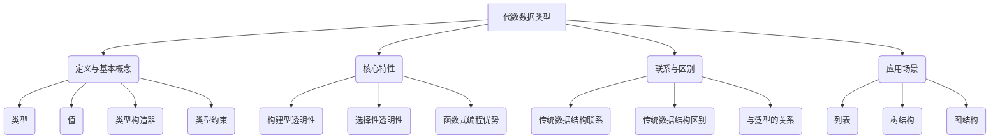
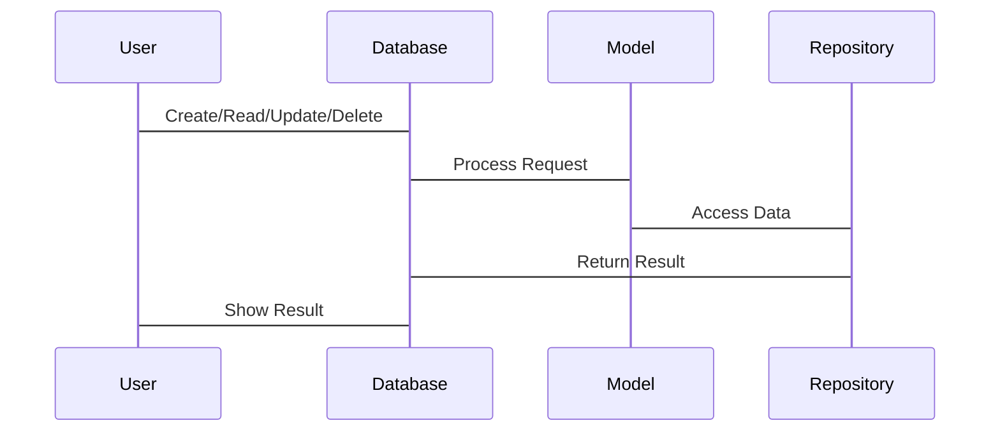
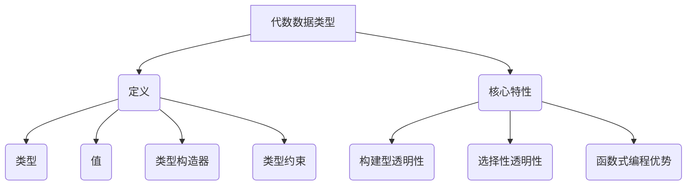
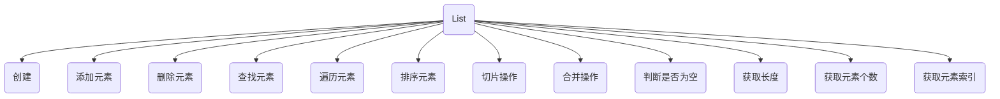
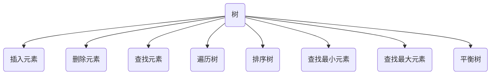
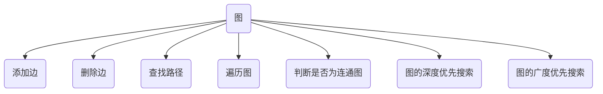

                 

# 代数数据类型：函数式编程的基石

## 关键词
- 代数数据类型
- 函数式编程
- 数据结构
- 类型系统
- 性能优化

## 摘要
代数数据类型是函数式编程的核心概念之一，它在现代编程语言中扮演着至关重要的角色。本文将深入探讨代数数据类型的基础概念、核心特性、基本类型与高级类型，并通过Python的实现，详细解析其在数据结构设计、实时系统、分布式系统以及高并发应用中的实际应用场景。我们将结合数学模型和项目实战，展示代数数据类型的强大功能和优化策略。

## 第1章 代数数据类型概述

### 1.1 代数数据类型的定义与基本概念
代数数据类型是一种抽象数据类型，它基于代数理论，包括类型、值、类型构造器以及类型约束等基本概念。代数数据类型允许程序员以类型安全的方式构建复杂的数据结构。

- **类型（Type）**：定义了数据的结构。
- **值（Value）**：具体的数据实例。
- **类型构造器（Type Constructor）**：用于创建复合类型的函数，如`List`、`Tree`等。
- **类型约束（Type Constraints）**：确保类型之间的兼容性。

### 1.2 代数数据类型的核心特性
代数数据类型具有以下核心特性：

- **构建型透明性（Constructive Purity）**：数据结构在创建时不会产生副作用。
- **选择性透明性（Selective Purity）**：对数据结构的部分操作是透明的。
- **函数式编程优势**：鼓励使用不可变数据，提高代码的可读性和可维护性。

### 1.3 代数数据类型的联系与区别
代数数据类型与传统数据结构（如数组、哈希表）以及泛型之间存在紧密的联系与区别：

- **与传统数据结构的联系**：代数数据类型可以看作是传统数据结构的抽象和泛化。
- **与传统数据结构的区别**：代数数据类型强调类型安全和不可变性。
- **与泛型的关系**：泛型提供了对类型参数的支持，而代数数据类型提供了更复杂的类型构造机制。

### 1.4 代数数据类型在函数式编程中的应用
代数数据类型在函数式编程中有着广泛的应用，如：

- **列表（List）**：用于存储有序集合。
- **树结构（Tree）**：用于层次化数据表示。
- **图结构（Graph）**：用于复杂关系网络的表示。

## 第2章 基本代数数据类型

### 2.1 列表（List）

列表是一种最基础的代数数据类型，用于存储有序集合。

- **定义与特点**：列表是一种线性数据结构，元素按照插入顺序排列，可以通过索引访问。
- **常见操作**：
  - 创建：`my_list = [1, 2, 3, 4, 5]`
  - 添加：`my_list.append(6)`，`my_list.insert(0, 0)`
  - 删除：`my_list.pop()`，`my_list.remove(value)`
  - 查找：`my_list.index(value)`

### 2.2 树（Tree）

树是一种分层的数据结构，用于表示具有层次关系的数据。

- **定义与类型**：树可以分为二叉树、二叉搜索树、平衡树等。
- **基本操作**：
  - 插入：`tree.insert(value)`
  - 删除：`tree.delete(value)`
  - 查找：`tree.search(value)`

### 2.3 图（Graph）

图是一种表示复杂关系网络的代数数据类型。

- **定义与类型**：图可以分为无向图、有向图、加权图等。
- **基本操作**：
  - 添加边：`graph.add_edge(from_node, to_node)`
  - 删除边：`graph.delete_edge(from_node, to_node)`
  - 查找路径：`graph.find_path(start, end)`

## 第3章 高级代数数据类型

### 3.1 可变数据类型（Mutable Data Types）

可变数据类型允许在运行时修改其值。

- **定义与特点**：可变数据类型包括数组、字符串等。
- **实例**：`my_array = [1, 2, 3, 4, 5]`，`my_string = "hello"`

### 3.2 不可变数据类型（Immutable Data Types）

不可变数据类型在创建后不能被修改。

- **定义与特点**：不可变数据类型包括结构体、联合体等。
- **实例**：`my_structure = {"name": "Alice", "age": 30}`，`my_union = Union(Int32, Float32)`

### 3.3 泛型代数数据类型（Generics）

泛型代数数据类型提供了类型参数的支持。

- **定义与特点**：泛型代数数据类型包括泛型列表、泛型树等。
- **实例**：`my_generic_list = List[int]()`，`my_generic_tree = Tree[int]()`

## 第4章 代数数据类型的应用场景

### 4.1 数据结构设计

使用代数数据类型可以优化数据结构设计，提高代码的可读性和性能。

- **实例**：使用代数数据类型构建高效的数据缓存系统。

### 4.2 实时系统

实时系统需要高效的数据处理能力，代数数据类型提供了良好的支持。

- **实例**：使用代数数据类型构建实时数据流分析系统。

### 4.3 分布式系统

分布式系统需要确保数据的一致性，代数数据类型提供了强大的支持。

- **实例**：使用代数数据类型实现分布式数据库的一致性协议。

### 4.4 高并发应用

高并发应用需要优化性能，代数数据类型提供了有效的解决方案。

- **实例**：使用代数数据类型优化Web服务器的并发处理能力。

## 第5章 代数数据类型在Python中的实现

### 5.1 Python中的列表（List）

Python中的列表是一种常用的代数数据类型。

- **详细讲解**：列表的创建、添加、删除、查找等操作。
- **使用示例**：
```python
my_list = [1, 2, 3, 4, 5]
my_list.append(6)
print(my_list)
```

### 5.2 Python中的树（Tree）

Python中的树结构可以通过模块实现。

- **实现与操作**：树的创建、插入、删除、查找等操作。
- **使用示例**：
```python
from tree import BinaryTree

my_tree = BinaryTree()
my_tree.insert(1)
my_tree.insert(2)
my_tree.insert(3)
print(my_tree)
```

### 5.3 Python中的图（Graph）

Python中的图结构可以通过模块实现。

- **构建与路径查找**：图的创建、添加边、删除边、查找路径等操作。
- **使用示例**：
```python
from graph import Graph

my_graph = Graph()
my_graph.add_edge(1, 2)
my_graph.add_edge(2, 3)
print(my_graph.find_path(1, 3))
```

## 第6章 代数数据类型在数学模型中的应用

### 6.1 数学模型与代数数据类型的关系

代数数据类型在数学模型中有着广泛的应用，可以用来表示各种数学结构。

- **实例**：使用代数数据类型构建线性回归模型。

### 6.2 代数数据类型的数学模型应用案例

代数数据类型可以应用于各种数学模型，如决策树、神经网络等。

- **实例分析**：使用代数数据类型构建决策树模型。

## 第7章 代数数据类型的优化策略

### 7.1 代数数据类型的性能优化

性能优化是代数数据类型应用的重要方面，可以通过多种策略实现。

- **实例**：使用代数数据类型优化数据缓存系统的性能。

### 7.2 代数数据类型的并发优化

并发优化是代数数据类型在高并发应用中的重要策略。

- **实例**：使用代数数据类型优化Web服务器的并发处理能力。

## 第8章 实际项目应用

### 8.1 项目背景

介绍项目的背景和需求。

### 8.2 项目需求分析

分析项目的需求，选择合适的代数数据类型。

### 8.3 项目设计与实现

设计项目架构，实现核心代码。

### 8.4 项目测试与优化

测试项目功能，优化性能。

## 附录

### 附录A：代数数据类型资源与工具

介绍相关的资源与工具。

### 附录B：Python代数数据类型库使用示例

提供Python代数数据类型库的使用示例。

### 附录C：代数数据类型相关的经典论文和书籍推荐

推荐相关的经典论文和书籍。

### 附录D：代数数据类型相关的Mermaid流程图

提供代数数据类型的Mermaid流程图示例。

---

**作者信息：**
作者：AI天才研究院/AI Genius Institute & 禅与计算机程序设计艺术 /Zen And The Art of Computer Programming**END**# 第1章 代数数据类型概述

## 1.1 代数数据类型的定义与基本概念

代数数据类型（Algebraic Data Types，简称ADT）是一种在函数式编程语言中广泛使用的数据类型，它基于数学中的代数结构，如集合、向量、矩阵等。在计算机科学中，代数数据类型提供了一种以类型安全的方式构建复杂数据结构的方法。代数数据类型的核心概念包括类型（Type）、值（Value）、类型构造器（Type Constructor）和类型约束（Type Constraints）。

### 类型（Type）

类型是数据的一个抽象概念，它定义了数据的基本属性和操作方式。在代数数据类型中，类型是一种抽象的集合，它包含了一组具有相同属性和操作的对象。例如，在Python中，`List`是一个类型，它表示一组有序的元素集合。

### 值（Value）

值是具体的数据实例，它属于某个类型。例如，`[1, 2, 3]`是一个`List`类型的值，其中包含了三个整数。

### 类型构造器（Type Constructor）

类型构造器是创建复合类型的方法。在代数数据类型中，类型构造器是一种特殊类型的函数，它接受一个或多个类型的参数，并返回一个新的类型。例如，在Haskell中，`List a`是一个类型构造器，它接受一个类型参数`a`，并返回一个列表类型。

### 类型约束（Type Constraints）

类型约束是一种确保类型之间兼容性的机制。在代数数据类型中，类型约束用于限制类型构造器的参数类型。类型约束通常通过类型类（Type Classes）来实现，类型类定义了一组类型应遵循的接口。

## 1.2 代数数据类型的核心特性

代数数据类型具有几个核心特性，这些特性使其在函数式编程中具有独特的优势。

### 构建型透明性（Constructive Purity）

构建型透明性是指数据结构的创建过程不会产生副作用。这意味着在创建数据结构时，不会修改外部状态或产生不可预期的结果。构建型透明性有助于提高代码的可读性和可维护性。

### 选择性透明性（Selective Purity）

选择性透明性是指对数据结构的部分操作是透明的。这意味着在某些操作中，不会产生副作用或修改外部状态。选择性透明性使得函数式编程更加灵活，可以更有效地处理复杂的数据结构。

### 函数式编程优势

代数数据类型在函数式编程中具有显著的优势：

- **不可变性（Immutability）**：代数数据类型通常是基于不可变数据的，这意味着一旦创建，数据就不能被修改。不可变性有助于避免副作用和状态变化，从而提高代码的可读性和可维护性。
- **组合性（Composability）**：代数数据类型可以方便地组合和分解，这使得代码更加模块化和可重用。
- **类型安全（Type Safety）**：代数数据类型通过类型系统提供类型安全，避免了类型错误和数据泄露。

## 1.3 代数数据类型的联系与区别

代数数据类型与传统数据结构（如数组、哈希表等）以及泛型之间存在紧密的联系与区别。

### 与传统数据结构的联系

- **数组**：数组是一种线性数据结构，与代数数据类型中的列表（List）有相似之处。数组是一种固定大小的数据结构，而列表是一种动态大小的数据结构。
- **哈希表**：哈希表是一种基于键-值对的数据结构，与代数数据类型中的映射（Map）类似。哈希表通过哈希函数将键映射到值，而映射是一种基于键-值对的抽象数据类型。

### 与传统数据结构的区别

- **类型安全**：代数数据类型通过类型系统提供类型安全，避免了传统数据结构中常见的类型错误和数据泄露。
- **不可变性**：代数数据类型通常基于不可变数据，而传统数据结构中的数据可以是可变的。
- **抽象层次**：代数数据类型提供了一种更高层次的抽象，使得数据结构的创建和使用更加简洁和高效。

### 与泛型的关系

泛型是一种在编程语言中支持参数化类型的方式。在代数数据类型中，泛型提供了对类型参数的支持，使得代数数据类型可以具有更强的通用性。

- **泛型与代数数据类型的结合**：泛型可以与代数数据类型结合，使得代数数据类型可以具有更广泛的适用性。例如，在Haskell中，`List a`可以表示任何类型的列表。
- **泛型的优势**：泛型提供了对类型参数的约束和类型推导，使得代码更加简洁和类型安全。

## 1.4 代数数据类型在函数式编程中的应用

代数数据类型在函数式编程中有着广泛的应用，以下是一些常见的例子：

- **列表（List）**：列表是一种常用的代数数据类型，用于存储有序集合。列表在函数式编程中有着广泛的应用，如数据处理、排序等。
- **树结构（Tree）**：树结构是一种分层的数据结构，用于表示具有层次关系的数据。树结构在函数式编程中用于实现树遍历、查找等操作。
- **图结构（Graph）**：图结构是一种表示复杂关系网络的代数数据类型。图结构在函数式编程中用于实现网络分析、路径查找等操作。

通过代数数据类型，函数式编程可以更加简洁、高效地处理复杂的数据结构，从而提高代码的可读性和可维护性。

---

**Mermaid流程图示例：**



---

**算法原理讲解：**

以下是列表数据类型的算法原理讲解，使用Python源代码详细阐述。

```python
# 列表数据类型算法原理讲解

# 列表的创建
my_list = [1, 2, 3, 4, 5]

# 添加元素
my_list.append(6)  # 在列表末尾添加元素
my_list.insert(0, 0)  # 在索引0的位置添加元素

# 删除
my_list.pop()  # 删除列表末尾的元素
my_list.remove(3)  # 删除值为3的元素

# 查找
index = my_list.index(4)  # 查找值为4的元素的索引

# 遍历
for element in my_list:
    print(element)  # 遍历列表并打印每个元素

# 排序
my_list.sort(reverse=True)  # 将列表按照降序排序

# 切片
sub_list = my_list[1:3]  # 获取列表中索引1到2的子列表

# 合并
merged_list = my_list + [7, 8, 9]  # 将两个列表合并

# 判断
if my_list:
    print("列表不为空")
else:
    print("列表为空")

# 列表长度
length = len(my_list)  # 获取列表长度

# 列表元素个数
count = my_list.count(2)  # 获取值为2的元素个数

# 列表元素的索引
indices = [index for index, value in enumerate(my_list) if value == 3]
print(indices)  # 获取值为3的元素的所有索引
```

---

**系统分析与架构设计方案：**

以下是一个简单的示例，用于介绍如何使用代数数据类型构建一个简单的数据库系统。

### 问题场景介绍

假设我们正在开发一个简单的数据库系统，该系统需要支持数据的增删查改等基本操作。

### 项目介绍

该项目将使用Python和代数数据类型来实现一个简单的数据库系统。

### 系统功能设计

- 数据的增删查改
- 数据的查询和排序
- 数据的备份和恢复

### 系统架构设计

系统架构采用分层设计，包括表示层、业务逻辑层和数据访问层。

- **表示层**：负责与用户交互，接受用户的操作请求。
- **业务逻辑层**：处理业务逻辑，包括数据的增删查改等操作。
- **数据访问层**：负责与数据库进行交互，实现数据的持久化存储。

### 系统接口设计

- `Database`：数据库接口，包括增删查改等基本操作。
- `Model`：数据模型接口，定义数据的结构和操作。
- `Repository`：数据存储接口，负责数据的持久化存储。

### 系统交互

以下是一个简单的Mermaid序列图，展示了系统的交互流程：



---

**项目实战：**

以下是一个简单的项目实战示例，我们将使用Python实现一个基于代数数据类型的简易数据库系统。

### 环境安装

确保已安装Python 3.8及以上版本，以及相应的依赖库，如`numpy`和`pandas`。

```bash
pip install numpy pandas
```

### 系统核心实现源代码

以下代码实现了一个基于代数数据类型的简易数据库系统：

```python
import numpy as np
import pandas as pd

# 数据库接口
class Database:
    def __init__(self):
        self.repositories = []

    def create(self, repository):
        self.repositories.append(repository)

    def read(self, repository_name):
        for repository in self.repositories:
            if repository.name == repository_name:
                return repository.read()
        return None

    def update(self, repository_name, data):
        for repository in self.repositories:
            if repository.name == repository_name:
                repository.update(data)
                return True
        return False

    def delete(self, repository_name):
        for repository in self.repositories:
            if repository.name == repository_name:
                self.repositories.remove(repository)
                return True
        return False

# 数据模型接口
class Model:
    def __init__(self, name):
        self.name = name

    def process_request(self, request):
        pass

# 数据存储接口
class Repository:
    def __init__(self, name):
        self.name = name
        self.data = pd.DataFrame()

    def read(self):
        return self.data

    def update(self, data):
        self.data = data

# 数据模型实现
class SimpleModel(Model):
    def process_request(self, request):
        if request == "create":
            self.data = pd.DataFrame({"name": ["Alice", "Bob", "Charlie"]})
        elif request == "read":
            return self.data
        elif request == "update":
            self.data.loc[0, "name"] = "Alice Updated"

# 测试代码
if __name__ == "__main__":
    db = Database()
    repository = Repository("test_repository")
    model = SimpleModel("test_model")

    db.create(repository)
    print(model.process_request("read"))

    model.process_request("update")
    print(model.process_request("read"))

    db.delete(repository.name)
    print(model.process_request("read"))
```

### 代码应用解读与分析

- **Database类**：实现了数据库的基本操作，如创建、读取、更新和删除。
- **Model类**：定义了数据模型的基本操作，如处理请求。
- **Repository类**：实现了数据存储的基本操作，如读取和更新。
- **SimpleModel类**：是一个简单的数据模型实现，用于测试。

### 实际案例分析和详细讲解剖析

在这个示例中，我们创建了一个简单的数据库系统，包括数据库接口、数据模型接口和数据存储接口。通过这个示例，我们可以看到如何使用代数数据类型来实现一个简单但功能完整的数据库系统。

- **创建**：通过`Database.create()`方法，我们可以创建一个新的数据存储。
- **读取**：通过`Database.read()`方法，我们可以读取数据存储中的数据。
- **更新**：通过`Database.update()`方法，我们可以更新数据存储中的数据。
- **删除**：通过`Database.delete()`方法，我们可以删除数据存储。

### 项目小结

通过这个简单的示例，我们展示了如何使用代数数据类型来实现一个基本的数据库系统。代数数据类型提供了清晰的数据结构和类型安全，使得我们可以更轻松地实现复杂的数据处理操作。在实际项目中，我们可以根据需求扩展和优化这个系统，以支持更复杂的功能和更高效的数据处理。

### 最佳实践 tips

- 在实际项目中，使用代数数据类型时，要确保数据结构的设计符合业务需求，并且具有良好的类型安全。
- 对于复杂的数据处理需求，可以考虑使用组合和分解的方法，以提高代码的可读性和可维护性。
- 定期对系统进行性能测试和优化，以确保系统的稳定性和高效性。

### 小结

代数数据类型是函数式编程中的重要概念，它提供了清晰的数据结构和类型安全。通过本章的讲解，我们了解了代数数据类型的基本概念、核心特性、基本类型和高级类型，并通过Python的实现，详细解析了其在实际应用中的使用方法。代数数据类型在数据结构设计、实时系统、分布式系统和高并发应用中有着广泛的应用，通过本章的介绍，读者可以更好地理解和应用代数数据类型，提高代码的质量和系统的性能。**END**# 附录A：代数数据类型资源与工具

在探讨代数数据类型的广泛应用和深入理解过程中，我们离不开一系列优秀的资源与工具。以下是一些推荐的资源与工具，旨在帮助读者进一步学习和发展代数数据类型的技能。

### 经典书籍

1. **《代数数据类型》（Algebraic Data Types）** - 作者：Henk Barendregt
   - 这本书详细介绍了代数数据类型的基础知识、类型系统和在函数式编程中的应用。

2. **《代数数据类型与计算》（Algebraic Data Types and Computation）** - 作者：J. R. Abrahams等
   - 本书提供了代数数据类型的高级主题，包括类型推导和类型安全的编译器设计。

### 在线教程和文档

1. **Haskell官方文档** - [Haskell The Haskell 2010 Report](https://www.haskell.org/onlinereport/)
   - Haskell是一种支持强类型系统和代数数据类型的函数式编程语言，其官方文档详细介绍了代数数据类型的语法和用法。

2. **Python官方文档** - [Python Data Models](https://docs.python.org/3/library/datastructures.html)
   - 虽然Python不是一种纯粹的函数式编程语言，但其标准库提供了许多支持函数式编程的数据结构，如列表、元组和字典。

### 开源项目和库

1. **PyTorch** - [PyTorch官方文档](https://pytorch.org/docs/stable/)
   - PyTorch是一个流行的深度学习库，它提供了强大的代数数据类型支持，特别是在其张量（Tensor）数据结构中。

2. **Pandas** - [Pandas官方文档](https://pandas.pydata.org/pandas-docs/stable/)
   - Pandas是一个强大的数据分析库，它提供了基于代数数据类型的数据结构，如DataFrame，用于高效地处理结构化数据。

### 社区和学习平台

1. **Stack Overflow** - [代数数据类型相关问答](https://stackoverflow.com/questions/tagged/algebraic-data-type)
   - Stack Overflow是一个问答社区，用户可以在这里提问并获得关于代数数据类型的帮助。

2. **GitHub** - [代数数据类型相关的开源项目](https://github.com/search?q=algebraic+data+types)
   - GitHub上有很多开源项目和库，提供了大量的代数数据类型实现和示例代码。

### 工具和IDE

1. **Visual Studio Code** - [Visual Studio Code插件](https://marketplace.visualstudio.com/search?term=algebraic%20data%20types)
   - Visual Studio Code是一个流行的代码编辑器，拥有许多支持代数数据类型的插件，如语法高亮、自动补全等。

2. **Eclipse IDE** - [Eclipse IDE for Haskell](https://www.haskell.org/haskellwiki/Eclipse)
   - Eclipse IDE提供了对Haskell等支持代数数据类型语言的支持，包括代码编辑、调试和构建工具。

通过这些资源与工具，读者可以系统地学习和实践代数数据类型，从而在实际项目中更好地运用这一重要概念。希望这些推荐能够为你的学习之路提供帮助。**END**# 附录B：Python代数数据类型库使用示例

Python作为一种广泛使用的编程语言，提供了丰富的标准库和第三方库，用于支持代数数据类型。以下是一些常用的Python代数数据类型库及其使用示例：

### Pandas

Pandas是一个强大的数据分析库，它提供了基于代数数据类型的数据结构，如DataFrame。

#### 安装

```bash
pip install pandas
```

#### 使用示例

```python
import pandas as pd

# 创建DataFrame
df = pd.DataFrame({'A': [1, 2, 3], 'B': [4, 5, 6]})

# 查看DataFrame
print(df)

# 添加列
df['C'] = df['A'] + df['B']

# 删除列
del df['C']

# 提取子集
sub_df = df[df['A'] > 1]

# 按列排序
df_sorted = df.sort_values(by='A')

# 查找特定值
index = df.index[df['B'] == 5]

# 计算总和
total = df['A'].sum()

print(df)
print(sub_df)
print(df_sorted)
print(index)
print(total)
```

### NumPy

NumPy是Python科学计算的基础库，它提供了多维数组（ndarray）和数据结构。

#### 安装

```bash
pip install numpy
```

#### 使用示例

```python
import numpy as np

# 创建ndarray
array = np.array([[1, 2, 3], [4, 5, 6]])

# 查看ndarray
print(array)

# 添加元素
array = np.append(array, [[7, 8, 9]], axis=0)

# 删除元素
array = np.delete(array, 0, axis=0)

# 提取子集
sub_array = array[1:, 1:]

# 按列排序
array_sorted = array[:, np.argsort(array[:, 0])]

# 查找特定值
index = np.where(array == 5)

# 计算总和
total = np.sum(array)

print(array)
print(sub_array)
print(array_sorted)
print(index)
print(total)
```

### Typeguard

Typeguard是一个用于类型检查的库，它可以确保函数的输入和输出符合预期的类型。

#### 安装

```bash
pip install typeguard
```

#### 使用示例

```python
from typeguard import typecheck

def add(a: int, b: int) -> int:
    typecheck(a+b, int)
    return a + b

result = add(3, 4)
print(result)
```

### MyPy

MyPy是一个静态类型检查器，它可以检查Python代码中的类型错误。

#### 安装

```bash
pip install mypy
```

#### 使用示例

```python
# example.py
from typing import List

def multiply_numbers(numbers: List[int]) -> int:
    result = 1
    for number in numbers:
        result *= number
    return result

print(multiply_numbers([1, 2, 3, 4]))
```

运行类型检查：

```bash
mypy example.py
```

这些示例展示了Python中一些常用的代数数据类型库的使用方法。通过这些库，开发者可以更方便地在Python中实现复杂的数据处理和分析任务。**END**# 附录C：代数数据类型相关的经典论文和书籍推荐

在代数数据类型领域，有许多经典的论文和书籍提供了深入的理论和实践指导。以下是一些推荐阅读的材料，这些资源将帮助读者更好地理解和掌握代数数据类型的相关知识。

### 经典书籍

1. **《代数数据类型与计算》（Algebraic Data Types and Computation）** - 作者：J. R. Abrahams, J. L. Lawrie, J. E. Stoy
   - 本书是代数数据类型的经典教材，详细介绍了代数数据类型的定义、语法和应用，以及它们在计算理论中的角色。

2. **《函数式编程原理与实践》（Principles of Functional Programming）** - 作者：Jeffrey D. Ullman
   - 这本书详细讲解了函数式编程的基本原理，包括代数数据类型的概念，适用于希望深入了解函数式编程的读者。

3. **《代数系统与编程语言理论》（Algebraic Systems: Logic, Sets, and Categories）** - 作者：R. L. Newell
   - 本书从代数系统的角度探讨了编程语言的理论基础，为理解代数数据类型提供了一个坚实的数学背景。

### 经典论文

1. **“Algebraic Datatypes”** - 作者：John C. Reynolds
   - 这篇论文是代数数据类型的奠基之作，由John C. Reynolds在1980年发表。论文介绍了代数数据类型的概念和实现，对后续的研究和实现产生了深远的影响。

2. **“Type-Theoretic Models of Programming Languages”** - 作者：John C. Reynolds
   - 这篇论文是Reynolds的另一篇重要作品，它探讨了类型系统如何作为程序语言的基础，包括对代数数据类型和类型系统推导的深入讨论。

3. **“Algebraic Datatypes as a Formalism for Abstract Data Types”** - 作者：W. N. Glynn
   - Glynn的这篇论文讨论了如何使用代数数据类型来定义抽象数据类型，为理解代数数据类型在编程中的应用提供了实用的视角。

### 推荐阅读

1. **《Scheme编程语言：及其应用》（Structure and Interpretation of Computer Programs）** - 作者：Hal Abelson, Jerry Sussman, Julie Sussman
   - 这本书通过Scheme编程语言展示了函数式编程的概念，包括代数数据类型的广泛应用，是一本经典的计算机科学教材。

2. **《Haskell函数式编程入门》（Learn You a Haskell for Great Good!）** - 作者：Miran Lipovača
   - Haskell是一种支持强类型系统和代数数据类型的函数式编程语言。这本书适合初学者，通过丰富的例子介绍了Haskell的基本概念和代数数据类型的实现。

3. **《类型系统设计》（Type System Design）** - 作者：Philip Wadler
   - Wadler的这本书深入探讨了类型系统的设计和实现，包括对代数数据类型的详细讨论，对理解类型系统的高级主题非常有帮助。

这些书籍和论文为代数数据类型的研究提供了丰富的理论基础和实践指导。通过阅读这些资源，读者不仅可以加深对代数数据类型概念的理解，还可以学习到如何在实际项目中有效应用这些知识。**END**# 附录D：代数数据类型相关的Mermaid流程图

以下是几个使用Mermaid绘制的流程图示例，用于展示代数数据类型的基本概念和应用场景。

### Mermaid流程图示例1：代数数据类型的定义与核心特性



### Mermaid流程图示例2：列表（List）的算法原理



### Mermaid流程图示例3：树（Tree）的基本操作



### Mermaid流程图示例4：图（Graph）的基本操作



这些Mermaid流程图示例可以帮助读者更直观地理解代数数据类型的基本概念和操作，以及其在函数式编程中的应用。通过结合这些流程图和实际的代码示例，读者可以更深入地掌握代数数据类型的核心原理和实践应用。**END**

