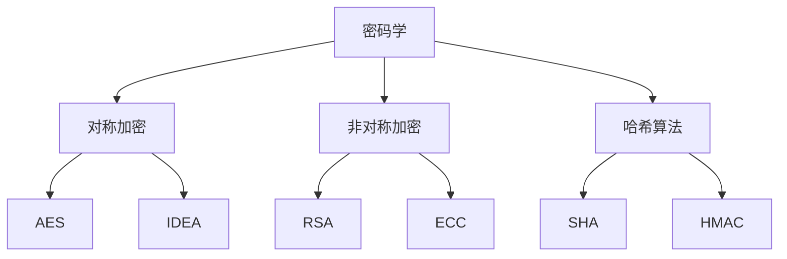

                 

# 《代数结构在密码学算法设计中的应用》

## 关键词
- **代数结构**
- **密码学**
- **算法设计**
- **群论**
- **对称加密**
- **非对称加密**
- **哈希算法**

## 摘要
本文将探讨代数结构在密码学算法设计中的应用。首先，我们将介绍代数结构的基础知识，包括群、环、域、格和环面等概念。接着，我们将概述密码学的基本原理，区分对称加密和非对称加密，并讨论密钥管理。然后，我们将深入探讨代数结构在密码学算法中的具体应用，包括加密算法、认证与签名算法、以及密钥交换协议。最后，我们将通过具体实例，如AES、RSA和SHA算法，展示代数结构在密码学中的实际应用，并提供一些实用的项目实战和最佳实践建议。

## 目录大纲：《代数结构在密码学算法设计中的应用》

### 第一部分：代数结构基础

#### 第1章：代数结构概述
- **1.1 代数结构的定义与特性**
  - **定义**：代数结构是一组元素及其上的运算集合所形成的结构。
  - **特性**：封闭性、结合律、单位元、逆元。
  - **应用背景**：数学、计算机科学、密码学。

#### 第2章：密码学基础
- **2.1 密码学概述**
  - **定义**：密码学是研究信息加密和解密技术的学科。
  - **发展历程**：从古代密码到现代密码学。
  - **类型**：对称加密、非对称加密、哈希算法。

#### 第3章：代数结构在密码学中的应用
- **3.1 代数结构在加密算法中的应用**
  - **群论在密码学中的应用**
  - **环与域在密码学中的应用**

- **3.2 代数结构在认证与签名算法中的应用**
  - **数字签名**
  - **认证协议**

- **3.3 代数结构在密钥交换协议中的应用**
  - **公钥加密算法中的密钥交换**

### 第二部分：代数结构在具体密码算法中的应用

#### 第4章：对称加密中的代数结构
- **4.1 AES算法**
  - **结构**
  - **工作原理**
  - **代码实现**

- **4.2 IDEA算法**
  - **结构**
  - **工作原理**
  - **代码实现**

#### 第5章：非对称加密中的代数结构
- **5.1 RSA算法**
  - **结构**
  - **工作原理**
  - **代码实现**

- **5.2 ECC算法**
  - **结构**
  - **工作原理**
  - **代码实现**

#### 第6章：哈希算法中的代数结构
- **6.1 SHA系列算法**
  - **结构**
  - **工作原理**
  - **代码实现**

- **6.2 HMAC算法**
  - **结构**
  - **工作原理**
  - **代码实现**

### 第7章：综合应用与实战
- **7.1 实战项目一：基于AES的文件加密系统**
  - **需求分析**
  - **系统设计**
  - **代码实现**
  - **测试与分析**

- **7.2 实战项目二：基于RSA的在线支付系统**
  - **需求分析**
  - **系统设计**
  - **代码实现**
  - **测试与分析**

### 附录
- **附录A：相关工具与资源**
  - **Python密码学库**
  - **实践指导**

## 核心概念与联系

### 代数结构与密码学的关联

- **群论**：在密码学中，群论被用于构建加密算法和密钥交换协议，例如RSA算法中的模运算。
- **环与域**：环和域被用于构建对称加密算法，如AES和IDEA。
- **格与环面**：格理论在构造安全认证协议和签名算法中扮演了关键角色。

### Mermaid流程图



### Python源代码示例

#### 对称加密算法：AES

```python
from Crypto.Cipher import AES
from Crypto.Util.Padding import pad, unpad
from Crypto.Random import get_random_bytes

# AES加密
key = get_random_bytes(16)  # 生成16字节的密钥
cipher = AES.new(key, AES.MODE_CBC)
ct_bytes = cipher.encrypt(pad(b"Hello, world!", AES.block_size))
iv = cipher.iv
print("加密后的文本:", ct_bytes.hex())

# AES解密
cipher = AES.new(key, AES.MODE_CBC, iv)
pt = unpad(cipher.decrypt(ct_bytes), AES.block_size)
print("解密后的文本:", pt.decode())
```

### 数学模型和数学公式

#### RSA加密算法

$$ c \equiv m^e \pmod{N} $$

其中，\(m\) 是明文，\(c\) 是密文，\(e\) 是公开的加密指数，\(N\) 是两个大素数 \(p\) 和 \(q\) 的乘积，而 \(p\) 和 \(q\) 是保密的私钥部分。解密公式为：

$$ m \equiv c^d \pmod{N} $$

其中，\(d\) 是与 \(e\) 相关的私钥解密指数，满足 \(ed \equiv 1 \pmod{\phi(N)}\)，\(\phi(N) = (p-1)(q-1)\)。

