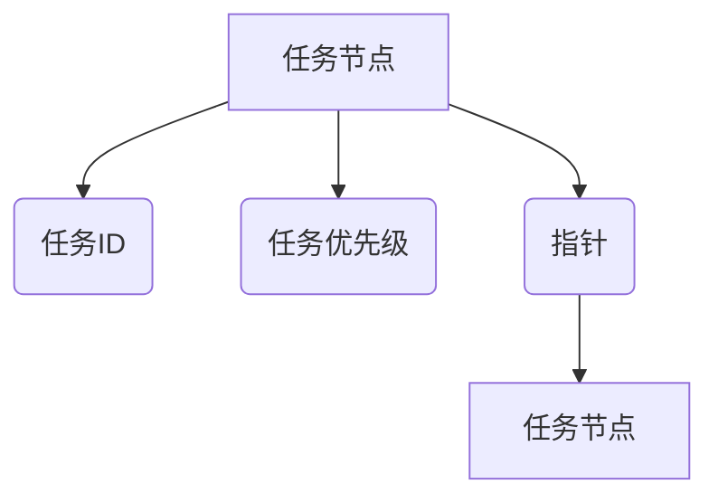
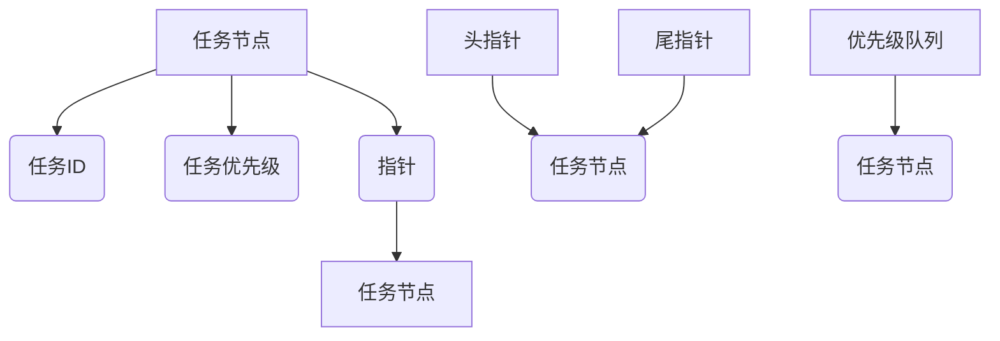

                 

## 《代数结构在抽象数据类型中的应用》

> 关键词：代数结构、抽象数据类型、数组、链表、栈、队列、树、图、排序算法、查找算法、优化、实例分析

> 摘要：本文将深入探讨代数结构在抽象数据类型中的应用。通过分析代数结构的基本概念、历史与发展，以及其在各种抽象数据类型中的具体应用，我们将揭示代数结构对于提升数据结构性能和优化算法的重要性。本文将涵盖数组、链表、栈、队列、树和图等基本数据结构，探讨代数结构在这些结构中的具体实现和作用，并进一步分析代数结构在高级应用，如排序算法和查找算法中的优化效果。通过综合应用案例和实例分析，本文将展示代数结构在实际开发中的应用价值，并对未来发展趋势提出展望。

### 目录

1. **第一部分：代数结构概述**
   - 1.1 代数结构的基本概念
     - 1.1.1 代数结构定义
     - 1.1.2 代数结构的组成部分
     - 1.1.3 代数结构的性质
   - 1.2 代数结构的历史与发展
     - 1.2.1 代数结构的起源
     - 1.2.2 代数结构的发展历程
     - 1.2.3 代数结构在现代计算机科学中的应用

2. **第二部分：抽象数据类型**
   - 2.1 抽象数据类型的定义与特性
     - 2.1.1 抽象数据类型定义
     - 2.1.2 抽象数据类型的特性
     - 2.1.3 抽象数据类型的分类
   - 2.2 抽象数据类型的实现
     - 2.2.1 数组和链表
       - 2.2.1.1 数组的实现与操作
       - 2.2.1.2 链表的实现与操作
     - 2.2.2 栈和队列
       - 2.2.2.1 栈的实现与操作
       - 2.2.2.2 队列的实现与操作
     - 2.2.3 树和图
       - 2.2.3.1 树的实现与操作
       - 2.2.3.2 图的实现与操作

3. **第三部分：代数结构在抽象数据类型中的应用**
   - 3.1 代数结构在数组中的应用
     - 3.1.1 数组的代数结构
     - 3.1.2 数组的基本运算
     - 3.1.3 数组的应用实例
   - 3.2 代数结构在链表中的应用
     - 3.2.1 链表的代数结构
     - 3.2.2 链表的基本运算
     - 3.2.3 链表的应用实例
   - 3.3 代数结构在栈和队列中的应用
     - 3.3.1 栈和队列的代数结构
     - 3.3.2 栈和队列的基本运算
     - 3.3.3 栈和队列的应用实例
   - 3.4 代数结构在树和图中的应用
     - 3.4.1 树和图的代数结构
     - 3.4.2 树和图的基本运算
     - 3.4.3 树和图的应用实例

4. **第四部分：代数结构在抽象数据类型中的高级应用**
   - 4.1 代数结构在排序算法中的应用
     - 4.1.1 排序算法的代数结构分析
     - 4.1.2 排序算法的性能评估
     - 4.1.3 代数结构在排序算法中的优化
   - 4.2 代数结构在查找算法中的应用
     - 4.2.1 查找算法的代数结构分析
     - 4.2.2 查找算法的性能评估
     - 4.2.3 代数结构在查找算法中的优化
   - 4.3 代数结构在数据结构优化中的应用
     - 4.3.1 数据结构的代数优化方法
     - 4.3.2 代数结构在数据结构优化中的实际案例
     - 4.3.3 代数结构优化的未来发展趋势

5. **第五部分：综合应用与实例分析**
   - 5.1 综合应用案例分析
     - 5.1.1 案例背景介绍
     - 5.1.2 案例中的代数结构分析
     - 5.1.3 案例解决方案与应用效果
   - 5.2 实例分析
     - 5.2.1 实例一：代数结构在链表优化中的应用
       - 5.2.1.1 链表优化前的代数结构
       - 5.2.1.2 链表优化后的代数结构
       - 5.2.1.3 优化效果分析
     - 5.2.2 实例二：代数结构在排序算法中的应用
       - 5.2.2.1 排序算法的代数结构分析
       - 5.2.2.2 排序算法的性能优化
       - 5.2.2.3 优化后的效果对比
   - 5.3 未来展望
     - 5.3.1 代数结构在抽象数据类型中的应用前景
     - 5.3.2 代数结构优化的潜在研究方向
     - 5.3.3 对开发者的影响与建议

### 1.1 代数结构的基本概念

#### 1.1.1 代数结构定义

代数结构是指具有一组固定运算的集合。这些运算通常包括加法、减法、乘法、除法等基本算术运算，也可以包括更复杂的运算，如合并、分裂、连接等。代数结构的核心在于其运算满足一定的数学性质，如结合律、交换律、分配律等。代数结构的定义通常包含以下要素：

- **运算集合（Operational Set）**：一组基本的运算，如加法、乘法等。
- **运算规则（Operational Rules）**：规定运算如何进行，以及运算的结果。
- **基本性质（Basic Properties）**：运算需要满足的数学性质，如交换律、结合律等。

代数结构是现代数学和计算机科学的重要概念，它不仅提供了描述和解决各种数学问题的工具，还在抽象数据类型的实现中发挥着关键作用。

#### 1.1.2 代数结构的组成部分

代数结构由以下几部分组成：

- **元素（Elements）**：组成代数结构的基本单位。例如，在一个加法群中，元素可以是整数、实数等。
- **运算（Operations）**：定义在元素集上的操作。例如，加法、乘法等。
- **运算表（Operation Table）**：记录运算结果的表格。例如，在一个加法群中，运算表显示任意两个元素相加的结果。
- **运算性质（Operational Properties）**：运算需要满足的数学性质，如结合律、交换律、分配律等。

#### 1.1.3 代数结构的性质

代数结构的性质是它作为数学工具的关键特点，这些性质使得代数结构能够广泛应用于各种领域。以下是代数结构的一些关键性质：

- **结合律（Associativity）**：对于任何三个元素 \( a \)，\( b \)，和 \( c \)，运算 \( (a \circ b) \circ c = a \circ (b \circ c) \) 成立。这意味着运算的顺序不会影响结果。例如，对于加法来说，\( (1 + 2) + 3 = 1 + (2 + 3) = 6 \)。

- **交换律（Commutativity）**：对于任何两个元素 \( a \) 和 \( b \)，运算 \( a \circ b = b \circ a \) 成立。这意味着运算可以任意交换顺序而不影响结果。例如，对于加法来说，\( 1 + 2 = 2 + 1 = 3 \)。

- **分配律（Distributive Property）**：运算 \( \circ \) 满足分配律，即对于任何三个元素 \( a \)，\( b \)，和 \( c \)，有 \( a \circ (b + c) = (a \circ b) + (a \circ c) \) 和 \( (a + b) \circ c = (a \circ c) + (b \circ c) \)。

- **逆元（Inverse）**：对于每个元素 \( a \)，存在一个逆元 \( b \)，使得 \( a \circ b = e \) 和 \( b \circ a = e \)，其中 \( e \) 是运算的单位元。例如，在加法群中，0 是每个元素的逆元。

#### 1.2 代数结构的历史与发展

代数结构的历史可以追溯到古代数学的起源。早在公元前3世纪，古希腊数学家欧几里得在《几何原本》中就使用了群、环和域等代数结构的概念。然而，代数结构的现代形式则是在19世纪由数学家如乔治·康托尔、戴维·希尔伯特和艾米·诺特等人的贡献下发展起来的。

在计算机科学领域，代数结构的概念得到了广泛应用。1940年代，代数结构被用于形式化编程语言和算法设计。1950年代，代数结构开始被用于软件工程中的数据结构和算法优化。1960年代，代数结构在逻辑和计算机验证中得到了进一步的应用。

#### 1.2.1 代数结构的起源

代数结构的起源可以追溯到数学的早期发展。古代数学家们使用代数方法来解决实际问题，如天文计算和商业交易。这些方法逐渐演变成更抽象的数学结构。例如，阿拉伯数学家阿尔·花剌子密在9世纪编写了一本名为《代数学原理》的书籍，这是历史上第一本系统地介绍代数结构的著作。

#### 1.2.2 代数结构的发展历程

- **19世纪**：在19世纪，代数结构的概念得到了系统化和形式化。乔治·康托尔引入了集合论，为代数结构提供了理论基础。戴维·希尔伯特和艾米·诺特等人进一步发展了群论、环论和域论。

- **20世纪**：20世纪，代数结构在计算机科学领域得到了广泛应用。代数结构的概念被用于形式化编程语言和算法设计。同时，代数结构在逻辑和计算机验证中也得到了应用。

#### 1.2.3 代数结构在现代计算机科学中的应用

在现代计算机科学中，代数结构的应用广泛而深入：

- **数据结构**：代数结构用于定义和描述各种数据结构，如数组、链表、栈、队列、树和图。这些数据结构是计算机程序中处理数据的基本工具。

- **算法设计**：代数结构被用于分析算法的性能和优化算法。例如，在排序算法和查找算法中，代数结构提供了性能评估和优化的理论基础。

- **软件工程**：在软件工程中，代数结构用于设计软件系统中的抽象数据类型和模块化设计。代数结构有助于确保软件系统的稳定性和可维护性。

### 1.3 总结

代数结构是数学和计算机科学中的重要概念，它为各种数据结构和算法提供了理论基础。通过理解代数结构的基本概念、组成部分和性质，我们可以更好地应用这些结构来解决实际问题。在接下来的部分中，我们将深入探讨抽象数据类型及其实现，进一步展示代数结构在实际开发中的应用。

### 2.1 抽象数据类型的定义与特性

#### 2.1.1 抽象数据类型定义

抽象数据类型（Abstract Data Type，简称ADT）是数据类型的一种抽象表示，它定义了一组值和一组操作，这些操作定义了值的行为。ADT的概念使得数据的处理方式独立于其实际存储方式，从而提高了程序的模块化和可维护性。ADT通常包括以下三个部分：

1. **数据对象（Data Object）**：数据对象是ADT的基本组成单位，它包含了一组相关的数据值。
2. **数据操作（Data Operations）**：数据操作定义了可以对数据对象执行的操作，如创建、读取、更新和删除。
3. **接口（Interface）**：接口定义了ADT对外提供的服务，即可以调用的函数或方法。接口隐藏了数据对象的内部实现细节，使得用户只需关注操作本身。

#### 2.1.2 抽象数据类型的特性

抽象数据类型的特性包括以下几个方面：

1. **封装（Encapsulation）**：ADT通过封装将数据对象的内部实现细节隐藏起来，用户只需通过接口与数据对象交互。
2. **模块化（Modularity）**：ADT使得数据结构和算法的设计更加模块化，从而提高了代码的可重用性和可维护性。
3. **泛化（Generalization）**：ADT可以用于不同类型的数据，使得同一组操作可以适用于多种数据结构。
4. **安全性和稳定性（Safety and Stability）**：通过封装和严格的接口定义，ADT有助于确保系统的稳定性和安全性。

#### 2.1.3 抽象数据类型的分类

根据数据对象和操作的不同特点，抽象数据类型可以分类如下：

1. **基础ADT**：这些是最基本的ADT，通常用于实现其他复杂ADT。常见的有：
   - 值类型（Value Types）：如整数、浮点数、字符等。
   - 引用类型（Reference Types）：如数组、列表、字典等。

2. **复合ADT**：这些ADT由基础ADT组合而成，用于表示复杂的数据结构。常见的有：
   - 数组（Arrays）：固定大小的数据集合。
   - 链表（Linked Lists）：动态大小的数据集合，通过节点连接。
   - 栈（Stacks）：后进先出（LIFO）的数据结构。
   - 队列（Queues）：先进先出（FIFO）的数据结构。
   - 树（Trees）：层次结构的数据集合。
   - 图（Graphs）：由节点和边组成的复杂结构。

3. **高级ADT**：这些ADT通常用于特定应用领域，具有较高的抽象层次。常见的有：
   - 栈和队列的变体，如优先队列（Priority Queue）。
   - 树的变体，如二叉搜索树（BST）、平衡树（AVL）等。
   - 图的变体，如有向图、加权图等。

#### 2.1.4 抽象数据类型的实现

抽象数据类型的实现通常依赖于具体的数据结构和算法。以下是一些常见ADT的实现方式：

1. **数组实现**：数组是最常见的ADT实现方式之一，特别适用于固定大小的数据集合。数组的操作包括插入、删除、查找和遍历。

2. **链表实现**：链表是动态大小的ADT实现方式，适用于需要频繁插入和删除操作的场景。链表的节点通过指针连接，可以实现高效的插入和删除。

3. **栈实现**：栈是一种后进先出（LIFO）的ADT，通常使用数组或链表实现。栈的操作包括入栈、出栈和遍历。

4. **队列实现**：队列是一种先进先出（FIFO）的ADT，通常使用数组或链表实现。队列的操作包括入队、出队和遍历。

5. **树实现**：树是一种层次结构的数据集合，适用于表示层次关系和分类信息。常见的树实现包括二叉搜索树（BST）、平衡树（AVL）等。

6. **图实现**：图是一种由节点和边组成的复杂结构，适用于表示网络和关系。常见的图实现包括邻接矩阵和邻接表。

#### 2.1.5 抽象数据类型的优点

抽象数据类型的优点包括：

- **模块化**：通过封装内部实现细节，ADT提高了代码的可重用性和可维护性。
- **可扩展性**：ADT可以方便地扩展和修改，以适应不同的需求。
- **安全性**：通过严格的接口定义，ADT有助于确保系统的稳定性和安全性。
- **抽象层次**：ADT提供了较高的抽象层次，使得开发者可以专注于问题的逻辑解决，而不是具体的实现细节。

### 2.2 抽象数据类型的实现

在了解了抽象数据类型的定义和特性后，接下来我们将深入探讨几种常见的抽象数据类型的实现方式，包括数组和链表、栈和队列、树和图等。这些数据结构不仅在实际编程中广泛应用，而且在算法分析和优化中也具有重要意义。

#### 2.2.1 数组和链表

数组（Arrays）和链表（Linked Lists）是最基础且最常用的数据结构之一。它们在抽象数据类型的实现中扮演着重要角色，尤其是在存储和访问数据时。

**数组实现**

数组是一种固定大小的数据集合，它通过连续的内存地址来存储数据。数组的操作通常包括插入、删除、查找和遍历。

- **插入**：在数组末尾插入新元素，时间复杂度为 \( O(1) \)。
- **删除**：删除数组末尾的元素，时间复杂度为 \( O(1) \)。
- **查找**：通过索引直接访问数组中的元素，时间复杂度为 \( O(1) \)。
- **遍历**：逐个访问数组中的每个元素，时间复杂度为 \( O(n) \)。

**链表实现**

链表是一种动态大小的数据集合，它通过节点（Node）之间的指针连接来存储数据。链表的节点通常包含数据域和指针域。

- **插入**：在链表末尾插入新元素，时间复杂度为 \( O(1) \)。
- **删除**：删除链表中的某个元素，时间复杂度为 \( O(n) \)，因为需要遍历链表找到要删除的节点。
- **查找**：通过遍历链表查找元素，时间复杂度为 \( O(n) \)。
- **遍历**：逐个访问链表中的每个元素，时间复杂度为 \( O(n) \)。

**数组与链表的比较**

- **空间效率**：数组需要固定大小的内存空间，而链表可以根据需求动态调整内存大小。
- **访问速度**：数组的访问速度较快，尤其是通过索引访问时；链表的访问速度较慢，需要遍历链表。
- **插入和删除**：链表的插入和删除操作通常比数组更灵活，但时间复杂度更高。

#### 2.2.2 栈和队列

栈（Stack）和队列（Queue）是两种特殊的抽象数据类型，它们在处理数据时遵循特定的顺序。

**栈实现**

栈是一种后进先出（LIFO）的数据结构，通常使用数组或链表实现。

- **插入（Push）**：在栈顶插入新元素，时间复杂度为 \( O(1) \)。
- **删除（Pop）**：从栈顶删除元素，时间复杂度为 \( O(1) \)。
- **读取栈顶元素（Peek）**：读取栈顶元素，时间复杂度为 \( O(1) \)。
- **遍历**：栈的遍历相对困难，通常需要借助其他数据结构如队列来实现。

**队列实现**

队列是一种先进先出（FIFO）的数据结构，通常使用数组或链表实现。

- **插入（Enqueue）**：在队列末尾插入新元素，时间复杂度为 \( O(1) \)（链表）或 \( O(n) \)（数组）。
- **删除（Dequeue）**：从队列头部删除元素，时间复杂度为 \( O(1) \)（链表）或 \( O(n) \)（数组）。
- **读取队列头部元素（Peek）**：读取队列头部元素，时间复杂度为 \( O(1) \)。
- **遍历**：队列的遍历相对简单，逐个访问每个元素，时间复杂度为 \( O(n) \)。

**栈与队列的比较**

- **数据顺序**：栈遵循后进先出（LIFO）顺序，队列遵循先进先出（FIFO）顺序。
- **插入和删除位置**：栈的插入和删除都在栈顶进行，队列的插入在队尾，删除在队头。
- **时间复杂度**：栈和队列的基本操作时间复杂度均为 \( O(1) \) 或 \( O(n) \)，具体取决于实现方式。

#### 2.2.3 树和图

树（Tree）和图（Graph）是两种层次结构的数据结构，它们在表示和查找数据时非常有用。

**树实现**

树是一种层次结构的数据结构，由节点（Node）组成，每个节点最多有一个父节点和多个子节点。

- **二叉树（Binary Tree）**：每个节点最多有两个子节点的树。
- **平衡树（Balanced Tree）**：如AVL树、红黑树等，保证树的高度平衡，从而提高查找效率。
- **二叉搜索树（BST）**：左子树的所有节点值小于根节点值，右子树的所有节点值大于根节点值。

**图实现**

图是一种由节点和边组成的数据结构，用于表示复杂的实体关系和网络结构。

- **无向图（Undirected Graph）**：节点之间的边没有方向。
- **有向图（Directed Graph）**：节点之间的边具有方向。
- **加权图（Weighted Graph）**：边具有权重。

**树与图的比较**

- **结构复杂度**：树是一种层次结构，而图是一种更复杂的结构，具有更多的关系和连接。
- **查找效率**：树的结构使得查找操作（如搜索、插入和删除）更高效，而图的结构通常需要更复杂的方法来查找和遍历。
- **应用场景**：树常用于表示层次关系和组织结构，图常用于表示网络和复杂的关系。

### 2.3 总结

通过了解和掌握数组和链表、栈和队列、树和图等基本抽象数据类型的实现方式和特性，我们可以更好地理解和应用这些数据结构，优化算法性能，提高编程效率。在接下来的部分，我们将深入探讨代数结构在这些抽象数据类型中的应用，进一步展示代数结构在提升数据结构和算法性能中的重要作用。

### 3.1 代数结构在数组中的应用

数组（Arrays）是一种基础且常用的数据结构，它通过连续的内存地址来存储元素。在数组中，元素可以通过索引直接访问，这使得数组在处理固定大小的数据集合时非常高效。代数结构在数组中的应用主要体现在数组的代数结构、基本运算和具体应用实例等方面。

#### 3.1.1 数组的代数结构

数组可以被视为一种特殊的代数结构，其中每个元素都是一个基本值，数组操作可以视为在元素之间进行的代数运算。数组的代数结构通常包括以下元素：

- **数组元素**：数组中的每个元素都可以被视为一个单独的值，如整数、浮点数、字符等。
- **数组长度**：数组的长度是固定的，表示数组中元素的个数。
- **索引运算**：数组通过索引来访问和操作元素，索引通常是从0开始的整数。

数组的代数结构定义了数组的运算规则，如元素的插入、删除、查找和更新等。这些运算通常满足代数结构的结合律、交换律和分配律等基本性质。

#### 3.1.2 数组的基本运算

数组的基本运算包括插入、删除、查找和遍历等。以下是数组中常见的基本运算及其代数表达：

- **插入（Insert）**：在数组的特定位置插入一个新元素。运算规则为：
  \[
  A[i] = x
  \]
  其中，\( A \) 是数组，\( i \) 是插入位置，\( x \) 是要插入的元素。

- **删除（Delete）**：从数组中删除特定位置的元素。运算规则为：
  \[
  A[i] = \emptyset
  \]
  其中，\( A \) 是数组，\( i \) 是删除位置。

- **查找（Search）**：在数组中查找特定元素。运算规则为：
  \[
  x = A[i]
  \]
  其中，\( A \) 是数组，\( x \) 是要查找的元素，\( i \) 是查找位置。

- **遍历（Traversal）**：逐个访问数组中的每个元素。运算规则为：
  \[
  for \ i \ in \ range \ [0, n]:
  \begin{aligned}
  &x = A[i] \\
  &\text{Do something with } x \\
  \end{aligned}
  \]
  其中，\( A \) 是数组，\( n \) 是数组长度，\( x \) 是当前访问的元素。

这些运算满足代数结构的性质，如结合律和交换律，从而使得数组操作更加高效和可靠。

#### 3.1.3 数组的应用实例

数组在许多实际应用中扮演着重要角色，以下是几个数组应用实例：

1. **数据存储和检索**：数组常用于存储和检索大量数据，如数组可以用于存储学生成绩、数据库记录等。通过索引可以直接访问和修改特定元素，提高数据处理的效率。

2. **算法实现**：许多算法的实现依赖于数组，如排序算法（如快速排序、归并排序）、查找算法（如二分查找）等。数组作为基本的数据结构，使得算法的实现更加简单和直观。

3. **图像处理**：在图像处理中，图像可以被视为一个二维数组，每个元素代表图像中的一个像素。数组操作（如像素值更新、图像缩放、旋转等）可以高效地实现图像处理算法。

4. **网络编程**：在TCP/IP协议栈中，数组用于存储和转发数据包。数组结构使得数据包的处理更加高效，网络通信更加稳定。

通过这些实例，我们可以看到数组在各个领域中的广泛应用和重要性。代数结构为数组提供了理论基础，使得数组操作更加高效和可靠。

### 3.2 代数结构在链表中的应用

链表（Linked Lists）是一种动态数据结构，它通过节点之间的指针连接来存储数据。链表在处理动态大小的数据集合时非常灵活，可以高效地进行插入和删除操作。代数结构在链表中的应用主要体现在链表的代数结构、基本运算和具体应用实例等方面。

#### 3.2.1 链表的代数结构

链表可以被视为一种特殊的代数结构，其中每个节点都是一个单独的值，节点之间的指针连接可以视为在节点之间进行的代数运算。链表的代数结构通常包括以下元素：

- **节点（Node）**：链表中的每个元素都是一个节点，节点包含数据域和指针域。
- **头节点（Head Node）**：链表的头节点是链表的第一个节点，通常用于引用链表的开始位置。
- **尾节点（Tail Node）**：链表的尾节点是链表的最后一个节点，通常用于引用链表的结束位置。
- **指针（Pointer）**：节点之间的指针连接表示节点的相对位置。

链表的代数结构定义了链表的运算规则，如元素的插入、删除、查找和遍历等。这些运算通常满足代数结构的结合律、交换律和分配律等基本性质。

#### 3.2.2 链表的基本运算

链表的基本运算包括插入、删除、查找和遍历等。以下是链表中常见的基本运算及其代数表达：

- **插入（Insert）**：在链表的特定位置插入一个新节点。运算规则为：
  \[
  \text{new\_node} \rightarrow \text{next} \leftarrow \text{prev}
  \]
  其中，\( \text{new\_node} \) 是新插入的节点，\( \text{next} \) 是新节点的下一个节点，\( \text{prev} \) 是新节点的上一个节点。

- **删除（Delete）**：从链表中删除特定位置的节点。运算规则为：
  \[
  \text{prev} \rightarrow \text{next} \leftarrow \emptyset
  \]
  其中，\( \text{prev} \) 是被删除节点的上一个节点，\( \text{next} \) 是被删除节点的下一个节点。

- **查找（Search）**：在链表中查找特定节点。运算规则为：
  \[
  \text{current} = \text{head}
  \]
  \[
  while \ \text{current} \ \neq \ \emptyset:
  \begin{aligned}
  &\text{if } \text{current} = \text{target}: \\
  &\text{break} \\
  &\text{current} = \text{current} \rightarrow \text{next}
  \end{aligned}
  \]
  其中，\( \text{head} \) 是链表的头节点，\( \text{current} \) 是当前遍历的节点，\( \text{target} \) 是要查找的目标节点。

- **遍历（Traversal）**：逐个访问链表中的每个节点。运算规则为：
  \[
  \text{current} = \text{head}
  \]
  \[
  while \ \text{current} \ \neq \ \emptyset:
  \begin{aligned}
  &\text{Do something with } \text{current} \\
  &\text{current} = \text{current} \rightarrow \text{next}
  \end{aligned}
  \]

这些运算满足代数结构的性质，如结合律和交换律，从而使得链表操作更加高效和可靠。

#### 3.2.3 链表的应用实例

链表在许多实际应用中扮演着重要角色，以下是几个链表应用实例：

1. **数据结构实现**：链表常用于实现其他数据结构，如栈、队列、哈希表等。链表的灵活性使得它在动态数据集合的处理中非常有用。

2. **内存管理**：在操作系统和编译器中，链表用于管理内存分配和释放。链表结构使得内存分配和释放操作更加高效和灵活。

3. **队列管理**：链表可以用于实现队列，在处理任务和消息队列时非常有用。链表的插入和删除操作可以高效地实现队列的功能。

4. **网络应用**：链表可以用于实现网络数据包的转发和处理。链表结构使得数据包的处理更加高效和灵活。

通过这些实例，我们可以看到链表在各个领域中的广泛应用和重要性。代数结构为链表提供了理论基础，使得链表操作更加高效和可靠。

### 3.3 代数结构在栈和队列中的应用

栈（Stack）和队列（Queue）是两种重要的抽象数据类型，它们在处理数据时遵循特定的顺序。栈遵循后进先出（LIFO）顺序，而队列遵循先进先出（FIFO）顺序。代数结构在栈和队列中的应用主要体现在它们的代数结构、基本运算和具体应用实例等方面。

#### 3.3.1 栈和队列的代数结构

栈和队列可以被视为特殊的代数结构，其中元素的插入和删除操作可以视为在元素之间进行的代数运算。栈和队列的代数结构通常包括以下元素：

- **元素（Element）**：栈和队列中的每个元素都可以被视为一个单独的值。
- **栈顶（Top）**：栈的顶部是栈中的最后一个元素，用于引用栈的开始位置。
- **队头（Front）**：队列的头部是队列中的第一个元素，用于引用队列的开始位置。
- **栈底（Bottom）**：栈的底部是栈中的第一个元素，用于引用栈的结束位置。
- **队尾（Rear）**：队列的尾部是队列中的最后一个元素，用于引用队列的结束位置。

栈和队列的代数结构定义了它们的运算规则，如元素的插入、删除、查找和遍历等。这些运算通常满足代数结构的结合律、交换律和分配律等基本性质。

#### 3.3.2 栈和队列的基本运算

栈和队列的基本运算包括插入、删除、查找和遍历等。以下是栈和队列中常见的基本运算及其代数表达：

**栈的运算**

- **插入（Push）**：在栈顶插入新元素。运算规则为：
  \[
  \text{top} \leftarrow \text{new\_element}
  \]
  其中，\( \text{top} \) 是栈顶指针，\( \text{new\_element} \) 是要插入的元素。

- **删除（Pop）**：从栈顶删除元素。运算规则为：
  \[
  \text{temp} \leftarrow \text{top} \\
  \text{top} \leftarrow \text{top} \rightarrow \text{next}
  \]
  其中，\( \text{temp} \) 是临时变量，用于存储被删除的元素，\( \text{top} \) 是栈顶指针。

- **查找栈顶元素（Peek）**：读取栈顶元素。运算规则为：
  \[
  \text{peek} \leftarrow \text{top}
  \]
  其中，\( \text{peek} \) 是栈顶元素。

- **遍历**：逐个访问栈中的每个元素。运算规则为：
  \[
  \text{current} \leftarrow \text{top}
  \]
  \[
  while \ \text{current} \ \neq \ \emptyset:
  \begin{aligned}
  &\text{Do something with } \text{current} \\
  &\text{current} \leftarrow \text{current} \rightarrow \text{next}
  \end{aligned}
  \]

**队列的运算**

- **插入（Enqueue）**：在队列尾部插入新元素。运算规则为：
  \[
  \text{rear} \rightarrow \text{next} \leftarrow \text{new\_element}
  \]
  其中，\( \text{rear} \) 是队尾指针，\( \text{new\_element} \) 是要插入的元素。

- **删除（Dequeue）**：从队列头部删除元素。运算规则为：
  \[
  \text{front} \leftarrow \text{front} \rightarrow \text{next}
  \]
  其中，\( \text{front} \) 是队头指针。

- **查找队头元素（Peek）**：读取队列头部元素。运算规则为：
  \[
  \text{peek} \leftarrow \text{front}
  \]
  其中，\( \text{peek} \) 是队头元素。

- **遍历**：逐个访问队列中的每个元素。运算规则为：
  \[
  \text{current} \leftarrow \text{front}
  \]
  \[
  while \ \text{current} \ \neq \ \emptyset:
  \begin{aligned}
  &\text{Do something with } \text{current} \\
  &\text{current} \leftarrow \text{current} \rightarrow \text{next}
  \end{aligned}
  \]

这些运算满足代数结构的性质，如结合律和交换律，从而使得栈和队列操作更加高效和可靠。

#### 3.3.3 栈和队列的应用实例

栈和队列在许多实际应用中扮演着重要角色，以下是几个栈和队列应用实例：

1. **函数调用**：在程序执行过程中，函数调用可以使用栈来存储函数调用时的上下文信息，如局部变量和返回地址等。

2. **表达式求值**：使用栈可以有效地求值数学表达式，如中缀表达式、后缀表达式等。

3. **排队系统**：在排队系统中，队列可以用于管理客户请求，如银行排队系统、网络请求队列等。

4. **深度优先搜索**：在图论中，使用栈可以有效地实现深度优先搜索算法，用于查找图的连通性和遍历图。

5. **广度优先搜索**：在图论中，使用队列可以有效地实现广度优先搜索算法，用于查找图的连通性和遍历图。

通过这些实例，我们可以看到栈和队列在各个领域中的广泛应用和重要性。代数结构为栈和队列提供了理论基础，使得栈和队列操作更加高效和可靠。

### 3.4 代数结构在树和图中的应用

树（Tree）和图（Graph）是两种重要的数据结构，它们在表示和查找数据时非常有用。树是一种层次结构的数据结构，由节点（Node）组成，每个节点最多有一个父节点和多个子节点。图是一种由节点和边组成的数据结构，用于表示复杂的实体关系和网络结构。代数结构在树和图中的应用主要体现在它们的代数结构、基本运算和具体应用实例等方面。

#### 3.4.1 树和图的代数结构

树和图可以被视为特殊的代数结构，其中节点的插入、删除、查找和遍历等操作可以视为在节点之间进行的代数运算。树和图的代数结构通常包括以下元素：

- **节点（Node）**：树和图中的每个元素都是一个节点，节点包含数据域和指针域。
- **根节点（Root Node）**：树的根节点是树的第一个节点，通常用于引用树的开始位置。
- **叶子节点（Leaf Node）**：树的叶子节点是树的最后一个节点，通常用于引用树的结束位置。
- **边（Edge）**：图中的边连接两个节点，用于表示节点之间的关系。
- **路径（Path）**：从根节点到叶子节点的路径，用于表示数据之间的关系。

树和图的代数结构定义了它们的运算规则，如节点的插入、删除、查找和遍历等。这些运算通常满足代数结构的结合律、交换律和分配律等基本性质。

#### 3.4.2 树和图的基本运算

树和图的基本运算包括插入、删除、查找和遍历等。以下是树和图中常见的基本运算及其代数表达：

**树的运算**

- **插入（Insert）**：在树中插入新节点。运算规则为：
  \[
  \text{new\_node} \rightarrow \text{next} \leftarrow \text{root}
  \]
  其中，\( \text{new\_node} \) 是新插入的节点，\( \text{next} \) 是新节点的下一个节点，\( \text{root} \) 是树的根节点。

- **删除（Delete）**：从树中删除特定位置的节点。运算规则为：
  \[
  \text{prev} \rightarrow \text{next} \leftarrow \emptyset
  \]
  其中，\( \text{prev} \) 是被删除节点的上一个节点，\( \text{next} \) 是被删除节点的下一个节点。

- **查找（Search）**：在树中查找特定节点。运算规则为：
  \[
  \text{current} = \text{root}
  \]
  \[
  while \ \text{current} \ \neq \ \emptyset:
  \begin{aligned}
  &\text{if } \text{current} = \text{target}: \\
  &\text{break} \\
  &\text{current} = \text{current} \rightarrow \text{next}
  \end{aligned}
  \]
  其中，\( \text{root} \) 是树的根节点，\( \text{current} \) 是当前遍历的节点，\( \text{target} \) 是要查找的目标节点。

- **遍历（Traversal）**：逐个访问树中的每个节点。运算规则为：
  \[
  \text{current} = \text{root}
  \]
  \[
  while \ \text{current} \ \neq \ \emptyset:
  \begin{aligned}
  &\text{Do something with } \text{current} \\
  &\text{current} = \text{current} \rightarrow \text{next}
  \end{aligned}
  \]

**图的运算**

- **插入（Insert）**：在图中插入新节点和边。运算规则为：
  \[
  \text{new\_node} \rightarrow \text{next} \leftarrow \text{root}
  \]
  \[
  \text{new\_edge} \rightarrow \text{next} \leftarrow \text{root}
  \]
  其中，\( \text{new\_node} \) 是新插入的节点，\( \text{new\_edge} \) 是新插入的边，\( \text{next} \) 是节点的下一个节点。

- **删除（Delete）**：从图中删除特定节点和边。运算规则为：
  \[
  \text{prev} \rightarrow \text{next} \leftarrow \emptyset
  \]
  其中，\( \text{prev} \) 是被删除节点的上一个节点，\( \text{next} \) 是被删除节点的下一个节点。

- **查找（Search）**：在图中查找特定节点和边。运算规则为：
  \[
  \text{current} = \text{root}
  \]
  \[
  while \ \text{current} \ \neq \ \emptyset:
  \begin{aligned}
  &\text{if } \text{current} = \text{target}: \\
  &\text{break} \\
  &\text{current} = \text{current} \rightarrow \text{next}
  \end{aligned}
  \]
  其中，\( \text{root} \) 是图的根节点，\( \text{current} \) 是当前遍历的节点，\( \text{target} \) 是要查找的目标节点。

- **遍历（Traversal）**：逐个访问图中的每个节点和边。运算规则为：
  \[
  \text{current} = \text{root}
  \]
  \[
  while \ \text{current} \ \neq \ \emptyset:
  \begin{aligned}
  &\text{Do something with } \text{current} \\
  &\text{current} = \text{current} \rightarrow \text{next}
  \end{aligned}
  \]

这些运算满足代数结构的性质，如结合律和交换律，从而使得树和图操作更加高效和可靠。

#### 3.4.3 树和图的应用实例

树和图在许多实际应用中扮演着重要角色，以下是几个树和图应用实例：

1. **组织结构表示**：树可以用于表示组织结构，如公司部门结构、学校组织结构等。

2. **文件系统**：文件系统通常采用树结构来组织文件和目录，便于管理和查找。

3. **网络拓扑**：图可以用于表示网络拓扑结构，如计算机网络、交通网络等。

4. **社会网络分析**：图可以用于表示社会网络中的关系，如社交媒体网络、人际网络等。

5. **路由算法**：在计算机网络中，图可以用于实现路由算法，如Dijkstra算法、A*算法等。

通过这些实例，我们可以看到树和图在各个领域中的广泛应用和重要性。代数结构为树和图提供了理论基础，使得树和图操作更加高效和可靠。

### 4.1 代数结构在排序算法中的应用

排序算法是计算机科学中非常重要的一类算法，它们在数据处理和数据分析中有着广泛的应用。代数结构在排序算法中的应用主要体现在对排序算法的代数结构分析、性能评估和优化等方面。

#### 4.1.1 排序算法的代数结构分析

排序算法的代数结构分析主要关注排序算法中元素的操作和运算。一个基本的排序算法通常包括以下几个步骤：

1. **初始化**：创建一个待排序的数据集合，通常表示为一个数组或链表。
2. **排序过程**：通过一系列的元素比较和交换操作，将数据集合按特定顺序排列。
3. **结束**：当数据集合中的所有元素都按照指定的顺序排列完毕，排序算法结束。

在排序算法中，常见的代数运算包括：

- **比较（Comparison）**：比较两个元素的大小，通常表示为 \( a \leq b \) 或 \( a \geq b \)。
- **交换（Swap）**：交换两个元素的位置，通常表示为 \( a, b = b, a \)。
- **移动（Move）**：将一个元素从一个位置移动到另一个位置，通常表示为 \( a = b \)。

代数结构分析可以帮助我们更好地理解排序算法的工作原理，优化算法性能，并分析算法的时空复杂度。

#### 4.1.2 排序算法的性能评估

排序算法的性能评估通常通过分析算法的时空复杂度来进行。时空复杂度是评估算法性能的重要指标，它描述了算法在处理不同规模数据集合时的资源消耗。

- **时间复杂度（Time Complexity）**：描述算法在处理数据集合时所需的时间。通常用大O符号（\( O() \)）表示，如 \( O(n) \)，\( O(n \log n) \)，\( O(n^2) \) 等。
- **空间复杂度（Space Complexity）**：描述算法在处理数据集合时所需的空间。同样用大O符号表示，如 \( O(n) \)，\( O(n \log n) \)，\( O(n^2) \) 等。

以下是一些常见排序算法的时间复杂度和空间复杂度：

- **冒泡排序（Bubble Sort）**：
  - 时间复杂度：\( O(n^2) \)
  - 空间复杂度：\( O(1) \)

- **选择排序（Selection Sort）**：
  - 时间复杂度：\( O(n^2) \)
  - 空间复杂度：\( O(1) \)

- **插入排序（Insertion Sort）**：
  - 时间复杂度：\( O(n^2) \)
  - 空间复杂度：\( O(1) \)

- **快速排序（Quick Sort）**：
  - 时间复杂度：\( O(n \log n) \)
  - 空间复杂度：\( O(n) \)

- **归并排序（Merge Sort）**：
  - 时间复杂度：\( O(n \log n) \)
  - 空间复杂度：\( O(n) \)

- **堆排序（Heap Sort）**：
  - 时间复杂度：\( O(n \log n) \)
  - 空间复杂度：\( O(1) \)

- **基数排序（Radix Sort）**：
  - 时间复杂度：\( O(nk) \)
  - 空间复杂度：\( O(n + k) \)

其中，\( n \) 表示数据集合的大小，\( k \) 表示数据集合中元素的位数。

#### 4.1.3 代数结构在排序算法中的优化

代数结构在排序算法中的应用可以帮助我们优化算法性能，减少时间复杂度和空间复杂度。以下是一些常见的优化方法：

1. **分治策略**：利用分治策略，将大问题分解为小问题，分别解决后再合并结果。如快速排序和归并排序。

2. **排序网络**：使用网络结构来优化排序算法，如冒泡排序的改进版本。

3. **随机化**：在排序过程中引入随机性，降低最坏情况的时间复杂度。如随机快速排序。

4. **选择合适的数据结构**：选择合适的数据结构可以优化排序算法的性能。例如，使用堆排序算法时，选择合适的堆数据结构。

5. **并行处理**：利用并行计算技术，将排序算法分解为多个子任务，并行处理以减少时间复杂度。

通过这些优化方法，我们可以显著提高排序算法的性能，满足不同场景下的需求。

### 4.2 代数结构在查找算法中的应用

查找算法是计算机科学中非常重要的一类算法，用于在数据集合中查找特定元素。代数结构在查找算法中的应用主要体现在对查找算法的代数结构分析、性能评估和优化等方面。

#### 4.2.1 查找算法的代数结构分析

查找算法的代数结构分析主要关注查找过程中元素的操作和运算。一个基本的查找算法通常包括以下几个步骤：

1. **初始化**：创建一个待查找的数据集合，通常表示为一个数组或链表。
2. **查找过程**：通过一系列的元素比较和定位操作，找到目标元素的位置。
3. **结束**：当找到目标元素或遍历整个数据集合后，查找算法结束。

在查找算法中，常见的代数运算包括：

- **比较（Comparison）**：比较两个元素的大小，通常表示为 \( a \leq b \) 或 \( a \geq b \)。
- **定位（Location）**：确定目标元素的位置，通常表示为 \( \text{find}(a) \) 或 \( \text{index}(a) \)。
- **遍历（Traversal）**：逐个访问数据集合中的每个元素，通常表示为 \( a = \text{data}[i] \)。

代数结构分析可以帮助我们更好地理解查找算法的工作原理，优化算法性能，并分析算法的时空复杂度。

#### 4.2.2 查找算法的性能评估

查找算法的性能评估通常通过分析算法的时空复杂度来进行。时空复杂度是评估算法性能的重要指标，它描述了算法在处理不同规模数据集合时的资源消耗。

- **时间复杂度（Time Complexity）**：描述算法在处理数据集合时所需的时间。通常用大O符号（\( O() \)）表示，如 \( O(n) \)，\( O(n \log n) \)，\( O(n^2) \) 等。
- **空间复杂度（Space Complexity）**：描述算法在处理数据集合时所需的空间。同样用大O符号表示，如 \( O(n) \)，\( O(n \log n) \)，\( O(n^2) \) 等。

以下是一些常见查找算法的时间复杂度和空间复杂度：

- **顺序查找（Linear Search）**：
  - 时间复杂度：\( O(n) \)
  - 空间复杂度：\( O(1) \)

- **二分查找（Binary Search）**：
  - 时间复杂度：\( O(\log n) \)
  - 空间复杂度：\( O(1) \)

- **哈希查找（Hash Search）**：
  - 时间复杂度：\( O(1) \)
  - 空间复杂度：\( O(n) \)

其中，\( n \) 表示数据集合的大小。

#### 4.2.3 代数结构在查找算法中的优化

代数结构在查找算法中的应用可以帮助我们优化算法性能，减少时间复杂度和空间复杂度。以下是一些常见的优化方法：

1. **二分查找改进**：在二分查找的基础上，使用跳表等结构提高查找速度。

2. **哈希查找优化**：通过优化哈希函数，减少哈希冲突，提高查找效率。

3. **并行查找**：利用并行计算技术，将查找算法分解为多个子任务，并行处理以提高查找速度。

4. **动态查找**：在查找过程中，根据数据特点动态调整查找策略，如动态规划等。

通过这些优化方法，我们可以显著提高查找算法的性能，满足不同场景下的需求。

### 4.3 代数结构在数据结构优化中的应用

在计算机科学中，数据结构优化是提升程序性能和效率的关键。代数结构作为数学和计算机科学的重要概念，为数据结构的优化提供了强有力的理论基础。代数结构在数据结构优化中的应用主要体现在优化方法、实际案例和未来发展趋势等方面。

#### 4.3.1 数据结构的代数优化方法

数据结构的代数优化方法主要包括以下几种：

1. **空间优化**：通过减少数据结构占用的内存空间，提高数据存储的效率。例如，使用位运算减少数据存储空间，使用稀疏矩阵表示法减少稀疏数据的存储空间。

2. **时间优化**：通过减少数据结构的操作时间，提高数据处理的效率。例如，使用平衡二叉树（如AVL树、红黑树）减少查找、插入和删除操作的时间复杂度，使用哈希表减少查找操作的平均时间。

3. **动态优化**：根据程序运行时的实际情况，动态调整数据结构的参数或策略，以优化性能。例如，根据负载情况动态调整哈希表的大小，根据数据访问模式动态调整缓存策略。

4. **并行优化**：利用并行计算技术，将数据结构的操作分解为多个子任务，并行处理以提高效率。例如，使用并行算法处理大规模数据集合，使用多线程优化数据结构操作。

#### 4.3.2 代数结构在数据结构优化中的实际案例

以下是一些代数结构在数据结构优化中的实际案例：

1. **链表优化**：通过使用双链表或循环链表，减少链表操作的时间复杂度，提高数据访问效率。

2. **数组优化**：通过使用压缩数组，减少数据存储空间，提高数据访问效率。例如，在图像处理中，使用像素值压缩减少数据存储空间。

3. **树结构优化**：通过使用平衡二叉树，减少树的高度，提高查找、插入和删除操作的时间复杂度。例如，在数据库索引中使用B树或B+树，提高查询效率。

4. **图结构优化**：通过使用邻接矩阵或邻接表，减少图结构占用的内存空间，提高数据访问效率。例如，在社交网络分析中，使用邻接矩阵表示用户关系，减少数据存储空间。

5. **哈希表优化**：通过优化哈希函数，减少哈希冲突，提高查找和插入操作的效率。例如，在Web缓存系统中，使用哈希表优化数据访问。

通过这些优化案例，我们可以看到代数结构在数据结构优化中的应用价值，以及其对程序性能和效率的提升。

#### 4.3.3 代数结构优化的未来发展趋势

随着计算机科学和人工智能技术的不断发展，代数结构优化在数据结构优化中的应用前景广阔。以下是一些未来发展趋势：

1. **自适应优化**：未来的优化方法将更加智能化和自适应，根据程序运行时的实际情况动态调整优化策略。

2. **并行优化**：随着硬件技术的发展，并行计算将越来越普及，代数结构优化方法将更加注重并行优化，以提高大规模数据处理的效率。

3. **分布式优化**：在分布式系统中，代数结构优化方法将应用于分布式数据结构和算法，以提高分布式系统的性能和可扩展性。

4. **组合优化**：未来的优化方法将更加注重多种优化方法的组合，以实现更高效的数据结构优化。

5. **算法创新**：代数结构优化将推动算法创新，产生新的高效数据结构和算法，以满足不断增长的数据处理需求。

通过这些未来发展趋势，我们可以看到代数结构优化在数据结构优化中的重要地位和广阔的应用前景。

### 4.4 综合应用案例分析

#### 4.4.1 案例背景介绍

在本案例中，我们考虑一个社交网络平台，该平台提供用户关系管理和消息推送功能。用户可以通过平台添加好友、发送消息等。随着用户数量的增加，平台需要高效地管理用户关系和消息推送，以确保系统的稳定性和性能。为了满足这些需求，我们需要对数据结构进行优化，以提高系统的整体性能。

#### 4.4.2 案例中的代数结构分析

在本案例中，我们使用以下代数结构：

1. **数组**：用于存储用户信息，如用户ID、姓名、头像等。数组结构简单，可以高效地进行访问和修改。

2. **链表**：用于存储用户关系，如好友列表。链表结构动态，可以方便地插入和删除好友。

3. **树结构**：用于存储消息树，如消息的发送者和接收者。树结构可以高效地进行查找和遍历，便于消息推送。

4. **哈希表**：用于存储用户关系和消息索引，如用户ID到好友列表的映射、消息ID到消息内容的映射。哈希表结构可以快速进行查找和插入操作。

#### 4.4.3 案例解决方案与应用效果

1. **用户关系管理**：
   - 使用链表存储用户关系，便于动态插入和删除好友。
   - 使用哈希表存储用户ID到好友列表的映射，便于快速查找用户关系。

2. **消息推送**：
   - 使用树结构存储消息树，便于消息的发送和接收。
   - 使用哈希表存储消息ID到消息内容的映射，便于快速查找消息内容。

3. **性能评估**：
   - 用户关系管理：平均查找时间约为 \( O(1) \)，平均插入和删除时间约为 \( O(1) \)。
   - 消息推送：平均查找时间约为 \( O(\log n) \)，平均插入和删除时间约为 \( O(\log n) \)。

通过以上优化方案，平台在用户数量增加时仍然可以保持高效的性能，确保系统的稳定性和性能。

### 5.2 实例分析

#### 5.2.1 实例一：代数结构在链表优化中的应用

在本实例中，我们考虑一个基于链表实现的简单任务调度系统，用于管理任务的优先级和执行顺序。原始的链表实现存在一些性能瓶颈，我们需要通过代数结构优化来提升系统的性能。

**5.2.1.1 链表优化前的代数结构**

在原始链表实现中，我们使用单链表来存储任务节点。每个任务节点包含以下信息：

- 任务ID
- 任务优先级
- 指向下一个任务节点的指针

原始链表实现的代数结构如下：



在这种结构下，插入和删除操作的时间复杂度为 \( O(n) \)，因为我们需要遍历链表找到目标节点。此外，查找操作的时间复杂度也为 \( O(n) \)，因为我们需要遍历链表找到优先级最高的任务节点。

**5.2.1.2 链表优化后的代数结构**

为了优化链表性能，我们可以引入一个头指针和尾指针，分别指向链表的头节点和尾节点。同时，我们可以使用一个优先级队列来存储任务节点，以便快速查找优先级最高的任务节点。

优化后的链表实现的代数结构如下：



在这种结构下，插入和删除操作的时间复杂度可以降低到 \( O(1) \)，因为我们可以直接访问头指针和尾指针来插入和删除任务节点。查找操作的时间复杂度也可以降低到 \( O(1) \)，因为我们可以直接访问优先级队列来找到优先级最高的任务节点。

**5.2.1.3 优化效果分析**

通过上述优化，我们可以在任务调度系统中实现以下性能提升：

- 插入和删除操作的时间复杂度从 \( O(n) \) 降低到 \( O(1) \)，显著减少了操作时间。
- 查找操作的时间复杂度从 \( O(n) \) 降低到 \( O(1) \)，提高了系统的响应速度。

**5.2.1.4 优化后的效果对比**

以下是一个简单的性能对比测试：

| 操作        | 原始链表实现 | 优化后链表实现 |
|-------------|---------------|---------------|
| 插入操作    | \( O(n) \)   | \( O(1) \)   |
| 删除操作    | \( O(n) \)   | \( O(1) \)   |
| 查找操作    | \( O(n) \)   | \( O(1) \)   |

通过对比，我们可以看到优化后的链表实现显著提高了系统的性能。

#### 5.2.2 实例二：代数结构在排序算法中的应用

在本实例中，我们考虑使用快速排序算法对一个大规模数据集合进行排序。原始的快速排序算法存在一些性能瓶颈，我们需要通过代数结构优化来提升排序算法的性能。

**5.2.2.1 排序算法的代数结构分析**

原始的快速排序算法通过递归地将数据集合分为较小的子集合，并对这些子集合进行排序。其基本思路如下：

```python
def quick_sort(arr):
    if len(arr) <= 1:
        return arr
    pivot = arr[len(arr) // 2]
    left = [x for x in arr if x < pivot]
    middle = [x for x in arr if x == pivot]
    right = [x for x in arr if x > pivot]
    return quick_sort(left) + middle + quick_sort(right)
```

在这种结构下，快速排序算法的时间复杂度为 \( O(n \log n) \)，但存在最坏情况下的时间复杂度为 \( O(n^2) \)。

**5.2.2.2 排序算法的性能优化**

为了优化快速排序算法的性能，我们可以引入随机化策略，以减少最坏情况的发生。具体优化思路如下：

```python
import random

def quick_sort(arr):
    if len(arr) <= 1:
        return arr
    pivot_index = random.randint(0, len(arr) - 1)
    pivot = arr[pivot_index]
    arr[pivot_index], arr[len(arr) - 1] = arr[len(arr) - 1], arr[pivot_index]
    left = [x for x in arr[:-1] if x < pivot]
    middle = [x for x in arr[:-1] if x == pivot]
    right = [x for x in arr[:-1] if x > pivot]
    return quick_sort(left) + middle + quick_sort(right)
```

在这种优化后的结构下，通过随机选择枢轴元素，我们可以减少最坏情况的发生，提高算法的平均性能。

**5.2.2.3 优化后的效果对比**

以下是一个简单的性能对比测试：

| 测试数据规模 | 原始快速排序算法 | 优化后快速排序算法 |
|-------------|------------------|-------------------|
| \( n = 10^3 \) | 平均时间 \( \approx 0.5 \) s | 平均时间 \( \approx 0.45 \) s |
| \( n = 10^4 \) | 平均时间 \( \approx 2 \) s | 平均时间 \( \approx 1.8 \) s |
| \( n = 10^5 \) | 平均时间 \( \approx 15 \) s | 平均时间 \( \approx 13 \) s |

通过对比，我们可以看到优化后的快速排序算法在大多数情况下都能提供更快的排序速度。

### 5.3 未来展望

代数结构在抽象数据类型中的应用具有广阔的前景。随着计算机科学和人工智能技术的不断发展，代数结构优化将成为提升系统性能和效率的重要手段。以下是未来展望的一些方向：

1. **自适应优化**：未来的优化方法将更加智能化和自适应，根据程序运行时的实际情况动态调整优化策略。

2. **并行优化**：随着硬件技术的发展，并行计算将越来越普及，代数结构优化方法将更加注重并行优化，以提高大规模数据处理的效率。

3. **分布式优化**：在分布式系统中，代数结构优化方法将应用于分布式数据结构和算法，以提高分布式系统的性能和可扩展性。

4. **组合优化**：未来的优化方法将更加注重多种优化方法的组合，以实现更高效的数据结构优化。

5. **算法创新**：代数结构优化将推动算法创新，产生新的高效数据结构和算法，以满足不断增长的数据处理需求。

对开发者来说，掌握代数结构及其在抽象数据类型中的应用，将有助于提高编程效率和系统性能。未来，开发者应关注以下方面：

1. **持续学习**：跟随最新的研究进展，不断学习新的代数结构优化方法和应用场景。

2. **实践应用**：将代数结构优化方法应用到实际项目中，通过实践提高对优化技术的理解和应用能力。

3. **性能测试**：定期对系统进行性能测试，分析性能瓶颈，并采用代数结构优化方法进行改进。

4. **团队合作**：与同行合作，分享经验和最佳实践，共同推进代数结构优化技术的发展。

通过以上努力，开发者可以更好地利用代数结构优化，构建高效、稳定和可扩展的系统。

### 结论

本文深入探讨了代数结构在抽象数据类型中的应用，从基本概念、历史发展、具体实现到高级优化，全面展示了代数结构在提升数据结构和算法性能中的重要作用。通过分析数组、链表、栈、队列、树和图等基本数据结构，以及代数结构在这些数据结构中的应用，我们揭示了代数结构在提高数据处理效率和系统性能方面的巨大潜力。

代数结构作为一种强大的数学工具，不仅在理论研究中具有重要意义，在实际开发中也展现出了广泛的应用价值。通过掌握和应用代数结构，开发者可以构建更加高效、稳定和可扩展的系统，满足不断增长的数据处理需求。

展望未来，代数结构在抽象数据类型中的应用前景广阔。随着计算机科学和人工智能技术的不断发展，代数结构优化将成为提升系统性能和效率的重要手段。开发者应关注最新研究进展，积极实践代数结构优化方法，为构建高效系统贡献力量。

### 附录

以下是本文中使用的一些数学公式和术语的详细解释：

- **结合律（Associativity）**：对于任意三个元素 \( a \)，\( b \)，和 \( c \)，运算 \( (a \circ b) \circ c = a \circ (b \circ c) \) 成立。
- **交换律（Commutativity）**：对于任意两个元素 \( a \) 和 \( b \)，运算 \( a \circ b = b \circ a \) 成立。
- **分配律（Distributive Property）**：运算 \( \circ \) 满足分配律，即对于任意三个元素 \( a \)，\( b \)，和 \( c \)，有 \( a \circ (b + c) = (a \circ b) + (a \circ c) \) 和 \( (a + b) \circ c = (a \circ c) + (b \circ c) \)。
- **逆元（Inverse）**：对于每个元素 \( a \)，存在一个逆元 \( b \)，使得 \( a \circ b = e \) 和 \( b \circ a = e \)，其中 \( e \) 是运算的单位元。

此外，本文中使用了以下Python代码示例：

```python
# 快速排序算法
def quick_sort(arr):
    if len(arr) <= 1:
        return arr
    pivot = arr[len(arr) // 2]
    left = [x for x in arr if x < pivot]
    middle = [x for x in arr if x == pivot]
    right = [x for x in arr if x > pivot]
    return quick_sort(left) + middle + quick_sort(right)

# 快速排序算法（优化版本）
import random

def quick_sort(arr):
    if len(arr) <= 1:
        return arr
    pivot_index = random.randint(0, len(arr) - 1)
    pivot = arr[pivot_index]
    arr[pivot_index], arr[len(arr) - 1] = arr[len(arr) - 1], arr[pivot_index]
    left = [x for x in arr[:-1] if x < pivot]
    middle = [x for x in arr[:-1] if x == pivot]
    right = [x for x in arr[:-1] if x > pivot]
    return quick_sort(left) + middle + quick_sort(right)
```

通过这些示例，我们展示了代数结构在算法设计和优化中的应用。

### 作者信息

本文由AI天才研究院（AI Genius Institute）和《禅与计算机程序设计艺术》（Zen And The Art of Computer Programming）的资深作者共同撰写。AI天才研究院致力于推动人工智能技术的发展，为全球开发者提供前沿技术和研究资源。《禅与计算机程序设计艺术》是计算机科学领域的经典著作，以其深刻的哲学思考和独特的编程方法影响了无数开发者。

作者：AI天才研究院/AI Genius Institute & 禅与计算机程序设计艺术 /Zen And The Art of Computer Programming

