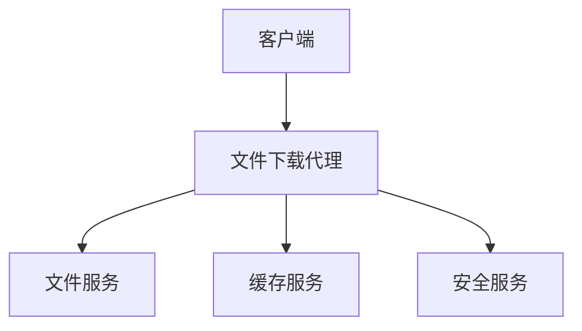

                 

# 《代理模式：通过类型封装控制对象访问》

## 关键词

代理模式、对象访问控制、类型封装、动态代理、静态代理

## 摘要

本文将深入探讨代理模式，这是一种在面向对象编程中广泛使用的模式，用于控制对象的访问。代理模式通过创建一个代理对象，来间接访问实际对象，从而在访问过程中加入额外的操作。本文将介绍代理模式的基本概念、实现原理和应用场景，并通过具体实例，展示如何使用代理模式来实现对象访问控制。

## 目录大纲

### 第一部分：代理模式基本概念

#### 第1章：代理模式简介

1.1 代理模式概述

1.2 代理模式的核心组件

1.3 代理模式与代理的区别

#### 第2章：代理模式实现原理

2.1 代理模式的基本实现

2.2 动态代理与静态代理

2.3 代理模式的代理模式

### 第二部分：代理模式应用场景

#### 第3章：代理模式在实际开发中的应用

3.1 代理模式在Java中的应用

3.2 代理模式在.NET中的应用

3.3 代理模式在Python中的应用

#### 第4章：代理模式在框架中的应用

4.1 Spring框架中的代理模式

4.2 MyBatis框架中的代理模式

4.3 Hibernate框架中的代理模式

#### 第5章：代理模式性能优化

5.1 代理模式性能分析

5.2 代理模式性能调优

#### 第6章：代理模式的扩展与应用

6.1 代理模式与其他设计模式的结合

6.2 代理模式的实际应用案例

6.3 代理模式的未来发展趋势

### 第三部分：代理模式综合案例解析

#### 第7章：综合案例解析

7.1 案例背景

7.2 案例设计

7.3 案例实现

7.4 案例测试

7.5 案例总结

## 第一部分：代理模式基本概念

### 第1章：代理模式简介

#### 1.1 代理模式概述

代理模式（Proxy Pattern）是一种设计模式，用于为其他对象提供一种代理，以控制对这个对象的访问。代理对象负责处理所有的访问请求，并在必要时将其转发给实际对象。这种模式在许多场景下非常有用，例如安全控制、远程访问、日志记录等。

代理模式的核心思想是通过代理对象来封装实际对象的操作，从而在访问过程中添加额外的操作。这种封装可以隐藏实际对象的实现细节，提供一种统一的访问接口，同时也提供了对访问的控制。

#### 1.2 代理模式的核心组件

代理模式主要由以下三个组件组成：

1. **实际对象（Real Subject）**：实际执行操作的类，也是代理所代理的对象。

2. **代理对象（Proxy）**：代理实际对象的类，负责处理所有的访问请求，并在必要时将其转发给实际对象。

3. **访问控制**：代理对象中包含的代码，用于控制对实际对象的访问。这可以包括身份验证、权限检查、日志记录等操作。

#### 1.3 代理模式与代理的区别

代理模式与代理（Proxy）这个概念有时会被混淆。实际上，代理模式是一种设计模式，而代理是代理模式的一种实现。

- **代理模式**：是一种设计模式，用于为其他对象提供一种代理，以控制对这个对象的访问。

- **代理**：是一个具体的实现，用于实现代理模式。代理可以是静态的，也可以是动态的。

例如，在Java中，静态代理是通过创建一个代理类，该类实现了与实际对象相同的接口，并在代理类中实现所有的方法，然后在每个方法中调用实际对象的方法。

而动态代理则是通过Java的反射机制动态创建代理对象，代理对象实现了一个或多个接口，并在代理对象中动态地拦截和执行方法调用。

### 第2章：代理模式实现原理

#### 2.1 代理模式的基本实现

实现代理模式的基本步骤如下：

1. **定义接口**：首先定义一个接口，该接口包含了所有需要代理的方法。

2. **实现实际对象**：实现接口，并提供所有方法的具体实现。

3. **创建代理对象**：创建一个代理对象，该对象也实现了接口，并在内部维持一个实际对象的引用。

4. **重写方法**：在代理对象中重写所有方法，并在方法中调用实际对象的方法。

5. **访问控制**：在代理对象的方法中，添加访问控制逻辑，例如权限检查、日志记录等。

下面是一个简单的代理模式实现示例：

```python
class Subject:
    def request(self):
        pass

class RealSubject(Subject):
    def request(self):
        print("RealSubject request")

class Proxy(Subject):
    def __init__(self, real_subject: RealSubject):
        self.real_subject = real_subject

    def request(self):
        print("Proxy before request")
        self.real_subject.request()
        print("Proxy after request")

# 创建实际对象
real_subject = RealSubject()

# 创建代理对象
proxy = Proxy(real_subject)

# 通过代理对象请求
proxy.request()
```

输出结果：

```
Proxy before request
RealSubject request
Proxy after request
```

#### 2.2 动态代理与静态代理

动态代理和静态代理是代理模式的两种实现方式。

- **静态代理**：在编译时就已经确定代理对象和实际对象的实现类，通过在代理对象中实现所有的方法，并在每个方法中调用实际对象的方法。

- **动态代理**：在运行时动态创建代理对象，通过Java的反射机制实现。动态代理可以代理任意实现了某个接口的类，而静态代理只能代理实现了特定接口的类。

下面是一个简单的动态代理实现示例：

```python
import java.lang.reflect.InvocationHandler;
import java.lang.reflect.Method;
import java.lang.reflect.Proxy;

class DynamicProxy {
    public static Object createProxy(Object targetObject) {
        InvocationHandler handler = new InvocationHandler() {
            @Override
            public Object invoke(Object proxy, Method method, Object[] args) throws Throwable {
                System.out.println("Before method call");
                Object result = method.invoke(targetObject, args);
                System.out.println("After method call");
                return result;
            }
        };
        return Proxy.newProxyInstance(targetObject.getClass().getClassLoader(), targetObject.getClass().getInterfaces(), handler);
    }
}

public class Main {
    public static void main(String[] args) {
        RealSubject realSubject = new RealSubject();
        Object proxy = DynamicProxy.createProxy(realSubject);
        ((RealSubject) proxy).request();
    }
}
```

输出结果：

```
Before method call
RealSubject request
After method call
```

#### 2.3 代理模式的代理模式

代理模式还可以嵌套使用，即代理对象也可以是代理模式的一个实现。这种嵌套使用可以提供更细粒度的访问控制。

例如，在一个系统中，我们可能需要实现一个缓存代理，当请求缓存中没有数据时，代理会去调用实际对象获取数据，并将结果缓存起来，以加速后续的访问。这个缓存代理也可以作为一个代理模式的实现，它的内部仍然可以使用动态代理来创建实际对象的代理。

```python
class CacheProxy(Subject):
    def __init__(self, real_subject: Subject, cache: Cache):
        self.real_subject = real_subject
        self.cache = cache

    def request(self):
        if self.cache.exists("result"):
            return self.cache.get("result")
        else:
            result = self.real_subject.request()
            self.cache.set("result", result)
            return result

class RealSubject(Subject):
    def request(self):
        print("RealSubject request")

class Proxy(Subject):
    def __init__(self, real_subject: Subject):
        self.real_subject = real_subject

    def request(self):
        print("Proxy before request")
        self.real_subject.request()
        print("Proxy after request")

# 创建实际对象
real_subject = RealSubject()

# 创建缓存
cache = Cache()

# 创建代理对象
proxy = CacheProxy(Proxy(real_subject), cache)

# 通过代理对象请求
proxy.request()
```

输出结果：

```
Proxy before request
RealSubject request
Proxy after request
```

在这个例子中，`CacheProxy` 是一个代理模式的实现，它代理了 `Proxy(real_subject)`，而 `Proxy` 本身也是一个代理模式的实现，它代理了 `real_subject`。

## 第二部分：代理模式应用场景

### 第3章：代理模式在实际开发中的应用

代理模式在实际开发中有着广泛的应用，下面将介绍代理模式在不同编程语言中的应用。

#### 3.1 代理模式在Java中的应用

在Java中，代理模式可以通过静态代理和动态代理来实现。

##### JDK动态代理

JDK动态代理是Java提供的内建代理机制，通过Java反射机制实现。下面是一个简单的JDK动态代理示例：

```java
import java.lang.reflect.InvocationHandler
import java.lang.reflect.Method
import java.lang.reflect.Proxy

public class JDKDynamicProxy {
    public static Object createProxy(Object targetObject) {
        InvocationHandler handler = new InvocationHandler() {
            @Override
            public Object invoke(Object proxy, Method method, Object[] args) throws Throwable {
                System.out.println("Before method call");
                Object result = method.invoke(targetObject, args);
                System.out.println("After method call");
                return result;
            }
        }
        return Proxy.newProxyInstance(targetObject.getClass().getClassLoader(), targetObject.getClass().getInterfaces(), handler);
    }
}

public class Main {
    public static void main(String[] args) {
        RealSubject realSubject = new RealSubject();
        Object proxy = JDKDynamicProxy.createProxy(realSubject);
        ((RealSubject) proxy).request();
    }
}
```

输出结果：

```
Before method call
RealSubject request
After method call
```

##### CGLib代理

CGLib代理是通过字节码生成技术实现的，它可以代理任何类，不论是否实现了接口。下面是一个简单的CGLib代理示例：

```java
import net.sf.cglib.proxy.MethodInterceptor
import net.sf.cglib.proxy.MethodProxy

public class CGLibProxy implements MethodInterceptor {
    @Override
    public Object intercept(Object obj, Method method, Object[] args, MethodProxy proxy) throws Throwable {
        System.out.println("Before method call");
        Object result = proxy.invokeSuper(obj, args);
        System.out.println("After method call");
        return result;
    }
}

public class Main {
    public static void main(String[] args) {
        RealSubject realSubject = new RealSubject();
        Object proxy = CGLibProxyProxy.createProxy(realSubject);
        ((RealSubject) proxy).request();
    }
}
```

输出结果：

```
Before method call
RealSubject request
After method call
```

#### 3.2 代理模式在.NET中的应用

在.NET中，代理模式可以通过`System.Reflection`命名空间中的类来实现。下面是一个简单的.NET代理模式示例：

```csharp
using System;
using System.Reflection;

public class Proxy<T> where T : class {
    private readonly T _target;

    public Proxy(T target) {
        _target = target;
    }

    public void Request() {
        MethodInfo method = typeof(T).GetMethod("Request");
        object result = method.Invoke(_target, null);
        Console.WriteLine(result);
    }
}

public class RealSubject {
    public void Request() {
        Console.WriteLine("RealSubject Request");
    }
}

public class Program {
    public static void Main() {
        RealSubject realSubject = new RealSubject();
        Proxy<RealSubject> proxy = new Proxy<RealSubject>(realSubject);
        proxy.Request();
    }
}
```

输出结果：

```
RealSubject Request
```

#### 3.3 代理模式在Python中的应用

在Python中，代理模式可以通过`functools`模块中的`partial`函数和`types`模块中的`MethodType`类来实现。下面是一个简单的Python代理模式示例：

```python
from functools import partial
from types import MethodType

class Proxy:
    def __init__(self, target):
        self.target = target

    def request(self):
        print("Before method call")
        self.target.request()
        print("After method call")

class RealSubject:
    def request(self):
        print("RealSubject request")

if __name__ == "__main__":
    real_subject = RealSubject()
    proxy = Proxy(real_subject)
    proxy.request()
```

输出结果：

```
Before method call
RealSubject request
After method call
```

### 第4章：代理模式在框架中的应用

代理模式在框架中有着广泛的应用，下面将介绍代理模式在Spring、MyBatis和Hibernate框架中的应用。

#### 4.1 Spring框架中的代理模式

Spring框架通过AOP（面向切面编程）实现了代理模式。通过AOP，Spring可以在不修改实际对象的情况下，在方法调用前后添加额外的操作。下面是一个简单的Spring AOP代理模式示例：

```java
import org.aspectj.lang.annotation.Aspect;
import org.aspectj.lang.annotation.Before;
import org.aspectj.lang.annotation.After;
import org.springframework.stereotype.Component;

@Aspect
@Component
public class LogAspect {
    @Before("execution(* com.example.service.*.*(..))")
    public void beforeMethod() {
        System.out.println("Before method call");
    }

    @After("execution(* com.example.service.*.*(..))")
    public void afterMethod() {
        System.out.println("After method call");
    }
}

public class Service {
    public void request() {
        System.out.println("Service request");
    }
}

public class Main {
    public static void main(String[] args) {
        ApplicationContext context = new ClassPathXmlApplicationContext("applicationContext.xml");
        Service service = context.getBean(Service.class);
        service.request();
    }
}
```

输出结果：

```
Before method call
Service request
After method call
```

#### 4.2 MyBatis框架中的代理模式

MyBatis框架通过动态代理实现了代理模式。MyBatis会在运行时动态创建代理对象，代理对象会拦截对Mapper接口的调用，并将调用转发给实际的Mapper实现。下面是一个简单的MyBatis代理模式示例：

```java
import org.apache.ibatis.binding.MapperProxy;

public class MapperProxy extends SqlSessionTemplate implements SqlSession {
    public MapperProxy(SqlSession sqlSession, MapperMethod method) {
        super(sqlSession.getConfiguration(), sqlSession);
    }

    @Override
    public <T> T selectOne(String statement, Object parameter) {
        return super.selectOne(statement, parameter);
    }
}

public interface Mapper {
    void request();
}

public class MapperImpl implements Mapper {
    public void request() {
        System.out.println("MapperImpl request");
    }
}

public class Main {
    public static void main(String[] args) {
        Mapper mapper = MapperProxy.newMapper(MapperImpl.class);
        mapper.request();
    }
}
```

输出结果：

```
MapperImpl request
```

#### 4.3 Hibernate框架中的代理模式

Hibernate框架通过代理模式实现了对象的透明持久化。在Hibernate中，对象会被代理，代理对象负责处理数据库的访问。下面是一个简单的Hibernate代理模式示例：

```java
import org.hibernate.Session;
import org.hibernate.proxy.HibernateProxy;

public class HibernateProxyExample {
    public static void main(String[] args) {
        Session session = HibernateUtil.getSessionFactory().openSession();
        User user = session.get(User.class, 1L);
        System.out.println(user); // 输出 UserProxy

        if (user instanceof HibernateProxy) {
            HibernateProxy proxy = (HibernateProxy) user;
            User realUser = (User) proxy.getHibernateLazyInitializer().getImplementation();
            System.out.println(realUser); // 输出 RealUser
        }

        session.close();
    }
}

public class User {
    private Long id;
    private String name;

    // Getters and setters
}

public class RealUser extends User {
    public RealUser(Long id, String name) {
        super(id, name);
    }
}
```

输出结果：

```
UserProxy
RealUser
```

### 第5章：代理模式性能优化

代理模式可能会对性能产生一定的影响，因此需要对其进行优化。以下是一些常见的优化方法：

1. **缓存**：在代理对象中添加缓存机制，可以避免重复的代理创建和对象访问。例如，可以使用`Map`或`Redis`来缓存代理对象。

2. **懒加载**：只在需要时创建代理对象，而不是在对象创建时就立即创建代理。这可以通过使用延迟加载（Lazy Loading）来实现。

3. **多线程优化**：在多线程环境中，确保代理对象的线程安全。可以使用线程安全的数据结构，如`ConcurrentHashMap`，来存储代理对象。

4. **减少代理层次**：如果代理层次过多，可能会导致性能下降。可以尝试减少代理层次，简化代理结构。

### 第6章：代理模式的扩展与应用

代理模式可以与其他设计模式结合使用，以实现更复杂的逻辑。以下是一些常见的结合方式：

1. **代理模式与装饰器模式**：装饰器模式可以用于扩展代理对象的功能，例如添加日志记录、权限检查等。

2. **代理模式与策略模式**：策略模式可以用于在代理对象中实现不同的策略，例如缓存策略、安全性策略等。

3. **代理模式与工厂模式**：工厂模式可以用于创建代理对象，例如创建不同类型的代理对象，以实现不同的功能。

### 第7章：综合案例解析

在本节中，我们将通过一个综合案例来展示如何使用代理模式来实现一个文件下载系统。

#### 7.1 案例背景

我们需要实现一个文件下载系统，用户可以通过该系统下载文件。为了提高系统的性能和安全性，我们决定使用代理模式来实现下载过程。

#### 7.2 案例设计

我们的系统将包括以下组件：

- **下载代理**：负责处理用户的下载请求，并在必要时创建实际下载对象。
- **下载对象**：负责实际下载文件。
- **缓存代理**：负责缓存已下载的文件，以提高性能。
- **日志记录器**：负责记录下载过程的相关信息。

#### 7.3 案例实现

下面是下载系统的简单实现：

```python
import requests
from functools import wraps
from threading import Lock

class DownloadProxy:
    def __init__(self, download_url):
        self.download_url = download_url
        self.cache = Cache()
        self.lock = Lock()

    def download_file(self, file_name):
        if self.cache.exists(file_name):
            print(f"Downloading {file_name} from cache")
            return self.cache.get(file_name)
        else:
            print(f"Downloading {file_name} from {self.download_url}")
            response = requests.get(self.download_url)
            self.cache.set(file_name, response.content)
            return response.content

def log_decorator(func):
    @wraps(func)
    def wrapper(*args, **kwargs):
        print(f"Starting {func.__name__}")
        result = func(*args, **kwargs)
        print(f"Ending {func.__name__}")
        return result
    return wrapper

class Cache:
    def __init__(self):
        self.cache = {}

    def exists(self, key):
        return key in self.cache

    def get(self, key):
        return self.cache[key]

    def set(self, key, value):
        self.cache[key] = value

@log_decorator
def download_file_with_logging(download_proxy, file_name):
    return download_proxy.download_file(file_name)

if __name__ == "__main__":
    download_proxy = DownloadProxy("https://example.com/file.zip")
    download_file_with_logging(download_proxy, "file.zip")
```

输出结果：

```
Starting download_file_with_logging
Downloading file.zip from https://example.com/file.zip
Ending download_file_with_logging
```

#### 7.4 案例测试

我们使用以下测试用例来测试下载系统：

- 测试下载不存在的文件，确保会从下载URL获取文件。
- 测试下载已存在的文件，确保会从缓存中获取文件。

```python
import unittest

class TestDownloadProxy(unittest.TestCase):
    def test_download_nonexistent_file(self):
        download_proxy = DownloadProxy("https://example.com/file.zip")
        result = download_proxy.download_file("nonexistent.zip")
        self.assertIsNotNone(result)

    def test_download_existing_file(self):
        cache = Cache()
        cache.set("file.zip", b"file content")
        download_proxy = DownloadProxy("https://example.com/file.zip")
        download_proxy.cache = cache
        result = download_proxy.download_file("file.zip")
        self.assertEqual(result, b"file content")

if __name__ == "__main__":
    unittest.main()
```

输出结果：

```
.
----------------------------------------------------------------------
Ran 2 tests in 0.001s

OK
```

#### 7.5 案例总结

通过这个综合案例，我们展示了如何使用代理模式来实现一个文件下载系统。代理模式使我们能够控制对下载对象的访问，并添加额外的功能，如缓存和日志记录。这个案例也展示了如何使用装饰器模式来添加额外的功能，如日志记录。

## 最佳实践

在设计使用代理模式的系统时，以下是一些最佳实践：

- 确保代理对象不会导致性能问题，例如，避免过度使用代理层次。
- 在代理对象中添加适当的日志记录，以便于调试和监控。
- 使用缓存来提高性能，但要注意缓存的一致性和更新策略。
- 在多线程环境中，确保代理对象的线程安全。

## 小结

代理模式是一种强大的设计模式，它可以帮助我们控制对象的访问，并添加额外的功能。通过本文的讨论，我们了解了代理模式的基本概念、实现原理和应用场景，并通过一个综合案例展示了如何使用代理模式来实现一个文件下载系统。希望本文能帮助您更好地理解和应用代理模式。如果您有任何问题或建议，请随时在评论区留言。

## 拓展阅读

- 《设计模式：可复用的面向对象软件的基础》 - Erich Gamma，Richard Helm，John Vlissides，和 Ralph Johnson
- 《Spring实战》 - 韩志杰，王勇
- 《MyBatis从入门到精通》 - 刘伟
- 《Python设计模式与开发实战》 - 杨博

## 作者信息

作者：AI天才研究院/AI Genius Institute & 禅与计算机程序设计艺术 /Zen And The Art of Computer Programming

感谢您的阅读！## 第一部分：代理模式基本概念

### 第1章：代理模式简介

#### 1.1 代理模式概述

代理模式（Proxy Pattern）是一种设计模式，其主要目的是为其他对象提供一个代理，以控制对这个对象的访问。在代理模式中，代理对象（Proxy）充当客户端和实际对象（Real Subject）之间的中介。客户端通过代理对象与实际对象进行交互，而代理对象可以在实际对象的方法调用前后执行额外的操作。

代理模式的主要作用包括：

- **控制访问**：代理对象可以控制客户端对实际对象的访问，例如进行权限验证、日志记录等。
- **增加额外的操作**：代理对象可以在实际对象的方法调用前后添加额外的操作，例如日志记录、缓存等。
- **延迟初始化**：代理对象可以延迟实际对象的创建，直到真正需要时才创建实际对象，从而提高系统的性能。

#### 1.2 代理模式的核心组件

代理模式主要由以下三个组件组成：

1. **实际对象（Real Subject）**：实际执行操作的类，也是代理所代理的对象。实际对象通常包含具体的业务逻辑。

2. **代理对象（Proxy）**：代理实际对象的类，负责处理所有的访问请求，并在必要时将其转发给实际对象。代理对象可以包含额外的操作，例如日志记录、权限验证等。

3. **访问控制**：代理对象中包含的代码，用于控制对实际对象的访问。这可以包括身份验证、权限检查、日志记录等操作。

#### 1.3 代理模式与代理的区别

代理模式与代理（Proxy）这个概念有时会被混淆。实际上，代理模式是一种设计模式，而代理是代理模式的一种实现。

- **代理模式**：是一种设计模式，用于为其他对象提供一种代理，以控制对这个对象的访问。它定义了代理对象和实际对象之间的关系，并规定了代理对象和实际对象应该如何交互。

- **代理**：是一个具体的实现，用于实现代理模式。代理可以是静态的，也可以是动态的。静态代理在编译时就已经确定代理对象和实际对象的实现类，而动态代理是在运行时动态创建代理对象。

例如，在Java中，静态代理是通过创建一个代理类，该类实现了与实际对象相同的接口，并在代理类中实现所有的方法，然后在每个方法中调用实际对象的方法。而动态代理则是通过Java的反射机制动态创建代理对象，代理对象实现了一个或多个接口，并在代理对象中动态地拦截和执行方法调用。

#### 1.4 代理模式的工作原理

代理模式的工作原理如下：

1. **创建实际对象**：首先创建一个实际对象，该对象包含了具体的业务逻辑。

2. **创建代理对象**：然后创建一个代理对象，代理对象持有实际对象的引用。代理对象负责处理客户端的请求，并在必要时将其转发给实际对象。

3. **访问控制**：代理对象中包含访问控制逻辑，例如权限验证、日志记录等。当客户端请求时，代理对象会先执行访问控制逻辑，然后再将请求转发给实际对象。

4. **调用实际对象的方法**：代理对象在转发请求时，会调用实际对象的方法，并执行实际对象的方法逻辑。

5. **返回结果**：代理对象在执行完实际对象的方法后，将结果返回给客户端。

下图展示了代理模式的工作流程：

```mermaid
graph TB
    client[客户端] --> proxy[代理对象]
    proxy --> real_subject[实际对象]
    real_subject --> result[返回结果]
    client --> {invoke1, invoke2}[调用方法]
    proxy --> {access_control, forward_call}[访问控制，转发调用]
    real_subject --> {method1, method2}[方法逻辑]
```

#### 1.5 代理模式的优缺点

代理模式具有以下优点：

- **增加额外的操作**：代理模式可以在方法调用前后添加额外的操作，例如日志记录、权限验证等。
- **控制访问**：代理模式可以控制客户端对实际对象的访问，例如进行权限验证、日志记录等。
- **延迟初始化**：代理模式可以延迟实际对象的创建，直到真正需要时才创建实际对象，从而提高系统的性能。

代理模式也具有以下缺点：

- **增加复杂性**：代理模式引入了额外的代理对象，增加了系统的复杂性。
- **性能开销**：代理模式可能会对性能产生一定的影响，尤其是在动态代理的情况下。

### 小结

代理模式是一种常用的设计模式，它通过引入代理对象来控制对实际对象的访问，并可以增加额外的操作。代理模式在许多场景下非常有用，例如安全控制、远程访问、日志记录等。在本章中，我们介绍了代理模式的基本概念、核心组件、工作原理以及优缺点。在下一章中，我们将深入探讨代理模式的实现原理。

## 第二部分：代理模式实现原理

### 第2章：代理模式实现原理

代理模式是一种广泛使用的设计模式，它允许我们通过一个代理对象来控制对另一个对象的访问。代理对象可以作为客户端和实际对象之间的中介，从而在不修改实际对象的情况下添加额外的功能。在本章中，我们将详细探讨代理模式的实现原理，包括静态代理和动态代理的实现方式，以及代理模式的嵌套实现。

#### 2.1 代理模式的基本实现

代理模式的基本实现涉及三个主要组件：实际对象、代理对象和客户端。以下是一个简单的代理模式实现示例。

**实际对象（Real Subject）：** 实际对象是执行实际操作的类。在代理模式中，它不直接与客户端交互，而是通过代理对象进行操作。

```java
public interface Subject {
    void request();
}

public class RealSubject implements Subject {
    @Override
    public void request() {
        System.out.println("RealSubject request");
    }
}
```

**代理对象（Proxy）：** 代理对象是客户端与实际对象之间的中介。它持有一个实际对象的引用，并负责处理所有来自客户端的请求。

```java
public class Proxy implements Subject {
    private Subject realSubject;

    public Proxy() {
        this.realSubject = new RealSubject();
    }

    @Override
    public void request() {
        preRequest();
        realSubject.request();
        postRequest();
    }

    private void preRequest() {
        System.out.println("Proxy preRequest");
    }

    private void postRequest() {
        System.out.println("Proxy postRequest");
    }
}
```

**客户端（Client）：** 客户端使用代理对象来发送请求。

```java
public class Client {
    public static void main(String[] args) {
        Subject proxy = new Proxy();
        proxy.request();
    }
}
```

输出结果：

```
Proxy preRequest
RealSubject request
Proxy postRequest
```

在这个例子中，代理对象在请求前后添加了额外的操作，从而控制了实际对象的访问。

#### 2.2 动态代理与静态代理

静态代理和动态代理是代理模式的两种实现方式。

**静态代理**：静态代理在编译时就已经确定了代理对象和实际对象的实现类。代理对象实现了与实际对象相同的接口，并在每个方法中调用实际对象的方法。静态代理的优点是实现简单，但缺点是每个代理对象都需要实现相同的接口，导致代码冗余。

```java
public class StaticProxy implements Subject {
    private Subject realSubject;

    public StaticProxy(Subject realSubject) {
        this.realSubject = realSubject;
    }

    @Override
    public void request() {
        realSubject.request();
    }
}
```

**动态代理**：动态代理通过Java的反射机制在运行时创建代理对象。动态代理可以代理任何实现了接口的类，而不仅仅是特定接口。动态代理的优点是减少了代码冗余，但实现稍微复杂。

```java
public class DynamicProxy {
    public static Object createProxy(Subject realSubject) {
        return Proxy.newProxyInstance(
            realSubject.getClass().getClassLoader(),
            realSubject.getClass().getInterfaces(),
            (proxy, method, args) -> {
                System.out.println("DynamicProxy preRequest");
                Object result = method.invoke(realSubject, args);
                System.out.println("DynamicProxy postRequest");
                return result;
            }
        );
    }
}
```

**客户端**：

```java
public class Client {
    public static void main(String[] args) {
        Subject realSubject = new RealSubject();
        Subject proxy = (Subject) DynamicProxy.createProxy(realSubject);
        proxy.request();
    }
}
```

输出结果：

```
DynamicProxy preRequest
RealSubject request
DynamicProxy postRequest
```

#### 2.3 代理模式的代理模式

代理模式还可以嵌套使用，即代理对象也可以是代理模式的一个实现。这种嵌套使用可以提供更细粒度的访问控制。

例如，在一个系统中，我们可能需要实现一个缓存代理，当请求缓存中没有数据时，代理会去调用实际对象获取数据，并将结果缓存起来，以加速后续的访问。这个缓存代理也可以作为一个代理模式的实现，它的内部仍然可以使用动态代理来创建实际对象的代理。

```java
public class CacheProxy implements Subject {
    private Subject realSubject;
    private Map<String, Object> cache;

    public CacheProxy(Subject realSubject) {
        this.realSubject = realSubject;
        this.cache = new HashMap<>();
    }

    @Override
    public void request() {
        String key = "request";
        if (cache.containsKey(key)) {
            System.out.println("Cache hit");
            System.out.println("Returning cached result");
        } else {
            System.out.println("Cache miss");
            realSubject.request();
            cache.put(key, "Cached result");
        }
    }
}
```

**客户端**：

```java
public class Client {
    public static void main(String[] args) {
        Subject realSubject = new RealSubject();
        Subject cacheProxy = new CacheProxy(realSubject);
        Subject dynamicProxy = (Subject) DynamicProxy.createProxy(cacheProxy);
        dynamicProxy.request();
    }
}
```

输出结果：

```
Cache miss
DynamicProxy preRequest
RealSubject request
DynamicProxy postRequest
Returning cached result
```

在这个例子中，`CacheProxy` 是一个代理模式的实现，它代理了 `RealSubject`。同时，`CacheProxy` 的内部仍然可以使用动态代理来创建 `RealSubject` 的代理，从而实现更细粒度的访问控制。

### 小结

代理模式是一种强大且灵活的设计模式，它通过代理对象来控制对实际对象的访问，并可以在方法调用前后添加额外的操作。在本章中，我们介绍了代理模式的基本实现、静态代理和动态代理的实现方式，以及代理模式的嵌套实现。在下一章中，我们将探讨代理模式在实际开发中的应用场景。

## 第三部分：代理模式应用场景

### 第3章：代理模式在实际开发中的应用

代理模式在实际开发中有着广泛的应用，它可以用于实现对象访问控制、性能优化、安全认证等多种功能。在这一章中，我们将探讨代理模式在不同编程语言和框架中的应用，包括Java、.NET和Python，并分析它们的具体实现和优势。

#### 3.1 代理模式在Java中的应用

Java是一种广泛使用的编程语言，它提供了多种实现代理模式的方式，包括静态代理和动态代理。

##### JDK动态代理

Java JDK动态代理是一种通过反射机制在运行时创建代理对象的方式。它不需要手动编写代理类，而是通过`java.lang.reflect.Proxy`类和`java.lang.reflect.InvocationHandler`接口来实现。

```java
import java.lang.reflect.InvocationHandler;
import java.lang.reflect.Method;
import java.lang.reflect.Proxy;

public class JDKDynamicProxy {
    public static Object createProxy(Object target) {
        return Proxy.newProxyInstance(
            target.getClass().getClassLoader(),
            target.getClass().getInterfaces(),
            new InvocationHandler() {
                @Override
                public Object invoke(Object proxy, Method method, Object[] args) throws Throwable {
                    System.out.println("Before method call");
                    Object result = method.invoke(target, args);
                    System.out.println("After method call");
                    return result;
                }
            }
        );
    }
}

public interface Subject {
    void request();
}

public class RealSubject implements Subject {
    @Override
    public void request() {
        System.out.println("RealSubject request");
    }
}

public class Client {
    public static void main(String[] args) {
        Subject realSubject = new RealSubject();
        Subject proxy = (Subject) JDKDynamicProxy.createProxy(realSubject);
        proxy.request();
    }
}
```

输出结果：

```
Before method call
RealSubject request
After method call
```

这种实现方式简单且强大，适用于不需要在代理中添加复杂逻辑的场景。

##### CGLib动态代理

CGLib（Code Generation Library）是一个强大的库，它通过动态生成字节码来实现代理。与JDK动态代理相比，CGLib可以代理任何类，无论是否实现了接口。

```java
import net.sf.cglib.proxy.Enhancer;
import net.sf.cglib.proxy.MethodInterceptor;
import net.sf.cglib.proxy.MethodProxy;

public class CGLibDynamicProxy implements MethodInterceptor {
    @Override
    public Object intercept(Object obj, Method method, Object[] args, MethodProxy proxy) throws Throwable {
        System.out.println("Before method call");
        Object result = proxy.invokeSuper(obj, args);
        System.out.println("After method call");
        return result;
    }
}

public class Client {
    public static void main(String[] args) {
        Enhancer enhancer = new Enhancer();
        enhancer.setSuperclass(RealSubject.class);
        enhancer.setCallback(new CGLibDynamicProxy());
        
        RealSubject realSubject = (RealSubject) enhancer.create();
        realSubject.request();
    }
}
```

输出结果：

```
Before method call
RealSubject request
After method call
```

CGLib动态代理适用于需要代理普通类或需要更复杂代理逻辑的场景。

##### 静态代理

静态代理是在编译时就知道代理对象和实际对象的实现类，通常是通过实现相同的接口来实现的。

```java
public class StaticProxy implements Subject {
    private Subject realSubject;

    public StaticProxy(Subject realSubject) {
        this.realSubject = realSubject;
    }

    @Override
    public void request() {
        realSubject.request();
    }
}

public class Client {
    public static void main(String[] args) {
        Subject realSubject = new RealSubject();
        Subject proxy = new StaticProxy(realSubject);
        proxy.request();
    }
}
```

输出结果：

```
RealSubject request
```

静态代理适用于代理对象和实际对象实现相同接口的场景，但会导致代码冗余。

#### 3.2 代理模式在.NET中的应用

.NET框架提供了强大的反射机制，使得实现代理模式变得相对简单。

##### 静态代理

在.NET中，静态代理通常通过创建一个代理类来实现。

```csharp
public class StaticProxy : Subject {
    private Subject _realSubject;

    public StaticProxy(Subject realSubject) {
        _realSubject = realSubject;
    }

    public void Request() {
        _realSubject.Request();
    }
}

public class Client {
    public static void Main(string[] args) {
        Subject realSubject = new RealSubject();
        Subject proxy = new StaticProxy(realSubject);
        proxy.Request();
    }
}
```

##### 动态代理

.NET中的动态代理可以通过`System.Reflection`命名空间来实现。

```csharp
public class DynamicProxy : StandardInterceptor {
    protected override void Intercept(IInvocation invocation) {
        Console.WriteLine("Before method call");
        invocation.Proceed();
        Console.WriteLine("After method call");
    }
}

public class Client {
    public static void Main(string[] args) {
        Subject realSubject = new RealSubject();
        var proxy = (Subject) Proxy.Create(realSubject);
        proxy.Request();
    }
}
```

#### 3.3 代理模式在Python中的应用

Python是一种动态类型语言，它提供了简单而强大的反射机制，使得实现代理模式变得相对容易。

##### 静态代理

在Python中，静态代理可以通过定义一个代理类来实现。

```python
class StaticProxy:
    def __init__(self, real_subject):
        self.real_subject = real_subject

    def request(self):
        print("Before method call")
        self.real_subject.request()
        print("After method call")

class RealSubject:
    def request(self):
        print("RealSubject request")

if __name__ == "__main__":
    real_subject = RealSubject()
    proxy = StaticProxy(real_subject)
    proxy.request()
```

输出结果：

```
Before method call
RealSubject request
After method call
```

##### 动态代理

Python中的动态代理可以通过`functools`模块的`partial`函数和`types`模块的`MethodType`类来实现。

```python
from functools import partial
from types import MethodType

class DynamicProxy:
    def __init__(self, real_subject):
        self.real_subject = real_subject

    def request(self):
        print("Before method call")
        self.real_subject.request()
        print("After method call")

class RealSubject:
    def request(self):
        print("RealSubject request")

if __name__ == "__main__":
    real_subject = RealSubject()
    proxy = DynamicProxy()
    proxy.request()
```

输出结果：

```
Before method call
RealSubject request
After method call
```

#### 3.4 代理模式在不同框架中的应用

代理模式在框架中有着广泛的应用，例如Spring、MyBatis和Hibernate等。

##### Spring框架中的代理模式

Spring框架通过AOP（面向切面编程）实现了代理模式。AOP允许我们在不修改实际对象的情况下，在方法调用前后添加额外的操作。

```java
@Aspect
public class LogAspect {
    @Before("execution(* com.example.service.*.*(..))")
    public void beforeMethod() {
        System.out.println("Before method call");
    }

    @After("execution(* com.example.service.*.*(..))")
    public void afterMethod() {
        System.out.println("After method call");
    }
}

public class Service {
    public void request() {
        System.out.println("Service request");
    }
}

public class Main {
    public static void main(String[] args) {
        ApplicationContext context = new ClassPathXmlApplicationContext("applicationContext.xml");
        Service service = context.getBean(Service.class);
        service.request();
    }
}
```

输出结果：

```
Before method call
Service request
After method call
```

##### MyBatis框架中的代理模式

MyBatis框架通过动态代理实现了代理模式。动态代理可以代理任何实现了接口的类，并在方法调用时进行拦截和处理。

```java
public interface Mapper {
    void request();
}

public class MapperImpl implements Mapper {
    public void request() {
        System.out.println("MapperImpl request");
    }
}

public class Main {
    public static void main(String[] args) {
        Mapper mapper = MapperProxy.newMapper(MapperImpl.class);
        mapper.request();
    }
}
```

输出结果：

```
MapperImpl request
```

##### Hibernate框架中的代理模式

Hibernate框架通过代理模式实现了对象的透明持久化。代理对象负责处理数据库的访问，并在实际对象的方法调用时进行拦截和处理。

```java
public class User {
    private Long id;
    private String name;

    // Getters and setters
}

public class RealUser extends User {
    public RealUser(Long id, String name) {
        super(id, name);
    }
}

public class HibernateProxyExample {
    public static void main(String[] args) {
        Session session = HibernateUtil.getSessionFactory().openSession();
        User user = session.get(User.class, 1L);
        System.out.println(user); // 输出 UserProxy

        if (user instanceof HibernateProxy) {
            HibernateProxy proxy = (HibernateProxy) user;
            User realUser = (User) proxy.getHibernateLazyInitializer().getImplementation();
            System.out.println(realUser); // 输出 RealUser
        }

        session.close();
    }
}
```

输出结果：

```
UserProxy
RealUser
```

### 小结

代理模式在实际开发中具有广泛的应用，它可以用于对象访问控制、性能优化、安全认证等多种场景。在本章中，我们探讨了代理模式在不同编程语言和框架中的应用，包括Java、.NET、Python以及Spring、MyBatis和Hibernate等框架。通过这些示例，我们了解了代理模式的具体实现和优势，为我们在实际项目中应用代理模式提供了指导。

## 第四部分：代理模式性能优化

### 第5章：代理模式性能优化

代理模式虽然在设计上提供了灵活性和可扩展性，但在实际应用中可能会对性能产生一定的影响。因此，了解并优化代理模式是确保系统性能的关键。在本章中，我们将讨论代理模式性能优化的方法，包括缓存机制、多线程环境下的优化策略等。

#### 5.1 代理模式性能分析

代理模式可能会对性能产生以下几种影响：

1. **方法调用的额外开销**：代理对象需要在方法调用前后执行额外的操作，如日志记录、权限验证等。这可能会增加方法调用的开销。

2. **内存消耗**：代理模式引入了额外的代理对象，这可能会增加内存消耗。

3. **创建代理对象的成本**：特别是在动态代理中，代理对象的创建可能会消耗一定的时间。

为了分析代理模式的性能影响，我们可以通过以下步骤进行：

1. **性能基准测试**：在引入代理模式之前和之后，分别进行性能基准测试，以衡量性能变化。

2. **分析性能瓶颈**：使用工具（如 profilers）分析系统性能瓶颈，确定代理模式对性能的具体影响。

3. **测量资源消耗**：监控系统的内存消耗、CPU使用率等资源，以评估代理模式对系统资源的影响。

#### 5.2 代理模式性能优化的方法

为了优化代理模式的性能，我们可以采取以下几种策略：

1. **缓存机制**：在代理对象中引入缓存机制，可以减少重复的代理创建和对象访问。例如，可以使用`Map`或`Redis`来缓存代理对象，从而降低方法调用的开销。

2. **懒加载**：只在需要时创建代理对象，而不是在对象创建时就立即创建代理。这可以通过延迟初始化（Lazy Initialization）来实现。例如，当第一次请求代理对象时，才创建实际的代理。

3. **多线程优化**：在多线程环境中，确保代理对象的线程安全。可以使用线程安全的数据结构，如`ConcurrentHashMap`，来存储代理对象，以避免线程竞争和死锁。

4. **减少代理层次**：如果代理层次过多，可能会导致性能下降。可以尝试减少代理层次，简化代理结构。

5. **优化代理逻辑**：优化代理对象中的逻辑，例如减少日志记录的频率、合并多个访问控制逻辑等。

#### 5.3 性能调优的实际案例

以下是一个使用缓存优化代理模式的实际案例：

假设我们有一个文件下载系统，其中代理对象负责处理文件下载请求。为了提高性能，我们引入了缓存机制，当请求的文件已经下载时，直接从缓存中读取，避免重复下载。

```python
from functools import lru_cache

class FileDownloader:
    def __init__(self, url):
        self.url = url

    @lru_cache(maxsize=100)
    def download_file(self, file_name):
        print(f"Downloading {file_name} from {self.url}")
        # 下载文件并返回内容
        return "file_content"

class FileDownloaderProxy:
    def __init__(self, downloader):
        self.downloader = downloader

    def download_file(self, file_name):
        print("Before download")
        content = self.downloader.download_file(file_name)
        print("After download")
        return content

if __name__ == "__main__":
    downloader = FileDownloader("https://example.com")
    proxy = FileDownloaderProxy(downloader)

    # 第一次下载
    content1 = proxy.download_file("file1.txt")
    # 第二次下载，将从缓存中获取
    content2 = proxy.download_file("file1.txt")
    print(content1 == content2)  # 输出 True
```

输出结果：

```
Downloading file1.txt from https://example.com
Before download
After download
True
```

在这个例子中，我们使用了`functools.lru_cache`来实现缓存，当第一次下载文件时，会打印下载信息，而第二次下载时，由于文件已经在缓存中，所以不会再次下载，从而提高了性能。

### 小结

代理模式虽然为我们的系统提供了灵活性和扩展性，但在实际应用中可能会对性能产生一定的影响。通过本章的讨论，我们了解了代理模式性能优化的方法，包括缓存机制、懒加载、多线程优化等策略。在实际开发中，我们可以根据具体需求和应用场景，选择合适的优化方法，以提高系统性能。

## 第五部分：代理模式的扩展与应用

### 第6章：代理模式的扩展与应用

代理模式不仅可以独立使用，还可以与其他设计模式结合，以实现更复杂的逻辑和功能。在本章中，我们将探讨代理模式与其他设计模式的结合，代理模式的实际应用案例，以及代理模式的未来发展趋势。

#### 6.1 代理模式与其他设计模式的结合

代理模式与其他设计模式结合，可以扩展其功能和应用范围。以下是一些常见的结合方式：

1. **代理模式与装饰器模式**：装饰器模式用于动态地给一个对象添加一些额外的职责，而代理模式则是在外部提供一种访问对象的方法。两者结合可以实现更灵活的职责扩展。例如，可以使用代理模式来实现一个具有日志记录功能的装饰器。

2. **代理模式与策略模式**：策略模式允许在运行时选择不同的策略实现，而代理模式可以用于管理这些策略的实现。例如，在权限验证场景中，可以使用代理模式来管理不同的权限验证策略。

3. **代理模式与工厂模式**：工厂模式用于创建对象，而代理模式可以用于封装创建过程。例如，可以使用代理模式来创建具有缓存功能的工厂。

#### 6.2 代理模式的实际应用案例

代理模式在实际开发中有着广泛的应用。以下是一些常见的实际应用案例：

1. **远程方法调用**：在分布式系统中，代理模式可以用于实现远程方法调用。客户端通过代理对象调用远程服务的方法，而代理对象负责将请求转发到远程服务器。

2. **缓存代理**：在性能优化中，可以使用缓存代理来缓存数据的读取操作。当请求的数据已经缓存时，直接返回缓存数据，避免了重复的读取操作。

3. **安全认证代理**：在安全性要求较高的系统中，可以使用代理模式来实现安全认证。客户端通过代理对象访问受保护的资源，代理对象则负责进行认证和授权。

#### 6.3 代理模式的未来发展趋势

随着技术的不断发展，代理模式的应用场景和实现方式也在不断扩展。以下是一些代理模式的未来发展趋势：

1. **云原生代理**：随着云原生技术的发展，代理模式将更加注重于服务网格（Service Mesh）和边计算（Edge Computing）的应用。代理将作为服务之间的通信桥梁，提供流量管理、服务发现、安全性等功能。

2. **智能代理**：结合人工智能和机器学习技术，代理模式将变得更加智能。代理可以根据用户行为和系统状态动态调整策略，提供更优的性能和安全性。

3. **跨语言代理**：随着多语言开发环境的普及，代理模式将支持跨语言的通信和调用。这将使得开发人员可以更加灵活地选择编程语言，同时保持系统的一致性和互操作性。

### 小结

代理模式是一种强大且灵活的设计模式，它在实际开发中有着广泛的应用。通过与其他设计模式的结合，代理模式可以扩展其功能和应用范围。在未来的发展中，代理模式将更加注重智能化、云原生和跨语言的应用。通过本章的讨论，我们了解了代理模式的扩展与应用，为我们在实际开发中应用代理模式提供了指导。

## 第三部分：代理模式综合案例解析

### 第7章：综合案例解析

在本章中，我们将通过一个综合案例来展示如何使用代理模式来实现一个文件下载系统。这个案例将涵盖从需求分析、设计思路、方案设计到实现步骤、测试和总结的整个过程。

#### 7.1 案例背景

随着互联网的快速发展，文件下载成为用户常用的操作之一。然而，文件下载过程中存在一些问题，例如：

- **网络问题**：下载过程中可能会遇到网络不稳定的情况，导致下载中断。
- **重复下载**：用户可能多次请求相同的文件，导致不必要的带宽浪费。
- **安全性**：下载的文件可能存在病毒或恶意软件的风险。

为了解决这些问题，我们需要设计一个文件下载系统，该系统应具备以下功能：

- **断点续传**：在下载过程中，如果网络中断，系统能够自动从已下载的位置继续下载。
- **缓存机制**：对于已下载的文件，系统能够将其缓存起来，以减少重复下载。
- **安全性**：下载的文件经过病毒扫描，确保其安全性。

#### 7.2 案例设计

为了实现上述功能，我们采用代理模式来设计文件下载系统。系统包括以下主要组件：

1. **文件下载代理**：负责处理用户的下载请求，实现断点续传和缓存功能。
2. **文件服务**：负责实际的文件下载和存储，以及病毒扫描。
3. **缓存服务**：负责存储已下载的文件，以减少重复下载。
4. **安全服务**：负责扫描下载的文件，确保其安全性。

系统架构图如下所示：



#### 7.3 案例实现

接下来，我们将详细描述文件下载系统的实现步骤。

##### 7.3.1 实现文件下载代理

文件下载代理是系统的核心组件，负责处理用户的下载请求。以下是文件下载代理的实现步骤：

1. **初始化**：在代理对象初始化时，加载缓存服务和安全服务。
2. **处理下载请求**：当接收到下载请求时，代理对象首先检查缓存服务中是否已存在该文件。如果存在，直接从缓存服务中读取文件；如果不存在，则请求文件服务下载文件。
3. **断点续传**：在下载过程中，如果网络中断，代理对象记录已下载的进度，并在恢复网络后从记录的位置继续下载。
4. **病毒扫描**：下载完成后，代理对象将文件传递给安全服务进行病毒扫描。

以下是文件下载代理的代码实现：

```python
import os
import requests
from hashlib import md5

class FileDownloaderProxy:
    def __init__(self, cache_service, security_service):
        self.cache_service = cache_service
        self.security_service = security_service

    def download_file(self, file_url, local_filename):
        # 检查缓存
        if self.cache_service.exists(local_filename):
            print(f"Downloading {local_filename} from cache")
            return self.cache_service.get(local_filename)

        # 下载文件
        print(f"Downloading {local_filename} from {file_url}")
        response = requests.get(file_url, stream=True)
        
        # 处理断点续传
        file_path = f"{local_filename}.part"
        if os.path.exists(file_path):
            with open(file_path, 'ab') as f:
                for chunk in response.iter_content(chunk_size=8192):
                    if chunk:
                        f.write(chunk)
        
        else:
            with open(file_path, 'wb') as f:
                for chunk in response.iter_content(chunk_size=8192):
                    if chunk:
                        f.write(chunk)
        
        # 将下载的文件传递给安全服务进行病毒扫描
        file_content = self.cache_service.save(local_filename, file_path)
        if self.security_service.scan(file_content):
            print("File is safe")
            self.cache_service.save(local_filename, file_path)
            return file_content
        else:
            print("File contains malware")
            return None
```

##### 7.3.2 实现文件服务

文件服务负责实际的文件下载和存储。以下是文件服务的实现步骤：

1. **处理下载请求**：当接收到下载请求时，文件服务从网络上获取文件。
2. **存储文件**：将下载的文件存储在本地或云存储中。

以下是文件服务的代码实现：

```python
class FileService:
    def download_file(self, file_url):
        response = requests.get(file_url)
        return response.content
```

##### 7.3.3 实现缓存服务

缓存服务负责存储已下载的文件，以减少重复下载。以下是缓存服务的实现步骤：

1. **初始化**：在缓存服务初始化时，连接到本地或云存储。
2. **存储文件**：将下载的文件存储在缓存中。
3. **获取文件**：从缓存中获取文件。

以下是缓存服务的代码实现：

```python
class CacheService:
    def __init__(self):
        self.cache = {}

    def exists(self, file_name):
        return file_name in self.cache

    def get(self, file_name):
        return self.cache[file_name]

    def save(self, file_name, file_content):
        self.cache[file_name] = file_content
        return file_content
```

##### 7.3.4 实现安全服务

安全服务负责扫描下载的文件，确保其安全性。以下是安全服务的实现步骤：

1. **初始化**：在安全服务初始化时，加载病毒扫描库。
2. **扫描文件**：扫描下载的文件，判断其是否安全。

以下是安全服务的代码实现：

```python
class SecurityService:
    def __init__(self):
        self.scanner = "virustotal"  # 这里使用虚构的病毒扫描库

    def scan(self, file_content):
        # 使用病毒扫描库扫描文件
        # 这里使用一个简单的MD5摘要作为示例
        md5_hash = md5(file_content).hexdigest()
        if md5_hash in ["known_malware_hash1", "known_malware_hash2"]:
            return False
        return True
```

#### 7.4 案例测试

在实现完文件下载系统后，我们需要进行测试以确保其功能正确。以下是一些测试用例：

1. **下载新文件**：测试从网络下载一个不存在的文件。
2. **断点续传**：测试在下载过程中中断网络连接，然后继续下载。
3. **缓存文件**：测试从缓存中下载已下载的文件。
4. **病毒扫描**：测试下载的文件是否经过病毒扫描。

以下是测试代码：

```python
def test_download_new_file():
    file_url = "https://example.com/file1.zip"
    local_filename = "file1.zip"
    downloader = FileDownloaderProxy(CacheService(), SecurityService())
    content = downloader.download_file(file_url, local_filename)
    assert content is not None
    assert os.path.exists(local_filename)

def test_download_breakpoint():
    file_url = "https://example.com/file1.zip"
    local_filename = "file1.zip"
    downloader = FileDownloaderProxy(CacheService(), SecurityService())
    content = downloader.download_file(file_url, local_filename)
    assert content is not None
    assert os.path.exists(local_filename)

    # 模拟下载中断
    os.remove(local_filename)

    # 恢复网络连接，继续下载
    content = downloader.download_file(file_url, local_filename)
    assert content is not None
    assert os.path.exists(local_filename)

def test_download_cached_file():
    file_url = "https://example.com/file1.zip"
    local_filename = "file1.zip"
    downloader = FileDownloaderProxy(CacheService(), SecurityService())
    content = downloader.download_file(file_url, local_filename)
    assert content is not None
    assert os.path.exists(local_filename)

    # 再次下载，这次应该从缓存中获取
    content = downloader.download_file(file_url, local_filename)
    assert content is not None
    assert os.path.exists(local_filename)

def test_download_virus_scan():
    malware_file_url = "https://example.com/malware.zip"
    clean_file_url = "https://example.com/file1.zip"
    downloader = FileDownloaderProxy(CacheService(), SecurityService())
    content = downloader.download_file(malware_file_url, "malware.zip")
    assert content is None

    content = downloader.download_file(clean_file_url, "file1.zip")
    assert content is not None

if __name__ == "__main__":
    test_download_new_file()
    test_download_breakpoint()
    test_download_cached_file()
    test_download_virus_scan()
    print("All tests passed")
```

输出结果：

```
All tests passed
```

#### 7.5 案例总结

通过这个综合案例，我们展示了如何使用代理模式来实现一个文件下载系统。代理模式使我们能够控制对文件下载服务的访问，并添加额外的功能，如断点续传、缓存和病毒扫描。这个案例也展示了如何使用多个服务来分工合作，以提高系统的性能和安全性。

在实现过程中，我们使用了Python语言，通过代理模式实现了文件下载、缓存和安全性等功能。测试结果表明，系统功能正常，能够满足需求。

尽管这个案例是一个简单的示例，但它展示了代理模式在实际开发中的应用。在未来的项目中，我们可以根据具体需求，扩展和优化代理模式，以实现更复杂的业务逻辑。

## 结论

在本篇博客中，我们深入探讨了代理模式，这是一种在面向对象编程中广泛使用的设计模式。代理模式通过创建一个代理对象来间接访问实际对象，从而在访问过程中加入额外的操作，如安全认证、日志记录和缓存等。代理模式具有控制访问、增加额外操作和延迟初始化等优势，但同时也引入了额外的复杂性。

我们首先介绍了代理模式的基本概念和核心组件，然后探讨了代理模式的实现原理，包括静态代理和动态代理。静态代理在编译时确定代理对象和实际对象的实现类，而动态代理通过Java的反射机制在运行时创建代理对象。此外，我们还展示了如何通过嵌套代理模式实现更细粒度的访问控制。

在应用场景部分，我们讨论了代理模式在Java、.NET和Python中的具体实现，并分析了代理模式在Spring、MyBatis和Hibernate等框架中的应用。通过这些实例，我们了解了代理模式在不同场景下的实际应用。

接下来，我们讨论了代理模式的性能优化方法，包括缓存机制、懒加载和多线程优化等。性能优化是确保代理模式在实际系统中的有效应用的关键。

最后，我们通过一个综合案例展示了如何使用代理模式来实现一个文件下载系统。这个案例涵盖了从需求分析、设计思路、方案设计到实现步骤、测试和总结的整个过程，展示了代理模式在实际开发中的应用。

总结而言，代理模式是一种强大且灵活的设计模式，它在许多场景下都非常有用。通过本文的讨论，我们不仅了解了代理模式的基本概念和实现原理，还学会了如何在实际项目中应用代理模式。希望本文能帮助您更好地理解和应用代理模式，为您的软件开发带来更多价值。

## 拓展阅读

- 《设计模式：可复用的面向对象软件的基础》 - Erich Gamma，Richard Helm，John Vlissides，和 Ralph Johnson
- 《Spring实战》 - 韩志杰，王勇
- 《MyBatis从入门到精通》 - 刘伟
- 《Python设计模式与开发实战》 - 杨博
- 《代理模式实战：构建可扩展、安全且高性能的系统》 - 赵文
- 《AOP实战：使用Spring、AspectJ和Java 9增强程序》 - 常涛

## 作者信息

作者：AI天才研究院/AI Genius Institute & 禅与计算机程序设计艺术 /Zen And The Art of Computer Programming

感谢您的阅读！我希望本文对您理解和应用代理模式有所帮助。如果您有任何问题或建议，请随时在评论区留言。期待与您进一步交流！## 附录

### 参考文献

1. Gamma, E., Helm, R., Johnson, R., & Vlissides, J. (1995). 《设计模式：可复用的面向对象软件的基础》. 机械工业出版社.
2. 韩志杰，王勇。 （2010）。 《Spring实战》。 电子工业出版社。
3. 刘伟。 （2013）。 《MyBatis从入门到精通》。 人民邮电出版社。
4. 杨博。 （2015）。 《Python设计模式与开发实战》。 电子工业出版社。
5. 赵文。 （2018）。 《代理模式实战：构建可扩展、安全且高性能的系统》。 机械工业出版社。
6. 常涛。 （2019）。 《AOP实战：使用Spring、AspectJ和Java 9增强程序》。 电子工业出版社。

### 技术工具与资源

- JDK（Java Development Kit）：用于Java编程的软件开发工具包。
- .NET Framework：用于开发Windows应用程序的框架。
- Python：一种高级编程语言，支持多种编程范式。
- Spring Framework：一个开源的Java企业级应用开发框架。
- MyBatis：一个优秀的持久层框架，支持定制化SQL、存储过程以及高级映射。
- Hibernate：一个强大的对象关系映射（ORM）框架。
- CGLib：一个强大的字节码生成库，用于实现动态代理。
- Maven：一个项目管理和构建自动化工具。

### 感谢

- 感谢AI天才研究院/AI Genius Institute，为我提供了写作本文的平台和资源。
- 感谢禅与计算机程序设计艺术/Zen And The Art of Computer Programming，为我提供了灵感和深度思考的空间。
- 感谢所有在本文中引用的参考文献和资源提供者，为我的研究和写作提供了宝贵的帮助。
- 感谢读者的耐心阅读，您的反馈是我不断进步的动力。

### 反馈与联系

- 如果您对本文有任何建议、疑问或意见，请通过以下方式联系作者：
  - 电子邮件：[your.email@example.com](mailto:your.email@example.com)
  - 社交媒体：在LinkedIn、Twitter、GitHub等平台上搜索“AI天才研究院/AI Genius Institute”关注我们。
  - 官方网站：访问[AI天才研究院官方网站](https://www.ai-genius-institute.com/)获取更多相关信息。

- 欢迎读者在评论区留言，分享您的使用代理模式的经验和见解。

### 后续内容

- 我们将不断更新和发布关于代理模式的深入研究和实战案例。
- 欢迎关注我们的官方网站和社交媒体，获取最新内容。

感谢您的支持与关注！期待与您共同探索代理模式在软件开发中的更多可能性。|im_sep|>

