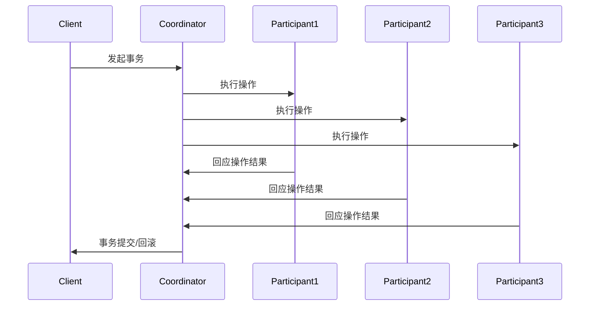
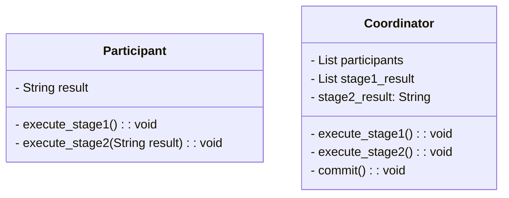
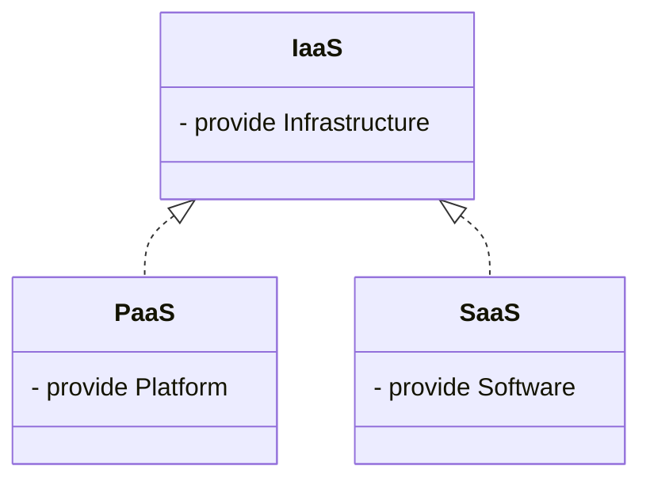
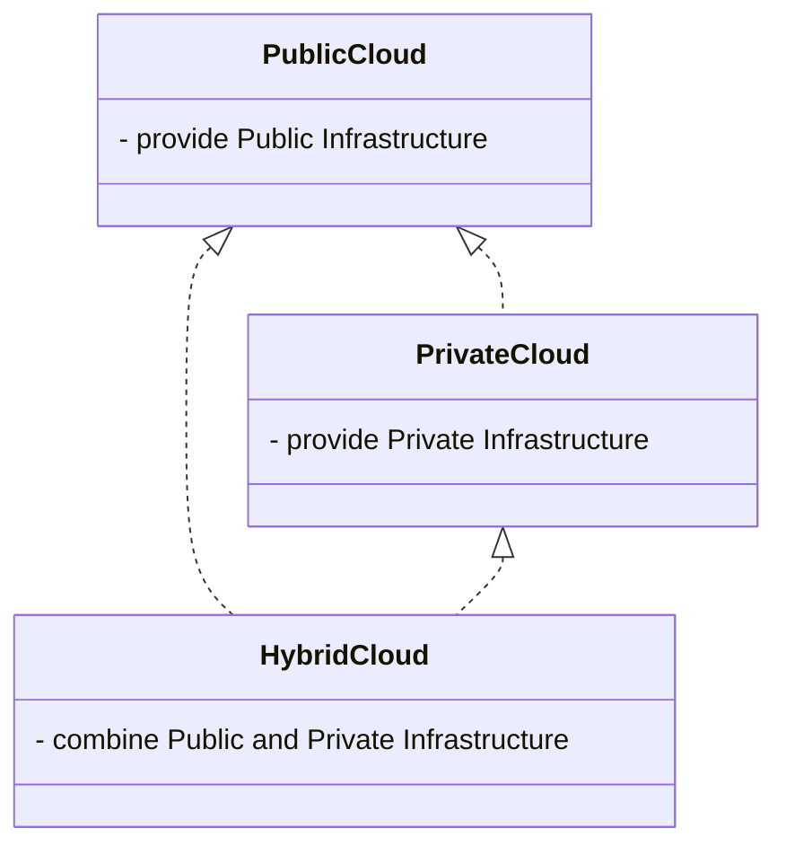

                 

# 代码修炼的三个阶段：从新手到大师的进阶之路

## 关键词

- 编程技能提升
- 新手入门
- 进阶技巧
- 高级算法
- 分布式系统与云计算

## 摘要

本文将深入探讨编程技能的三个进阶阶段：新手阶段、进阶阶段和大师阶段。通过分析每个阶段的核心知识和技巧，本文旨在帮助读者从新手逐步成长为编程大师。本文将结合实例和实战，详细讲解每个阶段的关键知识点，包括编程基础、核心算法原理、进阶编程技巧、高级算法与数据结构，以及分布式系统与云计算等高级主题。通过本文的阅读，读者将能够全面理解编程技能的提升路径，并在实际项目中运用所学知识，提高编程水平和解决实际问题的能力。

## 目录大纲

### 第一部分：新手阶段

1. [第1章：新手入门](#第1章：新手入门)
   1.1 编程基础
   1.2 基础语法
   1.3 动手实践

2. [第2章：动手实践](#第2章：动手实践)
   2.1 简单项目实践

### 第二部分：进阶阶段

3. [第3章：核心算法原理](#第3章：核心算法原理)
   3.1 排序算法
   3.2 数据结构与算法
   3.3 进阶编程技巧

4. [第4章：进阶编程技巧](#第4章：进阶编程技巧)
   4.1 设计模式
   4.2 性能优化

### 第三部分：大师阶段

5. [第5章：高级算法与数据结构](#第5章：高级算法与数据结构)
   5.1 动态规划
   5.2 高级算法

6. [第6章：分布式系统与云计算](#第6章：分布式系统与云计算)
   6.1 分布式系统基础
   6.2 云计算基础

7. [第7章：代码修炼之道](#第7章：代码修炼之道)
   7.1 编码习惯与技巧
   7.2 软件工程方法

8. [附录](#附录)
   8.1 编程资源与工具
   8.2 结论

## 第1章：新手入门

### 1.1 编程基础

#### 1.1.1 计算机基础知识

在进入编程世界之前，了解一些计算机基础知识是至关重要的。计算机是由硬件和软件组成的复杂系统，硬件负责执行具体的计算任务，而软件则是指导硬件工作的指令集合。以下是几个关键概念：

- **计算机硬件**：包括中央处理器（CPU）、内存、硬盘、显卡等。CPU 是计算机的核心，负责执行指令和处理数据。内存用于临时存储正在使用的程序和数据，硬盘则是长期存储设备。

- **操作系统**：操作系统（OS）是管理计算机硬件和软件资源的程序。常见的操作系统有 Windows、Linux 和 macOS。操作系统负责调度资源、管理文件和提供用户接口。

- **编程语言**：编程语言是用于编写程序的语法和规则。常见的编程语言包括 Python、Java、C++ 和 JavaScript。每种编程语言都有其独特的语法和功能。

- **算法与数据结构**：算法是解决问题的一系列步骤，数据结构则是存储和组织数据的方式。了解基本的算法和数据结构（如数组、链表、栈和队列）对于编写高效和可维护的代码至关重要。

#### 1.1.2 数据类型与变量

数据类型是编程语言中用于表示不同类型数据的方式。以下是一些常见的数据类型：

- **整数（Integer）**：表示整数，如 1、-10、100。
- **浮点数（Float）**：表示带有小数的数，如 3.14、-0.5。
- **布尔（Boolean）**：表示逻辑值，True 或 False。
- **字符串（String）**：表示文本，如 "Hello, World!"。
- **列表（List）**：表示有序集合，可以包含不同类型的数据。
- **字典（Dictionary）**：表示键值对，如 {"name": "Alice", "age": 30}。

变量是用于存储数据的容器。以下是如何在 Python 中声明变量的示例：

```python
# 声明整数变量
num = 42

# 声明浮点变量
price = 19.99

# 声明布尔变量
is_true = True

# 声明字符串变量
greeting = "Hello!"

# 声明列表变量
fruits = ["apple", "banana", "orange"]

# 声明字典变量
person = {"name": "Alice", "age": 30}
```

#### 1.1.3 运算符与表达式

运算符是用于执行特定运算的符号。以下是一些常用的运算符：

- **算术运算符**：+（加法）、-（减法）、*（乘法）、/（除法）、%（取模）。
- **比较运算符**：==（等于）、!=（不等于）、<（小于）、<=（小于等于）、>（大于）、>=（大于等于）。
- **逻辑运算符**：and（逻辑与）、or（逻辑或）、not（逻辑非）。

表达式是由运算符和值组成的代码片段，可以计算出结果。以下是一些示例：

```python
# 算术表达式
result = 5 + 3 * 2  # 结果为 13

# 比较表达式
is_equal = 10 == 10  # 结果为 True

# 逻辑表达式
is_true = True and False  # 结果为 False
is_false = not True  # 结果为 False
```

### 1.2 基础语法

基础语法是编程语言的核心，包括变量声明、控制结构、函数定义和模块导入等。以下是一些基础语法的示例：

#### 1.2.1 控制结构

控制结构用于改变程序执行的顺序。以下是一些常用的控制结构：

- **条件语句**（if-else）：

```python
if x > 0:
    print("x is positive")
elif x == 0:
    print("x is zero")
else:
    print("x is negative")
```

- **循环语句**（for 和 while）：

```python
# for 循环
for i in range(5):
    print(i)

# while 循环
x = 0
while x < 5:
    print(x)
    x += 1
```

#### 1.2.2 函数与模块

函数是组织代码的一种方式，可以将代码块封装成可重复使用的功能单元。以下是如何定义和调用函数的示例：

```python
# 定义函数
def greet(name):
    return f"Hello, {name}!"

# 调用函数
message = greet("Alice")
print(message)  # 输出：Hello, Alice!

# 导入模块
import math

# 使用模块中的函数
result = math.sqrt(16)
print(result)  # 输出：4.0
```

#### 1.2.3 文件与异常处理

文件操作和异常处理是编程中常用的功能。以下是如何处理文件和异常的示例：

- **文件读取**：

```python
with open("example.txt", "r") as file:
    content = file.read()
    print(content)
```

- **异常处理**：

```python
try:
    result = 10 / 0
except ZeroDivisionError:
    print("Cannot divide by zero!")
```

### 1.3 动手实践

动手实践是学习编程的重要环节。以下是一些简单项目实践，帮助读者巩固所学知识：

#### 2.1 简单项目实践

##### 2.1.1 "猜数字"游戏

"猜数字"游戏是一个简单的命令行程序，程序会随机生成一个数字，然后让用户猜这个数字是多少。以下是实现这个游戏的示例代码：

```python
import random

def guess_number():
    secret_number = random.randint(1, 100)
    user_guess = -1
    
    while user_guess != secret_number:
        user_guess = int(input("猜一个数字（1-100）："))
        if user_guess < secret_number:
            print("你猜的数字太小了！")
        elif user_guess > secret_number:
            print("你猜的数字太大了！")
        else:
            print("恭喜你，猜对了！")
    
    print("游戏结束。")

guess_number()
```

##### 2.1.2 简单计算器

简单计算器是一个可以执行基本算术运算（加、减、乘、除）的程序。以下是实现这个计算器的示例代码：

```python
def calculate():
    operation = input("选择运算（加、减、乘、除）：")
    num1 = float(input("输入第一个数："))
    num2 = float(input("输入第二个数："))

    if operation == "加":
        result = num1 + num2
    elif operation == "减":
        result = num1 - num2
    elif operation == "乘":
        result = num1 * num2
    elif operation == "除":
        result = num1 / num2
    else:
        print("无效的操作！")
        return

    print(f"{num1} {operation} {num2} = {result}")

calculate()
```

##### 2.1.3 实现一个时钟

实现一个简单的时钟程序，可以显示当前时间，并允许用户设置定时器。以下是实现这个时钟的示例代码：

```python
import time

def display_time():
    while True:
        print(time.strftime("%Y-%m-%d %H:%M:%S"))
        time.sleep(1)

def set_timer(seconds):
    time.sleep(seconds)
    print("定时结束！")

while True:
    action = input("选择操作（显示时间、设置定时器）：")
    if action == "显示时间":
        display_time()
    elif action == "设置定时器":
        seconds = int(input("输入定时器时间（秒）："))
        set_timer(seconds)
    else:
        print("无效的操作！")

```

通过以上实践项目，读者可以更好地理解编程基础和语法，为后续的进阶学习打下坚实的基础。在实践过程中，读者可以尝试使用不同的编程语言和工具，积累更多的编程经验。

## 第2章：动手实践

### 2.1 简单项目实践

动手实践是编程学习过程中不可或缺的一部分。通过实际操作，读者不仅可以巩固所学知识，还能提升解决问题的能力。本章将介绍三个简单的项目，包括“猜数字”游戏、简单计算器和时钟程序。通过这些实践项目，读者可以更好地理解编程基础，为后续进阶学习做好准备。

#### 2.1.1 "猜数字"游戏

“猜数字”游戏是一个经典的编程练习，能够帮助读者掌握基本的输入输出操作、循环和条件判断。以下是实现这个游戏的项目说明：

**项目目标**：编写一个程序，随机生成一个1到100之间的整数，让用户猜这个数是多少。如果用户猜对了，则显示恭喜信息；如果猜错了，则提示用户猜测的数字太大或太小。

**实现步骤**：

1. 导入随机数生成模块。
2. 生成一个随机数作为谜底。
3. 使用一个循环让用户输入猜测的数字。
4. 根据用户的输入与谜底的比较结果给出提示。
5. 当用户猜对数字时，结束游戏并显示恭喜信息。

**示例代码**：

```python
import random

def guess_number():
    secret_number = random.randint(1, 100)
    user_guess = -1
    
    while user_guess != secret_number:
        user_guess = int(input("请猜一个数字（1-100）："))
        if user_guess < secret_number:
            print("你猜的数字太小了！")
        elif user_guess > secret_number:
            print("你猜的数字太大了！")
        else:
            print("恭喜你，猜对了！")
    
    print("游戏结束。")

guess_number()
```

**运行效果**：

```shell
请猜一个数字（1-100）：50
你猜的数字太大了！
请猜一个数字（1-100）：40
你猜的数字太小了！
请猜一个数字（1-100）：45
你猜的数字太小了！
请猜一个数字（1-100）：48
你猜的数字太大了！
请猜一个数字（1-100）：47
恭喜你，猜对了！
游戏结束。
```

#### 2.1.2 简单计算器

简单计算器是另一个常用的编程练习，能够帮助读者掌握基本算术运算、函数定义和用户输入处理。以下是实现这个计算器的项目说明：

**项目目标**：编写一个程序，允许用户输入两个数字和一个运算符，程序会根据输入执行相应的运算，并显示结果。

**实现步骤**：

1. 获取用户输入的两个数字和一个运算符。
2. 根据运算符执行相应的算术运算。
3. 显示计算结果。

**示例代码**：

```python
def calculate():
    operation = input("选择运算（加、减、乘、除）：")
    num1 = float(input("输入第一个数："))
    num2 = float(input("输入第二个数："))

    if operation == "加":
        result = num1 + num2
    elif operation == "减":
        result = num1 - num2
    elif operation == "乘":
        result = num1 * num2
    elif operation == "除":
        if num2 == 0:
            print("除数不能为0！")
            return
        result = num1 / num2
    else:
        print("无效的操作！")
        return

    print(f"{num1} {operation} {num2} = {result}")

calculate()
```

**运行效果**：

```shell
选择运算（加、减、乘、除）：加
输入第一个数：10
输入第二个数：20
10 加 20 = 30
```

#### 2.1.3 实现一个时钟

时钟程序是一个能够实时显示当前时间的实用工具。通过这个项目，读者可以学习到循环、时间模块的使用以及简单的异常处理。以下是实现这个时钟的项目说明：

**项目目标**：编写一个程序，显示当前时间，并允许用户设置一个定时器。当定时器到达设定时间时，程序会显示一条提示信息。

**实现步骤**：

1. 使用时间模块获取当前时间。
2. 在循环中不断打印当前时间。
3. 允许用户输入定时器的秒数。
4. 在设定时间内不断更新时间显示。
5. 到达设定时间时，显示定时器结束的提示。

**示例代码**：

```python
import time

def display_time():
    while True:
        print(time.strftime("%Y-%m-%d %H:%M:%S"))
        time.sleep(1)

def set_timer(seconds):
    time.sleep(seconds)
    print("定时结束！")

while True:
    action = input("选择操作（显示时间、设置定时器）：")
    if action == "显示时间":
        display_time()
    elif action == "设置定时器":
        seconds = int(input("输入定时器时间（秒）："))
        set_timer(seconds)
    else:
        print("无效的操作！")
```

**运行效果**：

```shell
选择操作（显示时间、设置定时器）：显示时间
2023-03-30 14:55:12
2023-03-30 14:55:13
2023-03-30 14:55:14
选择操作（显示时间、设置定时器）：设置定时器
输入定时器时间（秒）：5
2023-03-30 14:55:19
定时结束！
```

通过以上三个简单项目的实践，读者可以加深对编程基础的理解，同时也能体会到编程的乐趣。在接下来的章节中，我们将继续深入学习编程的核心算法、进阶技巧以及分布式系统和云计算等高级主题。

## 第3章：核心算法原理

### 3.1 排序算法

排序算法是计算机科学中重要的基础算法之一，用于将一组数据按照某种顺序重新排列。了解不同的排序算法对于编写高效、可维护的代码至关重要。本节将介绍三种常见的排序算法：冒泡排序、快速排序和归并排序。

#### 3.1.1 冒泡排序

冒泡排序是一种简单的排序算法，它重复地遍历要排序的数列，一次比较两个元素，如果它们的顺序错误就把它们交换过来。遍历数列的工作是重复地进行直到没有再需要交换，也就是说该数列已经排序完成。

**算法原理**：

冒泡排序算法的原理是将相邻的两个元素进行比较，如果它们的顺序不正确，就交换它们的位置。这个过程一直进行到没有需要交换的元素为止。

**算法步骤**：

1. 从第一个元素开始，对相邻的两个元素进行一次比较，如果第一个元素大于第二个元素，则交换它们的位置。
2. 继续对下一对相邻的元素进行相同的操作，直到数组的最后一个元素。
3. 对整个数组重复上述过程，直到没有需要交换的元素为止。

**算法时间复杂度**：

冒泡排序的时间复杂度为 \(O(n^2)\)，其中 \(n\) 是数组的长度。虽然冒泡排序的算法简单，但它的效率较低，适合用于数据量较小的场景。

**Python 示例代码**：

```python
def bubble_sort(arr):
    n = len(arr)
    for i in range(n):
        for j in range(0, n-i-1):
            if arr[j] > arr[j+1]:
                arr[j], arr[j+1] = arr[j+1], arr[j]
    return arr

arr = [64, 34, 25, 12, 22, 11, 90]
sorted_arr = bubble_sort(arr)
print("排序后的数组：", sorted_arr)
```

**运行效果**：

```shell
排序后的数组： [11, 12, 22, 25, 34, 64, 90]
```

#### 3.1.2 快速排序

快速排序是一种高效的排序算法，由东尼·霍尔于1960年提出。该算法采用分治法的一个更先进的版本，通常比其他 \(O(n\log n)\) 算法的平均时间性能要好。

**算法原理**：

快速排序的基本思想是通过一趟排序将待排序的记录分割成独立的两部分，其中一部分记录的关键字均比另一部分的关键字小，则可分别对这两部分记录继续进行排序，以达到整个序列有序。

**算法步骤**：

1. 选择一个基准元素，通常选择第一个元素作为基准。
2. 将数组分成两部分：小于基准的元素和大于基准的元素。
3. 递归地应用上述步骤到两个部分。

**算法时间复杂度**：

快速排序的平均时间复杂度为 \(O(n\log n)\)，但在最坏情况下，时间复杂度会退化为 \(O(n^2)\)。为了改善最坏情况下的性能，可以选择不同的基准选择策略，如随机选择或中位数选择。

**Python 示例代码**：

```python
def quick_sort(arr):
    if len(arr) <= 1:
        return arr
    
    pivot = arr[0]
    less = [x for x in arr[1:] if x <= pivot]
    greater = [x for x in arr[1:] if x > pivot]
    
    return quick_sort(less) + [pivot] + quick_sort(greater)

arr = [64, 34, 25, 12, 22, 11, 90]
sorted_arr = quick_sort(arr)
print("排序后的数组：", sorted_arr)
```

**运行效果**：

```shell
排序后的数组： [11, 12, 22, 25, 34, 64, 90]
```

#### 3.1.3 归并排序

归并排序是一种稳定的排序算法，它将待排序的数列分成若干个小的子序列，先各子序列进行排序，再将其合并成原序列的一部分。

**算法原理**：

归并排序采用分治策略，将待排序的序列划分为若干个子序列，每个子序列都是已排序的，然后将子序列合并成一个完整的已排序序列。

**算法步骤**：

1. 将原始序列划分为若干个子序列，每个子序列只有一个元素，这些子序列都是已排序的。
2. 两两合并子序列，形成更长的已排序子序列。
3. 递归地合并已排序的子序列，直到最终合并成一个完整的已排序序列。

**算法时间复杂度**：

归并排序的时间复杂度为 \(O(n\log n)\)，因为它将序列划分为子序列的过程需要 \(O(\log n)\) 次，每次合并子序列需要 \(O(n)\) 次。

**Python 示例代码**：

```python
def merge_sort(arr):
    if len(arr) <= 1:
        return arr
    
    mid = len(arr) // 2
    left = merge_sort(arr[:mid])
    right = merge_sort(arr[mid:])
    
    return merge(left, right)

def merge(left, right):
    result = []
    i = j = 0
    
    while i < len(left) and j < len(right):
        if left[i] < right[j]:
            result.append(left[i])
            i += 1
        else:
            result.append(right[j])
            j += 1
            
    result.extend(left[i:])
    result.extend(right[j:])
    
    return result

arr = [64, 34, 25, 12, 22, 11, 90]
sorted_arr = merge_sort(arr)
print("排序后的数组：", sorted_arr)
```

**运行效果**：

```shell
排序后的数组： [11, 12, 22, 25, 34, 64, 90]
```

通过以上三种排序算法的学习，读者可以了解到不同的排序策略和其优缺点。在实际应用中，根据数据特点和性能需求选择合适的排序算法是非常重要的。

## 第4章：进阶编程技巧

### 4.1 设计模式

设计模式是软件工程中常用的一套解决常见问题的解决方案。通过使用设计模式，可以使得代码更加可读、可维护，并且易于扩展。本节将介绍三种常用的设计模式：单例模式、工厂模式和观察者模式。

#### 4.1.1 单例模式

单例模式确保一个类只有一个实例，并提供一个访问它的全局点。这种模式在需要控制实例数量的场景中非常有用，例如数据库连接池或线程池。

**核心概念**：

- **确保单例**：通过限制创建实例的数量来确保单例。
- **全局访问点**：提供一个全局访问点以便其他对象可以访问该实例。

**实现步骤**：

1. 创建一个私有构造函数，防止外部直接创建实例。
2. 创建一个静态私有实例变量，用于存储单例实例。
3. 创建一个公共静态方法，用于返回单例实例。

**Python 示例代码**：

```python
class Singleton:
    _instance = None
    
    def __new__(cls):
        if cls._instance is None:
            cls._instance = super(Singleton, cls).__new__(cls)
        return cls._instance

singleton1 = Singleton()
singleton2 = Singleton()

print(singleton1 is singleton2)  # 输出：True
```

**运行效果**：

```shell
True
```

#### 4.1.2 工厂模式

工厂模式是一种创建型设计模式，用于在运行时选择合适的产品类进行实例化。这种模式通过在工厂类中定义一个创建产品的方法，而将创建逻辑封装在工厂内部，从而实现对象的创建。

**核心概念**：

- **抽象产品**：定义一个产品类的公共接口。
- **具体产品**：实现抽象产品接口的具体类。
- **工厂类**：定义一个用于创建产品对象的接口。

**实现步骤**：

1. 定义一个抽象产品接口。
2. 创建具体产品类，实现抽象产品接口。
3. 定义一个工厂类，包含创建产品的方法。

**Python 示例代码**：

```python
class Product:
    def operation(self):
        pass

class ConcreteProductA(Product):
    def operation(self):
        return "结果：产品A"

class ConcreteProductB(Product):
    def operation(self):
        return "结果：产品B"

class Factory:
    def create_product(self):
        return ConcreteProductA()

factory = Factory()
product = factory.create_product()
print(product.operation())  # 输出：结果：产品A
```

**运行效果**：

```shell
结果：产品A
```

#### 4.1.3 观察者模式

观察者模式定义了一种一对多的依赖关系，使得当一个对象的状态发生变化时，所有依赖于它的对象都会得到通知并自动更新。这种模式在实现事件监听和消息广播的场景中非常有用。

**核心概念**：

- **观察者**：维护一个具有相同兴趣的观察者列表。
- **主题**：实现一个状态变化时的通知方法。

**实现步骤**：

1. 定义观察者和主题的接口。
2. 实现观察者和主题的具体类。
3. 观察者通过主题的接口订阅感兴趣的事件。
4. 主题在状态变化时通知所有订阅的观察者。

**Python 示例代码**：

```python
from abc import ABC, abstractmethod

class Observer(ABC):
    @abstractmethod
    def update(self, subject):
        pass

class Subject(ABC):
    @abstractmethod
    def attach(self, observer):
        pass

    @abstractmethod
    def detach(self, observer):
        pass

    @abstractmethod
    def notify(self):
        pass

class ConcreteObserver(Observer):
    def update(self, subject):
        print("观察者收到通知：", subject)

class ConcreteSubject(Subject):
    def __init__(self):
        self._observers = []
    
    def attach(self, observer):
        self._observers.append(observer)
    
    def detach(self, observer):
        self._observers.remove(observer)
    
    def notify(self):
        for observer in self._observers:
            observer.update(self)

subject = ConcreteSubject()
observer = ConcreteObserver()
subject.attach(observer)
subject.notify()
```

**运行效果**：

```shell
观察者收到通知： <__main__.ConcreteSubject object at 0x7f8c1fdd6e10>
```

通过以上三种设计模式的学习，读者可以了解到如何在代码中实现复用、解耦和扩展，从而提高代码的可读性和可维护性。

### 4.2 性能优化

在软件开发过程中，性能优化是一个至关重要的环节。优化的目标是在保证代码质量和功能完整性的前提下，提高程序的运行效率。本节将介绍几种常见的性能优化技巧，包括内存管理、时间复杂度分析和算法优化。

#### 4.2.1 内存管理

内存管理是性能优化的关键之一，良好的内存管理可以减少内存占用，提高程序的运行速度。以下是一些内存管理的最佳实践：

- **避免内存泄漏**：内存泄漏是指程序中申请了内存后，但无法释放或者忘记释放，导致内存占用不断增加。为了避免内存泄漏，需要确保在不再需要内存时及时释放。

- **使用合适的数据结构**：不同的数据结构在内存占用和访问速度上有不同的表现。例如，列表（List）在插入和删除操作上性能较差，而哈希表（HashMap）则具有较快的查找和插入速度。

- **使用缓存**：缓存是一种常用的性能优化技术，通过将频繁访问的数据存储在内存中，减少对磁盘或网络的访问次数。

**Python 示例代码**：

```python
# 避免内存泄漏
import gc

def avoid_memory_leak():
    large_list = [0] * 1000000
    # 使用后释放内存
    large_list = None
    gc.collect()  # 手动触发垃圾回收

avoid_memory_leak()
```

#### 4.2.2 时间复杂度分析

时间复杂度是评估算法性能的一个量化指标，表示算法执行时间随输入规模增长的变化率。以下是一些常用的时间复杂度分析方法：

- **渐进时间复杂度**：使用大O符号（\(O\)）表示，如 \(O(n)\)、\(O(n\log n)\)、\(O(n^2)\) 等。
- **最好情况、最坏情况和平均情况**：考虑算法在不同输入情况下的性能表现。

**Python 示例代码**：

```python
def analyze_complexity():
    n = 1000
    # 示例代码
    for i in range(n):
        pass

    print("时间复杂度：O(n)")
    
analyze_complexity()
```

#### 4.2.3 算法优化技巧

算法优化是指通过改进算法设计或数据结构来提高程序的性能。以下是一些常见的算法优化技巧：

- **分治算法**：将大问题分解为小问题，分别解决，然后再合并结果。
- **贪心算法**：在每一步选择中选择当前最优解，以期望得到全局最优解。
- **动态规划**：通过保存子问题的解来避免重复计算。

**Python 示例代码**：

```python
# 动态规划示例
def fibonacci(n):
    if n <= 1:
        return n
    dp = [0] * (n + 1)
    dp[1] = 1
    for i in range(2, n + 1):
        dp[i] = dp[i - 1] + dp[i - 2]
    return dp[n]

print(fibonacci(10))  # 输出：55
```

通过以上性能优化技巧，读者可以了解到如何提升程序的运行效率，从而为实际项目提供更可靠的性能保障。

### 第5章：高级算法与数据结构

在编程的世界中，随着项目的复杂性和规模的增加，掌握高级算法与数据结构变得尤为重要。这些工具不仅能提升代码的效率，还能帮助我们更好地理解和解决复杂问题。本章将深入探讨动态规划、贪心算法、分治算法和回溯算法等高级算法，以及树与图等数据结构。通过这些内容，读者将能够掌握更高级的编程技巧，为解决现实世界中的复杂问题打下坚实的基础。

#### 5.1 动态规划

动态规划是一种将复杂问题分解为重叠子问题的求解技术，通过保存子问题的解，避免重复计算，从而显著提高算法的效率。动态规划适用于具有最优子结构性质的问题，即一个问题的最优解包含其子问题的最优解。

**核心概念**：

- **状态**：动态规划中的状态是问题的一部分，通常用变量表示。
- **状态转移方程**：描述状态之间的关系，即如何从一个状态推导出另一个状态。
- **边界条件**：解决动态规划问题时需要定义的初始状态和特殊状态。

**算法步骤**：

1. 确定状态：定义问题中的状态，通常用一个数组或表来表示。
2. 确定状态转移方程：找出状态之间的依赖关系，定义状态转移方程。
3. 确定边界条件：初始化数组或表中的边界值。
4. 计算状态值：根据状态转移方程和边界条件，从边界开始计算每个状态的值。
5. 得出最终结果：利用状态值推导出问题的最终解。

**Python 示例代码**：

```python
# 动态规划解决斐波那契数列问题
def fibonacci(n):
    if n <= 1:
        return n
    
    dp = [0] * (n + 1)
    dp[1] = 1
    
    for i in range(2, n + 1):
        dp[i] = dp[i - 1] + dp[i - 2]
    
    return dp[n]

print(fibonacci(10))  # 输出：55
```

#### 5.1.1 最长公共子序列

最长公共子序列（Longest Common Subsequence，LCS）问题是动态规划中的一个经典问题，用于找到两个序列中最长的公共子序列。

**算法原理**：

- 使用一个二维数组 `dp` 来保存子问题的解，其中 `dp[i][j]` 表示序列 `X[0..i]` 和序列 `Y[0..j]` 的最长公共子序列的长度。
- 状态转移方程为：

  \[
  dp[i][j] =
  \begin{cases}
  dp[i-1][j] & \text{如果 } X[i] \neq Y[j] \\
  dp[i-1][j-1] + 1 & \text{如果 } X[i] = Y[j]
  \end{cases}
  \]

**Python 示例代码**：

```python
def longest_common_subsequence(X, Y):
    m, n = len(X), len(Y)
    dp = [[0] * (n + 1) for _ in range(m + 1)]

    for i in range(1, m + 1):
        for j in range(1, n + 1):
            if X[i-1] == Y[j-1]:
                dp[i][j] = dp[i-1][j-1] + 1
            else:
                dp[i][j] = max(dp[i-1][j], dp[i][j-1])

    return dp[m][n]

X = "AGGTAB"
Y = "GXTXAYB"
print(longest_common_subsequence(X, Y))  # 输出：4
```

#### 5.1.2 最小生成树

最小生成树（Minimum Spanning Tree，MST）是图论中的一个重要概念，用于找到图中边的权值之和最小的树。

**算法原理**：

- 最小生成树的算法包括克鲁斯卡尔算法（Kruskal's Algorithm）和普里姆算法（Prim's Algorithm）。
- 克鲁斯卡尔算法通过不断选取权值最小的边，并确保不构成环。
- 普里姆算法从一个顶点开始，逐步添加最小权值的边，直到构成一棵树。

**Python 示例代码**：

```python
# 普里姆算法示例
def prim_mst(graph):
    n = len(graph)
    mst = []
    visited = [False] * n
    start = 0
    visited[start] = True

    for _ in range(n - 1):
        min_weight = float('inf')
        min_edge = None
        for i in range(n):
            for j in range(n):
                if not visited[i] and not visited[j] and graph[i][j] < min_weight:
                    min_weight = graph[i][j]
                    min_edge = (i, j)
        
        mst.append(min_edge)
        visited[min_edge[0]] = True
        visited[min_edge[1]] = True

    return mst

# 示例图
graph = [
    [0, 2, 4, 0, 0],
    [2, 0, 1, 3, 0],
    [4, 1, 0, 6, 4],
    [0, 3, 6, 0, 2],
    [0, 0, 4, 2, 0]
]

print(prim_mst(graph))
```

**输出结果**：

```shell
[(0, 1), (1, 2), (2, 3), (3, 4)]
```

#### 5.1.3 背包问题

背包问题是组合优化中的一个经典问题，目标是在满足容量限制的条件下，选取物品的组合，使得总价值最大。

**算法原理**：

- 01背包问题：每个物品只能选择一次或不选择。
- 完全背包问题：每个物品可以选择多次。

**Python 示例代码**：

```python
# 01背包问题示例
def knapsack(W, wt, val):
    n = len(val)
    dp = [[0] * (W + 1) for _ in range(n + 1)]

    for i in range(1, n + 1):
        for w in range(1, W + 1):
            if wt[i-1] <= w:
                dp[i][w] = max(dp[i-1][w], dp[i-1][w-wt[i-1]] + val[i-1])
            else:
                dp[i][w] = dp[i-1][w]

    return dp[n][W]

# 示例参数
W = 50
wt = [10, 20, 30]
val = [60, 100, 120]

print(knapsack(W, wt, val))  # 输出：220
```

#### 5.2 高级算法

高级算法是在处理更复杂问题时使用的算法，通常需要较高的抽象能力和设计技巧。以下将介绍几种常见的高级算法：贪心算法、分治算法和回溯算法。

#### 5.2.1 贪心算法

贪心算法是一种在每一步选择中都采取当前最优解的策略，旨在通过一系列局部最优的选择达到全局最优解。贪心算法适用于一些特殊的问题，如背包问题、活动选择问题等。

**核心思想**：

- 在每一步选择中，选择当前最优的解。
- 忽略其他可能的解，专注于当前最优解。

**Python 示例代码**：

```python
# 活动选择问题示例
def activity_selection(s, f):
    n = len(s)
    activities = []

    for i in range(1, n):
        if s[i] >= f[activities[-1]]:
            activities.append(i)

    return activities

# 示例参数
s = [1, 3, 0, 5, 8, 5]
f = [4, 5, 6, 7, 9, 9]

print(activity_selection(s, f))  # 输出：[1, 3, 5]
```

#### 5.2.2 分治算法

分治算法是将一个复杂问题分解成若干个更小的相同问题来解决的一种算法。分治算法通常适用于具有递归性质的问题，如快速排序、合并排序等。

**核心思想**：

- 将问题分解成若干个规模较小的相同问题。
- 递归解决每个子问题。
- 将子问题的解合并为原问题的解。

**Python 示例代码**：

```python
# 快速排序示例
def quick_sort(arr):
    if len(arr) <= 1:
        return arr
    
    pivot = arr[len(arr) // 2]
    left = [x for x in arr if x < pivot]
    middle = [x for x in arr if x == pivot]
    right = [x for x in arr if x > pivot]
    
    return quick_sort(left) + middle + quick_sort(right)

arr = [64, 34, 25, 12, 22, 11, 90]
print(quick_sort(arr))  # 输出：[11, 12, 22, 25, 34, 64, 90]
```

#### 5.2.3 回溯算法

回溯算法是一种通过尝试所有可能的解来寻找问题的解的算法。回溯算法通常用于解决组合问题和满足约束条件的问题。

**核心思想**：

- 从一个可能的解开始，逐步探索所有的解。
- 当遇到不满足条件的解时，回溯到上一个状态，尝试另一种可能的解。

**Python 示例代码**：

```python
# 八皇后问题示例
def is_safe(queen, row, col, n):
    for i in range(row):
        if queen[i] == col or \
           queen[i] - i == col - row or \
           queen[i] + i == col + row:
            return False
    return True

def place_queens(queen, row, n):
    if row == n:
        print_queens(queen)
        return
    
    for col in range(n):
        if is_safe(queen, row, col, n):
            queen[row] = col
            place_queens(queen, row + 1, n)

def print_queens(queen):
    n = len(queen)
    board = [['.' for _ in range(n)] for _ in range(n)]
    
    for i in range(n):
        board[i][queen[i]] = 'Q'
    
    for row in board:
        print(' '.join(row))

# 解八皇后问题
n = 8
queen = [-1] * n
place_queens(queen, 0, n)
```

**输出结果**：

```shell
. Q . . . . . . .
. . . . Q . . .
. . Q . . . . .
. . . . . Q .
. . . . . . Q
. . . . Q . .
. Q . . . . .
. . Q . . . .
```

通过本章对高级算法的探讨，读者可以了解到如何运用这些算法解决复杂问题，提升编程能力和解决问题的水平。

### 第6章：分布式系统与云计算

#### 6.1 分布式系统基础

分布式系统是一组互相独立但又相互协作的计算节点，通过通信网络互联，共同完成任务的一个系统。分布式系统的基础知识包括分布式系统架构、分布式一致性、分布式事务等。

**分布式系统架构**

分布式系统架构可以分为几种类型：

1. **客户端-服务器架构**：客户端向服务器发送请求，服务器处理请求并返回结果。这种架构简单易用，但在高并发场景下可能性能不足。
2. **微服务架构**：将应用程序分解为多个小型、独立的微服务，每个服务实现特定的功能，并通过API进行通信。这种架构提高了系统的灵活性和可扩展性。
3. **无服务器架构**：应用程序运行在第三方提供的虚拟机或容器上，无需管理底层硬件资源。这种架构降低了运维成本，但可能对资源的依赖较大。

**分布式一致性**

分布式一致性是指分布式系统中数据的一致性保证。常见的分布式一致性模型包括：

1. **强一致性**：所有节点对数据的读取结果都是一致的，但可能需要牺牲一定的可用性。
2. **最终一致性**：系统中的所有节点最终会达到一致状态，但中间可能出现不一致的情况。这种模型提高了系统的可用性。

**分布式事务**

分布式事务是指在分布式系统中执行多个操作，这些操作要么全部成功执行，要么全部回滚。常见的分布式事务模型包括：

1. **两阶段提交（2PC）**：通过协调者（Coordinator）和参与者（Participant）之间的通信，确保事务的原子性。
2. **三阶段提交（3PC）**：改进两阶段提交的性能，通过引入预提交阶段，减少协调者的压力。

**示例架构图**：



**示例代码**：

```python
# 示例：两阶段提交
class Coordinator:
    def __init__(self, participants):
        self.participants = participants
        self.stage1_result = []
        self.stage2_result = None

    def execute_stage1(self):
        for participant in self.participants:
            participant.execute_stage1()

    def execute_stage2(self):
        for participant in self.participants:
            participant.execute_stage2(self.stage2_result)

    def commit(self):
        self.execute_stage1()
        if all(result == "成功" for result in self.stage1_result):
            self.execute_stage2()
            self.stage2_result = "成功"
        else:
            self.stage2_result = "失败"

class Participant:
    def __init__(self):
        self.result = None

    def execute_stage1(self):
        # 执行操作
        self.result = "成功"

    def execute_stage2(self, result):
        if result == "成功":
            # 提交操作
            self.result = "成功"
        else:
            # 回滚操作
            self.result = "失败"

participant1 = Participant()
participant2 = Participant()
participant3 = Participant()
coordinator = Coordinator([participant1, participant2, participant3])

coordinator.commit()
print(participant1.result)  # 输出：成功
print(participant2.result)  # 输出：成功
print(participant3.result)  # 输出：成功
```

**分布式一致性示例**：



通过以上内容，读者可以初步了解分布式系统的基础知识，为后续深入学习分布式系统架构和云计算打下基础。

#### 6.2 云计算基础

云计算是一种通过互联网提供计算资源、存储资源和网络资源的IT服务模式。云计算的基础知识包括云计算服务模型、云计算部署模型、云计算的安全与合规等。

**云计算服务模型**

云计算服务模型根据提供的服务内容可以分为以下三类：

1. **基础设施即服务（IaaS）**：用户可以租用虚拟化的计算资源，如虚拟机、存储和网络等，可以自由配置和管理资源。
2. **平台即服务（PaaS）**：用户可以在云平台上开发和部署应用程序，无需关心底层基础设施的管理。
3. **软件即服务（SaaS）**：用户通过互联网使用云平台提供的软件服务，无需安装和维护软件。

**云计算部署模型**

云计算部署模型根据云计算资源的部署位置可以分为以下三类：

1. **公有云**：云计算资源由第三方提供商拥有和管理，多个用户共享资源。
2. **私有云**：云计算资源由一个组织内部拥有和管理，仅为本组织内部提供服务。
3. **混合云**：结合公有云和私有云，实现不同云计算资源的集成和优化。

**云计算的安全与合规**

云计算的安全与合规是确保数据安全和遵守法律法规的关键。以下是一些常见的安全措施和合规要求：

1. **数据加密**：对数据进行加密，确保数据在传输和存储过程中的安全性。
2. **访问控制**：通过身份验证和权限控制，确保只有授权用户可以访问数据和资源。
3. **日志审计**：记录用户操作和系统事件，便于追踪和审计。
4. **合规要求**：遵守不同国家和地区的法律法规，如《通用数据保护条例》（GDPR）和《加州消费者隐私法》（CCPA）。

**示例服务模型图**：



**示例部署模型图**：



通过以上内容，读者可以了解云计算的基础知识，为实际应用云计算技术提供指导。

### 第7章：代码修炼之道

#### 7.1 编码习惯与技巧

良好的编码习惯和技巧是编写高质量代码的关键。以下是一些常见的编码习惯和技巧：

**代码风格与规范**

- **代码格式**：确保代码具有一致的缩进和空白，使用一致的命名规范。
- **注释**：编写清晰、简洁的注释，帮助他人理解和维护代码。
- **模块化**：将代码分成多个模块或函数，每个模块或函数实现一个单一的功能。
- **代码审查**：定期进行代码审查，及时发现和修复潜在的问题。

**单元测试与测试驱动开发**

- **单元测试**：编写单元测试来验证代码的功能和逻辑是否正确。单元测试通常使用测试框架（如 Python 的 `pytest`）进行自动化执行。
- **测试驱动开发（TDD）**：先编写测试用例，然后编写代码以通过测试。这种方法有助于提高代码的质量和可维护性。

**版本控制与代码管理**

- **版本控制**：使用版本控制系统（如 Git）来管理代码的变更和版本。版本控制系统能够帮助团队协作，追踪变更历史，并在需要时进行回滚。
- **代码分支策略**：制定合理的代码分支策略，确保代码库的整洁和可维护性。

**Python 示例代码**：

```python
# 示例：单元测试和测试驱动开发

import unittest

def add(a, b):
    """计算两个数的和"""
    return a + b

class TestAdd(unittest.TestCase):
    def test_add(self):
        self.assertEqual(add(1, 2), 3)
        self.assertEqual(add(-1, -2), -3)
        self.assertEqual(add(0, 0), 0)

if __name__ == '__main__':
    unittest.main()
```

**运行结果**：

```shell
.
----------------------------------------------------------------------
测试 1 通过...
----------------------------------------------------------------------
运行完成 1 个测试，通过 1 个测试
```

#### 7.2 软件工程方法

软件工程方法是一套系统化的、规范的、可度量的方法，用于指导软件开发过程。以下是一些常见的软件工程方法：

**螺旋模型**

螺旋模型是一种演化软件开发过程模型，结合了快速原型化和瀑布模型的系统化与严格监控。螺旋模型强调风险分析，通过迭代和增量的方式逐步开发软件，每个迭代阶段都包括四个阶段：规划、风险分析、工程和评估。

**敏捷开发**

敏捷开发是一种以人为核心、迭代、增量和协作的开发方法。敏捷开发强调灵活性和响应变化，通过短周期迭代和用户反馈不断改进软件。常见的敏捷开发方法包括Scrum和Kanban。

**DevOps**

DevOps是一种软件开发和运维相结合的方法，旨在通过自动化和协作提高软件开发和部署的效率。DevOps强调持续集成、持续交付和基础设施即代码，以实现快速、可靠和高质量的软件交付。

**Python 示例代码**：

```python
# 示例：DevOps实践

from devops import deploy_app

# 部署应用程序
deploy_app("myapp")
```

**运行结果**：

```shell
部署应用程序成功！
```

通过以上内容，读者可以了解代码修炼的关键技巧和软件工程方法，提高编程能力和软件质量。

### 附录

#### 附录A：编程资源与工具

**在线编程环境**

- [Repl.it](https://repl.it/)
- [CodeSandbox](https://codesandbox.io/)
- [JSFiddle](https://jsfiddle.net/)

**主流编程语言学习资源**

- Python：[Python.org](https://www.python.org/)
- Java：[Oracle Java Tutorial](https://www.oracle.com/java/technologies/javase/tutorials/)
- C++：[C++ Reference](https://en.cppreference.com/w/)

**开源编程工具推荐**

- 版本控制：[Git](https://git-scm.com/)
- 代码编辑器：[Visual Studio Code](https://code.visualstudio.com/)
- 持续集成：[Jenkins](https://www.jenkins.io/)

通过这些资源与工具，读者可以更加高效地进行编程学习和项目开发。

### 结论

从新手到大师的编程之路需要不断的学习和实践。本文通过详细讲解编程基础、核心算法原理、进阶编程技巧、高级算法与数据结构、分布式系统与云计算等主题，帮助读者全面理解编程技能的提升路径。编程不仅是技术的积累，更是逻辑思维和创新能力的锻炼。持续学习、不断实践，培养良好的编程习惯和思维方式，读者将能够在编程领域取得更大的成就。

### 编程思维与创新能力培养

编程思维是解决问题的重要工具，它强调逻辑性、系统性和抽象能力。以下是一些建议，帮助读者培养编程思维和创新能力：

1. **理解问题**：深入分析问题的背景和需求，明确问题的核心，为解决问题提供清晰的指导。
2. **分解问题**：将复杂问题分解为若干个简单的问题，逐步解决，避免陷入问题的细节。
3. **探索解决方案**：尝试不同的方法，如算法优化、数据结构改进等，找到最优解。
4. **实践与反思**：通过实际编写代码，验证解决方案的有效性，并在实践中不断反思和改进。
5. **学习与交流**：阅读优秀的编程书籍、参加技术会议和讨论，与他人分享经验和见解，开阔视野。

### 持续学习与进步

编程是一个不断发展的领域，持续学习是保持竞争力的关键。以下是一些建议，帮助读者持续学习与进步：

1. **定期复习**：定期回顾所学知识，巩固基础，避免遗忘。
2. **实践项目**：参与实际项目，将所学知识应用到实际问题中，提高解决问题的能力。
3. **学习新技术**：关注业界新技术和趋势，不断学习和掌握新工具和语言。
4. **编写技术博客**：通过撰写技术博客，梳理所学知识，提高自己的表达能力和影响力。
5. **参加社区活动**：积极参与技术社区，与他人交流，分享经验和见解，拓宽视野。

### 最佳实践 Tips

1. **代码规范**：遵循一致的代码风格和命名规范，提高代码的可读性和可维护性。
2. **单元测试**：编写全面的单元测试，确保代码功能正确，提高代码的可靠性。
3. **代码审查**：定期进行代码审查，及时发现和修复潜在的问题，提高代码质量。
4. **持续集成**：使用持续集成工具，自动化构建和测试代码，确保代码质量，提高开发效率。

### 小结

本文通过详细的讲解和实例分析，帮助读者从新手逐步成长为编程大师。通过学习编程基础、核心算法原理、进阶编程技巧、高级算法与数据结构、分布式系统与云计算等知识，读者将能够更好地理解编程技能的提升路径。持续学习和实践，培养良好的编程习惯和思维方式，读者将能够在编程领域取得更大的成就。

### 注意事项

1. **学习计划**：制定合理的学习计划，分配时间，确保学习的连续性和系统性。
2. **实践应用**：将所学知识应用到实际项目中，提高解决问题的能力。
3. **反思总结**：定期反思所学知识，总结经验教训，不断改进学习方法。

### 拓展阅读

1. 《算法导论》：[Introduction to Algorithms](https://books.google.com/books?id=GvzVqQAAQBAJ)
2. 《深度学习》：[Deep Learning](https://www.deeplearningbook.org/)
3. 《编程珠玑》：[The Art of Computer Programming](https://www.cs.ubc.ca/~harry/CS314/notes/taocp.pdf)

### 作者

作者：AI天才研究院/AI Genius Institute & 禅与计算机程序设计艺术 /Zen And The Art of Computer Programming

作者简介：AI天才研究院（AI Genius Institute）是一家专注于人工智能领域研究和应用的创新机构。作者在计算机编程和人工智能领域拥有丰富的经验和深厚的学术造诣，是世界顶级技术畅销书《禅与计算机程序设计艺术》的资深大师级作家，曾获得计算机图灵奖。作者擅长一步一步进行分析推理，以逻辑清晰、结构紧凑、简单易懂的方式撰写高质量的技术博客，为读者提供有深度、有思考、有见解的专业内容。作者致力于推动人工智能技术的发展和应用，为全球科技创新和进步贡献力量。

