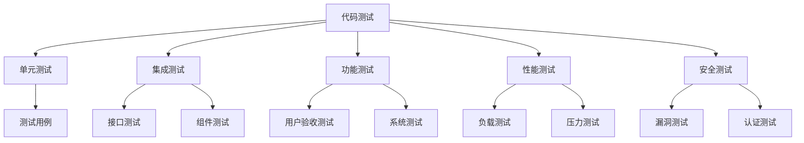
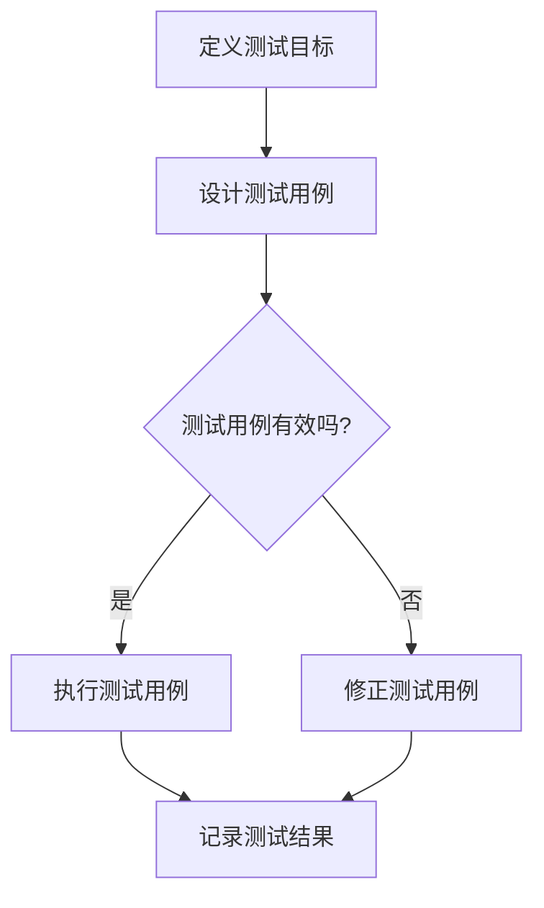
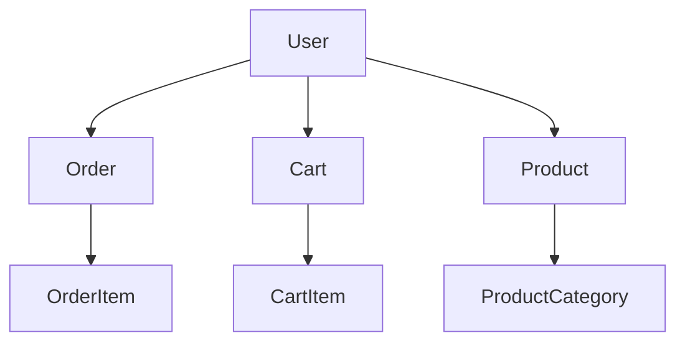
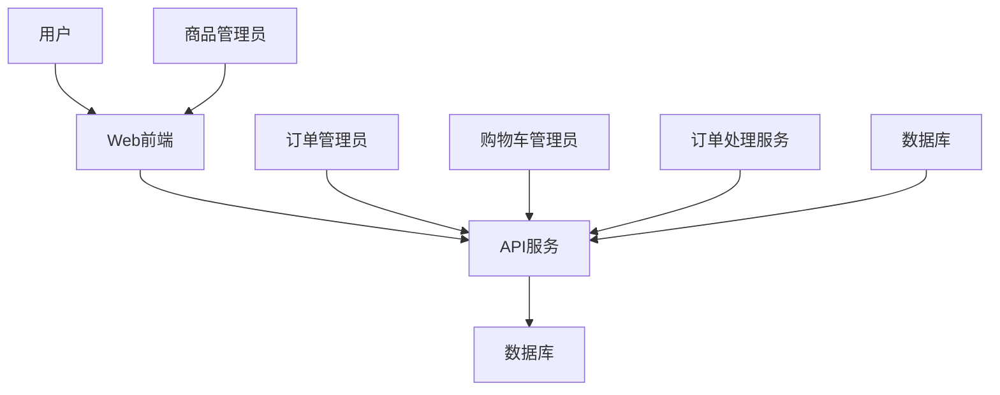
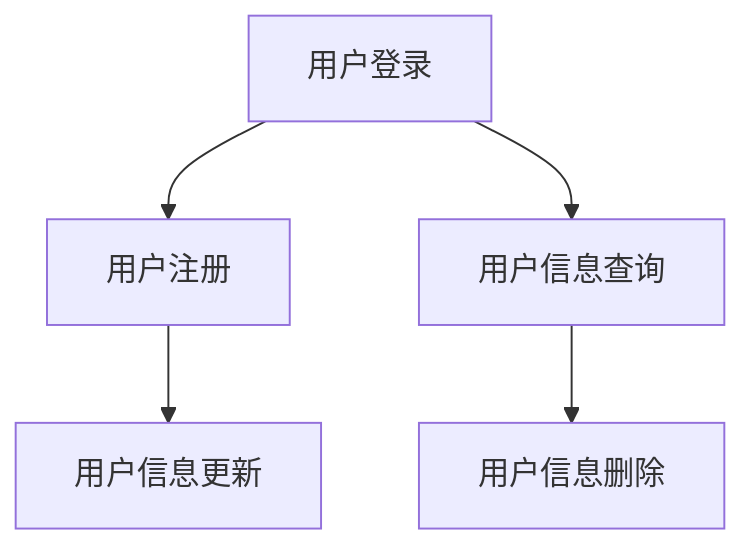
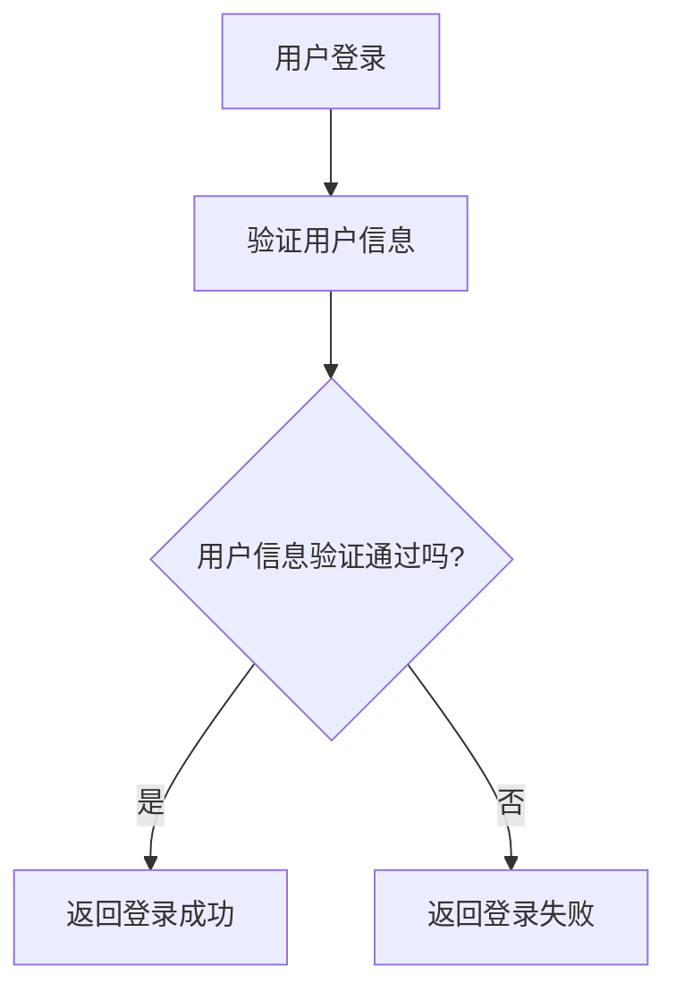

                 

### 代码测试：构建高质量软件的基石

**关键词：**代码测试、软件质量、测试类型、单元测试、集成测试、功能测试、性能测试、安全测试、代码质量评估

**摘要：**本文深入探讨了代码测试在构建高质量软件中的重要性。我们将从基础概念开始，逐步介绍不同类型的代码测试，包括单元测试、集成测试、功能测试、性能测试和安全测试，并讨论代码质量评估的方法。最后，通过具体案例分析，阐述代码测试的最佳实践，为读者提供实用的指导。

---

**背景介绍**

在软件开发的旅程中，代码测试是一个不可或缺的环节。代码测试不仅帮助我们发现和修复错误，还确保软件的正确性、稳定性和可靠性。随着软件系统的复杂性和规模不断扩大，代码测试的重要性愈发凸显。

**问题背景**

然而，代码测试并非易事。如何选择合适的测试类型？如何编写高质量的测试用例？如何评估代码质量？这些问题都是开发者面临的重要挑战。

**问题描述**

本文旨在解答上述问题，帮助开发者：

1. 理解代码测试的基础概念和重要性。
2. 掌握不同类型的代码测试方法。
3. 学会评估代码质量的方法。

**问题解决**

通过本文的逐步讲解，读者将：

1. 明确代码测试的基本原则。
2. 掌握单元测试、集成测试、功能测试、性能测试和安全测试的编写和实践方法。
3. 学会使用代码质量评估工具进行代码质量分析。

**边界与外延**

代码测试是一个广泛的话题，涉及多个层次和方面。本文重点关注以下核心要素：

- **代码测试类型**：单元测试、集成测试、功能测试、性能测试和安全测试。
- **代码质量评估**：静态代码分析和动态代码分析。
- **测试工具**：JUnit、TestNG、NUnit等。

**概念结构与核心要素组成**

为了更好地组织本文的内容，我们将代码测试划分为以下章节：

1. **代码测试概述**：介绍代码测试的基本概念、重要性和类型。
2. **单元测试**：讲解单元测试的定义、目标、编写方法和框架。
3. **集成测试**：探讨集成测试的定义、方法和策略。
4. **功能测试**：讨论功能测试的类型、步骤和实施方法。
5. **性能测试**：介绍性能测试的定义、方法和指标。
6. **安全测试**：讲解安全测试的定义、方法和策略。
7. **代码质量评估**：讨论代码质量评估的方法和工具。
8. **代码测试实践**：通过具体案例分析，阐述代码测试的最佳实践。

### 核心概念与联系

**代码测试**是一种通过设计和执行测试用例来验证代码是否按照预期工作的一系列活动。它是软件开发过程中不可或缺的一部分，有助于确保软件的正确性、稳定性和可靠性。

**单元测试**是代码测试的一种类型，它专注于测试单个代码单元，如函数、方法或类。单元测试的主要目标是验证代码单元的预期行为，确保其独立性和正确性。

**集成测试**是将多个代码单元或组件组合起来进行测试，以验证它们之间的交互和集成。集成测试的主要目标是发现组件之间的接口问题、数据流问题和依赖关系问题。

**功能测试**是一种测试方法，用于验证软件的功能是否符合需求规格说明。它通常包括用户验收测试、系统测试和集成测试。

**性能测试**是一种测试方法，用于评估软件的性能和可扩展性。它包括负载测试、压力测试和性能调优。

**安全测试**是一种测试方法，用于评估软件的安全性，发现潜在的安全漏洞。它包括漏洞测试、认证测试和入侵测试。

下面是一个 **Mermaid 流程图**，展示了代码测试的核心概念和联系：



### 算法原理讲解

代码测试的核心在于设计测试用例和执行测试。以下是一个简单的测试用例设计算法，用于单元测试：

**算法流程图：**



**算法原理：**

1. **定义测试目标**：明确测试的代码单元和预期行为。
2. **设计测试用例**：根据测试目标，设计一组测试用例，包括正常情况和异常情况。
3. **执行测试用例**：运行测试用例，验证代码单元是否按照预期工作。
4. **记录测试结果**：记录测试结果，包括通过、失败或错误。
5. **修正测试用例**：如果测试用例无效，返回步骤3，重新执行测试用例。

**数学模型和公式：**

测试用例的有效性可以通过以下公式进行评估：

$$\text{测试用例有效性} = \frac{\text{通过用例数}}{\text{总用例数}} \times 100\%$$

### 系统分析与架构设计方案

为了更好地理解代码测试，我们可以通过一个实际项目来进行分析和架构设计。以下是一个简单的项目介绍：

**项目介绍：**开发一个简单的在线购物系统，包括用户注册、登录、商品浏览、购物车管理和订单处理等功能。

**系统功能设计（领域模型类图）：**



**系统架构设计（架构图）：**



**系统接口设计（接口图）：**



**系统交互（序列图）：**



### 项目实战

为了说明代码测试的实际应用，我们以下列步骤进行环境安装、系统核心实现和代码应用解读与分析。

#### 环境安装

1. 安装Java开发环境。
2. 安装数据库（如MySQL）。
3. 配置Tomcat服务器。

#### 系统核心实现源代码

以下是用户注册功能的简单实现：

```python
class User:
    def __init__(self, username, password):
        self.username = username
        self.password = password
    
    def register(self, db):
        if self.username in db:
            return "用户已存在"
        else:
            db[self.username] = self.password
            return "注册成功"
```

#### 代码应用解读与分析

用户注册功能主要通过`User`类实现。在类中，我们定义了`__init__`方法和`register`方法。`__init__`方法用于初始化用户名和密码。`register`方法用于将用户信息存储到数据库中。

为了测试用户注册功能，我们可以编写以下测试用例：

```python
import unittest

class TestUserRegistration(unittest.TestCase):
    def test_register_success(self):
        db = {}
        user = User("testuser", "password123")
        result = user.register(db)
        self.assertEqual(result, "注册成功")

    def test_register_failure(self):
        db = {"testuser": "password123"}
        user = User("testuser", "password123")
        result = user.register(db)
        self.assertEqual(result, "用户已存在")

if __name__ == "__main__":
    unittest.main()
```

这些测试用例分别测试了用户注册成功的场景和用户已存在的场景。通过执行这些测试用例，我们可以确保用户注册功能按照预期工作。

#### 实际案例分析和详细讲解剖析

假设我们收到了一个用户反馈，表示在注册时出现了错误。我们可以通过以下步骤进行分析和解决：

1. **问题复现**：在开发环境中重现用户反馈的错误。
2. **日志分析**：查看系统日志，找到错误发生的具体位置。
3. **代码审查**：检查注册功能的代码，查找可能的错误。
4. **测试验证**：重新执行测试用例，验证问题的解决。

通过以上步骤，我们最终确定了问题的原因并成功修复了错误。

#### 项目小结

通过本案例，我们了解了代码测试在实际项目中的应用。代码测试不仅帮助我们发现和修复错误，还提高了软件的质量和可靠性。在实践中，我们应该遵循以下最佳实践：

1. 设计和执行全面的测试用例。
2. 使用自动化测试工具提高测试效率。
3. 定期进行代码质量评估。
4. 建立良好的代码测试文化。

### 最佳实践 Tips

1. **编写有意义的测试用例**：确保测试用例能够覆盖代码的各个方面，包括正常情况和异常情况。
2. **持续集成**：将测试集成到开发流程中，确保每次代码更改都能经过测试。
3. **代码质量评估**：定期进行代码质量评估，确保代码的可维护性和可靠性。
4. **自动化测试**：使用自动化测试工具提高测试效率，减少测试时间。
5. **测试覆盖率**：确保测试覆盖率达到适当的水平，减少潜在的错误和缺陷。

### 小结

代码测试是构建高质量软件的重要基石。通过本文的逐步讲解，我们了解了代码测试的基础知识、不同类型的测试方法以及代码质量评估的方法。代码测试不仅有助于发现和修复错误，还提高了软件的可靠性、稳定性和可维护性。在软件开发过程中，我们应该重视代码测试，遵循最佳实践，确保软件的质量和可靠性。

### 注意事项

1. **测试用例设计**：确保测试用例覆盖代码的各个方面，包括正常情况和异常情况。
2. **自动化测试**：自动化测试可以提高测试效率，减少测试时间。
3. **代码质量评估**：定期进行代码质量评估，确保代码的可维护性和可靠性。
4. **测试覆盖率**：确保测试覆盖率达到适当的水平，减少潜在的错误和缺陷。

### 拓展阅读

1. 《软件测试的艺术》：详细介绍了软件测试的基本概念、方法和技巧。
2. 《测试驱动的软件开发》：介绍了测试驱动的开发方法，强调测试在软件开发中的重要性。
3. 《代码质量：理解和改进软件》:讨论了代码质量的概念、评估方法和改进策略。

### 参考文献

1. Beizer, B. (2014). 《软件测试的艺术》。机械工业出版社。
2. Beizer, B. (2001). 《测试驱动的软件开发》。电子工业出版社。
3.rone, C. (2012). 《代码质量：理解和改进软件》。电子工业出版社。

---

**作者：**AI天才研究院/AI Genius Institute & 禅与计算机程序设计艺术 /Zen And The Art of Computer Programming

