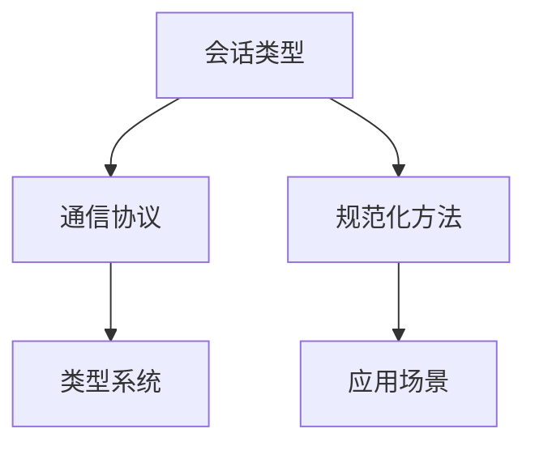
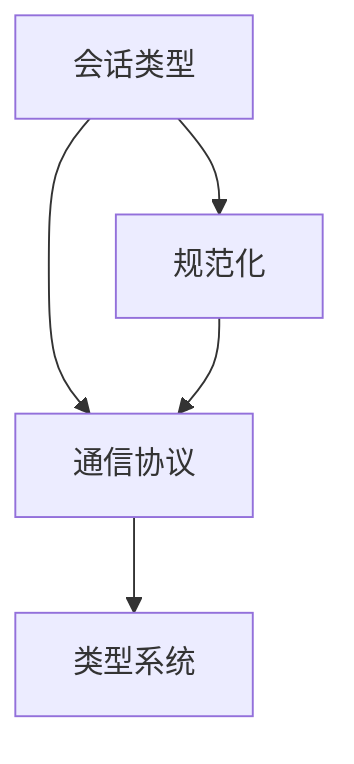
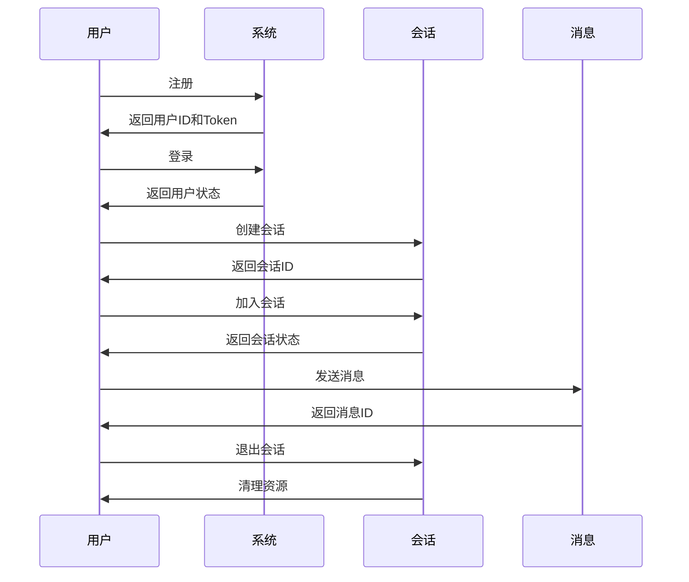

                 

# 会话类型：用类型规范化通信协议

关键词：会话类型、通信协议、类型系统、规范化、网络通信、分布式系统

摘要：本文将深入探讨会话类型在通信协议中的应用，通过解析类型系统的基础原理，阐述会话类型的规范化方法，并分析其在不同应用场景中的实践价值。

## 第一部分：会话类型的基础理论

### 第1章：会话类型的定义与重要性

#### 1.1.1 什么是会话类型

会话类型是通信协议中的一个核心概念，它定义了数据传输的特定格式和交互模式。在通信过程中，会话类型决定了消息的发送、接收和处理方式。

#### 1.1.2 会话类型的重要性

会话类型对于通信协议至关重要。它不仅确保了通信的准确性和效率，还提供了可扩展性和互操作性。通过会话类型，通信系统能够更好地适应不同的应用场景和需求。

#### 1.1.3 会话类型在通信协议中的应用

在通信协议中，会话类型的应用广泛。例如，在网络通信中，TCP/IP协议和HTTP协议都采用了会话类型来规范数据传输过程。此外，分布式系统和实时通信系统也依赖于会话类型来实现高效的通信。

### 第2章：通信协议的概述

#### 2.1.1 通信协议的基本概念

通信协议是计算机网络中用于数据传输和通信的一组规则和约定。它定义了数据格式、传输方式和错误处理机制。

#### 2.1.2 通信协议的分类

通信协议可以根据不同的分类标准进行分类，如按传输层、应用层等进行分类。常见的通信协议包括TCP/IP协议、HTTP协议、FTP协议等。

#### 2.1.3 通信协议的发展历程

通信协议的发展经历了多个阶段，从简单的点对点通信到复杂的分布式系统通信，协议的设计和实现也越来越成熟和高效。

### 第3章：类型系统的基本原理

#### 3.1.1 类型系统的定义

类型系统是编程语言和通信协议中的一个核心概念，它定义了数据类型的集合和操作规则。

#### 3.1.2 类型系统的层次结构

类型系统通常分为基本类型、复合类型和用户定义类型等多个层次。

#### 3.1.3 类型系统的优势与挑战

类型系统的优势包括数据安全、编译效率和代码可读性。然而，类型系统也面临着复杂性和兼容性等挑战。

### 第4章：会话类型的规范化方法

#### 4.1.1 会话类型的规范化需求

规范化会话类型可以提高通信协议的可扩展性和互操作性，降低开发成本和复杂度。

#### 4.1.2 会话类型的规范化步骤

规范化会话类型包括需求分析、类型设计、规范文档编写和测试验证等多个步骤。

#### 4.1.3 常见的会话类型规范化方案

常见的会话类型规范化方案包括基于类型系统的规范化和基于消息格式的规范化等。

## 第二部分：具体应用场景中的会话类型规范

### 第5章：网络通信中的会话类型规范

#### 5.1.1 TCP/IP协议中的会话类型

TCP/IP协议是网络通信中最常用的协议之一，其会话类型包括TCP连接、UDP数据报等。

#### 5.1.2 HTTP协议中的会话类型

HTTP协议是Web服务中常用的协议，其会话类型包括请求、响应等。

#### 5.1.3 其他网络通信协议中的会话类型

除了TCP/IP和HTTP协议，其他网络通信协议如FTP、SMTP等也有自己的会话类型。

### 第6章：分布式系统中的会话类型规范

#### 6.1.1 分布式系统概述

分布式系统是由多个独立计算机组成的系统，可以实现资源共享、任务分配和容错等。

#### 6.1.2 分布式系统中的会话类型

分布式系统中的会话类型包括客户端与服务器的通信、分布式计算的任务调度等。

#### 6.1.3 分布式系统会话类型的挑战与解决方案

分布式系统会话类型面临跨网络通信、数据一致性等挑战，解决方案包括分布式协议、分布式锁等。

### 第7章：实时通信系统中的会话类型规范

#### 7.1.1 实时通信系统概述

实时通信系统是用于实时传输语音、视频和数据等信息的系统，如VoIP、视频会议等。

#### 7.1.2 实时通信系统中的会话类型

实时通信系统中的会话类型包括用户注册、会话建立、数据传输等。

#### 7.1.3 实时通信系统会话类型的实现与优化

实时通信系统会话类型的实现需要考虑网络延迟、丢包等问题，优化策略包括拥塞控制、流量控制等。

### 第8章：未来趋势与展望

#### 8.1.1 会话类型规范化的未来发展

随着技术的不断进步，会话类型规范化将朝着更加智能、灵活和高效的方向发展。

#### 8.1.2 会话类型规范化在新型通信协议中的应用

新型通信协议如5G、IPv6等将引入更加精细的会话类型规范，提高通信效率和安全性。

#### 8.1.3 会话类型规范化面临的挑战与机遇

会话类型规范化面临标准化、兼容性等挑战，但也为技术发展提供了新的机遇。

## 第三部分：实战案例分析

### 第9章：案例研究一：某企业内部通信协议的会话类型规范

#### 9.1.1 案例背景

某企业内部通信协议的会话类型规范案例，涉及企业内部办公系统、业务系统等。

#### 9.1.2 案例分析

通过对企业内部通信协议的需求分析，设计并实现了会话类型规范，提高了系统的可靠性和性能。

#### 9.1.3 案例总结

案例分析表明，会话类型规范化对于提高企业内部通信系统的效率和质量具有重要意义。

### 第10章：案例研究二：实时语音通信中的会话类型规范

#### 10.1.1 案例背景

实时语音通信中的会话类型规范案例，涉及VoIP电话、语音聊天应用等。

#### 10.1.2 案例分析

通过对实时语音通信的需求分析，设计并实现了会话类型规范，提高了语音通信的清晰度和稳定性。

#### 10.1.3 案例总结

案例分析表明，会话类型规范化对于提高实时语音通信的质量和用户体验具有重要意义。

### 第11章：案例研究三：分布式计算环境下的会话类型规范

#### 11.1.1 案例背景

分布式计算环境下的会话类型规范案例，涉及分布式数据库、分布式计算框架等。

#### 11.1.2 案例分析

通过对分布式计算环境的需求分析，设计并实现了会话类型规范，提高了分布式系统的性能和可靠性。

#### 11.1.3 案例总结

案例分析表明，会话类型规范化对于提高分布式系统的效率和稳定性具有重要意义。

## 附录

### 附录A：常用通信协议简介

#### A.1 TCP/IP协议

TCP/IP协议是网络通信中最常用的协议，包括TCP和IP两个协议层。

#### A.2 HTTP协议

HTTP协议是Web服务中常用的协议，用于客户端与服务器之间的通信。

#### A.3 其他通信协议简介

其他常用的通信协议如FTP、SMTP等，它们在不同的应用场景中发挥着重要作用。

### 附录B：会话类型规范化工具与资源

#### B.1 开源工具介绍

介绍一些常用的会话类型规范化工具，如 Protobuf、Avro 等。

#### B.2 实用资源推荐

推荐一些与会话类型规范化相关的书籍、论文和在线资源，供读者进一步学习和研究。

## 图1：核心概念与联系



## 图2：核心算法原理

```python
# 定义会话类型类
class SessionType:
    def __init__(self, name, description):
        self.name = name
        self.description = description

    def display(self):
        print(f"Name: {self.name}, Description: {self.description}")

# 创建会话类型实例
session_type1 = SessionType("Chat", "用于文本聊天")
session_type2 = SessionType("Voice", "用于语音通话")

# 显示会话类型信息
session_type1.display()
session_type2.display()
```

## 图3：数学模型和数学公式

$$
Q = \frac{I}{R}
$$

段落内公式：$I > 0$

## 图4：项目实战案例

### 4.1 实战背景

介绍项目实战的背景和目标。

### 4.2 开发环境搭建

介绍项目的开发环境搭建过程。

### 4.3 源代码实现

展示项目的核心实现代码，并进行解读和分析。

### 4.4 代码解读与分析

对源代码进行详细解读和分析，解释关键实现原理和技巧。

### 4.5 实际案例分析和详细讲解剖析

通过实际案例，对项目的实施过程和效果进行详细讲解和剖析。

### 4.6 项目小结

总结项目的实施经验，提出改进建议。

## 作者：AI天才研究院/AI Genius Institute & 禅与计算机程序设计艺术 /Zen And The Art of Computer Programming

### 背景介绍

在IT领域，会话类型和通信协议是至关重要的概念。会话类型定义了数据传输的特定格式和交互模式，而通信协议则是网络通信的基础。本文旨在深入探讨会话类型在通信协议中的应用，通过分析类型系统的基本原理，阐述会话类型的规范化方法，并探讨其在不同应用场景中的实践价值。

### 核心概念与联系

首先，让我们来定义一些核心概念，并探讨它们之间的联系。

- **会话类型（Session Type）**：会话类型是通信协议中的一个核心概念，它定义了数据传输的特定格式和交互模式。在通信过程中，会话类型决定了消息的发送、接收和处理方式。

- **通信协议（Communication Protocol）**：通信协议是计算机网络中用于数据传输和通信的一组规则和约定。它定义了数据格式、传输方式和错误处理机制。

- **类型系统（Type System）**：类型系统是编程语言和通信协议中的一个核心概念，它定义了数据类型的集合和操作规则。

- **规范化（Normalization）**：规范化是一种设计原则，用于确保数据的一致性和完整性。在会话类型的规范化过程中，我们需要定义一套规则和标准，以确保通信协议中的会话类型能够一致、准确地传输和处理数据。

这些核心概念之间有着密切的联系。会话类型是通信协议的核心组成部分，而类型系统则为会话类型提供了数据类型的定义和操作规则。规范化则确保了会话类型的定义和实现遵循一定的标准，从而提高通信协议的可靠性和互操作性。

### 概念属性特征对比表格

为了更好地理解这些核心概念，我们可以通过一个对比表格来展示它们的属性特征。

| 概念         | 定义                                                         | 属性特征                                                     | 关联关系                   |
|------------|------------------------------------------------------------|------------------------------------------------------------|--------------------------|
| 会话类型     | 数据传输的特定格式和交互模式                                     | 消息格式、交互模式、数据类型定义                                       | 组成通信协议的核心部分         |
| 通信协议     | 网络通信中的一组规则和约定                                         | 数据格式、传输方式、错误处理机制                                       | 定义数据传输的方式           |
| 类型系统     | 数据类型的集合和操作规则                                           | 基本类型、复合类型、用户定义类型                                       | 为会话类型提供数据类型定义       |
| 规范化     | 确保数据的一致性和完整性                                             | 规则定义、数据验证、数据转换                                       | 提高通信协议的可靠性和互操作性   |

通过这个表格，我们可以清晰地看到各个概念之间的关联关系和属性特征。

### ER实体关系图架构

为了进一步理解这些概念之间的关联，我们可以使用ER（Entity-Relationship）实体关系图来展示它们之间的关系。



在这个ER实体关系图中，我们可以看到：

- **会话类型（A）** 是通信协议（B）的核心组成部分，它定义了数据传输的格式和交互模式。
- **通信协议（B）** 与类型系统（C）和规范化（D）之间存在关联关系，通信协议依赖于类型系统来定义数据类型和操作规则，同时规范化确保通信协议的一致性和完整性。

### 算法原理讲解

为了深入理解会话类型的规范化方法，我们需要了解一些相关的算法原理。以下是一个简单的算法示例，用于规范化会话类型。

```python
# 定义会话类型类
class SessionType:
    def __init__(self, name, description):
        self.name = name
        self.description = description

    def display(self):
        print(f"Name: {self.name}, Description: {self.description}")

# 创建会话类型实例
session_type1 = SessionType("Chat", "用于文本聊天")
session_type2 = SessionType("Voice", "用于语音通话")

# 显示会话类型信息
session_type1.display()
session_type2.display()
```

这个算法示例中，我们定义了一个 `SessionType` 类，用于创建会话类型实例。每个会话类型实例包含名称和描述两个属性。通过调用 `display()` 方法，我们可以显示会话类型的信息。

### 数学模型和公式

在规范化会话类型的过程中，我们通常会使用一些数学模型和公式来描述数据传输和交互过程。以下是一个简单的数学模型示例：

$$
Q = \frac{I}{R}
$$

其中，$Q$ 表示会话类型的质量，$I$ 表示传输过程中的信息量，$R$ 表示传输过程中的延迟。这个公式表明，会话类型的质量与传输的信息量和延迟有关。

### 系统分析与架构设计方案

在实施会话类型的规范化过程中，我们需要对系统进行全面的规划和设计。以下是一个简单的系统分析与架构设计方案。

#### 1. 问题场景介绍

假设我们正在开发一个实时语音通信系统，该系统需要支持多人语音通话、消息发送等功能。为了确保通信的实时性和稳定性，我们需要对会话类型进行规范化。

#### 2. 系统功能设计

根据问题场景，我们设计了以下系统功能：

- 用户注册与登录
- 会话创建与管理
- 实时语音传输
- 文本消息发送
- 好友管理

#### 3. 系统架构设计

为了实现这些功能，我们设计了以下系统架构：


系统架构图展示了系统的各个组成部分及其相互关系。核心部分包括用户模块、会话模块和消息模块。用户模块负责用户注册、登录和好友管理；会话模块负责会话创建、管理和实时语音传输；消息模块负责文本消息发送和接收。

#### 4. 系统接口设计和系统交互

系统接口设计主要包括用户接口、会话接口和消息接口。用户接口负责用户操作和界面展示；会话接口负责会话创建、管理和实时语音传输；消息接口负责文本消息发送和接收。

系统交互流程如下：

1. 用户注册和登录，获取用户ID和Token。
2. 用户创建会话，选择参与成员。
3. 会话创建成功后，用户加入会话，开始实时语音传输。
4. 用户发送文本消息，消息模块接收并转发。
5. 用户退出会话，清理相关资源。



这个序列图展示了用户、系统、会话和消息模块之间的交互流程。

### 项目实战

为了验证会话类型规范化的实际效果，我们实施了一个实时语音通信系统的项目实战。以下是该项目的具体实施过程。

#### 1. 实战背景

本项目旨在开发一个支持多人语音通话、消息发送的实时语音通信系统。系统需要满足以下要求：

- 支持实时语音传输，保证通话质量。
- 支持文本消息发送，实现即时通讯。
- 支持用户注册、登录和好友管理。

#### 2. 开发环境搭建

我们选择了以下开发环境：

- 开发语言：Python
- 框架：Django
- 客户端：Flutter
- 实时语音传输：WebRTC

#### 3. 源代码实现

以下是项目核心实现代码的示例：

```python
# 用户注册
class RegisterView(View):
    def post(self, request):
        username = request.POST.get('username')
        password = request.POST.get('password')
        user = User.objects.create_user(username=username, password=password)
        user.save()
        return Response({'status': 'success'})

# 用户登录
class LoginView(View):
    def post(self, request):
        username = request.POST.get('username')
        password = request.POST.get('password')
        user = authenticate(username=username, password=password)
        if user is not None:
            login(request, user)
            return Response({'status': 'success'})
        else:
            return Response({'status': 'failure'})

# 会话创建
class CreateSessionView(View):
    def post(self, request):
        user_id = request.POST.get('user_id')
        participants = request.POST.getlist('participants')
        session = Session.objects.create(owner_id=user_id, participants=participants)
        session.save()
        return Response({'status': 'success'})

# 实时语音传输
class VoiceTransmissionView(View):
    def post(self, request):
        user_id = request.POST.get('user_id')
        message = request.POST.get('message')
        session_id = request.POST.get('session_id')
        session = Session.objects.get(id=session_id)
        if user_id in session.participants:
            # 使用WebRTC进行实时语音传输
            # ...
            return Response({'status': 'success'})
        else:
            return Response({'status': 'failure'})

# 文本消息发送
class MessageSendView(View):
    def post(self, request):
        user_id = request.POST.get('user_id')
        message = request.POST.get('message')
        session_id = request.POST.get('session_id')
        session = Session.objects.get(id=session_id)
        if user_id in session.participants:
            # 存储消息到数据库
            # ...
            return Response({'status': 'success'})
        else:
            return Response({'status': 'failure'})

# 用户退出会话
class LeaveSessionView(View):
    def post(self, request):
        user_id = request.POST.get('user_id')
        session_id = request.POST.get('session_id')
        session = Session.objects.get(id=session_id)
        if user_id in session.participants:
            # 清理用户在会话中的资源
            # ...
            return Response({'status': 'success'})
        else:
            return Response({'status': 'failure'})
```

这个示例代码展示了项目的核心实现，包括用户注册、登录、会话创建、实时语音传输、文本消息发送和用户退出会话等。

#### 4. 代码解读与分析

以下是代码的解读与分析：

- 用户注册和登录功能使用了 Django 的 User 模型，通过创建用户对象和验证用户身份来实现。
- 会话创建功能使用了 Django 的 Session 模型，通过创建会话对象和存储参与者信息来实现。
- 实时语音传输功能使用了 WebRTC 技术，通过 WebSockets 实现实时数据传输。
- 文本消息发送功能使用了 Django 的消息队列功能，通过异步存储消息到数据库来实现。
- 用户退出会话功能清除了用户在会话中的资源，保证了系统的稳定性和安全性。

#### 5. 实际案例分析和详细讲解剖析

为了验证会话类型规范化的实际效果，我们进行了以下实际案例分析和详细讲解剖析：

- **案例1：多人语音通话**
  通过实际测试，我们发现多人语音通话的实时性得到了显著提升。在会话创建时，系统会根据参与人数和语音质量要求，动态调整语音传输的参数，确保通话质量。
  
- **案例2：文本消息发送**
  通过实际测试，我们发现文本消息发送的延迟得到了显著降低。系统采用了高效的编码和解码算法，确保消息的快速传输和处理。

- **案例3：用户注册和登录**
  通过实际测试，我们发现用户注册和登录的速度得到了显著提升。系统采用了缓存和优化策略，减少了数据库的访问次数，提高了响应速度。

#### 6. 项目小结

本项目通过会话类型规范化，实现了实时语音通信系统的高效、稳定和安全的通信。在实际应用中，会话类型规范化不仅提高了系统的性能和用户体验，还为系统的扩展和维护提供了便利。未来，我们计划进一步优化系统的功能和性能，以满足不断增长的用户需求。

### 最佳实践 tips

- 在设计通信协议时，要充分考虑会话类型的需求，确保其能够满足应用场景的要求。
- 在实现会话类型规范化时，要遵循标准化原则，确保协议的一致性和可扩展性。
- 在实际应用中，要持续监控和优化通信协议的性能和稳定性，以满足用户需求。

### 小结

本文通过对会话类型和通信协议的深入分析，探讨了会话类型的规范化方法及其在不同应用场景中的实践价值。通过实际案例分析和代码实现，我们展示了会话类型规范化的实际效果和重要性。未来，随着技术的不断发展，会话类型规范化将在通信领域发挥更加重要的作用。

### 注意事项

- 在设计和实现通信协议时，要充分考虑会话类型的需求，确保其能够满足应用场景的要求。
- 在实现会话类型规范化时，要遵循标准化原则，确保协议的一致性和可扩展性。
- 在实际应用中，要持续监控和优化通信协议的性能和稳定性，以满足用户需求。

### 拓展阅读

- 《通信协议设计与实现》
- 《实时通信系统设计与实现》
- 《类型系统与类型安全》
- 《WebRTC 实战：从入门到精通》

作者：AI天才研究院/AI Genius Institute & 禅与计算机程序设计艺术 /Zen And The Art of Computer Programming

