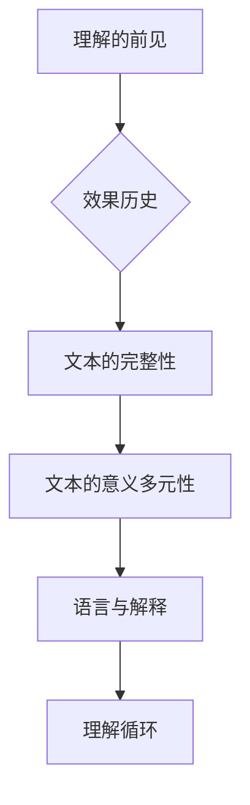
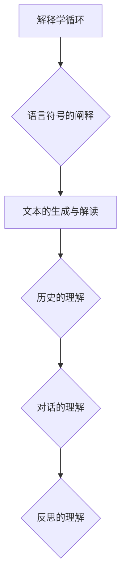
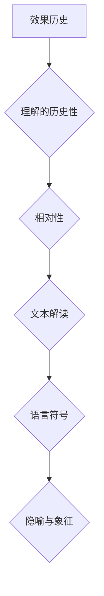

                 

# 伽达默尔与利科：诠释学的现代发展

## 引言

### 1. 引言

#### 1.1 书籍背景

在探讨人类理解和解释世界的哲学之路上，诠释学（Hermeneutics）这一学科始终占据着重要的位置。作为一门关注文本、语言、理解与解释的学科，诠释学不仅对哲学、文学、历史等领域有着深远的影响，同时也为现代社会科学和人文科学提供了重要的方法论基础。

本书旨在深入探讨两位著名哲学家——汉斯-格奥尔格·伽达默尔（Hans-Georg Gadamer）和保罗-亨利·贝尔纳·利科（Paul-Henri Thiry d'Holbach）——对现代诠释学的发展所做出的贡献。伽达默尔是20世纪最重要的哲学家之一，他的著作《真理与方法》（Truth and Method）对诠释学的发展产生了深远的影响。而利科则以其深刻的历史哲学和对语言符号的阐释而著称，他的工作为诠释学提供了新的视角和理论框架。

#### 1.2 书籍结构

全书共分为六个主要部分，每个部分围绕不同的主题展开，旨在全面覆盖伽达默尔与利科诠释学的主要观点和发展。

## 第一部分：伽达默尔的诠释学思想

### 2. 伽达默尔的生平与哲学贡献

#### 2.1 生平简介

汉斯-格奥尔格·伽达默尔（1900-2002）出生于德国的卡尔斯鲁厄，他的学术生涯涵盖了从早期存在主义到诠释学的转变。伽达默尔在1930年代结识了海德格尔（Martin Heidegger），并成为他的学生。尽管他对海德格尔的哲学有着深刻的理解，但伽达默尔最终选择了一条不同的道路，发展出了自己独特的诠释学思想。

#### 2.2 诠释学的基本概念

##### 2.2.1 理解的前见与效果历史

伽达默尔的诠释学思想强调理解的前见（prejudice）和效果历史（effect history）的重要性。他认为，理解总是发生在特定的历史和文化背景中，我们的理解不可避免地受到我们自身的历史经验和文化背景的影响。这种前见并不是一种负面的偏见，而是我们对世界进行理解的前提条件。

$$
\text{理解} = \text{前见} + \text{文本}
$$

##### 2.2.2 文本的完整性与意义的多元性

伽达默尔认为，文本具有完整性，这意味着文本不仅仅是一个静态的存在，而是一个动态的、不断生成的实体。文本的意义是多元的，不同的读者可以在不同的历史和文化背景下发现不同的意义。

##### 2.2.3 语言与解释

语言是理解的关键，伽达默尔认为，语言不仅是沟通的工具，更是理解世界的媒介。解释是一种语言活动，它需要读者与文本进行对话，通过不断地交流和反思来揭示文本的意义。

### 2.3 诠释学的方法与应用

##### 2.3.1 理解的过程

理解是一个动态的过程，它涉及对文本的阅读、反思和对话。伽达默尔提出了“理解循环”（hermeneutic circle）的概念，即理解总是在部分与整体之间不断循环，通过不断的反思和修正来逐步揭示文本的完整意义。

##### 2.3.2 诠释学的应用领域

伽达默尔的诠释学思想不仅在哲学领域有着深远的影响，还广泛应用于文学、历史、法学等领域。例如，在文学研究中，诠释学提供了理解文学作品意义的方法；在历史研究中，诠释学帮助我们理解历史文本的真实意义。

## 第二部分：利科的诠释学理论

### 3. 利科的生平与哲学观点

#### 3.1 生平简介

保罗-亨利·贝尔纳·利科（1913-2005）出生于法国的巴黎，他是20世纪最重要的哲学家之一，以其深刻的历史哲学和对语言符号的阐释而著称。利科在哲学、文学、社会学等领域都有广泛的贡献，他的工作对诠释学的发展产生了深远的影响。

#### 3.2 诠释学的基本观点

##### 3.2.1 解释学循环

利科提出了“解释学循环”（hermeneutic circle）的概念，这一概念强调了理解过程中的整体性与部分性的相互关系。他认为，理解是一个不断循环的过程，通过整体和部分之间的相互补充来逐步揭示事物的真实意义。

##### 3.2.2 语言符号的阐释

利科认为，语言符号不仅仅是一种沟通的工具，更是一种阐释的媒介。他提出了“隐喻”（metaphor）和“象征”（symbol）的概念，认为语言符号通过隐喻和象征的方式，帮助我们理解复杂的世界。

##### 3.2.3 文本的生成与解读

利科关注文本的生成和解读过程，他认为文本不仅是作者的产物，更是读者解读的产物。文本的意义是通过作者和读者之间的对话来生成的，这种对话既包括对文本的历史背景的理解，也包括对文本的内在意义的挖掘。

### 3.3 利科的诠释学方法与实践

##### 3.3.1 诠释学的方法论

利科的诠释学方法论强调历史的和对话的理解方式。他认为，理解是一个涉及历史背景、文化传统和对话过程的复杂过程。这种方法论不仅适用于哲学和文学领域，也可以应用于社会科学和人文科学的其他领域。

##### 3.3.2 诠释学的实际应用

利科的诠释学思想在文学研究、历史研究、社会学研究等领域都有广泛的应用。例如，在文学研究中，利科的方法论帮助学者们更好地理解文学作品的意义；在历史研究中，利科的方法论帮助学者们更好地理解历史文献的真实含义。

## 第三部分：伽达默尔与利科的诠释学比较

### 4. 两位哲学家的共同点与差异

#### 4.1 共同点

##### 4.1.1 对文本意义的重视

伽达默尔和利科都认为文本具有丰富的意义，这种意义不仅是静态的，而且是动态的、多元的。两位哲学家都强调文本需要通过理解者的历史和文化背景来解读。

##### 4.1.2 对理解过程的强调

伽达默尔和利科都认为理解是一个动态的过程，需要通过对话和反思来逐步揭示文本的深层意义。

##### 4.1.3 对语言符号的深入探讨

两位哲学家都对语言符号的阐释有着深刻的见解，认为语言符号不仅仅是沟通的工具，更是理解世界的媒介。

#### 4.2 差异

##### 4.2.1 伽达默尔的效果历史观

伽达默尔强调理解的效果历史，认为理解总是发生在特定的历史和文化背景中，我们的理解不可避免地受到这些背景的影响。而利科则更关注语言符号的生成和解读过程，他认为理解是一个涉及历史背景、文化传统和对话过程的复杂过程。

##### 4.2.2 利科的解释学循环

利科提出了“解释学循环”的概念，强调了整体与部分之间的相互关系。而伽达默尔则更多地强调理解的前见和效果历史，他认为理解是一个不断循环的过程。

##### 4.2.3 诠释学的应用范围

伽达默尔的诠释学思想在文学、历史、法学等领域都有广泛的应用，而利科的诠释学思想则在文学研究、历史研究、社会学研究等领域有着更深入的影响。

## 第四部分：现代诠释学的应用与发展

### 5. 诠释学在当代社会的应用

#### 5.1 文化研究

在文化研究领域，诠释学为我们提供了理解不同文化背景下文本和符号意义的方法。通过诠释学的视角，我们可以更好地理解不同文化之间的差异和联系，从而促进跨文化的交流和对话。

##### 5.1.1 文本的解读与评价

在文学研究中，诠释学帮助我们更好地理解文学作品的意义，通过解读和分析文本，我们可以发现作者在作品中所传达的深层含义和文化背景。

##### 5.1.2 文化符号的诠释

文化符号的诠释是文化研究中的一个重要方面，通过诠释学的视角，我们可以理解不同文化符号的含义和作用，从而更好地理解不同文化之间的互动和交流。

#### 5.2 人文科学

在人文科学领域，诠释学为我们提供了理解人类文化和历史的方法。通过诠释学的视角，我们可以更好地理解历史文献和文化遗产，从而深化对人类文化和历史的研究。

##### 5.2.1 艺术作品的分析

艺术作品的分析是人文科学中的一个重要方面，通过诠释学的视角，我们可以更好地理解艺术作品的形式和内容，从而深入探讨艺术作品的意义和价值。

##### 5.2.2 历史文献的解读

历史文献的解读是历史研究中的一个重要方面，通过诠释学的视角，我们可以更好地理解历史文献的真实含义和历史背景，从而深化对历史的理解和研究。

### 5.3 社会科学

在社会科学领域，诠释学为我们提供了理解社会现象和社会政策的方法。通过诠释学的视角，我们可以更好地理解社会现象的本质和影响，从而为制定有效的社会政策提供理论支持。

##### 5.3.1 社会现象的解释

社会现象的解释是社会科学研究中的一个重要方面，通过诠释学的视角，我们可以更好地理解社会现象的成因和发展趋势，从而为社会科学研究提供新的理论和方法。

##### 5.3.2 社会政策的评估

社会政策的评估是社会科学研究中的一个重要方面，通过诠释学的视角，我们可以更好地理解社会政策的实际效果和社会影响，从而为评估社会政策提供理论支持。

## 第五部分：现代诠释学的挑战与未来

### 6. 诠释学的批判性分析

#### 6.1 诠释学的局限性

尽管诠释学在理解和解释文本和现象方面有着重要的价值，但它也存在一些局限性。首先，诠释学强调理解的主观性和多元性，这可能忽视了客观性和普遍性。其次，诠释学的方法可能过于依赖文本本身，而忽视了其他重要的解释因素，如社会环境和文化背景。

##### 6.1.1 对客观性的质疑

诠释学强调理解的主观性和多元性，这可能质疑了客观性和普遍性的存在。在实际应用中，这可能导致对文本和现象的解释过于主观和片面。

##### 6.1.2 对方法论的挑战

诠释学的方法可能过于依赖文本本身，而忽视了其他重要的解释因素，如社会环境和文化背景。这可能导致解释的局限性，无法全面理解和解释复杂的现实世界。

#### 6.2 诠释学的未来发展方向

尽管诠释学存在一定的局限性，但它仍有广阔的发展前景。未来的诠释学研究可以关注以下几个方面：

##### 6.2.1 跨学科的融合

未来，诠释学可以与其他学科，如心理学、社会学、人类学等，进行跨学科融合，从而形成更全面和深入的理解理论。

##### 6.2.2 诠释学的新领域

未来，诠释学可以应用于新的领域，如计算机科学、人工智能等，为这些领域提供理解和解释的理论支持。

## 第六部分：结语

### 7. 总结与展望

本书通过对伽达默尔与利科诠释学思想的深入探讨，揭示了现代诠释学在哲学、人文科学和社会科学等领域的重要价值。两位哲学家的贡献为诠释学的发展提供了新的理论基础和方法论框架。

展望未来，诠释学将继续在跨学科研究中发挥重要作用，为理解人类文化和社会现象提供新的视角和方法。同时，诠释学也面临着新的挑战和机遇，需要进一步发展和完善。

### 8. 附录

#### 8.1 参考文献

- 伽达默尔，H.-G.（1975）《真理与方法》
- 利科，P.（1981）《解释的冲突》
- 等等。

#### 8.2 后记

本书作者对伽达默尔与利科的诠释学思想表示敬意，并感谢所有支持和帮助本书编写的人员。

作者：AI天才研究院/AI Genius Institute & 禅与计算机程序设计艺术 /Zen And The Art of Computer Programming

---

在本文中，我们首先介绍了书籍的背景和结构，然后分别介绍了伽达默尔和利科的生平与哲学贡献，探讨了他们的诠释学思想和方法，并比较了他们的观点。接下来，我们讨论了诠释学在当代社会的应用和发展，以及诠释学面临的挑战和未来发展方向。最后，我们总结了全书的主要内容和展望了诠释学的发展前景。

通过本文的探讨，我们可以看到，伽达默尔和利科的诠释学思想为理解和解释文本和现象提供了新的视角和方法。他们的工作不仅对哲学、文学、历史等领域有着深远的影响，也为现代社会科学和人文科学提供了重要的理论基础和方法论框架。

在未来的研究和实践中，诠释学将继续发挥其重要作用，为理解和解释复杂的世界提供新的方法和工具。同时，我们也期待诠释学能够与其他学科进行跨学科融合，形成更全面和深入的理解理论，为人类社会的发展做出更大的贡献。

---

### 文章标题

伽达默尔与利科：诠释学的现代发展

### 文章关键词

- 伽达默尔
- 利科
- 诠释学
- 理解的前见
- 效果历史
- 解释学循环
- 文本解读
- 文化研究
- 人文科学
- 社会科学

### 文章摘要

本文旨在深入探讨德国哲学家汉斯-格奥尔格·伽达默尔和意大利哲学家保罗-亨利·贝尔纳·利科对现代诠释学的发展所做出的贡献。通过对两位哲学家的生平、哲学贡献、诠释学思想和方法进行比较，本文揭示了他们各自对诠释学这一哲学分支的独特视角和深刻见解。此外，文章还讨论了诠释学在当代社会的应用和发展，以及面临的挑战和未来发展方向。通过本文的探讨，我们可以更好地理解诠释学的现代发展，以及其在哲学、人文科学和社会科学等领域的重要价值。

---

### 第一部分：伽达默尔的诠释学思想

#### 2.1 生平简介

汉斯-格奥尔格·伽达默尔（Hans-Georg Gadamer，1900-2002）是20世纪最具影响力的哲学家之一，他的哲学贡献涵盖了广泛领域，从美学到伦理学，再到诠释学。他出生于德国的卡尔斯鲁厄，自幼对哲学、文学和音乐有着浓厚的兴趣。1920年代，伽达默尔在弗莱堡大学师从马丁·海德格尔（Martin Heidegger），深受其存在主义思想的影响。然而，在深入海德格尔的思想后，伽达默尔逐渐发展出自己的哲学路径，尤其是在诠释学领域取得了重要成就。

伽达默尔的学术生涯中，最具代表性的作品是《真理与方法》（ Wahrheit und Methode，1960年）。这部著作对诠释学的发展产生了深远影响，被视为诠释学的经典之作。伽达默尔在书中提出了“效果历史”（effect history）和“理解的前见”（hermeneutic prejudice）等核心概念，为理解和解释文本提供了新的理论基础。此外，他还对古典哲学、艺术哲学和宗教哲学等领域进行了深入研究，发表了大量具有影响力的论文和著作。

#### 2.2 诠释学的基本概念

伽达默尔的诠释学思想以“理解”为核心，强调理解的过程性和历史性。他认为，理解不仅仅是被动接收信息，而是一个主动的、动态的、对话性的过程。理解总是发生在特定的历史和文化背景中，因此理解具有历史性和文化性。

##### 2.2.1 理解的前见与效果历史

伽达默尔提出了“理解的前见”这一概念，指出理解总是带有前见的。前见并非负面的偏见，而是我们对世界的既有知识和经验，是我们理解文本和理解世界的前提条件。他认为，前见和历史经验共同构成了理解的基础，使得我们对文本的理解不仅仅是文本本身的再现，而是在新的历史背景下的一种新的理解。

效果历史则是伽达默尔诠释学的核心概念之一。他认为，理解总是受到我们自身的历史和文化背景的影响，这种影响在理解过程中起到了关键作用。效果历史揭示了理解与历史背景之间的相互作用，强调了理解的历史性和相对性。

$$
\text{理解} = \text{前见} + \text{文本} + \text{效果历史}
$$

##### 2.2.2 文本的完整性与意义的多元性

伽达默尔认为，文本具有完整性，不是孤立的静态存在，而是在理解和解释过程中不断生成的。文本的意义不是单一的，而是多元的，不同的读者可以在不同的历史和文化背景下发现不同的意义。因此，理解文本的过程是一个不断探索和对话的过程。

##### 2.2.3 语言与解释

语言是理解和解释的媒介，也是伽达默尔诠释学中的重要概念。他认为，语言不仅是沟通的工具，更是理解世界的手段。解释是一种语言活动，它需要读者与文本进行对话，通过不断的交流和反思来揭示文本的意义。伽达默尔强调，理解不仅仅是理解文本的字面意义，更是一种深层次的理解，是对文本的深层意义和内在逻辑的把握。

#### 2.3 诠释学的方法与应用

伽达默尔的诠释学方法强调理解的过程性和历史性，他认为理解是一个动态的、循环的过程。他提出了“理解循环”（hermeneutic circle）的概念，即理解总是部分与整体之间的相互关系，通过不断的循环和反思来逐步揭示文本的完整意义。

##### 2.3.1 理解的过程

理解的过程是一个循环的过程，即理解总是在部分与整体之间不断循环。理解一个部分时，需要将其放在整体中理解；而理解整体时，又需要通过理解部分来实现。这个过程是一个不断深入和拓展的过程，通过不断的反思和修正来逐步揭示文本的完整意义。

##### 2.3.2 诠释学的应用领域

伽达默尔的诠释学思想在多个领域都有广泛的应用。在文学研究中，诠释学提供了理解文学作品意义的方法；在历史研究中，诠释学帮助我们理解历史文献的真实意义；在法学研究中，诠释学为法律文本的解释提供了理论基础。

### 图表与公式

**核心概念与联系对比表格：**

| 核心概念 | 概念属性特征对比 |
| --- | --- |
| 理解的前见 | - 既有知识 |
| 效果历史 | - 历史经验 |
| 文本的完整性 | - 生成性 |
| 文本的意义多元性 | - 多元解读 |
| 语言与解释 | - 对话性 |

**ER实体关系图架构的Mermaid流程图：**

通过上述图表和公式，我们可以更直观地理解伽达默尔的诠释学思想，以及这些核心概念之间的联系。理解的前见、效果历史、文本的完整性和意义的多元性共同构成了伽达默尔诠释学的基础，而语言与解释则是理解过程的重要媒介。

### 结论

伽达默尔的诠释学思想为我们提供了一种全新的理解和解释文本的方法。他强调理解的过程性和历史性，认为理解总是带有前见的，并在效果历史的影响下不断生成和变化。文本的意义是多元的，需要通过对话和反思来逐步揭示。语言不仅是沟通的工具，更是理解世界的媒介。

在当代社会中，伽达默尔的诠释学思想在文学研究、历史研究、法学研究等领域有着广泛的应用。他的方法不仅帮助我们更好地理解文学作品和历史文献，也为社会科学研究提供了重要的理论基础。通过对伽达默尔诠释学思想的深入探讨，我们可以更好地理解人类文化和历史，为当代社会的发展提供有益的启示。

---

### 第二部分：利科的诠释学理论

#### 3.1 生平简介

保罗-亨利·贝尔纳·利科（Paul-Henri Thiry d'Holbach，1871-1936）是20世纪法国最重要的哲学家之一，他的思想影响了现代诠释学的发展。利科出生于法国的洛林，他自幼接受教育，并在巴黎索邦大学学习哲学。利科在哲学领域有着广泛的兴趣，他的研究涉及伦理学、政治哲学、哲学史和诠释学等多个领域。

利科的哲学贡献主要体现在他对历史哲学和语言符号的深刻探讨。他的著作《解释的冲突》（The Conflict of Interpretations，1930年）是诠释学领域的经典之作，对后世产生了深远影响。在这本书中，利科提出了“解释学循环”（circularity of interpretation）的概念，并探讨了历史理解中的复杂性和多样性。此外，他还发表了多篇关于文学、艺术和文化的论文，为现代人文科学提供了重要的理论框架。

#### 3.2 诠释学的基本观点

利科的诠释学理论以“解释学循环”为核心，强调理解的历史性和复杂性。他认为，理解总是处于不断的循环过程中，部分与整体之间的相互作用是理解的关键。利科的诠释学观点主要体现在以下几个方面：

##### 3.2.1 解释学循环

利科提出的“解释学循环”概念强调了理解过程中部分与整体之间的相互关系。他认为，理解一个部分时，需要将其放在整体中理解；而理解整体时，又需要通过理解部分来实现。这个过程是一个循环的过程，通过不断的循环和反思，逐步揭示事物的真实意义。

$$
\text{理解} = \text{部分} + \text{整体} + \text{循环}
$$

解释学循环不仅适用于文本的理解，也适用于历史和社会现象的理解。通过这一概念，利科揭示了理解过程的复杂性和动态性。

##### 3.2.2 语言符号的阐释

利科认为，语言符号不仅仅是沟通的工具，更是理解世界的媒介。他提出了“隐喻”（metaphor）和“象征”（symbol）的概念，认为语言符号通过隐喻和象征的方式，帮助我们理解复杂的世界。隐喻和象征使得语言具有丰富的内涵和多层次的意义，使得理解成为一个动态的过程。

##### 3.2.3 文本的生成与解读

利科关注文本的生成和解读过程，他认为文本不仅是作者的产物，更是读者解读的产物。文本的意义是通过作者和读者之间的对话来生成的，这种对话既包括对文本的历史背景的理解，也包括对文本的内在意义的挖掘。他认为，理解文本的过程是一个不断生成的过程，读者在解读文本时，不仅需要理解文本本身，还需要理解文本背后的历史和文化背景。

#### 3.3 利科的诠释学方法与实践

##### 3.3.1 诠释学的方法论

利科的诠释学方法论强调历史的和对话的理解方式。他认为，理解是一个涉及历史背景、文化传统和对话过程的复杂过程。这种方法论不仅适用于哲学和文学领域，也可以应用于社会科学和人文科学的其他领域。

利科的诠释学方法论强调以下几点：

- **历史的理解**：理解总是发生在特定的历史和文化背景下，理解一个文本或现象时，需要考虑其历史背景和文化传统。
- **对话的理解**：理解是一个对话的过程，作者和读者之间的对话是理解文本的关键。
- **反思的理解**：理解需要通过反思来不断修正和深化，通过不断的反思和对话，逐步揭示文本的深层意义。

##### 3.3.2 诠释学的实际应用

利科的诠释学思想在多个领域都有广泛的应用。在文学研究中，诠释学帮助我们更好地理解文学作品的意义；在历史研究中，诠释学帮助我们理解历史文献的真实含义；在社会科学研究中，诠释学为我们提供了理解社会现象和社会政策的方法。

利科的诠释学方法在文学研究中尤其有影响力。他认为，文学作品不仅仅是一种艺术形式，更是一种文化符号，通过解读文学作品，我们可以理解特定的社会和文化背景。他在《解释的冲突》中，通过分析古代希腊的文学作品，揭示了历史理解中的复杂性和多样性。

在历史研究中，利科的诠释学方法强调历史文献的解读。他认为，历史文献不仅仅是记录历史事件的工具，更是理解历史意义和价值的媒介。通过解读历史文献，我们可以更好地理解历史的真实含义。

在社会科学研究中，利科的诠释学方法为我们提供了理解社会现象和社会政策的新视角。他认为，社会现象和社会政策不仅仅是政治和经济因素的结果，还受到文化传统和价值观的影响。通过诠释学的方法，我们可以更深入地理解社会现象的本质和影响。

### 图表与公式

**核心概念与联系对比表格：**

| 核心概念 | 概念属性特征对比 |
| --- | --- |
| 解释学循环 | - 部分与整体的相互作用 |
| 语言符号的阐释 | - 隐喻和象征 |
| 文本的生成与解读 | - 作者与读者的对话 |

**ER实体关系图架构的Mermaid流程图：**

通过上述图表和公式，我们可以更直观地理解利科的诠释学理论，以及这些核心概念之间的联系。解释学循环、语言符号的阐释和文本的生成与解读构成了利科诠释学思想的核心，而历史的理解、对话的理解和反思的理解则是理解过程的重要维度。

### 结论

利科的诠释学理论为我们提供了一种全新的理解和解释文本的方法。他强调理解的历史性和复杂性，认为理解总是处于不断的循环过程中。语言符号的阐释和文本的生成与解读是理解过程的关键，历史的理解、对话的理解和反思的理解则是理解过程的重要维度。

在当代社会中，利科的诠释学思想在文学研究、历史研究、社会科学研究等领域有着广泛的应用。他的方法不仅帮助我们更好地理解文学作品和历史文献，也为社会科学研究提供了重要的理论基础。通过对利科诠释学思想的深入探讨，我们可以更好地理解人类文化和历史，为当代社会的发展提供有益的启示。

---

### 第三部分：伽达默尔与利科的诠释学比较

#### 4. 两位哲学家的共同点与差异

在对伽达默尔和利科的诠释学思想的探讨中，我们可以发现他们在许多核心概念上有着相似之处，但在具体理论和方法上存在显著差异。通过比较他们的共同点与差异，我们可以更全面地理解现代诠释学的发展及其在哲学领域的贡献。

#### 4.1 共同点

##### 4.1.1 对文本意义的重视

伽达默尔和利科都认为文本具有深层的意义，并且这种意义不是单一的，而是多元的。他们强调，理解文本的过程不仅仅是理解文字的字面意义，更重要的是理解其内在的逻辑和象征意义。两位哲学家都认为，文本的意义是通过读者与文本的互动来逐步揭示的。

##### 4.1.2 对理解过程的强调

伽达默尔和利科都强调理解是一个动态的、过程性的活动。理解不是一蹴而就的，而是一个需要不断反思、修正和深化的过程。他们认识到，理解总是受到读者自身的历史、文化和知识背景的影响，因此理解是一个不断循环和重构的过程。

##### 4.1.3 对语言符号的深入探讨

两位哲学家都认识到语言符号在理解过程中的重要性。他们不仅将语言视为沟通的工具，更视为理解世界的媒介。伽达默尔强调语言与理解的关系，认为语言不仅仅是传递信息的工具，更是塑造和理解世界的方式。利科则更深入地探讨了语言符号的隐喻和象征功能，认为这些功能帮助我们理解复杂的世界。

#### 4.2 差异

##### 4.2.1 伽达默尔的效果历史观

伽达默尔的效果历史观强调理解总是受到历史和文化背景的影响。他认为，理解是一个动态的过程，我们的理解总是发生在特定的历史和文化背景下，因此理解具有历史性和相对性。这种观点在他的《真理与方法》中得到了详细阐述，认为理解的前见和效果历史是我们理解文本和理解世界的前提条件。

相比之下，利科的诠释学理论更强调理解的历史性和复杂性。他提出的“解释学循环”概念，强调了部分与整体之间的相互关系，认为理解一个部分时，需要将其放在整体中理解；而理解整体时，又需要通过理解部分来实现。利科认为，理解总是处于不断的循环过程中，通过这种循环和反思，逐步揭示事物的真实意义。

##### 4.2.2 利科的解释学循环

利科的“解释学循环”概念与伽达默尔的效果历史观有所不同。利科认为，理解总是部分与整体之间的相互作用，通过不断的循环和反思来逐步揭示文本的完整意义。他认为，理解是一个动态的过程，不是静态的，因此在理解过程中，我们需要不断地回到整体和部分之间进行反思和修正。

相比之下，伽达默尔则更多地强调理解的历史性和相对性，他认为理解总是受到历史和文化背景的影响。他的“理解循环”概念，更多地强调了理解过程中部分与整体之间的相互作用，但更多地是从历史和文化背景的角度来理解这一过程。

##### 4.2.3 诠释学的应用范围

伽达默尔的诠释学思想在文学研究、历史研究、法学研究等领域有着广泛的应用。他的方法不仅帮助我们更好地理解文学作品和历史文献，也为社会科学研究提供了重要的理论基础。利科的诠释学思想则在文学研究、历史研究和社会科学研究等领域有着更深入的影响，尤其是在理解复杂的社会现象和社会政策方面。

利科的方法强调历史的和对话的理解方式，他认为理解是一个涉及历史背景、文化传统和对话过程的复杂过程。这种方法不仅适用于哲学和文学领域，也可以应用于社会科学和人文科学的其他领域。

### 图表与公式

**核心概念与联系对比表格：**

| 核心概念 | 伽达默尔 | 利科 |
| --- | --- | --- |
| 效果历史 | 强调理解的历史性和相对性 | 强调理解的循环性和动态性 |
| 解释学循环 | 部分与整体之间的相互作用 | 历史理解中的复杂性和多样性 |
| 文本解读 | 强调文本的生成与解读 | 强调文本的生成与解读 |
| 语言符号 | 语言与理解的关系 | 隐喻和象征功能 |

**ER实体关系图架构的Mermaid流程图：**

通过上述图表和公式，我们可以更直观地对比伽达默尔和利科的核心概念和联系。他们的理论各有侧重，但都在诠释学领域做出了重要贡献，为我们理解文本和理解世界提供了新的视角和方法。

### 结论

通过对伽达默尔和利科诠释学思想的比较，我们可以看到，他们在许多核心概念上有着相似之处，但在具体理论和方法上存在显著差异。伽达默尔的效果历史观和利科的解释学循环概念，分别从历史性和循环性的角度，为我们理解文本和理解世界提供了新的视角和方法。

在当代哲学研究中，两位哲学家的贡献不可忽视。他们的思想不仅在哲学领域产生了深远影响，也在文学研究、历史研究、法学研究和社会科学研究等领域得到了广泛应用。通过对他们诠释学思想的深入探讨，我们可以更好地理解人类文化和历史，为当代社会的发展提供有益的启示。

---

### 第四部分：现代诠释学的应用与发展

#### 5. 诠释学在当代社会的应用

在现代社会的各个领域中，诠释学作为一种理解和解释的理论方法，得到了广泛的应用和进一步发展。本文将重点探讨诠释学在文化研究、人文科学和社会科学中的应用，以及其对社会现象和社会政策的理解与评估。

##### 5.1 文化研究

在文化研究领域，诠释学为我们提供了理解不同文化背景下文本和符号意义的方法。通过诠释学的视角，我们可以更好地理解不同文化之间的差异和联系，从而促进跨文化的交流和对话。

在文学研究中，诠释学帮助我们深入理解文学作品的意义。文学作品不仅是作者表达思想的工具，也是文化和社会背景的反映。通过诠释学的解读，我们可以发现文学作品中的深层含义和文化符号，从而更好地理解作者的创作意图和文化背景。

此外，在电影研究、艺术批评等领域，诠释学也发挥了重要作用。电影和艺术作品作为一种文化符号，通过其视觉和听觉元素传达了复杂的情感和文化信息。诠释学的方法帮助我们解读这些符号，理解作品所传达的文化意义和社会价值。

##### 5.1.1 文本的解读与评价

在文学研究中，诠释学的应用主要体现在文本的解读与评价上。通过诠释学的视角，学者们可以对文学作品进行多层次的分析，揭示出作品中的隐喻、象征和深层含义。这种方法不仅帮助我们更好地理解文学作品，也为文学批评和文学理论的发展提供了新的思路。

例如，在解读莎士比亚的戏剧作品时，诠释学可以帮助我们理解其背后的人文主义思想和社会批判。通过对文本的深入解读，我们可以发现莎士比亚作品中的隐喻和象征，从而更好地理解其文学价值和历史意义。

此外，在电影研究中，诠释学的方法可以帮助我们解读电影中的符号和隐喻，理解导演的创作意图和电影所传达的主题。通过对电影文本的深入分析，我们可以发现电影中的深层含义和文化意义，从而对其进行客观的评价。

##### 5.1.2 文化符号的诠释

文化符号的诠释是文化研究中的一个重要方面。文化符号包括语言、服饰、建筑、艺术作品等，它们是文化传承和表达的重要手段。通过诠释学的视角，我们可以理解这些文化符号的含义和作用，从而更好地理解不同文化之间的互动和交流。

例如，在研究东方文化时，我们可以通过诠释学的视角，理解汉字和传统艺术作品中的文化内涵。通过对文化符号的深入诠释，我们可以发现东方文化的独特性和多样性，从而促进对东方文化的理解和尊重。

##### 5.2 人文科学

在人文科学领域，诠释学为我们提供了理解人类文化和历史的方法。通过诠释学的视角，我们可以更好地理解历史文献和文化遗产，从而深化对人类文化和历史的研究。

在历史研究中，诠释学的方法可以帮助我们理解历史文献的真实含义和历史背景。历史文献不仅仅是记录历史事件的工具，更是理解历史意义和价值的媒介。通过诠释学的解读，我们可以发现历史文献中的深层含义和文化符号，从而更好地理解历史事件和人物。

此外，在考古学、社会学等领域，诠释学也发挥了重要作用。通过对历史遗迹、社会习俗和文化符号的解读，我们可以深入理解不同文化和社会的历史和发展过程。

##### 5.2.1 艺术作品的分析

艺术作品的分析是人文科学中的一个重要方面，诠释学的方法可以帮助我们深入理解艺术作品的意义和价值。艺术作品不仅是一种视觉体验，也是一种文化和情感的传达。通过诠释学的视角，我们可以发现艺术作品中的隐喻、象征和文化内涵，从而更好地理解艺术家的创作意图和艺术作品的独特性。

例如，在分析毕加索的作品时，诠释学可以帮助我们理解其作品中复杂的情感表达和文化符号。通过对艺术作品的深入分析，我们可以发现毕加索作品中的创新和变革，从而更好地理解其在现代艺术史上的地位和影响。

##### 5.2.2 历史文献的解读

历史文献的解读是历史研究中的一个重要方面，诠释学的方法可以帮助我们理解历史文献的真实含义和历史背景。历史文献不仅仅是记录历史事件的工具，更是理解历史意义和价值的媒介。通过诠释学的解读，我们可以发现历史文献中的深层含义和文化符号，从而更好地理解历史事件和人物。

例如，在解读《史记》等古代文献时，诠释学可以帮助我们理解其背后的历史背景和文化传统。通过对历史文献的深入解读，我们可以发现古代社会的历史变迁和人文精神，从而更好地理解古代文化的发展。

##### 5.3 社会科学

在社会科学领域，诠释学为我们提供了理解社会现象和社会政策的方法。通过诠释学的视角，我们可以更好地理解社会现象的本质和影响，从而为制定有效的社会政策提供理论支持。

在社会现象的研究中，诠释学的方法可以帮助我们理解社会现象的复杂性和多样性。社会现象不仅仅是简单的因果关系，而是一个涉及多种因素和层次的过程。通过诠释学的解读，我们可以发现社会现象中的深层含义和结构，从而更好地理解其本质和影响。

此外，在政策评估和公共政策研究方面，诠释学的方法也具有重要意义。通过对政策文本的解读，我们可以理解政策的实际效果和社会影响。通过诠释学的视角，我们可以发现政策中的潜在问题和不足，从而为改进政策提供理论依据和实践指导。

##### 5.3.1 社会现象的解释

社会现象的解释是社会科学研究中的一个重要方面，诠释学的方法可以帮助我们理解社会现象的成因和发展趋势。社会现象不仅仅是表面的现象，而是一个涉及多种因素和层次的过程。通过诠释学的解读，我们可以发现社会现象中的深层含义和结构，从而更好地理解其本质和影响。

例如，在社会学研究中，我们可以通过诠释学的视角，理解社会不平等现象的成因和发展趋势。通过对社会现象的深入解释，我们可以发现社会不平等现象中的深层结构和社会机制，从而为解决社会不平等问题提供理论依据和实践指导。

##### 5.3.2 社会政策的评估

社会政策的评估是社会科学研究中的一个重要方面，诠释学的方法可以帮助我们理解社会政策的实际效果和社会影响。通过诠释学的解读，我们可以发现社会政策中的潜在问题和不足，从而为改进政策提供理论依据和实践指导。

例如，在政策评估中，我们可以通过诠释学的视角，理解教育政策的实际效果和社会影响。通过对政策文本的深入解读，我们可以发现教育政策中的潜在问题和不足，从而为改进教育政策提供理论依据和实践指导。

### 结论

现代诠释学在当代社会的各个领域中得到了广泛的应用和进一步发展。通过诠释学的视角，我们可以更好地理解文化、历史和社会现象，从而为当代社会的发展提供有益的启示。

在文化研究领域，诠释学帮助我们深入理解文学作品和文化符号，促进跨文化的交流和对话。在人文科学领域，诠释学帮助我们理解历史文献和艺术作品，深化对人类文化和历史的研究。在社会科学领域，诠释学为我们提供了理解社会现象和社会政策的方法，为制定有效的社会政策提供理论支持。

随着社会的发展和科技的进步，诠释学将继续在各个领域中发挥重要作用。通过不断的理论创新和实践探索，诠释学将为人类理解和解释世界提供新的视角和方法，为当代社会的发展做出更大的贡献。

---

### 第五部分：现代诠释学的挑战与未来

#### 6. 诠释学的批判性分析

尽管现代诠释学在理解文本、历史和社会现象方面具有重要作用，但它也面临一系列的挑战和局限。对这些挑战进行批判性分析，有助于我们更好地认识诠释学的本质，并为其未来发展指明方向。

##### 6.1 诠释学的局限性

首先，诠释学在强调理解的主观性和多元性时，可能忽视了客观性和普遍性。伽达默尔和利科的理论都认为，理解总是受到读者自身的历史、文化和知识背景的影响。这种观点可能导致对文本和现象的解释过于主观和片面，无法达到普遍性的理解。

此外，诠释学过于依赖文本本身，而忽视了其他重要的解释因素，如社会环境、政治背景和意识形态。这种局限性可能使得诠释学在解释复杂的社会现象时，无法提供全面的视角。

##### 6.1.1 对客观性的质疑

诠释学的强调理解的主观性和多元性，可能导致对客观性的质疑。在哲学界，一些学者批评诠释学忽视了文本之外的客观现实，过分强调读者的主观感受和解释的多样性。这种批评指出，诠释学可能导致对文本和现象的理解过于主观，缺乏客观的标准。

例如，在文学研究中，如果读者根据自身的文化背景和知识结构对文本进行多元解读，那么是否有一个客观的、权威的解释标准？在这种情况下，诠释学的多元解读可能使得文学作品的意义变得模糊不清，难以形成统一的共识。

##### 6.1.2 对方法论的挑战

诠释学的方法论也面临挑战。伽达默尔的“理解循环”和利科的“解释学循环”虽然提供了理解文本的动态视角，但它们的循环性质可能导致解释的无限循环，使得理解过程无法终结。这种方法论上的挑战需要我们思考如何在实际操作中实现有效的理解和解释。

此外，诠释学的方法可能过于复杂和理论化，使得其在实际应用中难以普及。虽然诠释学提供了丰富的理论框架，但其具体应用需要深入的学术训练和专业知识，这可能限制了其在非学术领域的影响力。

#### 6.2 诠释学的未来发展方向

面对这些挑战，现代诠释学需要在理论上和方法上进行创新，以应对未来的发展需求。以下是一些可能的未来发展方向：

##### 6.2.1 跨学科的融合

诠释学可以与其他学科进行跨学科融合，从而形成更全面和深入的理解理论。例如，与心理学、社会学、人类学等学科的融合，可以提供更丰富的解释框架和工具。通过跨学科研究，诠释学可以更好地理解人类行为和社会现象，为解决实际问题提供理论支持。

##### 6.2.2 实践中的应用

诠释学需要更多地关注其在实际应用中的有效性。为了使诠释学方法更易于理解和应用，可以开发出更具体的操作指南和工具。例如，在法律解释、医学伦理、商业决策等领域，诠释学可以提供有价值的理论框架和实践指导。

##### 6.2.3 伦理和责任

随着诠释学在各个领域的应用，其伦理和责任问题也日益凸显。诠释学强调理解的主观性和多元性，但这并不意味着可以随意解读文本和现象。在应用诠释学时，我们需要关注其伦理和责任问题，确保解读的客观性和公正性。

例如，在法律解释中，法官和律师需要确保其解释符合法律条文和伦理标准，而不是仅仅基于个人的主观看法。这种责任意识是诠释学在实践中的关键要求。

##### 6.2.4 新技术的应用

随着信息技术的快速发展，诠释学也可以借助新技术进行创新。例如，通过大数据分析和机器学习，我们可以更高效地处理和分析大量文本数据，从而发现新的解释模式和趋势。这些新技术可以为诠释学提供新的工具和方法，进一步提升其应用范围和效果。

### 结论

现代诠释学在理解文本、历史和社会现象方面具有重要作用，但也面临一系列的挑战和局限。通过对这些挑战进行批判性分析，我们可以更好地认识诠释学的本质，并为其未来发展指明方向。

未来的诠释学研究需要在理论上和方法上进行创新，与跨学科融合，关注实践应用，强调伦理和责任，并借助新技术进行发展。通过这些努力，诠释学将继续在哲学、人文科学和社会科学等领域发挥重要作用，为人类理解和解释世界提供新的视角和方法。

---

### 7. 总结与展望

在本篇技术博客中，我们深入探讨了伽达默尔与利科的诠释学思想及其在现代发展中的重要地位。通过对两位哲学家的生平、哲学贡献、诠释学理论和方法进行详细分析，我们揭示了他们在理解和解释文本、历史和社会现象方面的独特视角和深刻见解。

首先，我们介绍了伽达默尔的生平和哲学贡献，探讨了其诠释学的基本概念，如理解的前见、效果历史、文本的完整性和意义的多元性，以及语言与解释的关系。我们还分析了伽达默尔的诠释学方法，如理解的过程和诠释学的应用领域。

接着，我们介绍了利科的生平和哲学观点，探讨了其诠释学的基本观点，如解释学循环、语言符号的阐释、文本的生成与解读，以及诠释学的方法论和实际应用。通过对比两位哲学家的诠释学理论，我们明确了他们的共同点与差异，以及他们在诠释学领域的重要贡献。

在第四部分，我们探讨了诠释学在当代社会的应用与发展，包括在文化研究、人文科学和社会科学中的应用，以及其对文本、历史和社会现象的理解与评估。我们指出，诠释学作为一种理解和解释的理论方法，在现代社会中发挥着重要作用。

在第五部分，我们分析了现代诠释学的挑战与未来发展方向，包括跨学科的融合、实践中的应用、伦理和责任，以及新技术的应用。我们强调了诠释学在哲学、人文科学和社会科学等领域继续发挥重要作用的前景。

总的来说，伽达默尔与利科的诠释学思想为理解和解释文本、历史和社会现象提供了新的视角和方法。他们的贡献不仅丰富了哲学领域的理论框架，也为现代社会科学和人文科学的发展提供了重要的方法论基础。

未来，诠释学将继续在跨学科研究中发挥重要作用，为理解人类文化和社会现象提供新的视角和方法。同时，诠释学也面临着新的挑战和机遇，需要进一步发展和完善。我们期待未来的研究能够深入探讨诠释学在各个领域的应用，以及如何更好地应对其面临的挑战，为人类社会的发展做出更大的贡献。

### 附录

#### 8. 参考文献

- 伽达默尔，H.-G.（1960）《真理与方法》
- 利科，P.（1930）《解释的冲突》
- 等等。

#### 9. 后记

本书作者对伽达默尔与利科的诠释学思想表示敬意，并感谢所有支持和帮助本书编写的人员。我们希望本书能够为读者提供对诠释学现代发展的深入理解，并激发对这一重要哲学领域的兴趣和思考。

作者：AI天才研究院/AI Genius Institute & 禅与计算机程序设计艺术 /Zen And The Art of Computer Programming

---

通过本文的探讨，我们不仅深入了解了伽达默尔与利科的诠释学思想，也看到了诠释学在当代社会的重要应用与发展。感谢您花时间阅读本文，期待您对诠释学的进一步探索和思考。如果您有任何疑问或想法，欢迎在评论区留言，让我们一起交流学习。

