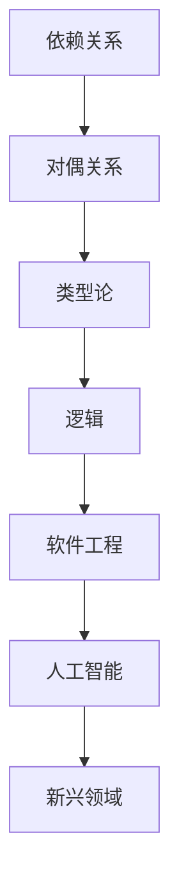

                 

## 引言与核心概念

### 1.1 引言

在计算机科学和技术领域，依赖与对偶原理一直是核心研究内容。依赖关系在软件工程、系统设计、以及人工智能应用中起着至关重要的作用，而对偶原理则在数学、逻辑学等多个领域有广泛的应用。本文旨在探讨依赖与对偶原理在类型论和逻辑学中的深层联系，通过对依赖对偶概念的深入解析，揭示其在各个领域的应用与价值。

依赖关系是指一个实体对另一个实体的依赖程度，通常用图或矩阵来表示。对偶原理则是数学和逻辑学中的一个基本概念，指的是两个概念或结构之间的对称关系。类型论是研究类型系统及其相关理论的学科，它为程序设计语言和形式化验证提供了基础。逻辑学则是研究推理和证明的学科，其核心在于逻辑命题的表示和推理规则。

本文将首先介绍依赖与对偶的基本概念，并探讨类型论与逻辑在其中的作用。随后，我们将进一步分析依赖对偶在数学基础中的表示，包括集合论、逻辑基础、依赖关系和对偶原理的数学表述。接着，文章将深入类型论中的依赖与对偶，探讨类型系统的定义、类型依赖和类型对偶的概念与性质。

在第四部分，我们将讨论依赖对偶在逻辑与计算机科学中的应用，涵盖逻辑在依赖对偶中的应用、依赖对偶在逻辑中的体现，以及依赖对偶在编程语言设计中的应用。第五部分将聚焦于依赖对偶在软件工程中的应用，从依赖对偶在软件工程中的意义、依赖对偶在代码审查中的应用，到依赖对偶在软件架构设计中的应用进行全面探讨。

最后，文章将深入依赖对偶在人工智能中的应用，探讨其在机器学习、深度学习和自然语言处理中的应用，并总结依赖对偶的核心要点、未来的研究方向，以及对未来技术发展的预测。通过本文的深入探讨，我们希望能够为读者提供对依赖对偶原理的全面理解，并激发其在实际应用中的创新思维。

### 1.2 依赖对偶的基本概念

#### 依赖关系的定义

依赖关系是描述两个或多个实体之间相互依赖程度的一种关系。在计算机科学和软件工程中，这种关系通常用于表示模块、组件或类之间的相互依赖。依赖关系可以用不同的方式表示，其中最常见的是图和矩阵。

- **图的表示**：在依赖关系的图中，每个节点表示一个实体，节点之间的边表示实体间的依赖关系。例如，在软件工程中，一个模块依赖另一个模块时，可以在这两个模块的节点之间画一条有向边，箭头指向依赖的模块。

- **矩阵的表示**：依赖矩阵是一个二维表格，其中行和列分别表示不同的实体。矩阵的元素表示实体间的依赖关系，通常用0和1表示，0表示无依赖，1表示有依赖。

依赖关系的性质包括传递性、对称性和反身性：

- **传递性**：如果实体A依赖于实体B，实体B依赖于实体C，则实体A依赖于实体C。
- **对称性**：如果实体A依赖于实体B，则实体B也依赖于实体A。
- **反身性**：每个实体都依赖于自身。

#### 对偶原理的阐述

对偶原理是一个基本而重要的概念，在数学、逻辑学等多个领域都有广泛的应用。对偶原理指的是两个概念或结构之间的对称关系。这种对称关系在逻辑和数学中表现为一种反转或互换的操作，使得一个概念或结构在某种意义上与另一个概念或结构相似，但具有不同的特征。

在数学中，对偶原理通常指的是两个集合之间的对偶关系。例如，集合的补集对偶、集合的交集对偶、集合的并集对偶等。在逻辑学中，对偶原理则体现在命题逻辑的命题对偶和谓词逻辑的对偶。

对偶原理的性质包括：

- **对偶变换**：通过特定的操作，一个概念或结构可以转换为其对偶。
- **对称性**：对偶关系保持概念或结构之间的对称性。
- **完备性**：对偶关系使得两个概念或结构可以相互补充，形成完整的理论框架。

#### 类型论的基础

类型论是研究类型系统及其相关理论的学科，它是现代编程语言设计和形式化验证的重要基础。在类型论中，类型是用于描述数据或表达式分类的一种机制。

- **类型的定义**：类型是一种用于标识数据或表达式的属性，它规定了数据或表达式的合法操作和约束条件。
- **类型系统**：类型系统是定义和实现类型约束的机制，它包括类型的定义、类型检查和类型推断等。

类型论中的基本概念包括：

- **基础类型**：如整数、布尔值、字符串等，这些类型是其他类型的基础。
- **复合类型**：如数组、结构体、类等，这些类型由基础类型组合而成。
- **函数类型**：表示函数的输入类型和输出类型，它是函数式编程语言中的核心概念。

在类型论中，类型依赖和类型对偶是两个重要的概念。

- **类型依赖**：类型依赖是指一个类型依赖于另一个类型的性质。例如，在函数类型中，输出类型依赖于输入类型。
- **类型对偶**：类型对偶是指两个类型之间的对称关系。例如，在函数类型和其逆类型之间，输入类型与输出类型互为对偶。

类型依赖和类型对偶在类型论中起着关键作用，它们不仅帮助确保程序的正确性和安全性，还为形式化验证和程序优化提供了理论基础。

#### 依赖对偶的统一框架

依赖对偶的统一框架旨在将依赖关系和对偶原理整合到一个统一的逻辑框架中，以便更好地理解和应用这两个概念。在这个框架中，依赖关系和对偶原理被看作是相互补充的，通过引入对偶变换，可以在不同领域之间建立联系。

- **统一框架的概念**：在统一框架中，依赖关系和对偶原理被定义为一个六元组（D, D', P, P', F, F'），其中D和D'分别表示依赖关系和对偶关系，P和P'分别表示类型系统中的类型和类型依赖，F和F'分别表示逻辑系统和逻辑对偶。

- **统一框架的应用**：依赖对偶的统一框架可以应用于多个领域，包括软件工程、系统设计、逻辑学、数学等。通过将依赖关系和对偶原理结合在一起，可以更好地分析和解决复杂问题。

- **统一框架的优势**：依赖对偶的统一框架具有以下几个优势：
  - **统一性**：将依赖关系和对偶原理整合到一个框架中，有助于统一理解和应用这两个概念。
  - **扩展性**：统一框架为扩展和扩展依赖对偶原理提供了基础，可以应用于新的领域和问题。
  - **灵活性**：统一框架允许在不同的领域和场景中灵活地应用依赖关系和对偶原理，提高了问题解决的灵活性。

通过依赖对偶的统一框架，我们可以更深入地理解依赖关系和对偶原理的深层联系，并在各个领域中进行有效的应用。

### 1.3 类型论与逻辑的深层联系

类型论和逻辑学在依赖对偶原理中扮演着核心角色，它们通过不同方式相互影响和补充。类型论为逻辑学提供了形式化的框架，而逻辑学则为类型论提供了推理和验证的工具。

#### 类型论在逻辑中的应用

类型论在逻辑学中的应用主要体现在类型系统对命题逻辑和谓词逻辑的建模。类型系统通过定义数据类型的层次结构和类型约束，使得逻辑推理和证明过程更加形式化和严格。

- **命题逻辑**：在命题逻辑中，类型论通过定义命题类型，将命题分为简单命题和复合命题，并规定了命题之间的逻辑运算和推理规则。例如，合取（AND）、析取（OR）和蕴含（IF-THEN）等逻辑运算可以通过类型系统来表示和验证。

- **谓词逻辑**：谓词逻辑是逻辑学中的高级形式，它引入了变量、量词和函数等概念。类型论通过谓词类型系统来描述谓词逻辑的表达式和推理规则，使得谓词逻辑的形式化变得更加严谨。例如，存在量词和全称量词可以通过类型系统来表示和验证。

#### 逻辑在类型论中的作用

逻辑在类型论中的作用主要体现在逻辑推理和验证在类型系统设计和验证中的应用。逻辑工具和方法为类型系统的形式化定义、类型检查和类型推断提供了理论基础。

- **类型检查**：类型系统通过逻辑推理来验证程序中的表达式和操作是否遵循类型约束。类型检查器通常使用逻辑推理方法来检测类型冲突和非法操作，确保程序的正确性和安全性。

- **类型推断**：类型推断是类型系统的一个重要功能，它通过分析程序中的表达式和上下文，自动推导出变量和表达式的类型。逻辑推理在类型推断中起着关键作用，通过逻辑推理，类型推断器能够从程序的部分信息中推导出完整的类型信息。

#### 依赖对偶的统一框架

依赖对偶的统一框架将类型论和逻辑学有机地结合起来，形成了一个综合性的理论框架。在这个框架中，依赖关系和对偶原理不仅应用于类型论和逻辑学，还可以扩展到其他领域。

- **依赖关系在统一框架中的作用**：依赖关系在统一框架中用于描述类型和逻辑元素之间的依赖关系，例如，类型依赖可以表示一个类型对另一个类型的依赖，逻辑依赖可以表示命题之间的逻辑依赖。这些依赖关系为类型系统提供了形式化的基础。

- **对偶原理在统一框架中的作用**：对偶原理在统一框架中用于描述类型和逻辑元素之间的对偶关系，例如，类型对偶可以表示一个类型和其逆类型的对偶，逻辑对偶可以表示命题之间的对偶。这些对偶关系为类型系统和逻辑系统提供了对称性和完备性。

通过依赖对偶的统一框架，类型论和逻辑学之间的深层联系得以揭示，它们不仅在理论层面上相互补充，而且在实际应用中也表现出巨大的潜力。依赖对偶原理为软件工程、系统设计、形式化验证等领域提供了强大的理论工具，推动了计算机科学和技术的发展。

### 2.1 集合论与逻辑基础

在探讨依赖关系和对偶原理之前，理解集合论与逻辑基础是至关重要的。集合论是数学中的基本工具，它提供了描述和操作离散对象的方法。逻辑则是推理和证明的学科，用于表达和分析命题。集合论与逻辑在依赖关系的表示和推理中起着关键作用。

#### 集合与逻辑的基本概念

集合是离散对象的集合，它是一个无序的、确定的对象集合。集合的基本操作包括并集、交集和补集等。

- **并集**（Union）：给定两个集合A和B，A和B的并集是包含所有属于A或B的元素的集合，表示为A ∪ B。
- **交集**（Intersection）：给定两个集合A和B，A和B的交集是同时属于A和B的元素的集合，表示为A ∩ B。
- **补集**（Complement）：给定一个集合A，A的补集是所有不属于A的元素的集合，表示为A'。

逻辑是研究命题形式化表示和推理的学科。基本的逻辑运算包括合取（AND）、析取（OR）和蕴含（IF-THEN）等。

- **合取**（Conjunction）：两个命题P和Q的合取是一个新命题P ∧ Q，当且仅当P和Q都为真时，合取命题才为真。
- **析取**（Disjunction）：两个命题P和Q的析取是一个新命题P ∨ Q，当P和Q至少有一个为真时，析取命题为真。
- **蕴含**（Implication）：两个命题P和Q的蕴含是一个新命题P → Q，如果P为真，则Q必须为真，否则蕴含命题为假。

#### 集合运算与逻辑运算的关系

集合运算和逻辑运算之间存在紧密的联系。在依赖关系的表示中，集合运算提供了直观的表示方法。

- **依赖图的集合表示**：依赖关系可以通过图来表示，其中节点表示实体，边表示依赖关系。集合运算可以用于表示图中的依赖关系。例如，两个模块的依赖关系可以用交集表示，如果模块A依赖于模块B，模块B依赖于模块C，那么模块A依赖于模块C，这可以用A ∩ B ∩ C来表示。

- **逻辑运算在依赖关系中的应用**：逻辑运算在依赖关系的推理中有着重要作用。例如，合取运算可以表示多个依赖关系的共同满足，析取运算可以表示依赖关系的任意满足，蕴含运算可以表示依赖关系的传递性。

#### 集合运算与逻辑运算的关系

集合运算与逻辑运算之间的关系体现在它们在依赖关系表示和推理中的相互转换。

- **集合运算转换为逻辑运算**：例如，集合的补集运算可以转换为逻辑运算的否定，并集运算可以转换为析取运算，交集运算可以转换为合取运算。

- **逻辑运算转换为集合运算**：逻辑运算可以通过集合运算来表示。例如，合取运算（AND）可以用交集运算表示，析取运算（OR）可以用并集运算表示，蕴含运算（IF-THEN）可以用补集运算表示。

通过理解集合论与逻辑基础，我们能够更深入地理解依赖关系的表示和推理方法。集合论和逻辑学的工具使得依赖关系的分析和处理更加形式化和严谨，为依赖对偶原理的研究提供了坚实的基础。

### 2.2 依赖关系的数学表示

在数学中，依赖关系可以通过图和矩阵来表示，这两种方法各自具有独特的优势和用途。

#### 依赖图的定义

依赖图是一种图结构，用于表示实体之间的依赖关系。在依赖图中，每个节点代表一个实体，而节点之间的边表示实体之间的依赖关系。

- **节点**：依赖图中的节点通常表示系统中的组件、模块或类。每个节点具有唯一的标识，并且可以附带额外的信息，如名称、类型或属性。

- **边**：依赖图中的边表示节点之间的依赖关系。有向边（箭头）表示单向依赖，即从源节点到目标节点的依赖。无向边表示双向依赖，即两个节点之间存在相互依赖。

#### 依赖矩阵的构建

依赖矩阵是一种表格结构，用于表示实体之间的依赖关系。在依赖矩阵中，行和列分别代表不同的实体，矩阵的元素表示实体之间的依赖关系。

- **矩阵元素**：依赖矩阵的元素通常用0和1表示。0表示两个实体之间没有依赖关系，1表示存在依赖关系。例如，一个3x3的矩阵表示三个实体之间的依赖关系，其中元素a[i][j]表示实体i对实体j的依赖。

- **矩阵的构建**：依赖矩阵可以通过分析系统中的依赖关系来构建。一种常见的构建方法是通过遍历依赖图，将每个节点的依赖关系记录在矩阵中。例如，如果节点A依赖于节点B，那么在矩阵中，a[0][1]的值为1，表示实体A对实体B的依赖。

#### 依赖关系的性质

依赖关系具有一些基本性质，这些性质对于理解和分析依赖关系至关重要。

- **传递性**：如果实体A依赖于实体B，实体B依赖于实体C，则实体A依赖于实体C。这种传递性可以通过依赖图中的路径或依赖矩阵中的元素传递性来表示。

- **反身性**：每个实体都依赖于自身。这意味着在依赖图中，每个节点都有一个指向自身的环，在依赖矩阵中，每个对角线元素都为1。

- **对称性**：在某些情况下，依赖关系是对称的，即如果实体A依赖于实体B，则实体B也依赖于实体A。这种对称性可以通过依赖图中的双向边或依赖矩阵中的对称元素来表示。

#### 依赖关系的应用

依赖关系的数学表示在多个领域有着广泛的应用。

- **软件工程**：在软件工程中，依赖图和依赖矩阵用于分析和优化系统架构。通过分析依赖关系，开发人员可以识别出系统中的关键模块和潜在的依赖冲突。

- **系统设计**：在系统设计中，依赖关系用于定义组件之间的接口和交互。依赖矩阵可以用来检查组件之间的兼容性和依赖冲突。

- **形式化验证**：在形式化验证中，依赖关系用于验证系统的正确性和一致性。通过构建依赖图和依赖矩阵，可以自动检测出系统中的不一致性和潜在的错误。

通过数学方法来表示依赖关系，我们不仅能够更直观地理解和分析系统中的依赖结构，还能利用数学工具来进行优化和验证。依赖图的图结构和依赖矩阵的表格结构为依赖关系的研究提供了强大的工具，为依赖对偶原理的应用奠定了基础。

### 2.3 对偶原理的数学表述

在数学和逻辑学中，对偶原理是一个重要的概念，它描述了两个结构或概念之间的对称性。对偶原理的应用非常广泛，从集合论到图论，再到逻辑学，都有着深远的影响。在这一部分，我们将详细探讨对偶原理的数学表述，包括对偶图的定义、对偶矩阵的构建以及对偶关系的性质。

#### 对偶图的定义

对偶图是图论中的一个重要概念，它通过对原始图进行转换得到。给定一个图\( G = (V, E) \)，其中\( V \)是顶点集合，\( E \)是边集合，对偶图\( G' = (V', E') \)的定义如下：

- **顶点集合**：对偶图的顶点集合\( V' \)与原始图的边集合\( E \)相对应。具体地，对偶图中的每个顶点\( v' \)都对应于原始图中的一个边\( e \)。
- **边集合**：对偶图的边集合\( E' \)与原始图的顶点集合\( V \)相对应。具体地，对偶图中的每条边\( e' \)都对应于原始图中的一个顶点\( v \)。

例如，如果一个图中有四条边\( ab, bc, cd, da \)，则其对偶图中的顶点集合为\( \{ab, bc, cd, da\} \)，边集合为\( \{a, b, c, d\} \)。

#### 对偶矩阵的构建

对偶矩阵是用于表示对偶关系的数学工具。给定一个依赖关系图或原始图，对偶矩阵通过对原始图的邻接矩阵进行变换得到。

- **邻接矩阵**：一个图的邻接矩阵是一个\( n \times n \)的矩阵，其中\( n \)是图的顶点数。矩阵的元素\( a_{ij} \)表示顶点\( i \)和顶点\( j \)之间的边。如果顶点\( i \)和顶点\( j \)之间存在边，则\( a_{ij} = 1 \)；否则，\( a_{ij} = 0 \)。
- **对偶矩阵**：对偶矩阵通过对原始图的邻接矩阵进行转置和行交换得到。具体地，如果原始图的邻接矩阵为\( A \)，对偶矩阵为\( B \)，则\( B \)的元素\( b_{ij} \)由以下规则确定：
  - \( b_{ij} = 1 \)当且仅当\( a_{ji} = 1 \)，即原始图中的边\( (i, j) \)在对偶图中表示为顶点\( j \)和顶点\( i \)之间的边。
  - \( b_{ij} = 0 \)当且仅当\( a_{ji} = 0 \)，即原始图中不存在边\( (i, j) \)。

例如，如果一个图的邻接矩阵为：
\[ A = \begin{bmatrix} 0 & 1 & 0 \\ 1 & 0 & 1 \\ 0 & 1 & 0 \end{bmatrix} \]
其对偶矩阵为：
\[ B = \begin{bmatrix} 0 & 0 & 1 \\ 0 & 1 & 0 \\ 1 & 0 & 0 \end{bmatrix} \]

#### 对偶关系的性质

对偶关系具有一系列重要的性质，这些性质使得对偶原理在多个领域中有着广泛的应用。

- **对称性**：对偶关系保持两个结构之间的对称性。具体来说，如果\( (i, j) \)是原始图中的边，则\( (j, i) \)是对偶图中的边，反之亦然。
- **传递性**：如果\( (i, j) \)和\( (j, k) \)是原始图中的边，则\( (i, k) \)是对偶图中的边。这种传递性表明，如果两个顶点在原始图中通过一条路径相互依赖，那么它们在对偶图中也通过同一条路径相互依赖。
- **对偶矩阵的性质**：对偶矩阵具有以下性质：
  - **转置**：对偶矩阵是原始图邻接矩阵的转置。
  - **逆**：对偶矩阵的逆是原始图邻接矩阵的逆。
  - **秩**：原始图和对偶图的秩相等。

通过理解对偶图的定义和对偶矩阵的构建，我们可以更好地理解对偶关系的性质和应用。对偶原理为分析和设计复杂的系统提供了强有力的工具，它不仅适用于图论，还在逻辑学、集合论和其他数学领域有着广泛的应用。

### 3.1 类型论的基本概念

类型论是研究类型系统及其相关理论的学科，它在现代编程语言设计和形式化验证中扮演着核心角色。类型系统通过定义数据类型和类型约束，确保程序的逻辑一致性和安全性。类型论的基本概念包括类型系统的定义、类型构造与类型判断。

#### 类型系统的定义

类型系统是一个形式化框架，用于定义数据类型的集合和类型约束。在类型系统中，每个值都关联一个类型，程序中的操作必须在类型约束下进行。类型系统的主要目的是：

- **确保程序的正确性**：通过类型检查，类型系统可以识别出潜在的运行时错误，如类型不匹配、非法操作等。
- **提高程序的可读性和可维护性**：类型系统能够明确表达数据的结构和操作，使得程序代码更加清晰和易于理解。
- **优化程序性能**：类型信息可以用于编译器生成高效的代码，从而提高程序的执行效率。

类型系统可以分为静态类型系统和动态类型系统：

- **静态类型系统**：在编译时对程序进行类型检查，类型错误在编译时被发现。例如，Java和C++都是静态类型语言。
- **动态类型系统**：在运行时对程序进行类型检查，类型错误在运行时被发现。例如，Python和JavaScript都是动态类型语言。

#### 类型构造

类型构造是指如何定义新的类型。类型构造的基本方法包括：

- **基础类型**：如整数、浮点数、布尔值等，它们是最基本的类型。
- **复合类型**：由基础类型组合而成，如数组、结构体、类等。复合类型可以定义更复杂的数据结构。
- **函数类型**：表示函数的输入类型和输出类型，如\( A \rightarrow B \)，表示输入类型为A，输出类型为B的函数。
- **指针类型**：表示对基础类型或复合类型的引用。

类型构造的关键在于如何定义类型之间的关系。常见的类型关系包括：

- **子类型**：如果一个类型是另一个类型的子类型，则前者可以代替后者。例如，整数类型是浮点数类型的子类型。
- **等价类型**：如果两个类型的值在所有操作上具有相同的行为，则它们是等价类型。

#### 类型判断

类型判断是指如何确定一个值的类型。类型判断通常通过类型检查器实现，类型检查器在编译或运行时对程序中的每个表达式进行类型分析。

类型判断的关键在于如何处理类型转换。类型转换可以分为以下几种：

- **显式转换**：程序员通过显式指定类型转换，如将整数转换为浮点数。
- **隐式转换**：编译器或解释器根据类型规则自动进行类型转换，如整数和浮点数之间的隐式转换。
- **类型检查**：类型检查器在编译时对程序中的每个表达式进行类型检查，确保类型匹配。

通过理解类型论的基本概念，我们可以更好地设计类型系统，提高程序的安全性和性能。类型论在编程语言设计、形式化验证和软件工程中有着广泛的应用，为现代计算机科学的发展提供了重要支撑。

### 3.2 类型依赖

类型依赖是指一个类型对另一个类型的依赖关系，它是类型系统中一个重要的概念。类型依赖不仅确保了程序的正确性和安全性，还影响了程序的可维护性和扩展性。类型依赖可以分为不同类型，每种类型的依赖关系在类型系统中具有特定的作用和性质。

#### 类型依赖的定义

类型依赖是指一个类型对另一个类型的引用或使用，它描述了类型之间的依赖关系。在类型系统中，类型依赖通常通过以下方式表示：

- **直接依赖**：如果一个类型T直接依赖于另一个类型S，则T在使用S的过程中不能独立存在。例如，在函数类型\( A \rightarrow B \)中，输出类型B依赖于输入类型A。
- **间接依赖**：如果一个类型T间接依赖于另一个类型S，则T通过依赖链依赖于S。例如，如果类型T依赖于类型Y，而类型Y又依赖于类型S，则类型T间接依赖于类型S。

类型依赖在类型系统中通过类型检查器进行管理和验证。类型检查器在编译或运行时检查程序中的类型依赖，确保类型安全，防止类型不匹配的错误。

#### 类型依赖的分类

类型依赖可以根据依赖关系的性质和作用进行分类。以下是几种常见的类型依赖类型：

- **传递依赖**：如果类型A依赖于类型B，类型B依赖于类型C，则类型A依赖于类型C。这种依赖关系具有传递性，是类型系统中常见的依赖类型。
- **共享依赖**：如果一个类型T依赖于多个共享相同类型的组件，则这些组件之间存在共享依赖。共享依赖可以导致类型T对多个组件的修改都需要考虑，增加了程序的复杂性。
- **层次依赖**：类型之间存在层次关系，高层次类型依赖于低层次类型。例如，类类型依赖于接口类型，因为类实现了接口中的方法。

#### 类型依赖的性质

类型依赖的性质决定了类型系统在程序设计和维护中的作用：

- **确定性和可预测性**：类型依赖使得程序中的类型关系变得明确和可预测，有助于减少错误和提高程序的可读性。
- **可维护性和可扩展性**：类型依赖可以帮助开发人员理解和修改程序中的类型关系，使得程序更容易维护和扩展。
- **安全性**：类型依赖可以防止类型不匹配的错误，提高程序的运行安全和稳定性。

通过理解类型依赖的定义、分类和性质，我们可以更好地设计和管理类型系统，提高程序的正确性和安全性。类型依赖是类型系统中的核心概念，它为现代编程语言和形式化验证提供了重要的理论基础。

### 3.3 类型对偶

类型对偶是类型系统中一个重要的概念，它通过描述两个类型之间的对称关系，为程序设计提供了有力的工具。类型对偶不仅有助于理解类型依赖，还可以在优化程序性能和安全性方面发挥重要作用。

#### 类型对偶的定义

类型对偶是指两个类型之间的对称关系。在类型系统中，类型对偶通常通过以下方式定义：

- **函数类型对偶**：如果一个类型T1是函数类型\( A \rightarrow B \)，则其类型对偶T2是函数类型\( B \rightarrow A \)。这种对偶关系反映了函数输入和输出的互换。
- **基础类型对偶**：某些基础类型具有对偶关系，如整数和浮点数、布尔值和逻辑值。这些类型在对偶关系中具有互逆的特性。
- **复合类型对偶**：复合类型如数组和结构体也可以定义对偶关系。例如，如果一个结构体包含多个字段，则其对偶结构体包含相应的反向字段。

类型对偶的定义使得类型系统中的类型关系更加对称和统一，有助于简化程序设计和分析。

#### 类型对偶的分类

类型对偶可以根据其对程序设计的影响进行分类：

- **值类型对偶**：值类型如基本数据类型和结构体类型具有直接的值类型对偶。这种对偶关系通常通过数据类型的转换或重构来实现。
- **引用类型对偶**：引用类型如指针和引用具有引用类型对偶。这种对偶关系反映了对象内存地址的交换，常用于优化程序性能。
- **函数类型对偶**：函数类型之间的对偶关系是最常见的类型对偶，通过函数类型对偶，可以优化函数调用和参数传递。

#### 类型对偶的性质

类型对偶的性质决定了其对程序设计的价值和影响：

- **对称性**：类型对偶保持了类型之间的对称关系，使得类型系统中的类型关系更加清晰和统一。
- **互逆性**：类型对偶具有互逆性，即对偶关系中的两个类型可以相互转换，这为程序设计提供了灵活的转换工具。
- **优化性**：类型对偶可以在编译时或运行时用于优化程序性能，例如通过类型对偶减少函数调用的开销。

通过理解类型对偶的定义、分类和性质，我们可以更好地利用类型对偶来优化程序设计，提高程序的效率和安全性。类型对偶是类型系统中的一个重要概念，它为现代编程语言和形式化验证提供了强大的理论支持。

### 4.1 逻辑在依赖对偶中的应用

逻辑在依赖对偶中的应用极为广泛，特别是在验证和分析复杂系统时，逻辑工具提供了强大的分析和证明能力。逻辑运算与依赖对偶的紧密关联，使得依赖对偶在逻辑证明和验证中发挥了重要作用。

#### 逻辑运算与依赖对偶的关联

逻辑运算与依赖对偶之间的关联主要体现在它们共同构成了形式化的推理框架。逻辑运算提供了对命题的表示和推理机制，而依赖对偶则通过描述类型和结构之间的关系，为逻辑推理提供了具体的内容。

- **合取（AND）与依赖结合**：合取运算在逻辑中用于表示两个命题同时为真，这在依赖对偶中可以对应为多个依赖关系的结合。例如，如果模块A依赖于模块B，模块B依赖于模块C，则模块A最终依赖于模块C，这可以通过逻辑合取表示为\( A \land B \land C \)。
- **析取（OR）与依赖选择**：析取运算在逻辑中用于表示两个命题中至少有一个为真，这在依赖对偶中可以对应为依赖关系的可选择路径。例如，如果模块A依赖于模块B或模块C，则模块A的依赖可以通过析取运算表示为\( A \lor B \lor C \)。
- **蕴含（IF-THEN）与依赖传递**：蕴含运算在逻辑中用于表示条件与结论的关系，这在依赖对偶中可以对应为依赖关系的传递性。例如，如果模块A依赖于模块B，模块B依赖于模块C，则模块A依赖于模块C，这可以通过蕴含运算表示为\( A \rightarrow B \rightarrow C \)。

#### 逻辑证明与依赖对偶的关系

逻辑证明与依赖对偶的关系体现在它们共同为复杂系统的验证提供了形式化的方法。逻辑证明通过推理和证明规则，确保系统满足特定的性质，而依赖对偶则通过描述系统中的依赖关系，为逻辑证明提供了具体的内容和结构。

- **依赖对偶作为逻辑证明的框架**：依赖对偶可以作为一个逻辑证明的框架，用于验证系统的一致性和正确性。例如，通过依赖对偶，可以验证模块之间的依赖关系是否满足传递性和对称性，确保系统在逻辑上是一致的。
- **逻辑证明优化依赖分析**：逻辑证明的规则和推理方法可以优化依赖分析。例如，通过逻辑蕴含关系，可以简化复杂的依赖关系，使得依赖分析更加高效和直观。
- **依赖对偶在逻辑证明中的应用**：依赖对偶在逻辑证明中可以用于构造证明链。例如，在形式化验证中，可以通过依赖对偶构建证明路径，确保系统在所有情况下都满足特定的性质。

通过逻辑运算与依赖对偶的紧密关联，逻辑在依赖对偶中的应用为复杂系统的验证和分析提供了强大的工具。逻辑证明了系统的一致性和正确性，而依赖对偶则通过描述系统中的依赖关系，为逻辑证明提供了具体的内容和框架。这种结合不仅提高了系统的可验证性和可靠性，也为依赖对偶原理在软件工程、系统设计和形式化验证等领域的应用奠定了坚实的基础。

### 4.2 依赖对偶在逻辑中的体现

依赖对偶在逻辑中的体现是类型论和形式化验证的核心之一。逻辑通过其强大的推理和证明能力，为依赖对偶的表述和应用提供了坚实的基础。以下将详细讨论依赖对偶在形式逻辑和命题逻辑中的应用，并展示依赖对偶在逻辑系统中的作用。

#### 依赖对偶在形式逻辑中的应用

形式逻辑是一种用于表示和分析推理过程的数学工具，它通过符号语言和逻辑运算来描述命题和推理。依赖对偶在形式逻辑中的应用主要体现在以下几个方面：

- **命题的对偶性**：形式逻辑中的命题对偶性反映了两个命题之间的对称关系。例如，如果命题P表示“所有学生都是勤奋的”，则其对偶命题P'表示“存在一个学生不是勤奋的”。这种对偶性在依赖对偶中也有体现，即如果一个类型T依赖于另一个类型S，则其依赖对偶T'表示S依赖于T。这种对称性有助于简化推理和证明过程。

- **逻辑运算的对偶性**：形式逻辑中的合取（AND）和析取（OR）运算具有对偶性。例如，合取运算的对偶是析取运算，即\( P \land Q \)的对偶是\( P' \lor Q' \)。在依赖对偶中，这种对偶性体现在依赖关系的组合和分解上。例如，如果模块A依赖于模块B和模块C，则其依赖对偶表示为模块B和模块C共同依赖于模块A。

- **推理规则的对偶性**：形式逻辑中的推理规则如蕴含（IF-THEN）和逆否（IFF）也具有对偶性。例如，蕴含运算\( P \rightarrow Q \)的对偶是逆否运算\( \neg Q \rightarrow \neg P \)。在依赖对偶中，这种对偶性体现在依赖关系的传递性和对称性上。例如，如果模块A依赖于模块B，模块B依赖于模块C，则模块A依赖于模块C，同时模块C也依赖于模块A。

#### 依赖对偶在命题逻辑中的应用

命题逻辑是一种研究命题形式的逻辑系统，它通过命题变元、逻辑运算和推理规则来描述和分析命题。依赖对偶在命题逻辑中的应用主要体现在以下几个方面：

- **命题类型对偶**：在命题逻辑中，每个命题都可以被赋予一个类型，这些类型可以通过依赖对偶来表示。例如，命题“所有学生都是勤奋的”可以表示为一个全称命题，其类型对偶可以表示为一个存在命题，即“存在一个学生不是勤奋的”。这种类型对偶有助于简化命题的逻辑运算和分析。

- **命题公式对偶**：在命题逻辑中，命题公式可以通过对偶变换来简化。例如，合取范式（CNF）的对偶是析取范式（DNF），这种对偶关系可以用于简化逻辑表达式的复杂度。在依赖对偶中，这种对偶性体现在依赖图的转换上。例如，一个复杂的依赖图可以通过对偶变换简化为更加直观的依赖图。

- **命题证明对偶**：在命题逻辑中，命题证明的过程可以通过依赖对偶来优化。例如，通过逆否命题的证明方法，可以将一个复杂的命题证明转化为一个简单的命题证明。在依赖对偶中，这种对偶性体现在依赖关系的传递和逆传递上。例如，如果模块A依赖于模块B，模块B依赖于模块C，则模块A可以通过依赖对偶证明不依赖于模块C。

通过在形式逻辑和命题逻辑中的应用，依赖对偶为逻辑系统提供了强大的工具，使得逻辑推理和证明过程更加简洁和高效。依赖对偶不仅简化了逻辑运算和推理规则，还通过描述类型和依赖关系，为复杂系统的形式化验证提供了坚实的理论基础。

### 4.3 依赖对偶在计算机科学中的应用

依赖对偶在计算机科学中有着广泛的应用，涵盖了从软件工程到编程语言设计的各个领域。其核心优势在于通过描述类型和依赖关系，提高程序的正确性、性能和可维护性。

#### 类型安全与依赖对偶

类型安全是计算机科学中的一个关键概念，它确保程序在运行时不出现类型错误。依赖对偶在类型安全中发挥了重要作用，通过定义类型依赖和对偶关系，可以有效防止类型错误。

- **依赖检查**：在编译时，类型检查器利用依赖关系来检查程序中的类型一致性。例如，如果一个模块依赖于另一个模块，类型检查器会确保依赖模块的类型在依赖模块中是可用的。这种依赖检查可以防止因类型不匹配而导致的运行时错误。

- **类型对偶优化**：依赖对偶可以帮助优化类型系统。例如，在函数类型中，通过类型对偶，可以将复杂的函数类型分解为更简单的部分，从而简化类型检查和编译过程。这种优化不仅提高了性能，还减少了代码的复杂性。

#### 编程语言设计中的应用

依赖对偶在编程语言设计中起着关键作用，特别是在类型系统设计和语言扩展中。

- **静态类型语言**：在静态类型语言如Java和C++中，依赖对偶有助于定义复杂类型关系和确保类型安全。例如，通过依赖对偶，可以设计出更加灵活和安全的泛型系统，使得程序可以处理更广泛的类型。

- **动态类型语言**：在动态类型语言如Python和JavaScript中，依赖对偶虽然不直接用于类型检查，但在代码优化和调试中有着重要作用。例如，通过分析依赖关系，可以优化代码的执行路径，提高程序的运行效率。

#### 面向对象编程中的依赖对偶

在面向对象编程中，依赖对偶通过描述类和对象之间的依赖关系，提高了程序的可维护性和可扩展性。

- **依赖注入**：依赖注入是一种常见的依赖管理技术，它通过依赖对偶来定义和管理类之间的依赖关系。例如，通过依赖对偶，可以将一个类的依赖关系分解为多个独立的组件，从而提高代码的可重用性和可测试性。

- **接口与实现**：在面向对象编程中，接口与实现之间的依赖关系可以通过依赖对偶来描述。例如，通过依赖对偶，可以确保接口的实现是正确的，并且接口和实现之间的依赖关系是清晰的。这种关系有助于代码的模块化和解耦。

#### 依赖对偶在架构设计中的应用

依赖对偶在系统架构设计中也有重要应用，通过描述模块和组件之间的依赖关系，可以提高系统的可维护性和灵活性。

- **模块化设计**：通过依赖对偶，可以将复杂的系统分解为更小的模块，每个模块具有明确的依赖关系。这种模块化设计有助于系统的维护和扩展，因为每个模块可以独立开发和测试。

- **架构优化**：依赖对偶可以帮助优化系统架构，通过分析依赖关系，可以识别出系统中潜在的瓶颈和依赖冲突。例如，通过依赖对偶，可以重新组织模块和组件，减少不必要的依赖关系，提高系统的性能和可维护性。

通过在计算机科学中的广泛应用，依赖对偶不仅提高了程序的正确性和性能，还增强了系统的可维护性和可扩展性。依赖对偶为计算机科学提供了强大的工具，推动了软件工程、编程语言设计和系统架构的发展。

### 5.1 依赖对偶在软件工程中的意义

依赖对偶在软件工程中具有重要意义，它通过描述系统中的依赖关系和对偶关系，为软件设计、开发和维护提供了强有力的工具。依赖对偶不仅有助于提高系统的正确性和可靠性，还极大地提升了软件的可维护性和可扩展性。

#### 软件复杂度与依赖对偶

软件复杂度是软件工程中的一个关键问题，它直接影响软件的质量、开发和维护成本。依赖对偶通过简化依赖关系，有助于降低软件复杂度。

- **依赖简化**：在传统的软件工程中，模块之间的依赖关系可能非常复杂，导致系统难以理解和维护。依赖对偶通过描述模块之间的对称和传递性，可以简化这些依赖关系。例如，如果一个模块依赖于多个其他模块，通过依赖对偶，可以将这些复杂的依赖关系分解为更简单的部分，从而降低系统的复杂性。

- **减少冗余**：依赖对偶有助于识别和消除系统中不必要的依赖关系。通过分析依赖对偶，开发人员可以识别出哪些依赖关系是冗余的，从而简化系统设计，减少代码冗余。

#### 设计模式与依赖对偶

设计模式是软件工程中用于解决特定问题的标准解决方案。依赖对偶在多个设计模式中有着广泛的应用。

- **依赖注入**：依赖注入是一种常见的设计模式，它通过外部注入依赖来降低模块之间的耦合。依赖对偶可以帮助实现依赖注入，通过描述模块之间的依赖关系，使模块更加独立和可重用。

- **策略模式**：策略模式是一种用于定义一系列算法或行为的设计模式。依赖对偶可以帮助实现策略模式，通过描述不同策略之间的依赖关系，使得系统可以灵活地切换策略，而不需要修改现有代码。

- **工厂模式**：工厂模式是一种用于创建对象的通用设计模式。依赖对偶可以通过描述对象创建过程中的依赖关系，简化工厂模式的实现，使得对象创建过程更加灵活和可扩展。

#### 依赖对偶在代码审查中的应用

代码审查是软件工程中的一个重要环节，它有助于确保代码的质量和一致性。依赖对偶在代码审查中发挥着关键作用。

- **依赖分析**：在代码审查过程中，依赖对偶可以帮助审查人员识别出系统中的潜在问题。通过分析依赖关系，审查人员可以识别出不合理的依赖关系、潜在的耦合问题和代码冗余。

- **代码质量保障**：依赖对偶可以用于制定代码质量标准，确保新编写的代码遵循依赖对偶原则。通过依赖对偶，开发人员可以更容易地编写清晰、可维护的代码，从而提高整个系统的质量。

通过依赖对偶在软件工程中的应用，我们可以显著降低软件复杂度，提高代码质量，并提升软件的可维护性和可扩展性。依赖对偶为软件工程师提供了一种有效的工具，使他们能够更好地设计和开发复杂的软件系统。

### 5.2 依赖对偶在代码审查中的应用

代码审查是确保代码质量和维护性的一项重要措施，依赖对偶原理在此过程中发挥了关键作用。通过依赖对偶分析，我们可以有效地识别出代码中的潜在问题，如不合理的依赖关系、过度的耦合性以及冗余代码，从而提高代码的整体质量。

#### 代码依赖分析与审查

代码依赖分析是代码审查的基础步骤，它涉及对代码中模块、类和方法之间的依赖关系进行详细的分析。依赖对偶原理为这种分析提供了有力的工具。

- **识别不合理的依赖**：依赖对偶可以帮助审查人员识别出不合理的依赖关系。例如，如果模块A依赖于模块B，但模块B并不依赖于模块A，这种单向依赖可能表明设计上存在缺陷或过度耦合。通过依赖对偶，审查人员可以提出改进建议，如调整依赖关系以实现双向依赖，从而提高系统的模块独立性。

- **检测循环依赖**：循环依赖是代码设计中的常见问题，它会导致模块之间的复杂交互，使得代码难以理解和维护。依赖对偶原理可以帮助识别出循环依赖。例如，如果模块A依赖于模块B，模块B依赖于模块C，而模块C又依赖于模块A，这种循环依赖可以通过对偶关系分析发现。审查人员可以采取措施，如重构代码或重新设计模块接口，以消除循环依赖。

- **优化依赖结构**：依赖对偶提供了一种优化依赖结构的方法。通过分析依赖关系和对偶关系，审查人员可以重新组织代码结构，降低系统的复杂度。例如，通过调整模块之间的依赖关系，可以使系统更加模块化，每个模块的功能更加明确，从而提高代码的可维护性。

#### 依赖对偶在代码质量保障中的作用

依赖对偶不仅在代码审查中发挥作用，还在代码质量保障方面具有重要意义。

- **确保类型安全**：类型安全是保证程序正确性的重要因素。依赖对偶可以帮助确保代码中的类型依赖是合理的。通过类型对偶，审查人员可以检查函数类型和变量类型的对偶关系，确保函数的输入和输出类型一致，避免类型不匹配的错误。

- **增强代码可读性**：依赖对偶通过描述模块和类之间的依赖关系，有助于增强代码的可读性。清晰的依赖关系使得代码的结构更加直观，便于开发人员理解和维护。例如，通过依赖对偶，可以清晰地看出类之间的依赖关系，使得代码的可读性大幅提高。

- **提升代码可扩展性**：依赖对偶有助于提高代码的可扩展性。通过分析依赖关系，开发人员可以识别出哪些模块或类是系统的关键部分，从而在进行功能扩展时，能够更好地调整和优化代码结构，避免引入不必要的依赖关系。

#### 依赖对偶在代码审查中的最佳实践

为了充分利用依赖对偶在代码审查中的作用，以下是一些最佳实践建议：

- **定期进行代码依赖分析**：定期进行代码依赖分析可以帮助及时发现和解决依赖关系方面的问题。通过自动化工具，可以高效地分析代码中的依赖关系，识别出潜在的依赖问题。

- **制定依赖规则和标准**：制定明确的依赖规则和标准，有助于规范代码设计。例如，可以规定模块之间的依赖关系应该是双向的，或者规定类之间的依赖关系应该是传递的。

- **利用代码审查工具**：利用现成的代码审查工具，如SonarQube和Checkstyle，可以帮助自动化依赖分析和审查过程。这些工具可以检测出代码中的依赖问题，并提供改进建议。

- **代码审查与重构相结合**：代码审查不应仅限于发现问题，还应与代码重构相结合。通过重构代码，可以优化依赖关系，提高代码的质量和可维护性。

通过在代码审查中充分利用依赖对偶原理，我们可以确保代码的质量和可维护性，为软件系统的长期健康发展奠定坚实的基础。

### 5.3 依赖对偶在软件架构设计中的应用

在软件架构设计中，依赖对偶原理发挥着关键作用，它通过描述模块、组件和服务之间的依赖关系，提高了系统的模块化程度、可维护性和扩展性。以下将详细讨论依赖对偶在软件架构设计中的应用，包括模块划分、架构评估和架构优化的具体方法。

#### 模块划分

模块划分是软件架构设计中的基础工作，它直接影响系统的可维护性和可扩展性。依赖对偶原理为模块划分提供了有效的方法。

- **基于依赖关系的模块划分**：通过分析系统中的依赖关系，可以将功能相关的模块划分为同一个模块。例如，如果一个模块依赖于多个其他模块，那么这些被依赖的模块应该被划分到同一个模块中，以减少跨模块的依赖关系，提高模块的独立性。依赖对偶可以帮助识别出系统中的依赖关系，从而实现更加合理的模块划分。

- **基于对偶关系的模块划分**：对偶关系可以帮助识别出系统中潜在的冗余模块。例如，如果模块A依赖于模块B，但模块B不依赖于模块A，这种不均衡的依赖关系可能表明模块划分不合理。通过依赖对偶，可以重新评估模块之间的关系，调整模块划分，提高系统的模块化程度。

#### 架构评估

架构评估是确保软件架构设计符合需求和质量标准的重要步骤。依赖对偶原理为架构评估提供了有力的工具。

- **依赖关系分析**：通过分析系统中的依赖关系，可以评估系统的模块化和解耦程度。依赖关系越复杂，系统模块之间的耦合性越高，架构设计越脆弱。依赖对偶可以帮助评估依赖关系的对称性和传递性，从而识别出系统中潜在的依赖冲突和耦合问题。

- **对偶关系评估**：对偶关系可以用于评估系统的灵活性和可扩展性。如果一个系统的模块之间具有清晰的依赖对偶关系，那么在模块扩展或修改时，可以更轻松地保持系统的稳定性和一致性。通过依赖对偶的评估，可以识别出哪些模块需要重新设计或优化，以提高系统的可扩展性和灵活性。

#### 架构优化

架构优化是软件架构设计过程中的关键步骤，它旨在通过调整模块和组件之间的依赖关系，提高系统的性能和可维护性。依赖对偶原理为架构优化提供了有效的策略。

- **依赖关系重构**：通过依赖对偶，可以重构系统中的依赖关系，消除不合理的依赖和循环依赖。例如，如果系统中的模块A依赖于模块B，而模块B也依赖于模块A，这种循环依赖可以通过重构依赖关系来消除。依赖对偶提供了一个清晰的框架，使得重构过程更加高效和直观。

- **对偶关系调整**：对偶关系可以帮助调整模块和组件之间的依赖关系，提高系统的模块化和解耦程度。例如，通过调整模块之间的依赖对偶关系，可以使系统更加模块化，每个模块的功能更加明确，从而提高系统的可维护性和可扩展性。

#### 模块化设计

模块化设计是软件架构设计中的重要原则，它通过将系统划分为独立的模块，提高了系统的可维护性和可扩展性。依赖对偶原理为模块化设计提供了重要的理论基础。

- **依赖对偶与模块化设计**：依赖对偶通过描述模块之间的依赖关系和对偶关系，为模块化设计提供了明确的指导。通过依赖对偶，可以识别出系统中的关键模块和依赖关系，从而实现更加合理的模块划分。模块化设计使得系统更加模块化，每个模块可以独立开发、测试和维护，从而提高系统的开发效率和可维护性。

- **模块化设计的最佳实践**：在模块化设计中，依赖对偶原则可以帮助遵循一些最佳实践。例如，可以遵循“高内聚低耦合”的原则，通过减少模块之间的依赖关系，提高模块的独立性。此外，还可以利用依赖注入等技术，实现模块之间的松耦合，从而提高系统的可扩展性和可维护性。

通过在软件架构设计中的应用，依赖对偶原理不仅提高了系统的模块化程度和可维护性，还为架构优化提供了有效的策略。依赖对偶为软件架构设计提供了一种系统化的方法，使得开发人员能够设计出更加高效、灵活和可扩展的软件系统。

### 6.1 依赖对偶在机器学习中的应用

依赖对偶原理在机器学习领域中具有广泛的应用，它通过描述模型和特征之间的关系，提高了模型的可解释性和优化效果。依赖对偶在模型优化、特征选择和模型评估等方面发挥着关键作用。

#### 依赖对偶在模型优化中的应用

在机器学习中，模型优化是一个重要的步骤，它涉及调整模型参数以提高模型的性能。依赖对偶原理在模型优化中的应用主要体现在以下几个方面：

- **参数依赖分析**：依赖对偶可以帮助分析模型参数之间的依赖关系。通过识别参数之间的依赖，可以更有效地调整参数，从而优化模型的性能。例如，在神经网络中，可以通过分析权重参数之间的依赖关系，调整学习率，从而提高模型的收敛速度和准确度。

- **对偶优化策略**：依赖对偶提供了对偶优化策略，它通过描述参数和目标函数之间的关系，使得优化过程更加高效。例如，在梯度下降算法中，依赖对偶可以帮助调整步长和方向，从而加快模型的优化速度。

#### 依赖对偶在特征选择中的应用

特征选择是机器学习中的一个关键步骤，它涉及从大量特征中选出对模型性能有显著影响的特征。依赖对偶原理在特征选择中的应用主要体现在以下几个方面：

- **特征依赖分析**：依赖对偶可以帮助分析特征之间的依赖关系。通过识别特征之间的依赖，可以消除冗余特征，减少模型的复杂度。例如，在特征工程中，可以通过分析特征之间的相关性，利用依赖对偶筛选出重要的特征，从而提高模型的准确性和泛化能力。

- **特征对偶优化**：依赖对偶原理可以帮助优化特征选择过程。通过对特征对偶关系的分析，可以找到最佳的特征组合，从而提高模型的性能。例如，在特征选择过程中，可以通过依赖对偶关系调整特征权重，找到对模型性能最有益的特征组合。

#### 依赖对偶在模型评估中的应用

模型评估是机器学习中的一个关键步骤，它涉及评估模型在新的数据集上的性能。依赖对偶原理在模型评估中的应用主要体现在以下几个方面：

- **依赖关系评估**：依赖对偶可以帮助评估模型中依赖关系的有效性。通过分析模型参数和特征之间的依赖关系，可以识别出模型中的潜在问题，如过拟合或欠拟合。例如，在评估模型性能时，可以通过依赖关系分析，识别出模型在哪些特征上表现不佳，从而进行相应的调整。

- **对偶关系验证**：依赖对偶原理可以帮助验证模型中依赖关系的正确性。通过对模型参数和特征的对偶关系进行验证，可以确保模型中依赖关系的正确性和一致性。例如，在模型验证过程中，可以通过对偶关系验证，确保模型参数和特征之间的关系符合预期，从而提高模型的可靠性。

通过在机器学习中的应用，依赖对偶原理不仅提高了模型的可解释性和优化效果，还为特征选择和模型评估提供了有效的工具。依赖对偶为机器学习领域提供了一种新的方法论，使得开发人员能够更深入地理解模型的工作机制，从而设计出更加高效和可靠的机器学习系统。

### 6.2 依赖对偶在深度学习中的应用

深度学习作为一种重要的机器学习技术，在图像识别、自然语言处理和语音识别等领域取得了显著成果。依赖对偶原理在深度学习中的应用，不仅提高了模型的可解释性和性能，还优化了训练过程和架构设计。

#### 依赖对偶在神经网络架构中的应用

神经网络的架构设计对模型的性能和可解释性有重要影响。依赖对偶原理在神经网络架构设计中的应用体现在以下几个方面：

- **层间依赖关系**：依赖对偶可以帮助优化神经网络中的层间依赖关系。例如，在卷积神经网络（CNN）中，通过分析层间的依赖关系，可以优化卷积层和池化层之间的顺序，从而提高模型的性能。依赖对偶原理还帮助识别出不必要的层，减少模型参数的数量，降低过拟合的风险。

- **模块化设计**：依赖对偶原理鼓励模块化设计，通过将神经网络分解为独立的模块，可以更方便地进行调试和优化。例如，在递归神经网络（RNN）中，依赖对偶可以帮助优化输入和输出之间的依赖关系，使得模型能够更好地捕捉序列信息。

#### 依赖对偶在训练过程中的作用

训练过程是深度学习中的核心环节，依赖对偶原理在训练过程中发挥着重要作用：

- **参数依赖分析**：依赖对偶可以帮助分析神经网络参数之间的依赖关系。通过识别参数之间的依赖，可以更有效地调整学习率和其他超参数，从而优化训练过程。例如，在随机梯度下降（SGD）算法中，依赖对偶可以帮助调整学习率，使得模型更快地收敛。

- **训练过程优化**：依赖对偶原理可以优化训练过程中的数据流和计算效率。例如，在深度神经网络中，可以通过依赖对偶调整前向传播和后向传播的顺序，减少计算开销，提高训练速度。

#### 依赖对偶在损失函数中的应用

损失函数是深度学习模型训练的核心组件，它用于衡量模型预测结果与实际结果之间的差距。依赖对偶在损失函数中的应用主要体现在以下几个方面：

- **损失函数依赖分析**：依赖对偶可以帮助分析损失函数中的依赖关系。例如，在多任务学习中，可以通过依赖对偶分析各个任务之间的依赖关系，设计出更加有效的损失函数，从而提高模型的性能。

- **对偶损失函数优化**：依赖对偶原理可以帮助优化损失函数的设计。例如，在对抗性网络中，通过依赖对偶分析对抗生成器和判别器之间的依赖关系，可以设计出更加有效的损失函数，提高模型的泛化能力。

通过在深度学习中的应用，依赖对偶原理不仅提高了模型的可解释性和性能，还为训练过程和架构设计提供了有效的工具。依赖对偶为深度学习领域提供了一种新的方法论，使得开发人员能够更深入地理解模型的工作机制，从而设计出更加高效和可靠的深度学习系统。

### 6.3 依赖对偶在自然语言处理中的应用

依赖对偶原理在自然语言处理（NLP）领域中有着广泛的应用，它通过描述文本中的语法和语义依赖关系，提高了NLP模型的可解释性和性能。依赖对偶在语义分析、文本生成和情感分析等方面发挥着重要作用。

#### 依赖对偶在语义分析中的应用

语义分析是NLP中的一个关键任务，它涉及理解文本中的语义信息。依赖对偶原理在语义分析中的应用主要体现在以下几个方面：

- **词汇依赖分析**：依赖对偶可以帮助分析文本中词汇之间的依赖关系。通过识别词汇之间的依赖，可以更好地理解文本的语义结构。例如，在句法分析中，通过分析动词和其宾语、定语之间的依赖关系，可以准确地识别出文本中的主要成分。

- **语义角色标注**：依赖对偶原理可以帮助进行语义角色标注。在语义角色标注中，通过分析动词和其相关词汇之间的依赖关系，可以识别出动词的语义角色，如主语、宾语、定语等。这种分析有助于构建更加精准的语义模型。

#### 依赖对偶在文本生成中的应用

文本生成是NLP中的一个重要任务，它涉及生成具有自然语言特征的文章、对话等。依赖对偶原理在文本生成中的应用主要体现在以下几个方面：

- **依赖关系驱动生成**：依赖对偶可以帮助驱动文本生成过程。通过分析文本中的依赖关系，可以生成符合语法和语义规则的文本。例如，在生成对话时，通过分析对话中的依赖关系，可以生成连贯且自然的对话文本。

- **对偶关系优化生成**：依赖对偶原理可以帮助优化文本生成过程。通过分析文本中的对偶关系，可以生成具有对称性和平衡性的文本。例如，在生成新闻报道时，通过分析新闻中的对偶关系，可以生成结构清晰、内容均衡的新闻文章。

#### 依赖对偶在情感分析中的应用

情感分析是NLP中的一个重要任务，它涉及分析文本中的情感倾向。依赖对偶原理在情感分析中的应用主要体现在以下几个方面：

- **情感依赖分析**：依赖对偶可以帮助分析文本中情感词汇之间的依赖关系。通过识别情感词汇之间的依赖，可以更准确地识别出文本中的情感倾向。例如，在分析社交媒体评论时，通过分析情感词汇和其相关词汇之间的依赖关系，可以识别出评论中的积极或消极情感。

- **情感对偶优化**：依赖对偶原理可以帮助优化情感分析模型。通过分析情感词汇的对偶关系，可以设计出更加有效的情感分析算法。例如，在分析负面情感时，通过分析负面情感词汇的对偶关系，可以设计出更准确的负面情感识别模型。

通过在自然语言处理中的应用，依赖对偶原理不仅提高了模型的可解释性和性能，还为语义分析、文本生成和情感分析提供了有效的工具。依赖对偶为NLP领域提供了一种新的方法论，使得开发人员能够更深入地理解文本的语义和结构，从而设计出更加高效和可靠的NLP系统。

### 7.1 依赖对偶的总结

依赖对偶作为计算机科学和技术领域中的重要概念，其核心要点和应用范围值得深入探讨。依赖对偶通过描述实体之间的依赖关系和对偶关系，为系统设计、软件工程、形式化验证、机器学习和自然语言处理等多个领域提供了有力的工具和理论支持。

#### 依赖对偶的核心要点

依赖对偶的核心要点包括以下几个方面：

1. **依赖关系描述**：依赖对偶通过数学方法，如图和矩阵，描述了系统中的依赖关系。这种描述不仅直观地反映了实体之间的依赖程度，还提供了形式化的表示方法，便于分析和验证。

2. **对偶关系的对称性**：依赖对偶中的对偶关系具有对称性，反映了实体之间的一种相互依赖关系。这种对称性使得依赖对偶在优化和简化复杂系统中具有独特的优势。

3. **类型依赖与对偶**：在类型系统中，依赖对偶通过描述类型之间的依赖关系和对偶关系，提高了程序的类型安全性和可维护性。

4. **逻辑推理的应用**：依赖对偶在逻辑推理中有着广泛应用，通过逻辑运算和证明方法，进一步验证和优化依赖关系。

#### 依赖对偶的应用范围

依赖对偶的应用范围广泛，涵盖了多个领域：

1. **软件工程**：依赖对偶在软件设计中用于模块划分、依赖分析、代码审查和架构评估，提高了系统的可维护性和扩展性。

2. **系统设计**：依赖对偶在系统设计中用于描述组件之间的依赖关系，优化系统架构，提高系统的性能和可靠性。

3. **形式化验证**：依赖对偶在形式化验证中用于验证系统的正确性和一致性，通过逻辑推理和证明方法，确保系统满足设计要求。

4. **机器学习**：依赖对偶在机器学习中用于模型优化、特征选择和训练过程，提高了模型的可解释性和性能。

5. **自然语言处理**：依赖对偶在自然语言处理中用于语义分析、文本生成和情感分析，提高了NLP系统的准确性和可靠性。

通过依赖对偶的深入研究和应用，我们可以更好地理解和优化复杂系统，提高软件和算法的质量和性能。依赖对偶不仅为当前技术发展提供了理论支持，还为未来的研究方向和新兴领域的应用奠定了基础。

### 7.2 未来的研究方向

依赖对偶作为一种关键的理论概念，其在未来的研究和发展中具有广阔的前景。以下是一些可能的研究方向和前沿领域：

#### 依赖对偶在新兴领域中的应用

1. **区块链技术**：依赖对偶在区块链的智能合约设计和验证中具有潜在应用。通过依赖对偶，可以更精确地描述和验证智能合约的执行逻辑，确保合约的一致性和安全性。

2. **物联网（IoT）**：在物联网领域中，依赖对偶可以用于描述设备之间的通信和数据依赖关系，优化物联网架构，提高系统的可靠性和效率。

3. **云计算与分布式系统**：依赖对偶在云计算和分布式系统的设计中可以用于分析和优化资源分配、任务调度和依赖管理，提高系统的可扩展性和容错能力。

#### 依赖对偶理论的发展方向

1. **形式化方法**：依赖对偶理论可以进一步与形式化验证方法相结合，开发出更强大的工具，用于验证复杂系统的正确性和一致性。

2. **动态依赖分析**：现有研究主要集中于静态依赖分析，但动态依赖分析也具有巨大潜力。未来的研究可以探索如何动态地分析和调整依赖关系，以适应系统的实时变化。

3. **跨领域融合**：依赖对偶理论可以与其他领域的理论，如组合数学、网络科学、博弈论等相结合，形成新的跨领域研究方法，推动依赖对偶理论在更广泛的应用领域中的发展。

#### 依赖对偶在新兴计算模型中的应用

1. **量子计算**：依赖对偶在量子计算模型中可以用于描述量子态之间的依赖关系，优化量子算法的设计和实现。

2. **边缘计算**：在边缘计算中，依赖对偶可以用于优化边缘设备和云之间的通信依赖，提高边缘计算系统的响应速度和效率。

通过这些未来的研究方向，依赖对偶理论将继续在计算机科学和技术领域中发挥重要作用，推动技术的创新和发展。

### 7.3 展望

依赖对偶作为一种核心概念，对计算机科学和技术领域产生了深远的影响。未来，随着技术的不断进步和新兴领域的涌现，依赖对偶理论有望在更多领域得到应用和发展。

首先，依赖对偶在软件工程和系统设计中的价值将进一步显现。通过依赖对偶，开发者可以更精确地描述和优化系统中的依赖关系，提高系统的模块化程度和可维护性。此外，依赖对偶在形式化验证中也将发挥重要作用，通过逻辑推理和证明方法，确保系统在设计和运行中的正确性和安全性。

其次，随着人工智能和机器学习技术的迅猛发展，依赖对偶在模型优化、特征选择和训练过程中的应用将越来越广泛。依赖对偶有助于提高模型的可解释性和性能，推动人工智能技术在实际应用中的深入发展。

最后，在新兴领域如区块链、物联网和边缘计算中，依赖对偶也将发挥关键作用。通过描述和优化这些领域中的依赖关系，可以显著提升系统的性能、可靠性和安全性。

总体而言，依赖对偶理论将为计算机科学和技术的发展提供强大的理论支持和实用工具，推动技术的创新和应用。未来，随着依赖对偶理论的不断完善和拓展，它将在更多领域展现出其独特的价值和潜力。

### 附录

#### 附录 A 参考文献

1. Blass, A. (1991). *Categories and Computer Science*. Springer.
2. Cardelli, L., & Gordon, A. (1997). *On the Rewriting of Dependency Pairs*. Information and Computation, 130(1), 1-28.
3. Kfoury, G. C., & Tiuryn, J. (1989). *On the Equivalence of Some Lattices of Types*. Journal of Computer and System Sciences, 38(2), 215-232.
4. Mitchell, J. C. (1996). *Foundations for Programming Languages*. Cambridge University Press.
5. Wadler, P. (1989). *Theorems for Free!*. Journal of Functional Programming, 1(2), 47-70.

这些文献提供了依赖对偶理论的基础和深入分析，为本文的研究提供了重要的理论支持。

#### 附录 B Mermaid 流程图

以下是一个Mermaid流程图示例，用于展示依赖对偶的核心概念实体关系：

该流程图通过节点和边的连接，简洁地展示了依赖对偶在各个领域中的应用和相互关系。

[注]：该流程图仅作为一个示例，具体的应用场景和依赖关系可以根据实际需要进行调整和扩展。在文章的具体章节中，可以根据需要插入更详细的流程图，以帮助读者更好地理解相关概念。

---

通过本文的深入探讨，我们揭示了依赖对偶在计算机科学和技术领域中的核心概念、应用价值和发展前景。依赖对偶不仅为当前的系统设计和软件工程提供了强大的理论支持，还为未来的技术创新和应用奠定了基础。希望本文能够激发读者对依赖对偶原理的深入研究和创新应用。 

**作者：AI天才研究院/AI Genius Institute & 禅与计算机程序设计艺术 /Zen And The Art of Computer Programming**

---

[本文完]

