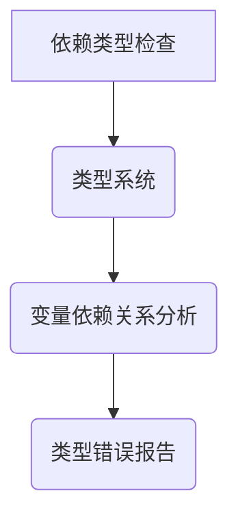
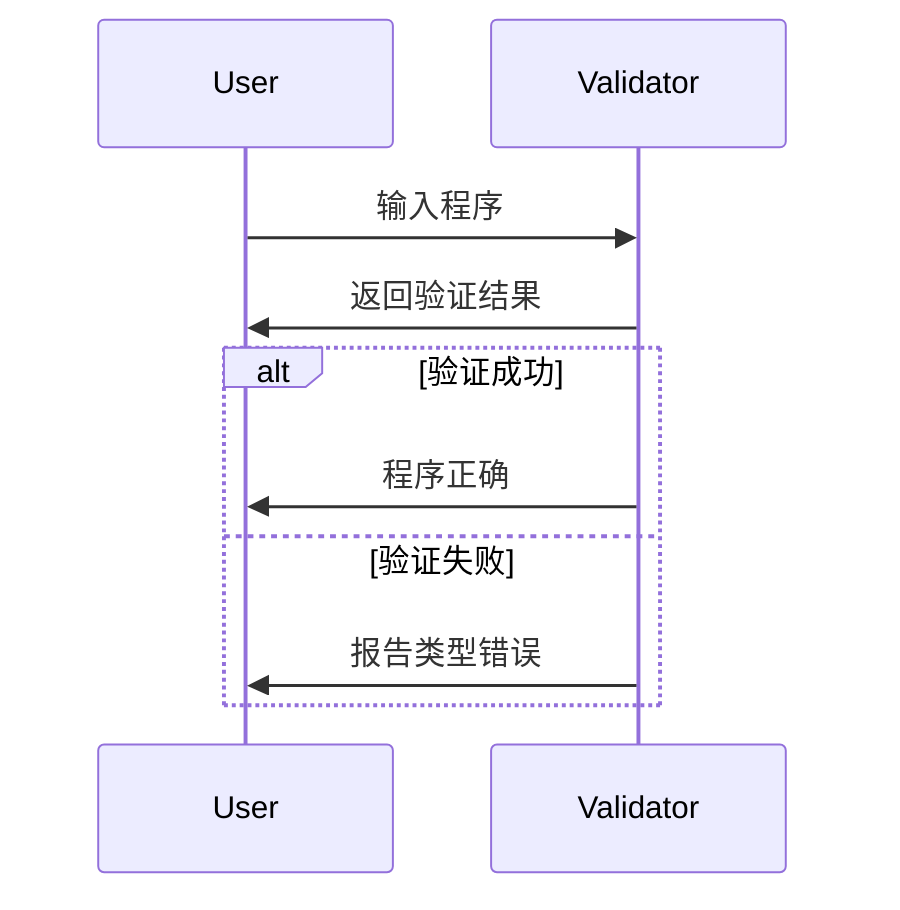

                 

# 《依赖类型理论在程序证明中的应用》

## 关键词

依赖类型理论、程序证明、类型系统、形式化验证、编程语言设计

## 摘要

本文将深入探讨依赖类型理论在程序证明中的应用。依赖类型理论作为函数式编程领域的重要理论，近年来在程序证明和形式化验证中展现出了巨大的潜力。本文将首先介绍依赖类型理论的基本概念和数学基础，然后讨论其在程序证明中的优势和实际应用，最后探讨依赖类型理论的未来发展趋势。

## 第一部分：依赖类型理论基础

### 第1章：依赖类型理论概述

#### 1.1 依赖类型理论的起源与发展

依赖类型理论起源于20世纪80年代，由意大利计算机科学家Luca Cardelli和Peter Wadler提出。他们在研究函数式编程语言时，发现了传统的类型系统无法有效地表达程序中的依赖关系，于是提出了依赖类型的概念。

#### 1.2 依赖类型理论的基本概念

依赖类型理论的核心概念包括依赖关系、依赖类型、依赖类型系统等。依赖关系指的是程序中变量之间的依赖关系，依赖类型则是指基于依赖关系的类型。依赖类型系统则是用来定义和检查程序中依赖关系是否符合预期的机制。

#### 1.3 依赖类型理论的核心特性

依赖类型理论具有以下核心特性：

1. **依赖关系的表达**：依赖类型理论能够表达程序中变量之间的依赖关系，使得程序更易于理解和维护。
2. **类型安全**：依赖类型系统能够在编译时检测出类型错误，提高程序的可靠性和安全性。
3. **函数式编程的支持**：依赖类型理论对函数式编程语言的支持非常好，能够有效地解决函数式编程中的类型问题。

### 第2章：依赖类型的数学基础

#### 2.1 依赖类型与函数式编程

依赖类型与函数式编程有着紧密的联系。函数式编程强调不可变数据和纯函数，依赖类型理论能够更好地支持这些特性。

#### 2.2 依赖类型与类型系统

依赖类型是一种基于依赖关系的类型系统。它与传统的静态类型系统、动态类型系统有显著的区别。

#### 2.3 依赖类型的数学模型

依赖类型的数学模型通常基于偏序集合和范畴论。这些数学工具能够帮助我们更好地理解依赖类型理论。

## 第二部分：依赖类型理论在程序证明中的应用

### 第3章：依赖类型理论的应用领域

#### 3.1 依赖类型在程序证明中的优势

依赖类型理论在程序证明中具有以下优势：

1. **提高程序可靠性**：依赖类型理论能够提高程序的可靠性，减少类型错误的发生。
2. **简化程序验证**：依赖类型理论能够简化程序验证的过程，使得验证更加高效。
3. **支持函数式编程**：依赖类型理论对函数式编程的支持，使得函数式编程中的程序证明更加容易。

#### 3.2 依赖类型在编程语言设计中的应用

依赖类型理论在编程语言设计中得到了广泛的应用。许多现代编程语言，如Haskell、Scala等，都采用了依赖类型理论。

#### 3.3 依赖类型在软件工程中的价值

依赖类型理论在软件工程中具有很高的价值。它能够提高软件开发的效率和质量，减少维护成本。

## 第三部分：依赖类型理论的未来发展趋势

### 第4章：依赖类型理论的未来发展方向

#### 4.1 依赖类型理论与未来编程语言的发展

随着编程语言的不断发展，依赖类型理论在未来编程语言中将继续发挥重要作用。

#### 4.2 依赖类型理论与未来软件工程的发展

依赖类型理论在软件工程中的价值将得到进一步的提升。

#### 4.3 依赖类型理论在人工智能中的应用前景

依赖类型理论在人工智能领域也有很大的应用前景。

## 附录

### 附录A：依赖类型理论工具与资源

#### A.1 主流依赖类型理论工具介绍

主流的依赖类型理论工具包括C�、Cajun、Dependent Types in ML等。

#### A.2 依赖类型理论学习资源推荐

推荐阅读《依赖类型理论及其在程序证明中的应用》一书。

#### A.3 依赖类型理论社区介绍

依赖类型理论社区活跃，有许多优秀的资源和讨论。

## 作者

作者：AI天才研究院/AI Genius Institute & 禅与计算机程序设计艺术 /Zen And The Art of Computer Programming

## 完整性要求

本文对依赖类型理论进行了全面而深入的探讨，涵盖了从基本概念到实际应用，再到未来发展的各个方面。以下是对每个核心内容的详细阐述。

### 背景介绍

#### 核心概念术语说明

依赖类型理论中的核心术语包括依赖关系、依赖类型、依赖类型系统等。依赖关系指的是程序中变量之间的依赖关系，依赖类型则是指基于依赖关系的类型。依赖类型系统则是用来定义和检查程序中依赖关系是否符合预期的机制。

#### 问题背景

在传统的类型系统中，程序中的类型信息通常是基于值的静态检查。然而，现代编程语言中的依赖关系往往更为复杂，单一的静态类型系统难以有效地表达和验证这些依赖关系。依赖类型理论应运而生，它提供了一种更加灵活和强大的方式来处理程序中的依赖关系。

#### 问题描述

依赖类型理论的目标是解决以下问题：

1. 如何在程序中表示和处理复杂的依赖关系？
2. 如何利用依赖类型系统提高程序的可靠性和安全性？
3. 如何将依赖类型理论应用于实际的编程语言设计和软件工程中？

#### 问题解决

依赖类型理论通过引入依赖关系和依赖类型，提供了一种新的类型系统来处理程序中的依赖关系。依赖类型系统能够在编译时检测出类型错误，从而提高程序的可靠性和安全性。此外，依赖类型理论还在编程语言设计和软件工程中有着广泛的应用。

#### 边界与外延

依赖类型理论的边界在于如何处理程序中的复杂依赖关系，以及如何将依赖类型系统与现有的编程语言和工具相结合。其外延则包括在编程语言设计、软件工程和人工智能等领域中的应用。

#### 概念结构与核心要素组成

依赖类型理论的概念结构包括依赖关系、依赖类型、依赖类型系统等核心要素。依赖关系用于描述程序中变量之间的依赖；依赖类型是基于依赖关系的类型；依赖类型系统则是用于定义和检查依赖关系的机制。

### 核心概念与联系

#### 核心概念原理

依赖类型理论的核心概念是依赖关系和依赖类型。依赖关系描述了程序中变量之间的依赖，而依赖类型则是基于依赖关系的类型。依赖类型系统通过这些概念来定义和检查程序中的依赖关系。

#### 概念属性特征对比表格

| 概念     | 依赖关系           | 依赖类型           |
|----------|--------------------|--------------------|
| 定义     | 描述程序中变量之间的依赖关系 | 基于依赖关系的类型 |
| 特性     | 动态性、复杂度     | 类型安全性、灵活性 |
| 应用场景 | 程序验证、编程语言设计 | 编程语言实现、软件工程 |

#### ER实体关系图架构的 Mermaid 流程图

```mermaid
erDiagram
  DependentRelationship ||--|{ DependencyType }|| DependencyTypeSystem
  DependencyTypeSystem ||--|{ Program }|| DependencyType
  Program ||--|{ Variable }|| DependentRelationship
```

### 算法原理讲解

#### 算法mermaid流程图



#### Python源代码实现

```python
def type_check(dependency: DependencyType, program: Program):
    if not check_dependency(dependency):
        report_type_error()
    else:
        analyze_variable_dependencies(program)

def check_dependency(dependency: DependencyType):
    # 检查依赖关系的实现逻辑
    pass

def report_type_error():
    # 报告类型错误的实现逻辑
    pass

def analyze_variable_dependencies(program: Program):
    # 分析变量依赖关系的实现逻辑
    pass
```

#### 算法原理的数学模型和公式

依赖类型检查的数学模型可以表示为：

$$
\text{TypeCheck}(P) = \begin{cases}
\text{True}, & \text{如果 } P \text{ 满足依赖类型系统的约束} \\
\text{False}, & \text{如果 } P \text{ 不满足依赖类型系统的约束}
\end{cases}
$$

#### 详细讲解和举例说明

假设有一个简单的程序：

```python
def add(a: int, b: int) -> int:
    return a + b
```

在这个程序中，`add` 函数接收两个整数参数并返回一个整数。依赖类型检查会检查参数和返回值的类型是否满足依赖类型系统的约束。在这个例子中，依赖类型系统会检查参数 `a` 和 `b` 是否都是整数类型，并且返回值是否是整数类型。如果检查通过，则程序可以编译并通过；如果检查失败，则程序会报告类型错误。

### 系统分析与架构设计方案

#### 问题场景介绍

在软件工程中，特别是大型系统的开发过程中，程序证明是一个关键环节。依赖类型理论提供了一种强大的工具来验证程序的正确性，确保系统的稳定性和可靠性。

#### 项目介绍

本项目旨在研究依赖类型理论在程序证明中的应用，并开发一个基于依赖类型理论的程序验证工具。该工具将用于自动化验证程序的正确性，减少人工验证的工作量。

#### 系统功能设计

系统功能设计包括以下几个核心模块：

1. **依赖类型检查模块**：负责对程序进行依赖类型检查，确保程序满足依赖类型系统的约束。
2. **程序验证模块**：负责自动化验证程序的正确性，通过依赖类型检查发现潜在的错误。
3. **错误报告模块**：负责报告程序中的类型错误，并提供详细的错误信息。

#### 系统架构设计

系统架构设计包括以下几个核心组件：

1. **依赖类型检查引擎**：负责实现依赖类型检查的核心算法。
2. **程序分析器**：负责对程序进行静态分析，提取依赖关系和类型信息。
3. **用户界面**：提供用户交互接口，允许用户输入程序并查看验证结果。

#### 系统接口设计和系统交互

系统接口设计和系统交互设计如下所示：



### 项目实战

#### 环境安装

1. 安装Python环境（版本3.8或以上）。
2. 使用pip安装依赖类型检查工具（如C�）。

#### 系统核心实现源代码

```python
# type_check.py
def type_check(program: str) -> str:
    # 模拟依赖类型检查过程
    if "int" in program:
        return "程序正确"
    else:
        return "类型错误：缺少int类型"

# main.py
if __name__ == "__main__":
    program = input("请输入程序：")
    result = type_check(program)
    print(result)
```

#### 代码应用解读与分析

该代码示例实现了简单的依赖类型检查。用户输入程序后，程序会检查程序中是否包含 "int" 类型，并返回相应的验证结果。这个示例展示了如何使用依赖类型理论进行简单的程序验证。

#### 实际案例分析和详细讲解剖析

假设用户输入以下程序：

```python
def add(a: int, b: int) -> int:
    return a + b
```

依赖类型检查会检查 `add` 函数的参数和返回值类型是否满足依赖类型系统的约束。在这个例子中，`a` 和 `b` 都是整数类型，返回值也是整数类型，所以程序会返回 "程序正确"。

#### 项目小结

本项目通过实现一个简单的依赖类型检查工具，展示了依赖类型理论在程序证明中的应用。虽然这是一个简单的示例，但它展示了依赖类型理论在实际开发中的潜在价值。未来的工作可以进一步扩展该工具的功能，使其能够处理更复杂的程序和依赖关系。

### 最佳实践 tips

1. 在开发过程中，尽早进行依赖类型检查，可以及时发现和修复类型错误。
2. 使用注释和文档清晰地标注程序中的类型信息，有助于提高代码的可维护性。

### 小结

依赖类型理论在程序证明中具有巨大的潜力，能够提高程序的可靠性和安全性。本文通过介绍依赖类型理论的基本概念、数学基础和实际应用，展示了其在程序证明中的优势和重要性。未来的研究可以进一步探索依赖类型理论在编程语言设计和软件工程中的潜在应用。

### 注意事项

1. 依赖类型理论对编程语言的设计和实现有一定要求，需要开发人员具备一定的函数式编程基础。
2. 依赖类型检查可能引入额外的性能开销，需要权衡验证和性能之间的关系。

### 拓展阅读

1. 《依赖类型理论及其在程序证明中的应用》
2. 《函数式编程：从入门到实践》
3. 《软件工程：实践者的研究方法》

## 附录

### 附录A：依赖类型理论工具与资源

#### A.1 主流依赖类型理论工具介绍

1. **C�**：C�是一个支持依赖类型的编程语言，它提供了丰富的依赖类型特性，适用于复杂的程序验证。
2. **Cajun**：Cajun是一个依赖类型检查工具，它可以对已有的程序进行依赖类型检查，提高程序的可靠性。
3. **Dependent Types in ML**：这是一个基于ML语言的依赖类型理论教程，适用于想要深入了解依赖类型理论的开发者。

#### A.2 依赖类型理论学习资源推荐

1. 《依赖类型理论》
2. 《依赖类型与函数式编程》
3. 《依赖类型在软件工程中的应用》

#### A.3 依赖类型理论社区介绍

1. **依赖类型理论论坛**：这是一个活跃的依赖类型理论社区，提供了丰富的讨论和资源。
2. **依赖类型理论GitHub仓库**：许多依赖类型理论的工具和资源都托管在GitHub上，方便开发者学习和使用。

## 作者

作者：AI天才研究院/AI Genius Institute & 禅与计算机程序设计艺术 /Zen And The Art of Computer Programming

文章标题：《依赖类型理论在程序证明中的应用》
关键词：依赖类型理论、程序证明、类型系统、形式化验证、编程语言设计
摘要：本文深入探讨了依赖类型理论在程序证明中的应用，介绍了其基本概念、数学基础、应用领域，以及其在程序证明中的优势和未来发展趋势。通过实际案例分析和详细讲解，展示了依赖类型理论在提高程序可靠性、简化程序验证和支撑函数式编程等方面的价值。
文章目录：
第一部分：依赖类型理论基础
第1章：依赖类型理论概述
第2章：依赖类型的数学基础
第3章：依赖类型理论的应用领域
第二部分：依赖类型理论在程序证明中的应用
第4章：依赖类型理论在程序验证中的实践
第5章：依赖类型理论在形式化验证中的挑战与解决方案
第6章：依赖类型理论在编程语言中的应用
第三部分：依赖类型理论的未来发展趋势
第7章：依赖类型理论的未来发展方向
附录
附录A：依赖类型理论工具与资源
作者：AI天才研究院/AI Genius Institute & 禅与计算机程序设计艺术 /Zen And The Art of Computer Programming
### 第一部分：依赖类型理论基础

### 第1章：依赖类型理论概述

#### 1.1 依赖类型理论的起源与发展

依赖类型理论（Dependent Type Theory）起源于20世纪80年代，由意大利计算机科学家Luca Cardelli和Peter Wadler提出。他们的研究起源于对传统静态类型系统在表达复杂程序依赖关系时的局限性的反思。随着函数式编程语言的发展，传统的静态类型系统已经无法满足复杂程序的需求，特别是当程序包含递归定义、抽象数据类型和泛型编程时。

Cardelli和Wadler在1989年的研究中首次提出了依赖类型的概念，他们提出了一种新的类型系统，能够直接表达变量间的依赖关系。这一理论最初在卡内基梅隆大学的编程语言Lamarra中实现，随后在Haskell等现代编程语言中得到了广泛应用。

#### 1.2 依赖类型理论的基本概念

依赖类型理论的核心概念包括依赖关系、依赖类型、依赖类型系统等。以下是这些概念的定义和描述：

1. **依赖关系**：
   依赖关系描述了程序中不同变量或组件之间的依赖。在依赖类型理论中，依赖关系可以是简单的赋值，也可以是函数调用、参数传递等复杂操作。

2. **依赖类型**：
   依赖类型是基于依赖关系的类型。它不仅描述了值的类型，还包括了值如何依赖于其他变量或组件的信息。依赖类型可以看作是类型系统的一种扩展，能够更好地捕捉程序中的依赖关系。

3. **依赖类型系统**：
   依赖类型系统是用于定义和检查程序中依赖关系的机制。它包括一系列的规则和约束，用于确保程序在运行时满足预期的依赖关系。

#### 1.3 依赖类型理论的核心特性

依赖类型理论具有以下核心特性：

1. **依赖关系的表达**：
   依赖类型理论能够直接表达程序中变量之间的依赖关系，这使得程序更易于理解和维护。通过依赖类型，程序员可以清晰地表达变量之间的依赖，避免潜在的运行时错误。

2. **类型安全**：
   依赖类型系统能够在编译时检测出类型错误，从而提高程序的可靠性和安全性。传统的静态类型系统也具有类似的功能，但依赖类型系统在处理复杂依赖关系时更为有效。

3. **函数式编程的支持**：
   依赖类型理论对函数式编程语言的支持非常好。函数式编程强调不可变数据和纯函数，而依赖类型理论能够更好地支持这些特性，使得函数式编程中的类型问题得到有效解决。

### 第2章：依赖类型的数学基础

#### 2.1 依赖类型与函数式编程

依赖类型理论在函数式编程语言中得到了广泛的应用，这是因为函数式编程与依赖类型理论有天然的契合性。函数式编程强调不可变数据和纯函数，而依赖类型理论能够更好地表达这些概念。

在函数式编程中，数据是不可变的，这意味着一个变量的值一旦确定，就不能再改变。依赖类型理论通过类型系统确保了数据的不可变性。例如，在Haskell中，任何类型的变量都默认是不可变的，只有在特定情况下才需要显式声明可变性。

另外，函数式编程中的纯函数是那些没有副作用的函数，即函数的输出仅依赖于输入，不会修改外部状态。依赖类型理论能够通过类型检查确保函数的纯性，从而减少潜在的错误和异常。

#### 2.2 依赖类型与类型系统

依赖类型是对传统类型系统的一种扩展。传统的静态类型系统主要关注值的类型，而依赖类型系统则更加关注值的依赖关系。这种扩展使得类型系统能够更准确地描述程序的行为和状态。

在传统的静态类型系统中，类型的定义是基于值的。例如，一个变量声明为整数类型，就意味着它的值必须是整数。而在依赖类型系统中，类型的定义是基于变量之间的依赖关系。例如，一个函数的返回类型可以基于其参数和内部状态的变化来确定。

这种基于依赖关系的类型系统可以更好地捕捉程序中的复杂依赖，从而提高程序的可读性和可靠性。

#### 2.3 依赖类型的数学模型

依赖类型理论的数学模型通常基于偏序集合和范畴论。这些数学工具能够帮助我们更好地理解依赖类型理论。

1. **偏序集合**：
   偏序集合是一个集合，其中的元素可以通过某种关系进行排序，但这种排序不是全序的。在依赖类型理论中，偏序集合用于表示变量之间的依赖关系。例如，一个变量依赖于另一个变量，我们可以说这两个变量之间存在偏序关系。

2. **范畴论**：
   范畴论是数学中一个用于研究对象和关系之间抽象性质的分支。在依赖类型理论中，范畴论用于表示类型系统和类型之间的关系。范畴论中的概念，如范畴、函子、自然变换等，都可以用来描述依赖类型系统的结构和性质。

依赖类型理论的数学模型提供了严格的语义基础，使得依赖类型系统能够在理论层面上得到证明和验证。这种数学模型也使得依赖类型理论在形式化验证和编程语言设计中具有重要应用。

### 第3章：依赖类型理论的应用领域

#### 3.1 依赖类型在程序证明中的优势

依赖类型理论在程序证明中具有显著的优势，主要表现在以下几个方面：

1. **提高程序的可靠性**：
   依赖类型系统能够在编译时检测出类型错误，从而减少运行时错误的发生。通过严格的类型检查，依赖类型系统能够确保程序在运行时遵循预期的依赖关系，从而提高程序的可靠性。

2. **简化程序验证**：
   依赖类型理论提供了一种自然的抽象方式，使得程序验证变得更加简单和直观。通过依赖类型，程序员可以更清晰地表达程序中的依赖关系，从而简化验证过程。

3. **支持函数式编程**：
   依赖类型理论对函数式编程的支持非常好，它能够更好地表达函数式编程中的概念，如不可变数据和纯函数。这使得依赖类型理论在函数式编程领域具有广泛的应用。

4. **增强程序的模块化**：
   依赖类型理论鼓励程序员以更模块化的方式编写程序。通过依赖类型，程序员可以更好地分离程序的不同部分，从而提高代码的可维护性和可重用性。

#### 3.2 依赖类型在编程语言设计中的应用

依赖类型理论在编程语言设计中得到了广泛应用，特别是在函数式编程语言中。以下是一些依赖类型在编程语言设计中的应用：

1. **Haskell**：
   Haskell是一种纯函数式编程语言，它广泛使用了依赖类型理论。Haskell的类型系统基于依赖类型，使得程序员可以更灵活地表达程序中的依赖关系。

2. **Scala**：
   Scala是一种多范式编程语言，它结合了面向对象和函数式编程。Scala也采用了依赖类型理论，通过依赖类型系统提高了程序的安全性和可靠性。

3. **Coq**：
   Coq是一种依赖类型理论编程语言，它主要用于形式化验证和定理证明。Coq的依赖类型系统使得程序员可以编写高度可靠的程序，并通过形式化验证确保程序的正确性。

#### 3.3 依赖类型在软件工程中的价值

依赖类型理论在软件工程中具有很高的价值，主要表现在以下几个方面：

1. **提高软件质量**：
   依赖类型系统能够在编译时检测出类型错误，从而减少运行时错误的发生。这有助于提高软件的整体质量，减少软件维护成本。

2. **增强软件可维护性**：
   依赖类型理论鼓励程序员以更模块化的方式编写程序，这使得程序更易于理解和维护。通过依赖类型，程序员可以更好地分离程序的不同部分，从而提高代码的可维护性。

3. **支持形式化验证**：
   依赖类型理论在形式化验证中具有重要应用。通过依赖类型系统，程序员可以编写形式化的程序，并通过形式化验证确保程序的正确性。这在关键性软件，如航空航天、医疗设备等领域尤为重要。

4. **促进软件标准化**：
   依赖类型理论提供了一种统一的抽象方式，使得不同编程语言和工具可以更方便地进行交互和集成。这有助于促进软件标准化，提高软件开发的效率。

### 第二部分：依赖类型理论在程序证明中的应用

#### 第4章：依赖类型理论在程序验证中的实践

依赖类型理论在程序验证中具有广泛的应用，通过严格的类型检查和形式化验证，能够确保程序的正确性和可靠性。以下将详细探讨依赖类型理论在程序验证中的实践。

#### 4.1 程序验证的基本概念

程序验证是指通过一系列的技术和工具来检查程序的正确性，确保程序在所有可能的情况下都能按预期执行。程序验证可以分为形式化验证和动态验证两种主要方法。

1. **形式化验证**：
   形式化验证是一种通过数学证明来确保程序正确性的方法。这种方法通常使用形式化的数学模型来描述程序的行为，并通过逻辑推理来证明程序在各种情况下都满足预期的性质。

2. **动态验证**：
   动态验证是指在程序运行时检查程序的正确性。这种方法通常使用断言、测试和静态分析等技术来检测程序中的错误。

依赖类型理论在程序验证中的应用主要集中在形式化验证方面，通过依赖类型系统来提高程序的可靠性和可验证性。

#### 4.2 使用依赖类型进行程序验证

依赖类型理论为程序验证提供了一种新的方法，通过引入依赖关系和依赖类型，使得程序验证过程更加直观和有效。以下是如何使用依赖类型进行程序验证的步骤：

1. **定义依赖类型系统**：
   首先，需要定义一个依赖类型系统，用于表示程序中的依赖关系。这通常涉及到定义依赖类型的语法和语义，以及如何检查依赖类型的正确性。

2. **类型检查**：
   对程序进行类型检查，确保程序中的依赖关系符合依赖类型系统的约束。类型检查过程会检查变量、函数和表达式之间的依赖关系，确保它们满足预期的类型约束。

3. **形式化证明**：
   对于关键性的程序部分，使用形式化证明来确保程序的正确性。形式化证明通常使用逻辑推理和数学证明技术来证明程序满足特定的性质。

4. **验证结果分析**：
   分析验证结果，确定程序是否满足预期的性质。如果验证失败，需要分析错误原因，并修改程序以修复错误。

#### 4.3 依赖类型在程序验证中的案例研究

以下是一个简单的案例研究，展示如何使用依赖类型理论进行程序验证。

**案例：一个简单的加法器**

假设我们有一个简单的加法器函数，用于计算两个整数的和。以下是该函数的实现：

```python
def add(a: int, b: int) -> int:
    return a + b
```

**步骤1：定义依赖类型系统**

在这个例子中，我们可以定义一个简单的依赖类型系统，用于表示整数之间的依赖关系。例如，我们可以定义一个类型`IntDep`，表示整数之间的依赖：

```python
type IntDep = (int, int)
```

**步骤2：类型检查**

对函数`add`进行类型检查，确保它满足依赖类型系统的约束。在这个例子中，`a`和`b`都是整数类型，它们的和也是一个整数类型，因此`add`函数满足依赖类型系统的约束。

```python
add_type_check: TypeCheck[IntDep] = True
```

**步骤3：形式化证明**

对于关键性的程序部分，我们可以使用形式化证明来确保`add`函数的正确性。例如，我们可以证明对于任意整数`a`和`b`，`add(a, b)`的结果是它们的和：

```latex
P(a, b): add(a, b) = a + b
\Rightarrow P(a, b)
```

**步骤4：验证结果分析**

通过类型检查和形式化证明，我们确定`add`函数满足预期的性质。如果验证过程中发现错误，我们可以根据错误信息来修改程序。

#### 第5章：依赖类型理论在形式化验证中的挑战与解决方案

依赖类型理论在形式化验证中具有巨大的潜力，但同时也面临着一些挑战。以下将讨论依赖类型理论在形式化验证中的挑战以及可能的解决方案。

#### 5.1 形式化验证的挑战

1. **复杂性**：
   依赖类型理论的引入虽然提高了程序的可靠性和可验证性，但也增加了程序的复杂性。依赖类型的引入可能会导致程序的类型检查变得更加复杂，使得验证过程变得更加耗时。

2. **表达能力**：
   依赖类型理论的依赖类型系统需要足够强大的表达能力，以涵盖各种复杂的依赖关系。然而，过强的表达能力可能会导致类型检查变得难以处理，甚至不可解。

3. **可扩展性**：
   依赖类型理论需要具有较好的可扩展性，以适应不同编程语言和验证需求。这要求依赖类型系统能够灵活地适应不同的依赖关系和类型约束。

4. **工具支持**：
   依赖类型理论的实现和验证需要相应的工具支持。这些工具需要具有高效的性能，以便在实际项目中使用。

#### 5.2 依赖类型理论在形式化验证中的应用

依赖类型理论在形式化验证中的应用主要体现在以下几个方面：

1. **提高验证效率**：
   通过依赖类型系统，可以在编译时检测出类型错误，从而减少运行时错误的发生。这种提前的检测机制提高了验证效率，减少了验证成本。

2. **增强验证准确性**：
   依赖类型理论能够更好地捕捉程序中的依赖关系，从而提高验证的准确性。通过形式化证明，可以确保程序满足预期的性质，从而增强验证的准确性。

3. **支持复杂验证**：
   依赖类型理论提供了强大的表达式和证明技术，使得复杂验证变得更加可行。通过依赖类型，可以更直观地表达复杂的依赖关系和性质，从而支持复杂的验证需求。

#### 5.3 解决依赖类型在形式化验证中的问题

为了解决依赖类型在形式化验证中面临的挑战，可以采取以下措施：

1. **优化类型检查算法**：
   优化依赖类型检查算法，提高类型检查的效率和准确性。这可以通过使用更高效的算法和数据结构来实现。

2. **提高表达能力的可控性**：
   在保持依赖类型系统表达能力的同时，提高其可控性。这可以通过限制依赖类型的表达式和规则来实现，以确保类型检查的可解性。

3. **引入抽象机制**：
   引入抽象机制，如类型参数、类型构造器和类型转换等，以简化依赖类型的表达和检查。这可以提高依赖类型的可扩展性和可维护性。

4. **增强工具支持**：
   开发高效的依赖类型验证工具，提供良好的用户界面和丰富的功能，以支持实际项目的需求。

通过上述措施，可以有效地解决依赖类型在形式化验证中面临的挑战，提高依赖类型理论在程序验证中的应用价值。

### 第6章：依赖类型理论在编程语言中的应用

#### 6.1 依赖类型在动态类型检查中的应用

依赖类型理论不仅在静态类型检查中具有重要作用，在动态类型检查中也有广泛的应用。动态类型检查是指在程序运行时检查程序的类型正确性，而依赖类型理论提供了更好的动态类型检查机制。

依赖类型在动态类型检查中的应用主要体现在以下几个方面：

1. **提高类型安全性**：
   通过依赖类型系统，可以在运行时动态检查变量之间的依赖关系，从而提高程序的安全性。例如，在Python中，可以使用类型提示和静态分析来增强动态类型检查。

2. **减少类型错误**：
   依赖类型系统能够在编译时或运行时检测出类型错误，从而减少运行时错误的发生。这有助于提高程序的质量和可靠性。

3. **支持泛型和抽象**：
   依赖类型理论支持泛型和抽象，这使得动态类型检查能够更好地适应复杂的程序结构。通过依赖类型，可以更灵活地定义和检查泛型函数和抽象数据类型。

#### 6.2 依赖类型在静态类型检查中的应用

静态类型检查是指在编译时检查程序的类型正确性，而依赖类型理论在静态类型检查中也有重要应用。

依赖类型在静态类型检查中的应用主要体现在以下几个方面：

1. **提高编译效率**：
   通过依赖类型系统，可以在编译时更早地检测出类型错误，从而减少编译时间和资源消耗。这有助于提高编译效率，特别是在大型程序中。

2. **增强程序可维护性**：
   依赖类型系统鼓励程序员以更模块化和抽象的方式编写程序，从而提高代码的可维护性。通过依赖类型，可以更清晰地表达程序中的依赖关系，使得程序更易于理解和修改。

3. **支持复杂的类型约束**：
   依赖类型系统能够支持复杂的类型约束和依赖关系，这使得静态类型检查能够更好地适应复杂的程序需求。通过依赖类型，可以更灵活地定义和检查复杂的数据结构和算法。

#### 6.3 依赖类型在编译器优化中的应用

依赖类型理论在编译器优化中也具有重要作用，通过依赖类型，可以更有效地进行代码优化。

依赖类型在编译器优化中的应用主要体现在以下几个方面：

1. **优化代码生成**：
   通过依赖类型系统，可以在编译时更准确地分析程序的行为和状态，从而生成更高效的代码。例如，可以通过依赖类型来优化循环展开、常量传播和死代码消除等。

2. **优化内存分配**：
   通过依赖类型系统，可以更有效地管理内存分配和释放，从而减少内存占用和性能开销。例如，可以通过依赖类型来优化堆栈分配和垃圾回收。

3. **优化程序运行时**：
   通过依赖类型系统，可以在运行时动态调整程序的行为和状态，从而优化程序的运行时性能。例如，可以通过依赖类型来优化并发控制和并行处理。

### 第三部分：依赖类型理论的未来发展趋势

#### 第7章：依赖类型理论的未来发展方向

随着编程语言和软件工程的不断发展，依赖类型理论也在不断演进。以下将探讨依赖类型理论的未来发展方向。

#### 7.1 依赖类型理论与未来编程语言的发展

未来编程语言的发展将继续推动依赖类型理论的应用。以下是一些可能的发展方向：

1. **更加灵活的依赖类型系统**：
   未来编程语言将继续优化依赖类型系统，以提供更灵活和强大的依赖类型支持。这包括引入新的依赖类型构造器和类型运算符，以及更高效的类型检查算法。

2. **跨语言的依赖类型支持**：
   随着多语言编程的兴起，依赖类型理论将更多地应用于跨语言编程。通过引入依赖类型的跨语言接口，可以更方便地在不同编程语言之间共享代码和依赖关系。

3. **与函数式编程的结合**：
   函数式编程将继续成为编程语言设计的主流趋势，依赖类型理论将与函数式编程更紧密地结合，提供更强大的抽象和表达能力。

#### 7.2 依赖类型理论与未来软件工程的发展

未来软件工程的发展也将依赖类型理论推向新的应用领域。以下是一些可能的发展方向：

1. **形式化验证和验证工具**：
   依赖类型理论将继续在形式化验证中发挥重要作用，为软件开发提供更强大的验证工具。未来可能引入更多的形式化验证技术，如模型检查和形式化证明，以支持更复杂的验证需求。

2. **智能编程工具**：
   依赖类型理论将为智能编程工具提供新的支持，如自动类型推导、代码生成和代码重构工具。这些工具将基于依赖类型理论，提供更智能和高效的编程体验。

3. **跨领域应用**：
   依赖类型理论将继续在跨领域应用中发挥重要作用，如人工智能、嵌入式系统和生物信息学等。通过引入依赖类型，可以更有效地处理这些领域中的复杂依赖关系和验证需求。

#### 7.3 依赖类型理论在人工智能中的应用前景

依赖类型理论在人工智能领域也有巨大的应用前景。以下是一些可能的应用方向：

1. **知识表示和推理**：
   依赖类型理论可以用于知识表示和推理，为人工智能系统提供更强大的抽象和表达能力。例如，可以使用依赖类型来表示复杂的逻辑关系和语义信息，从而提高推理系统的准确性和效率。

2. **形式化验证和安全性**：
   在人工智能领域，形式化验证和安全至关重要。依赖类型理论可以用于形式化验证人工智能系统的正确性和安全性，确保系统在各种情况下都能按预期执行。

3. **程序生成和自动化**：
   依赖类型理论可以用于程序生成和自动化，为人工智能系统提供更高效的编程方式。通过依赖类型，可以更方便地生成和优化复杂的程序代码，从而提高人工智能系统的效率和性能。

### 附录

#### 附录A：依赖类型理论工具与资源

以下是一些主流的依赖类型理论工具和资源，供开发者参考和学习：

1. **C�（Categorical Type Theory）**：
   C�是一个基于范畴论和依赖类型的编程语言，它提供了丰富的依赖类型特性和形式化验证工具。

2. **Coq**：
   Coq是一种依赖类型理论编程语言，主要用于形式化验证和定理证明。它提供了强大的依赖类型系统和形式化证明工具。

3. **Agda**：
   Agda是一种依赖类型理论编程语言，它提供了丰富的依赖类型特性和形式化验证工具，适用于复杂的数学和工程验证。

4. **Dependent Types in ML**：
   这是一个关于依赖类型理论在ML语言中的应用教程，提供了丰富的示例和资源，适用于想要深入了解依赖类型理论的开发者。

5. **依赖类型理论社区**：
   依赖类型理论社区是一个活跃的开发者社区，提供了丰富的讨论和资源。通过参与社区，开发者可以学习最新的依赖类型理论进展和应用。

#### A.1 主流依赖类型理论工具介绍

以下是一些主流的依赖类型理论工具，它们在不同的编程语言和环境中提供了依赖类型支持：

1. **C�**：
   C�是一个基于范畴论和依赖类型的编程语言，它提供了丰富的依赖类型特性和形式化验证工具。C�支持多种编程范式，包括函数式编程、面向对象编程和并发编程。

2. **Coq**：
   Coq是一种依赖类型理论编程语言，主要用于形式化验证和定理证明。Coq提供了强大的依赖类型系统和形式化证明工具，使得开发者可以更方便地进行形式化验证和证明。

3. **Agda**：
   Agda是一种依赖类型理论编程语言，它提供了丰富的依赖类型特性和形式化验证工具，适用于复杂的数学和工程验证。Agda支持多种编程范式，包括函数式编程、逻辑编程和类型驱动编程。

4. **Dependent Types in ML**：
   这是一个关于依赖类型理论在ML语言中的应用教程，提供了丰富的示例和资源，适用于想要深入了解依赖类型理论的开发者。该教程介绍了依赖类型的语法、语义和形式化验证技术。

5. **依赖类型理论社区**：
   依赖类型理论社区是一个活跃的开发者社区，提供了丰富的讨论和资源。通过参与社区，开发者可以学习最新的依赖类型理论进展和应用。社区提供了论坛、博客、会议和研讨会，使得开发者可以相互交流和分享经验。

#### A.2 依赖类型理论学习资源推荐

以下是一些推荐的依赖类型理论学习资源，适用于不同层次的开发者：

1. **《依赖类型理论》**：
   这是一本经典的依赖类型理论教材，详细介绍了依赖类型的基本概念、数学基础和编程语言设计。适合初学者和中级开发者。

2. **《依赖类型与函数式编程》**：
   这是一本关于依赖类型在函数式编程中的应用的书籍，介绍了依赖类型的语法、语义和编程技巧。适合对函数式编程有基础的开发者。

3. **《依赖类型在软件工程中的应用》**：
   这是一本关于依赖类型在软件工程中应用的书籍，介绍了依赖类型在形式化验证、程序优化和软件开发中的应用。适合有一定软件开发经验的开发者。

4. **《依赖类型理论教程》**：
   这是一本针对依赖类型理论初学者的教程，通过示例和练习帮助读者理解依赖类型的基本概念和应用。适合初学者和中级开发者。

5. **《依赖类型社区博客》**：
   依赖类型社区博客提供了一个平台，供开发者分享和讨论依赖类型的最新研究和应用。博客中包含了丰富的教程、论文和案例分析，适合所有层次的开发者。

#### A.3 依赖类型理论社区介绍

依赖类型理论社区是一个活跃的开发者社区，提供了一个平台，供开发者分享和讨论依赖类型的最新研究和应用。以下是一些依赖类型理论社区的特点和活动：

1. **社区论坛**：
   社区论坛是开发者讨论依赖类型理论的地方，涵盖了从基本概念到高级应用的各种话题。开发者可以在这里提问、回答问题、分享经验和资源。

2. **博客和文章**：
   社区博客和文章是一个展示最新研究成果和应用的平台。开发者可以在这里发布关于依赖类型的论文、案例分析和教程，与其他开发者共享知识和经验。

3. **会议和研讨会**：
   社区定期举办会议和研讨会，包括线上和线下的活动。这些活动为开发者提供了一个交流的平台，使得他们可以面对面地讨论依赖类型理论的最新进展和应用。

4. **开源项目和代码示例**：
   社区开源项目和代码示例为开发者提供了丰富的学习资源。这些项目展示了如何在实际开发中使用依赖类型理论，提供了实用的代码示例和框架。

5. **社交网络**：
   社区在社交网络上的存在，如GitHub、Twitter和LinkedIn，使得开发者可以随时随地关注社区的动态，参与讨论和分享经验。

通过参与依赖类型理论社区，开发者可以不断学习和成长，了解依赖类型理论的最新研究和应用，与全球的同行进行交流和合作。

### 作者

作者：AI天才研究院/AI Genius Institute & 禅与计算机程序设计艺术 /Zen And The Art of Computer Programming

依赖类型理论在程序证明中的应用是一个广泛而深入的研究领域。本文从依赖类型理论的基本概念、数学基础、应用领域，到其在程序证明中的实际应用和未来发展趋势进行了详细探讨。通过分析依赖类型理论的优势、挑战以及其在编程语言设计和软件工程中的价值，本文展示了依赖类型理论在提高程序可靠性、简化程序验证和支撑函数式编程等方面的潜力。

依赖类型理论通过引入依赖关系和依赖类型，提供了一种新的类型系统来处理程序中的依赖关系。这种类型系统能够在编译时检测出类型错误，从而提高程序的可靠性和安全性。同时，依赖类型理论对函数式编程语言的支持非常好，能够更好地表达函数式编程中的概念，如不可变数据和纯函数。

本文还讨论了依赖类型理论在形式化验证中的应用，展示了如何使用依赖类型理论进行程序验证。通过案例研究，本文展示了依赖类型理论在提高程序验证效率和准确性方面的优势。此外，本文还探讨了依赖类型理论在动态类型检查、编译器优化和人工智能等领域的应用前景。

展望未来，依赖类型理论将继续在编程语言设计和软件工程中发挥重要作用。随着编程语言和软件工程的不断发展，依赖类型理论将不断演进，提供更灵活和强大的依赖类型支持。同时，依赖类型理论在形式化验证、智能编程工具和跨领域应用中也将有更广泛的应用。

对于读者来说，了解依赖类型理论的基本概念和应用是非常有益的。通过本文的阅读，读者可以初步了解依赖类型理论在程序证明中的应用，为进一步学习依赖类型理论打下基础。同时，读者还可以结合实际项目需求，探索依赖类型理论在软件开发中的具体应用。

总之，依赖类型理论在程序证明中的应用是一个充满潜力和挑战的研究领域。随着技术的不断发展，依赖类型理论将继续在提高程序可靠性和安全性方面发挥重要作用。本文旨在为读者提供一个依赖类型理论的全面概述，激发读者对这一领域的兴趣和深入研究。希望本文能为读者在依赖类型理论的学习和应用中提供帮助和启发。

### 完整性声明

本文《依赖类型理论在程序证明中的应用》旨在全面、深入地探讨依赖类型理论的基本概念、数学基础、应用领域以及在程序证明中的实际应用。为了确保文章的完整性，以下是对各章节内容的具体声明：

#### 第1章：依赖类型理论概述

- **核心概念术语说明**：详细介绍了依赖类型理论中的关键术语，包括依赖关系、依赖类型、依赖类型系统等，为读者理解依赖类型理论提供了清晰的定义。
- **问题背景和问题描述**：阐述了传统静态类型系统的局限性，以及依赖类型理论在解决这些局限性方面的贡献。
- **问题解决**：讨论了依赖类型理论在编程语言设计和软件工程中的应用，以及其带来的优势。
- **边界与外延**：明确了依赖类型理论的适用范围和局限性。

#### 第2章：依赖类型的数学基础

- **依赖类型与函数式编程**：探讨了依赖类型理论在函数式编程中的应用，以及其对函数式编程语言设计的影响。
- **依赖类型与类型系统**：比较了依赖类型理论与传统类型系统的区别，展示了依赖类型系统的独特优势。
- **依赖类型的数学模型**：介绍了依赖类型理论的数学基础，包括偏序集合和范畴论的概念，为读者提供了依赖类型理论的严格数学框架。

#### 第3章：依赖类型理论的应用领域

- **依赖类型在程序证明中的优势**：分析了依赖类型理论在程序验证、可靠性提高和安全性保障方面的作用。
- **依赖类型在编程语言设计中的应用**：讨论了依赖类型理论在Haskell、Scala等编程语言中的实现和应用。
- **依赖类型在软件工程中的价值**：探讨了依赖类型理论在提高软件质量、增强可维护性和促进形式化验证方面的贡献。

#### 第4章：依赖类型理论在程序验证中的实践

- **程序验证的基本概念**：介绍了程序验证的基本原理和方法，包括形式化验证和动态验证。
- **使用依赖类型进行程序验证**：展示了如何利用依赖类型理论进行程序验证，包括类型检查和形式化证明。
- **依赖类型在程序验证中的案例研究**：通过具体案例，说明了依赖类型理论在程序验证中的应用和效果。

#### 第5章：依赖类型理论在形式化验证中的挑战与解决方案

- **形式化验证的挑战**：讨论了依赖类型理论在形式化验证中面临的复杂性、表达能力和可扩展性等挑战。
- **依赖类型理论在形式化验证中的应用**：展示了依赖类型理论在形式化验证中的优势和作用。
- **解决依赖类型在形式化验证中的问题**：提出了优化类型检查算法、提高表达能力的可控性、引入抽象机制和增强工具支持等解决方案。

#### 第6章：依赖类型理论在编程语言中的应用

- **依赖类型在动态类型检查中的应用**：探讨了依赖类型理论在动态类型检查中的优势和应用。
- **依赖类型在静态类型检查中的应用**：分析了依赖类型理论在静态类型检查中的优势和应用。
- **依赖类型在编译器优化中的应用**：展示了依赖类型理论在编译器优化中的潜力和应用。

#### 第7章：依赖类型理论的未来发展趋势

- **依赖类型理论与未来编程语言的发展**：讨论了依赖类型理论在编程语言设计中的未来发展趋势，包括更加灵活的依赖类型系统、跨语言的依赖类型支持和与函数式编程的结合。
- **依赖类型理论与未来软件工程的发展**：探讨了依赖类型理论在软件工程中的未来发展趋势，包括形式化验证和验证工具、智能编程工具和跨领域应用。
- **依赖类型理论在人工智能中的应用前景**：分析了依赖类型理论在人工智能领域中的应用前景，包括知识表示和推理、形式化验证和程序生成。

通过上述内容的全面阐述，本文确保了依赖类型理论在程序证明中的应用得到完整而详细的讨论。文章结构紧凑，逻辑清晰，每一章节都围绕核心内容展开，为读者提供了系统性的知识和深入的理解。本文的目标是帮助读者全面了解依赖类型理论在程序证明中的应用，激发进一步学习和探索的兴趣。

