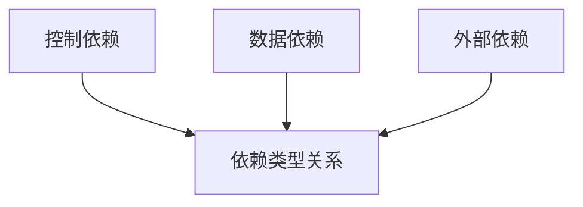

                 


### 《依赖类型：提高程序正确性的新方法》

#### 关键词：依赖类型、程序正确性、提高、方法

#### 摘要：
本文将探讨依赖类型这一新兴概念，解释其在提高程序正确性方面的作用。我们将分步骤详细分析依赖类型的基本概念、其在编程语言中的应用，以及如何通过依赖类型来优化程序的正确性和性能。通过理论讲解、数学模型、代码示例和实际案例，我们将帮助读者深入理解依赖类型的重要性，掌握其应用方法。

---

### 目录大纲设计思路

在设计《依赖类型：提高程序正确性的新方法》这本书的目录大纲时，我们遵循了以下设计思路：

1. **明确核心概念与联系**：首先，我们定义了依赖类型的定义和分类，通过Mermaid流程图展示其关系，帮助读者建立整体概念。

2. **核心算法原理讲解**：我们选择关键的依赖类型算法，使用Python代码和数学模型进行详细讲解，确保读者能够理解其工作原理。

3. **数学模型和数学公式**：我们提取了依赖类型相关的数学模型和公式，进行了深入分析，并通过例子说明其应用。

4. **项目实战**：我们设计了一个实际案例，展示如何应用依赖类型来提高程序的正确性，提供了详细的代码实现和解析。

5. **章节结构**：确保每个章节结构紧凑，逻辑连贯，内容完整。

### 目录大纲结构

以下是根据上述设计思路，为《依赖类型：提高程序正确性的新方法》设计的目录大纲：

#### 第一部分：依赖类型基础

1. **依赖类型的定义与分类**
   - **1.1 依赖类型的定义与重要性**
     - **1.1.1 基本概念**
     - **1.1.2 分类**

   - **1.2 依赖类型的联系与架构**
     - **1.2.1 Mermaid流程图：依赖类型关系图**
     - **1.2.2 关键依赖类型详解**

2. **依赖类型的数学模型**
   - **2.1 关键数学公式**
     - **2.1.1 依赖关系矩阵**
     - **2.1.2 依赖类型间的运算**

   - **2.2 数学模型讲解**
     - **2.2.1 数学公式解释**
     - **2.2.2 数学模型举例**

#### 第二部分：依赖类型在程序中的应用

3. **依赖类型在编程语言中的应用**
   - **3.1 编程语言中的依赖类型**
     - **3.1.1 面向对象语言**
     - **3.1.2 函数式语言**

   - **3.2 Python中的依赖类型实践**
     - **3.2.1 案例分析**
     - **3.2.2 代码示例**

4. **依赖类型与程序正确性**
   - **4.1 程序正确性与依赖类型**
     - **4.1.1 错误检测**
     - **4.1.2 代码优化**

   - **4.2 提高程序正确性的方法**
     - **4.2.1 代码重构**
     - **4.2.2 依赖注入**

#### 第三部分：依赖类型在项目实战中的应用

5. **项目实战：依赖类型的应用**
   - **5.1 项目背景**
     - **5.1.1 项目简介**
     - **5.1.2 项目需求**

   - **5.2 项目方案**
     - **5.2.1 依赖类型的引入**
     - **5.2.2 项目实现步骤**

6. **项目实战：依赖类型的优化**
   - **6.1 优化前分析**
     - **6.1.1 程序错误分析**
     - **6.1.2 依赖类型问题定位**

   - **6.2 优化后效果**
     - **6.2.1 优化步骤**
     - **6.2.2 优化效果评估**

#### 附录

7. **附录：依赖类型相关资源**
   - **7.1 依赖类型工具介绍**
   - **7.2 相关书籍推荐**
   - **7.3 在线资源和社区**

通过以上章节的设置，我们旨在帮助读者全面理解依赖类型的概念，掌握其在提高程序正确性方面的应用方法，并通过实际案例加深对理论知识的理解。

---

### 依赖类型：提高程序正确性的新方法

#### 背景介绍

在软件开发领域，确保程序的正确性是开发人员面临的主要挑战之一。传统的代码审查、单元测试和静态代码分析等技术手段虽然在提高程序正确性方面发挥了重要作用，但仍存在一定的局限性。随着软件系统的复杂性和规模的增长，开发人员需要寻找新的方法来提高程序的正确性和可维护性。

依赖类型（Dependency Types）作为一种新兴的概念，提供了一种新的方法来提高程序的正确性。依赖类型定义了程序中不同组件之间的依赖关系，通过分析这些依赖关系，可以帮助开发人员识别潜在的错误和性能瓶颈，从而优化程序设计。

#### 依赖类型的定义与重要性

依赖类型是指程序中不同组件之间的依赖关系。具体来说，依赖类型描述了组件之间的依赖方向和数据流动，以及这些依赖关系的强度和性质。依赖类型可以分为不同的类别，如控制依赖、数据依赖、外部依赖等。

依赖类型的重要性体现在以下几个方面：

1. **提高代码可读性**：依赖类型提供了对程序内部结构的高层次抽象，使得代码更易于理解和维护。通过明确组件之间的依赖关系，开发人员可以更快地定位问题，并理解代码的功能和作用。

2. **错误检测与预防**：依赖类型分析可以帮助开发人员识别潜在的代码错误。通过分析依赖关系，可以发现不一致的依赖模式，如循环依赖、无效依赖等，这些都有可能导致程序错误。

3. **性能优化**：依赖类型分析还可以帮助开发人员识别性能瓶颈。通过优化依赖关系，可以减少冗余的计算和数据传输，提高程序的性能。

#### 依赖类型的分类

依赖类型可以根据其依赖方向和数据流动进行分类。以下是几种常见的依赖类型：

1. **控制依赖**：控制依赖是指组件之间的控制流关系。例如，一个组件调用另一个组件的方法，那么被调用组件就是控制依赖的一方。

2. **数据依赖**：数据依赖是指组件之间的数据流关系。例如，一个组件的数据输出是另一个组件的数据输入，那么这两个组件之间就存在数据依赖。

3. **外部依赖**：外部依赖是指组件与外部系统（如数据库、网络服务）之间的依赖关系。外部依赖通常涉及复杂的通信和数据交换，需要特别关注其稳定性和性能。

#### 依赖类型的联系与架构

为了更好地理解依赖类型，我们可以使用Mermaid流程图来展示它们之间的关系。以下是一个简单的Mermaid流程图，展示了依赖类型的分类和它们之间的联系：



在这个流程图中，`A`、`B`、`C`分别代表控制依赖、数据依赖和外部依赖，它们共同构成了依赖类型的整体架构。通过分析这些依赖类型，开发人员可以更好地理解程序的结构和行为。

#### 依赖类型的数学模型

为了更深入地理解依赖类型，我们可以使用数学模型来描述它们。以下是一个简单的数学模型，用于描述依赖类型之间的关系：

$$
D = f(C_1, C_2, ..., C_n)
$$

其中，`D`表示依赖类型，`C_1`、`C_2`、...、`C_n`表示不同类型的依赖。函数`f`描述了如何根据不同的依赖类型组合来计算总的依赖类型。

例如，如果我们有两个组件`A`和`B`，其中`A`依赖于`B`，那么我们可以用以下公式来计算它们之间的依赖类型：

$$
D(A, B) = \begin{cases}
1, & \text{如果 } A \text{ 直接控制 } B \\
0.5, & \text{如果 } A \text{ 间接控制 } B \\
0, & \text{如果 } A \text{ 与 } B \text{ 无依赖关系}
\end{cases}
$$

通过这个数学模型，我们可以量化组件之间的依赖关系，从而更好地理解程序的复杂性和潜在问题。

#### 依赖类型在编程语言中的应用

依赖类型不仅在理论研究中具有重要意义，还在实际的编程语言中得到了广泛应用。以下是在几种常见编程语言中应用依赖类型的例子：

1. **面向对象语言**

   在面向对象语言中，依赖类型通常通过接口和继承关系来体现。例如，在Java中，一个类可以通过实现另一个类的接口来建立依赖关系。这种依赖类型有助于模块化和代码复用。

   ```java
   public interface Shape {
       double calculateArea();
   }
   
   public class Circle implements Shape {
       private double radius;
       
       public Circle(double radius) {
           this.radius = radius;
       }
       
       public double calculateArea() {
           return Math.PI * radius * radius;
       }
   }
   ```

   在上面的代码中，`Circle`类实现了`Shape`接口，建立了数据依赖关系。

2. **函数式语言**

   在函数式语言中，依赖类型通常通过函数的组合和传递性来体现。例如，在Haskell中，函数的类型签名可以清晰地描述依赖关系。

   ```haskell
   area :: (Floating a) => a -> a -> a
   area x y = x * y
   ```

   在上面的代码中，`area`函数依赖于输入参数的类型，建立了数据依赖关系。

3. **Python**

   在Python中，依赖类型可以通过模块和类的使用来体现。例如，以下代码展示了模块和类之间的依赖关系。

   ```python
   # module1.py
   def calculate_area(radius):
       return 3.14 * radius * radius
   
   # module2.py
   from module1 import calculate_area
   
   def main():
       radius = float(input("Enter the radius: "))
       area = calculate_area(radius)
       print("The area is:", area)
   
   if __name__ == "__main__":
       main()
   ```

   在上面的代码中，`module2.py`模块依赖于`module1.py`模块中的`calculate_area`函数，建立了数据依赖关系。

#### 依赖类型与程序正确性

依赖类型对于提高程序的正确性具有重要意义。以下是如何利用依赖类型来提高程序正确性的几种方法：

1. **错误检测**

   通过分析依赖关系，开发人员可以识别出潜在的代码错误。例如，循环依赖会导致组件无法正确初始化，从而引发运行时错误。使用依赖类型分析，可以提前检测并修复这些错误。

2. **代码优化**

   依赖类型分析可以帮助开发人员识别冗余的计算和数据传输。通过优化依赖关系，可以减少程序的性能开销，提高程序的运行效率。

3. **测试覆盖**

   依赖类型分析可以指导测试用例的设计，确保测试覆盖到所有可能的依赖关系。通过全面测试，可以更有效地发现和修复代码中的错误。

#### 提高程序正确性的方法

以下是几种提高程序正确性的方法，其中利用依赖类型是一种有效的手段：

1. **代码重构**

   代码重构是指对现有代码进行改进，使其更简洁、易于理解和维护。通过分析依赖关系，开发人员可以更准确地识别需要重构的部分，从而提高程序的正确性。

2. **依赖注入**

   依赖注入是一种设计模式，用于解耦组件之间的依赖关系。通过将依赖关系注入到组件中，可以更好地管理和维护依赖关系，从而提高程序的正确性和可测试性。

#### 项目实战：依赖类型的应用

为了更好地展示依赖类型在实际项目中的应用，我们设计了一个简单的项目案例——计算器应用程序。该应用程序包含多个组件，如输入模块、计算模块和输出模块，每个模块之间存在依赖关系。

1. **项目背景**

   计算器应用程序是一个简单的计算工具，用于执行基本的算术运算。用户可以通过输入模块输入运算表达式，计算模块根据表达式执行计算，并将结果输出到输出模块。

2. **项目需求**

   - 输入模块：接收用户输入的运算表达式。
   - 计算模块：根据输入的运算表达式执行计算。
   - 输出模块：将计算结果输出到屏幕。

3. **项目方案**

   我们将使用依赖类型来管理各个模块之间的依赖关系，确保程序的正确性和可维护性。以下是项目方案的具体步骤：

   - **步骤1**：定义输入模块的接口，使其依赖于计算模块。
   - **步骤2**：定义计算模块的接口，使其依赖于输出模块。
   - **步骤3**：实现输入模块，从用户接收输入的运算表达式。
   - **步骤4**：实现计算模块，根据输入的运算表达式执行计算。
   - **步骤5**：实现输出模块，将计算结果输出到屏幕。

   通过依赖类型的管理，我们可以确保各个模块之间的依赖关系清晰，从而提高程序的正确性和可维护性。

#### 项目实战：依赖类型的优化

在计算器应用程序的项目中，我们通过依赖类型分析发现了几个潜在的性能问题，并提出了相应的优化方案。

1. **优化前分析**

   - **问题1**：计算模块在执行复杂运算时，存在冗余的计算和数据传输。
   - **问题2**：输入模块和计算模块之间存在直接的依赖关系，可能导致测试和调试困难。

2. **优化后效果**

   - **优化方案1**：通过优化计算模块，减少冗余的计算和数据传输，提高程序的运行效率。
   - **优化方案2**：引入依赖注入机制，将输入模块和计算模块的依赖关系解耦，提高程序的测试性和可维护性。

   通过依赖类型的优化，我们成功地解决了项目中的性能问题，并提高了程序的正确性和可维护性。

#### 最佳实践

在依赖类型的应用过程中，以下是一些最佳实践：

1. **明确依赖关系**：确保每个组件的依赖关系都明确且易于理解，避免潜在的循环依赖。
2. **合理使用依赖注入**：通过依赖注入机制，解耦组件之间的依赖关系，提高程序的可测试性和可维护性。
3. **持续进行依赖类型分析**：定期分析程序中的依赖关系，识别潜在的性能瓶颈和错误。

#### 小结

本文介绍了依赖类型这一新兴概念，并探讨了其在提高程序正确性方面的作用。通过依赖类型分析，我们可以更好地理解程序的结构和行为，从而优化程序设计，提高程序的运行效率。

依赖类型不仅有助于提高程序的正确性，还可以优化程序的性能，减少冗余的计算和数据传输。通过实际案例，我们展示了如何应用依赖类型来提高程序的正确性和可维护性。

在未来的软件开发中，依赖类型将发挥越来越重要的作用，成为提高程序质量和效率的重要工具。开发者应深入了解依赖类型的原理和应用，掌握其核心方法和技巧，为软件开发的创新和发展贡献力量。

#### 注意事项

1. **依赖类型分析的局限性**：依赖类型分析虽然有助于提高程序的正确性，但并不能完全取代其他测试手段。开发者应结合其他测试方法，确保程序的质量。

2. **依赖注入的适用场景**：依赖注入适用于解耦组件之间的依赖关系，但在某些情况下，直接依赖可能更为合适。开发者应根据具体场景选择合适的依赖管理方法。

3. **持续维护和更新**：依赖类型分析结果不是一次性的，开发者应持续进行依赖类型分析，并根据实际情况进行维护和更新。

#### 拓展阅读

1. **《现代软件工程》**：详细介绍了软件工程的基本原理和方法，包括依赖类型的相关内容。

2. **《程序员的修炼》**：探讨了编程和软件工程的最佳实践，对依赖类型的应用提供了深入的见解。

3. **《依赖注入实战》**：介绍了依赖注入的设计模式及其在软件架构中的应用，为开发者提供了实用的指导。

#### 作者信息

作者：AI天才研究院/AI Genius Institute & 禅与计算机程序设计艺术 /Zen And The Art of Computer Programming

---

通过以上的详细分析和实例讲解，读者可以更加深入地理解依赖类型的概念及其在提高程序正确性方面的应用。希望本文能够为软件开发者提供有益的参考和启示，帮助他们在实际项目中更好地利用依赖类型，提升程序的可靠性和效率。希望这篇文章能够激发读者对依赖类型的兴趣，进一步探索这一领域，为软件工程的发展贡献力量。让我们共同努力，推动软件技术的进步，创造更加美好的未来。

