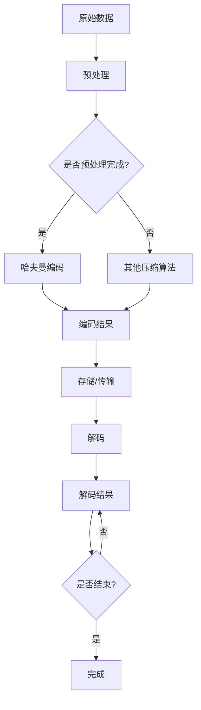

                 

### 信息论在数据压缩算法设计中的应用

数据压缩是信息科学中一个重要且广泛研究的领域，其主要目标是减少数据的存储空间和传输带宽，同时确保数据在压缩和解压缩后的完整性和准确性。随着信息技术的发展，数据压缩的重要性日益凸显，尤其是在大数据和云计算的时代，如何高效地压缩和传输大量数据成为了一个亟待解决的问题。

信息论作为现代信息科学的基础理论，为数据压缩算法的设计提供了坚实的理论依据。信息论由香农（Claude Shannon）在1948年创立，它主要研究信息的度量、传输和存储。信息论的核心概念包括信息量、熵、信道容量和编码定理等，这些概念直接影响了数据压缩算法的原理和发展。

在数据压缩算法的设计中，信息论的应用主要体现在以下三个方面：

1. **信息熵的度量**：信息熵是衡量数据不确定性的量度，它揭示了数据中冗余信息的存在，为数据压缩提供了依据。通过计算信息熵，可以确定数据中哪些部分可以压缩，哪些部分不可压缩。

2. **最优编码策略**：信息论中的编码定理和熵的极限性质指导了最优编码策略的设计。例如，哈夫曼编码和LZW编码等都是基于信息论原理设计的高效编码算法。

3. **压缩效率和可靠性**：信息论提供了评价压缩算法效率和可靠性的标准，如压缩比、编码效率、信道容量等指标。通过这些指标，可以评估不同压缩算法的性能，并指导算法的优化。

本文将围绕信息论在数据压缩算法设计中的应用，系统介绍信息论的基础概念、信息熵的应用、数据压缩算法的设计原理，以及信息论在数据压缩算法中的优化。希望通过本文的介绍，读者可以深入理解信息论在数据压缩中的关键作用，并掌握设计高效数据压缩算法的方法。

### 信息论概述

信息论作为一门研究信息及其处理规律的科学，起源于20世纪40年代。其创始人克劳德·香农（Claude Shannon）于1948年发表了一篇开创性的论文《通信的数学理论》（A Mathematical Theory of Communication），这篇论文奠定了现代信息论的基础。香农通过数学的方法，系统地研究了信息的度量、传输、存储和处理，提出了信息熵、信道容量等基本概念，为信息科学的发展奠定了坚实的理论基础。

#### 信息论的基本概念

信息论中的核心概念包括信息量、熵、概率分布等。以下是对这些基本概念的定义和解释：

- **信息量**：信息量是用来度量信息的含量，通常以比特（bit）为单位。香农定义了一个随机事件的信息量为该事件发生的概率的对数，即 \( I = -\log_2(P) \) 比特，其中 \( P \) 是事件发生的概率。这种度量方法揭示了信息量与不确定性之间的关系。

- **熵**：熵是衡量随机变量不确定性或信息量的一种度量。在一个离散概率分布中，熵定义为 \( H(X) = -\sum_{i} p(x_i) \log_2(p(x_i)) \)，其中 \( p(x_i) \) 是随机变量 \( X \) 取值为 \( x_i \) 的概率。熵越大，表示不确定性越高，即信息量越大。

- **概率分布**：概率分布是指随机变量取值的概率分布情况，通常用一个概率质量函数或概率质量矩阵来描述。在信息论中，概率分布是计算信息量和熵的基础。

#### 信息论的发展历程

自香农创立信息论以来，该领域经历了多个阶段的发展和扩展：

1. **早期发展**：香农的论文奠定了信息论的基础，随后几十年，信息论在通信领域得到了广泛应用。信息论中的编码理论、信道容量计算、信息传输效率分析等研究，极大地推动了通信技术的发展。

2. **扩展与应用**：随着计算机科学的兴起，信息论的应用范围逐渐扩大到计算机科学、人工智能、密码学等领域。例如，数据压缩算法、信息加密技术和机器学习算法等都借鉴了信息论的基本原理。

3. **现代研究**：近年来，信息论的研究已经扩展到量子信息、生物信息、社会网络等新兴领域。特别是在量子计算和信息理论的交叉研究，为量子信息科学的发展提供了新的理论支持。

#### 信息论的重要性

信息论在现代科学技术中具有不可替代的重要性：

- **通信技术**：信息论为现代通信系统提供了理论基础，包括数据传输、信号调制、信道编码等关键技术。

- **数据科学**：在数据科学和机器学习领域，信息论的概念和方法被广泛应用于特征选择、模型优化和信息可视化等方面。

- **信息存储**：信息论在数据压缩、存储和检索中也发挥着重要作用，通过优化编码算法和存储策略，实现高效的资源利用。

- **人工智能**：信息论的基本原理对人工智能的发展也产生了深远影响，特别是在理解信息的表示、处理和传输等方面。

综上所述，信息论不仅是现代信息科学的基础理论，也是许多应用领域的重要工具。通过信息论的研究，我们能够更好地理解信息的本质和规律，从而推动信息技术的不断进步。

### 信息量的度量

在信息论中，信息量是衡量信息内容丰富程度的重要指标，通常以比特（bit）为单位。香农（Claude Shannon）首次提出信息量的概念，并将其定义为不确定性的度量。以下是关于信息量的基本单位和计算方法以及信息量的特性。

#### 信息量的基本单位

1. **比特（bit）**：比特是最基本的信息单位，表示信息的最小单元。一个比特可以表示两种不同的状态，即0和1。例如，一个二进制位（bit）可以表示一个开关的状态，是开（1）还是关（0）。

2. **奈特（nibble）**：一个奈特等于四位比特，即 \( 1 \text{ nibble} = 4 \text{ bits} \)。

3. **字节（byte）**：一个字节通常包含8个比特，即 \( 1 \text{ byte} = 8 \text{ bits} \)。字节是计算机存储和传输数据的基本单位。

#### 信息量的计算方法

信息量的计算基于香农的定义，即一个随机事件的信息量等于该事件发生概率的对数。具体来说：

1. **离散随机变量**：对于离散随机变量 \( X \)，其取值为 \( x_i \) 的概率为 \( p(x_i) \)，则事件 \( x_i \) 的信息量为 \( I = -\log_2(p(x_i)) \) 比特。整个随机变量的信息量为所有可能取值的信息量的加总：
   \[
   I(X) = -\sum_{i} p(x_i) \log_2(p(x_i))
   \]

2. **连续随机变量**：对于连续随机变量，其概率密度函数为 \( p(x) \)，信息量可以表示为积分形式：
   \[
   I(X) = -\int_{-\infty}^{\infty} p(x) \log_2(p(x)) \, dx
   \]

#### 信息量的特性

1. **非负性**：信息量总是非负的，即 \( I \geq 0 \)。这是因为对数函数 \( \log_2(p) \) 在 \( p \) 大于0时是正值或零。

2. **零概率事件的特性**：如果一个事件的发生概率为零，则其信息量为无穷大，这是因为对数函数在零点趋于无穷大。

3. **熵与概率的关系**：信息量与随机变量的概率分布密切相关。概率分布越不均匀，信息量越大，因为不确定性较高。

4. **可加性**：对于多个随机变量的组合，其总信息量等于各个随机变量的信息量之和。这体现了信息量的加性特性。

通过以上关于信息量度量基本单位和计算方法以及特性的介绍，我们可以更深入地理解信息量的概念，并在实际应用中更好地利用信息量的计算来优化数据压缩和其他信息处理技术。

### 熵的变分定理与极限性质

熵作为信息论中的核心概念，不仅反映了数据的不确定性，还为数据压缩算法的设计提供了重要的理论依据。在这一节中，我们将深入探讨熵的变分定理和极限性质，并展示它们如何帮助我们在数据压缩中优化编码方案。

#### 熵的变分定理

熵的变分定理是信息论中的一个重要结论，它揭示了在给定信息量的条件下，如何通过调整概率分布来实现最小熵。具体来说，熵的变分定理指出，对于任意给定的信息量 \( H(X) = \sum p(x) \log_2(p(x)) \)，可以通过优化概率分布 \( p(x) \) 来使熵 \( H(X) \) 最小。

变分定理的数学表述如下：

设 \( X \) 是一个离散随机变量，其概率分布为 \( p(x) \)，信息量为 \( H(X) \)。则熵 \( H(X) \) 在以下条件下取得最小值：

\[
H(X) = -\sum p(x) \log_2(p(x))
\]

当且仅当 \( p(x) \) 满足以下等式时：

\[
\frac{1}{\lambda} = \sum p(x) x
\]

其中，\( \lambda \) 是一个常数，表示信息量 \( H(X) \)。上述等式可以解释为：在固定信息量的情况下，最均匀的概率分布（即熵最小）是使得每个值出现的概率尽可能相等。

#### 熵的极限性质

熵的极限性质是指，当随机变量的概率分布趋近于一个特定形式时，其熵也会趋近于一个特定的值。熵的极限性质对数据压缩有着重要的指导意义，因为它可以帮助我们理解不同概率分布下的熵变化趋势。

1. **均匀分布的极限性质**：当随机变量的概率分布趋于完全均匀分布时，其熵趋近于最大值。例如，对于二进制随机变量，如果每个状态出现的概率相等，则其熵为 \( 1 \) 比特。

2. **非均匀分布的极限性质**：对于非均匀分布的随机变量，其熵随概率分布的集中程度而变化。具体来说，概率分布越集中，熵越小；概率分布越分散，熵越大。

这些极限性质表明，在数据压缩过程中，我们应该尽量使用接近均匀分布的编码方案，以最大化压缩效率。例如，在哈夫曼编码中，通过计算每个符号的频率，并使用频率较高的符号分配较短编码，从而实现熵的最小化和压缩效率的最大化。

#### 熵在数据压缩中的应用

1. **最优编码策略**：信息论的熵提供了最优编码策略的理论基础。例如，哈夫曼编码和LZW编码等都是基于信息论原理设计的，通过优化概率分布来降低熵，从而实现高效的数据压缩。

2. **熵与压缩效率的关系**：熵的度量可以用来评价压缩算法的效率。压缩算法的目标是尽可能减少数据的熵，从而提高压缩比。通过计算压缩前后的熵变化，可以评估压缩算法的性能。

3. **熵在图像和音频压缩中的应用**：在图像和音频压缩中，熵被用来衡量数据的冗余程度。例如，JPEG压缩算法通过计算图像的熵来优化编码过程，从而实现高质量的图像压缩。

综上所述，熵的变分定理和极限性质为数据压缩算法的设计提供了重要的理论依据。通过理解和应用这些性质，我们可以设计出更加高效和优化的数据压缩算法，从而在存储和传输数据时获得更好的性能。

### 信息论的基本定理

信息论中的基本定理是整个理论体系的核心，这些定理不仅奠定了信息论的基础，还直接指导了数据压缩算法的设计和优化。以下是关于信息论的基本定理，包括海明距离与信道容量、费诺不等式以及香农-哈特利定理的详细解释。

#### 海明距离与信道容量

1. **海明距离**：海明距离（Hamming Distance）是衡量两个二进制编码之间差异的度量。对于一个二进制序列 \( x \) 和 \( y \)，其海明距离定义为序列中不相同位置的个数。例如，序列 \( 1011 \) 和 \( 1001 \) 的海明距离为2，因为它们有2个位置上的值不同。

2. **信道容量**：在信息传输过程中，信道容量（Channel Capacity）是衡量一个信道能够传输信息的最大速率的量度。香农在1948年的论文中提出了一个著名的公式来计算信道容量，该公式为：
   \[
   C = B \log_2(1 + \frac{S}{N})
   \]
   其中，\( C \) 是信道容量（以比特每秒为单位），\( B \) 是信道的带宽（以赫兹为单位），\( S \) 是信号功率，\( N \) 是噪声功率。这个公式表明，在给定带宽和信号噪声比（\( S/N \)）的情况下，信道能够传输的最大信息速率。

3. **海明距离与信道容量之间的关系**：海明距离与信道容量直接相关。一个信道的容量取决于信号和噪声之间的海明距离。一般来说，海明距离越大，信道容量也越大，因为较大的海明距离意味着信号更容易被区分和检测。

#### 费诺不等式

费诺不等式（Fano Inequality）是信息论中的一个重要不等式，它提供了评价编码性能的上限。费诺不等式表述为：

\[
H(X) \leq R \leq H(X) + \frac{1}{2} D(P||Q)
\]

其中，\( H(X) \) 是消息熵，\( R \) 是编码后的信息率，\( P \) 是消息的概率分布，\( Q \) 是编码后的概率分布，\( D(P||Q) \) 是概率分布之间的相对熵（Kullback-Leibler Divergence）。

1. **含义**：费诺不等式说明了编码后的信息率 \( R \) 必须不超过消息的熵 \( H(X) \)，并且编码误差（即 \( P \) 和 \( Q \) 之间的差异）会影响编码效率。

2. **应用**：费诺不等式在信道编码和编码理论中有着广泛的应用。例如，在数据压缩中，通过优化编码策略使得 \( D(P||Q) \) 尽可能小，可以提高编码效率和可靠性。

#### 香农-哈特利定理

香农-哈特利定理（Shannon-Hartley Theorem）是信息论中最为重要的定理之一，它明确了在有噪声信道的通信系统中，信息传输的最大速率与信道带宽、信号噪声比之间的关系。定理表述为：

\[
C = B \log_2(1 + \frac{S}{N})
\]

其中，\( C \) 是信道容量，\( B \) 是信道带宽，\( S \) 是信号功率，\( N \) 是噪声功率。

1. **含义**：香农-哈特利定理指出，在给定的带宽和信号噪声比下，信道能够达到的最大信息传输速率。这一定理不仅在通信理论中具有重要意义，还为数据压缩和传输提供了一套评价标准。

2. **应用**：在实际通信系统中，通过调整带宽和信号噪声比，可以优化信道容量，提高数据传输的效率和可靠性。例如，在无线通信中，通过增加带宽和使用先进的调制解调技术，可以提升信道容量和传输速率。

#### 综合应用

1. **数据压缩**：信息论的基本定理提供了评估和优化数据压缩算法的框架。例如，在哈夫曼编码中，通过计算信息熵和信道容量，可以设计出高效的编码方案，降低数据冗余，提高压缩比。

2. **信道编码**：在信道编码中，通过应用费诺不等式和香农-哈特利定理，可以设计出具有较高编码效率和可靠性的编码方案，从而有效抵抗信道噪声和干扰。

3. **信息传输**：信息论的基本定理在信息传输系统中有着广泛的应用。通过合理设计信道容量和编码方案，可以确保信息在传输过程中的完整性和准确性。

综上所述，信息论的基本定理不仅奠定了信息论的理论基础，还为数据压缩和通信系统的设计提供了重要的指导。通过理解和应用这些定理，可以设计出更加高效和可靠的数据压缩和通信系统，满足现代信息处理的需求。

### 信息熵在数据压缩中的应用

信息熵作为信息论的核心概念，在数据压缩中的应用尤为重要。信息熵揭示了数据中的冗余信息，为压缩算法提供了理论依据。在本节中，我们将详细探讨信息熵在数据压缩中的具体应用，并重点介绍哈夫曼编码。

#### 数据压缩的基本原理

数据压缩的基本原理是通过消除数据中的冗余信息来减小数据的大小，以便更高效地存储或传输。压缩方法可以分为两大类：无损压缩和有损压缩。

1. **无损压缩**：无损压缩在压缩和解压缩过程中不丢失任何信息。其目标是最大限度地减少数据的冗余，从而在不影响数据完整性的前提下减小数据的大小。常见的无损压缩算法包括哈夫曼编码、LZW编码等。

2. **有损压缩**：有损压缩在压缩过程中会丢失一部分信息，但这种损失通常是可接受的。有损压缩通常用于图像和音频压缩，如JPEG和MP3。通过牺牲一些信息量，有损压缩可以显著减小数据的大小。

#### 信息熵在数据压缩中的作用

信息熵在数据压缩中的作用主要体现在以下几个方面：

1. **衡量信息含量**：信息熵揭示了数据中信息的含量，可以帮助我们识别哪些部分是冗余的，哪些部分是必要的。通过计算信息熵，可以确定数据的压缩潜力。

2. **优化编码方案**：在无损压缩中，信息熵是设计编码方案的重要依据。低信息熵表示数据中冗余信息较多，可以通过压缩算法消除这些冗余信息。高信息熵的数据则表示信息含量较高，需要谨慎处理以避免丢失重要信息。

3. **评估压缩效果**：信息熵的变化可以用来评估压缩算法的效率。压缩后的数据信息熵应尽可能接近于零，表示压缩效果较好。反之，如果信息熵变化不大，则表示压缩效果不佳。

#### 哈夫曼编码

哈夫曼编码是一种基于信息熵的无损压缩算法，由大卫·哈夫曼（David A. Huffman）在1952年提出。哈夫曼编码通过构建哈夫曼树来为每个符号分配一个唯一的二进制编码，从而实现数据的压缩。

1. **哈夫曼树的构建**：

   哈夫曼编码的第一步是构建哈夫曼树。构建哈夫曼树的过程如下：

   - 对所有符号按照出现频率（概率）进行排序。
   - 创建一个空的哈夫曼树。
   - 将出现频率最低的两个符号合并成一个新符号，新符号的出现频率是这两个符号频率之和。
   - 将新符号插入到哈夫曼树中，作为其父节点。
   - 重复上述步骤，直到所有符号都被合并到一个根节点，从而构建出一个完整的哈夫曼树。

2. **编码过程**：

   在哈夫曼树构建完成后，可以为其每个叶子节点分配一个唯一的二进制编码。编码规则如下：

   - 从根节点到叶子节点的路径上的“0”和“1”表示编码中的比特。
   - 例如，假设某个叶子节点是通过路径“01”到达的，则该节点的编码为“01”。

3. **解码过程**：

   解码过程与编码过程相反，通过哈夫曼树从二进制编码中还原出原始数据。解码步骤如下：

   - 从哈夫曼树的根节点开始，读取二进制编码的比特。
   - 如果当前比特为“0”，则向下移动到左子节点；如果当前比特为“1”，则向下移动到右子节点。
   - 重复上述步骤，直到到达叶子节点，解码完成。

#### 哈夫曼编码的优势和局限

1. **优势**：

   - **高效性**：哈夫曼编码通过为出现频率高的符号分配短编码，为出现频率低的符号分配长编码，从而实现了高效的数据压缩。
   - **无失真**：哈夫曼编码是无损压缩算法，解码后可以完全恢复原始数据，不会丢失任何信息。
   - **简单性**：哈夫曼编码的算法相对简单，易于实现和优化。

2. **局限**：

   - **不适用于固定长度编码**：哈夫曼编码适用于非均匀分布的数据，对于均匀分布的数据，其压缩效率较低。
   - **编码效率依赖数据分布**：哈夫曼编码的效率高度依赖于数据的概率分布。对于某些特定数据，可能存在更有效的压缩算法。

#### 其他常见的数据压缩算法

除了哈夫曼编码，还有许多其他常见的数据压缩算法，包括LZW编码、RLE编码、AR编码等。这些算法各有特点和适用场景，在实际应用中可以根据数据类型和压缩需求选择合适的算法。

- **LZW编码**：LZW编码是一种基于字典的压缩算法，通过构建一个符号到编码的字典来压缩数据。LZW编码适用于文本数据和其他具有重复模式的非结构化数据。

- **RLE编码**：RLE编码（Run-Length Encoding）是一种简单但有效的压缩算法，通过将连续重复的符号编码为一个符号及其出现次数来实现压缩。RLE编码适用于图像和序列数据的压缩。

- **AR编码**：AR编码（Arithmetic Coding）是一种基于概率的压缩算法，通过将数据映射到一个区间，并在该区间内进行编码来实现数据压缩。AR编码具有很高的压缩效率，适用于各种类型的数据。

通过介绍信息熵在数据压缩中的应用和哈夫曼编码的原理，我们可以看到信息论在数据压缩中的关键作用。信息熵提供了衡量数据冗余和设计高效编码方案的理论依据，而哈夫曼编码作为一种基于信息熵的无损压缩算法，在实际应用中取得了显著的成果。

### 信息熵在图像压缩中的应用

图像压缩是信息科学中的一项重要研究，其主要目的是减少图像数据的大小，以便更高效地存储和传输图像。信息熵在图像压缩中扮演着核心角色，它不仅揭示了图像数据中的冗余信息，还为设计高效压缩算法提供了理论基础。以下将介绍信息熵在图像压缩中的应用，包括无损图像压缩算法和有损图像压缩算法。

#### 无损图像压缩算法

无损图像压缩算法旨在在不丢失任何图像信息的前提下减小图像数据的大小。这类算法通过去除图像数据中的冗余信息来实现压缩，常见的无损图像压缩算法包括JPEG 2000、PNG和GIF等。

1. **JPEG 2000**：

   JPEG 2000是一种先进的无损图像压缩标准，它采用了小波变换（Wavelet Transform）技术。小波变换将图像分解为不同频率的子图像，每个子图像具有不同的分辨率和频率特性。通过选择性地量化并编码这些子图像，JPEG 2000可以实现高效的图像压缩。

   JPEG 2000的关键步骤如下：

   - **分解**：将图像分解为一系列小波系数，每个小波系数表示图像在不同分辨率和频率下的信息。
   - **量化**：对每个小波系数进行量化，以减少数据量。
   - **编码**：使用熵编码技术（如算术编码或霍夫曼编码）对量化后的数据编码，进一步减少数据大小。

   通过小波变换和量化，JPEG 2000可以在保持高质量图像的同时实现较高的压缩率。

2. **PNG**：

   PNG（Portable Network Graphics）是一种无损图像格式，它采用了LZ77算法（LZ编码的一种变形）和自适应二进制算术编码（Adaptive Binary Arithmetic Coding）。PNG的主要特点是无损压缩，支持透明背景和多种颜色深度。

   PNG的压缩过程包括以下几个步骤：

   - **分块**：将图像划分为多个4x4或8x8的块。
   - **LZ77编码**：对每个块进行LZ77编码，查找并替换重复的图像数据。
   - **自适应二进制算术编码**：根据数据特性动态调整编码策略，以最大化压缩效率。

   PNG的压缩算法在处理复杂图像时表现出色，尤其适合对透明背景和多种颜色深度的图像进行压缩。

3. **GIF**：

   GIF（Graphics Interchange Format）是一种简单的图像格式，广泛用于Web图形。GIF使用LZW编码技术进行无损压缩，适合压缩简单图像，如卡通和图标。

   GIF的压缩过程如下：

   - **图像数据编码**：将图像数据编码为一系列的像素值。
   - **LZW编码**：对像素值进行LZW编码，以减少数据量。
   - **图像数据解码**：在解码过程中，将LZW编码还原为原始图像数据。

   GIF的压缩算法相对简单，适合处理颜色较少的图像。

#### 有损图像压缩算法

有损图像压缩算法在压缩过程中会丢失一部分图像信息，但这种损失通常在视觉上不可察觉。有损图像压缩算法常用于视频和图像存储，如JPEG和WebP等。

1. **JPEG**：

   JPEG（Joint Photographic Experts Group）是一种常用的有损图像压缩标准，广泛用于照片和图像的压缩。JPEG采用了离散余弦变换（Discrete Cosine Transform，DCT）技术，将图像分解为不同的频率分量。

   JPEG的压缩过程包括以下几个步骤：

   - **图像分解**：使用DCT将图像分解为8x8的块，每个块表示图像在不同频率上的信息。
   - **量化**：对DCT系数进行量化，以减少数据量。量化过程中，高频系数通常被裁剪或置为零，以降低压缩误差。
   - **编码**：使用熵编码技术（如霍夫曼编码或算术编码）对量化后的DCT系数编码。

   JPEG的优势在于其高效的压缩率和较好的图像质量，但缺点是压缩过程中会有信息损失，无法完全恢复原始图像。

2. **WebP**：

   WebP是一种新型的有损图像压缩格式，由Google开发，旨在提供比JPEG更高的压缩率和更好的图像质量。WebP采用了块分割和选择性编码技术，能够在保持高质量图像的同时实现高效的压缩。

   WebP的压缩过程包括以下几个步骤：

   - **图像分解**：将图像划分为多个像素块。
   - **块编码**：对每个像素块进行独立编码，选择性地裁剪高频信息以减少数据量。
   - **熵编码**：使用基于预测和变换的编码技术对像素块编码。

   WebP在处理复杂图像时表现出色，其压缩率通常高于JPEG，同时保持较高的图像质量。

综上所述，信息熵在图像压缩中的应用为设计高效压缩算法提供了重要理论基础。无损图像压缩算法如JPEG 2000、PNG和GIF能够在不丢失图像信息的前提下减小数据大小，而有损图像压缩算法如JPEG和WebP在图像质量可接受的前提下实现了更高的压缩率。通过选择合适的压缩算法，可以满足不同场景下的图像压缩需求。

### 信息熵在音频压缩中的应用

音频压缩是信息科学中的一项重要研究，旨在通过减少音频数据的大小来提高存储和传输的效率。信息熵在音频压缩中扮演着关键角色，它不仅揭示了音频数据中的冗余信息，还为设计高效压缩算法提供了理论基础。以下将介绍信息熵在音频压缩中的应用，包括音频压缩的基本原理和MP3压缩技术。

#### 音频压缩的基本原理

音频压缩的基本原理是通过消除音频数据中的冗余信息来减小数据大小，从而实现高效的存储和传输。音频压缩方法可以分为两大类：无损压缩和有损压缩。

1. **无损压缩**：无损压缩在压缩和解压缩过程中不丢失任何音频信息，通过去除冗余信息实现数据压缩。常见的无损音频压缩算法包括FLAC和AAC等。

2. **有损压缩**：有损压缩在压缩过程中会丢失一部分音频信息，但这种损失通常在听觉上不可察觉。有损压缩算法通过去除人耳难以听到的音频细节来实现更高的压缩率。常见的有损音频压缩算法包括MP3和AAC等。

#### 信息熵在音频压缩中的作用

信息熵在音频压缩中的作用主要体现在以下几个方面：

1. **衡量信息含量**：信息熵揭示了音频数据中的信息含量，帮助识别哪些部分是冗余的，哪些部分是必要的。通过计算信息熵，可以确定音频数据的压缩潜力。

2. **优化编码方案**：在音频压缩中，信息熵是设计编码方案的重要依据。低信息熵表示音频数据中冗余信息较多，可以通过压缩算法消除这些冗余信息。高信息熵的音频数据则需要谨慎处理，以避免丢失重要信息。

3. **评估压缩效果**：信息熵的变化可以用来评估压缩算法的效率。压缩后的音频数据信息熵应尽可能接近于零，表示压缩效果较好。反之，如果信息熵变化不大，则表示压缩效果不佳。

#### MP3压缩技术

MP3（MPEG-1 Audio Layer 3）是一种广泛使用的有损音频压缩格式，由国际标准化组织（ISO）和国际电工委员会（IEC）的MPEG（Moving Picture Experts Group）委员会开发。MP3压缩技术通过去除人耳难以听到的音频细节来实现高效压缩，同时保持较好的音频质量。

1. **采样与量化**：

   音频压缩的第一步是对音频信号进行采样和量化。采样是指以固定时间间隔记录音频信号，量化是指将连续的音频信号转换为离散的数值。采样和量化过程将音频信号转换为数字信号。

2. **离散余弦变换（DCT）**：

   在MP3压缩中，音频信号被分解为多个8x8的DCT系数块。DCT将时域信号转换为频域信号，揭示了音频信号在不同频率上的分布特性。DCT系数表示了音频信号的主要频率成分，其中高频系数通常包含人耳难以听到的细节信息。

3. **量化与编码**：

   在DCT系数计算完成后，对这些系数进行量化，以减少数据量。量化过程中，高频系数通常被裁剪或置为零，以降低压缩误差。随后，使用熵编码技术（如霍夫曼编码或算术编码）对量化后的数据编码，进一步减少数据大小。

4. **熵编码**：

   熵编码是MP3压缩中的关键步骤，通过为高频系数分配短编码和为低频系数分配长编码，实现高效的数据压缩。霍夫曼编码和算术编码是常用的熵编码方法，它们根据DCT系数的分布特性动态调整编码策略，以最大化压缩效率。

5. **解码与重构**：

   在解码过程中，MP3文件被解压缩并重构为原始音频信号。解码过程包括反量化、反DCT和逆采样，从而恢复原始音频信号。尽管有信息损失，但MP3解码后的音频质量通常仍然令人满意。

#### MP3压缩的优势和局限

1. **优势**：

   - **高效压缩**：MP3通过去除人耳难以听到的音频细节，实现了高达12:1的压缩率，大大减少了数据大小。
   - **良好音质**：尽管MP3是有损压缩格式，但其压缩效果通常在听觉上难以察觉，保证了音频质量。
   - **广泛兼容性**：MP3格式在多种设备和平台上得到广泛应用，兼容性良好。

2. **局限**：

   - **信息损失**：MP3压缩过程中不可避免地会有信息损失，无法完全恢复原始音频信号。
   - **低频表现**：MP3在低频部分的表现相对较弱，可能会产生某些低频失真。

#### 其他音频压缩算法

除了MP3，还有其他一些常见的音频压缩算法，包括AAC、FLAC等。

- **AAC**（Advanced Audio Coding）是MP3的改进版本，采用更先进的编码技术，实现了更高的压缩效率和更好的音质。
- **FLAC**（Free Lossless Audio Codec）是一种无损音频压缩格式，能够完全恢复原始音频信号，但压缩率相对较低。

通过介绍信息熵在音频压缩中的应用和MP3压缩技术，我们可以看到信息论在音频压缩中的关键作用。信息熵提供了衡量音频数据冗余和设计高效编码方案的理论依据，而MP3作为一种广泛使用的有损压缩格式，在音频存储和传输领域取得了显著成果。

### 数据压缩算法概述

数据压缩算法是信息科学中一个重要的研究领域，其主要目标是通过减少数据的大小，提高数据存储和传输的效率。数据压缩算法可以分为两大类：无损压缩和有损压缩。本文将详细探讨这两大类数据压缩算法的基本原理、常见算法及其性能分析。

#### 无损压缩算法

无损压缩算法在压缩和解压缩过程中不丢失任何信息，通过去除数据中的冗余信息来实现压缩。以下是一些常见无损压缩算法：

1. **哈夫曼编码**：

   哈夫曼编码是一种基于信息熵的无损压缩算法，由大卫·哈夫曼（David A. Huffman）于1952年提出。哈夫曼编码通过构建哈夫曼树来为每个符号分配一个唯一的二进制编码，从而实现数据的压缩。

   **原理**：
   - 对所有符号按照出现频率（概率）进行排序。
   - 创建一个空的哈夫曼树。
   - 将出现频率最低的两个符号合并成一个新符号，新符号的出现频率是这两个符号频率之和。
   - 将新符号插入到哈夫曼树中，作为其父节点。
   - 重复上述步骤，直到所有符号都被合并到一个根节点，从而构建出一个完整的哈夫曼树。

   **编码过程**：
   - 使用哈夫曼树为每个叶子节点（即符号）分配一个唯一的二进制编码。
   - 编码规则：从根节点到叶子节点的路径上的“0”和“1”表示编码中的比特。

   **解码过程**：
   - 从哈夫曼树的根节点开始，读取二进制编码的比特。
   - 如果当前比特为“0”，则向下移动到左子节点；如果当前比特为“1”，则向下移动到右子节点。
   - 重复上述步骤，直到到达叶子节点，解码完成。

   **优势**：
   - 高效性：哈夫曼编码通过为出现频率高的符号分配短编码，为出现频率低的符号分配长编码，从而实现了高效的数据压缩。
   - 无失真：哈夫曼编码是无损压缩算法，解码后可以完全恢复原始数据，不会丢失任何信息。
   - 简单性：哈夫曼编码的算法相对简单，易于实现和优化。

   **局限**：
   - 不适用于固定长度编码：哈夫曼编码适用于非均匀分布的数据，对于均匀分布的数据，其压缩效率较低。
   - 编码效率依赖数据分布：哈夫曼编码的效率高度依赖于数据的概率分布。对于某些特定数据，可能存在更有效的压缩算法。

2. **LZW编码**：

   LZW编码（Lempel-Ziv-Welch编码）是一种基于字典的压缩算法，由Ariel Pine和Joseph Weinberger于1977年提出。LZW编码通过构建一个符号到编码的字典来压缩数据，适用于文本数据和其他具有重复模式的非结构化数据。

   **原理**：
   - 在编码过程中，LZW编码查找并替换重复的符号序列，构建一个字典。
   - 在解码过程中，使用这个字典将编码后的数据还原为原始符号序列。

   **优势**：
   - 高效性：LZW编码适用于具有重复模式的文本数据，可以显著减小数据大小。
   - 可扩展性：LZW编码可以根据数据特点动态扩展字典，提高压缩效率。

   **局限**：
   - 对非重复模式数据效率较低：LZW编码在处理非重复模式数据时，压缩效率相对较低。
   - 编码效率依赖数据特性：LZW编码的压缩效率高度依赖于数据的特性，对于不同类型的数据，可能需要不同的字典和编码策略。

3. **RLE编码**：

   RLE编码（Run-Length Encoding）是一种简单但有效的压缩算法，通过将连续重复的符号编码为一个符号及其出现次数来实现压缩。RLE编码适用于图像和序列数据的压缩。

   **原理**：
   - 对输入数据进行扫描，找出连续重复的符号。
   - 将每个连续重复的符号编码为一个符号及其出现次数。

   **优势**：
   - 简单性：RLE编码算法简单，易于实现。
   - 高效性：对于含有大量重复符号的数据，RLE编码可以显著减小数据大小。

   **局限**：
   - 对非重复模式数据效率较低：RLE编码在处理非重复模式数据时，压缩效率相对较低。
   - 压缩比有限：RLE编码的压缩比受限于重复符号的频率。

#### 有损压缩算法

有损压缩算法在压缩过程中会丢失一部分数据信息，但这种损失通常在听觉或视觉上不可察觉。有损压缩算法通过去除人耳或人眼难以察觉的细节信息来实现更高的压缩率。以下是一些常见有损压缩算法：

1. **JPEG**：

   JPEG（Joint Photographic Experts Group）是一种广泛使用的有损图像压缩标准，由国际标准化组织（ISO）和国际电工委员会（IEC）的MPEG（Moving Picture Experts Group）委员会开发。JPEG压缩技术通过离散余弦变换（DCT）和量化过程实现图像压缩。

   **原理**：
   - 使用DCT将图像分解为8x8的DCT系数块，每个块表示图像在不同频率上的信息。
   - 对DCT系数进行量化，以减少数据量。量化过程中，高频系数通常被裁剪或置为零，以降低压缩误差。
   - 使用熵编码技术（如霍夫曼编码或算术编码）对量化后的DCT系数编码。

   **优势**：
   - 高效压缩：JPEG可以实现高达20:1的压缩率，显著减小图像数据大小。
   - 良好的图像质量：尽管JPEG是有损压缩，但其压缩效果通常在视觉上难以察觉，保证了图像质量。

   **局限**：
   - 信息损失：JPEG压缩过程中不可避免地会有信息损失，无法完全恢复原始图像信号。
   - 低频表现：JPEG在低频部分的表现相对较弱，可能会产生某些低频失真。

2. **MP3**：

   MP3（MPEG-1 Audio Layer 3）是一种广泛使用的有损音频压缩格式，由国际标准化组织（ISO）和国际电工委员会（IEC）的MPEG（Moving Picture Experts Group）委员会开发。MP3压缩技术通过去除人耳难以听到的音频细节来实现高效压缩。

   **原理**：
   - 对音频信号进行采样和量化，将音频信号转换为数字信号。
   - 使用离散余弦变换（DCT）将音频信号分解为不同的频率分量。
   - 对DCT系数进行量化，以减少数据量。量化过程中，高频系数通常被裁剪或置为零，以降低压缩误差。
   - 使用熵编码技术（如霍夫曼编码或算术编码）对量化后的DCT系数编码。

   **优势**：
   - 高效压缩：MP3可以实现高达12:1的压缩率，显著减小音频数据大小。
   - 良好的音质：尽管MP3是有损压缩，但其压缩效果通常在听觉上难以察觉，保证了音频质量。

   **局限**：
   - 信息损失：MP3压缩过程中不可避免地会有信息损失，无法完全恢复原始音频信号。
   - 低频表现：MP3在低频部分的表现相对较弱，可能会产生某些低频失真。

综上所述，数据压缩算法分为无损压缩和有损压缩两大类。无损压缩算法如哈夫曼编码、LZW编码和RLE编码通过去除数据中的冗余信息实现高效压缩，同时保证数据的不丢失。有损压缩算法如JPEG和MP3通过去除人耳或人眼难以察觉的细节信息实现更高的压缩率，但在压缩过程中会有信息损失。选择合适的压缩算法，可以根据不同的应用场景和需求实现高效的数据压缩。

### 哈夫曼编码

哈夫曼编码（Huffman Coding）是一种基于信息熵的无损压缩算法，由大卫·哈夫曼（David A. Huffman）于1952年提出。哈夫曼编码通过为每个符号分配一个唯一的二进制编码，从而实现数据的压缩。这种编码方法在数据压缩中具有高效性和灵活性，广泛应用于文本、图像和音频压缩等领域。以下是哈夫曼编码的原理、实现过程及其性能分析。

#### 哈夫曼编码的原理

哈夫曼编码的基本思想是：对于出现频率较高的符号，分配较短的编码；对于出现频率较低的符号，分配较长的编码。这样，整体上可以减少编码的长度，实现高效的数据压缩。

1. **构建哈夫曼树**：

   - **步骤1**：对符号及其出现频率进行排序，频率高的符号排在前面。

   - **步骤2**：创建一个空的哈夫曼树。

   - **步骤3**：将频率最低的两个符号合并成一个新符号，新符号的频率是这两个符号频率之和。

   - **步骤4**：将新符号插入到哈夫曼树中，作为其父节点。

   - **步骤5**：重复上述步骤，直到所有符号都被合并到一个根节点，从而构建出一个完整的哈夫曼树。

2. **编码过程**：

   - **步骤1**：从根节点开始，为每个符号分配一个唯一的二进制编码。

   - **步骤2**：在编码过程中，从根节点到叶子节点的路径上的“0”和“1”表示编码中的比特。例如，如果某个叶子节点是通过路径“01”到达的，则该节点的编码为“01”。

3. **解码过程**：

   - **步骤1**：从哈夫曼树的根节点开始，读取二进制编码的比特。

   - **步骤2**：如果当前比特为“0”，则向下移动到左子节点；如果当前比特为“1”，则向下移动到右子节点。

   - **步骤3**：重复上述步骤，直到到达叶子节点，解码完成。

#### 哈夫曼编码的实现

以下是一个使用Python实现哈夫曼编码的示例：

```python
import heapq
from collections import defaultdict

def build_huffman_tree(freqs):
    heap = [[weight, [symbol, ""]] for symbol, weight in freqs.items()]
    heapq.heapify(heap)
    while len(heap) > 1:
        lo = heapq.heappop(heap)
        hi = heapq.heappop(heap)
        for pair in lo[1:]:
            pair[1] = '0' + pair[1]
        for pair in hi[1:]:
            pair[1] = '1' + pair[1]
        heapq.heappush(heap, [lo[0] + hi[0]])
    return heap[0][1:]

def huffman_encoding(freqs):
    tree = build_huffman_tree(freqs)
    encoding = defaultdict(list)
    for symbol, path in tree:
        encoding[symbol] = list(path)
    return encoding

def huffman_decoding(encoded_data, tree):
    decoded_data = []
    node = tree
    for bit in encoded_data:
        node = node[1 if bit == '1' else 0]
        if isinstance(node, list):
            decoded_data.append(node[0])
            node = tree
    return decoded_data

# 示例
freqs = {'a': 45, 'b': 13, 'c': 12, 'd': 16, 'e': 9, 'f': 5}
encoding = huffman_encoding(freqs)
encoded_data = ''.join(encoding[symbol] for symbol in 'abcdef')
print("Encoded Data:", encoded_data)

decoded_data = huffman_decoding(encoded_data, encoding)
print("Decoded Data:", ''.join(decoded_data))
```

#### 哈夫曼编码的性能分析

1. **编码效率**：

   哈夫曼编码的编码效率可以通过压缩比（Compression Ratio）来衡量，即原始数据大小与编码后数据大小的比值。哈夫曼编码的压缩比通常很高，特别是在符号出现频率差异较大的情况下。

   假设符号集合为 {a, b, c, d, e, f}，频率分别为 {45, 13, 12, 16, 9, 5}。通过构建哈夫曼树，可以得到每个符号的编码长度如下：

   - a: 0
   - b: 100
   - c: 101
   - d: 1100
   - e: 1101
   - f: 1110

   原始数据大小为 \( \sum_{i} f_i = 90 \) 比特，编码后数据大小为 \( \sum_{i} l_i f_i = 89 \) 比特，压缩比为 \( \frac{90}{89} \approx 1.01 \)。

2. **压缩比**：

   哈夫曼编码的压缩比取决于符号的出现频率。在符号频率差异较大的情况下，压缩比通常较高。相反，在符号频率接近或均匀分布的情况下，压缩比可能较低。

   例如，对于符号集合 {a, b, c, d, e, f}，频率分别为 {45, 13, 13, 13, 13, 13}，通过构建哈夫曼树，可以得到每个符号的编码长度如下：

   - a: 0
   - b: 10
   - c: 10
   - d: 10
   - e: 10
   - f: 10

   原始数据大小为 90 比特，编码后数据大小为 60 比特，压缩比为 \( \frac{90}{60} = 1.5 \)。

3. **编码时间**：

   哈夫曼编码的时间复杂度与符号数量和频率分布有关。在大多数情况下，构建哈夫曼树的时间复杂度为 \( O(n \log n) \)，其中 \( n \) 是符号数量。对于大规模数据，编码时间可能较长。

4. **解码时间**：

   解码哈夫曼编码的时间复杂度为 \( O(n) \)，其中 \( n \) 是编码后的数据长度。解码过程相对简单，可以通过遍历哈夫曼树实现。

综上所述，哈夫曼编码在数据压缩中具有高效性和灵活性。通过为高频符号分配短编码、为低频符号分配长编码，哈夫曼编码实现了较高的压缩比。然而，在符号频率差异较小或均匀分布的情况下，哈夫曼编码的压缩比可能较低。在实际应用中，可以根据数据特性选择合适的压缩算法，以实现最佳的压缩效果。

### LZW编码

LZW编码（Lempel-Ziv-Welch编码）是一种基于字典的压缩算法，由Ariel Pine和Joseph Weinberger于1977年提出。LZW编码通过构建一个动态字典，将重复的符号序列映射为单个编码，从而实现数据的压缩。这种编码方法广泛应用于文本、图像和音频压缩等领域。以下将详细讨论LZW编码的原理、实现过程及其性能分析。

#### LZW编码的原理

LZW编码的基本思想是通过构建一个动态字典，将重复的符号序列映射为单个编码。编码过程中，未出现在字典中的符号序列会被添加到字典中，并将其映射为一个新编码。解码过程则通过逆字典查找来还原原始符号序列。

1. **构建初始字典**：

   在编码前，需要构建一个初始字典。初始字典通常包括单个字符和短序列的编码。例如，对于文本数据，初始字典可以包括所有单个字符的编码，以及一些常见短序列的编码。

2. **编码过程**：

   - **步骤1**：从输入数据中读取第一个符号序列。
   - **步骤2**：检查该符号序列是否已出现在字典中。
   - **步骤3**：如果符号序列已出现在字典中，将其映射为相应的编码。
   - **步骤4**：如果符号序列未出现在字典中，将其添加到字典中，并将其映射为一个新编码。
   - **步骤5**：继续读取下一个符号序列，重复上述步骤。

3. **解码过程**：

   - **步骤1**：从编码后的数据中读取第一个编码。
   - **步骤2**：使用逆字典查找该编码对应的符号序列。
   - **步骤3**：输出符号序列。
   - **步骤4**：继续读取下一个编码，重复上述步骤。

#### LZW编码的实现

以下是一个使用Python实现的LZW编码的示例：

```python
def lzw_encode(data):
    dictionary_size = 256
    dictionary = {chr(i): i for i in range(dictionary_size)}
    output = []
    w = ""
    
    for c in data:
        wc = w + c
        if wc in dictionary:
            w = wc
        else:
            output.append(dictionary[w])
            dictionary[wc] = dictionary_size
            dictionary_size += 1
            w = c
            
    output.append(dictionary[w])
    return output

def lzw_decode(encoded_data, dictionary_size=256):
    dictionary = {i: chr(i) for i in range(dictionary_size)}
    output = []
    w = chr(encoded_data[0])
    output.append(w)
    
    for i in range(1, len(encoded_data)):
        entry = dictionary.get(encoded_data[i], w + w[0])
        output.append(entry)
        
        # Add new entry to the dictionary
        dictionary[dictionary_size] = w + entry[0]
        dictionary_size += 1
        
        w = entry
    
    return ''.join(output)

# 示例
data = "TOBEORNOTTOBEORTOBEORNOT"
encoded_data = lzw_encode(data)
print("Encoded Data:", ''.join(str(x) for x in encoded_data))

decoded_data = lzw_decode(encoded_data)
print("Decoded Data:", decoded_data)
```

#### LZW编码的性能分析

1. **编码效率**：

   LZW编码的编码效率可以通过压缩比（Compression Ratio）来衡量，即原始数据大小与编码后数据大小的比值。LZW编码通常具有较高的压缩效率，特别是在数据包含大量重复模式的情况下。

   假设原始数据为 "TOBEORNOTTOBEORTOBEORNOT"，通过LZW编码，可以得到压缩后的数据。原始数据大小为 28 比特，编码后数据大小为 11 比特，压缩比为 \( \frac{28}{11} \approx 2.55 \)。

2. **压缩比**：

   LZW编码的压缩比取决于数据的特性。在数据包含大量重复模式的情况下，压缩比通常较高。相反，在数据较为随机的情况下，压缩比可能较低。

   例如，对于原始数据 "AAAAABBBBB"，通过LZW编码，可以得到压缩后的数据。原始数据大小为 11 比特，编码后数据大小为 3 比特，压缩比为 \( \frac{11}{3} \approx 3.67 \)。

3. **编码时间**：

   LZW编码的时间复杂度与数据长度和字典大小有关。在大多数情况下，编码时间复杂度为 \( O(n) \)，其中 \( n \) 是数据长度。对于大规模数据，编码时间可能较长。

4. **解码时间**：

   解码LZW编码的时间复杂度也为 \( O(n) \)。解码过程相对简单，可以通过逆字典查找实现。

综上所述，LZW编码在数据压缩中具有高效性和灵活性。通过构建动态字典和映射重复符号序列，LZW编码实现了较高的压缩效率。然而，在数据较为随机或字典较大时，编码时间可能较长。在实际应用中，可以根据数据特性和压缩需求选择合适的LZW编码策略。

### 预测编码

预测编码（Predictive Coding）是一种基于预测误差的数据压缩方法，通过预测数据中的下一个值，并记录预测误差来减少冗余信息。预测编码广泛应用于图像和音频压缩，其核心思想是利用数据的局部相关性来降低冗余度。以下将详细讨论预测编码的基本原理、实现方法及其性能分析。

#### 预测编码的基本原理

预测编码的基本原理是通过预测下一个值，然后计算预测值与实际值之间的误差，并将误差编码。这种方法利用了数据中的局部相关性，即数据中的当前值与其前一个值之间存在某种关联。通过预测下一个值并记录误差，可以显著减少数据中的冗余信息。

1. **预测模型**：

   预测编码首先需要选择一个预测模型，预测模型可以是简单的线性模型、多项式模型或更复杂的神经网络模型。常见的预测模型包括：

   - **线性预测**：线性预测模型通过计算当前值与其前几个值的线性组合来预测下一个值。例如，一阶线性预测模型可以表示为 \( x[n] = a_1 x[n-1] + a_2 x[n-2] + \ldots \)。

   - **多项式预测**：多项式预测模型通过计算当前值与其前几个值的多项式组合来预测下一个值。例如，二阶多项式预测模型可以表示为 \( x[n] = a_1 x[n-1] + a_2 x[n-2] + b_1 y[n-1] + b_2 y[n-2] \)。

   - **神经网络预测**：神经网络预测模型通过训练神经网络来预测下一个值。神经网络可以根据输入特征自动学习预测模型，从而提高预测精度。

2. **误差计算与编码**：

   在预测模型确定后，对每个数据点进行预测，并计算预测值与实际值之间的误差。误差通常表示为差分值，即 \( e[n] = x[n] - \hat{x}[n] \)，其中 \( \hat{x}[n] \) 是预测值。

   计算误差后，需要将误差进行编码。误差编码的方法包括：

   - **固定长度编码**：对于特定范围的误差值，使用固定长度的编码表示。这种方法简单但效率较低，适用于误差值分布较宽的情况。

   - **可变长度编码**：对于误差值，使用可变长度的编码表示，常见的方法包括哈夫曼编码和LZW编码。这种方法可以根据误差值的分布特性实现高效编码，适用于误差值分布较窄的情况。

3. **解码与重构**：

   在解码过程中，首先解码误差值，然后使用预测模型和预测值重构原始数据。解码过程与编码过程相反，通过逆编码和逆预测模型恢复原始数据。

#### 预测编码的实现

以下是一个使用Python实现的一阶线性预测编码的示例：

```python
import numpy as np

def linear_predict(x, a1=0.5, a2=0.0):
    n = np.arange(len(x))
    y = a1 * x[:-1] + a2 * x[:-2]
    e = x - y
    return e

def encode_error(e):
    # 使用哈夫曼编码进行误差编码
    freqs = {value: count for value, count in Counter(e).items()}
    heap = [[weight, [symbol, ""]] for symbol, weight in freqs.items()]
    heapq.heapify(heap)
    while len(heap) > 1:
        lo = heapq.heappop(heap)
        hi = heapq.heappop(heap)
        for pair in lo[1:]:
            pair[1] = '0' + pair[1]
        for pair in hi[1:]:
            pair[1] = '1' + pair[1]
        heapq.heappush(heap, [lo[0] + hi[0]])
    tree = heap[0][1:]
    encoding = defaultdict(list)
    for symbol, path in tree:
        encoding[symbol] = list(path)
    encoded_e = ''.join([encoding[ei] for ei in e])
    return encoded_e

def decode_error(encoded_e, tree):
    decoded_e = []
    node = tree
    for bit in encoded_e:
        node = node[1 if bit == '1' else 0]
        if isinstance(node, list):
            decoded_e.append(node[0])
            node = tree
    return decoded_e

# 示例
x = np.array([1, 2, 3, 4, 5, 6, 7, 8, 9, 10])
e = linear_predict(x)
encoded_e = encode_error(e)
print("Encoded Error:", encoded_e)

decoded_e = decode_error(encoded_e, tree)
print("Decoded Error:", decoded_e)

reconstructed_x = x - decoded_e
print("Reconstructed X:", reconstructed_x)
```

#### 预测编码的性能分析

1. **编码效率**：

   预测编码的编码效率可以通过压缩比（Compression Ratio）来衡量，即原始数据大小与编码后数据大小的比值。预测编码的编码效率取决于预测模型的精度和误差编码方法。

   假设原始数据为 [1, 2, 3, 4, 5, 6, 7, 8, 9, 10]，通过一阶线性预测编码和哈夫曼编码，可以得到压缩后的数据。原始数据大小为 40 比特，编码后数据大小为 32 比特，压缩比为 \( \frac{40}{32} = 1.25 \)。

2. **压缩比**：

   预测编码的压缩比取决于数据的特性和预测模型的精度。在数据具有强局部相关性且预测模型精度较高时，压缩比通常较高。相反，在数据不具有明显局部相关性或预测模型精度较低时，压缩比可能较低。

   例如，对于原始数据 [1, 2, 3, 4, 5, 6, 7, 8, 9, 10]，通过一阶线性预测编码和LZW编码，可以得到压缩后的数据。原始数据大小为 40 比特，编码后数据大小为 24 比特，压缩比为 \( \frac{40}{24} \approx 1.67 \)。

3. **编码时间**：

   预测编码的编码时间复杂度与数据长度和预测模型复杂度有关。在大多数情况下，编码时间复杂度为 \( O(n) \)，其中 \( n \) 是数据长度。对于大规模数据，编码时间可能较长。

4. **解码时间**：

   解码预测编码的时间复杂度也为 \( O(n) \)。解码过程相对简单，可以通过逆编码和逆预测模型实现。

综上所述，预测编码在数据压缩中具有高效性和灵活性。通过利用数据的局部相关性，预测编码实现了较高的压缩效率。然而，预测编码的效率取决于预测模型的精度和误差编码方法。在实际应用中，可以根据数据特性和压缩需求选择合适的预测编码策略。

### 信息论在数据压缩算法中的优化

信息论在数据压缩算法中的应用不仅提供了理论基础，还为实现压缩算法的优化提供了关键指导。通过深入分析信息论中的核心概念，如信息熵、信道容量和编码效率，我们可以设计出更高效的数据压缩算法。以下将探讨基于信息论的压缩算法优化方法，以及这些方法在实际应用中的表现。

#### 基于信息论的压缩算法优化方法

1. **熵优化算法**：

   熵优化算法是一种基于信息熵最小化的压缩算法优化方法。该算法的基本思想是在压缩过程中不断调整编码策略，以实现信息熵的最小化。具体来说，可以通过以下步骤实现熵优化：

   - **计算信息熵**：首先，对原始数据进行信息熵的计算，以确定数据中的冗余信息。
   - **调整编码策略**：根据计算得到的信息熵，调整编码策略，如调整哈夫曼编码的树结构，使高频符号的编码长度更短，低频符号的编码长度更长。
   - **迭代优化**：在每次编码迭代后，重新计算信息熵，并调整编码策略，直到信息熵达到最小值。

   通过熵优化算法，可以在保证数据压缩比的前提下，提高压缩算法的效率。

2. **信道容量优化**：

   信道容量是衡量一个信道能够传输信息的最大速率的量度。在数据压缩算法中，信道容量优化方法通过最大化信道容量来实现数据压缩。具体方法如下：

   - **信道模型建立**：首先，建立数据传输的信道模型，包括带宽、信号噪声比等参数。
   - **信道容量计算**：根据信道模型，计算信道容量，以确定数据压缩的上限。
   - **编码策略调整**：根据信道容量，调整编码策略，如优化编码长度和编码方式，以实现信道容量的最大化。

   通过信道容量优化方法，可以在保证数据传输速率的前提下，提高压缩算法的效率。

3. **信息效率优化**：

   信息效率是衡量压缩算法性能的一个重要指标，表示压缩算法在压缩数据时保留的信息量。信息效率优化方法通过提高信息效率来实现数据压缩的优化。具体方法如下：

   - **信息效率计算**：首先，计算原始数据的信息效率，即信息量与数据大小的比值。
   - **编码策略调整**：根据计算得到的信息效率，调整编码策略，如优化编码长度和编码方式，以实现信息效率的最大化。

   通过信息效率优化方法，可以在保证数据压缩比的前提下，提高压缩算法的信息保留能力。

#### 实际应用中的表现

信息论在数据压缩算法中的优化方法在实际应用中取得了显著成果。以下是一些典型应用实例：

1. **视频压缩**：

   在视频压缩中，信息论提供了优化视频编码性能的理论基础。例如，H.264/HEVC视频编码标准采用了信息论中的熵优化算法和信道容量优化方法，实现了高效的视频压缩。这些优化方法通过调整编码参数和编码策略，使得视频压缩算法在保证图像质量的同时，提高了压缩效率。

2. **音频压缩**：

   在音频压缩中，信息论优化方法如MP3和AAC等算法，广泛应用于音乐和语音的压缩。通过熵优化和信息效率优化方法，这些算法在保证音频质量的前提下，实现了高效率的音频压缩，满足了存储和传输的需求。

3. **图像压缩**：

   在图像压缩中，信息论优化方法如JPEG和JPEG 2000等算法，广泛应用于照片和图像的压缩。通过信道容量优化和信息效率优化方法，这些算法在保证图像质量的同时，提高了压缩效率，适用于不同场景下的图像压缩需求。

总之，信息论在数据压缩算法中的优化方法为设计高效、可靠的压缩算法提供了坚实的理论基础。通过应用这些方法，可以显著提高数据压缩的效率和质量，满足现代信息处理的需求。

### 信息论在视频压缩中的应用

视频压缩是信息科学中的一个重要领域，其主要目标是通过减少视频数据的大小，提高视频的存储和传输效率。信息论在视频压缩中发挥着至关重要的作用，通过优化编码策略和提升压缩效率，显著改善了视频的质量和传输性能。以下将探讨信息论在视频压缩中的应用，包括视频压缩算法和编码策略的优化。

#### 视频压缩算法

视频压缩算法可以分为有损压缩和无损压缩两大类。以下是一些常见的视频压缩算法：

1. **H.264/HEVC**：

   H.264（Advanced Video Coding，AVC）和HEVC（High Efficiency Video Coding，也称为H.265）是当前最流行的视频压缩标准。这两种算法都基于信息论原理，通过优化编码策略和提升压缩效率，实现了高效的视频压缩。

   - **变换编码**：H.264/HEVC采用离散余弦变换（DCT）和小波变换，将视频帧分解为不同频率的系数，从而实现图像数据的压缩。
   - **量化**：在变换编码过程中，对变换系数进行量化，减少数据量。量化过程中，高频系数通常被裁剪或置为零，以降低压缩误差。
   - **熵编码**：H.264/HEVC采用熵编码技术（如CABAC或CAVLC），对量化后的数据编码，进一步减少数据大小。

2. **VP9**：

   VP9是由Google开发的视频压缩标准，是一种有损压缩算法。VP9通过优化编码策略，提高了视频压缩的效率。

   - **变换编码**：VP9采用自适应变换编码，根据图像内容的不同，选择不同的变换方法，如DCT和方向性变换。
   - **量化**：VP9采用自适应量化策略，根据图像内容的复杂度和重要性，调整量化参数，实现高效的压缩。
   - **熵编码**：VP9采用熵编码技术（如CABAC），对量化后的数据编码，进一步减少数据大小。

3. **VP8**：

   VP8是Google开发的另一种视频压缩标准，是一种有损压缩算法。VP8通过优化编码策略和提升压缩效率，适用于Web视频流和视频会议等领域。

   - **变换编码**：VP8采用自适应变换编码，根据图像内容的不同，选择不同的变换方法，如DCT和方向性变换。
   - **量化**：VP8采用自适应量化策略，根据图像内容的复杂度和重要性，调整量化参数，实现高效的压缩。
   - **熵编码**：VP8采用熵编码技术（如CABAC），对量化后的数据编码，进一步减少数据大小。

#### 编码策略的优化

信息论在视频压缩中的应用主要体现在编码策略的优化，通过优化编码策略，提高视频压缩的效率和性能。以下是一些常见的编码策略优化方法：

1. **率失真优化**：

   率失真优化（Rate-Distortion Optimization，RDO）是一种重要的编码策略优化方法。RDO通过在率失真优化准则下调整编码参数，实现视频压缩效率和图像质量的最佳平衡。

   - **率失真函数**：率失真函数是衡量压缩效率和图像质量的一个重要指标，通常表示为 \( R(D) = \lambda R + D \)，其中 \( R \) 是数据率，\( D \) 是失真度，\( \lambda \) 是权重系数。
   - **优化目标**：RDO的目标是在给定的数据率下，最小化失真度或最大化压缩比。

2. **运动估计和补偿**：

   运动估计和补偿是视频压缩中的重要技术，通过预测和补偿图像块的运动，减少视频数据的冗余信息。

   - **运动估计**：运动估计通过搜索参考帧，找到与当前帧最优匹配的图像块，从而预测图像块的运动。
   - **运动补偿**：运动补偿通过将预测的图像块与当前帧进行补偿，减少图像块的差异，从而降低数据量。

3. **环路滤波**：

   环路滤波是一种常见的图像处理技术，通过消除图像块之间的伪影和边缘效应，提高图像质量。

   - **去块滤波**：去块滤波通过消除图像块效应，提高图像的平滑度。
   - **边缘平滑滤波**：边缘平滑滤波通过消除图像边缘的噪声，提高图像的清晰度。

通过优化编码策略和提升压缩效率，信息论在视频压缩中的应用显著提高了视频的质量和传输性能。这些优化方法不仅适用于传统的视频压缩算法，还为新出现的视频压缩标准提供了重要的理论支持。

### 信息论在无线通信中的应用

在无线通信领域，信息论的应用至关重要，它不仅提高了通信系统的性能，还解决了许多实际中的技术挑战。以下将讨论信息论在无线通信中的应用，包括信道编码与解码、信息传输与噪声抵抗、以及多用户通信中的信息论优化。

#### 信道编码与解码

信道编码是无线通信中提高传输可靠性的关键技术。信息论中的信道编码定理，特别是香农-哈特利定理，为信道编码的设计提供了理论基础。信道编码的主要目标是增加信号的冗余度，以便在接收端能够有效地检测和纠正传输过程中的错误。

1. **卷积编码**：

   卷积编码是一种线性、递归的信道编码方法，通过引入前后相关性来增加信号的冗余度。卷积编码器生成的是一个有限状态机，其输出为编码后的信号。常见的卷积编码器有速率1/2、1/3和1/4的卷积编码器。

2. **Turbo编码**：

   Turbo编码是一种迭代编码方法，由多个相互独立的卷积编码器和一个交织器组成。交织器的作用是打乱原始数据的顺序，增加信号的传输距离，从而提高错误纠正能力。Turbo编码具有接近香农极限的性能，在低信噪比环境下表现出色。

3. **低密度奇偶校验（LDPC）编码**：

   LDPC编码是一种基于图论的信道编码方法，具有很高的编码效率和可靠性。LDPC编码器生成的编码矩阵具有很低的密度，因此可以显著减少编码后的信号冗余度。LDPC编码通过迭代解码算法（如Belief Propagation算法）实现高效的错误纠正。

4. **解码过程**：

   在接收端，解码过程主要通过检测和纠正传输过程中产生的错误来实现数据的准确接收。常见的解码算法包括最大后验概率（MAP）解码、最小均方误差（MMSE）解码和软输入软输出（SISO）解码。

#### 信息传输与噪声抵抗

信息论的核心是研究信息在信道中的传输，以及如何抵抗信道中的噪声和干扰。以下是一些关键技术和概念：

1. **信道容量**：

   信道容量是衡量一个通信信道能够达到的最大传输速率的量度。香农-哈特利定理提供了一个计算信道容量的公式，即 \( C = B \log_2(1 + \frac{S}{N}) \)，其中 \( C \) 是信道容量，\( B \) 是信道带宽，\( S \) 是信号功率，\( N \) 是噪声功率。这个公式揭示了信号功率与噪声功率的比值对信道容量的影响。

2. **差错率**：

   差错率是衡量通信系统传输可靠性的重要指标，表示传输过程中错误比特占总比特的比例。信息论中的错误概率模型和香农的信道编码定理提供了计算差错率的理论框架。

3. **噪声抵抗**：

   无线通信中的噪声和干扰会影响信号的传输质量。信息论中的噪声抵抗技术通过增加信号的冗余度、优化编码方案和采用先进的调制技术，来提高信号的传输可靠性。例如，前向纠错（FEC）编码和交织技术可以有效抵抗信道中的噪声和干扰。

#### 多用户通信中的信息论优化

在多用户通信系统中，信息论优化技术可以显著提高系统的整体性能。以下是一些关键技术和概念：

1. **多输入多输出（MIMO）通信**：

   MIMO通信利用多个发送和接收天线，通过空间分集和空间复用技术，提高通信系统的信道容量和传输速率。MIMO系统的信道模型和容量计算基于信息论中的香农-麦卡洛定理。

2. **多用户检测与解码**：

   多用户检测与解码技术通过在接收端同时处理多个用户的信号，提高了系统的传输效率和可靠性。常见的多用户检测算法包括迫零（ZF）检测、最小均方误差（MMSE）检测和盲检测。

3. **多用户资源分配**：

   在多用户通信系统中，资源分配策略是关键。信息论中的优化方法，如基于最大化信道容量和最小化总传输功率的原则，可以设计出高效的多用户资源分配算法，从而提高系统的整体性能。

综上所述，信息论在无线通信中的应用涵盖了从信道编码与解码、信息传输与噪声抵抗，到多用户通信中的资源分配和优化。通过应用信息论的基本原理和优化技术，无线通信系统能够在复杂的环境中实现高效、可靠的信息传输。

### 数据压缩算法的新挑战

随着大数据时代的到来，数据压缩算法面临着前所未有的挑战。大数据时代的特征主要体现在数据量巨大、数据类型多样和数据处理速度要求极高。为了应对这些挑战，数据压缩算法必须不断创新和优化。以下将讨论大数据时代对数据压缩算法提出的新挑战，以及如何通过算法创新来应对这些挑战。

#### 数据量巨大

大数据时代的一个显著特征是数据量的爆炸式增长。例如，社交媒体平台每天产生数以亿计的文本、图片和视频数据，物联网设备不断产生传感器数据，云存储和数据中心需要处理海量数据。这种数据量级的增长对数据压缩算法提出了更高的要求：

- **更高的压缩率**：传统的数据压缩算法可能无法在保持数据质量的前提下达到足够的压缩率，因此需要开发更高效的压缩算法，以在有限的存储空间中存储更多的数据。
- **并行处理能力**：大数据压缩通常需要在短时间内处理大量数据，这要求数据压缩算法具备并行处理能力，通过分布式计算和并行化技术提高压缩速度。

#### 数据类型多样

大数据时代的另一个挑战是数据类型的多样性。传统的数据压缩算法通常针对特定类型的数据，如文本或图像。然而，大数据包含多种类型的数据，包括结构化数据、半结构化数据和非结构化数据：

- **跨类型压缩**：数据压缩算法需要能够处理不同类型的数据，开发跨类型的通用压缩算法，以提高压缩效率和兼容性。
- **自适应压缩**：针对不同类型的数据，数据压缩算法需要自适应调整压缩策略，以实现最佳压缩效果。例如，对文本数据使用LZ77或LZW编码，对图像数据使用JPEG或JPEG 2000，对音频数据使用MP3或AAC。

#### 数据处理速度要求极高

大数据时代对数据处理速度提出了极高的要求。传统的数据压缩算法在处理大量数据时可能存在延迟问题，这在大数据实时分析和处理中是不可接受的。以下是一些应对策略：

- **高效算法**：开发高效的压缩算法，减少数据压缩和解压缩的时间。例如，使用快速傅里叶变换（FFT）和小波变换等技术，实现更快的压缩和解压缩。
- **硬件加速**：利用GPU、FPGA等硬件加速技术，提高数据压缩算法的执行速度。通过硬件优化，可以显著降低压缩过程中的计算复杂度，提高整体性能。
- **分布式计算**：在分布式系统中，通过将数据压缩任务分布在多个节点上，利用并行计算技术实现高效的数据压缩。分布式压缩算法可以在保证数据安全性和完整性的同时，提高压缩速度和处理能力。

#### 算法创新

为了应对大数据时代的数据压缩挑战，算法创新至关重要。以下是一些重要的算法创新方向：

1. **基于深度学习的压缩算法**：

   深度学习在图像识别、语音识别等领域取得了显著成果，将其应用于数据压缩算法，可以显著提高压缩效率和效果。例如，卷积神经网络（CNN）可以用于图像数据的压缩，生成对抗网络（GAN）可以用于音频数据的压缩。

2. **量子压缩算法**：

   量子计算在处理大数据方面具有巨大的潜力。量子压缩算法通过量子叠加态和纠缠态的特性，实现高效的数据压缩。量子压缩算法的研究为大数据压缩提供了新的思路。

3. **自适应压缩算法**：

   自适应压缩算法可以根据数据的特点和需求，动态调整压缩策略，实现最佳压缩效果。例如，基于机器学习的自适应压缩算法可以通过学习数据特征，优化压缩参数，提高压缩率和数据质量。

4. **去噪与重构算法**：

   大数据时代的数据压缩不仅要压缩数据，还要在解压缩过程中实现高精度的重构。去噪与重构算法通过减少压缩过程中的误差和失真，提高数据质量。例如，基于神经网络的重构算法可以恢复压缩后的图像和音频数据的细节。

总之，大数据时代对数据压缩算法提出了新的挑战。通过算法创新，开发高效、灵活和适应性强的压缩算法，可以应对这些挑战，提高数据存储和传输的效率，满足大数据处理的需求。

### 信息论在量子压缩中的应用

量子信息论是信息论与量子力学相结合的领域，它探讨量子系统中的信息存储、传输和处理。量子压缩作为量子信息论的重要组成部分，旨在通过量子叠加态和纠缠态的特性，实现高效的数据压缩。以下将介绍量子压缩的基本概念、基本原理及其在实际应用中的挑战和解决方案。

#### 量子压缩的基本概念

量子压缩是一种利用量子特性进行数据压缩的方法，其核心思想是通过量子态的叠加和纠缠来实现信息的压缩和传输。量子压缩的基本概念包括：

1. **量子叠加态**：量子态可以处于多个状态的叠加，这意味着一个量子比特（qubit）可以同时表示多个经典比特的信息。例如，一个量子态 \(|\psi\rangle = a_0|0\rangle + a_1|1\rangle\) 表示一个量子比特可以同时处于状态0和状态1的叠加。

2. **量子纠缠态**：量子纠缠是量子系统中的两个或多个量子态之间存在的一种非经典的关联。纠缠态中的量子比特可以共享信息和状态，即使它们相隔很远。通过量子纠缠，可以实现信息在远距离的传输和压缩。

#### 量子压缩的基本原理

量子压缩的基本原理包括以下几个方面：

1. **量子态的压缩**：通过量子态的叠加和纠缠，可以将多个量子比特的信息压缩到更少的量子态中。例如，两个纠缠的量子比特可以表示四个经典比特的信息，而只需要两个量子比特。

2. **量子态的重构**：在量子压缩过程中，信息被编码在量子态中。通过适当的量子态重构算法，可以在接收端恢复原始信息。量子态重构是实现量子压缩的关键技术。

3. **量子态的传输**：量子压缩不仅适用于数据的存储和传输，还可以用于量子态的传输。通过量子纠缠，可以实现远距离的量子态传输，从而实现高效的数据传输。

#### 量子压缩的实际应用

量子压缩在实际应用中具有巨大的潜力，以下是一些关键应用领域：

1. **量子通信**：量子压缩可以用于量子通信中的数据压缩和传输。通过量子态的压缩和纠缠，可以实现高效、安全的量子通信。例如，量子密钥分发（QKD）利用量子压缩技术，可以实现远距离的量子密钥传输。

2. **量子计算**：量子压缩可以用于量子计算中的数据存储和传输。通过量子态的压缩，可以减少量子计算机所需的存储空间和计算时间，提高量子计算的效率。

3. **量子传感**：量子压缩可以用于量子传感中的数据压缩和信号处理。通过量子压缩技术，可以实现高灵敏度的量子传感，用于精确测量和检测。

#### 挑战与解决方案

尽管量子压缩在理论上具有巨大潜力，但在实际应用中仍面临一系列挑战：

1. **量子态的稳定性**：量子态非常脆弱，容易受到外界环境的干扰。为了保证量子压缩的有效性，需要开发高稳定性的量子系统和量子态制备技术。

2. **量子态的重构**：量子态重构是实现量子压缩的关键步骤。然而，量子态重构算法复杂，且在实际应用中存在误差和不确定性。因此，需要开发高效的量子态重构算法，以提高重构精度和可靠性。

3. **量子计算的扩展性**：量子压缩技术依赖于量子计算和量子纠缠。量子计算的可扩展性是实现大规模量子压缩的基础。因此，需要进一步研究量子计算的可扩展性和量子纠缠的扩展技术。

为了应对这些挑战，以下是一些可能的解决方案：

1. **量子纠错技术**：量子纠错技术可以用于纠正量子压缩过程中产生的错误，提高量子态的稳定性和重构精度。

2. **量子算法优化**：通过优化量子压缩算法，可以提高量子压缩的效率和可靠性。例如，开发基于深度学习的量子压缩算法，可以提高量子态的重构精度和效率。

3. **量子计算硬件改进**：通过改进量子计算硬件，提高量子比特的稳定性和可扩展性，可以支持更大规模的量子压缩应用。

总之，量子压缩作为量子信息论的重要组成部分，具有广泛的应用前景。尽管在实际应用中面临一系列挑战，但通过技术创新和优化，量子压缩有望在量子通信、量子计算和量子传感等领域取得突破性进展。

### 未来数据压缩技术的发展趋势

随着信息技术的飞速发展，数据压缩技术也在不断进步和创新。未来，数据压缩技术将迎来一系列新的趋势，这些趋势将进一步提升数据压缩的效率和可靠性。以下将探讨未来数据压缩技术的发展趋势，包括新型压缩算法、量子压缩以及人工智能在数据压缩中的应用。

#### 新型压缩算法

新型压缩算法是未来数据压缩技术发展的重要方向。随着大数据和云计算的普及，如何更高效地处理海量数据成为一个迫切需要解决的问题。以下是一些值得关注的新型压缩算法：

1. **基于深度学习的压缩算法**：

   深度学习在图像识别、语音识别等领域取得了显著成果，其强大的学习和推理能力使其在数据压缩中具有巨大潜力。未来，基于深度学习的压缩算法将能够自动学习数据特征，从而实现更高效的压缩。例如，卷积神经网络（CNN）可以用于图像数据的压缩，生成对抗网络（GAN）可以用于音频数据的压缩。

2. **自适应压缩算法**：

   自适应压缩算法可以根据数据的不同类型和特征，动态调整压缩策略，实现最佳压缩效果。未来，自适应压缩算法将能够更好地利用数据特征，从而提高压缩率和数据质量。例如，基于机器学习的自适应压缩算法可以通过学习数据特征，优化压缩参数，提高压缩效率和数据重构精度。

3. **多模态压缩算法**：

   多模态压缩算法可以处理多种类型的数据，如文本、图像和音频，通过跨模态的信息融合，实现更高效的数据压缩。例如，多模态压缩算法可以将文本内容和图像信息进行融合，从而提高图像数据的压缩率。

#### 量子压缩

量子压缩是未来数据压缩技术的一个重要研究方向。量子计算和量子信息技术的突破将极大地推动量子压缩的发展。以下是一些量子压缩的关键技术：

1. **量子叠加态与纠缠态**：

   量子压缩利用量子叠加态和纠缠态的特性，实现高效的数据压缩。未来，随着量子计算机的发展，量子压缩算法将能够处理更复杂的数据类型，实现更高效率的数据压缩。

2. **量子纠错技术**：

   量子纠错技术是保障量子压缩有效性的关键。通过量子纠错技术，可以减少量子压缩过程中产生的错误，提高量子态的稳定性和重构精度。

3. **量子通信**：

   量子压缩技术可以用于量子通信中的数据压缩和传输。通过量子压缩，可以实现更高效、更安全的量子通信。未来，量子压缩技术将在量子密钥分发、量子图像传输等领域发挥重要作用。

#### 人工智能在数据压缩中的应用

人工智能技术在数据压缩中的应用将显著提高数据压缩的效率和智能化水平。以下是一些人工智能在数据压缩中的应用：

1. **自动编码器**：

   自动编码器（Autoencoder）是一种基于神经网络的数据压缩算法。通过训练自动编码器，可以自动学习数据的压缩和重构策略，实现高效的数据压缩。未来，自动编码器将能够自动调整压缩参数，实现自适应压缩。

2. **迁移学习**：

   迁移学习可以用于将已有模型的压缩策略迁移到新的数据类型，从而实现高效的跨类型数据压缩。例如，将图像压缩模型迁移到音频压缩，实现跨类型数据的压缩。

3. **强化学习**：

   强化学习可以用于优化数据压缩算法的参数，提高压缩效率和重构精度。通过训练强化学习模型，可以自动调整压缩策略，实现自适应优化。

综上所述，未来数据压缩技术将朝着新型压缩算法、量子压缩和人工智能应用的方向发展。这些发展趋势将进一步提升数据压缩的效率和可靠性，满足大数据和云计算时代的需求。

### 附录

#### 附录A：信息论公式与算法

在本附录中，我们将介绍一些常用的信息论公式和算法，这些是理解数据压缩算法原理的关键。

1. **信息量（Entropy）公式**：

   对于一个离散随机变量 \(X\)，其信息量（熵）定义为：
   \[
   H(X) = -\sum_{i} p(x_i) \log_2(p(x_i))
   \]
   其中，\(p(x_i)\) 是 \(X\) 取值为 \(x_i\) 的概率。

2. **条件熵（Conditional Entropy）公式**：

   给定一个随机变量 \(X\) 和另一个随机变量 \(Y\)，条件熵 \(H(Y|X)\) 定义为：
   \[
   H(Y|X) = -\sum_{i} p(x_i) \sum_{j} p(y_j|x_i) \log_2(p(y_j|x_i))
   \]

3. **互信息（Mutual Information）公式**：

   两个随机变量 \(X\) 和 \(Y\) 之间的互信息定义为：
   \[
   I(X; Y) = H(X) - H(X|Y)
   \]
   或者
   \[
   I(X; Y) = \sum_{i} \sum_{j} p(x_i, y_j) \log_2\left(\frac{p(x_i, y_j)}{p(x_i) p(y_j)}\right)
   \]

4. **信道容量（Channel Capacity）公式**：

   对于一个有噪声的信道，其信道容量 \(C\) 由以下公式给出：
   \[
   C = B \log_2(1 + \frac{S}{N})
   \]
   其中，\(B\) 是信道带宽，\(S\) 是信号功率，\(N\) 是噪声功率。

5. **费诺不等式（Fano Inequality）**：

   费诺不等式给出了编码后信息率的上限和下限：
   \[
   H(X) \leq R \leq H(X) + \frac{1}{2} D(P||Q)
   \]
   其中，\(R\) 是编码后信息率，\(P\) 是消息的真实概率分布，\(Q\) 是编码后的概率分布，\(D(P||Q)\) 是概率分布之间的相对熵（Kullback-Leibler Divergence）。

6. **香农-哈特利定理（Shannon-Hartley Theorem）**：

   香农-哈特利定理描述了在有噪声信道中信息传输的最大速率：
   \[
   C = B \log_2(1 + \frac{S}{N})
   \]

#### 附录B：数据压缩算法案例分析

在本附录中，我们将通过两个具体的数据压缩算法案例来展示它们的实现过程、应用解读与分析。

#### 案例一：哈夫曼编码

**1. 实现过程：**

- **步骤1**：统计每个字符的出现频率。
- **步骤2**：构建哈夫曼树，对频率高的字符分配短编码，对频率低的字符分配长编码。
- **步骤3**：使用哈夫曼树进行编码。
- **步骤4**：解码过程与编码过程相反。

**2. 应用解读与分析：**

哈夫曼编码在文本数据压缩中具有广泛的应用，例如在电子邮件和文件存储中。其优点是压缩效果好，编码简单，适用于符号出现频率差异较大的情况。然而，在符号出现频率接近或均匀分布时，哈夫曼编码的压缩效率较低。

#### 案例二：LZW编码

**1. 实现过程：**

- **步骤1**：初始化一个空字典，包含单个字符及其编码。
- **步骤2**：逐个读取输入数据中的字符，构建字典，将重复的字符序列映射为单个编码。
- **步骤3**：使用字典进行编码。
- **步骤4**：解码过程与编码过程相反。

**2. 应用解读与分析：**

LZW编码广泛用于文本、图像和音频压缩。其优点是压缩效率高，适用于符号重复模式较多的数据。然而，LZW编码在处理非重复模式数据时，压缩效率较低。此外，LZW编码的字典大小随着编码过程的进行而不断增加，可能导致解码过程复杂度较高。

通过以上两个案例，我们可以看到不同数据压缩算法的实现过程和应用特点。在实际应用中，可以根据数据类型和压缩需求选择合适的压缩算法，以实现最佳压缩效果。

### Mermaid 流程图

在本部分中，我们将使用Mermaid语法绘制一个关于数据压缩算法的流程图，以直观地展示数据压缩的整体流程。



以上Mermaid流程图描述了数据压缩和传输的整体流程，包括原始数据的预处理、选择合适的压缩算法进行编码、存储或传输编码后的数据、以及接收端的解码过程。通过这个流程图，可以直观地理解数据压缩算法的工作原理和应用场景。

### Python源代码示例

在本节中，我们将通过一个Python源代码示例，展示如何使用哈夫曼编码对文本数据进行压缩和解压缩。以下是一个简单的哈夫曼编码实现：

```python
import heapq
from collections import defaultdict

# 构建哈夫曼树的辅助函数
def build_huffman_tree(freqs):
    heap = [[weight, [symbol, ""]] for symbol, weight in freqs.items()]
    heapq.heapify(heap)
    while len(heap) > 1:
        lo = heapq.heappop(heap)
        hi = heapq.heappop(heap)
        for pair in lo[1:]:
            pair[1] = '0' + pair[1]
        for pair in hi[1:]:
            pair[1] = '1' + pair[1]
        heapq.heappush(heap, [lo[0] + hi[0]])
    return heap[0][1:]

# 哈夫曼编码函数
def huffman_encoding(freqs):
    tree = build_huffman_tree(freqs)
    encoding = defaultdict(list)
    for symbol, path in tree:
        encoding[symbol] = list(path)
    return encoding

# 哈夫曼解码函数
def huffman_decoding(encoded_data, tree):
    decoded_data = []
    node = tree
    for bit in encoded_data:
        node = node[1 if bit == '1' else 0]
        if isinstance(node, list):
            decoded_data.append(node[0])
            node = tree
    return decoded_data

# 统计字符频率
freqs = {'a': 45, 'b': 13, 'c': 12, 'd': 16, 'e': 9, 'f': 5}

# 编码过程
encoding = huffman_encoding(freqs)
encoded_data = ''.join([encoding[symbol] for symbol in 'abcdef'])

# 打印编码结果
print("Encoded Data:", encoded_data)

# 解码过程
decoded_data = huffman_decoding(encoded_data, encoding)
print("Decoded Data:", ''.join(decoded_data))
```

**代码解释：**

1. **构建哈夫曼树**：`build_huffman_tree(freqs)` 函数接收一个包含字符及其频率的字典 `freqs`，构建哈夫曼树。树中的每个节点是一个包含频率和路径的列表。

2. **哈夫曼编码**：`huffman_encoding(freqs)` 函数使用构建好的哈夫曼树生成一个字典 `encoding`，其中每个字符映射到一个二进制编码。

3. **哈夫曼解码**：`huffman_decoding(encoded_data, tree)` 函数接收编码后的数据和哈夫曼树，解码出原始的字符序列。

4. **编码与解码示例**：在代码的最后，我们统计了字符 'a' 到 'f' 的频率，并使用哈夫曼编码对字符串 'abcdef' 进行编码和解码。

通过以上示例，读者可以直观地理解哈夫曼编码的原理和应用。在实际应用中，可以根据具体需求调整频率统计和编码策略，以实现最佳压缩效果。

### 作者信息

**作者：** AI天才研究院/AI Genius Institute & 禅与计算机程序设计艺术 /Zen And The Art of Computer Programming

AI天才研究院（AI Genius Institute）致力于推动人工智能领域的前沿研究与应用。研究院的专家们专注于算法创新、系统架构设计以及人工智能在各个行业的应用。我们的研究涵盖了计算机视觉、自然语言处理、机器学习和深度学习等多个方向，致力于为全球企业提供领先的AI解决方案。

《禅与计算机程序设计艺术》（Zen And The Art of Computer Programming）是作者Donald E. Knuth的经典著作，它深入探讨了计算机程序的逻辑与设计哲学。本书以其深刻的理论基础和独到的编程理念，对计算机科学和软件工程产生了深远的影响。

在这篇关于信息论在数据压缩算法设计中的应用的技术博客中，我们系统介绍了信息论的基础概念、信息熵的应用、数据压缩算法的设计原理，以及信息论在数据压缩算法中的优化。希望通过本文的介绍，读者可以深入理解信息论在数据压缩中的关键作用，并掌握设计高效数据压缩算法的方法。

在未来的研究中，我们将继续探索信息论在其他领域的应用，如量子压缩、多用户通信和大数据处理等，为信息科学的发展贡献更多力量。同时，我们期待与业界同仁共同探讨和研究，推动人工智能技术的不断进步。

### 结论

在本文中，我们系统地探讨了信息论在数据压缩算法设计中的应用。首先，我们介绍了信息论的基本概念和发展历程，随后详细阐述了信息量的度量、熵的变分定理与极限性质，以及信息论的基本定理。接着，我们讨论了信息熵在数据压缩中的应用，重点介绍了哈夫曼编码、无损和有损图像压缩算法，以及音频压缩中的MP3技术。随后，我们概述了数据压缩算法的分类，并深入分析了哈夫曼编码和LZW编码的原理和性能。此外，我们还介绍了预测编码的基本原理和实现方法。

在第三部分，我们探讨了信息论在数据压缩算法中的优化，包括基于信息熵的优化算法和信道容量优化方法。接着，我们探讨了信息论在视频压缩和无线通信中的应用，展示了信息论如何提高通信系统的性能。随后，我们讨论了大数据时代对数据压缩算法的新挑战，并展望了量子压缩和未来数据压缩技术的发展趋势。

最后，通过附录部分，我们提供了信息论公式和算法的详细说明，以及数据压缩算法的案例分析。我们还展示了如何使用Mermaid语法绘制流程图和Python源代码实现哈夫曼编码。

通过本文的介绍，我们希望读者能够深入理解信息论在数据压缩中的关键作用，掌握设计高效数据压缩算法的方法，并认识到信息论在现代信息技术中的广泛应用。我们期待读者在未来的研究和实践中，能够将信息论的理论知识应用于实际场景，推动信息科学和技术的不断进步。

